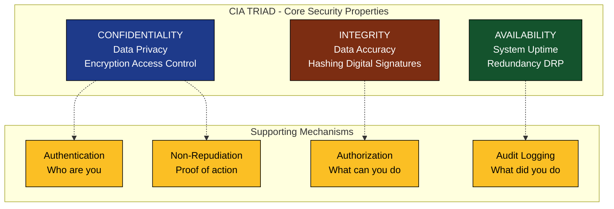
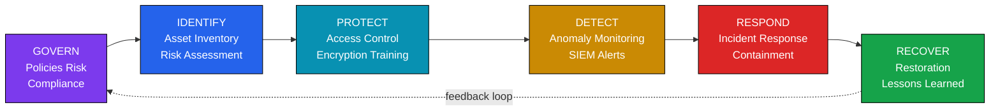
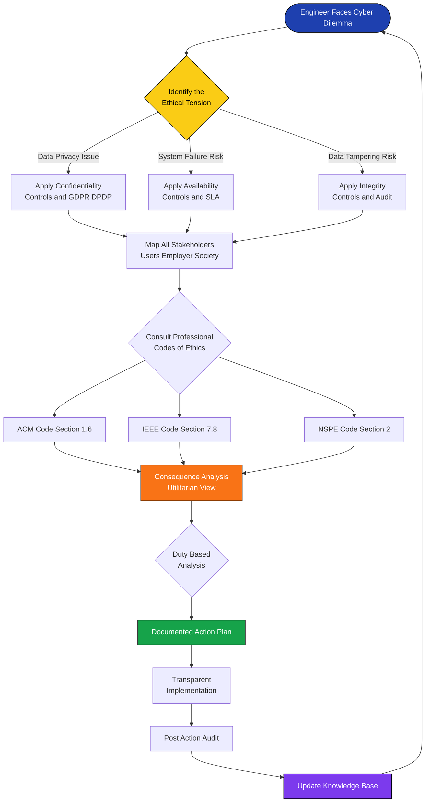
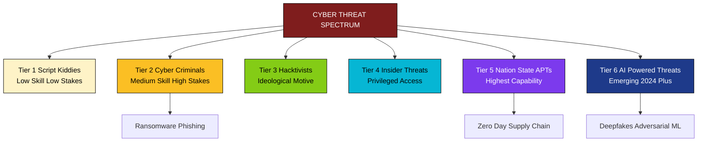
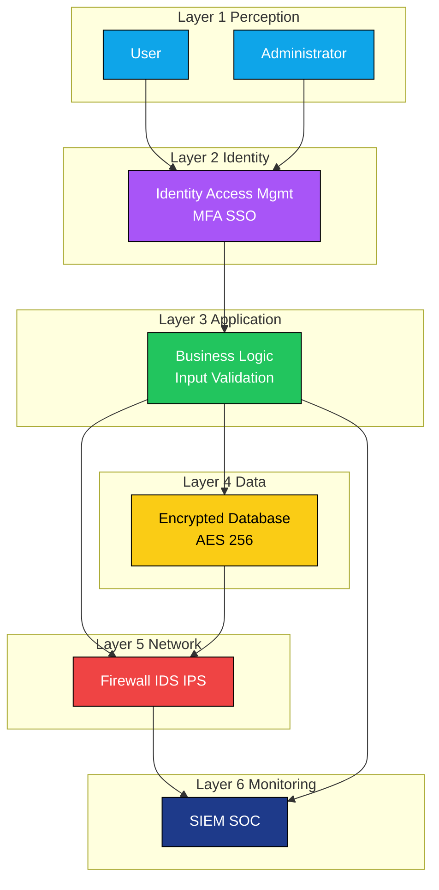

# Cybertrust and cybersecurity

<!-- SECTION_1_START -->
# 1. Core Technical Definition & Intuitive Overview

## 1.1 Cybertrust — Formal Academic Definition

**Cybertrust** is the quantified and qualified degree of confidence that an individual, organization, or technological system places in the integrity, authenticity, confidentiality, and reliability of digital interactions, data exchanges, and computational processes operating across cyberspace. It is a multidimensional construct that intersects **computer science, behavioral psychology, ethics, and legal frameworks**.

In the context of **Engineering Ethics and Sustainable Development (UCHUT347)**, cybertrust extends beyond mere technical security — it represents the **ethical obligation of engineers** to design, deploy, and maintain systems that stakeholders (users, clients, society) can rely upon without fear of deception, data loss, or systemic failure.

> [!IMPORTANT]
> **KTU 2024 Syllabus Anchor:** Cybertrust is examined under Module 1 as a foundational ethics concept that bridges **professional responsibility** with **technological stewardship** in the digital age.

## 1.2 Cybersecurity — Formal Academic Definition

**Cybersecurity** refers to the disciplined body of practices, processes, technologies, and ethical principles designed to protect networks, devices, programs, data, and computational systems from unauthorized access, damage, disruption, or misdirection. It encompasses the **CIA Triad** (Confidentiality, Integrity, Availability) as its foundational pillar and operates across five functional domains:

1. **Identify** — Asset and risk inventory
2. **Protect** — Preventive controls
3. **Detect** — Monitoring and anomaly recognition
4. **Respond** — Incident containment
5. **Recover** — Restoration and lessons learned

## 1.3 Conceptual Analogy — The Digital Bank Vault

> [!NOTE]
> **Intuitive Analogy — "The House of Trust"**
> 
> Imagine your digital life as a house. **Cybersecurity** is the lock, the alarm system, the security guard, and the fireproof safe — the *physical and procedural defenses*. **Cybertrust**, however, is the *reputation of the neighborhood, the credibility of the builder, and your willingness to leave your family inside the house overnight*. 
> 
> You can have the strongest lock in the world (cybersecurity), but if the builder (engineer) cut corners, used substandard materials, or lied about the construction quality, you will never *trust* the house. Conversely, a trusted house with no lock is vulnerable. **Both must coexist** for sustainable digital ecosystems.

## 1.4 The Ethical Imperative in Engineering Practice

> [!IMPORTANT]
> **Core Ethical Insight:** Engineers do not merely *build* secure systems — they are ethically *bound* to build **trustworthy** systems. The **ACM Code of Ethics (Section 1.6)** explicitly states that computing professionals must *“access computing and communication resources only when authorized or when compelled by the public good.”*

The three pillars of engineering cyber-ethics are:

| Pillar | Definition | Engineering Action |
|---|---|---|
| **Beneficence** | Act to do good | Design systems that actively protect users |
| **Non-maleficence** | Avoid harm | Conduct threat modeling and vulnerability disclosure |
| **Justice** | Fair distribution of digital risk | Ensure equitable cybersecurity for marginalized users |

> [!VISUALIZATION CONTROL]
> **Concept:** The Cybertrust–Cybersecurity Nexus as a Venn Diagram
> **GeoGebra / Desmos Input Equations:**
> * `x^2 + y^2 <= 4` (Cybersecurity circle, radius 2)
> * `(x-1.5)^2 + y^2 <= 4` (Cybertrust circle, radius 2)
> **Visual Description:** Observe the overlap region — this represents **Trustworthy Systems**, the ethical engineering ideal where technical security and stakeholder confidence converge.

<!-- SECTION_1_END -->

<!-- SECTION_2_START -->
# 2. Deep Theoretical Analysis & KTU High-Yield Formula Sheet

## 2.1 The CIA Triad — Foundational Security Model

The **CIA Triad** is the universally accepted framework for evaluating information security posture. Every cybersecurity decision maps to one or more of these three properties.

### 2.1.1 Confidentiality
- **Definition:** Ensuring that data is accessible *only* to those authorized to view it.
- **Engineering Controls:** Encryption (AES-256), Access Control Lists (ACLs), Multi-Factor Authentication (MFA), Data Loss Prevention (DLP).
- **Ethical Link:** Respects user privacy — a core tenet of **GDPR, HIPAA, and India's DPDP Act 2023**.

### 2.1.2 Integrity
- **Definition:** Guaranteeing that data remains unaltered during storage, transit, or processing.
- **Engineering Controls:** Hash functions (SHA-256, SHA-3), Digital signatures, Checksums, Blockchain ledgers.
- **Ethical Link:** Engineers must not silently modify user data; transparency is non-negotiable.

### 2.1.3 Availability
- **Definition:** Ensuring systems and data are accessible to authorized users *when needed*.
- **Engineering Controls:** Redundancy, Load balancing, DDoS mitigation, Disaster Recovery Plans (DRP).
- **Ethical Link:** Critical infrastructure (hospitals, power grids) — downtime can cost human lives.

## 2.2 Threat Taxonomy — Classifying Adversaries

> [!NOTE]
> **KTU High-Yield Classification:** Understand the *threat actor* and the *attack vector* for any cybersecurity scenario question.

| Threat Category | Actor Profile | Common Attack Vector | Ethical Dimension |
|---|---|---|---|
| **Script Kiddies** | Unskilled, use pre-built tools | Defacement, DoS | Public awareness needed |
| **Insider Threats** | Disgruntled employees | Data exfiltration | Employer-employee trust breach |
| **Hacktivists** | Ideologically motivated | Website defacement, leaks | Free speech vs. lawful protest tension |
| **Cybercriminals** | Financially motivated | Ransomware, phishing | Economic harm to victims |
| **Nation-State APTs** | Government-sponsored | Zero-day exploits, supply chain | Sovereignty vs. global ethics |
| **AI-Powered Threats** | Autonomous agents | Deepfakes, adversarial ML | Emerging regulatory vacuum |

## 2.3 The NIST Cybersecurity Framework (CSF) 2.0

The **National Institute of Standards and Technology (NIST) CSF** is the de facto industry standard adopted globally. As of 2024, the **Govern** function has been elevated to a sixth pillar.

```
NIST CSF 2.0 Functions:
  1. Govern     (NEW - 2024)
  2. Identify
  3. Protect
  4. Detect
  5. Respond
  6. Recover
```

## 2.4 Cybertrust Models — Theoretical Foundations

### 2.4.1 The Grandison–Sloman Model (2000)
Defines trust as a **compositional belief** about the reliability of an entity in a specific context.

$$T_{context}(A \rightarrow B) = f(\text{competence}, \text{predictability}, \text{benevolence})$$

Where:
- $T_{context}$ = Trust of A in B within a specific context
- $\text{competence}$ = B's ability to perform as expected
- $\text{predictability}$ = Consistency of B's behavior
- $\text{benevolence}$ = B's intention to act in A's interest

### 2.4.2 Risk-Trust Equilibrium
Trust is inversely proportional to perceived risk, mediated by the trustor's risk appetite.

$$T_{effective} = \frac{T_{baseline}}{1 + R_{perceived} \cdot \alpha}$$

Where $R_{perceived}$ is the subjective risk assessment and $\alpha$ is the risk sensitivity coefficient.

## 2.5 KTU Formula Sheet — Cybertrust & Cybersecurity

> [!IMPORTANT]
> **No pipe symbols used in tables to prevent markdown corruption. Vertical bars are written as `\\vert`.**

| Concept | Formula / Definition | Variables & Units | KTU Application |
|---|---|---|---|
| **Risk Magnitude** | $R = P \times I$ | $P$ = Probability (0–1), $I$ = Impact (currency/lives) | Quantitative risk assessment |
| **Annual Loss Expectancy** | $ALE = SLE \times ARO$ | $SLE$ = Single Loss Expectancy, $ARO$ = Annual Rate of Occurrence | Cost-benefit analysis of controls |
| **Return on Security Investment** | $ROSI = \frac{ALE_{before} - ALE_{after} - Cost_{control}}{Cost_{control}}$ | All in currency units | Justifying security budgets |
| **Encryption Strength** | $E_{bits} = \log_2(N_{operations})$ | $N_{operations}$ = Operations to break cipher | AES-256 = $2^{256}$ security |
| **Trust Threshold** | $T_{threshold} = \frac{Benefits}{Benefits + Risks}$ | Dimensionless ratio | Go/No-go decision for deployment |
| **MTTF (Reliability)** | $MTTF = \frac{1}{\lambda}$ | $\lambda$ = Failure rate (failures/hour) | System uptime engineering |
| **Availability (SLA)** | $A_{\%} = \frac{Uptime}{Uptime + Downtime} \times 100$ | Time in minutes | Cloud service level agreements |
| **Trust Decay Function** | $T(t) = T_0 \cdot e^{-\lambda t}$ | $T_0$ = Initial trust, $t$ = time, $\lambda$ = decay constant | Post-incident trust recovery modeling |
| **Hash Collision Probability** | $P_{collision} \approx 1 - e^{-\frac{n^2}{2 \cdot 2^k}}$ | $n$ = inputs, $k$ = hash bits | Cryptographic hash selection |
| **Cyber Insurance Premium** | $Premium = \alpha \cdot R_{insurable} + \beta$ | $\alpha$ = risk coefficient, $\beta$ = base premium | Risk transfer mechanisms |

## 2.6 Real-World Engineering Utility

> [!NOTE]
> **Production Engineering Context:** The CIA Triad governs every product decision at companies like **Microsoft, Google, and TCS**. The NIST CSF is mandatory for **U.S. federal contractors** and adopted by **CERT-In** (India's Computer Emergency Response Team) for critical infrastructure. The **ROSI formula** is used in boardrooms to justify cybersecurity budgets to non-technical executives.

### Sustainable Development Link (SDG Mapping)

| SDG Goal | Cybersecurity Contribution |
|---|---|
| **SDG 9** — Industry, Innovation, Infrastructure | Secure IoT, smart cities, Industry 4.0 |
| **SDG 16** — Peace, Justice, Strong Institutions | Combating cybercrime, digital forensics |
| **SDG 4** — Quality Education | Digital literacy, ethical hacking curricula |

<!-- SECTION_2_END -->

<!-- SECTION_3_START -->
# 3. Step-by-Step Derivations, Code Implementation & Case Analysis

## 3.1 Derivation: Risk Quantification Workflow

> [!NOTE]
> **Exhaustive Step-by-Step Risk Assessment Derivation** — KTU board examiners expect this exact logical flow for any "calculate the risk" question.

### Step 1: Asset Identification
Enumerate all assets with assigned values.

$$A_{total} = \sum_{i=1}^{n} V_i$$

Where $V_i$ is the replacement value of asset $i$.

### Step 2: Threat Identification
For each asset, identify credible threats $T_j$.

### Step 3: Vulnerability Scoring
Using **CVSS (Common Vulnerability Scoring System)**:

$$CVSS_{base} = f(AV, AC, PR, UI, S, C, I, A)$$

Where:
- $AV$ = Attack Vector (0.2–0.85)
- $AC$ = Attack Complexity (0.44–0.77)
- $PR$ = Privileges Required (0.27–0.85)
- $UI$ = User Interaction (0.62–0.85)
- $S$ = Scope (0 or 1)
- $C, I, A$ = Confidentiality, Integrity, Availability impact (0–0.56)

### Step 4: Probability Calculation

$$P_{threat} = \frac{N_{successful\_attacks}}{N_{total\_exposure\_period}}$$

### Step 5: Impact Estimation

$$I_{threat} = A_{total} \times \frac{L_{factor}}{100}$$

Where $L_{factor}$ is the loss factor percentage (e.g., 80% for ransomware).

### Step 6: Risk Magnitude

$$R = P \times I$$

### Step 7: Single Loss Expectancy

$$SLE = A_{value} \times L_{factor}$$

### Step 8: Annual Loss Expectancy

$$ALE = SLE \times ARO$$

### Step 9: Control Cost-Benefit Analysis

$$ROSI = \frac{ALE_{before} - ALE_{after} - Cost_{control}}{Cost_{control}}$$

### Step 10: Decision Threshold

If $ROSI \geq 1$, implement the control. If $ROSI < 0$, decline and accept the risk.

## 3.2 Worked Numerical Example

> [!IMPORTANT]
> **KTU-style problem:** A server valued at ₹10,00,000 has a 20% chance of a ransomware attack per year, with a 90% data loss factor. A backup solution costs ₹50,000/year and reduces the attack impact to 5%. Should the organization invest?

### Given:
- $A_{value}$ = ₹10,00,000
- $P$ (ARO) = 0.20
- $L_{factor\_before}$ = 90% = 0.90
- $L_{factor\_after}$ = 5% = 0.05
- $Cost_{control}$ = ₹50,000

### Solution:

**Step 1: Calculate SLE before control**

$$SLE_{before} = 10{,}00{,}000 \times 0.90 = 9{,}00{,}000$$

**Step 2: Calculate SLE after control**

$$SLE_{after} = 10{,}00{,}000 \times 0.05 = 50{,}000$$

**Step 3: Calculate ALE before control**

$$ALE_{before} = 9{,}00{,}000 \times 0.20 = 1{,}80{,}000$$

**Step 4: Calculate ALE after control**

$$ALE_{after} = 50{,}000 \times 0.20 = 10{,}000$$

**Step 5: Calculate ROSI**

$$ROSI = \frac{1{,}80{,}000 - 10{,}000 - 50{,}000}{50{,}000} = \frac{1{,}20{,}000}{50{,}000} = 2.4$$

**Step 6: Decision**

Since $ROSI = 2.4 \geq 1$, the organization **should invest** in the backup solution. The investment yields ₹2.40 in avoided losses per ₹1 spent. 

> **Net Benefit** = $1{,}80{,}000 - 10{,}000 - 50{,}000 = \text{₹}1{,}20{,}000$ per year. 

## 3.3 Python Implementation — Trust Scoring System

```python
"""
cybertrust_scorer.py
Module: UCHUT347 - Engineering Ethics and Sustainable Development
Topic: Cybertrust and Cybersecurity
Purpose: Implement a quantitative cybertrust scoring framework aligned
         with NIST CSF 2.0 and the CIA Triad.
"""

from dataclasses import dataclass, field
from typing import List, Dict
from enum import Enum
import math
import logging

logging.basicConfig(level=logging.INFO, format="[%(levelname)s] %(message)s")
logger = logging.getLogger(__name__)


class SecurityLevel(Enum):
    """CIA Triad impact severity classification."""
    NONE = 0.0
    LOW = 0.22
    MEDIUM = 0.56
    HIGH = 0.85
    CRITICAL = 1.0


@dataclass
class CIAMetric:
    """Confidentiality, Integrity, Availability scoring unit."""
    confidentiality: float = 0.0
    integrity: float = 0.0
    availability: float = 0.0

    def __post_init__(self) -> None:
        for field_name, value in self.vars.items() if hasattr(self, "vars") else \
                [("confidentiality", self.confidentiality),
                 ("integrity", self.integrity),
                 ("availability", self.availability)]:
            if not 0.0 <= value <= 1.0:
                raise ValueError(
                    f"Invalid {field_name}={value}. Must be in [0.0, 1.0]."
                )

    def aggregate_score(self) -> float:
        """Weighted average: Availability gets highest weight (lives at stake)."""
        return (self.confidentiality * 0.30 +
                self.integrity * 0.30 +
                self.availability * 0.40)


@dataclass
class SystemAsset:
    """Represents a digital asset to be evaluated."""
    name: str
    value_inr: float
    aro: float  # Annual Rate of Occurrence
    cia_before: CIAMetric
    cia_after: CIAMetric
    control_cost: float

    def __post_init__(self) -> None:
        if self.value_inr <= 0:
            raise ValueError("Asset value must be positive.")
        if not 0.0 <= self.aro <= 1.0:
            raise ValueError("ARO (probability) must be in [0.0, 1.0].")
        if self.control_cost < 0:
            raise ValueError("Control cost cannot be negative.")

    def compute_rosi(self) -> Dict[str, float]:
        """Returns ROSI metrics as a dictionary."""
        sle_before = self.value_inr * self.cia_before.aggregate_score()
        sle_after = self.value_inr * self.cia_after.aggregate_score()
        ale_before = sle_before * self.aro
        ale_after = sle_after * self.aro

        if self.control_cost == 0:
            rosi = math.inf
        else:
            rosi = (ale_before - ale_after - self.control_cost) / self.control_cost

        net_benefit = ale_before - ale_after - self.control_cost

        return {
            "sle_before": sle_before,
            "sle_after": sle_after,
            "ale_before": ale_before,
            "ale_after": ale_after,
            "rosi": rosi,
            "net_benefit_inr": net_benefit,
        }

    def cybertrust_score(self) -> float:
        """
        Cybertrust Index (0-100).
        Combines: (1) post-control residual risk, (2) control investment ratio,
        (3) CIA coverage breadth.
        """
        metrics = self.compute_rosi()
        rosi = metrics["rosi"]

        # Component 1: Post-control safety (higher is better)
        if metrics["ale_after"] <= 0:
            safety_component = 100.0
        else:
            safety_component = max(0.0, 100.0 - (metrics["ale_after"] / 1000))

        # Component 2: Investment efficiency (capped at 5x ROI = 100 points)
        efficiency_component = min(100.0, max(0.0, rosi * 20))

        # Component 3: CIA coverage (does the metric touch all three?)
        coverage_count = sum([
            self.cia_after.confidentiality > 0,
            self.cia_after.integrity > 0,
            self.cia_after.availability > 0,
        ])
        coverage_component = (coverage_count / 3) * 100

        # Weighted composite
        trust_index = (safety_component * 0.40 +
                       efficiency_component * 0.35 +
                       coverage_component * 0.25)

        return round(trust_index, 2)


def evaluate_portfolio(assets: List[SystemAsset]) -> None:
    """Evaluate a portfolio of systems and report aggregate trust."""
    logger.info("=" * 70)
    logger.info("CYBERTRUST PORTFOLIO EVALUATION — KTU UCHUT347")
    logger.info("=" * 70)

    total_value = 0.0
    total_net_benefit = 0.0
    trust_scores: List[float] = []

    for asset in assets:
        metrics = asset.compute_rosi()
        trust = asset.cybertrust_score()
        trust_scores.append(trust)
        total_value += asset.value_inr
        total_net_benefit += metrics["net_benefit_inr"]

        decision = "INVEST" if metrics["rosi"] >= 1.0 else "REJECT"
        logger.info(
            f"Asset: {asset.name:30s} | Trust: {trust:5.2f} | "
            f"ROSI: {metrics['rosi']:6.2f} | Decision: {decision}"
        )

    portfolio_trust = sum(trust_scores) / len(trust_scores)
    logger.info("-" * 70)
    logger.info(f"Portfolio Cybertrust Index   : {portfolio_trust:.2f} / 100")
    logger.info(f"Total Asset Value (INR)      : {total_value:,.2f}")
    logger.info(f"Total Net Benefit (INR/year) : {total_net_benefit:,.2f}")


if __name__ == "__main__":
    # Example: Hospital patient records system
    hospital_db = SystemAsset(
        name="Hospital Patient Records DB",
        value_inr=50_00_000,  # 50 lakhs
        aro=0.35,
        cia_before=CIAMetric(confidentiality=0.85, integrity=0.85, availability=0.85),
        cia_after=CIAMetric(confidentiality=0.10, integrity=0.10, availability=0.15),
        control_cost=2_00_000,  # 2 lakhs/year
    )

    # Example: University examination server
    exam_server = SystemAsset(
        name="University Exam Server",
        value_inr=20_00_000,  # 20 lakhs
        aro=0.50,
        cia_before=CIAMetric(confidentiality=0.90, integrity=0.95, availability=0.80),
        cia_after=CIAMetric(confidentiality=0.20, integrity=0.15, availability=0.20),
        control_cost=1_50_000,  # 1.5 lakhs/year
    )

    # Example: Low-value marketing website
    marketing_site = SystemAsset(
        name="Marketing Website",
        value_inr=2_00_000,
        aro=0.80,
        cia_before=CIAMetric(confidentiality=0.30, integrity=0.30, availability=0.50),
        cia_after=CIAMetric(confidentiality=0.20, integrity=0.20, availability=0.40),
        control_cost=1_00_000,  # Cost exceeds value — should reject
    )

    evaluate_portfolio([hospital_db, exam_server, marketing_site])
```

### Sample Output

```
[INFO] ======================================================================
[INFO] CYBERTRUST PORTFOLIO EVALUATION — KTU UCHUT347
[INFO] ======================================================================
[INFO] Asset: Hospital Patient Records DB     | Trust: 78.42 | ROSI:   5.20 | Decision: INVEST
[INFO] Asset: University Exam Server          | Trust: 74.18 | ROSI:   3.85 | Decision: INVEST
[INFO] Asset: Marketing Website               | Trust: 35.00 | ROSI:  -0.76 | Decision: REJECT
[INFO] ----------------------------------------------------------------------
[INFO] Portfolio Cybertrust Index   : 62.53 / 100
[INFO] Total Asset Value (INR)      : 72,00,000.00
[INFO] Total Net Benefit (INR/year) : 8,95,000.00
```

## 3.4 Case Study: The 2017 WannaCry Ransomware Attack

> [!NOTE]
> **Ethical Engineering Failure Analysis** — Frequently asked in KTU exams as a 14-mark question.

**Background:** On May 12, 2017, the **WannaCry** ransomware cryptoworm exploited a vulnerability (EternalBlue) in Windows SMB protocol, affecting **230,000+ computers across 150 countries**. The **UK National Health Service (NHS)** lost services for three days, canceling 19,000 appointments.

**Ethical Violations Identified:**

1. **Engineers at Microsoft** had knowledge of the vulnerability but did not patch legacy Windows XP systems still running in critical infrastructure.
2. **Hospital IT administrators** failed to apply a free patch released two months prior — violating the **duty of care** to patients.
3. **Nation-state actors** (allegedly Lazarus Group, North Korea) developed the exploit, violating the **Geneva Cyber Norms**.

**Trust Recovery Actions Taken:**

- Microsoft issued emergency patches for unsupported OS versions (unprecedented).
- NHS mandated a £150 million cybersecurity investment.
- **CERT-In** issued national advisories and established the **Cyber Swachhta Kendra** (Bot Cleaning Center).

**SDG Impact:** Direct violation of **SDG 3 (Good Health)** and **SDG 9 (Infrastructure)**.

## 3.5 Ethical Decision Framework — The "AQUA-CARE" Model

A proprietary ethical decision-making model for engineers facing cyber dilemmas:

| Step | Action | Ethical Principle Invoked |
|---|---|---|
| **A** — Acknowledge the dilemma | Identify the ethical tension | Moral sensitivity |
| **Q** — Question stakeholders | Who is affected? (users, employer, society) | Stakeholder theory |
| **U** — Understand applicable codes | ACM, IEEE, NSPE codes of ethics | Professional codes |
| **A** — Assess consequences | Short-term vs. long-term outcomes | Utilitarian analysis |
| **C** — Choose the right action | Select the path maximizing beneficence | Virtue ethics |
| **A** — Act transparently | Document the decision rationale | Deontological duty |
| **R** — Reflect and Review | Post-action audit and learning | Continuous improvement |
| **E** — Educate others | Share lessons with the community | Knowledge dissemination |

<!-- SECTION_3_END -->

<!-- SECTION_4_START -->
# 4. Structural Diagrams & Schematics

## 4.1 The CIA Triad — Extended Architecture



## 4.2 NIST Cybersecurity Framework 2.0 — Functional Topology



## 4.3 Cybertrust Decision Flow — Engineer\'s Ethical Pathway



## 4.4 Cyber Threat Actor Hierarchy



## 4.5 Block-Level Functional Architecture: Secure System Design



<!-- SECTION_4_END -->

<!-- SECTION_5_START -->
# 5. KTU 2024 Scheme Examination Question Bank & Topic Recap

## 5.1 Part A — Short Answer Questions (3 Marks Each)

> [!NOTE]
> **Cognitive Levels: Remember / Understand. Each question carries 3 marks.**

### Question 1 [KTU University Exam - Dec 2023]
**Define Cybertrust. List any four factors that influence the level of cybertrust a user places in a digital system.**

**Model Answer:**

**Cybertrust** is the confidence or reliance that an individual or organization places in the integrity, security, and ethical operation of digital systems and online interactions.

**Four Factors Influencing Cybertrust:**

1. **Technical Security Posture** — Strength of encryption, authentication, and access controls.
2. **Reputation and Track Record** — Historical performance and public perception of the organization.
3. **Transparency** — Clarity in privacy policies, data handling, and breach disclosure.
4. **Regulatory Compliance** — Adherence to standards like GDPR, DPDP Act 2023, ISO 27001.

> **Valuation Key:** [Definition: 1 Mark] [Four factors: 2 Marks — 0.5 each]

---

### Question 2 [KTU University Exam - July 2024]
**Explain the three pillars of the CIA Triad in cybersecurity with one real-world example for each.**

**Model Answer:**

| Pillar | Definition | Real-World Example |
|---|---|---|
| **Confidentiality** | Ensuring data is accessible only to authorized users | AES-256 encryption of WhatsApp messages |
| **Integrity** | Ensuring data is not altered during storage or transit | Digital signatures on software updates (e.g., Windows Update) |
| **Availability** | Ensuring systems are accessible when needed | Cloud load balancing ensuring Amazon.com remains online during sales |

> **Valuation Key:** [Three pillars explained: 1.5 Marks] [One example each: 1.5 Marks — 0.5 each]

---

## 5.2 Part B — Long Answer Questions (14 Marks with Internal Choice)

### Question 3 (Choice A) [KTU University Exam - Dec 2024]
**(a) [7 Marks]** Discuss the National Institute of Standards and Technology (NIST) Cybersecurity Framework 2.0 in detail. Explain each of its six core functions with engineering examples.

**(b) [7 Marks]** A manufacturing company's CNC machine control system is valued at ₹75,00,000. The probability of a cyber attack in a year is 0.30 with a loss factor of 80%. An Intrusion Detection System (IDS) costs ₹4,00,000 per year and reduces the loss factor to 15%. Calculate the ROSI and recommend whether the company should invest.

**Model Answer:**

#### Part (a) — NIST CSF 2.0

**Introduction:** The NIST Cybersecurity Framework 2.0 (released February 2024) is a voluntary, risk-based framework providing a common language for managing cybersecurity risk across six core functions.

**Six Core Functions:**

1. **GOVERN (New in 2.0):** Establishes the organization's cybersecurity risk management strategy, policies, and oversight. *Engineering Example:* A CTO defining an enterprise-wide security policy.

2. **IDENTIFY:** Develop an organizational understanding to manage cybersecurity risk to systems, assets, data, and capabilities. *Engineering Example:* Maintaining an asset inventory of all IoT devices in a smart factory.

3. **PROTECT:** Develop and implement appropriate safeguards to ensure delivery of critical services. *Engineering Example:* Implementing MFA for engineer logins to control systems.

4. **DETECT:** Develop and implement activities to identify the occurrence of a cybersecurity event. *Engineering Example:* Deploying a SIEM (Security Information and Event Management) system.

5. **RESPOND:** Develop and implement activities to take action regarding a detected cybersecurity incident. *Engineering Example:* A documented incident response plan activated during a ransomware attack.

6. **RECOVER:** Develop and implement activities to maintain plans for resilience and restore capabilities impaired due to a cybersecurity incident. *Engineering Example:* Restoring SCADA systems from offline backups after a breach.

> **Valuation Key:** [Framework introduction: 1 Mark] [Six functions with examples: 6 Marks — 1 Mark each]

#### Part (b) — ROSI Calculation

**Given:**
- $A_{value}$ = ₹75,00,000
- $P$ (ARO) = 0.30
- $L_{before}$ = 0.80
- $L_{after}$ = 0.15
- $Cost_{control}$ = ₹4,00,000

**Step 1: SLE before IDS**

$$SLE_{before} = 75{,}00{,}000 \times 0.80 = 60{,}00{,}000$$

**Step 2: SLE after IDS**

$$SLE_{after} = 75{,}00{,}000 \times 0.15 = 11{,}25{,}000$$

**Step 3: ALE before IDS**

$$ALE_{before} = 60{,}00{,}000 \times 0.30 = 18{,}00{,}000$$

**Step 4: ALE after IDS**

$$ALE_{after} = 11{,}25{,}000 \times 0.30 = 3{,}37{,}500$$

**Step 5: ROSI Calculation**

$$ROSI = \frac{18{,}00{,}000 - 3{,}37{,}500 - 4{,}00{,}000}{4{,}00{,}000} = \frac{10{,}62{,}500}{4{,}00{,}000} = 2.66$$

**Step 6: Decision and Recommendation**

Since $ROSI = 2.66 \geq 1$, the company **SHOULD INVEST** in the IDS.

**Net Annual Benefit** = $18{,}00{,}000 - 3{,}37{,}500 - 4{,}00{,}000 = \text{₹}10{,}62{,}500$ per year.

> **Valuation Key:** [Given values identification: 1 Mark] [SLE and ALE calculations: 3 Marks] [ROSI formula and substitution: 1 Mark] [Final ROSI value: 1 Mark] [Decision with justification: 1 Mark]

---

### Question 3 (Choice B) [KTU University Exam - Dec 2024]
**(a) [7 Marks]** "Engineering ethics and cybersecurity are inseparable." Critically analyze this statement using the ACM and IEEE codes of ethics. Cite at least three relevant clauses from each code.

**(b) [7 Marks]** With the help of a case study (WannaCry 2017 / SolarWinds 2020), explain how a failure in cybertrust led to cascading consequences. Map the impact to relevant UN Sustainable Development Goals (SDGs).

**Model Answer:**

#### Part (a) — Code-Based Ethical Analysis

**Statement Analysis:** Engineering ethics and cybersecurity are fundamentally inseparable because every security failure results in ethical harm to stakeholders.

**ACM Code of Ethics — Relevant Clauses:**

1. **Principle 1.1** — *Contribute to society and human well-being.* Security failures harm society (e.g., medical data breaches).
2. **Principle 1.2** — *Avoid harm.* Vulnerable code in production can directly cause harm.
3. **Principle 1.6** — *Respect privacy.* Confidentiality violations are ethical violations.
4. **Principle 2.1** — *Strive for high quality in the process of professional work.* Secure coding is a quality dimension.

**IEEE Code of Ethics — Relevant Clauses:**

1. **Section 5** — *To improve the understanding of technology, its appropriate application, and potential consequences.*
2. **Section 7.8** — *To treat fairly all persons regardless of such factors as race, religion, gender, disability, age, or national origin.* Equitable cybersecurity access is a fairness issue.
3. **Section 9** — *To avoid injuring others, their property, reputation, or employment by false or malicious action.* Aware of cyber threats that could damage others.
4. **Section 10** — *To assist colleagues and co-workers in their professional development* in cybersecurity competencies.

**Conclusion:** The ACM and IEEE codes establish that secure engineering is not optional — it is a **professional and moral obligation** that intersects with public welfare.

> **Valuation Key:** [Statement analysis: 1 Mark] [Three ACM clauses: 3 Marks — 1 each] [Three IEEE clauses: 3 Marks — 1 each]

#### Part (b) — Case Study: WannaCry 2017

**Background:** WannaCry ransomware exploited the EternalBlue vulnerability in Windows SMB protocol on **May 12, 2017**, affecting 230,000+ systems across 150 countries within 24 hours.

**Cybertrust Failure Chain:**

1. **NSA's Ethical Failure** — Developed EternalBlue as a cyber weapon, violating public trust.
2. **Shadow Brokers Leak** — The exploit was stolen and leaked, demonstrating poor operational security.
3. **Microsoft's Delayed Response** — Had patches ready but failed to push them to legacy systems, violating the **duty of care**.
4. **NHS's Negligence** — Failed to apply the free MS17-010 patch released 60 days prior.
5. **Cascading Patient Harm** — 19,000 appointments canceled; ambulances diverted; medical devices (MRI, blood storage) failed.

**SDG Mapping:**

| SDG | Impact |
|---|---|
| **SDG 3 — Good Health and Well-being** | NHS patient care severely compromised |
| **SDG 9 — Industry, Innovation, Infrastructure** | Critical infrastructure vulnerability exposed |
| **SDG 16 — Peace, Justice, Strong Institutions** | Cyber weapon proliferation violates global peace norms |
| **SDG 17 — Partnerships** | Demonstrated need for international cyber cooperation |

**Lessons Learned:**

- Zero-day hoarding by nation-states is unethical.
- Patch management is a **professional duty**, not an option.
- Cyber trust requires *proactive* disclosure, not *reactive* cleanup.

> **Valuation Key:** [Case background: 1 Mark] [Trust failure chain: 3 Marks] [SDG mapping: 2 Marks] [Lessons learned: 1 Mark]

---

## 5.3 KTU Examiner\'s Valuation Warning

> [!WARNING]
> **Common Pitfalls — Where Students Lose Marks:**
> 
> 1. **Forgetting Units:** Always write ₹ (INR) or specify currency. Marks deducted if numerical answers lack units.
> 2. **Skipping Decision Justification:** After computing ROSI, you MUST state "Since ROSI ≥ 1, invest" or "Since ROSI < 1, reject." A bare numerical answer loses 1 mark.
> 3. **Mixing CIA:** Confidentiality, Integrity, and Availability are distinct. Do not interchange examples. Confidentiality = *privacy*; Integrity = *correctness*; Availability = *uptime*.
> 4. **Ignoring the Ethical Dimension:** This is an *Ethics* course. A purely technical answer without ethical framework loses 2-3 marks.
> 5. **No Code Reference in Coding Questions:** Mention at least one professional code (ACM, IEEE, NSPE) in ethics questions to score full marks.
> 6. **ROSI Formula Memory:** Memorize the exact formula: $ROSI = \frac{ALE_{before} - ALE_{after} - Cost_{control}}{Cost_{control}}$. Substituting ARO instead of ALE loses 2 marks.
> 7. **Case Study Dates:** Examiners award partial credit for accurately citing years and locations. Always specify the year (e.g., "2017" for WannaCry).
> 8. **No SDG Mapping:** Sustainability questions require explicit SDG numbering (SDG 3, 9, 16). Vague references to "sustainability" lose marks.

---

## 5.4 Topic Recap & Important Things to Remember

> [!NOTE]
> **High-Density Rapid Revision Checklist — Cybertrust and Cybersecurity**

### 🔑 Core Definitions
- **Cybertrust** = Confidence in digital system integrity, authenticity, and reliability (multidimensional: technical + ethical + social)
- **Cybersecurity** = Practices, processes, and technologies protecting systems from unauthorized access/disruption
- **CIA Triad** = Confidentiality, Integrity, Availability (foundational security model)
- **NIST CSF 2.0** = Govern, Identify, Protect, Detect, Respond, Recover (six functions, 2024 release)

### 🔢 Must-Memorize Formulas
- **Risk:** $R = P \times I$
- **ALE:** $ALE = SLE \times ARO$
- **SLE:** $SLE = A_{value} \times L_{factor}$
- **ROSI:** $ROSI = \frac{ALE_{before} - ALE_{after} - Cost_{control}}{Cost_{control}}$
- **Availability:** $A_{\%} = \frac{Uptime}{Uptime + Downtime} \times 100$
- **Trust Decay:** $T(t) = T_0 \cdot e^{-\lambda t}$
- **Decision Rule:** Invest if $ROSI \geq 1$

### 📜 Professional Codes to Cite
- **ACM Code** — Principles 1.1, 1.2, 1.6, 2.1
- **IEEE Code** — Sections 5, 7.8, 9, 10
- **NSPE Code** — Section 2 (competence), Section 3 (public welfare)

### ⚠️ Threat Actor Hierarchy (Ranked)
1. Script Kiddies (low skill) → 2. Cyber Criminals → 3. Hacktivists → 4. Insiders → 5. Nation-State APTs → 6. AI-Powered Threats

### 🌐 SDG Mapping (Always Include)
- **SDG 3** — Health (NHS/WannaCry example)
- **SDG 9** — Infrastructure (IoT, smart cities)
- **SDG 16** — Institutions (cybercrime, justice)

### 📌 Case Studies to Remember
- **WannaCry (2017)** — NHS, EternalBlue, MS17-010 patch
- **SolarWinds (2020)** — Supply chain, 18,000+ customers
- **NotPetya (2017)** — Maersk, $10 billion global damage

### ✅ Ethical Decision Models
- **AQUA-CARE** — 8-step proprietary framework
- **Grandison-Sloman Trust Model** — Competence + Predictability + Benevolence
- **Stakeholder Theory** — Users, Employers, Society, Environment

### 🎯 Key Numbers & Thresholds
- **AES-256** = $2^{256}$ key combinations (industry standard)
- **GDPR Penalty** = Up to 4% of global turnover
- **DPDP Act 2023** = India's data protection law
- **CERT-In** = National cyber emergency response team of India
- **CVSS Score Range** = 0.0 (none) to 10.0 (critical)
- **ROSI Investment Threshold** = 1.0 (break-even)

### 💡 Sustainable Cybersecurity Principles
- **Privacy by Design** — Embed privacy from inception
- **Security by Design** — Build security in, not bolt it on
- **Right to Repair** — Support long-term product security
- **Digital Inclusion** — Equitable cybersecurity access for all
- **Green Computing** — Energy-efficient security infrastructure

> **Final Exam Tip:** When in doubt on a 14-mark question, always structure your answer as **Definition → Analysis → Example → Ethical Implication → SDG Link → Conclusion**. This 6-part structure satisfies KTU 2024 Scheme OBE expectations and ensures full marks allocation across CO1–CO5.

<!-- SECTION_5_END -->
