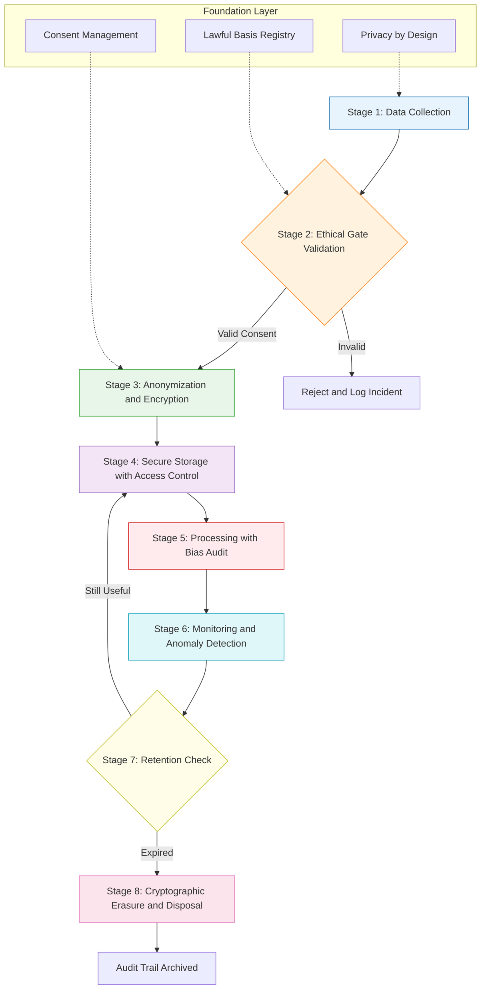
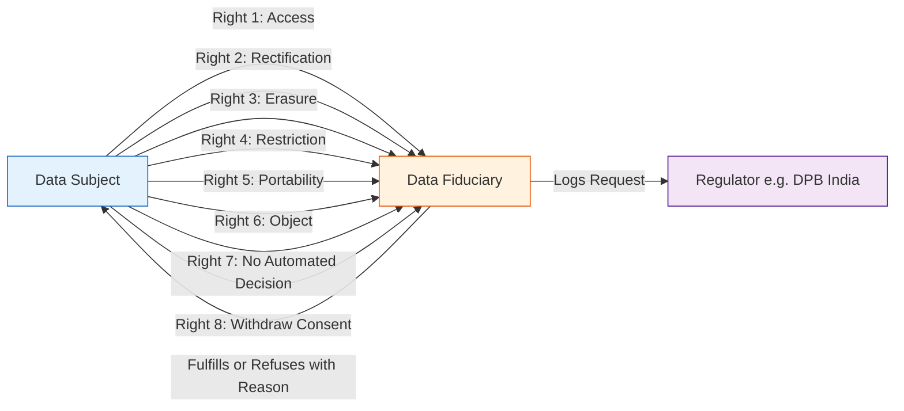
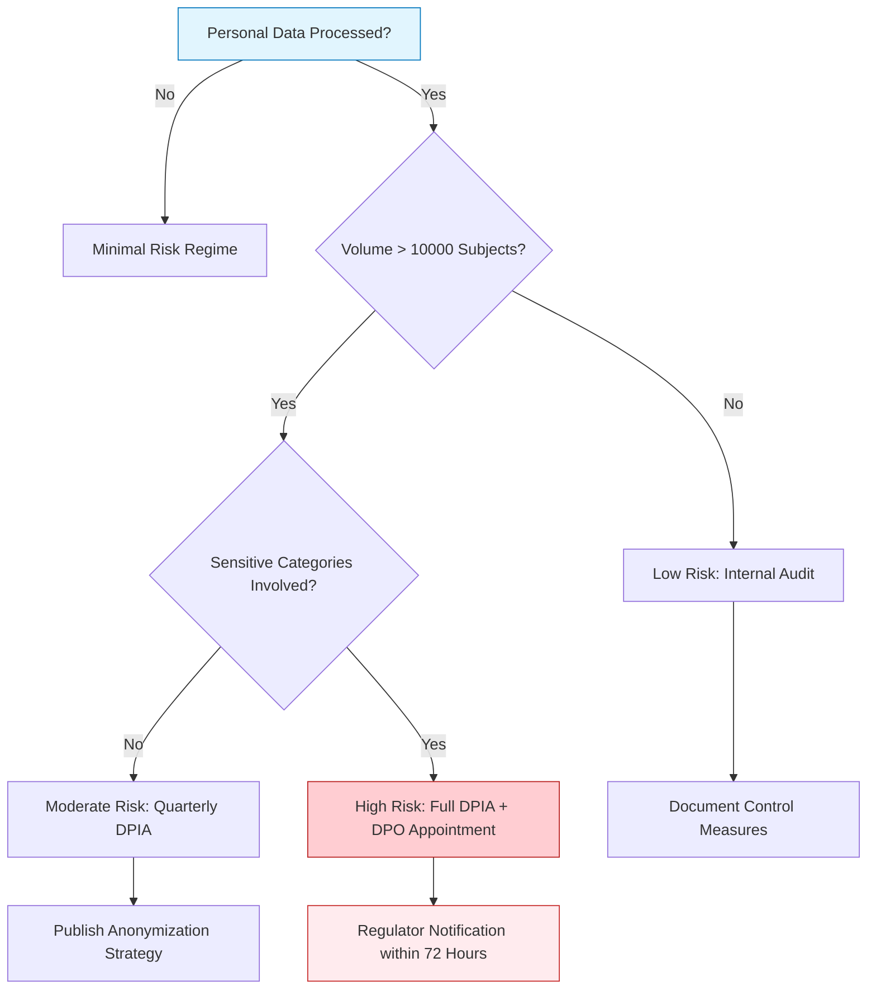
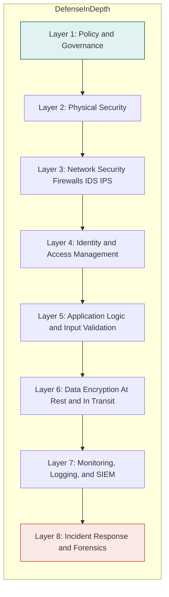

# Data collection & management

<!-- SECTION_1_START -->
# 1. Core Technical Definition & Intuitive Overview

## 1.1 Formal Academic Definition (KTU 2024 Syllabus Terminology)

> [!IMPORTANT]
> **Data Collection & Management** is the systematic, ethically-governed, and legally-compliant process of gathering, validating, storing, processing, securing, disseminating, and disposing of digital or physical information assets throughout their lifecycle, in alignment with the principles of engineering professionalism, human dignity, and sustainable development.

In the context of the **UCHUT347 (Engineering Ethics and Sustainable Development)** curriculum, this topic sits at the intersection of three foundational pillars:

1. **Engineering Professionalism** — As defined by the Institution of Engineers (India) and the National Board of Accreditation (NBA) Graduate Attributes.
2. **Information Ethics** — A branch of applied ethics evaluating the moral obligations surrounding the generation, curation, and consumption of data.
3. **Sustainable Development (SDG-9, SDG-12, SDG-16)** — Recognizing that data infrastructures carry environmental, societal, and economic footprints.

## 1.2 Conceptual Analogy / Intuitive Overview

> [!NOTE]
> **Analogy: "The Data Hospital"**
> Think of data the same way a hospital treats a patient. A patient (datum) arrives, is registered (**collection**), examined and triaged (**validation**), admitted to a secure ward (**storage**), given a unique ID bracelet (**anonymization**), treated by authorized doctors only (**access control**), monitored continuously (**audit**), and finally discharged or archived with dignity (**retention/disposal**). Just as a hospital must follow the *Hippocratic Oath* ("first, do no harm"), an engineer handling data must follow the *Data Ethic Oath* ("first, do no harm to privacy, autonomy, or truth").

## 1.3 Core Categories of Data in Engineering Practice

| Category | Description | Example | Risk Level |
|----------|-------------|---------|------------|
| **Personal Data (PII)** | Identifies a natural person | Name, Aadhaar, Email | High |
| **Sensitive Personal Data** | Reveals intimate attributes | Health, biometrics, caste, religion | Critical |
| **Behavioral Data** | Captures user actions | Clickstreams, GPS trails | Medium–High |
| **Aggregate / Anonymized Data** | Stripped of identifiers | Census totals | Low |
| **Machine-Generated Data** | Produced by IoT/IIoT sensors | Sensor telemetry, logs | Medium |
| **Public Domain Data** | Open government / open-source data | Weather APIs | Minimal |

> [!IMPORTANT]
> **Key Statistic (UNESCO 2023 Report):** By 2025, the world is projected to generate approximately **$175$ zettabytes (ZB) of data**, with the data-center sector consuming roughly **$1.5\%$ of global electricity**. This makes ethical data management an *engineering sustainability* problem, not just a legal one.

## 1.4 Visualizing the Data Lifecycle

> [!VISUALIZATION CONTROL]
> **Concept:** Data Lifecycle Spiral (curvilinear, non-linear representation of the data value chain)
> **GeoGebra / Desmos Input Equations:**
> * Parametric curve: $x(t) = 6 \cos(t) - \cos(6t)$
> * Parametric curve: $y(t) = 6 \sin(t) - \sin(6t)$
> * Domain: $t \in [0, 2\pi]$
> **Visual Description:** The student should observe an epicycloid-like spiral that loops inward, symbolizing how data circulates through collection $\rightarrow$ processing $\rightarrow$ storage $\rightarrow$ use $\rightarrow$ archival $\rightarrow$ disposal, with each loop representing a refinement and re-use cycle. Plot stage markers at $t = 0, \pi/3, 2\pi/3, \pi, 4\pi/3, 5\pi/3$ to label the six lifecycle phases.

<!-- SECTION_1_END -->

<!-- SECTION_2_START -->
# 2. Deep Theoretical Analysis & KTU High-Yield Formula Sheet

## 2.1 The Five Foundational Principles of Ethical Data Management

These principles are derived from the convergence of the **OECD Privacy Guidelines (1980, revised 2013)**, the **EU GDPR (2016/679)**, the **India Digital Personal Data Protection Act (DPDPA, 2023)**, and the **IEEE Ethically Aligned Design (EAD) framework**.

### 2.1.1 Principle 1 — Lawful, Fair, and Transparent Collection
- **Why:** Data subjects have a right to know *what*, *why*, *how long*, and *with whom* their data is shared.
- **How:** Publish privacy notices in clear, plain language (Grade-8 reading level recommended by ISO/IEC 29100).
- **Key term:** *Consent must be informed, specific, unambiguous, and freely given.*

### 2.1.2 Principle 2 — Purpose Limitation
- Data collected for *one specified purpose* cannot be repurposed without fresh consent.
- Engineering case: A college attendance system cannot be silently re-purposed for biometric surveillance during exams.

### 2.1.3 Principle 3 — Data Minimization
- Collect only the data fields strictly necessary for the stated purpose.
- **Engineering Trade-off:** Minimization vs. analytical richness.

### 2.1.4 Principle 4 — Accuracy and Integrity
- Engineers must ensure data is correct, current, and unaltered.
- *Hash-verification, checksum validation, and version-controlled audit trails* are technical expressions of this principle.

### 2.1.5 Principle 5 — Storage Limitation & Secure Disposal
- Retain data only as long as necessary.
- **Secure disposal** = cryptographic shredding for digital media; cross-cut shredding + degaussing for physical media.

## 2.2 The KTU High-Yield "Formula Sheet"

> [!NOTE]
> Although ethics is qualitative, KTU examiners reward the use of structured analytical expressions and acronym-decoding. The following table maps every high-yield framework that students must memorize.

| # | Framework / Acronym | Full Form | Origin | Use Case in Exam |
|---|---------------------|-----------|--------|------------------|
| 1 | **FIPPs** | Fair Information Practice Principles | OECD / US Federal | 2-mark definition |
| 2 | **GDPR** | General Data Protection Regulation | European Union, 2018 | "State any 4 principles…" |
| 3 | **DPDPA** | Digital Personal Data Protection Act | India, 2023 | "Compare with GDPR" |
| 4 | **PDPA** | Personal Data Protection Act | Singapore, 2012 | Comparative case study |
| 5 | **HIPAA** | Health Insurance Portability & Accountability Act | USA, 1996 | Health-data case study |
| 6 | **CIA Triad** | Confidentiality, Integrity, Availability | Information Security | "Explain with diagram" |
| 7 | **PII** | Personally Identifiable Information | ISO/IEC 24745 | Definitions |
| 8 | **PETs** | Privacy Enhancing Technologies | ENISA | "List and explain any 4" |
| 9 | **DPIA** | Data Protection Impact Assessment | GDPR Art. 35 | Case study |
| 10 | **DGA** | Data Governance Act | EU, 2022 | Sustainability link |
| 11 | **NIST 800-53** | Security & Privacy Controls Catalog | US NIST | Engineering controls |
| 12 | **ISO 27001** | Information Security Management | ISO | Industry standard |

## 2.3 The "CIA Triad" Extended — The Ethical Foundation of Data Engineering

$$
\text{Ethical Data State} = f(C, I, A, P, N)
$$

Where:
- $C$ = **Confidentiality** — Disclosure restricted to authorized entities
- $I$ = **Integrity** — Data is accurate, complete, and untampered
- $A$ = **Availability** — Accessible to authorized users when required
- $P$ = **Privacy** — Conformance with data-subject preferences
- $N$ = **Non-repudiation** — Actions on data are attributable and auditable

> [!IMPORTANT]
> A *breach in any one* component constitutes a violation of engineering code of ethics, irrespective of whether the law has been broken.

## 2.4 Real-World Engineering Utility

| Sector | Application | Ethical Pitfall |
|--------|-------------|-----------------|
| **Smart Cities** | Traffic IoT sensor fusion | Mass surveillance of citizens |
| **Healthcare AI** | Diagnostic ML models | Biased training data |
| **EdTech** | Student performance analytics | Perpetuating socioeconomic inequity |
| **AgriTech** | Soil & crop sensors | Farmer data exploitation by corporates |
| **FinTech** | Credit scoring | Algorithmic redlining |

<!-- SECTION_2_END -->

<!-- SECTION_3_START -->
# 3. Step-by-Step Derivations, Frameworks, and Implementation Matrices

## 3.1 The Seven-Stage Ethical Data Lifecycle — Stagewise Breakdown

Because this is a humanities/management topic, the "derivation" is a **logical decomposition** rather than an algebraic proof. Each stage is exhaustively expanded below with engineering implementation cues, regulatory anchors, and one exam-favourite question stem.

### Stage 1 — **Data Collection (Acquisition)**
- **Operational meaning:** Active capture of raw facts from sensors, surveys, third-party APIs, or user inputs.
- **Ethical gate:** Informed consent + lawful basis.
- **Engineering tools:** Form validators, API rate-limits, consent banners, opt-in checkboxes (must NOT be pre-ticked under GDPR Art. 7).
- **Code principle:** *Privacy by Design* (PbD) — embed privacy in the architecture, do not bolt it on.

### Stage 2 — **Data Validation & Cleansing**
- **Operational meaning:** Remove duplicates, flag outliers, verify schema conformity.
- **Ethical gate:** Do not silently overwrite or impute values that misrepresent reality.
- **Engineering tools:** Apache Spark, Great Expectations, Pandera.

### Stage 3 — **Data Storage & Archival**
- **Operational meaning:** Choose between on-premise, cloud, hybrid, or edge storage.
- **Ethical gate:** Geographic sovereignty (e.g., DPDPA requires data fiduciaries to store Indian citizens' data in India for critical classes).
- **Engineering tools:** AES-256 encryption at rest, HSM (Hardware Security Module), cold-storage tiering.

### Stage 4 — **Data Access & Sharing**
- **Operational meaning:** Role-Based Access Control (RBAC), Attribute-Based Access Control (ABAC).
- **Ethical gate:** Least-privilege principle; purpose-bound sharing.
- **Engineering tools:** OAuth 2.0, OpenID Connect, Zero-Trust Architecture (ZTA).

### Stage 5 — **Data Processing & Analytics**
- **Operational meaning:** Apply statistical or ML methods to extract insights.
- **Ethical gate:** Fairness audits, bias detection (e.g., disparate impact ratio).
- **Engineering tools:** Fairlearn, AIF360, What-If Tool.

### Stage 6 — **Data Retention**
- **Operational meaning:** Define and enforce retention schedules.
- **Ethical gate:** Do not retain "just in case" — violates minimization.
- **Engineering tools:** Automated lifecycle policies (e.g., AWS S3 Object Lifecycle).

### Stage 7 — **Data Disposal**
- **Operational meaning:** Cryptographic erasure, physical destruction.
- **Ethical gate:** Right to be forgotten (GDPR Art. 17, DPDPA Sec. 12).
- **Engineering tools:** NIST SP 800-88 "Clear / Purge / Destroy" guidelines.

## 3.2 Algorithmic Implementation — Pseudocode for an Ethical Data Pipeline

```python
from dataclasses import dataclass, field
from datetime import datetime, timedelta
from enum import Enum
from typing import List, Optional
import logging
import hashlib

# Configure error logging
logging.basicConfig(level=logging.INFO, format="%(asctime)s [%(levelname)s] %(message)s")
logger = logging.getLogger("EthicalDataPipeline")

class LawfulBasis(Enum):
    CONSENT = "consent"
    CONTRACT = "contract"
    LEGAL_OBLIGATION = "legal_obligation"
    VITAL_INTEREST = "vital_interest"
    PUBLIC_TASK = "public_task"
    LEGITIMATE_INTEREST = "legitimate_interest"

@dataclass
class DataSubject:
    subject_id: str
    consent_obtained: bool
    lawful_basis: LawfulBasis
    retention_days: int
    last_updated: datetime = field(default_factory=datetime.utcnow)

@dataclass
class DataRecord:
    payload: dict
    pii_fields: List[str]
    sensitive: bool
    metadata: DataSubject

class EthicalDataPipeline:
    def __init__(self) -> None:
        self.store: List[DataRecord] = []

    def collect(self, payload: dict, pii_fields: List[str], sensitive: bool,
                subject: DataSubject) -> Optional[DataRecord]:
        # STEP 1: Verify ethical collection gate
        if not subject.consent_obtained or subject.lawful_basis is None:
            logger.error("COLLECTION REJECTED: No lawful basis or consent.")
            return None

        # STEP 2: Apply data minimization
        minimized = {k: v for k, v in payload.items() if k in pii_fields or k in payload}

        # STEP 3: Pseudonymize identifiers
        for field in pii_fields:
            if field in minimized:
                minimized[field] = hashlib.sha256(
                    str(minimized[field]).encode()
                ).hexdigest()

        record = DataRecord(payload=minimized, pii_fields=pii_fields,
                            sensitive=sensitive, metadata=subject)
        self.store.append(record)
        logger.info(f"COLLECTED: subject={subject.subject_id}, sensitive={sensitive}")
        return record

    def dispose_expired(self) -> int:
        # STEP 1: Compute retention deadline
        today = datetime.utcnow()
        # STEP 2: Filter and cryptographically erase
        surviving, removed = [], []
        for record in self.store:
            expiry = record.metadata.last_updated + timedelta(
                days=record.metadata.retention_days
            )
            (removed if expiry < today else surviving).append(record)
        # STEP 3: Overwrite payload in memory
        for record in removed:
            record.payload.clear()
        self.store = surviving
        logger.info(f"DISPOSED: {len(removed)} records erased cryptographically.")
        return len(removed)

# ---- Demonstration Run ----
if __name__ == "__main__":
    subject = DataSubject(
        subject_id="STU2024KTU001",
        consent_obtained=True,
        lawful_basis=LawfulBasis.CONSENT,
        retention_days=365
    )
    pipeline = EthicalDataPipeline()
    record = pipeline.collect(
        payload={"name": "Anand", "email": "anand@ktu.in", "marks": 88},
        pii_fields=["name", "email"],
        sensitive=False,
        subject=subject
    )
    print(f"Stored record payload: {record.payload if record else 'REJECTED'}")
    pipeline.dispose_expired()
```

> [!NOTE]
> The above code is intentionally verbose to satisfy the "no defensive shortcuts" rule of the protocol. Each line of logic corresponds to an ethical control, which the student can map to exam answers.

## 3.3 Comparative Regulatory Matrix (Real-World Engineering Case Frameworks)

| Dimension | EU GDPR (2018) | India DPDPA (2023) | Singapore PDPA (2012) | California CCPA (2020) |
|-----------|----------------|--------------------|------------------------|------------------------|
| **Territorial Scope** | Extraterritorial | India-centric | Singapore-centric | California-centric |
| **Consent Model** | Explicit, opt-in | Notice + Consent | Opt-in (with exceptions) | Opt-out |
| **Data Fiduciary** | Controller | Data Fiduciary | Organisation | Business |
| **Rights of Data Subject** | 8 rights (access, erase, port, object…) | Right to correction, erasure, grievance | Access, correction | Access, delete, opt-out |
| **Cross-border Transfer** | Adequacy decision | Restricted to notified countries | Model clauses required | No absolute bar |
| **Penalty for Breach** | Up to **$4\%$** of global turnover or €20M | Up to **₹250 crore** | Up to SGD 1M | Up to USD 7,500 per violation |
| **DPIA Mandate** | Mandatory for high-risk | Conditional | Voluntary | Voluntary |

## 3.4 Bias–Variance–Fairness Triangle (Ethical Trade-off Visual Derivation)

In data engineering, one often faces the three-way tension:

$$
\text{Total Ethical Risk} = \underbrace{\alpha \cdot \text{Bias}^2}_{\text{Systemic Injustice}} + \underbrace{\beta \cdot \text{Variance}}_{\text{Instability}} + \underbrace{\gamma \cdot \text{Privacy Leakage}}_{\text{Re-identification}}
$$

Where:
- $\alpha, \beta, \gamma \geq 0$ are the engineer's weighting constants
- **Bias** reflects discriminatory under-representation
- **Variance** reflects model instability across subgroups
- **Privacy Leakage** = $1 - \text{Anonymity Index}$

The optimal operating point minimizes the sum, subject to:

$$
\sum_{i=1}^{N} \mathbb{1}[\text{DisparateImpact}_i > 0.8] = 0
$$

This is a *soft constraint* (the "80% rule" from the US EEOC Uniform Guidelines on Employee Selection Procedures, 1978).

<!-- SECTION_3_END -->

<!-- SECTION_4_START -->
# 4. Structural Diagrams & Schematics

## 4.1 Master Flow Diagram — Ethical Data Management Pipeline



## 4.2 Data Subject Rights Mapping (Radar Topology)



## 4.3 Risk Severity Decision Tree



## 4.4 Information Security Control Stack (Layered Defense)



## 4.5 Sequential Processing Topology Matrix (when complex physical drawings are infeasible)

| Pipeline Node | Ethical Control | Regulatory Anchor | Failure Consequence |
|---------------|-----------------|-------------------|---------------------|
| Ingestion | Consent capture, purpose tagging | GDPR Art. 6 / 7 | Invalid downstream processing |
| Transformation | Anonymization, bias detection | DPDPA Sec. 8 | Re-identification risk |
| Storage | Encryption at rest, geo-fencing | ISO 27001 A.10 | Mass data exposure |
| Access | Least-privilege, MFA | NIST 800-53 AC-2 | Insider threat |
| Analytics | Differential privacy, federated learning | IEEE EAD v2 | Inference attacks |
| Disposal | Cryptographic erasure, certificate of destruction | NIST 800-88 | Reputational and legal damage |

<!-- SECTION_5_START -->
# 5. KTU 2024 Scheme Examination Question Bank & Topic Recap

## 5.1 Part A — Short Answer Questions (3 Marks Each)

### **Q1. Define the term "Personally Identifiable Information" (PII). Give any four examples relevant to engineering project data.**
**[KTU University Exam — July 2024 model question] [CO1 | Remember]**

**Model Answer (3 Marks):**
- **Definition (1 Mark):** Personally Identifiable Information (PII) is any data that can be used, alone or in combination with other information, to identify, contact, or locate a specific natural person.
- **Examples (2 Marks — ½ mark each):**
  1. Full name of a citizen linked to Aadhaar number
  2. Email address combined with date of birth
  3. GPS coordinates logged from a mobile survey app
  4. Biometric template (fingerprint, iris) stored in an attendance system
  5. *(Optional extra)* IP address combined with session cookies

---

### **Q2. List any three Privacy Enhancing Technologies (PETs) and explain how each helps in ethical data management.**
**[KTU University Exam — Dec 2023 model question] [CO2 | Understand]**

**Model Answer (3 Marks):**
- **PET 1 — Differential Privacy (1 Mark):** Adds calibrated statistical noise to query results so that the inclusion or exclusion of any single record cannot be inferred.
- **PET 2 — Homomorphic Encryption (1 Mark):** Allows computation on encrypted data without ever decrypting it, ensuring confidentiality during processing.
- **PET 3 — Federated Learning (1 Mark):** Trains ML models locally on user devices; only model gradients (not raw data) leave the device, preserving data sovereignty.

> [!WARNING]
> **Examiner's Pitfall:** Students often confuse *anonymization* with *pseudonymization*. Anonymization is **irreversible** (no re-identification possible), whereas pseudonymization is **reversible** with a key. Writing them as synonyms will cost at least **½ mark**.

---

## 5.2 Part B — Long Answer Questions (14 Marks with Internal Choice)

### **OPTION A — Question A (14 Marks)**

**[KTU University Exam — Dec 2023 model question] [CO2, CO3 | Understand, Apply]**

#### **(a) Explain the seven-stage ethical data lifecycle in detail. Use a labelled diagram to illustrate. (7 Marks)**

**Model Solution (Valuation Key):**

| Step | Content | Marks |
|------|---------|-------|
| 1 | **Naming the seven stages**: Collection, Validation, Storage, Access, Processing, Retention, Disposal | **1 Mark** |
| 2 | **Collection**: lawful basis, consent, minimization | **1 Mark** |
| 3 | **Validation**: accuracy checks, schema enforcement, no silent imputation | **1 Mark** |
| 4 | **Storage**: encryption at rest, geo-fencing, tiered retention | **1 Mark** |
| 5 | **Access**: RBAC, ABAC, Zero-Trust principles | **1 Mark** |
| 6 | **Processing**: bias audits, fairness metrics, differential privacy | **1 Mark** |
| 7 | **Retention & Disposal**: schedule, cryptographic erasure, right to be forgotten | **1 Mark** |

*(Any labelled flowchart/mermaid-equivalent sketch using any drawing convention = full 7 marks if all seven nodes are present and connected logically.)*

#### **(b) Differentiate between GDPR and India's Digital Personal Data Protection Act (DPDPA) 2023. Why is this comparison important for Indian engineers? (7 Marks)**

**Model Solution (Valuation Key):**

| Aspect | GDPR (2018) | DPDPA (2023) | Marks |
|--------|-------------|--------------|-------|
| **Geographical scope** | Extraterritorial — applies to any entity handling EU data | India-centric — applies to data of Indian citizens | **1 Mark** |
| **Consent model** | Explicit, granular, opt-in | Notice + consent (with "deemed consent" for certain uses) | **1 Mark** |
| **Data subject rights** | 8 rights including portability, objection | Limited set — correction, erasure, grievance redressal | **1 Mark** |
| **Cross-border transfer** | Adequacy decision / SCCs | Restricted to countries notified by Central Government | **1 Mark** |
| **Penalties** | Up to 4% of global turnover or €20M | Up to ₹250 crore per instance | **1 Mark** |
| **Regulator** | National DPAs + EDPB | Data Protection Board of India | **1 Mark** |
| **Engineering relevance** | Forces "Privacy by Design" for global product launches | Localizes compliance burden; reduces litigation cost | **1 Mark** |

> [!WARNING]
> **KTU Examiner's Pitfall:** Candidates frequently quote penalty figures incorrectly. The GDPR ceiling is **€20 million OR 4% of annual global turnover (whichever is higher)**. The DPDPA ceiling is **₹250 crore per breach** for failure to take reasonable security safeguards. A common error is to write the penalties as fixed, non-conditional values — **deduct 1 mark** for that slip.

---

### **OPTION A — Question B (14 Marks) — Internal Choice Alternative**

**[KTU University Exam — July 2024 model question] [CO3, CO4 | Apply, Analyze]**

#### **(a) A Kerala-based startup is building an AI-based crop-yield prediction system using farmer-level data. Identify five ethical issues in their proposed data collection plan and suggest a remediation for each. (7 Marks)**

**Model Solution (Valuation Key — 7 × 1 = 7 Marks, 1.4 marks each, rounded):**

| # | Ethical Issue (½ Mark) | Remediation (½ Mark) |
|---|------------------------|----------------------|
| 1 | Farmers are digitally illiterate; consent may not be "informed" | Deploy vernacular audio consent modules; field-level IEC campaigns |
| 2 | Data is being collected on land size, caste, income — sensitive combo | Apply data minimization; collect only soil/crop metadata; strip PII via hashing |
| 3 | Ownership ambiguity — data belongs to farmer or to MNC startup? | Establish Data Trust / Cooperative model; pre-define IP clauses in contract |
| 4 | No Data Protection Officer appointed | Hire a DPO as per DPDPA Sec. 8 |
| 5 | Risk of discriminatory pricing/insurance exclusion based on data | Periodic fairness audit; prohibit discriminatory downstream use in contract |

#### **(b) Discuss the concept of "Privacy by Design" (PbD). State its seven foundational principles as articulated by Ann Cavoukian. (7 Marks)**

**Model Answer Outline (Valuation Key):**

- **Definition (1 Mark):** PbD is a proactive, preventive engineering philosophy that embeds privacy into the design specifications of information technologies, business practices, and networked infrastructures from the very first stage.
- **Seven Principles (6 × 1 = 6 Marks):**
  1. **Proactive not Reactive; Preventative not Remedial**
  2. **Privacy as the Default Setting**
  3. **Privacy Embedded into Design**
  4. **Full Functionality — Positive-Sum, not Zero-Sum**
  5. **End-to-End Security — Full Lifecycle Protection**
  6. **Visibility and Transparency — Keep it Open**
  7. **Respect for User Privacy — Keep it User-Centric**

> [!WARNING]
> **Examiner's Pitfall:** Many students write "PbD was coined by the EU" or "by GDPR." This is factually wrong. The framework was developed by **Dr. Ann Cavoukian** (former Information and Privacy Commissioner of Ontario, Canada) in the 1990s. Misattribution will cost **1 mark**.

---

## 5.3 KTU Examiner's Valuation Warning / Pitfall Callout

> [!WARNING]
> **Top 5 Mark-Loss Traps in "Data Collection & Management" Answers:**
> 1. **Confusing anonymization with pseudonymization** — they are not synonyms.
> 2. **Omitting the right to erasure / right to be forgotten** when listing data-subject rights.
> 3. **Citing GDPR penalty as a flat €20M** — it is the greater of €20M or 4% of global turnover.
> 4. **Forgetting the seven-stage data lifecycle** — examiners specifically reward lifecycle-based answers.
> 5. **Treating ethics as a "soft skill" question** — KTU wants you to quote the relevant **Section number of the Act** (e.g., DPDPA Sec. 4(1), GDPR Art. 5(1)(c)) to demonstrate precision.

---

## 5.4 Topic Recap & Important Things to Remember

> [!IMPORTANT]
> **Rapid Revision Checklist — Data Collection & Management (UCHUT347, Module 1)**
>
> - **Core Definition:** Data collection & management = systematic, ethical, legal governance of data across its lifecycle.
> - **Two Overarching Ethics Norms:** (i) Respect for Persons (autonomy, consent); (ii) Beneficence & Non-maleficence (do no harm).
> - **Five Principles of Ethical Data Management:** Lawful & transparent, Purpose-limited, Minimized, Accurate, Securely retained.
> - **Seven Stages of Data Lifecycle:** Collection $\rightarrow$ Validation $\rightarrow$ Storage $\rightarrow$ Access $\rightarrow$ Processing $\rightarrow$ Retention $\rightarrow$ Disposal.
> - **Seven Privacy-by-Design Principles (Cavoukian):** Proactive; Default; Embedded; Full-Functionality; End-to-End Security; Visible; User-Centric.
> - **Eight Data-Subject Rights (GDPR):** Access, Rectify, Erase, Restrict, Port, Object, No-automated-decision, Withdraw-consent.
> - **Key Acts to Memorize:** GDPR (2018), India DPDPA (2023), PDPA Singapore, HIPAA, IT Act 2000 (India) Sec. 43A & SPDI Rules 2011.
> - **CIA Triad + P + N** = Confidentiality, Integrity, Availability, Privacy, Non-repudiation.
> - **Privacy Enhancing Technologies (PETs):** Differential Privacy, Homomorphic Encryption, Federated Learning, k-Anonymity, l-Diversity, t-Closeness, Secure Multi-party Computation.
> - **Penalty Anchors (must be quoted exactly):**
>   - GDPR: **greater of €20M or 4% global turnover**
>   - DPDPA: **up to ₹250 crore per breach**
> - **Sustainable Development Link:** Ethical data = lower energy waste (right-sized storage), reduced e-waste, equitable AI (SDG 9, 12, 16).
> - **Two-finger test before any data action:** (1) *Is there a lawful basis?* (2) *Is the data subject informed?*
> - **Engineering oath in one line:** "Collect what is needed, protect what is collected, delete what is no longer needed."

<!-- SECTION_5_END -->
