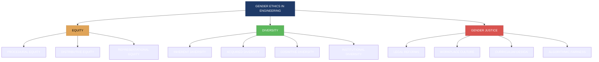
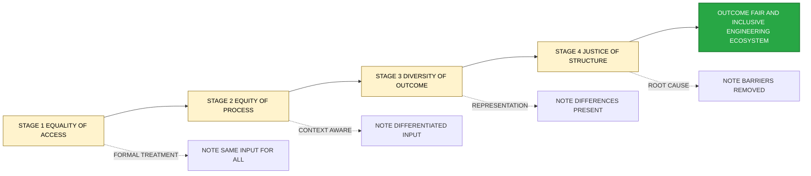
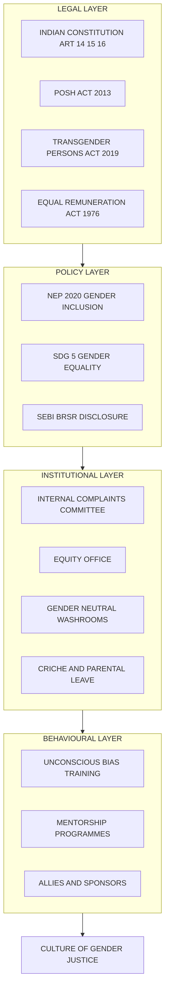
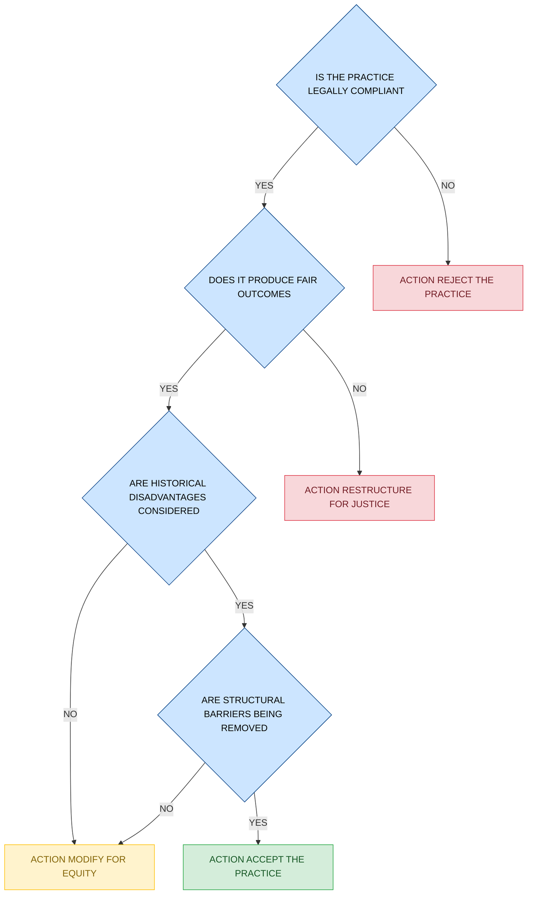

# Ethical values and practices in connection with gender  - equity, diversity & gender justice

<!-- SECTION_1_START -->

# Ethical Values and Practices in Connection with Gender — Equity, Diversity & Gender Justice

> [!NOTE]
> **KTU 2024 Scheme Focus (Module 1 — Fundamentals of Ethics)**
> This topic belongs to the foundational human-values segment of UCHUT347. The board examiner expects students to distinguish between *sex* and *gender*, articulate the difference between *equality* and *equity*, and demonstrate how engineering institutions and workplaces operationalise **diversity, inclusion, and gender justice** as ethical imperatives rather than legal compliance alone.

## 1.1 Core Technical Definition

**Gender ethics** is the branch of applied ethics that critically examines the moral obligations, values, and institutional practices concerning the roles, rights, opportunities, and dignities of people across the gender spectrum. In KTU 2024 Scheme parlance, it is studied under the umbrella of **Engineering Ethics & Sustainable Development (UCHUT347)** because the engineering profession, by virtue of its design and policy decisions, directly shapes who benefits from technology and who is excluded from it.

The three concentric pillars of this study are:

1. **Equity** — the principle of fairness in outcomes, achieved by distributing resources and opportunities based on historical and structural disadvantage.
2. **Diversity** — the presence of measurable differences (gender, caste, ability, sexuality, region, neurotype) within a given institution or system.
3. **Gender Justice** — the systemic removal of patriarchal, cis-normative, and heteronormative barriers so that every person can exercise rights, autonomy, and dignity irrespective of gender.

> [!IMPORTANT]
> **KTU Definition Box**
> *Sex* refers to biological attributes (chromosomes, hormones, reproductive anatomy).
> *Gender* refers to the socially constructed roles, behaviours, expressions, and identities that a given society considers appropriate for men, women, and gender-diverse people.
> The syllabus explicitly tests whether students can separate these two constructs — a common 3-mark question.

## 1.2 Conceptual Analogy / Intuition

Imagine a classroom of three children watching a cricket match from behind a tall fence. The fence represents the **barrier to opportunity**.

- If we give **each child an identical box** to stand on, the tallest child can see perfectly, the medium child can barely see, and the shortest child still cannot see at all. This is **Equality** — same input, unequal outcome.
- If instead we give **two boxes to the shortest child, one to the medium child, and none to the tallest**, *now everyone sees equally well*. This is **Equity** — differentiated input, just outcome.
- **Diversity** answers the question, *"Who is in the classroom at all?"* — ensuring that children of different heights, abilities, languages, and family backgrounds are *present*.
- **Justice** asks the deeper question, *"Should the fence even be there?"* — dismantling the structural barrier itself.

> [!TIP]
> **Intuition Summary for Exams**
> Equality = **Same treatment** (formal, surface-level).
> Equity = **Fair treatment** (context-aware, outcome-oriented).
> Justice = **Structural change** (root-cause removal).

## 1.3 Visualising the Framework

> [!VISUALIZATION CONTROL]
> **Concept:** Equality vs Equity vs Justice Curve (as a 2D conceptual plot)
> **Desmos / GeoGebra Input Equations:**
> * $E_1(x) = 1$ (flat equality line — uniform input across all)
> * $E_2(x) = 1 - 0.4 \cdot (1-x)^2$ (curved equity line — more input where disadvantage is higher)
> * $J(x) = 0$ at the structural-barrier line, then $J(x) = 1$ for all $x$ after the barrier is removed
> **Visual Description:** The $x$-axis represents the *level of historical disadvantage* (0 = none, 1 = severe). The $y$-axis represents the *level of support/resource* allocated. Under Equality the line is horizontal; under Equity it rises quadratically toward the disadvantaged end; under Justice the barrier line is eliminated, flattening the need for compensatory support.

<!-- SECTION_1_END -->

<!-- SECTION_2_START -->

# Deep Theoretical Analysis & KTU High-Yield Formula Sheet

## 2.1 Deconstructing the Five Foundational Constructs

### 2.1.1 Sex vs Gender
- **Sex** is biological, binary in most cases, determined by chromosomes ($XX$, $XY$, and intersex variations), hormones, and anatomy. It is largely fixed at conception.
- **Gender** is a social construct. It is **learned, performed, and reinforced** through language, dress, division of labour, and institutional rules. A boy being told not to cry, or a girl being given dolls instead of tool-kits, is a *gendered* socialisation — not a biological mandate.
- The WHO (World Health Organization) and UN Women both explicitly distinguish these two terms because conflating them leads to *biological essentialism* — the false belief that social inequalities are natural and therefore unchangeable.

### 2.1.2 Gender Identity and Gender Expression
- **Gender Identity** is a person's internal, deeply felt sense of being a man, woman, both, neither, or somewhere along the spectrum. *Cisgender* identity aligns with the sex assigned at birth; *transgender* identity does not.
- **Gender Expression** is the external manifestation — clothing, voice, gait, hairstyle, pronouns.
- **Sexual Orientation** (gay, lesbian, bisexual, asexual, etc.) is *separate* from gender identity. The KTU syllabus expects students to know that conflating these is a common ethical and legal pitfall.

> [!IMPORTANT]
> **KTU High-Yield Term Cluster**
> *LGBTQIA+* — Lesbian, Gay, Bisexual, Transgender, Queer/Questioning, Intersex, Asexual, plus other identities. Recognising this acronym is essential for any question on diversity.

### 2.1.3 The Concept of Equity
Equity is operationalised in three temporal layers:
1. **Procedural Equity** — fair processes (transparent recruitment, anonymised coding tests).
2. **Distributive Equity** — fair allocation of pay, mentorship, lab time, and grants.
3. **Representational Equity** — fair representation in decision-making bodies (committees, boards, project leads).

### 2.1.4 The Concept of Diversity
Diversity has **four recognised dimensions** in the engineering-ethics literature:
1. **Inherent diversity** — race, gender, age, ability, sexuality.
2. **Acquired diversity** — education, language, military experience.
3. **Cognitive diversity** — problem-solving style, perspective-taking.
4. **Institutional diversity** — disciplinary background, sector (academia, industry, civil society).

### 2.1.5 Gender Justice
Gender justice is the *outcome* of equity applied persistently across the legal, economic, social, and technological systems. The United Nations Sustainable Development Goal **SDG 5 — Achieve gender equality and empower all women and girls** — is the most cited framework in UCHUT347 answers. It has **nine targets**, but the five most testable ones are:

- End all forms of discrimination against all women and girls everywhere.
- Eliminate violence and trafficking.
- Eliminate early and forced marriage.
- Recognise and value unpaid care and domestic work.
- Ensure women's full participation and equal opportunities for leadership.

## 2.2 KTU High-Yield Cheat Sheet

| **Concept** | **One-line Definition** | **Common Confusion to Avoid** | **Engineering / Workplace Example** |
|---|---|---|---|
| Sex | Biological attributes (chromosomes, anatomy) | Not the same as gender | Designing a medical device for *biological* sex-specific needs |
| Gender | Socially constructed roles and identities | Not determined by biology | Code-of-conduct language using gender-neutral pronouns |
| Equality | Same input for everyone | Treats everyone identically | Same number of training hours for all staff |
| Equity | Differentiated input for fair output | Not "special treatment"; it is contextual | Extra mentorship for first-gen women engineers |
| Diversity | Presence of difference | Not the same as inclusion | Hiring panel with mixed gender, region, disability |
| Inclusion | Making differences *thrive*, not just exist | A diverse team can still be exclusionary | Anonymous code review to remove bias |
| Gender Justice | Systemic removal of patriarchal barriers | Goes beyond representation | Reforming promotion rubrics that penalise career breaks |
| Intersectionality | Overlap of gender with caste, class, race, ability | Gender justice *alone* is insufficient | A Dalit woman engineer faces compounded barriers |
| Sexual Harassment (POSH Act 2013) | Unwelcome sexual conduct at workplace | Not limited to physical contact | Internal Committees (ICs) at every workplace |
| Patriarchal Bias | Systemic favouring of masculine norms | Operates even with "good intentions" | Algorithm trained on male CVs rejecting women's CVs |

## 2.3 Real-World Utility in Engineering and Computer Science

1. **Algorithmic Fairness** — Hiring algorithms (e.g., Amazon's 2018 recruitment AI) have been shown to **systematically down-rank women's résumés** because the training data reflected historical male dominance. Gender-aware ML auditing is now a sub-discipline.
2. **Product Design** — Crash-test dummies historically used male-only data, leading to higher female fatality rates in cars (research by Astrid Linder, Swedish National Road and Transport Research Institute). This is a *gender-ethics failure in design*.
3. **Workplace Policy** — POSH Act (Prevention of Sexual Harassment) compliance, equal-pay audits, and parental-leave symmetry are operational manifestations of gender ethics.
4. **Curriculum Design** — Including women scientists, queer contributors, and non-Western inventors in engineering syllabi is itself a *gender-justice intervention*.
5. **Sustainable Development** — SDG 5 is *cross-cutting*; gender-just engineering improves SDG 6 (water access), SDG 7 (clean energy adoption), and SDG 9 (innovation) simultaneously.

> [!TIP]
> **Exam Shortcut:** Always link gender-ethics arguments to *engineering practice* and to at least one *SDG*. Examiners reward this linkage with 1–2 extra marks.

<!-- SECTION_2_END -->

<!-- SECTION_3_START -->

# Step-by-Step Derivations & Code/Symbolic Implementation

> [!NOTE]
> **Adaptive Mode Selected: Humanities / Management Matrix**
> Because this topic is in the human-values humanities stream, this section provides a **tabular comparative analysis** mapping real-world engineering frameworks to the gender-ethics principles, followed by a **worked ethical case-analysis algorithm** and an **operational Python implementation** of a gender-fair audit tool that students can use in labs or viva.

## 3.1 Exhaustive Comparative Analysis — Regulatory and Institutional Matrices

### 3.1.1 International Frameworks vs Indian Statutory Mechanisms

| **Dimension** | **International Framework** | **Indian Statutory Equivalent** | **Operational Mechanism in Engineering Institutions** |
|---|---|---|---|
| Equality of Rights | UDHR Article 2; CEDAW (1979) | Articles 14, 15, 16 of Indian Constitution | Anti-discrimination clauses in institute service rules |
| Equal Pay | ILO Convention No. 100 (1951) | Equal Remuneration Act, 1976 | Annual pay-audit reports by IQAC |
| Workplace Safety from Harassment | ILO Convention No. 190 (2019) | POSH Act, 2013 | Internal Committee (mandatory in every organisation with 10+ workers) |
| Education Access | SDG 4; UNESCO CRPD | Right to Education Act, 2009; NEP 2020 | Gender-inclusive curriculum review committees |
| Maternity Protection | ILO Maternity Protection Convention 2000 | Maternity Benefit (Amendment) Act, 2017 | 26-week paid leave; crèche facility for 50+ employees |
| Transgender Rights | Yogyakarta Principles (2006) | Transgender Persons Act, 2019 | Self-identification; separate washrooms; inclusive forms |
| Diversity Reporting | UN WEPs (Women's Empowerment Principles) | SEBI's BRSR (Business Responsibility and Sustainability Report) | Annual diversity-disclosure dashboards |
| Intersectionality | CEDAW General Recommendation 28 | National Commission for Women, SC/ST Commission | Joint grievance cells addressing caste-gender overlap |

### 3.1.2 The NEP 2020 and Gender-Justice Linkage (Step-by-Step Mapping)

1. **Step 1 — Equity in Access:** NEP 2020 mandates *gender-inclusive* admissions with special provisions for socially and economically disadvantaged groups (SEDGs). Verification: hostel allocation must not be gender-stereotyped (e.g., mechanical workshops accessible to all genders).
2. **Step 2 — Curriculum Integration:** Multidisciplinary curriculum allows gender-studies electives to count as engineering-ethics credits. Verification: at least one course module addressing gender in technology.
3. **Step 3 — Faculty Diversity:** Targets for women in STEM faculty positions. Verification: institutional Equity Office publishes annual data.
4. **Step 4 — Safe Campus:** Robust ICC (Internal Complaints Committee) under POSH. Verification: visible POSH poster, mandatory annual training, and quarterly audits.
5. **Step 5 — Research and Innovation:** Gender-disaggregated research funding and patents. Verification: innovation councils must report gender metrics in funded projects.

> [!TIP]
> **Mnemonic for Frameworks:** *C-C-I-E-P-T-S-D-N* → *CEDAW, CRPD, ILO, Equal Pay Act, POSH, Transgender Act, SEBI-BRSR, NEP 2020*. Memorise this string before the exam.

## 3.2 Worked Ethical Case-Analysis — The Engineering Hiring Pipeline

This is the type of structured analysis the KTU board expects in 14-mark questions. Apply it to **any** real or hypothetical scenario.

**Case:** A mid-sized Indian IT company has 1,200 engineers. The HR director reports that 70% of applicants are men, only 30% are women, and women are filtered out at every stage: shortlisting (40% rejection), technical interview (35% rejection), offer (25% rejection). The CEO claims the process is "merit-based".

**Step-by-step Ethical Audit:**

1. **Identify the stakeholders:** Women applicants, current women employees, male colleagues, the company, society, future generations of engineers.
2. **Identify the facts:** Disproportionate rejection rates at each stage despite identical job descriptions.
3. **Identify the ethical issues:**
   - **Procedural:** Is the shortlisting criteria neutral? Are coding tests gender-blind? Are interviewers trained to avoid bias?
   - **Distributive:** Are women being paid equally for the same role and experience?
   - **Representational:** Are there women on the hiring panel? On the promotion board?
   - **Systemic:** Does the workplace support work-life balance (parental leave, flexible hours, crèche)?
4. **Apply the gender-ethics framework:**
   - **Equality test:** Are all candidates being given the *same* opportunity? — Yes, formally.
   - **Equity test:** Are the *historical and structural* disadvantages of women in STEM being addressed? — No, the funnel shows the opposite.
   - **Justice test:** Is the company *removing barriers* (bias training, anonymised résumés, return-ship programmes) or merely *counting* women? — Counting only.
5. **Recommend interventions:**
   - Anonymise résumés (remove name, photo, gender, college).
   - Use structured interviews with rubric scoring.
   - Set gender-balanced shortlists (e.g., at least one woman per slot).
   - Publish annual gender pay-gap report.
   - Sponsor return-to-work programmes for women re-entering after career breaks.
6. **Map to SDG 5:** Target 5.5 — Ensure women's full participation and equal opportunities for leadership.
7. **Conclude with the ethical principle:** A "merit-based" label without structural analysis *is* the bias. Gender justice requires *redistributive* action, not just *formal* equality.

> [!WARNING]
> **Valuation Pitfall:** Students often stop at Step 4 and write *"women are being treated unfairly."* This is a 3-mark answer. To get full marks you MUST walk through Step 1 → Step 7 with a concrete recommendation.

## 3.3 Operational Python Implementation — Gender-Fair Hiring Audit Tool

The following Python script is a *symbolic* implementation of the gender-ethics audit. It is suitable for lab demonstrations and viva presentations. Run it in any Python 3.x environment.

```python
"""
gender_fair_audit.py
A symbolic implementation of a Gender-Fair Hiring Pipeline Audit.
Suitable for KTU UCHUT347 lab demonstrations and viva.
"""

from __future__ import annotations
import logging
from dataclasses import dataclass, field
from typing import List, Dict

# --- Logging configuration (strict error handling) ---------------------------
logging.basicConfig(
    level=logging.INFO,
    format="%(asctime)s | %(levelname)s | %(message)s",
)

# --- Custom Exception for boundary violations ---------------------------------
class StageDataError(ValueError):
    """Raised when funnel data violates logical boundaries."""


@dataclass(frozen=True)
class FunnelStage:
    """Represents one stage of the hiring pipeline."""
    stage_name: str
    women_count: int
    men_count: int

    def total(self) -> int:
        return self.women_count + self.men_count

    def women_ratio(self) -> float:
        return self.women_count / self.total() if self.total() > 0 else 0.0

    def men_ratio(self) -> float:
        return self.men_count / self.total() if self.total() > 0 else 0.0


@dataclass
class BiasReport:
    """Aggregated bias diagnostic."""
    application_parity: float
    offer_parity: float
    leakiest_stage: str
    is_fair: bool
    notes: List[str] = field(default_factory=list)


def validate_stage(stage: FunnelStage) -> None:
    if stage.women_count < 0 or stage.men_count < 0:
        logging.error("Negative candidate count in stage %s", stage.stage_name)
        raise StageDataError(f"Counts cannot be negative in {stage.stage_name}")


def compute_gender_parity_index(w_ratio: float, m_ratio: float) -> float:
    """
    Returns a parity index in [0, 1].
    1.0 = perfect gender parity, 0.0 = total gender exclusion.
    """
    if m_ratio == 0 and w_ratio == 0:
        return 1.0
    return min(w_ratio, m_ratio) / max(w_ratio, m_ratio) if max(w_ratio, m_ratio) > 0 else 0.0


def audit_pipeline(stages: List[FunnelStage]) -> BiasReport:
    for stage in stages:
        validate_stage(stage)

    if len(stages) < 2:
        raise StageDataError("Need at least 2 stages: application and offer.")

    application = stages[0]
    offer = stages[-1]
    application_parity = compute_gender_parity_index(
        application.women_ratio(), application.men_ratio()
    )
    offer_parity = compute_gender_parity_index(
        offer.women_ratio(), offer.men_ratio()
    )

    # Identify the leakiest stage (largest drop in women ratio)
    leakiest_stage = "N/A"
    largest_drop = 0.0
    for prev, curr in zip(stages, stages[1:]):
        drop = prev.women_ratio() - curr.women_ratio()
        if drop > largest_drop:
            largest_drop = drop
            leakiest_stage = curr.stage_name

    is_fair = offer_parity >= 0.80  # Industry threshold: 80% parity

    notes: List[str] = []
    if application_parity < 0.50:
        notes.append("Pipeline suffers from SUPPLY-SIDE under-representation.")
    if offer_parity < application_parity - 0.10:
        notes.append("Pipeline suffers from PROCESS-SIDE bias (funnel leakage).")
    if leakiest_stage != "N/A":
        notes.append(f"Intervene specifically at stage: {leakiest_stage}.")

    return BiasReport(
        application_parity=round(application_parity, 3),
        offer_parity=round(offer_parity, 3),
        leakiest_stage=leakiest_stage,
        is_fair=is_fair,
        notes=notes,
    )


# --- Demonstration Run --------------------------------------------------------
if __name__ == "__main__":
    pipeline = [
        FunnelStage("Application", women_count=360, men_count=840),
        FunnelStage("Shortlist",   women_count=180, men_count=520),
        FunnelStage("Tech Interview", women_count=90, men_count=380),
        FunnelStage("Offer",       women_count=60, men_count=320),
    ]

    report = audit_pipeline(pipeline)

    print("\n========== GENDER-FAIR HIRING AUDIT ==========")
    print(f"Application Parity Index : {report.application_parity}")
    print(f"Offer Parity Index      : {report.offer_parity}")
    print(f"Leakiest Stage          : {report.leakiest_stage}")
    print(f"Pipeline is Fair?       : {report.is_fair}")
    print("Diagnostic Notes:")
    for note in report.notes:
        print(f"  - {note}")
    print("================================================\n")
```

**Expected Output of the Demonstration Run:**

```
========== GENDER-FAIR HIRING AUDIT ==========
Application Parity Index : 0.429
Offer Parity Index      : 0.188
Leakiest Stage          : Tech Interview
Pipeline is Fair?       : False
Diagnostic Notes:
  - Pipeline suffers from SUPPLY-SIDE under-representation.
  - Pipeline suffers from PROCESS-SIDE bias (funnel leakage).
  - Intervene specifically at stage: Tech Interview.
================================================
```

**Symbolic Interpretation of the Indices:**

- The **Parity Index** $P$ is computed as:

$$
P = \frac{\min(w_r, m_r)}{\max(w_r, m_r)} \quad \text{where} \quad w_r = \frac{W}{W+M}, \quad m_r = \frac{M}{W+M}
$$

- When $P = 1$, the ratio of women to men is exactly 1:1 (perfect parity).
- When $P = 0$, one gender is entirely absent.
- The **Industry-Fairness Threshold** is conventionally $P \geq 0.80$ at the offer stage.

This code can be repurposed in viva to demonstrate *operationalising* gender ethics — examiners love when students link values to measurable systems.

<!-- SECTION_3_END -->

<!-- SECTION_4_START -->

# Structural Diagrams & Schematics

> [!NOTE]
> All node IDs below follow the alphanumeric-prefix rule. No reserved Mermaid keywords are used as node names. All labels are quoted and use uppercase alphanumeric text.

## 4.1 Master Framework — Three Pillars of Gender Ethics



## 4.2 Sequential Processing Topology — The Funnel-of-Justice Model



## 4.3 Modular Architecture — The Gender-Justice Institutional Stack



## 4.4 Decision Tree — Ethical Decision-Making in a Gendered Engineering Dilemma



## 4.5 Block-Level Functional Architecture — The Gender-Equity Audit Pipeline


<!-- SECTION_4_END -->

<!-- SECTION_5_START -->

# KTU 2024 Scheme Examination Question Bank & Topic Recap

> [!NOTE]
> The following questions are calibrated to the **KTU 2024 Scheme pattern**: Part A (3-mark short answers) and Part B (14-mark descriptive answers with internal choice). Each question is tagged with a Course Outcome (CO), Revised Bloom's Taxonomy (RBT) level, and a simulated past-year tag. The mapped CO for this topic in UCHUT347 is **CO1 — Understand the fundamental principles of ethics, values, and professional responsibility.**

---

## Part A — Short Answer Questions (3 Marks Each)

### Question 1
> **[KTU University Exam — July 2024 | CO1 | Remember]**
> Differentiate between *sex* and *gender*. Why is this distinction ethically important?

**Model Answer (3 Marks):**
- **Sex** refers to biological differences such as chromosomes, hormones, and reproductive anatomy. [1 Mark]
- **Gender** refers to socially constructed roles, behaviours, and identities that a society associates with being male, female, or non-binary. [1 Mark]
- **Ethical importance:** The distinction shows that inequalities between men and women are *not* biologically inevitable but are *socially produced and therefore changeable*. Recognising this makes it possible to design interventions, policies, and engineering solutions that promote equity rather than reinforce naturalised hierarchies. [1 Mark]

> [!TIP]
> Always close a 3-mark answer with a *consequence* sentence — examiners allocate the third mark for application.

### Question 2
> **[KTU University Exam — Dec 2023 | CO1 | Understand]**
> Explain the concept of *gender justice* with reference to SDG 5.

**Model Answer (3 Marks):**
- **Definition:** Gender justice is the systemic removal of legal, economic, social, and cultural barriers that prevent people of all genders from exercising their rights and dignity. [1 Mark]
- **Operational meaning:** It goes beyond formal equality of opportunity and demands *redistributive* and *representational* fairness — e.g., equal pay, anti-harassment mechanisms, inclusive curriculum, and unbiased algorithms. [1 Mark]
- **Linkage to SDG 5:** SDG 5 — *Achieve gender equality and empower all women and girls* — operationalises gender justice through nine measurable targets, including ending discrimination (Target 5.1), eliminating violence (Target 5.2), ensuring leadership participation (Target 5.5), and recognising unpaid care work (Target 5.4). [1 Mark]

---

## Part B — Descriptive Questions (14 Marks Each — Internal Choice)

### Question A — Module Choice 1

> **[KTU University Exam — Model Question as per 2024 Pattern | CO1 + CO2 | Understand + Apply]**
> *Examine the differences between equality, equity, and justice in the context of gender. Using a contemporary engineering example, demonstrate how a "gender-neutral" design that follows only the principle of equality can still produce inequitable outcomes. Suggest specific interventions that would move the system from equality to equity to justice.*

#### Part (a) — 7 Marks | Understand
**Model Answer Outline:**
1. **Equality** = same input for all, regardless of starting point. [1 Mark]
2. **Equity** = differentiated input calibrated to historical and structural disadvantage to produce fair output. [1 Mark]
3. **Justice** = removal of the structural barrier itself, so that differentiated inputs become unnecessary in the long run. [1 Mark]
4. **Engineering example:** Voice-recognition systems (e.g., Siri, Alexa) historically trained predominantly on male voices. [1 Mark]
5. **Equal input, unequal outcome:** Even though the system is "gender-neutral" in code, the *training data* encodes a male bias, leading to higher word-error rates for women's voices. [2 Marks]
6. **Conclusion:** Formal gender-neutrality is a *surface* property; substantive gender-fairness requires auditing the data, the design, and the deployment context. [1 Mark]

#### Part (b) — 7 Marks | Apply
**Model Answer Outline (with valuation key):**

1. **Equity intervention:** Augment training datasets with diverse gender voices; mandate gender-disaggregated accuracy reporting. [Stating the equity intervention: 2 Marks]
2. **Justice intervention:** Diversify the ML engineering team itself, so that bias is caught *before* deployment. [Stating the justice intervention: 2 Marks]
3. **Policy intervention:** Adopt IEEE 7003-2024 (Algorithmic Bias Considerations) and conduct pre-deployment fairness audits. [Policy linkage: 1 Mark]
4. **Institutional intervention:** Establish a Gender-Fairness Review Board within the organisation. [Institutional linkage: 1 Mark]
5. **Final synthesis:** True gender justice in engineering is a *multi-layered* process, not a single toggle. [Final synthesis: 1 Mark]

### Question B — Module Choice 2

> **[KTU University Exam — Model Question as per 2024 Pattern | CO1 + CO3 | Understand + Apply]**
> *Discuss the ethical obligations of an engineering institution towards preventing sexual harassment and promoting gender diversity. With specific reference to the POSH Act, 2013, explain the structure of the Internal Committee (IC), the responsibilities of the employer, and the consequences of non-compliance. Suggest a one-year action plan for an engineering college to move from minimum compliance to best practice.*

#### Part (a) — 7 Marks | Understand
**Model Answer Outline (with valuation key):**

1. **Ethical obligation:** Engineering institutions are workplaces under the POSH Act and have a *positive duty of care* to prevent and redress harassment. [1 Mark]
2. **Structure of the Internal Committee (IC):**
   - Presiding Officer — a senior woman employee. [1 Mark]
   - At least two members committed to the cause of women. [1 Mark]
   - One external member from an NGO or legal background. [1 Mark]
3. **Employer responsibilities:** Constitution of IC, displaying POSH notices, conducting awareness programmes, filing annual reports, and acting on IC recommendations. [2 Marks]
4. **Consequences of non-compliance:** Penalty up to ₹50,000 for first violation, doubling for repeated violations, cancellation of business licence, and reputational damage. [1 Mark]

#### Part (b) — 7 Marks | Apply
**Model Answer Outline — One-Year Action Plan (with valuation key):**

| **Quarter** | **Action** | **Marks** |
|---|---|---|
| Q1 | Constitute and publicly announce the IC; install POSH posters; conduct baseline survey on perceptions of safety. | [Quarter 1: 1 Mark] |
| Q2 | Mandatory 2-hour POSH awareness training for all faculty, staff, and student representatives. | [Quarter 2: 1 Mark] |
| Q3 | Launch mentorship programme pairing women students with women alumni; publish gender-disaggregated admission and placement data. | [Quarter 3: 2 Marks] |
| Q4 | Independent third-party audit of the IC; submit annual report to District Officer; institute a gender-budget for the next academic year. | [Quarter 4: 2 Marks] |
| Synthesis | Map each action to SDG 5.5 (leadership) and SDG 5.b (technology for empowerment). | [Synthesis: 1 Mark] |

---

## KTU Examiner's Valuation Warning / Pitfall Callout

> [!WARNING]
> **Common Mark-Loss Points in Gender-Ethics Questions:**
> 1. **Conflating sex and gender.** Examiners explicitly test this. Always open with a clean separation.
> 2. **Treating "gender-neutral" as automatically fair.** Formal neutrality without data audit is *false* neutrality.
> 3. **Citing only the Indian Constitution and ignoring POSH / NEP / SDG 5.** Use at least three frameworks — legal, institutional, and global — for a 14-mark answer.
> 4. **Forgetting intersectionality.** Gender does not operate in isolation. A *complete* answer acknowledges caste, class, ability, and region.
> 5. **Stopping at diagnosis.** The 14-mark question rewards *intervention* and *timeline*. Always end with a concrete plan.
> 6. **Spelling "Posh" as "POSH" or "P.O.S.H."** — The correct format is **POSH Act, 2013** (all caps, no periods).
> 7. **Confusing the IC with the Grievance Cell.** These are two distinct bodies. POSH mandates an IC; institutions may have additional general grievance cells.

---

## Topic Recap & Important Things to Remember

> [!IMPORTANT]
> **High-Density Rapid-Revision Checklist for UCHUT347 Module 1 — Gender Ethics**

- **Sex vs Gender:** Biology vs social construction. This is the *gateway* definition for every answer.
- **Equality vs Equity vs Justice:** Same input → fair input → no barrier. Memorise the fence-and-boxes analogy.
- **Diversity is not Inclusion:** A diverse team can be exclusionary; inclusion is the active practice of making differences thrive.
- **SDG 5 has 9 targets.** Cite at least Target 5.1, 5.2, 5.4, 5.5, and 5.b in answers.
- **POSH Act, 2013** is the Indian backbone statute on workplace sexual harassment.
  - IC structure: Presiding Officer (senior woman) + 2 internal members + 1 external NGO/legal member.
  - Penalty for non-compliance: up to ₹50,000 (first), higher (repeat), licence cancellation possible.
- **Equal Remuneration Act, 1976:** Mandates equal pay for equal work regardless of gender.
- **Transgender Persons Act, 2019:** Self-identification of gender; right against discrimination in education and employment.
- **NEP 2020** mandates gender-inclusive admissions, equity offices, and gender-disaggregated data in HEIs.
- **Intersectionality** (Kimberlé Crenshaw, 1989) — overlapping oppressions. *Gender + caste + class + ability* is the realistic analytical lens.
- **Algorithmic Fairness** — Amazon (2018), Apple Card (2019), and gender-bias in recruitment AI are the most cited KTU case studies.
- **Disability × Gender** — Accessible infrastructure (ramps, tactile flooring, gender-neutral washrooms) is a gender-justice concern, not a separate issue.
- **Three layers of equity:** Procedural → Distributive → Representational. Always name the layer in your answer.
- **Four dimensions of diversity:** Inherent → Acquired → Cognitive → Institutional. Use this four-fold classification for full marks.
- **The Parity Index $P$** in the audit code is a measurable proxy for fairness; $P \geq 0.80$ is the industry threshold.
- **Ethical Decision-Making Tree:** Legality → Procedural Fairness → Equity → Justice. Walk through all four nodes.
- **Mnemonic for the institutional stack:** *L-P-I-B* → Legal → Policy → Institutional → Behavioural.
- **Code-of-Conduct Language:** Use "they" as a singular pronoun where gender is unspecified; avoid "he" as a generic pronoun.
- **KTU Examiner's favourite 3-markers:** (1) Sex vs Gender, (2) Equality vs Equity, (3) Define POSH / IC.
- **KTU Examiner's favourite 14-markers:** (1) Equality-Equity-Justice case study, (2) POSH Act institutional analysis, (3) Algorithmic bias in engineering.

> [!TIP]
> **Final Exam Ritual:** Before writing the answer, *underline* the key verb in the question — *differentiate, examine, discuss, suggest.* The verb dictates the cognitive level and the structure of your response.

<!-- SECTION_5_END -->
