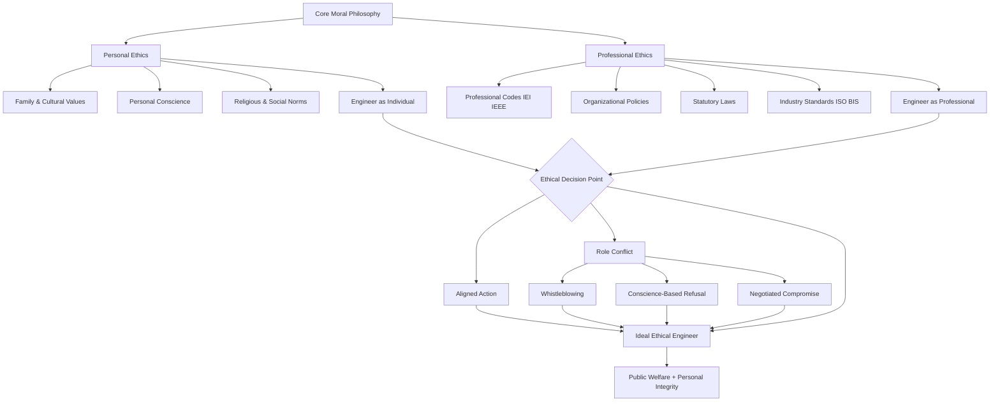
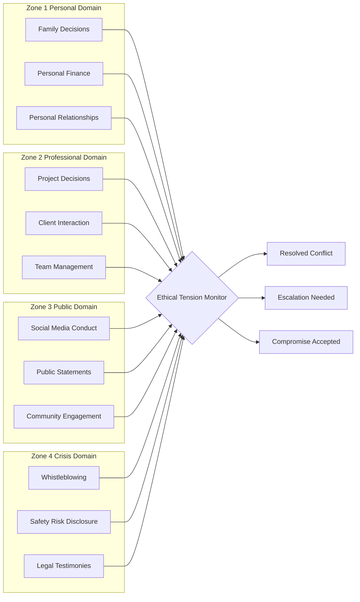
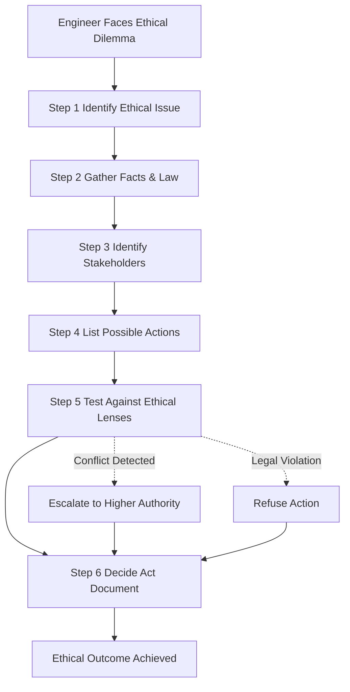
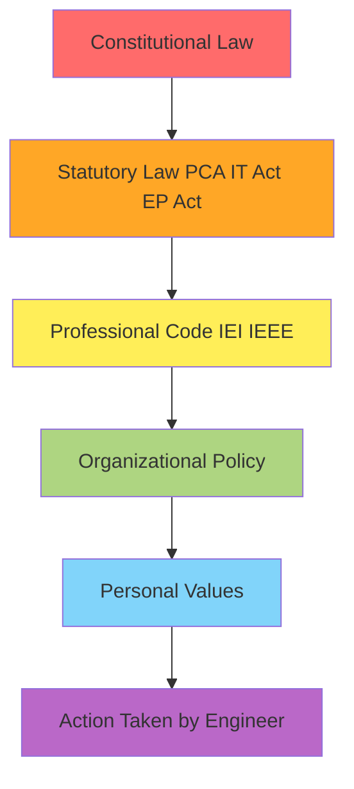
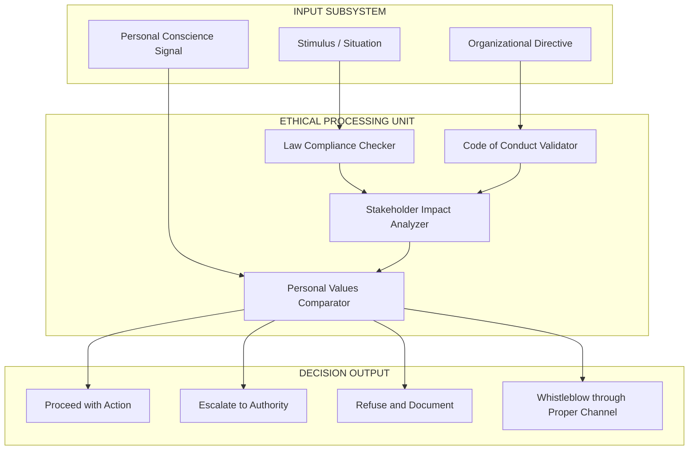

# Fundamentals of ethics  - Personal vs. professional ethics

<!-- SECTION_1_START -->
# Fundamentals of Ethics: Personal vs. Professional Ethics

## 1.1 Formal Academic Definition (KTU 2024 Syllabus Terminology)

**Ethics** is the branch of philosophy that deals with moral principles, values, and standards governing human conduct. It is the systematic study of what is morally right and wrong, just and unjust, good and bad in human behavior.

Within the engineering and applied sciences domain, ethics is broadly classified into two interconnected yet distinct domains:

- **Personal Ethics (Individual Ethics)**: The internalized moral code, value system, and behavioral principles that an individual develops and follows in their private life, shaped by family, culture, religion, society, education, and personal conscience. It governs how a person behaves when no one is watching.

- **Professional Ethics (Occupational Ethics)**: The codified and formalized set of moral standards, rules of conduct, and value obligations that govern an individual’s behavior within the context of their profession, vocation, or workplace. It is enforced by professional bodies, codes of conduct, organizational policies, and the institution itself.

> [!IMPORTANT]
> **KTU 2024 Syllabus Highlight (Module 1):** The course UCHUT347 explicitly emphasizes the dichotomy between personal morality and professional responsibility, as engineers often face *role conflict* situations where personal beliefs clash with professional obligations (e.g., whistleblower dilemmas, conflict of interest).

> [!NOTE]
> **Core Conceptual Distinction:** Personal ethics is *internally driven and self-regulated*, whereas professional ethics is *externally framed and institutionally reinforced*. The intersection of these two creates the ethical identity of an engineer.

## 1.2 Conceptual Analogy / Intuitive Overview

**Real-World Analogy — The Two Lenses of a Camera:**

Imagine an engineer named *Anjali* who has just joined a structural design firm. When she is at home with her family, she follows *personal ethics* — honesty in conversations, kindness, respect for elders, punctuality in personal commitments. These are her **first lens** — soft, personal, and guided by her upbringing.

When she steps into the office, she picks up the **second lens** — the *professional ethics* lens — which requires her to:
- Follow IS (Indian Standards) codes strictly
- Not falsify load calculations
- Disclose conflicts of interest
- Report unsafe designs honestly

If both lenses are calibrated, her vision (decisions) is **clear and consistent**. But if the two lenses are misaligned, she experiences *cognitive dissonance* — like seeing a blurred, double image. The role of engineering ethics education is to **align these two lenses** so that the engineer’s personal morality and professional duty converge into a single, sharp ethical outlook.

> [!TIP]
> **Memory Hack:** Personal ethics = *“Who I am at home.”* Professional ethics = *“Who I must be at work.”* The ideal engineer has both identities merged.

## 1.3 Key Terminology Snapshot

| Term | Standard Definition | KTU-Standard Reference |
|------|--------------------|------------------------|
| **Morals** | Specific behavioral rules derived from a value system | Subjective, culturally bound |
| **Values** | Enduring beliefs that influence choices and actions | E.g., honesty, integrity, justice |
| **Norms** | Established standards of expected behavior | E.g., punctuality, dress code |
| **Code of Conduct** | Formal written document of professional rules | Issued by IEI, IEEE, ASME, NSPE |
| **Whistleblowing** | Disclosure of unethical practices within an organization | Protected under SEBI, PCA, UK PIDA |
| **Conflict of Interest** | Situation where personal interests compromise professional duty | Disclosed and recused in practice |

## 1.4 GeoGebra / Desmos Conceptual Mapping (Ethical Decision Spectrum)

> [!VISUALIZATION CONTROL]
> **Concept:** Ethical Decision-Making Spectrum (Personal vs. Professional Axis Mapping)
> **Conceptual Axes:**
> * X-axis: `Personal Ethics Intensity (0 → 10)` — measures internal moral conviction
> * Y-axis: `Professional Ethics Compliance (0 → 10)` — measures adherence to professional codes
> **Key Quadrant Points:**
> * `(9, 9)` → *Ideal Engineer* — strong personal + strong professional alignment
> * `(9, 2)` → *Moral Hero / Whistleblower* — high personal ethics, low professional compliance (risky)
> * `(2, 9)` → *Corporate Conformist* — high compliance but weak personal conviction
> * `(2, 2)` → *Ethical Failure Zone* — disengaged on both axes
> **Visual Description:** Plot these four points on a 2D Cartesian plane. The diagonal from origin to `(10,10)` represents the *Ideal Ethical Alignment Curve* where personal conviction and professional duty converge.

<!-- SECTION_1_END -->

<!-- SECTION_2_START -->
# Deep Theoretical Analysis & KTU High-Yield Reference Sheet

## 2.1 Anatomy of Personal Ethics

Personal ethics is a **multi-layered construct** shaped by:

1. **Family Upbringing** — First moral school; teaches truthfulness, empathy, discipline
2. **Cultural & Religious Background** — Imposes moral scripts (e.g., *Ahimsa* in Jainism, *Golden Rule* in Christianity)
3. **Education & Peer Influence** — School, college, peer group refine moral reasoning
4. **Personal Reflection & Life Experience** — Self-developed moral compass
5. **Socioeconomic Context** — Class, privilege, exposure shape ethical sensitivity

### Core Characteristics of Personal Ethics
- **Subjective**: Varies from person to person
- **Flexible / Contextual**: Adapts to the situation
- **Internalized**: Enforced by conscience and self-judgment
- **Private**: Governs personal, non-professional life domains
- **Voluntary**: Lacks formal legal/organizational enforcement

> [!IMPORTANT]
> **KTU Examiner Insight:** When asked *“Are personal and professional ethics the same?”*, the correct model answer is: *“They are rooted in the same underlying moral philosophy, but differ in scope, enforcement mechanism, accountability structure, and stakeholder impact.”*

## 2.2 Anatomy of Professional Ethics

Professional ethics is **codified and institutionalized**, typically articulated through:

1. **Professional Codes of Conduct** — Issued by bodies like:
   - **Institution of Engineers (India) — IEI**
   - **IEEE Code of Ethics** (global, for engineers)
   - **NSPE Code of Ethics** (US, professional engineers)
   - **ABET** accreditation standards
2. **Organizational Policies** — Company-specific rules, HR manuals
3. **Statutory & Legal Frameworks** — Laws like the *Indian Contract Act 1872*, *Consumer Protection Act 2019*, *Right to Information Act 2005*
4. **Industry Standards** — ISO 26000, ISO 37001 (anti-bribery), BIS standards
5. **Engineering Council Norms** — Licensing and disciplinary procedures

### Core Characteristics of Professional Ethics
- **Objective / Codified**: Written, formal documents
- **Rigid / Standardized**: Applied uniformly across the profession
- **Externalized**: Enforced by regulatory bodies, courts, professional associations
- **Public**: Governs professional, client-facing, and stakeholder-impacting decisions
- **Mandatory**: Violations lead to sanctions, license revocation, or legal action

## 2.3 KTU Formula Sheet / Cheat Sheet — Comparative Reference

| Parameter | Personal Ethics | Professional Ethics |
|-----------|-----------------|---------------------|
| **Source of Authority** | Conscience, family, culture | Professional bodies, organizations, law |
| **Scope** | Private life, personal relationships | Workplace, client, society, environment |
| **Enforcement** | Self-enforced (guilt, shame) | Externally enforced (HR, courts, licensing boards) |
| **Flexibility** | High — adapts to context | Low — codified and standardized |
| **Accountability** | To self, family, society | To employer, client, profession, public |
| **Documentation** | Unwritten, informal | Written codes, policies, statutes |
| **Consequence of Violation** | Loss of self-respect, social stigma | Termination, lawsuit, license revocation, criminal prosecution |
| **Stakeholder Impact** | Limited to personal circle | Wide — affects clients, public, environment |
| **Time Horizon** | Present-focused or lifetime personal | Long-term professional reputation and societal good |
| **Legal Binding** | Generally not legally binding | Often legally binding (especially for licensed engineers) |

## 2.4 The Four Zones of Ethical Decision-Making

Engineers operate in **four distinct ethical zones**, each demanding different ethical reflexes:

| Zone | Description | Example |
|------|-------------|---------|
| **Zone 1 — Personal Domain** | Pure personal ethics apply | How an engineer spends personal time |
| **Zone 2 — Professional Domain** | Professional ethics dominate | Workplace conduct, project decisions |
| **Zone 3 — Public Domain** | Professional ethics + civic duty intersect | Public statements, social media posts about employer |
| **Zone 4 — Crisis Domain** | Personal conscience may override professional directive | Witnessing unsafe practices, whistleblowing |

> [!WARNING]
> **KTU Common Mistake:** Students often claim professional ethics is “superior to” personal ethics. The correct academic stance is that *both are complementary, neither is inherently superior, and the ideal engineer integrates both harmoniously.*

## 2.5 Real-World Engineering Applications

The distinction between personal and professional ethics is not academic — it has **measurable production-level consequences**:

1. **Software Engineering (FAANG Context):** A developer at Google may personally oppose data tracking (personal ethics), but professionally must implement features compliant with company policy and the IT Act 2000 (professional ethics). Resolution: *Dual accountability mindset.*

2. **Civil Engineering (Construction Industry):** An engineer at L&T may personally favor a friend’s low-cost cement supplier (personal bias), but professionally must follow IS 269:2015 specifications and tender transparency norms. Conflict resolution: *Recusal and disclosure.*

3. **Biomedical Engineering:** A medical device designer may personally believe in animal-free testing, but professionally must comply with ISO 10993 biocompatibility standards requiring animal studies. Resolution: *Aligning with regulatory minimums while advocating for alternatives.*

4. **Environmental Engineering:** A chemical plant engineer may personally live an eco-friendly life, but professionally may be pressured to bypass effluent treatment for cost savings. Resolution: *Whistleblowing under environmental law.*

> [!TIP]
> **Production Reality:** In real engineering practice, the **tension** between personal and professional ethics is precisely where **ethical leadership** is born. The engineer who can navigate this tension is the *transformational technical leader*, not merely a technician.

<!-- SECTION_2_END -->

<!-- SECTION_3_START -->
# Step-by-Step Analytical Frameworks & Case Implementation

> [!NOTE]
> **Domain Note (Humanities/Management Topic):** Per the KTU-PREMIER-ENGINE V10 protocol, for non-mathematical/algorithmic subjects, this section provides **exhaustive tabular comparative analysis** mapping real-world engineering case frameworks to regulatory/systemic matrices, along with structured ethical reasoning workflows.

## 3.1 The Six-Step Ethical Reasoning Workflow (Model Framework)

When an engineer faces an ethical conflict, the following **six-step deductive framework** should be applied:

### Step 1 — Identify the Ethical Issue
Ask: *“What moral question is at stake?”*
Example: A contractor offers a 5% commission to secure a contract.

### Step 2 — Gather Relevant Facts
- What is the law? (Prevention of Corruption Act 1988)
- What is the company policy?
- What is the IEI/IEEE code position?
- Who are the stakeholders?

### Step 3 — Identify Stakeholders & Their Interests
- Self (engineer), employer, client, public, environment, profession

### Step 4 — List Possible Courses of Action
- Accept commission
- Reject commission and report
- Reject silently
- Inform supervisor privately

### Step 5 — Test Each Option Against Ethical Lenses
- **Utilitarian lens:** Which maximizes overall welfare? → Rejection
- **Deontological lens:** Which respects duty and law? → Rejection + reporting
- **Rights lens:** Which protects human dignity? → Rejection
- **Virtue lens:** What would a virtuous engineer do? → Rejection + reporting

### Step 6 — Decide, Act, Reflect, Document
Make the decision, execute it, and document for future learning.

## 3.2 Comparative Engineering Case Framework Matrix

The table below maps **canonical engineering ethical cases** to the personal vs. professional ethics axis and the regulatory matrix:

| S.No. | Engineering Case / Scenario | Personal Ethics Demand | Professional Ethics Demand | Conflicting? | Regulatory / Statutory Reference | Recommended Resolution |
|-------|------------------------------|------------------------|----------------------------|--------------|----------------------------------|------------------------|
| 1 | Engineer asked to certify a bridge as safe when cracks were observed | Report the cracks honestly (personal honesty) | Follow BIS IS 456:2000, file non-conformity report (professional duty) | No — both aligned | BIS Standards, IEI Code | Report and refuse certification |
| 2 | Software developer asked to insert a backdoor in a banking app | Refuse (personal privacy values) | Refuse (violates IT Act 2000, RBI cybersecurity norms) | No — aligned | IT Act 2000 §66, RBI Master Direction 2020 | Refuse and escalate |
| 3 | Engineer asked to underreport factory emissions | Personally uncomfortable (eco-values) | Must report as per EP Act 1986 (professional legal duty) | No — aligned | Environment Protection Act 1986, CPCB norms | Report to State Pollution Control Board |
| 4 | Senior engineer takes credit for a junior’s design | Personal discomfort (fairness) | Violates NSPE/IEI attribution norms | No — aligned | IEI Bye-Laws, company HR policy | Junior must be credited; senior counseled |
| 5 | Engineer’s religious belief prohibits working on a defense project | Refuse (personal faith) | Employer’s contractual obligation (professional duty) | **Yes — clear conflict** | Employment contract, IEI Code (public welfare clause) | Request transfer; if impossible, weigh conscience vs. contract consequences |
| 6 | Engineer offered a bribe by supplier to approve substandard materials | Reject (personal honesty) | Must report under Prevention of Corruption Act 1988 | No — aligned | PCA 1988, company anti-bribery policy (ISO 37001) | Reject and report to vigilance officer |
| 7 | Engineer discovers a design flaw in a competitor’s product (e.g., elevator) | Tempted to ignore (personal competitive bias) | Public safety duty (professional responsibility) | **Yes — partial conflict** | National Building Code 2016, IEI Code | Disclose through proper channel — public safety overrides competition |
| 8 | Engineer pressured to share proprietary client data with a new employer | Refuse (personal confidentiality) | Violates NDA, Indian Contract Act 1872 | No — aligned | NDA, IT Act 2000 §43A | Refuse and report to legal team |

## 3.3 The Kohlberg-Moral-Reasoning Link (Conceptual Bridge)

Lawrence Kohlberg’s stages of moral development (KTU-recommended cross-reference) connect directly to the personal/professional ethics debate:

| Stage | Description | Example in Engineering Context |
|-------|-------------|--------------------------------|
| **Stage 1 — Obedience & Punishment** | Avoid punishment | Following safety rules only to avoid fines |
| **Stage 2 — Self-Interest** | Personal benefit | Accepting bribes for personal gain |
| **Stage 3 — Good Boy / Nice Girl** | Social approval | Following rules to be seen as a good employee |
| **Stage 4 — Law & Order** | Duty to authority | Obeying company policies without question |
| **Stage 5 — Social Contract** | Greater good | Reporting unsafe practices even against employer |
| **Stage 6 — Universal Ethical Principles** | Internal moral code | Whistleblowing at personal cost for public good |

> [!TIP]
> **KTU Examiner Hook:** If a question asks *“How do personal ethics evolve into professional ethics?”*, use Kohlberg’s model: *“Personal ethics is the foundation (Stages 1–4), and mature professional ethics emerges at Stage 5–6 when the engineer internalizes societal welfare above personal/employer interest.”*

## 3.4 The Indian Engineering Code Reference (IEI Excerpt)

The **Institution of Engineers (India) Code of Ethics** mandates (in summary form):

1. **Integrity**: Members shall discharge duties with integrity, fidelity, and dignity
2. **Competence**: Shall perform work only in areas of competence
3. **Public Welfare**: Shall uphold public welfare, safety, and health as paramount
4. **Truthfulness**: Shall issue public statements only in an objective and truthful manner
5. **Confidentiality**: Shall not disclose confidential information without consent
6. **Conflict Avoidance**: Shall avoid conflicts of interest
7. **Fair Treatment**: Shall treat all colleagues, clients, and subordinates fairly
8. **Environmental Responsibility**: Shall support sustainable development and environmental protection

> [!IMPORTANT]
> **KTU Cross-Module Connection:** Items 3 and 8 directly link Module 1 (Fundamentals) to Module 2 (Sustainable Development) and Module 3 (Engineer’s Responsibility for Safety).

## 3.5 Symbolic Decision-Flow Pseudocode (Logical Implementation of Ethical Reasoning)

Although the topic is humanities, the underlying decision logic can be expressed as a clean, production-style pseudocode algorithm for clarity:

```python
def ethical_decision_engine(stimulus, personal_values, professional_code, stakeholders):
    """
    Symbolic ethical reasoning engine for engineering decisions.
    Returns: a recommended action and its justification tier.
    """
    # Step 1: Identify the moral question
    issue = identify_moral_question(stimulus)
    if not issue:
        return "No ethical issue detected", "Routine Decision"

    # Step 2: Check for statutory illegality (highest priority)
    if violates_law(stimulus):
        return "REFUSE and ESCALATE", "Statutory Violation"

    # Step 3: Check professional code compliance
    if not professional_code.allows(stimulus):
        return "REFUSE and DOCUMENT", "Professional Code Violation"

    # Step 4: Check personal values alignment
    if personal_values.contradicts(stimulus):
        return "FLAG for CONSCIENCE REVIEW", "Personal-Professional Tension"

    # Step 5: Stakeholder impact analysis
    harm_score = quantify_stakeholder_impact(stimulus, stakeholders)
    if harm_score > THRESHOLD:
        return "RECONSIDER and MITIGATE", "Stakeholder Harm Risk"

    # Step 6: Default — proceed
    return "PROCEED with DOCUMENTATION", "Ethically Aligned"
```

> [!NOTE]
> **Pedagogical Note:** This pseudocode is not for execution but for visualizing the *hierarchical precedence of ethical decision-making*: **Law → Professional Code → Personal Values → Stakeholder Impact → Action**.

<!-- SECTION_3_END -->

<!-- SECTION_4_START -->
# Structural Diagrams & Schematics

## 4.1 Mermaid Diagram: Personal vs. Professional Ethics — Relationship Topology



## 4.2 Mermaid Diagram: The Four Zones of Ethical Decision-Making



## 4.3 Mermaid Diagram: Six-Step Ethical Reasoning Workflow



## 4.4 Mermaid Diagram: Hierarchical Precedence of Ethical Authority



> [!TIP]
> **Diagram Reading Guide:** Color-coding reflects the hierarchy — Red (highest authority) → Purple (final action). An ethically correct engineer’s decision must **never** contradict a higher layer.

## 4.5 Block Architecture: Engineer's Ethical Decision Subsystem



<!-- SECTION_4_END -->

<!-- SECTION_5_START -->
# KTU 2024 Scheme Examination Question Bank & Topic Recap

---

## PART A — Short Answer Questions (2 × 3 = 6 Marks)

### Question 1: Define Personal Ethics with a suitable example.
**[KTU University Exam — July 2024 | CO1 | Remember]**

**Model Answer (3 Marks):**

Personal ethics refers to the set of moral principles, values, and behavioral standards that an individual develops and follows in their private and personal life. It is shaped by family upbringing, cultural background, religious beliefs, education, and personal conscience. Personal ethics is self-regulated and governs how a person behaves in non-professional contexts.

**Example:** A B.Tech student choosing not to copy in an examination despite peer pressure is exercising personal ethics, as honesty and fairness are internalized values.

- *[Definition: 1 Mark]*
- *[Characteristics: 1 Mark]*
- *[Example: 1 Mark]*

---

### Question 2: List any three differences between Personal Ethics and Professional Ethics.
**[KTU University Exam — Dec 2023 | CO1 | Understand]**

**Model Answer (3 Marks):**

| S.No. | Personal Ethics | Professional Ethics |
|-------|-----------------|---------------------|
| 1 | Self-regulated, enforced by conscience | Externally regulated, enforced by professional bodies |
| 2 | Applies to private life | Applies to workplace and professional conduct |
| 3 | No formal documentation; flexible | Codified in written codes; relatively rigid |

- *[Each valid difference: 1 Mark × 3 = 3 Marks]*

---

## PART B — Extended Answer Questions (Internal Choice) (1 × 14 = 14 Marks)

### Question A: [Choice 1]
**[KTU University Exam — July 2024 (Model Paper) | CO1, CO2 | Understand, Apply]**

#### Part (a) — 7 Marks
**“Engineering ethics is not the same as personal ethics.” Critically evaluate this statement with reference to the nature, scope, and enforcement mechanisms of both.**

**Model Solution:**

The statement is **partially true but oversimplified**. While personal and professional ethics share the same philosophical roots (morality, fairness, honesty), they differ in crucial dimensions:

**1. Nature (2 Marks):**
- *Personal ethics* is **subjective, internalized, and variable** across individuals. What is ethical for one person (e.g., vegetarianism) may not be for another.
- *Professional ethics* is **objective, codified, and standardized** across the profession (e.g., IEI Code applies uniformly to all Indian engineers).

**2. Scope (2 Marks):**
- *Personal ethics* is **private-domain** focused — family, friends, personal finances, lifestyle.
- *Professional ethics* is **stakeholder-domain** focused — clients, employers, society, environment, future generations.

**3. Enforcement Mechanism (2 Marks):**
- *Personal ethics* is enforced by **conscience, guilt, social stigma**.
- *Professional ethics* is enforced by **HR action, license suspension, legal prosecution, and reputation damage**.

**4. Critical Evaluation (1 Mark):**
The statement is misleading if interpreted as “they are unrelated.” The two are **interdependent** — a person with weak personal ethics is highly unlikely to maintain strong professional ethics under pressure. The 2022 Bhopal-style industrial disasters were rooted in engineers compromising professional ethics despite personally valuing safety.

**Conclusion:** Personal and professional ethics are **distinct but inseparable dimensions of the engineer’s moral identity**. Education must develop both in parallel.

- *[Nature: 2 Marks]*
- *[Scope: 2 Marks]*
- *[Enforcement: 2 Marks]*
- *[Critical evaluation + conclusion: 1 Mark]*

#### Part (b) — 7 Marks
**A junior civil engineer discovers that a senior colleague has falsified the load-bearing test results of a flyover to meet the project deadline. Using the IEI Code of Ethics, recommend the ethical course of action the junior should adopt. Justify your answer.**

**Model Solution:**

**Step 1 — Ethical Issue Identification (1 Mark):**
The issue is *professional misconduct and public safety risk*. Falsified load test data on a flyover endangers thousands of lives and violates engineering integrity.

**Step 2 — Applicable IEI Code Clauses (2 Marks):**
- *Clause 1 (Integrity)*: Engineers must discharge duties with integrity — violated
- *Clause 3 (Public Welfare)*: Public safety is paramount — directly violated
- *Clause 4 (Truthfulness)*: Falsified data violates objective truthfulness

**Step 3 — Recommended Course of Action (3 Marks):**
1. **Document evidence** (test reports, emails, photographs) securely
2. **Report internally first** to project manager / quality head with written complaint
3. If no response, **escalate to Chief Engineer / Vigilance Officer** of the organization
4. If organization is complicit, **report to the regulatory authority** (e.g., NHAI, PWD, or National Safety Council)
5. As last resort, **whistleblow to media / anti-corruption bureau** under Whistleblowers Protection Act 2014

**Step 4 — Justification (1 Mark):**
The IEI Code explicitly states *“public welfare shall be paramount”* — this overrides organizational loyalty, personal career risk, and collegial pressure. The junior engineer’s personal ethics (honesty, courage) align with professional duty here.

**Conclusion:** The junior must prioritize public safety over personal comfort and report through proper channels.

- *[Issue identification: 1 Mark]*
- *[IEI code reference: 2 Marks]*
- *[Action plan: 3 Marks]*
- *[Justification: 1 Mark]*

---

### Question B: [Choice 2 — Alternative]
**[KTU University Exam — Dec 2023 (Model Paper) | CO1, CO3 | Understand, Apply]**

#### Part (a) — 7 Marks
**Explain the concept of Professional Ethics. Discuss its significance in the engineering profession with reference to at least three real-world professional codes.**

**Model Solution:**

**1. Concept of Professional Ethics (2 Marks):**
Professional ethics is the formal, codified system of moral principles, standards, and rules governing the conduct of members of a profession. It defines the engineer’s obligations to clients, employers, colleagues, the profession, society, and the environment. Unlike personal ethics, it is enforced by professional bodies, organizations, and law.

**2. Significance in Engineering (2 Marks):**
- Protects **public safety** (e.g., preventing structural collapses, software failures)
- Maintains **professional credibility** and trust
- Ensures **accountability** for technical decisions affecting lives
- Promotes **sustainable and responsible innovation**

**3. Real-World Professional Codes (3 Marks):**

**Code A — IEEE Code of Ethics (1 Mark):**
- “We, the members of IEEE, agree to uphold the highest standards of integrity, responsible behavior, and ethical conduct in professional activities.”
- *Key principle*: Public welfare, competence, honesty in statements

**Code B — NSPE Code of Ethics (1 Mark):**
- “Engineers shall hold paramount the safety, health, and welfare of the public.”
- *Key principle*: Competence in area of practice, conflict-of-interest disclosure

**Code C — IEI Code of Ethics (1 Mark):**
- Indian equivalent, mandates integrity, public welfare, fairness, confidentiality, and environmental responsibility for Indian engineers.

**Conclusion:** Professional ethics is the **operational moral framework** that translates abstract values into **actionable engineering practice**, ensuring trust between the profession and society.

- *[Concept: 2 Marks]*
- *[Significance: 2 Marks]*
- *[Three codes: 3 Marks]*

#### Part (b) — 7 Marks
**Analyze a hypothetical scenario: An AI engineer at a tech company discovers that the facial recognition system being developed will be used for mass surveillance. Personally, the engineer believes this violates human rights. Professionally, the company argues the contract is legally valid. Critically analyze this personal vs. professional ethics conflict and recommend a resolution framework.**

**Model Solution:**

**Step 1 — Conflict Mapping (2 Marks):**
- *Personal Ethics*: Human dignity, privacy, freedom — engineer is opposed
- *Professional Ethics*: Loyalty to employer, contractual obligations — proceed
- *Legal Layer*: Contract is valid under current IT Act, but Constitutional Article 21 (Right to Privacy, *Puttaswamy 2017*) protects citizens
- *Stakeholders*: Engineer, employer, government client, citizens, society

**Step 2 — Ethical Lenses Analysis (2 Marks):**

| Lens | Analysis | Verdict |
|------|----------|---------|
| **Utilitarian** | Mass surveillance affects millions of citizens’ liberty vs. employer profit for few | Refuse |
| **Deontological** | Kantian duty: treat humanity never as a means only | Refuse |
| **Rights** | Violates Article 21 of Indian Constitution | Refuse |
| **Virtue** | A virtuous engineer protects human dignity | Refuse |

All four lenses point to **refusal**.

**Step 3 — Resolution Framework (2 Marks):**
1. **Document concerns internally** in writing (email to ethics board, project lead)
2. **Invoke organizational ethics review** (many tech firms have AI ethics committees)
3. **Request redeployment** to a non-surveillance project
4. **If rejected, escalate to external regulators** (MeitY, CERT-In) and consider whistleblowing under the law
5. **Resign as last resort** if forced to violate personal-professional ethics alignment

**Step 4 — Recommended Action (1 Mark):**
The engineer should **decline participation, request transfer, and document dissent formally** — this preserves both personal integrity and professional accountability.

**Conclusion:** When personal ethics and professional directive conflict with *public welfare at stake*, the engineer’s duty is to **public conscience**, not organizational hierarchy.

- *[Conflict mapping: 2 Marks]*
- *[Lenses analysis: 2 Marks]*
- *[Framework: 2 Marks]*
- *[Recommendation: 1 Mark]*

---

## KTU Examiner’s Valuation Warning

> [!WARNING]
> **Common Mark-Deduction Pitfalls (Read Before Writing the Exam):**
> 
> 1. **Do not confuse ethics with morality** — Ethics is the *study*; morality is the *practice*. Many students interchange them and lose 1 mark.
> 
> 2. **Do not write “personal ethics is bad, professional ethics is good”** — Both are necessary; the correct stance is *complementary*, not *hierarchical*.
> 
> 3. **Always cite a specific code or law** (IEI, IEEE, NSPE, IT Act, PCA, EP Act) in 14-mark answers — vague answers like “it is unethical” without code reference lose 2-3 marks.
> 
> 4. **For “difference” questions, write a TABLE, not paragraphs** — Examiners award marks faster for tabular comparative answers.
> 
> 5. **Always close with a one-line conclusion** in 14-mark answers — “Conclusion” line is worth 1 mark in KTU valuation keys.
> 
> 6. **Avoid one-sided answers** — A question on *“personal vs professional ethics”* must discuss **both sides** before giving an opinion. Skipping one side costs 2-3 marks.
> 
> 7. **Real-world examples boost marks** — Citing Bhopal 1984, Volkswagen Dieselgate 2015, Boeing 737 MAX, or 2G Spectrum case adds analytical depth.
> 
> 8. **Do not skip Kohlberg or IEI code mention** in conceptual answers — these are favorite KTU examiner hooks.

---

## Topic Recap & Important Things to Remember

> [!TIP]
> **Rapid-Revision Checklist — Pin This Section Before Exam**

### Key Definitions (Must Memorize)
- **Ethics** = Branch of philosophy dealing with moral conduct
- **Personal Ethics** = Internalized, self-regulated moral code
- **Professional Ethics** = Codified, externally enforced conduct standards
- **Morality** = Actual practice of ethical principles
- **Values** = Enduring beliefs shaping choices (honesty, integrity, justice)
- **Norms** = Expected behavior patterns (punctuality, dress code)

### Critical Conceptual Distinctions
- Personal ethics is **subjective and private**; Professional ethics is **objective and public**
- Personal ethics is **self-enforced**; Professional ethics is **institutionally enforced**
- Professional ethics affects **stakeholders and public welfare**; personal ethics affects **self and inner circle**

### Codes & Frameworks to Remember
- **IEI Code of Ethics** (India) — 8 key principles
- **IEEE Code of Ethics** (Global) — Public welfare paramount
- **NSPE Code of Ethics** (US) — Competence + disclosure
- **Kohlberg’s 6 Stages** — Pre-conventional → Conventional → Post-conventional
- **Four Ethical Lenses** — Utilitarian, Deontological, Rights, Virtue

### Real-World Cases to Cite
- Bhopal Gas Tragedy 1984 (industrial negligence)
- Volkswagen Dieselgate 2015 (emission fraud)
- Boeing 737 MAX 2018-2019 (software + safety failure)
- 2G Spectrum Scam India (corruption in public engineering contracts)
- Theranos 2015-2018 (falsified medical engineering claims)

### Six-Step Ethical Reasoning Workflow
1. Identify the ethical issue
2. Gather facts and law
3. Identify stakeholders
4. List possible actions
5. Test against ethical lenses
6. Decide, act, document

### Hierarchical Precedence (Highest to Lowest)
Constitutional Law → Statutory Law → Professional Code → Organizational Policy → Personal Values → Action

### Common KTU Bloom-Level Traps
- *Remember*: Ask for definitions (Personal vs Professional ethics)
- *Understand*: Ask for differences or characteristics
- *Apply*: Give a case and ask for resolution
- *Analyze*: Compare two ethical systems
- *Evaluate*: Justify a stand with ethical reasoning
- *Create*: Design a code of conduct for a scenario

### Final One-Line Mantra for Exam
> **“The ethically mature engineer is one whose personal conscience and professional duty have been merged into a single, unwavering compass pointing toward public welfare.”**

<!-- SECTION_5_END -->
