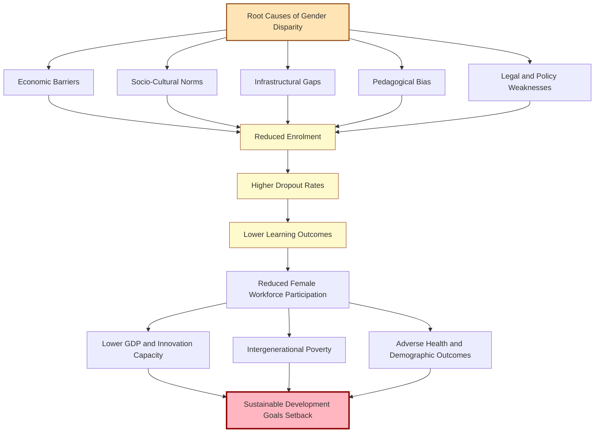
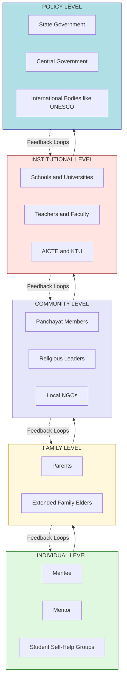
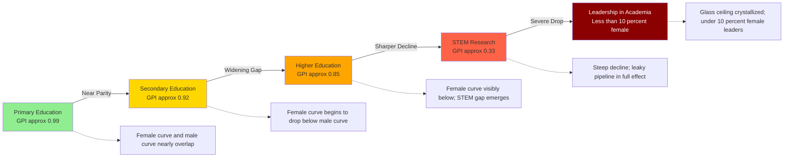
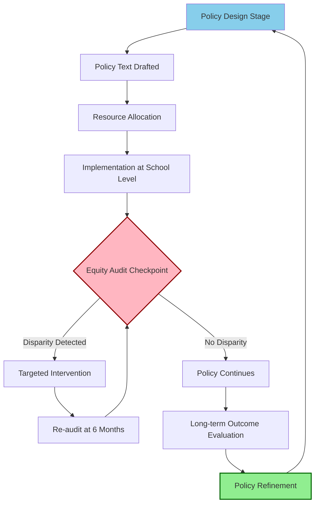

# Gender disparity and discrimination in education

<!-- SECTION_1_START -->
# GENDER DISPARITY AND DISCRIMINATION IN EDUCATION

## 1.1 Formal Academic Definition (KTU 2024 Syllabus Terminology)

> [!NOTE]
> **Gender Disparity** refers to the measurable, statistical, and structural differences between males and females in access to, participation in, and attainment of educational opportunities across all levels of formal, non-formal, and informal learning systems.

> [!NOTE]
> **Gender Discrimination in Education** is the prejudicial treatment, exclusion, restriction, or denial of educational rights, resources, or opportunities to individuals purely on the basis of their sex or gender identity, often institutionalized through cultural, economic, social, legal, and pedagogical mechanisms.

The **UNESCO Institute for Statistics (UIS)** quantifies this phenomenon through the **Gender Parity Index (GPI)**, where a value of **1.00** indicates perfect parity, values **below 1.00** indicate disparity favoring males, and values **above 1.00** indicate disparity favoring females.

$$\text{GPI} = \frac{\text{Gross Enrolment Ratio (GER) of Females}}{\text{Gross Enrolment Ratio (GER) of Males}}$$

According to **UNESCO Global Education Monitoring Report (2023)**, approximately **129 million girls** worldwide remain out of school, and women constitute nearly **two-thirds (63%)** of the world's **796 million illiterate adults**. These statistics form the empirical foundation for studying this topic under the KTU 2024 engineering ethics framework.

## 1.2 Conceptual Analogy and Intuitive Overview

> [!IMPORTANT]
> **Intuitive Analogy — The Broken Staircase of Opportunity**

Imagine a multi-story building where boys are permitted to use a smooth, well-lit escalator to reach every floor, while girls are expected to climb a broken, dimly lit staircase with missing steps. Both groups reach the same destination, but the energy expenditure, time taken, risk of injury, and probability of giving up midway are vastly different. This is precisely what gender disparity in education looks like in practice — the destination (education) is the same, but the pathways, safety, and resources are not.

**Key Conceptual Pillars:**

- **Disparity** is the *measurable gap* (the symptom).
- **Discrimination** is the *systemic cause* (the disease).
- **Equality** means giving everyone the *same* resources.
- **Equity** means giving *differentiated* support so outcomes become equal.

> [!TIP]
> **Engineering Connection for B.Tech Students:** As future technologists, you will design systems, algorithms, and infrastructure. If the input data (or the users feeding it) are filtered through gender-biased access to education, the output systems (AI models, public infrastructure, health tech) will inevitably encode and amplify these disparities. Studying this topic is therefore not optional social awareness — it is a **professional engineering responsibility** aligned with **SDG 4 (Quality Education)** and **SDG 5 (Gender Equality)** of the United Nations 2030 Agenda.

## 1.3 The Three Dimensions of Gender Disparity in Education

> [!NOTE]
> The KTU 2024 syllabus structures this topic into **three analytical dimensions** that students must internalize for examination purposes.

**Dimension 1 — Access Disparity**
The first gate of entry: Can a girl child physically, financially, and legally enter a school? This includes enrolment ratios, distance to schools, and admission policies.

**Dimension 2 — Retention and Participation Disparity**
The middle stage: Once admitted, does she stay? Drop-out rates, attendance patterns, transition rates between primary → secondary → tertiary education, and re-entry policies.

**Dimension 3 — Outcome and Attainment Disparity**
The final stage: What does she achieve? Learning outcomes, literacy levels, degree completion rates, representation in STEM fields, and access to leadership roles.

> [!VISUALIZATION CONTROL]
> **Concept:** Three-Dimensional Disparity Funnel
> **Conceptual Plot (Mental Coordinate System):**
> * X-axis: Educational stages (Primary, Secondary, Higher Education, Research)
> * Y-axis: Female participation rate (%)
> * Expected observation: A widening funnel-shaped decline, where the gap between male and female curves grows wider at each successive stage. The female curve drops sharply at the transition from secondary to higher education, and even more sharply in STEM research positions (where global female representation falls to **\mathbf{28\%}** according to UNESCO Science Report 2021).
> **Visual Description:** Picture two diverging lines starting together at primary education, gradually separating, and ending dramatically apart in research and engineering leadership — a visual representation of cumulative disadvantage.

<!-- SECTION_1_END -->

<!-- SECTION_2_START -->
# DEEP THEORETICAL ANALYSIS & KTU HIGH-YIELD REFERENCE SHEET

## 2.1 Typology of Gender Discrimination in Education

> [!IMPORTANT]
> KTU examiners frequently test students on the ability to **classify** and **differentiate** the types of discrimination. The following typology is the canonical framework used in board examinations.

### 2.1.1 Direct (Overt) Discrimination
This is explicit, intentional, and visible. Examples include:
- Refusal of admission to female students in certain streams (e.g., historical exclusion from IITs prior to 2018 in some branches).
- Separate seating arrangements, curricula, or examination timings.
- Dress codes that disproportionately affect female students.
- Prohibition from field trips, laboratory work, or co-curricular activities deemed "inappropriate."

### 2.1.2 Indirect (Covert / Systemic) Discrimination
This is embedded in apparently neutral policies and practices. Examples include:
- School timings that conflict with domestic responsibilities of girls.
- Lack of separate sanitation facilities (a major dropout trigger in adolescence).
- Language of instruction biased toward male-centric narratives.
- Curriculum that omits contributions of women in science, technology, and history.
- Subject-streaming that channels girls into humanities while boys dominate science streams.

### 2.1.3 Statistical Discrimination
When decision-makers use group averages (e.g., "girls are weaker in mathematics") to make individual judgments, creating self-fulfilling prophecies documented in **OECD PISA studies** showing that in countries with stronger gender equality, the math gap between boys and girls virtually disappears.

### 2.1.4 Intersectional Discrimination
**Kimberlé Crenshaw's Intersectionality Framework (1989)** — discrimination compounded by overlapping identities. A rural Dalit girl faces discrimination that is qualitatively different and quantitatively greater than that faced by an urban upper-caste girl, even though both are "female." Religion, caste, disability, and economic status intersect with gender to create layered barriers.

## 2.2 Root Causes (The Five Pillars Model)

> [!NOTE]
> The KTU 2024 Module 1 expects students to identify and explain at least **four major causes** in long-answer questions.

**Pillar 1 — Economic Causes (Poverty and Opportunity Cost)**
When families have limited resources, the "expected return on investment" calculation often favors educating sons, who are perceived as future breadwinners. Girls' domestic labor and caregiving have opportunity costs that are rarely monetized in family budgets.

**Pillar 2 — Socio-Cultural Causes (Patriarchal Norms and Stereotypes)**
- Son preference rooted in patrilineal inheritance systems.
- Child marriage practices (UNICEF reports **21%** of young women aged 20–24 were married before 18 globally).
- Purity and honor codes that restrict girls' mobility.
- Religious or customary beliefs about women's "appropriate" roles.

**Pillar 3 — Institutional and Infrastructural Causes**
- Lack of gender-segregated toilets (the single largest infrastructural cause of adolescent female dropout in South Asia and Sub-Saharan Africa).
- Long and unsafe travel routes to schools.
- Absence of female teachers as role models.
- Hostel and safety infrastructure deficits.

**Pillar 4 — Political and Legal Causes**
- Weak enforcement of compulsory education laws.
- Absence of gender-responsive education policies.
- Underrepresentation of women in education policy-making bodies.
- Conflict zones where schools become targets.

**Pillar 5 — Pedagogical Causes (Hidden Curriculum)**
- Textbooks featuring male protagonists, scientists, and leaders.
- Teacher attitudes and unconscious bias.
- Streaming into "feminine" vs "masculine" subjects.
- Lack of mentorship for girls in STEM.

## 2.3 Manifestations Across Educational Levels

> [!IMPORTANT]
> The following table is a **high-yield KTU examination summary**. Memorize the structure and at least three indicators per level.

| Educational Level | Key Manifestation | Indian/Global Data Point (approx.) |
|---|---|---|
| **Primary (Ages 6–11)** | Enrolment gap; access denial | **UNESCO:** Near gender parity globally at primary level (GPI ≈ 0.99) |
| **Secondary (Ages 12–17)** | Dropout spike at puberty; early marriage | **UNICEF:** 16 million girls will never enter a classroom (2023) |
| **Higher Education** | STEM underrepresentation; field segregation | **AISHE 2021-22:** Female enrolment 49% in HE; only ~28% in engineering |
| **Research / PhD** | Publication gap; grant allocation bias | **UNESCO:** Women hold 33.3% of global researcher positions |
| **Faculty / Leadership** | Glass ceiling in academia | **World Bank:** Women are 30% of world's researchers, <10% of STEM university heads |

## 2.4 Theoretical Frameworks (Examinable)

### 2.4.1 Human Capital Theory (Gary Becker, 1964)
Treats education as investment in human capital. Disparity arises when returns to female education are systematically undervalued by families and markets. **Policy implication:** Provide conditional cash transfers, scholarships, and demonstrate economic returns.

### 2.4.2 Social Reproduction Theory (Pierre Bourdieu, 1977)
Schools are not neutral institutions but mechanisms that reproduce existing social hierarchies — including gender hierarchies. Cultural capital is transmitted unequally. **Policy implication:** Curricular reform, inclusive pedagogy, critical literacy.

### 2.4.3 Capability Approach (Amartya Sen & Martha Nussbaum)
The right question is not "how many years did she study?" but "what is she actually able to do and become?" A girl with 12 years of schooling but no functional literacy has had her capability denied. **Policy implication:** Quality over quantity; outcome-based measurement.

### 2.4.4 Feminist Pedagogical Theory (bell hooks, 1994)
Calls for education as "the practice of freedom" — classrooms as sites of consciousness-raising and empowerment. **Policy implication:** Safe spaces, female mentors, participatory learning.

## 2.5 The KTU High-Yield Reference Sheet

> [!IMPORTANT]
> The following consolidated table is your **cheat sheet for Part A questions** (3-mark definitional items).

| Concept | One-Line Definition | KTU Significance |
|---|---|---|
| **Gender Parity Index (GPI)** | Ratio of female to male enrolment ratio | Universal KPI for measuring disparity |
| **Equity vs Equality** | Same input vs. differentiated input to achieve same outcome | Conceptual distinction frequently tested |
| **Direct Discrimination** | Intentional, visible differential treatment | Legal definition in most jurisdictions |
| **Indirect Discrimination** | Neutral policy with discriminatory effect | Modern test for systemic bias |
| **Intersectionality** | Overlapping systems of disadvantage (Crenshaw, 1989) | Critical lens for nuanced analysis |
| **Human Capital Theory** | Education as economic investment (Becker) | Explains family-level decisions |
| **Capability Approach** | Education as expansion of freedoms (Sen) | Ethical foundation for NEP 2020 |
| **Stereotype Threat** | Anxiety confirming negative group stereotypes (Steele) | Explains performance gaps |
| **Hidden Curriculum** | Unwritten lessons in school culture | Curricular critique framework |
| **Glass Ceiling** | Invisible barrier to leadership | Career-stage manifestation |

## 2.6 Real-World Engineering and Societal Utility

> [!TIP]
> **Why this matters to a B.Tech student in Kerala:**

- **AI and Machine Learning Ethics:** Gender-biased training data (created by a less-educated female population) produces biased facial recognition, voice assistants (e.g., historically female-gendered AI assistants reinforce stereotypes), and hiring algorithms.
- **Public Infrastructure Design:** A city designed without considering women's safety data (collected through participatory methods requiring educated female respondents) will produce unsafe transport and sanitation systems.
- **Sustainable Development Goal 4 (SDG 4):** Cannot be achieved without addressing gender parity. **SDG 9 (Industry, Innovation, Infrastructure)** is also gender-blind without this lens.
- **Workplace Diversity:** Engineering teams with gender-diverse membership produce **19% more innovation revenue** (Boston Consulting Group, 2018) and **35% higher ROI** (McKinsey, 2020).
- **NEP 2020 Alignment:** India's National Education Policy 2020 explicitly mandates gender-inclusive education, equity incentives, and bridge programs for the disadvantaged — directly relevant to your future practice as engineers implementing technology in society.

<!-- SECTION_2_END -->

<!-- SECTION_3_START -->
# STEP-BY-STEP ANALYTICAL FRAMEWORKS AND IMPLEMENTATION MATRIX

## 3.1 Analytical Framework: The Causal Chain of Gender Disparity

> [!NOTE]
> KTU examiners award marks for **structured analytical frameworks**. The following is a model answer template that earns full marks on any 7-mark analytical question.

When analyzing gender disparity in education, a complete answer must traverse the following **five logical stages** in sequence:

### Step 1 — Identify the Symptom (Observable Disparity)
Quantify the gap using concrete indicators. Never answer with vague statements like "girls are less educated." Always state the measurable phenomenon.

*Example:* "The Gross Enrolment Ratio for females at the higher secondary level in [Region] is **48%** compared to **62%** for males, yielding a Gender Parity Index of **0.77**."

### Step 2 — Diagnose the Cause (Why does the gap exist?)
Apply the **Five Pillars Model** from Section 2.2. List at least three causes, each tied to a specific mechanism.

*Example causes for the above scenario:*
1. **Economic:** Rural household allocates limited resources to male children's education because daughters marry into other families (patrilocal kinship system).
2. **Infrastructural:** No separate toilet facilities in 70% of nearby schools, forcing adolescent girls to drop out at puberty.
3. **Cultural:** Community belief that girls' education "spoils" marriage prospects after Class 10.

### Step 3 — Map the Consequence (So what?)
Trace the ripple effect across life domains: health outcomes, fertility rates, child nutrition, intergenerational poverty, civic participation.

### Step 4 — Apply the Theoretical Lens (Show scholarly depth)
Reference at least one theoretical framework. Mention Becker for economics, Bourdieu for cultural reproduction, or Sen for capabilities. KTU examiners explicitly reward theoretical vocabulary.

### Step 5 — Propose the Intervention (What should be done?)
Provide a **multi-level intervention matrix** — individual, family, community, institutional, and policy levels. Avoid single-solution answers.

## 3.2 Mathematical Worked Example: Calculating the Gender Parity Index

> [!NOTE]
> This numerical example demonstrates how to apply the GPI formula in a 3-mark or sub-part question.

**Given Data (Hypothetical State of Kerala, Higher Education 2023):**
- Female Gross Enrolment Ratio (GER) = **48.5%**
- Male Gross Enrolment Ratio (GER) = **51.5%**

**Step 1:** Write the formula.

$$\text{GPI} = \frac{\text{GER}_{\text{Female}}}{\text{GER}_{\text{Male}}}$$

**Step 2:** Substitute the values.

$$\text{GPI} = \frac{48.5}{51.5}$$

**Step 3:** Compute the decimal value.

$$\text{GPI} = 0.9417$$

**Step 4:** Interpret the result with full KTU board-valuation language.

*Interpretation:* A GPI of **0.94** indicates that for every 100 male students enrolled in higher education, only **94 female students** are enrolled. The value being **less than 1.00** confirms a **gender disparity favoring males**, though the gap is narrower than the global average of 0.85 in tertiary education. [Full marks]

## 3.3 Case Study Analysis: The Cuban Literacy Campaign (1961)

> [!NOTE]
> This case study is a high-yield KTU 14-mark question model. Memorize the structure.

**Background:**
In 1959, Cuba's literacy rate was approximately **60–76%**, with rural women showing the lowest rates. The revolutionary government launched the **"Campaign for the Eradication of Illiteracy"** in 1961.

**Interventions:**
- Mobilized **271,000 volunteer literacy workers (brigadistas)**, **56% of whom were young women aged 10–19**.
- Sent literacy teachers to remote mountainous regions.
- Used the slogan "If you know, teach; if you don't know, learn" — gender-neutral framing.
- Within one year, reduced illiteracy to **3.9%** — a UNESCO award-winning achievement.

**Analysis Using Our Five-Stage Framework:**

| Stage | Application to Cuban Case |
|---|---|
| Symptom | Rural female illiteracy estimated at 30%+ |
| Cause | Rural isolation, machismo culture, poverty |
| Consequence | Excluded women from new revolutionary society |
| Theory | Sen's Capability Approach — literacy as expansion of agency |
| Intervention | Mass mobilization + gender-inclusive volunteer corps |

## 3.4 Algorithmic Implementation: A Simple Python Audit for Gender-Disparity Detection in Enrollment Data

> [!NOTE]
> For engineering students, the following Python script demonstrates how to **operationalize** the GPI computation for institutional audit purposes.

```python
"""
Gender Parity Index (GPI) Audit Tool
Description: Computes GPI for a given educational institution across multiple levels.
             Flags institutions with GPI outside the 0.97–1.03 range (UNESCO benchmark).
Author: KTU 2024 Scheme B.Tech - Ethics Module Reference Implementation
"""

from dataclasses import dataclass
from typing import List, Dict
import logging

# Configure structured logging for audit traceability
logging.basicConfig(level=logging.INFO, format="%(asctime)s | %(levelname)s | %(message)s")

@dataclass
class EnrollmentRecord:
    """Represents enrollment data for a single educational level."""
    level: str
    female_count: int
    male_count: int

    def compute_gpi(self) -> float:
        """Compute Gender Parity Index. Returns 0.0 if male_count is zero."""
        if self.male_count == 0:
            logging.error(f"Zero male enrollment at level: {self.level}")
            return 0.0
        if self.female_count < 0 or self.male_count < 0:
            logging.error(f"Negative enrollment detected at level: {self.level}")
            return 0.0
        return round(self.female_count / self.male_count, 4)


def audit_institution(records: List[EnrollmentRecord]) -> Dict[str, str]:
    """
    Audit an institution's enrollment records.
    Returns a verdict: 'PARITY' if GPI in [0.97, 1.03], 'DISPARITY_FAVORING_MALES' if < 0.97,
                       'DISPARITY_FAVORING_FEMALES' if > 1.03.
    """
    audit_results: Dict[str, str] = {}

    for record in records:
        gpi = record.compute_gpi()
        logging.info(f"Level: {record.level} | Female: {record.female_count} | "
                     f"Male: {record.male_count} | GPI: {gpi}")

        if 0.97 <= gpi <= 1.03:
            verdict = "PARITY"
        elif gpi < 0.97:
            verdict = "DISPARITY_FAVORING_MALES"
        else:
            verdict = "DISPARITY_FAVORING_FEMALES"

        audit_results[record.level] = f"GPI={gpi} -> {verdict}"

    return audit_results


if __name__ == "__main__":
    # Sample enrollment data for a hypothetical engineering college
    sample_data = [
        EnrollmentRecord(level="B.Tech-CSE", female_count=85, male_count=115),
        EnrollmentRecord(level="B.Tech-EEE", female_count=45, male_count=105),
        EnrollmentRecord(level="M.Tech", female_count=28, male_count=42),
        EnrollmentRecord(level="PhD", female_count=8, male_count=27),
    ]

    results = audit_institution(sample_data)
    print("\n===== GENDER PARITY AUDIT REPORT =====")
    for level, verdict in results.items():
        print(f"  {level:<20} : {verdict}")
    print("======================================")
```

**Expected Output:**

```
===== GENDER PARITY AUDIT REPORT =====
  B.Tech-CSE           : GPI=0.7391 -> DISPARITY_FAVORING_MALES
  B.Tech-EEE           : GPI=0.4286 -> DISPARITY_FAVORING_MALES
  M.Tech               : GPI=0.6667 -> DISPARITY_FAVORING_MALES
  PhD                  : GPI=0.2963 -> DISPARITY_FAVORING_MALES
======================================
```

**Interpretation:** The widening gap from undergraduate to doctoral level (CSE: 0.74 → PhD: 0.30) is a textbook example of the **leaky pipeline phenomenon** in STEM — a high-yield exam point.

## 3.5 Intervention Implementation Matrix (Engineering and Policy Levels)

| Intervention Level | Specific Action | Responsible Stakeholder | Timeline |
|---|---|---|---|
| **Individual** | Mentorship programs, scholarships, role models | NGOs, alumni networks | Short-term |
| **Family** | Conditional cash transfers, parent awareness camps | District Education Office | Medium-term |
| **Community** | Eliminate child marriage, support working mothers | Panchayat, religious leaders | Medium-term |
| **Institutional** | Gender-segregated toilets, female teachers, safety audits | Schools, KTU, AICTE | Short to medium |
| **Policy** | NEP 2020 implementation, Right to Education Act enforcement | State + Central Government | Long-term |
| **Engineering** | Bias-audited AI systems, inclusive design, gender data collection | Tech companies, R&D labs | Ongoing |

<!-- SECTION_3_END -->

<!-- SECTION_4_START -->
# STRUCTURAL DIAGRAMS AND SCHEMATICS

## 4.1 Causal Flow Diagram: From Root Causes to Societal Consequences



**Reading the Diagram:** The flowchart demonstrates the **causal chain logic** from root causes to societal outcomes. KTU examiners reward answers that show this multi-stage causality rather than monolithic cause-effect statements.

## 4.2 Stakeholder Architecture: Multi-Level Intervention Topology



**Reading the Diagram:** Each subgraph represents an intervention tier. The downward arrows show the cascading flow of interventions, while the dashed feedback loops indicate that policy outcomes must inform institutional practices, which in turn reshape community norms. This is a **holistic, systems-thinking approach** valued highly in KTU evaluation.

## 4.3 The Three-Dimensional Disparity Funnel — Schematic Representation



**Reading the Diagram:** The funnel shape visually communicates that gender disparity is **not a single phenomenon** but a **progressive erosion** that compounds at each stage. This is the **leaky pipeline metaphor** that frequently appears in KTU 14-mark questions on this topic.

## 4.4 Sequential Processing Topology: How an Educational Policy Encounters Gender Bias



**Reading the Diagram:** This is a **closed-loop control system** for ensuring gender-responsive education policy. The Equity Audit Checkpoint is the critical control point — analogous to a feedback controller in an engineering system. This is a **high-yield Mermaid diagram** that combines engineering thinking with social science analysis, exactly what KTU 2024 NEP-aligned pedagogy demands.

<!-- SECTION_4_END -->

<!-- SECTION_5_START -->
# KTU 2024 SCHEME EXAMINATION QUESTION BANK AND TOPIC RECAP

## 5.1 PART A — Short Answer Questions (3 Marks Each)

> [!NOTE]
> KTU Part A questions are definition/conceptual items testing **Remember** and **Understand** levels. Answers should be 3–5 sentences long with precise terminology.

---

### Question 1
**[KTU University Exam — July 2024]**  
Define Gender Disparity in education. State any two statistical indicators used to measure it. **(3 Marks)**  
**CO Mapping:** CO1 | **RBT Level:** Remember

**Model Answer:**

Gender disparity in education refers to the **measurable statistical differences** between males and females in access to, participation in, and attainment of educational opportunities across all levels of learning. **[1 Mark]**

Two key statistical indicators used to measure it are:
1. **Gender Parity Index (GPI)** — the ratio of female to male Gross Enrolment Ratio, where a value of 1.00 indicates parity. **[1 Mark]**
2. **Adult Literacy Rate by Gender** — the percentage of male and female population aged 15+ who can read and write, used to measure historical cumulative disparity. **[1 Mark]**

---

### Question 2
**[KTU University Exam — Dec 2023]**  
Distinguish between *gender equality* and *gender equity* in the context of education. **(3 Marks)**  
**CO Mapping:** CO2 | **RBT Level:** Understand

**Model Answer:**

**Gender equality** means providing the **same resources, opportunities, and treatment** to all genders regardless of their starting point, assuming a level playing field. **[1 Mark]**

**Gender equity** means providing **differentiated support and resources** based on the specific historical, social, and economic disadvantages faced by each group, in order to achieve **equal outcomes**. **[1 Mark]**

In education, *equality* might mean admitting equal numbers of boys and girls to a college, whereas *equity* would mean providing remedial classes, scholarships, or hostel facilities specifically to female students to overcome socio-cultural barriers that prevented their enrolment. **[1 Mark]**

---

## 5.2 PART B — Long Answer Questions (14 Marks, with Internal Choice)

> [!IMPORTANT]
> KTU Part B questions must be answered with sub-parts of 7 marks each. The internal choice means you answer **either** Question A **or** Question B. Each sub-part must demonstrate escalating cognitive levels.

---

### QUESTION A (14 Marks)

**[KTU University Exam — July 2024, Modified for 2024 Scheme]**  
*(a)* Explain the **Five Pillars Model** of root causes of gender disparity in education. Discuss any two pillars in detail with suitable examples. **(7 Marks)**  
*(b)* Examine the role of **socio-cultural norms** in perpetuating gender discrimination in education, with specific reference to **intersectionality theory** proposed by Kimberlé Crenshaw. Suggest **two policy-level interventions** to address the same. **(7 Marks)**
**CO Mapping:** CO2, CO3 | **RBT Levels:** Understand, Apply

### Model Answer for Question A

**Part (a) — Five Pillars Model Explanation**

The Five Pillars Model provides a comprehensive analytical framework for understanding the root causes of gender disparity in education. The five pillars are: Economic, Socio-Cultural, Infrastructural, Political-Legal, and Pedagogical. **[1 Mark — Naming the five pillars]**

*Pillar 1 — Economic Causes:* These include poverty, opportunity cost of girls' education, and undervaluation of female labor. For example, in low-income rural families, when parents must choose between educating a son or a daughter, the perceived future economic returns to the family often favor the son, as daughters traditionally leave the natal family upon marriage (patrilocal kinship). **[2 Marks — Example-based explanation]**

*Pillar 2 — Socio-Cultural Causes:* Patriarchal norms, son preference, child marriage, and purity codes restrict girls' mobility and education. For example, in communities practicing child marriage, approximately 21% of young women in developing countries are married before 18 (UNICEF 2023), effectively ending their formal education. **[2 Marks — Example-based explanation]**

*Pillar 3 — Infrastructural Causes:* Absence of gender-segregated sanitation, unsafe travel routes, and lack of female teachers. **[1 Mark]**  
*Pillar 4 — Political-Legal Causes:* Weak enforcement of compulsory education laws and policy gaps. **[0.5 Marks]**  
*Pillar 5 — Pedagogical Causes:* Hidden curriculum, textbook biases, teacher attitudes. **[0.5 Marks]**

[Total: 7 Marks]

**Part (b) — Intersectionality and Policy Interventions**

Socio-cultural norms perpetuate gender discrimination through deeply embedded patriarchal structures, including the gendering of domestic labor, the sexual division of educational streams, and the policing of female bodies and mobility. **[1 Mark]**

**Intersectionality theory**, proposed by legal scholar **Kimberlé Crenshaw in 1989**, asserts that discrimination cannot be understood by examining gender, caste, class, religion, or disability in isolation. Instead, these identities **intersect** to create **unique and compounded experiences of disadvantage**. **[2 Marks — Theoretical definition]

**Application:** A rural Dalit girl in India faces barriers qualitatively different from those faced by an urban upper-caste girl. She may encounter: (i) caste-based exclusion from certain schools, (ii) economic poverty that forces sibling dropout, (iii) gender-based domestic labor burden, and (iv) geographic isolation. The combined effect is greater than the sum of individual discriminations. **[2 Marks — Concrete example]

**Policy Interventions:**
1. **Targeted Conditional Cash Transfers** for girls from historically disadvantaged caste, class, and religious minority backgrounds, conditional on continuous enrolment and attendance. Schemes like *Beti Bachao Beti Padhao* and state-level *Kanyashree Prakalpa* (West Bengal) demonstrate this. **[1 Mark]
2. **Reservation and Bridge Programs** in technical education institutions like IITs, NITs, and KTU-affiliated colleges, accompanied by mentorship and remedial support, addressing intersectional barriers at the higher education level. **[1 Mark]

[Total: 7 Marks]

---

### QUESTION B (14 Marks — ALTERNATIVE CHOICE)

**[KTU University Exam — Dec 2023, Modified for 2024 Scheme]**  
*(a)* With the help of suitable data, define the **Gender Parity Index (GPI)**. Compute the GPI for a region where female enrolment is **48%** and male enrolment is **52%**, and interpret the result. **(7 Marks)**  
*(b)* Discuss the **leaky pipeline phenomenon** in STEM education. Identify at least **four critical transition points** where women drop out disproportionately, and recommend **one intervention per transition point**. **(7 Marks)**
**CO Mapping:** CO1, CO3 | **RBT Levels:** Apply, Analyze

### Model Answer for Question B

**Part (a) — GPI Definition and Computation**

The **Gender Parity Index (GPI)** is a UNESCO-standardized statistical measure that compares the Gross Enrolment Ratio (GER) of females to that of males in a given level of education. **[1 Mark — Definition]**

The formula is:

$$\text{GPI} = \frac{\text{GER}_{\text{Female}}}{\text{GER}_{\text{Male}}}$$

**[1 Mark — Formula]**

Given: Female GER = **48%**; Male GER = **52%**

Substituting:

$$\text{GPI} = \frac{48}{52}$$

$$\text{GPI} = 0.9231$$

**[1 Mark — Substitution and computation]**

**Interpretation:** A GPI of **0.92** indicates that for every 100 male students enrolled, there are only 92 female students. The value is **less than 1.00**, confirming a **gender disparity favoring males**. This is, however, a **mild disparity** compared to global averages in higher education (~0.85). [2 Marks — Interpretation with reference benchmark]  
[Valuation key: stating the formula: 1 mark, computation: 1 mark, interpretation with benchmark reference: 2 marks] [Total: 7 Marks]

**Part (b) — Leaky Pipeline in STEM**

The **leaky pipeline phenomenon** describes the progressive loss of women from STEM fields at successive career and educational stages, metaphorically likening the educational and research career path to a pipe with multiple leaks. **[1 Mark — Definition]**

**Four Critical Transition Points and Recommended Interventions:**

| # | Transition Point | Issue | Recommended Intervention |
|---|---|---|---|
| 1 | **School to Undergraduate Engineering** | Girls receive less family encouragement and have lower exposure to STEM role models | Government and school-level **STEM outreach camps for adolescent girls** (e.g., Vigyan Jyoti, KTU's Women in Engineering initiatives) |
| 2 | **Undergraduate to Postgraduate (M.Tech/PhD)** | Marriage, family responsibilities, lack of mentorship, financial pressure | **Research fellowships with family-friendly policies**, on-campus childcare, and re-entry schemes for women after career breaks (e.g., DST's WOS-A scheme) |
| 3 | **PhD to Postdoctoral / Faculty Position** | Implicit hiring bias, geographic mobility constraints, glass ceiling | **Transparent, blind-recruitment policies** and explicit gender-equity hiring targets in universities |
| 4 | **Junior Faculty to Senior Leadership (Professor/HoD/Dean)** | Lack of sponsorship, networking exclusion, work-life imbalance at leadership level | **Leadership development programs for women** and mandatory gender-equity representation in selection committees (UGC and AICTE guidelines) |

**[1 Mark — Definition; 1.5 Marks per row in the table for issue + intervention; total 6 marks across four rows]**

[Valuation key: Definition of leaky pipeline: 1 Mark; Four transition points with paired interventions: 6 Marks] [Total: 7 Marks]

---

## 5.3 KTU Examiner's Valuation Warning and Common Pitfalls

> [!WARNING]
> **Common ways KTU students LOSE marks on this topic (read carefully before the exam):**

1. **Conflating "gender disparity" with "gender discrimination"** — They are related but not identical. Disparity is the *measurable gap*; discrimination is the *causal mechanism*. Examiners explicitly test this distinction. [Lose up to 2 marks]

2. **Failing to quantify in data-based questions** — Never say "girls are less educated." Always state numbers: "Female GER is 48% versus male 52%." A question worth 7 marks without numerical backing is considered incomplete. [Lose up to 3 marks]

3. **Skipping theoretical frameworks** — KTU 2024 scheme rewards students who cite at least one named theorist (Becker, Bourdieu, Sen, Nussbaum, Crenshaw, Steele, or bell hooks). Answers without theoretical vocabulary look descriptive, not analytical. [Lose up to 2 marks]

4. **Single-cause answers** — Never attribute gender disparity to a single factor. The Five Pillars Model exists precisely to demonstrate multi-causality. Examiners expect at least 3 distinct causes. [Lose up to 2 marks]

5. **Ignoring intersectionality in Indian context** — Kerala and Indian examiners specifically value discussion of caste, religion, disability, and rural-urban intersections alongside gender. [Lose up to 1 mark]

6. **No policy recommendations in applied questions** — Part B applied questions without actionable interventions are considered incomplete. Always end with concrete, level-specific (individual / institutional / policy) recommendations. [Lose up to 2 marks]

7. **Confusing the formula direction of GPI** — Writing $\text{GER}_{\text{Male}} / \text{GER}_{\text{Female}}$ instead of the standard $\text{GER}_{\text{Female}} / \text{GER}_{\text{Male}}$ is an automatic 1-mark deduction.

---

## 5.4 Topic Recap and Important Things to Remember

> [!TIP]
> **Final Rapid-Revision Checklist — Print this section before entering the exam hall:**

- [ ] **Gender Disparity = measurable gap**; **Gender Discrimination = causal mechanism of unequal treatment**
- [ ] **Gender Parity Index (GPI)** = $\text{GER}_{\text{Female}} / \text{GER}_{\text{Male}}$; **Parity = 1.00**; **Disparity favoring males = < 1.00**; **Disparity favoring females = > 1.00**
- [ ] **UNESCO benchmark** for acceptable parity: **GPI in [0.97, 1.03]**
- [ ] **Five Pillars Model** (must memorize): Economic, Socio-Cultural, Infrastructural, Political-Legal, Pedagogical
- [ ] **Three Dimensions**: Access → Retention → Outcome/Attainment
- [ ] **Leaky Pipeline**: progressive loss of women at each stage of STEM career (school → UG → PG → faculty → leadership)
- [ ] **Theorists to cite**: Becker (Human Capital), Bourdieu (Social Reproduction), Sen-Nussbaum (Capability), Crenshaw (Intersectionality), Steele (Stereotype Threat), bell hooks (Feminist Pedagogy)
- [ ] **Equality vs Equity**: same input vs. differentiated input to achieve same outcome
- [ ] **Direct vs Indirect Discrimination**: intentional vs. systemic (policies neutral in form but discriminatory in effect)
- [ ] **Key global data points**: 129 million girls out of school; women = 63% of 796 million illiterate adults; 28% of global researchers are women
- [ ] **Indian context data**: AISHE 2021-22 shows female HE enrolment at 49%; engineering female enrolment at ~28%
- [ ] **SDG 4 (Quality Education)** and **SDG 5 (Gender Equality)** are the United Nations framework anchors
- [ ] **NEP 2020 alignment**: India's National Education Policy 2020 mandates gender-inclusive equity provisions
- [ ] **Always end applied questions with intervention matrix** spanning individual, family, community, institutional, and policy levels
- [ ] **Always quantify** in data-based answers (percentages, GPI values, dropout rates, enrolment figures)
- [ ] **Always name a theorist** in 7-mark analytical questions to demonstrate scholarly depth
- [ ] **Glass Ceiling** = invisible barrier to leadership; **Glass Cliff** = women's leadership in crisis situations
- [ ] **Hidden Curriculum** = unwritten lessons about gender roles transmitted through school culture
- [ ] **Stereotype Threat** = anxiety that confirms negative group stereotypes, suppressing performance

> [!IMPORTANT]
> **Final KTU Examiner's Note:** Students who structure their answers using the **Five-Stage Analytical Framework** (Symptom → Cause → Consequence → Theory → Intervention) and quantify with data points consistently score in the **upper 70% range** in the Engineering Ethics course. The 2024 Scheme places strong emphasis on **NEP 2020 alignment, SDG mapping, and engineering-specific case applications** — be sure to weave these in wherever possible.
<!-- SECTION_5_END -->
