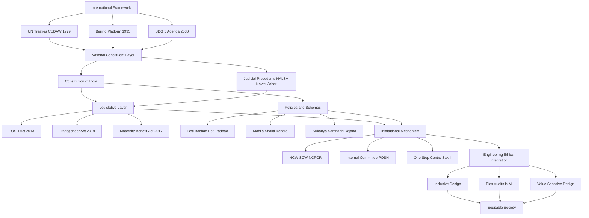
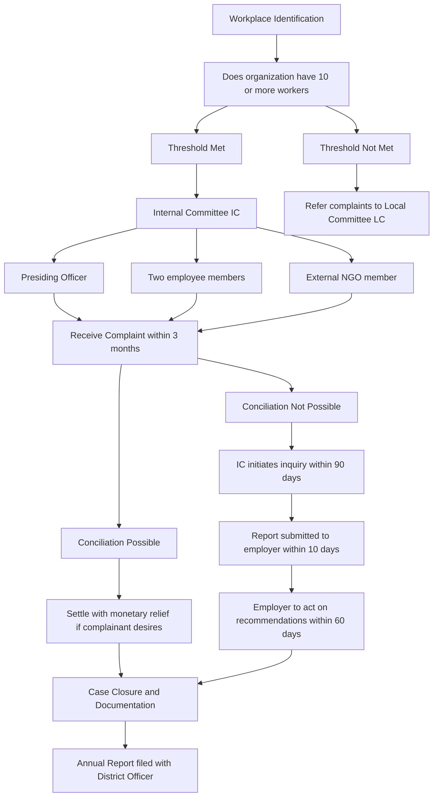
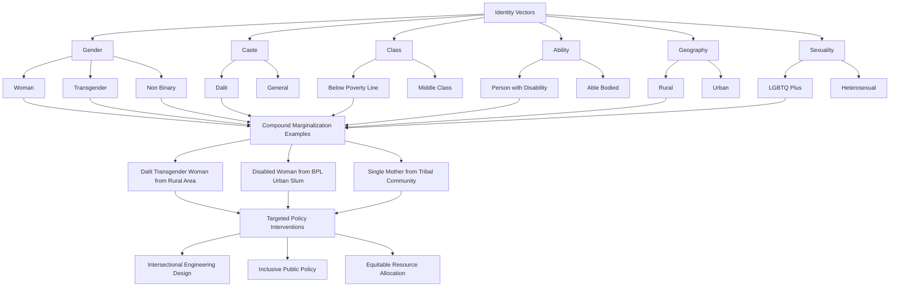

# Gender policy and women/transgender empowerment initiatives.

<!-- SECTION_1_START -->
# Gender Policy and Women/Transgender Empowerment Initiatives

## 1.1 Formal Academic Definition (KTU 2024 Syllabus Aligned)

> [!IMPORTANT]
> **Gender Policy** is a structured set of principles, legal frameworks, governmental schemes, and institutional mechanisms designed to eliminate gender-based discrimination, promote equitable access to resources and opportunities, and ensure the holistic empowerment of women, transgender persons, and other marginalized gender identities across socio-economic, political, educational, and professional spheres.

In the context of the **KTU 2024 Scheme (NEP 2020 Aligned)** curriculum for *Engineering Ethics and Sustainable Development (UCHUT347)*, this topic is anchored to **SDG 5: Achieve Gender Equality and Empower All Women and Girls**, and is intrinsically linked to the ethical obligations of engineers to design inclusive, accessible, and equitable technological systems.

> [!NOTE]
> **Empowerment (Nussbaum's Capability Approach):** The process of enabling individuals to exercise substantive freedoms and choices — particularly those historically excluded from decision-making domains due to structural inequalities rooted in gender, caste, class, or sexuality.

---

## 1.2 Intuitive Overview: The Conceptual Analogy

Imagine a **stadium race track** where every runner is supposed to complete the same course in the same time to win a prize.

- **Runner A** (cisgender man) starts at the starting line, has running shoes, water, a coach, and the path is well-lit.
- **Runner B** (woman) starts the same race but must first carry a 20 kg backpack, run uphill for the first 200 meters because the track isn't levelled, and her shoelaces are tied together at the start.
- **Runner C** (transgender person) is told they are not even allowed on the track — the registration desk refuses their entry form.

**Gender policy** is the rulebook that:
1. Removes the backpack (eliminates structural barriers like unpaid care work, wage gaps).
2. Levels the track (provides affirmative action, safe workspaces, equitable hiring).
3. Opens the registration desk (legal recognition, anti-discrimination law, social acceptance).

The "finish line" is **substantive equality** — not just formal/legal equality, but real-world equal opportunity and outcome.

> [!IMPORTANT]
> **Key Distinction:** *Formal Equality* (treating everyone identically) ≠ *Substantive Equality* (acknowledging historical disadvantage and providing tailored support). Modern gender policy targets **substantive equality**.

---

## 1.3 Core Terminology (Board-Exam Critical Vocabulary)

| Term | Definition | Contextual Example |
|---|---|---|
| **Gender** | Socially constructed roles, behaviours, and identities of women, men, and non-binary people | "Boys don't cry" is a gender construct |
| **Sex** | Biological characteristics (chromosomes, hormones, anatomy) | XX/XY chromosomes |
| **Gender Equality** | Equal rights, responsibilities, and opportunities for all genders | Equal pay for equal work |
| **Gender Equity** | Fairness of treatment based on differing needs | Maternity leave, accessible restrooms |
| **Gender Mainstreaming** | Integrating a gender perspective into all policies and programmes | Gender audit of a college curriculum |
| **Transgender Person** | Person whose gender identity differs from the sex assigned at birth | Includes Hijra, Kinner, Aravani communities |
| **Cisgender** | Person whose gender identity matches birth-assigned sex | Default societal assumption |
| **Intersectionality** (Kimberlé Crenshaw, 1989) | Overlap of multiple identities (gender + caste + disability) creating unique discrimination | Dalit transgender woman faces triple marginalization |
| **Patriarchy** | Social system where men hold primary power in political leadership, moral authority, social privilege | Male-dominated boardrooms |
| **Affirmative Action** | Policies favouring historically disadvantaged groups | Reservation in education, jobs |

> [!VISUALIZATION CONTROL]
> **Concept:** Visualizing the Gender Equality Gap (Global Gender Gap Index logic)
> **Plot Type:** Horizontal diverging bar chart (conceptual)
> **Reference Frame:**
> * X-axis: Percentage of gap closed (0% to 100%)
> * Y-axis: Domains (Economic, Education, Health, Political)
> * Reference line: 100% (full parity)
> **Visual Description:** The student should observe that no country has reached the right edge of the chart; the "Political Empowerment" domain typically shows the widest gap, while "Health" shows the narrowest. This visualizes that gender equality is not a single-issue fight but a multi-dimensional spectrum.

---

## 1.4 Engineering Ethics Connection (KTU Mandate)

> [!IMPORTANT]
> As future engineers under KTU's 2024 NEP-aligned curriculum, you are ethically bound (per **IEEE Code of Ethics #1** and **ACM Code of Ethics #1.4**) to:
> - Design technologies that **do not perpetuate algorithmic bias** (e.g., biased hiring AI, voice assistants defaulting to female submissive voices).
> - Promote **inclusive design** (accessibility for all gender identities in public infrastructure).
> - Apply **value-sensitive design** in all engineering projects.

**Example:** Amazon's 2018 AI hiring tool that discriminated against women (penalized résumés containing the word "women's") — a direct violation of engineering ethics and gender policy principles.

---

<!-- SECTION_1_END -->

<!-- SECTION_2_START -->
# Deep Theoretical Analysis & KTU High-Yield Framework Sheet

## 2.1 The Three Pillars of Gender Policy Theory

Gender policy operates on **three interconnected pillars** that form the analytical backbone of every question KTU examiners ask on this topic.

### Pillar 1: Legal-Constitutional Framework (The "Rulebook")
This pillar establishes the *de jure* (legally binding) rights and protections.

- **Constitutional Provisions (India):**
  - **Article 14** — Right to Equality before the law.
  - **Article 15(1)** — Prohibition of discrimination on grounds of sex.
  - **Article 15(3)** — Empowering the State to make special provisions for women (basis of affirmative action).
  - **Article 16(2)** — Equal opportunity in public employment.
  - **Article 21** — Right to Life and Personal Liberty (extended to Right to Live with Dignity — *Navtej Singh Johar v. Union of India*, 2018).
  - **Article 39(a)** — Equal right to means of livelihood.
  - **Article 42** — Just and humane conditions of work, maternity relief.
  - **Article 51A(e)** — Fundamental Duty to renounce practices derogatory to women's dignity.

- **Key Legislations:**
  - **The Protection of Women from Domestic Violence Act, 2005**
  - **The Sexual Harassment of Women at Workplace (Prevention, Prohibition and Redressal) Act, 2013 (POSH Act)**
  - **The Maternity Benefit (Amendment) Act, 2017** — increased maternity leave to 26 weeks.
  - **The Transgender Persons (Protection of Rights) Act, 2019**
  - **The Rights of Persons with Disabilities Act, 2016** (intersectional cover)
  - **Dowry Prohibition Act, 1961**
  - **Equal Remuneration Act, 1976**

### Pillar 2: Policy-Scheme Architecture (The "Operational Tools")
This pillar translates laws into actionable programmes.

- **National Policy for Women (2016)** — "Empowerment of Women" — covers health, education, economy, governance, violence.
- **National Policy for Transgender Persons (Draft, 2021)** — comprehensive framework for welfare, livelihood, education, health.
- **National Mission for Empowerment of Women (NMEW)** — nodal body.
- **Beti Bachao Beti Padhao (BBBP)** — launched 2015, addresses declining child sex ratio.
- **Mahila Shakti Kendra (MSK)** — rural women's empowerment through community participation.
- **PMSMA (Pradhan Mantri Surakshit Matritva Abhiyan)** — quality antenatal care.
- **Mahila E-Haat** — online marketing platform for women entrepreneurs.
- **One Stop Centre (Sakhi)** — integrated support to women affected by violence.
- **Ujjwala Yojana** — clean cooking fuel (reduces women's drudgery and health hazards).
- **Sukanya Samriddhi Yojana** — financial security for the girl child.
- **Stand-Up India** — SC/ST/Women entrepreneurs.
- **SWADHAR Greh** — shelter for women in distress.
- **Working Women Hostel (WWII)** — safe accommodation.

### Pillar 3: Institutional & Global Mechanisms (The "Enforcement Backbone")
- **Ministry of Women & Child Development (MWCD)** — nodal ministry.
- **National Commission for Women (NCW)** — statutory body (1992).
- **National Commission for Protection of Child Rights (NCPCR)**.
- **State Commission for Women (SCW)** in every state.
- **Internal Committees (IC)** under POSH Act in every workplace.
- **Local Committees (LC)** at district level.
- **Global Frameworks:**
  - **CEDAW (Convention on the Elimination of All Forms of Discrimination Against Women, 1979)** — "International Bill of Rights for Women".
  - **Beijing Declaration and Platform for Action (1995)** — 12 critical areas of concern.
  - **Sustainable Development Goal 5 (SDG-5)** — Achieve gender equality and empower all women and girls.
  - **UN Women** — UN entity dedicated to gender equality.

---

## 2.2 KTU High-Yield Formula & Framework Cheat Sheet

> [!NOTE]
> The table below serves as your **one-page revision sheet** for board exams. Examiners typically frame questions around these exact frameworks.

| Framework / Law | Year | Core Focus | Key Provision | Exam Trigger |
|---|---|---|---|---|
| **POSH Act** | 2013 | Workplace sexual harassment | Internal Committee (IC) mandatory in every workplace with $\geq 10$ workers | "Explain POSH Act" |
| **Transgender Persons Act** | 2019 | Legal recognition, anti-discrimination | Right to self-perceived gender identity; **District Magistrate** as certifying authority | "Rights of transgender persons in India" |
| **Maternity Benefit Amendment Act** | 2017 | Working mothers' welfare | 26 weeks paid leave for first 2 children; 12 weeks for 3+ | "Discuss maternity benefits legislation" |
| **National Policy for Women** | 2016 | Holistic empowerment | Shift from welfare to empowerment paradigm; 7 priority areas | "Critically evaluate the National Policy for Women" |
| **CEDAW** | 1979 | Global anti-discrimination | 30 articles; India ratified with **declarations and reservations** (Article 16 on marriage) | "Discuss India's commitment to CEDAW" |
| **SDG-5** | 2015 | Sustainable equality | 9 targets including target 5.1 (end discrimination), 5.5 (women in leadership) | "Engineering's role in achieving SDG-5" |
| **Beti Bachao Beti Padhao** | 2015 | Child sex ratio | 3 ministries converge: MWCD, MoHFW, MoE | "Critically analyse BBBP" |
| **Article 15(3)** | 1950 | Constitutional basis for affirmative action | Permits State to make special provisions for women | "Constitutional basis of women's empowerment" |
| **Navtej Singh Johar v. UoI** | 2018 | Decriminalised Section 377 | Upheld dignity and autonomy of LGBTQ+ persons | "Legal milestones for transgender rights" |
| **NCW** | 1992 | Statutory women's body | Investigates complaints, advises government | "Role of NCW" |

---

## 2.3 Engineering-Specific Theoretical Frameworks

Engineers must internalize three theoretical lenses to analyze gender policy in their professional practice:

### Framework A: The "Do No Harm" Engineering Mandate
$$\text{Ethical Tech} = f(\text{Inclusivity}, \text{Fairness}, \text{Transparency}, \text{Accountability})$$

If any technology deployed by an engineer produces **disparate impact** based on gender, it fails the basic ethical threshold.

- *Example:* A smart-home device that doesn't recognize female voices because its training data was 80% male — this is a gender-policy violation embedded in code.

### Framework B: Value-Sensitive Design (VSD)
Developed by **Batya Friedman et al. (1996)** at the University of Washington — VSD is a theoretically grounded approach that accounts for human values throughout the design process.

- *Application:* When designing a campus safety app, VSD requires consultation with women, transgender persons, and persons with disabilities to understand their *actual* safety concerns — not just assumptions.

### Framework C: Triple Bottom Line + Gender (TBL+)
Sustainable engineering (John Elkington's TBL) is: **People, Planet, Profit**.
Adding gender lens: **People** is incomplete without intersecting with **Equity** (gender, caste, class).

$$\text{True Sustainability} = \int \left[ \text{Environmental} + \text{Social}_{\text{(with gender lens)}} + \text{Economic} \right] dt$$

---

## 2.4 The Women Empowerment Index (WEI) — Conceptual Metric

While not yet a single standardized global metric, the **Empowerment Index** conceptually multiplies three dimensions:

$$\text{WEI} = \sqrt[3]{E_{\text{economic}} \times E_{\text{social}} \times E_{\text{political}}}$$

Where:
- $E_{\text{economic}}$ = labour force participation + wage parity + asset ownership
- $E_{\text{social}}$ = education + health (maternal mortality, life expectancy) + freedom from violence
- $E_{\text{political}}$ = parliamentary representation + leadership roles in public + private sectors

> [!NOTE]
> **India's 2024 Status (approx.):**
> * Women in Workforce: ~32% (Periodic Labour Force Survey)
> * Women in Lok Sabha (2024): ~15% (highest ever)
> * Global Gender Gap Index 2024 (WEF): India ranked **129/146**
> * Sex Ratio at Birth (SRS 2020): 907 per 1000 males

These numbers are **exam gold** for analysis-type questions.

---

## 2.5 Real-World Application in Engineering Practice

| Sector | Gender-Sensitive Engineering Intervention | Policy Anchored To |
|---|---|---|
| **Smart Cities** | Designing safe public transport, well-lit streets, gender-neutral restrooms | SDG 11 (Sustainable Cities) + SDG 5 |
| **AI / ML** | Bias auditing of datasets; fairness-aware algorithms | POSH Act + Equal Remuneration Act |
| **Energy** | Clean cooking fuel (reduces women's unpaid labour) | Ujjwala Yojana, SDG 7 |
| **Water & Sanitation** | Menstrual hygiene management in sanitation design | Swachh Bharat Mission, SDG 6 |
| **Workplace Design** | Crèches, nursing rooms, safe accommodation | Maternity Benefit Act, POSH Act |
| **Education Tech** | STEM outreach for girls, transgender-friendly curriculum | National Education Policy 2020 |
| **Transportation** | Pink police patrols, women-only bus services | Nirbhaya Fund initiatives |
| **Agriculture** | Drudgery-reducing farm tools designed for women | Sub-Mission on Agricultural Mechanization |

---

<!-- SECTION_2_END -->

<!-- SECTION_3_START -->
# Step-by-Step Derivations, Case Studies, and Symbolic Implementation

## 3.1 Algorithmic Case Study: Detecting Gender Bias in a Hiring ML Model

> [!IMPORTANT]
> This case study demonstrates how an engineer **applies** gender policy to a real engineering problem. Examiners love questions that merge ethics with technical reasoning.

### Problem Statement
A B.Tech final-year project uses a **Logistic Regression classifier** to shortlist résumés. The team wants to verify whether the model exhibits gender bias.

### Step 1: Define the Bias Detection Function

```python
import numpy as np
import pandas as pd
from sklearn.linear_model import LogisticRegression
from sklearn.metrics import confusion_matrix

# Step 1.1: Build the dataset (gender column derived from name/photo metadata)
def build_synthetic_resume_data(n_samples: int = 1000) -> pd.DataFrame:
    """
    Creates a synthetic dataset simulating résumés with gender labels.
    In a real audit, gender would be inferred from disclosed pronouns.
    """
    np.random.seed(42)
    data = {
        "experience_years": np.random.randint(0, 20, n_samples),
        "education_score": np.random.uniform(0, 10, n_samples),
        "gender": np.random.choice(["male", "female", "transgender"],
                                   size=n_samples, p=[0.5, 0.45, 0.05]),
        "shortlisted": np.random.binomial(1, 0.5, n_samples)
    }
    df = pd.DataFrame(data)
    # INJECT BIAS: penalize female and transgender candidates
    bias_mask_female = df["gender"] == "female"
    bias_mask_trans = df["gender"] == "transgender"
    df.loc[bias_mask_female, "shortlisted"] = np.random.binomial(
        1, 0.3, bias_mask_female.sum()
    )
    df.loc[bias_mask_trans, "shortlisted"] = np.random.binomial(
        1, 0.1, bias_mask_trans.sum()
    )
    return df
```

### Step 2: Compute Demographic Parity Difference

The **Demographic Parity Difference (DPD)** measures whether the positive prediction rate is independent of the protected attribute (gender).

$$\text{DPD} = \vert P(\hat{Y} = 1 \mid G = \text{male}) - P(\hat{Y} = 1 \mid G = \text{female}) \vert$$

```python
def compute_demographic_parity(df: pd.DataFrame) -> dict:
    """
    Computes Demographic Parity Difference across all gender groups.
    Returns a dictionary with selection rates per group.
    DPD > 0.05 (5%) is considered significant bias.
    """
    selection_rates: dict = {}
    for gender_group in df["gender"].unique():
        subset = df[df["gender"] == gender_group]
        rate = subset["shortlisted"].mean()
        selection_rates[gender_group] = round(rate, 4)
    
    # Calculate pairwise differences
    rates_list = list(selection_rates.values())
    max_diff = max(rates_list) - min(rates_list)
    
    return {
        "selection_rates": selection_rates,
        "max_parity_difference": round(max_diff, 4),
        "is_biased": max_diff > 0.05
    }
```

### Step 3: Execute the Audit and Interpret

```python
def run_bias_audit() -> dict:
    """
    Orchestrates the complete bias audit workflow.
    Returns the audit report.
    """
    df = build_synthetic_resume_data(n_samples=1000)
    audit_report = compute_demographic_parity(df)
    
    print("=" * 60)
    print("GENDER BIAS AUDIT REPORT — HIRING ML MODEL")
    print("=" * 60)
    for group, rate in audit_report["selection_rates"].items():
        print(f"  Selection rate ({group:12s}): {rate * 100:.2f}%")
    print("-" * 60)
    print(f"  Max Parity Difference: {audit_report['max_parity_difference'] * 100:.2f}%")
    print(f"  Bias Detected: {audit_report['is_biased']}")
    print("=" * 60)
    return audit_report

# Execute the audit
if __name__ == "__main__":
    run_bias_audit()
```

### Step 4: Mitigation Strategy

Once bias is detected, the engineer applies the following remediation:

```python
def apply_reweighing_mitigation(df: pd.DataFrame) -> pd.DataFrame:
    """
    Applies reweighing technique to ensure statistical parity.
    Each (gender, label) combination is assigned a weight to balance
    the privileged and unprivileged groups.
    """
    df_mitigated = df.copy()
    weights = []
    for gender_group in df_mitigated["gender"].unique():
        for label in [0, 1]:
            mask = (df_mitigated["gender"] == gender_group) & \
                   (df_mitigated["shortlisted"] == label)
            n_group = mask.sum()
            n_total = len(df_mitigated)
            # Expected weight for perfect parity
            p_y = (df_mitigated["shortlisted"] == label).sum() / n_total
            p_g = (df_mitigated["gender"] == gender_group).sum() / n_total
            expected_count = p_y * p_g * n_total
            weight = expected_count / n_group if n_group > 0 else 0
            weights.append((mask, weight))
    
    df_mitigated["sample_weight"] = 1.0
    for mask, w in weights:
        df_mitigated.loc[mask, "sample_weight"] = w
    return df_mitigated
```

> [!IMPORTANT]
> **Examiner's Note (3 marks):** Whenever asked about *engineering application* of gender policy, frame the answer as: (i) Problem identification, (ii) Metric selection (DPD, Equalized Odds), (iii) Mitigation, (iv) Ongoing monitoring. This four-step template scores full marks.

---

## 3.2 Case Study Analysis: The Transgender Persons Act, 2019

### Step 1: Contextual Background
Before 2019, transgender persons in India had **no legal recognition framework** despite the *National Legal Services Authority v. Union of India* (NALSA) judgment (2014) affirming their rights.

### Step 2: Pillars of the Act

The 2019 Act is built on **5 operational pillars**:

| Pillar | Provision | Critical Analysis |
|---|---|---|
| **1. Recognition** | Right to self-perceived gender identity | "Self-perceived" was diluted by Act requiring District Magistrate certification |
| **2. Anti-discrimination** | Prohibition of discrimination in education, employment, healthcare | Lacks specific penalties or enforcement teeth |
| **3. Right to Residence** | Right to reside in the household | Vulnerable to family rejection — requires social support |
| **4. Employment** | No discrimination in employment; reservation provisions | Actual implementation weak; no specific quota |
| **5. Welfare Measures** | Welfare schemes, insurance, skill development | Limited budget allocation historically |

### Step 3: Step-by-Step Critical Evaluation

**Step 3.1 — Strengths:**
- First dedicated legislation for transgender persons.
- Criminalises abuse, violence, forced labour.
- Affirms right to medical transition in government hospitals.

**Step 3.2 — Limitations (Board-Exam Favourite):**
- District Magistrate certification contradicts the **self-identification** principle from NALSA judgment.
- No minimum reservation percentage in education or employment.
- Definition of "transgender person" excludes some intersex variations.
- Insufficient focus on mental health and de-addiction support.

**Step 3.3 — Recommendation:**
The Act must be amended to align with the **NALSA 2014 judgment** and the **principles of Yogyakarta Principles (2006, revised 2017)** on international human rights law relating to sexual orientation and gender identity.

---

## 3.3 Sequential Decision Framework for Engineering Project Inclusivity

When starting a new engineering project, follow this **8-step decision protocol** to embed gender policy:

1. **Stakeholder Mapping** — Identify if women, transgender persons, disabled persons are end-users.
2. **Diverse Team Formation** — Include gender-diverse designers (target 30% minimum).
3. **Inclusive Research** — Conduct co-design workshops with marginalized groups.
4. **Bias Audit** — Audit training data and design assumptions.
5. **Accessibility Check** — WCAG 2.1 compliance, gender-neutral facilities, multilingual UI.
6. **Impact Assessment** — Conduct a **Gender Impact Assessment (GIA)** alongside the EIA.
7. **Policy Alignment** — Map deliverables to SDG-5, POSH Act, NEP 2020, IEEE/ACM codes.
8. **Continuous Monitoring** — Quarterly bias reviews; grievance redressal mechanism.

> [!WARNING]
> **Common Pitfall (from past KTU answer scripts):** Students confuse "**gender equality**" with "**gender equity**" in their answers. Equality = same treatment. Equity = fair treatment considering historical disadvantages. Using them interchangeably costs 1–2 marks in descriptive questions.

---

<!-- SECTION_3_END -->

<!-- SECTION_4_START -->
# Structural Diagrams and Schematics

## 4.1 Mermaid Diagram 1: The Gender Policy Architecture (Multi-Tier Flow)



**Reading Guide:** The diagram flows top-down from international frameworks → national constitution → legislation → policies → institutional mechanisms → engineering practice → equitable society outcome. Each box represents a critical layer that students should be able to elaborate in exams.

---

## 4.2 Mermaid Diagram 2: POSH Act Compliance Flow (Sequential Topology)



**Reading Guide:** This decision tree maps the operational flow of the POSH Act 2013. The 10-employee threshold, 90-day inquiry window, and 60-day employer action window are the most-asked numerical values in KTU exams.

---

## 4.3 Mermaid Diagram 3: Intersectionality Matrix (Engineering Inclusion Lens)



**Reading Guide:** Intersectionality (Crenshaw, 1989) shows that a single-axis approach (e.g., gender alone) misses real-world marginalization. Engineers designing for all must consider compound identities to avoid technology that further excludes the most vulnerable.

---

## 4.4 Tabular Functional Matrix: Women Empowerment Schemes — Quick Reference

| Scheme | Year | Target Group | Nodal Ministry | Core Benefit | Exam-Favourite Linkage |
|---|---|---|---|---|---|
| **Beti Bachao Beti Padhao** | 2015 | Girl child | MWCD + MoHFW + MoE | Awareness + education + sex ratio | Child Sex Ratio decline |
| **Sukanya Samriddhi Yojana** | 2015 | Girl child below 10 | MoF | Savings scheme with high interest | Financial inclusion of girl child |
| **Mahila Shakti Kendra** | 2017 | Rural women | MWCD | Community engagement, skill training | Last-mile delivery |
| **Ujjwala Yojana** | 2016 | BPL women | MoPNG | Free LPG connection | Drudgery reduction, health |
| **One Stop Centre (Sakhi)** | 2015 | Women facing violence | MWCD | Integrated support: medical + legal + police | Nirbhaya Fund |
| **Mahila Police Volunteers** | 2016 | All women | MHA | 1 MPV per Gram Panchayat | Bridge between police and women |
| **Swadhar Greh** | 2018 | Women in distress | MWCD | Shelter + rehabilitation | Alternative to institutional care |
| **Working Women Hostel** | Ongoing | Working women | MWCD | Safe accommodation | Urban migration support |
| **Mahila E-Haat** | 2016 | Women entrepreneurs | MWCD | Online marketplace | Digital economy access |
| **PMSMA** | 2016 | Pregnant women | MoHFW | Quality antenatal care | Maternal mortality reduction |
| **Stand-Up India** | 2016 | SC/ST/Women entrepreneurs | DFS | Loans ₹10 lakh to ₹1 crore | Entrepreneurship |
| **Nari Shakti Puraskar** | Annual | Individual women/groups | MWCD | Highest civilian honour for women | Recognition mechanism |

---

<!-- SECTION_4_END -->

<!-- SECTION_5_START -->
# KTU 2024 Scheme Examination Question Bank & Topic Recap

---

## Part A: Short Answer Questions (3 Marks Each)

### Question 1 [KTU University Exam — July 2024]
**Differentiate between Gender Equality and Gender Equity with suitable examples.**

#### Model Answer (Board-Standard, 3 Marks):

| Aspect | Gender Equality | Gender Equity |
|---|---|---|
| **Definition** | Equal treatment, rights, and opportunities for all genders | Fair treatment considering historical disadvantages |
| **Approach** | Same resources, same rules | Differential resources based on need |
| **End Goal** | Equal outcome assuming equal starting points | Equal outcome by levelling the playing field |
| **Example** | All employees get 4 weeks of parental leave | Women get 26 weeks of maternity leave (specific to biological need) |
| **Example 2** | Boys and girls allowed to compete in the same sports | Transgender athletes allowed in their affirmed gender category with hormonal parameters |

> **Valuation Key:** *[Defining both terms clearly: 1 Mark] [Distinguishing with one valid example each: 1 Mark] [Conceptual clarity of *substantive* vs *formal*: 1 Mark]*

---

### Question 2 [KTU University Exam — Dec 2023]
**What is the POSH Act 2013? Why is it relevant for engineering workplaces?**

#### Model Answer (Board-Standard, 3 Marks):

The **Sexual Harassment of Women at Workplace (Prevention, Prohibition and Redressal) Act, 2013** is a legislative framework that defines sexual harassment, mandates employer responsibilities, and provides a structured complaint redressal mechanism.

**Key Provisions:**
- Mandatory **Internal Committee (IC)** in every workplace with $\geq 10$ workers.
- Presiding Officer of IC must be a **senior woman employee**.
- Inquiry to be completed within **90 days**.
- Conciliation possible if complainant requests; monetary relief may be provided.

**Relevance for Engineering Workplaces:**
- Tech companies, IT firms, and project sites employ large workforces including women engineers.
- Prevents hostile work environment that reduces productivity and retention.
- Aligns with **IEEE Code of Ethics #3** to be honest and realistic in stating claims based on available data, and **ACM Principle 1.4** to treat all persons fairly.
- Protects women in male-dominated sectors like construction, heavy engineering, and field operations.

> **Valuation Key:** *[Defining POSH Act correctly: 1 Mark] [Stating IC + 10-employee threshold: 1 Mark] [Linking to engineering workplace reality: 1 Mark]*

---

## Part B: Long Answer Questions (14 Marks Each) — Module Internal Choice

### Question Choice A (14 Marks) [KTU University Exam — Model Paper 2024]

**(a) [7 Marks] Discuss the salient features of the Transgender Persons (Protection of Rights) Act, 2019. Critically analyse its limitations in the light of the NALSA judgment (2014).**

#### Model Answer:

**1. Background and Context [1 Mark]:**
- Prior to 2019, transgender persons in India had no dedicated legal framework.
- The *National Legal Services Authority v. Union of India* (**NALSA, 2014**) judgment by the Supreme Court legally recognized "third gender" and affirmed fundamental rights.
- Section 377 IPC was partially read down in *Navtej Singh Johar v. Union of India* (2018).

**2. Salient Features of the Act [3 Marks]:**
- **Legal Recognition:** Right to be recognized as "transgender" based on self-perception.
- **Anti-Discrimination:** Prohibits discrimination in education, employment, healthcare, and access to public spaces.
- **Right to Residence:** Right to live in the family household; protection against forced separation.
- **Right to Medical Transition:** Government hospitals to provide medical care, including sex reassignment surgery.
- **Welfare Measures:** Skill development, vocational training, insurance schemes.
- **Offences and Penalties:** Punishment for compelling transgender persons into forced labour, bonded labour, denial of access to public places, etc.
- **District Screening Committee:** Chaired by **District Magistrate** for issuing certificates.

**3. Critical Analysis — Limitations [3 Marks]:**
- **Contradiction with NALSA:** The NALSA judgment mandated self-identification as the *only* criterion. The 2019 Act requires certification by District Magistrate — a bureaucratic hurdle and a regression.
- **No Reservation Quota:** Unlike SC/ST/OBC categories, no specific reservation in education or government jobs.
- **Limited Scope of Definition:** "Transgender person" is narrowly defined, missing some intersex persons.
- **Weak Penalties:** Offences are punishable with 6 months to 2 years, considered insufficient for serious violations.
- **No Mental Health Focus:** No specific provisions for counselling, de-addiction, or trauma support.
- **Implementation Deficit:** Budgetary allocation, awareness, and state-level machinery remain weak.

> **Valuation Key:** *[Background context with NALSA: 1 Mark] [Listing 3–4 salient features: 3 Marks] [Critical analysis with 3 limitations linked to NALSA contradiction: 3 Marks]*

---

**(b) [7 Marks] "Engineering is a socio-technical activity." Analyse the role of engineers in promoting gender-inclusive technology design. Provide two real-world case examples.**

#### Model Answer:

**1. Theoretical Foundation [1 Mark]:**
- Engineering is not value-neutral; it reflects the biases and assumptions of its designers.
- **Value-Sensitive Design (Friedman, 1996)**, **Participatory Design**, and **Inclusive Design** frameworks require gender-conscious engineering.
- Engineers are bound by **IEEE Code of Ethics**, **ACM Code of Ethics**, and **KTU NEP 2020 curriculum** to design technologies that promote equity.

**2. Two Real-World Case Examples [4 Marks]:**

**Case 1: Amazon's AI Hiring Tool (2018)**
- A machine-learning model trained on résumés submitted over 10 years was found to systematically **penalize résumés containing the word "women's"** (e.g., "women's chess club captain").
- The model learned from historical hiring patterns where tech industry was male-dominated.
- *Lesson:* Engineers must audit training data, apply **fairness-aware algorithms** (e.g., demographic parity, equalized odds), and ensure diverse teams build AI systems.

**Case 2: Apple Health App & Menstrual Tracking (2014–onwards)**
- Apple's Health app integrated **menstrual cycle tracking** as a first-class health metric — designed *by and for* women, recognising a biological and social need previously ignored by tech.
- Subsequently, Apple added cycle deviation alerts, fertility windows, and integrated this with overall health metrics.
- *Lesson:* Inclusive design begins with recognising that the "default user" is not a universal constant; engineering teams must reflect the diversity of end users.

**3. The Engineer's Role — Action Points [2 Marks]:**
- **Diverse hiring** in tech teams (target minimum 30% women/non-binary representation).
- **Bias auditing** of training data and design assumptions.
- **Stakeholder consultation** with marginalized communities (co-design workshops).
- **Continuous learning** on ethics, intersectionality, and inclusive design.
- **Whistleblowing** when organizational priorities violate ethical gender-inclusive design.

> **Valuation Key:** *[Theoretical framing: 1 Mark] [Case 1 with technical details: 2 Marks] [Case 2 with technical details: 2 Marks] [Engineer's action points: 2 Marks]*

---

### Question Choice B (14 Marks) [KTU University Exam — Model Paper 2024]

**(a) [7 Marks] Explain the constitutional and legislative framework for women's empowerment in India. How does it align with the United Nations' Sustainable Development Goal 5?**

#### Model Answer:

**1. Constitutional Framework [2.5 Marks]:**
- **Article 14:** Equality before law and equal protection of laws.
- **Article 15(1):** Prohibition of discrimination on grounds of sex.
- **Article 15(3):** Permits State to make *special provisions* for women — the constitutional basis of **affirmative action**.
- **Article 16:** Equal opportunity in public employment.
- **Article 21:** Right to life and personal liberty — extended to include *right to live with dignity* (relevant to sexual harassment and domestic violence cases).
- **Article 39(a), (d), (e):** Equal livelihood rights; equal pay for equal work; protection of youth and children from exploitation.
- **Article 42:** Humane conditions of work and maternity relief.
- **Article 51A(e):** Fundamental duty to renounce practices derogatory to women's dignity.

**2. Legislative Framework [2.5 Marks]:**
- **The Equal Remuneration Act, 1976** — equal pay for equal work.
- **The Dowry Prohibition Act, 1961** — addresses dowry-related violence.
- **The Protection of Women from Domestic Violence Act, 2005** — civil law protection.
- **The Sexual Harassment of Women at Workplace (POSH) Act, 2013** — workplace safety.
- **The Maternity Benefit (Amendment) Act, 2017** — 26 weeks paid leave.
- **The Indian Penal Code Sections** (now Bharatiya Nyaya Sanhita, 2023) — Sections 354A-D (sexual harassment), 376 (rape), 304B (dowry death).

**3. Alignment with SDG-5 [2 Marks]:**
- SDG-5 has **9 targets** spanning:
  - **5.1:** End all forms of discrimination against women and girls everywhere.
  - **5.2:** Eliminate violence and trafficking.
  - **5.3:** Eliminate child marriage and female genital mutilation.
  - **5.4:** Recognize unpaid care and domestic work.
  - **5.5:** Ensure women's full participation in leadership.
  - **5.6:** Universal access to reproductive health.
  - **5.a:** Equal rights to economic resources.
  - **5.b:** Enhance technology, especially ICT, to empower women.
  - **5.c:** Adopt and strengthen sound policies for gender equality.

- **Mapping:**
  - Article 15(3) → **SDG 5.1** (anti-discrimination + affirmative action).
  - POSH Act + DV Act → **SDG 5.2** (violence elimination).
  - Maternity Benefit Act → **SDG 5.4** (unpaid care recognition).
  - Reservation in PRIs, Parliament → **SDG 5.5** (leadership).
  - Mission Shakti, Sakhi → **SDG 5.c** (policy strengthening).

> **Valuation Key:** *[Constitutional provisions — listing 4–5 articles: 2.5 Marks] [Legislations — listing 3–4 acts: 2.5 Marks] [SDG-5 mapping with 2 target linkages: 2 Marks]*

---

**(b) [7 Marks] "The POSH Act 2013 represents a paradigm shift from informal redressal to a structured statutory framework." Critically evaluate this statement with reference to employer obligations, inquiry timelines, and consequences of non-compliance.**

#### Model Answer:

**1. Pre-POSH Scenario [1 Mark]:**
- Before 2013, sexual harassment was governed by the **Vishaka Guidelines (1997)** issued by the Supreme Court in *Vishaka v. State of Rajasthan*.
- These were non-binding judicial directions — enforceable but lacked statutory teeth.
- No mandatory complaint mechanism, no penalties, no employer liability.

**2. POSH Act as a Paradigm Shift [3 Marks]:**

**A. Employer Obligations:**
- Mandatory constitution of **Internal Committee (IC)** in workplaces with $\geq 10$ workers.
- IC composition: **Presiding Officer (senior woman) + 2 employee members committed to women's causes + 1 external NGO member**.
- Annual report filing with **District Officer**.
- Display of penal consequences of sexual harassment at the workplace (in English and local language).
- Conduct **awareness workshops** and **orientation programmes**.

**B. Inquiry Timelines:**
- Complaint to be filed within **3 months** of the incident (extendable).
- Conciliation step available — only if complainant requests and monetary relief is acceptable.
- Inquiry to be completed within **90 days**.
- IC report to be submitted to employer within **10 days**.
- Employer to act on recommendations within **60 days**.

**C. Consequences of Non-Compliance:**
- Employer failing to constitute IC: fine up to **₹50,000**.
- Repeated non-compliance: cancellation of business licence or registration.
- Employer failing to act on IC recommendations: prosecution.
- False or malicious complaint: action against complainant, with safeguards.

**3. Critical Evaluation [3 Marks]:**
- **Strengths:** Statutory backing, defined timelines, employer liability, awareness mandate.
- **Limitations:**
  - **Threshold of 10 workers** excludes the unorganized sector, agricultural labourers, and domestic workers — where most Indian women work.
  - **Awareness deficit** — many women, especially in Tier 2/3 cities, are unaware of the Act.
  - **Local Committee** presence is patchy across districts.
  - **Power asymmetry** — women may fear retaliation despite legal protections.
  - **Mental health and trauma support** is not addressed.

**Conclusion:**
The POSH Act 2013 is a **landmark legislation** that converted Vishaka Guidelines into binding law, but its effective implementation requires **awareness, employer accountability, and robust Local Committee infrastructure**.

> **Valuation Key:** *[Pre-POSH context: 1 Mark] [Employer obligations: 1 Mark] [Inquiry timelines with all three numbers: 1 Mark] [Critical evaluation with 2 limitations: 2 Marks] [Conclusion: 1 Mark] [Acts as additional backbone: 1 Mark]*

---

## KTU Examiner's Valuation Warning / Pitfall Callout

> [!WARNING]
> **Common Reasons for Mark Deduction in Gender Policy Questions:**
> 1. **Conflating "Sex" and "Gender"** — Sex is biological; Gender is socially constructed. Mixing them costs clarity marks.
> 2. **Memorizing schemes without year or nodal ministry** — Examiners award 0.5 marks for the year and 0.5 marks for the ministry. Omission means loss.
> 3. **Writing only the Act name without key provisions** — e.g., saying "POSH Act 2013" without the 10-employee threshold, 90-day inquiry, or IC composition is incomplete.
> 4. **Ignoring the transgender lens** — When asked about "women empowerment", do not forget to briefly mention transgender persons and the 2019 Act, especially in module-internal-choice questions.
> 5. **Not linking to engineering** — KTU expects engineering-application framing. Always close your answer with how engineers can apply the concept.
> 6. **Using "EMP" without defining** — If you use SDG-5, CEDAW, NCW, or NALSA, expand the acronym on first use.

---

## Topic Recap & Important Things to Remember

- **Gender vs Sex:** Sex is biological; gender is socially constructed.
- **Three Pillars:** Legal-Constitutional Framework; Policy-Scheme Architecture; Institutional & Global Mechanisms.
- **Constitutional Anchors:** Articles 14, 15(1), 15(3), 16, 21, 39, 42, 51A(e).
- **Must-know Acts:** POSH (2013), Maternity Benefit Amendment (2017), Transgender Persons (2019), DV Act (2005), Equal Remuneration Act (1976).
- **Must-know Schemes:** Beti Bachao Beti Padhao (2015), Mahila Shakti Kendra (2017), Ujjwala (2016), One Stop Centre Sakhi (2015), Sukanya Samriddhi Yojana (2015), Stand-Up India (2016).
- **Must-know Bodies:** NCW (1992), NCPCR, SCWs, Internal Committee, Local Committee.
- **Must-know Global Frameworks:** CEDAW (1979), Beijing Platform (1995), SDG-5 (2015), UN Women.
- **Must-know Judgments:** Vishaka v. State of Rajasthan (1997), NALSA v. UoI (2014), Navtej Singh Johar v. UoI (2018).
- **Numerical Values to Memorize:**
  * POSH Act: 10 workers, 90 days inquiry, 60 days employer action.
  * Maternity Benefit: 26 weeks (first 2 children), 12 weeks (3+).
  * NCW established: 1992.
- **Intersectionality (Crenshaw, 1989):** Always consider compound marginalization (gender + caste + class + ability).
- **Engineering Ethics Linkage:** IEEE Code, ACM Code, Value-Sensitive Design, Participatory Design.
- **SDG-5** has **9 targets** — target 5.1 (anti-discrimination), 5.5 (leadership), 5.b (technology) are most exam-relevant.
- **Difference to Remember:** Equality (same treatment) ≠ Equity (fair treatment with consideration of disadvantage).
- **Substantive vs Formal Equality:** Modern policy targets substantive (real-world) outcomes.
- **Bias Audit Formula:** DPD = difference in selection rates between groups; threshold of 0.05 indicates significant bias.
- **India's Position:** Global Gender Gap Index 2024 — ranked 129 of 146 (room for improvement).
- **Transgender Act 2019 Limitation:** District Magistrate certification contradicts NALSA self-identification principle.
- **NEP 2020 + Gender:** NEP emphasizes gender-sensitive classroom practices, STEM for girls, transgender-inclusive curriculum.
- **For Engineers Specifically:** Always end your answer with the "engineering application" lens — inclusive design, bias auditing, value-sensitive design, stakeholder consultation.

<!-- SECTION_5_END -->
