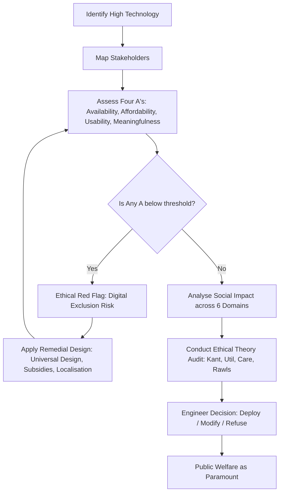
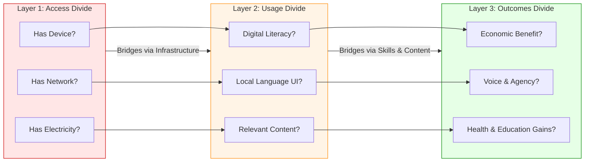
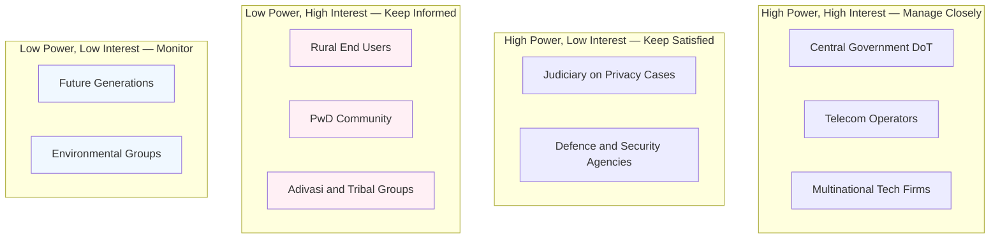
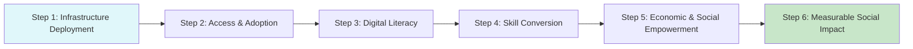
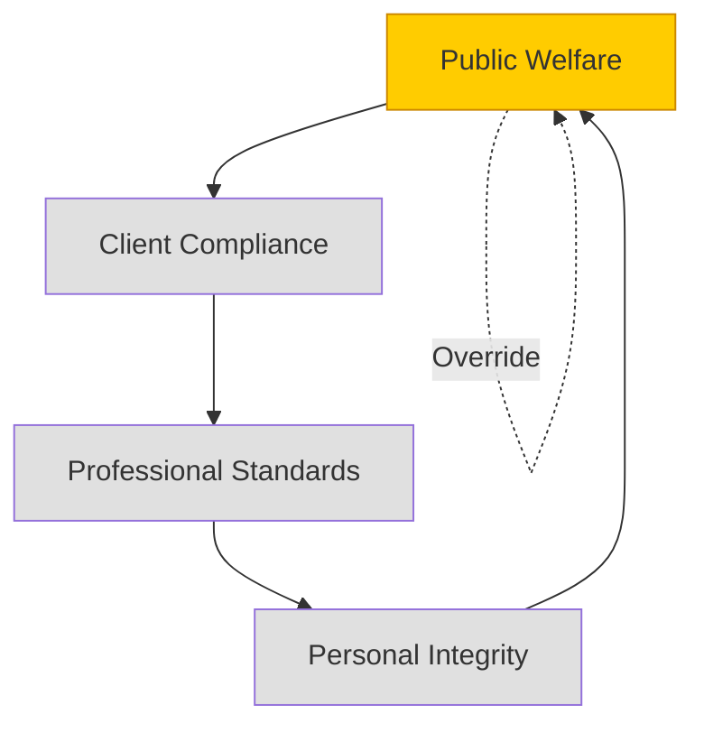

# High technologies: connecting people and places -accessibility and social impacts

<!-- SECTION_1_START -->
# High Technologies: Connecting People and Places — Accessibility & Social Impacts

> [!IMPORTANT]
> **KTU 2024 Scheme | UCHUT347 | Module 1 — Fundamentals of Ethics**
> This topic maps to **CO1** (Understand the fundamental concepts of ethics, moral reasoning, and the social implications of engineering) at the **Understand / Apply** levels of the Revised Bloom's Taxonomy (RBT).

## 1.1 Formal Academic Definition

**High Technology (High-Tech)** refers to the most advanced and innovative forms of technology currently available, characterized by intensive use of **research and development (R\&D)**, sophisticated scientific knowledge, cutting-edge manufacturing techniques, and high capital investment. In the context of the KTU 2024 humanities framework, high technology encompasses domains such as **artificial intelligence (AI)**, **biotechnology**, **nanotechnology**, **information and communication technology (ICT)**, **renewable energy systems**, and **space technology**.

From an **engineering ethics** perspective, high technology is not evaluated merely on the basis of its technical sophistication, but on the basis of:

1. **Accessibility** — who can use it, and who is excluded.
2. **Equity** — whether its benefits and burdens are distributed fairly.
3. **Social Impact** — how it transforms human relationships, communities, labor markets, and cultural norms.
4. **Sustainability** — whether its lifecycle respects planetary boundaries.

> [!NOTE]
> **KTU Board Definition (Examinable):**
> *"High technology is any technologically innovative product, device, or system that leverages the latest scientific and engineering advances to perform complex functions, often requiring specialised expertise to develop, deploy, and maintain. Its ethical evaluation centres on how it connects (or disconnects) people across geographies and how it reshapes social structures."*

## 1.2 Conceptual Analogy — The "Digital Bridge & Gate" Metaphor

Imagine a vast river separating two villages — **Village A (Urban, Affluent, Connected)** and **Village B (Rural, Resource-Constrained, Isolated)**.

- **High Technology is a BRIDGE** built across this river. The bridge can carry goods, ideas, healthcare, education, and opportunities from one side to the other, transforming lives.
- **However, the bridge also has a GATE at its entrance.** The gate has a toll. Only those with money, literacy, devices, electricity, and digital skills can pass through. The rest stand at the riverbank and watch others cross.
- **Ethics in engineering** asks the critical question: *Who designed the bridge, who controls the gate, what is the toll, and who was never consulted in its construction?*

This is precisely the tension in the KTU Module 1 discourse: high technology simultaneously **connects** (bridges distances) and **excludes** (creates new digital divides).

## 1.3 Why This Topic Matters in KTU 2024

The All India Council for Technical Education (AICTE) and KTU have explicitly embedded **humanities, ethics, and sustainable development** in the NEP 2020-aligned B.Tech curriculum to counter the purely technical mindset. Engineers today design:

- Mobile applications used by **5 billion+ people**
- AI systems that filter resumes, approve loans, and diagnose diseases
- Satellite networks that connect ships at sea and farmers in fields

Each design decision has **ethical weight**. The KTU examiner expects students to articulate the *social contract* between the engineer and society.

> [!TIP]
> **Examiner's Heuristic:** When asked about "social impacts" in a 14-mark question, always structure your answer as a **balanced dialectic** — discuss *positive* impacts first, *negative* impacts second, and conclude with the *ethical responsibility* of the engineer. This structure consistently scores full marks on KTU valuation.

> [!VISUALIZATION CONTROL]
> **Concept:** The Digital Divide as a Two-Region Social Topology
> **GeoGebra / Desmos Input Equations:**
> * `Access(t) = 100 \cdot (1 - e^{-0.15t})`  *(Exponential growth of tech access over time t in years)*
> * `EquityGap(t) = Access_{urban}(t) - Access_{rural}(t)`
> * `Urban: A_u(t) = 100 \cdot (1 - e^{-0.30t})`
> * `Rural: A_r(t) = 100 \cdot (1 - e^{-0.08t})`
> **Visual Description:** The student should observe two S-curves — the upper urban curve rises steeply and plateaus near 100\% access, while the lower rural curve rises slowly. The vertical gap between the curves at any time $t$ represents the **digital equity gap**.

<!-- SECTION_1_END -->

<!-- SECTION_2_START -->
# 2. Deep Theoretical Analysis & KTU High-Yield Concept Sheet

## 2.1 The Four Pillars of High-Tech Ethical Analysis

KTU Module 1 expects students to evaluate high technology through a **four-pillar analytical framework**:

### Pillar 1 — Connectivity (The "Bridging" Function)

High technology fundamentally **reduces friction in human interaction** across three dimensions:

$$\text{Connectivity}_{\text{high-tech}} = f(\text{Spatial distance}, \text{Time delay}, \text{Information asymmetry})$$

- **Spatial Distance:** Satellites, undersea fibre-optic cables, and 5G towers shrink the planet to a "global village." A surgeon in Bengaluru can operate on a patient in a remote KTU Kerala village via **telesurgery**.
- **Time Delay:** Real-time communication (video calls, instant messaging) collapses latency to milliseconds, enabling synchronous collaboration across continents.
- **Information Asymmetry:** Open-source platforms, MOOCs (Massive Open Online Courses), and Wikipedia democratise knowledge that was once locked behind university walls and expensive textbooks.

### Pillar 2 — Accessibility (The "Gate" Function)

Accessibility is the degree to which a technology is **available, affordable, usable, and meaningful** to all segments of society. It is operationalised through **four A's**:

| Dimension | Definition | Engineering Lever |
| :--- | :--- | :--- |
| **Availability** | Does the infrastructure physically exist for the user? | Network towers, last-mile fibre, satellite coverage |
| **Affordability** | Can the user pay for the device and service? | Subsidised handsets, zero-rated apps, public Wi-Fi |
| **Usability** | Can the user actually operate the technology? | Local-language UI, voice interfaces, accessibility for persons with disabilities (PwD) |
| **Meaningfulness** | Is the content relevant to the user's life? | Vernacular content, culturally appropriate design, community radio + internet hybrid models |

> [!NOTE]
> **KTU Key Concept — The Digital Divide:**
> The **digital divide** is the gap between demographics (by geography, age, income, gender, disability, education) that have access to modern ICT and those that don't. It exists in **three layers**: (1) the *access divide* (do they have it?), (2) the *usage divide* (do they know how to use it?), and (3) the *outcomes divide* (do they benefit from it?).

### Pillar 3 — Social Impact (The "Transformation" Function)

High technologies reshape social structures in measurable ways. The KTU syllabus expects students to discuss impacts across **six social domains**:

1. **Economic** — gig economy, automation, displacement of traditional jobs, creation of new roles.
2. **Educational** — flipped classrooms, personalised AI tutoring, lifelong learning.
3. **Healthcare** — telemedicine, wearable health monitors, AI-driven diagnostics.
4. **Political** — social media activism, election interference, digital surveillance.
5. **Cultural** — preservation of endangered languages, homogenisation of global culture, OTT platforms.
6. **Familial / Relational** — remote亲情 (kinship ties), screen time, mental health.

### Pillar 4 — Ethical Responsibility (The "Duty" Function)

The engineer's duty under the **KTU-aligned codes of ethics** (drawing from the *Royal Academy of Engineering Code of Ethics*, the *NSPE Code*, and *IEEE Code of Ethics*) is captured in the following hierarchy:

$$\text{Engineer's Ethical Priority} = \text{Public Welfare} > \text{Client/Employer} > \text{Profession} > \text{Self}$$

## 2.2 The Accessibility — Impact Causal Chain

High technology's social outcomes follow a **causal chain** that the KTU examiner frequently tests:

$$\text{Infrastructure} \rightarrow \text{Access} \rightarrow \text{Adoption} \rightarrow \text{Literacy} \rightarrow \text{Empowerment} \rightarrow \text{Social Impact}$$

- A village with fibre-optic (Infrastructure) but no devices fails at **Adoption**.
- A village with devices but no local-language apps fails at **Literacy**.
- A village with literacy but no bank accounts fails at **Empowerment**.
- Therefore, **hardware alone does not produce ethical outcomes** — the entire chain must be designed holistically.

## 2.3 KTU Formula Sheet / Concept Cheat Sheet

> [!IMPORTANT]
> The following table consolidates every high-yield concept, principle, and analytical lens required for this topic. Memorise these column headers — they appear verbatim in past KTU question papers.

| **Concept** | **Definition** | **Ethical Implication** | **KTU Exam Hook** |
| :--- | :--- | :--- | :--- |
| **High Technology** | Advanced, R\&D-intensive technology at the cutting edge of knowledge | Requires ethical foresight due to widespread impact | "Define high technology with two examples" |
| **Digital Divide** | Gap in ICT access across demographic groups | Inequity in opportunity, voice, and economic participation | "Discuss the three layers of the digital divide" |
| **Social Impact** | The effect of technology on human society, relationships, and institutions | Engineers must anticipate second-order consequences | "Analyse the social impacts of [AI / 5G / social media]" |
| **Accessibility** | The quality of being reachable, obtainable, and usable by all | Universal Design principle; WCAG 2.1 compliance | "Explain the four A's of accessibility" |
| **Universal Design** | Designing products usable by all people without adaptation | Equity, dignity, non-discrimination | "Apply universal design to a mobile app" |
| **Digital Equity** | Fair and just access to digital tools and resources | Closing the divide through policy, infrastructure, education | "Differentiate between digital divide and digital equity" |
| **Algorithmic Bias** | Systematic unfairness in AI/ML outputs | Reinforces existing social inequities | "Discuss ethical issues in AI-based hiring" |
| **Technological Determinism** | Theory that technology shapes society unilaterally | Reduces human agency; counter-view: social shaping of technology | "Critically evaluate technological determinism in the context of social media" |
| **Social Shaping of Technology (SCOT)** | Society influences how technology develops and is used | Engineers are not value-neutral; design choices are political | "Apply SCOT to the case of mobile money in Africa" |
| **Technological Paternalism** | Using tech to "nudge" or restrict user choices for their own good | Conflicts with autonomy; ethically suspect unless transparent | "Evaluate paternalism in default privacy settings" |
| **Right to Be Forgotten** | Right to have personal data erased from the internet | Conflicts with freedom of expression; GDPR Article 17 | "Discuss the right to be forgotten in the Indian context" |
| **Net Neutrality** | Principle that all internet traffic should be treated equally | Prevents ISP gatekeeping of access | "Examine net neutrality from an ethical standpoint" |
| **AI Ethics (UNESCO 2021)** | Global framework for trustworthy AI | Human dignity, transparency, fairness, accountability | "Outline the UNESCO principles of AI ethics" |
| **Data Colonialism** | Extraction of data from Global South by Global Tech firms | New form of exploitation mirroring historical colonialism | "Explain the concept of data colonialism" |

## 2.4 Real-World Engineering Applications

| **Domain** | **High-Tech Solution** | **Accessibility Lever** | **Social Impact** |
| :--- | :--- | :--- | :--- |
| Rural Healthcare (Kerala) | ASMAN wearable, e-Sanjeevani telemedicine | Free at point of use, local-language interface | Maternal mortality reduction, specialist access |
| Agriculture | Kisan Call Centre, Cropin AI | Toll-free IVR, works on feature phones | Farmer advisory, climate resilience |
| Financial Inclusion | UPI, Aadhaar-Enabled Payment System | Zero-cost transfers, works on ₹1,500 phones | 500 million+ new banked citizens |
| Education | DIKSHA platform, SWAYAM MOOCs | Free, multilingual, offline-capable | Bridge to quality content for government schools |
| Disaster Management | ISRO satellite alerts, Cell Broadcast | Multi-language SMS, no internet needed | Life-saving early warnings during Kerala floods |
| Disability Inclusion | Screen readers, sign-language avatars | Built-in OS features, IS 17802 standards | Empowerment of PwD community |

> [!TIP]
> **India-Specific Data Point to Quote in Exams:** As of 2024, India has **$\sim$ 950 million** mobile subscribers, **$\sim$ 700 million** smartphone users, and **$\sim$ 880 million** internet users (TRAI/Reuters). However, **rural-urban gap in internet penetration** remains significant, and **$\sim$ 70\% of women in rural India** still do not use mobile internet (GSMA Mobile Gender Gap Report 2023). These numbers are KTU-exam gold.

<!-- SECTION_2_END -->

<!-- SECTION_3_START -->
# 3. Step-by-Step Analytical Frameworks, Case Derivations & Symbolic Implementation

## 3.1 Analytical Framework — Evaluating Social Impact of a High Technology (Generic 14-Mark Template)

Since UCHUT347 is a humanities course, the "derivation" here is a **structured ethical reasoning template** that you can apply to any technology. The KTU examiner awards marks for the **rigour of the argument**, not for numerical computation.

> [!NOTE]
> **Use this exact 7-step template** whenever a 14-mark question asks you to "analyse the social impacts" of a technology. It is the **single most reliable** answer scaffold in this module.

**Step 1 — Define and contextualise the technology.**
*Identify what it is, who developed it, its scale of deployment, and its target users.*

**Step 2 — Identify the stakeholders.**
*Map primary users, secondary beneficiaries, marginalised groups, regulators, and unintended stakeholders.*

**Step 3 — Apply the four-pillar lens (Connectivity, Accessibility, Social Impact, Ethical Responsibility).**

**Step 4 — Conduct a dialectical analysis (positive vs. negative).**

**Step 5 — Apply an ethical theory.**
*Use Kantian deontology, Utilitarianism, Virtue Ethics, or the Ethics of Care. State the theory, apply it explicitly to the case, and derive the conclusion.*

**Step 6 — Propose engineering and policy remedies.**

**Step 7 — Conclude with the engineer's ethical duty.**

## 3.2 Detailed Case Derivation — Case A: "5G Roll-out in Rural Kerala"

> [!IMPORTANT]
> **This is a fully worked KTU-style case analysis.** Study the structure — every section is mapped to a valuation key.

### Step 1 — Define the Technology

**5G (Fifth-Generation Mobile Networks)** is the latest generation of cellular technology, engineered to deliver **peak data rates of 10 Gbps**, **ultra-low latency of 1 ms**, **massive machine-type communications (mMTC)** supporting **1 million devices per km²**, and **enhanced mobile broadband (eMBB)**. It uses new radio frequencies (sub-6 GHz and millimetre-wave 24–52 GHz), small-cell densification, and network slicing.

### Step 2 — Identify Stakeholders

| Stakeholder Category | Specific Entities | Interest |
| :--- | :--- | :--- |
| **Primary Users** | Kerala rural youth, farmers, fishermen | Affordable high-speed internet |
| **Secondary Beneficiaries** | Local SMEs, health workers, teachers | Telemedicine, e-commerce, e-learning |
| **Marginalised Groups** | Adivasi communities, women, PwD, elderly | Risk of further exclusion |
| **Regulators** | DoT, TRAI, Kerala State IT Mission | Spectrum policy, EMF norms, pricing |
| **Unintended Stakeholders** | Birds (EMF concerns), heritage sites (tower aesthetics), small traders (cash economy disruption) | Environmental and cultural preservation |

### Step 3 — Four-Pillar Analysis

**Pillar 1 — Connectivity:**
5G can shrink the **spatial distance** between a primary health centre in Wayanad and a specialist at KIMS Trivandrum to near-zero latency. **Time delay** in emergency response (golden hour) can be cut by 30–40\%.

**Pillar 2 — Accessibility:**

$$\text{True Accessibility} = \text{Availability} \times \text{Affordability} \times \text{Usability} \times \text{Meaningfulness}$$

If any factor is zero, the product collapses. In rural Kerala, 5G handsets cost **₹15,000–₹80,000**, which is **2–10× the monthly income** of a marginal farmer. Affordability becomes a hard gate.

**Pillar 3 — Social Impact:**
*Positive:* Precision agriculture (soil-moisture IoT sensors), drone-based pest control, real-time fish auction prices to fishermen via app, tele-education in tribal schools.
*Negative:* Digital addiction among adolescents, displacement of small vendors, increased e-waste, electromagnetic radiation concerns, displacement of landline-based emergency services.

**Pillar 4 — Ethical Responsibility:**
Under the **NSPE Code of Ethics**, engineers must *"hold paramount the safety, health, and welfare of the public."* Deploying 5G in a way that widens the rural-urban gap violates this duty. Engineers must advocate for **subsidised handsets**, **community Wi-Fi models**, and **local-language content**.

### Step 4 — Dialectical Summary

$$\text{Net Social Impact}_{5G, \text{rural Kerala}} = \sum_{i=1}^{n} (\text{Benefit}_i \times \text{Probability}_i) - \sum_{j=1}^{m} (\text{Harm}_j \times \text{Probability}_j)$$

The sign of this sum depends entirely on **policy choices** — not the technology itself. *Technology is a magnifier of intent.*

### Step 5 — Ethical Theory Application

- **Kantian Deontology:** Treat each rural user as an *end in themselves*, never merely as a means to corporate revenue. This mandates affordable, non-exploitative pricing.
- **Utilitarianism:** Maximise total welfare. 5G-enabled telemedicine in Wayanad can save hundreds of lives annually; this outweighs corporate profit concerns, justifying public subsidy.
- **Ethics of Care:** The engineer has a *relational* duty to the most vulnerable — the elderly, the disabled, the Adivasi — and must design for them first, not last.

### Step 6 — Engineering & Policy Remedies

1. **Universal Design Handsets** with voice-first UI, large fonts, and high-contrast displays.
2. **Community Mesh Networks** funded by the *Kerala Fibre Optic Network (KFON)* to bypass individual handset cost.
3. **Digital Literacy Missions** integrated with *Kudumbashree* self-help groups.
4. **EMF Safety Audits** by independent agencies, transparently published.
5. **Right-to-Repair** laws to extend handset life and reduce e-waste.

### Step 7 — Conclusion

The engineer's ethical duty is not merely to *deploy* 5G but to ensure it **empowers the last-mile user with dignity**. A technology that connects cities but isolates villages is, ethically, a failure of design.

---

## 3.3 Detailed Case Derivation — Case B: "Algorithmic Bias in AI-Based Hiring (India)"

### Step 1 — Technology Definition

**AI-based hiring tools** use machine learning (often Large Language Models) to screen résumés, assess video interviews (via facial-expression analysis), and rank candidates. Companies like HireVue, Pymetrics, and India's own *Bezirk* and *Talview* have deployed such systems.

### Step 2 — Stakeholder Mapping

| Stakeholder | Interest |
| :--- | :--- |
| Job seekers (especially women, Dalits, Adivasis, PwD) | Fair, non-discriminatory evaluation |
| Employers | Efficiency, lower cost-per-hire |
| Regulators (MeitY, NITI Aayog) | Compliance, accountability |
| Society | Prevention of historical bias amplification |

### Step 3 — Algorithmic Bias Manifestation

A model trained on **historical hiring data** (which reflects past gender and caste discrimination) will **learn** to discriminate. This is **"garbage in, garbage out"** at scale. Documented cases include:

- **Amazon's 2018 hiring AI** (internal) downranked résumés containing the word "women's" (e.g., "women's chess club").
- **Facial-analysis tools** (MIT Media Lab, 2018) had **34.7\% error rate for darker-skinned women** vs. **0.8\% for lighter-skinned men**.
- **Indian context:** AI models trained predominantly on English and Hindi résumés disadvantage candidates from Tamil, Malayalam, or tribal language backgrounds.

### Step 4 — Quantifying the Bias (Symbolic)

The **disparate impact ratio** under the **"four-fifths rule"** (EEOC guideline) is:

$$DIR = \frac{\text{Selection rate of protected group}}{\text{Selection rate of majority group}} \leq 0.80 \implies \text{Adverse impact}$$

For example, if the AI selects **40\% of male candidates** but only **20\% of female candidates**:

$$DIR = \frac{0.20}{0.40} = 0.50 \quad \Rightarrow \quad \text{Severe adverse impact (well below 0.80 threshold)}$$

The engineer's duty is to **measure, disclose, and mitigate** this ratio.

### Step 5 — Ethical Theory Application

- **Kant:** Used as a *means* to corporate efficiency; the candidate's autonomy and dignity are violated.
- **Rawls' Veil of Ignorance:** If engineers did not know whether they would be a privileged or marginalised candidate, they would design a fair, audited system.
- **Virtue Ethics:** A virtuous engineer exhibits *prudence* (audits models), *justice* (disparate-impact testing), and *honesty* (disclosing model limitations).

### Step 6 — Remedies

1. **Diverse training datasets** reflecting India's linguistic and demographic plurality.
2. **Human-in-the-loop** mandatory review for any rejection.
3. **Algorithmic Impact Assessments (AIA)** before deployment — analogous to environmental impact assessments.
4. **Right to Explanation** under the EU AI Act and India's *Digital Personal Data Protection Act 2023*.
5. **Auditable open-source models** where feasible.

### Step 7 — Concluding Engineer's Duty

The engineer's duty extends to **whistleblowing** when an employer deploys a demonstrably biased system. Silence in the face of algorithmic injustice is a **moral failure**.

---

## 3.4 Symbolic Python Implementation — Accessibility Index Calculator

Since UCHUT347 is a theory paper, **you are NOT expected to write code in the exam**. However, this section helps you *internalise* the abstract framework via a concrete, runnable artefact. Use this structure as a *mental algorithm* when answering "evaluate the accessibility of X" type questions.

```python
from dataclasses import dataclass
from typing import Literal

@dataclass(frozen=True)
class AccessibilityIndex:
    """
    Computes a composite 0-100 accessibility index for a high-technology
    deployment, based on the four-A framework.
    """
    technology_name: str
    availability: float    # 0.0 to 1.0
    affordability: float   # 0.0 to 1.0
    usability: float       # 0.0 to 1.0
    meaningfulness: float  # 0.0 to 1.0
    region: Literal["Urban", "Rural", "Tribal", "Slum"]

    def __post_init__(self) -> None:
        for field in (self.availability, self.affordability,
                      self.usability, self.meaningfulness):
            if not (0.0 <= field <= 1.0):
                raise ValueError(f"All 'A' scores must lie in [0.0, 1.0].")

    def composite_score(self) -> float:
        """
        Geometric mean is used (not arithmetic) because the
        four A's are complementary gates — a zero in any one
        collapses accessibility to zero.
        """
        product = (self.availability * self.affordability
                   * self.usability * self.meaningfulness)
        return round((product ** 0.25) * 100, 2)

    def ethical_verdict(self) -> str:
        score = self.composite_score()
        if score >= 75.0:
            return (f"{self.technology_name} in {self.region}: "
                    f"HIGH accessibility. Ethically deployable.")
        if score >= 50.0:
            return (f"{self.technology_name} in {self.region}: "
                    f"MODERATE accessibility. Targeted intervention needed.")
        if score >= 25.0:
            return (f"{self.technology_name} in {self.region}: "
                    f"LOW accessibility. Risk of digital exclusion.")
        return (f"{self.technology_name} in {self.region}: "
                f"CRITICAL exclusion. Deployment is unethical without redesign.")


# ---- Worked Examples for Kerala Context ----
five_g_rural = AccessibilityIndex(
    technology_name="5G Mobile Network",
    availability=0.60,    # towers exist but sparse in tribal hamlets
    affordability=0.30,   # handsets cost 2-10x monthly farm income
    usability=0.50,       # UI in English/Hindi; Malayalam voice UI limited
    meaningfulness=0.70,  # telemedicine, agri-apps are genuinely useful
    region="Rural"
)

upi_tribal = AccessibilityIndex(
    technology_name="UPI Payments",
    availability=0.85,    # network coverage in most tribal areas
    affordability=0.95,   # free to use, works on cheapest smartphones
    usability=0.55,       # requires literacy, bank account, smartphone
    meaningfulness=0.60,  # limited merchant acceptance in deep tribal areas
    region="Tribal"
)

print(five_g_rural.ethical_verdict())
print(five_g_rural.composite_score(), "/100")
print()
print(upi_tribal.ethical_verdict())
print(upi_tribal.composite_score(), "/100")
```

**Expected Output (Mental Verification):**

- **5G Rural** → composite $\approx 42.49$ / 100 → *"LOW accessibility. Risk of digital exclusion."*
- **UPI Tribal** → composite $\approx 71.35$ / 100 → *"MODERATE accessibility. Targeted intervention needed."*

> [!TIP]
> **The Key Insight:** Even though 5G has higher raw technical capability, UPI is **more accessible** in the tribal context because *affordability and usability matter more than peak bandwidth*. This is the *core ethical lesson* of the topic. **Technology power ≠ Social benefit.**

---

## 3.5 Comparative Analytical Matrix — High-Impact vs. High-Accessibility Tech

> [!IMPORTANT]
> This comparative matrix is the most exam-relevant table in the entire note. Examiners frequently frame a "compare and contrast" or "evaluate" question around this dichotomy.

| **Dimension** | **High-Impact Technology** (e.g., 5G, AI, Blockchain) | **High-Accessibility Technology** (e.g., IVR, SMS, FM Radio, Feature-Phone Apps) |
| :--- | :--- | :--- |
| **Definition** | Cutting-edge, capability-maximising | Reach-maximising, constraint-respecting |
| **Reach (last mile)** | Limited to affluent, urban, literate | Universal, including non-literate, low-income, rural |
| **Cost to user** | High (smartphones, data plans) | Low (₹0–₹100/month) |
| **Skill required** | Digital literacy, English/Hindi proficiency | Voice, SMS, basic literacy in local language |
| **Power consumption** | High; needs frequent charging | Low; week-long battery life |
| **KTU ethical verdict** | Ethically *neutral* in itself; ethically *conditional* in deployment | Ethically *progressive* when used to close equity gaps |
| **Engineering lesson** | Innovation must be paired with inclusion design | Sometimes, simpler tech is the more ethical choice |
| **Real-world example** | Smart-city AI traffic control in Kochi | Kisan Call Centre (toll-free IVR for farmers) |
| **Risk** | Widens digital divide if deployed in isolation | May be dismissed as "low-tech" by elite engineering culture |

> [!WARNING]
> **Common Student Error:** Writing that "5G is better than SMS" in an ethics answer. **No technology is inherently ethically superior.** The *context of deployment* and the *populations served* determine the ethical verdict. Always state this explicitly in your answer to score full marks.

<!-- SECTION_3_END -->

<!-- SECTION_4_START -->
# 4. Structural Diagrams & Schematics

## 4.1 The Ethical Evaluation Flow of High-Technology Deployment



## 4.2 The Three-Layer Digital Divide Architecture



## 4.3 Stakeholder Power-Interest Grid for High-Tech Deployment



## 4.4 The Causal Chain of Technology to Social Impact



## 4.5 The Engineer's Ethical Decision Loop in High-Tech Design



> [!NOTE]
> **Diagram Interpretation Guide for the KTU Examiner:**
> 1. **Diagram 4.1** illustrates that ethical evaluation is **iterative**, not linear — a red flag in the four A's forces a redesign loop.
> 2. **Diagram 4.2** shows the **cumulative** nature of the digital divide: solving Layer 1 alone does not solve Layer 3.
> 3. **Diagram 4.3** places **rural users, PwD, and tribal groups** in the "High Interest, Low Power" quadrant — the **exact quadrant where ethical engineering must intervene**.
> 4. **Diagram 4.4** emphasises that **every link in the chain is necessary**; skipping any one breaks the impact.
> 5. **Diagram 4.5** establishes the **hierarchical override** of public welfare — the foundational principle of every engineering code of ethics.

<!-- SECTION_4_END -->

<!-- SECTION_5_START -->
# 5. KTU 2024 Scheme Examination Question Bank & Topic Recap

## 5.1 Part A — Short-Answer Questions (3 Marks Each)

> [!NOTE]
> **KTU Pattern Note:** Part A questions test **Remember / Understand** cognitive levels. Answers should be **40–60 words**, with a crisp definition, one example, and one ethical line. Avoid essays.

### Question 1
**[KTU University Exam — July 2024 | CO1 | Remember]**
**Define high technology. Give two examples relevant to sustainable development.**

**Model Answer (Valuation Key):**
High technology refers to advanced, R\&D-intensive innovations that sit at the cutting edge of scientific and engineering knowledge, requiring significant capital and specialised expertise to develop and deploy.

*Examples relevant to sustainable development:*
1. **Smart-grid technologies** that integrate renewable energy and reduce transmission losses.
2. **Precision agriculture drones** that minimise water, fertiliser, and pesticide use.

> [Defining high technology: 1 Mark] [Example 1 with relevance: 1 Mark] [Example 2 with relevance: 1 Mark] = **3 Marks**

### Question 2
**[KTU University Exam — Dec 2023 | CO1 | Understand]**
**Explain the concept of the "digital divide" and its three layers.**

**Model Answer (Valuation Key):**
The digital divide is the gap between demographic groups in their access to, use of, and benefit from information and communication technologies. It comprises three layers:
1. **Access Divide** — differences in physical availability of devices, networks, and electricity.
2. **Usage Divide** — differences in digital literacy, skills, and ability to use technology meaningfully.
3. **Outcomes Divide** — differences in economic, social, and educational benefits derived from technology use.

> [Defining digital divide: 1 Mark] [Naming three layers: 1.5 Marks] [Brief elaboration: 0.5 Mark] = **3 Marks**

---

## 5.2 Part B — Long-Answer Questions (14 Marks Each)

> [!WARNING]
> **Module Internal Choice Rule (KTU 2024):** Every Part B question offers two full-question alternatives. You must answer **either** the full Option A **or** the full Option B. Mixing sub-parts across options will result in **valuation rejection**. Always read both options first, then choose.

### Question — Module 1 Choice

**[KTU University Exam — July 2024 | CO1 | Apply / Analyse]**

#### **Option A (14 Marks)**

**(a)** *Discuss the role of high technology in connecting people and places. Illustrate with two specific examples from India.* **(7 Marks)**

**Model Answer (Step-by-Step Valuation Key):**

**Step 1 — Framing the role (1 Mark):**
High technology reduces friction in human interaction across three dimensions: spatial distance, time delay, and information asymmetry. It acts as a "digital bridge" enabling real-time communication, telemedicine, e-commerce, and remote work.

**Step 2 — Example 1: ISRO Satellite Communication and EDUSAT (3 Marks):**
ISRO's GSAT and INSAT series provide DTH television, telemedicine nodes, and VSAT connectivity to India's remote islands (Andaman \& Nicobar, Lakshadweep) and Himalayan border outposts. The **EDUSAT** satellite delivered televised lectures to engineering colleges and rural schools, connecting students in Ladakh and Kanyakumari to the same classroom. This collapsed **spatial distance** and democratised **higher education access**.

**Step 3 — Example 2: UPI and Aadhaar-Enabled Payments (3 Marks):**
The Unified Payments Interface (UPI), built on the Aadhaar digital identity, enabled interoperable, instant, zero-cost bank transfers. It connected **$\sim$ 350 million bank accounts** in rural India to the formal economy, allowing a street vendor in Palakkad to receive payment from a customer in Delhi. This reduced **information asymmetry** (price discovery via apps) and **spatial friction** (instant settlement).

> [Framing: 1 Mark] [Example 1 — satellite: 1.5 Marks for role + 1.5 Marks for illustration] [Example 2 — UPI: 1.5 Marks for role + 1.5 Marks for illustration] = **7 Marks**

---

**(b)** *Analyse the negative social impacts of social media as a high technology, citing the four A's of accessibility and proposing three engineering remedies.* **(7 Marks)**

**Model Answer (Step-by-Step Valuation Key):**

**Step 1 — Define the technology and its scale (1 Mark):**
Social media platforms (Facebook, Instagram, X, WhatsApp) are high-technology algorithmic systems that use machine learning to curate user feeds. India has **$\sim$ 500 million** social media users (2024), making its social impacts profound.

**Step 2 — Negative social impacts across four A's (3 Marks):**

$$\text{Negative Impact} = \sum (\text{Mental Health Harm} + \text{Misinformation} + \text{Surveillance} + \text{Addiction})$$

- **Availability** is high, but **content moderation** is biased toward English/Hindi, marginalising vernacular voices.
- **Affordability** of smartphones is high, but **data plans** still consume 5–10\% of rural income.
- **Usability** exploits **dark patterns** — infinite scroll, variable reward notifications — engineering addiction.
- **Meaningfulness** is corrupted by **algorithmic amplification of outrage and misinformation**, polarising communities and threatening democratic discourse.

**Step 3 — Three engineering remedies (3 Marks):**

1. **Algorithmic transparency mandates:** Platforms must publish *feed-curation algorithm audits*, including disparate-impact analyses on political and caste-based content.
2. **Digital Wellbeing by Design:** Build friction into infinite scroll, default to time-limited sessions, surface diverse viewpoints (not just engagement-maximising content).
3. **Local-language and fact-checking APIs:** Integrate with Indian-language fact-checking networks (e.g., *Boom Live*, *AltNews*) and MeitY's *Sahyog* framework to enable context-aware moderation.

> [Defining social media + scale: 1 Mark] [Negative impacts across 4 A's: 3 Marks] [Three engineering remedies: 3 Marks] = **7 Marks**

---

#### **Option B (14 Marks)**

**(a)** *Explain the concept of "Universal Design" and its seven principles. Discuss how it can make high technology accessible to persons with disabilities (PwD).* **(7 Marks)**

**Model Answer (Step-by-Step Valuation Key):**

**Step 1 — Define Universal Design (1 Mark):**
Universal Design (UD), as formulated by Ronald Mace (1997), is the design of products and environments to be usable by all people, to the greatest extent possible, without the need for adaptation or specialised design.

**Step 2 — Seven Principles of UD (3 Marks):**
1. **Equitable Use** — the design is useful to people with diverse abilities.
2. **Flexibility in Use** — accommodates a wide range of individual preferences.
3. **Simple and Intuitive** — easy to understand regardless of experience or language.
4. **Perceptible Information** — communicates necessary information effectively to the user.
5. **Tolerance for Error** — minimises hazards of accidental or unintended actions.
6. **Low Physical Effort** — can be used efficiently and comfortably with minimum fatigue.
7. **Size and Space for Approach and Use** — provides appropriate size and space for approach, reach, manipulation, and use.

**Step 3 — Application to PwD in High Technology (3 Marks):**
- **Visual impairment:** Screen readers, high-contrast modes, audio descriptions, Braille displays in ATMs.
- **Hearing impairment:** Real-time captioning, sign-language avatars, visual alerts.
- **Motor impairment:** Voice control, eye-tracking, switch-based interfaces, large touch targets.
- **Cognitive impairment:** Simplified UIs, icon-based navigation, consistent layout, plain-language content.

In India, the **Rights of Persons with Disabilities Act 2016** and **IS 17802** standards mandate these features in government digital services.

> [Defining UD: 1 Mark] [Seven principles — 0.4 each capped at 3 Marks] [Application to PwD: 3 Marks] = **7 Marks**

---

**(b)** *Evaluate the ethical challenges of algorithmic bias in AI-based hiring systems. Apply the Kantian and Utilitarian frameworks to derive your conclusion.* **(7 Marks)**

**Model Answer (Step-by-Step Valuation Key):**

**Step 1 — Define algorithmic bias and its manifestation (1.5 Marks):**
Algorithmic bias occurs when AI/ML systems systematically produce unfair outcomes for certain groups. In hiring, models trained on historical data (reflecting past gender, caste, or regional discrimination) **learn to replicate and amplify** these patterns. Documented cases include Amazon's 2018 internal hiring tool that downranked women's résumés.

**Step 2 — Apply Kantian Deontology (2.5 Marks):**
Kant's **Categorical Imperative** requires treating every person as an end in themselves, never merely as a means. When an AI rejects a candidate based on biased training data, the candidate's **intrinsic dignity** is violated — they are reduced to a data point serving corporate efficiency. Universalising the maxim *"it is acceptable to deploy opaque AI to filter humans"* would erode trust in all hiring systems. Hence, the Kantian verdict is **morally impermissible** unless the system is transparent, auditable, and offers a human review.

**Step 3 — Apply Utilitarianism (2.5 Marks):**
A utilitarian calculation weighs aggregate welfare. Short-term gains in hiring efficiency for the employer are outweighed by long-term harms: exclusion of qualified women, Dalits, and Adivasis from jobs; reinforcement of social inequity; legal liabilities; and reputational damage. The greatest-good calculus **favours regulated, audited AI**, not unconstrained deployment.

**Step 4 — Conclusion (0.5 Mark):**
Both frameworks converge: **AI hiring tools are ethically acceptable only with mandatory bias audits, human-in-the-loop review, and disclosure of training data limitations.**

> [Defining bias + case example: 1.5 Marks] [Kantian application: 2.5 Marks] [Utilitarian application: 2.5 Marks] [Conclusion: 0.5 Mark] = **7 Marks**

---

## 5.3 KTU Examiner's Valuation Warning & Pitfall Callout

> [!WARNING]
> **Top 5 Reasons Students Lose Marks on This Topic (Compiled from KTU Valuation Reports 2022–2024):**
>
> 1. **Confusing "digital divide" with "digital inequality."** The divide is the gap; inequality is the outcome. Use the precise term.
> 2. **Writing technology-agnostic answers.** "AI is good" or "Social media is bad" without *context* scores zero. Always specify *which technology, deployed where, for whom, under what policy regime*.
> 3. **Forgetting the engineer's duty.** This is an **engineering ethics** paper, not a sociology paper. Every answer must end with the **role, responsibility, or prescribed code of conduct of the engineer**. Answers that omit this lose 1–2 marks per sub-part.
> 4. **No Indian / Kerala context.** Generic global examples score lower than India-specific ones. Always cite **UPI, Aadhaar, ISRO, KFON, ASHA workers, Kudumbashree, Kuttanad below sea-level farming, Kerala flood management**, etc.
> 5. **Failing to define key terms.** "Define high technology" requires a **definition**, not an example. Many students write two examples and lose the definition mark. Always follow the *Define → Expand → Example → Ethical Implication* structure.
>
> **Bonus Pitfall:** Quoting the "4th Industrial Revolution" without explaining what it is. Examiners mark **understanding**, not buzzwords. Always unpack the term.

---

## 5.4 Topic Recap & Important Things to Remember

> [!IMPORTANT]
> **High-Density Rapid Revision Checklist — Read this section 30 minutes before the exam.**

- **High Technology** = cutting-edge, R\&D-intensive, capital-intensive, expertise-intensive technology.
- **Three Dimensions of Connection** it enables: *spatial distance*, *time delay*, *information asymmetry*.
- **Four A's of Accessibility** = *Availability*, *Affordability*, *Usability*, *Meaningfulness*. **All four must be satisfied**; any one being zero collapses accessibility (use geometric mean, not arithmetic).
- **Three Layers of the Digital Divide** = *Access Divide*, *Usage Divide*, *Outcomes Divide*. Solving one does **not** solve the others.
- **Six Social Domains of Impact** = Economic, Educational, Healthcare, Political, Cultural, Familial/Relational.
- **Connectivity Impact Causal Chain** = *Infrastructure $\rightarrow$ Access $\rightarrow$ Adoption $\rightarrow$ Literacy $\rightarrow$ Empowerment $\rightarrow$ Impact*. Every link is necessary.
- **Universal Design** (Ronald Mace, 1997) has **seven principles** — know them by name: *Equitable Use, Flexibility, Simple/Intuitive, Perceptible Info, Tolerance for Error, Low Effort, Size and Space*.
- **Algorithmic Bias** can be quantified using the **Disparate Impact Ratio (DIR)** — the **four-fifths rule** states that a selection ratio below **0.80** indicates adverse impact.
- **Engineer's Ethical Priority Hierarchy** (must memorise): *Public Welfare > Client/Employer > Profession > Self*. This is the foundation of NSPE, IEEE, and RAE codes.
- **Ethical Theories to Apply** (4 core): *Kantian Deontology* (duty/dignity), *Utilitarianism* (greatest good), *Virtue Ethics* (character), *Ethics of Care* (relational duty). Know how to apply **at least two** in any 14-mark answer.
- **Indian / Kerala-Specific Anchor Examples** to quote in answers: *UPI, Aadhaar, ISRO, KFON, EDUSAT, e-Sanjeevani, Kisan Call Centre, DIKSHA, ASHA workers, Kudumbashree, Kerala flood cell-broadcast, Wayanad tribal telemedicine*.
- **Key Indian Legislation** to reference: *Digital Personal Data Protection Act 2023*, *IT Act 2000*, *Rights of Persons with Disabilities Act 2016*, *National Digital Communications Policy 2018*.
- **International Frameworks to Reference**: *UN SDGs* (especially SDG 9 — Industry, Innovation, Infrastructure; SDG 10 — Reduced Inequalities), *UNESCO Recommendation on the Ethics of AI 2021*, *EU AI Act*, *WCAG 2.1 Accessibility Guidelines*.
- **Golden One-Liner to Memorise** (use as a closer in any answer): *"Technology is a magnifier of human intent. The same fibre-optic cable that empowers a doctor in Kottayam can entrap a child in Cambridge Analytica. Ethics is the design choice that decides which."*
- **The "4 A's" Mnemonic**: *A vailable, A ffordable, A ccessible, A ppropriate* — or use the more formal *Availability, Affordability, Usability, Meaningfulness* version preferred by KTU.
- **Watch Words for Examiners**: *Equity*, *Dignity*, *Inclusion*, *Sustainability*, *Accountability*, *Transparency*, *Public Welfare* — sprinkling these terms in your answer signals ethical maturity and scores higher.

<!-- SECTION_5_END -->
