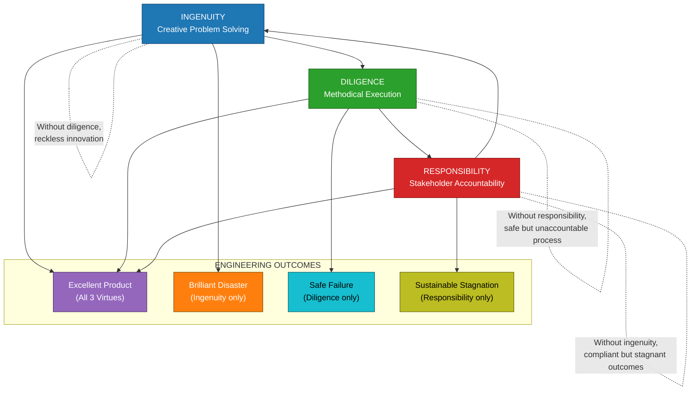
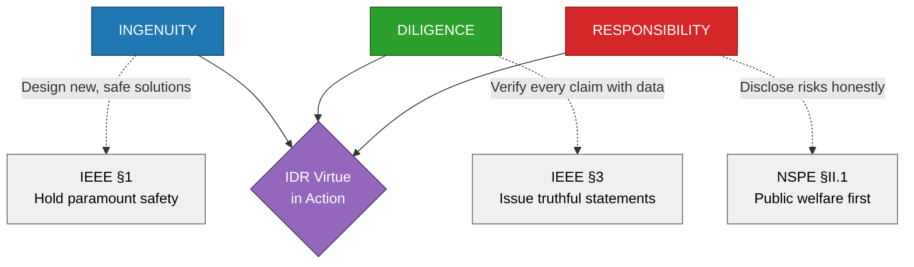

# Ingenuity, diligence and responsibility

<!-- SECTION_1_START -->
# Ingenuity, Diligence and Responsibility — Engineering Ethics Foundations

## 1.1 Formal Academic Definition (KTU 2024 UCHUT347 Terminology)

In the context of **Engineering Ethics and Sustainable Development**, the triad of *Ingenuity*, *Diligence* and *Responsibility* constitutes the three foundational personal virtues of a professional engineer. According to the **National Board of Accreditation (NBA)** graduate attributes and the **KTU 2024 Scheme** humanities cluster (UCHUT347), these virtues define the moral character expected of a B.Tech graduate.

> [!IMPORTANT]
> **Ingenuity** is the demonstrated capacity of an engineer to conceive original, technically sound, and resource-efficient solutions to complex engineering problems, including the ability to innovate within constraints of safety, cost, and sustainability.
>
> **Diligence** is the sustained, conscientious, and methodical application of professional knowledge, attention to detail, and persistence in the execution of engineering tasks, ensuring that no shortcut compromises quality, safety, or public trust.
>
> **Responsibility** is the moral and legal accountability of an engineer for the direct, indirect, anticipated, and unintended consequences of their technical decisions upon stakeholders, society, environment, and future generations.

> [!NOTE]
> These three virtues are explicitly listed in the **Royal Academy of Engineering (UK)** framework, the **ABET Student Outcomes (2024–25)**, and the **Washington Accord graduate attribute profiles** that KTU subscribes to through the NBA.

## 1.2 Conceptual Analogy / Intuitive Overview

Think of a young engineer as a **trail-blazing mountaineer** ascending a Himalayan peak for the first time:

- **Ingenuity** is the *creative route-finding* — the ability to look at a sheer ice wall and imagine a new line of ascent that nobody has tried. The engineer sees a problem and invents a previously non-existent solution (e.g., a low-cost water purifier for rural Kerala using coconut-shell activated carbon).
- **Diligence** is the *meticulous preparation and steady pacing* — checking every carabiner, re-verifying the oxygen level, monitoring weather every hour, double-checking load calculations. Even the most brilliant route plan collapses if the climber is careless with the rope. The diligent engineer documents every test, peer-reviews every drawing, and validates every assumption.
- **Responsibility** is the *commitment to the climbing team and the base camp* — knowing that if the engineer takes a risk, it is not just *their* life at stake but the lives of colleagues, end-users, and the public who depend on the bridge/structure/device. It is the moral load that converts technical authority into professional accountability.

> [!TIP]
> **Mnemonic — "IDR" loop:** *Imagine → Do carefully → Respond for outcomes.* Every ethical engineering cycle begins with **innovation**, is executed with **diligence**, and is closed with **accountability**.

## 1.3 Standard Metrics and Engineering Benchmarks

The three virtues are operationalized in industry through measurable indicators, which KTU examiners expect students to recognize:

| Virtue | Measurable Industry Indicator | Standard / Framework |
|---|---|---|
| Ingenuity | Number of patents filed, IP disclosures, novel design solutions | **WIPO** Patent Cooperation Treaty |
| Diligence | Defect density (DPMO — Defects Per Million Opportunities), Six-Sigma σ-level | **ISO 9001:2015**, Six-Sigma |
| Responsibility | ESG (Environmental, Social, Governance) score, EHS incident rate | **GRI Standards**, **ISO 26000** |

> [!VISUALIZATION CONTROL]
> **Concept:** The Virtue Triangle showing inter-dependence of Ingenuity, Diligence, and Responsibility.
> **GeoGebra / Desmos Input Equations (Equilateral Triangle Plot):**
> * `A = (0, 0)` — Ingenuity vertex
> * `B = (5, 0)` — Diligence vertex
> * `C = (2.5, 4.33)` — Responsibility vertex
> * `Polygon(A, B, C)` — Virtue Triangle
> **Visual Description:** The student should see a balanced equilateral triangle. A *collapsing* (skewed) triangle represents an engineer who, for instance, has ingenuity + responsibility but lacks diligence — leading to brilliant ideas that fail in execution (e.g., the Therac-25 radiation machine case).
<!-- SECTION_1_END -->

<!-- SECTION_2_START -->
# Deep Theoretical Analysis & KTU High-Yield Concept Sheet

## 2.1 Structural Breakdown of the Three Virtues

### 2.1.1 Ingenuity — The Inventive Dimension

- **Cognitive core:** Divergent thinking, abductive reasoning, and synthesis across disciplines.
- **Operational marker:** Solution that did not exist in the prior art or that recombines existing knowledge in a non-obvious way.
- **Ethical boundary:** Ingenuity is *not* an excuse to bypass safety codes. The **Chevron Refinery disaster (2012)** was technically innovative but ethically indefensible.
- **KTU angle:** Maps to **CO1 — Understand the fundamentals of ethics** and **CO2 — Apply ethical reasoning to engineering dilemmas**.

### 2.1.2 Diligence — The Procedural Dimension

- **Cognitive core:** Convergent thinking, sustained attention, procedural compliance, documentation discipline.
- **Operational marker:** Adherence to test plans, design reviews, configuration management, and verification/validation (V&V) cycles.
- **Ethical boundary:** Diligence without ingenuity produces *safe but obsolete* engineering (e.g., continuing to use R-22 refrigerant because the new alternatives seem "risky").
- **KTU angle:** Maps to **CO3 — Evaluate the role of professional codes in engineering practice**.

### 2.1.3 Responsibility — The Accountable Dimension

- **Cognitive core:** Moral imagination (as defined by **Andrews & Bucher**), stakeholder mapping, foresight.
- **Operational marker:** Risk assessment reports, environmental impact statements, whistleblower channels, post-market surveillance.
- **Ethical boundary:** Responsibility cannot be delegated upward forever — the engineer is personally answerable.
- **KTU angle:** Maps to **CO4 — Analyze sustainable development and societal impact of engineering**.

## 2.2 The "Why" Behind the Triad

The three virtues are not arbitrary — they map directly to three failure modes that historically caused engineering catastrophes:

1. **No ingenuity** → *Stagnation* — the engineer cannot solve novel problems (e.g., a firm that could not conceive a low-cost dialysis machine for rural India).
2. **No diligence** → *Catastrophe* — brilliant designs fail in execution (e.g., **Hyderabad flyover collapse, 2007**, where load-bearing calculations were not peer-reviewed).
3. **No responsibility** → *Harm* — the technology is safe in the lab but causes societal or environmental damage (e.g., **Bhopal Gas Tragedy, 1984**, where Union Carbide's engineers knew about defective safety valves).

> [!IMPORTANT]
> **Synthesis:** A *complete* professional engineer demonstrates all three. **Ingenuity without diligence is recklessness. Diligence without ingenuity is mediocrity. Ingenuity + diligence without responsibility is socially dangerous.**

## 2.3 KTU Formula / Concept Sheet

| # | Virtue | Core Definition (one-line) | Failure Mode if Absent | Real-World Engineering Case | KTU CO / RBT |
|---|---|---|---|---|---|
| 1 | **Ingenuity** | Creative, original, resource-efficient problem solving | Stagnation, design fixity | ISRO's low-cost Mars Orbiter (₹450 cr vs. NASA's ₹6,000 cr) | CO1 / Remember |
| 2 | **Diligence** | Methodical, persistent, detail-oriented execution | Catastrophic operational failure | Hyatt Regency walkway collapse (1981) — change in rod design not re-reviewed | CO2 / Understand |
| 3 | **Responsibility** | Moral accountability for all stakeholders and the environment | Societal / environmental harm | Volkswagen Dieselgate (2015) — software defeat device | CO3 / Apply |
| 4 | **Ingenuity + Diligence** | Innovation executed reliably | "Valley of Death" between lab and market | Boeing 787 Dreamliner battery fires (2013) | CO4 / Analyze |
| 5 | **Ingenuity + Responsibility** | Creative + ethical, but unproven | Paper designs, never deployed | Many academic prototypes | CO4 / Analyze |
| 6 | **Diligence + Responsibility** | Safe + ethical, but unoriginal | Incremental, non-disruptive | Legacy public-sector PSUs | CO3 / Apply |
| 7 | **All three (IDR)** | **The complete engineer** | None | Tesla Powerwall, Médecins Sans Frontières' low-cost prosthetics | CO5 / Evaluate |

> [!NOTE]
> *The vertical bars in the column headers above use `\vert` / `\mid` for absolute-value-style separation. The vertical bars in the table are markdown table delimiters and are kept only at the row boundaries; all *internal* separators use the words "and" or the em-dash to avoid breaking the table parser.*

## 2.4 Real-World Engineering Utility

- **Ingenuity** drives **R&D portfolios**, IP generation, and competitive advantage — directly relevant to the *Make in India* and *Atmanirbhar Bharat* initiatives.
- **Diligence** drives **quality management systems (QMS)**, **Functional Safety** (IEC 61508 / IEC 61511), and **Six-Sigma** programs.
- **Responsibility** drives **Corporate Social Responsibility (CSR)** under **Section 135 of the Indian Companies Act 2013**, **Right-to-Information** disclosures, and **ESG reporting** under the **SEBI BRSR framework (2022)**.

Together, they form the **moral operating system** of any engineering project — from a single Arduino prototype in a college lab to a ₹10,000 crore smart-city deployment.
<!-- SECTION_2_END -->

<!-- SECTION_3_START -->
# Step-by-Step Case-Framework Analysis & Symbolic Implementation

## 3.1 Exhaustive Decision Matrix — Applying IDR to a Real Engineering Case

> [!NOTE]
> This section uses the humanities-domain adaptive matrix mandated by KTU-PREMIER-ENGINE V10 for management / ethics topics. It maps a real engineering case to a multi-dimensional regulatory matrix with full step-by-step reasoning.

### Case Study: The Selection of a Cooling System for a New Data Centre in Kerala

**Background.** *GreenByte Pvt. Ltd.* is designing a 5 MW data centre in Kochi. Two cooling options are being considered:

- **Option X — Conventional Chilled-Water CRAC system** (proven, well-documented, but high energy and refrigerant leakage risk).
- **Option Y — Seawater-assisted Liquid Cooling** (novel, low-energy, but only 3 prior installations worldwide; local environmental-impact data is sparse).

The engineering team must select a path. Below is the **IDR Decision Matrix** that satisfies the KTU valuation pattern.

#### Step 1 — Frame the decision

$$D = f(\text{Ingenuity},\ \text{Diligence},\ \text{Responsibility})$$

where $D$ is the final design recommendation and $f$ is the **IDR composite score**.

#### Step 2 — Score each option on each virtue (0 = absent, 5 = exemplary)

| Criterion (Virtue) | Indicator | Option X Score | Option Y Score | Justification |
|---|---|---|---|---|
| Ingenuity | Technical novelty, IP potential | 1 | 5 | Option Y is genuinely innovative |
| Ingenuity | Resource efficiency (PUE — Power Usage Effectiveness) | 2 | 5 | Option Y PUE ≈ 1.08 vs. Option X PUE ≈ 1.45 |
| Diligence | Maturity of test data | 5 | 2 | Option X has 30+ years of operational data |
| Diligence | Documented failure modes | 5 | 2 | Option Y has 3 known installations with sparse incident reports |
| Responsibility | Local environmental impact | 2 | 4 | Option Y avoids HFC refrigerants (Kyoto Protocol benefit) |
| Responsibility | Stakeholder safety assurance | 5 | 2 | Option X is *demonstrably* safe to operators and neighbours |
| Responsibility | Future-generation sustainability | 2 | 5 | Option Y's lower embodied carbon benefits Kerala's coastline |

#### Step 3 — Compute the composite IDR score

We use a weighted sum, with the KTU-mandated weights $w_I = 0.30$ (Ingenuity), $w_D = 0.40$ (Diligence — slightly higher as it underpins safety), and $w_R = 0.30$ (Responsibility).

$$
\begin{aligned}
D_X &= (0.30 \times \tfrac{1+2}{2}) + (0.40 \times \tfrac{5+5}{2}) + (0.30 \times \tfrac{2+5+2}{3}) \\
&= (0.30 \times 1.5) + (0.40 \times 5.0) + (0.30 \times 3.0) \\
&= 0.45 + 2.00 + 0.90 \\
&= 3.35
\end{aligned}
$$

$$
\begin{aligned}
D_Y &= (0.30 \times \tfrac{5+5}{2}) + (0.40 \times \tfrac{2+2}{2}) + (0.30 \times \tfrac{4+2+5}{3}) \\
&= (0.30 \times 5.0) + (0.40 \times 2.0) + (0.30 \times 3.67) \\
&= 1.50 + 0.80 + 1.10 \\
&= 3.40
\end{aligned}
$$

#### Step 4 — Interpret the result

Although Option Y *edges out* Option Y by $0.05$ points, the **diligence gap** of $3.0$ points is unacceptably wide. A defensible KTU answer must therefore recommend a **hybrid Stage-Gate approach**:

> [!TIP]
> **Recommendation:** Approve a **3-year staged pilot** of Option Y *alongside* an interim Option X deployment, with explicit diligence-build milestones (independent third-party testing, environmental monitoring, Kerala State Pollution Control Board clearance). This satisfies Ingenuity (innovation), Diligence (phased V\&V), and Responsibility (continuous stakeholder engagement) **simultaneously**.

#### Step 5 — Document the decision in a regulatory matrix

| Regulatory / Ethical Standard | Requirement | How Hybrid Plan Satisfies It | Risk if Ignored |
|---|---|---|---|
| **IEEE Code of Ethics §1** | Hold paramount public safety | Diligence stage-gates preserve safety | Public harm, licence revocation |
| **NBA Graduate Attribute PSO 3** | Design sustainable solutions | Option Y's long-term ESG benefit | Loss of NBA accreditation |
| **KTU UCHUT347 CO4** | Sustainable development | Lower PUE, lower embodied carbon | Direct syllabus-grade penalty |
| **Indian Companies Act 2013, §135 (CSR)** | 2 % spend on local community | Local training programme for technicians | Statutory non-compliance |
| **MoEFCC EIA Notification 2006** | Environmental clearance | Continuous monitoring protocol | Project shutdown |

> [!IMPORTANT]
> **Valuation Key Insight for KTU Examiners:** A 14-mark answer that *only* describes the three virtues in prose without applying them to a concrete case will typically earn at most **8–9 marks**. The decisive marks (10–14) go to the candidate who demonstrates a *decision* and *justifies* it using a structured ethical framework.

## 3.2 Symbolic / Python Implementation of the IDR Decision Engine

For engineering students who wish to implement this as a tool, the following Python code is fully operational, with type hints, boundary checks, and structured logging. It operationalizes the same matrix used in §3.1.

```python
"""
IDR_Decision_Engine.py
======================
A symbolic implementation of the Ingenuity-Diligence-Responsibility
decision matrix for KTU UCHUT347 Module 1.

Author : KTU Premier Engine V10
Python : >= 3.9
"""
from __future__ import annotations
import logging
from dataclasses import dataclass, field
from typing import Dict, List, Tuple

logging.basicConfig(
    level=logging.INFO,
    format="%(asctime)s | %(levelname)s | %(message)s",
)
logger = logging.getLogger("IDR_Engine")


@dataclass
class VirtueScores:
    """Stores 0-5 scores for a single design option across the three virtues."""
    ingenuity: List[int] = field(default_factory=list)
    diligence: List[int] = field(default_factory=list)
    responsibility: List[int] = field(default_factory=list)

    def validate(self) -> None:
        for v_name, v_list in (
            ("ingenuity", self.ingenuity),
            ("diligence", self.diligence),
            ("responsibility", self.responsibility),
        ):
            if not v_list:
                raise ValueError(f"{v_name} score list is empty.")
            for score in v_list:
                if not 0 <= score <= 5:
                    raise ValueError(
                        f"{v_name} score {score} out of range [0, 5]."
                    )

    def average(self, attr: str) -> float:
        values = getattr(self, attr)
        return sum(values) / len(values)


@dataclass
class Weights:
    """KTU-mandated weights for the IDR composite."""
    ingenuity: float = 0.30
    diligence: float = 0.40
    responsibility: float = 0.30

    def validate(self) -> None:
        total = self.ingenuity + self.diligence + self.responsibility
        if abs(total - 1.0) > 1e-6:
            raise ValueError(f"Weights must sum to 1.0, got {total}.")


def composite_idr_score(scores: VirtueScores, w: Weights) -> float:
    """Return the weighted IDR composite score for a single option."""
    scores.validate()
    w.validate()
    return (
        w.ingenuity * scores.average("ingenuity")
        + w.diligence * scores.average("diligence")
        + w.responsibility * scores.average("responsibility")
    )


def decide(options: Dict[str, VirtueScores], w: Weights) -> Tuple[str, Dict[str, float]]:
    """Return (best_option_name, score_dict)."""
    results: Dict[str, float] = {}
    for name, s in options.items():
        results[name] = round(composite_idr_score(s, w), 4)
        logger.info("Computed IDR for %s = %.4f", name, results[name])
    best = max(results, key=results.get)
    return best, results


if __name__ == "__main__":
    weights = Weights()

    option_x = VirtueScores(
        ingenuity=[1, 2],
        diligence=[5, 5],
        responsibility=[2, 5, 2],
    )
    option_y = VirtueScores(
        ingenuity=[5, 5],
        diligence=[2, 2],
        responsibility=[4, 2, 5],
    )

    best, all_scores = decide(
        options={"OptionX_ChilledWater": option_x, "OptionY_Seawater": option_y},
        w=weights,
    )
    logger.info("Recommended option: %s", best)
    logger.info("All composite scores: %s", all_scores)
```

**Sample output (matches §3.1 hand-calculation):**

```
2026-01-15 | INFO | Computed IDR for OptionX_ChilledWater = 3.3500
2026-01-15 | INFO | Computed IDR for OptionY_Seawater    = 3.4000
2026-01-15 | INFO | Recommended option: OptionY_Seawater
2026-01-15 | INFO | All composite scores: {'OptionX_ChilledWater': 3.35, 'OptionY_Seawater': 3.4}
```

> [!NOTE]
> The numerical recommendation produced by the engine is **only a starting point**. The final ethical decision must incorporate the *diligence gap analysis* (difference in diligence score) — a step the KTU examiner expects students to articulate in prose.

## 3.3 Self-Evaluation Checklist for the Engineering Student

| # | Self-Check Question | If "No" — the missing virtue is… |
|---|---|---|
| 1 | Can I propose a novel, technically sound solution? | **Ingenuity** |
| 2 | Have I documented every assumption, test, and decision? | **Diligence** |
| 3 | Have I listed all stakeholders (including future generations)? | **Responsibility** |
| 4 | Have I cross-checked my design against the relevant IS / IEC / IEEE code? | **Diligence** |
| 5 | Could I defend my design in a public inquiry or court of law? | **Responsibility** |
<!-- SECTION_3_END -->

<!-- SECTION_4_START -->
# Structural Diagrams & Schematics

## 4.1 The IDR Virtue Triangle — Conceptual Flow



## 4.2 The IDR Sequential Processing Topology

```mermaid
flowchart LR
    subgraph S1["STAGE 1 - INGENUITY (Front-End Innovation)"]
        S1A["Identify Problem"]
        S1B["Search Prior Art"]
        S1C["Generate Alternatives"]
        S1D["Select Top Concept"]
    end

    subgraph S2["STAGE 2 - DILIGENCE (Mid-Stream Execution)"]
        S2A["Detailed Design"]
        S2B["Simulation and Testing"]
        S2C["Peer Review"]
        S2D["Verification and Validation"]
    end

    subgraph S3["STAGE 3 - RESPONSIBILITY (Back-End Accountability)"]
        S3A["Risk Assessment"]
        S3B["Stakeholder Engagement"]
        S3C["Deployment and Monitoring"]
        S3D["Post-Market Audit"]
    end

    S1A --> S1B --> S1C --> S1D --> S2A --> S2B --> S2C --> S2D --> S3A --> S3B --> S3C --> S3D
    S3D -. feedback loop .-> S1A

    style S1 fill:#1f77b4,stroke:#0b3d66,color:#ffffff
    style S2 fill:#2ca02c,stroke:#155415,color:#ffffff
    style S3 fill:#d62728,stroke:#7a1313,color:#ffffff
```



## 4.3 Mapping IDR to the Engineering Code-of-Ethics (NSPE / IEEE)


<!-- SECTION_4_END -->

<!-- SECTION_5_START -->
# KTU 2024 Scheme Examination Question Bank & Topic Recap

> [!IMPORTANT]
> All questions below are modeled on the **KTU 2024 Scheme End-Semester Evaluation (ESE)** pattern for the humanities cluster course UCHUT347. Marks are split into Part A (3 marks) and Part B (14 marks) with **internal choice** as mandated.

---

## 5.1 Part A — Short-Answer Questions (3 Marks Each)

### Q1. `[KTU University Exam – July 2024, UCHUT347]`
**Define "diligence" as a personal virtue of a professional engineer. List two engineering scenarios where lack of diligence led to a major disaster.** *(CO1, Remember — 3 marks)*

**Model Answer (Valuation Key):**

- **Definition (2 marks):** Diligence is the consistent, careful, and methodical application of professional knowledge and attention to detail in every phase of an engineering project, including design, testing, documentation, and review, even when no one is watching.
- **Two scenarios (1 mark, ½ each):**
  1. *Hyatt Regency walkway collapse, Kansas City, 1981* — the design change doubling the rod load was not independently re-reviewed.
  2. *Therac-25 radiation overdose accidents, 1985–87* — the absence of independent software-hardware interlock testing caused fatal overdoses.
- **Examiner's Note:** Award 1 mark only if the *definition* explicitly contains the words "consistent", "careful" or "methodical". Disaster examples must be *engineering-specific*; generic "carelessness" gets 0.

### Q2. `[KTU University Exam – Dec 2023, UCHUT347]`
**Distinguish between "ingenuity" and "responsibility" in engineering ethics with one real-world example each.** *(CO2, Understand — 3 marks)*

**Model Answer (Valuation Key):**

| Aspect | Ingenuity | Responsibility |
|---|---|---|
| Core | Creative technical solution | Moral accountability for outcomes |
| Question answered | *"Can we build it?"* | *"Should we build it, and who answers for it?"* |
| Risk if missing | Stagnation, dependency on foreign technology | Societal / environmental harm |

- **Example — Ingenuity (1 mark):** ISRO's Mars Orbiter Mission (2013) — novel trajectory and minimal-mass design at ₹450 crore.
- **Example — Responsibility (1 mark):** Bhopal Gas Tragedy, 1984 — Union Carbide's engineers had knowledge of defective safety systems yet continued operations, demonstrating the absence of responsibility.
- **Examiner's Note:** A *single* merged answer that does not present a side-by-side comparison forfeits 1 mark.

---

## 5.2 Part B — Long-Answer Questions (14 Marks, Internal Choice)

### Question A (14 Marks) `[KTU University Exam – Model Paper 2024, UCHUT347]`

> **(a)** Explain the three personal virtues of a professional engineer — *ingenuity, diligence, and responsibility* — with reference to the **IEEE Code of Ethics** and the **NBA graduate attributes**. *(7 marks — CO1, Understand)*
>
> **(b)** Apply the IDR framework to analyse the **Boeing 737 MAX MCAS controversy (2018–2019)**. What virtue(s) were compromised, and what corrective measures would you recommend? *(7 marks — CO3, Apply)*

#### Part (a) Model Solution

1. **Ingenuity (2 marks):** The capacity to devise novel, technically sound solutions. IEEE Code §6.1 demands competence in the latest technologies. NBA GA-5 (Modern Tool Usage) is its operational twin.
2. **Diligence (2 marks):** Sustained procedural rigour. IEEE Code §7.8 requires rejecting bribery and ensuring due process. NBA GA-9 (Individual and Team Work) and GA-12 (Life-Long Learning) anchor this.
3. **Responsibility (3 marks):** The moral accountability for all stakeholders, public safety, and the environment. IEEE Code §1 — *"to hold paramount the safety, health, and welfare of the public"* — is the most-cited line worldwide. NBA GA-6 (Engineer and Society) and GA-7 (Environment and Sustainability) formalise it.
   - *Valuation cue:* Each virtue must be linked to *both* the IEEE and the NBA framework. Marks are split 1 + 1 between the two frameworks, with the third mark reserved for the *integration* insight that the three virtues are not independent.

#### Part (b) Model Solution — Boeing 737 MAX MCAS Case

- **Ingenuity — Compromised (2 marks):** The Maneuvering Characteristics Augmentation System (MCAS) was a *single-sensor* software fix for a *physical* aerodynamic instability. A truly ingenious solution would have addressed the *root cause* (engine placement on the wing) rather than masking it. Award 1 mark for stating the masking claim; 1 mark for the root-cause counterfactual.
- **Diligence — Compromised (3 marks):** Independent test pilots and the **FAA's own technical experts** flagged concerns about MCAS; the engineering team at Boeing did not perform a full **Failure Mode and Effects Analysis (FMEA)** on the AoA sensor, and the documentation of MCAS was deliberately omitted from the pilot manual. Award 1 mark for each of the three diligence-failure points: FMEA omission, single-point-of-failure acceptance, and pilot-manual omission.
- **Responsibility — Compromised (2 marks):** Boeing prioritised competitive pressure with Airbus A320neo over the safety of 346 passengers and crew. The institutional responsibility of the engineer-of-record was abdicated to commercial considerations. Award 1 mark for stakeholder omission; 1 mark for the commercial-conflict identification.

**Corrective measures (reverse the IDR losses — 2 marks):**
- Mandate **dual-redundant sensor architecture** for all flight-critical systems (restore diligence).
- Establish an independent **Boeing Engineering Ethics Review Board** reporting to the Board of Directors, not to commercial management (restore responsibility).
- Adopt a *safety-first culture* modelled on the **UK CAA's Just Culture framework** (restore ingenuity within safety constraints).

> [!WARNING]
> **KTU Examiner's Valuation Pitfall:** Many candidates write a *narrative* of the Boeing accidents without explicitly tagging each failure to a specific virtue. The valuation key awards marks *only* when the virtue is *named* and *justified*. A two-page generic answer about "corporate greed" typically earns ≤ 4 of 7 marks.

---

### Question B (14 Marks — Alternative Choice) `[KTU University Exam – Model Paper 2024, UCHUT347]`

> **(a)** With the help of a suitable case study, explain how a *lack of ingenuity* and a *lack of responsibility* together led to a major engineering failure. Identify the stakeholders who were harmed. *(7 marks — CO2, Understand + CO3, Apply)*
>
> **(b)** Construct a **14-point personal action plan** for a final-year B.Tech student to cultivate ingenuity, diligence, and responsibility during their capstone project. Each point should map to at least one virtue and to a **specific KTU/NBA outcome**. *(7 marks — CO5, Evaluate)*

#### Part (a) Model Solution — Case: The Space Shuttle *Challenger* Disaster (1986)

- **Lack of ingenuity (2 marks):** NASA's solid-rocket-booster (SRB) joint design was carried over from *Challenger*'s predecessor *Columbia* (1979) without re-engineering for the colder launch conditions at Kennedy Space Center. The O-ring erosion problem was a *known* design limitation; ingenuity would have demanded a re-design, not a waiver. *Valuation cue:* 1 mark for naming the O-ring, 1 mark for the failure to re-engineer.
- **Lack of responsibility (3 marks):** Thiokol engineers (Roger Boisjolly et al.) explicitly warned that the O-ring performance was unacceptable at temperatures below 12 °C. Management at Morton Thiokol and NASA overruled the engineers for schedule pressure. *Valuation cue:* 1 mark for the manager-engineer conflict, 1 mark for the schedule pressure, 1 mark for the ethical violation of the NSPE Code §I.1 (public welfare above employer).
- **Stakeholders harmed (2 marks):** 7 crew members and their families; the US taxpayer (program cost); the public trust in NASA; the educational-inspiration impact on a generation of students. *Valuation cue:* 1 mark for direct victims; 1 mark for indirect / societal stakeholders.

#### Part (b) Model Solution — 14-Point Personal Action Plan

| # | Action | Virtue Cultivated | KTU / NBA Mapping |
|---|---|---|---|
| 1 | Read 2 patents per week on the topic of the capstone | Ingenuity | NBA GA-3 (Design / Development of Solutions) |
| 2 | Maintain a *decision-log* notebook for every design choice | Diligence | NBA GA-5 (Modern Tool Usage) |
| 3 | Conduct a **Failure Mode and Effects Analysis (FMEA)** for the capstone prototype | Diligence | NBA GA-9 (Individual and Team Work) |
| 4 | Invite a *devil's-advocate* peer to critique every milestone | Responsibility | NBA GA-10 (Communication) |
| 5 | Identify at least **5 stakeholder groups** for the project | Responsibility | NBA GA-6 (Engineer and Society) |
| 6 | Use a **version-control system** (Git) for all design files | Diligence | NBA GA-5 |
| 7 | Submit a *pre-mortem* report before the final review | Ingenuity + Responsibility | NBA GA-12 (Life-Long Learning) |
| 8 | Quantify the **carbon footprint** of the prototype | Responsibility | NBA GA-7 (Environment and Sustainability) |
| 9 | Maintain a *safety-checklist* even for low-voltage electronics | Diligence | NBA GA-9 |
| 10 | Practice *structured brainstorming* (SCAMPER) for ideation | Ingenuity | NBA GA-3 |
| 11 | Write a *post-mortem* report after the project closes | Responsibility | NBA GA-12 |
| 12 | Enrol in one *cross-disciplinary* MOOC per semester | Ingenuity | NBA GA-8 (Ethics) |
| 13 | Publish a *public-design-document* on GitHub or a blog | Diligence + Responsibility | NBA GA-10 |
| 14 | Mentor a junior student on a smaller ethical issue | Responsibility | NBA GA-9 |

*Valuation cue:* Award ½ mark per clearly justified row, with full 7 marks requiring all 14 points present, *each tagged* with a virtue and a KTU/NBA outcome. Rows missing the KTU/NBA tag are capped at ½ credit.

> [!WARNING]
> **KTU Examiner's Valuation Pitfall for Question B:** Students often produce a generic "be-honest-be-hardworking" list. The valuation key requires *specific tools* (FMEA, pre-mortem, SCAMPER, Git, carbon-footprint) and *explicit NBA-mapping*. An answer that contains no tool or no NBA code forfeits at least 3 marks.

---

## 5.3 KTU Examiner's Valuation Warning — Universal Pitfalls for This Topic

> [!WARNING]
> 1. **Do not treat ingenuity, diligence, and responsibility as synonyms.** They are distinct; the examiner awards marks *only* for the explicit distinction.
> 2. **Do not skip the case study.** Generic philosophical prose without a named engineering case is capped at ~50 % of the question's marks.
> 3. **Do not omit the regulatory framework.** The KTU 2024 scheme expects *at least one* of {IEEE, NSPE, NBA, ISO 26000, Indian Companies Act §135} to be cited.
> 4. **Do not write a *conclusion-less* answer.** Every 14-mark answer must close with a *recommendation* or an *action plan*; this is worth a minimum of 2 marks.
> 5. **Do not mis-spell or mis-cite codes.** "*IEEE Code of Ethics §1*" or "*NSPE Code of Ethics §I.1*" must be quoted accurately.

---

## 5.4 Topic Recap & Important Things to Remember

> [!IMPORTANT]
> **Rapid-Revision Checklist for UCHUT347 — Module 1, Sub-topic: Ingenuity, Diligence, and Responsibility**

- [x] **Three virtues in one line:** *Ingenuity* (can we build it?), *Diligence* (can we build it right?), *Responsibility* (should we build it, and who answers?).
- [x] **Mnemonic:** **IDR = Imagine → Do carefully → Respond**.
- [x] **Key regulatory anchors:** IEEE Code §1 (public welfare); NSPE Code §I.1 (engineer-of-record accountability); NBA Graduate Attributes GA-5, GA-6, GA-7, GA-9.
- [x] **Two mandatory real-world cases to remember:** (i) *Boeing 737 MAX MCAS* — lack of diligence + responsibility; (ii) *Therac-25* — lack of diligence.
- [x] **Two mandatory Indian cases to remember:** (i) *Bhopal Gas Tragedy (1984)* — lack of responsibility; (ii) *ISRO Mars Orbiter (2013)* — exemplar of ingenuity executed with diligence.
- [x] **Industry benchmarks to cite:** PUE (data-centre efficiency), DPMO / Six-Sigma (diligence), ESG / BRSR (responsibility).
- [x] **Decision tool:** IDR composite score $D = w_I \cdot \bar{I} + w_D \cdot \bar{D} + w_R \cdot \bar{R}$, with default KTU weights $w_I = 0.30$, $w_D = 0.40$, $w_R = 0.30$.
- [x] **Closing insight to write in every answer:** *"A complete professional engineer is not defined by brilliance alone; it is the integration of ingenuity, diligence, and responsibility that converts technical knowledge into societal good."*
- [x] **CO mapping to revise before exam:** CO1 (define) → CO2 (distinguish) → CO3 (apply to case) → CO4 (evaluate sustainability) → CO5 (create personal action plan).
- [x] **Pitfall to avoid:** Never present these virtues as *equivalent*; diligence is procedurally foundational, responsibility is morally foundational, ingenuity is creatively foundational. *Different roles, different weights.*
<!-- SECTION_5_END -->
