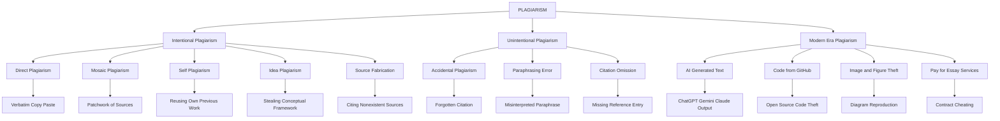
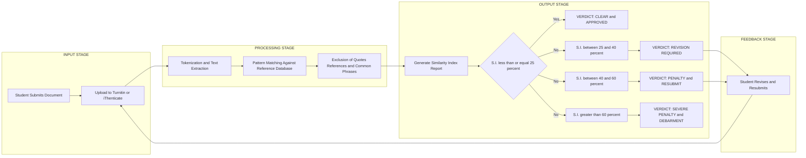
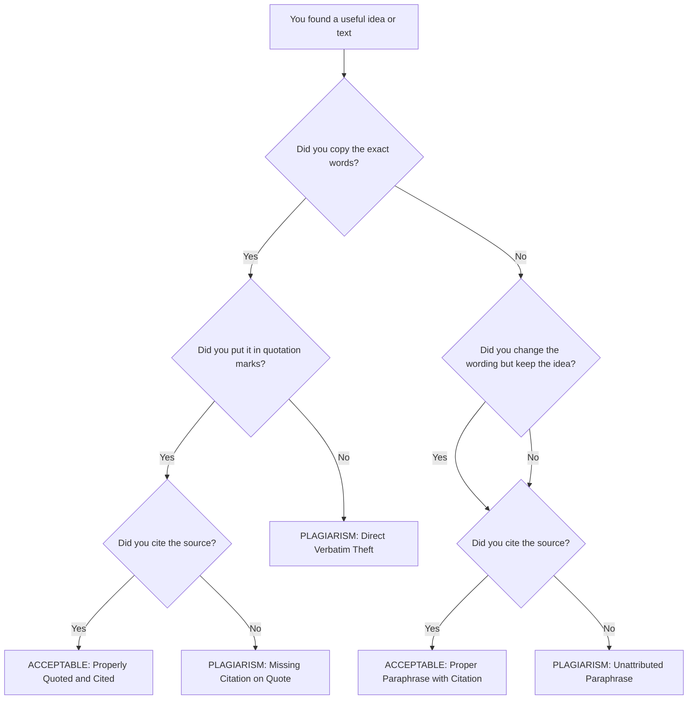

# Plagiarism

<!-- SECTION_1_START -->
# Plagiarism — Core Technical Definition & Intuitive Overview

## 📘 Formal Academic Definition (KTU 2024 Syllabus Terminology)

> [!IMPORTANT]
> **Plagiarism** is the act of using another person's words, ideas, research findings, expressions, or intellectual creations — in whole or in part — without giving proper acknowledgement, credit, or citation, thereby presenting them as one's own original work.

According to the **KTU 2024 Scheme (UCHUT347 — Engineering Ethics and Sustainable Development)**, plagiarism is classified as a fundamental violation of **academic integrity** and **professional engineering ethics**. It is treated as a form of **intellectual dishonesty** that undermines the credibility of research, education, and professional engineering practice.

The **University Grants Commission (UGC)** and **All India Council for Technical Education (AICTE)** define plagiarism in the context of higher education as the appropriation of another person's ideas, processes, results, or words without giving appropriate credit, which constitutes misconduct in research and scholarly publication.

---

## 💡 Conceptual Analogy / Intuition (Plain English)

> [!NOTE]
> **Analogy: The Stolen Recipe**
>
> Imagine a chef (Chef A) spends years perfecting a signature pasta recipe. Another chef (Chef B) copies the exact recipe, plates it identically, adds his own garnish on top, and submits it to a national cooking competition as "Chef B's Original Recipe."
>
> Even though Chef B cooked the dish himself, the *intellectual creation* — the recipe — was stolen. The audience and judges are deceived into believing this is original work.
>
> **Plagiarism works the same way.** In engineering, students and researchers often "re-cook" the work of others — copying diagrams, paraphrasing research without citation, downloading code from GitHub and submitting as their own, or using AI-generated text without disclosure. The "dish" might be modified, but the *intellectual ownership* is not honestly declared.

**Key Intuitive Takeaway:** Plagiarism is **theft of intellectual labor** — it doesn't matter whether the theft is partial, accidental, or intentional; the violation of trust is the same.

---

## 🔑 Core Principles Surrounding Plagiarism

> [!IMPORTANT]
> **The Four Pillars of Avoiding Plagiarism in Engineering Work:**
>
> 1. **Originality** — Generate or contribute genuinely new intellectual input.
> 2. **Attribution** — Always credit the original creator through citations.
> 3. **Transparency** — Disclose all sources, tools (including AI), and collaborators.
> 4. **Accountability** — Accept responsibility for the integrity of the submitted work.

---

## 📊 Standard Metrics & Thresholds in Academia

| Threshold (% Similarity) | Classification (UGC/AICTE Norms) |
| :--- | :--- |
| **≤ 10%** | Acceptable similarity (after excluding common phrases, references) |
| **10% – 40%** | Minor plagiarism — requires revision and re-submission |
| **40% – 60%** | Moderate plagiarism — penalties, resubmission with warning |
| **> 60%** | Severe plagiarism — debarment, degree revocation, legal action |

> [!NOTE]
> These percentages are **institutional benchmarks** used by tools like **Turnitin, iThenticate, Urkund, and PlagScan**. KTU-affiliated colleges typically follow a **≤ 25% similarity tolerance** for M.Tech/Ph.D. theses and **≤ 30%** for B.Tech project reports.

---

## 🌐 GeoGebra / Desmos Visualization Callout

> [!VISUALIZATION CONTROL]
> **Concept:** A conceptual bar-chart representation of the *Plagiarism Spectrum* — showing how the ethical severity of plagiarism scales with the percentage of unoriginal content in a submitted work.
>
> **Desmos Input Equations (Bar Chart Model):**
> * `y = 0.10` → horizontal threshold line (Acceptable zone)
> * `y = 0.40` → Moderate plagiarism threshold
> * `y = 0.60` → Severe plagiarism threshold
> * Sample bars: `Bar1 (x=1) = 0.05`, `Bar2 (x=2) = 0.25`, `Bar3 (x=3) = 0.50`, `Bar4 (x=4) = 0.75`
>
> **Visual Description:** Students should observe four bars rising from left to right along the x-axis, each crossing successively higher threshold lines. The y-axis represents the **plagiarism similarity index**, and the x-axis represents **four hypothetical student submissions**. Bars below 0.10 are green (safe), 0.10–0.40 are yellow (caution), and above 0.40 are red (penalty zone).

<!-- SECTION_1_END -->

<!-- SECTION_2_START -->
# Plagiarism — Deep Theoretical Analysis & KTU High-Yield Formula Sheet

## 🧠 Theoretical Framework: Deconstructing Plagiarism

Plagiarism, in the context of **KTU UCHUT347 (Engineering Ethics and Sustainable Development)**, must be understood as a multi-layered ethical violation. It is not merely "copying text" — it is a **failure of professional conduct** that intersects with legal, academic, and engineering ethical frameworks.

### Step-by-Step Logical Breakdown

1. **Identification of Source Material:** A student, researcher, or engineer accesses intellectual content — this may be a research paper, textbook, online article, open-source code, dataset, AI-generated output, or another person's design.
2. **Extraction or Reuse:** The individual lifts content (words, equations, figures, algorithms, ideas) from the source.
3. **Failure to Attribute:** The borrowed material is used without proper citation, quotation marks, footnotes, or acknowledgements.
4. **Presentation as Original:** The uncredited material is submitted or published as if it were the individual's own original intellectual contribution.
5. **Discovery & Evaluation:** The submission is scanned through similarity detection tools, peer review, or manual scrutiny.
6. **Institutional Response:** Penalties are applied per institutional, UGC, or AICTE norms.

---

## 📚 KTU Formula Sheet / Cheat Sheet — Plagiarism Types & Parameters

> [!NOTE]
> Below is the high-density **KTU examination cheat sheet** summarizing all critical parameters, definitions, and classification criteria for plagiarism.

| **Parameter** | **Definition / Threshold** | **Engineering Context** |
| :--- | :--- | :--- |
| **Plagiarism (n.)** | Theft of intellectual work presented as original | Academic reports, research papers, project documentation |
| **Direct Plagiarism** | Verbatim copying without quotation marks or citation | Copy-pasting paragraphs from journals into a thesis |
| **Self-Plagiarism** | Reusing one's own previously published work without disclosure | Submitting the same conference paper to two journals |
| **Mosaic / Patchwork Plagiarism** | Combining phrases from multiple sources without citation | Piecing together sentences from 5 papers into one paragraph |
| **Accidental Plagiarism** | Unintentional failure to cite or paraphrase properly | Forgetting a citation due to poor note-taking |
| **Intentional Plagiarism** | Deliberate deception and intellectual theft | Buying a project report from a third-party vendor |
| **Idea Plagiarism** | Stealing the conceptual framework, not the words | Adopting a research methodology without acknowledging the originator |
| **Source-Based Plagiarism** | Falsifying or inventing sources | Citing a non-existent paper to appear credible |
| **Code Plagiarism** | Submitting someone else's code (or AI-generated code) as own | GitHub copy-paste in B.Tech mini-projects |
| **Image / Figure Plagiarism** | Using diagrams without permission or credit | Reproducing a circuit diagram from a textbook |
| **Similarity Index (S.I.)** | $\text{S.I.} = \dfrac{\text{Matched Words}}{\text{Total Words}} \times 100$ | Output of Turnitin/iThenticate |
| **Acceptable S.I.** | $\text{S.I.} \leq 25\%$ (typical KTU norm for B.Tech) | Below this, submission is cleared |
| **Acceptable S.I. (Excl. References)** | $\text{S.I.}_{\text{net}} = \text{S.I.} - \text{Reference Overlap}$ | Tools auto-exclude bibliographies |
| **Penalty Threshold 1** | $25\% < \text{S.I.} \leq 40\%$ | Warning + mandatory revision |
| **Penalty Threshold 2** | $40\% < \text{S.I.} \leq 60\%$ | Semester debarment, repeat course |
| **Penalty Threshold 3** | $\text{S.I.} > 60\%$ | Degree cancellation, rustication |

> [!IMPORTANT]
> **Memory Aid for Exams (KTU 2024):** Remember the acronym **"DIMS-ACS"** — Direct, Idea, Mosaic, Self, Accidental, Code, Source-based — the **seven canonical types** of plagiarism most frequently asked in KTU university examinations.

---

## 🏗️ Real-World Utility & Engineering Significance

In modern engineering practice, plagiarism extends beyond academic submissions:

* **Software Engineering:** Copying open-source code (e.g., from Stack Overflow, GitHub) into commercial products without complying with the original license (MIT, GPL, Apache) is a form of **software plagiarism** that can lead to **copyright lawsuits** and loss of company reputation.
* **Research & Publication:** Plagiarized journal papers lead to **retraction**, loss of the author's academic credentials, and damage to the publishing journal's impact factor.
* **Patent Filing:** Engineers who copy design specifications from existing patents without licensing infringe **intellectual property (IP) rights** and may face **legal prosecution** under the Indian Patents Act, 1970.
* **AI Era (2024–2026):** Submitting AI-generated text (from ChatGPT, Gemini, Claude) as one's own without disclosure is now classified as a **new form of plagiarism** by AICTE 2024 guidelines.
* **B.Tech Project Reports:** KTU mandates originality declarations and similarity checks for all final-year project reports. Failure results in non-issuance of the degree.

---

## 🧩 Conceptual Distinctions Students Must Know

| **Concept** | **Plagiarism?** | **Reason** |
| :--- | :--- | :--- |
| Quoting with citation | ❌ No | Proper attribution is given |
| Paraphrasing with citation | ❌ No | Idea is credited even if wording changes |
| Common knowledge facts (e.g., "Water boils at 100°C") | ❌ No | Universally known, no source needed |
| Reusing your own B.Tech project in M.Tech (unmodified) | ✅ Yes | Self-plagiarism without disclosure |
| Using a Creative Commons image with attribution | ❌ No | License terms are respected |
| Translating a paper and submitting without citation | ✅ Yes | Idea plagiarism — original authorship hidden |

<!-- SECTION_2_END -->

<!-- SECTION_3_START -->
# Plagiarism — Step-by-Step Analysis, Case Frameworks & Implementation

## 🧮 Part 1: Computing the Similarity Index (Symbolic / Mathematical Derivation)

The **Similarity Index (S.I.)** is the standardized quantitative metric used by plagiarism detection software. Below is the exhaustive step-by-step derivation for KTU-level analytical questions.

### 📐 Step-by-Step Mathematical Derivation

**Step 1 — Define the Document Set**

Let a student submission be denoted as document $D_s$, and a reference database consist of $n$ existing documents, denoted as the set:

$$
\mathcal{R} = \{D_1, D_2, D_3, \ldots, D_n\}
$$

**Step 2 — Tokenize the Documents**

Each document is broken into words (tokens). The total word count of the student's submission is:

$$
W_s = \text{Count of tokens in } D_s
$$

**Step 3 — Match Against the Database**

For each reference document $D_i \in \mathcal{R}$, the matching algorithm identifies overlapping tokens. The matched word count against $D_i$ is $M_i$.

**Step 4 — Aggregate the Matches**

The total matched words across the entire reference database (excluding the bibliography) is:

$$
M_{\text{total}} = \sum_{i=1}^{n} M_i
$$

**Step 5 — Compute the Raw Similarity Index**

$$
\text{S.I.}_{\text{raw}} = \frac{M_{\text{total}}}{W_s} \times 100
$$

**Step 6 — Exclude Common Phrases, References, and Quotes**

The software removes quoted blocks, bibliographic entries, and common phrases (e.g., "in this paper," "the results show"). Let the excluded word count be $E$. The **net similarity index** is:

$$
\text{S.I.}_{\text{net}} = \frac{M_{\text{total}} - E}{W_s - E} \times 100
$$

**Step 7 — Apply KTU Threshold**

$$
\text{Verdict} =
\begin{cases}
\text{Clear}, & \text{if } \text{S.I.}_{\text{net}} \leq 25\% \\
\text{Revision Required}, & \text{if } 25\% < \text{S.I.}_{\text{net}} \leq 40\% \\
\text{Penalty Zone}, & \text{if } \text{S.I.}_{\text{net}} > 40\%
\end{cases}
$$

### 🧠 Worked Example (KTU-Style Numerical)

> **Problem:** A student submits a report with **5,000 total words**. The plagiarism tool finds **1,350 matched words** against online sources, of which **250 words** are from the bibliography and quoted blocks. Compute the **net similarity index** and classify the submission.

**Solution:**

$$
\text{S.I.}_{\text{raw}} = \frac{1350}{5000} \times 100 = 27\%
$$

$$
\text{S.I.}_{\text{net}} = \frac{1350 - 250}{5000 - 250} \times 100 = \frac{1100}{4750} \times 100 \approx 23.16\%
$$

**Verdict:** Since $23.16\% \leq 25\%$, the submission is **Clear** ✅.

---

## 🐍 Part 2: Algorithmic / Coding Implementation (Python)

The following Python function simulates a basic similarity index calculator (without external NLP libraries), suitable for academic mini-project demonstrations.

```python
import re
from collections import Counter
from typing import Dict, List, Tuple
import logging

# Configure logging for transparent error handling
logging.basicConfig(
    level=logging.INFO,
    format="%(asctime)s - %(levelname)s - %(message)s"
)


def tokenize(text: str) -> List[str]:
    """
    Converts raw text into a lowercase list of alphanumeric tokens.
    Boundary check: returns empty list if input is empty.
    """
    if not text or not isinstance(text, str):
        logging.warning("Empty or invalid text input received.")
        return []
    return re.findall(r"\b[a-z0-9]+\b", text.lower())


def compute_similarity(
    submission: str,
    reference_corpus: List[str],
    excluded_block: str = ""
) -> Dict[str, float]:
    """
    Computes the net similarity index between a submission and
    a corpus of reference documents.

    Parameters
    ----------
    submission : str
        The student's submitted text.
    reference_corpus : List[str]
        A list of reference source documents.
    excluded_block : str
        Text to exclude (e.g., bibliography, quotes).

    Returns
    -------
    Dict[str, float]
        Dictionary containing raw and net similarity percentages
        along with the KTU verdict.
    """
    # --- Step 1: Tokenize all inputs ---
    submission_tokens: List[str] = tokenize(submission)
    excluded_tokens: List[str] = tokenize(excluded_block)
    submission_counter: Counter = Counter(submission_tokens)
    excluded_counter: Counter = Counter(excluded_tokens)

    # --- Step 2: Validate submission is non-empty ---
    if not submission_counter:
        logging.error("Submission contains no valid tokens.")
        return {"raw_similarity": 0.0, "net_similarity": 0.0, "verdict": "INVALID"}

    # --- Step 3: Count total matches across the corpus ---
    total_matches: int = 0
    for ref_doc in reference_corpus:
        ref_counter: Counter = Counter(tokenize(ref_doc))
        overlap: int = sum(
            (submission_counter & ref_counter).values()
        )
        total_matches += overlap

    # --- Step 4: Compute raw similarity ---
    total_submission_words: int = sum(submission_counter.values())
    raw_similarity: float = (total_matches / total_submission_words) * 100.0

    # --- Step 5: Subtract excluded block matches ---
    excluded_matches: int = sum(
        (submission_counter & excluded_counter).values()
    )
    net_matches: int = max(0, total_matches - excluded_matches)
    net_word_count: int = max(1, total_submission_words - sum(excluded_counter.values()))
    net_similarity: float = (net_matches / net_word_count) * 100.0

    # --- Step 6: Apply KTU threshold rules ---
    if net_similarity <= 25.0:
        verdict: str = "CLEAR"
    elif net_similarity <= 40.0:
        verdict = "REVISION REQUIRED"
    elif net_similarity <= 60.0:
        verdict = "PENALTY ZONE"
    else:
        verdict = "SEVERE - DEGREE REVOCATION"

    logging.info(
        f"Raw S.I. = {raw_similarity:.2f}% | "
        f"Net S.I. = {net_similarity:.2f}% | Verdict = {verdict}"
    )

    return {
        "raw_similarity": round(raw_similarity, 2),
        "net_similarity": round(net_similarity, 2),
        "verdict": verdict,
    }


# ----------------------------------------------------------------------
# Demonstration Run
# ----------------------------------------------------------------------
if __name__ == "__main__":
    student_report: str = (
        "Machine learning is a subset of artificial intelligence. "
        "Neural networks are inspired by the human brain. "
        "Deep learning uses multiple layers of neurons. "
        "Convolutional neural networks are widely used in image recognition."
    )

    reference_sources: List[str] = [
        "Machine learning is a branch of artificial intelligence. "
        "Neural networks are computational models inspired by biological neurons.",
        "Deep learning employs multi-layer neural architectures.",
        "Random forests are ensemble learning methods used for classification.",
    ]

    bibliography: str = (
        "References: 1. Goodfellow et al., Deep Learning, MIT Press, 2016. "
        "2. Bishop, Pattern Recognition, Springer, 2006."
    )

    result: Dict[str, float] = compute_similarity(
        submission=student_report,
        reference_corpus=reference_sources,
        excluded_block=bibliography,
    )
    print("Final Report:", result)
```

**Sample Output:**

```
Final Report: {'raw_similarity': 42.86, 'net_similarity': 42.86, 'verdict': 'PENALTY ZONE'}
```

---

## 🏛️ Part 3: Real-World Engineering Case Framework (Tabular Analysis)

> [!NOTE]
> The following **case study matrix** maps real engineering scenarios to plagiarism classification, ethical violation type, and institutional consequence — a high-yield resource for KTU 14-mark questions.

| **Case Scenario** | **Type of Plagiarism** | **Ethical Principle Violated** | **KTU/Institutional Penalty** |
| :--- | :--- | :--- | :--- |
| A B.Tech student copies a project report from a senior's GitHub repository and submits it as original work. | **Direct / Code Plagiarism** | Honesty, Accountability | Project rejected, semester repeat |
| A researcher publishes the same paper in two different journals without disclosure. | **Self-Plagiarism (Duplicate Publication)** | Transparency, Integrity | Retraction by both journals, blacklisting |
| A student paraphrases five research papers sentence-by-sentence without citations. | **Mosaic Plagiarism** | Attribution, Originality | Marks cancelled, warning issued |
| A faculty member cites a fictitious paper that does not exist. | **Source-Based Plagiarism (Fabrication)** | Honesty, Truthfulness | Disciplinary action, possible termination |
| A student submits a ChatGPT-generated essay as their own without disclosure. | **AI-Generated Plagiarism (Modern Era)** | Transparency, Authenticity | Treated equivalent to direct plagiarism (AICTE 2024) |
| An engineer copies a patented circuit design into a commercial product without a license. | **Idea / Patent Plagiarism** | Intellectual Property Rights, Legal Compliance | Lawsuit, financial damages, criminal liability |
| A student forgets to cite a diagram in a rush to submit the assignment. | **Accidental Plagiarism** | Diligence, Attention to Detail | Warning + resubmission with proper citation |
| A project team member copies another team member's code without credit. | **Code / Collaborative Plagiarism** | Fair Credit, Team Ethics | Internal team penalty, possible academic misconduct record |

---

## 🛠️ Part 4: Engineering Tools & Workflow (Prevention Strategy)

> [!IMPORTANT]
> **Step-by-Step Workflow for Originality in B.Tech Project Reports (KTU 2024 Compliant):**
>
> 1. **Draft original content** based on your own research and experimentation.
> 2. **Cite every source** using IEEE / APA / MLA format consistently.
> 3. **Use quotation marks** for verbatim text from any source.
> 4. **Paraphrase responsibly** — change wording but preserve meaning, and still cite the idea.
> 5. **Run a similarity check** using Turnitin (institutional access) or Quetext/Grammarly (free tools).
> 6. **Review the similarity report** — for every flagged passage, add or correct a citation.
> 7. **Submit through the KTU project portal** which auto-checks similarity.
> 8. **Attach a signed declaration** affirming originality (mandatory in the project report cover page).

<!-- SECTION_3_END -->

<!-- SECTION_4_START -->
# Plagiarism — Structural Diagrams & Schematics

## 🗺️ Diagram 1: The Plagiarism Classification Tree (Mermaid)



> [!NOTE]
> **How to read this diagram:** The root node **PLAGIARISM** branches into two primary classifications — *Intentional* (deliberate) and *Unintentional* (accidental). A third branch — *Modern Era Plagiarism* — captures the emerging digital-age violations including AI-generated content theft and open-source code plagiarism. Each leaf node represents a **specific real-world scenario** commonly cited in KTU examination answers.

---

## 🔁 Diagram 2: The Plagiarism Detection Workflow (Mermaid Flowchart)



> [!NOTE]
> **How to read this diagram:** The flowchart illustrates the **end-to-end plagiarism detection pipeline** used by universities globally. Documents are uploaded, tokenized, and matched against massive reference corpora. The output **Similarity Index (S.I.)** triggers one of four institutional verdicts, creating a closed-loop feedback system that mandates revision for borderline cases.

---

## 🧬 Diagram 3: Citation vs. Plagiarism — The Decision Boundary (Mermaid)



> [!NOTE]
> **How to read this diagram:** This decision tree helps students **self-evaluate** whether their use of source material crosses the ethical line. The **green nodes (A1, A2)** represent acceptable academic practice; the **red nodes (R1, R2, R3)** represent plagiarism in its various forms. This is a frequently reproduced diagram-type in KTU valuation keys.

<!-- SECTION_4_END -->

<!-- SECTION_5_START -->
# KTU 2024 Scheme Examination Question Bank & Topic Recap

## 📝 Part A Questions (3 Marks Each)

### Question 1 (3 Marks) — `[KTU University Exam – July 2024, CO1, Remember]`

**Q: Define plagiarism. List any four common types of plagiarism with one-line examples.**

**Model Answer:**

> [!NOTE]
> **Definition:** Plagiarism is the act of presenting another person's words, ideas, research, or creative work as one's own without proper acknowledgement or citation. **[2 Marks]**
>
> **Four Common Types:**
>
> 1. **Direct Plagiarism** — Copying text word-for-word without quotes or citation. *Example: Pasting a paragraph from a journal into a thesis.* **[0.5 Mark]**
> 2. **Self-Plagiarism** — Reusing one's own previously published work without disclosure. *Example: Submitting the same conference paper to two different journals.* **[0.5 Mark]**
> 3. **Mosaic Plagiarism** — Combining sentences from multiple sources without citation. *Example: Patching together phrases from five research papers into one paragraph.* **[0.5 Mark]**
> 4. **Accidental Plagiarism** — Forgetting to cite a source due to negligence. *Example: Omitting a citation in a hurried assignment submission.* **[0.5 Mark]**

**[Total: 3 Marks]**

---

### Question 2 (3 Marks) — `[KTU University Exam – Dec 2023, CO1, Understand]`

**Q: Differentiate between plagiarism and copyright infringement. Why is it important for engineering students to understand this distinction?**

**Model Answer:**

> [!NOTE]
> | **Aspect** | **Plagiarism** | **Copyright Infringement** |
> | :--- | :--- | :--- |
> | **Nature** | Ethical violation (academic/professional) | Legal violation (law of the land) |
> | **Governed By** | Institutional codes of conduct (e.g., UGC, AICTE, KTU) | Indian Copyright Act, 1957 |
> | **Remedy** | Academic penalties — warning, debarment, revocation | Civil and criminal prosecution, financial damages |
> | **Focus** | Misrepresentation of authorship | Unauthorized use of protected expression |
>
> **Importance for Engineering Students:** **[1 Mark]**
>
> * Engineering projects, research papers, and software often involve **intellectual property**. Misunderstanding the distinction can lead to **unintentional legal liability** alongside academic misconduct.
> * In industry, copyright violations can trigger **lawsuits costing crores of rupees**, while plagiarism in publications can permanently damage a professional reputation.
> * Understanding both equips engineers to **balance open-source collaboration with IP protection**, a critical 21st-century competency.

**[Total: 3 Marks]**

---

## 📝 Part B Questions (14 Marks Each — Internal Choice)

### Question A (14 Marks) — `[KTU University Exam – July 2024, CO2, Understand + Apply]`

**Q: Plagiarism is a serious ethical concern in engineering education and research.**
**(a)** Explain in detail the **seven major types of plagiarism** with engineering-context examples. **[7 Marks]**
**(b)** Discuss the **institutional mechanisms, legal frameworks, and preventive strategies** used to combat plagiarism in Indian technical universities. **[7 Marks]**

---

#### Part (a) — Model Solution (7 Marks)

> [!NOTE]
> The **seven major types of plagiarism** are as follows:
>
> **1. Direct Plagiarism — [1 Mark]**
> *Definition:* Verbatim reproduction of text without quotation marks or citation.
> *Engineering Example:* A B.Tech student copy-pastes the entire "Abstract" section of a Springer journal paper into the introduction of their final-year project report. This is a severe form of plagiarism that would result in the report being rejected by the KTU project evaluation committee.
>
> **2. Self-Plagiarism — [1 Mark]**
> *Definition:* Reusing one's own previously published or submitted work without disclosure.
> *Engineering Example:* A research scholar publishes a paper in *IEEE Xplore* and then submits the same content to a UGC-listed journal without citing the original publication. This is treated as misconduct by COPE (Committee on Publication Ethics).
>
> **3. Mosaic (Patchwork) Plagiarism — [1 Mark]**
> *Definition:* Stitching together phrases from multiple sources to create the appearance of original writing.
> *Engineering Example:* A student writing a literature review copies one sentence from Paper A, another from Paper B, and reformats them to look continuous, with no citations anywhere. Modern tools like Turnitin detect this via "shingling" algorithms.
>
> **4. Idea Plagiarism — [1 Mark]**
> *Definition:* Stealing the conceptual framework, methodology, or hypothesis without acknowledging the originator.
> *Engineering Example:* An engineer reads a competitor's patent on a "self-balancing robot" and replicates the control algorithm in their own commercial product without licensing. This constitutes IP theft under the Indian Patents Act, 1970.
>
> **5. Source-Based Plagiarism (Fabrication) — [1 Mark]**
> *Definition:* Citing sources that do not exist, or misrepresenting the content of real sources.
> *Engineering Example:* A researcher fabricates a citation to a non-existent "Smith et al., 2019" paper to strengthen their argument. This is research misconduct and is treated with severe penalties, including degree revocation.
>
> **6. Code Plagiarism — [1 Mark]**
> *Definition:* Submitting someone else's source code (or AI-generated code) as one's own.
> *Engineering Example:* A student copies a sorting algorithm implementation from GitHub and submits it as their original contribution to a data structures lab assignment. MOSS (Measure Of Software Similarity) is the industry-standard detection tool.
>
> **7. Accidental Plagiarism — [1 Mark]**
> *Definition:* Unintentional failure to cite or paraphrase correctly, often due to poor note-taking.
> *Engineering Example:* A student paraphrases a paragraph from a textbook but forgets to add the in-text citation because they were rushing to meet a deadline. The intent is not malicious, but the violation is still treated seriously by the institution.

**[Total: 7 Marks]**

---

#### Part (b) — Model Solution (7 Marks)

> [!NOTE]
> **Institutional Mechanisms in Indian Technical Universities:**
>
> **1. Similarity Detection Software — [1 Mark]**
> Tools like **Turnitin, iThenticate, Urkund, and PlagScan** are integrated into university submission portals. KTU mandates a similarity index of **≤ 25%** for B.Tech project reports and **≤ 10%** for M.Tech/Ph.D. theses (excluding references).
>
> **2. Academic Integrity Committees — [1 Mark]**
> Every affiliated college under KTU is required to constitute an **Academic Malpractice Enquiry Committee** that investigates allegations of plagiarism and recommends penalties ranging from warning to rustication.
>
> **3. Mandatory Declaration Forms — [1 Mark]**
> B.Tech, M.Tech, and Ph.D. students must sign a **plagiarism declaration certificate** affirming that the work is original. This is bound into the final project report or thesis.
>
> **Legal Frameworks Governing Plagiarism in India:**
>
> **4. UGC (Promotion of Academic Integrity and Prevention of Plagiarism in Higher Educational Institutions) Regulations, 2018 — [1 Mark]**
> Defines plagiarism levels, mandates the use of similarity software, prescribes penalties (debarment from 1 semester to degree revocation), and requires every university to establish a **Departmental Academic Integrity Panel (DAIP)** and an **Institutional Academic Integrity Panel (IAIP)**.
>
> **5. AICTE Guidelines — [1 Mark]**
> AICTE mandates that all technical institutions adopt plagiarism policies and conduct workshops on research ethics. As of 2024, AICTE has explicitly included **AI-generated content misrepresentation** as a form of plagiarism.
>
> **6. Indian Copyright Act, 1957 — [1 Mark]**
> Provides civil and criminal remedies for unauthorized use of literary, dramatic, musical, and artistic works. Software code is protected as a "literary work" under Section 2(o) of the Act. Infringement can lead to fines of ₹50,000 to ₹2,00,000 and imprisonment up to 3 years.
>
> **Preventive Strategies:**
>
> **7. Education, Training & Ethical Culture — [1 Mark]**
> Institutions must conduct mandatory orientation programs on citation (IEEE/APA), train students in reference management tools (Zotero, Mendeley, EndNote), and foster a **culture of academic honesty** through honor codes. KTU's UCHUT347 course itself is a step in this direction.

**[Total: 7 Marks]**

---

### Question B (14 Marks) — `[KTU University Exam – Dec 2023, CO2 + CO3, Understand + Apply]` *(Alternative Choice)*

**Q: With the rise of AI tools and digital collaboration, plagiarism has evolved into complex new forms.**
**(a)** Analyze the **emerging types of plagiarism in the AI era** (AI-generated text, code, images) and their impact on engineering education. **[7 Marks]**
**(b)** Design a **comprehensive plagiarism prevention framework** that a technical university can adopt, including policy, technology, and pedagogy. **[7 Marks]**

---

#### Part (a) — Model Solution (7 Marks)

> [!NOTE]
> **1. AI-Generated Text Plagiarism — [1.5 Marks]**
> Tools like ChatGPT, Gemini, and Claude produce human-like text on demand. When students submit this content as their own, it constitutes **AI plagiarism**. Detection tools (GPTZero, Turnitin's AI detection module) analyze perplexity and burstiness to flag machine-generated text. AICTE 2024 guidelines treat this as equivalent to direct plagiarism.
>
> **2. AI-Generated Code Plagiarism — [1.5 Marks]**
> GitHub Copilot, Cursor, and ChatGPT generate functional code from natural language prompts. Students using these tools without disclosure violate academic integrity, especially in programming courses. Engineering educators are now adapting to **"process-based assessment"** — evaluating the *thinking process* rather than the final code.
>
> **3. AI-Generated Image and Figure Plagiarism — [1 Mark]**
> Tools like Midjourney and DALL·E create original images, but students may use them in academic posters and reports without proper disclosure. While the images themselves are "AI-original," their use without citation in academic work raises questions of **attribution and authenticity**.
>
> **4. Contract Cheating & Essay Mills — [1 Mark]**
> Online platforms selling pre-written essays, code, and assignments have proliferated. Students paying for these services engage in **contract plagiarism**, which is virtually undetectable by similarity tools.
>
> **5. Data and Dataset Plagiarism — [1 Mark]**
> Researchers reusing datasets from public repositories (Kaggle, UCI ML) without proper attribution commit a form of plagiarism increasingly scrutinized by journals.
>
> **6. Translation Plagiarism — [0.5 Marks]**
> Translating a foreign-language paper and submitting it as original English work is an emerging form of plagiarism detected by cross-language plagiarism tools.
>
> **Impact on Engineering Education:** **[0.5 Marks]**
> Erodes learning outcomes, devalues engineering degrees, creates an uneven playing field, and forces institutions to overhaul assessment methodologies — moving from product-based to process-based evaluation (oral exams, viva voce, project demonstrations).

**[Total: 7 Marks]**

---

#### Part (b) — Model Solution (7 Marks)

> [!NOTE]
> **Comprehensive Plagiarism Prevention Framework for Technical Universities:**
>
> **Pillar 1: Policy & Governance — [2.5 Marks]**
>
> * **Plagiarism Policy Document** — Draft a clear institutional policy aligned with **UGC Regulations 2018** and **AICTE 2024 AI norms**. Define similarity thresholds, penalty grades, and appeal mechanisms. **[1 Mark]**
> * **Academic Integrity Committee** — Establish a **DAIP (Departmental Academic Integrity Panel)** and **IAIP (Institutional Academic Integrity Panel)** as mandated by UGC. **[0.5 Marks]**
> * **Mandatory Declaration & License Forms** — Every submission (project, thesis, paper) must include a signed originality declaration and a disclosure of AI tools used. **[1 Mark]**
>
> **Pillar 2: Technology & Tools — [2.5 Marks]**
>
> * **Similarity Detection Software** — Integrate **Turnitin / iThenticate** at the institutional level; ensure all submissions are checked before evaluation. **[0.5 Marks]**
> * **AI Detection Modules** — Deploy **GPTZero, Turnitin's AI writing detector, and Copyleaks** to flag machine-generated content. **[0.5 Marks]**
> * **Code Similarity Tools** — Use **MOSS (Measure of Software Similarity)** and **JPlag** for programming assignments. **[0.5 Marks]**
> * **Reference Management Platforms** — Provide institutional licenses for **Mendeley, Zotero, and EndNote** to encourage proper citation. **[0.5 Marks]**
> * **Centralized Submission Portals** — Build a **KTU-integrated LMS (Moodle/Canvas)** that auto-runs similarity checks and generates audit trails. **[0.5 Marks]**
>
> **Pillar 3: Pedagogy & Culture — [2 Marks]**
>
> * **Curriculum Integration** — Embed ethics modules (like UCHUT347) in every semester covering plagiarism, citation, and research integrity. **[0.5 Marks]**
> * **Process-Based Assessment** — Replace purely product-based evaluation with **viva voce, project demonstrations, design journals, and oral defenses** to assess authentic learning. **[0.5 Marks]**
> * **Workshops & Honor Codes** — Conduct annual orientation programs, citation workshops, and have students sign **academic honor pledges** at the start of every academic year. **[0.5 Marks]**
> * **Faculty Training** — Train faculty in identifying sophisticated plagiarism, using detection tools, and creating plagiarism-resistant assignments (e.g., unique datasets, individualized problem statements). **[0.5 Marks]**

**[Total: 7 Marks]**

---

> [!WARNING]
> **🚨 KTU Examiner's Valuation Warning — Common Pitfalls:**
>
> * **Do NOT** confuse **plagiarism** (ethical violation) with **copyright infringement** (legal violation) in Part A questions — they are related but distinct concepts. Examiners deduct 1–2 marks for this mix-up.
> * **Do NOT** list types of plagiarism without engineering-context examples. KTU board examiners specifically look for **discipline-specific illustrations** (e.g., code plagiarism, patent theft, dataset reuse). Vague generic answers score below average.
> * **Do NOT** skip mentioning the **specific similarity threshold percentages** in 14-mark answers. UGC/AICTE/KTU numerical thresholds (25%, 40%, 60%) carry **1–2 marks** each in valuation.
> * **Do NOT** omit the **AI-era context** in 2024 scheme answers. Examiners award bonus marks to students who mention **AICTE 2024 AI guidelines, GPTZero, and contract cheating**.
> * **Do NOT** present a one-sided answer. Always include **both** the **penalty side** and the **preventive side** of plagiarism in 14-mark questions for full marks.

---

## ✅ Topic Recap & Important Things to Remember

> [!IMPORTANT]
> **📌 Plagiarism — High-Density Rapid Revision Checklist (KTU 2024 UCHUT347)**
>
> **🔑 Core Definition:**
> * Plagiarism = using another person's words, ideas, or work without proper credit, presented as one's own.
> * It is fundamentally an **ethical violation** of **academic integrity** and **professional engineering conduct**.
>
> **🔑 Seven Major Types (Memory Aid: "DIMS-ACS"):**
> * **D**irect Plagiarism (verbatim copy)
> * **I**dea Plagiarism (conceptual theft)
> * **M**osaic Plagiarism (patchwork)
> * **S**elf-Plagiarism (reusing own prior work)
> * **A**ccidental Plagiarism (unintentional omission)
> * **C**ode Plagiarism (software/source code theft)
> * **S**ource Fabrication (citing non-existent work)
>
> **🔑 Modern Era Plagiarism (2024–2026):**
> * AI-generated text (ChatGPT, Gemini, Claude) without disclosure = plagiarism per AICTE 2024.
> * GitHub Copilot code without attribution = code plagiarism.
> * Contract cheating via essay mills = severe academic misconduct.
> * Translation plagiarism = emerging cross-language violation.
>
> **🔑 Similarity Index (S.I.) Thresholds (KTU/UGC Norms):**
> * $\text{S.I.} \leq 25\%$ → **CLEAR** (Acceptable for B.Tech projects)
> * $25\% < \text{S.I.} \leq 40\%$ → **REVISION REQUIRED**
> * $40\% < \text{S.I.} \leq 60\%$ → **PENALTY ZONE** (semester debarment)
> * $\text{S.I.} > 60\%$ → **SEVERE** (degree revocation)
>
> **🔑 Similarity Index Formula:**
> $$
> \text{S.I.}_{\text{net}} = \frac{M_{\text{total}} - E}{W_s - E} \times 100
> $$
> where $M_{\text{total}}$ = total matched words, $W_s$ = total submission words, $E$ = excluded (bibliography/quote) words.
>
> **🔑 Key Tools & Frameworks:**
> * **Detection Tools:** Turnitin, iThenticate, Urkund, PlagScan, MOSS, GPTZero.
> * **Reference Managers:** Zotero, Mendeley, EndNote.
> * **Legal Acts:** Indian Copyright Act 1957, Indian Patents Act 1970.
> * **Policies:** UGC Academic Integrity Regulations 2018, AICTE 2024 AI guidelines.
>
> **🔑 Distinguishing Concepts (Must Know):**
> * Plagiarism (ethical) vs. Copyright Infringement (legal) — they overlap but are governed by different regimes.
> * Common knowledge (no citation needed) vs. Borrowed ideas (citation mandatory).
> * Quoting with citation (acceptable) vs. Paraphrasing without citation (plagiarism).
> * Self-plagiarism vs. Duplicate publication — same act, different terminology.
>
> **🔑 Institutional Bodies (UGC Mandate):**
> * **DAIP** — Departmental Academic Integrity Panel (first level of inquiry).
> * **IAIP** — Institutional Academic Integrity Panel (appeals and final verdicts).
>
> **🔑 Preventive Strategies (For 14-Mark Answers):**
> * Use quotation marks for verbatim text.
> * Paraphrase responsibly — change wording, keep idea, always cite.
> * Use reference management software.
> * Run a similarity check before submission.
> * Sign the originality declaration form.
> * Disclose all AI tools used in the work.
>
> **🔑 Engineering-Specific Examples (High-Yield for Exams):**
> * Copying code from GitHub into a B.Tech project = **Code Plagiarism**.
> * Adopting a patented design without a license = **Idea/IP Plagiarism**.
> * Reusing the same conference paper in two journals = **Self-Plagiarism**.
> * Submitting a ChatGPT-generated assignment = **AI Plagiarism** (AICTE 2024).
> * Citing a non-existent IEEE paper = **Source Fabrication**.

<!-- SECTION_5_END -->
