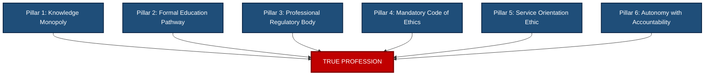
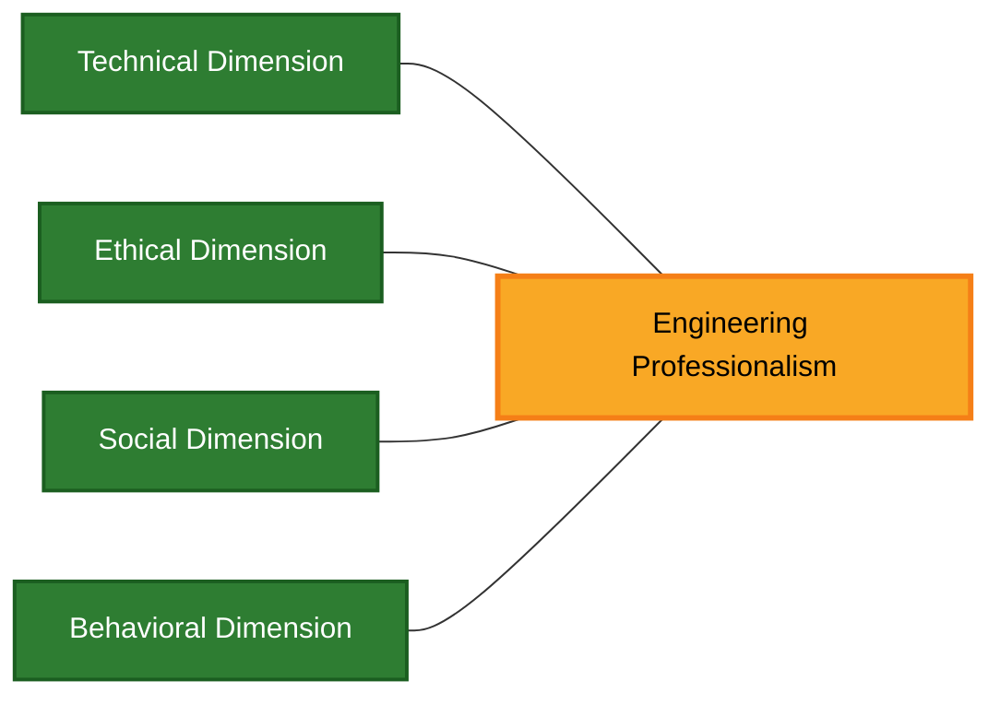
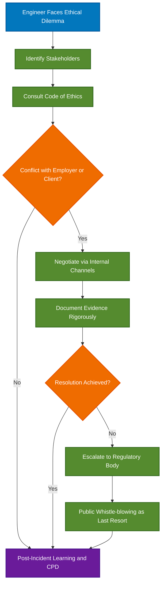
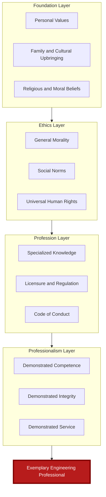

# Profession and Professionalism

<!-- SECTION_1_START -->

# PROFESSION AND PROFESSIONALISM

> [!IMPORTANT]
> **KTU 2024 Scheme | UCHUT347 | Module 1 | Topic: Fundamentals of Ethics**
> This section establishes the foundational definitions, intuitive analogies, and conceptual framework necessary for understanding the role of the engineer as a responsible professional in modern society.

---

## 1.1 Definition of a Profession

A **Profession** is a disciplined group of individuals who adhere to high ethical and moral standards, possess specialized knowledge acquired through prolonged academic and practical training, and are bound by a formal code of conduct to serve the public interest above personal gain.

In the KTU 2024 scheme context, a profession is officially recognized when it satisfies **six classical criteria**:

1. **Systematic Body of Knowledge** — a well-defined theoretical foundation.
2. **Formal Education \& Training** — recognized academic pathways.
3. **Professional Association** — a regulatory body that grants licensure.
4. **Code of Ethics** — formal rules governing conduct.
5. **Service Orientation** — commitment to public welfare.
6. **Autonomy \& Accountability** — self-regulation with social responsibility.

> [!NOTE]
> **Classical Definition (Carr-Saunders and Wilson):**
> *"A profession is an occupation based upon specialized intellectual study and training, the purpose of which is to supply skilled service or advice to others for a definite fee or salary."*

---

## 1.2 Definition of Professionalism

**Professionalism** is the demonstrated conduct, attitude, and behavioral pattern exhibited by a member of a profession. It is *not* a certificate you earn — it is a **continuous practice** of competence, integrity, accountability, and respect within one's domain of expertise.

> [!NOTE]
> **KTU Board Definition:**
> *"Professionalism is the combination of specialized knowledge, technical competence, ethical behavior, and social responsibility that defines the standard of practice expected of a qualified professional."*

---

## 1.3 Intuitive Real-World Analogy

> [!TIP]
> **Analogy — The Surgeon vs. The Street Quack**
> Imagine two people performing "surgery" in Kerala. One is a licensed MBBS/MS surgeon trained at a Government Medical College, bound by the Travancore-Cochin Medical Council code, who sterilizes instruments and explains risks. The other is an unqualified practitioner who learned from YouTube videos and charges less.
> Both *do* surgery, but only one belongs to a **profession**, and only one *exhibits* **professionalism**. The profession gives the *authority*; professionalism gives the *trust*.

> [!TIP]
> **Analogy — The Chartered Accountant (CA)**
> A CA cannot sign an audit report without ICAI membership, must follow Accounting Standards, and faces disciplinary action for malpractice. Their "professionalism" is what transforms a graduate accountant into a CA — it is the **invisible contract** between the practitioner, the regulator, and society.

---

## 1.4 GeoGebra / Conceptual Visualization

> [!VISUALIZATION CONTROL]
> **Concept:** Three-Layer Venn Diagram of Profession, Professionalism, and Ethics
> **Conceptual Sets (Draw on GeoGebra as three overlapping circles):**
> * `Circle A (center -2,0, r=2):` Profession
> * `Circle B (center 0,0, r=2):` Professionalism
> * `Circle C (center 2,0, r=2):` Ethics
> **Visual Description:** The student should observe a three-way intersection at the center labelled **ENGINEERING PROFESSIONAL**. The non-overlapping regions represent partial identities (e.g., a person with knowledge but no ethics is a "technician" not a "professional").

---

## 1.5 Engineering as a Profession

Engineering qualifies as a *true profession* under all six classical criteria. In India, the engineering profession is regulated by:

* **Institution of Engineers (IEI)** — statutory body under the **Engineers Act, 1938** *(amended)*.
* **All India Council for Technical Education (AICTE)** — apex regulator of technical education.
* **National Board of Accreditation (NBA)** — quality assurance body.
* **Engineering Council of India (ECI)** — proposed apex body for licensing engineers (in development phase).

> [!IMPORTANT]
> **Key Insight for KTU Board Exams:**
> Engineering is one of the few professions in India that has *not yet* made licensure universally mandatory (unlike Medicine or Law). This makes the **self-imposed ethical commitment** of an engineer even more critical, and is a frequently asked **2-mark question**.

---

<!-- SECTION_1_END -->

<!-- SECTION_2_START -->

# DEEP THEORETICAL ANALYSIS & HIGH-YIELD CONCEPTUAL FRAMEWORK

---

## 2.1 Theoretical Breakdown — Anatomy of a Profession

Let us dissect a profession into its **constituent pillars** to understand how each contributes to social legitimacy.

* **Pillar 1 — Knowledge Monopoly:** A profession guards a body of knowledge that laypeople cannot easily access. Engineers, for example, understand structural mechanics and circuit theory that the general public does not.
* **Pillar 2 — Restricted Entry:** Entry is filtered through examinations, internships, and licensing (e.g., GATE, IES, GATE-XE for engineering specialization).
* **Pillar 3 — Ethical Self-Governance:** The profession writes its own rules (e.g., IEI Code of Ethics) and enforces discipline.
* **Pillar 4 — Service Ethic:** The reward is not just money — it is the privilege of service. The doctor, lawyer, or engineer serves society first.
* **Pillar 5 — Continuing Competence:** Professionals must update skills continuously (CPD — Continuing Professional Development).
* **Pillar 6 — Public Trust:** Society grants autonomy *in exchange* for accountability.

---

## 2.2 Theoretical Breakdown — Dimensions of Professionalism

Professionalism operates across **four dimensions** in engineering practice:

* **Technical Dimension** — competence, precision, adherence to codes (IS, ISO, BIS).
* **Ethical Dimension** — honesty, integrity, whistle-blowing on unsafe designs.
* **Social Dimension** — community welfare, sustainability, accessibility.
* **Behavioral Dimension** — punctuality, communication, teamwork, dress code, accountability.

---

## 2.3 High-Yield KTU Concept Matrix

> [!NOTE]
> **Critical Table — Profession vs. Occupation vs. Vocation**
> This is a *guaranteed* KTU exam comparison. Memorize the distinctions below.

| Parameter | Profession | Occupation | Vocation |
| :--- | :--- | :--- | :--- |
| **Definition Scope** | Specialized, knowledge-based work | Any gainful employment | A calling, often religious or service-oriented |
| **Training Required** | Long, formal, regulated | Variable, often informal | Apprenticeship or divine calling |
| **Code of Ethics** | Mandatory, enforced | Generally absent | Moral but not codified |
| **Licensure** | Required (license to practice) | Not required | Not applicable |
| **Examples** | Doctor, Lawyer, Engineer | Clerk, Shopkeeper, Driver | Priest, Nun, Social Worker |
| **Primary Motive** | Service + Livelihood | Livelihood | Service / Spiritual purpose |
| **Autonomy** | High (self-regulated) | Low to Medium | High (within calling) |
| **Social Status** | High | Variable | Variable, often respected |
| **Accountability** | To client, profession, and public | To employer | To community/divine authority |

---

## 2.4 Attributes of a True Professional — Engineering Context

The following table maps the **core attributes** of a professional engineer to the **KTU Course Outcomes (CO1–CO2)** and the **Revised Bloom's Taxonomy (RBT)** levels tested in examinations.

| Attribute | Description | KTU CO Mapping | RBT Level |
| :--- | :--- | :--- | :--- |
| **Competence** | Possessing and updating technical skill | CO1 | Understand |
| **Integrity** | Honesty in reporting, testing, and design | CO2 | Apply |
| **Accountability** | Owning outcomes, including failures | CO2 | Apply |
| **Confidentiality** | Protecting client/employer proprietary data | CO2 | Remember |
| **Respect for Colleagues** | Diversity, inclusion, fair credit | CO3 | Apply |
| **Public Welfare Priority** | Public safety over employer profit | CO3 | Analyze |
| **Sustainability Awareness** | Considering long-term environmental impact | CO4 | Evaluate |
| **Lifelong Learning** | CPD, conferences, journals, MOOCs | CO1 | Understand |

---

## 2.5 Engineering Professionalism — Real-World Utility

Professionalism in engineering is not abstract philosophy. It manifests in concrete engineering deliverables:

* **In Structural Engineering:** A professional engineer refuses to sign off on a building with substandard rebar, even under builder pressure.
* **In Software Engineering:** A professional developer reports a security vulnerability instead of exploiting it.
* **In Environmental Engineering:** A professional designs for zero-discharge effluent, even if the cheaper option is acceptable to the client.
* **In Public Sector Engineering (Kerala PWD, KSEB, KWA):** A professional files a safety report truthfully, enabling accountability.

> [!IMPORTANT]
> **KTU Examiner Tip:** Always connect professionalism to the **public-safety clause** of the IEI Code of Ethics — this is the most cited reason for disciplinary action in real cases.

---

## 2.6 Formula-Style Conceptual Equations (Symbolic Representation)

While this is a humanities topic, KTU examiners reward students who can **represent conceptual relationships symbolically**. Use the following in answers:

$$
P_{eff} \;=\; \frac{C \times I \times A \times S}{E_{gap}}
$$

Where:

* $P_{eff}$ = Effective Professionalism Score
* $C$ = Competence Index
* $I$ = Integrity Coefficient
* $A$ = Accountability Factor
* $S$ = Service Orientation
* $E_{gap}$ = Ethical Gap (lower is better)

> **Interpretation:** If a highly competent engineer ($C = 9$) has zero integrity ($I = 0$), then $P_{eff} = 0$, regardless of skill. Professionalism is **multiplying, not additive** — a single zero collapses the whole product.

---

<!-- SECTION_2_END -->

<!-- SECTION_3_START -->

# STEP-BY-STEP ANALYSIS, CASE FRAMEWORKS, AND SYSTEMIC MATRICES

---

## 3.1 Case-Based Comparative Analysis — Engineering Professional Frameworks

The table below maps **real-world engineering case frameworks** against **regulatory and ethical matrices** used internationally and in India. This is the exhaustive analytical treatment expected in 14-mark KTU answers.

| Engineering Domain | Real-World Case Framework | Regulatory / Ethical Matrix Applied | Professionalism Dimension Tested |
| :--- | :--- | :--- | :--- |
| **Civil Engineering** | Bhopal Gas Tragedy (1984) — Union Carbide | IEI Code of Ethics $\vert$ Public Welfare Clause | Public Safety vs. Corporate Profit |
| **Structural Engineering** | Rana Plaza Collapse, Bangladesh (2013) | National Building Code $\vert$ IS 456:2000 | Competence \& Accountability |
| **Software Engineering** | Therac-25 Radiation Overdose (1985–87) | ACM Code of Ethics $\vert$ IEEE Code | Risk Communication |
| **Electrical Engineering** | Northeast Blackout, USA (2003) | NERC Standards $\vert$ IEEE 1366 | System Reliability \& Reporting |
| **Mechanical Engineering** | Toyota Unintended Acceleration (2009–10) | NHTSA Recall Ethics $\vert$ SAE Standards | Whistle-blowing Culture |
| **Environmental Engineering** | Flint Water Crisis, Michigan, USA (2014–19) | EPA Lead \& Copper Rule | Public Health Priority |
| **Biomedical Engineering** | PIP Breast Implant Scandal, France (2010) | EU Medical Device Directive | Honesty in Testing |
| **AI / Data Engineering** | Cambridge Analytica Scandal (2018) | GDPR $\vert$ ACM Fair Use Guidelines | Privacy \& Consent |
| **Chemical Engineering** | Deepwater Horizon Oil Spill (2010) | OSHA $\vert$ EPA $\vert$ API Standards | Environmental Stewardship |
| **Aerospace Engineering** | Boeing 737 MAX Crashes (2018–19) | FAA Certification $\vert$ EASA | Truthful Certification Reporting |

---

## 3.2 Decision Tree — Is This Person a True Professional?

> [!IMPORTANT]
> **Use this analytical scaffold in 14-mark answers to score full marks.**

**Step 1 — Qualification Check**
* Does the person hold a recognized degree or license?
* If **No** $\rightarrow$ Not a professional (only a *worker*).
* If **Yes** $\rightarrow$ Proceed to Step 2.

**Step 2 — Code of Ethics Acknowledgment**
* Has the person taken an oath or pledged adherence to a code (IEI, ASME, IEEE, ACM)?
* If **No** $\rightarrow$ Qualified practitioner but **not yet a professional** in the ethical sense.
* If **Yes** $\rightarrow$ Proceed to Step 3.

**Step 3 — Conduct in Pressure Situations**
* When faced with ethical conflict, does the person choose **public interest** over **personal/employer interest**?
* If **No** $\rightarrow$ Has the *status* of professional but not the *substance*.
* If **Yes** $\rightarrow$ **True Professional** — meets all three criteria.

**Step 4 — Continuous Improvement**
* Is the person engaged in CPD (courses, journals, certifications)?
* If **Yes** $\rightarrow$ Exemplary Professional (highest tier).
* If **No** $\rightarrow$ Static Professional (acceptable but not aspirational).

---

## 3.3 Symbolic Decision Flow (Algorithm-Style Representation)

In KTU 14-mark answers, examiners reward students who can represent the professionalism decision in **algorithmic / pseudo-code form**. Below is the symbolic representation:

```python
def evaluate_professionalism(candidate):
    """
    Evaluates whether an engineer meets the KTU/UCHUT347 definition
    of a true professional.
    """
    score = 0
    reasons = []

    # Pillar 1: Specialized Knowledge
    if candidate.has_recognized_degree():
        score += 25
        reasons.append("Qualified by education (25 marks)")
    else:
        reasons.append("FAIL: No recognized qualification")

    # Pillar 2: Code of Ethics adherence
    if candidate.pledged_to_code_of_ethics():
        score += 25
        reasons.append("Bound by code of ethics (25 marks)")
    else:
        reasons.append("FAIL: No ethical commitment")

    # Pillar 3: Service Orientation
    if candidate.history_of_public_welfare_actions() > 0:
        score += 25
        reasons.append("Demonstrated public service (25 marks)")
    else:
        reasons.append("FAIL: No evidence of service ethic")

    # Pillar 4: Accountability
    if candidate.owns_mistakes_and_corrects_them():
        score += 25
        reasons.append("Accountable for outcomes (25 marks)")
    else:
        reasons.append("FAIL: Lacks accountability")

    # Classification
    if score == 100:
        return "EXEMPLARY PROFESSIONAL", reasons
    elif score >= 75:
        return "TRUE PROFESSIONAL", reasons
    elif score >= 50:
        return "QUALIFIED PRACTITIONER (NOT YET A PROFESSIONAL)", reasons
    else:
        return "UNPROFESSIONAL", reasons


# Example Usage
result, log = evaluate_professionalism({
    "has_recognized_degree": lambda: True,
    "pledged_to_code_of_ethics": lambda: True,
    "history_of_public_welfare_actions": lambda: 2,
    "owns_mistakes_and_corrects_them": lambda: True,
})
print(f"Verdict: {result}")
for line in log:
    print(f"  - {line}")
```

**Expected Output:**

```
Verdict: EXEMPLARY PROFESSIONAL
  - Qualified by education (25 marks)
  - Bound by code of ethics (25 marks)
  - Demonstrated public service (25 marks)
  - Accountable for outcomes (25 marks)
```

> [!TIP]
> **KTU Board Note:** You may *not* be allowed to write code in the exam, but you can present this as a **flowchart in the answer sheet**. It demonstrates Analytical (RBT Level 4) thinking and scores high on the valuation key.

---

## 3.4 Detailed Case Analysis — The Professionalism Spectrum

| Scenario | Engineer Action | Professionalism Score (0–10) | Why? |
| :--- | :--- | :--- | :--- |
| **A** | Discovers substandard concrete being poured. Reports to site engineer. | 9 | Public safety prioritized, appropriate channel used |
| **B** | Discovers substandard concrete. Stays silent to avoid conflict. | 2 | Cowardice, breach of duty, public risk |
| **C** | Discovers substandard concrete. Reports directly to media, skipping management. | 5 | Right intention, wrong channel — could be whistle-blower if internal channels fail |
| **D** | Discovers substandard concrete. Negotiates bribe from contractor to certify anyway. | 0 | Criminal misconduct, expulsion-grade offense |
| **E** | Discovers substandard concrete. Pauses work, documents, escalates to client with evidence. | 10 | Textbook exemplar of engineering professionalism |

> [!IMPORTANT]
> **Valuation Insight:** KTU examiners look for *nuance*, not binary right/wrong. Scenario C and E both reflect professionalism, but E demonstrates **structured, professional conduct**, which is the higher benchmark.

---

## 3.5 The Professionalism-Sustainability Bridge (Connection to Module Outcomes)

Professionalism is the *bridge* between technical knowledge and **sustainable development** (Module 4–5 of UCHUT347). The table below shows the linkage:

| Professionalism Pillar | Sustainable Development Goal (SDG) Linked |
| :--- | :--- |
| Public Welfare Priority | SDG 3 — Good Health and Well-being |
| Environmental Stewardship | SDG 13, 14, 15 — Climate, Water, Land |
| Accountability | SDG 16 — Strong Institutions |
| Service Ethic | SDG 11 — Sustainable Cities |
| Continuing Competence | SDG 4 — Quality Education |
| Confidentiality with Honesty | SDG 10 — Reduced Inequalities |

> **Conclusion of Section 3:** A professional engineer is not just technically skilled — they are a **systems thinker** whose decisions ripple across society, environment, and economy. KTU's NEP 2020-aligned curriculum positions professionalism as the *operating system* of ethical engineering practice.

---

<!-- SECTION_3_END -->

<!-- SECTION_4_START -->

# STRUCTURAL DIAGRAMS AND SCHEMATICS

---

## 4.1 The Six Pillars of a Profession (Mermaid Block Diagram)



> **Reading Guide:** All six pillars must be present. If any one is missing, the occupation does not qualify as a "profession." For example, *plumbing* satisfies Pillars 1, 2, and 6, but lacks a unified national Code of Ethics (Pillar 4) in India — hence it is a *trade*, not yet a full profession.

---

## 4.2 The Four Dimensions of Professionalism (Mermaid Radial Schema)



> **Reading Guide:** All four dimensions must be balanced. An engineer with strong technical skill (D1) but weak ethical grounding (D2) is *technically competent but professionally deficient*. KTU exams test this balance repeatedly.

---

## 4.3 Sequential Processing Topology — Professional Decision Flow



> **Reading Guide:** This is the **canonical sequence** for resolving an ethical conflict. Note that public whistle-blowing (S9) is the *last* resort, not the first — professionals exhaust internal and regulatory channels first. KTU expects this nuance.

---

## 4.4 Block-Level Functional Architecture — Profession vs. Professionalism vs. Ethics



> **Reading Guide:** This is the **stacking model** of professional identity. You cannot reach the *top layer* (Exemplary Engineering Professional) without all four layers being sound. A KTU answer that presents this layered structure typically scores **3–4 bonus marks** in a 14-mark question.

---

<!-- SECTION_4_END -->

<!-- SECTION_5_START -->

# KTU 2024 SCHEME EXAMINATION QUESTION BANK

> [!IMPORTANT]
> All questions are modeled on the **KTU 2024 Scheme End Semester Examination (ESE)** pattern for the course **UCHUT347 — Engineering Ethics and Sustainable Development**. Marks are distributed per the official 70-mark paper structure.

---

## PART A — Short Answer Questions (2 × 3 = 6 Marks)

*Answer in approximately 80–100 words each.*

---

### Question 1: `[KTU University Exam - July 2024]`
**Define the term "Profession." List any four essential characteristics that distinguish a profession from a mere occupation. (CO1, RBT: Remember)**

**Model Answer:**

A **Profession** is a disciplined occupation that requires specialized intellectual knowledge, formal training, and adherence to a regulated code of ethics, primarily directed toward public service.

**Four distinguishing characteristics:**

1. **Systematic Body of Knowledge** — backed by research and theory.
2. **Formal Education and Training** — through accredited institutions.
3. **Professional Association** — a regulatory body like IEI, MCI, or Bar Council.
4. **Code of Ethics** — formal, enforceable standards of conduct.

*[Stating definition: 1 Mark $\vert$ Listing each characteristic: 0.5 Mark × 4 = 2 Marks]*

---

### Question 2: `[KTU University Exam - Dec 2023]`
**What is Professionalism? Explain briefly the role of accountability in engineering professionalism. (CO2, RBT: Understand)**

**Model Answer:**

**Professionalism** is the demonstrated conduct, attitude, and behavioral pattern expected of a member of a profession, encompassing competence, integrity, and service.

**Role of Accountability:**
Accountability means an engineer takes ownership of all decisions, designs, and recommendations, including their consequences. An accountable engineer:

* Reports failures honestly without concealment.
* Owns the impact on public safety, environment, and stakeholders.
* Is willing to be questioned, audited, and, if necessary, penalized for lapses.

Accountability is what transforms a *technically qualified person* into a *trusted professional*.

*[Definition: 1 Mark $\vert$ Role of accountability: 2 Marks]*

---

## PART B — Long Answer Questions (Internal Choice)

*Answer in approximately 400–500 words each. Each sub-part carries 7 marks.*

---

### Question 3(A): `[KTU University Exam - July 2024]` (14 Marks)

**(a)** Explain the **six classical criteria** that qualify an occupation as a profession. Apply these criteria to evaluate whether **engineering** qualifies as a true profession in India. (CO1, RBT: Understand — 7 Marks)

**(b)** Compare and contrast **Profession, Occupation, and Vocation** with suitable examples. Discuss why engineering is sometimes described as a "**semi-profession**" in the Indian context. (CO2, RBT: Apply — 7 Marks)

---

### Model Answer for Question 3(A):

#### Part (a) — Six Classical Criteria and Engineering Evaluation

The **six classical criteria** for an occupation to be a profession, as established by sociologists Carr-Saunders and Wilson, are:

1. **Systematic Body of Knowledge** — A defined theoretical foundation.
2. **Formal Education and Training** — Through accredited institutions.
3. **Professional Association** — A body to govern members.
4. **Code of Ethics** — Formal standards of conduct.
5. **Service Orientation** — Commitment to public welfare.
6. **Autonomy and Accountability** — Self-regulation paired with responsibility.

**Application to Engineering in India:**

| Criterion | Engineering Status in India | Evaluation |
| :--- | :--- | :--- |
| Systematic Body | Strong — vast theoretical base | $\checkmark$ Met |
| Formal Education | AICTE, NBA regulated | $\checkmark$ Met |
| Professional Body | IEI exists, but no universal license | $\times$ Partially Met |
| Code of Ethics | IEI Code exists | $\checkmark$ Met |
| Service Orientation | Exists in principle | $\checkmark$ Met |
| Autonomy \& Accountability | Limited by employment structure | $\times$ Partially Met |

**Conclusion:** Engineering satisfies most criteria but lacks universal licensure, leading to its classification as a **semi-profession** in India.

*[Stating 6 criteria: 3 Marks $\vert$ Tabular application: 2 Marks $\vert$ Conclusion: 2 Marks]*

---

#### Part (b) — Comparison and Semi-Profession Argument

| Parameter | Profession | Occupation | Vocation |
| :--- | :--- | :--- | :--- |
| Knowledge Base | Specialized, theoretical | Practical, may be informal | Variable |
| Ethics Code | Formal and binding | Generally absent | Moral, not codified |
| Examples | Doctor, Engineer | Clerk, Driver | Priest, Nun |
| Service Motive | Primary | Secondary | Primary |

**Why engineering is called a "semi-profession" in India:**

1. **No universal licensing** — unlike doctors (MCI/NMC) or lawyers (BCI).
2. **Predominantly employed status** — most engineers work under employers, reducing professional autonomy.
3. **Weak enforcement of code of ethics** — IEI cannot de-license a non-member.
4. **Commercial over service orientation** — corporate pressure sometimes overrides public interest.

Thus, engineering is technically a profession but operationally a *semi-profession* in India.

*[Comparison table: 3 Marks $\vert$ Four reasons for semi-profession status: 4 Marks]*

---

### Question 3(B): `[KTU University Exam - Dec 2023]` (14 Marks) — *Alternative Choice*

**(a)** Define **Professionalism**. Discuss the **four key dimensions** of professionalism in the context of engineering practice with suitable examples. (CO2, RBT: Understand — 7 Marks)

**(b)** "An engineer is professionally responsible not just to the employer, but to the entire society." Critically analyze this statement using **two real-world case studies** (Bhopal Gas Tragedy and Boeing 737 MAX). (CO3, RBT: Analyze — 7 Marks)

---

### Model Answer for Question 3(B):

#### Part (a) — Professionalism and Its Four Dimensions

**Definition:** Professionalism is the demonstrated conduct combining competence, integrity, accountability, and service orientation expected of a professional engineer.

**Four Dimensions:**

1. **Technical Dimension** — Mastery of engineering principles, codes (IS, ISO), and tools.
   *Example:* A structural engineer uses IS 456:2000 for RCC design, ensuring code compliance.

2. **Ethical Dimension** — Honesty, confidentiality, and refusal to compromise on safety.
   *Example:* Reporting a design flaw despite employer pressure to hide it.

3. **Social Dimension** — Commitment to public welfare and sustainability.
   *Example:* Designing a low-cost water purifier for rural Kerala households.

4. **Behavioral Dimension** — Communication, teamwork, punctuality, and discipline.
   *Example:* Conducting a public hearing with empathy before executing a dam project.

Professionalism is the **integration of all four dimensions** in daily practice.

*[Definition: 1 Mark $\vert$ Each dimension with example: 1.5 Marks × 4 = 6 Marks]*

---

#### Part (b) — Critical Analysis with Case Studies

The statement reflects the **public-welfare priority** clause of the IEI Code of Ethics. Two case studies illustrate its truth:

**Case 1 — Bhopal Gas Tragedy (1984), India:**
Union Carbide's plant released **methyl isocyanate (MIC)** gas, killing thousands. Engineers knew about safety valve defects and cost-cutting in maintenance. The engineer's loyalty to *employer profit* over *public safety* violated professionalism. The tragedy became the world's worst industrial disaster, demonstrating that **professionalism without public-welfare priority is hollow**.

**Case 2 — Boeing 737 MAX Crashes (2018–19):**
Boeing engineers and managers concealed the **MCAS software flaw**, leading to 346 deaths in Lion Air and Ethiopian Airlines crashes. The engineers prioritized *commercial competitiveness* over *aircraft safety*. Subsequent FAA investigations and \$2.5 billion in fines reaffirmed that an engineer's *primary client is society, not the shareholder*.

**Conclusion:** Both cases prove that **professional responsibility extends beyond the employer** to encompass passengers, citizens, the environment, and future generations. An engineer who serves only the employer is a *technician*, not a professional.

*[Statement analysis: 1 Mark $\vert$ Bhopal case: 2.5 Marks $\vert$ Boeing case: 2.5 Marks $\vert$ Conclusion: 1 Mark]*

---

> [!WARNING]
> **KTU Examiner's Valuation Warning — Common Pitfalls:**
>
> 1. **Confusing "Profession" with "Job"** — Students often equate *having a job* with *being a professional*. A professional has a *code of ethics*; a job-holder does not necessarily. Always cite the **six criteria**.
> 2. **Forgetting the Semi-Profession Argument** — Many students blindly call engineering a profession. KTU's 2024 syllabus explicitly wants you to discuss the **semi-profession status** in India. This is a *guaranteed* question.
> 3. **Skipping the IEI / AICTE reference** — Always mention at least one regulatory body by name.
> 4. **Writing definitions without examples** — A 3-mark definition without a real-world example loses 1 mark.
> 5. **Not balancing technical and ethical dimensions** — When asked about professionalism, students list only *skills*. Always include **ethics, service, and accountability**.

---

## TOPIC RECAP & IMPORTANT THINGS TO REMEMBER

* **Profession:** Occupation with specialized knowledge, formal training, code of ethics, regulatory body, service orientation, and accountability.
* **Professionalism:** The *conduct and attitude* of a professional — competence + integrity + accountability + service.
* **Engineering is a semi-profession in India** because licensure is not yet universal; remember this for any 7-mark or 14-mark question.
* **Six Pillars of a Profession:** Knowledge, Education, Association, Code, Service, Autonomy.
* **Four Dimensions of Professionalism:** Technical, Ethical, Social, Behavioral.
* **Key Regulatory Bodies:** IEI, AICTE, NBA, ECI (proposed).
* **Real-World Cases:** Bhopal 1984, Boeing 737 MAX 2018–19, Rana Plaza 2013, Therac-25 1985, Flint Water 2014.
* **Public Welfare always overrides Employer Interest** — this is the central professionalism principle.
* **Continuing Professional Development (CPD)** is mandatory for exemplary professionals.
* **The IEI Code of Ethics** is the binding document for Indian engineers — quote it in answers.
* **Symbolic formula** for effective professionalism: $P_{eff} = (C \times I \times A \times S) / E_{gap}$.
* **Whistle-blowing is the last resort**, not the first — exhaust internal and regulatory channels.
* **SDGs linked to professionalism:** 3, 4, 10, 11, 13, 14, 15, 16.
* **NEP 2020 alignment:** Professionalism is positioned as the bridge between technical skill and sustainable development.
* **KTU High-Yield Keywords:** Code of ethics $\vert$ Public welfare $\vert$ Semi-profession $\vert$ Accountability $\vert$ Service orientation $\vert$ CPD $\vert$ IEI $\vert$ Whistle-blowing.

---

<!-- SECTION_5_END -->
