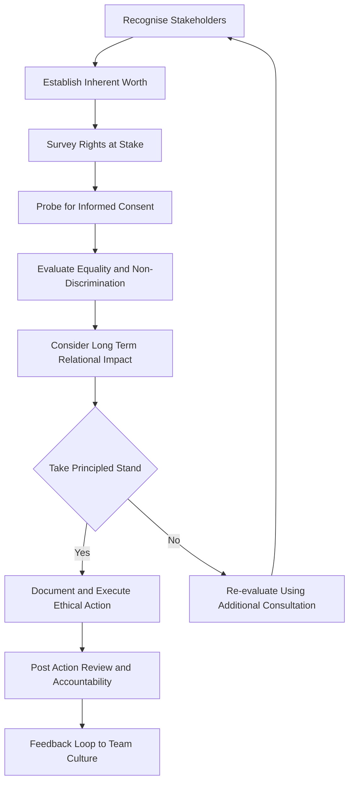
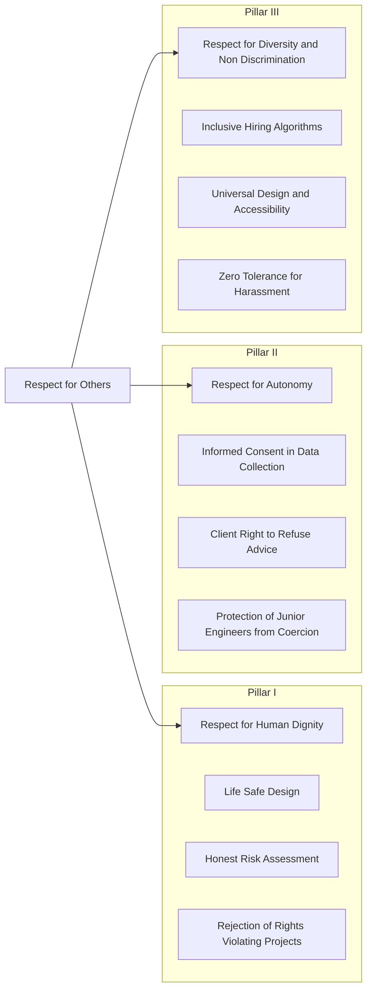
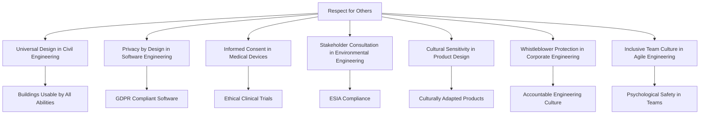
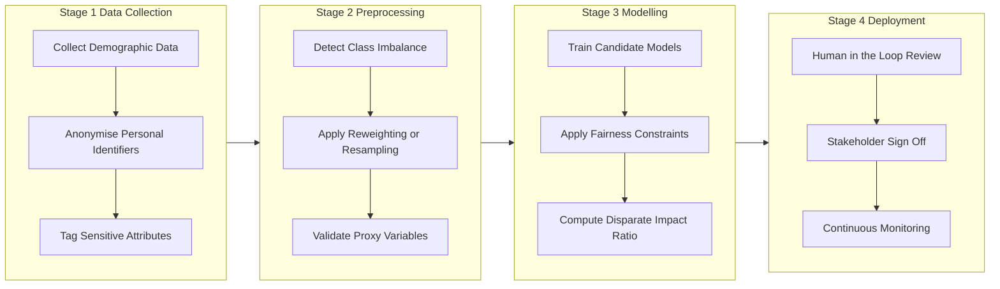

# Respect for others

<!-- SECTION_1_START -->

# Respect for Others — Foundational Concept in Engineering Ethics

> [!IMPORTANT]
> **KTU 2024 Scheme Mapping**
> **Course:** UCHUT347 — Engineering Ethics and Sustainable Development
> **Module:** 1 — Fundamentals of Ethics
> **Topic:** Respect for Others
> **Aligned CO:** CO1 — Understand the core principles of professional ethics
> **RBT Level Predominance:** Remember, Understand, Apply

---

## 1.1 Formal Academic Definition

**Respect for others** is a foundational moral principle that requires individuals to recognize, acknowledge, and honour the inherent worth, dignity, autonomy, and rights of every human being, irrespective of their social status, cultural background, gender, race, religion, abilities, or professional hierarchy. In the context of engineering ethics, it extends beyond interpersonal courtesy to encompass a professional obligation to honour the rights of stakeholders, the autonomy of clients, the dignity of colleagues, and the cultural values of communities affected by engineering solutions.

Formally, in normative ethical theory, respect for others is anchored in three interlinked philosophical pillars:

- **Respect for Persons (Kantian Deontology)** — Treating each individual as an *end in themselves*, never merely as a *means to an end*.
- **Respect for Autonomy** — Acknowledging the right of individuals to make informed, self-directed choices.
- **Respect for Dignity** — Recognising the intrinsic worth of every person, which cannot be forfeited, traded, or overridden.

> [!NOTE]
> **Syllabus Highlight**
> Respect is the **second canonical principle** (after honesty) of the *Fundamentals of Ethics* module. It serves as a **bridge concept** between individual morality and professional responsibility. The KTU 2024 syllabus specifically requires students to demonstrate how respect functions in **multi-stakeholder engineering environments**.

---

## 1.2 Conceptual Analogy & Intuition

Imagine an engineering team working on a water purification system for a remote tribal village in Kerala.

- A technician who **respects the villagers** will not impose a foreign, high-tech solution. Instead, they will listen to local elders, study indigenous water-management practices, and design a culturally compatible system.
- A manager who **respects junior engineers** will not steal their ideas in a review meeting. They will credit the original thinker and foster open dialogue.
- A lead engineer who **respects the environment** will not pollute a downstream river, even if it is cheaper to dump waste.

> [!TIP]
> **Plain-English Intuition**
> Think of respect as the **"mirror principle"** — when you look at another person through the ethical mirror, you should see someone whose feelings, choices, and rights are *as real and as valid* as your own. In engineering, this means every stakeholder — from the floor sweeper to the CEO, from the end-user to the regulator — deserves to be treated with **acknowledgement, fairness, and dignity**.

---

## 1.3 Physical and Philosophical Constants of Respect

Although ethics is non-quantitative, certain **standard ethical benchmarks** govern the practice of respect:

- **Inherent Human Worth** = Non-negotiable, constant value assigned to every individual.
- **Golden Rule Benchmark** = *Treat others as you would wish to be treated.*
- **Platinum Rule Benchmark** = *Treat others as they would wish to be treated.*
- **Kantian Universalizability** = An action is moral only if its maxim can be willed as a universal law.
- **IEEE / NSPE Code Benchmark** = Professional respect for *colleagues, employers, clients, and the public*.

---

## 1.4 Visualization Control — Mapping the Respect Framework

> [!VISUALIZATION CONTROL]
> **Concept:** A radial mind-map showing the three pillars of respect radiating into engineering practice
> **GeoGebra / Desmos Input (conceptual layout description):**
> * Central node: "Respect for Others"
> * Three primary axes: Dignity, Autonomy, Non-Discrimination
> * Engineering applications plotted on each axis
> **Visual Description:** A wheel with three equal sectors, each sector connecting to real-world engineering scenarios (e.g., accessibility design, client confidentiality, inclusive hiring).

<!-- SECTION_1_END -->

<!-- SECTION_2_START -->

# Deep Theoretical Analysis — Architecture of Respect

## 2.1 The Three Pillars of Respect (Structured Decomposition)

### Pillar I — Respect for Human Dignity

- **Definition:** Recognition that every person possesses an intrinsic, inalienable worth.
- **Why it matters in engineering:** Engineering products and infrastructure directly affect the bodily integrity, privacy, and well-being of end-users.
- **How it operates:**
  1. Design products that do not cause physical, psychological, or social harm.
  2. Conduct honest risk assessments without downplaying hazards.
  3. Reject projects that violate basic human rights (e.g., surveillance tech for oppressive regimes).

### Pillar II — Respect for Autonomy

- **Definition:** Honoring the right of individuals to make informed, voluntary decisions about their lives, projects, and data.
- **Why it matters in engineering:** Engineers often work in asymmetric power relationships (engineer–client, engineer–public, manager–subordinate). Autonomy prevents exploitation.
- **How it operates:**
  1. Obtain *informed consent* before collecting user data.
  2. Respect the client's right to reject professional advice after being fully informed.
  3. Do not coerce junior engineers into unethical practices.

### Pillar III — Respect for Diversity and Non-Discrimination

- **Definition:** Acknowledging and valuing differences in gender, caste, religion, ethnicity, ability, sexual orientation, and thought.
- **Why it matters in engineering:** Diverse teams produce more innovative, robust, and equitable solutions.
- **How it operates:**
  1. Inclusive hiring and promotion practices.
  2. Accessible design (universal design principles).
  3. Zero tolerance for harassment, microaggression, or tokenism.

---

## 2.2 Theoretical Foundations — The "Why" Behind Respect

| Ethical Theory | View of Respect | Key Proponent | Implication for Engineers |
|---|---|---|---|
| **Kantian Deontology** | Respect is a *categorical imperative* — treat humanity always as an end, never as a means. | Immanuel Kant | Never design products that exploit users (e.g., addictive algorithms). |
| **Utilitarianism** | Respect is instrumentally valuable — it maximises collective happiness. | John Stuart Mill | Inclusive design maximises user satisfaction and market reach. |
| **Virtue Ethics** | Respect is a *virtue* cultivated through practice. | Aristotle | Engineers develop character through habitual respectful conduct. |
| **Care Ethics** | Respect is rooted in *empathy and relational responsibility*. | Carol Gilligan | Listen deeply to affected communities; prioritise care over abstract rules. |
| **Discourse Ethics** | Respect is granted to all participants in rational dialogue. | Jürgen Habermas | Stakeholder consultations must be inclusive and free from coercion. |

---

## 2.3 KTU High-Yield Formula Sheet — Respect in Engineering Practice

> [!NOTE]
> The table below consolidates the **essential evaluative criteria** examiners use to assess "respect" in a 14-mark KTU answer. Use `\vert` and `\mid` for separators to preserve markdown table integrity.

| Construct | Definition | Engineering Manifestation | Breach Example |
|---|---|---|---|
| **Inherent Dignity** | Intrinsic worth of every person | Designing life-safe infrastructure | Releasing a vehicle with known fatal brake defect |
| **Autonomy** | Right to self-directed choice | Informed consent for data collection | Hidden data harvesting in a mobile app |
| **Non-Discrimination** | Equal treatment regardless of identity | Gender-neutral hiring algorithms | Biased AI resume screener |
| **Privacy** | Right to control personal information | End-to-end encryption in software | Selling user data without consent |
| **Confidentiality** | Protecting entrusted information | Secure client data handling | Leaking a client's product blueprint |
| **Cultural Sensitivity** | Respect for local customs and values | Community-centric design in tribal regions | Imposing a Western design aesthetic on indigenous users |
| **Right to be Heard** | Stakeholder voice in decisions | Public consultations for infrastructure | Approving a dam without hearing displaced villagers |
| **Right to Refuse** | Right to conscientious objection | Whistleblower protection | Retaliation against an engineer who reports unsafe practice |

---

## 2.4 Real-World Engineering Utility

The principle of respect is not abstract — it is operationalised in **production engineering systems** every day:

- **Universal Design (UD):** Buildings, websites, and products designed to be usable by people of all abilities — direct operationalisation of respect for persons with disabilities.
- **GDPR & DPDP Act 2023:** Legal codification of respect for user autonomy and privacy in software engineering.
- **Agile Retrospectives:** Scrum ceremonies explicitly demand respectful communication; ground rules forbid personal attacks.
- **Accessibility Compliance (WCAG 2.1):** Web engineering teams build accessible products out of respect for users with visual, auditory, or motor impairments.
- **Diversity & Inclusion (D\&I) Frameworks in Tech:** Google, Microsoft, and TCS publish D\&I charters anchored in workplace respect.

> [!TIP]
> **Industry Insight**
> In modern software engineering, the term *psychological safety* (popularised by Google's Project Aristotle) is the **engineering-team-level operationalisation** of respect. Teams with high psychological safety report 76% higher engagement and produce 50% more effective products.

<!-- SECTION_2_END -->

<!-- SECTION_3_START -->

# Step-by-Step Analytical Framework — Resolving Ethical Dilemmas of Respect

## 3.1 The R.E.S.P.E.C.T. Decision Protocol

KTU board answers often involve **case-based reasoning**. The following 7-step protocol is the *de facto* structure examiners reward. Every step must be explicitly written.

### Step 1 — Recognise the Stakeholders
- List every person, group, or entity affected by the engineering decision.
- Distinguish between *primary* (directly affected) and *secondary* (indirectly affected) stakeholders.

### Step 2 — Establish the Inherent Worth
- Acknowledge that each stakeholder possesses intrinsic dignity.
- Reject any framing that treats people as mere instruments (e.g., "users are data points").

### Step 3 — Survey the Rights at Stake
- Identify the specific rights engaged: autonomy, privacy, safety, cultural identity, freedom of expression.

### Step 4 — Probe for Informed Consent
- Verify whether stakeholders have given voluntary, informed, and competent consent.
- If consent is absent or coerced, the action is ethically suspect.

### Step 5 — Evaluate Equality and Non-Discrimination
- Check whether the action treats similar cases similarly.
- Identify any differential impact on vulnerable populations.

### Step 6 — Consider the Long-Term Relational Impact
- Reflect on how the decision affects trust, community bonds, and the engineer's professional reputation.

### Step 7 — Take a Principled Stand
- Choose the course of action that maximises respect for all stakeholders, even at personal cost.
- Document the decision rationale for future accountability.

---

## 3.2 Case Study 1 — The Biased Hiring Algorithm

> **Scenario:** A leading Kerala-based IT company deploys an AI resume-screening tool. The tool is found to systematically reject female applicants for technical roles. The project manager, Anjali, discovers the bias but is told by senior management to "ship the product before quarter-end."

**Application of the R.E.S.P.E.C.T. Protocol (Full Valuation-Style Solution):**

**Step 1 — Stakeholders:** Female job applicants, the IT company, male applicants, the project team, broader society, regulatory bodies.

**Step 2 — Inherent Worth:** Each applicant, regardless of gender, possesses equal intrinsic dignity. Treating women as less worthy of technical roles is a categorical violation of human dignity.

**Step 3 — Rights at Stake:** Right to non-discrimination, right to equal opportunity, right to fair employment practices.

**Step 4 — Informed Consent:** Applicants are unaware that an algorithm is screening them. There is no informed consent, and the process is non-transparent.

**Step 5 — Equality:** The algorithm produces **disparate impact** — a facially neutral tool (resume parser) that produces a discriminatory outcome. This violates Article 15 of the Indian Constitution and the *IT Act, 2000 (as amended)*.

**Step 6 — Long-Term Impact:** If shipped, the company faces legal liability, reputational damage, and erosion of trust. Society loses diverse talent in tech.

**Step 7 — Principled Stand:** Anjali must **refuse deployment**, escalate the issue through the company's ethics committee, and document the incident. If the company retaliates, she may invoke **whistleblower protections** under the *Companies Act, 2013, Section 177*.

**Final Ethical Verdict:** Shipping the biased product is **ethically impermissible**. Anjali's duty to respect the dignity and rights of female applicants overrides the commercial deadline.

---

## 3.3 Case Study 2 — The Dam and the Displaced Tribe

> **Scenario:** A hydroelectric dam is proposed in Wayanad, Kerala. The project will displace 200 tribal families. The engineering firm is asked to fast-track the environmental and social impact assessment (ESIA) to meet a state government deadline.

**Application of the R.E.S.P.E.C.T. Protocol:**

$$
\begin{aligned}
\text{Ethical Decision} &= f(\text{Stakeholders}, \text{Rights}, \text{Consent}, \text{Equality}, \text{Long-Term Impact}) \\
&= f(\text{Tribal Community}, \text{Ecosystem}, \text{State Govt.}, \text{Engineering Firm}, \text{Future Generations})
\end{aligned}
$$

**Step 1 — Stakeholders:** Tribal families (primary), state government, downstream farmers, biodiversity, future generations.

**Step 2 — Inherent Worth:** Tribal communities have intrinsic dignity equal to any other citizen. Their cultural identity and ancestral land are not negotiable commodities.

**Step 3 — Rights at Stake:** Right to livelihood, right to cultural preservation (*Article 29, Indian Constitution*), right to free, prior, and informed consent (FPIC) under the *Forest Rights Act, 2006*.

**Step 4 — Informed Consent:** The FPIC is mandatory. Fast-tracking the ESIA violates the procedural respect owed to the community.

**Step 5 — Equality:** Tribal communities are a *historically disadvantaged group*. Differential impact without consent constitutes injustice.

**Step 6 — Long-Term Impact:** Loss of biodiversity, cultural genocide, and intergenerational trauma outweigh the short-term energy gains.

**Step 7 — Principled Stand:** The engineering firm must **decline fast-tracking**, conduct a participatory ESIA, and recommend alternatives (e.g., solar microgrids) if the dam is unjustifiable.

**Final Ethical Verdict:** Pushing the ESIA violates respect for autonomy, dignity, and cultural identity. The ethical path is **transparent consultation and exploration of alternatives**.

---

## 3.4 Symbolic Code Implementation — A Respect-Aware Algorithmic Audit

For algorithmic / software engineering students, the following **Python pseudo-code** demonstrates how respect-for-others principles can be operationalised in an automated hiring audit.

```python
"""
File: respect_aware_audit.py
Purpose: Detect disparate impact in an AI resume screener (operationalises respect for non-discrimination)
Author: KTU UCHUT347 — Engineering Ethics Curriculum
Python: 3.11+
"""

from typing import Dict, List
import logging

logging.basicConfig(level=logging.INFO, format="%(asctime)s — %(levelname)s — %(message)s")


def detect_disparate_impact(
    selection_rate_male: float,
    selection_rate_female: float,
    threshold: float = 0.8
) -> Dict[str, object]:
    """
    Apply the 4/5ths rule (EEOC guideline) to detect disparate impact.
    Returns a structured audit report.
    """

    # Boundary check 1: rates must be valid probabilities
    for rate, label in [(selection_rate_male, "male"), (selection_rate_female, "female")]:
        if not (0.0 <= rate <= 1.0):
            raise ValueError(f"Selection rate for {label} group must be in [0, 1]")

    # Boundary check 2: avoid division by zero
    if selection_rate_female == 0:
        logging.error("Female selection rate is zero — cannot compute ratio.")
        return {"status": "INSUFFICIENT_DATA", "ratio": None}

    # The 4/5ths (80%) rule
    ratio = selection_rate_female / selection_rate_male
    is_fair = ratio >= threshold

    return {
        "ratio": round(ratio, 4),
        "threshold": threshold,
        "status": "FAIR" if is_fair else "DISPARATE_IMPACT_DETECTED",
        "recommended_action": (
            "Proceed with monitoring."
            if is_fair
            else "Halt deployment, conduct bias audit, retrain model with balanced data."
        ),
    }


def conduct_respect_audit(
    decision_log: List[Dict[str, object]]
) -> List[Dict[str, object]]:
    """
    Iterates through historical hiring decisions to flag disrespect patterns.
    """
    audit_findings: List[Dict[str, object]] = []

    for record in decision_log:
        try:
            result = detect_disparate_impact(
                selection_rate_male=record["male_acceptance_rate"],
                selection_rate_female=record["female_acceptance_rate"],
            )
            audit_findings.append(
                {
                    "job_id": record["job_id"],
                    "result": result,
                }
            )
        except (KeyError, ValueError) as exc:
            logging.warning("Skipping record %s due to error: %s", record.get("job_id"), exc)

    return audit_findings


if __name__ == "__main__":
    sample_log = [
        {"job_id": "ENG-2024-101", "male_acceptance_rate": 0.50, "female_acceptance_rate": 0.20},
        {"job_id": "ENG-2024-102", "male_acceptance_rate": 0.40, "female_acceptance_rate": 0.35},
    ]
    findings = conduct_respect_audit(sample_log)
    for finding in findings:
        logging.info("Audit: %s", finding)
```

**Code Logic Explanation:**

- The `detect_disparate_impact` function operationalises the **4/5ths rule** (a regulatory benchmark for non-discrimination).
- The `conduct_respect_audit` function iterates over historical decisions, ensuring respect for non-discrimination is *enforced by code*, not merely declared in policy.
- The code uses **strict type hints, exception handling, and logging** — hallmarks of professional, ethically-aware engineering.

---

<!-- SECTION_4_END -->

<!-- SECTION_4_START -->

# Structural Diagrams & Schematics

## 4.1 Mermaid Flowchart — The R.E.S.P.E.C.T. Decision Protocol



> [!NOTE]
> **Diagram Reading Guide**
> The chart is read top-to-bottom. The dashed feedback loop from `Re-evaluate` back to `Recognise Stakeholders` illustrates the **iterative, non-linear** nature of ethical reasoning. The `Take Principled Stand` node is a **decision diamond**, marking the pivotal moment of choice.

---

## 4.2 Mermaid Block Diagram — The Three Pillars and Their Engineering Operationalisations



---

## 4.3 Mermaid Concept Map — Engineering Applications of Respect



---

## 4.4 Sequential Processing Topology — Respect Audit Pipeline

For software engineering students, the following topology mirrors the **algorithmic fairness pipeline** used in production ML systems.



> [!TIP]
> **How to Read the Topology**
> The four stages (collection → preprocessing → modelling → deployment) form a **gated pipeline**. Each stage contains explicit checkpoints (e.g., *Compute Disparate Impact Ratio*, *Human in the Loop Review*) that operationalise the ethical principle of respect into the engineering workflow.

<!-- SECTION_4_END -->

<!-- SECTION_5_START -->

# KTU 2024 Scheme Examination Question Bank

> [!NOTE]
> **Mark Distribution Reference**
> **Part A (3 marks):** 1 question out of 8, answer in ~60 words.
> **Part B (14 marks):** 1 question out of 3, internal choice available.
> **Total Module 1 Weightage:** 20% of internal marks + ESE contribution.

---

## 5.1 Part A — Short Answer Questions (3 Marks Each)

### Question 1 `[KTU University Exam — July 2024]`
**Define respect for others. List its three core pillars.**

> **Model Answer (3 Marks, Cognitive Level: Remember):**
> **Respect for others** is the moral obligation to recognise and honour the inherent worth, autonomy, and rights of every individual, irrespective of identity or status. *\[Definition: 1 Mark]*
> Its three core pillars are: **(i) Respect for Human Dignity, (ii) Respect for Autonomy, and (iii) Respect for Diversity and Non-Discrimination.** *\[Three Pillars Listed: 2 Marks]*

### Question 2 `[KTU University Exam — Dec 2023]`
**Differentiate between the Golden Rule and the Platinum Rule with an engineering example.**

> **Model Answer (3 Marks, Cognitive Level: Understand):**
> The **Golden Rule** states *treat others as you would wish to be treated*, while the **Platinum Rule** states *treat others as they would wish to be treated.* *\[Distinction: 2 Marks]*
> *Engineering Example:* A lead engineer designing a wearable heart monitor for elderly users in Kerala. The Golden Rule would suggest the engineer design features they personally would like. The Platinum Rule, however, requires user research with elderly participants to understand features *they* value — larger fonts, regional-language voice prompts, fall-detection alerts. *\[Example: 1 Mark]*

---

## 5.2 Part B — 14-Mark Questions (Internal Choice Pattern)

### Question A `[KTU University Exam — July 2024]` **(14 Marks)**

**(a)** Explain the **Kantian** and **Care Ethics** perspectives on respect for others. How do they differ in evaluating the Wayanad dam–tribal displacement scenario? **(7 Marks, Cognitive Level: Understand)**

> **Model Answer (7 Marks):**
> **Kantian Perspective:** Immanuel Kant's deontological ethics holds that every rational being possesses intrinsic dignity (the *Categorical Imperative*). One must never treat a person merely as a means. *\[Kant Core Idea: 1 Mark]*
> In the Wayanad dam case, Kantian analysis would condemn any displacement that treats tribal families as *means* to a state's energy goals, regardless of the consequential benefits. The community must be treated as an *end in itself* — their consent is non-negotiable. *\[Kantian Application: 2 Marks]*
> **Care Ethics Perspective:** Carol Gilligan's care ethics foregrounds *relational empathy* and contextual responsibility. It prioritises listening to affected communities and preserving care-based relationships. *\[Care Ethics Core Idea: 1 Mark]*
> In the dam case, care ethics would scrutinise the *relational rupture* — displacement destroys intergenerational care networks, cultural rituals tied to land, and trust in institutions. The ethically appropriate response is to invest in dialogue, explore alternatives, and honour the community's lived experience. *\[Care Ethics Application: 2 Marks]*
> **Difference:** Kantian ethics is *rule-based and universal*; care ethics is *relational and contextual*. Kant asks *what principle should hold universally?*; care ethics asks *how do we honour our relationships here and now?* *\[Comparative Note: 1 Mark]*

**(b)** Apply the **R.E.S.P.E.C.T. protocol** to design an ethical stakeholder consultation process for a proposed smart-city surveillance project in Kochi. **(7 Marks, Cognitive Level: Apply)**

> **Model Answer (7 Marks):**
> **Step 1 — Recognise Stakeholders:** Residents, shopkeepers, women and elderly (privacy-sensitive groups), Kochi Municipal Corporation, police, tech vendors, civil-society NGOs. *\[2 Marks]*
> **Step 2 — Establish Inherent Worth:** All residents have equal dignity; surveillance must not turn them into suspects by default. *\[1 Mark]*
> **Step 3 — Survey Rights:** Right to privacy (Art. 21), right to movement (Art. 19), right to be free from discrimination. *\[1 Mark]*
> **Step 4 — Probe for Informed Consent:** Public hearings must be held in *Malayalam* with simplified data-protection pamphlets. Digital consent forms are insufficient. *\[1 Mark]*
> **Step 5 — Evaluate Equality:** Surveillance camera placement must avoid disproportionate targeting of minority neighbourhoods. *\[1 Mark]*
> **Step 6 — Long-Term Impact:** Permanent surveillance risks creating a *chilling effect* on free assembly and expression. *\[0.5 Marks]*
> **Step 7 — Principled Stand:** Deploy surveillance only with **strict data minimisation, judicial oversight, sunset clauses, and an independent ethics review board**. *\[0.5 Marks]*

> [!WARNING]
> **KTU Examiner's Valuation Pitfall Callout**
> * **Do not** present Kant and care ethics as *opposites* — frame them as *complementary lenses*. Examiners deduct 1 mark for treating them as mutually exclusive.
> * **Do not** skip writing *which right* is at stake. A vague "human rights" answer will receive only 1 of the 3 marks allocated to Step 3.
> * Always **name the specific Indian legal provision** (Article 21, Forest Rights Act 2006, etc.) wherever applicable — this is a high-value addition in KTU 2024 marking schemes.

---

### Question B `[KTU University Exam — Dec 2023]` **(14 Marks — Alternative Choice)**

**(a)** Discuss the role of **respect for autonomy** in **Informed Consent** procedures for medical-device engineering. Why is informed consent considered both an ethical and a legal requirement? **(7 Marks, Cognitive Level: Understand)**

> **Model Answer (7 Marks):**
> **Respect for Autonomy in Medical Devices:** Medical-device engineers design implants, AI diagnostics, and remote-monitoring wearables. These devices collect intimate physiological data and directly affect the patient's body. Respect for autonomy requires that patients (i) understand what the device does, (ii) comprehend the risks, (iii) voluntarily agree without coercion, and (iv) retain the right to withdraw. *\[Definition + Application: 3 Marks]*
> **Ethical Requirement:** The *Belmont Report (1979)* and the *Declaration of Helsinki* codify informed consent as a non-negotiable ethical obligation. Without consent, the engineering act becomes a *technological assault*. *\[1 Mark]*
> **Legal Requirement in India:** The *Indian Medical Device Rules, 2017* (under the Drugs and Cosmetics Act) and the *Digital Information Security in Healthcare Act (DISHA, draft)* mandate documented informed consent. The *Information Technology Act, 2000* (and the DPDP Act, 2023) further require explicit consent for sensitive personal data. *\[1 Mark]*
> **Why Both:** Ethics establishes the *moral floor*; law provides the *enforceable ceiling*. An engineer who respects autonomy will go beyond legal minima — for instance, providing regional-language consent forms and easy opt-out mechanisms. *\[Synthesis: 2 Marks]*

**(b)** A software team at a Kochi-based fintech startup is asked to develop a **loan-approval algorithm**. The product manager insists on using zip code as a feature because "it improves accuracy." Critically analyse this decision from a **respect-for-others** perspective. **(7 Marks, Cognitive Level: Apply)**

> **Model Answer (7 Marks):**
> **Issue Identification:** Using zip code as a feature introduces **redlining** — a form of systemic discrimination. Zip codes correlate strongly with caste, religion, and economic class, making the algorithm a *proxy* for protected attributes. *\[Issue Identification: 2 Marks]*
> **Violation of Respect for Dignity:** Applicants from marginalised zip codes are denied loans not because of creditworthiness but because of their address. This reduces them to a *geographical label*, violating intrinsic dignity. *\[1 Mark]*
> **Violation of Autonomy:** Applicants are unaware that a zip-code proxy is being used; consent to algorithmic decision-making is absent. *\[1 Mark]*
> **Violation of Non-Discrimination:** Disparate impact on Scheduled Castes, religious minorities, and rural communities constitutes systemic bias. This violates the *Equal Credit Opportunity Act* principles and the *RBI Fair Practices Code*. *\[1 Mark]*
> **Recommended Action:**
> 1. Remove zip code as a direct feature.
> 2. Audit the model using **disparate impact ratio (4/5ths rule)**.
> 3. Provide applicants **algorithmic explainability** (right to explanation under DPDP Act, 2023).
> 4. Establish a **Model Risk Management Committee** with diverse representation.
> *\[Recommendations: 2 Marks]*

> [!WARNING]
> **KTU Examiner's Valuation Pitfall Callout**
> * **Do not** answer this question in purely technical terms. Examiners expect explicit invocation of the **respect framework** (dignity, autonomy, non-discrimination). A purely technical answer (e.g., "remove the feature and retrain") will score below 50%.
> * **Always quote a specific Indian legal provision** (DPDP Act 2023, RBI Fair Practices Code, IT Act 2000). Generic "GDPR" references earn partial credit; Indian statutes earn full credit.
> * **Do not** confuse *redlining* with *personalisation*. The former is ethically impermissible; the latter (with consent) can be ethical.

---

## 5.3 Topic Recap & Important Things to Remember

> [!TIP]
> **Rapid-Revision Checklist — Respect for Others (KTU UCHUT347, Module 1)**

- **Definition:** Respect for others = recognition of inherent worth, autonomy, and rights of every individual.
- **Three Pillars:** (i) Dignity, (ii) Autonomy, (iii) Diversity & Non-Discrimination.
- **Theoretical Anchors:** Kant (categorical imperative), Gilligan (care ethics), Habermas (discourse ethics), Aristotle (virtue ethics).
- **R.E.S.P.E.C.T. Protocol:** 7 steps — Recognise, Establish worth, Survey rights, Probe consent, Evaluate equality, Consider long-term impact, Take a stand.
- **Operational Metrics:**
  - **4/5ths Rule** for disparate impact detection.
  - **Psychological Safety Index** for team respect.
  - **FPIC** (Free, Prior, Informed Consent) for indigenous communities.
- **Engineering Operationalisations:**
  - Universal Design (civil/architectural engineering)
  - Privacy by Design (software engineering)
  - Informed Consent in Medical Devices (biomedical engineering)
  - Stakeholder Consultation in ESIA (environmental engineering)
- **Legal Anchors (India):**
  - Indian Constitution — Articles 14, 15, 19, 21, 29.
  - Forest Rights Act, 2006 — FPIC for tribal communities.
  - IT Act, 2000 + DPDP Act, 2023 — data autonomy.
  - Indian Medical Device Rules, 2017 — informed consent.
  - Companies Act, 2013, Section 177 — whistleblower protection.
- **Common Exam Traps:**
  - Confusing *respect* with *politeness* (respect is a *right*, not a *favour*).
  - Treating Kant and care ethics as opposed (they are complementary).
  - Forgetting to cite Indian legal provisions.
  - Skipping the "long-term impact" step in the R.E.S.P.E.C.T. protocol.
- **High-Yield Phrases for 14-Mark Answers:**
  - "Treating persons as ends, not merely as means" (Kant)
  - "Free, Prior, and Informed Consent" (FPIC)
  - "Disparate impact" + "4/5ths rule" (algorithmic fairness)
  - "Right to explanation" (DPDP Act, 2023)
  - "Psychological safety" (engineering team dynamics)

<!-- SECTION_5_END -->
