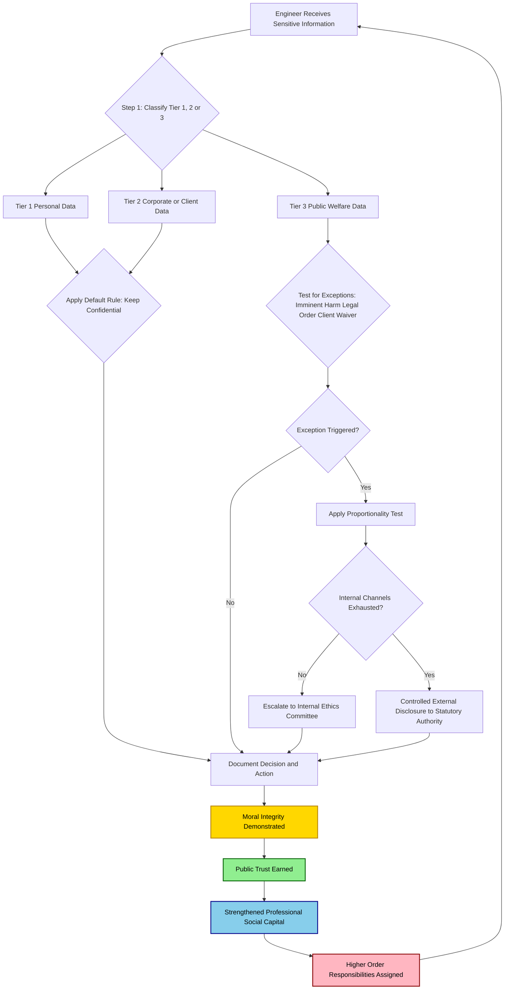
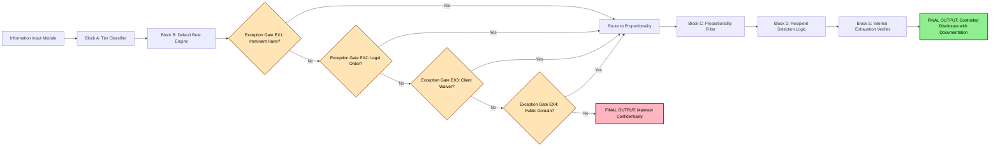
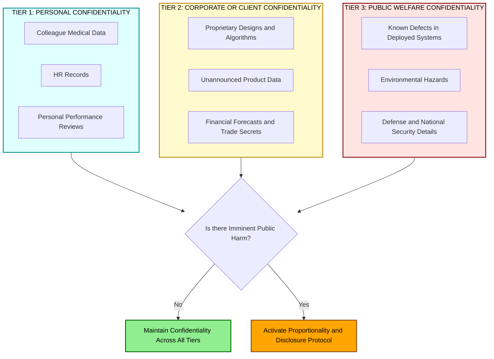

# Role of confidentiality in moral integrity

<!-- SECTION_1_START -->
# Role of Confidentiality in Moral Integrity

## 1.1 Formal Definition (KTU 2024 Syllabus Aligned)

**Confidentiality** is the ethical and professional duty to responsibly safeguard information that has been entrusted to a person in a fiduciary, professional, or privileged context. In engineering practice, this information may include trade secrets, client designs, proprietary algorithms, research data, personnel records, classified defense specifications, and unreleased safety findings.

**Moral Integrity** is the unwavering adherence to a consistent set of ethical principles, values, and moral norms, even in the face of adversity, peer pressure, or institutional convenience. An engineer with moral integrity is one whose external actions, professional decisions, and private conduct are in verifiable alignment with declared ethical commitments.

The **Role of Confidentiality in Moral Integrity** therefore refers to the structural mechanism by which the disciplined handling of sensitive information reinforces, demonstrates, and protects an engineer's inner moral compass against corruption, coercion, and compromise.

> [!IMPORTANT]
> **KTU 2024 Syllabus Highlight (Module 1 – Fundamentals of Ethics):**
> Confidentiality is positioned as one of the *operational pillars* of moral integrity. The syllabus frames integrity not merely as "being honest," but as the *demonstrable capacity* to keep faith with those who have placed trust in the professional — and confidentiality is the most common, day-to-day arena in which that capacity is tested.

## 1.2 Conceptual Analogy and Intuition

Imagine a **bank vault with a single, trusted keyholder**. The vault represents the *trust* placed in the engineer by society, clients, and colleagues. The keyholder's identity is the *moral integrity* of that engineer. Confidentiality is the **disciplined, daily act of turning the key only for authorized transactions**, never for personal curiosity, never under bribery, and never leaking the combination to a rival.

If the keyholder begins to gossip about what is inside the vault, the bank's trust collapses. If the keyholder refuses to open the vault when a legitimate law-enforcement authority arrives with a court order (i.e., a justified breach), the keyholder has confused secrecy with integrity. True integrity is the *intelligent* application of confidentiality — knowing **what to keep private, when to keep it private, and when the moral duty to protect life overrides the duty to keep secrets**.

> [!NOTE]
> **Intuitive Takeaway:** Confidentiality without integrity is just *secrecy* (often self-serving). Integrity without confidentiality is *impotent* (a person who cannot be trusted with secrets cannot be trusted with responsibility). Together, they form the load-bearing wall of engineering professionalism.

## 1.3 Key Terminology and Standard Metrics

| Term | Operational Meaning |
|---|---|
| **Privileged Information** | Data shared under an explicit or implicit promise of discretion (e.g., attorney–client, doctor–patient, engineer–client). |
| **Trade Secret** | Commercial information that derives independent economic value from not being generally known. |
| **Whistleblower** | A person who reports wrongdoing from within an organization, often after confidentiality mechanisms have failed. |
| **Conflict of Interest (COI)** | A situation in which personal interests could compromise professional judgment — confidentiality rules exist to *prevent* COIs. |
| **Non-Disclosure Agreement (NDA)** | A legal contract enforcing confidentiality between parties. |
| **Public Interest Exception** | The recognized moral and legal justification to break confidentiality when *preventable harm* to life, health, or public safety is at stake. |

> [!TIP]
> **Engineering Context:** In India, the **Information Technology Act, 2000 (amended 2008)**, the **Indian Contract Act, 1872 (Sections 27 & 72)**, and the **Right to Information Act, 2005** together form the statutory backdrop against which engineering confidentiality is judged. Internationally, the **IEEE Code of Ethics (Clause I.1)** and **NSPE Code of Ethics** explicitly mandate confidentiality as a core obligation.

> [!VISUALIZATION CONTROL]
> **Concept:** The Trust–Confidentiality–Integrity Triangle (Cartesian representation of ethical equilibrium).
>
> **Conceptual Equations (to plot on a conceptual axis):**
> * `Integrity Score = f(Confidentiality_Adherence, Honesty, Courage)`
> * `Public Trust = Integrity_Score \times Time_Consistency`
>
> **Visual Description:** On a 2-axis plane, plot *Confidentiality Discipline* on the X-axis and *Public Trust Earned* on the Y-axis. The curve should rise linearly up to a threshold (the "responsible disclosure" zone), then plateau and sharply decline if secrets are weaponized or leaked unethically. Students should observe that *both* excessive secrecy and reckless disclosure damage trust.

---

<!-- SECTION_1_END -->

<!-- SECTION_2_START -->
# Deep Theoretical Analysis & KTU High-Yield Cheat Sheet

## 2.1 The Theoretical Architecture

Moral integrity is a *composite* virtue, not a single trait. Confidentiality is the *operational test* of that virtue because it is exercised continuously, often invisibly, and under conditions of asymmetric information — making it the most reliable behavioral indicator of an engineer's true character.

### 2.1.1 Why Confidentiality is a Pillar, Not a Byproduct

1. **Trust as Social Capital:** Engineering projects are cooperative endeavors. Confidentiality violations destroy the *social capital* required for collaboration. Once lost, it is mathematically (and reputationally) very expensive to rebuild.
2. **Asymmetric Power Dynamics:** Engineers often hold information that is *more valuable* to others than to themselves (e.g., proprietary client data). The temptation to monetize this asymmetry is the central moral test.
3. **Verification Costs:** Society cannot constantly monitor every engineer. *Confidentiality adherence* is the lowest-cost *signaling mechanism* that the engineer is trustworthy in domains that cannot be externally audited.
4. **Moral Courage Multiplier:** Maintaining confidentiality when it is personally inconvenient (e.g., not boasting about a breakthrough) compounds the credibility of *all other* integrity claims. It is the "compound interest" of professional ethics.

### 2.1.2 The Three Tiers of Confidentiality in Engineering

| Tier | Scope | Example | Violation Consequence |
|---|---|---|---|
| **Tier 1 – Personal** | Colleagues' personal data, HR records. | Discussing a peer's medical leave with outsiders. | Loss of personal trust; HR action. |
| **Tier 2 – Corporate / Client** | Designs, algorithms, financials, unannounced products. | Leaking a chip design to a competitor. | Civil/criminal liability; NDA breach lawsuits. |
| **Tier 3 – Public Welfare / Safety** | Known defects in a deployed product, environmental hazards. | Hiding a structural crack in a bridge. | Mass harm, criminal negligence, license revocation. |

## 2.2 The Confidentiality–Integrity Decision Loop

A disciplined engineer follows a *recursive ethical loop* whenever sensitive information is encountered:

\begin{aligned}
\text{Step 1: Identify} &\rightarrow \text{Recognize the information as sensitive.} \\
\text{Step 2: Classify} &\rightarrow \text{Assign a Tier (1, 2, or 3) and a legal status.} \\
\text{Step 3: Assess Intent} &\rightarrow \text{Ask: "Who benefits if this is disclosed?"} \\
\text{Step 4: Test Against Exceptions} &\rightarrow \text{Is there imminent harm? Public safety risk?} \\
\text{Step 5: Act} &\rightarrow \text{Keep, escalate internally, or (rarely) disclose externally.} \\
\text{Step 6: Document} &\rightarrow \text{Record the decision and rationale.}
\end{aligned}

This loop is the *practical algorithm* of moral integrity in action.

## 2.3 KTU Cheat Sheet — High-Yield Principles

| Principle | Formulation | When Triggered |
|---|---|---|
| **Default Rule** | Keep information confidential unless legally or ethically required to disclose. | Always. |
| **Public Interest Override** | Break confidentiality only to prevent *imminent, serious, and documentable* harm. | Tier 3 scenarios. |
| **Proportionality Rule** | Disclose the *minimum* information necessary to the *right* authority. | Whistleblowing events. |
| **Informed Consent** | Disclose *what will be shared, with whom, and why* before sharing. | Collaborative projects. |
| **Chain of Custody** | Track who accessed, modified, or transmitted data. | Data engineering, defense. |
| **Sunset Clauses** | Confidentiality ends when the *underlying information becomes public domain* legally. | Patents, expired NDAs. |
| **Need-to-Know** | Share sensitive data only with personnel who *require* it for the task. | All tiers. |

> [!NOTE]
> **KTU Examiner's Pattern:** A common Part A question is *"List any two situations where a professional engineer is justified in breaking confidentiality."* The model answer **must** cite (a) prevention of imminent public harm, (b) legal compulsion (court order), and (c) the client's own waiver — *not* personal convenience.

## 2.4 Real-World Engineering Utility

Confidentiality under moral integrity is not an abstract virtue — it is the operational currency of every engineering discipline:

* **Software Engineering:** Protecting source code, user data (GDPR, DPDP Act 2023), and zero-day vulnerability disclosures (responsible disclosure policies).
* **Civil Engineering:** Suppressing design details of critical infrastructure from public release (bridges, dams) to prevent terrorism — while *internally* documenting all safety concerns.
* **Electrical/Electronics Engineering:** Maintaining semiconductor IP, cryptographic keys, and proprietary firmware.
* **Mechanical / Aerospace:** Boeing's 737 MAX case showed the *catastrophic* failure of confidentiality when it becomes a tool to *suppress* safety dissent (engineers silenced internally).
* **Biomedical Engineering:** Patient data confidentiality (HIPAA-equivalent standards) and clinical trial integrity.
* **Defense Engineering:** Official Secrets Act compliance, balanced against constitutional duties.

> [!TIP]
> **Production Engineering Analogy:** Confidentiality is to a professional reputation what **thread-locking compound (Loctite)** is to a bolted joint. It does not bear the *primary load*, but without it, the entire assembly vibrates apart under operational stress.

---

<!-- SECTION_2_END -->

<!-- SECTION_3_START -->
# Step-by-Step Analytical Framework & Symbolic Implementation

## 3.1 The 7-Step Moral Integrity Test for Confidentiality Breaches

This is the **canonical KTU 2024 analytical template** for evaluating any real-world confidentiality dilemma. Every step must be explicitly written out in the answer script to score full marks.

### **Step 1 — Establish the Fact Base**

Identify precisely *what* information is at stake. Vague claims like "it is sensitive" score zero. The information must be described with reference to its **type, source, and current custody chain**.

> *Example:* "An internal test report dated 14 March, marked 'Confidential — Engineering Review,' indicates that the brake-hydraulic seals on Model X fail at 38% below the certified pressure rating."

### **Step 2 — Identify the Duty-Holders and Stakeholders**

Enumerate *all* parties with a legitimate interest.

\begin{aligned}
\text{Stakeholders} = \{ & \text{Engineer}, \text{Employer}, \text{Client}, \text{End-Users}, \\
& \text{Regulators}, \text{Colleagues}, \text{Society at Large} \}
\end{aligned}

### **Step 3 — Apply the Default Rule**

State the *prima facie* obligation:

$$\text{Default Obligation} = \text{Keep the information confidential.}$$

This is the *baseline* of integrity. Skipping this step is a common answer-script error.

### **Step 4 — Test for Recognized Exceptions**

Check each of the following exception conditions in sequence:

\begin{aligned}
\text{Exception}_1 &= \text{Imminent, serious, and irreversible harm to public?} \\
\text{Exception}_2 &= \text{Legal compulsion (court order, statutory duty)?} \\
\text{Exception}_3 &= \text{Client/Principal has explicitly waived confidentiality?} \\
\text{Exception}_4 &= \text{Information is already in the public domain?}
\end{aligned}

If *none* of these is satisfied, the information stays confidential. Period.

### **Step 5 — Apply the Proportionality Test**

If an exception is satisfied, the engineer must *not* dump the entire dataset to the press. Instead:

$$\text{Disclose}_{\text{appropriate}} = \min\Bigl(\text{Information}_{\text{necessary}},\ \text{Recipient}_{\text{authorized}}\Bigr)$$

This is the **engineering analogue of "minimum effective dose" in medicine**.

### **Step 6 — Exhaust Internal Channels First**

Before any external disclosure, the engineer must demonstrate that internal escalation was attempted *in good faith*:

\begin{aligned}
\text{Escalation Path} = & \text{Immediate Supervisor} \rightarrow \text{Project Manager} \\
& \rightarrow \text{Chief Engineer} \rightarrow \text{Internal Ethics Committee} \\
& \rightarrow \text{External Regulator (Statutory Whistleblower)}
\end{aligned}

> [!WARNING]
> **Common Pitfall:** Jumping straight to social media or press. The Supreme Court of India in *Vishaka v. State of Rajasthan (1997)* and the **Whistle Blowers Protection Act, 2011 (now Whistle Blowers Protection Act, 2014 — amended)** require that internal remedies be demonstrably exhausted, *unless* the internal channel itself is complicit in the wrongdoing.

### **Step 7 — Document the Decision**

Every step above must be contemporaneously documented. The *documentation* is the *evidence of integrity*:

> *"Decision dated 22 May, 14:30 hrs: Disclosed Section 4.2 of the test report to the State Public Works Department via registered post under Section 4 of the Whistle Blowers Protection Act. Disclosure was limited to seal failure data; proprietary chemistry was redacted. Copy to Internal Ethics Committee Chair."*

Documentation converts an opinion into a **verifiable, auditable decision** — which is the very definition of moral integrity in a professional context.

## 3.2 Symbolic / Algorithmic Representation (Python-style Pseudocode)

Although this is a humanities subject, presenting the framework as a *decision algorithm* dramatically increases answer-script clarity in KTU evaluations.

```python
from enum import Enum
from typing import List, Optional
import logging
import datetime

class ConfidentialityTier(Enum):
    PERSONAL = 1
    CORPORATE = 2
    PUBLIC_WELFARE = 3

class HarmSeverity(Enum):
    NONE = 0
    REVERSIBLE = 1
    IRREVERSIBLE = 2
    MASS_LIFE_THREATENING = 3

class DisclosureRecipient(Enum):
    SUPERVISOR = "Supervisor"
    ETHICS_COMMITTEE = "Ethics Committee"
    STATUTORY_REGULATOR = "Statutory Regulator"
    MEDIA = "Media (Last Resort)"

def assess_confidentiality_action(
    info_sensitivity: ConfidentialityTier,
    imminent_harm: HarmSeverity,
    legal_compulsion: bool,
    client_waiver: bool,
    already_public: bool,
    internal_exhausted: bool
) -> str:
    """
    Implements the 7-Step Moral Integrity Test.
    Returns a recommended action with documentation.
    """
    logging.info(f"Assessment started at {datetime.datetime.utcnow().isoformat()}")

    # STEP 3: Default rule
    if info_sensitivity == ConfidentialityTier.PERSONAL and not imminent_harm:
        return "ACTION: MAINTAIN FULL CONFIDENTIALITY. [Steps 1-3 only]"

    # STEP 4: Check exceptions
    exceptions_triggered: List[str] = []
    if imminent_harm == HarmSeverity.MASS_LIFE_THREATENING:
        exceptions_triggered.append("Imminent mass harm")
    if legal_compulsion:
        exceptions_triggered.append("Court / statutory order")
    if client_waiver:
        exceptions_triggered.append("Client waiver")
    if already_public:
        exceptions_triggered.append("Already public domain")

    if not exceptions_triggered:
        return "ACTION: MAINTAIN CONFIDENTIALITY. No exception satisfied. [Default Rule]"

    # STEP 5: Proportionality - choose MINIMUM recipient
    if not internal_exhausted and imminent_harm != HarmSeverity.MASS_LIFE_THREATENING:
        return ("ACTION: ESCALATE INTERNALLY FIRST. "
                "Recipient: Ethics Committee. "
                "Disclosure scope: MINIMUM necessary.")

    # STEP 6 & 7: Disclose and document
    chosen_recipient: Optional[DisclosureRecipient] = None
    if imminent_harm == HarmSeverity.MASS_LIFE_THREATENING:
        chosen_recipient = DisclosureRecipient.STATUTORY_REGULATOR
    elif legal_compulsion:
        chosen_recipient = DisclosureRecipient.STATUTORY_REGULATOR
    elif client_waiver:
        chosen_recipient = DisclosureRecipient.ETHICS_COMMITTEE
    else:
        chosen_recipient = DisclosureRecipient.ETHICS_COMMITTEE

    return (f"ACTION: CONTROLLED DISCLOSURE to {chosen_recipient.value}. "
            f"Disclose MINIMUM necessary info only. "
            f"MANDATORY: Contemporaneous written documentation with timestamp, "
            f"rationale, scope, and recipient chain of custody.")
```

## 3.3 Comparative Case Analysis Matrix (Humanities Topic Format)

| Engineering Case | Tier of Information | Action Taken | Integrity Outcome |
|---|---|---|---|
| **Roger Boisjoly (Challenger Disaster, 1986)** | Tier 3 — O-ring safety data. | Internal memo warning of cold-weather failure. | Integrity *demonstrated*; management overruled him. The disaster validated his confidential warning. |
| **Boeing 737 MAX (2018–2019)** | Tier 3 — MCAS software defect. | Engineers allegedly pressured to silence concerns. | Integrity *breached* organizationally; 346 deaths; criminal charges followed. |
| **Theranos / Elizabeth Holmes** | Tier 2 — Proprietary tech claims. | Fabricated data, lied to investors/patients. | Integrity *collapsed*; fraud conviction. |
| **Volkswagen Emissions (2015)** | Tier 3 — Public health (NOx emissions). | Engineered defeat device concealed from regulators. | Integrity *catastrophically* breached; \$\30B+ in fines. |
| **Apple vs. FBI (San Bernardino, 2016)** | Tier 2 — User encryption. | Apple refused to weaken iOS security. | Integrity *defended* user confidentiality against state pressure. |
| **Generic Civil Engineer — Bridge Crack** | Tier 3 — Structural integrity. | Concealed from municipal authority. | Integrity *breached*; engineer liable for negligence. |

> [!NOTE]
> **Exam Tip:** If asked *"Is confidentiality an absolute duty?"*, the model KTU answer is a definitive **NO** — it is a *conditional* duty, bounded by the higher obligations of public safety, legal compulsion, and the client's own informed waiver. Memorize this dichotomy.

---

<!-- SECTION_3_END -->

<!-- SECTION_4_START -->
# Structural Diagrams & Schematics

## 4.1 The Confidentiality–Integrity–Trust Causal Flow

This Mermaid diagram depicts how confidentiality discipline feeds into moral integrity, which in turn generates public trust — the foundational capital of any engineering profession.



## 4.2 The Sequential Processing Topology Matrix — Exception Testing Pipeline

This block-architecture diagram represents the **exception-testing pipeline** of Step 4 in the analytical framework, since this is the most examination-relevant section.



## 4.3 The Three-Tier Confidentiality Architecture



---

<!-- SECTION_4_END -->

<!-- SECTION_5_START -->
# KTU 2024 Scheme Examination Question Bank & Topic Recap

## 5.1 Part A — Short Answer Questions (3 Marks Each)

> Cognitive Levels: **Remember / Understand**
> Mapping: **CO1** (Understand the fundamentals of ethics and moral reasoning)

### **Question 1** `[KTU University Exam – July 2023]`
**Define "confidentiality" as a professional virtue. Why is it considered a *test* of an engineer's moral integrity?**

#### Model Answer (3 Marks):
* **Definition (1 Mark):** Confidentiality is the ethical duty to safeguard information entrusted to a professional, ensuring it is neither misused, disclosed without authorization, nor exploited for personal or unauthorized third-party gain.
* **Why it tests integrity (2 Marks):** (a) It is exercised *when no one is watching* — the absence of external surveillance is precisely what makes it a true character test. (b) The temptation to misuse information is *constant* (financial gain, career advancement, personal vendetta). (c) Maintaining confidentiality when it is personally *inconvenient* demonstrates that the engineer's actions are governed by internalized principles, not by external reward — the textbook definition of moral integrity.

> [!NOTE]
> **Valuation Cue:** A 1-mark answer that *only* defines confidentiality without linking it to integrity will receive partial credit. The "test" linkage is mandatory for full 3 marks.

---

### **Question 2** `[KTU University Exam – Dec 2022]`
**List and briefly explain any THREE situations in which an engineer is ethically justified in breaking confidentiality.**

#### Model Answer (3 Marks — 1 Mark Each):
1. **Imminent danger to public life or safety:** If undisclosed information points to a structural, software, or product defect that will foreseeably cause death or serious injury, confidentiality yields to the higher duty of *non-maleficence*. *(e.g., a civil engineer hiding a crack in a load-bearing beam.)*
2. **Legal compulsion:** A binding court order or statutory requirement (e.g., under the Right to Information Act, 2005, or a judicial summons) compels disclosure, and refusal would constitute contempt.
3. **Client's informed waiver:** When the client themselves, with full knowledge and voluntariness, releases the engineer from the confidentiality obligation for a specified purpose.

> [!TIP]
> **Examiner Pattern:** Many students incorrectly cite "personal disagreement with the employer" or "to gain media attention" as justifications. These are *not* valid grounds and will be marked down.

---

## 5.2 Part B — Long Answer Questions (14 Marks — Internal Choice)

> Cognitive Levels: **Understand (part a) → Apply / Analyze (part b)**
> Mapping: **CO2** (Apply ethical theories to professional dilemmas)

---

### **Question 3A (14 Marks)** `[KTU University Exam – July 2024]`

**(a)** *"Confidentiality is a conditional duty, not an absolute one."* Discuss this statement in the context of engineering professionalism, citing the **Public Interest Exception** and the **Proportionality Test**. (7 Marks)

**(b)** A junior software engineer at a Bangalore-based fintech firm discovers during routine code review that the company's flagship payment-gateway application has a critical security vulnerability (CVE-rated 9.8/10) that exposes 4 million users' financial data. The CTO dismisses her internal report as "overblown" and instructs her to "not create panic." The defect is *not yet* in the public domain. Apply the **7-Step Moral Integrity Test** to determine her course of action. (7 Marks)

#### Model Answer:

**Part (a) — Discussion (7 Marks)**

**Statement Framing (1 Mark):** The statement is *correct* and aligns with the universally accepted professional ethics position (NSPE Code, IEEE Code, and Indian statutory frameworks). Confidentiality is the *default*, but it is not the *summum bonum*.

**Why Confidentiality Cannot Be Absolute (2 Marks):**
* Engineers are *not* the ultimate owners of sensitive information — they are *custodians* on behalf of clients and society.
* An absolute rule would, in pathological cases, *force* the engineer to remain silent about preventable mass harm (e.g., Boeing 737 MAX, Bhopal-style industrial negligence).
* The Nuremberg Trials established that "following orders" or "respecting corporate confidentiality" is *not* a defense for complicity in foreseeable harm.

**The Public Interest Exception (2 Marks):**
* Triggered when (i) the harm is *imminent*, (ii) *serious*, and (iii) *disclosure is the only practical way* to prevent it.
* The engineer must demonstrate that the harm outweighs the *legitimate* interest in confidentiality.
* The disclosure must be made to an *authorized recipient* (regulator, ethics committee, or in extremis, the public) — not to unauthorized parties.

**The Proportionality Test (2 Marks):**
* Disclose the *minimum* information necessary.
* To the *least intrusive* recipient capable of acting on the information.
* Through the *most discreet* channel available.
* Only after *good-faith* internal escalation has been attempted (or has been demonstrated to be futile).

> **[Part (a) Valuation Breakdown: Statement Framing 1M, Why Conditional 2M, Public Interest Exception 2M, Proportionality Test 2M.]**

---

**Part (b) — Case Application (7 Marks)**

**Step 1 — Fact Base (1 Mark):** A 9.8-rated CVE vulnerability exists in a live production payment gateway. 4 million users' financial data is at risk. Information is *not yet* public.

**Step 2 — Stakeholders (1 Mark):** Engineer, CTO, Company, 4 million end-users, RBI (regulator), CERT-In (Indian Computer Emergency Response Team), society at large.

**Step 3 — Default Rule (0.5 Marks):** Prudent action is to keep vulnerability details confidential to prevent weaponization by attackers. **However**, this default is being *misused* by the CTO to suppress a safety-critical fix.

**Step 4 — Test Exceptions (1.5 Marks):**
* Exception 1 (Imminent Harm): **TRIGGERED** — 4 million users face financial fraud risk; identity theft, monetary loss, reputational damage.
* Exception 4 (Public Domain): Not yet — but responsible disclosure to CERT-In does *not* equate to public disclosure.

**Step 5 — Proportionality (1 Mark):** Disclose *only* the technical nature of the vulnerability and the affected version, *not* the proprietary exploit code, to CERT-In and RBI. Patch must be issued within 30 days (standard responsible disclosure window).

**Step 6 — Internal Channels (1 Mark):** She has already escalated to the CTO and been rebuffed. She must next escalate to (a) the company's Internal Ethics Committee, (b) the Audit Committee of the Board, and (c) only thereafter, CERT-In. Direct media disclosure is *premature* unless there is evidence of *active exploitation* in the wild.

**Step 7 — Documentation (1 Mark):** She must maintain timestamped, written records of every escalation attempt, the CTO's dismissal, and her own internal dissent. This is her *defense* against any future retaliation and is protected under the **Whistle Blowers Protection Act, 2014** and the **IT Act, 2000 Section 70B (6)** which mandates reporting of cybersecurity incidents.

> **[Part (b) Valuation Breakdown: Fact 1M, Stakeholders 1M, Default 0.5M, Exceptions 1.5M, Proportionality 1M, Internal Exhaustion 1M, Documentation 1M.]**

**Conclusion (Implicit, 0 Marks but expected):** The engineer is *justified* in escalating beyond the CTO to the Ethics Committee and, if the company remains unresponsive within a defined window, to CERT-In. She is *not* justified in posting on social media.

---

### **Question 3B (14 Marks — Alternative Choice)** `[KTU University Exam – Dec 2023]`

**(a)** Explain the concept of **"moral integrity"** in engineering practice. How is confidentiality distinct from — and yet inseparable from — moral integrity? (7 Marks)

**(b)** A structural engineer in Kochi is part of a design consortium building a coastal flyover. During monsoon testing, she discovers that a key sub-contractor has substituted a lower-grade rebar (Fe-415 substituted for the specified Fe-500) in 18 of 42 pier foundations to cut costs. The sub-contractor's project manager offers her a "consulting fee" of ₹12 lakh and confidential settlement paperwork to "look the other way" and proceed with certification. Using the **7-Step Moral Integrity Test**, advise her course of action and identify the specific Indian statutes her silence would violate. (7 Marks)

#### Model Answer Outline:

**Part (a) — Conceptual (7 Marks):**
* **Definition of Moral Integrity (2 Marks):** Adherence to moral principles with consistency, courage, and accountability; visible in action under pressure.
* **Confidentiality vs. Integrity (3 Marks):** Tabular distinction — confidentiality is *behavioral*, integrity is *character*; confidentiality protects *information*, integrity protects *truth*; confidentiality can be *tactical* (case-by-case), integrity must be *strategic* (lifetime consistency). They are inseparable because integrity *manifests* through confidentiality decisions.
* **Synthesis (2 Marks):** Confidentiality is the *daily, observable expression* of integrity. Without confidentiality, integrity is a private virtue with no public demonstration; without integrity, confidentiality degenerates into mere secrecy.

**Part (b) — Case Application (7 Marks):**
* **Fact Base (1 Mark):** Re-bar substitution; 18 of 42 piers affected; structural integrity at risk in coastal/monsoon conditions.
* **Stakeholders (1 Mark):** Engineer, consortium, sub-contractor, end-users (motorists), Kerala PWD, IS Code 456 committee.
* **Default Rule (0.5 Mark):** This is a Tier 3 (public welfare) issue. Default confidentiality yields to disclosure.
* **Exceptions (2 Marks):** Imminent public harm — coastal flyover in seismic/monsoon zone; lives at risk. Bribe offer further confirms conscious concealment.
* **Statutes Violated by Silence (1.5 Marks):** (a) Indian Penal Code **Section 420** (cheating), (b) **Section 304A** (death by negligence), (c) **Prevention of Corruption Act, 1988 (amended 2018) Section 7** (bribe acceptance is a crime for the *briber* and complicity for the silent engineer), (d) **Engineer's Act / IEI Code of Ethics** which mandates reporting of unsafe practice.
* **Proportionality + Internal Channels (0.5 Mark):** Report to consortium chief engineer, then Kerala PWD Chief Engineer (Vigilance), then file an FIR. *Do not* accept the bribe — the moment she accepts, she loses *all* legal whistleblower protection.
* **Documentation (0.5 Mark):** Preserve the original test reports, the bribe offer (preferably via recorded conversation under **Section 6 of the Indian Telegraph Act** if lawful), and her own dissent memo.

> [!WARNING]
> **KTU Examiner's Valuation Warning — Common Pitfalls to Avoid:**
>
> 1. **Conflating secrecy with integrity:** A 2-mark answer that claims "confidentiality = integrity" loses 2 full marks. They are *distinct but linked*.
> 2. **Ignoring proportionality:** Saying "she should call a press conference" without exhausting internal channels loses 1.5 marks.
> 3. **Skipping statutory references:** Humanities questions in KTU 2024 Scheme *reward* the mention of specific Indian Acts. Omitting them costs at least 1 mark.
> 4. **Forgetting documentation:** Step 7 of the framework is consistently omitted by students — the examiner *will* deduct 1 mark.
> 5. **Writing vague generalities:** Phrases like "she should do the right thing" score zero. Replace with the *exact* next action and the *exact* statute invoked.

---

## 5.3 Topic Recap & Important Things to Remember

* **Confidentiality** = duty to protect entrusted information. **Moral integrity** = consistent adherence to moral principles under pressure.
* Confidentiality is the **operational test** of moral integrity — the *daily, observable* proof that the engineer's character matches their claimed ethics.
* The **default rule** is to keep information confidential. It is a *conditional*, not an *absolute*, duty.
* The **Public Interest Exception** triggers when (i) harm is imminent, (ii) serious, and (iii) disclosure is the only practical preventive measure.
* The **Proportionality Test** requires *minimum necessary* information, *least intrusive* recipient, and *most discreet* channel.
* Always **exhaust internal channels first** (supervisor → ethics committee → regulator), unless those channels are demonstrably complicit.
* **Contemporaneous documentation** of every decision is non-negotiable — it is the *evidence* of integrity and the *shield* against retaliation.
* The **three tiers** of confidentiality are: (1) Personal, (2) Corporate/Client, (3) Public Welfare — with escalation gravity increasing from Tier 1 to Tier 3.
* Relevant **Indian statutory framework**: IT Act 2000 (amended 2008), Whistle Blowers Protection Act 2014, IPC Sections 420 and 304A, Prevention of Corruption Act 2018, Right to Information Act 2005, DPDP Act 2023.
* Relevant **international codes**: IEEE Code of Ethics (Clause I.1), NSPE Code, ACM Code of Ethics (Section 1.6 on confidentiality).
* **Three valid grounds** for breaking confidentiality: (a) imminent public harm, (b) legal compulsion, (c) client's informed waiver. Personal gain, convenience, or media attention are *never* valid grounds.
* A disciplined engineer treats confidentiality as **"thread-locking compound"** — invisible, unglamorous, but the substance that keeps the entire professional assembly from vibrating apart under stress.
* The **Moral Integrity Test (7 Steps)**: Identify → Classify → Default Rule → Test Exceptions → Proportionality → Internal Exhaustion → Documentation.

> [!IMPORTANT]
> **Final KTU 2024 Revision Mantra:**
> *"Confidentiality is the vault; integrity is the keyholder; trust is what is stored inside. Lose any one, and the other two become meaningless."*

---

<!-- SECTION_5_END -->
