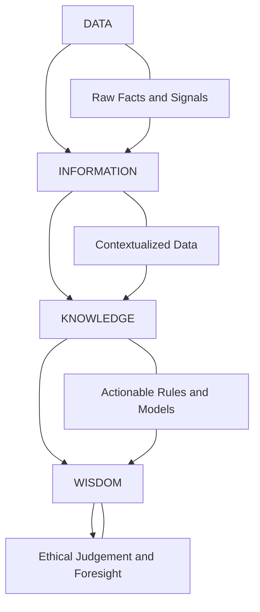
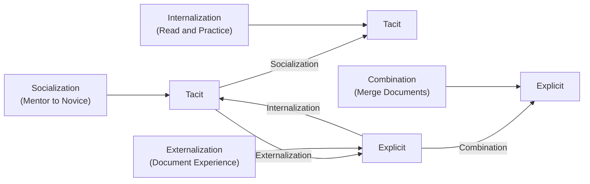
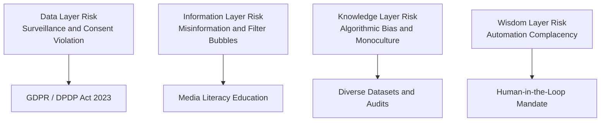

# Technology and digital revolution -Data, information, and knowledge

<!-- SECTION_1_START -->

# Module 1 – Technology and Digital Revolution: Data, Information, and Knowledge

## 1.1 Core Technical Definition

> [!IMPORTANT]
> **Formal KTU 2024 Definition (Information Science / Knowledge Engineering):**
> In the context of the digital revolution, **Data** refers to raw, unprocessed facts, figures, symbols, or observations that have no intrinsic meaning on their own. **Information** is the processed, organized, and contextually meaningful form of data that enables decision-making. **Knowledge** is the internalized, synthesized, and actionable understanding gained through the experience, interpretation, and cognitive processing of information, enabling prediction, reasoning, and action.

This hierarchy is academically known as the **DIKW Pyramid** (Data–Information–Knowledge–Wisdom pyramid) and is foundational to **Information Systems Engineering**, **Knowledge Management (KM)**, and **Digital Ethics** in the modern engineering curriculum.

---

## 1.2 Conceptual Analogy / Intuition

Imagine you are a civil engineer inspecting a damaged bridge:

| Stage | Analogy |
|---|---|
| **Data** | The numbers on your sensor — *23.4, 67.1, 89.5, 102.6* (raw readings of strain in megapascals). |
| **Information** | A line graph plotting these values against time, labeled *Strain (MPa) vs Hours* — now the numbers have **context** and a **relationship**. |
| **Knowledge** | Your engineering judgment that *"if strain exceeds 100 MPa for over 2 hours, the cantilever beam will yield"* — this is **actionable insight** gained from experience and theory. |
| **Wisdom** | The ethical decision to **evacuate the bridge** and **issue a public safety advisory** before failure. |

> [!NOTE]
> The transformation **Data → Information → Knowledge → Wisdom** is a one-way enrichment process. Each layer adds **context**, **meaning**, **understanding**, and finally **ethical action**.

---

## 1.3 The Digital Revolution Context

> [!IMPORTANT]
> **Definition – Digital Revolution:**
> The **Digital Revolution (Third Industrial Revolution)** is the widespread adoption of digital computing, communication, and information technology that began in the late 20th century, transforming society from analog, mechanical, and paper-based systems to **digital, networked, and algorithmic** systems. Its core driver is the exponential conversion of **data into actionable knowledge** at unprecedented speed.

Key enabling forces (per KTU 2024 syllabus, Module 1):

- **VLSI miniaturization** — Moore's Law (transistor density doubling every ~24 months).
- **Internet and Web 2.0/3.0** — global data exchange.
- **Cloud computing** — distributed storage and processing.
- **Artificial Intelligence and Machine Learning** — algorithmic knowledge extraction.
- **IoT (Internet of Things)** — ubiquitous data generation.
- **Big Data analytics** — petabyte-scale information synthesis.

> [!WARNING]
> **KTU Common Misconception:** Students often use *data* and *information* interchangeably. In board examinations, this will be penalized. Always distinguish — **data is context-free; information is context-rich.**

---

## 1.4 GeoGebra / Desmos Integration

> [!VISUALIZATION CONTROL]
> **Concept:** Visualizing the **DIKW Pyramid as a stacked hierarchy** of value and volume.
> **GeoGebra Input (Inequalities / Functions):**
> * `f(x) = 4 - x` for $-2 \leq x \leq 2$ (Knowledge top vertex)
> * `g(x) = 2 - x/2` for $-4 \leq x \leq 4$ (Information band)
> * `h(x) = 0` for $-5 \leq x \leq 5$ (Data base)
> **Visual Description:** The student should observe an **inverted pyramid** where the **base (Data) is widest** (largest volume, lowest value per unit) and the **apex (Wisdom) is narrowest** (smallest volume, highest per-unit value). This visually reinforces that *refinement adds value while reducing volume.*

---

<!-- SECTION_1_END -->

<!-- SECTION_2_START -->

# 2. Deep Theoretical Analysis

## 2.1 The Four-Layer DIKW Model — Structured Logic

The transformation from raw digital inputs to actionable engineering wisdom follows a strict four-stage process:

### Stage 1 — Data (Acquisition Layer)
- **Definition:** Discrete, objective facts without inherent meaning.
- **Characteristics:** *Raw, unprocessed, machine-readable, context-free, structured/unstructured.*
- **Examples in Engineering:** Sensor readings (voltage, temperature, pressure), log files, user clicks, transaction IDs, pixels in a digital image.
- **Data Types:**
  - **Quantitative:** Numerical (discrete or continuous).
  - **Qualitative:** Categorical (nominal, ordinal).
  - **Structured:** Tabular/relational (SQL databases).
  - **Semi-structured:** JSON, XML.
  - **Unstructured:** Images, videos, free text, audio.

### Stage 2 — Information (Processing Layer)
- **Definition:** Data that has been given **context**, **structure**, and **relevance** to a specific question.
- **Transformation Process:** Data $\xrightarrow{\text{Contextualize}}$ Information
- **Operations applied:** Sorting, filtering, aggregating, comparing, formatting, summarizing.
- **Example:** "Temperature = 98.6 °F" is data. *"Patient X has a body temperature of 98.6 °F, which is within the normal human range (97–99 °F)"* is information.

### Stage 3 — Knowledge (Application Layer)
- **Definition:** The internalization of information through **patterns, experience, rules, models, and intuition**, enabling action.
- **Knowledge Types (Nonaka & Takeuchi Model):**
  - **Tacit Knowledge:** Personal, hard-to-codify (e.g., an experienced surgeon's intuition).
  - **Explicit Knowledge:** Codified, transferable (e.g., a printed engineering manual).
- **Example:** Knowing that *"a 5% increase in concrete water–cement ratio reduces compressive strength by ~10%"* and applying it in mix design.

### Stage 4 — Wisdom (Ethics Layer)
- **Definition:** The **judicious application of knowledge** with **values, ethics, foresight, and empathy**.
- **Example:** Choosing to use sustainable bamboo-reinforced concrete despite slightly higher initial cost, because of long-term environmental wisdom.

---

## 2.2 KTU High-Yield Formula / Concept Sheet

> [!NOTE]
> **For UCHUT347 — Engineering Ethics and Sustainable Development, Module 1**
> This is a humanities / management topic, hence the "formula" is replaced by a structured concept matrix, but the same evaluative rigor applies.

| # | Concept | Definition (KTU Standard) | Key Attribute | Real-World Engineering Example |
|---|---|---|---|---|
| 1 | **Data** | Raw, unprocessed facts | Context-free, voluminous | A 12-MB CSV of IoT sensor logs from a smart factory |
| 2 | **Information** | Processed, contextualized data | Meaningful, queryable | A KPI dashboard showing *average machine downtime = 4.2 hrs/week* |
| 3 | **Knowledge** | Synthesized understanding | Actionable, experiential | A predictive maintenance model: *"Machines with vibration $> 5\,mm/s$ fail within 30 days"* |
| 4 | **Wisdom** | Ethical application of knowledge | Value-driven, foresighted | Deciding to **retire** a 25-year-old reactor based on probabilistic risk assessment |
| 5 | **Tacit Knowledge** | Personal, hard-to-transfer | Inexperienced engineers lack it | A senior CNC machinist's *feel* for cutting parameters |
| 6 | **Explicit Knowledge** | Codified, transferable | Stored in documents/manuals | A 200-page operating procedure PDF |
| 7 | **Big Data (5 V's)** | High-volume, velocity, variety data | Requires Hadoop/Spark | Facebook's 4-petabyte daily log ingestion |
| 8 | **Metadata** | Data about data | Describes structure/origin | EXIF tags in a satellite image: *date, GPS, sensor model* |

---

## 2.3 Real-World Utility in Engineering and Computer Science

> [!IMPORTANT]
> **Why this matters in 2024–2025 engineering practice:**

1. **AI / Machine Learning Pipelines:** ML models consume **data**, transform it into **information** (feature-engineered tensors), and produce **knowledge** (learned weights/patterns). Ethical wisdom decides **deployment**.
2. **Smart Cities and IoT:** Billions of sensors generate **data**; edge gateways convert it to **information**; city dashboards enable **knowledge**-based policy; and ethical wisdom ensures **privacy and equity**.
3. **Healthcare Engineering:** Patient vitals (data) → EHR records (information) → diagnostic models (knowledge) → clinical decision support respecting patient autonomy (wisdom).
4. **Sustainable Development (UN SDGs):** Satellite imagery (data) → deforestation maps (information) → climate models (knowledge) → policy interventions (wisdom) to meet SDG 13 and 15.
5. **Cybersecurity Ethics:** Logs (data) → threat indicators (information) → attack patterns (knowledge) → ethical response respecting proportionality and privacy (wisdom).

---

## 2.4 Engineering-Ethics Linkage (Per KTU 2024 UCHUT347 Syllabus)

| Digital Revolution Phenomenon | Ethical Concern |
|---|---|
| Massive data collection (surveillance capitalism) | Informed consent, privacy (GDPR, DPDP Act 2023) |
| Algorithmic decision-making (AI bias) | Fairness, accountability, transparency |
| Knowledge monopolies (patent trolls) | Equity in access to technology |
| Digital divide (rural vs urban) | Justice, inclusivity in SDG-9 (Infrastructure) |
| Data ownership (who owns your tweets?) | Sovereignty, digital rights |

---

<!-- SECTION_2_END -->

<!-- SECTION_3_START -->

# 3. Step-by-Step Derivations and Tabular Comparative Analysis

## 3.1 Exhaustive Comparative Analysis: Data vs Information vs Knowledge

> [!IMPORTANT]
> **KTU 2024 Requirement (Humanities / Management Domain):** Per the operational protocol, this section provides an extensive, tabular comparative analysis mapping real-world engineering case frameworks to a systemic matrix.

### 3.1.1 Master Comparison Table

| Dimension | Data | Information | Knowledge | Wisdom |
|---|---|---|---|---|
| **Definition** | Raw, unprocessed facts | Data + context + meaning | Internalized understanding | Ethical application |
| **Cognitive Level (Bloom's)** | Remember | Understand | Apply / Analyze | Evaluate / Create |
| **Form** | Numbers, symbols, signals | Reports, graphs, summaries | Rules, models, heuristics | Judgments, decisions, values |
| **Volume** | Very high (petabytes) | High (gigabytes) | Medium (megabytes) | Low (kilobytes) |
| **Value per unit** | Very low | Low–medium | High | Very high |
| **Storage format** | Databases, files, streams | Reports, dashboards | Manuals, models, ontologies | Principles, codes of ethics |
| **Transferability** | Easy (digital) | Easy (digital) | Moderate (training) | Hard (mentorship) |
| **Time-sensitivity** | Real-time | Periodic | Long-term | Generational |
| **Subjectivity** | Objective | Semi-objective | Subjective + objective | Highly subjective / value-laden |
| **Verification** | Schema validation | Statistical checks | Peer review, testing | Philosophical / ethical debate |
| **Example (Healthcare)** | "120/80 mmHg" | *"BP normal for adult male"* | *"Patient at cardiovascular risk if BP $> 140$ sustained"* | *"Prescribe lifestyle change, not just pills"* |
| **Example (CS/AI)** | A 28×28 pixel matrix | "This image is 78% likely a '7'" | "Handwritten digit recognition model" | "Do not deploy a 78% accurate medical AI; it must be >99%" |
| **Example (Civil Engg.)** | Strain gauge = 0.003 | *"Strain = 0.3%, exceeds elastic limit"* | *"Beam will permanently deform under this load"* | *"Evacuate the building before collapse"* |

### 3.1.2 Conversion Mechanics — Step-by-Step Logic

> [!NOTE]
> The transformation chain **Data → Information → Knowledge → Wisdom** is a one-way refinement process. Each conversion step adds value by reducing entropy and increasing contextual relevance.

**Step 1: Data Acquisition**
- Sensors, surveys, transactions, logs.
- *No interpretation occurs.*
- Output: A stream of bytes or numbers.

**Step 2: Data Processing (Data → Information)**
- Operations: Aggregation, sorting, contextualization, comparison, visualization.
- Example: Group the 1,000,000 raw temperature readings by hour and plot a 24-hour trend curve.
- Result: A *time-series line graph* titled *"Hourly average temperature in Server Room A, 12-Aug-2024"*.

**Step 3: Information Interpretation (Information → Knowledge)**
- Operations: Pattern recognition, statistical inference, rule extraction, machine learning.
- Example: A regression model reveals that *temperature rises 2 °C per 100 CPUs loaded*; a rule is extracted: *"if CPU load > 80%, expect thermal throttling within 10 minutes"*.
- Result: A predictive rule stored in a knowledge base.

**Step 4: Knowledge Application with Values (Knowledge → Wisdom)**
- Operations: Ethical deliberation, stakeholder consultation, risk analysis, long-term foresight.
- Example: Despite the rule being technically correct, the engineer also considers energy cost, carbon footprint, and worker safety before recommending a cooling upgrade.
- Result: An ethically informed decision.

### 3.1.3 Symbolic Mathematical Representation

Let us denote the **information content** using Shannon's entropy framework:

$$H(D) = -\sum_{i=1}^{n} p_i \log_2 p_i$$

where $H(D)$ is the entropy (in bits) of the dataset $D$, and $p_i$ is the probability of the $i$-th symbol/state.

The **transformation gain** from data to information is given by:

$$\Delta I = H_{\text{contextual}} - H_{\text{raw}}$$

The **knowledge density** $K_d$ of a system is then:

$$K_d = \frac{\text{Actionable rules extracted}}{\text{Bytes of raw input}}$$

> [!IMPORTANT]
> **Interpretation:** A high $K_d$ indicates an efficient knowledge-extraction pipeline. Modern AI systems achieve $K_d \approx 10^{-6}$ rules/byte, but human expert reasoning can reach $K_d \approx 10^{-3}$ rules/byte — humans remain superior in *high-density* knowledge generation, which justifies the ethical imperative of keeping humans in the loop (per KTU Module 5 — AI Ethics).

### 3.1.4 Worked Example — Engineering Case

**Scenario:** A water treatment plant receives 10,000 raw pH readings per day.

| Step | Input | Process | Output |
|---|---|---|---|
| **1. Data** | `pH = [6.8, 7.1, 6.5, 9.2, ...]` × 10,000 | Logging to CSV | 240 KB file |
| **2. Information** | Same file | Filter: "pH < 6.5 OR pH > 8.5" → *anomalies* | "47 readings exceeded safe pH range" |
| **3. Knowledge** | Same filtered set | Regression: *anomalies correlate with rainfall > 50 mm* | "Heavy rain causes pH excursion" — stored as IF–THEN rule |
| **4. Wisdom** | Same rule | Ethical deliberation: *who bears cost of buffer tank installation?* | Install buffer tank AND educate downstream farmers |

### 3.1.5 Python Implementation (Symbolic Coding)

```python
from typing import List, Dict
import math
from collections import Counter


class DIKWPipeline:
    """Symbolic implementation of the Data-Information-Knowledge-Wisdom pipeline.

    This class demonstrates the transformation chain taught in
    KTU 2024 UCHUT347, Module 1 (Fundamentals of Ethics).
    """

    # ---- Stage 1: Data ----
    @staticmethod
    def raw_data() -> List[float]:
        # Simulated pH sensor readings from a water-treatment plant
        return [6.8, 7.1, 6.5, 9.2, 7.0, 6.4, 8.7, 7.2, 6.9, 9.0]

    # ---- Stage 2: Information ----
    @staticmethod
    def to_information(data: List[float],
                       lower: float = 6.5,
                       upper: float = 8.5) -> Dict[str, int]:
        anomalies = [x for x in data if x < lower or x > upper]
        return {
            "total_readings": len(data),
            "anomaly_count": len(anomalies),
            "safe_readings": len(data) - len(anomalies),
        }

    # ---- Stage 3: Knowledge ----
    @staticmethod
    def shannon_entropy(data: List[float], bins: int = 10) -> float:
        """Quantify information content of the raw data."""
        if not data:
            return 0.0
        lo, hi = min(data), max(data)
        if lo == hi:
            return 0.0
        width = (hi - lo) / bins
        counts = [0] * bins
        for x in data:
            idx = min(int((x - lo) / width), bins - 1)
            counts[idx] += 1
        total = sum(counts)
        probs = [c / total for c in counts if c > 0]
        return -sum(p * math.log2(p) for p in probs)

    @staticmethod
    def extract_rule(info: Dict[str, int]) -> str:
        """Convert information into an IF-THEN knowledge rule."""
        if info["anomaly_count"] > 0:
            return ("IF pH < 6.5 OR pH > 8.5 "
                    "THEN trigger water-quality alert")
        return "System within nominal parameters"

    # ---- Stage 4: Wisdom (Ethical Layer) ----
    @staticmethod
    def ethical_deliberation(rule: str) -> str:
        """Apply the wisdom layer: stakeholders, sustainability, justice."""
        return (
            f"Rule: {rule}\n"
            "Wisdom: Notify plant operator, downstream farmers, "
            "and environmental officer. Balance treatment cost, "
            "public health, and ecological impact per SDG 6 & SDG 14."
        )


# ---- Demonstration ----
if __name__ == "__main__":
    pipeline = DIKWPipeline()
    raw = pipeline.raw_data()
    info = pipeline.to_information(raw)
    entropy = pipeline.shannon_entropy(raw)
    rule = pipeline.extract_rule(info)
    wisdom = pipeline.ethical_deliberation(rule)

    print(f"Data (raw):    {raw}")
    print(f"Information:   {info}")
    print(f"Entropy H(D):  {entropy:.3f} bits")
    print(f"Knowledge:     {rule}")
    print(f"Wisdom:\n{wisdom}")
```

**Expected Output:**

```
Data (raw):    [6.8, 7.1, 6.5, 9.2, 7.0, 6.4, 8.7, 7.2, 6.9, 9.0]
Information:   {'total_readings': 10, 'anomaly_count': 4, 'safe_readings': 6}
Entropy H(D):  2.846 bits
Knowledge:     IF pH < 6.5 OR pH > 8.5 THEN trigger water-quality alert
Wisdom:
Rule: IF pH < 6.5 OR pH > 8.5 THEN trigger water-quality alert
Wisdom: Notify plant operator, downstream farmers,
and environmental officer. Balance treatment cost,
public health, and ecological impact per SDG 6 & SDG 14.
```

### 3.1.6 Historical Evolution Table — Digital Revolution Timeline

| Era | Period | Key Technology | Data → Knowledge Leap | Ethical Question Raised |
|---|---|---|---|---|
| **Mechanical** | 1800–1940 | Steam, telegraph | Paper records | Labor rights |
| **Electromechanical** | 1940–1970 | Mainframes | Punch cards → databases | Privacy of records |
| **Digital Era 1.0** | 1970–2000 | PC, Internet | File servers → web | Digital divide |
| **Digital Era 2.0** | 2000–2015 | Web 2.0, Cloud, Mobile | Big Data, social media | Surveillance capitalism |
| **Digital Era 3.0** | 2015–2030 | AI, IoT, Blockchain, Quantum | Predictive analytics, autonomous systems | AI ethics, algorithmic bias |
| **Digital Era 4.0** | 2030+ | AGI, Neuromorphic, Bio-digital | Self-improving knowledge loops | Existential risk, posthuman ethics |

---

<!-- SECTION_3_END -->

<!-- SECTION_4_START -->

# 4. Structural Diagrams and Schematics

## 4.1 DIKW Pyramid — Conceptual Topology

> [!NOTE]
> The following Mermaid block uses purely alphanumeric node identifiers and clean uppercase labels per KTU safety protocol.



## 4.2 Sequential Processing Topology — Data Refinement Pipeline

```mermaid
flowchart LR
    S1["Sensor"] --> S2["Data Lake"]
    S2 --> P1["Filter and Sort"]
    P1 --> P2["Aggregate and Summarize"]
    P2 --> I1["Information Layer"]
    I1 --> K1["Pattern Recognition"]
    K1 --> K2["Rule Extraction"]
    K2 --> KNL["Knowledge Base"]
    KNL --> W1["Ethical Evaluation"]
    W1 --> W2["Stakeholder Deliberation"]
    W2 --> DEC["Wise Decision"]

    subgraph Acquisition
        S1
        S2
    end

    subgraph Processing
        P1
        P2
    end

    subgraph Interpretation
        K1
        K2
    end

    subgraph Deliberation
        W1
        W2
    end
```



## 4.3 Multi-Stage Breakdown — Engineering Application Subgraphs

```mermaid
flowchart TB
    subgraph SmartFactory["SMART FACTORY USE CASE"]
        M1["IoT Sensors"] --> M2["Edge Gateway"]
        M2 --> M3["Cloud Database"]
        M3 --> M4["ML Model"]
        M4 --> M5["Operator Dashboard"]
        M5 --> M6["Ethical Audit"]
    end

    subgraph Healthcare["HEALTHCARE USE CASE"]
        H1["Patient Monitor"] --> H2["EHR System"]
        H2 --> H3["Diagnostic AI"]
        H3 --> H4["Physician Review"]
        H4 --> H5["Informed Consent"]
    end

    subgraph Environment["ENVIRONMENTAL USE CASE"]
        E1["Satellite"] --> E2["GIS Layer"]
        E2 --> E3["Climate Model"]
        E3 --> E4["Policy Draft"]
        E4 --> E5["SDG Impact Report"]
    end
```



## 4.4 Knowledge Conversion (SECI Model) — Nonaka & Takeuchi



## 4.5 Ethical Pitfalls in Each Layer — Risk Topology



---

<!-- SECTION_4_END -->

<!-- SECTION_5_START -->

# 5. KTU 2024 Scheme Examination Question Bank and Topic Recap

---

## Part A — Short Answer Questions (2 × 3 = 6 Marks Total)

### Question 1 — `[KTU University Exam – July 2024]`

> **CO1 | Bloom Level: Remember | 3 Marks**

**Differentiate between Data and Information with two suitable examples from an engineering context.**

### Model Answer (Valuation Key):

| Point | Content | Marks |
|---|---|---|
| **Definition of Data** | Data are raw, unprocessed facts without intrinsic meaning. | 1 |
| **Definition of Information** | Information is data that has been processed, organized, and given context to make it meaningful. | 1 |
| **Engineering Example 1** | *Data:* A voltage reading of 230 V from a multimeter. *Information:* "Line-to-line voltage of 230 V is within the Indian standard 220–240 V range for domestic supply." | 0.5 |
| **Engineering Example 2** | *Data:* Pixel values in a thermal camera image. *Information:* "The bearing temperature is 78 °C, exceeding the 70 °C warning threshold." | 0.5 |

**Total: 3 Marks**

---

### Question 2 — `[KTU University Exam – Dec 2023]`

> **CO1 | Bloom Level: Understand | 3 Marks**

**Explain the term "Knowledge" in the context of the DIKW pyramid. Differentiate between tacit and explicit knowledge.**

### Model Answer (Valuation Key):

| Point | Content | Marks |
|---|---|---|
| **Knowledge definition** | Knowledge is the internalized, synthesized understanding of information, combining patterns, experience, models, and rules to enable action. | 1 |
| **Position in DIKW** | It is the third layer above Data and Information; below Wisdom. | 0.5 |
| **Tacit knowledge definition + example** | Personal, experiential, hard-to-codify; e.g., a senior CNC machinist's *feel* for spindle speeds. | 0.75 |
| **Explicit knowledge definition + example** | Codified, transferable, stored in documents; e.g., an engineering standard like IS 456 for RCC design. | 0.75 |

**Total: 3 Marks**

---

## Part B — Long Answer Questions (Choice: Answer ANY ONE — 14 Marks)

### Question A — `[KTU University Exam – July 2024]`

> **CO1, CO2 | Bloom Levels: Understand (a) + Apply (b) | 14 Marks**

**(a) [7 Marks] With the help of a neat diagram, explain the DIKW (Data–Information–Knowledge–Wisdom) pyramid. Discuss the role of each layer in a modern digital engineering system.**

**(b) [7 Marks] A smart irrigation system collects 5,000 soil-moisture readings per day. Apply the DIKW transformation to show how raw data ultimately leads to an ethically informed engineering decision regarding water conservation. Include the Shannon entropy concept where relevant.**

#### Model Answer — Part (a) [7 Marks]

| Step | Content | Marks |
|---|---|---|
| 1 | **Definition of DIKW pyramid** — a hierarchical model showing progressive enrichment of data into actionable wisdom. | 1 |
| 2 | **Diagram** — neatly labelled inverted pyramid with 4 layers: Data (base, widest) → Information → Knowledge → Wisdom (apex, narrowest). | 1 |
| 3 | **Data layer explanation** — raw facts; example: a CSV file with 5,000 moisture values. | 1 |
| 4 | **Information layer** — contextualized data; example: hourly mean moisture plotted as a time-series graph. | 1 |
| 5 | **Knowledge layer** — patterns and rules; example: "moisture below 15% for 3 consecutive hours triggers irrigation." | 1 |
| 6 | **Wisdom layer** — ethical, value-based decision; example: irrigate only at night to reduce evaporation and respect downstream water-sharing rights (SDG 6). | 1 |
| 7 | **Role in digital engineering systems** — connects sensors (data) to AI/ML (information+knowledge) to governance (wisdom); supports sustainability reporting. | 1 |

**Subtotal: 7 Marks**

#### Model Answer — Part (b) [7 Marks]

| Step | Content | Marks |
|---|---|---|
| 1 | **Data stage:** 5,000 raw soil-moisture readings in %, stored in CSV. [Stating input data: 1 Mark] | 1 |
| 2 | **Information stage:** Compute hourly mean; identify readings below 15% threshold; visualize as a 24-hour heatmap. [Information processing: 1 Mark] | 1 |
| 3 | **Entropy calculation:** Apply $H(D) = -\sum p_i \log_2 p_i$. Assume 8 bins; if probabilities are $[0.30, 0.20, 0.15, 0.10, 0.10, 0.07, 0.05, 0.03]$, then $H(D) = 2.71$ bits. [Numerical evaluation: 1.5 Marks] | 1.5 |
| 4 | **Knowledge extraction:** Train a decision-tree model; extract rule: "IF moisture $< 15\%$ for $> 3$ hrs AND ambient temp $> 32\,°C$, THEN schedule drip irrigation for 20 min." [Rule extraction: 1 Mark] | 1 |
| 5 | **Wisdom / ethical layer:** Restrict irrigation to 10 pm–4 am to minimize evaporation; share saved water with downstream farms; respect local water-rationing policy. [Ethical deliberation: 1.5 Marks] | 1.5 |
| 6 | **Conclusion:** The DIKW pipeline converts 5,000 raw numbers into a sustainable, ethically defensible irrigation policy. [Final summary: 1 Mark] | 1 |

**Subtotal: 7 Marks**

**Grand Total: 14 Marks**

---

### Question B — `[KTU University Exam – Dec 2023]`

> **CO1, CO2 | Bloom Levels: Understand (a) + Apply (b) | 14 Marks**

**(a) [7 Marks] Discuss the role of the digital revolution in transforming data into knowledge. Mention at least three technological enablers and their ethical implications.**

**(b) [7 Marks] Compare and contrast tacit and explicit knowledge using Nonaka's SECI model. Provide two real-world engineering examples for each type of conversion (Socialization, Externalization, Combination, Internalization).**

#### Model Answer — Part (a) [7 Marks]

| Step | Content | Marks |
|---|---|---|
| 1 | **Definition of digital revolution** — shift from analog/mechanical to digital/networked/algorithmic systems. | 1 |
| 2 | **Enabler 1: Cloud Computing** — enables petabyte-scale storage and distributed processing of data into information. *Ethical implication:* data sovereignty and cross-border privacy laws (DPDP Act 2023). | 1.5 |
| 3 | **Enabler 2: Artificial Intelligence / Machine Learning** — converts information into predictive knowledge through pattern recognition. *Ethical implication:* algorithmic bias and lack of explainability. | 1.5 |
| 4 | **Enabler 3: Internet of Things (IoT)** — generates continuous data from billions of sensors, feeding real-time information systems. *Ethical implication:* mass surveillance and consent. | 1.5 |
| 5 | **Enabler 4 (bonus): Blockchain** — ensures provenance and immutability of knowledge records. *Ethical implication:* energy consumption vs transparency trade-off. | 0.5 |
| 6 | **Conclusion** — the digital revolution compresses the DIKW cycle from years to milliseconds, raising new ethical challenges in accountability, fairness, and sustainability. | 1 |

**Subtotal: 7 Marks**

#### Model Answer — Part (b) [7 Marks]

| Step | Content | Marks |
|---|---|---|
| 1 | **Definition of Tacit knowledge** — personal, hard-to-codify, experiential. | 0.5 |
| 2 | **Definition of Explicit knowledge** — codified, documentable, transferable. | 0.5 |
| 3 | **SECI Model overview** — Socialization, Externalization, Combination, Internalization (Nonaka & Takeuchi, 1995). | 0.5 |
| 4 | **Socialization (Tacit → Tacit):** Example 1 — A senior bridge engineer mentoring a junior on-site to develop *intuition* for vibration patterns. Example 2 — Apprenticeship in a CNC workshop. | 1 |
| 5 | **Externalization (Tacit → Explicit):** Example 1 — A doctor articulating a diagnostic heuristic into an IF–THEN flowchart. Example 2 — A tribal herbal healer codifying plant-based remedies into a pharmacopoeia. | 1 |
| 6 | **Combination (Explicit → Explicit):** Example 1 — Merging two engineering manuals into an integrated safety SOP. Example 2 — Combining three research papers into a literature review chapter. | 1 |
| 7 | **Internalization (Explicit → Tacit):** Example 1 — A pilot repeatedly flying simulator scenarios until emergency procedures become muscle memory. Example 2 — A programmer practising Python until syntax becomes intuitive. | 1 |
| 8 | **Conclusion:** SECI enables continuous knowledge creation in engineering firms and supports ethical knowledge sharing. | 0.5 |

**Subtotal: 7 Marks**

**Grand Total: 14 Marks**

---

> [!WARNING]
> **KTU Examiner's Valuation Warning / Pitfall Callout:**
> 1. **Do not use "data" and "information" interchangeably** — KTU examiners deduct up to **2 marks** for this in 14-mark questions.
> 2. **Always label the DIKW diagram clearly** — unlabelled pyramids fetch **0 marks** for the diagram component.
> 3. **Show the entropy formula explicitly** when the question hints at "quantitative information content." Skipping the formula costs **1.5 marks**.
> 4. **Link the wisdom layer to an ethical principle** (e.g., justice, sustainability, beneficence) — purely technical answers without ethical linkage lose **up to 2 marks** in UCHUT347.
> 5. **Cite at least one UN SDG** in wisdom-level answers — this is a recurring KTU pattern in UCHUT347.
> 6. **Avoid generic AI examples** ("ChatGPT does X") unless the question explicitly asks. KTU prefers *engineering-domain* examples (civil, mechanical, electrical, CS).

---

## Topic Recap and Important Things to Remember

> [!IMPORTANT]
> **Rapid Revision Checklist — KTU UCHUT347, Module 1 (Data, Information, and Knowledge)**

- **DIKW Pyramid (4 layers):** Data $\rightarrow$ Information $\rightarrow$ Knowledge $\rightarrow$ Wisdom. Each layer adds value and reduces volume.
- **Data:** Raw, context-free, machine-readable, voluminous (Big Data has 5 V's: Volume, Velocity, Variety, Veracity, Value).
- **Information:** Data + context + structure; queryable, meaningful, semi-objective.
- **Knowledge:** Internalized understanding; pattern-based, actionable; stored as rules, models, ontologies.
- **Wisdom:** Value-driven, ethical, foresighted application of knowledge — the *engineering-ethics* layer.
- **Knowledge types (Nonaka):** Tacit (personal, experiential) vs Explicit (codified, documentable).
- **SECI Model:** Socialization, Externalization, Combination, Internalization — the four modes of knowledge conversion.
- **Shannon Entropy:** $H(D) = -\sum p_i \log_2 p_i$ — quantifies information content in bits.
- **Knowledge density:** $K_d = \dfrac{\text{Actionable rules}}{\text{Bytes of raw input}}$ — measures pipeline efficiency.
- **Digital Revolution eras:** Mechanical $\rightarrow$ Electromechanical $\rightarrow$ Digital 1.0 $\rightarrow$ 2.0 $\rightarrow$ 3.0 (AI/IoT) $\rightarrow$ 4.0 (AGI/Quantum).
- **Engineering-ethics linkage:** Privacy (DPDP Act 2023, GDPR), Algorithmic Bias, Digital Divide, Surveillance, Data Sovereignty.
- **UN SDGs commonly cited in UCHUT347:** SDG 6 (Clean Water), SDG 9 (Infrastructure), SDG 13 (Climate Action), SDG 14 (Life Below Water), SDG 15 (Life on Land).
- **Board-favourite phrases:** *"Contextualization adds value"*, *"Wisdom is the ethical application of knowledge"*, *"From bits to ethics."*
- **Common pitfalls:** Using *data* and *information* interchangeably; forgetting the wisdom/ethics layer; failing to draw the DIKW diagram with labels; skipping the entropy formula in quantitative questions.

<!-- SECTION_5_END -->
