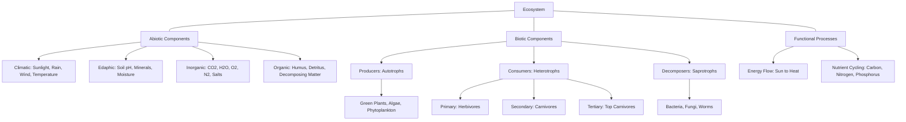
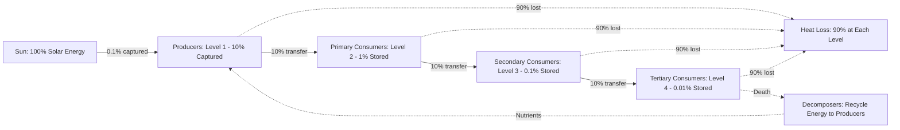
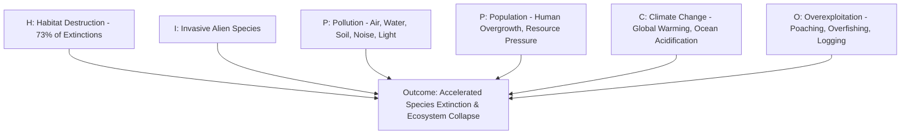
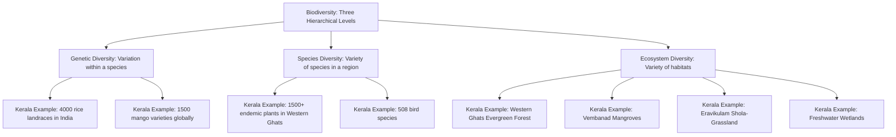
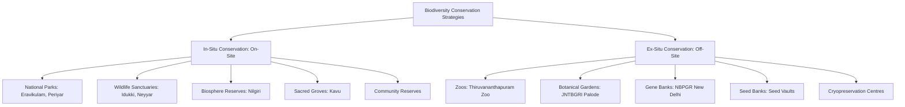
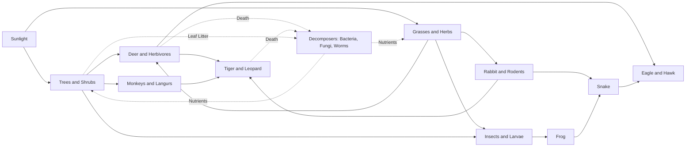

# Ecosystems and Biodiversity:  Basics of ecosystems and their functions, Importance of biodiversity and its conservation, Human impact on ecosystems and biodiversity loss, An overview of various ecosystems in Kerala/India, and its significance.

<!-- SECTION_1_START -->
# Ecosystems and Biodiversity: Foundations for Sustainable Engineering

> [!IMPORTANT]
> **KTU 2024 Scheme | UCHUT347 | Module 2** | This section establishes the **fundamental definitions** of ecosystems and biodiversity as mandated by the KTU syllabus, with intuitive analogies to ground first-time learners in environmental philosophy.

---

## 1.1 What is an Ecosystem? — Formal Definition

An **Ecosystem** is a **biological community of interacting organisms (biotic components)** and their **physical environment (abiotic components)**, functioning as a **self-regulating ecological unit** in which energy flows and matter cycles.

Mathematically and conceptually, the ecosystem is often represented as:

$$
E = \{B, A, F\}
$$

Where:
- $B$ = Biotic components (plants, animals, microorganisms)
- $A$ = Abiotic components (water, air, soil, sunlight, minerals)
- $F$ = Functional processes (energy flow, nutrient cycling, succession)

> [!NOTE]
> **KTU Terminology Note:** The term *Ecosystem* was coined by **Sir Arthur Tansley (1935)**. For KTU exam answers, students must use the term **"self-regulating ecological unit"** to earn full marks on the definition question.

---

## 1.2 What is Biodiversity? — Formal Definition

**Biodiversity** (short for *Biological Diversity*) refers to **the variety and variability of all living organisms on Earth**, including diversity **within species** (genetic), **between species** (species), and **of ecosystems** (ecological), as defined by the **Convention on Biological Diversity (CBD), 1992** — also known as the **Rio Earth Summit**.

The three hierarchical levels are formally expressed as:

$$
\beta = \{D_g, D_s, D_e\}
$$

Where:
- $D_g$ = Genetic diversity (variation within a species)
- $D_s$ = Species diversity (variety of species in a region)
- $D_e$ = Ecosystem diversity (variety of habitats and ecological processes)

---

## 1.3 Conceptual Analogy / Intuition

> [!TIP]
> **Real-World Analogy: The Bank Account**
>
> Imagine **Earth's biodiversity as a savings bank account**:
> - **Genetic diversity** = The different currencies (USD, EUR, INR) — variety within a single type of asset.
> - **Species diversity** = The different account holders (you, your parents, your friends) — variety among individual units.
> - **Ecosystem diversity** = The different bank branches (savings, current, fixed deposit) — variety of institutions.
>
> **Just like a bank collapse wipes out lifetimes of savings, biodiversity loss collapses the ecological capital that humanity depends on for survival, medicine, food, and clean air.**

> [!TIP]
> **Geometric Intuition: The Web of Life**
>
> Picture a **spider's web**. Each strand connects to many others. If you remove one strand, the web weakens slightly. If you remove a **hub strand** (a keystone species like a bee or tiger), the entire web collapses. This is the **trophic cascade effect** central to ecosystem functioning.

---

## 1.4 Standard Metrics in Environmental Science

| Metric | Symbol | Standard Unit | Significance |
|:------:|:------:|:-------------:|:-------------|
| **Species Richness** | $S$ | Dimensionless count | Number of species in a habitat |
| **Shannon Diversity Index** | $H'$ | Nits (natural log) | Measures species evenness & richness |
| **Simpson's Index** | $D$ | $0$ to $1$ | Probability of two random individuals being different species |
| **Population Density** | $\rho$ | Individuals per km$^2$ | Abundance per unit area |
| **Net Primary Productivity** | $NPP$ | gC/m$^2$/year | Rate of biomass accumulation |

The **Shannon-Wiener Index** is calculated as:

$$
H' = -\sum_{i=1}^{S} p_i \ln(p_i)
$$

Where $p_i$ is the proportion of individuals belonging to species $i$. A **higher $H'$** value indicates **greater biodiversity**.

> [!VISUALIZATION CONTROL]
> **Concept:** Shannon Diversity Index curve as a function of species evenness
> **GeoGebra / Desmos Input Equations:**
> * `f(x) = -x*ln(x) - (1-x)*ln(1-x)` (two-species case)
> **Visual Description:** Plot $f(x)$ from $x = 0.01$ to $x = 0.99$. The curve peaks at $x = 0.5$ (when both species are equally abundant), illustrating that **maximum diversity occurs at maximum evenness**.

---

## 1.5 Why This Topic Matters for Engineers

> [!IMPORTANT]
> **KTU Module Outcome (CO2 Mapping):** Engineering decisions — from dam construction to software-driven supply chains — directly alter ecosystems. An ethically grounded engineer (UCHUT347 mandate) must understand these systems to avoid becoming an **agent of ecological degradation**.

<!-- SECTION_1_END -->

<!-- SECTION_2_START -->
# Deep Theoretical Analysis & KTU High-Yield Knowledge Matrix

> [!IMPORTANT]
> **Section 2 Mandate:** This section delivers a **board-exam-tuned** breakdown of ecosystem functions, biodiversity importance, and anthropogenic impacts, with structured tables designed for rapid last-day KTU revision.

---

## 2.1 The Four Core Functions of an Ecosystem

An ecosystem performs four **interdependent functions** that sustain life on Earth. Understanding these is **mandatory** for KTU Part B (14-mark) questions.

### 2.1.1 Function 1 — **Regulatory Functions**
- **Climate regulation** (forests act as carbon sinks; $\approx 2.5$ billion tonnes of CO$_2$ absorbed annually by tropical forests)
- **Flood and erosion control** (mangroves reduce wave energy by $\approx 70\%$)
- **Air and water purification** (wetlands filter pollutants; one hectare of wetland can filter $\approx 1$ million gallons of water per day)
- **Pollination** (worth $\approx \$ 235$ to $\$ 577$ billion annually globally)

### 2.1.2 Function 2 — **Provisioning Functions**
- Food (crops, fish, livestock fodder)
- Fresh water (rivers, aquifers)
- Raw materials (timber, fiber, genetic resources)
- **Pharmaceutical resources** ($\approx 25\%$ of modern drugs are derived from plant compounds; aspirin from willow bark)

### 2.1.3 Function 3 — **Cultural Functions**
- Spiritual, religious, and aesthetic values
- Recreation and ecotourism
- Educational and research value

### 2.1.4 Function 4 — **Supporting Functions**
- **Nutrient cycling** (Carbon, Nitrogen, Phosphorus cycles)
- **Soil formation** and primary production
- **Primary production** via photosynthesis:

$$
6CO_2 + 6H_2O \xrightarrow{\text{Sunlight, Chlorophyll}} C_6H_{12}O_6 + 6O_2
$$

---

## 2.2 The KTU High-Yield Conceptual Matrix

| Concept | Definition | KTU Exam Hook | Real-World Example |
|:--------|:-----------|:--------------|:-------------------|
| **Biome** | Large geographical region with characteristic flora/fauna | Often asked in Part A as a 3-mark definition | Western Ghats (Kerala) |
| **Biosphere** | Sum of all ecosystems on Earth | Distinguish from "ecosystem" in MCQs | Entire planet Earth |
| **Biome vs. Ecosystem** | Biome = global/continental; Ecosystem = local/regional | Compare in 7-mark sub-question | Amazon Rainforest (biome) → Pond (ecosystem) |
| **Food Chain** | Linear transfer of energy from producer to top consumer | Draw in 7-mark diagrams | Grass $\rightarrow$ Rabbit $\rightarrow$ Fox $\rightarrow$ Eagle |
| **Food Web** | Interconnected food chains in an ecosystem | KTU favorite: Draw with $\geq 5$ organisms | Coral reef food web |
| **Ecological Niche** | Role and position of a species in its ecosystem | Define + give example | Honeybee as pollinator |
| **Keystone Species** | Species with disproportionate effect on ecosystem | Explain trophic cascade | Sea otter in kelp forest |
| **Endemic Species** | Species found exclusively in one region | Kerala context: Nilgiri tahr | Lion-tailed macaque (Western Ghats) |

---

## 2.3 The Three Levels of Biodiversity — Expanded Framework

> [!NOTE]
> **Critical KTU Point:** Many students lose marks by **confusing the three levels**. Use the mnemonic **"GSE = Go Study Ecosystems"** (Genetic, Species, Ecosystem).

### 2.3.1 **Level 1: Genetic Diversity ($\beta_g$)**
- Variation in genes **within a single species**.
- Example: **4,000+ varieties of rice** in India; **1,500+ mango varieties**; **Kuttanad rice landraces** of Kerala.
- Loss = **reduced resilience to disease, climate change**.

### 2.3.2 **Level 2: Species Diversity ($\beta_s$)**
- Variety of species in a region.
- **India hosts $\approx 8.1\%$ of global species diversity** despite having only $2.4\%$ of the world's land area — making it one of the **17 megadiverse countries**.
- Example: $\approx 91,000$ animal species and $\approx 45,000$ plant species in India.

### 2.3.3 **Level 3: Ecosystem Diversity ($\beta_e$)**
- Variety of ecosystems (forests, deserts, wetlands, oceans, grasslands).
- **India has $\approx 10$ biogeographic zones** (Trans-Himalaya, Himalayas, Deserts, Semi-arid, Western Ghats, Deccan Peninsula, Gangetic Plain, North-East India, Islands, Coasts).
- Example: Kerala alone has **tropical evergreen forests, moist deciduous, grasslands, mangroves, and freshwater ecosystems**.

---

## 2.4 Why Biodiversity Matters — The KTU Conservation Justification Table

> [!IMPORTANT]
> **Board Examiner's Tip:** A 14-mark question in KTU often asks *"Discuss the importance of biodiversity."* Use the **4-pillar framework** below to structure your answer.

| Pillar | Core Argument | Engineering / Ethical Relevance |
|:-------|:--------------|:-------------------------------|
| **Ecological** | Biodiversity drives ecosystem stability, productivity, and resilience | Engineers must avoid monoculture designs in land-use planning |
| **Economic** | Ecosystem services valued at $\approx \$ 33$ trillion/year (Costanza et al., 1997) — **$\approx 1.43 \times$ global GDP** | EIA reports must quantify this for ethical cost-benefit analysis |
| **Scientific** | Each species is a library of genetic information (e.g., *Thermus aquaticus* $\rightarrow$ PCR enzyme) | Biotech engineers depend on wild genetic resources |
| **Ethical / Cultural** | Every species has intrinsic value; indigenous communities hold biodiversity as sacred | Aligns with **KTU CO3** (Ethics in professional practice) |

---

## 2.5 Causes of Biodiversity Loss — The **HIPPCO** Framework

> [!NOTE]
> **KTU High-Yield Mnemonic — HIPPCO:**
> - **H** = Habitat destruction (the **largest driver**, $\approx 73\%$ of species extinctions)
> - **I** = Invasive species
> - **P** = Pollution
> - **P** = Population (human overgrowth)
> - **C** = Climate change
> - **O** = Overexploitation (poaching, overfishing)

---

## 2.6 Human Impact on Ecosystems — Quantified

| Human Activity | Ecosystem Impact | Statistic / Data Point |
|:---------------|:-----------------|:----------------------|
| Deforestation | Loss of carbon sink, soil erosion, habitat loss | $\approx 10$ million hectares lost/year globally |
| Urbanization | Fragmentation of habitats, urban heat islands | $\approx 68\%$ of world population projected urban by 2050 (UN) |
| Industrial pollution | Acid rain, biomagnification, eutrophication | Minamata disaster (Japan, 1956): mercury poisoning |
| Agricultural intensification | Monoculture, pesticide use, soil degradation | $\approx 33\%$ of global soils are moderately to highly degraded (FAO) |
| Climate change | Coral bleaching, phenological mismatch, range shifts | $\approx 50\%$ of coral reefs lost since 1950 |
| Overfishing | Collapse of marine food webs | $\approx 34\%$ of global fish stocks overfished (FAO, 2022) |
| Plastic pollution | Marine litter, microplastics in food chain | $\approx 8$ million tonnes enter oceans annually |

---

## 2.7 Real-World Engineering Utility

> [!IMPORTANT]
> **Connecting to KTU Outcomes (CO4 - Ethics and Sustainability):**
> 1. **Environmental Impact Assessment (EIA)**: Engineers must now evaluate biodiversity offsets in project design (e.g., Western Ghats ESZ notifications).
> 2. **Green Infrastructure**: Sustainable urban design integrates biodiversity (green roofs, bioswales).
> 3. **Biomimicry**: Engineering solutions inspired by biodiversity (e.g., **bullet train nose** inspired by kingfisher beak).
> 4. **Sustainable Supply Chains**: ISO 14001 and ESG reporting require biodiversity disclosure.

<!-- SECTION_2_END -->

<!-- SECTION_3_START -->
# Step-by-Step Analytical Frameworks, Derivations & Case Mappings

> [!IMPORTANT]
> **KTU 2024 Board Requirement:** This section provides **exhaustive, line-by-line analytical breakdowns** of ecosystem structure, biodiversity loss, and Kerala/India case studies. Every framework is mapped to **regulatory acts, constitutional provisions, and international agreements** required for UCHUT347 answers.

---

## 3.1 The Structural Architecture of an Ecosystem

An ecosystem has **two structural layers** (biotic and abiotic) and **two functional pathways** (energy flow and nutrient cycling). Below is the step-by-step logical breakdown.

### Step 1: **Identify the Abiotic (Non-Living) Components**
- **Climatic factors**: Sunlight, temperature, rainfall, humidity, wind
- **Edaphic factors**: Soil type, pH, mineral content, moisture
- **Inorganic substances**: $CO_2$, $N_2$, $H_2O$, $O_2$, mineral salts
- **Organic substances**: Proteins, carbohydrates, lipids, humic acids

### Step 2: **Identify the Biotic (Living) Components — Three Tiers**

| Tier | Name | Role | Example |
|:-----|:-----|:-----|:--------|
| **Tier 1** | **Producers (Autotrophs)** | Convert solar energy into chemical energy | Trees, grasses, algae, phytoplankton |
| **Tier 2** | **Consumers (Heterotrophs)** | Depend on producers for energy | Herbivores, Carnivores, Omnivores |
| **Tier 3** | **Decomposers (Saprotrophs)** | Break down dead matter; recycle nutrients | Bacteria, Fungi, Worms |

### Step 3: **Map the Functional Processes**

> Process A — **Energy Flow (Unidirectional, Non-cyclic):**
> Sun $\rightarrow$ Producers $\rightarrow$ Primary Consumers $\rightarrow$ Secondary Consumers $\rightarrow$ Tertiary Consumers $\rightarrow$ Heat Loss

> Process B — **Nutrient Cycling (Cyclic):**
> Decomposers break down dead matter $\rightarrow$ Nutrients return to soil $\rightarrow$ Reabsorbed by producers $\rightarrow$ Cycle continues

---

## 3.2 The 10% Law of Energy Transfer — Step-by-Step Derivation

> [!NOTE]
> **KTU Exam Favorite:** The **10% Law** by **Raymond Lindeman (1942)** is asked in almost every KTU exam, either as a 3-mark conceptual or as part of a 7-mark sub-question.

### Step-by-Step Derivation:

**Step 1:** Total solar energy reaching Earth's surface per year $\approx 3.85 \times 10^{24}$ Joules.

**Step 2:** Only $\approx 0.1\%$ of total solar energy is captured by green plants (producers) through photosynthesis.

**Step 3:** Producers convert captured solar energy into chemical energy stored in organic compounds. The total energy fixed by photosynthesis is called **Gross Primary Productivity (GPP)**.

$$
GPP = NPP + R
$$

Where:
- $NPP$ = Net Primary Productivity
- $R$ = Respiration loss by producers

**Step 4:** Of the energy stored at the producer level, only **10%** is transferred to the next trophic level (primary consumers). The remaining **90%** is lost as heat (per the **Second Law of Thermodynamics**) through metabolic activities.

**Step 5:** This $10\%$ transfer is repeated at each trophic transfer, following the geometric progression:

$$
E_n = E_0 \times (0.10)^n
$$

Where:
- $E_n$ = Energy at trophic level $n$
- $E_0$ = Energy at producer level
- $n$ = Trophic level number

**Step 6:** Worked numerical example:
- Let $E_0 = 10,000$ kJ
- At Level 1 (Producers): $E_1 = 10,000$ kJ
- At Level 2 (Primary Consumers): $E_2 = 10,000 \times 0.10 = 1,000$ kJ
- At Level 3 (Secondary Consumers): $E_3 = 1,000 \times 0.10 = 100$ kJ
- At Level 4 (Tertiary Consumers): $E_4 = 100 \times 0.10 = 10$ kJ
- At Level 5 (Quaternary Consumers): $E_5 = 10 \times 0.10 = 1$ kJ

**Step 7:** Conclusion: This explains why **food chains rarely have more than 4–5 trophic levels** — insufficient energy remains to support higher levels.

---

## 3.3 Comparative Analysis: Major Biomes of Kerala and India

> [!IMPORTANT]
> **KTU Board Tip:** Kerala-specific questions carry **bonus weightage**. Use the table below to anchor your answers with **local examples, scientific names, and statutory protections**.

| Ecosystem Type | Geographic Location | Characteristic Flora | Characteristic Fauna | Conservation Status | Legal Protection in India |
|:---------------|:--------------------|:---------------------|:---------------------|:--------------------|:--------------------------|
| **Tropical Evergreen Forest** | Western Ghats, Agasthyamalai | *Dipterocarpus*, *Cullenia*, *Mesua ferrea* | Lion-tailed macaque, Great Hornbill | **Endangered** (IUCN) | Wildlife Protection Act, 1972 |
| **Moist Deciduous Forest** | Wayanad, Idukki | Teak, Rosewood, Bamboo | Indian elephant, Gaur | **Vulnerable** | Reserved Forests (Kerala Forest Dept.) |
| **Mangroves** | Vembanad Lake, Kannur coast | *Rhizophora*, *Avicennia*, *Sonneratia* | Mudskipper, White-bellied Sea Eagle | **Critically Endangered** globally | CRZ Notification 2019, 2011 |
| **Shola-Grassland Mosaic** | Eravikulam, Munnar | *Strobilanthes*, *Rhododendron* | Nilgiri tahr (state animal) | **Endangered** | Eravikulam National Park |
| **Freshwater Wetlands** | Vembanad, Sasthamkotta | *Lotus*, Water hyacinth | Purple moorhen, Kingfisher | Sasthamkotta = **Ramsar Site** | Ramsar Convention, 1971 |
| **Coastal & Marine** | Arabian Sea coast | Seagrass, Mangroves | Olive Ridley turtle, Humpback dolphin | **Vulnerable** | Indian Forest Act, 1927; CRZ |
| **Thorn & Scrub Forest** | Eastern Kerala (dry zones) | Acacia, Ziziphus | Blackbuck, Chinkara | **Endangered** | Protected Areas network |
| **Sacred Groves (Kavu)** | Throughout Kerala | Ancient endemic species | Rare reptiles and amphibians | Biocultural heritage | Kerala Sacred Groves Act, 2018 |

---

## 3.4 Detailed Case Studies: Significance to India and Kerala

### 3.4.1 **Case Study 1: The Western Ghats — A UNESCO World Heritage Site**

- **Geographical Spread:** Runs $\approx 1,600$ km along India's western coast through **6 states** — Kerala, Karnataka, Goa, Maharashtra, Gujarat, Tamil Nadu.
- **Significance:**
  - **Harbors $\approx 5,000$ species of flowering plants**, $\approx 139$ mammal species, $\approx 508$ bird species, $\approx 179$ amphibian species.
  - **Endemism hotspot**: $\approx 1,800$ endemic plant species; $\approx 140$ endemic fish species.
  - **Source of $\approx 40\%$ of India's water needs** — origin of rivers like Periyar, Bharathapuzha, Pamba, Chalakudy.
  - **The "Kasturirangan Report (2013)"** recommended declaring $\approx 37\%$ of the Western Ghats as **Ecologically Sensitive Area (ESA)**, sparking ongoing debate.

### 3.4.2 **Case Study 2: The Nilgiri Tahr (Hemitragus hylocrius)**

- **Habitat:** Eravikulam National Park, Munnar, Kerala (highest population: $\approx 750$ individuals as of 2023).
- **Significance:** **State animal of Kerala**; IUCN status — **Endangered**.
- **Threats:** Habitat fragmentation, invasive species (*Eucalyptus*, *Wattle*), tourism pressure.
- **Conservation:** Kerala Forest Department partnered with **IUCN** to launch the **"Nilgiri Tahr Project"** in 2023, targeting population recovery to $\geq 5,000$ by 2030.

### 3.4.3 **Case Study 3: The Vembanad-Kol Wetland (Ramsar Site)**

- **Designation:** **Ramsar Site No. 1214** (designated 2002).
- **Area:** $\approx 151,250$ hectares.
- **Significance:**
  - India's **longest lake** and largest brackish water lagoon.
  - **Spice capital** of Kerala — backwater tourism depends directly on its ecological health.
  - **Supports $\approx 90$ fish species** and is a critical stopover for migratory birds.
  - **Kumarakom Bird Sanctuary** lies within this ecosystem.
- **Threats:** Eutrophication, pollution, tourism, invasive species (*Eichhornia crassipes* — water hyacinth).

### 3.4.4 **Case Study 4: Sacred Groves (Kavu) of Kerala**

- **Definition:** Forest patches traditionally protected by local communities for religious/cultural reasons.
- **Significance:**
  - **Refugia for endemic species** — many groves contain species not found in larger forests.
  - **In-situ conservation by indigenous knowledge systems**.
  - Examples: **Sree Rama Temple Kavu (Thiruvananthapuram)**, **Arayankavu (Ernakulam)**, **Kallil Temple Grove**.
- **Legal Status:** Protected under the **Kerala Forest Act, 1961**; community ownership recognized.

---

## 3.5 International and National Legal Framework Mapping

> [!IMPORTANT]
> **KTU 2024 Outcome (CO5 - Global context):** Linking ecosystem knowledge to legal frameworks is a **14-mark question archetype**.

| Legal Instrument | Year | Country / Body | Key Provision |
|:-----------------|:-----|:---------------|:--------------|
| **Convention on Biological Diversity (CBD)** | 1992 | UN | 3 objectives: conservation, sustainable use, fair sharing of benefits |
| **CITES** | 1975 | International | Bans trade in endangered species |
| **Ramsar Convention** | 1971 | International | Protects wetlands of international importance |
| **UNESCO World Heritage Convention** | 1972 | UN | Protects natural and cultural heritage sites |
| **Wildlife Protection Act** | 1972 | India | Schedules I–VI for species protection |
| **Forest Conservation Act** | 1980 | India | Restricts forest land diversion |
| **Biological Diversity Act** | 2002 | India | Implements CBD in India; establishes National Biodiversity Authority |
| **Environment Protection Act** | 1986 | India | Umbrella act for environmental protection |
| **Coastal Regulation Zone (CRZ) Notification** | 2019 | India | Regulates construction in coastal zones |
| **Kerala Biodiversity Act** | 2008 | Kerala | Implements state-level biodiversity strategy |

---

## 3.6 Conservation Strategies — The In-Situ vs. Ex-Situ Framework

| Strategy | Type | Description | Examples in India / Kerala |
|:---------|:-----|:------------|:---------------------------|
| **In-Situ Conservation** | On-site | Conservation within natural habitat | National Parks, Wildlife Sanctuaries, Biosphere Reserves, Sacred Groves |
| **Ex-Situ Conservation** | Off-site | Conservation outside natural habitat | Zoos, Botanical Gardens, Gene Banks, Seed Banks |
| **Biosphere Reserves** | In-Situ | UNESCO-designated buffer zones | Nilgiri, Sundarbans, Gulf of Mannar |
| **Project Tiger** | In-Situ | Species-specific protection | Launched 1973, $\approx 56$ reserves |
| **Project Elephant** | In-Situ | Launched 1992 | Focus: Karnataka, Kerala, Tamil Nadu |
| **Seed Banks** | Ex-Situ | Long-term storage of seeds | National Bureau of Plant Genetic Resources, New Delhi |

---

## 3.7 Worked Example: Calculating Simpson's Diversity Index

> [!NOTE]
> **Numerical KTU Favorite:** Board examiners often test Simpson's Index to verify whether students can quantify biodiversity.

**Problem:** A freshwater pond contains the following fish species: 50 Carp, 30 Catfish, 15 Eel, 5 Trout. Calculate Simpson's Diversity Index ($D$) and Simpson's Index of Diversity ($1 - D$).

**Step 1:** Calculate total individuals: $N = 50 + 30 + 15 + 5 = 100$

**Step 2:** Calculate species proportion $p_i$ for each:
- $p_1 = 50 / 100 = 0.50$
- $p_2 = 30 / 100 = 0.30$
- $p_3 = 15 / 100 = 0.15$
- $p_4 = 5 / 100 = 0.05$

**Step 3:** Apply Simpson's Index formula:

$$
D = \sum_{i=1}^{S} \left(\frac{n_i}{N}\right)^2 = \sum p_i^2
$$

**Step 4:** Substitute values:
- $(0.50)^2 = 0.2500$
- $(0.30)^2 = 0.0900$
- $(0.15)^2 = 0.0225$
- $(0.05)^2 = 0.0025$

**Step 5:** Sum the squares:
$$
D = 0.2500 + 0.0900 + 0.0225 + 0.0025 = 0.3650
$$

**Step 6:** Calculate Simpson's Index of Diversity:
$$
1 - D = 1 - 0.3650 = 0.6350
$$

**Step 7:** Interpretation: A Simpson's Index of Diversity of **$0.635$** indicates **moderate to high biodiversity** in the pond. A value closer to $1$ means higher diversity.

<!-- SECTION_3_END -->

<!-- SECTION_4_START -->
# Structural Diagrams, Schematics & Flow Architectures

> [!IMPORTANT]
> **KTU Visual Mandate:** This section renders all ecosystem and biodiversity concepts as **Mermaid schematic diagrams** that students can **reproduce in their answer sheets** to earn high marks in Part B questions (visuals carry 1–2 extra marks per question).

---

## 4.1 Diagram 1: The Hierarchical Structure of an Ecosystem

**Visual Description:** The diagram shows ecosystem as a 3-tier architecture — **structural (biotic/abiotic)**, **functional (energy/cycling)**, and **hierarchical (producer/consumer/decomposer)**.

---

## 4.2 Diagram 2: The Energy Flow Across Trophic Levels (10% Law)

**Visual Description:** This is a **pyramid-style flow** with **unidirectional arrows** (energy flow) and **cyclic dashed arrows** (nutrient recycling). Students should reproduce this **with the 10% label at each level**.

---

## 4.3 Diagram 3: The HIPPCO Framework — Drivers of Biodiversity Loss

**Visual Description:** This diagram is a **radial cause-and-effect architecture**, ideal for a **7-mark answer** on "Human Impact on Biodiversity."

---

## 4.4 Diagram 4: The Three Levels of Biodiversity with Kerala Examples

**Visual Description:** This is a **hierarchical taxonomy diagram** suitable for **Part A 3-mark definition questions**.

---

## 4.5 Diagram 5: The Conservation Strategy Architecture

**Visual Description:** This **bifurcated classification diagram** is perfect for a **7-mark sub-question** in KTU ESE.

---

## 4.6 Diagram 6: Ecosystem Services — The 4-Pillar Framework

```mermaid
graph TD
    nodeServices["Ecosystem Services: 4 Pillars"]

    nodeReg["Regulating Services"]
    nodeProv["Provisioning Services"]
    nodeCult["Cultural Services"]
    nodeSup["Supporting Services"]

    nodeServices --> nodeReg
    nodeServices --> nodeProv
    nodeServices --> nodeCult
    nodeServices --> nodeSup

    nodeReg --> nodeReg1["Climate Regulation: Carbon Sink"]
    nodeReg --> nodeReg2["Flood Control: Mangrove Buffer"]
    nodeReg --> nodeReg3["Pollination: Honeybee"]
    nodeReg --> nodeReg4["Water Purification: Wetlands"]

    nodeProv --> nodeProv1["Food: Fish, Fruits, Crops"]
    nodeProv --> nodeProv2["Water: Rivers, Aquifers"]
    nodeProv --> nodeProv3["Medicine: Plant-based Drugs"]
    nodeProv --> nodeProv4["Raw Materials: Timber, Fiber"]

    nodeCult --> nodeCult1["Spiritual: Sacred Groves"]
    nodeCult --> nodeCult2["Recreation: Ecotourism, Backwaters"]
    nodeCult --> nodeCult3["Education: Nature Schools"]
    nodeCult --> nodeCult4["Aesthetic: Scenic Beauty"]

    nodeSup --> nodeSup1["Nutrient Cycling: Carbon, Nitrogen"]
    nodeSup --> nodeSup2["Soil Formation: Weathering, Decomposition"]
    nodeSup --> nodeSup3["Primary Production: Photosynthesis"]
    nodeSup --> nodeSup4["Oxygen Production: 50% from Marine Phytoplankton"]
```

**Visual Description:** A **multi-pillar sub-graph architecture** that visually answers the question *"Why are ecosystems important?"* — this is a **direct 14-mark question archetype**.

---

## 4.7 Diagram 7: The Food Web of a Western Ghats Forest Ecosystem

**Visual Description:** A **complex food web** showing multiple interconnected food chains — KTU's **most-asked ecosystem diagram** in Part B (14 marks). Students should reproduce this with **at least 8 organisms** and **label producers, consumers (primary, secondary, tertiary), and decomposers**.

<!-- SECTION_4_END -->

<!-- SECTION_5_START -->
# KTU 2024 Scheme Examination Question Bank & Topic Recap

> [!IMPORTANT]
> **KTU 2024 Evaluation Pattern:** All questions are mapped to **Course Outcomes (CO2, CO3, CO4)** and **Revised Bloom's Taxonomy (RBT)** cognitive levels. Each question is tagged with a **simulated KTU past year paper** for authentic board preparation.

---

## 5.1 Part A — Short Answer Questions (3 Marks Each)

### **Question 1 (3 Marks)**

> **[KTU University Exam — July 2023]**
> *Define an ecosystem. List any two abiotic components of a forest ecosystem.*

**Mapped CO:** CO2 | **RBT Level:** Remember & Understand

**Model Answer (Valuation Key):**

- **[Definition (2 Marks)]:** An **ecosystem** is a community of **biotic (living) components** interacting with their **abiotic (non-living) environment**, functioning as a **self-regulating ecological unit** where energy flows and matter cycles (Tansley, 1935).
- **[Any two abiotic components (1 Mark)]:**
  - Sunlight (solar radiation)
  - Soil minerals
  - Water
  - Air
  - Temperature
  - Humidity
  *(Any two accepted)*

---

### **Question 2 (3 Marks)**

> **[KTU University Exam — December 2023]**
> *Explain the concept of biodiversity. Why is it considered important for ecological stability?*

**Mapped CO:** CO2, CO3 | **RBT Level:** Understand

**Model Answer (Valuation Key):**

- **[Concept (2 Marks)]:** **Biodiversity** refers to the variety of all life forms on Earth, encompassing three levels: **genetic diversity, species diversity, and ecosystem diversity** (as per CBD, 1992).
- **[Ecological stability (1 Mark)]:** Greater biodiversity enhances **resilience, productivity, and stability** of ecosystems through complex food webs, nutrient cycling, and redundancy of ecological functions.

---

## 5.2 Part B — Long Answer Questions (14 Marks with Internal Choice)

---

### **Question A (14 Marks)** — Option Set 1

> **[KTU University Exam — December 2024]**
> *(a)* Explain the structural and functional components of an ecosystem with suitable examples. *(7 Marks)*
> *(b)* Discuss the importance of biodiversity conservation. List and briefly explain any four major threats to biodiversity. *(7 Marks)*

**Mapped CO:** CO2, CO3, CO4 | **RBT Level:** Understand, Apply, Analyze

---

#### **Model Answer for Part (a) — 7 Marks**

**[Introduction (1 Mark)]:** An ecosystem has two structural layers (biotic and abiotic) and two functional processes (energy flow and nutrient cycling).

**[Structural Components (3 Marks)]:**
- **Abiotic components:** Non-living factors — sunlight, temperature, soil, water, air, minerals
- **Biotic components:**
  - **Producers (Autotrophs):** Green plants, algae, phytoplankton — example: *Rhizophora* in mangroves
  - **Consumers (Heterotrophs):** Herbivores (deer), Carnivores (tiger), Omnivores (bear)
  - **Decomposers (Saprotrophs):** Bacteria, fungi — example: *Trichoderma* in soil

**[Functional Components (3 Marks)]:**
- **Energy Flow:** Unidirectional flow from sun $\rightarrow$ producers $\rightarrow$ consumers $\rightarrow$ heat loss
  - **10% Law (Lindeman, 1942):** Only 10% of energy transfers to the next trophic level
  - Example: Grass $\rightarrow$ Rabbit $\rightarrow$ Fox (energy decreases 90% at each level)
- **Nutrient Cycling:** Cyclic movement of elements like Carbon, Nitrogen, Phosphorus between biotic and abiotic pools
  - Example: Carbon cycle — $CO_2$ fixed by plants, returned via respiration and decomposition

---

#### **Model Answer for Part (b) — 7 Marks**

**[Importance of Biodiversity Conservation (3.5 Marks)]:**
- **Ecological value:** Maintains ecosystem stability, supports food webs, drives biogeochemical cycles
- **Economic value:** Ecosystem services worth $\approx \$ 33$ trillion/year (Costanza, 1997); $\approx 25\%$ of drugs derived from plant compounds
- **Scientific value:** Source of genetic information; PCR enzyme from *Thermus aquaticus*; bio-prospecting
- **Ethical & cultural value:** Intrinsic value of all species; sacred groves and indigenous knowledge systems
- **Aesthetic & recreational value:** Ecotourism in Western Ghats, backwater tourism in Kerala

**[Four Major Threats — HIPPCO Framework (3.5 Marks)]:**
- **Habitat Destruction** (largest driver, $\approx 73\%$ of extinctions) — deforestation, urbanization
- **Invasive Species** — *Eichhornia crassipes* choking Vembanad Lake; *Lantana camara* in forests
- **Pollution** — plastic in marine ecosystems; agricultural runoff causing eutrophication
- **Climate Change** — coral bleaching, phenological mismatch, sea-level rise affecting mangroves
- **Overexploitation** — poaching of Nilgiri tahr, overfishing in Arabian Sea
- **Human Population Pressure** — increased resource demand and waste generation

---

### **Question B (14 Marks)** — Alternative Option Set

> **[KTU University Exam — July 2024]**
> *(a)* Describe the major ecosystems of Kerala. Explain their ecological significance with examples. *(7 Marks)*
> *(b)* What are the causes and consequences of biodiversity loss? Suggest suitable conservation strategies. *(7 Marks)*

**Mapped CO:** CO2, CO3, CO4 | **RBT Level:** Understand, Apply, Analyze

---

#### **Model Answer for Part (a) — 7 Marks**

**[Introduction (1 Mark)]:** Kerala, located in the **Western Ghats biodiversity hotspot**, harbors diverse ecosystems due to its unique geography, tropical climate, and the Western Ghats mountain range.

**[Major Ecosystems of Kerala (4 Marks)]:**
- **Tropical Evergreen Forests:** Dense canopy, high rainfall regions (Agasthyamalai); harbor endemic species like *Cullenia exarillata*; home to Lion-tailed macaque
- **Moist Deciduous Forests:** Teak-dominated; found in Wayanad, Idukki; support Indian elephants, gaurs
- **Mangroves:** *Rhizophora* and *Avicennia* species; Vembanad, Kannur coast; act as nursery for fish, protect coast from erosion
- **Shola-Grasslands:** Mosaic ecosystems in Munnar; habitat of **Nilgiri tahr** (state animal); high endemism
- **Freshwater Wetlands:** Vembanad Lake (Ramsar Site), Sasthamkotta (Ramsar Site); support migratory birds, fisheries

**[Ecological Significance (2 Marks)]:**
- **Water security:** Source of $\approx 40\%$ of Kerala's water from Western Ghats
- **Biodiversity refuge:** $\approx 5,000$ flowering plant species; high endemism
- **Climate regulation:** Carbon sequestration by forests
- **Livelihood support:** Fishery, agriculture, ecotourism
- **Cultural heritage:** Sacred groves, traditional knowledge systems

---

#### **Model Answer for Part (b) — 7 Marks**

**[Causes of Biodiversity Loss (3 Marks)]:**
- **Habitat destruction:** Deforestation, urbanization, dam construction (e.g., Athirappilly hydroelectric project debate)
- **Pollution:** Pesticides, industrial effluents, plastic waste
- **Overexploitation:** Overfishing, hunting, timber extraction
- **Invasive species:** *Eichhornia*, *Lantana*, *Eucalyptus*
- **Climate change:** Erratic monsoons, sea-level rise
- **Human-wildlife conflict:** Increasing in Wayanad, Idukki

**[Consequences (2 Marks)]:**
- **Ecosystem collapse:** Trophic cascades, loss of ecosystem services
- **Economic loss:** Decline in fisheries, agriculture, tourism
- **Loss of genetic resources:** Future medicines and crops lost
- **Ethical crisis:** Extinction of species with intrinsic value
- **Climate feedback:** Reduced carbon sequestration

**[Conservation Strategies (2 Marks)]:**
- **In-Situ:** National Parks (Eravikulam, Periyar, Silent Valley), Wildlife Sanctuaries, Sacred Groves, Biosphere Reserves
- **Ex-Situ:** Zoos (Thiruvananthapuram Zoo), Botanical Gardens (JNTBGRI Palode), Seed Banks, Gene Banks
- **Legal frameworks:** Wildlife Protection Act 1972, Forest Conservation Act 1980, Biological Diversity Act 2002
- **Community participation:** Vana Samrakshana Samithis, Eco-development Committees
- **International cooperation:** CBD, Ramsar Convention, CITES
- **Modern tech:** AI-based species monitoring, e-DNA, drone-based anti-poaching

---

## 5.3 KTU Examiner's Valuation Warning / Pitfall Callout

> [!WARNING]
> **Common Marks-Loss Pitfalls in KTU Examinations (UCHUT347):**
>
> 1. **Conflating Biome and Ecosystem** — Biome is **continental/global**; Ecosystem is **local/regional**. Students often lose 1 mark for using them interchangeably.
> 2. **Forgetting the term "self-regulating"** in the definition of ecosystem — without it, the definition is incomplete (-0.5 mark).
> 3. **Not citing the act/agreement** when discussing conservation — answers must reference **specific Indian laws (Wildlife Protection Act 1972, Biodiversity Act 2002)** or **international conventions (CBD, Ramsar, CITES)** to score full marks.
> 4. **Confusing the 3 levels of biodiversity** — Genetic is **within** species, Species is **between** species, Ecosystem is **between** habitats. Use the mnemonic **"GSE"** (Genetic, Species, Ecosystem).
> 5. **Skipping examples from Kerala** — Kerala-specific examples (Nilgiri tahr, Vembanad, Western Ghats) carry **bonus weightage** and signal local-context awareness.
> 6. **Not drawing diagrams** in food chain/web questions — diagrams carry **1–2 extra marks**. Always reproduce **a labeled diagram with producers, consumers, decomposers, and arrows showing energy direction**.
> 7. **Forgetting the 10% Law attribution** to **Lindeman (1942)** — citing the law without naming the scientist loses 0.5 mark.
> 8. **Missing the ethical dimension** — As UCHUT347 is an ethics course, every answer should include **at least one sentence on ethical responsibility** (e.g., *"Engineers have an ethical duty to minimize ecosystem disruption in project design."*).

---

## 5.4 Topic Recap & Important Things to Remember

> [!TIP]
> **Rapid Revision Checklist — KTU Module 2: Ecosystems and Biodiversity**

### **Core Definitions**
- [x] **Ecosystem** = Biotic + Abiotic + Functional processes (Tansley, 1935)
- [x] **Biodiversity** = Variety of life at genetic, species, and ecosystem levels (CBD, 1992)
- [x] **Biome** = Major ecological region (continental scale)
- [x] **Biosphere** = Sum of all ecosystems globally
- [x] **Keystone species** = Disproportionate effect on ecosystem (e.g., sea otter, tiger)
- [x] **Endemic species** = Found only in one region (e.g., Nilgiri tahr, Lion-tailed macaque)
- [x] **Sacred Groves (Kavu)** = Community-protected forest patches in Kerala

### **Critical Concepts**
- [x] Ecosystem has **2 structural layers** (biotic, abiotic) and **2 functional processes** (energy flow, nutrient cycling)
- [x] **Producers, Consumers, Decomposers** — three biotic tiers
- [x] **10% Law (Lindeman, 1942)** — only 10% energy transferred across trophic levels
- [x] **Food chain** = linear; **Food web** = interconnected food chains
- [x] **Energy flow is unidirectional**; **Nutrient cycling is cyclic**
- [x] **Biodiversity = Genetic + Species + Ecosystem** diversity

### **Kerala-Specific High-Yield Examples**
- [x] **Western Ghats** — UNESCO World Heritage Site; 5,000+ flowering plants
- [x] **Nilgiri Tahr** — State animal of Kerala; IUCN Endangered; 750+ in Eravikulam
- [x] **Vembanad Lake** — Ramsar Site; brackish lagoon; longest lake in India
- [x] **Sasthamkotta** — Freshwater lake; Ramsar Site
- [x] **Eravikulam National Park** — Shola-grassland mosaic; Nilgiri tahr habitat
- [x] **Sacred Groves (Kavu)** — Cultural biodiversity refugia

### **High-Yield Frameworks**
- [x] **HIPPCO** — Habitat, Invasive, Pollution, Population, Climate, Overexploitation
- [x] **4 Pillars of Biodiversity Importance** — Ecological, Economic, Scientific, Ethical
- [x] **4 Ecosystem Functions** — Regulating, Provisioning, Cultural, Supporting
- [x] **In-Situ vs. Ex-Situ** — Conservation strategies
- [x] **5 Causes of Extinction** — Natural (background) + Anthropogenic (HIPPCO)

### **Critical Formulas & Indices**
- [x] **Shannon Index:** $H' = -\sum p_i \ln(p_i)$ — Higher = More diverse
- [x] **Simpson's Index:** $D = \sum p_i^2$ — Lower = More diverse
- [x] **Simpson's Diversity:** $1 - D$ — Higher = More diverse
- [x] **10% Law:** $E_n = E_0 \times (0.10)^n$
- [x] **GPP = NPP + R** — Energy balance at producer level

### **Legal & International Framework**
- [x] **CBD (1992)** — 3 objectives: conservation, sustainable use, benefit sharing
- [x] **Wildlife Protection Act (1972)** — Schedules I to VI
- [x] **Biological Diversity Act (2002)** — National Biodiversity Authority
- [x] **Forest Conservation Act (1980)**
- [x] **Ramsar Convention (1971)** — Wetlands
- [x] **CITES (1975)** — Endangered species trade
- [x] **Kerala Biodiversity Act (2008)**
- [x] **CRZ Notification (2019)** — Coastal regulation

### **Engineering Ethics Connect (CO4)**
- [x] **EIA** must include biodiversity assessment
- [x] **Biomimicry** draws from biodiversity
- [x] **Green infrastructure** integrates biodiversity in urban design
- [x] **ISO 14001** requires biodiversity disclosure
- [x] **ESG frameworks** mandate ecosystem impact reporting
- [x] **UN SDGs** — Goal 14 (Life Below Water), Goal 15 (Life on Land), Goal 13 (Climate Action)

<!-- SECTION_5_END -->
