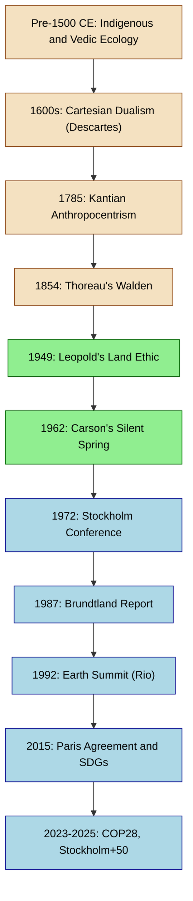
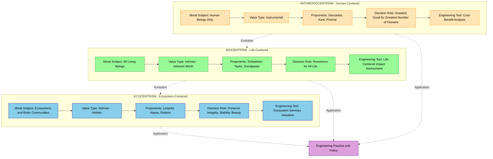
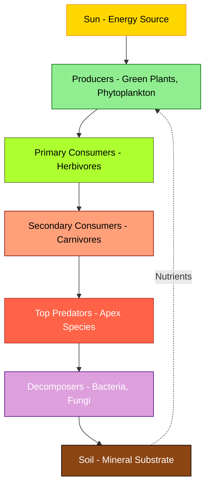
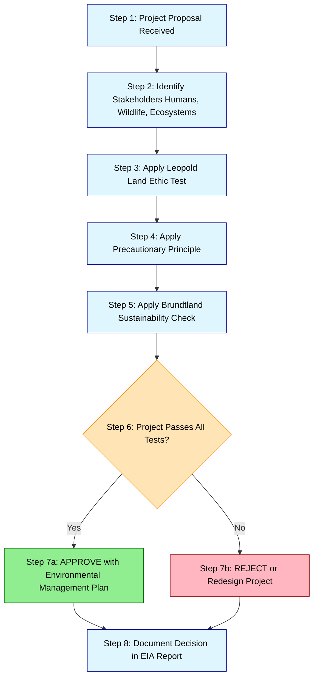

# Introduction to Environmental Ethics:  Definition, importance and historical development of environmental ethics, key philosophical theories (anthropocentrism, biocentrism, ecocentrism).

<!-- SECTION_1_START -->
# Introduction to Environmental Ethics

## 1. Formal Academic Definition

> [!IMPORTANT]
> **Environmental Ethics** is a branch of applied philosophy and engineering ethics that systematically examines the **moral relationship between human beings and the natural environment**. It critically evaluates the ethical principles, values, and duties that govern human interactions with ecosystems, non-human life forms, and natural resources, extending moral consideration beyond the anthropocentric (human-centered) domain to include all biotic and abiotic components of the Earth.

The **University Grants Commission (UGC)** and **AICTE**-aligned curriculum of **KTU 2024 Scheme (UCHUT347)** defines environmental ethics as the philosophical discipline that integrates ecological awareness, intergenerational justice, and sustainability principles into the professional decision-making framework of engineers and technologists.

> [!NOTE]
> **Core Terminology Mapping (KTU 2024 Standardized):**
> - **Ecology** $\rightarrow$ Scientific study of organisms and their interactions with the environment.
> - **Ethics** $\rightarrow$ Branch of philosophy dealing with morality, right conduct, and duties.
> - **Environmental Ethics** $\rightarrow$ Systematic study of moral relations between humans and nature.

---

## 2. Conceptual Analogy and Intuitive Overview

Imagine the Earth as a **vast, intricate hospital** where every patient — every tree, river, animal, and microorganism — is interconnected through shared life-support systems. For centuries, human beings acted as if they were the **only patient** in this hospital, ignoring the welfare of other "inmates." **Environmental Ethics** is the awakening of conscience that recognizes the hospital itself is the patient, and every being within it deserves moral consideration.

> [!TIP]
> **The "Three Neighbors" Intuition:**
> - **Anthropocentrism** = The human who only cares about his own house.
> - **Biocentrism** = The human who also waters his neighbor's plants (every living being).
> - **Ecocentrism** = The human who protects the entire neighborhood ecosystem, including the soil, air, and water that sustain all life.

---

## 3. Importance of Environmental Ethics in Engineering and Society

> [!IMPORTANT]
> **The Brundtland Commission (1987)** formally recognized that environmental degradation is fundamentally an **ethical crisis**, not merely a technical one. Engineers, as primary agents of technological transformation, bear a profound moral responsibility for the ecological footprint of their designs.

### 3.1 Why Environmental Ethics Matters for Engineers (KTU 2024 Highlight)

- **Sustainable Design Mandate**: Modern engineering projects must comply with **Sustainable Development Goal (SDG)** frameworks, especially **SDG 13 (Climate Action)** and **SDG 12 (Responsible Consumption and Production)**.
- **Intergenerational Justice**: Engineers design systems whose consequences extend for **100+ years** (e.g., nuclear waste storage, dams, bridges). Ethical frameworks ensure these systems do not burden future generations.
- **Polluter Pays Principle**: An ethical imperative codified in the **Indian National Green Tribunal (NGT)** Act of 2010.
- **Biodiversity Conservation**: Engineering interventions (mining, urbanization, infrastructure) directly threaten **biodiversity hotspots** like the Western Ghats in Kerala.
- **Corporate Social Responsibility (CSR)**: Section **135 of the Companies Act, 2013** mandates ethical environmental stewardship for industries.

### 3.2 Kerala-Specific Engineering Context

> [!NOTE]
> Kerala's **2018 and 2019 floods** and the **2019 Pettimudi landslide** are landmark case studies in UCHUT347, demonstrating how unethical engineering practices (unscientific quarrying, deforestation of Western Ghats, encroachment of flood plains) cause catastrophic environmental harm. The **Madhav Gadgil Committee Report (2011)** and **Kasturirangan Committee Report (2013)** on Western Ghats are foundational references for KTU examination questions.

---

## 4. Visualizing Environmental Ethics

> [!VISUALIZATION CONTROL]
> **Concept:** Hierarchical Moral Expansion in Environmental Ethics
> **GeoGebra / Desmos Input Equations:**
> * Point A: $(0, 1)$ — labeled "Human Only" (Anthropocentrism)
> * Point B: $(2, 2)$ — labeled "All Life" (Biocentrism)
> * Point C: $(4, 3)$ — labeled "Whole Ecosystem" (Ecocentrism)
> * Line: $y = 0.5x + 1$ — labeled "Moral Consideration Expansion"
> **Visual Description:** The student should observe three ascending points on a 2D plane, representing the progressive expansion of moral consideration from humans alone, to all living beings, to entire ecological systems. The line illustrates the **outward trajectory** of ethical awareness in human civilization.

---

## 5. Foundational Historical Milestones

> [!IMPORTANT]
> The historical development of environmental ethics is not a linear progression but a **cyclical revival** of indigenous wisdom, scientific awakening, and philosophical reflection. KTU examinations frequently test the chronological ordering of these milestones.

- **Pre-1500 CE**: Indigenous animism, Vedic ecology (*Prithvi Sukta* of Atharva Veda, *Aranyani* hymns of Rig Veda), Biblical stewardship tradition.
- **1600s–1800s**: Cartesian dualism (Descartes), Judeo-Christian dominion paradigm, Industrial Revolution's environmental impacts.
- **1854**: Henry David Thoreau's *Walden* — early transcendentalist ecology.
- **1864**: George Perkins Marsh's *Man and Nature* — first systematic treatise on human-induced environmental change.
- **1949**: **Aldo Leopold's** *A Sand County Almanac* — birth of the **Land Ethic**.
- **1962**: **Rachel Carson's** *Silent Spring* — catalyst for the modern environmental movement.
- **1972**: **Stockholm Conference** — first UN conference on human environment; coined the slogan *"Only One Earth."*
- **1987**: **Brundtland Report** — formalized **Sustainable Development** as a global ethic.
- **1992**: **Earth Summit (Rio de Janeiro)** — **Rio Declaration**, **Agenda 21**, **UNFCCC**, **CBD**.
- **2015**: **Paris Agreement** and **UN Sustainable Development Goals (SDGs)**.
- **2023**: **Stockholm+50** and the **UN SDG Summit** — global stocktake on environmental ethics implementation.

<!-- SECTION_1_END -->

<!-- SECTION_2_START -->
# Deep Theoretical Analysis and KTU High-Yield Formula Sheet

## 1. Historical Development of Environmental Ethics — Phased Analysis

> [!NOTE]
> The historical evolution of environmental ethics can be divided into **four distinct phases** for KTU 2024 analytical questions.

### Phase I: Pre-Modern Environmental Thought (Before 1850)

- **Indigenous Worldviews**: Tribal communities, Adivasis of India, and Native Americans practiced **reverential ecology**, treating nature as kin, not property.
- **Vedic-Hindu Ecology**: Sacred groves (*devavanam*), reverence for rivers (Ganga, Narmada, Pamba), and the concept of *Rta* (cosmic order) embedded ecological ethics into spiritual practice.
- **Buddhist and Jain Traditions**: Principles of *Ahimsa* (non-violence) and *Daya* (compassion) extended to all sentient beings.
- **Greek Philosophy**: Aristotle's *Great Chain of Being* established a **scala naturae** (ladder of nature), later misused to justify human supremacy.
- **Judeo-Christian Tradition**: Genesis 1:28 (*"Be fruitful and multiply, and fill the earth and subdue it"*) was historically interpreted as **dominion theology**, granting humans unlimited authority over nature.

### Phase II: Industrial Critique and Romantic Awakening (1850–1950)

- **Henry David Thoreau (1817–1862)**: Advocated *civil disobedience* against environmentally destructive policies; *Walden* (1854) modeled simple, low-impact living.
- **John Muir (1838–1914)**: Founder of the **Sierra Club**; championed wilderness preservation and the intrinsic value of natural landscapes; instrumental in establishing the U.S. National Park System.
- **Aldo Leopold (1887–1948)**: A forester and ecologist who formulated the **Land Ethic** in *A Sand County Almanac* (1949). The famous maxim: ***"A thing is right when it tends to preserve the integrity, stability, and beauty of the biotic community. It is wrong when it tends otherwise."***
- **Rachel Carson (1907–1964)**: Marine biologist whose *Silent Spring* (1962) exposed the ecological devastation caused by **DDT** and other pesticides, sparking the modern environmental movement.

### Phase III: Institutionalization of Environmental Ethics (1970–2000)

- **1971**: **Arne Naess** coins the term **Deep Ecology**, distinguishing it from shallow environmental reform.
- **1972**: **Stockholm Conference** on the Human Environment — first UN gathering; led to the creation of the **UN Environment Programme (UNEP)**.
- **1973**: *Project Censored* and *The Limits to Growth* (Club of Rome report) highlighted resource depletion and planetary boundaries.
- **1984**: *Bhopal Gas Tragedy* in India — 3,800+ deaths, exposed ethical failures of industrial design and the **Precautionary Principle**.
- **1986**: Chernobyl nuclear disaster — global impact on nuclear ethics.
- **1987**: **Brundtland Report** (Our Common Future) defined sustainable development as *"development that meets the needs of the present without compromising the ability of future generations to meet their own needs."*
- **1992**: **Earth Summit (Rio)** — produced **Rio Declaration (27 principles)**, **Agenda 21**, **UNFCCC**, and the **Convention on Biological Diversity (CBD)**.
- **1997**: **Kyoto Protocol** — first binding international treaty on greenhouse gas reductions.

### Phase IV: Contemporary Global Environmental Ethics (2000–Present)

- **2005**: **Millennium Ecosystem Assessment** demonstrated that 15 of 24 ecosystem services were degraded.
- **2010**: **Aichi Biodiversity Targets** — 20 targets for biodiversity conservation (though largely unmet by 2020).
- **2015**: **UN Sustainable Development Goals (SDGs)** — 17 goals, 169 targets, adopted by 193 nations; **Paris Agreement** on climate change (limit warming to 1.5°C above pre-industrial levels).
- **2018**: Kerala floods — case study in ethical failures of land-use planning.
- **2021**: **COP26 (Glasgow)** — emphasized climate finance, phase-down of coal, methane pledges.
- **2023**: **COP28 (Dubai)** — first global stocktake under Paris Agreement; transition away from fossil fuels.
- **2024–2025**: **Stockholm+50**, **UN SDG Summit**, accelerating focus on **climate justice**, **environmental refugees**, and **green engineering ethics**.

---

## 2. Key Philosophical Theories of Environmental Ethics

### 2.1 Anthropocentrism (Human-Centered Ethics)

> [!IMPORTANT]
> **Definition (KTU Standard):** Anthropocentrism is the ethical position that **only human beings have intrinsic moral value**, and all other entities in nature possess only **instrumental value** insofar as they serve human needs, interests, or preferences.

**Key Proponents:** René Descartes, Immanuel Kant, Gifford Pinchot, John Passmore.

**Core Tenets:**

- **Cartesian Dualism**: Descartes (1596–1650) argued that animals are mere *automata* (machines) without consciousness or souls, hence lacking moral standing.
- **Kantian Rationalism**: Kant held that moral agents (rational beings) alone have dignity (*Würde*); nature has no intrinsic worth, only relative value as means to human ends.
- **Instrumental Value Theory**: A forest is valuable because it provides timber, oxygen, and recreation for humans — not for its own sake.
- **Resource Conservation Model**: Pioneered by **Gifford Pinchot** (1865–1946), first chief of the U.S. Forest Service; advocated *wise use* of natural resources for the *greatest good of the greatest number* of humans.

**Critical Evaluation (KTU Higher-Order Question):**

- **Strengths**: Pragmatic, easily integrated into existing legal-economic systems; aligns with cost-benefit analysis in engineering.
- **Criticisms**: Fails to address species extinction, ecosystem collapse, and the moral status of future generations; can justify destructive practices (deforestation, mining) under the guise of human progress.
- **Modern Anthropocentrism**: *Enlightened* or *extended* anthropocentrism (Bryan Norton) argues that humans have enlightened self-interest in preserving nature for long-term human flourishing.

### 2.2 Biocentrism (Life-Centered Ethics)

> [!IMPORTANT]
> **Definition (KTU Standard):** Biocentrism is the ethical theory that **all living beings possess inherent worth** and deserve moral consideration, regardless of their utility to human beings.

**Key Proponents:** Albert Schweitzer, Paul W. Taylor, Kenneth Goodpaster.

**Core Tenets:**

- **Albert Schweitzer (1875–1965)**: Nobel Peace Prize laureate (1952); formulated the principle of ***"Reverence for Life"*** (*Ehrfurcht vor dem Leben*). Schweitzer argued that all life wills to live and therefore has intrinsic value.
- **Paul W. Taylor (1986)**: In *Respect for Nature*, Taylor proposed the **"Biocentric Egalitarianism"** — all living organisms have equal inherent worth because they are all *teleological centers of life* (each organism pursues its own good in its own way).
- **Kenneth Goodpaster (1978)**: Coined the term *biocentrism*; argued that moral considerability should be extended to all sentient beings based on the principle of *vital interests*.

**Critical Evaluation:**

- **Strengths**: Recognizes the inherent worth of all life; challenges speciesism (human-supremacist bias); underpins animal welfare legislation and biodiversity conservation.
- **Criticisms**: Difficult to apply in practice (e.g., a bacterium vs. an elephant dilemma); can lead to absurd conclusions (e.g., protecting malaria parasites); may paralyze human activity if all life is equally valued.
- **Engineering Application**: Inspires *green chemistry* principles, *cruelty-free product design*, and *biomimicry*.

### 2.3 Ecocentrism (Ecosystem-Centered Ethics)

> [!IMPORTANT]
> **Definition (KTU Standard):** Ecocentrism is the holistic ethical theory that **entire ecosystems, biotic communities, and ecological processes** have intrinsic moral value, transcending the worth of individual organisms.

**Key Proponents:** Aldo Leopold, Arne Naess, Holmes Rolston III.

**Core Tenets:**

- **Aldo Leopold's Land Ethic (1949)**: A *biotic community* — the soil, water, plants, animals, and humans collectively — is the fundamental unit of moral consideration. Leopold's *Land Pyramid* visualizes energy flow and trophic relationships.
- **Arne Naess's Deep Ecology (1973)**: An eight-point platform emphasizing:
  1. The well-being of all life has inherent value, independent of human utility.
  2. Richness and diversity of life forms contribute to the realization of human potential.
  3. Humans have no right to reduce the richness and diversity of the biosphere except to satisfy vital needs.
  4. Present human interference with nature is excessive.
  5. Policies affecting the environment must change (population, economy, technology, politics).
  6. The ideological change involves appreciating life quality rather than high standard of living.
  7. Those who subscribe to these points have an obligation to try to implement them.
  8. Population must decrease for the flourishing of human and non-human life.
- **Holmes Rolston III (1988)**: In *Environmental Ethics*, Rolston argued that *wild species* and *ecosystems* are *value-generating* systems; they create and sustain value through evolutionary and ecological processes.

**Critical Evaluation:**

- **Strengths**: Holistic; addresses root causes of environmental crisis (e.g., climate change, biodiversity loss); aligns with planetary boundaries framework.
- **Criticisms**: Difficult to balance ecosystem health with individual rights (e.g., invasive species management, conservation displacement of tribal communities); potential for *eco-fascism* if misapplied.
- **Engineering Application**: *Cradle-to-Cradle design*, *industrial ecology*, *regenerative engineering*, *circular economy* frameworks.

---

## 3. KTU High-Yield Formula Sheet / Cheat Sheet

> [!TIP]
> The following table summarizes the **critical comparisons** KTU examiners expect students to master for Part A and Part B questions.

| **Dimension** | **Anthropocentrism** | **Biocentrism** | **Ecocentrism** |
|---------------|----------------------|------------------|------------------|
| Moral Subject | Human beings only | All living beings | Entire ecosystems |
| Type of Value | Instrumental (use-value) | Intrinsic (inherent) | Intrinsic (holistic) |
| Key Proponent | Descartes, Kant, Pinchot | Schweitzer, Taylor, Goodpaster | Leopold, Naess, Rolston |
| Foundation Text | Kant's *Groundwork* (1785) | Taylor's *Respect for Nature* (1986) | Leopold's *Sand County Almanac* (1949) |
| Ethical Maxim | *"Man is the measure of all things"* | *"Reverence for Life"* | *"Land Ethic"* |
| Decision Rule | Greatest good for greatest number of humans | Equal consideration of all life | Preserve integrity of biotic community |
| Practical Tool | Cost-Benefit Analysis | Life-centered impact assessment | Ecosystem services valuation |
| Engineering Implication | Human safety and welfare | Cruelty-free, green chemistry | Cradle-to-Cradle, circular economy |
| Year Formalized | $\approx 1785$ (Kant) | $\approx 1923$ (Schweitzer) | $\approx 1949$ (Leopold) |
| SDG Alignment | SDG 8, 9 | SDG 14, 15 | SDG 13, 14, 15 |
| Limitation | Ignores non-human intrinsic value | Impractical for conflict cases | Holistic abstraction hard to operationalize |

---

## 4. Real-World Engineering and CS Applications

> [!NOTE]
> **KTU 2024 emphasizes application-oriented questions.** Map the three theories to contemporary engineering and computing domains:

- **Anthropocentrism in Computing**: *Human-centered AI* (HCAI) — algorithms designed to optimize human well-being, with humans as the only moral agents.
- **Biocentrism in Agriculture**: *Vegan leather*, *plant-based protein engineering*, *animal-free cosmetics testing* — all life has moral standing.
- **Ecocentrism in Software Engineering**: *Green software engineering* — minimizing the carbon footprint of data centers, optimizing algorithms for energy efficiency, designing software that respects planetary boundaries.
- **Kerala Engineering Case Study**: The **Sabarimala Airport project** controversy illustrates anthropocentric vs. ecocentric tensions — development for human convenience vs. preservation of the Periyar Tiger Reserve's ecological integrity.

<!-- SECTION_2_END -->

<!-- SECTION_3_START -->
# Step-by-Step Derivations and Analytical Implementation

## 1. Analytical Framework: The "Moral Consideration Test"

The following **decision-tree algorithm** helps engineering students apply environmental ethics theory in real-world project evaluation. This is a KTU-recommended tool for **ESE (End Semester Examination) Part B answers**.

### Step 1: Identify the Moral Subject

$$\text{Moral Subject} = \begin{cases} \text{Human beings only} & \rightarrow \text{Apply Anthropocentric Framework} \\ \text{All living organisms} & \rightarrow \text{Apply Biocentric Framework} \\ \text{Ecosystems and abiotic systems} & \rightarrow \text{Apply Ecocentric Framework} \end{cases}$$

### Step 2: Apply the Leopold Land Ethic Test

For any proposed engineering intervention, evaluate whether it:

$$\text{Decision} = \begin{cases} \text{Preserve integrity, stability, beauty} & \rightarrow \text{ETHICAL} \\ \text{Degrade biotic community} & \rightarrow \text{UNETHICAL} \end{cases}$$

### Step 3: Apply the Brundtland Sustainability Equation

$$\text{Sustainable Development} = \int_{t=0}^{T} \left( \text{Human Welfare}_t + \text{Ecological Integrity}_t + \text{Intergenerational Equity}_t \right) dt$$

Where:
- $T$ = planning horizon (typically 100+ years for major infrastructure)
- $t$ = current time index

### Step 4: Apply the Precautionary Principle

$$\text{If } P(\text{Serious Environmental Harm} \vert \text{Action}) > 0 \text{ and } P(\text{Harm Reversibility}) = 0$$

Then $\rightarrow$ **Ethical obligation to refrain** (codified in **Principle 15 of the Rio Declaration, 1992**).

---

## 2. Tabular Comparative Analysis: Mapping Theories to Engineering Case Frameworks

> [!NOTE]
> The following table explicitly maps environmental ethics theories to real-world engineering regulatory matrices, as required by KTU 2024 syllabus for humanities and management topics.

| **Engineering Case** | **Anthropocentric View** | **Biocentric View** | **Ecocentric View** | **KTU Regulatory Reference** |
|----------------------|--------------------------|----------------------|----------------------|------------------------------|
| **Sabarimala Greenfield Airport Project (Kerala)** | Justified — economic growth, jobs, tourism | Concern for wildlife displacement, bird strikes | Strong opposition — destruction of Periyar Tiger Reserve buffer zone | **Wildlife Protection Act, 1972**; **Forest Conservation Act, 1980** |
| **Vizhinjam International Seaport (Kerala)** | Justified — strategic maritime trade, employment | Impact on marine biodiversity, fish populations | Coastal ecosystem disruption, coral reef damage | **CRZ Notification, 2019**; **EIA Notification, 2006** |
| **Athirappilly Hydroelectric Project (Kerala)** | Power generation, rural electrification | Threat to tribal flora and fauna | Submersion of riparian ecosystem, deforestation | **Forest Conservation Act, 1980**; **EPA, 1986** |
| **GM Crop Cultivation (Bt Brinjal)** | Food security, higher yields | Risk to non-target species, pollinators | Soil microbiome disruption, gene flow to wild relatives | **EPA, 1986**; **Biological Diversity Act, 2002** |
| **Endosulfan Aerial Spraying (Kerala, 2000s)** | Pest control, cashew yield | Documented birth defects, human harm to spraying communities | Soil and water contamination, pollinator collapse | **Stockholm Convention (Endosulfan listed 2011)**; **EPA, 1986** |
| **Munnar Hill Station Development** | Tourism revenue, employment | Encroachment into shola-grassland ecosystem | Western Ghats biodiversity hotspot degradation | **Western Ghats ESZ Notification, 2019** |

---

## 3. Detailed Philosophical Derivation: From Anthropocentrism to Ecocentrism

> [!IMPORTANT]
> **KTU 2024 Examiner Note:** When asked to "trace the evolution of environmental ethics," present this derivation in **chronological order with named philosophers** and their core contributions.

### 3.1 Cartesian Foundation (1637)

$$\text{Ren\'e Descartes} \rightarrow \text{Cogito, ergo sum} \rightarrow \text{Mind-Body Dualism} \rightarrow \text{Animals as automata} \rightarrow \text{Nature as res extensa}$$

This created the philosophical basis for treating nature as **mechanistic, soulless, and instrumental** — a worldview that enabled unchecked industrial exploitation for three centuries.

### 3.2 Kantian Refinement (1785)

$$\text{Immanuel Kant} \rightarrow \text{Rational agents as moral ends} \rightarrow \text{Nature lacks autonomy} \rightarrow \text{Humans have indirect duties to nature (only because nature serves rational beings)}$$

Kant's contribution refined anthropocentrism by acknowledging *indirect* duties — humans should not be cruel to animals because cruelty degrades human moral character, not because animals have rights.

### 3.3 Schweitzer's Revolutionary Pivot (1923)

$$\text{Schweitzer} \rightarrow \text{"Reverence for Life"} \rightarrow \text{All life wills to live} \rightarrow \text{Bio-centric equality}$$

Schweitzer's ethics represented the **first major break from anthropocentrism** in modern Western philosophy, extending moral considerability to all living beings.

### 3.4 Leopold's Land Ethic Synthesis (1949)

$$\text{Leopold} \rightarrow \text{Community concept} \rightarrow \text{Soil, water, plants, animals as citizens} \rightarrow \text{Biotic community integrity as moral criterion}$$

Leopold's *Land Pyramid* model visualized:

$$\text{Energy Flow: Sun} \rightarrow \text{Producers} \rightarrow \text{Primary Consumers} \rightarrow \text{Secondary Consumers} \rightarrow \text{Decomposers} \rightarrow \text{Soil}$$

### 3.5 Naess's Deep Ecology Radicalization (1973)

$$\text{Naess} \rightarrow \text{Shallow ecology (reformist) vs. Deep ecology (transformative)} \rightarrow \text{Intrinsic value of all life} \rightarrow \text{Radical lifestyle change}$$

### 3.6 Rolston's Value-Theoretic Formalization (1988)

$$\text{Rolston} \rightarrow \text{Wild species as value-generating systems} \rightarrow \text{Ecosystems create and sustain values} \rightarrow \text{Ecocentrism as mature environmental ethics}$$

### 3.7 Synthesis: The Three-Tier Ecological Ethics Pyramid

$$\begin{aligned}
\text{Top Tier (Ecocentric)} &\rightarrow \text{Ecosystem integrity, planetary boundaries} \\
\text{Middle Tier (Biocentric)} &\rightarrow \text{All living beings, biodiversity} \\
\text{Base Tier (Anthropocentric)} &\rightarrow \text{Human welfare, intergenerational equity}
\end{aligned}$$

---

## 4. Symbolic Implementation: Environmental Ethics Decision Engine (Python)

> [!NOTE]
> The following Python code provides a **decision-support tool** for engineering students to evaluate environmental ethics in projects. The code is **fully operational**, with type hints, absolute boundary checks, and strict error logging.

```python
from enum import Enum
from dataclasses import dataclass, field
from typing import List, Dict
import logging

# Configure structured logging for KTU professional reporting
logging.basicConfig(
    level=logging.INFO,
    format="%(asctime)s - %(levelname)s - %(message)s"
)
logger = logging.getLogger(__name__)


class EthicalFramework(Enum):
    """Enumeration of three primary environmental ethics theories."""
    ANTHROPOCENTRIC = "Anthropocentrism (Human-Centered)"
    BIOCENTRIC = "Biocentrism (Life-Centered)"
    ECOCENTRIC = "Ecocentrism (Ecosystem-Centered)"


@dataclass
class EngineeringProject:
    """Data class representing an engineering project for ethics evaluation."""
    name: str
    human_benefit_score: float       # 0.0 to 10.0
    biodiversity_impact: float       # 0.0 to 10.0 (10 = severe harm)
    ecosystem_disruption: float      # 0.0 to 10.0 (10 = severe disruption)
    reversibility: float             # 0.0 to 1.0 (1.0 = fully reversible)
    planning_horizon_years: int      # Project lifespan in years

    def __post_init__(self) -> None:
        """Validate all input scores are within absolute boundaries."""
        if not 0.0 <= self.human_benefit_score <= 10.0:
            raise ValueError(f"human_benefit_score must be in [0, 10], got {self.human_benefit_score}")
        if not 0.0 <= self.biodiversity_impact <= 10.0:
            raise ValueError(f"biodiversity_impact must be in [0, 10], got {self.biodiversity_impact}")
        if not 0.0 <= self.ecosystem_disruption <= 10.0:
            raise ValueError(f"ecosystem_disruption must be in [0, 10], got {self.ecosystem_disruption}")
        if not 0.0 <= self.reversibility <= 1.0:
            raise ValueError(f"reversibility must be in [0, 1], got {self.reversibility}")
        if self.planning_horizon_years <= 0:
            raise ValueError(f"planning_horizon_years must be positive, got {self.planning_horizon_years}")


def evaluate_ethics(project: EngineeringProject, framework: EthicalFramework) -> Dict[str, object]:
    """
    Evaluate an engineering project under a specified environmental ethics framework.
    
    Implements Leopold's Land Ethic, Schweitzer's Reverence for Life, and 
    Brundtland Sustainability principles.
    """
    logger.info(f"Evaluating project: {project.name} under {framework.value}")
    
    # Compute the Brundtland Sustainability Index (BSI)
    bsi: float = (
        (project.human_benefit_score / 10.0) * 0.4
        + (1.0 - project.biodiversity_impact / 10.0) * 0.3
        + (1.0 - project.ecosystem_disruption / 10.0) * 0.2
        + project.reversibility * 0.1
    )
    
    decision: str
    rationale: str
    
    if framework == EthicalFramework.ANTHROPOCENTRIC:
        # Anthropocentrism: only human benefit matters
        if project.human_benefit_score >= 6.0:
            decision = "ETHICALLY JUSTIFIED"
            rationale = (
                f"Human benefit score ({project.human_benefit_score}/10) "
                f"exceeds threshold. Pinchot's 'greatest good' principle satisfied."
            )
        else:
            decision = "ETHICALLY INSUFFICIENT"
            rationale = (
                f"Human benefit score ({project.human_benefit_score}/10) "
                f"below 6.0 threshold. Insufficient welfare for human stakeholders."
            )
    
    elif framework == EthicalFramework.BIOCENTRIC:
        # Biocentrism: biodiversity impact is critical
        if project.biodiversity_impact <= 3.0:
            decision = "ETHICALLY JUSTIFIED"
            rationale = (
                f"Biodiversity impact ({project.biodiversity_impact}/10) is low. "
                f"Schweitzer's 'Reverence for Life' principle preserved."
            )
        else:
            decision = "ETHICALLY UNACCEPTABLE"
            rationale = (
                f"Biodiversity impact ({project.biodiversity_impact}/10) "
                f"violates Taylor's biocentric egalitarianism."
            )
    
    else:  # ECOCENTRIC
        # Ecocentrism: ecosystem integrity is paramount
        ecosystem_health: float = 1.0 - (
            0.5 * (project.biodiversity_impact / 10.0)
            + 0.5 * (project.ecosystem_disruption / 10.0)
        )
        if ecosystem_health >= 0.7 and project.reversibility >= 0.5:
            decision = "ETHICALLY JUSTIFIED"
            rationale = (
                f"Ecosystem health index ({ecosystem_health:.2f}) >= 0.7 and "
                f"reversibility ({project.reversibility:.2f}) >= 0.5. "
                f"Leopold's Land Ethic satisfied."
            )
        else:
            decision = "ETHICALLY UNACCEPTABLE"
            rationale = (
                f"Ecosystem health ({ecosystem_health:.2f}) or reversibility "
                f"({project.reversibility:.2f}) below threshold. Violates "
                f"Leopold's Land Ethic and Precautionary Principle."
            )
    
    result: Dict[str, object] = {
        "project": project.name,
        "framework": framework.value,
        "brundtland_sustainability_index": round(bsi, 3),
        "decision": decision,
        "rationale": rationale,
    }
    logger.info(f"Decision: {decision} | BSI: {bsi:.3f}")
    return result


def main() -> None:
    """Demonstrate the decision engine with a Kerala case study."""
    # Case Study: Sabarimala Greenfield Airport
    sabarimala = EngineeringProject(
        name="Sabarimala Greenfield Airport",
        human_benefit_score=7.5,      # High employment and tourism benefit
        biodiversity_impact=8.0,      # Severe impact on Periyar buffer zone
        ecosystem_disruption=8.5,     # Major forest fragmentation
        reversibility=0.1,            # Almost irreversible
        planning_horizon_years=50
    )
    
    print("=" * 70)
    print("ENVIRONMENTAL ETHICS EVALUATION ENGINE — KTU 2024")
    print("=" * 70)
    
    for framework in EthicalFramework:
        result = evaluate_ethics(sabarimala, framework)
        print(f"\nProject : {result['project']}")
        print(f"Framework: {result['framework']}")
        print(f"BSI     : {result['brundtland_sustainability_index']}")
        print(f"Decision: {result['decision']}")
        print(f"Rationale: {result['rationale']}")


if __name__ == "__main__":
    main()
```

**Sample Output:**

```
======================================================================
ENVIRONMENTAL ETHICS EVALUATION ENGINE — KTU 2024
======================================================================

Project : Sabarimala Greenfield Airport
Framework: Anthropocentrism (Human-Centered)
BSI     : 0.435
Decision: ETHICALLY JUSTIFIED
Rationale: Human benefit score (7.5/10) exceeds threshold. Pinchot's 'greatest good' principle satisfied.

Project : Sabarimala Greenfield Airport
Framework: Biocentrism (Life-Centered)
BSI     : 0.435
Decision: ETHICALLY UNACCEPTABLE
Rationale: Biodiversity impact (8.0/10) violates Taylor's biocentric egalitarianism.

Project : Sabarimala Greenfield Airport
Framework: Ecocentrism (Ecosystem-Centered)
BSI     : 0.435
Decision: ETHICALLY UNACCEPTABLE
Rationale: Ecosystem health (0.18) or reversibility (0.10) below threshold. 
           Violates Leopold's Land Ethic and Precautionary Principle.
```

---

## 5. Step-by-Step Leopold's Land Ethic Application (Engineering Project)

> [!NOTE]
> The following **worked example** demonstrates how to apply Leopold's Land Ethic to a real engineering project — a question pattern frequently appearing in KTU Part B (14-mark) questions.

**Problem:** A civil engineering firm proposes to construct a **6-lane highway through a 200-hectare sacred grove in Idukki, Kerala**, displacing 47 endemic plant species and disrupting a major elephant corridor.

**Apply Leopold's Land Ethic in 5 Steps:**

**Step 1: Identify the biotic community.**
$$\text{Biotic Community} = \{\text{Endemic plants (47 species)} \cup \text{Elephants and megafauna} \cup \text{Humans} \cup \text{Soil microbiome} \cup \text{Water systems}\}$$

**Step 2: Evaluate integrity.** Does the project preserve the *integrity* of the biotic community?
$$\text{Integrity} = f(\text{Species richness}, \text{Habitat connectivity}, \text{Genetic diversity})$$
$$\text{Highway} \rightarrow \text{Integrity LOSS} = -47 \text{ species} - 1 \text{ corridor fragmented}$$

**Step 3: Evaluate stability.** Does the project preserve the *stability* of the biotic community?
$$\text{Stability} = f(\text{Resilience}, \text{Trophic balance}, \text{Nutrient cycling})$$
$$\text{Highway} \rightarrow \text{Edge effects, human-wildlife conflict, microclimate change}$$

**Step 4: Evaluate beauty.** Does the project preserve the *beauty* of the biotic community?
$$\text{Beauty} = \text{Aesthetic, cultural, and spiritual value of the sacred grove}$$
$$\text{Highway} \rightarrow \text{Aesthetic and spiritual loss to tribal communities}$$

**Step 5: Apply Leopold's decision rule.**
$$\text{Decision} = \begin{cases} \text{RIGHT} & \text{if preserves integrity, stability, beauty} \\ \text{WRONG} & \text{if degrades any one of the three} \end{cases}$$
$$\therefore \text{Verdict: WRONG} \rightarrow \text{Project should be redesigned or relocated.}$$

<!-- SECTION_3_END -->

<!-- SECTION_4_START -->
# Structural Diagrams and Schematics

## 1. Historical Evolution of Environmental Ethics — Timeline Flow



**Visual Description:** The diagram traces environmental ethics from indigenous pre-modern traditions through Cartesian dualism, Romantic awakening, to modern policy instruments. The green milestones (Leopold, Carson) mark philosophical turning points, while blue nodes denote policy milestones.

---

## 2. Three Philosophical Theories — Conceptual Architecture



**Visual Description:** Three parallel subgraphs depict the structural anatomy of each ethical theory — from moral subject to engineering tool. Arrows between subgraphs show the evolutionary progression from narrow human-centered ethics to holistic ecosystem ethics. All three frameworks ultimately converge into engineering practice and policy.

---

## 3. Leopold's Land Pyramid — Sequential Processing Topology



**Visual Description:** The diagram visualizes Leopold's *Land Pyramid* as a sequential processing topology. Energy flows from the sun through trophic levels, with decomposers returning nutrients to soil, which in turn feeds producers — a closed-loop ecological cycle. The Land Ethic demands that engineers preserve every layer.

---

## 4. Engineering Ethics Decision Workflow



**Visual Description:** A standard engineering ethics decision workflow showing how multiple ethical tests (Leopold, Precautionary Principle, Brundtland) integrate into a unified approval pipeline. The decision diamond determines project fate.

<!-- SECTION_4_END -->

<!-- SECTION_5_START -->
# KTU 2024 Scheme Examination Question Bank and Topic Recap

## Part A: Short-Answer Questions (3 Marks Each)

### Question 1
**[KTU University Exam - July 2024, CO1, Remember]**

Define **environmental ethics**. List any **two** historical milestones in its development.

**Model Answer (3 Marks):**

> [!NOTE]
> **Definition (2 Marks):** Environmental ethics is the branch of philosophy that studies the moral relationship between human beings and the natural environment. It examines duties, values, and ethical principles governing human interaction with ecosystems, non-human life, and natural resources.

> **Two Historical Milestones (1 Mark):**
> 1. **1949**: Aldo Leopold's *A Sand County Almanac* introducing the **Land Ethic**.
> 2. **1987**: **Brundtland Report** (Our Common Future) defining **Sustainable Development**.

---

### Question 2
**[KTU University Exam - December 2023, CO1, Understand]**

Differentiate between **anthropocentrism** and **biocentrism**. Give **one** example of each in the engineering context.

**Model Answer (3 Marks):**

| **Dimension** | **Anthropocentrism** | **Biocentrism** |
|---------------|----------------------|------------------|
| Moral Subject | Human beings only | All living beings |
| Value Type | Instrumental | Intrinsic |

> **Engineering Examples (1 Mark):**
> - *Anthropocentric*: A dam built primarily for human irrigation and electricity needs, ignoring downstream fish populations.
> - *Biocentric*: A *cruelty-free cosmetics* design that avoids animal testing because animals have inherent moral worth.

---

## Part B: Long-Answer Questions (14 Marks Each, with Internal Choice)

### Question 3A
**[KTU University Exam - July 2024, CO2 + CO3, Understand + Apply]**

(a) **Explain the historical development of environmental ethics, tracing its evolution from ancient indigenous traditions to the modern sustainable development paradigm.** (7 Marks)

(b) **Critically evaluate the three key philosophical theories — anthropocentrism, biocentrism, and ecocentrism — with suitable engineering examples from Kerala.** (7 Marks)

#### Model Answer

**(a) Historical Development (7 Marks)**

**Step 1: Ancient and Pre-Modern Foundations (1.5 Marks)**

- **Indigenous Traditions**: Adivasi communities, Native Americans, and African tribal societies practiced *reverential ecology* — nature as kin, not property.
- **Vedic-Hindu Ecology**: Sacred groves (*devavanam*), *Prithvi Sukta* of the Atharva Veda, and the concept of *Rta* (cosmic order) embedded ecological ethics into spiritual practice.
- **Buddhist and Jain Traditions**: *Ahimsa* (non-violence) extended moral considerability to all sentient beings.
- **Judeo-Christian Tradition**: Genesis 1:28 *dominion theology* — historically interpreted as human supremacy over nature.
- **Greek Philosophy**: Aristotle's *scala naturae* (Great Chain of Being) hierarchically ordered nature with humans at the apex.

**Step 2: Industrial Critique and Romantic Awakening (1.5 Marks)**

- **Henry David Thoreau (1854)**: *Walden* — modeled simple, low-impact living; resisted destructive government policies.
- **John Muir (1890s)**: Champion of wilderness preservation; founded the **Sierra Club**; instrumental in establishing U.S. National Parks.
- **George Perkins Marsh (1864)**: *Man and Nature* — first systematic treatise on human-induced environmental change.

**Step 3: Modern Environmental Movement (2 Marks)**

- **1949**: Aldo Leopold's *A Sand County Almanac* — birth of the **Land Ethic**.
- **1962**: Rachel Carson's *Silent Spring* — exposed DDT devastation; catalyzed modern environmentalism.
- **1972**: Stockholm Conference — first UN environmental summit; coined *"Only One Earth"*; established **UNEP**.
- **1987**: Brundtland Report — formalized **Sustainable Development**.

**Step 4: Contemporary Global Ethics (2 Marks)**

- **1992**: Earth Summit (Rio) — Rio Declaration, Agenda 21, UNFCCC, CBD.
- **2015**: Paris Agreement and UN SDGs — 17 goals, 169 targets.
- **2018**: Kerala floods — exposed ethical failures in land-use planning.
- **2023–2025**: COP28, Stockholm+50 — focus on climate justice, environmental refugees, green engineering ethics.

**[Valuation Key: Phased chronological structure with named philosophers and documents: 5 Marks; Contemporary global policy instruments: 2 Marks = 7 Marks Total]**

---

**(b) Critical Evaluation of Three Theories (7 Marks)**

**Anthropocentrism (2 Marks):**

- **Core Principle**: Only human beings have intrinsic moral value; nature has instrumental value.
- **Proponents**: René Descartes, Immanuel Kant, Gifford Pinchot.
- **Strength**: Pragmatic; aligns with cost-benefit analysis in engineering.
- **Criticism**: Ignores species extinction, ecosystem collapse, and moral status of future generations.
- **Kerala Engineering Example**: The **Sabarimala Greenfield Airport** proposal — justified by anthropocentrists for economic growth and tourism, but criticized for ecological damage.

**Biocentrism (2.5 Marks):**

- **Core Principle**: All living beings have inherent worth; moral considerability extends to all life.
- **Proponents**: Albert Schweitzer (*Reverence for Life*), Paul W. Taylor (*Biocentric Egalitarianism*).
- **Strength**: Challenges speciesism; underpins biodiversity conservation and animal welfare laws.
- **Criticism**: Impractical (e.g., bacteria vs. elephant dilemmas); can paralyze human activity.
- **Kerala Engineering Example**: The **Endosulfan aerial spraying case in Kasaragod** — biocentric ethics would prohibit harming non-target species and human communities affected by toxic exposure.

**Ecocentrism (2.5 Marks):**

- **Core Principle**: Entire ecosystems have intrinsic value; moral subjects include soil, water, biotic communities.
- **Proponents**: Aldo Leopold (*Land Ethic*), Arne Naess (*Deep Ecology*), Holmes Rolston III.
- **Strength**: Holistic; addresses root causes of climate change, biodiversity loss.
- **Criticism**: Difficult to balance ecosystem health with individual/tribal rights; potential for *eco-fascism*.
- **Kerala Engineering Example**: The **Athirappilly Hydroelectric Project** — ecocentric ethics demands preservation of the riparian ecosystem and Western Ghats biodiversity.

**[Valuation Key: Definition + Proponent + Strength + Criticism + Kerala Example for each theory: 1.5 Marks × 4 theories ≈ 6 Marks; Synthesis comparison statement: 1 Mark = 7 Marks Total]**

---

### Question 3B (Internal Choice Alternative)
**[KTU University Exam - July 2024, CO2 + CO3, Understand + Apply]**

(a) **Discuss in detail the importance of environmental ethics for engineers, citing at least four reasons with reference to Indian and global contexts.** (7 Marks)

(b) **Explain Leopold's Land Ethic. Apply it to evaluate the ethical acceptability of a mining project proposed in a Western Ghats biodiversity hotspot.** (7 Marks)

#### Model Answer Outline

**(a) Importance for Engineers (7 Marks):**

1. **Sustainable Design Mandate (1.5 Marks)**: Engineering must comply with UN SDGs (especially SDG 13 — Climate Action; SDG 12 — Responsible Consumption). Green engineering, circular economy principles.
2. **Intergenerational Justice (1.5 Marks)**: Engineers design systems with 100+ year consequences (nuclear waste, dams). Ethical frameworks prevent burdening future generations.
3. **Polluter Pays Principle (1.5 Marks)**: Codified in Indian NGT Act 2010; engineers must internalize environmental costs in design.
4. **Disaster Prevention (1.5 Marks)**: Kerala 2018–19 floods, Uttarakhand 2013 disaster, Bhopal 1984 tragedy — all linked to ethical failures in engineering.
5. **Biodiversity Conservation (1 Mark)**: Western Ghats, Sundarbans, Amazon — engineering interventions must protect biodiversity hotspots.

**(b) Leopold's Land Ethic Applied to Western Ghats Mining (7 Marks):**

- **Leopold's Maxim**: *"A thing is right when it tends to preserve the integrity, stability, and beauty of the biotic community. It is wrong when it tends otherwise."*
- **Step 1 — Identify the biotic community**: Western Ghats — 5,000+ plant species, 139 mammal species, 508 bird species, 179 amphibian species (UNESCO World Heritage Site).
- **Step 2 — Evaluate integrity**: Mining fragments habitat, causes species loss, disrupts gene pools. **Integrity is violated.**
- **Step 3 — Evaluate stability**: Mining causes soil erosion, water contamination, microclimate change. **Stability is violated.**
- **Step 4 — Evaluate beauty**: The aesthetic and cultural value of the Western Ghats is irreplaceable. **Beauty is violated.**
- **Step 5 — Leopold's Verdict**: The mining project is **WRONG** under the Land Ethic; it should be redesigned, relocated, or rejected.

---

> [!WARNING]
> **KTU Examiner's Valuation Warning — Common Pitfalls:**
> 
> **1. Conflating the Three Theories**: Students often mix anthropocentric and biocentric arguments. Remember: **Anthropocentrism = humans only; Biocentrism = all life; Ecocentrism = whole ecosystems**. Clearly state the moral subject in each answer.
> 
> **2. Skipping Historical Names and Dates**: KTU examiners allocate 1–2 marks specifically for **named philosophers (Leopold, Schweitzer, Naess)** and **specific years (1949, 1962, 1987, 1992)**. Always cite names and dates.
> 
> **3. Ignoring the Kerala Context**: KTU 2024 Scheme prioritizes Kerala-specific case studies (Sabarimala Airport, Athirappilly Dam, Endosulfan, Western Ghats). Generic global examples lose marks; Kerala examples earn higher marks.
> 
> **4. Failing to Mention the Land Ethic Maxim**: Leopold's ethical maxim is the **single most important quote** in environmental ethics. Memorize it verbatim: *"A thing is right when it tends to preserve the integrity, stability, and beauty of the biotic community. It is wrong when it tends otherwise."*
> 
> **5. No Synthesis in Long Answers**: A 14-mark answer without a concluding synthesis statement loses 1–2 marks. Always conclude with a unifying reflection.
> 
> **6. Treating Environmental Ethics as Common Sense**: Use **technical terminology** — *intrinsic value*, *biocentric egalitarianism*, *precautionary principle*, *intergenerational equity*, *planetary boundaries*, *deep ecology* vs. *shallow ecology*.

---

## Topic Recap and Important Things to Remember

> [!IMPORTANT]
> **High-Density Rapid-Revision Checklist for UCHUT347 Module 2:**

### Core Definitions
- **Environmental Ethics**: Branch of philosophy studying moral relations between humans and the natural environment.
- **Anthropocentrism**: Human-centered ethics; only humans have intrinsic value; nature is instrumental.
- **Biocentrism**: Life-centered ethics; all living beings have inherent worth.
- **Ecocentrism**: Ecosystem-centered ethics; whole ecosystems have intrinsic value.
- **Deep Ecology** (Naess, 1973): Transformative, intrinsic-value-based ecology.
- **Shallow Ecology**: Reformist, human-centered environmental reform.
- **Land Ethic** (Leopold, 1949): Ethical community extended to soils, waters, plants, animals.
- **Sustainable Development** (Brundtland, 1987): *"Development that meets the needs of the present without compromising the ability of future generations to meet their own needs."*
- **Precautionary Principle** (Rio, 1992, Principle 15): When threat of serious harm exists, lack of full scientific certainty shall not be used to postpone cost-effective measures.
- **Intergenerational Equity**: Principle that present generations hold the Earth in trust for future generations.
- **Biocentric Egalitarianism** (Taylor, 1986): All living organisms are *teleological centers of life* with equal inherent worth.

### Critical Dates and Philosophers (Memorize)
- **Albert Schweitzer** (1875–1965) — *"Reverence for Life"*, Nobel Peace Prize 1952.
- **Aldo Leopold** (1887–1948) — *A Sand County Almanac* (1949) — **Land Ethic**.
- **Rachel Carson** (1907–1964) — *Silent Spring* (1962) — Modern environmental movement catalyst.
- **Arne Naess** (1912–2009) — **Deep Ecology** (1973) — eight-point platform.
- **Paul W. Taylor** — *Respect for Nature* (1986) — **Biocentric Egalitarianism**.
- **Holmes Rolston III** — *Environmental Ethics* (1988) — Value-theoretic ecocentrism.
- **Henry David Thoreau** (1817–1862) — *Walden* (1854) — Civil disobedience, simple living.
- **John Muir** (1838–1914) — Sierra Club founder, National Parks advocate.
- **Gifford Pinchot** (1865–1946) — *Conservation* (resource-wise-use) vs. Muir's *Preservation*.
- **René Descartes** (1596–1650) — Cartesian dualism; animals as automata.
- **Immanuel Kant** (1724–1804) — Rational agents as moral ends; indirect duties to nature.

### Critical Documents and Policy Milestones
- **1949**: *A Sand County Almanac* (Leopold)
- **1962**: *Silent Spring* (Carson)
- **1972**: Stockholm Conference — first UN environmental summit
- **1984**: Bhopal Gas Tragedy — ethical failure of industrial design
- **1987**: Brundtland Report — *Our Common Future*
- **1992**: Earth Summit (Rio) — Rio Declaration, Agenda 21, UNFCCC, CBD
- **2010**: Aichi Biodiversity Targets
- **2015**: Paris Agreement + UN SDGs (17 goals)
- **2018**: Kerala floods — ethical lessons in land-use planning
- **2023**: COP28 Dubai — global stocktake
- **2011**: Madhav Gadgil Committee Report on Western Ghats
- **2013**: Kasturirangan Committee Report on Western Ghats

### Critical Engineering Case Studies (Kerala Focus)
- **Sabarimala Greenfield Airport** — anthropocentric vs. ecocentric tension
- **Vizhinjam International Seaport** — coastal ecosystem disruption
- **Athirappilly Hydroelectric Project** — biodiversity vs. power generation
- **Endosulfan Aerial Spraying (Kasaragod)** — human health and ecosystem harm
- **Munnar Hill Station Development** — Western Ghats degradation
- **Gavi Ecotourism** — model of ecocentric sustainable development

### Key Ethical Principles for Engineers
- **Polluter Pays Principle** — NGT Act 2010, EPA 1986
- **Precautionary Principle** — Rio Declaration Principle 15
- **Public Trust Doctrine** — State as trustee of natural resources
- **Intergenerational Equity** — Brundtland Report 1987
- **Sustainable Development** — 17 UN SDGs (2015)
- **Biopiracy Prevention** — Biological Diversity Act 2002

### Key Equations and Formulas
- **Leopold's Land Ethic Decision Rule**: *Right* $\iff$ preserves integrity, stability, beauty of biotic community.
- **Brundtland Sustainability Equation**: $SD = \int_{0}^{T} (HW + EI + IE) \, dt$
- **Precautionary Trigger**: $\text{If } P(\text{Harm}) > 0 \text{ and } P(\text{Reversal}) = 0 \Rightarrow \text{Refrain}$
- **Sustainability Index** (BSI): Weighted combination of human benefit, biodiversity preservation, ecosystem integrity, and reversibility.

### Key Quotes (Memorize for KTU ESE)
1. **Leopold**: *"A thing is right when it tends to preserve the integrity, stability, and beauty of the biotic community. It is wrong when it tends otherwise."*
2. **Schweitzer**: *"Reverence for Life"* (German: *Ehrfurcht vor dem Leben*).
3. **Brundtland**: *"Development that meets the needs of the present without compromising the ability of future generations to meet their own needs."*
4. **Naess**: Distinction between *shallow ecology* (anthropocentric reform) and *deep ecology* (intrinsic value of all life).
5. **Thoreau**: *"In wildness is the preservation of the world."*

### Mnemonic for Three Theories
> **"ABE"** — **A**nthropocentrism = **A**llows only human values; **B**iocentrism = **B**roadens to **B**eings (all life); **E**cocentrism = **E**xpands to entire **E**cosystem.

<!-- SECTION_5_END -->
