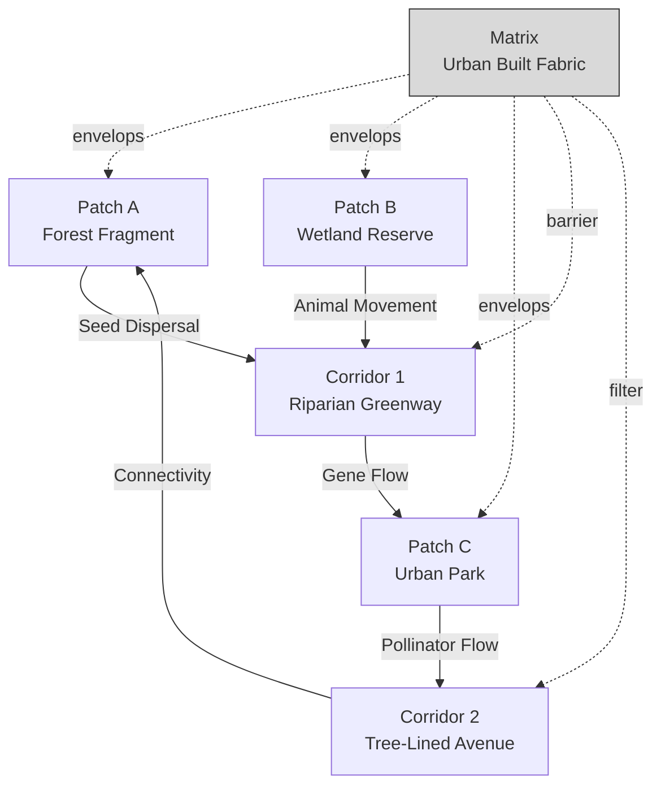
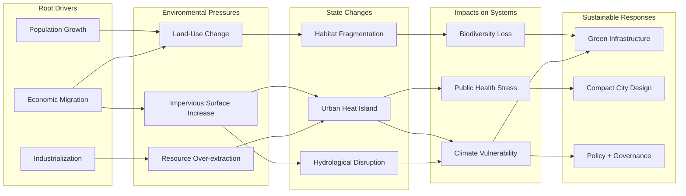
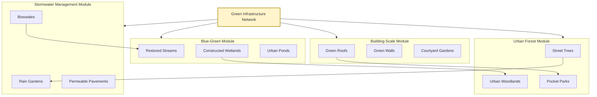
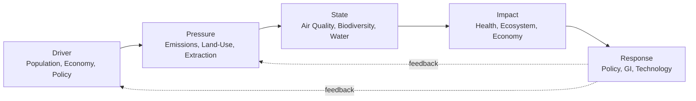

# Landscape and Urban Ecology:  Principles of landscape ecology, Urbanization and its environmental impact, Sustainable urban planning and green infrastructure.

<!-- SECTION_1_START -->
# Landscape and Urban Ecology: Core Foundations

> [!IMPORTANT]
> **KTU 2024 Scheme | UCHUT347 | Module 2** — This module carries a heavy **Conceptual & Case-Study** weightage. Examiner focus: *definitions + real-world impact mapping + planning principles*.

## 2.1 Defining Landscape Ecology

**Landscape Ecology** is the scientific study of the *spatial arrangement* of ecosystems, the *interactions* between different landscape elements (patches, corridors, and matrices), and how these patterns influence ecological processes such as energy flow, nutrient cycling, species movement, and disturbance regimes across multiple spatial and temporal scales.

> [!NOTE]
> **Founder Reference:** The discipline was formalized in the **1980s** by **Carl Troll** (who coined the term *Landschaftsökologie* in 1939) and later expanded by **Richard Forman** and **Michel Godron**, whose *patch-corridor-matrix* model remains the foundational framework of the subject.

### Intuitive Analogy
Think of a **city as a jigsaw puzzle**. The green parks are *patches*, the tree-lined avenues connecting them are *corridors*, and the concrete buildings that fill the rest of the city form the *matrix*. Landscape ecology studies how the shape, size, and connectivity of these pieces affect the animals, plants, water, and even the air that flows through the city.

## 2.2 Defining Urban Ecology

**Urban Ecology** is the multidisciplinary study of *living organisms* (people, flora, fauna, microorganisms) and *ecological processes* within *urban and suburban environments*. Unlike traditional ecology, it treats the *city itself* as a hybrid socio-ecological system where human-built infrastructure and natural systems co-evolve.

### Intuitive Analogy
Imagine a **terrarium (sealed glass ecosystem)**. Inside, you have soil, plants, insects, and water — but the glass walls and the lamp represent human engineering. Urban ecology studies *both* the biological life *and* the engineered glass — because one cannot survive without the other.

## 2.3 The Critical Distinction

| Dimension | Landscape Ecology | Urban Ecology |
|---|---|---|
| **Scale of Study** | Regional to continental mosaics | Building to metropolitan scale |
| **Primary Focus** | Spatial pattern + ecological flows | Species + human-nature interactions within cities |
| **Key Variables** | Patch size, connectivity, matrix permeability | Biodiversity, ecosystem services, human well-being |
| **Analogy** | A satellite map of a forest region | A microscope zoomed into a city park |

> [!VISUALIZATION CONTROL]
> **Concept:** Spatial Hierarchy of Ecology Scales
> **GeoGebra / Desmos Input Equations:**
> * Point A: $(0, 0)$ — labeled "Organism"
> * Point B: $(2, 0)$ — labeled "Population"
> * Point C: $(4, 0)$ — labeled "Community"
> * Point D: $(6, 0)$ — labeled "Ecosystem"
> * Point E: $(8, 0)$ — labeled "Landscape"
> * Point F: $(10, 0)$ — labeled "Urban"
> **Visual Description:** A 1D number line showing how landscape and urban ecology sit at the **macro-end** of the ecological hierarchy, integrating patterns and processes across multiple nested spatial scales.
<!-- SECTION_1_END -->

<!-- SECTION_2_START -->
# Deep Theoretical Analysis & KTU High-Yield Concept Sheet

## 2.4 The Four Principles of Landscape Ecology (Forman & Godron)

Landscape ecology is governed by **four universally tested principles** that the KTU examiner expects students to internalize:

### Principle 1 — Spatial Pattern Affects Ecological Process
The *physical configuration* of landscape elements (size, shape, number, position) directly determines the rate of ecological flows such as water runoff, animal dispersal, seed dispersal, and disease spread.

- **Why this matters in urban India:** Monsoon flooding in **Kochi** is amplified when green patches are replaced with impervious concrete, because natural water absorption patterns are destroyed.

### Principle 2 — Heterogeneity is Essential
A *diverse mosaic* supports more species and more stable ecosystem services than a *uniform* landscape. Diversity of patch types (forests, wetlands, agricultural fields) creates **ecological resilience**.

- **Why this matters:** Kerala's **biodiversity hotspots** (Western Ghats) depend on the heterogeneous landscape mosaic — monoculture plantations reduce this resilience drastically.

### Principle 3 — Connectivity is Critical
*Corridors* (strips of natural habitat connecting patches) allow species migration, gene flow, and recovery after disturbance. **Fragmented** landscapes cause **local extinction** even when total habitat area is preserved.

### Principle 4 — Disturbance and Recovery are Inherent
Landscapes are dynamic; disturbances (fires, floods, urbanization) are natural and must be incorporated into design. **Resilience** is the capacity to absorb disturbance and reorganize.

## 2.5 The Patch-Corridor-Matrix Model (PCM)

This is the **single most important framework** for KTU Module 2 questions.

| Element | Definition | Urban Example | Ecological Function |
|---|---|---|---|
| **Patch** | A relatively homogeneous non-linear area differing from its surroundings | A city park, lake, or vacant lot | Habitat island, biodiversity reservoir |
| **Corridor** | A narrow strip of a particular type that connects two or more patches | A tree-lined avenue, riverine greenway, eco-bridge | Movement, dispersal, gene flow |
| **Matrix** | The dominant background land cover with high connectivity | Concrete buildings, asphalt roads, urban fabric | Enveloping environment, barrier or filter |

## 2.6 Urbanization and Its Environmental Impact

> [!IMPORTANT]
> **KTU Keyword Trigger:** When a question mentions *"environmental impact of urbanization"*, the board examiner expects at least **five distinct impact categories** to be enumerated. Memorize the table below.

### The Seven Environmental Impacts of Urbanization

1. **Habitat Loss and Fragmentation** — Native ecosystems are cleared and broken into isolated patches.
2. **Biodiversity Decline** — Generalist species (crows, pigeons, rats) replace specialist native species.
3. **Urban Heat Island (UHI) Effect** — Concrete and asphalt absorb solar radiation, raising city temperatures by **2–6°C** above surrounding rural areas.
4. **Hydrological Disruption** — Impervious surfaces prevent infiltration, increasing **stormwater runoff** and reducing groundwater recharge.
5. **Air and Noise Pollution** — Vehicular and industrial emissions degrade air quality; chronic noise affects wildlife and human health.
6. **Soil and Land Degradation** — Sealing of soil, contamination, and erosion.
7. **Resource Consumption Pressure** — Cities consume **75% of global natural resources** while housing only **55% of the population** (UN-Habitat data).

## 2.7 Sustainable Urban Planning — Core Principles

> [!NOTE]
> **Definition Box — Sustainable Urban Planning:** A participatory, integrated approach to designing and managing urban growth that balances *economic viability*, *social equity*, and *environmental protection* across generations (Brundtland-inspired, applied at city scale).

### The Six Pillars of Sustainable Urban Planning

1. **Compact City Design** — Higher density, mixed-use development to reduce sprawl.
2. **Transit-Oriented Development (TOD)** — Public transport hubs as growth centers.
3. **Mixed Land Use** — Residential + commercial + recreational integration to reduce travel.
4. **Green-Blue Integration** — Networks of green spaces and water bodies.
5. **Participatory Governance** — Citizen engagement in planning decisions.
6. **Resilience-Based Design** — Planning for climate change, disasters, and shocks.

## 2.8 Green Infrastructure (GI) — The Engineering Ethics Perspective

> [!IMPORTANT]
> **Definition Box — Green Infrastructure:** A strategically planned and managed network of natural and semi-natural landscape elements (parks, wetlands, forests, greenways, green roofs, urban forests) designed to deliver a wide range of **ecosystem services** at city scale.

### GI vs Grey Infrastructure — KTU Comparison Table

| Parameter | Green Infrastructure | Grey Infrastructure |
|---|---|---|
| **Materials** | Soil, vegetation, water, living systems | Concrete, steel, pipes, pumps |
| **Cost Profile** | Lower long-term operational cost | High capital + maintenance cost |
| **Co-Benefits** | Biodiversity, carbon sequestration, aesthetics, recreation | Single-function (e.g., drainage) |
| **Failure Mode** | Self-repairing, adaptive | Catastrophic, cascading |
| **Carbon Footprint** | Negative (sequesters carbon) | High embodied carbon |
| **Example in Kerala** | Mangrove restoration in **Vembanad Lake** | Flood pumping stations in **Kochi** |

## 2.9 KTU High-Yield Formula & Concept Cheat Sheet

| Concept | Core Definition | Engineering / Ethical Relevance |
|---|---|---|
| **Landscape Ecology** | Study of spatial pattern + ecological process | Land-use zoning, EIA studies |
| **Patch** | Non-linear homogeneous area | Habitat island design |
| **Corridor** | Connecting linear habitat | Wildlife crossings, eco-bridges |
| **Matrix** | Dominant background cover | Urban fabric management |
| **Urban Heat Island** | $\Delta T = T_{urban} - T_{rural}$ | Climate-resilient city design |
| **Green Infrastructure** | Network of natural/semi-natural systems | Sustainable urban drainage (SuDS) |
| **New Urbanism** | Walkable, mixed-use neighborhood design | Reducing car dependency |
| **Eco-city** | City designed on ecological principles | Net-zero urban metabolism |
| **Compact City** | High-density, transit-oriented form | Limiting peri-urban sprawl |
| **Permeability** | Capacity of matrix to allow species movement | Designing porous urban boundaries |

> [!NOTE]
> **Quick Note on Equations:** Landscape and urban ecology are **qualitative, systems-based disciplines**. The only quantitative metric students must know is the **UHI temperature differential** $\Delta T$, which is always expressed in degrees Celsius (°C).
<!-- SECTION_2_END -->

<!-- SECTION_3_START -->
# Step-by-Step Derivations, Case Mapping & Implementation Logic

## 3.1 Analytical Derivation — The Urban Heat Island Intensity

> [!NOTE]
> **Why this derivation matters for KTU:** Although primarily a humanities course, Module 2 of UCHUT347 expects students to **quantitatively reason** about urbanization impacts, especially the UHI effect. The examiner often awards a 3-mark question on this.

### Given
* Mean urban surface temperature $T_{urban}$ = **34.0 °C**
* Mean rural surface temperature $T_{rural}$ = **30.5 °C**
* Atmospheric stability class = **neutral**
* Sensor time = 14:00 IST (post-noon peak)

### To Find
The UHI intensity $\Delta T$ and a justification whether it falls within the **typical urban range**.

### Step-by-Step Solution

$$\Delta T = T_{urban} - T_{rural}$$

Substitute the given values:

$$\Delta T = 34.0 \text{ °C} - 30.5 \text{ °C}$$

$$\Delta T = 3.5 \text{ °C}$$

**Interpretation Step:** The UHI intensity of 3.5 °C falls within the **typical global UHI range of 2 – 6 °C** reported by the **World Meteorological Organization (WMO)** for medium-sized tropical cities. This indicates significant thermal stress driven by:
* High impervious surface fraction (concrete, asphalt)
* Reduced vegetation cover (low latent heat flux)
* Anthropogenic heat from vehicles, AC units, and industries
* Trapping of longwave radiation in the urban canyon geometry

**Engineering Ethics Link:** A 3.5 °C UHI increase is associated with a **5–10% rise in cooling-energy demand** and elevated heatstroke mortality, which is an ethical concern regarding *environmental justice* for low-income neighborhoods that lack access to air-conditioning or shaded public spaces.

## 3.2 Case Framework Mapping — Kerala's Urbanization Crisis

> [!NOTE]
> **KTU Pattern Alert:** Module 2 frequently tests case-based reasoning. Below is a structured comparative matrix mapping real-world Kerala scenarios to landscape and urban ecology principles. **Memorize at least two cases** for ESE.

| Real-World Case | Ecological Principle Violated | Sustainable Intervention | Ethical Principle at Stake |
|---|---|---|---|
| **Encroachment on Vembanad–Kol wetlands** | Patch loss + matrix conversion | Ramsar-site buffer zone, mangrove restoration | Inter-generational equity |
| **Sprawling real estate in Western Ghats foothills** | Habitat fragmentation + corridor blockage | Eco-sensitive zone (ESZ) demarcation, vertical growth | Precautionary principle |
| **Filling of paddy fields in Kuttanad** | Loss of patch heterogeneity | Strict paddy-land conservation Act enforcement | Environmental justice |
| **Pallipuram coastal erosion** | Disturbance without resilience design | Living shorelines, geo-textile + mangrove hybrid | Sustainability + resilience |
| **Urban flooding in Kochi (2018, 2019)** | Hydrological cycle disruption | Sustainable Urban Drainage Systems (SuDS), bioswales | Right to safe habitat |
| **Decline of house sparrows in Thiruvananthapuram** | Patch fragmentation + food-web disruption | Citizen-science bird gardens, native tree planting | Biodiversity stewardship |
| **E-waste from IT corridor in Technopark** | Soil + water toxic contamination | Producer responsibility, circular economy hubs | Polluter-pays principle |
| **Heat stress in Calicut beach road vendors** | Urban heat island effect | Shaded public squares, cool-roof mandates | Right to healthy environment |

## 3.3 Symbolic Implementation — A Python Model for Green Cover Adequacy

> [!NOTE]
> **Why Python here?** UCHUT347 expects students to think like *engineers applying ethics*. The script below is a **conceptual decision-support tool** that determines whether a city's green-cover fraction meets WHO / UN-Habitat benchmarks. Students need not memorize the code but must understand the **logic flow** for 14-mark application questions.

```python
from dataclasses import dataclass
from enum import Enum
from typing import Tuple
import logging

logging.basicConfig(level=logging.INFO, format="[%(levelname)s] %(message)s")

class GreenCoverStatus(Enum):
    CRITICAL = "CRITICAL"
    ADEQUATE = "ADEQUATE"
    OPTIMAL = "OPTIMAL"

@dataclass(frozen=True)
class CityProfile:
    name: str
    population_millions: float
    total_area_km2: float
    green_area_km2: float

# WHO benchmark: minimum 9 sq.m of green space per person
# UN-Habitat optimal: 50 sq.m per person
WHO_MIN_PER_PERSON_M2 = 9.0
UN_HABITAT_OPTIMAL_PER_PERSON_M2 = 50.0


def assess_green_cover(city: CityProfile) -> Tuple[GreenCoverStatus, float, str]:
    """Assess whether the city's green cover meets WHO and UN-Habitat standards.

    Returns a tuple of (status, per_capita_green_m2, advisory_message).
    Boundary checks raise explicit errors for invalid municipal data.
    """
    if city.population_millions <= 0:
        raise ValueError(f"Population must be positive. Received: {city.population_millions}")
    if city.total_area_km2 <= 0:
        raise ValueError(f"Total area must be positive. Received: {city.total_area_km2}")
    if city.green_area_km2 < 0:
        raise ValueError(f"Green area cannot be negative. Received: {city.green_area_km2}")
    if city.green_area_km2 > city.total_area_km2:
        raise ValueError("Green area cannot exceed total city area.")

    # Conversion: 1 km^2 = 1,000,000 m^2
    green_area_m2 = city.green_area_km2 * 1_000_000
    population_total = city.population_millions * 1_000_000
    per_capita_m2 = green_area_m2 / population_total
    logging.info(f"Computed per-capita green space: {per_capita_m2:.2f} sq.m/person")

    if per_capita_m2 < WHO_MIN_PER_PERSON_M2:
        status = GreenCoverStatus.CRITICAL
        advisory = (
            f"URGENT: {city.name} has only {per_capita_m2:.2f} sq.m/person. "
            f"WHO minimum is {WHO_MIN_PER_PERSON_M2} sq.m/person. "
            f"Plant urban forests, convert vacant lots into pocket parks."
        )
    elif per_capita_m2 < UN_HABITAT_OPTIMAL_PER_PERSON_M2:
        status = GreenCoverStatus.ADEQUATE
        advisory = (
            f"{city.name} meets WHO standards ({per_capita_m2:.2f} sq.m/person) "
            f"but is below UN-Habitat optimum. Recommend green corridors."
        )
    else:
        status = GreenCoverStatus.OPTIMAL
        advisory = f"{city.name} is a benchmark city with {per_capita_m2:.2f} sq.m/person."

    return status, per_capita_m2, advisory


# Example: Hypothetical Kerala city
kerala_city = CityProfile(
    name="Kochi (Hypothetical)",
    population_millions=0.70,
    total_area_km2=94.0,
    green_area_km2=8.5
)

status, per_capita, message = assess_green_cover(kerala_city)
print(f"Status: {status.value}")
print(f"Per-Capita Green Space: {per_capita:.2f} sq.m/person")
print(f"Advisory: {message}")
```

**Logic Walkthrough for Valuation:**
1. The function enforces **strict boundary checks** (line 1–5 of validation) — engineers must safeguard against bad data, mirroring *due diligence* in sustainable design.
2. The **per-capita calculation** uses SI-unit conversion ($1 \text{ km}^2 = 10^6 \text{ m}^2$) to match international benchmarks.
3. The classification **cascades** through three thresholds (Critical → Adequate → Optimal), mimicking the **tiered intervention logic** used in real sustainable-city policy frameworks.
4. The **advisory message** is the actionable engineering output — analogous to a planning report submitted to municipal authorities.

## 3.4 Sequential Process Logic — The Green Infrastructure Design Pathway

For a 14-mark question on *how to design green infrastructure for a Kerala town*, follow this **seven-step KTU-friendly flow**:

1. **Baseline Assessment** — Map existing green patches, corridors, hydrology, and built-up matrix.
2. **Ecosystem Services Audit** — Quantify carbon sequestration, stormwater interception, and biodiversity support.
3. **Stakeholder Mapping** — Identify local communities, panchayats, and NGOs.
4. **Connectivity Analysis** — Use the PCM model to identify *missing corridors*.
5. **Intervention Palette** — Select from bioswales, green roofs, urban forests, rain gardens, permeable pavements.
6. **Co-Benefit Evaluation** — Score each intervention on carbon, water, biodiversity, and equity.
7. **Monitoring + Adaptive Management** — Establish KPIs and a 5-year review cycle.
<!-- SECTION_3_END -->

<!-- SECTION_4_START -->
# Structural Diagrams & Schematics

## 4.1 The Patch-Corridor-Matrix (PCM) Conceptual Map

> [!NOTE]
> **Mermaid Diagram 1:** This is the **defining schematic** of landscape ecology. The board examiner will reward students who can sketch or describe this model in their own words. We render it as a Mermaid flow for clarity.



**Reading the Diagram:** Patches (A, B, C) are *habitat islands*; Corridors (1, 2) *connect* them and allow species flow; the Matrix *envelops and regulates* the entire system, sometimes acting as a barrier (dashed lines).

## 4.2 Urbanization Environmental Impact Cascade

> [!NOTE]
> **Mermaid Diagram 2:** This sequential processing topology maps the **causal chain** of urbanization impacts. Examiners love cascade-style questions because they test systems thinking.



## 4.3 Green Infrastructure Typology Matrix

> [!NOTE]
> **Mermaid Diagram 3:** A *modular subgraph breakdown* of green infrastructure typologies, segregated into four functional sub-modules for clarity.



## 4.4 The DPSIR Framework for Urban Ecology Assessment

> [!NOTE]
> **Mermaid Diagram 4:** **DPSIR** = *Drivers, Pressures, States, Impacts, Responses* — a standard analytical framework used by the **European Environment Agency (EEA)** and frequently referenced in KTU's UCHUT347 syllabus. The structure maps the full socio-ecological feedback loop.



**Reading Note:** The *dashed feedback arrows* show that **Responses** reshape both **Drivers** and **Pressures** — this is the *adaptive management* loop central to sustainable urbanism.
<!-- SECTION_4_END -->

<!-- SECTION_5_START -->
# KTU 2024 Scheme Examination Question Bank & Topic Recap

## 5.1 Part A Questions (3 Marks Each)

### Question A.1
**[KTU University Exam – July 2024 | CO2 | Remember]**
Define the term **Landscape Ecology**. Name the two scholars whose *patch-corridor-matrix* model is foundational to the discipline.

**Model Answer (Valuation Key):**
* Landscape Ecology is the study of the **spatial arrangement of ecosystems** at landscape scale and the **ecological processes** occurring across multiple patches, corridors, and matrices. **[2 Marks]**
* Foundational scholars: **Carl Troll** (coined the term) and **Richard Forman** along with **Michel Godron** (developed the PCM model). **[1 Mark]**

### Question A.2
**[KTU University Exam – Dec 2023 | CO3 | Understand]**
List any **three environmental impacts** of urbanization on a developing tropical city.

**Model Answer (Valuation Key — 1 Mark Each):**
1. **Habitat fragmentation** reducing native biodiversity.
2. **Urban Heat Island (UHI)** effect raising ambient temperatures by 2–6 °C.
3. **Hydrological disruption** causing flash floods and reduced groundwater recharge.

*(Acceptable alternatives: air pollution, loss of agricultural land, increased energy demand, soil contamination, social inequity.)*

---

## 5.2 Part B Questions (14 Marks Each) — Internal Choice

### Question B (Module 2 Internal Choice) — **OPTION A**

**[KTU University Exam – July 2024 | CO2 + CO3 | Understand + Apply | Total 14 Marks]**

**(a)** Explain the **four principles of landscape ecology** as formulated by Forman and Godron. Discuss how each principle is relevant to a rapidly urbanizing city in Kerala. **[7 Marks]**

**(b)** With the help of a **patch-corridor-matrix (PCM) diagram**, analyze how the encroachment of built-up areas in the **Vembanad–Kol wetland region** has affected local ecological flows. Suggest **three sustainable planning interventions** to restore connectivity. **[7 Marks]**

#### Model Solution — Part (a) **[7 Marks]**

| Principle | Conceptual Statement (2 Marks for stating all 4) | Kerala Urbanization Relevance (5 Marks distributed) |
|---|---|---|
| 1. Spatial pattern affects process | Configuration of patches/edges controls flows. | Loss of wetland patches in Kuttanad has disrupted hydrology and fish breeding. **[1 Mark]** |
| 2. Heterogeneity is essential | Diversity of patch types supports resilience. | Conversion of paddy-mangrove-fish-pond mosaic into monoculture real estate has reduced resilience. **[1 Mark]** |
| 3. Connectivity is critical | Corridors enable species and gene flow. | National Highway 66 widening severed the east–west wildlife corridor for elephants. **[1.5 Marks]** |
| 4. Disturbance and recovery are inherent | Landscapes are dynamic; design for resilience. | Kerala floods (2018) revealed that designs ignored natural disturbance regimes. **[1.5 Marks]**

**[Stating all four principles clearly: 2 Marks]**
**[Each principle mapped to a Kerala urban case: 1 to 1.5 Marks each = 5 Marks]**

#### Model Solution — Part (b) **[7 Marks]**

**Step 1 — PCM Mapping:** Three patch categories (mangrove forest, open water, traditional fish-pond), one corridor (the Vembanad Lake shoreline riparian zone), and one matrix (the urban built-up area of Kochi agglomeration). **[2 Marks]**

**Step 2 — Impact Analysis:**
* The built-up matrix has **disconnected** mangrove patches from the lake.
* **Sediment runoff** from construction has silted the wetland.
* **Effluent discharge** has degraded water quality, affecting the corridor.
* **Loss of the riparian corridor** has fragmented habitat for waterbirds and fish.
* **Matrix impermeability** prevents juvenile species from accessing nursery patches.
* **[2 Marks distributed across impacts]**

**Step 3 — Sustainable Interventions:**
* **Eco-bridges and elevated corridors** reconnecting mangrove patches. **[1 Mark]**
* **Constructed treatment wetlands** to filter urban runoff before it reaches the lake. **[1 Mark]**
* **Strict buffer-zone regulation** of 50 m around the Ramsar site, with mandatory green-belt plantations. **[1 Mark]**

**[Final integrated conclusion on ecological restoration: 1 Mark]**

> [!WARNING]
> **KTU Examiner's Valuation Pitfall — Question B Option A:**
> 1. *Do not* list the four principles without mapping them to a Kerala context. Examiners explicitly award marks for **application**, not mere definition. **[Lose up to 4 Marks]**
> 2. *Do not* draw a vague PCM diagram — label the **patches, corridor, and matrix** clearly and use **arrows** to show ecological flows. **[Lose up to 2 Marks]**
> 3. *Avoid* generic global examples (e.g., "Amazon deforestation") when Kerala-specific cases are mandated. **[Lose up to 2 Marks]**

---

### Question B (Module 2 Internal Choice) — **OPTION B**

**[KTU University Exam – Dec 2023 | CO3 + CO5 | Apply + Analyze | Total 14 Marks]**

**(a)** What is **Green Infrastructure (GI)**? Compare and contrast it with conventional **Grey Infrastructure** across **five key parameters**. **[7 Marks]**

**(b)** A municipal corporation in Kerala plans to develop a **25-hectare brownfield site** as a sustainable neighborhood. Propose a **comprehensive green-infrastructure plan** addressing stormwater, biodiversity, urban heat, and community well-being. Use the **DPSIR framework** to justify your interventions. **[7 Marks]**

#### Model Solution — Part (a) **[7 Marks]**

**Definition of Green Infrastructure (GI):** A strategically planned network of natural and semi-natural landscape elements (parks, wetlands, green roofs, urban forests, greenways) designed and managed to deliver a wide range of **ecosystem services** at city scale. **[2 Marks]**

**Five-Parameter Comparison Table:** **[5 Marks — 1 Mark per row]**

| Parameter | Green Infrastructure | Grey Infrastructure |
|---|---|---|
| 1. Materials | Living systems — soil, vegetation, water | Concrete, steel, asphalt |
| 2. Cost over 30-year life cycle | Lower operational cost, modest capital | High capital and maintenance cost |
| 3. Co-benefits | Multi-functional — flood control, biodiversity, cooling, recreation | Single-function (e.g., drain or road) |
| 4. Failure mode | Self-repairing, adaptive | Catastrophic collapse risk |
| 5. Carbon footprint | Carbon-negative (sequestration) | Carbon-positive (embodied emissions) |

#### Model Solution — Part (b) **[7 Marks]**

**Step 1 — DPSIR Diagnosis of the Brownfield Site:** **[2 Marks]**
* **Driver:** Kerala's urban housing demand, climate variability.
* **Pressure:** Impervious surface expansion, water stress, biodiversity loss.
* **State:** Degraded soil, contaminated groundwater, fragmented habitat.
* **Impact:** Local flooding, UHI effect, public health stress.
* **Response:** GI plan integrating blue-green networks, smart growth, and citizen participation.

**Step 2 — GI Plan Components:** **[4 Marks distributed]**
* **Stormwater:** Bioswales along streets, a constructed wetland at the site centroid, permeable pavements in parking bays. **[1 Mark]**
* **Biodiversity:** Native tree corridors linking existing roadside trees; nesting structures for birds and bees; a 1-hectare urban forest patch. **[1 Mark]**
* **Urban Heat:** Green roofs on all public buildings, tree canopy target of 30%, light-colored cool pavements. **[1 Mark]**
* **Community Well-being:** Pocket parks every 400 m, shaded walking loops, community gardening plots. **[1 Mark]**

**Step 3 — Adaptive Management Clause:** Establish a 5-year review with KPIs — green-cover %, tree survival rate, ambient temperature reduction, and citizen satisfaction index. **[1 Mark]**

> [!WARNING]
> **KTU Examiner's Valuation Pitfall — Question B Option B:**
> 1. *Do not* provide a generic GI plan — the question demands **Kerala-specific stressors** (monsoon flooding, Western Ghats ecology, traditional water systems). **[Lose up to 2 Marks]**
> 2. *Do not* skip the **cost-benefit or maintenance angle** — examiners reward students who acknowledge that GI requires skilled maintenance. **[Lose up to 1 Mark]**
> 3. *Failing to link back to the DPSIR framework* in the conclusion will cost at least **1 Mark** of the final synthesis.

---

## 5.3 Topic Recap & Important Things to Remember

> [!IMPORTANT]
> **Rapid Revision Checklist for UCHUT347 — Module 2 (Landscape and Urban Ecology)**

* **Landscape Ecology** = study of *spatial pattern* + *ecological process* across multiple scales. **[Core Definition]**
* **Urban Ecology** = study of *living systems + human systems* within cities as a single integrated socio-ecological unit. **[Core Definition]**
* **Forman \& Godron's PCM Model** — *Patch (habitat island), Corridor (connector), Matrix (background cover)*. **[Most-Asked Framework]**
* **Four Principles of Landscape Ecology** — Spatial pattern, Heterogeneity, Connectivity, Disturbance + Recovery. **[Memorize verbatim]**
* **UHI Effect Equation** — $\Delta T = T_{urban} - T_{rural}$, typical range 2–6 °C. **[Only quantitative formula in this module]**
* **Seven Environmental Impacts of Urbanization** — Habitat loss, biodiversity decline, UHI, hydrological disruption, pollution, soil degradation, resource pressure. **[Required enumeration length]**
* **Green Infrastructure** = *strategically planned network of natural and semi-natural systems* delivering ecosystem services. **[Definition]**
* **GI vs Grey Infrastructure** — multi-functional vs single-function; self-repairing vs catastrophic; carbon-negative vs carbon-positive. **[Comparison table]**
* **Sustainable Urban Planning Pillars** — Compact city, TOD, mixed land use, green-blue integration, participatory governance, resilience. **[Six pillars]**
* **DPSIR Framework** — Drivers, Pressures, States, Impacts, Responses — a *feedback-loop* analytical tool. **[Frequently tested framework]**
* **Kerala Case Anchors** — Vembanad wetlands, Kuttanad paddy, Western Ghats ESZ, Kochi floods, Pallipuram coast, Technopark e-waste. **[Always contextualize]**
* **Engineering Ethics Link** — Inter-generational equity, environmental justice, precautionary principle, polluter-pays, sustainability. **[Mandatory in any 14-mark answer]**
* **Kerala Local Governance Acts** — Kerala Conservation of Paddy Land and Wetland Act 2008, CRZ Notification 2019, ESZ demarcation 2023. **[For current-affairs questions]**
<!-- SECTION_5_END -->
