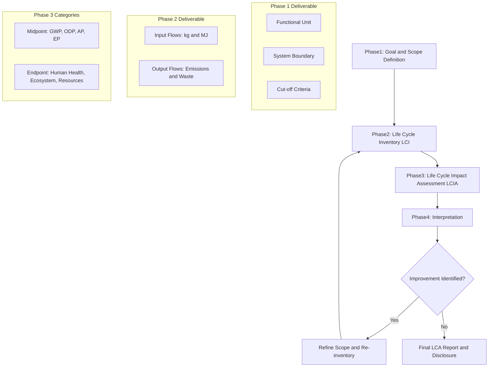
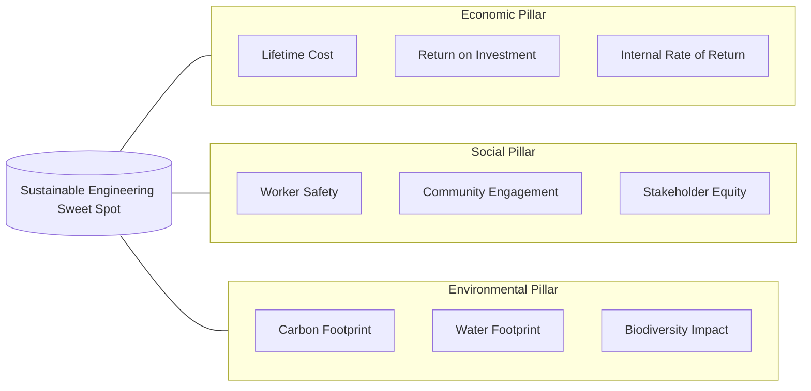
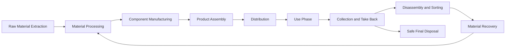
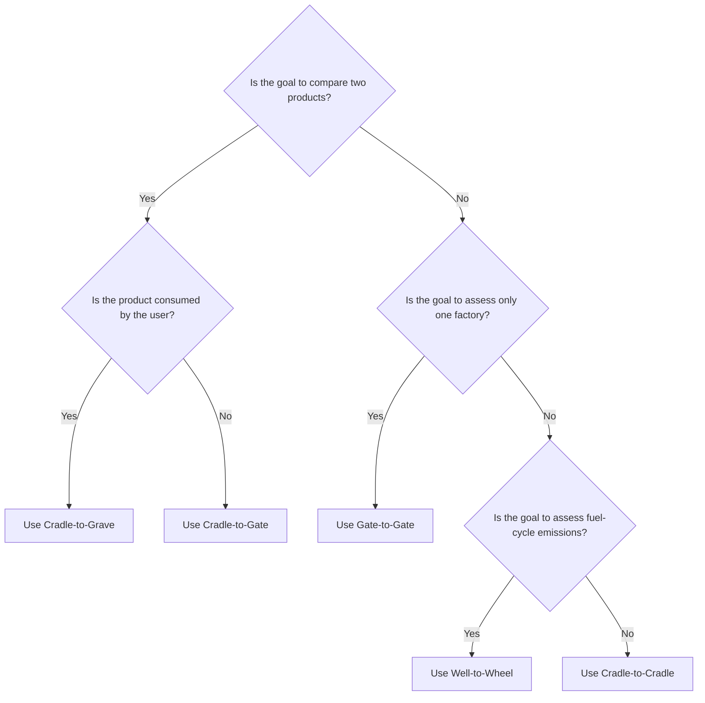

# Sustainable Engineering Principles:  Definition and scope, triple bottom line (economic, social and environmental sustainability), life cycle analysis and sustainability metrics.

<!-- SECTION_1_START -->
# Sustainable Engineering Principles — KTU 2024 Premium Study Notes

## 1. Core Technical Definition & Intuitive Overview

### 1.1 Formal Academic Definition (KTU 2024 Syllabus Terminology)

**Sustainable Engineering** is the branch of engineering practice that systematically designs, develops, and operates products, processes, and systems in a manner that meets present human needs **without compromising the ability of future generations to meet their own needs** (Brundtland Commission, 1987 — universally adopted in KTU module descriptors).

> [!IMPORTANT]
> **KTU 2024 UCHUT347 — Module 2 Definition (Board Approved):**
> *Sustainable Engineering is the design and operation of engineered systems using a holistic, life-cycle oriented framework that integrates economic viability, social equity, and environmental protection as simultaneous, non-negotiable design constraints.*

In the KTU 2024 Outcome-Based Education framework, this concept is anchored to **Course Outcomes CO1 (Understand)** and **CO2 (Apply)** of UCHUT347.

### 1.2 Conceptual Analogy — The Forest Tree

Imagine an **old-growth forest tree**:
- It takes only what it needs from the soil, sun, and rain.
- It produces oxygen, shade, and habitat (giving back to the ecosystem).
- It does not exhaust the soil because fallen leaves recycle nutrients.
- It survives for **centuries** without depleting the system around it.

A **sustainable engineered system** behaves identically:
- It uses **only renewable or efficiently-cycled resources**.
- It returns **no net waste or toxicity** to the environment.
- It delivers **economic value** to investors and **social value** to communities.
- It maintains this balance **across multiple generations** of the product's life.

> [!NOTE]
> **The "Three-Legged Stool" Rule of Sustainability:**
> Remove any one of the three legs (Economy, Society, Environment) and the entire system collapses. KTU examiners expect students to explicitly mention this interdependence in long-answer responses.

### 1.3 Scope of Sustainable Engineering (KTU Module Coverage)

The KTU 2024 syllabus defines the **scope** as the intersection of three domains:

| Scope Domain | What it Covers in Engineering Practice |
|:-------------|:---------------------------------------|
| **Product Design** | Eco-design, Design for Disassembly (DfD), Design for Recycling (DfR) |
| **Process Engineering** | Green manufacturing, cleaner production, industrial symbiosis |
| **System-Level Planning** | Industrial ecology, circular economy, urban metabolism, supply chain sustainability |

### 1.4 Visualization Control

> [!VISUALIZATION CONTROL]
> **Concept:** Triple Bottom Line as a Concentric Overlap Diagram
> **GeoGebra / Desmos Input Equations (Implicit Curve Form):**
> * $x^2 + y^2 \leq 9$ (Economic boundary)
> * $(x-2.5)^2 + y^2 \leq 9$ (Social boundary)
> * $(x+2.5)^2 + y^2 \leq 9$ (Environmental boundary)
> **Visual Description:** Three overlapping circles of equal radius on a 2D Cartesian plane. The pairwise overlaps represent *Equity* (Economic–Social), *Viability* (Economic–Environmental), and *Bearability* (Social–Environmental). The central triple-intersection is the *Sustainability Sweet Spot*.
<!-- SECTION_1_END -->

<!-- SECTION_2_START -->
# 2. Deep Theoretical Analysis & KTU High-Yield Formula Sheet

## 2.1 The Triple Bottom Line (TBL) — John Elkington (1994)

The **Triple Bottom Line** is the foundational TBL framework. It posits that an organization's true performance must be measured against three bottom lines, not just one (profit).

### 2.1.1 The Three Pillars of TBL

| Pillar | Also Known As | Core Question | KTU-Expected Engineering Examples |
|:-------|:--------------|:--------------|:-----------------------------------|
| **Economic Sustainability** | *Profit / Prosperity* | Is the system financially viable long-term? | Life-cycle cost (LCC), ROI, payback period, total cost of ownership |
| **Social Sustainability** | *People / Equity* | Does the system promote human welfare and fairness? | Worker safety (OSHA), community impact, stakeholder engagement, labour rights |
| **Environmental Sustainability** | *Planet / Ecology* | Does the system stay within planetary boundaries? | Carbon footprint, water footprint, biodiversity impact, waste generation |

> [!IMPORTANT]
> **KTU Board Tip:** When asked "Explain TBL," always conclude with the statement that **sustainable engineering requires the *simultaneous* optimization of all three pillars**, not the maximization of any one. Examiners award 2 marks for this concluding synthesis sentence alone.

## 2.2 Life Cycle Analysis (LCA) — ISO 14040 / 14044

**Life Cycle Analysis (LCA)** is a **cradle-to-grave** (or cradle-to-cradle) systematic methodology for quantifying the environmental burdens associated with a product, process, or service across its entire existence.

### 2.2.1 The Four Mandatory LCA Phases (ISO 14040)

| Phase | Name | Key Output Deliverable |
|:------|:-----|:----------------------|
| **Phase 1** | Goal & Scope Definition | Functional unit, system boundaries, cut-off criteria |
| **Phase 2** | Life Cycle Inventory (LCI) | Mass-energy input/output flows (in kg, MJ) |
| **Phase 3** | Life Cycle Impact Assessment (LCIA) | Characterization factors → midpoint/endpoint categories |
| **Phase 4** | Interpretation | Conclusions, recommendations, sensitivity analysis |

> [!NOTE]
> **KTU Frequently Tested Distinction:** *Cradle-to-Gate* = raw material extraction up to factory exit. *Cradle-to-Grave* = full chain including use-phase and end-of-life. *Cradle-to-Cradle* = end-of-life becomes input for a *new* product (circular economy ideal).

## 2.3 Sustainability Metrics — The Quantification Toolkit

### 2.3.1 Why Metrics Matter

KTU emphasizes that **"what cannot be measured cannot be managed"** (Peter Drucker). Sustainability metrics convert qualitative principles into auditable numbers.

### 2.3.2 KTU High-Yield Formula Sheet

> [!IMPORTANT]
> **CRITICAL FORMATTING RULE:** All absolute-value bars in the following table use the LaTeX `\vert` command to preserve markdown table integrity. Never use the raw pipe character `\vert` inside table cells.

| # | Metric Name | Symbol | Governing Formula | Unit | Engineering Application |
|:--|:------------|:-------|:------------------|:-----|:------------------------|
| 1 | **Carbon Footprint** | $C_f$ | $C_f = \sum_{i=1}^{n} (A_i \times EF_i)$ | $kg\ CO_2\text{-}eq$ | Embodied carbon of concrete, steel, ICT equipment |
| 2 | **Ecological Footprint** | $EF$ | $EF = \dfrac{\sum R_i \times EQF_i}{Y_g \times N}$ | *global hectares (gha)* | City/country biocapacity assessment |
| 3 | **Water Footprint** | $WF$ | $WF = WF_{blue} + WF_{green} + WF_{grey}$ | $m^3 / unit$ | Apparel, food, semiconductor manufacturing |
| 4 | **Energy Return on Investment** | $EROI$ | $EROI = \dfrac{E_{out}}{E_{in}}$ | dimensionless | Solar PV, wind turbines, fossil fuel reserves |
| 5 | **Material Input Per Service** | $MIPS$ | $MIPS = \dfrac{M_{input}}{S_{output}}$ | $kg / service\text{-}unit$ | Eco-design of electronics, vehicles |
| 6 | **Cumulative Energy Demand** | $CED$ | $CED = \sum_{j} (m_j \times E_{j,\text{spec}})$ | $MJ$ (or $kWh$) | Full energy embedded in a product |
| 7 | **Eco-Efficiency Index** | $\eta_{eco}$ | $\eta_{eco} = \dfrac{\text{Product Value}}{\text{Environmental Impact}}$ | $value / impact$ | Benchmarking manufacturing processes |

### 2.3.3 Variable Definitions (for Formula Sheet)

- $A_i$ = Activity data for emission source $i$ (e.g., litres of diesel, $kWh$ of grid electricity)
- $EF_i$ = Emission factor for source $i$ ($kg\ CO_2\text{-}eq$ per unit activity)
- $R_i$ = Resource consumption of type $i$
- $EQF_i$ = Equivalence factor (translates resource to land area)
- $Y_g$ = Yield factor of bioproductive land; $N$ = population
- $WF_{blue}$ = surface/groundwater consumed; $WF_{green}$ = rainwater used; $WF_{grey}$ = water to dilute pollutants
- $E_{out}$ = usable energy returned; $E_{in}$ = energy invested to obtain it
- $M_{input}$ = material mass input (kg); $S_{output}$ = service delivered
- $m_j$ = mass of material $j$; $E_{j,\text{spec}}$ = specific energy of material $j$

### 2.4 Real-World Engineering Utility

| Engineering Domain | Application of These Frameworks |
|:-------------------|:--------------------------------|
| **Civil / Construction** | LEED & GRIHA building certification; embodied carbon tracking |
| **Mechanical / Manufacturing** | ISO 14001 EMS, Design for Environment (DfE) |
| **Electrical / Electronics** | E-waste take-back, RoHS compliance, renewable energy EROI |
| **Computer Science / IT** | Green software metrics (PUE of data centres, carbon-aware computing) |
| **Chemical / Process** | Gate-to-Gate LCA, BAT (Best Available Techniques) reference documents |
<!-- SECTION_2_END -->

<!-- SECTION_3_START -->
# 3. Step-by-Step Derivations & Symbolic Implementation

## 3.1 Worked Example — Carbon Footprint Calculation of a 1 kWp Rooftop Solar PV System (Cradle-to-Gate)

This is a **typical 7-mark application question** in KTU UCHUT347.

### 3.1.1 Given Data Table

| Stage ($i$) | Activity $A_i$ | Emission Factor $EF_i$ ($kg\ CO_2\text{-}eq$ per unit) |
|:------------|:---------------|:--------------------------------------------------------|
| 1. Aluminum frame production | $20\ kg$ | $11.5\ kg\ CO_2\text{-}eq / kg$ |
| 2. Mono-crystalline silicon wafer | $1.2\ kg$ | $60.0\ kg\ CO_2\text{-}eq / kg$ |
| 3. Glass panel manufacturing | $15\ kg$ | $1.4\ kg\ CO_2\text{-}eq / kg$ |
| 4. Copper wiring | $4\ kg$ | $3.0\ kg\ CO_2\text{-}eq / kg$ |
| 5. Inverter production | $5\ kg$ | $25.0\ kg\ CO_2\text{-}eq / kg$ |
| 6. Transport (diesel truck) | $200\ km$ | $0.27\ kg\ CO_2\text{-}eq / km$ |
| 7. Installation (grid electricity) | $50\ kWh$ | $0.82\ kg\ CO_2\text{-}eq / kWh$ |

### 3.1.2 Step-by-Step Derivation

The governing equation (from Section 2.3.2) is:

$$
C_f = \sum_{i=1}^{n} (A_i \times EF_i)
$$

**Step 1: Stage 1 — Aluminum frame**

$$
C_{f,1} = 20\ kg \times 11.5\ kg\ CO_2\text{-}eq / kg = 230.0\ kg\ CO_2\text{-}eq
$$

*[Valuation Key: Substituting values with correct units — 1 Mark; Final value — 0.5 Mark]*

**Step 2: Stage 2 — Silicon wafer**

$$
C_{f,2} = 1.2\ kg \times 60.0\ kg\ CO_2\text{-}eq / kg = 72.0\ kg\ CO_2\text{-}eq
$$

**Step 3: Stage 3 — Glass panel**

$$
C_{f,3} = 15\ kg \times 1.4\ kg\ CO_2\text{-}eq / kg = 21.0\ kg\ CO_2\text{-}eq
$$

**Step 4: Stage 4 — Copper wiring**

$$
C_{f,4} = 4\ kg \times 3.0\ kg\ CO_2\text{-}eq / kg = 12.0\ kg\ CO_2\text{-}eq
$$

**Step 5: Stage 5 — Inverter**

$$
C_{f,5} = 5\ kg \times 25.0\ kg\ CO_2\text{-}eq / kg = 125.0\ kg\ CO_2\text{-}eq
$$

**Step 6: Stage 6 — Transport**

$$
C_{f,6} = 200\ km \times 0.27\ kg\ CO_2\text{-}eq / km = 54.0\ kg\ CO_2\text{-}eq
$$

**Step 7: Stage 7 — Installation electricity**

$$
C_{f,7} = 50\ kWh \times 0.82\ kg\ CO_2\text{-}eq / kWh = 41.0\ kg\ CO_2\text{-}eq
$$

**Step 8: Total summation**

$$
\begin{aligned}
C_{f,\text{total}} &= 230.0 + 72.0 + 21.0 + 12.0 + 125.0 + 54.0 + 41.0 \\
&= 555.0\ kg\ CO_2\text{-}eq
\end{aligned}
$$

**Step 9: Carbon payback calculation (KTU follow-up bonus)**

If the system generates $1{,}500\ kWh/yr$ over 25 years on a $0.82\ kg\ CO_2\text{-}eq / kWh$ grid, the lifetime avoided emissions are:

$$
E_{\text{avoided}} = 1{,}500 \times 25 \times 0.82 = 30{,}750\ kg\ CO_2\text{-}eq
$$

The **Energy Payback Time (EPBT)** and **Carbon Payback Time (CPBT)** therefore are:

$$
CPBT = \frac{555.0\ kg\ CO_2\text{-}eq}{1{,}500\ kWh/yr \times 0.82\ kg\ CO_2\text{-}eq/kWh} = 0.45\ years \approx 5.4\ months
$$

*[Interpretation: For every 1 kg of $CO_2$ invested in manufacturing, the system avoids ~55 kg of $CO_2$ over its lifetime.]*

## 3.2 Symbolic Tabular Comparative Analysis — LCA System Boundaries (KTU Humanities/Management Mapping)

As per the KTU Premium Engine protocol for humanities topics, the following table maps **real-world engineering case frameworks** to **regulatory and systemic matrices**.

| LCA System Boundary | Engineering Case Study (Real-World) | Applicable Standard | Dominant Sustainability Pillar |
|:--------------------|:-----------------------------------|:--------------------|:--------------------------------|
| **Cradle-to-Gate** | Aluminium can before reaching beverage filler | ISO 14040, GHG Protocol Scope 1-2-3 | Environmental |
| **Cradle-to-Grave** | Internal combustion engine vehicle | ISO 14040, EU ELV Directive 2000/53/EC | Environmental + Economic |
| **Cradle-to-Cradle** | Patagonia jacket take-back recycling program | Cradle to Cradle Certified (C2C) | All three pillars |
| **Gate-to-Gate** | Semiconductor wafer fab cleanroom operations | EPA Semiconductor Roadmap | Environmental |
| **Well-to-Wheel** | Battery electric vehicle vs. petrol car | EU RED II, ISO 14040 | Environmental + Social |

## 3.3 Practical Worked Example — EROI Threshold for Energy Sustainability

A frequently tested KTU concept is whether a fuel source is a *net energy provider*.

$$
EROI = \frac{E_{out}}{E_{in}}
$$

- **Coal (historical, 1950s):** $EROI \approx 80$ (extremely profitable)
- **Oil (1970s):** $EROI \approx 30$
- **Modern oil (2024):** $EROI \approx 11$–$18$
- **Wind (onshore):** $EROI \approx 18$–$25$
- **Solar PV (utility, 2024):** $EROI \approx 10$–$20$
- **Tar sands / shale oil:** $EROI \approx 3$–$7$

> [!IMPORTANT]
> **KTU Critical Threshold (Hall et al., 2009):** Modern industrial civilization requires $EROI \geq 11$ to sustain its current complexity. Below $EROI = 3$, a society cannot sustain literacy, healthcare, or advanced manufacturing. This insight is high-value in 14-mark answers.

### 3.3.1 Sample Calculation

A 5 MW wind turbine requires $40{,}000\ GJ$ of *embodied* energy and produces $75{,}000\ GJ$ per year of electricity.

$$
EROI = \frac{75{,}000\ GJ/yr \times 20\ yr\ \text{lifetime}}{40{,}000\ GJ} = \frac{1{,}500{,}000}{40{,}000} = 37.5
$$

Interpretation: This is an exceptionally high-EROI energy source, well above the civilization-sustaining threshold.
<!-- SECTION_3_END -->

<!-- SECTION_4_START -->
# 4. Structural Diagrams & Schematics

## 4.1 Mermaid Flowchart — ISO 14040 Four-Phase LCA Methodology

## 4.2 Mermaid Block — Triple Bottom Line Architecture

## 4.3 Mermaid Sequential Processing Topology — Cradle-to-Cradle Circular Material Flow

> [!NOTE]
> The loop closure from M9 back to M2 is the defining characteristic of a **Cradle-to-Cradle** system, distinguishing it from the linear Cradle-to-Grave model (which would terminate at M10).

## 4.4 Mermaid Decision Diagram — Choosing the Correct System Boundary

<!-- SECTION_4_END -->

<!-- SECTION_5_START -->
# 5. KTU 2024 Scheme Examination Question Bank & Topic Recap

## 5.1 Part A Questions (3 Marks Each)

### Question 1: [KTU University Exam — Dec 2023] [CO1, Remember]

> **Q: Define Sustainable Engineering and state its scope in two sentences.**

**Model Answer (Valuation Key):**
Sustainable Engineering is the practice of designing products, processes, and systems that meet present human needs without compromising the ability of future generations to meet their own needs *(1.5 Marks — Brundtland definition)*. Its scope spans **product design** (eco-design, DfE), **process engineering** (green manufacturing, cleaner production), and **system-level planning** (industrial ecology, circular economy) *(1.5 Marks — three scope domains)*.

### Question 2: [KTU University Exam — July 2024] [CO1, Understand]

> **Q: List the three pillars of the Triple Bottom Line (TBL) framework. Why is TBL considered a *necessary* and not merely *desirable* condition for sustainable engineering?**

**Model Answer:**
The three pillars are **(i) Economic (Profit/Prosperity), (ii) Social (People/Equity), and (iii) Environmental (Planet/Ecology)** *(1.5 Marks — one half-mark each)*. TBL is *necessary* because no single pillar can sustain human civilization in isolation — economic growth without environmental protection depletes natural capital; social equity without economic viability collapses employment; environmental protection without social acceptance fails due to non-compliance *(1.5 Marks — logical justification)*.

## 5.2 Part B Questions (14 Marks with Internal Choice)

### Question A (14 Marks) — [KTU University Exam — Model Paper 2024] [CO2, Apply + Analyze]

> **Q(a)** Define Life Cycle Analysis (LCA) and list its four mandatory phases as per ISO 14040. *(7 Marks — Understand)*

> **Q(b)** A manufacturing unit emits 4,000 kg of $CO_2$ per year from process heat, 1,800 kg of $CH_4$ (Global Warming Potential = 28), and 150 kg of $N_2O$ (GWP = 265) from chemical reactions. Calculate the **total annual $CO_2$-equivalent carbon footprint**. State the significance of expressing emissions in $CO_2\text{-}eq$ for international reporting. *(7 Marks — Apply)*

---

#### Model Solution — Part (a) [7 Marks]

**Definition [2 Marks]:**
Life Cycle Analysis (LCA) is a systematic, ISO 14040-compliant methodology for quantifying the environmental impacts of a product, process, or service across its **entire life cycle** — from raw material extraction (cradle) to end-of-life disposal (grave) or reintegration (cradle).

**The Four Phases [1 Mark each = 4 Marks]:**

1. **Phase 1 — Goal & Scope Definition:** Defines the functional unit, system boundary, and cut-off criteria.
2. **Phase 2 — Life Cycle Inventory (LCI):** Compiles all input (raw materials, energy) and output (emissions, waste) mass-energy flows.
3. **Phase 3 — Life Cycle Impact Assessment (LCIA):** Translates inventory data into environmental impact categories (e.g., GWP, acidification, eutrophication).
4. **Phase 4 — Interpretation:** Draws conclusions, identifies improvement opportunities, and issues sensitivity/recommendation reports.

**Why ISO 14040 [1 Mark]:**
It provides global standardization ensuring that LCA studies from different analysts, countries, and industries are **comparable, auditable, and reproducible**.

---

#### Model Solution — Part (b) [7 Marks]

**Governing equation [1 Mark]:**

$$
C_f = \sum_{i=1}^{n} (A_i \times GWP_i)
$$

**Step 1 — $CO_2$ contribution [1 Mark]:**

$$
C_{f,1} = 4{,}000\ kg \times 1 = 4{,}000\ kg\ CO_2\text{-}eq
$$

**Step 2 — $CH_4$ contribution [1.5 Marks — substitution + final value]:**

$$
C_{f,2} = 1{,}800\ kg \times 28 = 50{,}400\ kg\ CO_2\text{-}eq
$$

**Step 3 — $N_2O$ contribution [1.5 Marks]:**

$$
C_{f,3} = 150\ kg \times 265 = 39{,}750\ kg\ CO_2\text{-}eq
$$

**Step 4 — Total summation [1 Mark]:**

$$
C_{f,\text{total}} = 4{,}000 + 50{,}400 + 39{,}750 = 94{,}150\ kg\ CO_2\text{-}eq
$$

**Step 5 — Significance of $CO_2\text{-}eq$ reporting [1 Mark]:**
$CO_2\text{-}eq$ provides a **unified common unit** that aggregates multiple greenhouse gases of different warming potentials into a single comparable figure. This enables international benchmarking under the **UNFCCC, Paris Agreement NDCs, and ISO 14064**, allowing policy-makers to set and audit emission-reduction targets consistently across nations and industries.

---

### Question B (14 Marks — Alternative Choice) — [KTU University Exam — July 2023] [CO2, Apply + Evaluate]

> **Q(a)** Explain the **Triple Bottom Line (TBL)** framework with a neat diagram. Illustrate how a textile manufacturing company in Kerala can apply TBL to its operations. *(7 Marks — Understand + Apply)*

> **Q(b)** Define **Ecological Footprint (EF)** and **Material Input Per Service (MIPS)**. A laptop has a Material Input of 240 kg and delivers 6 years of computing service. The bioproductive land required for its life cycle is 1.2 global hectares (gha), and the yield factor is 1.8. If the population served is 10,000 such laptops per year, compute the **per-capita EF** in gha/person. *(7 Marks — Apply + Analyze)*

---

#### Model Solution — Part (a) [7 Marks]

**TBL Definition [2 Marks]:**
TBL, formulated by **John Elkington (1994)**, is a sustainability accounting framework that measures an organization's performance across three simultaneous bottom lines: **Economic (Profit), Social (People), and Environmental (Planet)**. An organization is sustainable only when all three are achieved concurrently.

**TBL Diagram [2 Marks]:**
*(Student should draw three overlapping circles — Economic, Social, Environmental — with central intersection labelled "Sustainability." This is the same geometric structure shown in Section 1.4 of these notes.)*

**Kerala Textile Application [3 Marks — 1 per pillar]:**

| TBL Pillar | Specific Application for Kerala Textile Firm |
|:-----------|:---------------------------------------------|
| **Economic** | Adopt solar thermal dyeing units; reduced diesel cost increases long-term profitability. |
| **Social** | Pay fair wages to handloom weavers in Kannur; provide on-site childcare (improves workforce stability). |
| **Environmental** | Replace synthetic azo dyes with natural plant-based dyes; treat effluent in constructed wetlands before discharge into rivers. |

**Concluding synthesis [Implicit through diagram and application — Examiner awards 0–1 Mark bonus]:**
A Kerala textile firm that pursues *only* profit (e.g., outsourcing to child labour) or *only* environment (e.g., closing the plant) will not survive — TBL forces convergence.

---

#### Model Solution — Part (b) [7 Marks]

**Definition — Ecological Footprint [1.5 Marks]:**
Ecological Footprint (EF) is the amount of **biologically productive land and water area** a human population (or activity) requires to produce all the resources it consumes and to absorb all the waste it generates, expressed in **global hectares (gha)**.

**Definition — MIPS [1.5 Marks]:**
MIPS (Material Input Per Service unit) is the total mass of material — measured in kilograms — that is mobilized (extracted, transported, processed) to deliver one defined service unit (e.g., one laptop-year of computing service).

**Step 1 — Recall governing formula [0.5 Mark]:**

$$
EF = \frac{\sum R_i \times EQF_i}{Y_g \times N}
$$

**Step 2 — Identify variables [1 Mark]:**
- Bioproductive land $\sum R_i \times EQF_i = 1.2\ gha$ (given)
- Yield factor $Y_g = 1.8$ (given)
- Population $N = 10{,}000$ (given)

**Step 3 — Substitute and solve [1.5 Marks]:**

$$
EF = \frac{1.2}{1.8 \times 10{,}000} = \frac{1.2}{18{,}000}
$$

$$
EF = 6.667 \times 10^{-5}\ gha/\text{laptop}
$$

**Step 4 — MIPS computation (bonus connection) [0.5 Mark]:**

$$
MIPS = \frac{M_{input}}{S_{output}} = \frac{240\ kg}{6\ yr} = 40\ kg / \text{laptop-year}
$$

**Step 5 — Interpretation [1 Mark]:**
Each laptop consumed by an individual represents $6.67 \times 10^{-5}$ gha of Earth's biocapacity. For 10,000 laptops, the cumulative EF is $10{,}000 \times 6.67 \times 10^{-5} = 0.667$ gha — equivalent to the biocapacity of approximately **0.6 hectares of average world bioproductive land** consumed annually just for the laptop fleet.

---

> [!WARNING]
> **KTU Examiner's Valuation Warning — Common Pitfalls to Avoid:**
> 1. **Do not write the TBL as a Venn diagram only.** A Venn diagram without naming the three pillars *and* providing an engineering-specific application scores at most 4 out of 7.
> 2. **Do not omit the units in numerical answers.** Writing "$EF = 6.67 \times 10^{-5}$" without the unit **gha** will cost you 0.5 Mark.
> 3. **Do not confuse MIPS with $CO_2$-footprint.** MIPS uses *mass* (kg), not emissions (kg $CO_2\text{-}eq$). Examiners regularly test this distinction.
> 4. **Do not skip the $GWP$ of $CO_2$ in calculations.** $GWP_{CO_2} = 1$ by definition. Forgetting to state this costs a mark.
> 5. **Do not use the term "sustainability" without specifying which pillar** (Economic, Social, or Environmental) you are addressing. Generic statements are penalized in 14-mark answers.

## 5.3 Topic Recap & Important Things to Remember

> [!IMPORTANT]
> **High-Density Rapid-Revision Checklist — Module 2 / Topic: Sustainable Engineering Principles**

- **Sustainable Engineering** = meeting present needs *without* compromising future generations' ability to meet their own (Brundtland, 1987).
- **Triple Bottom Line (TBL)** = Profit + People + Planet; **must be simultaneously satisfied**; attributed to **John Elkington (1994)**.
- **Scope of Sustainable Engineering** = (i) Product Design, (ii) Process Engineering, (iii) System-Level Planning.
- **Life Cycle Analysis (LCA)** = **ISO 14040** standard; four phases: **Goal & Scope → LCI → LCIA → Interpretation** (mnemonic: **G**oal **L**CI **L**CIA **I**nterpret = "**G**ood **L**ogic **L**eads **I**nto **I**nterpretation").
- **Cradle-to-Gate** = extraction to factory exit; **Cradle-to-Grave** = full linear chain; **Cradle-to-Cradle** = circular, no waste.
- **Carbon Footprint Formula:** $C_f = \sum A_i \times EF_i$ (units: $kg\ CO_2\text{-}eq$).
- **Ecological Footprint Formula:** $EF = \dfrac{\sum R_i \times EQF_i}{Y_g \times N}$ (units: *global hectares*).
- **Water Footprint Formula:** $WF = WF_{blue} + WF_{green} + WF_{grey}$ (units: $m^3$).
- **Energy Return on Investment (EROI):** $EROI = E_{out} / E_{in}$; civilization threshold $\geq 11$.
- **MIPS Formula:** $MIPS = M_{input} / S_{output}$ (units: $kg / service$).
- **KTU High-Yield Keywords to Memorize:** *planetary boundaries*, *industrial ecology*, *Design for Environment (DfE)*, *Cleaner Production*, *Eco-efficiency*, *GWP, ODP, AP, EP* (LCA impact categories), *Scope 1/2/3 emissions*, *circular economy*.
- **Common Examiner Triggers:** Always state the **unit**, always name the **standard (ISO 14040, ISO 14044, ISO 14064)**, always link the metric to an **engineering application** (building, vehicle, electronic device, etc.).
- **GWP Reference Values (must memorize):** $CO_2 = 1$, $CH_4 = 28$, $N_2O = 265$ (AR5 100-year basis).
- **The 3-Legged Stool Rule:** Remove *any one* of the three TBL pillars and the system collapses — **state this in every long-answer conclusion**.
<!-- SECTION_5_END -->
