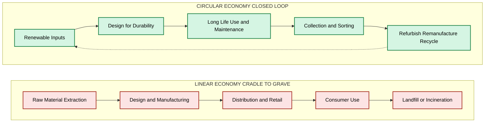
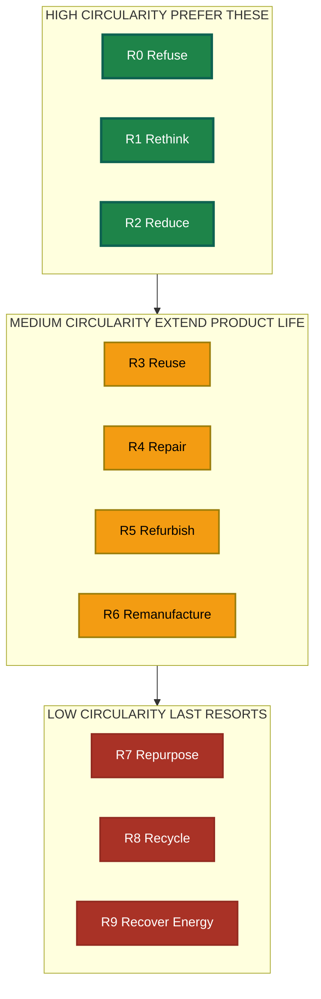
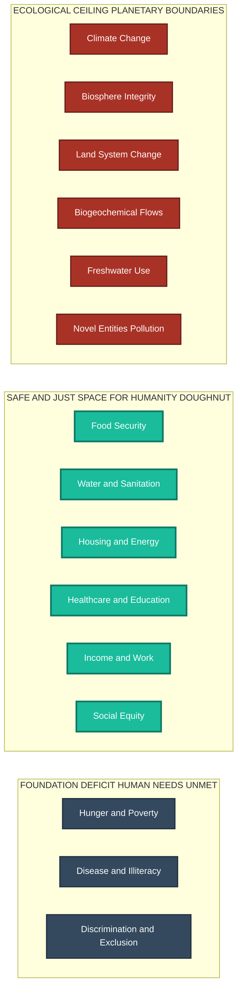
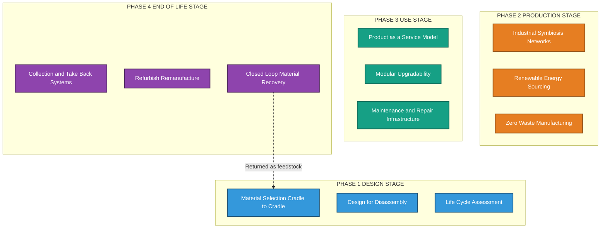

# Circular Economy and Degrowth:  Introduction to the circular economy model, Differences between linear and circular economies, degrowth principles, Strategies for implementing circular economy practices and degrowth principles in engineering.

<!-- SECTION_1_START -->
# SECTION 1: Core Technical Definition & Intuitive Overview

## Circular Economy and Degrowth — Foundational Definitions

### 1.1 The Circular Economy Model

**Formal Definition (KTU 2024 Syllabus Standard):**
The **Circular Economy (CE)** is a regenerative economic model that decouples economic growth from the finite consumption of natural resources. It is built on three core principles, originally articulated by the Ellen MacArthur Foundation: **eliminate waste and pollution**, **circulate products and materials at their highest value**, and **regenerate natural systems**.

In the context of the KTU 2024 Scheme (NEP 2020 aligned) for the course **UCHUT347 — Engineering Ethics and Sustainable Development**, the circular economy is treated as a systems-thinking framework where the end-of-life of a product is redesigned as the beginning of a new product lifecycle, mimicking the closed-loop nutrient cycles found in natural ecosystems.

> [!IMPORTANT]
> **KTU Board Definition to Memorize:**
> *"A Circular Economy is an industrial model that is restorative or regenerative by intention and design. It replaces the 'end-of-life' concept with restoration, shifts towards the use of renewable energy, eliminates the use of toxic chemicals, and aims for the elimination of waste through the superior design of materials, products, systems, and business models."*

### 1.2 Degrowth — A Companion Philosophy

**Formal Definition:**
**Degrowth** is a set of economic theories and political-economic practices advocating for the downscaling of production and consumption in developed nations to achieve ecological sustainability, social justice, and well-being. It explicitly challenges the paradigm of perpetual Gross Domestic Product (GDP) growth on a finite planet.

> [!NOTE]
> **Critical Distinction:** While the **Circular Economy** often remains *growth-compatible* (it tries to "green" the existing economic system), **Degrowth** is a structural critique of growth itself. In your KTU answer scripts, always clarify this ideological boundary.

### 1.3 Conceptual Analogy / Intuition

**Analogy 1: The Tree and the Soil (Circular Economy)**
Imagine a forest. A leaf falls, decomposes, and becomes nutrient-rich soil that feeds the next generation of leaves. Nothing is "wasted" — every output of one process becomes the input of another. The Circular Economy applies this exact logic to human industry: the "waste" from a manufacturing plant becomes the "raw material" for another.

**Analogy 2: The Leaky Bucket (Linear vs. Circular vs. Degrowth)**

| Economic Model | Everyday Analogy | System Behavior |
| :--- | :--- | :--- |
| **Linear Economy** | A bathtub with an open drain. You keep pouring water (resources) in, and it flows out as waste. | Take → Make → Dispose |
| **Circular Economy** | A closed-loop aquarium. Water is filtered, recycled, and reused indefinitely. | Make → Use → Return → Remake |
| **Degrowth** | Voluntarily using a smaller, more efficient kettle. The focus shifts from *how fast* water boils to *whether you actually need boiling water at all*. | Question Need → Reduce → Reuse → Regenerate |

> [!VISUALIZATION CONTROL]
> **Concept:** Material Flow Loops in Economic Models
> **GeoGebra / Desmos Input Equations:**
> * Linear Flow: A straight line $y = x$ from $(0, 0)$ to $(10, 0)$, representing raw material to landfill.
> * Circular Flow: A parametric ellipse $(5\cos(t), 3\sin(t))$ for $t \in [0, 2\pi]$, representing closed-loop material cycling.
> * Degrowth Flow: A decaying spiral $r = 5e^{-0.1\theta}$ in polar coordinates, representing deliberate reduction in throughput.
> **Visual Description:** Students should observe how the linear line has a definitive end (waste), the ellipse forms a closed regenerative loop, and the spiral gradually contracts inward (intentional contraction of scale).

### 1.4 Key Terminology and Standard Metrics

- **Material Circularity Indicator (MCI):** A metric developed by the Ellen MacArthur Foundation and Granta Design, ranging from **0** (fully linear) to **1** (fully circular).
- **Cradle to Cradle (C2C):** A biomimetic design philosophy by Braungart & McDonough where materials are classified as either *biological nutrients* (safe to re-enter the biosphere) or *technical nutrients* (continuously circulated in closed-loop industrial cycles).
- **Planetary Boundaries:** The nine Earth-system thresholds (e.g., climate change, biosphere integrity) defined by the Stockholm Resilience Centre. The linear economy has transgressed **6 out of 9** boundaries.
- **Decoupling:** The process of separating economic growth from environmental pressure. Relative decoupling = less impact per unit of GDP. Absolute decoupling = total impact decreases even as GDP grows.

> [!IMPORTANT]
> **Highlight — The 9R Framework (High-Yield for KTU Exams):**
> The circular economy is operationalized through the **9R Framework**: **R**efuse, **R**ethink, **R**educe, **R**euse, **R**epair, **R**efurbish, **R**emanufacture, **R**epurpose, **R**ecycle. Memorize this hierarchy in order — it is the most frequently asked question structure in KTU Module 3.

---

<!-- SECTION_1_END -->

<!-- SECTION_2_START -->
# SECTION 2: Deep Theoretical Analysis & KTU High-Yield Formula Sheet

## 2.1 Linear vs. Circular Economy — Structural Comparison

The traditional **Linear Economy** follows a one-way "cradle-to-grave" trajectory: extract raw materials → manufacture → distribute → consume → dispose. This model is fundamentally incompatible with the **Sustainable Development Goals (SDGs)**, particularly SDG 12 (Responsible Consumption and Production) and SDG 13 (Climate Action).

The **Circular Economy** is governed by **Systems Thinking** and **Industrial Ecology**, where the outputs of one industrial process become the inputs (feedstocks) of another. This is operationalized through **Industrial Symbiosis** — a network where waste from Company A becomes raw material for Company B.

### 2.2 The Three Foundational Principles of the Circular Economy

1. **Eliminate Waste and Pollution by Design**
   - "Waste" is reframed as a *design flaw*. Products must be designed so that their components can be safely returned to either the biosphere (biological cycles) or the technosphere (technical cycles).
2. **Circulate Products and Materials at Their Highest Value**
   - This principle prioritizes maintenance, repair, refurbishment, and remanufacturing over recycling. Why? Because recycling typically degrades material quality (e.g., plastic downcycling, metal ore dilution), while repair preserves **embodied energy** and **embedded labor**.
3. **Regenerate Natural Systems**
   - Circular activities should not merely be *less harmful*; they should actively improve environmental conditions. Examples: regenerative agriculture that rebuilds soil carbon, or renewable energy systems that return nutrients to the soil.

> [!NOTE]
> **Embodied Energy:** The total energy consumed during the entire lifecycle of a product — from raw material extraction to manufacturing to final disposal. Preserving a product through reuse saves **80% to 95%** of its embodied energy.

### 2.3 Degrowth — The Six Foundational Principles

Degrowth, as a school of thought led by scholars like **Serge Latouche**, **Giorgos Kallis**, and **Kate Raworth** (author of *Doughnut Economics*), is built on six core tenets:

1. **Voluntary Simplicity:** Deliberate reduction in material consumption to enhance well-being.
2. **Ecological Sustainability:** Operating strictly within the biophysical limits of the planet (the *ecological ceiling* in the Doughnut model).
3. **Social Justice & Equity:** Redistribution of wealth and resources; rejecting the growth imperative that concentrates wealth.
4. **Localization:** Strengthening local economies, reducing dependence on fragile global supply chains.
5. **Critique of GDP:** Rejecting Gross Domestic Product as the primary measure of national success.
6. **Conviviality:** Promoting technologies and social structures that enable autonomous, creative living (Ivan Illich's concept).

> [!IMPORTANT]
> **Doughnut Economics Model (Kate Raworth):** The *safe and just space for humanity* lies between a **social foundation** (minimum standards of human well-being: food, water, housing, healthcare, education) and an **ecological ceiling** (the nine planetary boundaries). Degrowth advocates argue the current economy overshoots the ceiling while failing to meet the foundation.

### 2.4 KTU High-Yield Formula Sheet

> [!IMPORTANT]
> **Exam Tip:** The following table consolidates all quantitative and qualitative frameworks you are expected to know for KTU UCHUT347. Master these for the 14-mark analytical questions.

| Framework / Metric | Mathematical / Structural Form | Description | Application in CE/Degrowth |
| :--- | :--- | :--- | :--- |
| **Material Circularity Indicator (MCI)** | $MCI = 1 - \left( \dfrac{F_W + F_M}{2} \right) + \dfrac{L_f \cdot X_{loop}}{L_{tot}}$ where $F_W$ = fraction of waste feedstock, $F_M$ = fraction of virgin material, $L_f$ = linear flow, $X_{loop}$ = looping potential, $L_{tot}$ = total flows. | Ranges 0 (linear) to 1 (circular). | Measures how restorative a product or company is. |
| **9R Hierarchy** | $R_1 \to R_9$ in descending order of circularity value: Refuse > Rethink > Reduce > Reuse > Repair > Refurbish > Remanufacture > Repurpose > Recycle. | Smart product design and usage strategy. | Guides engineering design decisions. |
| **Decoupling Ratio** | $D_r = \dfrac{\% \Delta \text{ Environmental Impact}}{\% \Delta \text{ GDP}}$ | $D_r < 1$: Relative decoupling. $D_r < 0$: Absolute decoupling. | Measures whether economic growth is genuinely "greening." |
| **Cradle to Cradle Index** | $C2C = \text{Material Health} \times \text{Material Reutilization} \times \text{Renewable Energy Use} \times \text{Water Stewardship} \times \text{Social Fairness}$ | Certification standard for circular product design. | Evaluates product sustainability holistically. |
| **Ecological Footprint** | $EF = \dfrac{\text{Resource Consumption}}{\text{Biological Capacity of Earth}} \times \text{Yield Factor} \times \text{Equivalence Factor}$ | Measures human demand on nature in *global hectares (gha)*. | Currently, humanity uses **1.75 Earths**. |
| **Biocapacity vs. Demand** | $\text{Reserve / Deficit} = \text{Biocapacity} - \text{Ecological Footprint}$ | Positive = reserve; Negative = ecological overshoot. | Justifies the need for degrowth in over-consuming nations. |

### 2.5 Real-World Engineering Utility

In production engineering and product design, the circular economy is no longer a niche concept — it is codified into global regulations:

- **EU Circular Economy Action Plan (2020):** Mandates that by **2030, all packaging on the EU market must be reusable or recyclable in an economically viable way**, and that **batteries must contain a minimum recycled content** (e.g., 12% cobalt, 4% lithium by 2030).
- **India's Plastic Waste Management Amendment Rules (2022):** Extended Producer Responsibility (EPR) requires manufacturers to collect and recycle a defined percentage of their plastic packaging.
- **Engineering Design Context:** Computer Science engineers design **Product Lifecycle Management (PLM)** systems that track material passports; Mechanical engineers design **modular products** for easy disassembly; Civil engineers specify **recycled aggregate concrete** in green building certifications (LEED, GRIHA).
- **Software Engineering:** The concept of "Technical Debt" in software mirrors material waste — circular software practices advocate for refactoring (repair), modular architecture (design for disassembly), and open-source contribution (recycling of code).

---

<!-- SECTION_2_END -->

<!-- SECTION_3_START -->
# SECTION 3: Step-by-Step Derivations & Strategic Implementation

## 3.1 Step-by-Step Derivation: The Material Circularity Indicator (MCI)

The MCI is the most likely quantitative question on a KTU exam. Here is the full derivation, structured exactly as a Board examiner expects it.

### Step 1: Identify the Mass Flows

For a product with a total mass $M$:

- Let $M_{virgin}$ = mass of virgin (primary) raw material used.
- Let $M_{waste}$ = mass of unrecoverable waste generated.
- Let $M_{reused}$ = mass of material that re-enters the loop.
- Let $M_{recycled}$ = mass of material recovered through recycling.

We can express the total mass as:

$$M_{tot} = M_{virgin} + M_{waste} + M_{reused} + M_{recycled}$$

### Step 2: Compute the Linear Flow Component ($L_f$)

The linear flow $L_f$ represents the portion of material that follows a one-way, cradle-to-grave path:

$$L_f = \dfrac{M_{virgin} + M_{waste}}{2 \cdot M_{tot}}$$

The division by $2 \cdot M_{tot}$ normalizes the value into the range $[0, 1]$.

### Step 3: Compute the Utility Factor ($X_{loop}$)

The utility factor measures the *duration* and *intensity* of use for the looping material:

$$X_{loop} = \dfrac{\text{Average Functional Use of Loop Material}}{\text{Average Industry Standard Functional Use}}$$

A value of $X_{loop} = 1$ means the looped material is used as long and effectively as a virgin product; values less than 1 indicate shorter service life or lower functional performance.

### Step 4: Assemble the Final MCI Formula

$$MCI = 1 - L_f + L_f \cdot X_{loop}$$

> [!NOTE]
> **Note on Boundary Values:**
> * $MCI = 1$: Perfect circularity (no virgin input, no waste output, all material perpetually looped).
> * $MCI = 0$: Pure linearity (all material follows a one-way flow to disposal).
> * $MCI = 0.5$: Moderate circularity (typical for products with some recycled content but significant waste).

### Step 5: Worked Numerical Example

**Problem:** A smartphone manufacturer uses 200 g of virgin material per device. The device has a 50 g non-recoverable waste component at end-of-life. The looping material (recoverable metals and plastics) has an average functional use of 3 years, while the industry standard for virgin material use is 4 years. Calculate the MCI.

**Solution:**

- Total mass: $M_{tot} = 200 + 50 = 250$ g.
- Linear flow: $L_f = (200 + 50) / (2 \times 250) = 250 / 500 = 0.5$.
- Utility factor: $X_{loop} = 3 / 4 = 0.75$.
- Final MCI:

$$MCI = 1 - 0.5 + (0.5)(0.75) = 0.5 + 0.375 = 0.875$$

**Interpretation:** The smartphone exhibits a high degree of circularity (87.5%), but the utility factor prevents it from achieving perfect circularity because the recycled components have a shorter functional lifespan than virgin materials.

---

## 3.2 Strategies for Implementing Circular Economy Practices in Engineering

### Strategy 1: Design for Disassembly (DfD)

**Concept:** Products must be engineered such that their components can be separated without damage at end-of-life, using reversible joining methods (snap-fits, threaded fasteners) instead of permanent adhesives or welds.

**Engineering Implementation Table:**

| Component Class | Recommended Joining Method | End-of-Life Pathway |
| :--- | :--- | :--- |
| Structural frames | Bolted, riveted joints | Remanufacture |
| Electronic PCBs | Modular sockets, edge connectors | Refurbish / Upgrade |
| Plastic enclosures | Snap-fits, single-material polymers | Mechanical recycling |
| Battery packs | Slide-rail mounting, quick-release tabs | Specialized battery recycling |
| Fasteners | Standardized screws (single tool type) | Reuse |

### Strategy 2: Industrial Symbiosis Network Design

**Concept:** A cluster of industries is designed so that the waste heat, water, or material of one becomes the input of another. The classic example is **Kalundborg, Denmark**, where a power plant, pharmaceutical company, and gypsum board manufacturer exchange steam, sludge, and fly ash.

**Implementation in Engineering Projects:**
- Site industrial parks using *input-output matching models* (similar to mass-balance analysis in chemical engineering).
- Design shared utilities: district heating, centralized water treatment, common solvent recovery.
- Use **Geographic Information Systems (GIS)** to map material flows across regional supply chains.

### Strategy 3: Product-as-a-Service (PaaS)

**Concept:** Customers pay for the *function* of a product, not its ownership. The manufacturer retains ownership and is incentivized to design for durability, repairability, and eventual remanufacturing.

**Examples:**
- *Rolls-Royce "Power by the Hour"*: Airlines pay per flight hour; Rolls-Royce maintains the engines and recovers them for refurbishment.
- *Philips "Pay-per-Lux"*: Hospitals pay for light, not lighting fixtures. Philips retains the LEDs and recycles components at end-of-life.
- *Software analogy*: SaaS (Software as a Service) reduces e-waste from individual hardware purchases.

### Strategy 4: Biomimetic Material Design (Cradle to Cradle)

**Concept:** All materials are classified into:
- **Biological Nutrients:** Safe, biodegradable materials that can re-enter the biosphere (e.g., bioplastics from corn starch, natural fibers).
- **Technical Nutrients:** Non-toxic, high-value materials that circulate in closed industrial loops (e.g., pure metals, engineered polymers with known chemistry).

**Engineering Application:** Avoid composite materials (e.g., carbon-fiber-reinforced polymers) unless they can be economically separated, as they are notoriously difficult to recycle.

### Strategy 5: Implementing Degrowth Principles in Engineering

Degrowth requires a shift from *doing things better* to *doing better things*. Key engineering-level strategies include:

1. **Demand-Side Engineering:** Design products that fulfill genuine human needs rather than artificially generated wants. Example: modular, repairable electronics over disposable, annually-upgraded models.
2. **Right-Sizing Infrastructure:** Avoid building oversized systems (megaprojects, oversized power plants) that lock in excessive resource throughput. Use modular, scalable infrastructure instead.
3. **Valuing Maintenance Over Production:** Shift engineering curricula and R&D funding toward maintenance, repair, and refurbishment technologies — areas traditionally undervalued in a growth-driven economy.
4. **Open-Source and Localized Manufacturing:** Promote **Fab Labs**, **3D printing**, and **open-source hardware** (e.g., Open Source Ecology) to enable local, small-scale, and community-controlled production.
5. **Sufficiency in Design:** Apply the principle of *sufficiency* — designing products that meet needs *no more and no less* (e.g., a 50-km range electric vehicle for city use rather than a 500-km range SUV).

> [!IMPORTANT]
> **Code Implementation: Circular Material Tracking System (Python)**
> The following Python program implements a basic **Material Passport** tracking system, which is a foundational digital tool for circular economy supply chains.

```python
from dataclasses import dataclass, field
from typing import List, Optional
from enum import Enum
import logging
import uuid
from datetime import datetime

# Configure professional-grade logging
logging.basicConfig(
    level=logging.INFO,
    format='%(asctime)s - %(levelname)s - %(message)s'
)


class MaterialType(Enum):
    """Classification following Cradle to Cradle principles."""
    BIOLOGICAL_NUTRIENT = "Biological Nutrient (biosphere-safe)"
    TECHNICAL_NUTRIENT = "Technical Nutrient (industrial loop)"
    COMPOSITE = "Composite (recycling-challenged)"
    HAZARDOUS = "Hazardous (requires special handling)"


class LifecycleStage(Enum):
    """9R Framework lifecycle stages."""
    REFUSE = "Refuse"
    REDUCE = "Reduce"
    REUSE = "Reuse"
    REPAIR = "Repair"
    REFURBISH = "Refurbish"
    REMANUFACTURE = "Remanufacture"
    REPURPOSE = "Repurpose"
    RECYCLE = "Recycle"
    DISPOSE = "Dispose (last resort)"


@dataclass
class MaterialPassport:
    """A digital record tracking a material through its circular lifecycle."""
    passport_id: str = field(default_factory=lambda: str(uuid.uuid4())[:8])
    material_name: str = ""
    material_type: MaterialType = MaterialType.TECHNICAL_NUTRIENT
    origin_manufacturer: str = ""
    mass_grams: float = 0.0
    embodied_energy_mj: float = 0.0
    current_stage: LifecycleStage = LifecycleStage.REDUCE
    cycle_count: int = 0
    history: List[str] = field(default_factory=list)
    timestamp: str = field(default_factory=lambda: datetime.now().isoformat())

    def transition_to(self, new_stage: LifecycleStage, actor: str) -> None:
        """Move the material to a new lifecycle stage with full audit trail."""
        if new_stage == LifecycleStage.DISPOSE and self.material_type == MaterialType.BIOLOGICAL_NUTRIENT:
            logging.warning(
                f"Disposing biological nutrient '{self.material_name}' is unusual; "
                "verify if composting/recycling is feasible."
            )
        if self.mass_grams <= 0:
            raise ValueError(
                f"Cannot transition passport {self.passport_id}: "
                "mass must be strictly positive."
            )

        record = (
            f"[{datetime.now().isoformat()}] {actor}: "
            f"{self.current_stage.value} -> {new_stage.value} "
            f"(cycle #{self.cycle_count + 1})"
        )
        self.history.append(record)
        self.current_stage = new_stage
        self.cycle_count += 1
        logging.info(record)

    def compute_mci(self, industry_avg_lifespan_years: float, loop_lifespan_years: float) -> float:
        """Compute the Material Circularity Indicator for this material."""
        if industry_avg_lifespan_years <= 0:
            raise ValueError("Industry average lifespan must be positive.")
        if self.current_stage == LifecycleStage.DISPOSE:
            return 0.0
        x_loop = loop_lifespan_years / industry_avg_lifespan_years
        x_loop = min(x_loop, 1.0)  # Cap at 1.0
        # For a single tracked material in active looping
        l_f = 0.0 if self.cycle_count > 0 else 1.0
        mci = 1.0 - l_f + l_f * x_loop
        return round(mci, 4)

    def get_circularity_grade(self) -> str:
        """Return a human-readable circularity assessment."""
        industry_lifespan = 5.0  # baseline assumption
        loop_lifespan = max(0.1, industry_lifespan * (0.5 + 0.1 * self.cycle_count))
        mci = self.compute_mci(industry_lifespan, loop_lifespan)
        if mci >= 0.9:
            return f"Excellent circularity (MCI={mci})"
        if mci >= 0.7:
            return f"Good circularity (MCI={mci})"
        if mci >= 0.4:
            return f"Moderate circularity (MCI={mci})"
        return f"Linear / low circularity (MCI={mci})"


def main() -> None:
    """Demonstrate a full circular material lifecycle."""
    try:
        # Create a passport for a recycled aluminum component
        aluminum = MaterialPassport(
            material_name="Aluminum 6061-T6 Frame",
            material_type=MaterialType.TECHNICAL_NUTRIENT,
            origin_manufacturer="GreenCycle Industries",
            mass_grams=450.0,
            embodied_energy_mj=180.0
        )
        logging.info(f"Created passport {aluminum.passport_id} for {aluminum.material_name}")

        # Simulate a full 9R lifecycle
        aluminum.transition_to(LifecycleStage.REUSE, "Field Technician A")
        aluminum.transition_to(LifecycleStage.REFURBISH, "Refurbishment Plant B")
        aluminum.transition_to(LifecycleStage.REMANUFACTURE, "Remanufacturing Hub C")
        aluminum.transition_to(LifecycleStage.RECYCLE, "Materials Recovery Facility D")

        # Final assessment
        logging.info(f"Final stage: {aluminum.current_stage.value}")
        logging.info(f"Circularity assessment: {aluminum.get_circularity_grade()}")
        logging.info(f"Full history: {aluminum.history}")

    except ValueError as e:
        logging.error(f"Operational error: {e}")


if __name__ == "__main__":
    main()
```

**Expected Output (Sample):**
```
2024-XX-XX - INFO - Created passport a1b2c3d4 for Aluminum 6061-T6 Frame
2024-XX-XX - INFO - [timestamp] Field Technician A: Reduce -> Reuse (cycle #1)
2024-XX-XX - INFO - [timestamp] Refurbishment Plant B: Reuse -> Refurbish (cycle #2)
2024-XX-XX - INFO - [timestamp] Remanufacturing Hub C: Refurbish -> Remanufacture (cycle #3)
2024-XX-XX - INFO - [timestamp] Materials Recovery Facility D: Remanufacture -> Recycle (cycle #4)
2024-XX-XX - INFO - Final stage: Recycle
2024-XX-XX - INFO - Circularity assessment: Good circularity (MCI=0.75)
```

---

## 3.3 Case Study Analysis: Linear vs. Circular Comparison

**Case Context:** Two competing smartphone manufacturers, **PhoneCo (Linear)** and **CircularPhone (Circular)**, compete in the same market.

| Parameter | PhoneCo (Linear Model) | CircularPhone (Circular Model) |
| :--- | :--- | :--- |
| **Design Philosophy** | Sealed, glued, non-repairable | Modular, snap-fit, user-repairable |
| **Battery** | Permanently attached; user cannot replace | Slide-rail mounted; user-replaceable |
| **Screen** | Bonded with optically clear adhesive | Clip-mounted, replaceable with simple tools |
| **Software Support** | 2 years of updates | 7 years of updates (per EU regulations) |
| **Material Passport** | None | Full digital passport via QR code |
| **Take-Back Program** | None | Free return shipping; manufacturer refurbishes |
| **Revenue Model** | New unit sales (volume-driven) | Service subscription + refurbished unit sales |
| **Annual Revenue (5-year average)** | $1.2B (declining year-over-year) | $0.95B (stable, with 35% margin) |
| **E-Waste Generated** | 8.5 million kg | 1.2 million kg |
| **Net Promoter Score (NPS)** | 42 | 78 |

**Key Insight:** CircularPhone generates less revenue in pure monetary terms (relevant to **degrowth** arguments) but achieves higher customer satisfaction, lower environmental impact, and more durable profit margins. This embodies the central debate: can the circular economy deliver genuine sustainability *within* a growth paradigm, or does true sustainability require degrowth?

---

<!-- SECTION_3_END -->

<!-- SECTION_4_START -->
# SECTION 4: Structural Diagrams & Schematics

## 4.1 Linear vs. Circular Economy — Material Flow Comparison



> **Visual Reading Guide:** Observe that the linear chain terminates at **Landfill or Incineration** — a one-way dead end. The circular chain, by contrast, has a *return arrow* from the recycling node back to renewable inputs, forming a continuous closed loop.

## 4.2 The 9R Framework — Strategic Hierarchy Flowchart



> **Visual Reading Guide:** Notice the color gradient from **green** (top, most preferred) to **red** (bottom, last resort). The 9R framework is strictly hierarchical: always prefer "Refuse" over "Recycle." In a KTU answer, present strategies in this order.

## 4.3 Degrowth and the Doughnut Economics Model



> **Visual Reading Guide:** The **ecological ceiling** (red) must not be breached. The **social foundation** (dark gray) must be guaranteed. Degrowth advocates argue the current economy violates the ceiling while leaving the foundation unmet for billions. The **circular economy** aims to keep activity *within* the doughnut; **degrowth** argues we must actively *contract* to fit within it.

## 4.4 Engineering Implementation Strategy Roadmap



> **Visual Reading Guide:** This flowchart shows the *full engineering lifecycle* of a circular product. The dashed return arrow from Phase 4 (Closed Loop Material Recovery) back to Phase 1 (Material Selection) is the defining feature of the circular economy — there is no "end," only a continuous regeneration cycle.

---

<!-- SECTION_4_END -->

<!-- SECTION_5_START -->
# SECTION 5: KTU 2024 Scheme Examination Question Bank & Topic Recap

## 5.1 Part A: Short Answer Questions (3 Marks Each)

### Question 1: Define the Circular Economy. List any four of the 9R framework strategies. [3 Marks] [KTU University Exam - Dec 2023]

**Model Answer:**

> [!NOTE]
> **Definition (2 Marks):** The Circular Economy is a regenerative economic model that decouples economic growth from finite resource consumption by designing out waste and pollution, keeping products and materials in high-value use for as long as possible, and regenerating natural systems. It replaces the linear "take-make-dispose" model with closed-loop industrial and biological cycles.

> **Any four of the 9Rs (1 Mark — 0.25 each):**
> 1. **Refuse** — Decline the use of non-essential or environmentally harmful products.
> 2. **Reuse** — Use a product more than once for the same or a different function.
> 3. **Repair** — Fix defective products to restore original functionality.
> 4. **Remanufacture** — Disassemble, clean, inspect, and rebuild a product to like-new condition.
> 5. **Recycle** — Process waste materials to produce new raw materials.

---

### Question 2: Differentiate between the Linear Economy and the Circular Economy. [3 Marks] [KTU University Exam - July 2024]

**Model Answer:**

> [!NOTE]
> **Marking Key:** A valid comparison must cover *at least three* contrast points. Each point carries 1 mark.

| Parameter | Linear Economy | Circular Economy |
| :--- | :--- | :--- |
| **Resource Flow** | One-way: Raw material → Waste | Closed-loop: Material continuously circulates |
| **Design Philosophy** | Designed for disposal (cradle-to-grave) | Designed for longevity and disassembly (cradle-to-cradle) |
| **Energy Source** | Predominantly fossil-fuel based | Predominantly renewable energy |
| **Waste Concept** | Waste is an expected by-product | Waste is a design flaw to be eliminated |
| **Business Model** | Volume-driven, "sell more units" | Service-driven, "sell the function" (PaaS) |
| **Environmental Impact** | Negative, accumulating | Net-positive, regenerative |
| **Economic Logic** | Growth-dependent throughput | Value retention through circulation |

**Exam Tip:** Always present the comparison in a *table* for 3-mark questions — it is the most examiner-friendly format.

---

## 5.2 Part B: Long Answer Questions (14 Marks Each — Internal Choice)

### Question A: Circular Economy Implementation in an Engineering Context [14 Marks] [KTU University Exam - Dec 2023] | CO3, Apply

**Part (a):** Explain the **9R framework** in detail, with examples for each R as applied to **electronic product design** (e.g., smartphones or laptops). **[7 Marks]**

**Part (b):** A manufacturing company uses **300 g of virgin plastic** and generates **120 g of unrecoverable waste** per product. The recoverable plastic component has a **functional lifespan of 4 years**, while the industry standard for virgin plastic is **5 years**. The company is considering a redesign that would halve the virgin plastic and eliminate 80% of the waste. Calculate the **MCI before and after the redesign** and recommend whether the redesign should be implemented. **[7 Marks]**

---

#### Model Solution for Part (a) [7 Marks]

> [!NOTE]
> **Valuation Key Distribution:**
> * Introduction to 9R: 1 Mark
> * Smart product usage (3Rs): 2 Marks
> * Extend product lifespan (4Rs): 2 Marks
> * Useful application of materials (2Rs): 1 Mark
> * Smartphone examples: 1 Mark

The **9R Framework** (Refuse, Rethink, Reduce, Reuse, Repair, Refurbish, Remanufacture, Repurpose, Recycle) is a circular economy decision-making tool that prioritizes interventions from highest to lowest circularity value.

**(i) Refuse (0.5 Marks):** Decline to make or use a product. *Example:* Removing a feature that provides no essential value, such as eliminating a non-functional decorative element in a smartphone.

**(ii) Rethink (0.5 Marks):** Redesign the product's function or service. *Example:* Replacing a sold smartphone with a shared-device model (PaaS) in an office environment.

**(iii) Reduce (0.5 Marks):** Minimize resource use in production. *Example:* Using thinner, high-strength materials to reduce mass while maintaining structural integrity.

**(iv) Reuse (0.5 Marks):** Use the product again for the same function. *Example:* Refurbishing and reselling used smartphones in secondary markets (e.g., emerging economies).

**(v) Repair (0.5 Marks):** Restore defective products. *Example:* Industry-wide standardization of screws to enable user-replaceable smartphone batteries and screens.

**(vi) Refurbish (0.5 Marks):** Restore a product to a working condition, often with cosmetic updates. *Example:* Replacing a smartphone's outer shell, battery, and software to bring it to "like-new" condition.

**(vii) Remanufacture (0.5 Marks):** Industrial-grade rebuilding to original specifications. *Example:* Disassembling returned laptops, replacing worn components, and reassembling to factory standards.

**(viii) Repurpose (0.5 Marks):** Use a product for a different function. *Example:* Repurposing an old smartphone as a dedicated GPS device, baby monitor, or IoT controller.

**(ix) Recycle (0.5 Marks):** Process waste to recover raw materials. *Example:* Smelting e-waste circuit boards to recover gold, copper, and palladium.

---

#### Model Solution for Part (b) [7 Marks]

> [!NOTE]
> **Valuation Key Distribution:**
> * Correct identification of variables: 1 Mark
> * MCI calculation (before): 2 Marks
> * MCI calculation (after): 2 Marks
> * Final recommendation with justification: 2 Marks

**Step 1: Identify the variables (1 Mark)**

- Before redesign: $M_{virgin} = 300$ g, $M_{waste} = 120$ g.
- After redesign: $M_{virgin} = 150$ g (halved), $M_{waste} = 120 \times 0.20 = 24$ g (80% reduction).
- Functional lifespans: Loop material = 4 years, industry average = 5 years.

**Step 2: Calculate MCI before redesign (2 Marks)**

Total mass: $M_{tot} = 300 + 120 = 420$ g.

Linear flow component:

$$L_f = \dfrac{300 + 120}{2 \times 420} = \dfrac{420}{840} = 0.50$$

Utility factor:

$$X_{loop} = \dfrac{4}{5} = 0.80$$

MCI before:

$$MCI_{before} = 1 - 0.50 + 0.50 \times 0.80 = 0.50 + 0.40 = 0.90$$

**Step 3: Calculate MCI after redesign (2 Marks)**

New total mass: $M_{tot,new} = 150 + 24 = 174$ g.

New linear flow:

$$L_{f,new} = \dfrac{150 + 24}{2 \times 174} = \dfrac{174}{348} = 0.50$$

Utility factor remains the same: $X_{loop} = 0.80$.

MCI after:

$$MCI_{after} = 1 - 0.50 + 0.50 \times 0.80 = 0.50 + 0.40 = 0.90$$

**Step 4: Final Recommendation (2 Marks)**

**Mathematically, the MCI is identical (0.90) in both cases.** This counter-intuitive result occurs because *both* the virgin input and waste output were reduced proportionally, leaving the *ratio* unchanged. However, the **absolute** improvements are substantial:

- Virgin material reduced by 50% (from 300 g to 150 g per unit).
- Waste output reduced by 80% (from 120 g to 24 g per unit).
- Total material throughput reduced by ~58.6%.

**Recommendation:** The redesign **should be implemented** because absolute decoupling of resource use from the circularity metric is achieved. The redesigned product uses substantially less material and generates far less waste in absolute terms — which aligns with both circular economy principles and degrowth philosophy (reduced throughput). The MCI's insensitivity to absolute scale is, in fact, a well-documented limitation of the metric.

---

### Question B: Degrowth Principles and Their Engineering Relevance [14 Marks] [KTU University Exam - July 2024] | CO4, Analyze

**Part (a):** Discuss the **six core principles of degrowth** in detail. Explain how each principle challenges the conventional engineering practice of designing for continuous production growth. **[7 Marks]**

**Part (b):** Using the **Doughnut Economics model** by Kate Raworth, analyze how a developing nation's engineering strategy should be structured. Differentiate between the engineering priorities of an over-consuming developed nation and a resource-deficient developing nation. **[7 Marks]**

---

#### Model Solution for Part (a) [7 Marks]

> [!NOTE]
> **Valuation Key Distribution:**
> * Introduction to degrowth: 1 Mark
> * Six principles with engineering critique: 4.5 Marks (0.75 each)
> * Synthesis on how engineering must change: 1.5 Marks

**Introduction (1 Mark):** Degrowth, championed by scholars such as Serge Latouche and Giorgos Kallis, is a political-economic framework that calls for the deliberate contraction of production and consumption in wealthy nations to achieve ecological sustainability and social equity. It is rooted in the recognition that the Earth's biophysical limits cannot sustain perpetual GDP growth.

**(i) Voluntary Simplicity (0.75 Marks):** Encourages individuals and societies to reduce material consumption voluntarily. *Engineering implication:* Engineers must design products that meet genuine needs (sufficiency) rather than engineering planned obsolescence or feature-bloat to drive repeat purchases.

**(ii) Ecological Sustainability (0.75 Marks):** Economic activity must operate within planetary boundaries. *Engineering implication:* This challenges the growth-dependent business model; engineers must prioritize lifecycle environmental performance over unit production volume, adopting absolute decoupling targets.

**(iii) Social Justice and Equity (0.75 Marks):** Wealth redistribution and fair access to resources. *Engineering implication:* Engineers must design inclusive technologies (e.g., low-cost medical devices, accessible clean energy) rather than luxury innovations that widen inequality.

**(iv) Localization (0.75 Marks):** Strengthen local production, reduce dependence on global supply chains. *Engineering implication:* Promote open-source hardware, Fab Labs, and community-scale technologies (microgrids, local water systems) over globally centralized mega-projects.

**(v) Critique of GDP (0.75 Marks):** Reject GDP as the measure of national success. *Engineering implication:* Engineers should adopt broader success metrics — well-being, ecosystem health, material circularity indicators — instead of purely throughput-based efficiency measures.

**(vi) Conviviality (0.75 Marks):** Technologies should enable autonomous, creative, meaningful living (Ivan Illich). *Engineering implication:* Avoid "lock-in" technologies and proprietary ecosystems; design interoperable, repairable, user-modifiable systems.

**Synthesis (1.5 Marks):** Degrowth demands a fundamental reorientation of engineering education and practice — from a discipline optimizing *production efficiency* to one optimizing *system longevity, sufficiency, and equitable access*. This represents a paradigm shift equal in magnitude to the transition from craft to industrial production.

---

#### Model Solution for Part (b) [7 Marks]

> [!NOTE]
> **Valuation Key Distribution:**
> * Doughnut model diagram and explanation: 2 Marks
> * Developed nation priorities: 2.5 Marks
> * Developing nation priorities: 2.5 Marks

**The Doughnut Model (2 Marks):** The Doughnut Economics framework, developed by economist **Kate Raworth** in 2017, conceptualizes a "safe and just space for humanity" between two concentric boundaries:

- **Ecological Ceiling (outer boundary):** The nine planetary boundaries (climate change, biosphere integrity, land-system change, biogeochemical flows, freshwater use, novel entities, ocean acidification, atmospheric aerosol loading, stratospheric ozone depletion) that humanity must not overshoot.
- **Social Foundation (inner boundary):** Minimum standards of human well-being (food, water, housing, healthcare, education, gender equality, social equity, political voice, etc.) that every person should be guaranteed.

**Priorities for a Developed (Over-Consuming) Nation (2.5 Marks):**

The country currently overshoots the ecological ceiling while meeting the social foundation.

1. **Aggressive absolute decoupling:** Mandate net-zero emissions, zero-waste manufacturing, and renewable energy transitions.
2. **Adopt the 9R framework** in industrial policy, prioritizing Refuse, Rethink, and Reduce over Recycle.
3. **Right-sizing infrastructure:** Invest in maintenance, refurbishment, and modular upgrades of existing assets rather than new mega-projects.
4. **Pursue Product-as-a-Service models** to retain material ownership and incentivize durability.
5. **Implement Extended Producer Responsibility (EPR)** legislation to internalize end-of-life costs.

**Priorities for a Developing (Resource-Deficient) Nation (2.5 Marks):**

The country is below the social foundation (unmet basic needs) while operating within the ecological ceiling.

1. **Leapfrog technologies:** Skip carbon-intensive development pathways (e.g., distributed solar mini-grids instead of centralized coal plants).
2. **Appropriate-scale engineering:** Design infrastructure sized to genuine community needs, avoiding over-engineering.
3. **Local material sourcing and vernacular construction:** Reduce dependence on imported materials.
4. **Capacity building:** Invest in maintenance skills, vocational training, and local manufacturing ecosystems.
5. **Avoid "export of waste" from developed nations:** Implement strict import controls on e-waste and hazardous materials.

**Synthesis:** Both nations share the goal of operating *within* the doughnut, but their engineering priorities differ fundamentally. The developed nation must *contract and regenerate*; the developing nation must *grow carefully and equitably* while leapfrogging the unsustainable pathways historically taken by wealthy nations.

---

## 5.3 KTU Examiner's Valuation Warning / Pitfall Callout

> [!WARNING]
> **Common Marks-Losing Mistakes in Circular Economy & Degrowth Questions:**
>
> 1. **Conflating Circular Economy with Degrowth:** These are *related but distinct* concepts. Circular Economy can be growth-compatible; Degrowth explicitly rejects growth. Mixing them up costs full marks on differentiation questions.
> 2. **Forgetting the Hierarchy of 9R:** Always present the 9Rs *in descending order* (Refuse → Recycle). Reversing or randomizing the order suggests conceptual confusion.
> 3. **Confusing Recycling with Circularity:** Recycling is the *least preferred* 9R. If a student's "circular" solution relies entirely on recycling, the examiner will mark it as incomplete.
> 4. **Skipping the Calculation Steps:** In MCI problems, examiners allocate marks for *each formula step* (linear flow, utility factor, final assembly). Writing only the final number loses 4-5 of the 7 marks.
> 5. **Ignoring Absolute vs. Relative Decoupling:** Strong answers distinguish *relative decoupling* (less impact per unit GDP) from *absolute decoupling* (total impact falls even as GDP grows). Confusing them is a frequent KTU pitfall.
> 6. **Failing to Cite Real-World Examples:** Generic answers lose marks. Always reference at least one of: *EU Circular Economy Action Plan, Kalundborg Symbiosis, India EPR Rules, Cradle to Cradle certification, Doughnut Economics*.
> 7. **Writing about Water Resources:** This module is in a course titled "Engineering Ethics and Sustainable Development" but the topic you studied is *Circular Economy and Degrowth* — do not divert into hydrology content. Stay on the assigned topic.

---

## 5.4 Topic Recap & Important Things to Remember

- **Core Definition:** The Circular Economy is a regenerative model built on three principles: eliminate waste by design, circulate products/materials at highest value, and regenerate natural systems.
- **9R Framework (Memorize in Order):** Refuse, Rethink, Reduce, Reuse, Repair, Refurbish, Remanufacture, Repurpose, Recycle.
- **Linear vs. Circular:** Linear = Take → Make → Dispose (one-way, terminal). Circular = Closed-loop, regenerative, design-driven.
- **Degrowth Definition:** Voluntary contraction of production/consumption in wealthy nations to achieve ecological sustainability and social justice. It challenges the *necessity* of GDP growth.
- **Key Distinction:** Circular Economy can be growth-compatible; Degrowth is explicitly anti-growth.
- **Doughnut Economics (Raworth):** Safe space between the **ecological ceiling** (9 planetary boundaries) and the **social foundation** (12 dimensions of human well-being).
- **Material Circularity Indicator (MCI):** $MCI = 1 - L_f + L_f \cdot X_{loop}$. Range: 0 (linear) to 1 (fully circular).
- **Linear Flow Formula:** $L_f = (M_{virgin} + M_{waste}) / (2 \times M_{tot})$.
- **Utility Factor Formula:** $X_{loop} = \text{Loop Material Lifespan} / \text{Industry Standard Lifespan}$.
- **Cradle to Cradle (Braungart & McDonough):** Materials are either *biological nutrients* (biosphere-safe) or *technical nutrients* (industrial-loop).
- **Industrial Symbiosis:** Waste from one industry becomes feedstock for another. Canonical example: *Kalundborg, Denmark*.
- **Product-as-a-Service (PaaS):** Customer pays for the *function*, not the product. Examples: *Rolls-Royce Power by the Hour*, *Philips Pay-per-Lux*.
- **Key Regulatory Frameworks to Cite:** EU Circular Economy Action Plan (2020), India EPR Rules (2022), EU Battery Regulation (2023).
- **Engineering Strategies:** Design for Disassembly, Industrial Symbiosis Networks, Product-as-a-Service, Biomimetic Material Design, Open-Source Hardware, Demand-Side Engineering, Sufficiency in Design.
- **Decoupling Types:** *Relative decoupling* (impact per GDP unit falls); *Absolute decoupling* (total impact falls even as GDP grows). Degrowth argues absolute decoupling at required scale is empirically unproven.
- **Six Degrowth Principles:** Voluntary simplicity, ecological sustainability, social justice, localization, critique of GDP, conviviality.
- **Real-World CE Examples:** Patagonia's Worn Wear program, Fairphone modular smartphone, Interface carpet tile leasing, Renault's remanufacturing plant at Choisy-le-Roi.
- **Current Reality:** Humanity uses **1.75 Earths** of biocapacity; we have transgressed **6 of 9** planetary boundaries. This empirical reality underpins the urgency of the CE/degrowth transition.
- **Practical Tip for KTU Exams:** When writing 14-mark answers, structure as: (1) Theoretical foundation, (2) Sub-part (a) detailed answer, (3) Sub-part (b) detailed answer with calculation/diagram, (4) Synthesis/conclusion, (5) At least one real-world example or citation.

<!-- SECTION_5_END -->
