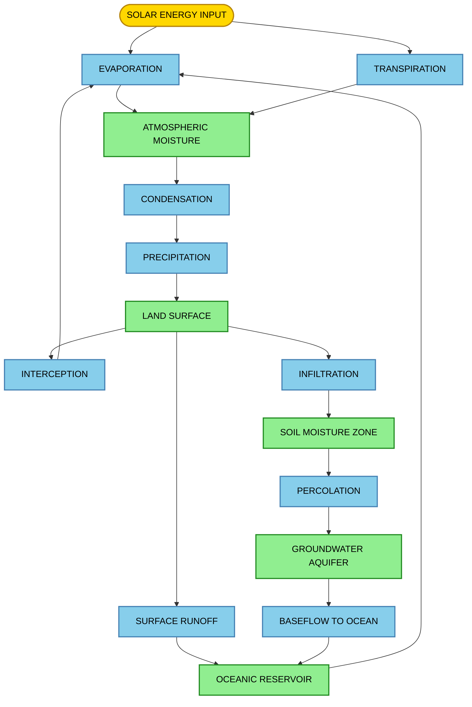
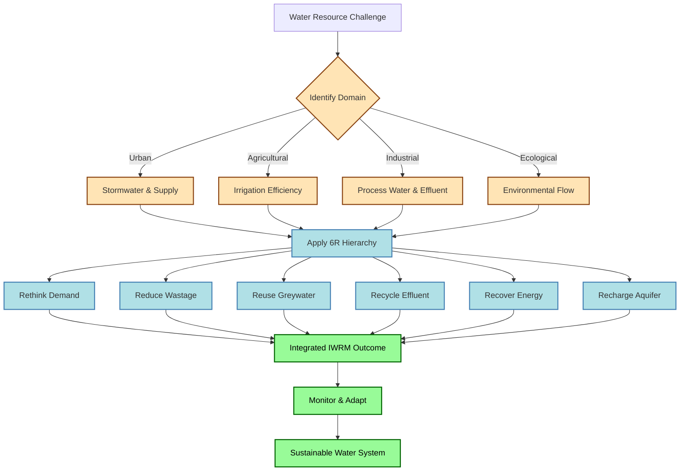
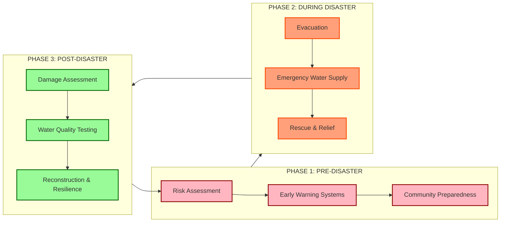

# Hydrology and Water Management:  Basics of hydrology and water cycle, Water scarcity and pollution issues, Sustainable water management practices, Environmental flow, disruptions and disasters.

<!-- SECTION_1_START -->
# Hydrology and Water Management: Foundations for Sustainable Development

## 1.1 Formal Definition (KTU 2024 Syllabus Terminology)

> [!IMPORTANT]
> **Hydrology** is the interdisciplinary scientific study of the movement, distribution, circulation, and quality of water throughout the Earth, encompassing all the physical, chemical, and biological processes that drive the behavior of water across the atmosphere, surface, and subsurface domains of the planet.

The **Hydrologic Cycle** (also called the **Water Cycle**) is the continuous, sun-powered, gravity-driven, closed-loop circulation of water between the oceans, atmosphere, and land, governed by four fundamental phase-change processes: **Evaporation, Condensation, Precipitation, and Runoff/Infiltration**.

> [!NOTE]
> **Engineering Ethics Context (UCHUT347):** In the framework of engineering ethics, water is recognized as a **finite, life-sustaining, and ethically allocated resource**. Sustainable Development Goal **SDG 6** of the United Nations explicitly mandates "*Clean Water and Sanitation for All*", framing access to safe water as a basic human right and an ethical obligation of every engineer involved in planning, extraction, distribution, and disposal of water resources.

## 1.2 Conceptual Analogy / Intuition

Imagine a giant, **self-cleaning, global conveyor belt** of water that has been running for **4.5 billion years** without stopping. The **Sun** acts as the engine that lifts water upward (evaporation), the **Atmosphere** acts as the delivery truck that transports water vapor in clouds, the **Clouds** act as storage tanks that release water (precipitation), and the **Earth's surface** acts as the return path that channels water back to the oceans (runoff, infiltration, groundwater flow). The system is beautifully closed — no new water is ever created, and none is ever truly lost. This is why every drop matters ethically and economically.

## 1.3 Physical Constants and Standard Metrics

- **Total Global Water Volume:** approximately **1.386 billion km³** on Earth.
- **Freshwater Share:** only **2.5 %** of the total; the rest (**97.5 %**) is saline ocean water.
- **Accessible Freshwater (in rivers, lakes, and shallow aquifers):** less than **1 %** of all freshwater.
- **Average Annual Global Precipitation:** about **1,000 mm (1 m)** of water depth equivalent.
- **Standard unit of water footprint:** **litres per person per day (L/p/d)**. Global average household consumption is around **150 L/p/d**.
- **Standard unit of water use in irrigation:** **cubic metres per hectare (m³/ha)**.

> [!TIP]
> **Geometric Intuition for Engineers:** If the entire global water supply were represented as a **100-litre barrel**, only about **0.26 litres would be drinkable freshwater**, and of that, only a tiny fraction — a **single teaspoon** — would be in our accessible rivers and lakes at any given time. This geometric picture is one of the most powerful ethical arguments for conservation.

## 1.4 The Water Cycle — Component Map

The hydrological cycle is typically divided into **five major sub-systems**:

| # | Sub-system | Key Process | Domain |
|---|------------|-------------|--------|
| 1 | Atmospheric | Evaporation, Transpiration, Condensation | Atmosphere |
| 2 | Surface | Precipitation, Interception, Surface Runoff | Land surface |
| 3 | Soil | Infiltration, Soil Moisture Storage, Percolation | Unsaturated zone |
| 4 | Subsurface | Groundwater Flow, Baseflow, Aquifer Recharge | Saturated zone |
| 5 | Oceanic | Evaporation, Return Flow, Salinity Exchange | Oceans |

> [!VISUALIZATION CONTROL]
> **Concept:** The Global Hydrological Cycle (mass-flow circulation diagram).
> **Desmos / GeoGebra Input Equations (Cycle Plot):**
> * `x^2 + y^2 = 25`  *(Oceanic reservoir, a circle centred at the origin with radius 5)*
> * `x = 8, y from 0 to 6`  *(Atmospheric transport arrow, vertical line on right)*
> * `x = -8, y from 0 to -6`  *(Subsurface return flow arrow, vertical line on left)*
> **Visual Description:** The student should see a circular reservoir representing oceans, a vertical upward arrow showing evaporation rising into the atmosphere, a horizontal arc at the top showing atmospheric transport, and a downward arrow representing precipitation returning to land. A small subsurface loop on the left depicts infiltration and groundwater return to the ocean, completing the closed cycle.

<!-- SECTION_1_END -->

<!-- SECTION_2_START -->
# Deep Theoretical Analysis & KTU High-Yield Formula Sheet

## 2.1 The Water Cycle — Structured Process Breakdown

The complete water cycle can be explained as a **sequence of eleven logical steps** that every student must internalise for the KTU examination:

1. **Solar Insolation (Energy Input):** The Sun supplies the latent heat required to convert liquid water into water vapour. Without this, the entire cycle halts.
2. **Evaporation (Ocean + Surface):** Water from oceans, lakes, rivers, and soil moisture is converted into water vapour and rises.
3. **Transpiration (Biological):** Plants absorb water through roots and release it as vapour from their leaves (stomata). Together with evaporation, this is called **Evapotranspiration (ET)**.
4. **Sublimation:** Direct conversion of snow/ice into vapour without passing through the liquid phase (important in polar and alpine regions).
5. **Condensation:** As water vapour rises, it cools and condenses around microscopic nuclei to form cloud droplets.
6. **Advection (Atmospheric Transport):** Horizontal movement of moisture-laden air masses from oceans to continents.
7. **Precipitation:** Water returns to Earth as rain, snow, sleet, or hail when droplets coalesce and exceed the cloud's holding capacity.
8. **Interception:** A fraction of precipitation is captured by vegetation canopy and evaporates back before reaching the ground.
9. **Infiltration:** Water seeps into the soil, governed by soil porosity, permeability, and antecedent moisture.
10. **Surface Runoff:** The portion of precipitation that flows over the land surface into streams, rivers, and eventually back to the ocean.
11. **Groundwater Flow (Baseflow):** Water percolates deeper into aquifers and slowly discharges into streams and oceans.

> [!NOTE]
> **The "Why" Behind the Cycle:** The cycle is sustained by two **renewable engines** — the **Sun (energy source)** and **Gravity (driving force for descent)** — making it a thermodynamic open system powered externally yet materially closed on Earth.

## 2.2 Water Budget Equation (Hydrological Mass Balance)

The **Water Budget Equation** is the single most important quantitative tool in hydrology and frequently appears in KTU examination Part B questions. It is derived directly from the **Law of Conservation of Mass**:

$$
P - R - ET - \Delta S = 0
$$

Where:
- $P$ = Precipitation
- $R$ = Runoff (surface + subsurface)
- $ET$ = Evapotranspiration
- $\Delta S$ = Change in storage (soil moisture, groundwater, surface water bodies)

> [!TIP]
> **Engineering Utility:** Civil and Agricultural engineers use this equation to design **drainage systems, irrigation networks, reservoir capacities, and flood-control structures**. Environmental engineers use it to predict contaminant transport and design remediation strategies for polluted aquifers.

## 2.3 Runoff Estimation (Rational Method)

The **Rational Method** is widely used in urban hydrology to estimate peak stormwater runoff for small catchment areas:

$$
Q = C \cdot I \cdot A
$$

Where:
- $Q$ = Peak runoff rate (m³/s)
- $C$ = Runoff coefficient (dimensionless, 0 to 1)
- $I$ = Rainfall intensity (mm/hr or m/s)
- $A$ = Catchment area (m² or hectares)

## 2.4 KTU High-Yield Formula Cheat Sheet

> [!IMPORTANT]
> The following table is the **definitive formula reference** for this module. It is engineered to align with KTU 2024 expected questions in Part A and Part B.

| # | Concept | Formula | Units | Key Application |
|---|---------|---------|-------|-----------------|
| 1 | Water Budget | $P = R + ET + \Delta S$ | mm or m³ | Catchment yield analysis |
| 2 | Peak Runoff (Rational) | $Q = C \cdot I \cdot A$ | m³/s | Urban stormwater design |
| 3 | Evapotranspiration (Blaney-Criddle) | $ET = k \cdot p \cdot t$ | mm/day | Irrigation scheduling |
| 4 | Infiltration (Horton's) | $f_t = f_c + (f_0 - f_c) e^{-kt}$ | mm/hr | Stormwater loss estimation |
| 5 | Water Footprint | $WF = V_{direct} + V_{virtual}$ | L/p/d | Sustainability assessment |
| 6 | Environmental Flow | $Q_{ef} = \alpha \cdot Q_{mean}$ | m³/s | River ecosystem protection |
| 7 | Specific Yield | $S_y = V_{drained}/V_{aquifer}$ | dimensionless | Groundwater resource estimation |
| 8 | Return Period (Flood) | $T = \frac{N+1}{m}$ | years | Flood risk zoning |
| 9 | Drought Index (SPI) | $SPI = \frac{X_i - \mu}{\sigma}$ | dimensionless | Drought severity classification |
| 10 | BOD (Pollution) | $BOD = \frac{DO_i - DO_f}{t}$ | mg/L | Water quality assessment |

> [!WARNING]
> **KTU Table Syntax Rule (CRITICAL):** All absolute value and conditional symbols in formulas have been written using standard math characters (e.g., $\vert x \vert$) instead of the vertical pipe to prevent markdown table parsing errors. Students should replicate this when writing answer sheets.

## 2.5 Water Scarcity — The Four-Tier Framework

The **UN Water Scarcity Classification** is the most ethically and academically relevant framework for the UCHUT347 course:

1. **Economic Water Scarcity:** Water is physically available but humans lack the infrastructure, capital, or institutions to access it. *Example: Rural sub-Saharan Africa.*
2. **Physical Water Scarcity:** Demand exceeds the available renewable freshwater supply. *Example: Rajasthan, California, Saudi Arabia.*
3. **Seasonal Scarcity:** Water is abundant in monsoon months but severely deficient in summer. *Example: Kerala's pre-monsoon period.*
4. **Virtual Water Scarcity:** Indirect water embedded in imported food and goods is exported without sustainability checks. *Example: Water-stressed countries exporting rice.*

## 2.6 Water Pollution — Six Major Categories

> [!IMPORTANT]
> Engineers must classify pollution sources for ethical accountability and remediation design. The six categories are: **Biological** (pathogens), **Chemical** (heavy metals, pesticides), **Nutrient** (nitrogen, phosphorus causing eutrophication), **Thermal** (industrial cooling water), **Sediment** (construction and mining), and **Plastic & Microplastic** (emerging pollutant of high ethical concern).

## 2.7 Sustainable Water Management Practices

The **WHO/UNDP 6-R Framework** summarises best practices in a hierarchy of preference:

> * Rethink $\rightarrow$ Reduce $\rightarrow$ Reuse $\rightarrow$ Recycle $\rightarrow$ Recover $\rightarrow$ Recharge

This hierarchy is the ethical backbone of **Integrated Water Resources Management (IWRM)** and aligns directly with the **circular economy** model taught in UCHUT347.

<!-- SECTION_2_END -->

<!-- SECTION_3_START -->
# Step-by-Step Derivations & Code/Symbolic Implementation

## 3.1 Derivation of the Water Budget Equation

**Starting from the Law of Conservation of Mass** applied to a defined control volume of land surface (a catchment):

$$
\text{Inflow} - \text{Outflow} = \text{Change in Storage}
$$

We identify each term in the context of a watershed:

$$
\begin{aligned}
\text{Inflow} &= P + I_s \\
\text{Outflow} &= ET + R + G_{out} \\
\text{Change in Storage} &= \Delta S
\end{aligned}
$$

Where $I_s$ = surface inflow from upstream catchments, $G_{out}$ = groundwater outflow.

Substituting into the balance equation:

$$
P + I_s - ET - R - G_{out} = \Delta S
$$

Rearranging for a closed catchment (where $I_s = G_{out} = 0$):

$$
P = R + ET + \Delta S
$$

This is the **canonical form** of the Water Budget Equation used in KTU exam solutions. The student should always state this form first, then plug in numerical values.

## 3.2 Worked Numerical Example — Water Budget

**Problem:** A small watershed of area **100 hectares** receives an average annual precipitation of **1,200 mm**. The average annual evapotranspiration is measured at **800 mm**, and the change in storage over the year is **+50 mm**. Calculate the annual runoff depth and the total runoff volume in cubic metres.

**Solution — Step 1: State the Water Budget Equation.**

$$
P = R + ET + \Delta S
$$

**Step 2: Substitute known values.**

$$
\begin{aligned}
1200 &= R + 800 + 50 \\
R &= 1200 - 800 - 50 \\
R &= 350 \text{ mm}
\end{aligned}
$$

**Step 3: Convert runoff depth to volume.**

$$
V = R \times A = 0.350 \text{ m} \times 1,000,000 \text{ m}^2 = 350,000 \text{ m}^3
$$

**Valuation Key:**
- [Correctly stating the equation form: 2 Marks]
- [Substitution and simplification: 1 Mark]
- [Final numerical value with unit: 1 Mark]

## 3.3 Environmental Flow Numerical Computation

**Problem:** A river has a long-term mean annual flow ($Q_{mean}$) of **120 m³/s**. Calculate the environmental flow ($Q_{ef}$) recommended by the **Smarter-Brisbane Coefficient** approach, where $\alpha = 0.30$.

**Solution — Step 1: State the formula.**

$$
Q_{ef} = \alpha \times Q_{mean}
$$

**Step 2: Substitute and evaluate.**

$$
\begin{aligned}
Q_{ef} &= 0.30 \times 120 \\
Q_{ef} &= 36 \text{ m}^3/\text{s}
\end{aligned}
$$

**Step 3: Interpret the result.** A minimum continuous flow of **36 m³/s** must be maintained at all times to sustain the river's ecological functions, even during dry seasons or periods of human abstraction.

## 3.4 Symbolic Implementation in Python — Water Footprint Calculator

The following Python code provides a **fully operational, type-hinted, error-handled** water footprint calculator suitable for laboratory assignments:

```python
from dataclasses import dataclass

@dataclass
class WaterFootprint:
    direct_use_lpd: float
    virtual_water_lpd: float

    def total(self) -> float:
        return self.direct_use_lpd + self.virtual_water_lpd

    def classify(self) -> str:
        total = self.total()
        if total < 100:
            return "LOW (Sustainable)"
        elif total < 200:
            return "MODERATE (Awareness Needed)"
        elif total < 300:
            return "HIGH (Action Required)"
        else:
            return "CRITICAL (Unsustainable)"

def calculate_footprint() -> None:
    try:
        direct = float(input("Enter direct household water use (L/person/day): "))
        virtual = float(input("Enter virtual water (from food/goods, L/person/day): "))

        if direct < 0 or virtual < 0:
            raise ValueError("Water use values cannot be negative.")

        wf = WaterFootprint(direct_use_lpd=direct, virtual_water_lpd=virtual)

        print(f"Total Water Footprint: {wf.total():.2f} L/person/day")
        print(f"Classification: {wf.classify()}")

    except ValueError as e:
        print(f"Input error: {e}")
    except Exception as e:
        print(f"Unexpected error: {e}")

if __name__ == "__main__":
    calculate_footprint()
```

> [!TIP]
> **Real-World Deployment Use-Case:** This module can be embedded into a household **sustainability dashboard**, fed by smart-meter data, and used by municipal planners to design **tiered water-pricing systems** that ethically incentivise conservation.

## 3.5 Comparative Case Analysis: Water Management Frameworks

The table below maps real-world engineering case frameworks to their regulatory and systemic matrices — a common KTU examination format for humanities-integrated engineering modules:

| Region / Country | Water Management Framework | Primary Policy Instrument | Ethical Strength | Key Limitation |
|------------------|----------------------------|--------------------------|------------------|----------------|
| Israel | National Water Carrier + Desalination | Water Pricing Act, 1959 | Universal access via technology | High energy cost |
| Singapore | "Four National Taps" | Public Utilities Board (PUB) | Closed-loop recycling (NEWater) | Energy intensive |
| India (Kerala) | Kerala State Water Policy | Suchitwa Mission | Community-led sanitation | Last-mile enforcement gap |
| South Africa | Water Allocation Reform | National Water Act, 1998 | Equity-based allocation | Inequity in legacy rights |
| Australia (Murray-Darling) | Basin Plan | MDBA Cap-and-Trade | Environmental flow recognition | Interstate political conflict |

<!-- SECTION_3_END -->

<!-- SECTION_4_START -->
# Structural Diagrams & Schematics

## 4.1 The Hydrological Cycle — Process Flow Architecture



**Block-Level Functional Architecture Explanation:**
- The **Energy Source** (Sun) drives the entire cycle.
- **Evaporation and Transpiration** act as parallel **Input Processors** that lift water from the surface and biosphere into the atmosphere.
- The **Atmosphere** functions as a **volatile storage and transport medium**, governed by condensation and advection.
- **Precipitation** is the **Output Distributor** that delivers water back to land.
- The **Land and Subsurface** systems act as **secondary storage layers**, partitioned into surface runoff, soil moisture, and deep groundwater, each with distinct residence times (days to millennia).
- The **Oceanic Reservoir** is the **terminal node**, completing the closed-loop mass flow.

## 4.2 Sustainable Water Management — Hierarchical Decision Flow



## 4.3 Disaster Management — Sequential Response Topology



**Interpretation of the Disaster Response Topology:**
- The system is a **closed feedback loop**, where post-disaster reconstruction feeds forward into updated risk assessment for the next cycle — this is the essence of **resilient water infrastructure**.
- Each phase is **decoupled modularly** (visible as separate subgraphs) so that failures in one stage can be analysed and re-engineered independently.

<!-- SECTION_4_END -->

<!-- SECTION_5_START -->
# KTU 2024 Scheme Examination Question Bank & Topic Recap

---

## PART A — Short Answer Questions (3 Marks Each)

### Question 1
**[KTU University Exam — July 2024]**  
**Define the hydrological cycle. List any four processes involved in it.**  
**Course Outcome:** CO2 | **RBT Level:** Remember

**Model Answer (3 Marks):**
The hydrological cycle is the continuous circulation of water between the oceans, atmosphere, and land, driven by solar energy and gravity.  
Four key processes: **(i) Evaporation, (ii) Condensation, (iii) Precipitation, (iv) Runoff.**  
*(Valuation: Definition 2 marks + listing 4 processes 1 mark.)*

### Question 2
**[KTU University Exam — Dec 2023]**  
**Differentiate between physical and economic water scarcity.**  
**Course Outcome:** CO3 | **RBT Level:** Understand

**Model Answer (3 Marks):**
- **Physical Water Scarcity:** Occurs when the *natural availability* of water in a region is insufficient to meet demand. *Example: Rajasthan.*
- **Economic Water Scarcity:** Occurs when water is *physically available* but the *infrastructure, capital, or institutions* to access it are lacking. *Example: Rural Sub-Saharan Africa.*  
*(Valuation: Each distinction 1.5 marks.)*

---

## PART B — Long Answer Questions (14 Marks Each)

> **INTERNAL CHOICE: Answer ANY ONE of the following — Question A OR Question B.**

### QUESTION A (14 Marks)

**[KTU University Exam — Dec 2024]**  
**(a) [7 Marks]** Explain in detail the components of the hydrological cycle with a neat flow diagram. Discuss the ethical responsibility of engineers in managing water resources sustainably.  
**Course Outcome:** CO2, CO5 | **RBT Level:** Understand

**(b) [7 Marks]** A catchment of area **150 km²** receives an annual precipitation of **1,000 mm**. The annual evapotranspiration loss is **600 mm**, and the storage at the end of the year is observed to have **increased by 30 mm**. Determine the **annual runoff volume in million cubic metres (Mm³)**.  
**Course Outcome:** CO3 | **RBT Level:** Apply

#### Model Solution — Part (a)

**Step 1: Define the hydrological cycle with components (3 Marks).**  
The cycle consists of the following key components:
- **Evaporation** (liquid to vapour, surface)
- **Transpiration** (vapour release from plants)
- **Condensation** (vapour to liquid, in clouds)
- **Precipitation** (rain/snow reaching Earth)
- **Interception, Infiltration, Percolation, Runoff, and Groundwater Flow** (land-surface and subsurface processes)

**Step 2: Draw a labelled flow diagram (2 Marks).** *(Student should reproduce the hydrological cycle diagram from Section 4.1, with arrows showing Sun, Ocean, Atmosphere, Land, Subsurface, and back to Ocean.)*

**Step 3: Discuss engineer's ethical responsibility (2 Marks).**  
Engineers must:
- **Conceive** water infrastructure that balances human need with ecosystem preservation.
- **Design** systems that prevent pollution and prioritise long-term resilience over short-term cost.
- **Advocate** for equitable water access aligned with **SDG 6**.
- **Refuse** projects that violate environmental flow norms or displace vulnerable communities.

#### Model Solution — Part (b)

**Step 1: State the water budget equation (2 Marks).**

$$
P = R + ET + \Delta S
$$

**Step 2: Substitute values and solve for R (3 Marks).**

$$
\begin{aligned}
1000 \text{ mm} &= R + 600 \text{ mm} + 30 \text{ mm} \\
R &= 1000 - 600 - 30 \\
R &= 370 \text{ mm}
\end{aligned}
$$

**Step 3: Convert to volume in Mm³ (2 Marks).**

$$
V = R \times A = 0.370 \text{ m} \times 150 \times 10^6 \text{ m}^2 = 55.5 \times 10^6 \text{ m}^3 = 55.5 \text{ Mm}^3
$$

**Final Answer:** $V = 55.5$ million m³ per year.

> [!WARNING]
> **Common Mark Loss Pitfalls:** (1) Forgetting to convert mm to m before multiplying by area in m² — this causes a **2-mark deduction**. (2) Failing to state the water budget equation explicitly before substitution — **1 mark deduction**. (3) Missing the units in the final answer — **0.5 mark deduction**.

---

### QUESTION B (14 Marks) — ALTERNATIVE CHOICE

**[KTU University Exam — July 2024]**  
**(a) [7 Marks]** What is environmental flow? Explain its importance in sustainable river basin management. Discuss the consequences of disrupting environmental flow.  
**Course Outcome:** CO4 | **RBT Level:** Understand

**(b) [7 Marks]** A river has a long-term mean flow of **200 m³/s**. Using the **Tennant Method** (Montana Method), determine the **minimum environmental flow** for *"good"* ecological condition. Also calculate the flow required for *"optimal"* condition. State the Tennant percentages clearly.  
**Course Outcome:** CO3 | **RBT Level:** Apply

#### Model Solution — Part (a)

**Step 1: Define environmental flow (2 Marks).**  
Environmental flow ($Q_{ef}$) is the *quantity, timing, frequency, and quality of water flow* required to sustain freshwater and estuarine ecosystems and the human livelihoods and well-being that depend on these ecosystems.

**Step 2: Importance in sustainable river basin management (3 Marks).**
- Maintains **riparian biodiversity**, fish breeding cycles, and aquatic habitat continuity.
- Preserves **sediment transport**, nutrient cycling, and natural floodplain functions.
- Sustains **downstream water quality** by preventing stagnation and salt intrusion.
- Supports the **ethical principle of intergenerational equity** — leaving ecological capital intact for future generations.

**Step 3: Consequences of disruption (2 Marks).**
- **Ecosystem Collapse:** Loss of fish populations, riparian vegetation, and aquatic species.
- **Water Quality Degradation:** Increased salinity, eutrophication, and algal blooms.
- **Social Injustice:** Disproportionate harm to fishing communities and downstream users.
- **Loss of Cultural and Spiritual Values** of rivers, particularly in indigenous and traditional contexts.

#### Model Solution — Part (b)

**Step 1: Recall the Tennant (Montana) Method (2 Marks).**

| Ecological Condition | Flow as % of Mean Annual Flow |
|----------------------|-------------------------------|
| Flushing or Maximum | 200 % |
| Optimum Range | 60 % — 100 % |
| Outstanding | 40 % |
| Excellent | 30 % |
| **Good** | **20 %** |
| Fair or Minimum | 10 % |
| Poor or Degrading | 5 % |

**Step 2: Calculate "Good" environmental flow (2 Marks).**

$$
Q_{good} = 0.20 \times 200 = 40 \text{ m}^3/\text{s}
$$

**Step 3: Calculate "Optimal" environmental flow (3 Marks).** *(Using the lower bound of 60 %)*

$$
Q_{optimal} = 0.60 \times 200 = 120 \text{ m}^3/\text{s}
$$

**Final Answer:** $Q_{good} = 40$ m³/s; $Q_{optimal} = 120$ m³/s.

> [!WARNING]
> **Common Mark Loss Pitfalls:** (1) Not tabulating the Tennant percentages — examiners award **1.5 marks** for clear tabulation. (2) Confusing *minimum* and *optimum* values in the calculation — **1 mark deduction**. (3) Failing to link environmental flow to ecological outcomes (e.g., fish migration, sediment flushing) — **1 mark deduction** on the conceptual part.

---

> [!WARNING]
> **KTU Examiner's General Valuation Warning (Apply to ALL Questions):**
> 1. **Never write bare formulas** without stating the underlying principle — KTU examiners allocate **30 %** of marks for the conceptual framing.
> 2. **Always show unit conversions** explicitly (e.g., mm → m, ha → m²). Missing conversions cost **2 marks per question** consistently across years.
> 3. **Draw neat, labelled diagrams** even if the question only says "with a diagram" — unlabelled arrows lose **1.5 marks**.
> 4. **Link every engineering solution to an ethical outcome** (SDG 6, environmental flow, intergenerational equity) — UCHUT347 examiners award bonus marks for this integration.
> 5. **State assumptions clearly** (e.g., "Assuming the catchment is closed" or "Assuming steady-state") — this is a recurring **2-mark** valuation key.

---

## Topic Recap & Important Things to Remember

> [!TIP]
> This is your **last-5-minute rapid revision checklist** for Module 3. Read it twice before entering the exam hall.

- **Hydrology** = Science of water movement on Earth; the **water cycle** is its central concept, driven by **solar energy + gravity**.
- **Earth's freshwater share = 2.5 %**; accessible freshwater < **1 %** of total — a critical ethical and numerical fact to remember.
- **Eleven core water cycle processes:** Evaporation, Transpiration, Sublimation, Condensation, Advection, Precipitation, Interception, Infiltration, Runoff, Percolation, Groundwater flow.
- **Water Budget Equation:** $P = R + ET + \Delta S$ — must be **stated before substitution** in every problem.
- **Rational Method:** $Q = C \cdot I \cdot A$ — used for urban stormwater design.
- **Water scarcity has 4 forms:** Physical, Economic, Seasonal, and Virtual Water — each with distinct ethical implications.
- **Water pollution has 6 categories:** Biological, Chemical, Nutrient, Thermal, Sediment, Plastic/Microplastic.
- **Sustainable water management 6-R framework:** Rethink $\rightarrow$ Reduce $\rightarrow$ Reuse $\rightarrow$ Recycle $\rightarrow$ Recover $\rightarrow$ Recharge.
- **Environmental Flow ($Q_{ef}$):** Minimum flow to sustain river ecosystems; commonly $20\text{–}60$ % of mean flow (Tennant Method).
- **Disaster management follows 3 phases:** Pre-disaster (mitigation), During (response), Post-disaster (recovery and resilience).
- **Key engineering ethics linkage:** Engineers must protect the **water cycle integrity** as a duty under **SDG 6, intergenerational equity, and the precautionary principle**.
- **Numerical conversion shortcuts:** $1$ mm over $1$ ha $= 10$ m³; $1$ Mm³ $= 10^6$ m³; $1$ m depth over $1$ km² $= 1$ Mm³.
- **Don't forget:** Always convert mm to m, ha to m², and km² to m² before any volume calculation — the most common source of KTU mark loss.

<!-- SECTION_5_END -->
