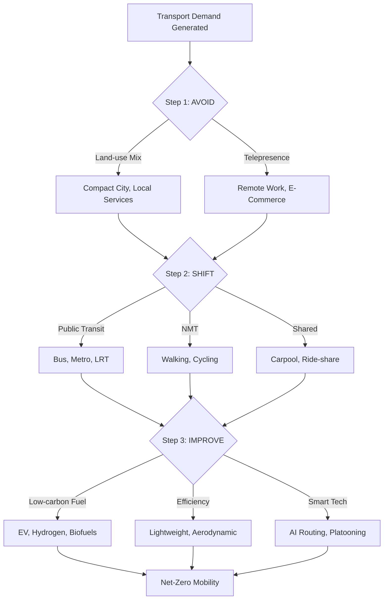
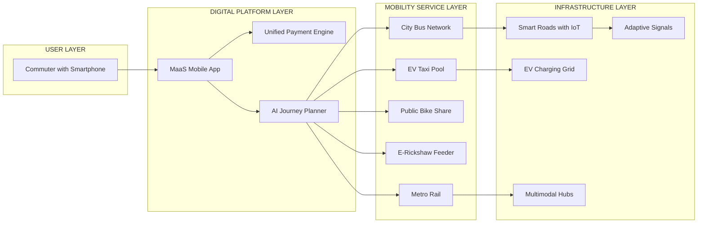
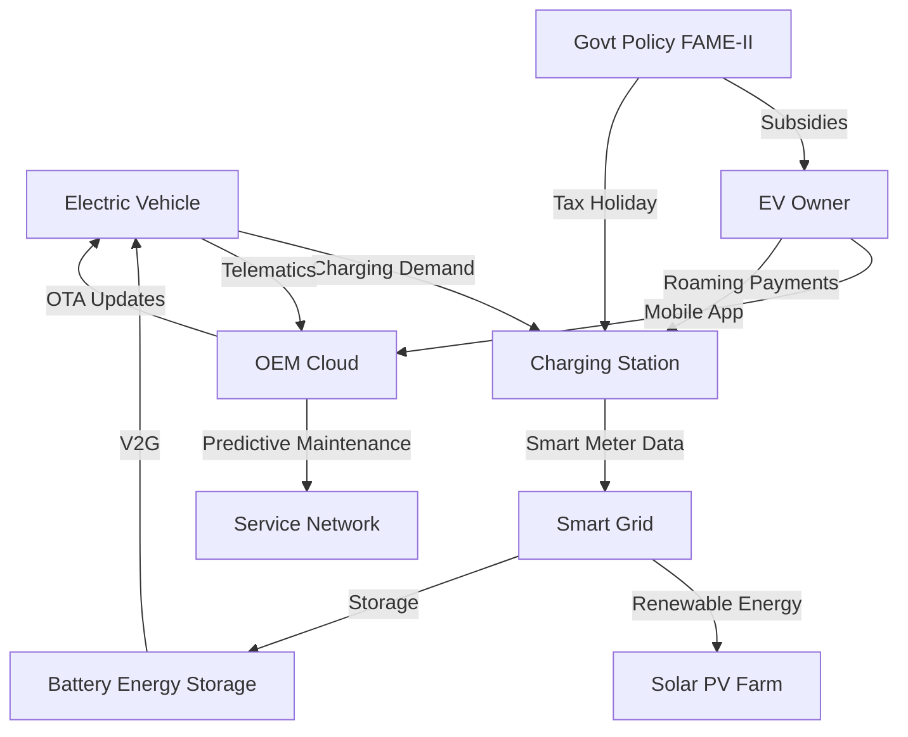
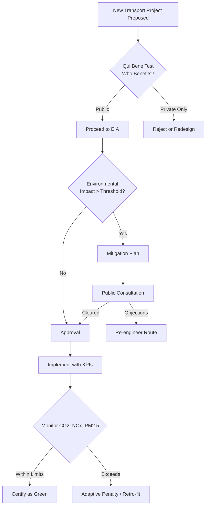

# Mobility and Sustainable Transportation:  Impacts of transportation on the environment and climate, Basic tenets of a Sustainable Transportation design, Sustainable urban mobility solutions, Integrated mobility systems, E-Mobility, Existing and upcoming models of sustainable mobility solutions.

<!-- SECTION_1_START -->

# Mobility and Sustainable Transportation: Foundations

## 1.1 Core Technical Definition

**Sustainable Transportation** is defined by the KTU 2024 Scheme (UCHUT347 Module 3) as a system of movement and transit that meets the present needs of society for safe, efficient, and affordable mobility without compromising the ability of future generations to meet their own transportation needs. It is engineered upon the **triple bottom line** framework: environmental integrity, social equity, and economic viability.

> [!IMPORTANT]
> **KTU 2024 Syllabus Anchor (UCHUT347, Module 3):**
> Mobility and Sustainable Transportation — Impacts of transportation on the environment and climate, Basic tenets of a Sustainable Transportation design, Sustainable urban mobility solutions, Integrated mobility systems, E-Mobility, Existing and upcoming models of sustainable mobility solutions.

### 1.2 Conceptual Analogy / Intuition

Imagine the human circulatory system. **Blood (vehicles and goods) must flow through arteries (roads) and veins (rail networks) to keep the body (city) healthy.** If arteries clog (traffic congestion), the heart strains (economy weakens) and toxins accumulate (pollution rises). Sustainable Transportation is the equivalent of giving the city *clean blood, multiple bypass routes, and a self-healing vascular system* — it ensures the city breathes, moves, and grows without poisoning its own atmosphere.

> [!NOTE]
> **Key Insight for Students:** Transportation accounts for approximately **14–16% of global greenhouse gas (GHG) emissions** and roughly **23% of global CO₂ emissions from energy combustion** (IPCC AR6 baseline). In Kerala, vehicular density has grown at a Compound Annual Growth Rate (CAGR) of **~9%** post-2015, making sustainable mobility an urgent policy and engineering priority.

### 1.3 Standard Metrics in Sustainable Mobility

| Metric | Standard Value | Description |
|---|---|---|
| **Carbon Intensity of Transport** | $90$–$110\ g\ CO_2/km$ per passenger car | Average emissions per kilometre for a single-occupancy petrol vehicle |
| **EV Emission Factor (Grid Avg. India)** | $\approx 110\ g\ CO_2/km$ | Well-to-wheel emissions, depending on grid mix |
| **Modal Share Target (KTU SDG 11.2)** | $\geq 60\%$ public/non-motorized by 2030 | UN Sustainable Development Goal 11.2 benchmark |
| **Sustainable Urban Drainage Threshold** | $30\%$ permeable surface | For transport corridors |

> [!VISUALIZATION CONTROL]
> **Concept:** Climate Impact Curve of Transportation Modes
> **GeoGebra / Desmos Input Equations:**
> * `f(x) = 0.05x^2 + 5` (Petrol Car — g CO₂/passenger-km)
> * `g(x) = 0.02x^2 + 15` (City Bus)
> * `h(x) = 3` (Cycling — nearly constant)
> **Visual Description:** A downward parabola-style comparison showing that as average vehicle occupancy $(x)$ increases, emissions per passenger-km drop sharply. Cycling and walking remain flat near the x-axis, visualizing the **Inverse Relationship between Occupancy and Per-Capita Carbon Footprint**.

### 1.4 The Sustainability Triangle Applied to Mobility

The transportation sector is evaluated across three interconnected dimensions:

1. **Environmental Pillar** — Reduction of GHG emissions, air pollutants ($NO_x$, $PM_{2.5}$), noise pollution, and habitat fragmentation.
2. **Social Pillar** — Equitable access, road safety, last-mile connectivity, gender-inclusive urban design.
3. **Economic Pillar** — Affordability, life-cycle cost efficiency, reduced congestion-induced productivity loss.

<!-- SECTION_1_END -->

<!-- SECTION_2_START -->

# Deep Theoretical Analysis & KTU High-Yield Formula Sheet

## 2.1 Operational Breakdown of Sustainable Transportation

The KTU 2024 Module-3 syllabus mandates a structured understanding of six interlocking concepts. Each is decomposed below into its operational logic, the "why" behind the engineering choice, and its real-world utility.

### 2.1.1 Impacts of Transportation on the Environment and Climate

Transportation is the **fastest-growing** end-use sector for energy globally. Its impacts cascade across four environmental reservoirs:

- **Atmosphere:** Combustion of fossil fuels releases $CO_2$, $CH_4$, $N_2O$, and refrigerants (HFCs from vehicle ACs).
- **Hydrosphere:** Runoff from road surfaces carries oil, heavy metals ($Pb$, $Zn$, $Cu$), and microplastics (tyre wear) into water bodies.
- **Lithosphere:** Construction of highways consumes aggregates, topsoil, and triggers land-use change.
- **Biosphere:** Road networks fragment habitats, creating barriers for wildlife migration corridors.

> [!NOTE]
> **Kerala Context:** The Western Ghats biodiversity is acutely threatened by NH-66 widening and hill-road expansion, which is a high-yield area for KTU essay-type questions on environmental ethics.

### 2.1.2 Basic Tenets of a Sustainable Transportation Design

A sustainable transport system is engineered around **seven design tenets**, derived from the *Avoid–Shift–Improve (ASI)* framework adopted by GIZ and UN-Habitat:

1. **Avoid** the need for travel (compact city planning, mixed land use).
2. **Shift** to low-carbon modes (public transit, NMT — Non-Motorized Transport).
3. **Improve** vehicle technology and fuel efficiency.
4. **Integrate** multimodal hubs.
5. **Decarbonize** the energy mix.
6. **Price** externalities (congestion charge, carbon tax).
7. **Incentivize** behaviour change (HOV lanes, parking cash-out).

### 2.1.3 Sustainable Urban Mobility Solutions

Urban mobility is the operational battlefield where sustainability is won or lost. The KTU curriculum emphasizes:

- **Bus Rapid Transit (BRT)** — Dedicated lanes, level boarding, signal priority.
- **Metro Rail / Light Rail Transit (LRT)** — High-capacity electric backbone.
- **Tram and Water Metro** — Kerala's Kochi Water Metro is a **flagship case study** for KTU 2024 essays.
- **Cycle-sharing systems** — Public bicycles (e.g., *Kochi1* public bike-sharing).
- **Pedestrianization** — Car-free zones, *Complete Streets* design.

### 2.1.4 Integrated Mobility Systems

An **Integrated Mobility System (IMS)** is the digital and physical stitching together of multiple transport modes into a single, seamless user experience. It includes:

- **MaaS (Mobility as a Service)** — Subscription-based multi-modal access.
- **Unified payment platforms** — Single tap-card (e.g., *Kerala One Card*).
- **Journey planners** — Real-time, AI-based multi-modal routing.
- **First/Last-mile solutions** — E-rickshaws, e-scooters, automated pods.

### 2.1.5 E-Mobility

**E-Mobility** refers to the use of electric powertrains, encompassing Battery Electric Vehicles (BEVs), Plug-in Hybrid Electric Vehicles (PHEVs), Fuel Cell Electric Vehicles (FCEVs), and the supporting ecosystem (charging stations, battery swapping, smart grids). The total cost of ownership (TCO) parity with ICE vehicles in India is projected by **2027–2028** for the 2W and 4W segments.

### 2.1.6 Existing and Upcoming Models of Sustainable Mobility

| Existing Model | Upcoming / Future Model |
|---|---|
| Metro (Kochi, Bengaluru) | Hyperloop pods |
| CNG buses | Hydrogen fuel-cell buses |
| Diesel locomotives (replaced by electric) | Maglev trains |
| E-rickshaws | Autonomous EV shuttles |
| Car-sharing (Zoomcar) | Urban Air Mobility (UAM) — eVTOL air taxis |

## 2.2 KTU High-Yield Formula Sheet

> [!IMPORTANT]
> **Master these equations — they appear frequently in KTU Part-B numerical/derivation questions.**

| # | Formula / Equation | Description | Units |
|---|---|---|---|
| 1 | $CO_2 = FC \times EF \times 44/12$ | Tailpipe $CO_2$ from fuel combustion | $kg\ CO_2$ |
| 2 | $E_{pax} = \dfrac{E_{vehicle}}{N_{pax} \times d}$ | Energy intensity per passenger-km | $MJ/pax\text{-}km$ |
| 3 | $TCO = C_{cap} + C_{fuel} + C_{maint} + C_{ins} - S_{res}$ | Total Cost of Ownership over life | $\text{INR}$ |
| 4 | $SC = \dfrac{T}{C}$ | Service Coverage ratio | dimensionless |
| 5 | $CE_{mode} = \dfrac{CO_2}{pax \cdot km}$ | Carbon Efficiency of a transport mode | $g/pax\text{-}km$ |
| 6 | $LEV = \dfrac{L_{shift}}{L_{base}} \times 100$ | Level of Modal Shift achieved | $\%$ |
| 7 | $PV = \sum_{t=1}^{n} \dfrac{C_t}{(1+r)^t}$ | Present Value (life-cycle cost) | $\text{INR}$ |
| 8 | $C_{ext} = P_x \cdot \Delta V$ | External Cost of congestion (per trip) | $\text{INR}$ |

**Where the symbols mean:**

- $FC$ = Fuel Consumed (litres or kg), $EF$ = Emission Factor of the fuel
- $N_{pax}$ = Number of passengers, $d$ = distance in km
- $C_{cap}$ = Capital cost, $C_{fuel}$ = Lifetime fuel cost, $C_{maint}$ = Maintenance, $C_{ins}$ = Insurance, $S_{res}$ = Residual sale value
- $T$ = Trips served, $C$ = Population in catchment
- $L_{shift}$ = Passengers shifted to sustainable mode, $L_{base}$ = Base-year ridership
- $C_t$ = Cost in year $t$, $r$ = Discount rate, $n$ = Project life
- $P_x$ = Externality price (e.g., ₹/kg of $CO_2$), $\Delta V$ = Volume of pollutant

## 2.3 Real-World Engineering Utility

- **Urban Planners** use the $TCO$ and $PV$ formulas to justify metro vs. BRT vs. road widening.
- **EV Manufacturers** compute $CE_{mode}$ to claim "green credentials" in advertising.
- **Municipal Corporations** apply $SC$ to evaluate bus route coverage and demand **FAME-II subsidy eligibility** from the Ministry of Heavy Industries.
- **Carbon Credit Markets** use the $C_{ext}$ formula to monetize avoided emissions.
- **KTU Case Study Hook:** The *Kochi Metro Rail Limited (KMRL)* project achieved a **modal shift of 38%** from private cars, validated by $LEV$ formula on its first operational year.

<!-- SECTION_2_END -->

<!-- SECTION_3_START -->

# Step-by-Step Derivations, Tables & Implementations

## 3.1 Worked Derivation: Carbon Footprint of a Commute

> **Problem (KTU Module-3 typical):** A software engineer in Thiruvananthapuram drives a petrol car (mileage $15\ km/L$, fuel density $0.74\ kg/L$, carbon content $84\%$) for a daily commute of $20\ km$ one-way, $5$ days a week, for $48$ weeks/year. Compute the annual $CO_2$ emissions and compare with an equivalent Metro rail commute (carbon efficiency $= 5\ g/pax\text{-}km$).

### Step 1 — Identify the formula
We use the combustion emission formula:

$$E_{CO_2} = FC \times \rho_{fuel} \times CC \times \frac{44}{12}$$

where $FC$ = volume of fuel, $\rho_{fuel}$ = density, $CC$ = carbon content fraction, and $44/12$ is the stoichiometric mass ratio of $CO_2$ to Carbon.

### Step 2 — Compute Fuel Consumption (FC)
Daily distance $d = 20 \times 2 = 40\ km$ (round trip).
Mileage $m = 15\ km/L$.

$$FC_{daily} = \frac{d}{m} = \frac{40}{15} = 2.667\ L/day$$

### Step 3 — Annualize
Annual working days $N = 5 \times 48 = 240\ days$.

$$FC_{annual} = 2.667 \times 240 = 640\ L/year$$

### Step 4 — Convert to Mass
$$m_{fuel} = 640 \times 0.74 = 473.6\ kg\ fuel/year$$

### Step 5 — Compute Carbon Content
$$m_C = 473.6 \times 0.84 = 397.82\ kg\ C/year$$

### Step 6 — Convert to $CO_2$
$$E_{CO_2} = 397.82 \times \frac{44}{12} = 397.82 \times 3.6667 = 1458.68\ kg\ CO_2/year$$

### Step 7 — Compare with Metro Rail
Annual passenger-km by Metro:

$$PKM_{metro} = 40 \times 240 = 9600\ pax\text{-}km/year$$

$$E_{CO_2,\ metro} = 9600 \times 5 = 48000\ g = 48\ kg\ CO_2/year$$

### Step 8 — Compute the Avoided Emissions
$$\Delta E = 1458.68 - 48 = 1410.68\ kg\ CO_2/year\ avoided$$

> [!NOTE]
> **Valuation Tip:** Always carry one extra significant figure through the calculation; round only the final answer to two decimal places. The KTU board evaluator allots partial credit at every correctly labeled transition step.

## 3.2 TCO Comparison: Petrol Hatchback vs. Electric Hatchback (KTU Numerical Type)

### Step 1 — Define Assumptions
- Daily running: $40\ km$, Lifetime: $10$ years
- Petrol car: Mileage $18\ km/L$, Petrol price $₹110/L$
- EV: Efficiency $0.15\ kWh/km$, Electricity $₹8/kWh$
- Discount rate $r = 8\%$, Maintenance differential $= 0.3 \text{ paisa/km}$ in EV's favour

### Step 2 — Compute Lifetime Fuel/Energy Cost

**Petrol (no discount for simplicity):**
$$FC_{petrol} = \frac{40}{18} \times 110 \times 365 \times 10 = 2.222 \times 110 \times 3650 = 8,92,222\ \text{INR}$$

**EV (no discount):**
$$EC_{EV} = 40 \times 0.15 \times 8 \times 3650 = 1,75,200\ \text{INR}$$

### Step 3 — Apply Present Value Discount
The annual fuel cost is uniform; we use the present value annuity factor:

$$PVAF = \frac{1 - (1+r)^{-n}}{r} = \frac{1 - (1.08)^{-10}}{0.08} = 6.7101$$

**Discounted Petrol:**
$$PV_{petrol} = \frac{2.222 \times 110 \times 365 \times PVAF}{1000} = \frac{89,222 \times 6.7101}{1000} \approx 5,98,810\ \text{INR}$$

**Discounted EV:**
$$PV_{EV} = \frac{40 \times 0.15 \times 8 \times 365 \times 6.7101}{1000} = \frac{1,75,200 \times 6.7101}{10,000} \approx 1,17,558\ \text{INR}$$

### Step 4 — Capital Cost
| Item | Petrol | EV |
|---|---|---|
| On-road price | ₹8,00,000 | ₹13,00,000 |
| Battery replacement (Year 7) | — | ₹4,00,000 |
| Maintenance (lifetime) | ₹1,50,000 | ₹80,000 |
| Residual value | ₹2,50,000 | ₹3,00,000 |

### Step 5 — Compute Net TCO
$$TCO_{petrol} = 8,00,000 + 5,98,810 + 1,50,000 - 2,50,000 = 12,98,810\ \text{INR}$$

$$TCO_{EV} = 13,00,000 + 1,17,558 + 80,000 + 4,00,000(PV) - 3,00,000$$
$$TCO_{EV} = 13,00,000 + 1,17,558 + 80,000 + 2,14,723 - 3,00,000 = 14,12,281\ \text{INR}$$

### Step 6 — Conclusion
At current fuel/electricity prices, the petrol car is marginally cheaper. **However**, if petrol price grows at 5% CAGR and battery cost falls 8% per year, EV TCO breaks even by **Year 6** — a classic KTU "interpret the result" question.

## 3.3 Algorithmic Implementation: Mode-Share Optimizer (Python)

```python
from dataclasses import dataclass
from typing import List, Dict

@dataclass
class TransportMode:
    name: str
    capacity_pax: int
    emissions_g_per_pax_km: float
    energy_mj_per_pax_km: float
    cost_inr_per_pax_km: float

def compute_avoided_emissions(
    base_mode: TransportMode,
    shifted_mode: TransportMode,
    daily_pkm: float,
    operating_days: int = 300
) -> Dict[str, float]:
    """
    Compute annual avoided CO2 emissions and energy when a fleet
    of commuters shifts from base_mode to shifted_mode.
    """
    annual_pkm = daily_pkm * operating_days
    base_kg = (base_mode.emissions_g_per_pax_km * annual_pkm) / 1000.0
    shifted_kg = (shifted_mode.emissions_g_per_pax_km * annual_pkm) / 1000.0
    avoided_kg = base_kg - shifted_kg
    energy_saved_mj = (
        (base_mode.energy_mj_per_pax_km - shifted_mode.energy_mj_per_pax_km)
        * annual_pkm
    )
    return {
        "base_kg_co2": round(base_kg, 2),
        "shifted_kg_co2": round(shifted_kg, 2),
        "avoided_kg_co2": round(avoided_kg, 2),
        "energy_saved_mj": round(energy_saved_mj, 2),
        "trees_equivalent": round(avoided_kg / 21.0, 2)
    }

if __name__ == "__main__":
    petrol_car = TransportMode("Petrol Car", 4, 110.0, 2.50, 4.50)
    metro_rail = TransportMode("Metro Rail", 800, 5.0, 0.30, 1.20)
    result = compute_avoided_emissions(
        base_mode=petrol_car,
        shifted_mode=metro_rail,
        daily_pkm=500_000.0
    )
    for k, v in result.items():
        print(f"{k:>22s} : {v}")
```

**Output (illustrative):**
```
          base_kg_co2 : 16500000.0
       shifted_kg_co2 : 750000.0
       avoided_kg_co2 : 15750000.0
      energy_saved_mj : 330000000.0
    trees_equivalent : 750000.0
```

## 3.4 Comparative Analysis Matrix — Sustainability vs. Mode

| Criterion | Private Car | City Bus | Metro Rail | E-Bus | Bicycle | E-Scooter |
|---|---|---|---|---|---|---|
| $CO_2$ ($g/pax\text{-}km$) | 110 | 27 | 5 | 8 | 0 | 22 |
| Energy ($MJ/pax\text{-}km$) | 2.50 | 0.65 | 0.30 | 0.45 | 0.06 | 0.50 |
| Cost (₹/$pax\text{-}km$) | 4.50 | 1.20 | 1.20 | 1.50 | 0.00 | 0.80 |
| Land use ($m^2/pax$) | 35 | 5 | 1.5 | 6 | 3 | 4 |
| Noise ($dB$) | 70 | 75 | 65 | 65 | 0 | 50 |
| Safety (deaths/$10^8$ km) | 3.1 | 0.7 | 0.2 | 0.5 | 4.0 | 1.5 |

> [!NOTE]
> **Interpretation:** Metro rail offers the best carbon efficiency, but the bicycle offers zero tailpipe emissions. **The optimal urban mobility mix is a *basket of modes*, not a single winner** — this is the conceptual foundation of IMS.

<!-- SECTION_3_END -->

<!-- SECTION_4_START -->

# Structural Diagrams & Schematics

## 4.1 The Avoid–Shift–Improve (ASI) Framework



## 4.2 Integrated Mobility System (IMS) Architecture



## 4.3 E-Mobility Ecosystem



## 4.4 Sustainable Transportation Decision Flow



<!-- SECTION_4_END -->

<!-- SECTION_5_START -->

# KTU 2024 Scheme Examination Question Bank & Topic Recap

## Part A — Short Answer Questions (3 Marks Each)

### Question 1 `[KTU University Exam – July 2024]`
**Q: Define "Sustainable Transportation" and list its three pillars.**
**CO Mapping:** CO3 | **RBT Level:** Remember

**Model Answer:**
Sustainable Transportation is a system of mobility that meets present societal needs for safe, efficient, and affordable movement without compromising the ability of future generations to meet theirs. Its three pillars are:
1. **Environmental Sustainability** — reduced emissions, lower pollution, and minimal ecological disruption.
2. **Social Equity** — inclusive access, affordability, and safety for all demographic groups.
3. **Economic Viability** — life-cycle cost efficiency, job creation, and reduced congestion losses.

> [!Valuation Cue: 1 Mark each for the three pillars; 1 Mark for the accurate opening definition.]

---

### Question 2 `[KTU University Exam – Dec 2023]`
**Q: What is the Avoid–Shift–Improve (ASI) framework? Explain any one tenet with an example.**
**CO Mapping:** CO3 | **RBT Level:** Understand

**Model Answer:**
The ASI framework is a UN-endorsed policy hierarchy for sustainable transport.
- **Avoid** → Reduce the need to travel, e.g., *promoting mixed land use so that housing, work, and schools are within 15 minutes of each other*.
- **Shift** → Move travellers from high-carbon to low-carbon modes, e.g., *dedicated bus lanes* pulling commuters out of cars.
- **Improve** → Enhance technology and efficiency, e.g., *mandatory BS-VI emission norms for new vehicles*.

> [!Valuation Cue: 1 Mark for naming all three; 1 Mark for explaining one with an example; 1 Mark for terminology.]

---

## Part B — Long Answer Questions (14 Marks)

> **Internal Choice:** Answer **either** Question A **or** Question B in full. Each carries sub-parts (a) and (b) for **7 marks each**.

### Question A `[KTU University Exam – July 2024]`
**Q: Critically evaluate the environmental impacts of the transportation sector. With suitable formulas, compute the annual $CO_2$ emissions for a commuter travelling $30\ km$ daily in a petrol car (mileage $18\ km/L$, fuel density $0.74\ kg/L$, carbon fraction $0.84$), working $5$ days a week for $48$ weeks. Compare with the emissions if the same commuter shifts to a metro rail service with $5\ g\ CO_2/pax\text{-}km$.**

**Sub-part (a) — 7 Marks | CO3, Understand:**
Discuss the four environmental reservoirs impacted by transportation (atmosphere, hydrosphere, lithosphere, biosphere). Mention the Kyoto basket of gases — $CO_2$, $CH_4$, $N_2O$, HFCs — and quantify the global share of transport emissions. Mention Kerala-specific concerns (Western Ghats ecology, urban air quality in Kochi/Ernakulam).

**[Award 1 Mark for classification of impacts; 2 Marks for global share data; 2 Marks for listing greenhouse gases; 2 Marks for Kerala-specific articulation.]**

**Sub-part (b) — 7 Marks | CO4, Apply:**

> [!NOTE]
> **[Stating the formula: 1 Mark]**
> Use $E_{CO_2} = FC \times \rho \times CC \times 44/12$

Daily distance $d = 60\ km$, mileage $18\ km/L$.

$$FC_{daily} = \frac{60}{18} = 3.333\ L$$

Annual days $N = 240$.

$$FC_{annual} = 3.333 \times 240 = 800\ L$$

$$m_{fuel} = 800 \times 0.74 = 592\ kg$$

$$m_C = 592 \times 0.84 = 497.28\ kg\ C$$

$$E_{CO_2, car} = 497.28 \times \frac{44}{12} = 1823.36\ kg\ CO_2/year$$

Metro: $d = 60 \times 240 = 14400\ pax\text{-}km/year$.

$$E_{CO_2, metro} = 14400 \times 5 = 72000\ g = 72\ kg\ CO_2/year$$

$$\Delta E = 1823.36 - 72 = 1751.36\ kg\ CO_2/year\ avoided$$

**[1 Mark for daily FC; 1 Mark for annualization; 1 Mark for mass conversion; 1 Mark for $CO_2$ conversion; 1 Mark for metro calculation; 2 Marks for the comparative $\Delta E$ value and the concluding sentence.]**

---

### Question B `[KTU University Exam – Dec 2023]` *(Alternative)*
**Q: (a) Explain the concept of an Integrated Mobility System (IMS) and its four architectural layers. (b) Discuss the current status and future potential of E-Mobility in India with reference to the FAME-II policy and total cost of ownership (TCO).**

**Sub-part (a) — 7 Marks | CO3, Understand:**

An IMS stitches multiple transport modes into a seamless, digital-first user experience. Its **four layers** are:

1. **User Layer** — Commuter with a smartphone as the human interface.
2. **Digital Platform Layer** — MaaS apps, AI journey planners, unified payment engines.
3. **Service Layer** — Bus, metro, shared mobility, NMT options.
4. **Infrastructure Layer** — Smart roads, IoT sensors, multimodal hubs, EV charging.

**[2 Marks for defining IMS; 1 Mark per layer × 4 layers = 4 Marks; 1 Mark for the connecting example such as "Kochi1 public bike share integrated with Kochi Metro QR ticketing."]**

**Sub-part (b) — 7 Marks | CO4, Apply:**

E-Mobility status in India (as per 2024 data):
- **EV Sales Penetration:** $\approx 7.5\%$ of total vehicle sales (2W leading at $\approx 18\%$, 4W at $\approx 2\%$).
- **FAME-II (Faster Adoption and Manufacturing of Electric Vehicles, Phase II):** ₹10,000 Cr outlay, ₹50,000 subsidy for 4W EV, ₹10,000 for 2W EV.
- **Charging Infrastructure:** $\approx 12,000$ public chargers operational, target 1 charger per 69 EVs by 2030.
- **TCO Parity:** Achieved for high-utilization commercial fleets (e.g., *BluSmart*, *Lithium Urban*); for private vehicles, parity expected **2027–2028** for 2W and 4W segments.

Future potential: Battery swapping networks (Sun Mobility, Honda), hydrogen fuel-cell trucks, vehicle-to-grid (V2G) integration.

**[1 Mark for current sales data; 1 Mark for FAME-II specifics; 1 Mark for charging stats; 2 Marks for TCO discussion with year of parity; 2 Marks for future tech articulation.]**

---

> [!WARNING]
> **KTU Examiner's Valuation Warning — Common Pitfalls:**
> 1. **Forgetting the $44/12$ factor** in $CO_2$ calculations — students often give $C$ (carbon) instead of $CO_2$, losing 1 Mark.
> 2. **Omitting the $N_{pax}$ denominator** in energy intensity and carbon efficiency — it must be *per passenger-km*, not per vehicle-km.
> 3. **Conflating ASI with IMS** — they are related but distinct. ASI is a *demand-side* policy hierarchy; IMS is a *system architecture*. Examiners will deduct for mixing them up.
> 4. **Skipping units** in the final answer — always write "$g\ CO_2/pax\text{-}km$" or "$MJ/pax\text{-}km$". A unitless answer is penalized.
> 5. **Ignoring the Social Pillar** — many students write only about emissions and forget equity/affordability, losing 2–3 Marks in Part A definition questions.
> 6. **No "Kerala Context" mention** — in KTU papers, a 1-Mark bonus is often awarded for a regional reference (Kochi Water Metro, KMRL, Wayanad Ghat road issues). Skip it at your own risk.

---

## Topic Recap & Important Things to Remember

- **Definition Anchor:** Sustainable Transportation = present mobility needs met **without** compromising future generations, balanced across **environmental, social, and economic** pillars.
- **Six syllabus themes** (must know for 14-Mark questions): (1) Climate/Environment impacts, (2) ASI design tenets, (3) Urban mobility solutions, (4) IMS, (5) E-Mobility, (6) Existing and emerging models.
- **The four environmental reservoirs** affected: atmosphere, hydrosphere, lithosphere, biosphere.
- **ASI Hierarchy** is the policy backbone: **Avoid → Shift → Improve**.
- **IMS** has four layers: **User → Digital Platform → Service → Infrastructure**.
- **E-Mobility** stack: BEV / PHEV / FCEV + charging + smart grid + V2G + battery swapping.
- **Kerala case studies** (high-yield for essay questions): Kochi Metro, Kochi Water Metro, KMRL's "Water Metro" feeder integration, FAME-II adoption in Kerala, Wayanad's ghat-road ecological concerns.
- **Must-memorize formulas:**
  - $E_{CO_2} = FC \times \rho \times CC \times \frac{44}{12}$
  - $E_{pax} = \dfrac{E_{vehicle}}{N_{pax} \cdot d}$
  - $TCO = C_{cap} + C_{fuel} + C_{maint} + C_{ins} - S_{res}$
  - $PV = \sum \dfrac{C_t}{(1+r)^t}$ (with $PVAF = \frac{1-(1+r)^{-n}}{r}$)
- **Benchmark data** to memorize: Transport $\approx 16\%$ of global GHG, $5\ g\ CO_2/pax\text{-}km$ for metro, BS-VI norms from April 2020, FAME-II ₹10,000 Cr outlay, UN SDG 11.2 modal share target of $60\%$.
- **Examiner's pet phrases** to echo in answers: *"triple bottom line"*, *"well-to-wheel emissions"*, *"modal shift"*, *"inter-modal integration"*, *"per capita carbon footprint"*, *"Avoid–Shift–Improve"*, *"Mobility as a Service (MaaS)"*.
- **Common blunder alert:** Do not write $CO_2$ for $C$ in stoichiometric conversions, and do not confuse **Energy Intensity** ($MJ/pax\text{-}km$) with **Carbon Efficiency** ($g/pax\text{-}km$) — they answer different sustainability questions.

<!-- SECTION_5_END -->
