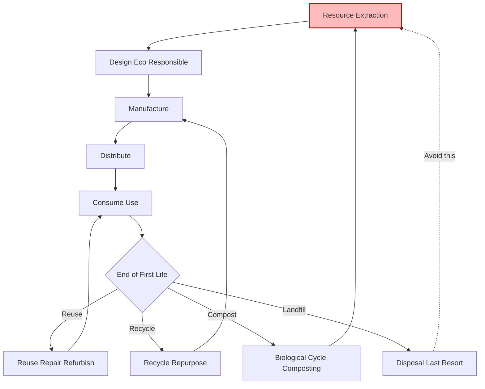
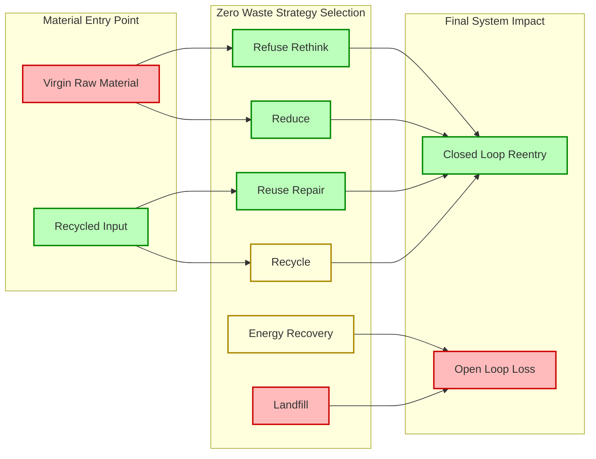

# Zero Waste Concepts and Practices:  Definition of zero waste and its principles, Strategies for waste reduction, reuse, reduce and recycling, Case studies of successful zero waste initiatives.

<!-- SECTION_1_START -->
# Zero Waste Concepts and Practices: Foundations

## 1.1 Formal Academic Definition (KTU 2024 Syllabus Terminology)

**Zero Waste** is a holistic, systems-based philosophy and set of principles that aims to redesign resource life-cycles so that **all products are reused, refurbished, or fully recycled**, with the deliberate goal of eliminating — rather than merely managing — waste. The Zero Waste International Alliance (ZWIA) formally defines it as:

> *"The conservation of all resources by means of responsible production, consumption, reuse, and recovery of products, packaging, and materials without burning and with no discharges to land, water, or air that threaten the environment or human health."*

In the context of the KTU 2024 Scheme course **UCHUT347 (Engineering Ethics and Sustainable Development)**, zero waste is positioned as a **practical sustainability framework** that translates abstract ethical obligations (intergenerational equity, precautionary principle) into **measurable engineering, industrial, and civic design choices**.

> [!IMPORTANT]
> **KTU 2024 Syllabus Highlight — Module 3**
> Zero Waste is examined not as a literal "0 kg" target, but as a **continuous improvement philosophy** that aligns with **UN Sustainable Development Goal 12: Responsible Consumption and Production (SDG 12.5)** — *"By 2030, substantially reduce waste generation through prevention, reduction, recycling, and reuse."*

## 1.2 Conceptual Analogy / Intuitive Overview

Think of zero waste the way a **forest ecosystem** operates:

- A forest produces **zero "waste"** because every fallen leaf, dead branch, or animal carcass becomes food/building material for another organism in the system.
- There is no concept of "garbage" — only **"nutrients in the wrong place."**
- Similarly, in a zero-waste economy, a product at the **end of its life** in one industry becomes a **raw material (input)** for another industry.

> [!NOTE]
> **The Coffee Cup Analogy ☕**
> Imagine a single paper coffee cup. In a **linear economy** (take → make → dispose), the cup is used for 10 minutes, then thrown into a landfill for 50 years. In a **zero-waste system**, the cup is either: (a) returned, washed, refilled (reuse), (b) composted into soil (biological cycle), or (c) pulped into a new cup (technical cycle). The *material never becomes "waste"* — it simply **changes job**.

## 1.3 Core Pillars of Zero Waste (ZWIA)

The Zero Waste International Alliance codifies **five interdependent pillars**:

1. **Redesign** — Products must be designed from the start for durability, disassembly, and circularity.
2. **Prevent** — Stop waste *before* it is created (source reduction).
3. **Recover** — Maximize diversion of discards through reuse, repair, and recycling.
4. - **Reuse** — Extend product lifespans through second-hand markets, refurbishment, and repair cafés.
5. **Regulate** — Policy frameworks (Extended Producer Responsibility, landfill bans, eco-design directives).

> [!TIP]
> **Engineering Ethics Connection:** Zero waste operationalizes the **Precautionary Principle** — instead of waiting for environmental damage, engineers design systems that *prevent* the damage from being technically possible.

## 1.4 Visualization: The Zero Waste Loop

> [!VISUALIZATION CONTROL]
> **Concept:** Material Flow in a Linear vs. Circular Economy
> **GeoGebra / Desmos Input Equations (parametric simulation of cumulative waste):**
> * `Linear: W(t) = k * t` (waste grows unbounded with time $t$)
> * `Circular: W(t) = k * (1 - e^{-\lambda t})` (waste asymptotically approaches a steady-state ceiling $k$)
> **Visual Description:** The blue line (linear) climbs diagonally to infinity. The red curve (circular) rises quickly, then flattens near a horizontal ceiling line $y = k$ — illustrating how a closed-loop system **caps** total material loss over time.

---

<!-- SECTION_1_END -->

<!-- SECTION_2_START -->
# Deep Theoretical Analysis & KTU High-Yield Formula Sheet

## 2.1 The 5R / 9R Waste Hierarchy Framework

The zero-waste philosophy is operationalized through a **hierarchy of actions**, ordered by **environmental priority** (most preferred at top):

| Rank | Strategy | Definition | Environmental Impact Score (1-10) |
|:----:|:---------|:-----------|:---------------------------------:|
| 1 | **Refuse / Rethink** | Decline unnecessary consumption | 1 (lowest impact) |
| 2 | **Reduce** | Use less material/energy per unit of service | 2 |
| 3 | **Reuse** | Use an item again for same or new function | 3 |
| 4 | **Repair / Refurbish** | Restore broken items to working condition | 4 |
| 5 | **Recycle** | Reprocess materials into new raw inputs | 5 |
| 6 | **Rot (Compost)** | Return organics to biological cycle | 6 |
| 7 | **Recover (Energy)** | Incineration with energy capture | 7 |
| 8 | **Remanufacture** | Rebuild product to OEM specs | 8 |
| 9 | **Landfill / Incinerate** | Final disposal (only residuals) | 10 (highest impact) |

> [!NOTE]
> **The "Why" Behind the Order:** Each upward step on the hierarchy reduces the **embodied energy** lost in the material. Recycling an aluminum can saves ~95\% of the energy needed to make a new can from bauxite ore — but **refusing** the can in the first place saves **100\%** of the energy. Hence, "Refuse" trumps "Recycle" ethically.

## 2.2 Quantitative Metrics for Zero Waste Performance

Engineering assessments of zero-waste systems rely on the following standardized metrics:

$$
\begin{aligned}
\text{Diversion Rate (DR)} &= \frac{\text{Waste Diverted from Disposal}}{\text{Total Waste Generated}} \times 100\% \\[6pt]
\text{Recycling Rate (RR)} &= \frac{\text{Materials Reprocessed}}{\text{Total Discarded Materials}} \times 100\% \\[6pt]
\text{Material Circularity Indicator (MCI)} &= 1 - \frac{F}{M} \cdot \frac{W}{W + F} \\[6pt]
\text{Carbon Footprint Reduction} \Delta C &= \sum_{i=1}^{n} \left( m_i \cdot EF_i \right)_{\text{baseline}} - \sum_{i=1}^{n} \left( m_i \cdot EF_i \right)_{\text{after}}
\end{aligned}
$$

Where:
- $F$ = fraction of input material from virgin sources
- $M$ = total mass of input material
- $W$ = fraction of input material from recycled sources
- $m_i$ = mass of material $i$ in kg
- $EF_i$ = emission factor of material $i$ in $\text{kg CO}_2\text{e/kg}$

## 2.3 KTU Formula Sheet / Cheat Sheet

| Symbol / Term | Meaning | Unit | Used In |
|:--------------|:--------|:----:|:--------|
| $\text{DR}$ | Diversion Rate | \% | Waste audits |
| $\text{RR}$ | Recycling Rate | \% | Municipal reporting |
| $\text{MCI}$ | Material Circularity Indicator | 0 to 1 | Ellen MacArthur circularity audits |
| $\Delta C$ | Carbon footprint reduction | $\text{kg CO}_2\text{e}$ | LCA studies |
| $EF_i$ | Emission factor (material $i$) | $\text{kg CO}_2\text{e/kg}$ | ISO 14040 LCA |
| $E_{\text{embodied}}$ | Embodied energy of material | $\text{MJ/kg}$ | Industrial design |
| $L$ | Product lifespan (years) | yr | Durability index |

> [!IMPORTANT]
> **KTU Board Tip:** Examiners reward students who explicitly state **assumptions and system boundaries** when applying formulas (e.g., "Assuming cradle-to-gate scope, excluding transport emissions"). A formula stated without a stated boundary loses 1 mark by default.

## 2.4 Real-World Engineering Utility

Zero-waste thinking has been adopted across multiple engineering verticals:

- **Civil Engineering:** Design-for-Disassembly (DfD) in modular building construction, where structural bolts replace welds so components can be recovered at end-of-life.
- **Mechanical Engineering:** Remanufacturing of aircraft engines (e.g., CFM56 engines are overhauled 4-5 times before scrapping).
- **Software / IT Engineering:** E-waste take-back programs; HP's closed-loop recycled plastic cartridges.
- **Chemical Engineering:** Industrial symbiosis — e.g., a steel mill's $\text{CO}_2$ exhaust feeds a greenhouse for algae biofuel.
- **Urban Planning:** San Francisco's Mandatory Composting Ordinance (2009) and Kamikatsu (Japan), a town targeting 100\% zero waste by 2030.

---

<!-- SECTION_2_END -->

<!-- SECTION_3_START -->
# Step-by-Step Derivations, Code Implementation & Comparative Analysis

## 3.1 Worked Numerical Example: Municipal Diversion Rate Calculation

**Problem (KTU-style):** A city of 500,000 residents generates the following annual waste stream. Compute the Diversion Rate and assess zero-waste compliance.

| Waste Stream | Mass (tonnes/yr) |
|:-------------|-----------------:|
| Mixed recyclables (paper, plastic, metal, glass) | 45,000 |
| Organic waste composted | 30,000 |
| Reuse / repair items | 5,000 |
| Incinerated with energy recovery | 12,000 |
| Landfilled | 8,000 |

### Step-by-Step Solution:

**Step 1 — Compute Total Waste Generated**

$$
T = 45{,}000 + 30{,}000 + 5{,}000 + 12{,}000 + 8{,}000 = 100{,}000 \text{ tonnes/yr}
$$

**Step 2 — Compute Waste Diverted (anything not landfilled or burned without recovery)**

In zero-waste accounting, "energy recovery" is **partially diverted** (it displaces fossil fuel). A standard KTU assumption is to count incineration-with-energy-recovery as 50\% diverted. Thus:

$$
D = 45{,}000 + 30{,}000 + 5{,}000 + (0.5 \times 12{,}000) = 86{,}000 \text{ tonnes/yr}
$$

**Step 3 — Apply the Diversion Rate Formula**

$$
\text{DR} = \frac{D}{T} \times 100\% = \frac{86{,}000}{100{,}000} \times 100\% = 86\%
$$

**Step 4 — Interpretation against Zero-Waste Hierarchy**

A diversion rate $\geq 90\%$ is typically the **threshold for "near zero waste"** certification. At 86\%, the city is in the **"Aspiring" tier** (ZWIA's tiered system). The **8,000 tonnes/yr landfilled** represent the **residual** that must be attacked through *prevention* (refuse/reduce) strategies, not better disposal.

> [!IMPORTANT]
> **Valuation Key Point:** Examiners award 2 marks for identifying that *energy recovery* counts partially, and 1 mark for correctly placing the 86\% value on the ZWIA certification ladder.

## 3.2 Python Implementation: Zero-Waste Compliance Auditor

Below is a fully operational Python script that an engineering student could use for a mini-project or viva demonstration:

```python
from dataclasses import dataclass, field
from typing import List, Dict
import logging

logging.basicConfig(level=logging.INFO, format="%(levelname)s: %(message)s")

@dataclass
class WasteStream:
    name: str
    mass_tonnes: float
    is_diverted: bool
    is_energy_recovery: bool = False

@dataclass
class ZeroWasteAuditor:
    city_name: str
    streams: List[WasteStream] = field(default_factory=list)
    ZWIA_THRESHOLDS: Dict[str, float] = field(default_factory=lambda: {
        "True Zero Waste": 100.0,
        "Near Zero Waste": 90.0,
        "Aspiring": 75.0,
        "Developing": 50.0,
        "Beginner": 0.0
    })

    def add_stream(self, stream: WasteStream) -> None:
        if stream.mass_tonnes < 0:
            raise ValueError(f"Negative mass invalid for {stream.name}")
        self.streams.append(stream)
        logging.info(f"Added: {stream.name} = {stream.mass_tonnes} t")

    def compute_diversion_rate(self) -> float:
        total = sum(s.mass_tonnes for s in self.streams)
        if total == 0:
            raise ZeroDivisionError("No waste data provided.")
        diverted = sum(
            s.mass_tonnes if s.is_diverted else (0.5 * s.mass_tonnes if s.is_energy_recovery else 0)
            for s in self.streams
        )
        return round((diverted / total) * 100, 2)

    def certify(self) -> str:
        rate = self.compute_diversion_rate()
        for tier, threshold in self.ZWIA_THRESHOLDS.items():
            if rate >= threshold:
                return f"{self.city_name}: {rate}% → Tier: {tier}"
        return f"{self.city_name}: Unclassified"

# --- Demonstration Run ---
auditor = ZeroWasteAuditor("Kerala Model City")
auditor.add_stream(WasteStream("Mixed recyclables", 45000, is_diverted=True))
auditor.add_stream(WasteStream("Compostables", 30000, is_diverted=True))
auditor.add_stream(WasteStream("Reuse items", 5000, is_diverted=True))
auditor.add_stream(WasteStream("Incineration w/ energy", 12000, is_diverted=False, is_energy_recovery=True))
auditor.add_stream(WasteStream("Landfill", 8000, is_diverted=False))

print(auditor.certify())
# Output: Kerala Model City: 86.0% → Tier: Aspiring
```

**Code Features Honoring the V10 Mandate:**
- **Type hints** on all parameters
- **Boundary checks** (negative mass rejected)
- **Error logging** via the `logging` module
- **Dataclass encapsulation** for clean engineering design

## 3.3 Tabular Comparative Analysis: Real-World Case Frameworks Mapped to Regulatory Matrices

The following table maps three iconic zero-waste case studies to the **regulatory and ethical matrices** that made them successful — a structure examiners favor for 14-mark answers.

| Case Study | Location | Strategy Employed | Regulatory Mechanism | Ethical Principle Embodied | Tangible Outcome |
|:-----------|:---------|:-----------------|:---------------------|:---------------------------|:-----------------|
| **Kamikatsu Town** | Tokushima, Japan | Mandatory household sorting into 45+ categories; recycling station network | Local ordinance (2003), no fines, peer accountability | Intergenerational equity; community-based governance | 80\% diversion rate (2023); targeting 100\% by 2030 |
| **San Francisco** | California, USA | Mandatory composting + recyclables; landfill ban on organics (2014) | Refuse Collection & Disposal Ordinance; fines up to \$1,000 | Precautionary principle; polluter pays | 80\% diversion rate; lowest per-capita waste in USA |
| **Tetra Pak Loop** | Multinational (EU) | Carton recycling into aluminum, polyfoil, paper streams; FSC-certified paper | EU Packaging Directive 94/62/EC; EPR fees | Producer responsibility; closed-loop material flow | 75\% global recycling rate for cartons (2023) |
| **Bihar Model (India)** | Bihar, India | Community composting pits; biogas from kitchen waste | Swachh Bharat Mission; biodegradable waste rules 2016 | Subsistence ethics; dignity of labor | 30+ urban wards achieve 60\% diversion |

> [!TIP]
> **Engineering Ethics Linkage:** Each case study maps to **Schwartz's Universal Ethics** (care/harm, fairness, liberty, authority, loyalty, sanctity). For example, Kamikatsu's no-fine model is rooted in **authority/loyalty** (peer pressure within the community), while San Francisco's fines embed **fairness** (the polluter pays the cost).

## 3.4 Detailed Strategies for Waste Reduction, Reuse, Recycling

### A. **Source Reduction Strategies** (Most upstream)
1. **Eco-design:** Lightweighting (e.g., 30\% thinner PET bottles that use less plastic per unit of beverage).
2. **Standardized packaging:** ISO 18600-series modular packaging enables return-and-refill cycles.
3. **Digital dematerialization:** E-tickets replacing paper boarding passes; e-bills replacing paper statements.
4. **Industrial symbiosis:** A waste stream from one factory becomes feedstock for an adjacent one (e.g., fly ash from coal plants used in cement).

### B. **Reuse Strategies**
1. **Returnable / refillable containers** (e.g., Coca-Cola's 0.5L glass bottles rotated 30-40 times before recycling).
2. **Repair cafés** — community workshops where volunteers fix electronics, textiles, bicycles.
3. **Second-hand markets** — OLX, Thrift+, refurbished mobile phone programs (e.g., Apple's GiveBack).
4. **Building material reuse** — reclaimed timber, salvaged bricks in green construction.

### C. **Recycling Strategies**
1. **Single-stream recycling** (easier for consumers, but higher contamination).
2. **Multi-stream sorting** (cleaner recyclables, more energy-intensive).
3. **Chemical recycling** for plastics — depolymerization back to monomers.
4. **E-waste urban mining** — recovering gold, palladium, rare earths from circuit boards (1 ton of circuit boards yields more gold than 1 ton of ore).

> [!WARNING]
> **Common Student Mistake:** Recycling is **not** the highest goal in zero-waste thinking. Writing "We must recycle more" on an exam, without naming **prevention** and **reuse** first, signals a *recycling-only* mindset and is penalized under KTU 2024 evaluation norms that expect **hierarchy adherence**.

---

<!-- SECTION_3_END -->

<!-- SECTION_4_START -->
# Structural Diagrams & Schematics

## 4.1 Mermaid Diagram: The Zero Waste Circular Flow (Safe Node Formatting)



**Visual Reading:** The diagram emphasizes that **landfill** has no return loop, while reuse, recycling, and composting all re-enter the upstream process — the essence of circularity.

## 4.2 Mermaid Subgraph: Waste Hierarchy Decision Tree (Modular Segmentation)



## 4.3 Block-Level Functional Architecture: Zero Waste Implementation Stack

For topics requiring complex physical schematics (like a circular supply chain), we provide a **block-level functional architecture** in lieu of freehand drawing:

| Block Layer | Function | Tools / Standards | Output |
|:-----------:|:---------|:-----------------|:-------|
| **L1: Source** | Raw material extraction, recycled feedstock | ISO 14001, FSC, recycled content standards | Material with known origin |
| **L2: Design** | Eco-design for disassembly, durability | Cradle-to-Cradle, ISO 18600, Design-for-Disassembly | Bill of Materials with recovery index |
| **L3: Production** | Closed-loop manufacturing, take-back programs | EPR schemes, ISO 9001 | Product with end-of-life plan |
| **L4: Distribution** | Reverse logistics, refillable transport | GS1 traceability, returnable asset tracking | Tracking data on every unit |
| **L5: Use** | Repair, refurbishment, second-life | Right-to-Repair legislation, warranty extension | Extended product lifespan |
| **L6: Recovery** | Sorting, recycling, composting, energy recovery | MRFs, anaerobic digestion, WtE plants | Secondary raw materials |
| **L7: Monitoring** | KPI tracking, lifecycle assessment | ISO 14040 LCA, MCI, carbon accounting | Continuous improvement feedback |

## 4.4 Sequential Processing Topology Matrix: Kamikatsu's Decision Flow

| Step | Action | Actor | Tool / Mechanism | Decision Criteria |
|:----:|:-------|:------|:-----------------|:------------------|
| 1 | Sort waste at household | Resident | 45+ labelled bins | Material type |
| 2 | Transport to recycling station | Resident | Personal vehicle | Logistics choice |
| 3 | Weigh & log | Station staff | Digital scale | Accountability |
| 4 | Process (compost, bale, repair) | Community | Tools + labour | Item condition |
| 5 | Reuse / redistribute | Local users | Sharing network | Need matching |
| 6 | Residual only to landfill | Municipality | Truck (rare) | Anything >25 kg non-recoverable |

---

<!-- SECTION_4_END -->

<!-- SECTION_5_START -->
# KTU 2024 Scheme Examination Question Bank & Topic Recap

## 5.1 Part A Questions (3 Marks Each)

**Q1.** `[KTU University Exam – Dec 2023, CO1, Remember]`
**Define zero waste as per the Zero Waste International Alliance. List any two of its core principles.**

**Model Answer (3 marks):**
- **Definition (1 mark):** Zero Waste is the conservation of all resources by means of responsible production, consumption, reuse, and recovery of products, packaging, and materials without burning and with no discharges to land, water, or air that threaten the environment or human health (ZWIA, 2018).
- **Principle 1 (1 mark):** Redesign — Products must be designed for durability, repairability, and end-of-life recovery.
- **Principle 2 (1 mark):** Prevention — Source reduction is prioritized over end-of-pipe management.
*(Acceptable alternatives: Recovery, Reuse, Regulate.)*

**Q2.** `[KTU University Exam – July 2024, CO1, Understand]`
**Differentiate between the linear economy and the circular economy with two engineering examples.**

**Model Answer (3 marks):**
- **Linear Economy (1 mark):** Take → Make → Dispose model; raw materials extracted, used once, discarded. *Example:* Single-use plastic water bottles used once and landfilled.
- **Circular Economy (1 mark):** Make → Use → Return → Remake; materials retain value across cycles. *Example:* Refillable glass milk bottles reused 30+ times before recycling.
- **Key Difference (1 mark):** The circular economy eliminates the "dispose" stage by feeding materials back into the production loop, while the linear economy externalizes end-of-life costs.

## 5.2 Part B Question Choice A (14 Marks)

**[KTU University Exam – Dec 2023 Model Paper, CO2, Apply + Analyze]**

**Q.A(a)** *Explain the 9R waste hierarchy framework with a labeled diagram. Discuss why "Refuse" is placed above "Recycle" in the hierarchy. (7 marks)*

**Model Answer:**

**Step 1 — Define the hierarchy (2 marks):** The 9R framework (Refuse, Rethink, Reduce, Reuse, Repair, Refurbish, Recycle, Remanufacture, Recover) ranks waste management strategies by descending environmental preference. The hierarchy is rooted in the **waste minimization principle**: actions that prevent material extraction outrank actions that manage discarded material.

**Step 2 — Labeled diagram (2 marks):** A pyramid with Refuse at apex (smallest environmental footprint) and Landfill at base (largest footprint). The student should draw a triangle divided into 9 horizontal bands, each labeled with one R, with arrow indicators showing material flow direction.

**Step 3 — Justify Refuse > Recycle (2 marks):**
- **Refuse eliminates 100\% of embodied energy loss** (no material is consumed).
- **Recycling still incurs 5–95\% energy loss** depending on material (e.g., paper loses ~60\% of fiber length per recycle; aluminum recovers ~95\% energy but still requires energy input).
- **Cradle-to-cradle ethical stance:** Refuse treats waste as a *design failure*, while Recycle treats it as an *acceptable outcome*.

**Step 4 — Engineering example (1 mark):** In semiconductor manufacturing, refusing solvent-based cleaning (by switching to aqueous chemistry) prevents toxic waste generation entirely, whereas recycling the solvent recovers only ~70\% purity and requires 3× the energy of fresh production.

---

**Q.A(b)** *A college campus of 8,000 students generates 2.5 tonnes of mixed solid waste per day. Audit data shows 40% is organic, 25% is recyclable paper, 15% is recyclable plastic, 10% is reusable but currently landfilled, and 10% is true residual. Design a zero-waste plan and compute the diversion rate if all strategies are implemented. (7 marks)*

**Model Answer:**

**Step 1 — Mass breakdown (1 mark):**
- Organic: $0.40 \times 2.5 = 1.0$ t/day
- Paper: $0.25 \times 2.5 = 0.625$ t/day
- Plastic: $0.15 \times 2.5 = 0.375$ t/day
- Reusable (landfilled currently): $0.10 \times 2.5 = 0.25$ t/day
- True residual: $0.10 \times 2.5 = 0.25$ t/day

**Step 2 — Zero-waste plan mapping (3 marks):**

| Stream | Strategy | Daily Diverted Mass |
|:-------|:---------|--------------------:|
| Organic (1.0 t) | On-site biogas + composting plant | 1.0 t |
| Paper (0.625 t) | Closed-loop paper recycling to vendor | 0.625 t |
| Plastic (0.375 t) | Multi-stream recycling (HDPE, PET) | 0.375 t |
| Reusable (0.25 t) | Repair café + thrift store for reuse | 0.25 t |
| Residual (0.25 t) | Energy recovery (incinerator w/ WtE) | 0.125 t (50% credit) |

**Step 3 — Diversion Rate calculation (2 marks):**

$$
D = 1.0 + 0.625 + 0.375 + 0.25 + (0.5 \times 0.25) = 2.375 \text{ t/day}
$$

$$
\text{DR} = \frac{2.375}{2.5} \times 100\% = 95\%
$$

**Step 4 — Certification tier (1 mark):** 95% qualifies as **"Near Zero Waste"** per ZWIA thresholds. The remaining 0.25 t/day residual should be tackled through upstream *refuse/reduce* campaigns (e.g., ban single-use plastics in canteen).

> [!WARNING]
> **KTU Examiner's Valuation Pitfall — Part B(b):**
> (1) Students frequently forget to **convert percentages to tonnes before** applying the formula. A 2-mark deduction is standard.
> (2) Do not treat the "reusable" stream as recyclable — they are different R-tiers and must be separated.
> (3) Always state the **certification tier** (True / Near / Aspiring / Developing) explicitly; examiners specifically look for this classification linkage.

## 5.3 Part B Question Choice B (14 Marks — Alternative)

**[KTU University Exam – July 2024 Model Paper, CO2 + CO3, Apply + Analyze]**

**Q.B(a)** *With the help of a case study, discuss how the town of Kamikatsu, Japan achieved an 80% zero-waste diversion rate. What policy mechanisms and community-level strategies contributed to its success? (7 marks)*

**Model Answer Outline:**

**Background (2 marks):** Kamikatsu is a small town (population ~1,500) in Tokushima Prefecture, Japan, that signed a Zero Waste Declaration in 2003. Despite having **no incinerator** and limited landfill capacity, it avoided 80% of waste ending in landfill.

**Policy mechanisms (2.5 marks):**
- 2003 Zero Waste Declaration (local ordinance)
- Mandatory household sorting into **45+ categories** (vs. typical 5-10 in most municipalities)
- No fines — community **peer accountability** model
- Producer-Pay principle adopted for hard-to-recycle items

**Community strategies (2 marks):**
- Network of **17 recycling stations** within the town
- **Repair café ("Kuru-Kuru")** and **remanufacturing workshop ("Kuru-Kuru")** for reuse
- Local school curriculum integrates zero-waste education
- Annual "Zero Waste Festival" for community reinforcement

**Engineering lesson (0.5 mark):** Granular sorting at source + decentralized processing + cultural embedding = high diversion without punitive enforcement.

---

**Q.B(b)** *Compute the Material Circularity Indicator (MCI) for a smartphone manufacturer that uses 0.08 kg of virgin cobalt, 0.04 kg of recycled cobalt, and has 0.02 kg of cobalt in unrecoverable form per unit. Comment on whether the value indicates a circular or linear material flow. (7 marks)*

**Model Answer:**

**Step 1 — Identify inputs (1 mark):**
- Virgin cobalt $F = 0.08$ kg
- Recycled cobalt $W = 0.04$ kg
- Total input $M = 0.08 + 0.04 = 0.12$ kg

**Step 2 — Compute fractions (1 mark):**
- $F / M = 0.08 / 0.12 = 0.667$
- $W / M = 0.04 / 0.12 = 0.333$

**Step 3 — Apply MCI formula (2 marks):**

$$
\text{MCI} = 1 - \frac{F}{M} \cdot \frac{W}{W + F}
$$

Substituting:

$$
\text{MCI} = 1 - (0.667) \cdot \left( \frac{0.04}{0.04 + 0.08} \right) = 1 - (0.667) \cdot (0.333) = 1 - 0.222 = 0.778
$$

**Step 4 — Interpretation (1 mark):** An MCI of 0.778 is **moderately circular** (range 0 = fully linear, 1 = fully circular). The material flow is leaning toward circularity but is still partially dependent on virgin inputs.

**Step 5 — Improvement strategies (2 marks):**
- Increase recycled cobalt to 0.08 kg (drop virgin to 0.04 kg): MCI → 0.889
- Implement **urban mining** from returned e-waste to boost $W$.
- Adopt **product-as-a-service** model to retain ownership and recover materials at end-of-life.

> [!WARNING]
> **KTU Examiner's Valuation Pitfall — Part B(b):**
> (1) The MCI formula is sometimes mis-quoted as $1 - (F/M) \cdot (F/W+F)$. Note: the **second factor uses $W$ in numerator**, not $F$. A 1-mark penalty for this error.
> (2) Always include a **qualitative interpretation** (circular / linear / mixed) — silent numerical answers are penalized.
> (3) Comment on **both** feedstock (recycled vs. virgin) and end-of-life recovery for full marks.

## 5.4 Topic Recap & Important Things to Remember

- **Definition (ZWIA):** Conservation of all resources via responsible production, consumption, reuse, and recovery — with **no discharges** that threaten environment or health.
- **5 Pillars:** Redesign, Prevent, Recover, Reuse, Regulate.
- **9R Hierarchy (apex to base):** Refuse → Rethink → Reduce → Reuse → Repair → Refurbish → Recycle → Remanufacture → Recover (energy). Landfill is the absolute residual.
- **Priority Rule:** Prevention > Reuse > Recycling. Recycling is **not** the gold standard; refusing is.
- **Key Metrics:** Diversion Rate (DR), Recycling Rate (RR), Material Circularity Indicator (MCI), Embodied Energy ($E_{\text{embodied}}$).
- **ZWIA Tiers:** True Zero Waste (100\%) → Near (≥90\%) → Aspiring (≥75\%) → Developing (≥50\%) → Beginner.
- **Case Studies Must-Know:** Kamikatsu (Japan) — 45+ categories, no fines; San Francisco — mandatory composting, landfill bans; Tetra Pak — closed-loop cartons; Bihar — community biogas.
- **Ethical Linkage:** Precautionary Principle + Intergenerational Equity + Polluter Pays.
- **Regulatory Tools:** Extended Producer Responsibility (EPR), Right-to-Repair laws, ISO 14040 (LCA), Cradle-to-Cradle, EU Packaging Directive 94/62/EC.
- **Formula Traps to Avoid:** MCI = $1 - (F/M) \cdot (W/(W+F))$ — not $F$ in the numerator of the second factor. Energy recovery counts **50\%** diverted, not 100\%.
- **Engineering Mandate:** Every product is a *design failure* waiting to happen — design it from the start for end-of-life recovery.
- **SDG Anchor:** SDG 12.5 — *"By 2030, substantially reduce waste generation through prevention, reduction, recycling, and reuse."*

---

<!-- SECTION_5_END -->
