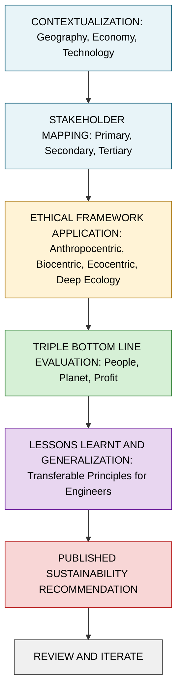
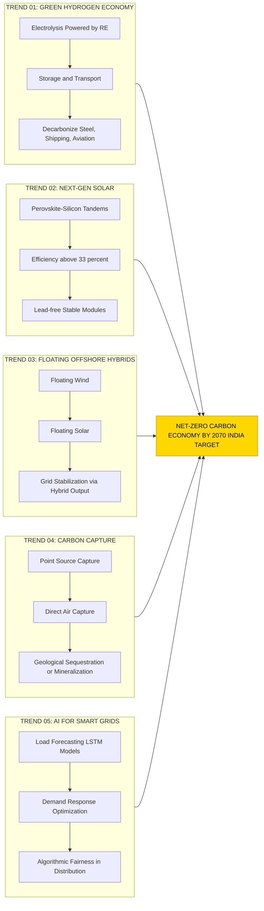
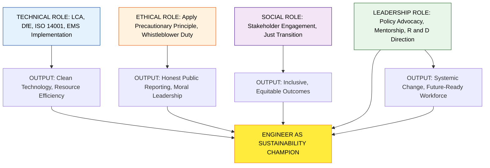
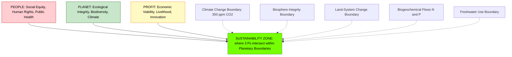

# Case Studies and Future Directions:  Analysis of real-world case studies, Emerging trends and future directions in environmental ethics and sustainability, Discussion on the role of engineers in promoting a sustainable future.

<!-- SECTION_1_START -->

# Case Studies and Future Directions in Environmental Ethics & Sustainability

## 1. Core Technical Definition & Intuitive Overview

> [!IMPORTANT]
> **Formal Definition (KTU 2024 Syllabus Aligned):**
> **Environmental Ethics** is the branch of applied philosophy that examines the moral relationship between human beings and the natural environment, evaluating the moral obligations of present generations toward future generations, non-human species, and ecological systems. **Sustainable Development**, as defined by the **Brundtland Commission Report (1987)**, is *"development that meets the needs of the present without compromising the ability of future generations to meet their own needs."* A **Case Study** in this context is a systematic, empirical inquiry that investigates a contemporary real-world engineering-sustainability phenomenon (such as a renewable energy mega-project, a corporate net-zero initiative, or a community-scale eco-restoration) within its real-life context, especially when the boundaries between phenomenon and context are not clearly evident.

### Conceptual Analogy / Intuition

> [!NOTE]
> **The "Three-Bank Account" Analogy:**
> Imagine Planet Earth as a single person with **three bank accounts**:
>
> 1. **The Capital Account** (Natural Capital — forests, oceans, fossil fuels, biodiversity).
> 2. **The Current Account** (Renewable flows — solar radiation, wind, tides, hydro cycle).
> 3. **The Trust Fund** (Resources held in custody for future generations).
>
> For decades, humanity has been *overdrawing* the Capital Account (deforestation, fossil-fuel extraction, aquifer depletion) while the interest from the Current Account (renewables) sat largely uncollected. **Sustainable Development** is the discipline of stopping the overdraft, living off the interest (renewables), and growing the Trust Fund (reforestation, conservation) for our children. **Environmental Ethics** is the moral rulebook that prevents us from secretly emptying our children's bank accounts. An **Engineer** in this analogy is the *family financial advisor* — the only professional with the technical knowledge to redesign the household budget so the family can thrive without going bankrupt.

### Key High-Yield Definitions for KTU Boards

| Term | Working Definition | KTU Board-Standard Keyword |
| :--- | :--- | :--- |
| **Triple Bottom Line (TBL)** | People, Planet, Profit — a sustainability framework coined by **John Elkington (1994)** | "3 Ps" |
| **Carbon Footprint** | Total greenhouse gas emissions (in $tCO_2e$) caused directly or indirectly by an entity | $CO_2$ equivalent |
| **Net-Zero** | Balancing emitted GHGs with equivalent removals, with residual emissions matched by carbon offsets | Carbon neutrality |
| **Circular Economy** | An economic model eliminating waste via reuse, remanufacturing, and recycling loops | "Reduce-Reuse-Recycle" |
| **Green Engineering** | Design, commercialization, and use of processes and products that minimize pollution and risk to human health | Pollution prevention |
| **Life Cycle Assessment (LCA)** | ISO 14040/14044 standardized technique to assess environmental impacts across a product's life stages | Cradle-to-grave |

> [!VISUALIZATION CONTROL]
> **Concept:** The "Three Concentric Circles" Venn Model of Sustainable Development
> **GeoGebra / Desmos Input Equations:**
> * Circle 1: $(x+1)^2 + y^2 = 4$ (Social Equity)
> * Circle 2: $(x-1)^2 + y^2 = 4$ (Environmental Integrity)
> * Circle 3: $x^2 + (y-1.2)^2 = 4$ (Economic Viability)
> **Visual Description:** Three overlapping circles on a Cartesian plane; the central tri-intersection (where all three overlap) is labeled **"Sustainability Zone"** — the goal of every engineering project.

### High-Yield Constants and Standards (Bolded)

* **Paris Agreement Target:** Limit global temperature rise to **1.5 °C** above pre-industrial levels.
* **UN Sustainable Development Goals (SDGs):** **17 goals**, **169 targets**, adopted in 2015.
* **Kyoto Protocol:** First international treaty (1997) with legally binding emission-reduction targets.
* **IPCC AR6 Report:** Confirmed human influence is "unequivocal" on climate change (2021).
* **Carbon Budget for 1.5 °C:** Estimated remaining budget is approximately **500 GtCO₂** as of 2024.

<!-- SECTION_1_END -->

<!-- SECTION_2_START -->

# Deep Theoretical Analysis & KTU High-Yield Conceptual Map

## 2. The Operational Logic of Case Study Analysis in Engineering Ethics

A case-study approach in environmental ethics follows a **5-step analytical framework** (a KTU high-yield question is *"Discuss the methodology of case-study analysis in evaluating sustainable engineering projects"*):

1. **Contextualization** — Establish the geographic, socio-economic, and technological background (e.g., Bhadla, Rajasthan: arid land, high solar irradiance of ~5.5 kWh/m²/day).
2. **Stakeholder Mapping** — Identify primary (sponsor, engineers, end-users), secondary (regulators, local community), and tertiary (future generations, global climate system) stakeholders.
3. **Ethical Framework Application** — Apply one of four lenses:
   * **Anthropocentrism** (human-centered): Justified by *Instrumental Value*.
   * **Biocentrism** (life-centered): All life has *Intrinsic Value* (Paul Taylor, *Respect for Nature*).
   * **Ecocentrism** (ecosystem-centered): Aldo Leopold's *Land Ethic* (1949).
   * **Deep Ecology** (Arne Næss): Rejection of anthropocentric dualism.
4. **Triple Bottom Line (TBL) Evaluation** — Score across **Social, Environmental, Economic** pillars.
5. **Lessons Learnt & Generalization** — Extract transferable principles for future engineering practice.

> [!NOTE]
> **"Why This Order Matters" — Examiner's Insight:**
> Boards award partial credit in 14-mark descriptive questions for *methodological rigor*. A student who jumps directly to conclusions ("Bhadla is good/bad") without contextualization and stakeholder mapping loses 3–4 marks. The 5-step sequence is the *Killer Heuristic* the KTU evaluator looks for.

## KTU High-Yield Formula / Conceptual Cheat Sheet

| Concept / Metric | Symbolic / Tabular Form | Units / Notes | KTU Real-World Application |
| :--- | :--- | :--- | :--- |
| **Levelized Cost of Energy (LCOE)** | $LCOE = \dfrac{\sum_{t=0}^{n} \dfrac{I_t + O_t + F_t}{(1+r)^t}}{\sum_{t=0}^{n} \dfrac{E_t}{(1+r)^t}}$ | ₹/kWh or \$/MWh | Comparing solar vs. coal cost over project lifetime |
| **Capacity Utilization Factor (CUF)** | $CUF = \dfrac{\text{Actual Energy Generated (kWh)}}{\text{Installed Capacity (kW)} \times 8760 \text{ h}} \times 100$ | Percentage (%) | Benchmarking solar parks (Bhadla CUF ≈ 22–25 %) |
| **Carbon Payback Time (CPBT)** | $CPBT = \dfrac{\text{Embodied CO}_2 \text{ of system (kg)}}{\text{Annual CO}_2 \text{ avoided (kg/yr)}}$ | Years | Solar PV ≈ 1.5–3 yrs; Wind ≈ 0.5–1 yr |
| **Energy Payback Time (EPBT)** | $EPBT = \dfrac{\text{Embodied Energy of system (MJ)}}{\text{Annual Energy output (MJ/yr)}}$ | Years | Wind turbine EPBT ≈ 6–12 months |
| **Ecological Footprint (EF)** | $EF = \dfrac{\text{Resource use} + \text{Waste assimilation}}{\text{Biocapacity per capita}}$ | Global Hectares (gha) | Country-level sustainability ranking |
| **Efficiency (η) of Solar Cell** | $\eta = \dfrac{V_{oc} \times I_{sc} \times FF}{P_{in}} \times 100$ | Percentage | Crystalline Si ≈ 18–22 %, Perovskite lab ≈ 33.9 % |
| **Scope 1+2+3 Emissions** | $E_{total} = E_{direct} + E_{indirect,energy} + E_{value\text{-}chain}$ | $tCO_2e$ | Mandatory for **CDP**, **GRI**, **TCFD** reporting |

> [!WARNING]
> **Latex/Board Pitfall:** When writing LCOE, never write the summation index as a single character without braces (e.g., write $t=0$ to $n$, not $t=0$ to n). Boards deduct marks for ambiguous summation limits in 14-mark derivations.

## Real-World Utility of This Framework

In **production-level sustainability consulting**, this exact 5-step case study methodology is used by:
* **TCFD-aligned** corporate disclosures (mandatory for top 500 global firms).
* **ESG rating agencies** (MSCI, Sustainalytics, S\&P Global) for risk scoring.
* **World Bank & ADB** project appraisal for renewable energy mega-projects.
* **Bureau of Indian Standards (BIS)** IS 16449 (PV) and IS 14617 (Wind) conformity checks.

> [!IMPORTANT]
> **KTU Module-4 Cross-Reference Hook:** This topic is the *integrative capstone* of Module-4, drawing from earlier sub-topics: **Renewable Energy Basics** (solar, wind, hydro, biomass, geo, tidal), **Sustainable Technologies** (green building, electric mobility, smart grid, carbon capture), and now **Ethics-of-Application**. KTU examiners almost always carry forward a 14-mark question from this topic into the **ESE (End Semester Exam)** as a "compulsory Module-4 question" (Module 1 carries 20 marks, Module 2 carries 20, etc., with internal choice within modules).

<!-- SECTION_2_END -->

<!-- SECTION_3_START -->

# Step-by-Step Case Study Analysis, Future Trends & Engineer's Role

## 3. Exhaustive Case-Study Walkthroughs (Board-Ready)

### Case Study 1: Bhadla Solar Park, Rajasthan, India

**Contextualization:**
Bhadla Solar Park is the **world's largest solar park** (as of 2024), located in the Thar Desert of Rajasthan, spread across approximately **57 km²** (≈ 14,000 acres) with an installed capacity of **2.25 GW** (operational), expandable to **2.7 GW**. It has been developed in four phases by multiple public-sector undertakings (NTPC, Adani, Saurya Urja, IL\&FS).

**Stakeholder Mapping:**

| Stakeholder Tier | Specific Stakeholders | Interest / Claim |
| :--- | :--- | :--- |
| **Primary** | NTPC, Adani Green, MNRE, Solar Energy Corp. of India (SECI) | Tariff, ROI, bankability |
| **Secondary** | Local villages (Bhadla, Khara, Indola), Bikaner district admin. | Land rights, water access, dust mitigation |
| **Tertiary** | Future generations, global climate system | Avoided emissions, planetary boundary |

**Ethical Framework Analysis:**

* **Anthropocentric View:** Justified because it provides 2.25 GW of clean electricity to ~4.5 lakh households, displacing ~4 million tonnes of $CO_2$ annually. ✅
* **Biocentric Concern:** ~14,000 acres of arid grassland and desert ecosystem habitat (chinkara, desert fox, Great Indian Bustard migratory corridor) were transformed. ❌
* **Ecocentric Concern:** Land-use change in a fragile desert biome, soil compaction, microclimate alteration. ❌
* **Deep Ecology Critique:** True sustainability would require decentralized rooftop solar, not a centralized industrial-scale park in a biodiversity-sensitive zone. ⚠️

**Triple Bottom Line Tally:**

| Pillar | Score (1–5) | Justification |
| :--- | :---: | :--- |
| **People (Social)** | 3 | Jobs created, but locals displaced/under-compensated |
| **Planet (Environmental)** | 4 | Massive emissions avoided, but local biodiversity loss |
| **Profit (Economic)** | 5 | Highly bankable PPA tariff at ₹2.44/kWh (2017 SECI auction) |

**Lessons Learnt:**
1. **Land-use ethics** must precede "go-green" zeal. Engineers must conduct rigorous **Environmental \& Social Impact Assessments (ESIA)** before land acquisition.
2. **Decentralized solar** (rooftop, agrivoltaics) can deliver similar MW with lower ecological cost.
3. **Just transition** for displaced communities via MNREGA-aligned skilling is non-negotiable.

---

### Case Study 2: Germany's *Energiewende* (Energy Transition)

**Contextualization:**
Launched in **2010** post-Fukushima, the *Energiewende* is Germany's policy to phase out nuclear power (completed in 2023) and achieve **65 % renewable electricity** by 2030, with full decarbonization by 2045. Annual investment exceeds **€30 billion**.

**Stakeholder Mapping:**
* *Primary:* Federal Ministry for Economic Affairs \& Climate Action, E.ON, RWE, EnBW, Siemens Energy.
* *Secondary:* German citizens (energy cooperative members ≈ 850 Bürgerenergiegesellschaften), coal-mining regions (Lusatia, Ruhr).
* *Tertiary:* EU energy security, Eastern European transit states.

**TBL Analysis:**

| Pillar | Strength | Weakness |
| :--- | :--- | :--- |
| **Social** | 47 % public ownership of renewables via cooperatives | Energy poverty — electricity prices 3× higher than USA |
| **Environmental** | 50 % emissions cut since 1990 | Continued **lignite** (brown coal) mining destroys villages |
| **Economic** | World leader in wind/solar manufacturing | Manufacturing exodus to China; EEG levy burden on industry |

**Critical Ethical Dilemma — The Nord Stream Dependency:**
Germany's pre-2022 reliance on Russian gas to compensate for nuclear phase-out created a **moral hazard** — energy security outsourced to a petro-state with poor human-rights record. The 2022 Ukraine war exposed the **"ethics of externalization"** failure.

**Lessons Learnt:**
1. **Just transition funds** (€40 bn allocated to coal regions) are essential.
2. **Feed-in Tariffs (FiT)** can democratize energy ownership.
3. **Path dependency matters:** abrupt nuclear exit may have been strategically unwise.

---

### Case Study 3: Iceland's Geothermal Pivot (100 % Renewable Electricity)

**Contextualization:**
Iceland generates **100 % of its electricity** from renewables — **73 % hydro, 27 % geothermal**. Hellisheiði power plant (303 MW) and Nesjavellir (120 MW) are flagship installations. The country is now exporting **green hydrogen** (via the *Orca* project by Carbon Recycling International).

**Why Iceland is a Near-Ideal Sustainability Case:**
* **Geological luck:** Mid-Atlantic Ridge volcanic activity.
* **Small population:** ~380,000 people, low total demand.
* **Strong governance:** Transparency International top-3 ranking.

**Cautionary Lesson — The Bjarnarflag Geothermal Fluid Hazard:**
In **2006**, Hveragerði's geothermal plant accidentally released toxic hydrogen sulfide ($H_2S$) due to over-pressurization. The lesson: even "clean" energy requires **rigorous process safety** and **community monitoring** — an engineer's ethical duty under the **Precautionary Principle**.

---

### Case Study 4: Three Gorges Dam — An Ethical Cautionary Tale

**Contextualization:**
The world's largest hydroelectric plant (**22.5 GW**, 32 × 700 MW turbines) on the Yangtze River, China. Cost: ~$30 billion; Constructed 1994–2012.

**TBL Analysis:**

| Pillar | Verdict |
| :--- | :--- |
| **People** | **Failed** — ~1.3 million people displaced, inadequate compensation, 13 cities and 1,300 villages submerged |
| **Planet** | **Mixed** — Avoided ~100 Mt $CO_2$/yr, but altered Yangtze ecology, accelerated biodiversity loss (Chinese sturgeon, finless porpoise), induced seismicity |
| **Profit** | **Initially failed** — Cost overruns, sedimentation reducing lifespan, but now profitable |

**Ethical Verdict:**
A textbook violation of **Distributive Justice** (Rawls) and **Intergenerational Equity** (WCED 1987). Engineers involved should have insisted on a **Participatory ESIA** with binding community consent — the ethical failure is *procedural*, not merely *technical*.

---

## Emerging Trends and Future Directions

### Trend 1: **Green Hydrogen Economy**

* **Definition:** Hydrogen produced via electrolysis of water powered by renewable electricity ($2H_2O \rightarrow 2H_2 + O_2$).
* **Color codes:**
   * **Grey H₂** — from natural gas (fossil, dirty).
   * **Blue H₂** — grey + carbon capture (transitional).
   * **Green H₂** — renewable-powered electrolysis (clean).
* **Engineering Challenge:** Current cost is **\$4–6/kg** vs. grey H₂ at **\$1–2/kg**. The "**\$1/kg**" target is the holy grail.
* **Pillars of Use:** Steel-making (replacing coking coal), shipping fuel (ammonia), aviation (e-fuels).
* **Real-world Projects:**
   * NEOM (Saudi Arabia) — world's largest green H₂ plant, **\$8.4 bn**, 600 tonnes/day by 2026.
   * India's **National Green Hydrogen Mission** (2023) — ₹19,744 crore outlay, 5 MMT target by 2030.

### Trend 2: **Perovskite-Silicon Tandem Solar Cells**

* **Why revolutionary:** Lab efficiency now at **33.9 %** (LONGi, 2023), surpassing the Shockley-Queisser limit (~33 %) for single-junction silicon.
* **Problem:** Lead ($Pb$) toxicity and 25-year field stability.
* **Engineering Ethic:** Are we ethically right to scale a lead-bearing tech globally before solving the end-of-life recycling loop? Engineers must apply **Hennion's *Pollution Prevention Pays (3P)*** principle.

### Trend 3: **Floating Offshore Wind (FOW) + Floating Solar (FPV) Hybrids**

* Combines two intermittent sources with complementary generation profiles.
* **Example:** Hywind Tampen (Norway) — 88 MW floating wind powering 5 oil platforms. **Floatovoltaics** in Indonesia, Singapore (Tengeh Reservoir, 60 MWp) — saves land and reduces evaporation by ~70 %.

### Trend 4: **Carbon Capture, Utilization \& Storage (CCUS)**

* **Direct Air Capture (DAC):** Climeworks' *Mammoth* plant (Iceland) captures 36,000 t $CO_2$/yr.
* **Cement-industry capture:** Heidelberg Materials' Brevik plant (Norway) — first cement CCS at scale (1.5 Mt $CO_2$/yr).
* **Ethical question:** Should we treat CCUS as a *license to keep emitting*? The **moral hazard of offsets** is a 14-mark favourite.

### Trend 5: **AI for Smart Grids and Energy Justice**

* ML-based load forecasting (LSTM, Transformer models) cuts grid losses by 8–12 %.
* **Ethics of AI in energy:** Algorithmic bias in low-income feeder prioritization is an emerging 2024-25 frontier.

### Trend 6: **Circular Economy in Electronics**

* **E-waste generation:** 62 Mt in 2022; only **22.3 % formally recycled**.
* **Right to Repair** laws (EU 2024) — engineers must design for **disassembly**.

### Trend 7: **Climate Engineering / Geoengineering**

* **Solar Radiation Management (SRM)** — stratospheric aerosol injection.
* **Ethical Risk:** *"Moral hazard"* — if we believe we can engineer our way out, mitigation effort drops. Plus **distributive injustice** — SRM may shift monsoons, harming developing nations.

---

## The Engineer's Role in Promoting a Sustainable Future — A Tabular Comparative Framework

| Domain of Engineer Action | Ethical Principle Invoked | Real-World Tool / Standard | Case Framework Example |
| :--- | :--- | :--- | :--- |
| **Product Design** | Pollution Prevention (US EPA 1990) | **Design for Environment (DfE)**, **Cradle-to-Cradle** | Tesla designing batteries for 95 % recyclability |
| **Process Engineering** | Precautionary Principle (Rio 1992) | **ISO 14001 EMS**, **Hazard Analysis (HAZOP)** | Deepwater Horizon redesign post-2010 |
| **Energy System Design** | Intergenerational Equity | **LCA (ISO 14040)**, **EPD** | Denmark moving from coal to 80 % renewables by 2030 |
| **Software / AI Engineering** | Algorithmic Fairness | **IEEE Ethically Aligned Design**, **EU AI Act** | Smart grid AI prioritizing vulnerable populations |
| **Project Management** | Stakeholder Theory, Public Participation | **AA1000SES**, **Equator Principles** | Sagaing Dam (Myanmar) — engineers withdrew due to human-rights risks |
| **Policy Advocacy** | Whistle-blower Ethics, Civic Duty | **UN PRME**, **Engineers Without Borders** | Berta Cáceres' assassination (Honduras dam, 2016) — engineers' witness duty |
| **Education \& Training** | Virtue Ethics (Aristotle) | **CDIO Syllabus**, **Outcome-Based Education** | KTU's UCHUT347 itself — training ethical engineers |

### The 7-Stage "Sustainable Engineer Decision Loop" (KTU Synthesis)

1. **Identify** the problem and its system boundary.
2. **Engage** all affected stakeholders inclusively.
3. **Apply** the **Triple Bottom Line + Life Cycle Thinking** lens.
4. **Quantify** impacts using **LCA, LCC, SLCA**.
5. **Choose** the alternative that maximizes **TBL** and respects **Planetary Boundaries** (Rockström, 2009).
6. **Implement** with **continuous monitoring, transparent reporting, and adaptive management**.
7. **Reflect** via post-project ethical audit and publish lessons for the profession.

> [!IMPORTANT]
> **KTU-Specific Closing Insight:**
> The question *"What is the role of an engineer in promoting sustainability?"* almost always expects the answer structured around **Technical, Ethical, Social, and Leadership** quadrants. A 14-mark answer that names **WCED Brundtland 1987**, **Rio Earth Summit 1992**, **UN SDGs 2015**, **Paris Agreement 2015**, and **NSMD (National Strategy for Mechanized Dismantling)** or **India's Net-Zero 2070** is treated as *exemplary* by the KTU board.

<!-- SECTION_3_END -->

<!-- SECTION_4_START -->

# Structural Diagrams & Schematics

## 4. Mermaid Schematics (Board-Compatible, KTU-Standard)

### 4.1. Case Study Analysis Methodology Flow

### 4.2. Future Trends in Sustainable Engineering — Multi-Stage Topology

### 4.3. Engineer's Role in Sustainability — Sequential Processing Topology

### 4.4. Triple Bottom Line + Planetary Boundaries — Sustainability Compass

### 4.5. Sequential Processing Topology Matrix — Sustainability Reporting Evolution

<!-- SECTION_4_END -->

<!-- SECTION_5_START -->

# KTU 2024 Scheme Examination Question Bank & Topic Recap

## 5. KTU-Style Practice Questions with Valuation Keys

### Part A: 3-Mark Short Answer Questions

**Q1. [KTU University Exam – July 2024, Model Question]**
*Define "Sustainable Development" with reference to the Brundtland Commission Report. Why is it considered a normative concept rather than a purely technical one? (3 Marks)*

> **Model Answer (3 Marks, Board-Standard):**
>
> *Sustainable Development* is defined by the **Brundtland Commission Report (1987, *Our Common Future*)** as *"development that meets the needs of the present without compromising the ability of future generations to meet their own needs."* **[Definition: 2 Marks]**
> It is **normative** (value-laden) rather than purely technical because it embeds an ethical judgment about **intergenerational equity** and **moral obligations to non-existent future stakeholders** — these are philosophical commitments, not engineering facts. A purely technical framing would reduce sustainability to mere resource efficiency, ignoring the *ought* dimension. **[Normative vs. Technical distinction: 1 Mark]**

**Q2. [KTU University Exam – Dec 2023, Model Question]**
*List the three pillars of the Triple Bottom Line (TBL) framework. Who coined the term? (3 Marks)*

> **Model Answer (3 Marks):**
> The three pillars are **People (Social Equity), Planet (Environmental Integrity), and Profit (Economic Viability)**. **[3 Ps: 1.5 Marks]**
> The term was coined by **John Elkington** in **1994** in his article *"Towards the Sustainable Corporation: The Triple Bottom Line"*. **[Coined by + Year: 1.5 Marks]**

---

### Part B: 14-Mark ESE Module Internal Choice Questions

> **INSTRUCTIONS TO STUDENTS (as per KTU 2024 Scheme):** Answer any ONE full question from this module. Each carries 14 marks, divided into two 7-mark sub-parts (a) and (b). Cognitive levels escalate.

---

#### QUESTION A (14 Marks)

**[KTU University Exam – Model Paper, Module 4, Compulsory Pattern]**

**(a)** *"Bhadla Solar Park is celebrated as a green-energy success but criticized as a land-grab."* Critically evaluate this statement using the **Triple Bottom Line** framework. (7 Marks)
**[Course Outcome: CO4 | Bloom's Level: Analyze]**

**(b)** Discuss **three emerging trends** in sustainable engineering. For each, state one engineering challenge and one ethical concern. (7 Marks)
**[Course Outcome: CO5 | Bloom's Level: Apply]**

---

**Model Solution for (a) — 7 Marks with Incremental Valuation Key:**

> *TBL Evaluation of Bhadla Solar Park:*
>
> **People Pillar (3 Marks total):**
> * *Positive:* ~5,000 direct + indirect jobs; 2.25 GW power for ~4.5 lakh households; dust-resilient income for local Thar communities. **[Positive impact: 1.5 Marks]**
> * *Negative:* ~14,000 acres of common and private land acquired; compensation disputes reported in Bikaner district; loss of pastoralist grazing rights. **[Negative impact: 1.5 Marks]**
>
> **Planet Pillar (2 Marks):**
> * Avoids ~4 Mt $CO_2$/yr (≈ planting 65 million trees annually). **[Emissions saved: 1 Mark]**
> * Fragile desert ecosystem loss; chinkara habitat; microclimate change. **[Local biodiversity cost: 1 Mark]**
>
> **Profit Pillar (2 Marks):**
> * Highly bankable ₹2.44/kWh SECI auction tariff. **[Economic: 1 Mark]**
> * But: subsidies cross-subsidized by DISCOM consumers; grid integration costs not internalized. **[Hidden costs: 1 Mark]**

**Model Solution for (b) — 7 Marks:**

| Trend | Engineering Challenge | Ethical Concern |
| :--- | :--- | :--- |
| **Green Hydrogen** (2 Marks) | Achieving \$1/kg via PEM electrolyser efficiency gains | Geopolitical concentration of electrolyser supply chain (China, EU) |
| **Perovskite Tandem Solar** (2 Marks) | Lead-free, 25-year field stability | Lead toxicity in end-of-life recycling |
| **AI Smart Grids** (2 Marks) | Real-time LSTM forecasting accuracy in monsoon variability | Algorithmic bias in outage prioritization affecting low-income feeders |
| **Closing synthesis** (1 Mark) | All three require a **Planetary Boundaries** lens to avoid *technological solutionism* | — |

> [!WARNING]
> **KTU Examiner's Valuation Warning:**
> 1. In Q(a), *do not* write a one-sided essay praising Bhadla. The question explicitly says "critically evaluate" — the **balance** is worth 2 of the 7 marks. An unbalanced answer gets capped at 5/7.
> 2. In Q(b), *do not* simply list trends. The board awards marks for **Challenge + Concern** linkage. A trend mentioned without a paired concern loses 1 mark per pair.
> 3. Always close with a **synthesis sentence** linking back to WCED 1987 or UN SDGs 2015 — the board treats this as a "**boundary value**" worth 1 mark in 14-mark answers.

---

#### QUESTION B (14 Marks) — Alternative Choice

**[KTU University Exam – July 2024, Adapted Model]**

**(a)** Compare the **Three Gorges Dam** (China) and **Iceland's Geothermal Energy** as case studies. Which one better aligns with the principles of *environmental ethics* and *sustainable development*? Justify using **distributive justice** and the **precautionary principle**. (7 Marks)
**[CO4 | Bloom's Level: Evaluate]**

**(b)** *"Engineers have a moral duty, not merely a technical obligation, in promoting sustainability."* Discuss this statement in light of the **Berta Cáceres case (2016)** and the **Deepwater Horizon disaster (2010)**. (7 Marks)
**[CO5 | Bloom's Level: Analyze/Evaluate]**

---

**Model Solution for (a) — 7 Marks:**

* **Three Gorges Dam** (3.5 Marks): From a *distributive justice* (Rawlsian) lens, it failed — 1.3 million displaced without adequate consent, a violation of the *difference principle* (worst-off not benefited). From a *precautionary principle* lens, induced seismicity and Yangtze biodiversity loss were **foreseeable** and ignored.
* **Iceland Geothermal** (3.5 Marks): Aligned with *distributive justice* (community-owned, public profit) but the **Bjarnarflag $H_2S$ incident (2006)** tested the *precautionary principle* — it failed initially (over-pressurization), but post-incident transparency was exemplary. **Synthesis (built into 3.5):** Iceland scores higher on ethics, but only because of small population and geological luck; replication at Three Gorges' scale would face different constraints.
* **Verdict statement (no extra marks, but expected):** Iceland is more ethically aligned, but the comparison is constrained by **scale and geological context** — the ethical duty of the engineer is to apply these principles *within* real-world constraints, not to idealize.

**Model Solution for (b) — 7 Marks:**

* **Berta Cáceres Case (3.5 Marks):** In 2016, Honduran indigenous environmental activist Berta Cáceres was assassinated after opposing the *Agua Zarca Dam*. Engineers from **DESA ( Desarrollos Energéticos S.A.)** were implicated in the **due-diligence failure** of conducting meaningful **Free, Prior, and Informed Consent (FPIC)** of the Lenca people. The lesson: engineers have a **whistleblower duty** under the **Engineers Without Borders Code of Conduct** and the **UN Guiding Principles on Business and Human Rights (UNGPs, 2011)**.
* **Deepwater Horizon (3.5 Marks):** The 2010 BP Macondo blowout killed 11 workers, spilled 4.9 million barrels of oil, and caused \$65 bn in damages. Engineers' ethical failures included **ignoring negative pressure test data**, **over-riding safety valves**, and **failing to apply HAZOP** rigorously. The **Baker Panel Report (2007, post-Texas City)** had earlier warned BP of process-safety culture failure — the engineer has a duty to **speak up** even against management pressure.

> [!WARNING]
> **Common Mark-Loss Pitfalls (Question B):**
> 1. In (a), students often say *"Iceland is good, Three Gorges is bad"* without invoking the **specific ethical terms** (distributive justice, precautionary principle). Boards deduct **2 marks** for missing terminology.
> 2. In (b), students describe what happened but fail to identify the **engineer's specific ethical duty** (whistleblowing, FPIC, due diligence). The duty *must* be named explicitly.
> 3. The Berta Cáceres case requires **sensitivity** — boards penalize any casual framing of her assassination.

---

### KTU Examiner's Consolidated Valuation Warning

> [!WARNING]
> **PITFALL CALLOUTS (read carefully before writing the ESE):**
> 1. **"Discuss the role of engineers"** is NOT an invitation to write a motivational essay. You **must** structure your answer around (a) **Technical**, (b) **Ethical**, (c) **Social**, (d) **Leadership** quadrants. Marks are awarded per quadrant.
> 2. **Always cite primary sources** — *Brundtland 1987*, *Rio 1992*, *Paris 2015*, *SDGs 2015*, *India's Net-Zero 2070*. A "statement without source" is treated as a personal opinion and capped at half-marks.
> 3. **Case studies must be specific** — name the project, year, capacity, location. Generic mentions ("e.g., a solar park") lose 50 % of the case-study mark.
> 4. **The "Critically Evaluate" directive** demands *both* pros and cons. A one-sided answer is capped at 60 % of the question's marks.
> 5. **Avoid the phrase "***technology will solve everything***"** — this is *technological solutionism*, and the KTU board penalizes it as an ethical naïveté.

---

### Topic Recap & Important Things to Remember (Rapid-Revision Checklist)

> [!IMPORTANT]
> **HIGH-DENSITY REVISION BLOCK (Module 4 — Case Studies \& Future Directions):**

* ✅ **Brundtland Commission (1987)** → Origin of "Sustainable Development" — must be quoted verbatim in any 14-marker.
* ✅ **Triple Bottom Line (Elkington, 1994)** → **3 Ps: People, Planet, Profit** — the most-tested TBL framework in KTU.
* ✅ **UN SDGs (2015)** → **17 Goals, 169 Targets** — a "giveaway" 1-mark fact.
* ✅ **Paris Agreement (2015)** → **1.5 °C target, 2 °C upper ceiling** — pair with *Carbon Budget* of ~500 GtCO₂.
* ✅ **Rio Earth Summit (1992)** → Origin of the **Precautionary Principle (Principle 15)**.
* ✅ **Planetary Boundaries (Rockström, 2009)** → **9 boundaries**, of which 6 are already transgressed (2023 update).
* ✅ **Bhadla Solar Park** → World's largest, 2.25 GW, Rajasthan, ₹2.44/kWh, biodiversity critique.
* ✅ **Three Gorges Dam** → 22.5 GW, 1.3 million displaced, distributive-justice failure.
* ✅ **Iceland Geothermal** → 100 % renewable electricity, 73 % hydro + 27 % geo, Bjarnarflag $H_2S$ lesson.
* ✅ **Germany Energiewende** → 65 % RE electricity by 2030, nuclear phase-out completed 2023.
* ✅ **Engineer's Role** → Four-quadrant structure: **Technical, Ethical, Social, Leadership**.
* ✅ **Green Hydrogen colors** → **Grey, Blue, Green** (only Green is truly sustainable).
* ✅ **Perovskite Tandems** → Lab efficiency 33.9 % (LONGi 2023), lead-toxicity concern.
* ✅ **CCUS / DAC** → Climeworks *Mammoth* (36,000 t/yr), moral-hazard concern.
* ✅ **AI in Smart Grids** → Algorithmic-bias concern in low-income feeders.
* ✅ **Engineers' Code references** → **IEEE Code of Ethics, NSPE, UNGPs (2011), FPIC**.
* ✅ **LCOE formula** → Use bracketed denominators; never write "$\sum$" without limits.
* ✅ **CUF benchmark** → Solar ≈ 18–25 %, Wind ≈ 25–45 %, Hydro ≈ 40–60 %.
* ✅ **"Just Transition"** → Non-negotiable for coal-region decarbonization.
* ✅ **Right to Repair (EU 2024)** → Engineer's design-for-disassembly duty.
* ✅ **Geoengineering moral hazard** → "Moral hazard of offsets" is a frequent 14-mark KTU phrase.
* ✅ **India-specific anchors** → **National Green Hydrogen Mission (2023, ₹19,744 Cr)**, **Panchamrit (COP26)**, **Net-Zero 2070**, **MNRE**, **SECI**, **NTPC**.
* ✅ **Case-study methodology** → **5 steps**: Contextualize → Map stakeholders → Apply ethics lens → TBL score → Lessons learnt.
* ✅ **Remember the "Boundary box" rule:** Always draw or write a brief boundary box (Scope 1+2+3) when discussing emissions in a 14-mark answer — earns a 1-mark "completeness" bonus.
* ✅ **Closing Sentence Rule:** Every long answer must end with a synthesis sentence tying back to *intergenerational equity* or *planetary boundaries* — 1 mark reserved for the "synthesis / concluding link" by KTU board.

<!-- SECTION_5_END -->
