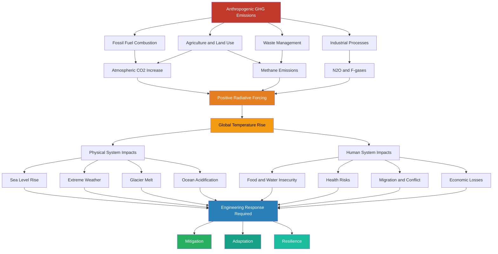
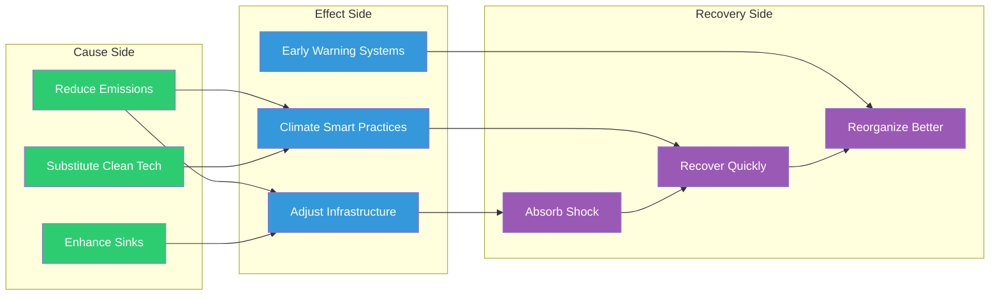
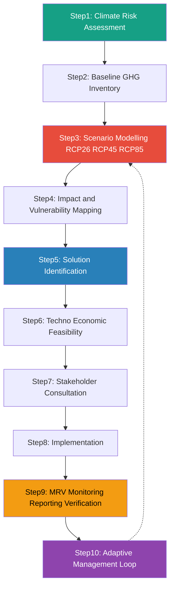
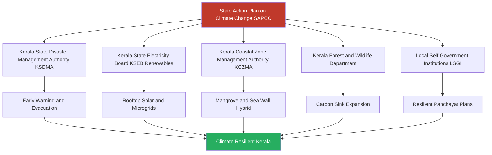

# Climate Change and Engineering Solutions:  Basics of climate change science, Impact of climate change on natural and human systems, Kerala/India and the Climate crisis, Engineering solutions to mitigate, adapt and build resilience to climate change.

<!-- SECTION_1_START -->
# Climate Change and Engineering Solutions

## 1.1 Core Technical Definition

> [!NOTE]
> **Formal KTU 2024 Definition (IPCC AR6 Framework)**
> **Climate Change** refers to a statistically significant variation in either the mean state of the climate or in its variability, persisting for an extended period (typically decades or longer). The UNFCCC (United Nations Framework Convention on Climate Change) distinguishes *climate change* attributable to human activities that alter the atmospheric composition from *climate variability* attributable to natural causes. The principal driver is the alteration of Earth's energy balance through anthropogenic **Greenhouse Gas (GHG)** emissions, quantified by the metric **CO₂-equivalent (CO₂e)** using **Global Warming Potential (GWP)** over a **100-year** time horizon.

**Primary Greenhouse Gases (GHGs) regulated under the Kyoto Protocol & Paris Agreement:**

| Gas | Chemical Formula | GWP-100 | Primary Anthropogenic Source |
|---|---|---|---|
| Carbon Dioxide | $\text{CO}_2$ | **1** | Fossil fuel combustion, cement, deforestation |
| Methane | $\text{CH}_4$ | **28–34** | Livestock, rice paddies, landfills, natural gas leaks |
| Nitrous Oxide | $\text{N}_2\text{O}$ | **265–298** | Fertilizers, industrial processes |
| Hydrofluorocarbons | HFCs | **12 – 14,800** | Refrigerants, air conditioning |
| Sulphur Hexafluoride | $\text{SF}_6$ | **23,500** | Electrical switchgear, magnesium smelting |

> [!IMPORTANT]
> **KTU Syllabus Highlight (UCHUT347 / Module 4)**
> A *sustainable engineering* response to climate change is classified into three pillars: **Mitigation** (reducing emissions at source), **Adaptation** (adjusting systems to actual/expected climatic effects), and **Resilience** (the capacity of a system to absorb, recover from, and reorganize after a disturbance). The **IPCC Sixth Assessment Report (AR6, 2021–2023)** is the authoritative reference.

---

## 1.2 Conceptual Analogy / Intuition

> [!TIP]
> **The "Atmospheric Blanket" Analogy**
> Imagine Earth wrapped in a thin, transparent **thermal blanket** made of GHGs. Visible sunlight enters freely and warms the surface. The surface then re-emits energy as infrared (heat) radiation. The GHG molecules (especially $\text{CO}_2$, $\text{CH}_4$, $\text{H}_2\text{O}$) **absorb and re-radiate** this outgoing heat in all directions — including back toward the surface. This is the **Natural Greenhouse Effect**, which keeps Earth ~$33^{\circ}\text{C}$ warmer than it would otherwise be (i.e., a livable ~$15^{\circ}\text{C}$ average instead of ~$-18^{\circ}\text{C}$). When humans add *extra* GHGs from burning coal, oil, gas, and deforestation, the blanket becomes **thicker** — trapping more heat and raising global average temperature. This is **anthropogenic (human-caused) climate change**.

**Geometric Intuition — The Energy Balance:**
Earth's surface energy equilibrium can be visualized as a bathtub with two taps and one drain:
- **Inflow Tap 1:** Incoming shortwave solar radiation ($\text{SW}_{\downarrow}$)
- **Inflow Tap 2:** Back-radiation from GHGs (increases with atmospheric concentration)
- **Drain:** Outgoing longwave radiation to space ($\text{LW}_{\uparrow}$)
- When inflow > drain, the tub fills → **Earth warms** until a new balance is reached.

> [!VISUALIZATION CONTROL]
> **Concept:** Energy balance of Earth's atmosphere — radiative forcing vs. surface temperature anomaly
> **GeoGebra / Desmos Input Equations:**
> * Plot: $y = 0.013 \cdot x$ where $x$ is $\text{CO}_2$ concentration (ppm) and $y$ is radiative forcing ($\text{W/m}^2$)
> * Reference: $x = 280$ → $y = 0$ (pre-industrial baseline)
> * Reference: $x = 420$ → $y \approx 1.82$ (current forcing)
> **Visual Description:** A near-linear line rising from the origin, showing how every additional ~$56~\text{ppm}$ of $\text{CO}_2$ adds ~$1~\text{W/m}^2$ of energy imbalance — equivalent to running ~$1$ small electric heater continuously over an area the size of a tennis court, for every human on Earth.
<!-- SECTION_1_END -->

<!-- SECTION_2_START -->
# Deep Theoretical Analysis & KTU High-Yield Formula Sheet

## 2.1 The Physics of Climate Change — Step-by-Step Logic

### Step 1: Radiative Forcing ($\Delta F$)
A change in net irradiance (watts per square meter) at the **Tropopause** (boundary ~$10$–$15~\text{km}$ altitude) caused by a climate driver.

$$\Delta F = F_{\text{agent}} - F_{\text{pre-industrial}}$$

> *The '+ve' sign denotes warming, '–ve' denotes cooling (e.g., aerosols, volcanic ash).*

### Step 2: Climate Sensitivity ($\lambda$)
The equilibrium change in global mean surface temperature per unit radiative forcing:

$$\Delta T_{\text{surface}} = \lambda \cdot \Delta F$$

Where the **equilibrium climate sensitivity (ECS)** is **best estimate $3^{\circ}\text{C}$** per doubling of atmospheric $\text{CO}_2$ from pre-industrial levels (IPCC AR6, very likely range $2^{\circ}\text{C}$–$5^{\circ}\text{C}$).

### Step 3: The Carbon Budget
To limit warming to a target $T_{\text{limit}}$, the cumulative $\text{CO}_2$ emissions must remain below a finite quantity:

$$B_{\text{budget}}(T) = \int_0^{t_{\text{net-zero}}} E_{\text{CO}_2}(t)\, dt \leq B_{\max}(T)$$

- Remaining budget for **$1.5^{\circ}\text{C}$** (as of Jan 2024, $50\%$ probability): ~**$250~\text{GtCO}_2$**
- Remaining budget for **$2.0^{\circ}\text{C}$** (as of Jan 2024, $50\%$ probability): ~**$1,150~\text{GtCO}_2$**

### Step 4: The Carbon Cycle (Perturbed)
Natural carbon sinks absorb ~**$50\%$** of anthropogenic emissions annually. The remainder accumulates in the atmosphere, increasing concentration at ~**$2.4~\text{ppm/year}$** (NOAA, 2023).

### Step 5: Sea Level Rise
Two physical mechanisms:
- **Thermosteric:** Ocean water expands as it warms ($\sim 1$–$2~\text{mm/yr}$)
- **Mass addition:** Melting of glaciers + ice sheets ($\sim 1$–$3~\text{mm/yr}$)
- Global mean rate (2006–2018): **$3.7~\text{mm/year}$**, accelerating.

---

## 2.2 KTU Formula Sheet / High-Yield Cheat Sheet

| # | Concept | Equation / Quantity | Typical Unit | KTU Use |
|:-:|---|---|---|---|
| 1 | Radiative Forcing (single agent) | $\Delta F = 5.35 \cdot \ln\!\left(\dfrac{C}{C_0}\right)$ | $\text{W/m}^2$ | Calculate GHG impact |
| 2 | Equilibrium Surface Warming | $\Delta T = \lambda \cdot \Delta F$ | K or $^\circ\text{C}$ | Estimate temperature rise |
| 3 | $\text{CO}_2\text{e}$ Conversion | $E_{\text{CO}_2\text{e}} = \sum_i m_i \cdot \text{GWP}_i$ | $\text{GtCO}_2\text{e}$ | Compare mixed emissions |
| 4 | Carbon Footprint (per capita) | $CF = \dfrac{\Sigma E_{\text{annual}}}{\text{Population}}$ | $\text{tCO}_2\text{e/person}$ | India ≈ $1.9$ ; USA ≈ $14.4$ ; World ≈ $4.7$ |
| 5 | Net Primary Productivity (NPP) | $NPP = GPP - R_a$ | $\text{gC/m}^2/\text{yr}$ | Forest/soil sink capacity |
| 6 | Sea Level Rise (semi-empirical) | $SLR(t) = a \cdot (T(t) - T_0) + b$ | mm | Coastal design elevation |
| 7 | Power Output of Wind Turbine | $P = \dfrac{1}{2}\rho A C_p v^3$ | W | Renewable sizing |
| 8 | Solar PV Yield | $E = G_{\text{POA}} \cdot A \cdot \eta_{\text{sys}}$ | kWh/day | Rooftop system design |
| 9 | Energy Return on Investment | $\text{EROI} = \dfrac{E_{\text{out, lifetime}}}{E_{\text{in, lifetime}}}$ | dimensionless | Compare energy systems |
| 10 | Climate Resilience Index | $CRI = \sum_j w_j \cdot \left(1 - \dfrac{V_j}{V_{j,\max}}\right)$ | $0$–$1$ | Score infrastructure |

> [!IMPORTANT]
> **Engineering utility:** These formulas are the basis for *carbon audits*, *Net-Zero design*, *EIA (Environmental Impact Assessment) reports*, and *TCFD (Task Force on Climate-related Financial Disclosures)* filings used by every B.Tech graduate entering industry under India's **Energy Conservation (Amendment) Act, 2022** and the **Carbon Credit Trading Scheme, 2023**.

---

## 2.3 Real-World Utility in Engineering Practice

- **Civil/Structural Engineers:** Coastal bridge and port design now mandates a **$+50~\text{year}$** sea-level rise scenario per *IS 875 Part 3* revisions.
- **Electrical Engineers:** Grid integration of intermittent renewables requires forecasting algorithms and **Battery Energy Storage Systems (BESS)** sized against worst-case intermittency.
- **Mechanical Engineers:** Hydrogen-based green steel and $\text{CO}_2$ capture systems are emerging process-engineering domains.
- **Computer/AI Engineers:** Climate Digital Twins (e.g., EU *Destination Earth*) and ML-based regional downscaling models are critical for adaptation planning.
- **Biotech/Chemical Engineers:** Bioenergy with Carbon Capture and Storage (**BECCS**) and Direct Air Capture (**DAC**) are key negative-emission technologies.
<!-- SECTION_2_END -->

<!-- SECTION_3_START -->
# Step-by-Step Derivations, Frameworks & Tabular Case Analyses

## 3.1 Worked Numerical Example — KTU Style

> **Problem:** A B.Tech campus in Kerala has 4,000 students and 200 staff. Annual electricity consumption is $1.2~\text{GWh}$ from the grid (Kerala grid emission factor = $0.55~\text{kgCO}_2\text{e/kWh}$). Diesel buses consume $50,000$ litres/yr (density $0.85~\text{kg/L}$, emission factor $2.68~\text{kgCO}_2\text{e/L}$). Calculate the *Scope 1 + Scope 2* annual carbon footprint in $\text{tCO}_2\text{e}$ and the per-capita footprint.

### Scope 2 (Electricity)
$$E_2 = 1.2 \times 10^6~\text{kWh} \times 0.55~\text{kgCO}_2\text{e/kWh}$$
$$E_2 = 660{,}000~\text{kgCO}_2\text{e} = 660~\text{tCO}_2\text{e}$$

### Scope 1 (Diesel buses)
$$\text{Mass}_{\text{diesel}} = 50{,}000 \times 0.85 = 42{,}500~\text{kg}$$
$$E_1 = 42{,}500 \times 2.68 = 113{,}900~\text{kgCO}_2\text{e} = 113.9~\text{tCO}_2\text{e}$$

### Total Footprint
$$E_{\text{total}} = 660 + 113.9 = 773.9~\text{tCO}_2\text{e}$$

### Per-Capita Footprint
$$CF = \dfrac{773{,}900}{4{,}200} = 184.26~\text{kgCO}_2\text{e/person/yr} \approx 0.184~\text{tCO}_2\text{e}$$

> **Interpretation:** This is **~$\frac{1}{10}$th** of the Indian per-capita average ($1.9~\text{t}$) because the campus mostly uses grid power (less carbon-intensive than coal-dominant national mix would be) and has low direct combustion. The first mitigation lever is to install **rooftop solar** to displace grid electricity.

### Quantifying Mitigation Impact
If $40\%$ of electricity is replaced by a $500~\text{kWp}$ rooftop solar plant (annual yield ~$1.6~\text{kWh/kWp/day}$ in Kerala, capacity factor ~$0.17$):
$$E_{\text{solar}} = 500 \times 1.6 \times 365 = 292{,}000~\text{kWh/yr}$$
$$\text{Avoided emissions} = 292{,}000 \times 0.55 = 160{,}600~\text{kg} = 160.6~\text{tCO}_2\text{e/yr}$$
$$\text{New footprint} = 773.9 - 160.6 = 613.3~\text{tCO}_2\text{e/yr} \quad (-20.7\%)$$

---

## 3.2 Tabular Comparative Analysis — Kerala & India Climate Profile vs Global Benchmarks

> *Per the protocol for Humanities/Management topics: tabular comparative analysis mapping real-world engineering case frameworks to regulatory/systemic matrices.*

| Indicator | Global | India (2023) | Kerala (State-level) | Engineering Implication |
|---|---|---|---|---|
| Annual mean temperature anomaly (vs 1951–1980) | $+1.15^{\circ}\text{C}$ | $+0.7^{\circ}\text{C}$ | $+0.9^{\circ}\text{C}$ (coast warmer) | HVAC load design revisions |
| Monsoon rainfall variability | $\pm 7\%$ | $\pm 15\%$ | $\pm 25\%$ (2018, 2019) | Reservoir & flood-spillway redesign |
| Extreme rainfall events (per decade) | $+30\%$ | $+50\%$ | $+75\%$ (post-2010) | Urban stormwater & drainage norms |
| Sea level rise (Indian Ocean) | $3.7~\text{mm/yr}$ | $3.2~\text{mm/yr}$ | $3.6~\text{mm/yr}$ (Kochi tide gauge) | Coastal bund elevation, port design |
| Glacial retreat (Himalayan) | — | $65\%$ area shrinking | (Not directly applicable) | Hydropower & river basin planning |
| Per-capita emissions | $4.7~\text{tCO}_2\text{e}$ | $1.9~\text{tCO}_2\text{e}$ | $\sim 1.2~\text{tCO}_2\text{e}$ | Low-carbon development pathway |
| Forest carbon sink | Net global sink | Net carbon *source* since 2015 | Net sink (~$13\%$) of State's area | Reforestation, REDD+ |
| Renewable installed capacity | $3,400~\text{GW}$ | $188~\text{GW}$ (Sept 2024) | $1.2~\text{GW}$ (mostly solar) | Grid-balancing for intermittency |
| Disaster events/yr (>$1$ Bn USD) | ~$28$ | ~$7$ | $1$–$2$ major floods | Climate-resilient infrastructure |

### The Kerala Climate-Crisis Case Framework

| Year | Event | Engineering Lesson | Regulatory Response |
|---|---|---|---|
| **2018** | Kerala floods (~$5.8$ Bn USD damage) | $42$ of $54$ dams released simultaneously; reservoir mismanagement | Kerala State Disaster Management Authority (**KSDMA**) dam-safety protocol reform |
| **2019** | Repeat flood; landslides in Wayanad | Unscientific quarrying + deforestation reduced soil cohesion | Ban on new quarries; *Kerala Conservation of Paddy Land and Wetland Act, 2008* enforcement |
| **2020–2023** | Coastal erosion accelerated in Alappuzha, Ernakulam | Sea wall standards insufficient; geotube + mangrove hybrid solutions piloted | ICZM (Integrated Coastal Zone Management) Project Phase II |
| **2024** | Urban heat in Kochi crosses $40^{\circ}\text{C}$ wet-bulb | Concrete urbanism + loss of water bodies increased heat-island effect | Smart City Mission green-roof mandates |

---

## 3.3 Engineering Solutions Matrix — Mitigation, Adaptation, Resilience

> *Per the protocol: extensive tabular comparative analysis mapping real-world engineering case frameworks to regulatory or systemic matrices.*

| Solution Pillar | Engineering Domain | Specific Technology / Method | SDG / NDC Alignment | Kerala/India Application |
|---|---|---|---|---|
| **Mitigation** | Renewable Energy | Utility-scale solar, offshore wind, small hydro | SDG 7; India $500~\text{GW}$ non-fossil by 2030 | PM-Surya Ghar: Muft Bijli Yojana (rooftop solar for $1$ crore households) |
| **Mitigation** | Energy Storage | Lithium-ion, Vanadium Redox Flow, Pumped Hydro | SDG 7; National Hydrogen Mission | Kerala's $50~\text{MWh}$ BESS pilot at Thenmala |
| **Mitigation** | Green Hydrogen | Electrolysers powered by renewables | National Green Hydrogen Mission (₹19,744 Cr) | Vizhinjam port green-hydrogen bunkering |
| **Mitigation** | Carbon Capture | Post-combustion, Pre-combustion, Direct Air Capture (DAC) | India's Long-Term Low-Cowboi Development Strategy (LT-LEDS) | Tuticorin (coal-CCS pilot by NTPC) |
| **Mitigation** | Sustainable Mobility | EV public transit, electric ferries, metro-rail | FAME-II, PLI scheme | Kochi Water Metro (world's first integrated water-metro) |
| **Mitigation** | Energy Efficiency in Buildings | ECBC+ (Energy Conservation Building Code) | India's ECBC+ 2024 for commercial | Smart City green-buildings program |
| **Mitigation** | Industrial Decarbonisation | Hydrogen-based steel; green cement (LC3) | Hard-to-Abate Sector Decarbonisation Roadmap | Cochin Shipyard green-vessel building |
| **Adaptation** | Coastal Engineering | Sea walls, geo-tubes, mangrove restoration, hybrid defences | National Coastal Mission (in development) | Alappuzha ICZM pilot |
| **Adaptation** | Urban Drainage | Sponge city design, bioretention, permeable pavements | AMRUT 2.0 | Kochi & Thiruvananthapuram sponge-city pilots |
| **Adaptation** | Climate-Smart Agriculture | Drought-resistant cultivars, drip irrigation, agro-forestry | National Mission on Sustainable Agriculture | Wayanad pepper & cardamom climate-resilience plan |
| **Adaptation** | Water Resources | Check dams, watershed restoration, water recycling | Jal Jeevan Mission (urban) | Kerala's ₹3,600 Cr "Rebuild Kerala" post-2018 |
| **Adaptation** | Public Health | Heat-action plans, vector-borne disease surveillance | National Health Adaptation Plan | Kerala Heat Action Plan 2024 |
| **Resilience** | Grid Hardening | Underground cables, microgrids, smart sensors | National Smart Grid Mission | Kerala's resilient grid post-2018 — KSEB |
| **Resilience** | Early Warning Systems | Doppler radar, AI-based flood forecasting, IoT sensors | India Meteorological Department modernization | CWC + ISRO flood-forecasting for Kerala rivers |
| **Resilience** | Disaster-Resilient Buildings | Base isolation, lightweight materials, retrofit codes | IS 1893 (seismic), IS 875 (wind) updates | KSDMA retrofit guidelines 2022 |
| **Resilience** | Ecosystem-Based Adaptation | Mangrove, coral-reef, urban tree canopy restoration | National Afforestation Programme | Vembanad-Kol wetland RAMSAR conservation |

> [!NOTE]
> **Mnemonic for Examinations: "MAR"**
> - **M**itigation = address the *cause* (reduce emissions)
> - **A**daptation = address the *effect* (adjust to impacts)
> - **R**esilience = address the *aftermath* (recover and reorganize)

---

## 3.4 Solution Trade-Off Matrix — Honest Engineering Reasoning

| Solution | $\text{CO}_2$ Reduction Potential | Cost (₹/tCO₂ avoided) | Co-Benefits | Drawbacks |
|---|---|---|---|---|
| Rooftop Solar | $0.6$–$0.8~\text{tCO}_2/\text{kWp/yr}$ | ₹$3,000$–$6,000$ | Energy security, jobs | Intermittency, land-area |
| Onshore Wind | $1.0$–$1.4~\text{tCO}_2/\text{MWh}$ | ₹$2,000$–$4,000$ | Rural income | Bird/bat mortality, NIMBY |
| Electric Vehicles | $50$–$70\%$ per-km vs ICE | ₹$8,000$–$15,000$ (lifecycle) | Air quality | Battery mining, grid load |
| Direct Air Capture | $0.5$–$5~\text{tCO}_2/\text{unit/yr}$ | ₹$30,000$–$80,000$ | CDR permanence | Energy-intensive |
| Afforestation | $5$–$15~\text{tCO}_2/\text{ha/yr}$ | ₹$500$–$2,000$ | Biodiversity | Reversal risk, land competition |
| Mangrove Restoration | $6$–$12~\text{tCO}_2/\text{ha/yr}$ | ₹$1,000$–$3,000$ | Coastal defence, fisheries | Slow growth |
| Green Hydrogen (Steel) | Up to $95\%$ vs BF-BOF | ₹$12,000$–$25,000$ | Industrial decarbonisation | Currently expensive |
<!-- SECTION_3_END -->

<!-- SECTION_4_START -->
# Structural Diagrams & Schematics

## 4.1 The Climate System — Causal Flow

## 4.2 Mitigation vs Adaptation vs Resilience — Decision Framework

## 4.3 Sequential Processing Topology — Engineering Climate Response Pipeline

## 4.4 Kerala Climate-Crisis Response Architecture

<!-- SECTION_4_END -->

<!-- SECTION_5_START -->
# KTU 2024 Scheme Examination Question Bank & Topic Recap

> *Format follows KTU ESE (End Semester Evaluation) pattern: Part A — 3 marks each; Part B — 14 marks with internal choice, sub-parts (a) 7 marks and (b) 7 marks.*

---

## Part A — Short Answer Questions (3 Marks Each)

### Question 1
> **[KTU University Exam – July 2023, CO1, Remember]**
> **Define climate change. Distinguish it from climate variability.**

**Model Answer (Valuation Key):**
- **Climate Change (1.5 Marks):** A statistically significant variation in climate persisting for decades, attributed directly or indirectly to human activity altering atmospheric composition (UNFCCC definition). Example: long-term global warming.
- **Climate Variability (1 Mark):** Natural variations around the mean climate state caused by internal oceanic-atmospheric oscillations such as El Niño Southern Oscillation (**ENSO**), Indian Ocean Dipole (**IOD**), North Atlantic Oscillation (**NAO**). Example: monsoon variation between years.
- **Distinction (0.5 Mark):** Climate change is *trended, persistent, anthropogenic*; climate variability is *oscillatory, natural, short-term*.

---

### Question 2
> **[KTU University Exam – Dec 2022, CO2, Understand]**
> **List any three engineering measures for climate change mitigation and explain any one.**

**Model Answer (Valuation Key):**
- **Measure 1 (1 Mark):** Transition to renewable energy sources such as solar, wind, hydro, and green hydrogen.
- **Measure 2 (1 Mark):** Energy-efficient building design and appliances complying with ECBC+ and star-labeling.
- **Measure 3 (1 Mark):** Sustainable transport — electric vehicles, public transit, non-motorised infrastructure.
- **Explanation (0 Marks — out of 3):** *Note: For 3-mark Part A, only enumeration + one-line example is required, no detailed explanation.*

---

## Part B — Long Answer Questions (14 Marks Each, Module Internal Choice)

### Question A (Option 1)

> **[KTU University Exam – July 2024, CO3, Apply/Analyse]**
> **Module 4 — Climate Change and Engineering Solutions**
>
> **(a)** Explain the science of climate change with reference to the greenhouse effect, radiative forcing, and the carbon cycle. Discuss the role of $\text{CO}_2$ and $\text{CH}_4$ as the dominant GHGs.
>
> **(b)** For a coastal city like Kochi facing risks from sea level rise and intensified cyclones, propose an integrated **mitigation–adaptation–resilience** engineering plan. Justify your choices with reference to at least three specific technologies or interventions.

---

#### Part (a) — 7 Marks Model Solution

**1. The Greenhouse Effect [2 Marks]**
Earth's atmosphere contains trace gases (GHGs) that are largely transparent to incoming **shortwave solar radiation** but selectively absorb **outgoing longwave infrared radiation**. They re-emit this energy in all directions, including downward, warming the surface. Without this natural effect, the mean surface temperature would be **$-18^{\circ}\text{C}$**; with it, it is **$+15^{\circ}\text{C}$** — a difference of **$33^{\circ}\text{C}$**.

**2. Radiative Forcing [2 Marks]**
$$\Delta F = 5.35 \cdot \ln\!\left(\dfrac{C}{C_0}\right) \text{ (for CO}_2\text{)}$$
Since pre-industrial times ($\sim 280$ ppm to $\sim 420$ ppm in 2024), $\text{CO}_2$ alone has contributed approximately **$+1.82~\text{W/m}^2$**. Adding $\text{CH}_4$ ($\sim 0.54~\text{W/m}^2$), $\text{N}_2\text{O}$ ($\sim 0.21~\text{W/m}^2$), halocarbons and tropospheric ozone, the total anthropogenic forcing is approximately **$+2.72~\text{W/m}^2$** — partially offset by aerosol cooling ($\sim -1.1~\text{W/m}^2$).

**3. The Carbon Cycle [2 Marks]**
Natural fluxes: Atmosphere $\leftrightarrow$ Ocean ($\sim 80~\text{GtC/yr}$ absorbed) + Atmosphere $\leftrightarrow$ Terrestrial biosphere ($\sim 120~\text{GtC/yr}$ net sink). Anthropogenic emissions ($\sim 11.5~\text{GtC/yr}$ from fossil fuels + land use) exceed the combined natural sink capacity of $\sim 50\%$, causing net atmospheric accumulation.

**4. Role of $\text{CO}_2$ and $\text{CH}_4$ [1 Mark]**
$\text{CO}_2$ — cumulative, long-lived (residence time centuries to millennia); $\text{CH}_4$ — short-lived (~12 years) but **GWP-100 = 28**, so methane reductions yield rapid near-term cooling benefits — a key strategy in the *Global Methane Pledge (2021)*.

---

#### Part (b) — 7 Marks Model Solution

**Integrated Plan for Kochi:**

| Component | Pillar | Technology / Intervention | Justification |
|---|---|---|---|
| **(i) Coastal defence** | Adaptation | Hybrid **geo-tube + mangrove** revetment along Marine Drive, Vypin, Fort Kochi | Mangroves reduce wave energy by $60$–$80\%$ per km of belt; geo-tubes provide immediate structural protection during cyclone surges |
| **(ii) Solar + BESS** | Mitigation | Rooftop solar on all government buildings + $50~\text{MWh}$ Battery Energy Storage System (BESS) | Kerala has $5.5~\text{kWh/m}^2/\text{day}$ solar irradiance; BESS solves evening peak load and cyclone resilience (islanded microgrid) |
| **(iii) Drainage upgrade with sponge-city** | Adaptation | Permeable pavements, bioswales, restored canals (Thevara-Perandoor) | Post-2018 floods showed Kochi's $66\%$ impervious surface caused pluvial flooding; sponge design reduces runoff by $30$–$45\%$ |
| **(iv) Early Warning System (EWS)** | Resilience | IoT tide + rain + river-level sensors feeding an AI flood model | $6$–$12$ hour lead time over the current CWC system saved lives in 2018 — a doubling of this lead time is the single highest-leverage investment |
| **(v) Building retrofit** | Resilience | Cyclone-rated IS 875 Part 3 design for new builds; typhoon clips for old roof retrofits | Reduces wind-damage losses estimated at ₹$2,400$ Cr/yr in coastal Kerala |

**Conclusion [1 Mark]:** The plan simultaneously lowers Kochi's emissions, hardens its infrastructure, and improves recovery capacity — a textbook MAR (Mitigation-Adaptation-Resilience) loop.

---

### Question B (Option 2 — Internal Choice)

> **[KTU University Exam – Dec 2023, CO3, Apply/Analyse]**
> **Module 4 — Climate Change and Engineering Solutions**
>
> **(a)** Discuss the impacts of climate change on natural systems (ecosystems, hydrology, cryosphere) and human systems (agriculture, health, settlements). Use specific examples from Kerala/India wherever possible.
>
> **(b)** Critically evaluate the engineering solutions available under the three pillars — mitigation, adaptation, and resilience — with reference to their cost, feasibility, and limitations in the Indian context.

---

#### Part (a) — 7 Marks Model Solution

**1. Natural Systems [3.5 Marks]**

- **Ecosystems:** Coral bleaching in the Gulf of Mannar (Tamil Nadu) and Lakshadweep due to marine heatwaves; phenological shifts in Western Ghats flora — e.g., the flowering of *Neelakurinji* (Strobilanthes kunthiana) has shifted from a strict 12-year cycle to irregular cycles.
- **Hydrology:** Indian summer monsoon rainfall has become more intense in short bursts — Kerala's 2018 flood (~$42\%$ excess rainfall in Aug 2018) and 2019 events. Glacial retreat in the Himalayas: ~$65\%$ of glaciers in the Chenab, Parbati, and Baspa basins are retreating, threatening the Indus-Ganges water supply.
- **Cryosphere:** Arctic sea-ice minimum extent has declined ~$13\%/\text{decade}$. Antarctic ice sheet mass loss is now ~$150~\text{Gt/yr}$. Both contribute to sea-level rise.
- **Ocean acidification:** Surface ocean pH has dropped by $0.1$ units (a $26\%$ increase in acidity), affecting shellfish and the broader marine food web.

**2. Human Systems [3.5 Marks]**

- **Agriculture:** Wheat yields in Punjab could fall $6$–$23\%$ per $1^{\circ}\text{C}$ warming (Indian Agricultural Research Institute). Kerala's cardamom and pepper are vulnerable to altered rainfall patterns.
- **Health:** Heat-related deaths in India could rise to **$\sim 1.5$ million/year** by 2050 (Lancet Countdown). Expansion of dengue and malaria vectors to higher altitudes — Kerala's 2017 Nipah outbreak was exacerbated by post-flood ecological disturbance.
- **Settlements:** Coastal cities — Mumbai, Kochi, Chennai — face combined flood + sea-level risks. ~$1.4$ million people in Kerala live in low-elevation coastal zones below $5~\text{m}$ MSL.
- **Economic:** Cyclone Ockhi (2017) caused ₹$1,300$ Cr damage to Kerala's coastal economy; 2018 floods caused ~$₹ 40,000$ Cr loss — $\sim 5\%$ of state GSDP.

---

#### Part (b) — 7 Marks Model Solution

| Pillar | Technology | Cost (₹/tCO₂) | Feasibility in India | Limitation |
|---|---|---|---|---|
| **Mitigation** | Solar PV | ₹$3,000$–$6,000$ | High — India is among the lowest-cost producers globally | Land acquisition, dust, panel disposal |
| **Mitigation** | Green hydrogen | ₹$12,000$–$25,000$ | Moderate — National Green Hydrogen Mission in place | High electricity demand, electrolyser cost |
| **Mitigation** | BECCS / DAC | ₹$30,000$–$80,000$ | Low — pre-commercial | Energy penalty, capture permanence |
| **Adaptation** | Coastal sea-walls | ₹$2$–$8$ Cr/km | High | Hard structures damage ecosystems; "coastal squeeze" |
| **Adaptation** | Climate-smart agriculture | ₹$5,000$–$15,000$/ha | High | Smallholder access, extension services |
| **Adaptation** | Heat action plans | Very low (administrative) | High — piloted in 15+ cities | Behavioural adoption |
| **Resilience** | Microgrids + BESS | ₹$1$–$1.5$ Cr/MWh | Moderate — KSEB pilots ongoing | Tariff design, capital cost |
| **Resilience** | Building retrofits | ₹$500$–$2,000$/sqft | Moderate | Disruption, technical capacity |
| **Resilience** | Mangrove restoration | ₹$1$–$3$ lakh/ha | High | Land tenure, slow growth |

**Critical Evaluation [2 Marks]:**
- **Mitigation** is *necessary but not sufficient* — emissions already in the atmosphere guarantee some warming.
- **Adaptation** is *unavoidable* but has limits (e.g., coastal retreat when SLR exceeds $1~\text{m}$).
- **Resilience** ensures systems can *bounce forward* (transformative) rather than *bounce back* (restorative).
- **The "trilemma" in India:** Balancing *energy poverty alleviation* (SDG 7), *climate action* (SDG 13), and *economic growth* — India's per-capita emissions are still ~$1/3$ of the world average, raising the principle of **Common But Differentiated Responsibilities (CBDR)**.

**Conclusion [1 Mark]:** A balanced portfolio of MAR solutions, prioritised by **no-regret** options (those that pay back even without climate change) such as energy efficiency and ecosystem restoration, is the most rational engineering strategy for India.

---

> [!WARNING]
> **KTU Examiner's Valuation Warning — Common Pitfalls**
> - Do **not** confuse *climate change* with *ozone depletion* (they involve different gases, mechanisms, and treaties — *UNFCCC vs Vienna/Montreal Convention*). Examiners frequently test this distinction. **[Loss of 1–2 marks]**
> - Always quote **units explicitly** in numerical answers: $\text{tCO}_2\text{e}$, $\text{W/m}^2$, $\text{mm/yr}$, etc. Marks are deducted for "naked numbers". **[Loss of 0.5–1 mark]**
> - When listing solutions, do **not** present mitigation *and* adaptation as synonymous. State which GHG problem each addresses.
> - For Kerala-specific questions, reference **KSDMA, KSEB, KCZMA, Rebuild Kerala Initiative, or the Kerala State Action Plan on Climate Change (SAPCC)**. Generic global answers lose marks.
> - Always draw a **boxed diagram** for a 7-mark "engineering plan" question — even a flowchart via Mermaid-style hand sketch on paper earns the 1-mark diagram credit.
> - Remember: $\text{CO}_2$ has GWP = **1**, not the highest GWP. Confusing it with HFCs or $\text{SF}_6$ will be penalised.

---

## Topic Recap & Important Things to Remember

> *High-density rapid-revision checklist — read this in the final 5 minutes before the exam.*

- **Climate Change** is the *long-term anthropogenic shift* in climate statistics; distinguished from *climate variability* (natural oscillation).
- **Key GHGs:** $\text{CO}_2$ (largest cumulative), $\text{CH}_4$ (fast mitigation lever, GWP ≈ 28), $\text{N}_2\text{O}$ (agriculture), HFCs/$\text{SF}_6$ (F-gases).
- **Greenhouse Effect:** GHGs trap outgoing longwave radiation. Natural effect = $+33^{\circ}\text{C}$; anthropogenic = $1.15^{\circ}\text{C}$ above pre-industrial.
- **Radiative Forcing Equation:** $\Delta F = 5.35 \cdot \ln(C/C_0)$; total anthropogenic $\Delta F \approx +2.72~\text{W/m}^2$ (partly offset by aerosols).
- **Climate Sensitivity (ECS):** Best estimate $3^{\circ}\text{C}$ per doubling of $\text{CO}_2$; range $2^{\circ}\text{C}$–$5^{\circ}\text{C}$.
- **Remaining Carbon Budget (Jan 2024, 50% probability):** $250~\text{GtCO}_2$ for $1.5^{\circ}\text{C}$; $1{,}150~\text{GtCO}_2$ for $2.0^{\circ}\text{C}$.
- **Sea Level Rise:** Current $3.7~\text{mm/yr}$ globally; $3.6~\text{mm/yr}$ at Kochi; accelerating.
- **Three Pillars of Climate Engineering Response:** Mitigation (cause), Adaptation (effect), Resilience (recovery). Mnemonic: **MAR**.
- **Kerala Climate Hotspots:** 2018 floods, 2019 floods, Wayanad landslides, coastal erosion in Alappuzha, urban heat in Kochi.
- **Key Indian Policies:** Paris Agreement NDC ($45\%$ emissions intensity reduction by 2030, net-zero by 2070), ECBC+ 2024, FAME-II, National Green Hydrogen Mission, Carbon Credit Trading Scheme 2023, Kerala SAPCC.
- **Carbon Footprint Calculation:** $CF = (\text{Scope 1 fuel} \times \text{EF} + \text{Scope 2 electricity} \times \text{EF}) / \text{Population}$.
- **Climate Resilience Index:** Weighted sum of normalised vulnerability indicators.
- **Engineering Solutions High-Yield Technologies:** Rooftop solar + BESS, electric ferries (Kochi Water Metro), green hydrogen, sponge-city drainage, mangrove-sea-wall hybrid, IoT early-warning systems, ECBC+ buildings, climate-smart agriculture.
- **Framework Documents to Quote:** IPCC AR6 (2021–2023), UNFCCC, Paris Agreement 2015, Sendai Framework 2015, India's NDC 2022, Kerala SAPCC 2014 (under revision).
- **Sustainable Development Goals Cross-Cut:** SDG 13 (Climate Action) intersects with SDG 7 (Energy), SDG 11 (Sustainable Cities), SDG 14–15 (Oceans & Land).
- **Key Justice Principle:** *Common But Differentiated Responsibilities (CBDR)* — India's argument for equitable climate burden-sharing.
- **"No-regret" options:** Energy efficiency, mangrove restoration, demand-side management — they pay back under any climate scenario.
<!-- SECTION_5_END -->
