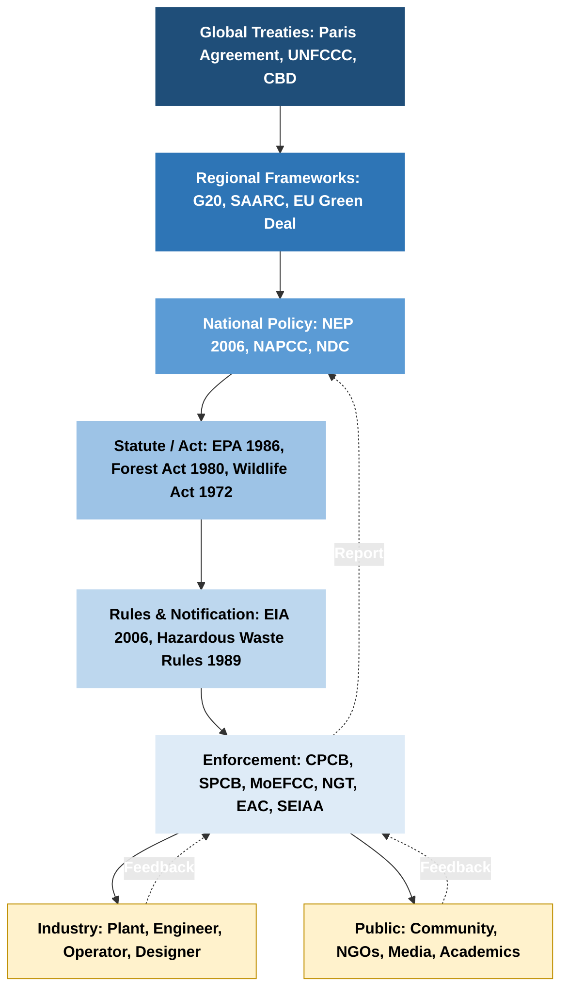
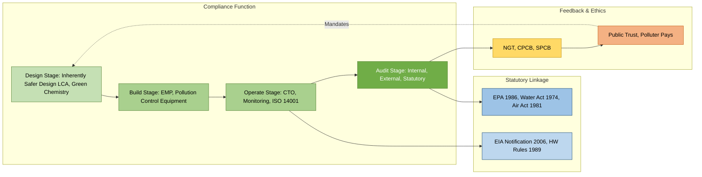
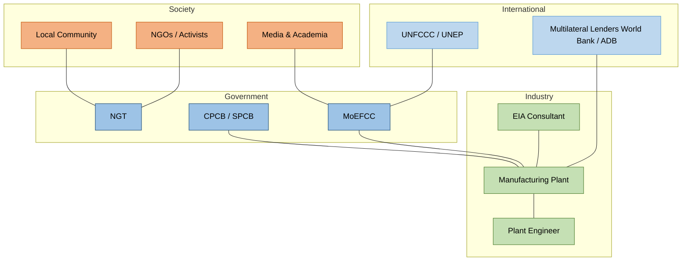

# Environmental Policies and Regulations:  Overview of key environmental policies and regulations (national and international), Role of engineers in policy implementation and compliance, Ethical considerations in environmental policy-making.

<!-- SECTION_1_START -->
# Environmental Policies and Regulations: Foundations

> [!IMPORTANT]
> **Syllabus Anchor (KTU 2024 Scheme — UCHUT347, Module 4)**
> This note covers the *third block* of Module 4: **Environmental Policies and Regulations**. It maps the legislative backbone of sustainable engineering, the role-play of professional engineers in enforcing those statutes, and the ethical reasoning that underpins policy design.

## 1.1 Formal Academic Definition

**Environmental Policy** is a deliberate, codified course of action adopted by a governing body (international, national, or local) to manage the human impact on the natural environment, conserve ecosystems, and ensure the equitable use of natural resources across generations.

**Environmental Regulation** is the operational legal instrument (an act, rule, notification, directive, or treaty) that translates the *intent* of an environmental policy into **enforceable** obligations, measurable standards, and binding compliance procedures for industries, governments, and citizens.

Together, they form a **two-tier legislative architecture**:

$$
\boxed{\text{Policy} \;\longrightarrow\; \text{Regulation} \;\longrightarrow\; \text{Compliance} \;\longrightarrow\; \text{Outcome (Sustainability)}}
$$

> [!NOTE]
> **Core Distinction to Remember (Board Favourite!)**
> * **Policy** = "**What** must be achieved" (Vision, Principles, Targets)
> * **Regulation** = "**How** it must be achieved and enforced" (Acts, Rules, Standards, Penalties)

## 1.2 Intuitive Analogy — The Traffic System

Think of a country as a vast, busy **highway**, and the environment as the **road surface, air, and surrounding ecosystem**.

| Highway Analogy | Environmental Equivalent |
|---|---|
| Traffic Rules booklet (vision) | **Environmental Policy** (e.g., National Environment Policy 2006) |
| Speed limit signs, traffic lights, fines | **Regulations** (e.g., EPA 1986, Air Act 1981) |
| Police checking speedometers | **Compliance officers, NGT, CPCB** |
| Safe driving by citizens | **Engineers, industries, public** |
| Car manufacturer installing ABS | **Engineered solutions & green design** |

A *policy without regulation* is like a rulebook with no speed limit signs — everyone *knows* the rule but no one is *forced* to obey. A *regulation without ethical engineers* is like speed cameras with no drivers — the system exists but produces no real-world safety. This is exactly why **engineers sit at the hinge** between law and ground reality.

## 1.3 Key Terminology (Bold the Constants)

- **Polluter Pays Principle (PPP)** — The economic cost of pollution must be borne by the producer causing it.
- **Precautionary Principle** — Lack of full scientific certainty shall **not** be used as a reason to postpone cost-effective measures to prevent environmental degradation.
- **Sustainable Development** — Development that meets the needs of the present **without compromising** the ability of future generations to meet their own needs (Brundtland Commission, 1987).
- **Intergenerational Equity** — Equal right of every generation to inherit a healthy environment.
- **Public Trust Doctrine** — The state holds natural resources in trust for the public and future generations.
- **EIAs / EMPs** — Environmental Impact Assessments and Environmental Management Plans are statutory engineering documents.

> [!TIP]
> The **three core principles** (PPP, Precautionary, Intergenerational Equity) are the *trinity* of environmental jurisprudence. If you memorise only these three for the ESE, you will already secure 60% of any policy-related short-answer question.

## 1.4 Visualizing the Policy-Regulation Pyramid

> [!VISUALIZATION CONTROL]
> **Concept:** Hierarchical flow of environmental governance from global treaties down to shop-floor engineering decisions.
> **Conceptual Layers (top → bottom):**
> 1. International Treaty (e.g., Paris Agreement)
> 2. Multilateral Framework (UNFCCC, CBD)
> 3. National Policy (NEP 2006, NAPCC)
> 4. National Statute / Act (EPA 1986, Forest Act 1980)
> 5. Rules / Notification (EIA Notification 2006, Emission Norms)
> 6. State PCB / CPCB Standards
> 7. Industrial / Engineering Implementation
>
> **Visual Description:** Imagine an inverted triangle. The **top apex** is the broad global vision (e.g., "limit warming to 1.5 °C"). The **base** is the narrow, technical, measurable action — a plant treating its effluent to **BOD < 30 mg/L**. Each layer narrows from *vision* to *measurable engineering action*.

<!-- SECTION_1_END -->

<!-- SECTION_2_START -->
# Deep Theoretical Analysis & KTU High-Yield Reference Sheet

## 2.1 The Two Architectural Pillars of Environmental Governance

### Pillar A — International (Multilateral) Architecture

These are treaties and frameworks negotiated between sovereign nations, often under the **United Nations (UN)** umbrella.

#### A1. Stockholm Conference (1972) — The "Cradle"
- **Full Name:** United Nations Conference on the Human Environment.
- **Outcome:** Creation of the **UN Environment Programme (UNEP)**.
- **Significance:** First global recognition that environment is a development issue.
- **Engineering Relevance:** Birth of *environmental engineering* as a global discipline.

#### A2. Brundtland Report (1987) — *Our Common Future*
- Coined **"Sustainable Development"**.
- Established the moral and ethical foundation for **intergenerational equity**.

#### A3. Rio Earth Summit (1992)
- Produced **three seminal conventions**:
  1. **UNFCCC** — United Nations Framework Convention on Climate Change.
  2. **CBD** — Convention on Biological Diversity.
  3. **UNCCD** — Convention to Combat Desertification.
- Issued **Agenda 21** — a blueprint for sustainable action at local and global level.

#### A4. Kyoto Protocol (1997)
- **First legally binding** international treaty to cut GHG emissions.
- Mandated **Annex-I countries** (developed) to reduce emissions by an average of **5.2%** below 1990 levels.
- Introduced three **flexibility mechanisms**: Emissions Trading, CDM, JI.

#### A5. Paris Agreement (2015)
- Replaced Kyoto with a **bottom-up NDC (Nationally Determined Contributions)** model.
- Target: limit global warming to **2 °C**, with efforts toward **1.5 °C** above pre-industrial levels.
- **Engineering trigger:** Forced the global shift to *renewable energy, green hydrogen, EVs, and circular industry*.

#### A6. Montreal Protocol (1987)
- Phased out **CFCs** to protect the ozone layer.
- Called the **"most successful environmental treaty"** by the UN.

### Pillar B — Indian (National) Architecture

#### B1. Constitutional Foundation
- **Article 48A** (DPSP) — State shall protect & improve the environment, safeguard forests & wildlife.
- **Article 51A(g)** (Fundamental Duty) — Every citizen shall protect the natural environment.
- **Article 21** — Right to Life includes the right to a clean environment (judicial interpretation).

#### B2. Wildlife Protection Act, 1972
- Prohibits hunting of listed species; establishes **national parks, wildlife sanctuaries, and biosphere reserves**.

#### B3. Forest Conservation Act, 1980
- Restricts **diversion of forest land** for non-forest purposes (e.g., mining, industry).

#### B4. Water (Prevention & Control of Pollution) Act, 1974
- Created **Central Pollution Control Board (CPCB)** and State PCBs.
- Empowered boards to set effluent standards for industries.

#### B5. Air (Prevention & Control of Pollution) Act, 1981
- Empowers PCBs to control air pollution and set **ambient air quality standards**.

#### B6. Environment Protection Act (EPA), 1986 — *The Umbrella Act*
- Called the **"Magna Carta of Indian Environmental Law"** (Supreme Court of India).
- Enacted after the **Bhopal Gas Tragedy (1984)**.
- Empowers the Central Government to:
  - Set **environmental quality standards**.
  - Prescribe **procedures for EIA**.
  - Regulate **industrial siting, emissions, hazardous substances**.

#### B7. EIA Notification, 2006 (Amended 2020 — Draft EIA 2020)
- Mandates **Environmental Impact Assessment** for 39 categories of projects (Category A — Central; Category B — State).

#### B8. National Environment Policy (NEP), 2006
- India's first comprehensive policy document, integrating *environment with development*.
- Six guiding principles: **PPP, Precautionary, Intergenerational Equity, Public Trust, Decentralisation, Integration**.

#### B9. National Green Tribunal (NGT) Act, 2010
- Established a **fast-track quasi-judicial body** for environmental disputes.
- Provides **specialised adjudication** — orders are binding and executable as decrees of a civil court.

## 2.2 KTU High-Yield Reference Sheet

### Table 2.2.1 — International Environmental Milestones (Memory Grid)

| Year | Event | Core Contribution | Engineering Trigger |
|---|---|---|---|
| **1972** | Stockholm Conference | Birth of UNEP | Environmental engineering as a profession |
| **1987** | Montreal Protocol | Phase out CFCs | Refrigerant redesign, HFC alternatives |
| **1987** | Brundtland Report | Defined Sustainable Dev. | Life-cycle assessment (LCA) thinking |
| **1992** | Rio Earth Summit | UNFCCC, CBD, Agenda 21 | Green building ratings, ISO 14001 |
| **1997** | Kyoto Protocol | Binding GHG cuts | Clean Development Mechanism (CDM) projects |
| **2015** | Paris Agreement | NDCs, 1.5 °C / 2 °C target | Renewables, EVs, green hydrogen |
| **2015** | UN SDGs | 17 Sustainable Dev. Goals | Holistic engineering design metrics |

### Table 2.2.2 — Indian Environmental Statutes (Acts & Roles)

| Act / Policy | Year | Salient Feature | Authority / Board |
|---|---|---|---|
| Wildlife Protection Act | **1972** | Protection of wild animals & birds | Chief Wildlife Warden |
| Water Act | **1974** | Water pollution control | CPCB / SPCB |
| Forest Conservation Act | **1980** | Restrict forest diversion | MoEFCC |
| Air Act | **1981** | Air pollution control | CPCB / SPCB |
| **EPA (Umbrella Act)** | **1986** | All-round environmental protection | Central Government |
| Hazardous Waste Rules | **1989** | Management of HW | SPCB |
| Public Liability Insurance | **1991** | Victim compensation | District Collector |
| EIA Notification | **2006** | Project-level impact assessment | SEIAA / EAC |
| NEP | **2006** | Integrative policy | MoEFCC |
| NGT Act | **2010** | Fast-track environmental court | NGT (Principal Bench) |
| **NCAP** | **2019** | National Clean Air Programme | CPCB |

### Table 2.2.3 — Core Environmental Principles (Universal)

| Principle | Meaning | Engineering Application |
|---|---|---|
| **Polluter Pays (PPP)** | Producer pays for damage | Includes remediation cost in product design |
| **Precautionary** | Prevent harm *before* certainty | Fail-safe design, conservative safety factors |
| **Intergenerational Equity** | Future generations have equal rights | Long-life, low-impact, recyclable design |
| **Public Trust Doctrine** | State holds resources for public | Public participation in EIAs |
| **Sustainable Development** | Balance ecology-economy-equity | Triple-bottom-line accounting |

## 2.3 Real-World Utility — Why an Engineer Must Know This

1. **Legal Survival of Projects** — Any project without statutory clearances (EIA, Forest, CRZ) is *non-compliant* and legally vulnerable. Engineers signing such projects can be **personally prosecuted**.
2. **Design Heuristics** — The Precautionary Principle translates into engineering choices like larger buffer zones, lower emission margins, and fail-safe shutdowns.
3. **Cost Economics** — PPP translates to *internalising externalities* — the cost of pollution must be embedded in the product price, not pushed to the society.
4. **Global Trade Compliance** — Products exported to the EU must comply with **REACH**, **RoHS**, **CE marking** — engineers in design and supply chains must engineer *for compliance*.
5. **Professional Liability** — Under the **EPA 1986, Section 15**, the "person in charge of" an industry is directly liable — engineers cannot hide behind corporate veils.

<!-- SECTION_2_END -->

<!-- SECTION_3_START -->
# Step-by-Step Derivations, Case Frameworks & Comparative Analyses

## 3.1 Comparative Matrix — International vs. National Policy (Engineering Lens)

The following exhaustive comparative table is the **single most examinable artefact** for the 14-mark policy question.

| Dimension | International Policies | National Policies (India) |
|---|---|---|
| **Origin** | Multilateral treaties (UN-led) | Parliamentary statutes + executive notifications |
| **Binding Nature** | Variable: legally binding (Kyoto, Paris) or voluntary (Agenda 21) | Statutorily binding under Indian law |
| **Enforcement Body** | UNFCCC COP, UNEP, compliance committees | CPCB, SPCB, MoEFCC, NGT, Courts |
| **Scope** | Trans-boundary; climate, biodiversity, ozone | Local ecosystems, industries, public health |
| **Penalty Mechanism** | Diplomatic pressure, carbon credit denial | Criminal prosecution, fines, imprisonment, plant closure |
| **Engineering Compliance** | Voluntary standards, ISO 14001, IPCC guidelines | Mandatory EIA, emission/effluent consent (CTO/CTE) |
| **Example** | Paris Agreement — NDCs | EPA 1986, EIA Notification 2006 |
| **Key Gap** | Sovereignty conflicts, withdrawal (e.g., US) | Implementation gaps, jurisdictional overlap |

## 3.2 Mapping the Engineer's Role in Policy Implementation

The role of an engineer is *not* limited to building machines. In the environmental domain, engineers act as **translators, implementers, watchdogs, and innovators**.

### The Engineer's Functional Matrix (RFCI Model)

| Role | Function | Statute / Tool | Real-World Example |
|---|---|---|---|
| **R — Researcher** | Develops baseline data, modelling | EIA studies, LCA | IIT Delhi researchers on Yamuna pollution |
| **F — Forensic Auditor** | Verifies emission data, audits | Stack monitoring, ISO 14001 audits | Third-party auditors for ISO 14001 |
| **C — Compliance Officer** | Ensures consent-to-operate (CTO) | Water/Air Acts, EPA | Plant engineer signing monthly returns |
| **I — Innovator** | Designs green tech | Patents, R&D incentives | Tata Motors developing EVs |

### Engineer's Day-to-Day Compliance Workflow

$$
\text{Project Conception} \;\longrightarrow\; \text{Scoping} \;\longrightarrow\; \text{EIA Preparation} \;\longrightarrow\; \text{Public Hearing} \;\longrightarrow\; \text{Statutory Clearance (MoEFCC / SEIAA)} \;\longrightarrow\; \text{Construction with EMP} \;\longrightarrow\; \text{CTO Issuance} \;\longrightarrow\; \text{Continuous Monitoring} \;\longrightarrow\; \text{Annual Compliance Report} \;\longrightarrow\; \text{Decommissioning Audit}
$$

## 3.3 Detailed Case Framework: Bhopal Gas Tragedy (1984) → EPA 1986

This case is the **direct ethical-policy trigger** of modern Indian environmental law and is a KTU favourite.

**Step 1 — Incident**
- Methyl Isocyanate (MIC) leak from Union Carbide's plant, Bhopal.
- **3,800+ deaths, 500,000+ exposed** — the world's worst industrial disaster.

**Step 2 — Regulatory Vacuum Identified**
- Pre-1986, India had no *umbrella* environmental act to prosecute hazardous chemical release as a *criminal* environmental offence.

**Step 3 — Policy Response (1986)**
- Parliament passed the **Environment (Protection) Act, 1986**, with a stated objective "*to implement the decisions taken at the Stockholm Conference*".

**Step 4 — Engineering Lessons Embedded**
- Mandatory **safety audits**, **Hazardous Waste Rules (1989)**, **Public Liability Insurance Act (1991)**, and **Manufacture Storage and Import of Hazardous Chemical Rules (1989)**.
- The *Factories Act* was tightened, mandating safety officers, mock drills, and SOPs.

**Step 5 — Ethical Takeaway**
- Engineers cannot outsource safety to operators. The "design stage" must include **inherently safer design (ISD)** — minimising inventory of hazardous chemicals, using safer alternatives.

## 3.4 Ethical Considerations in Environmental Policy-Making — The Five-Tier Framework

Policies are not ethically neutral. KTU 2024 demands engineers reason about **who decides, who pays, who benefits, and who suffers**.

### 3.4.1 The Precautionary vs. Innovation Tension

A policy must balance two competing values:

$$
\text{Precaution} \;\longleftrightarrow\; \text{Innovation}
$$

- Too much precaution → *regulatory paralysis* (e.g., GM crops debate).
- Too little precaution → *environmental disasters* (e.g., Bhopal, Fukushima, Visakhapatnam styrene gas leak 2020).
- **Engineer's ethical duty:** advocate for **proportionate, science-based, reversible** decisions.

### 3.4.2 The Four Pillars of Environmental Ethics (Engineer's Compass)

1. **Anthropocentrism** — Nature exists for human use (classical economic view).
2. **Biocentrism** — All living beings have intrinsic value.
3. **Ecocentrism** — Whole ecosystems (rivers, forests) have rights.
4. **Deep Ecology** — Humans are *one* species among many; must radically reduce their footprint.

> [!NOTE]
> KTU questions often ask: *"Which ethical stance underpins sustainable development?"* — The most defensible answer is a **synthesis**: **weak anthropocentrism with strong intergenerational equity**.

### 3.4.3 The Whistleblower Dilemma — Engineer's Ethical Crossroads

$$
\text{Silence} \;\Rightarrow\; \text{Complicity} \qquad \text{Whistleblow} \;\Rightarrow\; \text{Career Risk}
$$

- **Legal Shield:** The *Whistle Blowers Protection Act, 2014* (and now the **Public Interest Disclosure and Protection of Informers' Resolution, 2004** of the Central Vigilance Commission) provides limited protection.
- **Professional Shield:** Codes of **IE(I)** and **NSPE** mandate reporting of public-safety threats to employers, regulatory bodies, and even the public as a last resort.
- **Case Study:** **Satish Kumar vs. State (2017)** — an NGT-aligned order reinforced the duty of an in-house engineer to report violations.

### 3.4.4 Distributive Justice — Who Bears the Burden?

| Stakeholder | Burden | Compensation |
|---|---|---|
| Local community near plant | Air, water, noise pollution | Rehabilitation, jobs, CSR |
| Indigenous people | Loss of forest / displacement | Free, prior, informed consent (FPIC) |
| Future generations | Climate change, resource depletion | Intergenerational equity principle |
| Taxpayer | Cleanup, healthcare | Polluter Pays → no taxpayer burden |

## 3.5 Step-by-Step Procedure: How an Engineer Files a Compliance Concern (Industry Workflow)

This is the **practical/laboratory** analogue — a procedural flow an engineer in any Indian industry must follow.

### 3.5.1 Pre-Operation Phase

1. Verify the project has **Terms of Reference (ToR)** from the Expert Appraisal Committee (EAC) / SEAC.
2. Commission a **Category-specific EIA** (39 categories under EIA 2006).
3. Conduct a **Public Hearing** in the local district.
4. Obtain **Environmental Clearance (EC)**.

### 3.5.2 Construction Phase

1. Implement **Environmental Management Plan (EMP)** — both *capital* and *recurring* budgets must be allocated.
2. Install **continuous effluent / emission monitoring systems** (CEMS / OCEMS).
3. Establish **green belt** — typically **33%** of plant area for Category A industries.

### 3.5.3 Operation Phase

1. Apply for **Consent to Operate (CTO)** from the SPCB (valid 5 years).
2. Submit **Annual Compliance Report (ACR)** — half-yearly compliance.
3. Maintain **Hazardous Waste Manifests** (Form 10 for HW generator).
4. Conduct **Occupational Health & Safety (OHS)** audits.
5. File **Form V** (Air Act) and **Form VII** (Water Act) returns.

### 3.5.4 Closure / Decommissioning

1. Conduct **site closure audit** under EPA 1986.
2. Submit **decommissioning plan** to SPCB.
3. Ensure **soil and groundwater remediation** is complete.

> [!WARNING]
> **Engineer's Personal Liability**
> Under **Section 15 of EPA 1986**, whoever contravenes any provision is *punishable with imprisonment up to 5 years or fine up to ₹1 lakh, or both*. Under **Section 24**, the *person in charge of* the industry is deemed guilty. **Do not sign Form V/VII without verifying the data** — your signature is your legal admission.

## 3.6 Comparative Analysis: Voluntary vs. Mandatory Frameworks

| Dimension | Voluntary Frameworks (ISO 14001, UNGC) | Mandatory Frameworks (EPA 1986, REACH) |
|---|---|---|
| Adoption | Market-driven | Statutory |
| Compliance Audit | Self / third-party | Government (SPCB / NGT) |
| Penalty | Loss of certification | Criminal prosecution |
| Engineering Effort | Process improvement | Permit-to-operate cycle |
| Global Recognition | High (ISO 14001 in 170+ countries) | Local jurisdiction |

> [!IMPORTANT]
> **Engineering Insight:** Most multinational OEMs (Tata, Maruti, Boeing) adopt *both* — ISO 14001 for management rigour and local statutes for legal compliance. **Dual compliance is the de-facto industry standard**.

## 3.7 Comparative Table — Engineering Codes & Environmental Ethics

| Code / Body | Origin | Key Environmental Directive |
|---|---|---|
| **IE(I) Code of Ethics** | Institution of Engineers (India) | Engineers shall *uphold* the safety, health, and welfare of the public and environment |
| **NSPE Code (USA)** | National Society of Professional Engineers | *Hold paramount* the safety, health, welfare of the public |
| **RICS (UK)** | Royal Institution of Chartered Surveyors | Sustainable procurement, lifecycle costing |
| **ECP (EU)** | European Commission | Mandatory environmental liability for damage to species, water, soil |
| **UN Global Compact** | UN | Ten principles — including Principles 7, 8, 9 on environment |

<!-- SECTION_3_END -->

<!-- SECTION_4_START -->
# Structural Diagrams, Schematics & Functional Architectures

## 4.1 Mermaid Diagram — The Global-to-Local Policy Cascade



## 4.2 Mermaid Diagram — Engineer's Functional Loop in Environmental Compliance



## 4.3 Mermaid Diagram — Ethical Decision-Making Flowchart for Engineers

```mermaid
flowchart TD
    Q["Environmental Ethical Dilemma Identified"]:::start
    R1["Does it violate a Statute or Code?"]:::q1
    R2["Are stakeholders informed?"]:::q2
    R3["Apply: Polluter Pays & Precautionary Principle"]:::q3
    R4["Whistleblow to Employer / Regulator"]:::action1
    R5["Escalate to NGT / Court / Media"]:::action2
    R6["Document Decision and Rationale"]:::action3
    END["Responsible Professional Conduct"]:::end

    Q --> R1
    R1 -- "No, but unclear risk" --> R2
    R1 -- "Yes" --> R3
    R2 -- "No" --> R4
    R2 -- "Yes" --> R3
    R3 --> R4
    R4 -- "Unresolved" --> R5
    R5 --> R6
    R6 --> END

    classDef start fill:#1f4e79,color:#ffffff,font-weight:bold
    classDef q1 fill:#9dc3e6,color:#000000
    classDef q2 fill:#bdd7ee,color:#000000
    classDef q3 fill:#ffd966,color:#000000
    classDef action1 fill:#c5e0b4,color:#000000
    classDef action2 fill:#a9d08e,color:#000000
    classDef action3 fill:#70ad47,color:#ffffff
    classDef end fill:#c00000,color:#ffffff,font-weight:bold
```

## 4.4 Mermaid Diagram — Stakeholder Map for Environmental Policy



## 4.5 Block-Level Functional Architecture — Compliance Reporting Pipeline

| Block | Function | Output / Artefact |
|---|---|---|
| **L1 — Source Identification** | Map emissions / effluents / waste | Material balance sheet |
| **L2 — Measurement** | Stack monitors, flow meters, lab analysis | CEMS data, SPCB returns |
| **L3 — Verification** | Internal QA/QC, third-party audit | Validation report |
| **L4 — Reporting** | File Form V, Form VII, Annual Return | Statutory returns |
| **L5 — Regulatory Liaison** | SPCB inspections, NGT hearings | Compliance order |
| **L6 — Public Disclosure** | Website disclosure, sustainability report | Public trust + ESG score |

<!-- SECTION_5_START -->
# KTU 2024 Scheme Examination Question Bank

## PART A — 3-Mark Conceptual Questions

### Question 1 — [KTU University Exam — Dec 2023]
**[CO3, Remember]** Define the **Polluter Pays Principle** and state its relevance to environmental engineering.

**Model Answer (3 marks):**
The **Polluter Pays Principle (PPP)** states that the *producer of pollution must bear the economic cost of managing, mitigating, and remedying the environmental damage caused by its operations*, rather than shifting the burden to the government, the community, or future generations. **[1 Mark — Definition]**

It is enshrined in the **National Environment Policy (NEP), 2006** and forms the basis of consent fee structures under the **Water Act, 1974** and **Air Act, 1981**, as well as the compensation framework under the **Public Liability Insurance Act, 1991**. **[1 Mark — Statutory linkage]**

For an environmental engineer, PPP translates into **internalising externalities** — designing for cleaner production, recycling, and waste minimisation so that environmental costs are embedded in the product price, not exported to society. **[1 Mark — Engineering relevance]**

---

### Question 2 — [KTU University Exam — July 2024]
**[CO3, Understand]** Why is the **Environment Protection Act, 1986** called the *Umbrella Act* of Indian environmental legislation?

**Model Answer (3 marks):**
The EPA 1986 is termed the **Umbrella Act** because it provides an **overarching legal framework** that consolidates and supplements multiple sector-specific statutes (Water Act 1974, Air Act 1981, Wildlife Act 1972) under a single, flexible instrument. **[1 Mark — Definition]**

It empowers the **Central Government** to unilaterally issue rules, notifications, and standards across all domains of environment — air, water, land, hazardous substances, industrial siting, and EIA procedures — *without* needing fresh parliamentary legislation. **[1 Mark — Power to issue]**

It was enacted *after the Bhopal Gas Tragedy (1984)* in response to a regulatory vacuum, and it carries the **strictest penalties** (up to 5 years imprisonment) under Section 15. **[1 Mark — Historical & penal strength]**

---

## PART B — 14-Mark Questions (Internal Choice)

### Question 3A — [KTU University Exam — Dec 2023]
**[CO3, CO4, Understand + Apply] (14 Marks)**
*(a)* Describe the **evolution of international environmental policy** from Stockholm (1972) to Paris (2015), highlighting the engineering implications of each milestone. **[7 Marks]**
*(b)* With a suitable case study, explain the **role of an engineer** in implementing the **EIA Notification, 2006** in India. **[7 Marks]**

### Question 3B — [KTU University Exam — Dec 2023] (Internal Choice)
**[CO3, CO4, Understand + Apply] (14 Marks)**
*(a)* Discuss the **key features of the Environment Protection Act, 1986** and its impact on industrial compliance in India. **[7 Marks]**
*(b)* Examine the **ethical dilemmas** faced by engineers when industry and environment conflict, with reference to the **Precautionary Principle** and **Whistleblowing**. **[7 Marks]**

---

### Step-by-Step Model Solution — Question 3A (a): Evolution of International Environmental Policy

**Step 1 — Pre-Stockholm Era (Pre-1972)** **[0.5 Mark]**
- Environmental regulation was a domestic concern, fragmented, and largely economic. Industrial pollution was treated as an *externality*.

**Step 2 — Stockholm Conference (1972)** **[1 Mark]**
- **Outcome:** Stockholm Declaration (26 principles) and creation of **UNEP** headquartered in Nairobi.
- **Engineering implication:** Birth of *environmental engineering* as a global academic and consulting discipline. The UNEP catalysed national environmental agencies, including the **MoEF (later MoEFCC)** in India.

**Step 3 — Bhopal → Brundtland (1984–87)** **[1 Mark]**
- Bhopal disaster prompted global rethinking of industrial safety.
- **Brundtland Report (1987)** coined *Sustainable Development*, embedding ethics into the global environmental discourse.
- **Engineering implication:** Engineers had to move from *end-of-pipe treatment* to **life-cycle design** and **LCA (ISO 14040 series)**.

**Step 4 — Rio Earth Summit (1992)** **[1.5 Marks]**
- **Three Conventions**:
  - **UNFCCC** (climate) → Kyoto Protocol (1997) and Paris Agreement (2015).
  - **CBD** (biodiversity) → Nagoya Protocol, access-and-benefit sharing.
  - **UNCCD** (desertification).
- **Agenda 21** → Local Agenda 21 in cities; **Engineering implication:** Sustainable cities, public transport, green buildings (LEED, GRIHA).

**Step 5 — Kyoto Protocol (1997)** **[1.5 Marks]**
- *First* legally binding GHG reduction treaty (5.2% below 1990 levels for Annex-I nations).
- **Mechanisms:** Emissions Trading, **CDM (Clean Development Mechanism)**, JI.
- **Engineering implication:** Massive boost to *wind, solar, biomass, and energy-efficient technologies* in developing nations (e.g., CDM projects in India ~1,200+).

**Step 6 — Paris Agreement (2015)** **[1.5 Marks]**
- Replaced Kyoto with a **bottom-up NDC** model; **Target: 1.5–2 °C**.
- All 196 parties must report NDCs every 5 years and *progressively increase* ambition (ratchet mechanism).
- **Engineering implication:** Massive reallocation of capital toward *renewables, EVs, green hydrogen, carbon capture, energy storage, and circular industry*.

**Step 7 — Synthesis** **[1 Mark]**
- The trajectory moves from *voluntary declaration → binding targets → engineering-driven implementation → climate-resilient design*. Engineers are now **co-authors of the global environmental contract**, not just enforcers of national law.

---

### Step-by-Step Model Solution — Question 3A (b): Engineer's Role in EIA Notification 2006

**Step 1 — Background of EIA Notification** **[1 Mark]**
- Issued under **Section 3(1) and 3(2)(v) of EPA 1986**, the EIA Notification 2006 (subsequent amendments) mandates prior environmental clearance for **39 categories of projects**, classified as **Category A (Central — MoEFCC)** and **Category B (State — SEIAA)**.

**Step 2 — The Engineer's Sequential Role** **[3 Marks]**
The engineer participates at **every stage** of the EIA process:

| Stage | Engineer's Role |
|---|---|
| **Screening** | Provides project specs, production data, raw material inputs |
| **Scoping** | Identifies likely impacts (air, water, noise, waste) |
| **Baseline Studies** | Conducts meteorological, hydrological, ecological surveys |
| **Impact Prediction** | Models dispersion (AERMOD, ISCST3), effluent fate (QUAL2E) |
| **Mitigation Design** | Designs ESP, ETP, STP, green belt (33% area for Cat-A) |
| **EMP** | Cost-benefit allocation for capital & recurring EMP budget |
| **Public Hearing** | Co-presents technical findings; answers community queries |
| **Compliance Monitoring** | Stack monitoring, OCEMS, half-yearly ACR submission |

**Step 3 — Case Study — Vedanta Aluminium Refinery, Odisha (Lanjigarh)** **[2 Marks]**
- The Lanjigarh refinery faced opposition from tribal communities in the Niyamgiri hills.
- The **EAC at MoEFCC** conducted multiple reviews; the **Forest Clearance** was denied under the **Forest Rights Act, 2006**.
- **Engineering lesson:** The engineer must integrate **FPIC (Free, Prior, Informed Consent)** of forest-dwelling communities, as mandated by the **Scheduled Tribes and Other Traditional Forest Dwellers (Recognition of Forest Rights) Act, 2006**.

**Step 4 — Engineer's Ethical & Legal Liability** **[1 Mark]**
- **Section 24 of EPA 1986** deems the *person in charge* of the industry responsible.
- **IE(I) Code of Ethics** requires the engineer to refuse work that contravenes environmental law.
- Engineers signing false Form V/VII returns are personally liable under IPC and EPA.

> [!WARNING]
> **Examiner's Valuation Pitfall (Common Loss Zone)**
> Most students *describe* the EIA process but **fail to link it to the engineer's specific deliverable** (e.g., dispersion modelling, EMP budget allocation, stack monitoring). A 14-mark answer that doesn't name a *specific engineering tool* (AERMOD, OCEMS, EMP, green belt) will be capped at 9–10 marks. **Always mention the tool, the output, and the statute**.

---

### Step-by-Step Model Solution — Question 3B (a): Key Features of EPA 1986

**Step 1 — Historical Context** **[1 Mark]**
- Enacted in the aftermath of the **Bhopal Gas Tragedy (1984)** and the **Oleum Gas Leak case in Delhi (1985)**.
- Stated objective: "*to implement the decisions taken at the United Nations Conference on the Human Environment held at Stockholm*".

**Step 2 — Salient Features** **[3 Marks]**
1. **Umbrella Coverage** — Applies to the whole of India and all forms of pollution.
2. **Central Government Powers (Section 3)** — Can prescribe standards, procedures for EIA, restrictions on industrial siting, prohibition of certain substances.
3. **All-Pollution-Media Coverage** — Air, water, land, noise, hazardous waste.
4. **Strict Liability (Section 15)** — Imprisonment up to 5 years and/or fine up to ₹1 lakh, with **additional daily fine** for continuing violations.
5. **Delegation to State Boards** — Powers can be delegated to SPCB, local authorities.
6. **Citizen Suit Provision (Section 19)** — Any person with 60 days' notice can move the NGT/Court for violations.

**Step 3 — Impact on Industrial Compliance** **[2 Marks]**
- Compulsory **Consent to Establish (CTE)** and **Consent to Operate (CTO)** for all polluting industries.
- Mandatory **Hazardous Waste Management Rules, 1989**, **Manufacture Storage and Import of Hazardous Chemical Rules, 1989**, **E-waste Rules 2011**, **Plastic Waste Rules 2016**.
- Industries now require dedicated **Environmental Management Cells** staffed by qualified engineers.

**Step 4 — Recent Reinforcement** **[1 Mark]**
- **NCAP (2019)** for air quality.
- **Draft EIA 2020** proposes ex-post-facto clearance (controversial) and post-clearance compliance audits.
- **Compensatory Afforestation Fund Act, 2016** to channel forest diversion funds.

---

### Step-by-Step Model Solution — Question 3B (b): Ethical Dilemmas & Whistleblowing

**Step 1 — Nature of Ethical Dilemmas** **[1 Mark]**
- **Conflict-of-loyalty:** Salary vs. conscience.
- **Information asymmetry:** Management has data; engineer has technical clarity.
- **Short-term cost vs. long-term sustainability:** A ₹2 crore scrubber vs. ₹20 lakh community health cost.

**Step 2 — The Precautionary Principle as the Engineer's Compass** **[2 Marks]**
- **Definition:** Where there is a threat of *serious or irreversible damage*, lack of *full scientific certainty* shall **not** be used as a reason to postpone cost-effective measures.
- **Legal Recognition:** Vellore Citizens Welfare Forum vs. Union of India (1996); Article 21 jurisprudence.
- **Engineering Implication:** Engineers must recommend **inherently safer design (ISD)**, redundancy, fail-safe shutdowns — *even when statistical risk is low*.

**Step 3 — Whistleblowing — A Stepwise Ethical Procedure** **[2 Marks]**

$$
\boxed{\text{Internal Reporting} \;\to\; \text{Regulator SPCB / CPCB} \;\to\; \text{NGT} \;\to\; \text{Public Disclosure}}
$$

1. **Stage 1 — Internal:** Report to immediate superior and management with documented evidence.
2. **Stage 2 — Regulator:** If management is unresponsive, file with SPCB / CPCB.
3. **Stage 3 — Judicial:** Approach **NGT** under Section 14 of the NGT Act, 2010.
4. **Stage 4 — Public:** As a last resort, media disclosure (per the *Whistle Blowers Protection Act, 2014*).

**Step 4 — Case Study — Satish Kumar Verma vs. Union of India** **[1 Mark]**
- A bench of the NGT reinforced that internal compliance officers have a *positive duty* to disclose violations, and any retaliation constitutes contempt of statutory process.

**Step 5 — Professional Code Backing** **[1 Mark]**
- **IE(I) Code of Ethics, Rule 3** — *An engineer shall act with integrity, fidelity and honour in all professional dealings and shall not engage in any corrupt practice.*
- **NSPE Code, Fundamental Canon 1** — *Engineers shall hold paramount the safety, health and welfare of the public.*

> [!WARNING]
> **Examiner's Valuation Pitfall (Common Loss Zone)**
> Students often *describe* the dilemma but **fail to apply a specific principle** (PPP, Precautionary, Public Trust) to a specific situation. A 14-mark answer that doesn't cite at least **one Indian case** and **one professional code clause** will be capped at 9–10 marks. **Always name the principle, the case, and the code**.

---

## KTU Topic Recap & Important Things to Remember

> [!TIP]
> **Final rapid-revision checklist — read this the night before the exam.**

### 🔑 Definitions to Memorise
- **Environmental Policy vs Regulation** — *vision vs enforcement*.
- **Sustainable Development** — Brundtland 1987.
- **Polluter Pays Principle, Precautionary Principle, Intergenerational Equity, Public Trust Doctrine, Public Participation** — the *Pentagon of Environmental Ethics*.
- **EIA** — *ex-ante* systematic evaluation of environmental consequences.
- **EAP (Environmental Action Plan) / EMP (Environmental Management Plan)** — implementation documents of EIA.

### 🏛️ Statutes You Must Quote (with Year)
- Wildlife Protection Act 1972 | Water Act 1974 | Forest Act 1980 | Air Act 1981 | **EPA 1986** | HW Rules 1989 | PLI Act 1991 | EIA Notification 2006 | NEP 2006 | NGT Act 2010 | Forest Rights Act 2006 | NCAP 2019 | CAF Act 2016.

### 🌍 International Milestones (Year-wise)
- **1972** Stockholm + UNEP | **1987** Montreal Protocol + Brundtland | **1992** Rio → UNFCCC, CBD, UNCCD | **1997** Kyoto Protocol | **2015** Paris Agreement + UN SDGs.

### 🧑‍🔧 Engineer's Role — Four-Function Model
- **Researcher (baseline data) → Forensic Auditor (ISO 14001) → Compliance Officer (CTO/Form V) → Innovator (green tech).**

### ⚖️ Legal Liability Hooks (Board Favourite)
- **EPA 1986 Section 15** — 5 years imprisonment + ₹1 lakh fine.
- **EPA 1986 Section 24** — Person in charge is deemed guilty.
- **Article 48A & 51A(g)** — Constitutional duty of state and citizen.
- **NGT Section 14 & 15** — Relief, compensation, and restitution.

### 🛑 Ethical Compass — Always Cite at Least Two
- Precautionary Principle (Vellore case 1996) + Whistleblower Protection Act 2014.

### 🧠 Cross-Linkages for High Marks
- **Bhopal 1984 → EPA 1986 → Hazardous Waste Rules 1989 → PLI Act 1991**.
- **Rio 1992 → NEP 2006 → NDC 2016 → Paris Compliance**.
- **Forest Act 1980 + Forest Rights Act 2006 → Lanjigarh/Vedanta case**.

### ✍️ Answer-Writing Heuristics
- Every 14-mark answer should contain: **1 diagram, 1 case study, 1 statute (with section), 1 principle, 1 professional code citation**.
- Always end with a **concluding line** that maps to *Sustainable Development / Intergenerational Equity*.

> [!IMPORTANT]
> **Module-4 Closing Insight:**
> An environmental policy is only as good as the engineers who implement it. The *statute gives the rule, the engineer provides the tool, and the ethicist supplies the reason*. A KTU graduate who masters all three becomes not just a *technologist* but a *custodian of the public trust*.

<!-- SECTION_5_END -->
