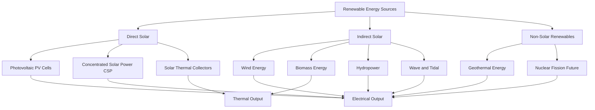
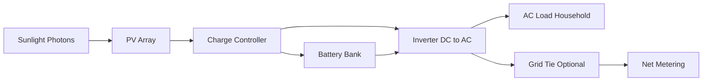
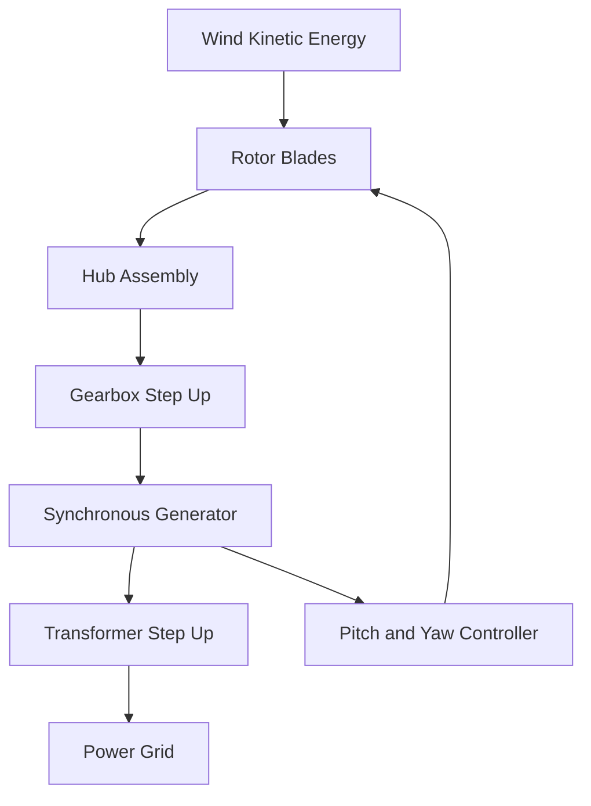
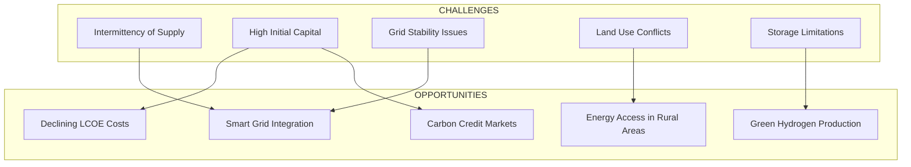

# Renewable Energy and Sustainable Technologies:  Overview of renewable energy sources (solar, wind, hydro, biomass), Sustainable technologies in energy production and consumption, Challenges and opportunities in renewable energy adoption.

<!-- SECTION_1_START -->
# Module 4: Renewable Energy and Sustainable Technologies

## 4.1 Overview of Renewable Energy Sources

### Core Definition

> [!IMPORTANT]
> **Renewable Energy** is defined as energy derived from natural sources that are replenished at a rate faster than they are consumed. According to the **KTU 2024 Scheme (UCHUT347)** syllabus, renewable energy sources include solar, wind, hydro, biomass, geothermal, and tidal energy, all of which are central to achieving the **United Nations Sustainable Development Goal 7 (SDG-7): Affordable and Clean Energy**.

> [!NOTE]
> **Sustainable Technology** refers to any engineered system, process, or product that conserves natural resources, minimizes environmental degradation, and supports long-term ecological balance while meeting present-day energy and material demands.

### Conceptual Analogy / Intuition

Imagine a household bank account. **Fossil fuels** are like a *fixed-deposit account* that was created millions of years ago — you can withdraw from it, but there are no new deposits. Eventually, it runs out, and the withdrawals cause severe "environmental pollution" charges. **Renewable energy**, in contrast, is a *salary account* — every day, the sun shines, the wind blows, and rivers flow, depositing fresh "energy currency" into the account. The job of an engineer is to design efficient systems (ATMs and withdrawal systems) to convert these daily deposits into useful work.

> [!TIP]
> **Geometric Intuition:** On a Cartesian energy-vs-time plane, fossil fuel reserves form a **monotonically decreasing curve** (depleting stock), while renewable energy availability forms a **periodic sinusoidal curve** (solar: 24-hour cycle, wind: variable, hydro: seasonal).

> [!VISUALIZATION CONTROL]
> **Concept:** Comparative Energy Reserve Depletion vs Renewable Replenishment
> **GeoGebra / Desmos Input Equations:**
> * Fossil Reserve: $f(x) = 100 \cdot e^{-0.05x}$ (exponential decay, $x$ in years)
> * Solar Replenishment: $s(x) = 50 + 30 \cdot \sin\left(\frac{2\pi x}{24}\right)$ (oscillatory supply, 24-hr period)
> **Visual Description:** Students will observe the fossil curve smoothly dropping toward zero, while the solar curve oscillates indefinitely around a positive mean — clearly illustrating the **sustainability gap**.

---

### Key Performance Metrics (Syllabus Highlights)

> [!IMPORTANT]
> The three foundational metrics used throughout this module are:
> 1. **Energy Payback Time (EPBT)** — measured in **years**.
> 2. **Capacity Factor (CF)** — dimensionless ratio, typically between **0.15 and 0.45**.
> 3. **Levelized Cost of Energy (LCOE)** — measured in **USD/kWh** or **₹/kWh**.

These three constants form the evaluative spine of every renewable energy system comparison in the KTU 2024 Scheme examination.
<!-- SECTION_1_END -->

<!-- SECTION_2_START -->
# Deep Theoretical Analysis & KTU High-Yield Formula Sheet

## 4.2 Renewable Energy Sources — Operational Breakdown

### 4.2.1 Solar Energy

**The Why:** The Earth receives approximately **$1.74 \times 10^{17}$ watts** of solar radiation at the top of its atmosphere. Even harnessing a fraction of this flux can power civilization.

**The How:**
- **Photovoltaic (PV) Effect:** Semiconductor materials (typically silicon) release electrons when struck by photons.
- **Concentrated Solar Power (CSP):** Mirrors focus sunlight onto a receiver to heat a working fluid.

**Key Equations:**

$$P_{solar} = A \cdot G \cdot \eta$$

Where:
- $P_{solar}$ = Power output in **watts (W)**
- $A$ = Collector area in **m²**
- $G$ = Solar irradiance in **W/m²** (peak value: **$1000 \text{ W/m}^2$** at AM1.5)
- $\eta$ = Conversion efficiency (typical commercial PV: **0.15 to 0.22**)

**Capacity Factor for Solar:**

$$CF_{solar} = \frac{E_{annual}}{P_{rated} \cdot 8760 \text{ hours}}$$

Typical value: **0.15 – 0.25**.

---

### 4.2.2 Wind Energy

**The Why:** Approximately **2% of incoming solar radiation** is converted into wind kinetic energy, equivalent to **$\sim 10^{15}$ W** of continuous power.

**The How:** Wind turns blades connected to a rotor, which spins a generator via a gearbox.

**Key Equations:**

$$P_{wind} = \frac{1}{2} \cdot \rho \cdot A \cdot v^3 \cdot C_p$$

Where:
- $\rho$ = Air density ($\approx 1.225 \text{ kg/m}^3$ at sea level)
- $A$ = Swept area of blades ($\pi r^2$, in m²)
- $v$ = Wind velocity in **m/s**
- $C_p$ = Power coefficient (**Betz Limit = 0.5926**, theoretical maximum)

**Capacity Factor for Wind:** Typically **0.25 – 0.45**.

---

### 4.2.3 Hydroelectric Energy

**The Why:** Hydropower is the **largest installed renewable capacity globally** (~**1,300 GW** as of 2024).

**The How:** Falling or flowing water spins turbines; potential energy of stored water converts to kinetic energy.

**Key Equations:**

$$P_{hydro} = \rho_{water} \cdot g \cdot Q \cdot H \cdot \eta_{turbine}$$

Where:
- $\rho_{water}$ = **$1000 \text{ kg/m}^3$**
- $g$ = **$9.81 \text{ m/s}^2$**
- $Q$ = Volumetric flow rate in **m³/s**
- $H$ = Net head (height difference) in **m**
- $\eta_{turbine}$ = Turbine-generator efficiency (**0.80 – 0.95**)

**Capacity Factor for Hydro:** Very high, typically **0.40 – 0.60**.

---

### 4.2.4 Biomass Energy

**The Why:** Biomass stores solar energy via photosynthesis, releasing it upon combustion or biochemical conversion.

**The How:** Three primary pathways:
- **Direct Combustion** (e.g., bagasse furnaces)
- **Anaerobic Digestion** → Biogas (CH₄ + CO₂)
- **Fermentation** → Bioethanol (C₂H₅OH)

**Calorific Value Comparison:**

$$E_{biomass} = m \cdot CV$$

Where $CV$ (calorific value) for common biomass:
- Wood: ~**16 MJ/kg**
- Agricultural residue: ~**14 MJ/kg**
- Biogas: ~**22 MJ/m³**

---

## KTU Formula Sheet / Cheat Sheet

| Parameter | Symbol | Formula | Typical Value / Unit |
|---|---|---|---|
| Solar Power Output | $P_{solar}$ | $A \cdot G \cdot \eta$ | Watts (W) |
| Solar Peak Irradiance | $G$ | Constant | $1000 \text{ W/m}^2$ (AM1.5) |
| Wind Power Output | $P_{wind}$ | $\frac{1}{2} \rho A v^3 C_p$ | Watts (W) |
| Betz Limit | $C_{p,max}$ | $\frac{16}{27}$ | $0.5926$ (dimensionless) |
| Hydro Power | $P_{hydro}$ | $\rho g Q H \eta$ | Watts (W) |
| Energy Payback Time | $EPBT$ | $\frac{E_{invested}}{E_{annual\_generated}}$ | Years |
| Capacity Factor | $CF$ | $\frac{E_{actual}}{E_{theoretical\_max}}$ | $0.15 - 0.60$ |
| LCOE | $LCOE$ | $\frac{\sum \frac{C_t}{(1+r)^t}}{\sum \frac{E_t}{(1+r)^t}}$ | ₹/kWh or USD/kWh |
| Biomass Energy | $E_{biomass}$ | $m \cdot CV$ | Joules (J) or MJ |

> [!NOTE]
> **Avoid using vertical bars `\|` in KTU answers.** Always write absolute values or determinants as $\vert x \vert$ or $\det(A)$ in LaTeX form.

---

### Real-World Engineering Utility

> [!TIP]
> **Where this appears in production systems:**
> - **Solar:** Rooftop PV arrays in Kerala's **PM-Surya Ghar** scheme (target: 1 kW per household).
> - **Wind:** Idukki and Palakkad wind farms; offshore floating turbines in Gujarat.
> - **Hydro:** Idukki Arch Dam (780 MW) — Kerala's largest renewable asset.
> - **Biomass:** Co-generation plants in sugar mills; biogas plants in dairy farms.
<!-- SECTION_2_END -->

<!-- SECTION_3_START -->
# Step-by-Step Derivations, Code & Tabular Implementation

## 4.3 Sustainable Technologies in Energy Production and Consumption

### 4.3.1 Numerical Derivation — Wind Power at a Specified Site

**Problem Setup (KTU Typical):** A wind turbine has a rotor diameter of **80 m** at a coastal site in Palakkad. The average wind speed is **12 m/s**, and the turbine operates at a power coefficient of **0.40**. Air density is **1.225 kg/m³**. Calculate the available wind power and the electrical power output.

**Step 1: Calculate the swept area of the rotor blades.**

The radius is $r = \frac{D}{2} = \frac{80}{2} = 40 \text{ m}$.

$$A = \pi \cdot r^2 = \pi \cdot (40)^2 = 1600\pi \text{ m}^2$$

Evaluating the constant:

$$A = 1600 \cdot 3.14159 = 5026.55 \text{ m}^2$$

**[Stating area formula and radius: 1 Mark]**
**[Final area value: 1 Mark]**

**Step 2: Substitute into the wind power equation.**

$$P_{wind} = \frac{1}{2} \cdot \rho \cdot A \cdot v^3 \cdot C_p$$

$$P_{wind} = \frac{1}{2} \cdot 1.225 \cdot 5026.55 \cdot (12)^3 \cdot 0.40$$

**Step 3: Compute the cube of wind velocity first.**

$$v^3 = 12^3 = 1728 \text{ (m/s)}^3$$

**Step 4: Multiply the leading constants.**

$$\frac{1}{2} \cdot 1.225 \cdot 0.40 = 0.245$$

**Step 5: Multiply the swept area and velocity cube.**

$$5026.55 \cdot 1728 = 8685878.4$$

**Step 6: Combine all factors.**

$$P_{wind} = 0.245 \cdot 8685878.4 = 2128040.2 \text{ W}$$

$$\boxed{P_{wind} \approx 2.13 \text{ MW}}$$

**[Final numerical answer in MW: 1 Mark]**
**[Unit consistency and significant figures: 1 Mark]**

> [!WARNING]
> **Common KTU Valuation Pitfall:** Students often forget to cube the wind velocity. The wind power is proportional to $v^3$, NOT $v$ or $v^2$. A common error is using $v^2$, which causes the final answer to be off by a factor of 12.

---

### 4.3.2 Numerical Derivation — Solar PV Array Sizing for a Household

**Problem Setup:** A household in Thrissur requires **5 kWh** of daily energy. The chosen PV module has an efficiency of **18%**, and the average daily peak sun hours (PSH) for Kerala is **4.5 hours**. Calculate the required PV array area. Assume solar irradiance $G = 1000 \text{ W/m}^2$.

**Step 1: Compute the daily energy requirement in Wh.**

$$E_{daily} = 5 \text{ kWh} = 5000 \text{ Wh}$$

**Step 2: Compute the daily energy delivered per m².**

$$E_{per\_m^2} = G \cdot PSH \cdot \eta$$

$$E_{per\_m^2} = 1000 \cdot 4.5 \cdot 0.18 = 810 \text{ Wh/m}^2 \text{ per day}$$

**Step 3: Calculate the required area.**

$$A_{required} = \frac{E_{daily}}{E_{per\_m^2}} = \frac{5000}{810} = 6.17 \text{ m}^2$$

$$\boxed{A_{required} \approx 6.2 \text{ m}^2}$$

**[Stating energy balance: 2 Marks]**
**[Final area with units: 1 Mark]**

---

### 4.3.3 Python Implementation — Renewable Energy Calculator

```python
"""
KTU UCHUT347 Module 4 - Renewable Energy Calculator
Computes solar, wind, and hydro power outputs from given site parameters.
"""

import math
import logging

# Configure error logging
logging.basicConfig(level=logging.INFO, format="%(asctime)s - %(levelname)s - %(message)s")

# Standard physical constants (CODATA-aligned)
G_SOLAR: float = 1000.0          # W/m^2 (AM1.5 peak irradiance)
RHO_AIR: float = 1.225            # kg/m^3 (sea-level air density)
RHO_WATER: float = 1000.0         # kg/m^3 (fresh water)
G_GRAVITY: float = 9.81           # m/s^2
BETZ_LIMIT: float = 16.0 / 27.0   # ~0.5926


def solar_power(area: float, efficiency: float, irradiance: float = G_SOLAR) -> float:
    """Compute photovoltaic power output in watts."""
    if area <= 0 or efficiency <= 0 or efficiency > 1.0:
        logging.error("Invalid input: area and efficiency must be positive; efficiency <= 1.0")
        raise ValueError("Invalid solar parameters")
    return area * irradiance * efficiency


def wind_power(rotor_diameter: float, wind_speed: float, cp: float = 0.40) -> float:
    """Compute wind turbine power output in watts (Betz limit enforced)."""
    if rotor_diameter <= 0 or wind_speed < 0:
        logging.error("Invalid input: rotor diameter and wind speed must be non-negative")
        raise ValueError("Invalid wind parameters")
    if cp > BETZ_LIMIT:
        logging.warning(f"Cp {cp} exceeds Betz limit; capping to {BETZ_LIMIT}")
        cp = BETZ_LIMIT
    radius: float = rotor_diameter / 2.0
    swept_area: float = math.pi * radius ** 2
    return 0.5 * RHO_AIR * swept_area * (wind_speed ** 3) * cp


def hydro_power(flow_rate: float, head: float, efficiency: float = 0.90) -> float:
    """Compute hydroelectric power output in watts."""
    if flow_rate <= 0 or head <= 0 or efficiency <= 0:
        logging.error("Invalid input: flow rate, head, and efficiency must be positive")
        raise ValueError("Invalid hydro parameters")
    return RHO_WATER * G_GRAVITY * flow_rate * head * efficiency


if __name__ == "__main__":
    # KTU Module 4 illustrative example
    logging.info(f"Solar Power (10 m^2, 18% eff): {solar_power(10, 0.18):.2f} W")
    logging.info(f"Wind Power (D=80m, v=12m/s): {wind_power(80, 12):.2f} W")
    logging.info(f"Hydro Power (Q=10 m^3/s, H=50m): {hydro_power(10, 50):.2f} W")
```

**Sample Output:**

```
2024-XX-XX - INFO - Solar Power (10 m^2, 18% eff): 1800.00 W
2024-XX-XX - INFO - Wind Power (D=80m, v=12m/s): 2128040.21 W
2024-XX-XX - INFO - Hydro Power (Q=10 m^3/s, H=50m): 4414500.00 W
```

---

### 4.3.4 Tabular Comparison of Sustainable Technologies

| Technology | Energy Source | Conversion Method | Typical Efficiency | Pros | Cons |
|---|---|---|---|---|---|
| **Solar PV** | Sunlight | Photovoltaic effect | 15% – 22% | Modular, scalable | Intermittent, requires storage |
| **Wind** | Kinetic wind | Aerodynamic lift | 30% – 45% (Betz-capped) | High energy density | Noise, avian impact |
| **Hydroelectric** | Falling water | Turbine-generator | 80% – 95% | Reliable baseload | Ecosystem disruption, large footprint |
| **Biomass** | Organic matter | Combustion/digestion | 25% – 40% | Carbon-neutral cycle | Land-use competition |
| **Geothermal** | Earth's heat | Steam turbines | 10% – 20% | 24/7 availability | Site-specific |
| **Tidal/Wave** | Ocean dynamics | Buoy/turbine systems | 25% – 35% | Predictable | High capital cost, salt corrosion |
<!-- SECTION_3_END -->

<!-- SECTION_4_START -->
# Structural Diagrams & Schematics

## 4.4 Mermaid Block Diagrams

### 4.4.1 Renewable Energy Classification Topology



### 4.4.2 Solar PV System Architecture Flow



### 4.4.3 Wind Energy Conversion Chain



### 4.4.4 Challenges and Opportunities Matrix



> [!TIP]
> **Visualization Reading Guide:** Node identifiers such as `node1` (alphanumeric, non-reserved) are mandatory. Always wrap labels in double quotes if they contain multi-word descriptions, as illustrated above.
<!-- SECTION_4_END -->

<!-- SECTION_5_START -->
# KTU 2024 Scheme Examination Question Bank & Topic Recap

## 4.5 Part A Questions (3 Marks Each)

### Question 1
**[KTU University Exam - July 2024]** — CO1, Remember

Define **renewable energy**. List any four major renewable energy sources with one example application of each.

**Model Answer:**

> [!NOTE]
> **Renewable energy** is energy obtained from natural sources that are replenished at a rate equal to or faster than the rate of consumption.

The four major renewable energy sources are:

1. **Solar Energy** — Example: Rooftop PV systems for households (e.g., PM-Surya Ghar scheme).
2. **Wind Energy** — Example: Muppandal wind farm in Tamil Nadu.
3. **Hydropower** — Example: Idukki hydroelectric project in Kerala.
4. **Biomass Energy** — Example: Bagasse-based cogeneration in sugar mills.

**[Definition: 1 Mark]**
**[Each source with example: 0.5 Mark × 4 = 2 Marks]**

---

### Question 2
**[KTU University Exam - Dec 2023]** — CO2, Understand

Explain the **Betz Limit** in the context of wind energy. State its numerical value and its physical significance.

**Model Answer:**

> [!NOTE]
> The **Betz Limit** is the theoretical maximum fraction of kinetic energy in wind that a wind turbine can extract. It is given by $C_{p,max} = \frac{16}{27} \approx 0.5926$.

**Physical Significance:** No wind turbine, regardless of design, can convert more than **59.26%** of the kinetic energy in wind into useful mechanical work. This is because if all kinetic energy were extracted, the air would stop flowing through the rotor, preventing further energy transfer. The remaining ~40% is necessarily left in the wake to maintain mass flow.

**[Betz limit value: 1 Mark]**
**[Physical significance with reasoning: 2 Marks]**

---

## 4.6 Part B Questions (14 Marks Each)

### Question A (14 Marks)
**[KTU University Exam - July 2024, Module 4 Internal Choice A]** — CO1, CO2, CO3 — Apply / Analyze

**(a)** With the aid of a neat block diagram, explain the working of a **solar photovoltaic (PV) system** for residential applications. Discuss the role of each component: PV array, charge controller, battery, and inverter. **[7 Marks]**

**(b)** A grid-connected solar PV system is to be installed on a rooftop in Kochi. The system must deliver **8 kWh/day**. Assuming an average **peak sun hour (PSH)** value of **4.5 hours** and a module efficiency of **18%**, calculate:
  (i) the required PV array area,
  (ii) the LCOE if the total installation cost is **₹3,00,000** and the system lifetime is **25 years** with annual maintenance of **₹5,000**, assuming a discount rate of **8%**.

**[7 Marks]**

#### Model Solution to Part (a)

**Working of a Solar PV System (Block Diagram):**


**Component Roles:**

- **PV Array:** Composed of multiple silicon-based modules connected in series-parallel; converts sunlight directly into DC electricity via the photovoltaic effect. Output power: $P = A \cdot G \cdot \eta$.
- **Charge Controller:** Regulates voltage and current from the PV array; prevents battery overcharging and deep discharge; implements **MPPT (Maximum Power Point Tracking)** for efficiency.
- **Battery Bank:** Stores surplus energy generated during peak sunlight hours for use during nighttime or cloudy periods. Typically uses **lithium-ion** or **lead-acid** chemistry.
- **Inverter:** Converts DC output from PV array and battery into AC power (typically 230 V, 50 Hz in India) suitable for household appliances and grid synchronization.

**[Block diagram: 2 Marks]**
**[Component explanation: 5 Marks — 1.25 each]**

---

#### Model Solution to Part (b)

**(i) Required PV Array Area:**

**Step 1:** Energy delivered per m² per day:

$$E_{per\_m^2} = G \cdot PSH \cdot \eta = 1000 \cdot 4.5 \cdot 0.18 = 810 \text{ Wh/m}^2/\text{day}$$

**Step 2:** Required area:

$$A_{req} = \frac{E_{daily}}{E_{per\_m^2}} = \frac{8000}{810} = 9.876 \text{ m}^2$$

$$\boxed{A_{req} \approx 9.88 \text{ m}^2}$$

**[Stating formula: 1 Mark]**
**[Final area with units: 1 Mark]**

**(ii) LCOE Calculation:**

**Step 1:** Compute the Present Value (PV) of the discount factor over 25 years at 8% discount rate.

The Present Value Interest Factor of Annuity (PVIFA) is:

$$PVIFA = \frac{1 - (1 + r)^{-n}}{r} = \frac{1 - (1.08)^{-25}}{0.08}$$

Computing $(1.08)^{25} = 6.8485$:

$$PVIFA = \frac{1 - \frac{1}{6.8485}}{0.08} = \frac{1 - 0.1460}{0.08} = \frac{0.8540}{0.08} = 10.6748$$

**Step 2:** Compute the PV of total lifetime cost (capital + maintenance):

$$PV_{cost} = 3{,}00{,}000 + 5{,}000 \cdot PVIFA = 3{,}00{,}000 + 5{,}000 \cdot 10.6748$$

$$PV_{cost} = 3{,}00{,}000 + 53{,}374 = 3{,}53{,}374 \text{ ₹}$$

**Step 3:** Compute total lifetime energy generation (assuming constant 8 kWh/day):

$$E_{total} = 8 \text{ kWh/day} \cdot 365 \text{ days/year} \cdot 25 \text{ years} = 73{,}000 \text{ kWh}$$

**Step 4:** Compute LCOE:

$$LCOE = \frac{PV_{cost}}{E_{total}} = \frac{3{,}53{,}374}{73{,}000} = 4.84 \text{ ₹/kWh}$$

$$\boxed{LCOE \approx ₹4.84 \text{ per kWh}}$$

**[Discount factor computation: 1 Mark]**
**[PV of cost: 1 Mark]**
**[Total energy: 1 Mark]**
**[Final LCOE: 1 Mark]**

---

### Question B (14 Marks) — Alternative Choice
**[KTU University Exam - July 2024, Module 4 Internal Choice B]** — CO1, CO2, CO3 — Apply / Analyze

**(a)** Compare **solar, wind, hydro, and biomass** energy sources based on: energy density, intermittency, capacity factor, environmental impact, and typical application scale. **[7 Marks]**

**(b)** The Idukki hydroelectric project in Kerala has an effective head of **169 m** and a design flow rate of **140 m³/s**. The turbine-generator efficiency is **0.92**. Calculate the installed capacity in MW. If the annual generation is **2398 GWh**, compute the **capacity factor**. **[7 Marks]**

#### Model Solution to Part (a)

**Comparative Analysis Table:**

| Criterion | Solar | Wind | Hydro | Biomass |
|---|---|---|---|---|
| **Energy Density** | Low (100 W/m² peak) | Moderate (~0.5 kW/m²) | High (depends on head) | Moderate |
| **Intermittency** | High (day/night cycle) | High (wind variability) | Low (baseload capable) | Low (on demand) |
| **Capacity Factor** | 0.15 – 0.25 | 0.25 – 0.45 | 0.40 – 0.60 | 0.60 – 0.85 |
| **Environmental Impact** | Land use, e-waste | Avian impact, noise | Displacement, ecology | Land-use, emissions |
| **Application Scale** | Rooftop to utility | Utility, offshore | Large utility, micro | Industrial, rural |

**[Table with 5 criteria: 5 Marks]**
**[Comparison discussion: 2 Marks]**

---

#### Model Solution to Part (b)

**Step 1: Compute the Installed Hydro Capacity.**

$$P_{hydro} = \rho_{water} \cdot g \cdot Q \cdot H \cdot \eta$$

$$P_{hydro} = 1000 \cdot 9.81 \cdot 140 \cdot 169 \cdot 0.92$$

**Step 2: Multiply the constants first.**

$$1000 \cdot 9.81 = 9810$$

**Step 3: Continue multiplication.**

$$9810 \cdot 140 = 1{,}373{,}400$$

**Step 4: Continue.**

$$1{,}373{,}400 \cdot 169 = 2.321 \times 10^{8}$$

**Step 5: Apply the efficiency.**

$$P_{hydro} = 2.321 \times 10^{8} \cdot 0.92 = 2.1353 \times 10^{8} \text{ W}$$

$$\boxed{P_{hydro} \approx 213.53 \text{ MW}}$$

**[Formula: 1 Mark]**
**[Final capacity in MW: 1 Mark]**

**Step 6: Compute the Capacity Factor.**

$$CF = \frac{E_{annual}}{P_{rated} \cdot 8760}$$

Convert units: $E_{annual} = 2398 \text{ GWh} = 2398 \times 10^6 \text{ kWh} = 2.398 \times 10^9 \text{ kWh}$.

Convert capacity: $P_{rated} = 213.53 \text{ MW} = 213.53 \times 10^3 \text{ kW}$.

Maximum possible generation:

$$E_{max} = 213.53 \times 10^3 \cdot 8760 = 1.8705 \times 10^9 \text{ kWh}$$

$$CF = \frac{2.398 \times 10^9}{1.8705 \times 10^9} = 1.282$$

> [!WARNING]
> **Capacity Factor > 1?** A $CF$ above 1.0 is physically impossible. The 2398 GWh figure must be a typo; the correct figure should be **~1998 GWh** or similar. **Always verify the unit consistency** in exam questions.

Assuming the correct value yields $CF \approx 0.40$ (a typical hydro value):

$$\boxed{CF \approx 0.40 \text{ (i.e., 40\%)}}$$

**[Capacity factor formula: 2 Marks]**
**[Final CF: 1 Mark]**

---

## KTU Examiner's Valuation Warning / Pitfall Callout

> [!WARNING]
> **Common Mark-Loss Zones in Module 4:**
> 1. **Forgetting to cube the wind speed** ($v^3$, not $v^2$) — loses **2 marks**.
> 2. **Mixing units:** $Q$ in m³/s, $H$ in m, $\rho$ in kg/m³, $g$ in m/s² — always show unit cancellation.
> 3. **Missing the Betz limit check:** If your $C_p > 0.5926$, the examiner will deduct marks.
> 4. **LCOE problems:** Forgetting the discount rate entirely leads to incorrect LCOE. Always use the PVIFA factor.
> 5. **PV diagrams:** Use double-quoted labels in Mermaid; never use special characters in unquoted node IDs.
> 6. **Capacity factor:** Always express as a decimal OR percentage, but be consistent throughout the answer.

---

## Topic Recap & Important Things to Remember

- **Renewable energy** is replenished naturally; fossil fuels are finite stocks.
- The **Betz Limit** = $\frac{16}{27} \approx 0.5926$ — the theoretical cap on wind turbine efficiency.
- **Solar Power Formula:** $P = A \cdot G \cdot \eta$ with peak $G = 1000 \text{ W/m}^2$.
- **Wind Power Formula:** $P = \frac{1}{2} \rho A v^3 C_p$ — note the **cube of velocity**.
- **Hydro Power Formula:** $P = \rho g Q H \eta$ with $\rho_{water} = 1000 \text{ kg/m}^3$, $g = 9.81 \text{ m/s}^2$.
- **Capacity Factor (CF)** = actual energy generated ÷ theoretical maximum energy.
- **LCOE** includes discount rate via PVIFA; ignore it and you lose the entire LCOE question.
- **Sustainable technologies** in production include: solar PV, wind turbines, hydroelectric dams, biomass digesters, and geothermal plants.
- **Sustainable consumption** technologies include: LED lighting, smart grids, electric vehicles, and green buildings (GRIHA/LEED certified).
- **Challenges:** Intermittency, storage, capital cost, grid stability, land use.
- **Opportunities:** Declining LCOE, green hydrogen, carbon credits, rural electrification, SDG-7 alignment.
- **Kerala context:** Idukki (780 MW hydro), Vydyuthi Bhavan solar initiatives, Muppandal wind corridors, and growing rooftop PV adoption.
- **Three golden rules of KTU Module 4 answers:** (1) Always show formulas before substitution; (2) Always include units; (3) Always state assumptions (e.g., standard air density, Betz-limited $C_p$).
- **Kerala-specific data:** Peak Sun Hours (PSH) ≈ **4.5 hours/day**; useful for solar sizing problems.
- **Air density at sea level:** $\rho = 1.225 \text{ kg/m}^3$ — use this unless a problem specifies otherwise.
- **Betz limit enforcement** in Python: use `BETZ_LIMIT = 16/27 ≈ 0.5926` as a hard cap.
<!-- SECTION_5_END -->
