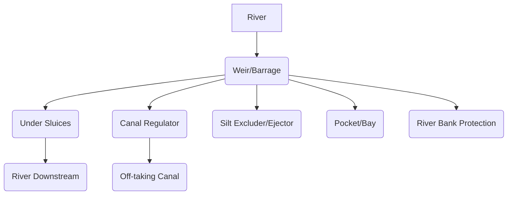

# DESIGN OF HYDRAULIC STRUCTURES - Module 1: Diversion Head Works

## Topic: Diversion Head Works - Layout and Functions of Components

This module introduces the fundamental concepts and components of diversion headworks, which are crucial for water resource management and utilization.

### Learning Outcomes:

Upon completion of this topic, you should be able to:

*   Understand the purpose and necessity of diversion headworks.
*   Describe the typical layout of a diversion headwork system.
*   Identify and explain the functions of each major component of a diversion headwork.
*   Discuss the factors influencing the selection and design of different components.
*   Appreciate the role of diversion headworks in water supply, irrigation, and hydropower generation.

---

### 1. Introduction to Diversion Head Works

**Definition:** Diversion headworks are structures constructed across a river or stream to impound water and divert it into a canal or channel for various beneficial uses like irrigation, water supply, or hydropower generation. They essentially act as a "gatekeeper" to control and channel river water.

**Purpose and Necessity:**

*   **Raise Water Level:** To enable gravity flow of water into the off-taking canal, which is usually at a higher elevation than the riverbed.
*   **Control Water Flow:** To regulate the quantity of water diverted into the canal based on demand.
*   **Sediment Exclusion:** To prevent excessive silt and debris from entering the off-taking canal, thus protecting the canal system and downstream users.
*   **Water Storage (Temporary):** In some cases, a minor pondage may be created to ensure a continuous supply during low flow periods.

**Key Concept:** **Gravity Flow:** The primary principle behind most diversion headworks is to utilize gravity to transport water from the river to the canal. This requires raising the water level in the river to a sufficient height.

---

### 2. Typical Layout of a Diversion Head Work

The layout of a diversion headwork is designed to efficiently impound, control, and divert water while minimizing adverse impacts on the river and surrounding areas. A typical layout includes the following interconnected components:

**Explanation of the Diagram:**

*   The **River** flows towards the diversion structure.
*   The **Weir/Barrage** is the main impounding structure.
*   **Under Sluices** are openings at the riverbed level.
*   **Canal Regulator** controls the flow into the off-taking canal.
*   **Silt Excluder/Ejector** are features to manage sediment.
*   **Pocket/Bay** refers to specific sections of the weir.
*   **River Bank Protection** is crucial for stability.
*   The **Off-taking Canal** carries the diverted water.
*   **River Downstream** receives the remaining flow.

---

### 3. Functions of Major Components

Let's delve into the detailed functions of each component:

#### 3.1. Weir or Barrage

*   **Function:** The primary impounding structure. It is a low structure built across the river to raise the water level upstream to a desired level for diversion into the canal.
*   **Types:**
    *   **Weir:** Generally a solid, permeable or impermeable structure. They are typically lower in height compared to barrages.
    *   **Barrage:** A gated structure that allows for more precise control over the water level and discharge. Barrages are preferred when higher water levels need to be maintained or when flood control is also a significant consideration.
*   **Key Concept:** **Crest Level:** The top elevation of the weir/barrage, which determines the upstream water level when the structure is submerged.
*   **Example:** An ungated weir will allow water to spill over its crest, while a barrage with gates can hold back water to a specific level by closing the gates.

#### 3.2. Under Sluices

*   **Function:** A series of openings (gates or shutters) located at the riverbed level, immediately upstream of the weir/barrage crest. Their main purpose is to:
    *   **Pass Sediment:** Allow a portion of the river flow carrying heavy silt to pass downstream, preventing its accumulation in the upstream pond.
    *   **Scour Ahead:** Create scour (erosion) in front of the weir, which helps in ejecting silt that might have entered the pond.
    *   **Maintain Pond Level:** By regulating the opening of the under sluice gates, the upstream water level can be maintained even during low flow conditions.
*   **Key Concept:** **Scouring Effect:** The high velocity of water through the under sluices generates scour, which is essential for sediment management.
*   **Example:** During high floods with high sediment loads, the under sluice gates are kept widely open to flush out the silt.

#### 3.3. Canal Regulator (Head Regulator)

*   **Function:** Located at the off-taking point of the canal, upstream of the weir/barrage. It controls the diversion of water into the canal and regulates the flow according to the canal's capacity and demand.
    *   **Controls Diversion:** Regulates the entry of water into the canal by adjusting its gates.
    *   **Prevents Silt Entry:** Designed to prevent excessive silt from entering the canal by drawing water from the cleaner layers in the pond.
    *   **Prevents Surging:** Acts as a buffer against sudden surges in river flow.
*   **Key Concept:** **Afflux:** The rise in the upstream water level caused by the construction of the weir/barrage. The canal regulator is designed to draw water from this raised level.
*   **Example:** If the irrigation demand decreases, the gates of the canal regulator are partially closed to reduce the flow into the canal.

#### 3.4. Silt Excluder (or Silt Ejector)

*   **Function:** Structures designed to prevent silt from entering the canal.
    *   **Silt Excluder:** Usually a series of tunnels or conduits located beneath the riverbed, leading from the upstream pond to downstream of the weir. Water with high silt concentration is drawn into these tunnels and ejected downstream. They are typically placed directly in front of the canal regulator.
    *   **Silt Ejector:** Works on the principle of creating a strong current or eddy in front of the canal intake. This eddy carries the silt away from the intake and ejects it downstream.
*   **Key Concept:** **Differential Silt Load:** Silt concentration is usually higher near the riverbed. Silt excluders/ejectors exploit this by drawing water from the lower, silt-laden layers.
*   **Example:** A silt excluder might have tunnels that start near the riverbed upstream of the canal regulator, drawing in silt-laden water and discharging it back into the river downstream of the weir.

#### 3.5. Pocket

*   **Function:** A wider section of the river channel immediately upstream of the canal regulator and in front of the silt excluder.
    *   **Silt Accumulation:** Allows silt to settle and accumulate.
    *   **Sediment Flushing:** The accumulated silt can be periodically flushed out by opening the under sluices or a dedicated gate in the pocket.
*   **Key Concept:** **Settling Basin:** The pocket acts as a temporary settling basin for heavier silt particles.
*   **Example:** The pocket in front of the canal regulator is often kept clear of debris by the scouring action of the under sluices.

#### 3.6. River Bank Protection (Guide Banks, Spurs)

*   **Function:** Structures constructed to guide the river flow towards the diversion structure and protect the river banks from erosion.
    *   **Guide Banks:** Embankments that funnel the river flow towards the weir/barrage and the off-taking canal. They help in keeping the flow concentrated and preventing meandering.
    *   **Spurs:** Projecting structures into the river, usually made of masonry or pitching, designed to deflect the flow away from the banks and towards the center of the channel.
*   **Key Concept:** **Hydraulic Efficiency:** Proper river training ensures that the water is efficiently directed towards the diversion works, maximizing diversion and minimizing energy loss.
*   **Example:** During floods, guide banks prevent the river from breaching its natural banks and inundating surrounding areas, while also directing the flow to the under sluices for effective silt removal.

#### 3.7. Divide Wall

*   **Function:** A masonry or concrete wall constructed perpendicular to the weir/barrage axis, extending from the weir to a certain distance upstream and downstream. It separates the under sluice section from the canal regulator section.
    *   **Protects Canal Intake:** Prevents heavy silt from entering the pocket and canal regulator from the under sluice section.
    *   **Facilitates Silt Flushing:** Creates a relatively cleaner pocket of water for the canal intake.
    *   **Improves Efficiency:** Enhances the efficiency of both the under sluices and the canal regulator by ensuring their respective functions are not compromised.
*   **Key Concept:** **Flow Separation:** The divide wall effectively separates the flow regimes in front of the under sluices and the canal regulator.
*   **Example:** The divide wall ensures that the water drawn by the silt excluder and canal regulator comes from a relatively less turbid zone compared to the water passing through the under sluices.

#### 3.8. Falls / Glacis

*   **Function:**
    *   **Falls:** Structures designed to safely dissipate the energy of water falling from a higher level to a lower level, usually at the end of the weir or across the river downstream of the barrage. This prevents scour in the downstream riverbed.
    *   **Glacis:** A sloping apron downstream of the weir/barrage that provides a transition for the water flow, reducing the velocity and preventing scour.
*   **Key Concept:** **Energy Dissipation:** Crucial for preventing downstream erosion and protecting the foundation of the diversion structure.
*   **Example:** A falling cascade of water over a dam is a type of fall. A gently sloping concrete apron downstream of a weir is a glacis.

---

### 4. Factors Influencing Selection and Design of Components

The choice and design of diversion headwork components depend on several factors:

*   **River Characteristics:**
    *   **Discharge:** Peak and average discharge, flood hydrograph.
    *   **Sediment Load:** Quantity and nature of silt (finer or coarser).
    *   **River Morphology:** Width, depth, bed material, meandering tendency.
    *   **Hydraulic Grade Line:** Upstream and downstream water levels.
*   **Site Conditions:**
    *   **Topography:** Ground levels, slopes.
    *   **Geology:** Soil bearing capacity, permeability.
    *   **Availability of Construction Materials:** Stone, concrete, steel.
*   **Purpose of Diversion:**
    *   **Irrigation:** Specific water demand, cropping patterns.
    *   **Water Supply:** Population served, per capita consumption.
    *   **Hydropower:** Required head and flow.
*   **Economic Considerations:** Cost of construction, maintenance, and benefits.
*   **Environmental and Social Factors:** Impact on fish migration, riparian ecosystems, downstream water availability, land acquisition.

---

### 5. Role of Diversion Headworks in Water Resource Management

Diversion headworks are critical in enabling the efficient use of river water resources:

*   **Irrigation:** They provide a reliable and controlled water supply for agriculture, leading to increased food production and rural development.
*   **Water Supply:** They ensure a consistent source of water for domestic and industrial use in urban and rural areas.
*   **Hydropower Generation:** By creating a head, they are essential for generating electricity from the force of falling water.
*   **Flood Control (Partial):** While not their primary purpose, barrages with gates can offer some degree of flood regulation.

---

### Practice Questions and Exercises

**Question 1:** What is the primary purpose of constructing a diversion headwork?

**Question 2:** Differentiate between a weir and a barrage.

**Question 3:** Explain the role of under sluices in managing sediment in a diversion headwork.

**Question 4:** If a canal is to draw water from a river, which structure is primarily responsible for controlling the flow into the canal?

**Question 5:** Name a structure that helps to separate the flow regime in front of the under sluices from that of the canal regulator. What is its function?

**Question 6:** Discuss the importance of river bank protection in the context of diversion headworks.

---

### Answers to Practice Questions

**Answer 1:** The primary purpose of a diversion headwork is to raise the water level in the river to enable gravity flow of water into an off-taking canal or channel for beneficial uses.

**Answer 2:** A weir is typically a solid, ungated structure that impounds water by allowing it to spill over its crest. A barrage is a gated structure that allows for more precise control over the upstream water level and discharge by operating its gates.

**Answer 3:** Under sluices are openings at the riverbed level that are kept open to pass the heavily silt-laden water downstream, thus preventing its accumulation in the upstream pond. They also create scour to help eject silt that might enter the pond.

**Answer 4:** The **Canal Regulator** (or Head Regulator) is primarily responsible for controlling the flow into the off-taking canal.

**Answer 5:** The **Divide Wall** helps to separate the flow regime. Its function is to prevent heavy silt from the under sluice section from entering the canal regulator section and to create a cleaner pocket of water for the canal intake.

**Answer 6:** River bank protection (e.g., guide banks, spurs) is crucial to guide the river flow towards the diversion structure, prevent erosion of the river banks, and ensure the stability and efficient operation of the headworks. It prevents the river from breaching its banks and causing damage.

---

### Important Points to Remember:

*   **Gravity Flow:** The underlying principle for diversion headworks is to utilize gravity.
*   **Sediment Management:** Controlling silt is a critical function, and structures like under sluices, silt excluders/ejectors, and pockets are designed for this purpose.
*   **Weir vs. Barrage:** Barrages offer more control due to gates, while weirs are simpler impounding structures.
*   **Component Synergy:** All components work together to achieve efficient water diversion and management.
*   **River Training:** Proper alignment and protection of the river channel are vital for the longevity and performance of the diversion works.
*   **Site-Specific Design:** The design of each component is highly dependent on the specific characteristics of the river and the site.
