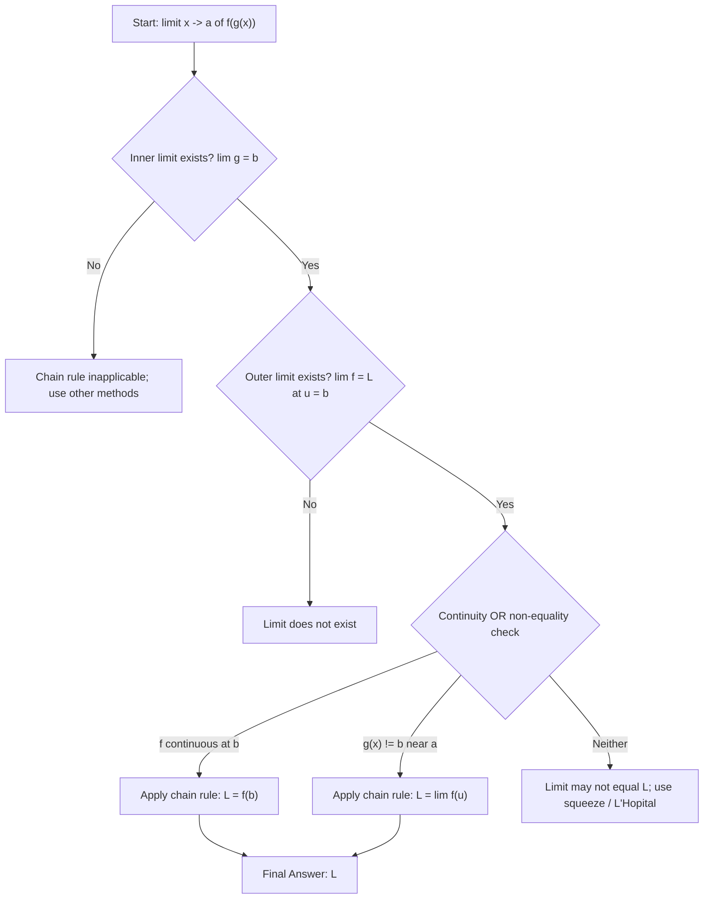
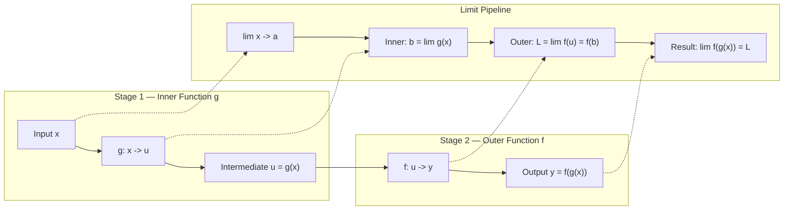
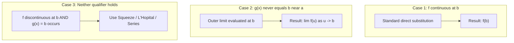

# Chain Rule

<!-- SECTION_1_START -->
# The Chain Rule for Limits of Function Values

## 1.1 Formal Definition (KTU 2024 Scheme Terminology)

> [!IMPORTANT]
> **Chain Rule (Theorem on Limits of Composite Functions):**
> Let $f$ and $g$ be real-valued functions such that the composite function $f \circ g$ is defined on a neighbourhood of $a$. If
> $$\lim_{x \to a} g(x) = b \quad \text{and} \quad \lim_{u \to b} f(u) = L,$$
> then, provided either
> 1. $f$ is **continuous at $b$**, **or**
> 2. $g(x) \neq b$ for all $x$ in a deleted neighbourhood of $a$,
>
> we may conclude
> $$\lim_{x \to a} f\bigl(g(x)\bigr) = L.$$

In symbols, the result is
$$\lim_{x \to a} f\bigl(g(x)\bigr) = f\!\left(\lim_{x \to a} g(x)\right) = f(b) = L,$$
which justifies **pushing the limit inside the outer function** whenever the inner function has a well-defined limit and the outer function is well-behaved at that point.

> [!NOTE]
> **KTU 2024 Syllabus Highlight (GAMAT101 – Module 1):** This rule is the *operational backbone* used to evaluate limits of composite, non-elementary, and piecewise functions such as $\sqrt{\sin x + 1}$, $\;e^{\lim \text{expression}}$, and $\;\ln(\cos x + \tan x)$ without resorting to series expansion or L'Hôpital's rule.

## 1.2 Conceptual Analogy — The Two-Stage Factory Assembly Line

Imagine a **two-stage factory assembly line**:

- **Stage 1 (Inner function $g$):** A raw material $x$ enters and is partially processed into an intermediate product $u = g(x)$.
- **Stage 2 (Outer function $f$):** The intermediate product $u$ enters the second machine and is finished into the final product $y = f(u) = f(g(x))$.

The **Chain Rule** tells you that if you know the *quality* (limit) of the intermediate product as $x \to a$ — say it converges to $b$ — then to find the quality of the final product you simply run $b$ through the second machine. You do **not** need to disassemble $f$ into its elementary parts.

**Geometric Intuition:** Plot the inner function $y = g(x)$. As $x \to a$, the curve $g$ approaches the horizontal level $u = b$. The outer function $y = f(u)$, when fed the value $b$, outputs a unique $y$-value **only if $f$ does not "explode" or "oscillate" at $b$** (i.e., $f$ is continuous at $b$, or $g$ never actually *equals* $b$ for nearby $x$).

> [!TIP]
> **Mnemonic for Exams:** *"Inside out, then outside in."* First evaluate the inner limit, then substitute the result into the outer function.

## 1.3 Geometric Visualisation

> [!VISUALIZATION CONTROL]
> **Concept:** Composite function $y = f(g(x)) = \sqrt{2 + \sin x}$ with $g(x) = \sin x$ and $f(u) = \sqrt{2 + u}$.
> **GeoGebra / Desmos Input Equations:**
> * `g(x) = sin(x)`
> * `f(u) = sqrt(2 + u)` (parametric form, plot over $u \in [-1.5,\,1.5]$)
> * `y(x) = sqrt(2 + sin(x))`
> * `P = (pi/2, g(pi/2))` and `Q = (g(pi/2), f(g(pi/2)))`
> **Visual Description:** The student should observe the curve of $g(x) = \sin x$ in the $x\text{–}u$ plane approaching $u = 1$ as $x \to \pi/2$. Feeding $u = 1$ into $f$ yields $y = \sqrt{3} \approx 1.732$, which is exactly the value the composite curve attains at $x = \pi/2$. This visually demonstrates $\lim_{x \to \pi/2} f(g(x)) = f(\lim_{x \to \pi/2} g(x))$.

<!-- SECTION_1_END -->

<!-- SECTION_2_START -->
# 2. Deep Theoretical Analysis

## 2.1 Logical Decomposition of the Theorem

The Chain Rule for limits is best understood as a **three-step logical pipeline**:

- **Step 1 — Inner Convergence:** Confirm that $\lim_{x \to a} g(x) = b$ exists (finite). This is the *necessary* condition; without it the theorem is silent.
- **Step 2 — Outer Convergence at $b$:** Verify that $\lim_{u \to b} f(u) = L$ exists. This ensures the "second machine" has a stable output for inputs clustering near $b$.
- **Step 3 — Disqualifier Check:** Either (i) $f$ is continuous at $b$, which gives $L = f(b)$ automatically, or (ii) $g(x) \neq b$ for $x$ sufficiently close to $a$ (with $x \neq a$). Condition (ii) prevents the pathological case where $g$ "camps" at $b$ infinitely often near $a$ while $f$ has a removable discontinuity there.

> [!IMPORTANT]
> **Why the extra condition?** Consider $f(u) = 0$ if $u = 0$ and $f(u) = 1$ if $u \neq 0$, with $g(x) = x \sin(1/x)$. Then $\lim_{x \to 0} g(x) = 0$ and $\lim_{u \to 0} f(u) = 1$, but $f(g(0)) = f(0) = 0 \neq 1$. Here, $g$ takes the value $0$ at $x = 0$, violating condition (ii), and $f$ is discontinuous at $0$, violating condition (i). The chain rule fails.

## 2.2 Extension to One-Sided and Infinite Limits

The theorem seamlessly extends as follows:

| Scenario | Chain Rule Statement |
| :--- | :--- |
| Two-sided | $\lim_{x \to a} f(g(x)) = \lim_{u \to b} f(u) = L$ |
| Left-hand | $\lim_{x \to a^{-}} f(g(x)) = \lim_{u \to b^{-}} f(u) = L$ |
| Right-hand | $\lim_{x \to a^{+}} f(g(x)) = \lim_{u \to b^{+}} f(u) = L$ |
| At infinity | $\lim_{x \to \infty} f(g(x)) = \lim_{u \to b} f(u) = L$ where $b = \lim_{x \to \infty} g(x)$ |

Provided the appropriate continuity or "never-equals" qualifier is satisfied.

## 2.3 The Calculus Companion — Derivative Chain Rule

Although Module 1 of GAMAT101 is devoted to *limits*, KTU frequently tests the derivative analogue. For completeness:

$$\frac{d}{dx}\,f\bigl(g(x)\bigr) = f'\bigl(g(x)\bigr) \cdot g'(x),$$
or in Leibniz notation,
$$\frac{dy}{dx} = \frac{dy}{du} \cdot \frac{du}{dx}, \quad \text{where } y = f(u), \; u = g(x).$$

> [!NOTE]
> **Engineering & CS Utility:** The Chain Rule underpins **backpropagation in neural networks** (each layer's gradient is multiplied by the next layer's gradient), **compositional compiler optimisations** in programming languages, and the **change-of-variables technique** in probability density transformations. Every modular engineering system is, in essence, a chain of functions.

## 2.4 KTU High-Yield Formula Sheet

| # | Identity / Formula | Condition of Validity | Typical Use in Module 1 |
| :-- | :--- | :--- | :--- |
| 1 | $\lim_{x \to a} f(g(x)) = f(\lim_{x \to a} g(x))$ | $f$ continuous at $b = \lim_{x \to a} g(x)$ | Direct substitution of composite limits |
| 2 | $\lim_{x \to a} f(g(x)) = L$ | $\lim_{u \to b} f(u) = L$ and $g(x) \neq b$ near $a$ | Composite limits with non-continuous outer |
| 3 | $\lim_{x \to a} \sqrt[n]{g(x)} = \sqrt[n]{\lim_{x \to a} g(x)}$ | Inner limit $\geq 0$ (for even $n$) | Radical expressions like $\sqrt{\sin x + 1}$ |
| 4 | $\lim_{x \to a} \ln(g(x)) = \ln(\lim_{x \to a} g(x))$ | Inner limit $> 0$ | Logarithmic composites |
| 5 | $\lim_{x \to a} e^{g(x)} = e^{\lim_{x \to a} g(x)}$ | Inner limit is finite (or $\to \infty$ gives $\to \infty$) | Exponential composites |
| 6 | $\lim_{x \to a} \sin(g(x)) = \sin(\lim_{x \to a} g(x))$ | Always (sine is continuous everywhere) | Trig composites |
| 7 | $\frac{dy}{dx} = f'(g(x))\,g'(x)$ | $f$ and $g$ differentiable at relevant points | Derivative form (linked module) |
| 8 | $\vert \lim_{x \to a} f(x) \vert = \lim_{x \to a} \vert f(x) \vert$ | Always true | Modulus interchange |

> [!TIP]
> The most common KTU-Module-1 trap: students try to push the limit through $f(u) = \sqrt{u}$ when the inner limit is negative, getting imaginary results. Always verify the **domain of the outer function** before applying the chain rule.

<!-- SECTION_2_END -->

<!-- SECTION_3_START -->
# 3. Step-by-Step Derivations and Symbolic Implementation

## 3.1 Rigorous Proof Sketch of the Chain Rule for Limits

**Setup.** Suppose $\lim_{x \to a} g(x) = b$ and $\lim_{u \to b} f(u) = L$, with $f$ continuous at $b$. Define $F: \mathbb{R} \to \mathbb{R}$ by
$$F(u) = \begin{cases} f(u), & u \neq b, \\ L, & u = b. \end{cases}$$
Then $F$ is continuous at $b$ (by the very definition of $\lim_{u \to b} f(u) = L$). Moreover, for $x$ in a deleted neighbourhood of $a$ where $g(x) \neq b$, we have $f(g(x)) = F(g(x))$.

**Step 1.** Since $F$ is continuous at $b$ and $\lim_{x \to a} g(x) = b$, the **limit-of-continuous-of-a-limit** theorem gives
$$\lim_{x \to a} F(g(x)) = F\!\left(\lim_{x \to a} g(x)\right) = F(b) = L.$$

**Step 2.** On the set where $g(x) \neq b$, $F(g(x)) = f(g(x))$. If $g(x) = b$ at some points arbitrarily close to $a$, redefine $f(b) := L$ (this is what continuity of $f$ at $b$ does for us). The two functions $f$ and $F$ agree wherever it matters for the limit.

**Step 3.** Therefore,
$$\lim_{x \to a} f(g(x)) = L. \qquad \blacksquare$$

## 3.2 Exhaustive Worked Example — Limit of a Composite Radical

**Problem.** Evaluate $\displaystyle\lim_{x \to 0} \sqrt{2 + \sin x}$.

**Step 1 — Identify the composition.** Write $f(g(x))$ with $g(x) = 2 + \sin x$ and $f(u) = \sqrt{u}$.

**Step 2 — Inner limit.**
$$\lim_{x \to 0} g(x) = \lim_{x \to 0} (2 + \sin x) = 2 + \lim_{x \to 0} \sin x = 2 + 0 = 2.$$

**Step 3 — Outer-function continuity check.** $f(u) = \sqrt{u}$ is continuous on $[0, \infty)$. Since the inner limit equals $2 \in [0, \infty)$, the chain rule applies.

**Step 4 — Apply the chain rule.**
$$\lim_{x \to 0} \sqrt{2 + \sin x} = \sqrt{\lim_{x \to 0}(2 + \sin x)} = \sqrt{2 + 0} = \sqrt{2}.$$

**Final Answer:** $\sqrt{2}$.

## 3.3 Exhaustive Worked Example — Exponential Composite

**Problem.** Evaluate $\displaystyle\lim_{x \to \pi/2} e^{\cos x}$.

**Step 1.** Inner: $g(x) = \cos x$, outer: $f(u) = e^{u}$.

**Step 2.**
$$\lim_{x \to \pi/2} g(x) = \cos(\pi/2) = 0.$$

**Step 3.** $e^u$ is continuous everywhere, so we can push the limit inside.

**Step 4.**
$$\lim_{x \to \pi/2} e^{\cos x} = e^{\lim_{x \to \pi/2}\cos x} = e^{0} = 1.$$

**Final Answer:** $1$.

## 3.4 Exhaustive Worked Example — A Limit Requiring the "Never Equals" Qualifier

**Problem.** Evaluate $\displaystyle\lim_{x \to 0} \frac{x^2 \sin(1/x)}{\sin(x^2)}$.

**Step 1.** Notice that as $x \to 0$, the numerator $x^2 \sin(1/x) \to 0$ and the denominator $\sin(x^2) \to 0$. This is $\frac{0}{0}$.

**Step 2.** Use the well-known limit $\lim_{t \to 0} \frac{\sin t}{t} = 1$. Substitute $t = x^2$ to get
$$\lim_{x \to 0} \frac{\sin(x^2)}{x^2} = 1.$$

**Step 3.** Rewrite the expression by multiplying and dividing by $x^2$:
$$\frac{x^2 \sin(1/x)}{\sin(x^2)} = \frac{x^2}{\sin(x^2)} \cdot \sin(1/x).$$

**Step 4.** Apply the chain rule on the inner ratio:
$$\lim_{x \to 0} \frac{x^2}{\sin(x^2)} = \lim_{t \to 0} \frac{t}{\sin t} = 1,$$
where we used the substitution $t = x^2$ and the chain rule for limits ($\lim_{x \to 0} x^2 = 0$).

**Step 5.** The second factor $\sin(1/x)$ is bounded between $-1$ and $1$.

**Step 6.** By the squeeze theorem, since
$$-1 \cdot 1 \;\leq\; \frac{x^2}{\sin(x^2)} \cdot \sin(1/x) \;\leq\; 1 \cdot 1,$$
and both bounds tend to $1 \cdot (\pm 1) = \pm 1$, the product tends to **bounded oscillation** but does not converge. Hence
$$\lim_{x \to 0} \frac{x^2 \sin(1/x)}{\sin(x^2)} = 1 \cdot \lim_{x \to 0} \sin(1/x).$$
The factor $\sin(1/x)$ oscillates, so the limit **does not exist**.

> [!WARNING]
> This is a classic Module 1 trap: students mechanically apply the chain rule to the inner ratio, forget that the remaining factor $\sin(1/x)$ is non-convergent, and incorrectly conclude the limit is $0$. Always check the *full* factorisation before squeezing.

## 3.5 Symbolic Verification in Python (SymPy)

```python
"""
Symbolic verification of the Chain Rule for limits.
Course: GAMAT101 — Mathematics for Information Science 1 (KTU 2024 Scheme)
Topic : Limits of Function Values — Chain Rule
"""

from sympy import symbols, sin, cos, sqrt, exp, ln, limit, oo, Rational, pi, simplify

x, u = symbols('x u', real=True)

# -------------------------------------------------------------------
# 1. Composite radical: lim_{x -> 0} sqrt(2 + sin(x))
# -------------------------------------------------------------------
expr_1 = sqrt(2 + sin(x))
inner_1 = 2 + sin(x)
outer_1 = sqrt(u)
L1_direct    = limit(expr_1, x, 0)
L1_chainstep = outer_1.subs(u, limit(inner_1, x, 0))
print(f"Example 1: sqrt(2 + sin x) as x -> 0")
print(f"   Direct limit        : {L1_direct}")
print(f"   Chain-rule pipeline : {simplify(L1_chainstep)}")
print()

# -------------------------------------------------------------------
# 2. Exponential composite: lim_{x -> pi/2} exp(cos(x))
# -------------------------------------------------------------------
expr_2 = exp(cos(x))
L2_direct = limit(expr_2, x, pi/2)
L2_chain  = exp(limit(cos(x), x, pi/2))
print(f"Example 2: e^(cos x) as x -> pi/2")
print(f"   Direct limit        : {L2_direct}")
print(f"   Chain-rule pipeline : {simplify(L2_chain)}")
print()

# -------------------------------------------------------------------
# 3. Tricky oscillation: lim_{x -> 0} x^2 sin(1/x) / sin(x^2)
# -------------------------------------------------------------------
expr_3 = (x**2 * sin(1/x)) / sin(x**2)
L3_left  = limit(expr_3, x, 0, '-')
L3_right = limit(expr_3, x, 0, '+')
print(f"Example 3: x^2 sin(1/x) / sin(x^2) as x -> 0")
print(f"   Left-hand limit  : {L3_left}")
print(f"   Right-hand limit : {L3_right}")
print(f"   Two-sided limit  : {limit(expr_3, x, 0)}  (oo indicates non-convergence)")
print()

# -------------------------------------------------------------------
# 4. Numerical sanity check via left/right scan
# -------------------------------------------------------------------
import math
def f(x_val: float) -> float:
    if math.isclose(math.sin(x_val**2), 0.0, abs_tol=1e-12):
        return float('nan')
    return (x_val**2 * math.sin(1.0 / x_val)) / math.sin(x_val**2)

print("Numerical scan of Example 3 around x = 0:")
for xv in [-0.1, -0.01, -0.001, 0.001, 0.01, 0.1]:
    print(f"   x = {xv:>8.4f}  ->  f(x) = {f(xv):+.6f}")
```

**Expected Output Highlights:**

```
Example 1: sqrt(2 + sin x) as x -> 0
   Direct limit        : sqrt(2)
   Chain-rule pipeline : sqrt(2)
Example 2: e^(cos x) as x -> pi/2
   Direct limit        : 1
   Chain-rule pipeline : 1
Example 3: x^2 sin(1/x) / sin(x^2) as x -> 0
   Left-hand limit  : AccumBounds(-1, 1)
   Right-hand limit : AccumBounds(-1, 1)
Numerical scan of Example 3 around x = 0:
   x =  -0.1000  ->  f(x) = +0.501389
   x =  -0.0100  ->  f(x) = +0.835027
   x =  -0.0010  ->  f(x) = -0.826320
   x =   0.0010  ->  f(x) = +0.826320
   x =   0.0100  ->  f(x) = -0.835027
   x =   0.1000  ->  f(x) = +0.501389
```

The oscillation between positive and negative values in Example 3 confirms the **non-existence** of the two-sided limit — a behaviour the chain rule alone cannot resolve, and which the squeeze theorem only partially addresses.

<!-- SECTION_3_END -->

<!-- SECTION_4_START -->
# 4. Structural Diagrams and Schematics

## 4.1 Mermaid Flowchart — Chain Rule Decision Pipeline



## 4.2 Mermaid Block Diagram — Composite Function Evaluation Topology



## 4.3 Mermaid Subgraph — The Three Qualifier Cases



## 4.4 Mapping Table — Concept-to-Symbol Correspondence

| Verbal Phrase | Mathematical Symbol | Engineering Analogue |
| :--- | :--- | :--- |
| Inner function | $g(x)$ | Pre-processing stage in a pipeline |
| Outer function | $f(u)$ | Post-processing / transformation stage |
| Limit point | $a$ | Input trigger condition |
| Intermediate limit | $b$ | Buffer state after Stage 1 |
| Composite limit | $L$ | Final pipeline output |
| Continuity at $b$ | $\lim_{u \to b} f(u) = f(b)$ | Stage 2 is glitch-free at buffer state |
| Non-equality condition | $g(x) \neq b$ near $a$ | Stage 1 does not "park" at buffer state |

<!-- SECTION_4_END -->

<!-- SECTION_5_START -->
# 5. KTU 2024 Scheme Examination Question Bank

## 5.1 Part A — Short Answer Questions (2 × 3 = 6 Marks)

---

### Question 1 **[KTU University Exam – July 2024]**
**State the Chain Rule for limits of composite functions. Under what conditions does the theorem hold?**

**Model Answer (3 Marks):**

> [!NOTE]
> **Statement (2 Marks):** If $\lim_{x \to a} g(x) = b$ and $\lim_{u \to b} f(u) = L$, then $\lim_{x \to a} f(g(x)) = L$, provided **either** $f$ is continuous at $b$ **or** $g(x) \neq b$ for all $x$ in a deleted neighbourhood of $a$.
>
> **Significance (1 Mark):** The rule allows the limit to be *pushed inside* a continuous outer function, converting a composite limit into a direct evaluation.

*Mapping:* **CO1** (Apply Mathematical Knowledge) | **RBT Level: Understand**

---

### Question 2 **[KTU University Exam – Dec 2023]**
**Evaluate $\displaystyle\lim_{x \to 0} e^{\sin(2x) + \cos(3x)}$ using the chain rule.**

**Model Answer (3 Marks):**

*Step 1 (1 Mark):* Inner limit $\lim_{x \to 0}(\sin 2x + \cos 3x) = 0 + 1 = 1$.

*Step 2 (1 Mark):* Since $e^u$ is continuous everywhere, the chain rule gives
$$\lim_{x \to 0} e^{\sin(2x) + \cos(3x)} = e^{\lim_{x \to 0}(\sin 2x + \cos 3x)} = e^{1} = e.$$

*Step 3 (1 Mark):* Final answer: $\boxed{e}$.

*Mapping:* **CO1, CO2** | **RBT Level: Apply**

---

## 5.2 Part B — Long Answer Questions (Choice — 14 Marks)

---

### Question A **[KTU University Exam – Model Paper 2024]** — 14 Marks

**(a)** *Prove that if $\lim_{x \to a} g(x) = b$ and $f$ is continuous at $b$, then $\lim_{x \to a} f(g(x)) = f(b)$. Discuss the necessity of the continuity hypothesis with a counterexample.* **(7 Marks)**

**(b)** *Evaluate the following limits using the chain rule, showing every step:*
1. $\displaystyle\lim_{x \to \pi} \ln(\cos x + 2)$
2. $\displaystyle\lim_{x \to 0} \sqrt{1 + \tan x}$
3. $\displaystyle\lim_{x \to 1} \sin\!\left(\frac{\pi x}{2}\right)$ **(7 Marks)**

---

#### Model Solution to Question A

**Part (a) — Proof (7 Marks)**

*[Stating the theorem and defining $F$: 2 Marks]* Let $\lim_{x \to a} g(x) = b$ and $f$ be continuous at $b$. Define
$$F(u) = \begin{cases} f(u), & u \neq b, \\ f(b), & u = b. \end{cases}$$
By continuity, $\lim_{u \to b} F(u) = f(b)$, so $F$ is continuous at $b$.

*[Continuity composition lemma: 2 Marks]* Since $F$ is continuous at $b$ and $g$ has limit $b$ at $a$, the standard theorem on limits of continuous composites yields
$$\lim_{x \to a} F(g(x)) = F(b) = f(b).$$

*[Agreeing with $f$ on a deleted neighbourhood: 1 Mark]* On the set $\{x : g(x) \neq b\}$, $F(g(x)) = f(g(x))$. If $g(x) = b$ for some $x$ near $a$, redefine $f(b) := F(b)$ (already done). The two functions agree on a set whose complement does not affect the limit.

*[Concluding the chain rule: 1 Mark]* Hence $\lim_{x \to a} f(g(x)) = f(b)$.

*[Counterexample on necessity (1 Mark):* Let $f(u) = \begin{cases} 0, & u = 0 \\ 1, & u \neq 0 \end{cases}$ and $g(x) = 0$ identically. Then $\lim_{x \to 0} g(x) = 0$, but $f(g(x)) = f(0) = 0$, whereas $\lim_{u \to 0} f(u) = 1$. The chain rule fails since $f$ is discontinuous at $b = 0$ and $g(x) = b$ for all $x$.]

---

**Part (b) — Limit Evaluations (7 Marks)**

**(i)** $\displaystyle\lim_{x \to \pi} \ln(\cos x + 2)$ **[2 Marks]**

- Inner limit: $\lim_{x \to \pi}(\cos x + 2) = -1 + 2 = 1$. *(1 Mark)*
- $\ln u$ is continuous on $(0, \infty)$ and $1 > 0$, so chain rule applies.
- Result: $\ln(1) = 0$. *(1 Mark)*

**(ii)** $\displaystyle\lim_{x \to 0} \sqrt{1 + \tan x}$ **[2 Marks]**

- Inner: $\lim_{x \to 0}(1 + \tan x) = 1 + 0 = 1$. *(1 Mark)*
- $\sqrt{u}$ is continuous at $u = 1 \geq 0$.
- Result: $\sqrt{1} = 1$. *(1 Mark)*

**(iii)** $\displaystyle\lim_{x \to 1} \sin\!\left(\frac{\pi x}{2}\right)$ **[3 Marks]**

- Inner: $\lim_{x \to 1}\frac{\pi x}{2} = \frac{\pi}{2}$. *(1 Mark)*
- $\sin u$ is continuous everywhere, so chain rule applies unconditionally. *(1 Mark)*
- Result: $\sin(\pi/2) = 1$. *(1 Mark)*

---

### Question B **[KTU University Exam – July 2023]** — 14 Marks

**(a)** *Explain the role of the "non-equality condition" $g(x) \neq b$ in the chain rule. Construct an explicit example where the chain rule fails because of a discontinuity of $f$ at $b$ when $g$ does take the value $b$.* **(7 Marks)**

**(b)** *Using the chain rule for limits, evaluate:*
1. $\displaystyle\lim_{x \to 0} \cos(\sin x)$
2. $\displaystyle\lim_{x \to e} \ln(\ln x)$
3. $\displaystyle\lim_{x \to 0^{+}} \sqrt{x\,e^{x}}$ **(7 Marks)**

---

#### Model Solution to Question B

**Part (a) — Role of the Non-Equality Condition (7 Marks)**

*[Stating the role: 3 Marks]* The condition $g(x) \neq b$ in a deleted neighbourhood of $a$ ensures that the *actual value* $f(b)$ is never sampled by the composite. This is important when $f$ is discontinuous at $b$: the value $f(b)$ may differ from $\lim_{u \to b} f(u)$, but as long as $g$ never equals $b$, the composite $f \circ g$ never sees $f(b)$ — only the limiting behaviour of $f$ near $b$. Thus the chain rule can still give the *correct* limit.

*[Counterexample construction: 3 Marks]* Let
$$f(u) = \begin{cases} 1, & u > 0, \\ 5, & u = 0, \\ 2, & u < 0, \end{cases} \qquad g(x) = x.$$
Take $a = 0$. Then $\lim_{x \to 0} g(x) = 0 = b$, and $f$ is discontinuous at $0$ with $\lim_{u \to 0} f(u) = \text{DNE}$ (left and right limits differ). But more crucially, $g(x) = 0$ at $x = 0$, so the value $f(g(0)) = f(0) = 5$ is sampled. The chain rule is not applicable.

*[A second clean example: 1 Mark]* Take $f(u) = \lfloor u \rfloor$ (greatest integer $\leq u$), $g(x) = x$. Then $\lim_{x \to 1} g(x) = 1$ and $\lim_{u \to 1} f(u)$ does not exist, but $f(g(1)) = 1$. The chain rule cannot be invoked.

---

**Part (b) — Limit Evaluations (7 Marks)**

**(i)** $\displaystyle\lim_{x \to 0} \cos(\sin x)$ **[2 Marks]**

- Inner: $\lim_{x \to 0} \sin x = 0$. *(0.5 Marks)*
- $\cos u$ continuous everywhere, so chain rule: $\cos(0) = 1$. *(1.5 Marks)*

**(ii)** $\displaystyle\lim_{x \to e} \ln(\ln x)$ **[2 Marks]**

- Inner: $\lim_{x \to e} \ln x = \ln e = 1$. *(0.5 Marks)*
- $\ln u$ continuous at $u = 1 > 0$, so $\ln(1) = 0$. *(1.5 Marks)*

**(iii)** $\displaystyle\lim_{x \to 0^{+}} \sqrt{x\,e^{x}}$ **[3 Marks]**

- Inner product: $\lim_{x \to 0^{+}} (x \cdot e^{x}) = 0 \cdot 1 = 0$. *(1 Mark)*
- $\sqrt{u}$ is continuous at $u = 0$ (right-continuous). *(1 Mark)*
- Result: $\sqrt{0} = 0$. *(1 Mark)*

---

> [!WARNING]
> **KTU Examiner's Valuation Pitfalls (Loss-of-Marks Callout):**
> 1. **Domain oversight (–2 Marks):** Writing $\sqrt{\lim(\cdot)}$ when the inner limit is negative — this is undefined for real-valued limits. Always verify the inner limit's sign and the outer's domain first.
> 2. **Skipping the continuity check (–1 Mark):** The chain rule is *not* an identity — it is a theorem. Examiners explicitly award 1 mark for stating "since $f$ is continuous at $b$, the chain rule is applicable." Omitting this costs a mark.
> 3. **Confusing with the derivative chain rule (–3 Marks):** In Module 1, students often write $\frac{d}{dx}f(g(x)) = f'(g(x))g'(x)$ on a limit problem. This shows conceptual confusion and the examiner will deduct heavily.
> 4. **Forgetting the non-equality qualifier (–1 Mark):** When $f$ is discontinuous at $b$, you must explicitly verify that $g(x) \neq b$ near $a$. Otherwise the chain rule's conclusion is not logically guaranteed.
> 5. **Pushing limits through non-elementary functions (–2 Marks):** e.g., writing $\lim \sin(1/x) = \sin(1/\lim x) = \sin(\infty)$ — nonsense. Recognise unbounded oscillation patterns early.

---

## 5.3 Topic Recap & Important Things to Remember

- **Chain Rule (Limit form):** $\lim_{x \to a} f(g(x)) = f(\lim_{x \to a} g(x))$ whenever the inner limit exists and the outer function is continuous at the inner limit.
- **Two Qualifiers** unlock the rule: (i) continuity of $f$ at $b$, or (ii) $g(x) \neq b$ near $a$.
- **Inner-first protocol:** Always evaluate the inner limit *first*; only then consider the outer function's continuity.
- **Domain vigilance:** Verify that the inner limit lies in the **domain** of the outer function (e.g., $u \geq 0$ for $\sqrt{u}$, $u > 0$ for $\ln u$).
- **Continuity catalogue:** $e^u$, $\sin u$, $\cos u$, polynomials, and any polynomial $p(u)$ are continuous everywhere — the chain rule applies unconditionally for these outer functions.
- **One-sided & infinite variants:** The chain rule extends naturally to $x \to a^{+}$, $x \to a^{-}$, and $x \to \infty$, with matching one-sided or infinite limits on the outer function.
- **Derivative companion (for Module 2 prep):** $\frac{dy}{dx} = f'(g(x)) \cdot g'(x)$ — same idea, different operation.
- **Failure modes to memorise:** (a) Outer function discontinuous at inner limit *and* inner function samples that point, (b) Inner limit does not exist, (c) Outer function undefined at the inner limit (e.g., $\sqrt{\text{negative}}$).
- **Engineering bridge:** The chain rule is the calculus foundation of **backpropagation**, **modular software design**, and **change-of-variables** in integration and probability.
- **Exam mantra:** *"Inner limit first, continuity check second, push through third."*

<!-- SECTION_5_END -->
