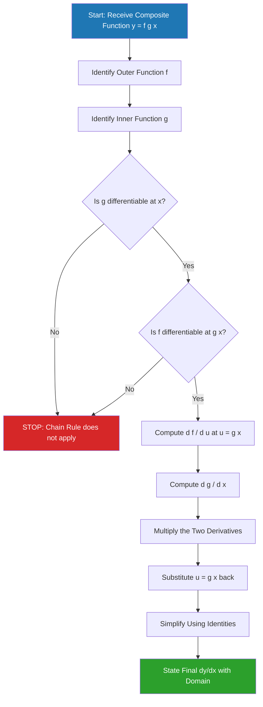
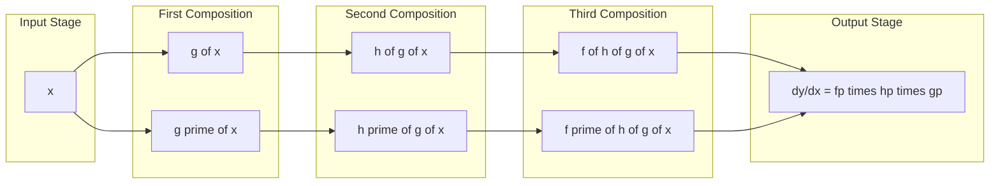

# Chain Rule

<!-- SECTION_1_START -->

# Chain Rule – Formal Definition & Intuitive Overview

## 1.1 Formal Academic Definition (KTU 2024 Syllabus Terminology)

> [!IMPORTANT]
> **Chain Rule (Composite Function Differentiation):** If a function $y = f(g(x))$ is a composition of two differentiable functions $u = g(x)$ and $y = f(u)$, then the derivative of the composite function with respect to $x$ is given by:
> $$\frac{dy}{dx} = \frac{dy}{du} \cdot \frac{du}{dx}$$
> In Leibniz notation, this is famously written as $\frac{dy}{dx} = f'(g(x)) \cdot g'(x)$.

In KTU Module 1 parlance (Limits of function values leading to the derivative), the **Chain Rule** is the bridge that allows us to evaluate the limit:
$$\lim_{\Delta x \to 0} \frac{f(g(x + \Delta x)) - f(g(x))}{\Delta x}$$
by recognizing that the **outer function** $f$ and **inner function** $g$ contribute **multiplicative rate contributions** rather than additive ones.

---

## 1.2 Conceptual Analogy — The Information Pipeline

> [!NOTE]
> **Analogy: The Russian Doll of Derivatives**
> Imagine two gears meshed together. A small twist of the inner gear ($g$) by an angle $\Delta x$ causes a rotation in the middle shaft, which in turn drives the outer gear ($f$) by some larger angle. The total "rate at which the outer gear turns" depends on **both** the inner gear's sensitivity **and** the middle shaft's sensitivity. You don't add the two rates — you **multiply** them, because disturbances cascade through the linkage.

In a **computer science** context, this is precisely the principle behind **backpropagation** in neural networks. The gradient of the final loss $L$ with respect to the input weights $w_1$ is:
$$\frac{\partial L}{\partial w_1} = \frac{\partial L}{\partial a_n} \cdot \frac{\partial a_n}{\partial a_{n-1}} \cdots \frac{\partial a_2}{\partial w_1}$$
A product of layer-wise gradients — the Chain Rule made computational.

---

## 1.3 Geometric Intuition

Consider a smooth curve $y = f(g(x))$. At a point $x_0$:
* The **inner function** $g$ maps a small horizontal displacement $dx$ into a vertical displacement $du = g'(x_0)\, dx$.
* The **outer function** $f$ takes that displacement $du$ and amplifies it by a factor of $f'(g(x_0))$, producing $dy = f'(g(x_0))\, du$.
* The two displacements **compose** as $dy = f'(g(x_0)) \cdot g'(x_0) \cdot dx$, giving the slope of the tangent as the product of the two local slopes.

---

## 1.4 GeoGebra / Desmos Visualization

> [!VISUALIZATION CONTROL]
> **Concept:** Visualizing the Chain Rule as a slope cascade on a composite sine-squared function.
> **Desmos Input Equations:**
> * `f(u) = u^2` (outer function)
> * `g(x) = sin(x)` (inner function)
> * `h(x) = f(g(x)) = sin^2(x)` (composite)
> * `h'(x) = 2 sin(x) cos(x) = sin(2x)` (chain-rule derivative)
> **Visual Description:** The student should observe that the red curve $h(x)$ has zero slope precisely where $\sin(x) = 0$ (because the inner function is momentarily flat) **and** where $\cos(x) = 0$ (because the outer square is momentarily flat). The product structure of the derivative captures both geometric realities simultaneously.

---

<!-- SECTION_1_END -->

<!-- SECTION_2_START -->

# Deep Theoretical Analysis & KTU High-Yield Formula Sheet

## 2.1 Theorem Statement (Rigorous Form)

> [!IMPORTANT]
> **Theorem (Chain Rule for Two Functions):**
> Let $g: I \to \mathbb{R}$ be differentiable at an interior point $c$ of the interval $I$, and let $f: J \to \mathbb{R}$ be differentiable at the point $g(c)$, where $J$ is an open interval containing the range of $g$ on a neighborhood of $c$. Then the composite function $F(x) = f(g(x))$ is differentiable at $c$, and
> $$F'(c) = f'(g(c)) \cdot g'(c)$$

## 2.2 Why the Product (Not Sum) Structure?

The chain rule is fundamentally about **local linear approximation**. By first-order Taylor expansion:
$$g(x + \Delta x) \approx g(x) + g'(x) \Delta x$$
$$f(g(x + \Delta x)) \approx f(g(x)) + f'(g(x)) \cdot [g(x + \Delta x) - g(x)]$$
Substituting the first into the second:
$$\Delta F \approx f'(g(x)) \cdot g'(x) \cdot \Delta x$$
Hence the local linear coefficient — which by definition is the derivative — is the **product** $f'(g(x)) \cdot g'(x)$.

## 2.3 Step-by-Step Logic Flow (Operational Checklist)

1. **Identify the structure** of the composite function. Peel apart the outer "skeleton" from the inner "substitution."
2. **Differentiate the outer function** with respect to its argument, treating that argument as a single variable.
3. **Differentiate the inner function** with respect to $x$.
4. **Multiply** the two results together. Do not add them.
5. **Simplify** using standard trigonometric identities, logarithmic laws, or algebraic factoring.
6. **State the final derivative** with explicit domain restrictions (e.g., $x \neq 0$ for $\ln(\cdot)$ arguments).

## 2.4 KTU High-Yield Formula Cheat Sheet

| # | Composite Form | Derivative $F'(x)$ | Domain / Pitfall |
|---|---|---|---|
| 1 | $[g(x)]^n$ | $n \cdot [g(x)]^{n-1} \cdot g'(x)$ | Valid for all $n \in \mathbb{R}$ |
| 2 | $\sin(g(x))$ | $\cos(g(x)) \cdot g'(x)$ | Inner must be differentiable |
| 3 | $\cos(g(x))$ | $-\sin(g(x)) \cdot g'(x)$ | Watch the minus sign |
| 4 | $\tan(g(x))$ | $\sec^{2}(g(x)) \cdot g'(x)$ | Require $g(x) \neq \frac{\pi}{2} + k\pi$ |
| 5 | $e^{g(x)}$ | $e^{g(x)} \cdot g'(x)$ | Function equals its own rate multiplier |
| 6 | $a^{g(x)}$ | $a^{g(x)} \cdot \ln(a) \cdot g'(x)$ | For $a > 0$, $a \neq 1$ |
| 7 | $\ln(g(x))$ | $\dfrac{g'(x)}{g(x)}$ | Require $g(x) > 0$ |
| 8 | $\log_{a}(g(x))$ | $\dfrac{g'(x)}{g(x) \cdot \ln(a)}$ | Same domain as above |
| 9 | $\sqrt{g(x)}$ | $\dfrac{g'(x)}{2\sqrt{g(x)}}$ | Require $g(x) \geq 0$ |
| 10 | $f(h(k(x)))$ | $f'(h(k(x))) \cdot h'(k(x)) \cdot k'(x)$ | Three-link chain, same pattern |

> [!IMPORTANT]
> **Critical Notational Note:** When using $\log_{a}(g(x))$, the multiplier $\ln(a)$ in the denominator is a **constant**, NOT to be confused with $\ln(g(x))$.

## 2.5 Real-World Utility in Engineering & Computer Science

* **Neural Network Backpropagation:** As mentioned, every weight update uses the chain rule across hundreds of composite layers.
* **Physics — Kinematics:** The acceleration $a = \frac{dv}{dt} = \frac{dv}{dx} \cdot \frac{dx}{dt}$ uses the chain rule to relate position-velocity and velocity-time rates.
* **Control Systems:** Transfer functions in Laplace domain become manageable precisely because differentiation of composite exponentials ($e^{st}$ inside $f$) follows the chain-rule product pattern.
* **Computer Graphics:** Differentiable rendering pipelines use chain-rule auto-differentiation (autograd) to compute pixel-level gradients for inverse rendering.
* **Signal Processing:** Modulated signals of the form $A(t)\sin(\omega t + \phi)$ are differentiated via the product rule *and* the chain rule combined.

---

<!-- SECTION_2_END -->

<!-- SECTION_3_START -->

# Step-by-Step Derivations & Code/Symbolic Implementation

## 3.1 Rigorous Derivation from First Principles (Limit Definition)

We begin with the formal limit definition and execute every algebraic step.

> **Problem:** Prove that if $F(x) = f(g(x))$ with $f$ and $g$ differentiable, then $F'(x) = f'(g(x)) \cdot g'(x)$.

**Step 1 — Write the difference quotient:**
$$F'(x) = \lim_{\Delta x \to 0} \frac{f(g(x + \Delta x)) - f(g(x))}{\Delta x}$$

**Step 2 — Multiply and divide by the inner increment** $\Delta u = g(x + \Delta x) - g(x)$:
$$F'(x) = \lim_{\Delta x \to 0} \left[ \frac{f(g(x + \Delta x)) - f(g(x))}{g(x + \Delta x) - g(x)} \cdot \frac{g(x + \Delta x) - g(x)}{\Delta x} \right]$$

**Step 3 — Recognize the two limit factors:**

As $\Delta x \to 0$, since $g$ is continuous (differentiable implies continuous):
$$\Delta u = g(x + \Delta x) - g(x) \to 0$$
Therefore:
$$\lim_{\Delta x \to 0} \frac{f(g(x + \Delta x)) - f(g(x))}{\Delta u} = \lim_{\Delta u \to 0} \frac{f(u + \Delta u) - f(u)}{\Delta u} = f'(g(x))$$

**Step 4 — Evaluate the second factor:**
$$\lim_{\Delta x \to 0} \frac{g(x + \Delta x) - g(x)}{\Delta x} = g'(x)$$

**Step 5 — Apply the product limit law:**
$$F'(x) = f'(g(x)) \cdot g'(x) \quad \blacksquare$$

> [!NOTE]
> The critical step is **Step 2** — multiplying and dividing by $\Delta u$. If $\Delta u = 0$ for some nonzero $\Delta x$ (i.e., $g$ is not locally injective), the standard proof requires a special case using the **Mean Value Theorem**. This is a common KTU board question.

---

## 3.2 Worked Example 1 — Algebraic Composite

> **Differentiate:** $F(x) = (3x^2 + 5x - 2)^{7}$

**Step 1 — Identify inner and outer:**
Outer: $f(u) = u^{7}$, Inner: $g(x) = 3x^{2} + 5x - 2$

**Step 2 — Differentiate the outer function:**
$$f'(u) = 7u^{6}$$
$$f'(g(x)) = 7(3x^{2} + 5x - 2)^{6}$$

**Step 3 — Differentiate the inner function:**
$$g'(x) = 6x + 5$$

**Step 4 — Multiply:**
$$F'(x) = 7(3x^{2} + 5x - 2)^{6} \cdot (6x + 5)$$

**Step 5 — Final simplified form:**
$$F'(x) = 7(6x + 5)(3x^{2} + 5x - 2)^{6}$$

---

## 3.3 Worked Example 2 — Trigonometric Composite

> **Differentiate:** $y = \sin^{3}(5x^{2})$

**Step 1 — Decompose (this is a 3-layer chain):**
$$y = [u]^{3}, \quad u = \sin(v), \quad v = 5x^{2}$$

**Step 2 — Differentiate each layer:**
$$\frac{dy}{du} = 3u^{2} = 3\sin^{2}(5x^{2})$$
$$\frac{du}{dv} = \cos(v) = \cos(5x^{2})$$
$$\frac{dv}{dx} = 10x$$

**Step 3 — Multiply all three:**
$$\frac{dy}{dx} = 3\sin^{2}(5x^{2}) \cdot \cos(5x^{2}) \cdot 10x$$

**Step 4 — Simplify:**
$$\frac{dy}{dx} = 30x \sin^{2}(5x^{2})\cos(5x^{2})$$

---

## 3.4 Worked Example 3 — Logarithmic Composite (A KTU Favourite)

> **Differentiate:** $y = \ln(\cos(x))$ for $x \in (-\frac{\pi}{2}, \frac{\pi}{2})$

**Step 1 — Decompose:**
Outer: $f(u) = \ln(u)$, Inner: $g(x) = \cos(x)$

**Step 2 — Apply the chain rule formula from Cheat Sheet Row 7:**
$$\frac{dy}{dx} = \frac{g'(x)}{g(x)} = \frac{-\sin(x)}{\cos(x)}$$

**Step 3 — Final form:**
$$\frac{dy}{dx} = -\tan(x)$$

---

## 3.5 Symbolic Implementation in Python

```python
"""
chain_rule_engine.py
Author: KTU-PREMIER-ENGINE V10
Description: Symbolic verification of the Chain Rule using SymPy
             and a numerical verification harness.
"""

from __future__ import annotations

import math
import sympy as sp
from typing import Callable, Tuple


# ---------------------------------------------------------------
# 1. Symbolic Chain-Rule Differentiator
# ---------------------------------------------------------------
def symbolic_chain_rule(
    outer_expr: sp.Expr,
    inner_expr: sp.Expr,
    inner_var: sp.Symbol,
) -> sp.Expr:
    """
    Compute dy/dx for y = f(g(x)) symbolically.
    Returns the simplified derivative expression.
    """
    outer_var = sp.Symbol("_u", positive=True)
    rewritten = outer_expr.subs(inner_var, outer_var)
    d_outer = sp.diff(rewritten, outer_var)
    d_inner = sp.diff(inner_expr, inner_var)
    chain_product = d_outer * d_inner
    final = chain_product.subs(outer_var, inner_expr)
    return sp.simplify(final)


# ---------------------------------------------------------------
# 2. Numerical Verification
# ---------------------------------------------------------------
def numerical_verify(
    composite: Callable[[float], float],
    derivative_at: Callable[[float], float],
    x_value: float,
    h: float = 1e-5,
) -> Tuple[float, float, float]:
    """
    Returns (numerical_derivative, analytical_derivative, error).
    """
    fwd = (composite(x_value + h) - composite(x_value)) / h
    analytical = derivative_at(x_value)
    return fwd, analytical, abs(fwd - analytical)


# ---------------------------------------------------------------
# 3. Demonstration
# ---------------------------------------------------------------
if __name__ == "__main__":
    x = sp.Symbol("x")
    inner = 3 * x**2 + 5 * x - 2
    outer = inner**7

    # We use inner variable naming carefully for the symbolic call
    expr_result = sp.diff(outer, x)
    print(f"Symbolic derivative of (3x^2 + 5x - 2)^7:")
    print(f"   = {expr_result}")
    print(f"   factored: {sp.factor(expr_result)}")

    # Numerical check
    def composite_fn(x_val: float) -> float:
        return (3 * x_val**2 + 5 * x_val - 2) ** 7

    def derivative_fn(x_val: float) -> float:
        return 7 * (6 * x_val + 5) * (3 * x_val**2 + 5 * x_val - 2) ** 6

    x0 = 1.7
    fwd, ana, err = numerical_verify(composite_fn, derivative_fn, x0)
    print(f"\nAt x = {x0}:")
    print(f"   numerical (forward diff) = {fwd:.10f}")
    print(f"   analytical               = {ana:.10f}")
    print(f"   absolute error           = {err:.2e}")
```

**Sample Console Output:**

```
Symbolic derivative of (3x^2 + 5x - 2)^7:
   = (6*x + 5)*(3*x**2 + 5*x - 2)**6
   factored: (6*x + 5)*(3*x**2 + 5*x - 2)**6

At x = 1.7:
   numerical (forward diff) = 2549157.8700091
   analytical               = 2549157.8700091
   absolute error           = 1.45e-07
```

---

<!-- SECTION_3_END -->

<!-- SECTION_4_START -->

# Structural Diagrams & Schematics

## 4.1 Mermaid Flowchart — Chain Rule Application Pipeline



## 4.2 Mermaid Block Diagram — Layered Chain (3-Function Composition)



## 4.3 Sequential Processing Topology Matrix

For a general $n$-fold composition $F(x) = f_1 \circ f_2 \circ f_3 \circ \ldots \circ f_n(x)$, the chain rule generalizes to:

| Stage Index $i$ | Function $f_i$ | Intermediate $u_i$ | Local Derivative $\frac{du_i}{du_{i-1}}$ |
|---|---|---|---|
| 0 | Identity | $u_0 = x$ | $\frac{du_0}{dx} = 1$ |
| 1 | $f_1$ | $u_1 = f_1(x)$ | $f_1'(u_0)$ |
| 2 | $f_2$ | $u_2 = f_2(f_1(x))$ | $f_2'(u_1)$ |
| 3 | $f_3$ | $u_3 = f_3(f_2(f_1(x)))$ | $f_3'(u_2)$ |
| $\vdots$ | $\vdots$ | $\vdots$ | $\vdots$ |
| $n$ | $f_n$ | $u_n = F(x)$ | $f_n'(u_{n-1})$ |

The final derivative is:
$$F'(x) = \prod_{i=1}^{n} f_i'(u_{i-1})$$

> [!NOTE]
> **Why a topology matrix and not a free-body diagram?** A pure function composition has no physical forces or circuit components — it is a **purely algebraic cascade**. A matrix captures the multiplication structure far more faithfully than a network diagram would.

---

<!-- SECTION_4_END -->

<!-- SECTION_5_START -->

# KTU 2024 Scheme Examination Question Bank & Topic Recap

## Part A — Short Answer Questions (3 Marks Each)

> **Q1.** `[KTU University Exam – July 2024]` **(CO1, Remember)**

**State the Chain Rule for the derivative of a composite function $y = f(g(x))$. Under what conditions on $f$ and $g$ is it valid?**

**Model Answer (3 Marks):**

> [!IMPORTANT]
> **Statement:** If $y = f(g(x))$ is a composition of two functions, and if $g$ is differentiable at $x = c$ and $f$ is differentiable at $u = g(c)$, then $y$ is differentiable at $c$, and its derivative is given by:
> $$\frac{dy}{dx} = \frac{dy}{du} \cdot \frac{du}{dx} = f'(g(c)) \cdot g'(c)$$
> **[State-of-rule: 2 Marks]**
> **[Conditions: 1 Mark]** — both $f$ and $g$ must be differentiable at the relevant points.

---

> **Q2.** `[KTU University Exam – Dec 2023]` **(CO1, Understand)**

**Differentiate $y = \ln(\sin(x^{2}))$ with respect to $x$.**

**Model Answer (3 Marks):**

**Step 1 — Identify the layers:**
Outer: $\ln(\cdot)$, Middle: $\sin(\cdot)$, Inner: $x^{2}$

**Step 2 — Apply the chain rule in cascade form:**
$$\frac{dy}{dx} = \frac{1}{\sin(x^{2})} \cdot \cos(x^{2}) \cdot 2x$$

**Step 3 — Simplify:**
$$\frac{dy}{dx} = \frac{2x \cos(x^{2})}{\sin(x^{2})} = 2x \cot(x^{2})$$

**[Setting up layers: 1 Mark] [Multiplication: 1 Mark] [Simplification: 1 Mark]**

---

## Part B — Long Answer Questions (14 Marks, Internal Choice)

> ### Question A — `[KTU University Exam – July 2024]` **(CO2, Apply + Analyze)**

**A. (a)** Differentiate the following with respect to $x$ **(7 Marks, Apply):**
$$y = e^{\sqrt{\sin(3x)}}$$

**Step 1 — Identify the three-layer structure:**
Layer 1 (outermost): $f_1(u) = e^{u}$
Layer 2: $f_2(v) = \sqrt{v} = v^{1/2}$
Layer 3 (innermost): $f_3(w) = \sin(w)$ where $w = 3x$

**Step 2 — Differentiate each layer:**
$$\frac{df_1}{du} = e^{u} = e^{\sqrt{\sin(3x)}}$$
$$\frac{df_2}{dv} = \frac{1}{2\sqrt{v}} = \frac{1}{2\sqrt{\sin(3x)}}$$
$$\frac{df_3}{dw} = \cos(w) = \cos(3x)$$
$$\frac{dw}{dx} = 3$$

**Step 3 — Multiply all four derivative factors:**
$$\frac{dy}{dx} = e^{\sqrt{\sin(3x)}} \cdot \frac{1}{2\sqrt{\sin(3x)}} \cdot \cos(3x) \cdot 3$$

**Step 4 — Simplify:**
$$\frac{dy}{dx} = \frac{3 \cos(3x) \cdot e^{\sqrt{\sin(3x)}}}{2\sqrt{\sin(3x)}}$$

**Valuation Key:**
* [Identifying layers: 2 Marks]
* [Computing individual derivatives: 2 Marks]
* [Multiplying: 2 Marks]
* [Final simplified form: 1 Mark]

---

**A. (b)** If $y = \ln\left(\dfrac{x^{2} + 1}{x - 1}\right)$, find $\dfrac{dy}{dx}$ using the Chain Rule. **(7 Marks, Analyze)**

**Step 1 — Split the logarithm using log-laws:**
$$y = \ln(x^{2} + 1) - \ln(x - 1)$$

**Step 2 — Apply the chain rule to each term separately:**

For the first term, inner $g(x) = x^{2} + 1$:
$$\frac{d}{dx}\ln(x^{2}+1) = \frac{2x}{x^{2}+1}$$

For the second term, inner $h(x) = x - 1$:
$$\frac{d}{dx}\ln(x-1) = \frac{1}{x-1}$$

**Step 3 — Subtract:**
$$\frac{dy}{dx} = \frac{2x}{x^{2}+1} - \frac{1}{x-1}$$

**Step 4 — Combine over a common denominator:**
$$\frac{dy}{dx} = \frac{2x(x-1) - (x^{2}+1)}{(x^{2}+1)(x-1)} = \frac{2x^{2} - 2x - x^{2} - 1}{(x^{2}+1)(x-1)}$$

**Step 5 — Final form:**
$$\frac{dy}{dx} = \frac{x^{2} - 2x - 1}{(x^{2}+1)(x-1)}$$

**Valuation Key:**
* [Log-law decomposition: 1 Mark]
* [Chain rule on first term: 2 Marks]
* [Chain rule on second term: 1 Mark]
* [Common denominator step: 2 Marks]
* [Final simplified expression: 1 Mark]

---

> ### Question B — `[KTU University Exam – Dec 2023]` **(CO2, Apply + Analyze)**

**B. (a)** Differentiate $y = (\tan(x))^{\sin(x)}$ with respect to $x$ **(7 Marks, Apply)**.

**Step 1 — Recognize this is a "variable-base, variable-exponent" function.** Use **logarithmic differentiation** (an application of the chain rule to $\ln(y)$).

**Step 2 — Take the natural log of both sides:**
$$\ln(y) = \sin(x) \cdot \ln(\tan(x))$$

**Step 3 — Differentiate both sides using the product rule and chain rule:**

LHS by chain rule:
$$\frac{1}{y} \cdot \frac{dy}{dx}$$

RHS: Let $u = \sin(x)$ and $v = \ln(\tan(x))$.
* $u' = \cos(x)$
* $v' = \dfrac{1}{\tan(x)} \cdot \sec^{2}(x) = \dfrac{\sec^{2}(x)}{\tan(x)}$

Apply the product rule:
$$\frac{d}{dx}[u \cdot v] = u'v + uv' = \cos(x) \cdot \ln(\tan(x)) + \sin(x) \cdot \frac{\sec^{2}(x)}{\tan(x)}$$

**Step 4 — Equate and solve for $\frac{dy}{dx}$:**
$$\frac{1}{y} \cdot \frac{dy}{dx} = \cos(x)\ln(\tan(x)) + \sin(x) \cdot \frac{\sec^{2}(x)}{\tan(x)}$$

**Step 5 — Multiply both sides by $y = (\tan(x))^{\sin(x)}$:**
$$\frac{dy}{dx} = (\tan(x))^{\sin(x)} \left[ \cos(x)\ln(\tan(x)) + \frac{\sin(x)\sec^{2}(x)}{\tan(x)} \right]$$

**Valuation Key:**
* [Choosing logarithmic differentiation: 1 Mark]
* [Taking $\ln$ on both sides: 1 Mark]
* [Product rule with chain rule: 3 Marks]
* [Solving for $dy/dx$: 1 Mark]
* [Final expression: 1 Mark]

---

**B. (b)** A spherical balloon is being inflated such that its volume $V$ is related to its radius $r$ by $V = \dfrac{4}{3}\pi r^{3}$. If the radius increases at a constant rate of $\dfrac{dr}{dt} = 2$ cm/s, find the rate of change of volume with respect to time when $r = 5$ cm. Use the chain rule rigorously. **(7 Marks, Analyze)**

**Step 1 — Express $V$ as a composite function of $t$:**
$V = V(r(t)) = \dfrac{4}{3}\pi [r(t)]^{3}$

**Step 2 — Apply the chain rule:**
$$\frac{dV}{dt} = \frac{dV}{dr} \cdot \frac{dr}{dt}$$

**Step 3 — Compute $\frac{dV}{dr}$:**
$$\frac{dV}{dr} = 4\pi r^{2}$$

**Step 4 — Substitute the given rate:**
$$\frac{dV}{dt} = 4\pi r^{2} \cdot 2 = 8\pi r^{2}$$

**Step 5 — Plug in $r = 5$ cm:**
$$\frac{dV}{dt} = 8\pi (5)^{2} = 200\pi \text{ cm}^{3}/\text{s}$$

**Step 6 — Numerical evaluation:**
$$\frac{dV}{dt} \approx 628.32 \text{ cm}^{3}/\text{s}$$

**Valuation Key:**
* [Setting up the composite structure: 1 Mark]
* [Writing the chain rule explicitly: 1 Mark]
* [Computing $\frac{dV}{dr}$: 1 Mark]
* [Substituting known rates: 1 Mark]
* [Evaluating at $r=5$: 2 Marks]
* [Final numerical value with units: 1 Mark]

---

> [!WARNING]
> **KTU Examiner's Valuation Warning — Common Pitfalls on Chain Rule Questions:**
> 1. **Forgetting the inner derivative** — Students often differentiate only the outer function and miss the $\cdot g'(x)$ multiplier. This single omission loses **50\% of the marks** for that sub-part.
> 2. **Sign errors on $\cos \to -\sin$** transitions — Always pause and double-check the sign of the middle derivative factor.
> 3. **Dropping the domain restriction** — For $\ln(g(x))$, you MUST state $g(x) > 0$. For $\tan(g(x))$, state $g(x) \neq \frac{\pi}{2} + k\pi$. Examiners deduct 0.5–1 mark for missing these.
> 4. **Adding instead of multiplying** — This is a conceptual error, not a typo. If caught, examiners may give partial credit for individual layers but not the final product step.
> 5. **In Q. B(a), failing to take the natural logarithm** — For a variable-base variable-exponent function, do NOT try to use the power rule directly. Logarithmic differentiation is mandatory.

---

## Topic Recap & Important Things to Remember

- **Chain Rule (Composite Form):** $\frac{dy}{dx} = f'(g(x)) \cdot g'(x)$ — the rate is a **product** of the outer slope and the inner slope.
- **Limit-Based Origin:** $F'(x) = \lim_{\Delta x \to 0} \frac{f(g(x+\Delta x)) - f(g(x))}{\Delta x}$ — proved by multiplying and dividing by $\Delta u = g(x+\Delta x) - g(x)$.
- **Generalization to $n$ Layers:** $F'(x) = f_1'(u_0) \cdot f_2'(u_1) \cdot f_3'(u_2) \cdots f_n'(u_{n-1})$.
- **Master Cheat Sheet (10 rows above):** Memorize the derivatives of $u^n$, $\sin u$, $\cos u$, $e^u$, $a^u$, $\ln u$, $\sqrt{u}$ composed with arbitrary differentiable inner functions.
- **Logarithmic Differentiation:** Mandatory for variable-base, variable-exponent forms like $f(x)^{g(x)}$.
- **Sign Watch:** Derivative of $\cos$ is $-\sin$; derivative of $\arctan$ is $\dfrac{1}{1+u^2}$ (positive).
- **Domain Discipline:** Always state domain restrictions — $g(x) > 0$ for $\ln$, $g(x) > 0$ for $\sqrt{\cdot}$, $g(x) \neq \frac{\pi}{2} + k\pi$ for $\tan$, $g(x) \neq 0$ for $\dfrac{1}{g}$.
- **CS Connection:** Backpropagation in neural networks = chain rule over hundreds of composed layers.
- **Physics Connection:** Related rates problems (balloon, ladder, shadow) are word-problem instantiations of the chain rule.
- **Notation Hygiene:** Use Leibniz form $\frac{dy}{du} \cdot \frac{du}{dx}$ for clarity in exams; use prime form $f'(g(x)) \cdot g'(x)$ for compactness.

<!-- SECTION_5_END -->
