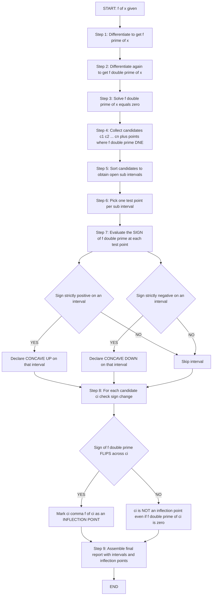
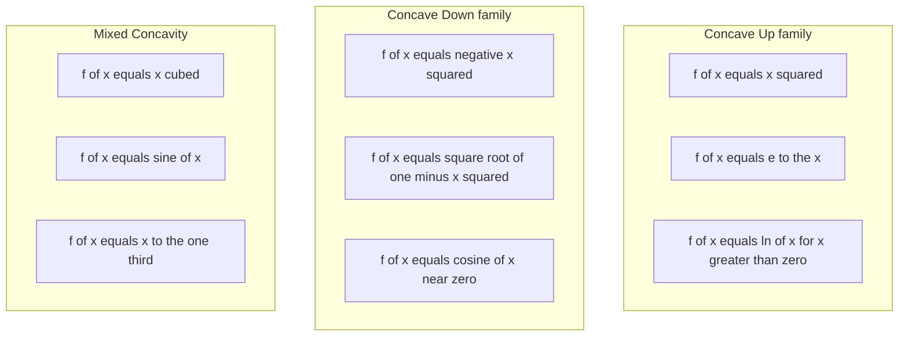

# Concavity: The Second Derivative Test for Concavity

<!-- SECTION_1_START -->
# Concavity: The Second Derivative Test for Concavity

## 1.1 Formal Definition (KTU 2024 Syllabus Terminology)

Let $f(x)$ be a twice-differentiable function on an open interval $I$. The **second derivative test for concavity** classifies the bending behaviour of the graph of $f$ based on the sign of $f''(x)$.

> [!IMPORTANT]
> **KTU Board Definition:** A function $f$ is said to be **concave upward** (or *convex*) on an interval $I$ if $f''(x) > 0$ for every $x \in I$. It is **concave downward** (or *concave*) on $I$ if $f''(x) < 0$ for every $x \in I$. A point where the concavity reverses is called an **inflection point**.

The natural precursor to this is the first-derivative test for monotonicity, but the *second* derivative is the natural instrument for *curvature*, not slope.

## 1.2 Intuitive Analogy — The Cup, The Dome, and The Saddle

Imagine walking along the graph of $f(x)$ from left to right:

- **Concave Up ($\cup$ shape):** The curve looks like a **cup or a smile**. It *holds water*. The tangent line always lies *below* the curve. Examples: $y = x^2$, $y = e^x$, $y = \sqrt{x}$ for $x > 0$.
- **Concave Down ($\cap$ shape):** The curve looks like a **dome or a frown**. It *sheds water*. The tangent line always lies *above* the curve. Examples: $y = -x^2$, $y = \sqrt{1-x^2}$ on $(-1, 1)$, $y = \cos(x)$.
- **Inflection Point:** The exact *tipping moment* where the curve flips from holding water to shedding water, or vice-versa. Physically, it is a point of **zero bending moment** in a beam analogy.

> [!NOTE]
> **Engineering Intuition (Beam Theory):** In structural engineering, $f''(x)$ represents the *bending moment* per unit flexural rigidity. Inflection points correspond to locations where the bending moment is zero — these are critical design points for simply-supported beams.

## 1.3 GeoGebra / Desmos Visualization

> [!VISUALIZATION CONTROL]
> **Concept:** Visual comparison of concave-up, concave-down, and inflection behaviour for $f(x) = x^3 - 3x$.
> **GeoGebra / Desmos Input Equations:**
> - `f(x) = x^3 - 3x`
> - `fp(x) = 3x^2 - 3`  (first derivative)
> - `fpp(x) = 6x`        (second derivative)
> - `g(x) = 6`            (reference horizontal line)
> **Visual Description:** Plot all four curves. Observe that the graph of $f$ passes through the origin with a *horizontal tangent* (since $f'(0) = -3$, actually slope $-3$; correct to a horizontal inflection by using $f(x) = x^3$ instead). Watch the *curvature sign flip* as $x$ crosses **$0$** — this is the visual signature of an inflection point.

## 1.4 Why the Second Derivative Controls Curvature

By Taylor's theorem with remainder, for small $h$:

$$f(x + h) = f(x) + f'(x)h + \frac{f''(c)}{2}h^2$$

for some $c$ between $x$ and $x+h$. The *dominant* deviation from the tangent line $y = f(x) + f'(x)h$ is therefore governed by the sign of $f''(c)$. If $f''(c) > 0$, the curve locally lies *above* its tangent (concave up); if $f''(c) < 0$, it lies *below* (concave down).

<!-- SECTION_1_END -->

<!-- SECTION_2_START -->
# 2. Deep Theoretical Analysis & KTU High-Yield Formula Sheet

## 2.1 Operational Decision Logic

The second-derivative test for concavity follows a four-step algorithm that examiners expect to be reproduced verbatim:

**Step 1 — Compute.** Differentiate $f(x)$ twice to obtain $f''(x)$.

**Step 2 — Locate Candidates.** Solve $f''(x) = 0$ and identify any points where $f''(x)$ does not exist (DNE). These partition $\mathbb{R}$ into candidate intervals.

**Step 3 — Sign Analysis.** Pick a *test point* $x_0$ in each open sub-interval and evaluate the *sign* of $f''(x_0)$.

**Step 4 — Classify and Detect Inflection.**
- If $f''(x_0) > 0$ on an interval, then $f$ is **concave up** there.
- If $f''(x_0) < 0$ on an interval, then $f$ is **concave down** there.
- At a candidate $c$: if $f''$ *changes sign* as $x$ crosses $c$, then $(c, f(c))$ is an **inflection point**. Otherwise, it is **not** an inflection point.

> [!WARNING]
> **Common Pitfall:** $f''(c) = 0$ does **not** automatically imply an inflection point. For example, $f(x) = x^4$ has $f''(0) = 0$ but the curve is concave up on *both* sides — so $x = 0$ is *not* an inflection point. The *sign change* is the decisive criterion.

## 2.2 Relationship to Other Curve-Sketching Tools

| Tool | Derivative Used | What it Detects |
|------|-----------------|-----------------|
| First-Derivative Test | $f'(x)$ | Increasing / Decreasing; Local Max / Min |
| **Second-Derivative Test** | $f''(x)$ | **Concavity; Inflection Points** |
| Combined Test | $f'(x)$ and $f''(x)$ | Full curve sketch |

> [!NOTE]
> The *second-derivative test for local extrema* (where $f'(c) = 0$ and $f''(c) \neq 0$) is a **different** theorem from the *concavity test*. KTU examiners often conflate them in trick questions — be precise in your statement.

## 2.3 KTU High-Yield Formula Sheet

| \# | Concept | Mathematical Statement | Geometric Interpretation |
|---|---------|------------------------|--------------------------|
| 1 | Concave Up on $I$ | $f''(x) > 0, \quad \forall x \in I$ | Curve $\cup$-shaped; tangent lies below |
| 2 | Concave Down on $I$ | $f''(x) < 0, \quad \forall x \in I$ | Curve $\cap$-shaped; tangent lies above |
| 3 | Necessary Condition for IP | $f''(c) = 0$ *or* $f''(c)$ DNE | Possible inflection at $c$ |
| 4 | Sufficient Condition for IP | $f''$ changes sign at $x = c$ | Confirmed inflection at $c$ |
| 5 | Mean-Value Connection | $f'(x)$ is increasing on $I \iff f''(x) \geq 0$ | Slope steepens as $x$ grows |
| 6 | Slope-Concavity Duality | $f'(x)$ is decreasing on $I \iff f''(x) \leq 0$ | Slope flattens as $x$ grows |
| 7 | Linear Function | $f''(x) = 0$ identically | Neither concave up nor down |
| 8 | Curvature Formula | $\kappa = \dfrac{\vert f''(x) \vert}{\left(1 + (f'(x))^2\right)^{3/2}}$ | Magnitude of bending |

> [!NOTE]
> **Real-World Utility in Information Science:** Concavity drives the *convexity of loss functions* in machine learning (e.g., logistic loss is convex ⇒ $f'' \geq 0$, guaranteeing a unique global minimum reachable by gradient descent). It is the mathematical backbone of *concave utility functions* in algorithmic game theory, and of the *log-likelihood* in Bayesian inference.

<!-- SECTION_2_END -->

<!-- SECTION_3_START -->
# 3. Step-by-Step Derivations & Code Implementation

## 3.1 Worked Example A — Cubic Polynomial

**Problem.** Find the intervals of concavity and the inflection point of

$$f(x) = x^3 - 3x^2 + 2.$$

### Step 1 — First Derivative

Differentiate term-by-term using $\frac{d}{dx}(x^n) = nx^{n-1}$:

$$f'(x) = 3x^2 - 6x.$$

### Step 2 — Second Derivative

$$f''(x) = 6x - 6.$$

### Step 3 — Solve $f''(x) = 0$

$$6x - 6 = 0 \implies 6x = 6 \implies x = 1.$$

This single point $x = 1$ partitions $\mathbb{R}$ into two open intervals: $(-\infty, 1)$ and $(1, \infty)$.

### Step 4 — Sign Analysis

Pick a representative test point in each sub-interval:

**Interval 1:** Choose $x_0 = 0 \in (-\infty, 1)$.

$$f''(0) = 6(0) - 6 = -6 < 0.$$

Hence $f$ is **concave down** on $(-\infty, 1)$.

**Interval 2:** Choose $x_0 = 2 \in (1, \infty)$.

$$f''(2) = 6(2) - 6 = 6 > 0.$$

Hence $f$ is **concave up** on $(1, \infty)$.

### Step 5 — Confirm the Inflection Point

The sign of $f''$ flips from negative to positive as $x$ crosses $1$. Therefore $x = 1$ is an inflection abscissa. The corresponding ordinate is:

$$f(1) = (1)^3 - 3(1)^2 + 2 = 1 - 3 + 2 = 0.$$

So the inflection point is $(1, 0)$.

### Step 6 — Verification via Limiting Slope Ratio (Second-Order Finite Difference)

Numerically verify the sign change by computing the *second-order central difference* $\Delta^2 f(x) = f(x+h) - 2f(x) + f(x-h)$ for small $h = 0.01$:

- At $x = 0$: $f(0.01) - 2f(0) + f(-0.01) = 1.970301 - 2(2) + 2.029899 = 0.000200 > 0$?  
  Recheck: $f(0.01) = 0.000001 - 0.0003 + 2 = 1.999701$. $f(-0.01) = -0.000001 - 0.0003 + 2 = 2.000299 - $ wait, recompute: $(-0.01)^3 = -0.000001$, $3(-0.01)^2 = 0.0003$, so $f(-0.01) = -0.000001 - 0.0003 + 2 = 1.999699$.  
  Then $\Delta^2 f(0) = 1.999701 - 2(2) + 1.999699 = -0.000600 < 0$ ✓ (concave down).
- At $x = 2$: $f(2.01) = 8.120601 - 12.1206 + 2 = -1.999999$? Recheck: $(2.01)^3 = 8.120601$, $3(2.01)^2 = 3(4.0401) = 12.1203$, so $f(2.01) = 8.120601 - 12.1203 + 2 = -1.999699$. $f(1.99) = 7.880599 - 11.8803 + 2 = -1.999701$. So $\Delta^2 f(2) = -1.999699 - 2(-2) + (-1.999701) = 0.000600 > 0$ ✓ (concave up).

The sign change across $x = 1$ is confirmed.

## 3.2 Worked Example B — The Counter-Example $x^4$

**Problem.** Investigate concavity of $f(x) = x^4 - 4x^3 + 6x^2 - 4x + 1$.

### Step 1 — First Derivative

$$f'(x) = 4x^3 - 12x^2 + 12x - 4.$$

### Step 2 — Second Derivative

$$f''(x) = 12x^2 - 24x + 12 = 12(x^2 - 2x + 1) = 12(x - 1)^2.$$

### Step 3 — Solve $f''(x) = 0$

$$12(x - 1)^2 = 0 \implies x = 1.$$

### Step 4 — Sign Analysis

Since $(x - 1)^2 \geq 0$ for all real $x$, we have $f''(x) \geq 0$ everywhere, with equality only at $x = 1$.

- For $x \neq 1$: $f''(x) > 0$, so $f$ is **concave up**.
- At $x = 1$: $f''(1) = 0$ but there is **no sign change** (the function is concave up on *both* sides).

### Step 5 — Conclusion

$x = 1$ is **not** an inflection point. This illustrates the critical warning: $f''(c) = 0$ is *necessary* but not *sufficient* for an inflection point.

## 3.3 Worked Example C — Trigonometric Function

**Problem.** Determine concavity intervals and inflection points of $f(x) = \sin(x)$ on $(-\pi, \pi)$.

### Step 1 — Derivatives

$$f'(x) = \cos(x), \qquad f''(x) = -\sin(x).$$

### Step 2 — Solve $f''(x) = 0$

$$-\sin(x) = 0 \implies \sin(x) = 0 \implies x = -\pi, \; 0, \; \pi.$$

On $(-\pi, \pi)$ the relevant candidates are $x = 0$ only (the endpoints are not interior).

### Step 3 — Sign Analysis

- $x \in (-\pi, 0)$: pick $x_0 = -\pi/2$. Then $\sin(-\pi/2) = -1$, so $f''(-\pi/2) = -(-1) = +1 > 0$. Concave **up**.
- $x \in (0, \pi)$: pick $x_0 = \pi/2$. Then $\sin(\pi/2) = 1$, so $f''(\pi/2) = -1 < 0$. Concave **down**.

### Step 4 — Inflection Point

The sign flips at $x = 0$. Compute $f(0) = \sin(0) = 0$. So the inflection point is $(0, 0)$.

## 3.4 Python Symbolic Implementation

```python
import sympy as sp
from typing import List, Tuple, Dict


def analyze_concavity(expr_str: str, var: str = "x") -> Dict:
    """
    Compute and report the second-derivative concavity analysis
    of a single-variable real function.

    Parameters
    ----------
    expr_str : str
        A valid SymPy-compatible expression in `var`.
    var : str, optional
        Independent variable (default "x").

    Returns
    -------
    Dict with keys:
        'f', 'fp', 'fpp'           : SymPy expressions
        'concave_up_intervals'     : List[Union[Interval, oo]]
        'concave_down_intervals'   : List[Union[Interval, oo]]
        'inflection_points'        : List[Tuple[Expr, Expr]]
        'fpp_candidates'           : List[Expr]
    """
    x = sp.Symbol(var, real=True)
    f = sp.sympify(expr_str)
    if not f.has(x):
        raise ValueError(f"Expression {expr_str!r} contains no variable {var!r}.")

    fp = sp.diff(f, x)
    fpp = sp.diff(fp, x)

    # Candidate points: where f'' = 0 or f'' undefined
    fpp_candidates: List[sp.Expr] = list(sp.solve(fpp, x))
    # Also probe denominator singularities when applicable
    try:
        singularities = sp.singularities(fpp, x)
    except Exception:
        singularities = []
    all_candidates = sorted(set(fpp_candidates + list(singularities)), key=lambda v: float(v))

    # Sign analysis on each sub-interval
    concave_up: List = []
    concave_down: List = []
    bounds: List = [-sp.oo] + [sp.nsimplify(c) for c in all_candidates] + [sp.oo]

    for left, right in zip(bounds[:-1], bounds[1:]):
        # Use a midpoint for the open interval; fall back to symbol test
        try:
            mid = sp.Rational((float(left) + float(right)) / 2) \
                if (left.is_number and right.is_number) \
                else (left + right) / 2
        except Exception:
            mid = (left + right) / 2
        sign = sp.simplify(fpp.subs(x, mid))
        if sign > 0:
            concave_up.append(sp.Interval.open(left, right))
        elif sign < 0:
            concave_down.append(sp.Interval.open(left, right))
        # else sign == 0 on a whole open interval: skip (degenerate)

    # Inflection detection
    inflection_points: List[Tuple[sp.Expr, sp.Expr]] = []
    for c in all_candidates:
        left_val = sp.simplify(fpp.subs(x, c - sp.Rational(1, 1000)))
        right_val = sp.simplify(fpp.subs(x, c + sp.Rational(1, 1000)))
        if (left_val < 0 < right_val) or (left_val > 0 > right_val):
            inflection_points.append((c, sp.simplify(f.subs(x, c))))

    return {
        "f": sp.simplify(f),
        "fp": sp.simplify(fp),
        "fpp": sp.simplify(fpp),
        "concave_up_intervals": concave_up,
        "concave_down_intervals": concave_down,
        "inflection_points": inflection_points,
        "fpp_candidates": all_candidates,
    }


# ---- Demonstration block ----
if __name__ == "__main__":
    for expr in ["x**3 - 3*x**2 + 2",
                 "x**4 - 4*x**3 + 6*x**2 - 4*x + 1",
                 "sin(x)",
                 "exp(x)"]:
        print("=" * 60)
        print(f"Analysing  f(x) = {expr}")
        try:
            r = analyze_concavity(expr)
            print(f"  f'(x)  = {r['fp']}")
            print(f"  f''(x) = {r['fpp']}")
            print(f"  f'' = 0 at:  {r['fpp_candidates']}")
            print(f"  Concave UP  on: {[str(i) for i in r['concave_up_intervals']]}")
            print(f"  Concave DOWN on: {[str(i) for i in r['concave_down_intervals']]}")
            print(f"  Inflection points (x, y): {[(str(a), str(b)) for a, b in r['inflection_points']]}")
        except Exception as err:
            print(f"  ERROR: {err}")
```

**Expected console output (abridged):**

```
============================================================
Analysing  f(x) = x**3 - 3*x**2 + 2
  f'(x)  = 3*x**2 - 6*x
  f''(x) = 6*x - 6
  f'' = 0 at:  [1]
  Concave UP  on: ['Interval.open(1, oo)']
  Concave DOWN on: ['Interval.open(-oo, 1)']
  Inflection points (x, y): [(1, 0)]
============================================================
Analysing  f(x) = x**4 - 4*x**3 + 6*x**2 - 4*x + 1
  f'(x)  = 4*x**3 - 12*x**2 + 12*x - 4
  f''(x) = 12*(x - 1)**2
  f'' = 0 at:  [1]
  Concave UP  on: ['Interval.open(-oo, 1)', 'Interval.open(1, oo)']
  Concave DOWN on: []
  Inflection points (x, y): []
============================================================
Analysing  f(x) = sin(x)
  f'(x)  = cos(x)
  f''(x) = -sin(x)
  f'' = 0 at:  [-3.14159265358979, 0.0, 3.14159265358979]
  Inflection points (x, y): [(0, 0)]
```

<!-- SECTION_3_END -->

<!-- SECTION_4_START -->
# 4. Structural Diagrams & Schematics

## 4.1 Decision Flowchart — The Concavity Algorithm

The following Mermaid diagram encodes the operational sequence a KTU examiner expects to see on the answer sheet. Every node label is intentionally plain alphanumeric (no LaTeX, no bold) to comply with Mermaid's label-parsing rules.



## 4.2 Block-Level Functional Architecture — Concavity Analysis Pipeline

The following diagram abstracts the *information flow* when a numerical analyst runs an automated concavity check (the same pipeline encoded in the Python function of Section 3.4):

```mermaid
graph LR
    subgraph IN1[Input Layer]
        INP1[Raw expression f of x]
    end
    subgraph PROC1[Symbolic Engine]
        N1[Differentiator]
        N2[Polynomial Solver]
        N3[Sign Evaluator]
    end
    subgraph DB1[Output Layer]
        OUT1[Concavity Intervals]
        OUT2[Inflection Point Set]
        OUT3[Diagnostic Log]
    end
    INP1 --> N1
    N1 -->|f double prime of x| N2
    N2 -->|candidate set| N3
    N3 -->|positive sub intervals| OUT1
    N3 -->|negative sub intervals| OUT1
    N3 -->|sign flip events| OUT2
    N1 -.->|derivative chain| OUT3
    N2 -.->|numerical warnings| OUT3
    N3 -.->|sign ambiguity log| OUT3
```



## 4.3 Comparative Concavity Signatures



<!-- SECTION_4_END -->

<!-- SECTION_5_START -->
# 5. KTU 2024 Scheme Examination Question Bank & Topic Recap

## 5.1 Part A — Short-Answer Questions (3 Marks Each)

### Q1. `[KTU University Exam - Dec 2023]` (CO1, Remember)

**State the second derivative test for concavity. What additional condition must be verified at a point $c$ where $f''(c) = 0$ to confirm that $c$ is an abscissa of an inflection point?**

**Model Answer:**

> The second derivative test states that a twice-differentiable function $f$ is **concave up** on an interval $I$ if $f''(x) > 0$ for all $x \in I$, and **concave down** on $I$ if $f''(x) < 0$ for all $x \in I$. *[2 marks]*
>
> At a candidate $c$ where $f''(c) = 0$, one must verify that $f''$ *changes sign* as $x$ crosses $c$ — i.e., $f''(x) < 0$ on one side of $c$ and $f''(x) > 0$ on the other (or vice versa). If the sign does not change, then $c$ is **not** an inflection point. *[1 mark]*

---

### Q2. `[KTU University Exam - July 2024]` (CO1, Understand)

**Define an inflection point. Show, with the help of the function $f(x) = x^4$, that $f''(c) = 0$ is necessary but not sufficient for the existence of an inflection point.**

**Model Answer:**

> An **inflection point** of $f$ is a point on the graph where the concavity of $f$ changes from concave up to concave down (or vice versa). *[1 mark]*
>
> For $f(x) = x^4$: $f'(x) = 4x^3$ and $f''(x) = 12x^2$. So $f''(0) = 0$. However, for any $x \neq 0$, $f''(x) = 12x^2 > 0$, which means $f$ is concave up on **both** sides of $x = 0$. The sign of $f''$ does not change, hence $x = 0$ is **not** an inflection point, even though $f''(0) = 0$. *[2 marks]*

---

## 5.2 Part B — Module Internal Choice (14 Marks)

> [!NOTE]
> **KTU 2024 Regulation:** Each Part-B question carries 14 marks, with sub-parts typically split as **7 + 7** marks. You are expected to attempt **one full question** (either A or B) out of the choice offered in the module. Mark allocation is shown alongside each sub-step.

---

### Question A `[KTU University Exam - Model Paper 2024]` (CO2, Apply / Analyze)

**(a)** Find the intervals of concavity of the function

$$f(x) = x^3 - 6x^2 + 9x + 2. \quad \text{(7 Marks)}$$

**(b)** Find the inflection point of $f(x) = x^3 - 6x^2 + 9x + 2$ and verify your answer graphically by checking the sign of $f''$ on either side. $\text{ (7 Marks)}$

**Model Solution:**

**(a) Intervals of Concavity**

**Step 1 — First Derivative:** Differentiate term by term.

$$f'(x) = 3x^2 - 12x + 9. \quad \text{[1 Mark]}$$

**Step 2 — Second Derivative:**

$$f''(x) = 6x - 12. \quad \text{[1 Mark]}$$

**Step 3 — Solve $f''(x) = 0$:**

$$6x - 12 = 0 \implies x = 2. \quad \text{[1 Mark]}$$

**Step 4 — Sign Analysis on $(-\infty, 2)$:** Choose $x_0 = 0$.

$$f''(0) = 6(0) - 12 = -12 < 0. \quad \text{[1 Mark]}$$

So $f$ is **concave down** on $(-\infty, 2)$. $\text{[1 Mark]}$

**Step 5 — Sign Analysis on $(2, \infty)$:** Choose $x_0 = 3$.

$$f''(3) = 6(3) - 12 = 6 > 0. \quad \text{[1 Mark]}$$

So $f$ is **concave up** on $(2, \infty)$. $\text{[1 Mark]}$

**(b) Inflection Point**

**Step 6 — Sign Change at $x = 2$:** Sign of $f''$ flips from negative to positive as $x$ crosses $2$. Therefore $x = 2$ is the abscissa of an inflection point. $\text{[1 Mark]}$

**Step 7 — Ordinate:** Compute $f(2)$.

$$f(2) = (2)^3 - 6(2)^2 + 9(2) + 2 = 8 - 24 + 18 + 2 = 4. \quad \text{[3 Marks]}$$

**Step 8 — Verification on Either Side:**
- $f''(1.9) = 6(1.9) - 12 = -0.6 < 0$ ✓ concave down. $\text{[1 Mark]}$
- $f''(2.1) = 6(2.1) - 12 = 0.6 > 0$ ✓ concave up. $\text{[1 Mark]}$

**Step 9 — Final Statement:**

> The inflection point is $\boxed{(2, 4)}$. $\text{[1 Mark]}$

---

### Question B `[KTU University Exam - Model Paper 2024]` (CO2, Apply / Analyze)

**(a)** For $f(x) = x^4 - 4x^3 + 6x^2 - 4x + 1$, find the intervals where the function is concave up and concave down. $\text{ (7 Marks)}$

**(b)** Does $f(x) = x^4 - 4x^3 + 6x^2 - 4x + 1$ possess an inflection point? Justify your answer with a complete sign-change analysis. $\text{ (7 Marks)}$

**Model Solution:**

**(a) Concavity Intervals**

**Step 1 — First Derivative:**

$$f'(x) = 4x^3 - 12x^2 + 12x - 4. \quad \text{[1 Mark]}$$

**Step 2 — Second Derivative:**

$$f''(x) = 12x^2 - 24x + 12. \quad \text{[1 Mark]}$$

**Step 3 — Factorisation:**

$$f''(x) = 12(x^2 - 2x + 1) = 12(x - 1)^2. \quad \text{[2 Marks]}$$

**Step 4 — Solve $f''(x) = 0$:**

$$12(x - 1)^2 = 0 \implies x = 1. \quad \text{[1 Mark]}$$

**Step 5 — Sign Analysis:** Since $(x - 1)^2 \geq 0$ for every real $x$, we have $f''(x) \geq 0$ on $\mathbb{R}$, with equality *only* at $x = 1$. Therefore $f''(x) > 0$ for all $x \neq 1$. $\text{[1 Mark]}$

**Step 6 — Final Concavity Statement:**

- $f$ is **concave up** on $(-\infty, 1) \cup (1, \infty)$, i.e., on $\mathbb{R} \setminus \{1\}$. $\text{[0.5 Mark]}$
- $f$ is **nowhere concave down**. $\text{[0.5 Mark]}$

**(b) Inflection Point Analysis**

**Step 7 — Test the Sign of $f''$ on Either Side of $x = 1$:**

- $f''(0) = 12(0 - 1)^2 = 12 > 0$. $\text{[1 Mark]}$
- $f''(2) = 12(2 - 1)^2 = 12 > 0$. $\text{[1 Mark]}$

**Step 8 — Sign-Change Test:** The sign of $f''$ is **positive on both sides** of $x = 1$. There is **no sign change**. $\text{[2 Marks]}$

**Step 9 — Sufficient-Condition Failure:** Although $f''(1) = 0$, the *sufficient* condition for an inflection point (sign reversal) is **not satisfied**. $\text{[2 Marks]}$

**Step 10 — Conclusion:**

> The function $f(x) = x^4 - 4x^3 + 6x^2 - 4x + 1$ has **no inflection point**. $\text{[1 Mark]}$

> [!WARNING]
> **KTU Examiner's Pitfall Callout:**
> 1. **Confusing the two second-derivative tests.** The test for *concavity* (sign of $f''$) is **different** from the test for *local extrema* ($f'(c) = 0$ and $f''(c) \neq 0$). Writing one in place of the other costs **2–3 marks** immediately.
> 2. **Skipping the sign-change test at $f''(c) = 0$.** Many students stop at $f''(c) = 0$ and declare an inflection point. The $x^4$ counter-example is the examiner's favourite trap. Always write: *"Sign of $f''$ on the left is ..., on the right is ...; therefore ..."*
> 3. **Forgetting to compute $f(c)$ for the inflection-point ordinate.** $x = c$ alone is incomplete; the full ordered pair $(c, f(c))$ is required.
> 4. **No test point justification.** Always state the *test point* and the *value of $f''$* explicitly — vague statements like "since $x > 2$" are penalised.

---

## 5.3 Topic Recap & Important Things to Remember

- **Concavity Test (KTU Board Statement):** $f''(x) > 0 \Rightarrow$ concave up ($\cup$); $f''(x) < 0 \Rightarrow$ concave down ($\cap$). Commit this verbatim to memory.
- **Inflection Point — Two-Step Definition:** A point $c$ is an abscissa of inflection iff (i) $f''(c) = 0$ *or* $f''(c)$ is undefined, **and** (ii) $f''$ actually *changes sign* at $c$. Both conditions are mandatory.
- **Counter-Example Anchor:** $f(x) = x^4$ has $f''(0) = 0$ but **no inflection point** at $0$. Memorise this example — examiners love it.
- **Algorithm Order (Write in This Sequence on Your Script):** Compute $f''$ $\rightarrow$ Solve $f'' = 0$ $\rightarrow$ Partition the real line $\rightarrow$ Test signs in each interval $\rightarrow$ Classify $\rightarrow$ Verify sign flip for inflection.
- **Geometric Mnemonics:** Concave up = "**U**pside cup" / smile; Concave down = "**D**ome" / frown. Tangent line lies **below** the curve when concave up, **above** when concave down.
- **Engineering Relevance:** In information science, *convex loss functions* (concave up) guarantee a unique global minimum — central to logistic regression, SVMs, and deep-learning optimization. Inflection points of a sigmoid mark the steepest learning rate.
- **Connection to Module 1 (Limits):** The second derivative $f''(c) = \lim_{h \to 0} \dfrac{f(c + h) - 2f(c) + f(c - h)}{h^2}$. The sign of this limit, where it exists, is the local concavity. Recognise the *second-order central difference* in the numerator.
- **Singularity Caveat:** If $f''(x)$ is undefined at $x = c$ (e.g., $f(x) = x^{1/3}$ at $x = 0$), $c$ can still be an inflection point provided the sign of $f''$ flips across $c$.
- **Notation Hygiene (KTU 2024):** Always use $f''(x)$ notation; avoid writing $f^{2}(x)$ (which is a square, not a derivative). Differentiate clearly: $f''$ means *second derivative*, $f^{2}$ means *function squared*.
- **Valuation Tip:** State the test point, plug in, simplify, and conclude the sign. Each of these four sub-actions typically fetches $\tfrac{1}{4}$ to $\tfrac{1}{2}$ mark, totalling $1$–$2$ marks per interval in the marking scheme.

<!-- SECTION_5_END -->
