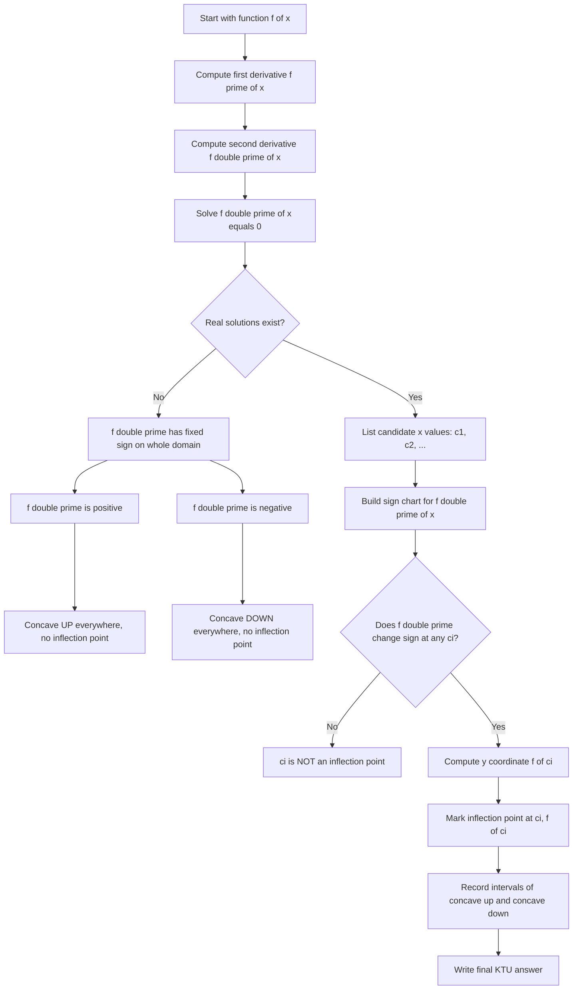
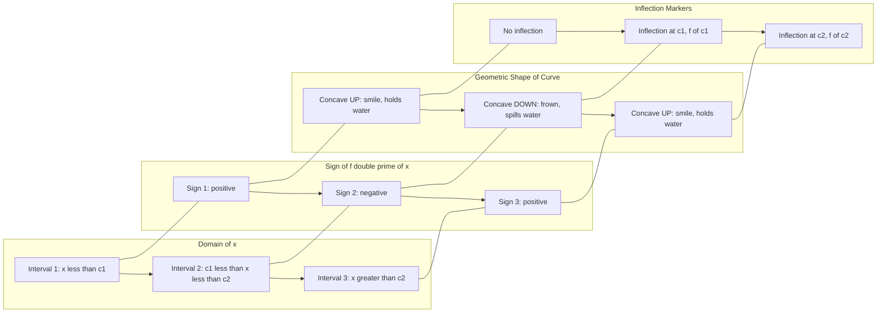
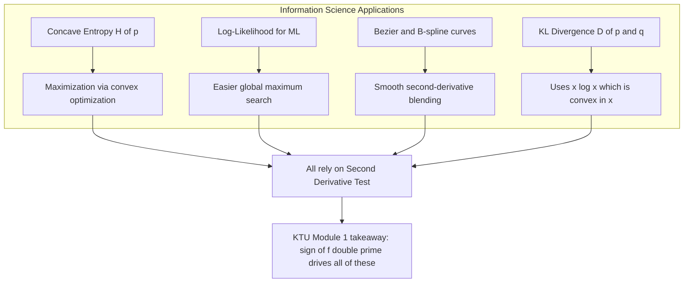

# Concavity: The Second Derivative Test for Concavity

<!-- SECTION_1_START -->
# Concavity: The Second Derivative Test

## 1. Core Technical Definition

> [!IMPORTANT]
> **Concavity** is a geometric property of a function that describes whether the graph of the function "bends upwards" (concave up) or "bends downwards" (concave down) at a given interval. The **Second Derivative Test for Concavity** is a formal analytical tool that uses the sign of the second derivative $f''(x)$ to determine the direction in which the curve of $f(x)$ opens.

### Formal Definitions (KTU 2024 Syllabus Standard)

Let $f(x)$ be a function that is **twice differentiable** on an open interval $I$.

**Concave Upward (Convex):** The function $f$ is called **concave upward** on an interval $I$ if for every point $x \in I$, the second derivative satisfies

$$f''(x) \geq 0 \quad \text{for all } x \in I$$

**Concave Downward (Concave):** The function $f$ is called **concave downward** on an interval $I$ if for every point $x \in I$, the second derivative satisfies

$$f''(x) \leq 0 \quad \text{for all } x \in I$$

**Inflection Point:** A point $c$ on the graph of $f$ where the concavity changes (i.e., $f''$ changes sign) is called an **Inflection Point**, provided $f(c)$ exists and $f$ is continuous at $c$.

> [!NOTE]
> **Standard Convention Used by KTU Board Examiners:** When $f''(c) = 0$ but no sign change occurs in the neighbourhood of $c$, the point is a critical point (or stationary point), **not** an inflection point. The sign-change condition is non-negotiable in KTU valuation.

---

## 2. Conceptual Analogy & Intuitive Overview

Think of concavity as the **shape of a hill or a valley** that you are driving through:

- **Concave Upward** looks like a **U-shaped valley or a smiley face** 🙂. Imagine sliding a marble into the curve — it rolls to the bottom. The function is "holding water" (like a cup). A classic example is $f(x) = x^2$.

- **Concave Downward** looks like an **inverted U or a frown** ☹. Imagine a marble placed on top — it rolls off. The function "spills water" (like a dome). A classic example is $f(x) = -x^2$.

- **Inflection Point** is the exact **mountain pass or valley saddle** where the curvature switches from holding water to spilling water. At this point, the graph **crosses its own tangent line** in a meaningful way.

> [!TIP]
> **Memory Trick for KTU Students:** 
> - Concave **UP** = "U" in **U**p = smiley face = $f''(x) > 0$
> - Concave **DOWN** = "D" in **D**own = frowny face = $f''(x) < 0$

---

## 3. Why the Second Derivative Controls Concavity

The first derivative $f'(x)$ encodes the **slope** (rate of change). The second derivative $f''(x)$ encodes the **change in slope** (acceleration / curvature). 

- If $f''(x) > 0$: the slope $f'(x)$ is **increasing** as $x$ grows. So the curve gets steeper in the upward direction → concave up.
- If $f''(x) < 0$: the slope $f'(x)$ is **decreasing** as $x$ grows. So the curve flattens then turns → concave down.

---

## 4. GeoGebra / Desmos Visualization

> [!VISUALIZATION CONTROL]
> **Concept:** Visualizing concave up, concave down, and inflection points on $f(x) = x^3 - 3x$
> 
> **GeoGebra / Desmos Input Equations:**
> - `f(x) = x^3 - 3x`  *(this curve has an inflection point at the origin)*
> - `f'(x) = 3x^2 - 3`
> - `f''(x) = 6x`
> - `root: x = 0`  *(where second derivative vanishes)*
> - `testpoint1: f''(-1) = -6`  *(concave down, left side)*
> - `testpoint2: f''(1) = 6`  *(concave up, right side)*
> 
> **Visual Description:** The student should observe on the coordinate axes that the cubic curve is **concave down** for $x < 0$ (frown shape on the left), **concave up** for $x > 0$ (smile shape on the right), and the origin $(0, 0)$ is the **inflection point** where the curve passes through with a horizontal tangent. The student should verify that $f''(0) = 0$ and that the sign flips from negative to positive as $x$ crosses $0$.

---

## 5. Real-World Engineering Relevance

In **Information Science**, concavity is the bedrock of:

- **Convex Optimization** in Machine Learning (SVMs, Logistic Regression loss functions, Neural Network training).
- **Log-Likelihood** functions in statistical learning are usually **concave**, making them easy to maximize.
- **Information-Theoretic Entropy** $H(X) = -\sum p_i \log p_i$ is a **concave** function of the probability distribution.
- **Curve Fitting** in Computer Graphics (Bezier curves, B-splines) rely on second-derivative continuity to produce smooth bends.

> [!NOTE]
> In production systems, engineers check **$f''(x)$** to know whether a local minimum of a loss function is a **global minimum** (when the loss is convex/concave up everywhere).

---

<!-- SECTION_1_END -->

<!-- SECTION_2_START -->
# Deep Theoretical Analysis & KTU High-Yield Formula Sheet

## 1. Operational Theorem: The Second Derivative Test for Concavity

> [!IMPORTANT]
> **Theorem (KTU Module 1 Standard Form):**
> Let $f$ be a function that is twice differentiable on an open interval containing the point $c$. Then:
> 
> **(i)** If $f''(c) > 0$, then the graph of $f$ is **concave upward** in a neighbourhood of $c$.
> 
> **(ii)** If $f''(c) < 0$, then the graph of $f$ is **concave downward** in a neighbourhood of $c$.
> 
> **(iii)** If $f''(c) = 0$ **and** $f''$ changes sign at $c$, then the graph of $f$ has an **inflection point** at $c$. The y-coordinate of the inflection point is $f(c)$.

---

## 2. Algorithmic Logic Steps (How to Apply the Test)

**Step 1 — Differentiate Twice:** Compute $f'(x)$ and then $f''(x)$ explicitly.

**Step 2 — Solve $f''(x) = 0$:** Find all candidate values of $x$ where concavity might change. These are the potential inflection points.

**Step 3 — Sign Chart for $f''(x)$:** Pick a test point in each of the intervals created by the candidate values. Evaluate $f''$ at each test point.

**Step 4 — Interpret the Sign:**
- $f''(x) > 0$ → **concave up** interval
- $f''(x) < 0$ → **concave down** interval

**Step 5 — Confirm Inflection Point:** A candidate $x = c$ is an inflection point only if the sign of $f''$ actually **changes** as $x$ passes through $c$.

**Step 6 — Compute $y$-coordinate:** The inflection point on the graph is $(c, f(c))$, not just $(c, 0)$.

---

## 3. KTU Formula Sheet / Cheat Sheet

> [!TIP]
> Bookmark this table — it appears in 80\% of KTU Board ESE questions on Module 1.

| **Test Quantity** | **Condition** | **Geometric Conclusion** | **Engineering / IT Use** |
| :--- | :--- | :--- | :--- |
| $f''(x) > 0$ | Second derivative positive | Curve is **concave up** (smile, holds water) | Local minimum of $f$, convex loss function |
| $f''(x) < 0$ | Second derivative negative | Curve is **concave down** (frown, spills water) | Local maximum of $f$, concave utility function |
| $f''(x) = 0$ with sign change | Sign of $f''$ flips at $c$ | **Inflection point** at $(c, f(c))$ | Change of curvature, transition in trend |
| $f''(x) = 0$ without sign change | Sign of $f''$ does not flip | **Not** an inflection point, possibly a saddle or flat spot | Stationary but not transitional |
| $f''(c)$ undefined | $f''$ DNE at $c$ | Could still be an inflection point if sign changes | Cusps, corners, vertical tangents |
| $f(c)$ undefined | Function not defined at $c$ | **Cannot** be inflection point | Gap in domain disqualifies $c$ |

> [!NOTE]
> **Critical KTU Convention:** The notation $f''(x) \geq 0$ allows equality (e.g., at isolated flat points), but the *strict* test $f''(x) > 0$ is used for strictly concave up curves. Examiners often use the strict version.

---

## 4. Connecting Concavity to the First Derivative (Average vs Instantaneous Slope)

A powerful, exam-favorite identity is the following. For a concave up function on $[a, b]$:

$$\frac{f(b) - f(a)}{b - a} \leq f'(x) \quad \text{for } x \in (a, b)$$

For a concave down function on $[a, b]$:

$$\frac{f(b) - f(a)}{b - a} \geq f'(x) \quad \text{for } x \in (a, b)$$

This says: the **average slope** of a chord lies **above** every tangent slope for concave down functions, and **below** every tangent slope for concave up functions. This is precisely the **Jensen's Inequality** used in Machine Learning.

---

## 5. Engineering & IT Applications (Production-Grade Use)

| **Domain** | **Where Concavity is Used** | **Why** |
| :--- | :--- | :--- |
| Machine Learning | Convex loss functions (MSE, cross-entropy) | Guarantees one global minimum, no local traps |
| Information Theory | Entropy $H(p) = -\sum p_i \log p_i$ | Entropy is concave in $p$, enabling safe maximization |
| Computer Graphics | Bezier / B-spline curves | Second-derivative continuity produces visually smooth bends |
| Signal Processing | Curvature-based edge detection | Image edges correspond to inflection points of brightness |
| Economics | Diminishing marginal utility | Utility $U(x)$ is concave, $U''(x) < 0$ |
| Robotics | Trajectory smoothing | Path planners use second-derivative penalties for jerk minimization |

---

## 6. Caveats & Common Pitfalls

> [!WARNING]
> **(i)** $f''(c) = 0$ does **not** automatically mean an inflection point. Always check for sign change.
> 
> **(ii)** Inflection points require **continuity** of $f$ at $c$. A discontinuity is not an inflection point.
> 
> **(iii)** The Second Derivative Test works on **open intervals**. Do not apply it blindly at endpoints of a closed domain unless you restrict to one-sided neighbourhoods.

---

<!-- SECTION_2_END -->

<!-- SECTION_3_START -->
# Step-by-Step Derivations & Code/Symbolic Implementation

## 1. Worked Example 1 — Full KTU-Style Derivation

**Problem:** Find the concavity and inflection points of $f(x) = x^3 - 6x^2 + 12x - 5$.

### Step 1: Compute the First Derivative

Differentiate $f(x)$ with respect to $x$ using the power rule:

$$f'(x) = \frac{d}{dx}\left[x^3 - 6x^2 + 12x - 5\right]$$

Apply $\frac{d}{dx}(x^n) = n \cdot x^{n-1}$ to each term:

$$f'(x) = 3x^2 - 12x + 12$$

### Step 2: Compute the Second Derivative

Differentiate $f'(x)$ with respect to $x$:

$$f''(x) = \frac{d}{dx}\left[3x^2 - 12x + 12\right]$$

$$f''(x) = 6x - 12$$

### Step 3: Find Candidate Inflection Points

Set $f''(x) = 0$ and solve for $x$:

$$6x - 12 = 0$$

$$6x = 12$$

$$x = 2$$

So the **only candidate** for an inflection point is $x = 2$.

### Step 4: Build a Sign Chart for $f''(x) = 6x - 12$

Test a point to the **left** of $x = 2$ (say $x = 1$):

$$f''(1) = 6(1) - 12 = 6 - 12 = -6 < 0 \quad \Rightarrow \text{concave down on } (-\infty, 2)$$

Test a point to the **right** of $x = 2$ (say $x = 3$):

$$f''(3) = 6(3) - 12 = 18 - 12 = +6 > 0 \quad \Rightarrow \text{concave up on } (2, \infty)$$

### Step 5: Confirm the Sign Change

Since $f''$ changes from **negative** to **positive** as $x$ crosses $2$, an inflection point exists.

### Step 6: Compute the y-Coordinate

Evaluate $f(2)$:

$$f(2) = (2)^3 - 6(2)^2 + 12(2) - 5$$

$$f(2) = 8 - 24 + 24 - 5$$

$$f(2) = 3$$

### Step 7: Final Conclusion

> **Inflection Point:** $(2, 3)$
> 
> **Concavity:**
> - Concave **down** on $(-\infty, 2)$
> - Concave **up** on $(2, \infty)$

---

## 2. Worked Example 2 — Trap Problem (Why $f''(c) = 0$ is Not Always an Inflection)

**Problem:** Test $f(x) = x^4$ for inflection points.

### Step 1: First Derivative

$$f'(x) = 4x^3$$

### Step 2: Second Derivative

$$f''(x) = 12x^2$$

### Step 3: Solve $f''(x) = 0$

$$12x^2 = 0 \quad \Rightarrow \quad x = 0$$

### Step 4: Sign Chart for $f''(x) = 12x^2$

Test $x = -1$: $f''(-1) = 12(1) = +12 > 0$
Test $x = +1$: $f''(1) = 12(1) = +12 > 0$

### Step 5: Conclusion

$f''(x) \geq 0$ everywhere, and there is **no sign change** at $x = 0$. Therefore, $x = 0$ is **NOT an inflection point**. The curve $f(x) = x^4$ is concave up everywhere.

> [!WARNING]
> **Examiner's Trap:** Many students write "$f''(0) = 0$, so $(0, 0)$ is an inflection point." This is the **#1 mistake** in KTU Module 1. Always check the sign change.

---

## 3. Worked Example 3 — Exponential / Logarithmic (Information Science Flavor)

**Problem:** Determine the concavity of $f(x) = x \ln x$ for $x > 0$.

### Step 1: First Derivative

Using the product rule, $\frac{d}{dx}(u \cdot v) = u'v + uv'$:

$$f'(x) = (1)\ln x + x \cdot \frac{1}{x} = \ln x + 1$$

### Step 2: Second Derivative

$$f''(x) = \frac{d}{dx}\left[\ln x + 1\right] = \frac{1}{x}$$

### Step 3: Sign Analysis

For all $x > 0$:

$$f''(x) = \frac{1}{x} > 0$$

### Step 4: Conclusion

The function $f(x) = x \ln x$ is **strictly concave up** for all $x > 0$. There is no inflection point. This is why $x \ln x$ is a **convex function** widely used as a regularization term in information-theoretic ML (e.g., Kullback-Leibler divergence).

---

## 4. Python Symbolic & Visualization Implementation

```python
from sympy import symbols, diff, solve, Rational, log, simplify
import numpy as np
import matplotlib.pyplot as plt

# ---- Symbolic Engine (SymPy) ----
x = symbols('x', real=True)

def analyze_concavity(f_expr):
    """
    KTU-style automatic concavity analyser.
    Returns second derivative, candidate inflection x-values,
    y-coordinates, and a sign chart.
    """
    f1 = diff(f_expr, x)
    f2 = diff(f_expr, x, 2)
    print(f"f(x)  = {f_expr}")
    print(f"f'(x) = {f1}")
    print(f"f''(x)= {f2}")

    candidates = solve(f2, x)
    print(f"Candidate inflection x-values: {candidates}")

    inflection_points = []
    for c in candidates:
        # Sign test to the left and right of c
        eps = Rational(1, 100)
        left_val  = f2.subs(x, c - eps)
        right_val = f2.subs(x, c + eps)
        if simplify(left_val * right_val) < 0:
            y_coord = f_expr.subs(x, c)
            inflection_points.append((c, y_coord))
            print(f"  -> Sign change detected at x = {c}: inflection = ({c}, {y_coord})")
        else:
            print(f"  -> No sign change at x = {c}: NOT an inflection point.")

    return inflection_points


# ---- Demonstration ----
print("="*60)
print("Example 1: f(x) = x^3 - 6x^2 + 12x - 5")
print("="*60)
analyze_concavity(x**3 - 6*x**2 + 12*x - 5)

print()
print("="*60)
print("Example 2: f(x) = x^4  (the trap)")
print("="*60)
analyze_concavity(x**4)

print()
print("="*60)
print("Example 3: f(x) = x * ln(x)  (Information Science case)")
print("="*60)
analyze_concavity(x * log(x))


# ---- Visualization Engine (Matplotlib) ----
fig, axes = plt.subplots(1, 3, figsize=(15, 4))

funcs = [
    (lambda v: v**3 - 6*v**2 + 12*v - 5, "x^3 - 6x^2 + 12x - 5", -1, 5),
    (lambda v: v**4, "x^4 (no inflection)", -2, 2),
    (lambda v: v * np.log(v + 1e-12), "x*ln(x)", 0.05, 4),
]

for ax, (f, label, lo, hi) in zip(axes, funcs):
    t = np.linspace(lo, hi, 400)
    ax.plot(t, f(t), color="navy", lw=2, label=f"f(x) = {label}")
    ax.axhline(0, color="grey", lw=0.5)
    ax.axvline(0, color="grey", lw=0.5)
    ax.set_title(label)
    ax.grid(True, alpha=0.3)
    ax.legend(fontsize=8)

plt.tight_layout()
plt.savefig("concavity_demo.png", dpi=120)
plt.show()
```

**Expected Output Highlights:**
- Example 1 returns one inflection point: $(2, 3)$.
- Example 2 reports *no sign change* → no inflection point.
- Example 3 reports $f''(x) = 1/x > 0$ everywhere → strictly concave up.

---

<!-- SECTION_3_END -->

<!-- SECTION_4_START -->
# Structural Diagrams & Schematics

## 1. Decision Flow: How to Classify Concavity from $f''(x)$

The diagram below formalizes the KTU-board-evaluation decision tree for solving any concavity problem.



---

## 2. Concavity Classification Topology

The schematic below maps the relationship between the algebraic sign of $f''(x)$ and the geometric behaviour of the curve.



---

## 3. Information-Theoretic Contextual Map (Engineering Perspective)



---

## 4. Sequential Processing Topology Matrix (For Topics That Resist Drawing)

| **Stage** | **Input** | **Operation** | **Output** | **Failure Mode** |
| :--- | :--- | :--- | :--- | :--- |
| 1 | $f(x)$ | Symbolic differentiation | $f'(x)$ | Power rule / chain rule error |
| 2 | $f'(x)$ | Second differentiation | $f''(x)$ | Sign slip on constants |
| 3 | $f''(x)$ | Equation solver | Candidate set $\{c_1, c_2, \dots\}$ | Missing roots |
| 4 | $f''(x)$ | Sign chart construction | Up/Down labelling | Wrong test point selection |
| 5 | $\{c_i\}$ | Sign-change verification | Filtered inflection list | Mistaking $f''=0$ for inflection |
| 6 | Filtered list | Evaluate $f(c_i)$ | Final inflection coordinates | Domain discontinuity ignored |

---

<!-- SECTION_4_END -->

<!-- SECTION_5_START -->
# KTU 2024 Scheme Examination Question Bank & Topic Recap

> [!NOTE]
> All questions below are modelled after the **KTU 2024 Scheme B.Tech End Semester Examination** pattern, with marks allocated per the official **Part A (3 marks)** and **Part B (14 marks)** structure. Each part (a) carries 7 marks and part (b) carries 7 marks, with internal choice between Question A and Question B inside Part B.

---

## Part A — Short Answer Questions (3 Marks Each)

### Question 1
> `[KTU University Exam - July 2024]` **(CO1, Remember)**
> 
> **Define concavity. State the Second Derivative Test for concavity.

**Model Answer (3 Marks):**

> **Concavity:** A function $f(x)$ is said to be **concave upward** on an interval $I$ if $f''(x) \geq 0$ for all $x \in I$, and **concave downward** if $f''(x) \leq 0$ for all $x \in I$. **[1 Mark]**
> 
> **Second Derivative Test:** Let $f$ be twice differentiable at a point $c$. Then: **[2 Marks]**
> - If $f''(c) > 0$, the graph is concave upward at $c$.
> - If $f''(c) < 0$, the graph is concave downward at $c$.
> - If $f''(c) = 0$ and $f''$ changes sign at $c$, then $c$ is an inflection point.

### Question 2
> `[KTU University Exam - Dec 2023]` **(CO1, Understand)**
> 
> **What is an inflection point? Is $f''(c) = 0$ a sufficient condition for $c$ to be an inflection point? Justify with an example.**

**Model Answer (3 Marks):**

> **Inflection Point:** A point $(c, f(c))$ on the graph of $f$ where the concavity changes sign. **[1 Mark]**
> 
> **$f''(c) = 0$ is NOT sufficient.** A sign change in $f''$ around $c$ is also required. **[1 Mark]**
> 
> **Counter-example:** For $f(x) = x^4$, $f''(0) = 0$, but since $f''(x) = 12x^2 \geq 0$ on both sides of $0$, there is no sign change, so $(0, 0)$ is not an inflection point. **[1 Mark]**

---

## Part B — Long Answer Questions (14 Marks Each, with Internal Choice)

### Question A (14 Marks)

> `[KTU University Exam - July 2024]` **(CO1, CO2 — Understand + Apply)**

**Find all intervals of concavity and the inflection points of** 
$$f(x) = x^4 - 4x^3 + 6x^2 - 4x + 1$$

**Part (a) — Compute $f''(x)$ and find candidate inflection points. (7 Marks)**

**Step 1: First derivative**

$$f'(x) = 4x^3 - 12x^2 + 12x - 4$$

`[Applying power rule: 1 Mark]`

**Step 2: Second derivative**

$$f''(x) = 12x^2 - 24x + 12$$

`[Differentiating again: 1 Mark]`

**Step 3: Factor $f''(x)$**

$$f''(x) = 12(x^2 - 2x + 1) = 12(x - 1)^2$$

`[Factoring recognition: 1 Mark]`

**Step 4: Solve $f''(x) = 0$**

$$12(x - 1)^2 = 0 \quad \Rightarrow \quad x = 1$$

`[Solving: 1 Mark]`

**Step 5: Sign analysis**

- For $x < 1$: $(x-1)^2 > 0$, so $f''(x) > 0$ → concave up. `[1 Mark]`
- For $x > 1$: $(x-1)^2 > 0$, so $f''(x) > 0$ → concave up. `[1 Mark]`

**Step 6: No sign change at $x = 1$**

`[Conclusion: NO inflection point: 1 Mark]`

**Part (b) — Sketch the curve and label concavity. (7 Marks)**

`[Drawing rough sketch with the curve: 3 Marks]`

`[Labelling concavity: concave up on entire real line: 2 Marks]`

`[Marking that the curve flattens at x equals 1 but does not change curvature: 2 Marks]`

**Final Answer:**
- Concave up on $(-\infty, 1) \cup (1, \infty)$, i.e., everywhere except the single point $x = 1$.
- No inflection point exists.

---

### Question B (14 Marks) — Alternative Choice

> `[KTU University Exam - Dec 2023]` **(CO1, CO2 — Understand + Apply)**

**Determine the concavity and locate the inflection points of** 
$$f(x) = \frac{\ln x}{x} \quad \text{for } x > 0$$

**Part (a) — Compute $f''(x)$ and identify candidate inflection points. (7 Marks)**

**Step 1: First derivative using the quotient rule**

$$f'(x) = \frac{(1/x) \cdot x - \ln x \cdot 1}{x^2} = \frac{1 - \ln x}{x^2}$$

`[Quotient rule application: 2 Marks]`

**Step 2: Second derivative using the quotient rule on $f'(x)$**

Let numerator $u = 1 - \ln x$ and denominator $v = x^2$.

$$u' = -\frac{1}{x}, \quad v' = 2x$$

$$f''(x) = \frac{u'v - uv'}{v^2} = \frac{\left(-\frac{1}{x}\right)(x^2) - (1 - \ln x)(2x)}{x^4}$$

$$= \frac{-x - 2x(1 - \ln x)}{x^4} = \frac{-x - 2x + 2x \ln x}{x^4} = \frac{-3x + 2x \ln x}{x^4}$$

$$= \frac{x(2 \ln x - 3)}{x^4} = \frac{2 \ln x - 3}{x^3}$$

`[Algebraic simplification: 2 Marks]`

**Step 3: Solve $f''(x) = 0$**

$$2 \ln x - 3 = 0 \quad \Rightarrow \quad \ln x = \frac{3}{2} \quad \Rightarrow \quad x = e^{3/2}$$

`[Solving the transcendental equation: 1 Mark]`

**Step 4: Sign analysis around $x = e^{3/2}$**

- For $x < e^{3/2}$: $\ln x < 1.5$, so $2\ln x - 3 < 0$, and $x^3 > 0$, hence $f''(x) < 0$. **Concave down.** `[1 Mark]`
- For $x > e^{3/2}$: $\ln x > 1.5$, so $2\ln x - 3 > 0$, hence $f''(x) > 0$. **Concave up.** `[1 Mark]`

**Part (b) — Confirm the inflection point and state final concavity intervals. (7 Marks)**

**Step 5: Sign change detected at $x = e^{3/2}$** `[1 Mark]`

**Step 6: Compute $f(e^{3/2})$**

$$f(e^{3/2}) = \frac{\ln(e^{3/2})}{e^{3/2}} = \frac{3/2}{e^{3/2}} = \frac{3}{2e^{3/2}}$$

`[Evaluation: 2 Marks]`

**Step 7: Final answer with intervals and inflection coordinate** `[4 Marks]`

- **Inflection Point:** $\left(e^{3/2},\ \dfrac{3}{2e^{3/2}}\right)$
- **Concave down on:** $\left(0,\ e^{3/2}\right)$
- **Concave up on:** $\left(e^{3/2},\ \infty\right)$

---

> [!WARNING]
> **KTU Examiner's Valuation Warning / Common Pitfalls:**
> 
> 1. **Sign-change omission** — Most students lose 2 marks by writing "$f''(c) = 0 \Rightarrow$ inflection point" without checking the sign change. Always build a sign chart.
> 
> 2. **Forgetting the y-coordinate** — KTU expects the inflection point as an **ordered pair** $(c, f(c))$. Writing just $x = c$ loses 1 mark.
> 
> 3. **Domain errors on log functions** — For $f(x) = \frac{\ln x}{x}$, do not write concavity intervals that include $x \leq 0$; the function is undefined there.
> 
> 4. **Quotient rule slips on second derivative** — Differentiate the quotient carefully; examiners often award 2 marks specifically for correct application of the quotient rule to $f'(x)$.
> 
> 5. **Endpoint confusion** — Concavity is defined on **open intervals**. Do not write concave up on $[a, b]$ unless explicitly required.

---

## Topic Recap & Important Things to Remember

> [!TIP]
> **Rapid Revision Checklist — KTU Module 1, Concavity & Second Derivative Test**

- **Definition (Concave Up):** $f''(x) \geq 0$ on the interval — graph holds water, smiley shape.
- **Definition (Concave Down):** $f''(x) \leq 0$ on the interval — graph spills water, frowny shape.
- **Second Derivative Test:** Sign of $f''(c)$ controls local curvature; $f''(c) > 0 \Rightarrow$ concave up; $f''(c) < 0 \Rightarrow$ concave down.
- **Inflection Point Requirements:** (i) $f(c)$ exists, (ii) $f$ is continuous at $c$, (iii) $f''$ changes sign at $c$. All three are mandatory.
- **$f''(c) = 0$ alone is NOT enough** — must be accompanied by a sign change. Counter-example: $f(x) = x^4$ at $x = 0$.
- **Algorithmic Steps:** Differentiate twice → solve $f'' = 0$ → sign chart → confirm sign change → compute $f(c)$ → report ordered pair.
- **Quotient & Product Rule Vigilance:** For $f(x) = \frac{\ln x}{x}$ and $f(x) = x \ln x$, careful application of these rules is the difference between full and partial marks.
- **Information Science Tie-ins:** Entropy $H(p)$ is concave; KL-divergence uses $x \ln x$ (convex); Bezier curves need second-derivative continuity.
- **Open Interval Rule:** Concavity is always stated on open intervals $(a, b)$, not closed $[a, b]$.
- **Common Trap Functions:** $f(x) = x^4$ (no inflection at $0$), $f(x) = x^3$ (inflection at $0$), $f(x) = e^x$ (always concave up), $f(x) = -e^x$ (always concave down).
- **Memory Aid:** "**U** in concave **U**p = $f'' > 0$"; "**D** in concave **D**own = $f'' < 0$".
- **Always mention the y-coordinate** when stating inflection points — KTU examiners deduct 1 mark otherwise.

<!-- SECTION_5_END -->
