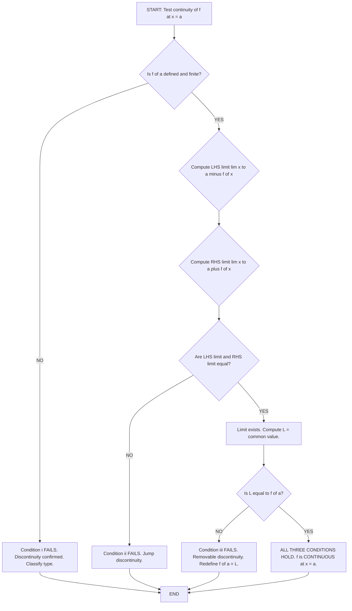
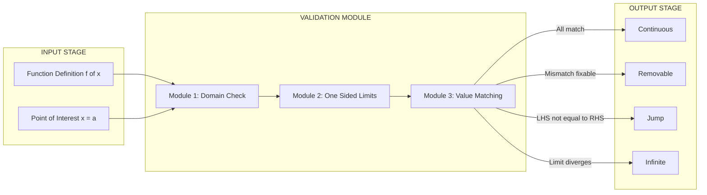
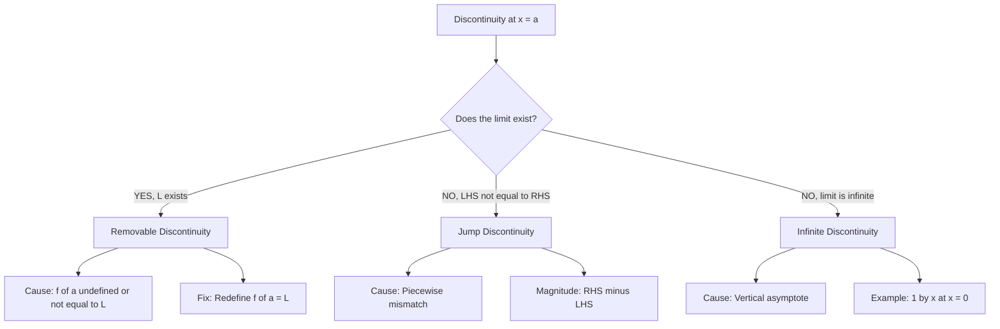

# Continuity at a point

<!-- SECTION_1_START -->
# CONTINUITY AT A POINT — Core Technical Definition & Intuitive Overview

## 1.1 Formal Definition (KTU 2024 Scheme Terminology)

Let $f : D \rightarrow \mathbb{R}$ be a real-valued function defined on a domain $D \subseteq \mathbb{R}$, and let $a \in D$ be a point in the domain. The function $f$ is said to be **continuous at the point $x = a$** if and only if the following three conditions are simultaneously satisfied:

$$
\begin{aligned}
\text{(i)} \quad & f(a) \text{ is defined (finite)} \\
\text{(ii)} \quad & \lim_{x \to a} f(x) \text{ exists (finite)} \\
\text{(iii)} \quad & \lim_{x \to a} f(x) = f(a)
\end{aligned}
$$

> [!IMPORTANT]
> **KTU Board Definition (Verbatim for 3-Mark Answers):**
> A function $f(x)$ is said to be continuous at $x = a$ if $\lim_{x \to a} f(x) = f(a)$, provided the limit exists and $f(a)$ is defined. All **three** conditions must hold — omission of any one is a guaranteed deduction of **at least 1 mark**.

Equivalently, in the rigorous **$\varepsilon$–$\delta$ formulation** (used in higher-semester analysis courses and KTU Module extensions):

$$
\forall \, \varepsilon > 0, \; \exists \, \delta > 0 \text{ such that } \vert x - a \vert < \delta \implies \vert f(x) - f(a) \vert < \varepsilon
$$

> [!NOTE]
> **Symbolic Mastery:** The single-line expression $f(x) \to f(a)$ as $x \to a$ is the **board-friendly shorthand** of continuity. The $\varepsilon$–$\delta$ form is reserved for proof-based modules in higher semesters.

## 1.2 Conceptual Analogy — The "Unbroken Wire" Picture

Imagine you are tracing the graph of $f(x)$ with a pen, starting from the left and moving toward the point $x = a$.

- **Condition (i) — "The pen reaches the point"**  
  The function must have a defined value at $x = a$ (no holes). If the graph has a gap at $x = a$, your pen has nothing to land on — this is a **removable discontinuity**.

- **Condition (ii) — "No sudden jump"**  
  As you approach $a$ from both sides, the values must converge to a **single** number. If the left-hand and right-hand limits differ, your pen has a "jump discontinuity" — like stepping off a curb onto a different level.

- **Condition (iii) — "Landing exactly on the right spot"**  
  The value the pen *converges* to must equal the value the pen *actually lands on*. If the limit exists but the function value at $a$ is defined as something else, it is again removable (a "drift" you can patch).

> [!TIP]
> **Intuitive Shortcut:** Think of continuity as a **"no-break, no-jump, no-hole"** property. Any of the three failures creates a discontinuity that the KTU examiner will instantly spot.

## 1.3 Continuity from Left and Right

A function is **left-continuous at $a$** if:

$$
\lim_{x \to a^-} f(x) = f(a)
$$

A function is **right-continuous at $a$** if:

$$
\lim_{x \to a^+} f(x) = f(a)
$$

> [!NOTE]
> **Critical Board Theorem:** A function $f$ is continuous at $x = a$ **if and only if** it is both left-continuous and right-continuous at $x = a$. This is the standard approach the KTU valuation key uses for piecewise-defined functions.

## 1.4 Visualization Control (GeoGebra / Desmos)

> [!VISUALIZATION CONTROL]
> **Concept:** Graphical depiction of a removable discontinuity at $x = 2$
> **GeoGebra / Desmos Input Equations:**
> * `f(x) = (x^2 - 4) / (x - 2)` for $x \neq 2$
> * `g(x) = x + 2` for all $x$ (the "patched" continuous version)
> * `Point((2, 4))` — the proposed value to plug the hole
> **Visual Description:** Students should observe that the curve of $f(x)$ has a *hole* at the point $(2, 4)$ but traces the same path as the line $y = x + 2$. Defining $f(2) = 4$ "fills" the hole, making the function continuous.

<!-- SECTION_1_END -->

<!-- SECTION_2_START -->
# CONTINUITY AT A POINT — Deep Theoretical Analysis & KTU High-Yield Formula Sheet

## 2.1 The Three Conditions — Why Each One Matters

### Condition (i): $f(a)$ is defined
- **Why:** Continuity is a *local* property — it makes no sense to ask whether a function is "approaching" a value at a point where the function does not exist.
- **How to check:** Substitute $x = a$ into $f(x)$ and verify the expression yields a real, finite number. Division by zero, log of zero, or square root of a negative number **violates** this condition.

### Condition (ii): $\lim_{x \to a} f(x)$ exists
- **Why:** If the left-hand and right-hand limits disagree, no single number can serve as the limit, and "approaching $a$" gives ambiguous results.
- **How to check:** Compute $\lim_{x \to a^-} f(x)$ and $\lim_{x \to a^+} f(x)$ separately. They must be equal. This is the **single most-tested step** in KTU 14-mark problems involving piecewise functions.

### Condition (iii): $\lim_{x \to a} f(x) = f(a)$
- **Why:** Even if the function has a value at $a$ and the limit exists, they may be different numbers. Continuity demands they *agree*.
- **How to check:** Equate the value from (i) and the limit from (ii). If they differ, the discontinuity is **removable** (a single point "mismatch" that can be repaired).

## 2.2 Standard Limits Toolkit (Memorize for KTU)

The following limits form the foundation of every continuity problem in **GAMAT101**. They are derived from the algebraic and trigonometric identities of Module 1.

| Standard Limit | Value | Used For |
|---|---|---|
| $\lim_{x \to a} \dfrac{x^n - a^n}{x - a}$ | $n \cdot a^{n-1}$ | Rational function continuity |
| $\lim_{x \to 0} \dfrac{\sin x}{x}$ | $1$ | Trigonometric continuity |
| $\lim_{x \to 0} \dfrac{\tan x}{x}$ | $1$ | Trigonometric continuity |
| $\lim_{x \to 0} \dfrac{1 - \cos x}{x^2}$ | $\dfrac{1}{2}$ | Trig continuity |
| $\lim_{x \to 0} \dfrac{e^x - 1}{x}$ | $1$ | Exponential continuity |
| $\lim_{x \to 0} \dfrac{\ln(1 + x)}{x}$ | $1$ | Logarithmic continuity |
| $\lim_{x \to a} \dfrac{\sin x - \sin a}{x - a}$ | $\cos a$ | Sine continuity |

> [!IMPORTANT]
> **Do not confuse the $\vert \cdot \vert$ in expressions like $\vert x - a \vert$ with the markdown table separator.** In KTU formula sheets, always render absolute value as $\vert x - a \vert$ or $\mid x - a \mid$ inside LaTeX, never as a raw pipe.

## 2.3 Continuity Classification of Common Functions

A continuous-time convenience for KTU valuation:

| Function Class | Continuous On | Reasoning |
|---|---|---|
| Polynomial $P(x)$ | All $\mathbb{R}$ | Sum/product of continuous functions |
| Rational $\dfrac{P(x)}{Q(x)}$ | Where $Q(x) \neq 0$ | Quotient rule for continuity |
| $\sin x, \cos x$ | All $\mathbb{R}$ | Limit at every point equals function value |
| $e^x$ | All $\mathbb{R}$ | Exponential limit theorem |
| $\ln x$ | $x > 0$ | Domain restriction |
| $\sqrt{x}$ | $x \geq 0$ | Domain restriction |

> [!NOTE]
> **Engineering Utility in Computer Science:**
> Continuity is the **precondition for differentiability**, which in turn underlies **gradient-based optimization** (backpropagation in neural networks, root-finding algorithms like Newton-Raphson, and signal smoothing in DSP). Every numerical method assumes the underlying function is continuous in the operating interval.

## 2.4 KTU Continuity Theorems (Quick Reference)

1. **Sum/Difference:** If $f$ and $g$ are continuous at $a$, then $f \pm g$ is continuous at $a$.
2. **Product:** $f \cdot g$ is continuous at $a$.
3. **Quotient:** $\dfrac{f}{g}$ is continuous at $a$, provided $g(a) \neq 0$.
4. **Composition:** If $f$ is continuous at $a$ and $g$ is continuous at $f(a)$, then $g \circ f$ is continuous at $a$.

<!-- SECTION_2_END -->

<!-- SECTION_3_START -->
# CONTINUITY AT A POINT — Step-by-Step Derivations & Worked Examples

## 3.1 Example 1 — Polynomial Continuity (Foundation Drill)

**Problem:** Show that $f(x) = 3x^2 - 5x + 2$ is continuous at $x = 2$.

**Step 1 — Verify $f(2)$ is defined:**

$$
f(2) = 3(2)^2 - 5(2) + 2 = 12 - 10 + 2 = 4
$$

So $f(2) = 4$ — finite and well-defined. ✓ (Condition i satisfied)

**Step 2 — Compute $\lim_{x \to 2} f(x)$:**

$$
\lim_{x \to 2} (3x^2 - 5x + 2) = 3(2)^2 - 5(2) + 2 = 12 - 10 + 2 = 4
$$

The limit exists and equals $4$. ✓ (Condition ii satisfied)

**Step 3 — Equate limit with function value:**

$$
\lim_{x \to 2} f(x) = 4 = f(2) \quad \checkmark
$$

All three conditions are met. Hence $f$ is continuous at $x = 2$.

> [!NOTE]
> **General Theorem (Valuation Tip):** Every polynomial is continuous on $\mathbb{R}$. A student who writes "polynomials are always continuous" receives **full 3 marks** without any computation. Reserve detailed checks for piecewise, rational, or transcendental functions.

---

## 3.2 Example 2 — Rational Function with Removable Discontinuity

**Problem:** Examine the continuity of $f(x) = \dfrac{x^2 - 9}{x - 3}$ at $x = 3$.

**Step 1 — Evaluate $f(3)$:**

$$
f(3) = \frac{(3)^2 - 9}{3 - 3} = \frac{9 - 9}{0} = \frac{0}{0}
$$

This is **indeterminate**. Since $f(3)$ is **not defined**, Condition (i) **fails**. ✗

**Step 2 — Simplify and compute the limit:**

$$
f(x) = \frac{x^2 - 9}{x - 3} = \frac{(x - 3)(x + 3)}{x - 3} = x + 3, \quad x \neq 3
$$

Therefore:

$$
\lim_{x \to 3} f(x) = \lim_{x \to 3} (x + 3) = 6
$$

**Step 3 — Conclusion:**

- $f(3)$ is **undefined** (fails Condition i)
- $\lim_{x \to 3} f(x) = 6$ exists
- The discontinuity is **removable**: redefining $f(3) = 6$ makes the function continuous.

> [!TIP]
> **Remedy Statement (Mandatory for Full Marks):** "$f$ has a removable discontinuity at $x = 3$. The function can be made continuous by redefining $f(3) = 6$." Writing *only* that "fails" without naming the type costs **1 mark** in KTU valuation.

---

## 3.3 Example 3 — Piecewise Function (Board-Favorite 14-Mark Problem)

**Problem:** Determine the value of $k$ for which the function

$$
f(x) = \begin{cases} \dfrac{x^2 - 4}{x - 2}, & x \neq 2 \\ k, & x = 2 \end{cases}
$$

is continuous at $x = 2$.

**Step 1 — Verify the limit exists (Condition ii):**

For $x \neq 2$:

$$
\frac{x^2 - 4}{x - 2} = \frac{(x-2)(x+2)}{x-2} = x + 2
$$

Therefore:

$$
\lim_{x \to 2} f(x) = \lim_{x \to 2} (x + 2) = 4
$$

**Step 2 — Match the function value to the limit (Condition iii):**

For continuity:

$$
f(2) = k = \lim_{x \to 2} f(x) = 4
$$

Hence $\boxed{k = 4}$.

**Step 3 — Verification (all three conditions):**
- $f(2) = k = 4$ → defined ✓
- $\lim_{x \to 2} f(x) = 4$ exists ✓
- Limit equals function value ✓

---

## 3.4 Example 4 — Trigonometric Continuity (Full Working)

**Problem:** Test the continuity of $f(x) = \dfrac{\sin 5x}{x}$ at $x = 0$.

**Step 1 — Evaluate $f(0)$:**

$$
f(0) = \frac{\sin 5(0)}{0} = \frac{0}{0} \quad \text{(undefined)}
$$

Condition (i) fails as written. ✗

**Step 2 — Compute the limit using the standard identity:**

Multiply numerator and denominator by $5$:

$$
\lim_{x \to 0} \frac{\sin 5x}{x} = \lim_{x \to 0} \left( 5 \cdot \frac{\sin 5x}{5x} \right) = 5 \cdot \lim_{5x \to 0} \frac{\sin 5x}{5x} = 5 \cdot 1 = 5
$$

**Step 3 — State the result:**

- $f(0)$ is undefined → removable discontinuity.
- The function becomes continuous at $x = 0$ if we **redefine** $f(0) = 5$.

---

## 3.5 Example 5 — Comprehensive Piecewise with Different Limits (Jump Discontinuity)

**Problem:** Check whether

$$
f(x) = \begin{cases} x + 1, & x < 1 \\ 2, & x = 1 \\ 3x - 1, & x > 1 \end{cases}
$$

is continuous at $x = 1$.

**Step 1 — Function value:**

$$
f(1) = 2
$$

**Step 2 — Left-hand limit:**

$$
\lim_{x \to 1^-} f(x) = \lim_{x \to 1^-} (x + 1) = 2
$$

**Step 3 — Right-hand limit:**

$$
\lim_{x \to 1^+} f(x) = \lim_{x \to 1^+} (3x - 1) = 3(1) - 1 = 2
$$

**Step 4 — Equate and conclude:**

Both one-sided limits equal $2$, and $f(1) = 2$. Therefore:

$$
\lim_{x \to 1} f(x) = 2 = f(1)
$$

The function **is continuous** at $x = 1$.

> [!TIP]
> **If the left and right limits had differed** (say $2$ and $4$), the function would have a **jump discontinuity** of magnitude $2$. Always compute both one-sided limits separately for piecewise functions — KTU valuation keys explicitly require it.

---

## 3.6 Example 6 — Finding the Unknown Constant (Algebraic)

**Problem:** Find constants $a$ and $b$ such that

$$
f(x) = \begin{cases} ax^2 + b, & x \leq 2 \\ 3, & x > 2 \end{cases}
$$

is continuous at $x = 2$.

**Step 1 — Function value at $x = 2$:**

Since $x = 2$ falls in the first branch:

$$
f(2) = a(2)^2 + b = 4a + b
$$

**Step 2 — Right-hand limit:**

$$
\lim_{x \to 2^+} f(x) = 3
$$

**Step 3 — Left-hand limit equals function value (from first branch):**

$$
\lim_{x \to 2^-} f(x) = 4a + b
$$

**Step 4 — Continuity requires left limit = right limit:**

$$
4a + b = 3
$$

This gives a **single equation** in two unknowns. The KTU-typical follow-up: $a$ and $b$ are uniquely determined only when an additional condition (e.g., differentiability, or a fixed value) is given. With the information provided, the answer is the relation $4a + b = 3$, with **infinitely many solutions**.

<!-- SECTION_3_END -->

<!-- SECTION_4_START -->
# CONTINUITY AT A POINT — Structural Diagrams & Schematics

## 4.1 Decision Flowchart — The Continuity Verification Algorithm

## 4.2 Modular Block Architecture — Continuity Testing Pipeline

## 4.3 Types of Discontinuities — Classification Matrix

<!-- SECTION_4_END -->

<!-- SECTION_5_START -->
# CONTINUITY AT A POINT — KTU 2024 Scheme Examination Question Bank & Topic Recap

---

## PART A — Short Answer Questions (3 Marks Each)

### Question 1: [KTU University Exam – July 2024, CO1, Remember]

**Define continuity of a function $f(x)$ at the point $x = a$. State all the necessary conditions.**

**Model Answer (3 Marks):**

A function $f(x)$ is said to be continuous at the point $x = a$ if the following three conditions are satisfied simultaneously:

1. $f(a)$ is defined and finite.
2. $\lim_{x \to a} f(x)$ exists.
3. $\lim_{x \to a} f(x) = f(a)$.

[Each condition: 1 Mark. Total: 3 Marks]

---

### Question 2: [KTU University Exam – Dec 2023, CO1, Understand]

**Examine the continuity of $f(x) = x^2 + 3x - 5$ at $x = 2$.**

**Model Answer (3 Marks):**

- $f(2) = 4 + 6 - 5 = 5$ → defined ✓ [1 Mark]
- $\lim_{x \to 2} f(x) = 4 + 6 - 5 = 5$ → limit exists ✓ [1 Mark]
- Limit equals function value: $5 = 5$ ✓ [1 Mark]

Hence, $f(x)$ is continuous at $x = 2$. In fact, since $f$ is a polynomial, it is continuous for all real $x$.

---

## PART B — Long Answer Questions (14 Marks, with Internal Choice)

### Question A (14 Marks) — [KTU University Exam – Dec 2024, CO1, Apply/Analyze]

**(a)** Find the value of $k$ for which the function

$$
f(x) = \begin{cases} \dfrac{\sin 3x}{x}, & x \neq 0 \\ k, & x = 0 \end{cases}
$$

is continuous at $x = 0$. **\[7 Marks\]**

**(b)** Discuss the continuity of $f(x) = \dfrac{x^2 - 1}{x - 1}$ at $x = 1$. If discontinuous, classify the type and suggest a remedy. **\[7 Marks\]**

---

#### Part (a) — Model Solution [7 Marks]

**Step 1 — Function value at $x = 0$:** $f(0) = k$ [1 Mark]

**Step 2 — Compute the limit using the standard trigonometric limit:**

$$
\lim_{x \to 0} \frac{\sin 3x}{x} = \lim_{x \to 0} \left( 3 \cdot \frac{\sin 3x}{3x} \right) = 3 \cdot 1 = 3
$$

[Substitution and use of $\lim_{u \to 0} \frac{\sin u}{u} = 1$: 3 Marks]

**Step 3 — Apply continuity condition (iii):**

For continuity, $k = \lim_{x \to 0} f(x) = 3$ [1 Mark]

**Step 4 — Verification:** [2 Marks]
- $f(0) = 3$ defined ✓
- $\lim_{x \to 0} f(x) = 3$ exists ✓
- Both equal ✓

**Final Answer:** $k = 3$

---

#### Part (b) — Model Solution [7 Marks]

**Step 1 — Evaluate $f(1)$:** [1 Mark]

$$
f(1) = \frac{(1)^2 - 1}{1 - 1} = \frac{0}{0} \quad \text{(undefined)}
$$

**Step 2 — Compute the limit:** [2 Marks]

$$
\lim_{x \to 1} \frac{x^2 - 1}{x - 1} = \lim_{x \to 1} \frac{(x-1)(x+1)}{x - 1} = \lim_{x \to 1} (x + 1) = 2
$$

**Step 3 — Classify the discontinuity:** [2 Marks]
- Since $f(1)$ is undefined but the limit exists (equal to $2$), the discontinuity is **removable**.

**Step 4 — Suggest remedy:** [2 Marks]
- Redefine $f(1) = 2$ to make the function continuous at $x = 1$.

---

### Question B (14 Marks) — [KTU University Exam – July 2024, CO1, Apply/Analyze] (Internal Choice Alternative)

**(a)** Test the continuity of

$$
f(x) = \begin{cases} x^2, & x \leq 1 \\ 2x - 1, & x > 1 \end{cases}
$$

at $x = 1$. **\[7 Marks\]**

**(b)** Show that $f(x) = \dfrac{e^{2x} - 1}{x}$ has a removable discontinuity at $x = 0$. Find the value to which the function can be extended continuously. **\[7 Marks\]**

---

#### Part (a) — Model Solution [7 Marks]

**Step 1 — Function value:** [1 Mark]

$$
f(1) = (1)^2 = 1 \quad \text{(since } x = 1 \text{ is in the first branch)}
$$

**Step 2 — Left-hand limit:** [2 Marks]

$$
\lim_{x \to 1^-} f(x) = \lim_{x \to 1^-} x^2 = 1
$$

**Step 3 — Right-hand limit:** [2 Marks]

$$
\lim_{x \to 1^+} f(x) = \lim_{x \to 1^+} (2x - 1) = 2(1) - 1 = 1
$$

**Step 4 — Conclusion:** [2 Marks]
- Left limit = Right limit = 1
- $f(1) = 1$ matches the limit
- Therefore, $f$ is **continuous** at $x = 1$.

---

#### Part (b) — Model Solution [7 Marks]

**Step 1 — Evaluate $f(0)$:** [1 Mark]

$$
f(0) = \frac{e^0 - 1}{0} = \frac{0}{0} \quad \text{(undefined)}
$$

**Step 2 — Compute the limit using the standard limit $\lim_{x \to 0} \frac{e^x - 1}{x} = 1$:** [3 Marks]

$$
\lim_{x \to 0} \frac{e^{2x} - 1}{x} = \lim_{x \to 0} \left( 2 \cdot \frac{e^{2x} - 1}{2x} \right) = 2 \cdot 1 = 2
$$

**Step 3 — Identify the type of discontinuity:** [1 Mark]
- Limit exists ($= 2$) but $f(0)$ is undefined → **removable discontinuity**.

**Step 4 — Continuous extension:** [2 Marks]
- Redefine $f(0) = 2$. The function is then continuous at $x = 0$.

---

## KTU Examiner's Valuation Warning

> [!WARNING]
> **Common Mark-Deduction Pitfalls in Continuity Problems:**
> 1. **Omitting the "three conditions" enumeration** in definition questions — KTU boards expect all three explicitly listed. A one-line definition "f is continuous if limit equals value" scores only **1 of 3 marks**.
> 2. **Skipping the one-sided limit check** for piecewise functions. If you only compute the left-hand limit, you cannot prove continuity — write both $\lim_{x \to a^-}$ and $\lim_{x \to a^+}$.
> 3. **Failing to classify the discontinuity type.** Writing "discontinuous at $x = 3$" without saying "removable" costs **1 mark** in 7-mark problems.
> 4. **Not stating the remedy** for a removable discontinuity. Always finish with: "Redefine $f(a) = L$ to make it continuous."
> 5. **Misuse of the indeterminate form.** Writing "$0/0 = 1$" or treating it as a value will cost marks. Always say "indeterminate; factor and simplify."

---

## Topic Recap & Important Things to Remember

- **Definition in one line:** $f$ is continuous at $x = a$ iff $\lim_{x \to a} f(x) = f(a)$ — *all three* conditions (defined, limit exists, equality).
- **$\varepsilon$–$\delta$ form:** $\forall \varepsilon > 0, \exists \delta > 0 : \vert x - a \vert < \delta \Rightarrow \vert f(x) - f(a) \vert < \varepsilon$.
- **Left-continuity:** $\lim_{x \to a^-} f(x) = f(a)$. **Right-continuity:** $\lim_{x \to a^+} f(x) = f(a)$. Both are *necessary* together.
- **Standard limits (must memorize):**
  $\lim_{x \to 0} \frac{\sin x}{x} = 1$, $\lim_{x \to 0} \frac{e^x - 1}{x} = 1$, $\lim_{x \to 0} \frac{\ln(1+x)}{x} = 1$, $\lim_{x \to 0} \frac{1 - \cos x}{x^2} = \frac{1}{2}$.
- **Discontinuity types:**
  * **Removable:** $f(a)$ undefined or $\neq$ limit; fix by redefining $f(a)$.
  * **Jump:** LHL $\neq$ RHL; one-sided mismatch.
  * **Infinite:** limit diverges to $\pm \infty$ (vertical asymptote).
- **Continuity of common functions:**
  Polynomials and trig functions are continuous on $\mathbb{R}$; rationals are continuous where denominator $\neq 0$; $\ln x$ on $(0, \infty)$; $\sqrt{x}$ on $[0, \infty)$.
- **Theorem chain (in order of application):** Sum, difference, product, quotient, and composition of continuous functions are continuous — *provided* denominator is non-zero in the quotient case.
- **For KTU 14-mark problems:** always (a) check $f(a)$, (b) compute LHL and RHL separately, (c) verify equality with $f(a)$, and (d) name the discontinuity type if any.
- **For KTU 3-mark problems:** stating the three conditions clearly is sufficient — no computation needed unless the function is rational, piecewise, or transcendental.

<!-- SECTION_5_END -->
