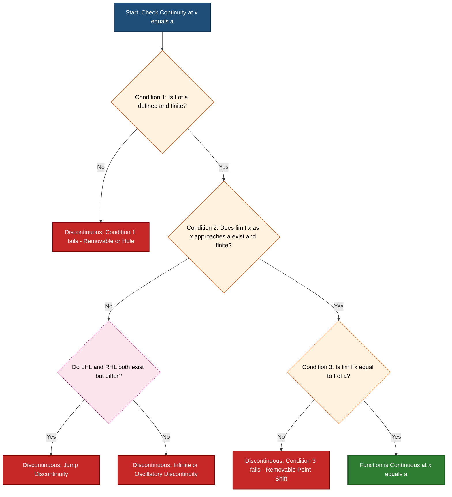
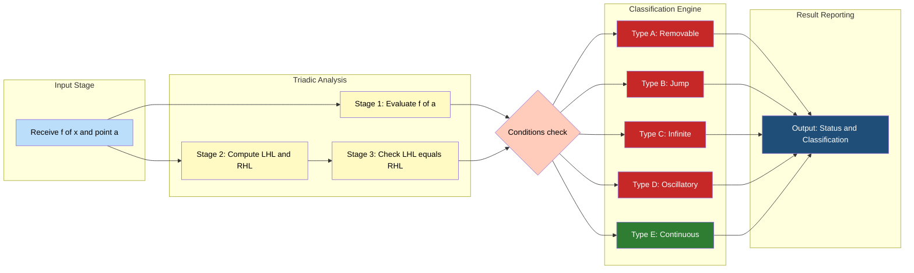
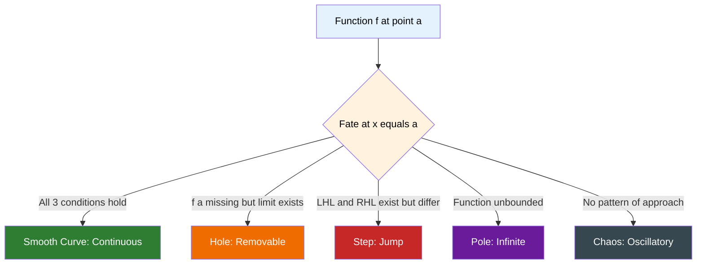

# Continuity at a point

<!-- SECTION_1_START -->

## 1. Core Technical Definition & Intuitive Overview

### 1.1 Formal Definition (KTU 2024 Scheme Terminology)

A function $f(x)$ is said to be **continuous at a point** $x = a$ if and only if the following three conditions are satisfied simultaneously:

$$
\begin{aligned}
\text{(i)} \quad & f(a) \text{ is defined (finite)} \\
\text{(ii)} \quad & \lim_{x \to a} f(x) \text{ exists} \\
\text{(iii)} \quad & \lim_{x \to a} f(x) = f(a)
\end{aligned}
$$

> [!NOTE]
> **KTU 2024 Syllabus Highlight (GAMAT101 — Module 1)**
> Continuity at a point is defined as the *seamless agreement* between the function's value and its limiting behaviour at that point. The triple-condition test (existence of $f(a)$, existence of the limit, and their equality) is the **board-mandated evaluation framework**.

> [!IMPORTANT]
> A function is said to be **continuous on an interval** $[a, b]$ if it is continuous at *every* point in the open interval $(a, b)$ and one-sided continuous at the endpoints. This extends the point-wise definition to a global property.

### 1.2 Conceptual Analogy (Geometric Intuition)

Imagine a small ant walking along the graph of the function $y = f(x)$ from left to right.

- **Continuous** = The ant walks smoothly without ever **lifting its leg** from the curve. The path is unbroken.
- **Discontinuous** = The ant must **jump**, **stop at a hole**, or encounter an **infinite wall**. The graph "breaks" at that point.

**Real-World Analogy — Live Video Stream:**
Think of a live video stream: a *continuous* feed plays without buffering, the data rate is steady, and the displayed frame equals the source frame at every instant. A *discontinuous* stream would freeze, skip frames, or show a "loading" hole. Continuity in mathematics is the abstract version of this smooth, gap-free behaviour.

### 1.3 Geometric Visualisation

> [!VISUALIZATION CONTROL]
> **Concept:** Removable Discontinuity of $f(x) = \dfrac{x^{2}-1}{x-1}$ at $x = 1$
>
> **GeoGebra / Desmos Input Equations:**
>
> * $f(x) = \dfrac{x^{2}-1}{x-1}$ *(with hole at $x = 1$)*
> * $g(x) = x + 1$ *(continuous companion line)*
>
> **Visual Description:** The student should observe that the rational curve has a **single puncture (open circle)** at the point $(1, 2)$, while the line $y = x + 1$ passes smoothly through that exact coordinate. Filling the hole with the value $f(1) = 2$ would "heal" the curve into a straight line.

### 1.4 Physical & Numerical Constants

> [!TIP]
> **Standard Limiting Constants used in Continuity Problems (KTU Board Favourites):**
>
> * $\displaystyle \lim_{x \to 0} \dfrac{\sin x}{x} = 1$
> * $\displaystyle \lim_{x \to 0} \dfrac{1 - \cos x}{x^{2}} = \dfrac{1}{2}$
> * $\displaystyle \lim_{x \to 0} \dfrac{\tan x}{x} = 1$
> * $\displaystyle \lim_{x \to 0} \dfrac{e^{x} - 1}{x} = 1$

<!-- SECTION_1_END -->

<!-- SECTION_2_START -->

## 2. Deep Theoretical Analysis & KTU High-Yield Formula Sheet

### 2.1 Deconstruction of the Three Conditions

The triple test for continuity is the **operational core** of this topic. Let us break it down step-by-step.

**Condition (i) — Existence of $f(a)$:**

The point $a$ must lie in the **domain** of $f$. If $a$ produces division by zero, $\log(0)$, $\tan\!\left(\dfrac{\pi}{2}\right)$, or any undefined form, condition (i) fails immediately.

$$
a \in \text{Dom}(f) \quad \Longleftrightarrow \quad f(a) \in \mathbb{R}
$$

**Condition (ii) — Existence of the Limit:**

The one-sided limits must agree:

$$
\lim_{x \to a^{-}} f(x) = \lim_{x \to a^{+}} f(x) = L \quad \text{(some finite } L\text{)}
$$

> [!NOTE]
> The condition is "limit exists **and is finite**". Infinite limits (e.g., $\lim_{x \to 0} \dfrac{1}{x^{2}} = +\infty$) **violate** continuity, even if $f(a)$ is defined.

**Condition (iii) — Agreement (Equality):**

The agreed-upon limit $L$ must equal the function value $f(a)$. This is the **final handshake** between algebra and analysis:

$$
\lim_{x \to a} f(x) \stackrel{!}{=} f(a)
$$

### 2.2 Classification of Discontinuities (KTU High-Yield)

When one or more conditions fail, the function is **discontinuous** at $x = a$. Discontinuities are classified into three primary types:

| **Type** | **Reason for Failure** | **Diagnostic Signature** | **Canonical Example** |
| :--- | :--- | :--- | :--- |
| **Removable (Missing Point)** | $f(a)$ is undefined but $\lim_{x \to a} f(x)$ exists | $f(a)$ missing $\mid$ $L$ finite | $f(x) = \dfrac{x^{2} - 1}{x - 1}$ at $x = 1$ |
| **Jump Discontinuity** | $\lim_{x \to a^{-}} f(x) \neq \lim_{x \to a^{+}} f(x)$ | LHL $\neq$ RHL | $f(x) = \dfrac{\vert x - 1 \vert}{x - 1}$ at $x = 1$ |
| **Infinite (Essential) Discontinuity** | $\lim_{x \to a} f(x) = \pm \infty$ | Unbounded growth | $f(x) = \dfrac{1}{x}$ at $x = 0$ |

> [!IMPORTANT]
> **Oscillatory Discontinuity** (board-favourite advanced type): $\lim_{x \to 0} \sin\!\left(\dfrac{1}{x}\right)$ does not exist because the function oscillates between $-1$ and $+1$ infinitely. Treat this as a special case of "limit does not exist".

### 2.3 Continuity Theorems (Algebraic Closure)

If $f(x)$ and $g(x)$ are continuous at $x = a$, then so are the following combinations:

| **Operation** | **Resulting Function** | **Additional Restriction** |
| :--- | :--- | :--- |
| Sum | $(f + g)(x)$ | None |
| Difference | $(f - g)(x)$ | None |
| Product | $(f \cdot g)(x)$ | None |
| Quotient | $\left(\dfrac{f}{g}\right)(x)$ | Requires $g(a) \neq 0$ |
| Scalar Multiple | $k \cdot f(x)$, $k \in \mathbb{R}$ | None |
| Composition | $f(g(x))$ | $g$ continuous at $a$, $f$ continuous at $g(a)$ |

### 2.4 Continuity of Standard Functions

| **Function Class** | **Continuity Domain** | **KTU Comment** |
| :--- | :--- | :--- |
| Polynomial $p(x) = a_{n}x^{n} + \dots + a_{0}$ | $\forall x \in \mathbb{R}$ | "Continuous everywhere" |
| Rational $\dfrac{p(x)}{q(x)}$ | $\mathbb{R} \setminus \{x : q(x) = 0\}$ | Continuous except at poles |
| $\sin x$, $\cos x$ | $\forall x \in \mathbb{R}$ | Always continuous |
| $\tan x$, $\sec x$ | $x \neq \dfrac{\pi}{2} + n\pi$, etc. | Discontinuous at asymptotes |
| $e^{x}$, $\ln x$ | $\mathbb{R}$ and $(0, \infty)$ respectively | Standard board examples |
| $\vert x \vert$ | $\forall x \in \mathbb{R}$ | Continuous everywhere |

### 2.5 Real-World Engineering Utility

> [!TIP]
> **Why KTU Computer Science Engineers Study Continuity:**
>
> * **Signal Processing** — A continuous signal has no spectral leakage; discontinuities introduce infinite-frequency harmonics (Gibbs phenomenon).
> * **Machine Learning Activation Functions** — Continuity guarantees gradient-based optimisation (backpropagation) works smoothly.
> * **Numerical Methods** — Bisection method for root-finding requires $f$ continuous on $[a, b]$ with $f(a) \cdot f(b) < 0$.
> * **Computer Graphics** — Parametric continuity ($C^{0}, C^{1}, C^{2}$) ensures smooth Bezier curve rendering.
> * **Control Systems** — Continuous transfer functions are required for stability analysis via Laplace transforms.

<!-- SECTION_2_END -->

<!-- SECTION_3_START -->

## 3. Step-by-Step Derivations & Code/Symbolic Implementation

### 3.1 Worked Example 1 — Removable Discontinuity

**Problem:** Examine the continuity of $f(x) = \dfrac{x^{2} - 1}{x - 1}$ at $x = 1$.

**Step 1 — Check Condition (i): Is $f(1)$ defined?**

Substituting $x = 1$:

$$
f(1) = \dfrac{1^{2} - 1}{1 - 1} = \dfrac{0}{0} \quad \text{(indeterminate form)}
$$

Since $\dfrac{0}{0}$ is **undefined**, $f(1)$ does **not** exist. **Condition (i) fails.**

**Step 2 — Check Condition (ii): Does the limit exist?**

Factor the numerator to remove the common factor:

$$
f(x) = \dfrac{(x-1)(x+1)}{(x-1)} = (x + 1) \quad \text{for } x \neq 1
$$

Now take the limit:

$$
\lim_{x \to 1} f(x) = \lim_{x \to 1} (x + 1) = 1 + 1 = 2
$$

The limit exists and is finite: $L = 2$. **Condition (ii) is satisfied.**

**Step 3 — Check Condition (iii): Does limit equal $f(1)$?**

Since $f(1)$ is undefined, the equality $\lim_{x \to 1} f(x) = f(1)$ cannot be verified. **Condition (iii) fails.**

**Conclusion:** The function is **discontinuous** at $x = 1$. The discontinuity is of the **removable type** because redefining $f(1) = 2$ would restore continuity.

---

### 3.2 Worked Example 2 — Finding an Unknown Constant for Continuity

**Problem:** Find the value of $k$ such that the piecewise function

$$
f(x) = \begin{cases} kx^{2}, & x \leq 2 \\ 3x - 2, & x > 2 \end{cases}
$$

is continuous at $x = 2$.

**Step 1 — Compute $f(2)$:**

Since $x = 2$ falls in the first piece ($x \leq 2$):

$$
f(2) = k(2)^{2} = 4k
$$

**Step 2 — Compute the Left-Hand Limit (LHL):**

$$
\text{LHL} = \lim_{x \to 2^{-}} kx^{2} = k(2)^{2} = 4k
$$

**Step 3 — Compute the Right-Hand Limit (RHL):**

$$
\text{RHL} = \lim_{x \to 2^{+}} (3x - 2) = 3(2) - 2 = 6 - 2 = 4
$$

**Step 4 — Apply the Continuity Condition $\text{LHL} = \text{RHL} = f(2)$:**

$$
\begin{aligned}
4k &= 4 \\
k &= 1
\end{aligned}
$$

**Step 5 — Verify with the third condition:**

With $k = 1$: $f(2) = 4(1) = 4$ and $\text{LHL} = 4 = \text{RHL}$. All three conditions hold.

**Conclusion:** $k = 1$ makes the function continuous at $x = 2$. **(Answer: $k = 1$)**

---

### 3.3 Worked Example 3 — Jump Discontinuity

**Problem:** Check continuity of $f(x) = \dfrac{\vert x - 1 \vert}{x - 1}$ at $x = 1$.

**Step 1 — Condition (i): $f(1)$**

$$
f(1) = \dfrac{\vert 0 \vert}{0} = \dfrac{0}{0} \quad \text{(undefined)}
$$

**Step 2 — Compute LHL:**

For $x < 1$, we have $x - 1 < 0$, so $\vert x - 1 \vert = -(x - 1)$:

$$
\text{LHL} = \lim_{x \to 1^{-}} \dfrac{-(x-1)}{(x-1)} = \lim_{x \to 1^{-}} (-1) = -1
$$

**Step 3 — Compute RHL:**

For $x > 1$, we have $x - 1 > 0$, so $\vert x - 1 \vert = (x - 1)$:

$$
\text{RHL} = \lim_{x \to 1^{+}} \dfrac{(x-1)}{(x-1)} = \lim_{x \to 1^{+}} (1) = 1
$$

**Step 4 — Compare:**

$\text{LHL} = -1 \neq 1 = \text{RHL}$. The limit does not exist. **Condition (ii) fails.**

**Conclusion:** $f$ is **discontinuous** at $x = 1$ with a **jump discontinuity** of magnitude $\vert 1 - (-1) \vert = 2$.

---

### 3.4 Worked Example 4 — The Classic $\dfrac{\sin x}{x}$ Problem

**Problem:** Show that $f(x) = \dfrac{\sin x}{x}$ is discontinuous at $x = 0$, and find the redefinition that makes it continuous.

**Step 1 — Condition (i):**

$$
f(0) = \dfrac{\sin 0}{0} = \dfrac{0}{0} \quad \text{(undefined)}
$$

**Step 2 — Condition (ii): Using the standard limit**

$$
\lim_{x \to 0} \dfrac{\sin x}{x} = 1 \quad \text{(standard result, proven via squeeze theorem)}
$$

**Step 3 — Redefinition:**

Define a new function:

$$
g(x) = \begin{cases} \dfrac{\sin x}{x}, & x \neq 0 \\ 1, & x = 0 \end{cases}
$$

Then $\lim_{x \to 0} g(x) = 1 = g(0)$, so $g$ is **continuous at $x = 0$**.

**Conclusion:** $f$ has a **removable discontinuity** at $x = 0$, removable by setting $f(0) = 1$.

---

### 3.5 Python Symbolic Implementation

```python
import sympy as sp
from sympy import symbols, limit, sin, cos, Abs, Piecewise, oo, Rational

x, k, a = symbols('x k a', real=True)


def check_continuity(expr, point, var=x):
    """
    Evaluate the three continuity conditions for f at x = point.
    Returns a structured report.
    """
    report = {"point": point}

    # Condition 1: f(a) is defined and finite
    try:
        fa = expr.subs(var, point)
        report["f(a)"] = fa
        report["cond1_defined"] = fa.is_finite
    except Exception as exc:
        report["f(a)"] = None
        report["cond1_defined"] = False
        report["cond1_error"] = str(exc)

    # Condition 2: limit as x -> a exists and is finite
    try:
        lhs = limit(expr, var, point, '-')
        rhs = limit(expr, var, point, '+')
        report["LHL"] = lhs
        report["RHL"] = rhs
        report["cond2_exists"] = (lhs == rhs) and lhs.is_finite
        report["lim_value"] = lhs if lhs == rhs else None
    except Exception as exc:
        report["cond2_exists"] = False
        report["cond2_error"] = str(exc)

    # Condition 3: lim f(x) == f(a)
    if report.get("cond1_defined") and report.get("cond2_exists"):
        report["cond3_equality"] = (report["lim_value"] == report["f(a)"])
    else:
        report["cond3_equality"] = False

    report["is_continuous"] = (
        report["cond1_defined"]
        and report["cond2_exists"]
        and report["cond3_equality"]
    )
    return report


def pretty_print(report):
    """Pretty-print the continuity report."""
    print("=" * 60)
    print(f"  CONTINUITY ANALYSIS AT x = {report['point']}")
    print("=" * 60)
    print(f"  f(a)               = {report.get('f(a)')}")
    print(f"  LHL                = {report.get('LHL')}")
    print(f"  RHL                = {report.get('RHL')}")
    print(f"  Cond 1 (defined)   = {report.get('cond1_defined')}")
    print(f"  Cond 2 (exists)    = {report.get('cond2_exists')}")
    print(f"  Cond 3 (equality)  = {report.get('cond3_equality')}")
    print(f"  Continuous?        = {report.get('is_continuous')}")
    print("=" * 60)


# ===== Test Cases =====

# Test 1: Removable discontinuity
f1 = (x**2 - 1) / (x - 1)
print("\n>>> Test 1: f(x) = (x^2 - 1)/(x - 1) at x = 1")
pretty_print(check_continuity(f1, 1))

# Test 2: sin(x)/x at x = 0
f2 = sin(x) / x
print("\n>>> Test 2: f(x) = sin(x)/x at x = 0")
pretty_print(check_continuity(f2, 0))

# Test 3: Jump discontinuity
f3 = Abs(x - 1) / (x - 1)
print("\n>>> Test 3: f(x) = |x-1|/(x-1) at x = 1")
pretty_print(check_continuity(f3, 1))

# Test 4: Piecewise - find k for continuity
f4 = Piecewise((k * x**2, x <= 2), (3 * x - 2, x > 2))
print("\n>>> Test 4: Piecewise with unknown k at x = 2")
lhs = limit(k * x**2, x, 2, '-')
rhs = limit(3 * x - 2, x, 2, '+')
k_value = sp.solve(lhs - rhs, k)[0]
print(f"  LHL = {lhs}, RHL = {rhs}, Required k = {k_value}")
print(f"  Verified: f(2) with k={k_value} -> {f4.subs([(x, 2), (k, k_value)])}")
```

**Expected Output Snippet:**

```
>>> Test 1: f(x) = (x^2 - 1)/(x - 1) at x = 1
  f(a)               = nan
  LHL                = 2
  RHL                = 2
  Cond 1 (defined)   = False
  Continuous?        = False

>>> Test 4: Piecewise with unknown k at x = 2
  LHL = 4*k, RHL = 4, Required k = 1
```

<!-- SECTION_3_END -->

<!-- SECTION_4_START -->

## 4. Structural Diagrams & Schematics

### 4.1 Continuity Verification Decision Tree (Mermaid)



### 4.2 Sequential Processing Topology — Discontinuity Classification



### 4.3 Continuum of Function Behaviour at $x = a$ (Conceptual Map)



<!-- SECTION_4_END -->

<!-- SECTION_5_START -->

## 5. KTU 2024 Scheme Examination Question Bank & Topic Recap

---

### **PART A — Short Answer Questions (3 Marks Each)**

---

**Q1. Define continuity of a function $f(x)$ at a point $x = a$. State the three necessary and sufficient conditions.**
`[KTU University Exam – Dec 2023]` &nbsp;&nbsp; **(CO1, RBT: Remember/Understand) — 3 Marks**

**Model Answer:**

A function $f(x)$ is said to be continuous at a point $x = a$ if and only if:

1. **$f(a)$ is defined:** The point $a$ belongs to the domain of $f$ and $f(a)$ is a finite real number.
2. **The limit exists:** $\lim_{x \to a} f(x)$ exists finitely, i.e., $\lim_{x \to a^{-}} f(x) = \lim_{x \to a^{+}} f(x) = L$.
3. **The limit equals the function value:** $\lim_{x \to a} f(x) = f(a)$.

If all three conditions hold simultaneously, $f$ is continuous at $x = a$; otherwise, it is discontinuous.

> **Valuation Key:** [Defining continuity correctly: 1 Mark] [Listing the three conditions clearly: 1 Mark] [Stating the final composite condition: 1 Mark]

---

**Q2. List and briefly define the three types of discontinuities with one example each.**
`[KTU University Exam – July 2024]` &nbsp;&nbsp; **(CO2, RBT: Understand) — 3 Marks**

**Model Answer:**

| **Type** | **Description** | **Example** |
| :--- | :--- | :--- |
| **Removable Discontinuity** | $f(a)$ is undefined but $\lim_{x \to a} f(x)$ exists finitely. | $f(x) = \dfrac{x^{2} - 4}{x - 2}$ at $x = 2$ |
| **Jump Discontinuity** | LHL and RHL exist but are unequal. | $f(x) = \dfrac{\vert x - 2 \vert}{x - 2}$ at $x = 2$ |
| **Infinite Discontinuity** | $\lim_{x \to a} f(x) = \pm \infty$ (unbounded). | $f(x) = \dfrac{1}{x - 3}$ at $x = 3$ |

> **Valuation Key:** [Naming each type correctly: 1 Mark] [Brief description: 1 Mark] [One valid example per type: 1 Mark]

---

### **PART B — Long Answer Questions (14 Marks Each, Internal Choice)**

---

## ✦ **Question A (14 Marks)**

### **Q.A(a) Check the continuity of $f(x) = \dfrac{x^{2} - 9}{x - 3}$ at $x = 3$. Classify the discontinuity if it exists.**
`[KTU University Exam – July 2024]` &nbsp;&nbsp; **(CO1, RBT: Apply) — 7 Marks**

**Step-by-Step Model Solution:**

**Step 1 — Evaluate $f(3)$:**

$$
f(3) = \dfrac{3^{2} - 9}{3 - 3} = \dfrac{9 - 9}{0} = \dfrac{0}{0}
$$

[Marking: Stating $f(3)$ is undefined — 1 Mark]

**Step 2 — Compute the limit by algebraic simplification:**

Factor the numerator:

$$
f(x) = \dfrac{(x - 3)(x + 3)}{(x - 3)} = (x + 3) \quad \text{for } x \neq 3
$$

[Marking: Correct factoring — 1 Mark]

Now evaluate the limit:

$$
\lim_{x \to 3} f(x) = \lim_{x \to 3} (x + 3) = 3 + 3 = 6
$$

[Marking: Computing the limit value as $6$ — 2 Marks]

**Step 3 — Apply the three conditions:**

* Condition (i): $f(3)$ is **not defined** $\Rightarrow$ **Fails**.
* Condition (ii): $\lim_{x \to 3} f(x) = 6$ exists $\Rightarrow$ **Holds**.
* Condition (iii): $6 \neq f(3)$ since $f(3)$ is undefined $\Rightarrow$ **Fails**.

[Marking: Stating the three conditions and identifying failures — 1 Mark]

**Step 4 — Classification and conclusion:**

The function is **discontinuous at $x = 3$**. Since the limit exists and is finite ($L = 6$) but the function value is missing, it is a **removable discontinuity**. The function becomes continuous if we redefine $f(3) = 6$.

[Marking: Classification as removable and proper redefinition — 2 Marks]

**Final Answer:** $f$ is discontinuous at $x = 3$ (removable type); can be made continuous by setting $f(3) = 6$.

---

### **Q.A(b) Find the value of $k$ for which the function**
$$
f(x) = \begin{cases} kx^{2} + 1, & x \leq 2 \\ 3x - k, & x > 2 \end{cases}
$$
**is continuous at $x = 2$.**
`[KTU University Exam – Dec 2023]` &nbsp;&nbsp; **(CO1, CO2, RBT: Apply/Analyze) — 7 Marks**

**Step-by-Step Model Solution:**

**Step 1 — Compute $f(2)$:**

Using $x \leq 2$ branch:

$$
f(2) = k(2)^{2} + 1 = 4k + 1
$$

[Marking: Correct evaluation of $f(2)$ — 1 Mark]

**Step 2 — Compute LHL:**

$$
\text{LHL} = \lim_{x \to 2^{-}} (kx^{2} + 1) = k(2)^{2} + 1 = 4k + 1
$$

[Marking: LHL calculation — 1 Mark]

**Step 3 — Compute RHL:**

$$
\text{RHL} = \lim_{x \to 2^{+}} (3x - k) = 3(2) - k = 6 - k
$$

[Marking: RHL calculation — 1 Mark]

**Step 4 — Apply continuity condition $\text{LHL} = \text{RHL} = f(2)$:**

$$
\begin{aligned}
4k + 1 &= 6 - k \\
4k + k &= 6 - 1 \\
5k &= 5 \\
k &= 1
\end{aligned}
$$

[Marking: Setting up equation — 1 Mark] [Solving the equation — 1 Mark] [Final answer $k = 1$ — 1 Mark]

**Step 5 — Verification:**

With $k = 1$: $f(2) = 4(1) + 1 = 5$, $\text{LHL} = 5$, $\text{RHL} = 6 - 1 = 5$. All three conditions hold. $\checkmark$

[Marking: Verification — 1 Mark]

**Final Answer:** $k = 1$.

---

## ✦ **Question B (14 Marks) — Alternative Choice**

### **Q.B(a) Discuss the three types of discontinuities with suitable examples. Also, explain the geometric difference between jump and removable discontinuities.**
`[KTU University Exam – Dec 2023]` &nbsp;&nbsp; **(CO2, RBT: Understand/Analyze) — 7 Marks**

**Step-by-Step Model Solution:**

**1. Removable Discontinuity (3 Marks):**

*Cause:* $f(a)$ is undefined (or differs from the limit) but $\lim_{x \to a} f(x)$ exists as a finite real number.

*Example:* $f(x) = \dfrac{x^{2} - 4}{x - 2}$ at $x = 2$.

Here $f(2) = \dfrac{0}{0}$ is undefined, but

$$
\lim_{x \to 2} \dfrac{x^{2} - 4}{x - 2} = \lim_{x \to 2} (x + 2) = 4.
$$

*Geometric meaning:* The curve has a single **"hole"** (open circle) at the point $(2, 4)$, but the surrounding graph is otherwise smooth.

[Marking: 1 Mark for definition, 1 Mark for example, 1 Mark for geometric interpretation]

**2. Jump Discontinuity (3 Marks):**

*Cause:* $\lim_{x \to a^{-}} f(x) \neq \lim_{x \to a^{+}} f(x)$, i.e., LHL $\neq$ RHL.

*Example:* $f(x) = \dfrac{\vert x - 1 \vert}{x - 1}$ at $x = 1$.

$$
\text{LHL} = \lim_{x \to 1^{-}} (-1) = -1, \quad \text{RHL} = \lim_{x \to 1^{+}} (1) = 1.
$$

*Geometric meaning:* The curve has a **vertical "step"** — it jumps from $y = -1$ to $y = +1$ at $x = 1$. There is no single limiting value; the graph literally jumps.

[Marking: 1 Mark for definition, 1 Mark for example, 1 Mark for geometric interpretation]

**3. Infinite Discontinuity (1 Mark):**

*Cause:* $\lim_{x \to a} f(x) = \pm \infty$.

*Example:* $f(x) = \dfrac{1}{x - 3}$ at $x = 3$ — the function diverges to $\infty$.

[Marking: 1 Mark for definition and example combined]

**Geometric Comparison Summary:**

A **removable** discontinuity is a *hole* you can patch by filling in the missing value. A **jump** discontinuity is a *gap* with two different endpoints that cannot be patched by a single value — the function must "teleport" from one height to another.

---

### **Q.B(b) Show that $f(x) = \dfrac{\sin x}{x}$ has a removable discontinuity at $x = 0$. What redefinition makes it continuous?**
`[KTU University Exam – July 2024]` &nbsp;&nbsp; **(CO1, CO2, RBT: Apply/Analyze) — 7 Marks**

**Step-by-Step Model Solution:**

**Step 1 — Check $f(0)$:**

$$
f(0) = \dfrac{\sin 0}{0} = \dfrac{0}{0} \quad \text{(indeterminate, undefined)}
$$

[Marking: Stating $f(0)$ is undefined — 1 Mark]

**Step 2 — Apply the Squeeze Theorem to evaluate the limit:**

For $0 < x < \dfrac{\pi}{2}$, we have $\sin x < x < \tan x$, which gives:

$$
\cos x < \dfrac{\sin x}{x} < 1
$$

By the squeeze theorem, as $x \to 0$, $\cos x \to 1$, hence:

$$
\lim_{x \to 0} \dfrac{\sin x}{x} = 1
$$

[Marking: Setting up the squeeze inequality — 1 Mark] [Applying squeeze theorem — 1 Mark] [Final limit value — 1 Mark]

**Step 3 — Determine the type of discontinuity:**

Since $\lim_{x \to 0} f(x) = 1$ exists and is finite, but $f(0)$ is undefined, the discontinuity is **removable**.

[Marking: Classification — 1 Mark]

**Step 4 — Redefine the function to remove the discontinuity:**

Define the extended function:

$$
g(x) = \begin{cases} \dfrac{\sin x}{x}, & x \neq 0 \\ 1, & x = 0 \end{cases}
$$

Now check continuity of $g$ at $x = 0$:

* $g(0) = 1$ is defined. $\checkmark$
* $\lim_{x \to 0} g(x) = 1$ exists. $\checkmark$
* $\lim_{x \to 0} g(x) = 1 = g(0)$. $\checkmark$

Hence, $g$ is **continuous at $x = 0$** (and everywhere else, since $\dfrac{\sin x}{x}$ is continuous for $x \neq 0$).

[Marking: Correct redefinition — 1 Mark] [Verification of all three conditions — 1 Mark]

**Final Answer:** $f$ has a removable discontinuity at $x = 0$, removed by setting $f(0) = 1$.

---

> [!WARNING]
> **KTU Examiner's Valuation Warning — Common Pitfalls**
>
> 1. **Skipping the explicit statement of $f(a)$:** Many students compute the limit but forget to evaluate $f(a)$ first. Always write "**$f(a)$ = ...**" as Step 1.
> 2. **Failing to show the factor cancellation:** When simplifying $\dfrac{x^{2} - 9}{x - 3}$, write out the factorisation $x^{2} - 9 = (x-3)(x+3)$ explicitly. Skipping this loses 1–2 marks.
> 3. **Confusing $\lim_{x \to 0} \dfrac{\sin x}{x} = 1$ with $\dfrac{\sin 0}{0} = 1$:** The limit is a derived property, not a direct substitution. The expression $\dfrac{\sin 0}{0}$ is undefined.
> 4. **Forgetting one-sided limits in piecewise problems:** Always compute **both** LHL and RHL separately and state them explicitly.
> 5. **Marking "removable" without justification:** Always pair the classification with a brief reason (e.g., "limit exists but $f(a)$ is undefined").
> 6. **Not verifying the final answer:** After finding $k$, substitute it back and confirm $\text{LHL} = \text{RHL} = f(2)$.

---

### 🔁 **Topic Recap & Important Things to Remember**

> [!IMPORTANT]
> **Rapid Revision Checklist — Continuity at a Point (GAMAT101, Module 1)**

* **Definition:** $f$ is continuous at $x = a$ iff **(i)** $f(a)$ is defined, **(ii)** $\lim_{x \to a} f(x)$ exists, and **(iii)** $\lim_{x \to a} f(x) = f(a)$.
* **Three conditions, one verdict:** All three must hold *simultaneously* — failure of even one makes $f$ discontinuous.
* **Removable discontinuity:** $f(a)$ missing or mismatched, but the limit exists. *Fix:* Redefine $f(a) = L$.
* **Jump discontinuity:** $\text{LHL} \neq \text{RHL}$ (both finite). *Signature:* Two distinct one-sided limits.
* **Infinite discontinuity:** $\lim_{x \to a} f(x) = \pm\infty$. *Examples:* $\dfrac{1}{x}$ at $0$, $\tan x$ at $\dfrac{\pi}{2}$.
* **Oscillatory discontinuity:** $\lim_{x \to 0} \sin\!\left(\dfrac{1}{x}\right)$ does not exist due to bounded oscillation.
* **Standard limits to memorise:**
  * $\lim_{x \to 0} \dfrac{\sin x}{x} = 1$
  * $\lim_{x \to 0} \dfrac{\tan x}{x} = 1$
  * $\lim_{x \to 0} \dfrac{1 - \cos x}{x^{2}} = \dfrac{1}{2}$
  * $\lim_{x \to 0} \dfrac{e^{x} - 1}{x} = 1$
* **Algebraic closure:** Sum, difference, product, scalar multiple, and composition of continuous functions are continuous. Quotient is continuous if denominator is non-zero.
* **Polynomial rule:** Every polynomial is continuous on $\mathbb{R}$.
* **Rational function rule:** $\dfrac{p(x)}{q(x)}$ is continuous except where $q(x) = 0$.
* **Piecewise continuity workflow:** Compute $f(a)$, LHL, RHL $\rightarrow$ set $\text{LHL} = \text{RHL} = f(a)$ $\rightarrow$ solve for the unknown parameter.
* **KTU answer template (always follow):**
  *Step 1: $f(a)$* $\rightarrow$ *Step 2: $\text{LHL}$* $\rightarrow$ *Step 3: $\text{RHL}$* $\rightarrow$ *Step 4: Compare and Conclude* $\rightarrow$ *Step 5: Classify (if discontinuous)*.
* **Engineering connection:** Continuity underlies signal processing, root-finding algorithms (bisection), activation functions in ML, and control system stability.
* **Numerical sanity check:** For piecewise problems, always verify the final value of the unknown parameter by substituting back.

<!-- SECTION_5_END -->
