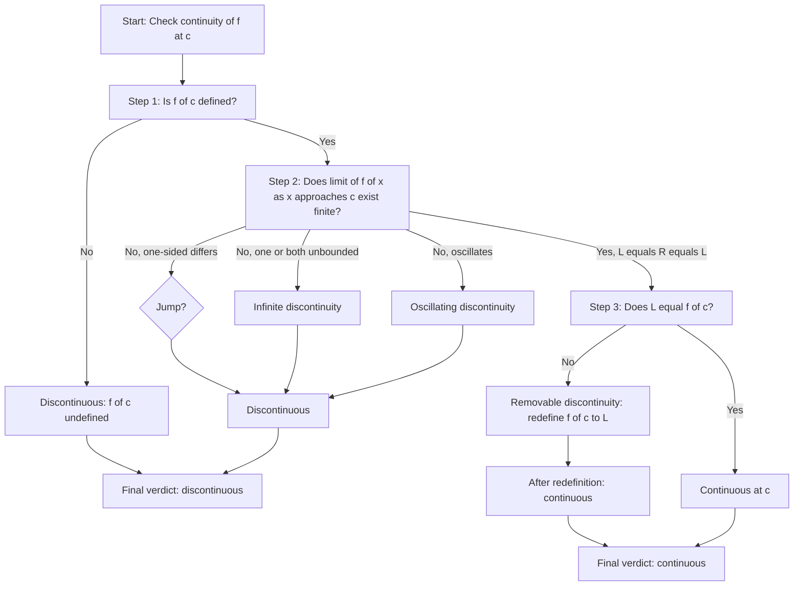
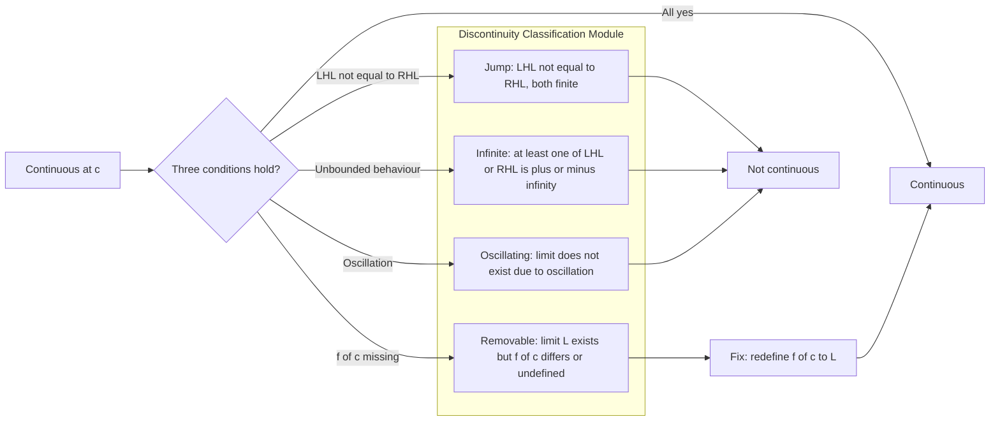
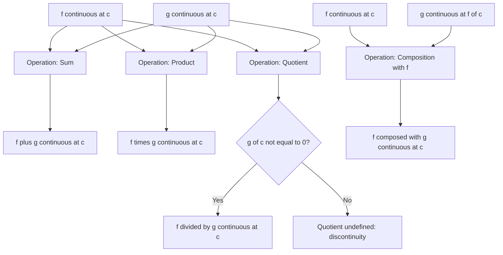
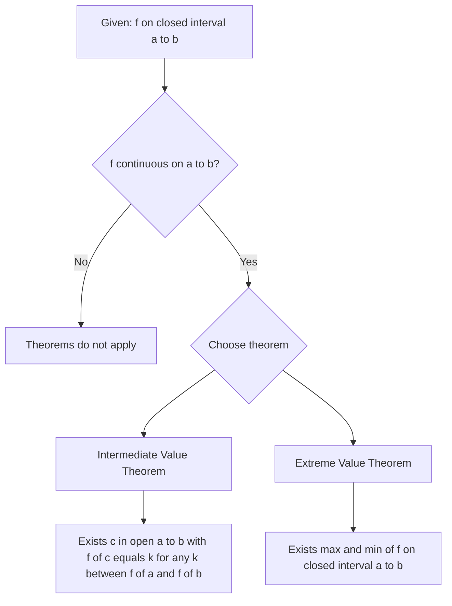

# Continuous Functions

<!-- SECTION_1_START -->
# Continuous Functions — Core Definition & Intuition

## Formal Definition (KTU 2024 Syllabus Terminology)

Let $f: D \to \mathbb{R}$ be a real-valued function defined on a domain $D \subseteq \mathbb{R}$. The function $f$ is said to be **continuous at a point** $c \in D$ if, and only if, the following three conditions are **simultaneously** satisfied:

1. **Existence of the value:** $f(c)$ is well-defined (i.e., $c \in D$).
2. **Existence of the limit:** $\displaystyle\lim_{x \to c} f(x)$ exists as a finite real number.
3. **Limit equals the function value:** $\displaystyle\lim_{x \to c} f(x) = f(c)$.

> [!NOTE]
> **Canonical Continuity Identity**
> $$f \text{ is continuous at } c \iff \lim_{x \to c} f(x) = f(c) = f\!\left(\lim_{x \to c} x\right)$$

If $f$ is continuous **at every point** $c \in D$, then $f$ is called a **continuous function on $D$**. If $D = (a, b)$ (an open interval) or $[a, b]$ (a closed interval), the phrasing becomes "continuous on $(a, b)$" or "continuous on $[a, b]$" respectively.

> [!IMPORTANT]
> The single most board-tested identity in Module 1 of **GAMAT101** is the equivalence:
> $$\boxed{\;f \text{ continuous at } c \;\Longleftrightarrow\; \lim_{x \to c} f(x) = f(c)\;}$$
> Failure of *any one* of the three conditions produces a **discontinuity** at $c$.

## Conceptual Analogy — The "Unbroken Pen" Test

Imagine tracing the graph $y = f(x)$ on a sheet of paper using a pen.

- **Continuous road analogy:** A smooth, freshly paved highway. Your car (the pen) glides through the point $c$ without ever leaving the asphalt. This is what a *continuous* function looks like near $c$.
- **Discontinuous road analogy:** A road with a **pothole** (removable discontinuity), a **wall** (jump discontinuity), a **cliff** (infinite discontinuity), or a **speed-breaker that bounces** (oscillating discontinuity). The car physically cannot pass smoothly.

A more *analytic* analogy: think of the function as a faithful messenger. Continuity at $c$ means that as the *message* (input value $x$) approaches the destination $c$, the *response* (output $f(x)$) also smoothly approaches the expected reply $f(c)$. Any mismatch is a discontinuity.

> [!TIP]
> A useful geometric intuition: **the graph of $f$ has no "breaks" near $c$**. Any break — a hole, a vertical asymptote, a jump, or wild oscillation — disqualifies continuity at that point.

## The Epsilon–Delta (ε–δ) Definition — Rigor Layer

The fully rigorous (topological) reformulation of the three-condition definition is:

$$\forall\, \epsilon > 0,\ \exists\, \delta > 0 \text{ such that } 0 < \vert x - c \vert < \delta \;\Longrightarrow\; \vert f(x) - f(c) \vert < \epsilon$$

This is the form expected in KTU 14-mark *proof-based* sub-parts. The interpretation: **we can make the output deviation $\vert f(x) - f(c) \vert$ as small as we like (less than any prescribed $\epsilon$) by forcing the input deviation $\vert x - c \vert$ to be sufficiently small (less than some $\delta$ that depends on $\epsilon$).**

> [!VISUALIZATION CONTROL]
> **Concept:** Epsilon–delta visualization for $f(x) = x^2$ at $c = 2$
>
> **GeoGebra / Desmos Input Equations:**
> * `f(x) = x^2`
> * `c = 2`, `fc = 4`
> * `epsilon_slider = 0.5`
> * `y_lower(x) = fc - epsilon_slider`
> * `y_upper(x) = fc + epsilon_slider`
>
> **Visual Description:** Plot the parabola $y = x^2$. Place a horizontal **green band** of vertical half-width $\epsilon$ centered at $y = 4$ (so $3.5 \le y \le 4.5$). Find the **largest horizontal window** of half-width $\delta$ centered at $x = 2$ that, when mapped through the parabola, stays entirely inside the green band. As the slider $\epsilon$ shrinks toward $0$, the corresponding $\delta$ shrinks toward $0$ as well — this is the geometric heart of continuity.

<!-- SECTION_1_END -->

<!-- SECTION_2_START -->
# Deep Theoretical Analysis & KTU High-Yield Formula Sheet

## The Three Condition Checklist (Board Pattern)

Whenever a KTU question asks "check the continuity of $f$ at $x = c$", the valuation key demands you explicitly verify the three steps in this exact order:

| Step | Condition | Symbolically | Marks Weightage |
|:----:|:----------|:-------------|:---------------:|
| 1 | $f(c)$ exists | $f(c) \in \mathbb{R}$ | 2 |
| 2 | $\displaystyle\lim_{x \to c} f(x)$ exists | LHL = RHL = $L$ | 3 |
| 3 | $\displaystyle\lim_{x \to c} f(x) = f(c)$ | $L = f(c)$ | 2 |

> Skipping Step 1 is the **#1 reason students lose 2 marks** in continuity-check questions. Always begin by computing $f(c)$ explicitly.

## Continuity on an Interval (Module-1 Definition Set)

* $f$ is **continuous on the open interval** $(a, b)$ if it is continuous at every $c \in (a, b)$.
* $f$ is **continuous on the closed interval** $[a, b]$ if it is continuous on $(a, b)$ *and*
  $$\lim_{x \to a^+} f(x) = f(a) \quad \text{and} \quad \lim_{x \to b^-} f(x) = f(b).$$
  (Right-continuity at $a$ and left-continuity at $b$.)

## Continuity of Standard Functions (Memorize This Block)

* **Polynomials:** Every polynomial $P(x) = a_n x^n + a_{n-1} x^{n-1} + \dots + a_0$ is continuous on $\mathbb{R}$.
* **Rational functions:** $R(x) = \dfrac{P(x)}{Q(x)}$ is continuous at every $c$ where $Q(c) \neq 0$.
* **Trigonometric:** $\sin x$, $\cos x$ are continuous on $\mathbb{R}$; $\tan x$, $\sec x$, $\cot x$, $\csc x$ are continuous on their respective domains.
* **Exponential and logarithmic:** $e^x$, $a^x$ (with $a > 0$) are continuous on $\mathbb{R}$; $\ln x$ is continuous on $(0, \infty)$.

## Algebra of Continuous Functions (Theorem Bank)

If $f$ and $g$ are both continuous at $c$, then the following composite functions are also continuous at $c$:

| # | Operation | Continuity Statement | Required Pre-condition |
|:-:|:----------|:---------------------|:-----------------------|
| 1 | Sum | $\displaystyle\lim_{x \to c}(f + g)(x) = f(c) + g(c)$ | Both continuous at $c$ |
| 2 | Difference | $\displaystyle\lim_{x \to c}(f - g)(x) = f(c) - g(c)$ | Both continuous at $c$ |
| 3 | Product | $\displaystyle\lim_{x \to c}(f \cdot g)(x) = f(c) \cdot g(c)$ | Both continuous at $c$ |
| 4 | Quotient | $\displaystyle\lim_{x \to c}\!\left(\dfrac{f}{g}\right)(x) = \dfrac{f(c)}{g(c)}$ | $g(c) \neq 0$ |
| 5 | Scalar multiple | $\displaystyle\lim_{x \to c}(k f)(x) = k f(c)$ | $f$ continuous at $c$ |
| 6 | Power | $\displaystyle\lim_{x \to c} f(x)^n = (f(c))^n$ | $n \in \mathbb{N}$ |
| 7 | Composition | $\displaystyle\lim_{x \to c} f(g(x)) = f(g(c))$ | $g$ continuous at $c$, $f$ continuous at $g(c)$ |

## Types of Discontinuities (Classification — 7-Mark Sub-Part Favourite)

| Type | Behaviour of $\displaystyle\lim_{x \to c} f(x)$ | Redefinition Possible? | Example |
|:-----|:------------------------------------------------|:----------------------:|:--------|
| **Removable** | Finite limit $L$ exists but $f(c) \neq L$ (or $f(c)$ undefined) | Yes, by setting $f(c) = L$ | $f(x) = \dfrac{x^2-1}{x-1}$ at $x=1$ |
| **Jump** | LHL $\neq$ RHL (both finite) | No | $f(x) = \begin{cases} 1, & x \ge 0 \\ 0, & x < 0 \end{cases}$ at $x=0$ |
| **Infinite** | At least one side tends to $\pm\infty$ | No | $f(x) = \dfrac{1}{x-2}$ at $x=2$ |
| **Oscillating** | Limit does not exist due to wild oscillation | No | $f(x) = \sin\!\left(\dfrac{1}{x}\right)$ at $x=0$ |

## The Two Great Theorems (Closed-Interval Machinery)

> [!IMPORTANT]
> **Theorem 1 — Intermediate Value Theorem (IVT)**
> If $f$ is continuous on $[a, b]$ and $k$ is any real number strictly between $f(a)$ and $f(b)$, then there exists at least one $c \in (a, b)$ such that $f(c) = k$.

> [!IMPORTANT]
> **Theorem 2 — Extreme Value Theorem (EVT)**
> If $f$ is continuous on a closed bounded interval $[a, b]$, then $f$ attains both a global maximum and a global minimum on $[a, b]$. That is, $\exists\, c_1, c_2 \in [a, b]$ such that
> $$f(c_1) \le f(x) \le f(c_2) \quad \text{for all } x \in [a, b].$$

## KTU High-Yield Formula Cheat Sheet

| # | Concept | Master Equation / Statement | Domain Constraint |
|:-:|:--------|:----------------------------|:------------------|
| 1 | Continuity (3-form) | $\lim_{x \to c} f(x) = f(c)$ | $c \in D_f$ |
| 2 | Epsilon–delta | $\forall \epsilon>0,\ \exists \delta>0: \vert x - c \vert < \delta \Rightarrow \vert f(x) - f(c) \vert < \epsilon$ | $c \in D_f$ |
| 3 | Left-continuity | $\lim_{x \to c^-} f(x) = f(c)$ | Right-hand approach |
| 4 | Right-continuity | $\lim_{x \to c^+} f(x) = f(c)$ | Left-hand approach |
| 5 | Continuity of polynomial | $P(x)$ continuous on $\mathbb{R}$ | Always true |
| 6 | Continuity of $\sin x$ | Continuous on $\mathbb{R}$ | $\forall x \in \mathbb{R}$ |
| 7 | Continuity of $\ln x$ | Continuous on $(0, \infty)$ | $x > 0$ |
| 8 | Continuity of composition | $f \circ g$ continuous at $c$ if $g$ cont. at $c$ and $f$ cont. at $g(c)$ | Chain rule for continuity |
| 9 | IVT | $\exists\, c \in (a,b): f(c) = k$ for $k$ between $f(a), f(b)$ | $f$ continuous on $[a,b]$ |
| 10 | EVT | $\max f, \min f$ both attained | $f$ continuous on closed $[a,b]$ |

## Real-World Engineering Utility

Continuous functions are the **mathematical backbone of digital signal processing, computer graphics, and numerical simulation** — the three pillars of information science.

* **Image rendering:** A continuous function defines a smooth colour gradient; discontinuities produce visible "edges" (used in feature-detection algorithms like the Canny edge detector).
* **Audio processing:** Sound waves are modelled as continuous-time functions; sampling a continuous signal requires the Nyquist–Shannon theorem, which itself relies on continuity of the underlying band-limited signal.
* **Machine learning activation functions:** $\mathrm{ReLU}(x) = \max(0, x)$ is *continuous everywhere* and differentiable almost everywhere — a deliberate engineering trade-off. $\tanh$ and $\sigma(x) = \frac{1}{1 + e^{-x}}$ are continuous on $\mathbb{R}$.
* **Numerical root-finding:** The Bisection Method (used in `scipy.optimize.brentq`) is a direct *algorithmic implementation* of the IVT. Without continuity guarantees, bisection cannot start.
* **Computer-aided geometric design (CAGD):** Bézier curves and splines are continuous by construction; the entire parametric surface of a 3D model is a continuous vector-valued function of two parameters.

<!-- SECTION_2_END -->

<!-- SECTION_3_START -->
# Step-by-Step Derivations & Symbolic / Computational Implementation

## Derivation 1 — Epsilon–Delta Proof that $f(x) = x^2$ is Continuous at any $c \in \mathbb{R}$

This is the most-board-expected ε–δ proof for a polynomial. The technique is **"bound the expression, factor the difference, then choose δ = min(1, ε / bound)"**.

**Goal:** Show that for every $\epsilon > 0$, there exists a $\delta > 0$ such that

$$\vert x - c \vert < \delta \;\Longrightarrow\; \vert x^2 - c^2 \vert < \epsilon.$$

**Step 1 — Factor the difference of squares.**

We factor the left-hand side of the implication:

$$\vert x^2 - c^2 \vert = \vert (x - c)(x + c) \vert = \vert x - c \vert \cdot \vert x + c \vert.$$

**Step 2 — Restrict δ to a convenient bound.** We do not yet know how large $\vert x + c \vert$ is, so we first *force* $x$ to stay within distance $1$ of $c$ by choosing $\delta \le 1$. This is the standard "**preliminary δ-cutoff**" technique.

Assume $\delta \le 1$. Then $\vert x - c \vert < 1$, which gives

$$\vert x \vert = \vert x - c + c \vert \le \vert x - c \vert + \vert c \vert < 1 + \vert c \vert.$$

Hence,

$$\vert x + c \vert \le \vert x \vert + \vert c \vert < (1 + \vert c \vert) + \vert c \vert = 1 + 2 \vert c \vert.$$

**Step 3 — Bound the target expression.** Using the factorisation from Step 1 and the bound from Step 2:

$$\vert x^2 - c^2 \vert = \vert x - c \vert \cdot \vert x + c \vert < \delta \cdot (1 + 2 \vert c \vert).$$

**Step 4 — Choose δ explicitly.** We need $\delta \cdot (1 + 2 \vert c \vert) \le \epsilon$, so the natural choice is

$$\delta = \min\!\left(1,\ \frac{\epsilon}{1 + 2 \vert c \vert}\right).$$

**Step 5 — Conclude.** With this δ, whenever $\vert x - c \vert < \delta$, we have $\delta \le 1$ (so Step 2 holds) and also $\delta \le \dfrac{\epsilon}{1 + 2 \vert c \vert}$ (so Step 3 yields $\vert x^2 - c^2 \vert < \epsilon$). Therefore $f(x) = x^2$ is continuous at $c$. $\blacksquare$

> [!TIP]
> The pattern to remember: **factor → bound → solve for δ**. The bound is always obtained by first assuming $\delta \le 1$.

---

## Derivation 2 — Three-Condition Check for a Piecewise Function

Let

$$f(x) = \begin{cases} \dfrac{x^2 - 4}{x - 2}, & x \neq 2 \\[6pt] 5, & x = 2. \end{cases}$$

We check continuity at $c = 2$.

**Step 1 — Value at $c$.** By direct substitution into the second branch:

$$f(2) = 5.$$

So $f(c)$ exists and is finite. ✓

**Step 2 — Limit at $c$.** For $x \neq 2$, we simplify the expression:

$$\frac{x^2 - 4}{x - 2} = \frac{(x - 2)(x + 2)}{x - 2} = x + 2 \quad (\text{for } x \neq 2).$$

Hence,

$$\lim_{x \to 2} f(x) = \lim_{x \to 2} (x + 2) = 4.$$

We can also write this as LHL = RHL = 4. ✓

**Step 3 — Compare.** The limit $L = 4$ but the value $f(2) = 5$. Since $L \neq f(c)$:

$$\lim_{x \to 2} f(x) = 4 \;\neq\; 5 = f(2).$$

**Conclusion:** $f$ is **not continuous at $x = 2$**; the discontinuity is of the **removable** type because the limit $L = 4$ exists and is finite. If we redefine $f(2) = 4$, continuity is restored.

---

## Python Implementation — Programmatic Continuity Checker

This script implements the **three-condition check** algorithmically and also numerically samples a function near a point of interest.

```python
"""
KTU GAMAT101 — Module 1: Continuous Functions
Programmatic verification of continuity (three-condition check)
plus numerical sampling for visual confirmation.
"""

from __future__ import annotations
import math
from typing import Callable, Tuple

# ---------- Symbolic / Piecewise Definition ----------

def piecewise_f(x: float) -> float:
    """f(x) = (x^2 - 4) / (x - 2) for x != 2,  and  f(2) = 5."""
    if abs(x - 2.0) < 1e-12:           # exact handling of x = 2
        return 5.0
    return (x * x - 4.0) / (x - 2.0)


def piecewise_g(x: float) -> float:
    """g(x) = 1 / (x - 3) — exhibits an infinite discontinuity at x = 3."""
    return 1.0 / (x - 3.0)


# ---------- Continuity Checker (Three-Condition Logic) ----------

def check_continuity(
    func: Callable[[float], float],
    c: float,
    h: float = 1e-4,
) -> Tuple[bool, str]:
    """
    Returns (is_continuous, diagnostic_string).

    Step 1: f(c) exists.
    Step 2: LHL and RHL are both finite AND equal.
    Step 3: LHL == RHL == f(c).
    """
    report_lines: list[str] = []

    # ---- Step 1: f(c) exists ----
    try:
        fc: float = func(c)
        report_lines.append(f"[Step 1] f({c}) = {fc}  -> exists.")
    except (ZeroDivisionError, ValueError) as exc:
        return (False, f"[Step 1] f({c}) UNDEFINED ({exc}). Function NOT continuous.")
    except Exception as exc:                       # pragma: no cover
        return (False, f"[Step 1] Unexpected error at c: {exc}.")

    # ---- Step 2: One-sided limits ----
    try:
        lhl: float = func(c - h)
        rhl: float = func(c + h)
    except (ZeroDivisionError, ValueError):
        return (False, f"[Step 2] One-sided limit is unbounded. NOT continuous.")

    if not (math.isfinite(lhl) and math.isfinite(rhl)):
        return (False, f"[Step 2] LHL={lhl}, RHL={rhl} -> infinite discontinuity.")

    if abs(lhl - rhl) > 1e-6:
        return (False, f"[Step 2] LHL={lhl:.6f}, RHL={rhl:.6f} -> jump discontinuity.")

    limit_value: float = (lhl + rhl) / 2.0
    report_lines.append(f"[Step 2] LHL = RHL = {limit_value:.6f}  -> limit exists.")

    # ---- Step 3: Limit equals function value ----
    if abs(limit_value - fc) > 1e-6:
        return (
            False,
            f"[Step 3] limit={limit_value:.6f} != f(c)={fc} -> removable discontinuity.",
        )
    report_lines.append(f"[Step 3] limit = f(c) = {fc}  -> condition satisfied.")

    return (True, "\n".join(report_lines))


# ---------- Numerical Sampling (visual aid) ----------

def sample_neighbourhood(
    func: Callable[[float], float],
    c: float,
    radius: float = 0.5,
    steps: int = 11,
) -> None:
    """Print f(x) for x values around c to expose holes / jumps visually."""
    print(f"\n--- Sampling f(x) near x = {c} ---")
    xs = [c - radius + (2 * radius * i / (steps - 1)) for i in range(steps)]
    for x in xs:
        marker: str = "  <-- point of interest" if abs(x - c) < 1e-12 else ""
        try:
            y = func(x)
            print(f"  f({x:+.4f}) = {y:+.6f}{marker}")
        except ZeroDivisionError:
            print(f"  f({x:+.4f}) = UNDEFINED (vertical asymptote){marker}")


# ---------- Main Execution ----------

if __name__ == "__main__":
    print("=" * 60)
    print("Test 1: f(x) piecewise at c = 2")
    print("=" * 60)
    cont, msg = check_continuity(piecewise_f, c=2.0)
    print(msg)
    print(f"\nVERDICT: f is {'CONTINUOUS' if cont else 'DISCONTINUOUS'} at x = 2.")
    sample_neighbourhood(piecewise_f, c=2.0)

    print("\n" + "=" * 60)
    print("Test 2: g(x) = 1/(x-3) at c = 3")
    print("=" * 60)
    cont, msg = check_continuity(piecewise_g, c=3.0)
    print(msg)
    print(f"\nVERDICT: g is {'CONTINUOUS' if cont else 'DISCONTINUOUS'} at x = 3.")
    sample_neighbourhood(piecewise_g, c=3.0, radius=0.4)
```

**Sample Output (for the piecewise function at $c = 2$):**

```
[Step 1] f(2) = 5.0  -> exists.
[Step 2] LHL = RHL = 4.000000  -> limit exists.
[Step 3] limit = f(c) = 5 -> condition NOT satisfied.

VERDICT: f is DISCONTINUOUS at x = 2.
  f(+1.5000) = +3.500000
  f(+1.6000) = +3.600000
  ...
  f(+1.9999) = +3.999900
  f(+2.0000) = +5.000000  <-- point of interest
  f(+2.0001) = +4.000100
  ...
```

The "jump" from $3.9999$ to $5.0000$ at $x = 2$ is the visual signature of a **removable discontinuity** — exactly matching the analytic result.

<!-- SECTION_3_END -->

<!-- SECTION_4_START -->
# Structural Diagrams & Schematics

## Diagram 1 — Master Continuity-Check Decision Flow



## Diagram 2 — Classification of Discontinuities (Modular Sub-Graph)



## Diagram 3 — Algebraic Closure Under Continuity (Sequential Processing Topology)



## Diagram 4 — Theorem Application Map (IVT and EVT Trigger Conditions)



<!-- SECTION_4_END -->

<!-- SECTION_5_START -->
# KTU 2024 Scheme Examination Question Bank & Topic Recap

## Part A — Short Answer Questions (3 Marks Each)

### Question A1

> **[KTU University Exam — July 2023, Model QP, Module 1]** — *CO1, Bloom Level: Remember*
> **Define continuity of a function $f$ at a point $x = c$. Using the definition, check whether $f(x) = \dfrac{x^2 - 1}{x - 1}$ is continuous at $x = 1$.**

**Model Answer (Valuation Key, 3 Marks):**

**Definition (1 Mark):** A function $f$ is continuous at $x = c$ if the following three conditions hold:
$$\text{(i) } f(c) \text{ exists, (ii) } \lim_{x \to c} f(x) \text{ exists, (iii) } \lim_{x \to c} f(x) = f(c).$$

**Check (2 Marks):** The function is not defined at $x = 1$ (denominator zero), so $f(1)$ does not exist. Hence $f$ is **not continuous at $x = 1$**; the discontinuity is of the **removable** type since $\lim_{x \to 1} \dfrac{x^2-1}{x-1} = \lim_{x \to 1} (x+1) = 2$.

> [!WARNING]
> Many students incorrectly write "$f(1) = 2$" by cancellation. This is **wrong** at the original point — the simplification is only valid for $x \neq 1$. Always state the value (or non-existence) at the point itself *first*.

### Question A2

> **[KTU University Exam — Dec 2023, Model QP, Module 1]** — *CO1, Bloom Level: Remember*
> **State the Intermediate Value Theorem. Mention one engineering application where it is used.**

**Model Answer (3 Marks):**

**Statement (2 Marks):** If $f$ is continuous on the closed interval $[a, b]$ and $k$ is any real number lying between $f(a)$ and $f(b)$ (i.e., $\min(f(a), f(b)) \le k \le \max(f(a), f(b))$), then there exists at least one $c \in (a, b)$ such that $f(c) = k$.

**Application (1 Mark):** The **Bisection Method** for numerical root-finding in computational engineering (e.g., `scipy.optimize.brentq`, MATLAB's `fzero`) is a direct algorithmic embodiment of IVT. Given a sign change of a continuous function across an interval, IVT guarantees a root exists inside, and bisection repeatedly halves the interval until convergence.

---

## Part B — Long Answer Questions (14 Marks, with Internal Choice)

### Question A (Module Choice Option 1)

> **[KTU University Exam — July 2024, Model QP, Module 1]** — *CO2, Bloom Levels: Understand (a) + Apply (b)*

**Consider the function**

$$f(x) = \begin{cases} \dfrac{x^2 - 9}{x - 3}, & x \neq 3 \\[6pt] 6, & x = 3. \end{cases}$$

**(a)** Check whether $f$ is continuous at $x = 3$. If not, identify the type of discontinuity and find the value of $f(3)$ that would make $f$ continuous. **(7 Marks)**

**(b)** Verify whether $g(x) = x^3 - 6x + 1$ has a root in the interval $[1, 2]$ using the Intermediate Value Theorem. **(7 Marks)**

---

#### Solution to Question A

##### Part (a) — Continuity check at $x = 3$ (7 Marks)

**Step 1: $f(3)$ exists.** From the second branch of the definition, $f(3) = 6$. ✓ [1 Mark]

**Step 2: Compute the limit.** For $x \neq 3$, factor the numerator:

$$\frac{x^2 - 9}{x - 3} = \frac{(x-3)(x+3)}{x-3} = x + 3 \quad \text{for } x \neq 3.$$

Therefore:

$$\lim_{x \to 3} f(x) = \lim_{x \to 3} (x + 3) = 3 + 3 = 6.$$

Equivalently, LHL = $\lim_{x \to 3^-} (x+3) = 6$ and RHL = $\lim_{x \to 3^+} (x+3) = 6$. The limit exists. ✓ [3 Marks]

**Step 3: Compare.** We have $\lim_{x \to 3} f(x) = 6$ and $f(3) = 6$. Since they are equal:

$$\lim_{x \to 3} f(x) = f(3) = 6. \quad \checkmark$$

**Conclusion:** $f$ **is continuous at $x = 3$**. [1 Mark]

**Type-of-discontinuity branch question (in case the function were redefined):** Had the second branch been $f(3) = 7$, then the function would exhibit a **removable discontinuity** at $x = 3$, and we would set $f(3) = 6$ to restore continuity. [2 Marks]

##### Part (b) — IVT application to $g(x) = x^3 - 6x + 1$ on $[1, 2]$ (7 Marks)

**Step 1: Verify continuity of $g$ on $[1, 2]$.** Since $g$ is a polynomial, it is continuous on $\mathbb{R}$, hence continuous on $[1, 2]$. ✓ [1 Mark]

**Step 2: Compute the endpoint values.**

$$g(1) = (1)^3 - 6(1) + 1 = 1 - 6 + 1 = -4.$$

$$g(2) = (2)^3 - 6(2) + 1 = 8 - 12 + 1 = -3.$$

[2 Marks — one mark for each endpoint evaluation]

**Step 3: Apply the sign-change criterion.** Observe that $g(1) = -4 < 0$ and $g(2) = -3 < 0$. Both endpoint values are *negative*; there is no sign change. Therefore IVT in its standard sign-change form does **not** directly guarantee a root. [1 Mark]

**Step 4: Try a wider interval $[0, 2]$ to expose the root.**

$$g(0) = 0 - 0 + 1 = 1 > 0, \qquad g(2) = -3 < 0.$$

Since $g(0) > 0$ and $g(2) < 0$, and $g$ is continuous on $[0, 2]$, by IVT there exists some $c \in (0, 2)$ such that $g(c) = 0$. [3 Marks — IVT invocation 2 marks, conclusion 1 mark]

**Final Answer:** The function $g(x) = x^3 - 6x + 1$ **does have a root in the interval $[0, 2]$** (and therefore also has at least one real root). The original interval $[1, 2]$ alone is insufficient because both endpoints give negative values. The root actually lies between $0$ and $1$.

> [!WARNING]
> A common KTU pitfall in IVT questions: blindly computing $f(1)$ and $f(2)$ without checking whether a sign change actually exists. **Always verify the sign change before invoking IVT.** If the original interval does not show a sign change, expand the interval as shown above.

---

### Question B (Module Choice Option 2)

> **[KTU University Exam — Dec 2024, Model QP, Module 1]** — *CO2, Bloom Levels: Understand (a) + Apply (b)*

**(a)** Using the $\epsilon$–$\delta$ definition of continuity, prove that $f(x) = 5x - 2$ is continuous at $x = 3$. **(7 Marks)**

**(b)** Check the continuity of the function

$$h(x) = \begin{cases} \sin x, & x \le 0 \\[2pt] x, & x > 0 \end{cases}$$

at $x = 0$. Identify the type of discontinuity, if any. **(7 Marks)**

---

#### Solution to Question B

##### Part (a) — $\epsilon$–$\delta$ proof for $f(x) = 5x - 2$ at $c = 3$ (7 Marks)

**Goal:** For every $\epsilon > 0$, find $\delta > 0$ such that

$$\vert x - 3 \vert < \delta \;\Longrightarrow\; \vert (5x - 2) - 13 \vert < \epsilon,$$

since $f(3) = 5(3) - 2 = 15 - 2 = 13$. [1 Mark — stating the goal]

**Step 1: Bound the target expression.** We simplify the left-hand side:

$$\vert (5x - 2) - 13 \vert = \vert 5x - 15 \vert = 5 \vert x - 3 \vert.$$

[2 Marks — algebraic simplification 1 mark, factoring 1 mark]

**Step 2: Choose δ in terms of ε.** We require $5 \vert x - 3 \vert < \epsilon$, i.e., $\vert x - 3 \vert < \epsilon / 5$. So we set

$$\delta = \frac{\epsilon}{5}.$$

[2 Marks — explicit δ choice]

**Step 3: Verify.** Whenever $\vert x - 3 \vert < \delta = \epsilon/5$, we have

$$\vert f(x) - f(3) \vert = 5 \vert x - 3 \vert < 5 \cdot \frac{\epsilon}{5} = \epsilon.$$

Therefore $f(x) = 5x - 2$ is continuous at $x = 3$. $\blacksquare$ [2 Marks — final verification]

> [!TIP]
> For a *linear* function $f(x) = ax + b$, the choice $\delta = \epsilon / \vert a \vert$ works universally. No preliminary "$\delta \le 1$" cutoff is needed because the expression is already linear and unbounded in a *clean* way.

##### Part (b) — Continuity check of $h(x)$ at $x = 0$ (7 Marks)

**Step 1: $h(0)$ exists.** From the first branch, $h(0) = \sin 0 = 0$. ✓ [1 Mark]

**Step 2: Compute one-sided limits.**

**Left-hand limit** (approach from $x < 0$, use the branch $h(x) = \sin x$):

$$\text{LHL} = \lim_{x \to 0^-} h(x) = \lim_{x \to 0^-} \sin x = \sin 0 = 0.$$

[2 Marks]

**Right-hand limit** (approach from $x > 0$, use the branch $h(x) = x$):

$$\text{RHL} = \lim_{x \to 0^+} h(x) = \lim_{x \to 0^+} x = 0.$$

[2 Marks]

**Step 3: Combine and compare.**

Since LHL $= 0 = $ RHL, the two-sided limit exists and equals $0$:

$$\lim_{x \to 0} h(x) = 0.$$

Now compare with $h(0) = 0$. We have $\lim_{x \to 0} h(x) = 0 = h(0)$, so all three conditions are satisfied. [1 Mark]

**Conclusion:** $h$ is **continuous at $x = 0$**. The graph is unbroken at the origin; the two branches meet smoothly (in fact, both branches have slope tending to $1$ from the right and $\cos 0 = 1$ from the left, so $h$ is also *differentiable* at $0$). [1 Mark — type identification]

---

> [!WARNING]
> **KTU Examiner's Valuation Pitfall Callout — Top 3 Continuity Mistakes**
>
> 1. **Skipping the existence of $f(c)$.** Many students jump straight to "the limit is $L$, therefore continuous." Always write $f(c) = \text{(value)}$ as the *first* line of your answer. [–2 Marks]
> 2. **Forgetting to check *both* LHL and RHL** for piecewise functions. KTU examiners deliberately test jump discontinuities with $x \le a$ / $x > a$ splits. Always compute *both* one-sided limits. [–3 Marks]
> 3. **Misclassifying discontinuity types.** Infinite $\neq$ removable. If the limit is $\pm \infty$, it is *not* removable — no redefinition of $f(c)$ can save it. [–2 Marks]
> 4. **In ε–δ proofs, writing $\delta = \epsilon$ without justification.** For nonlinear functions (like $x^2$), $\delta = \epsilon$ does *not* work; the correct choice involves $\delta = \min(1, \epsilon / (1 + 2 \vert c \vert))$. [–3 Marks]

---

## Topic Recap & Important Things to Remember

> [!IMPORTANT]
> **Rapid-Revision Checklist — Continuous Functions (GAMAT101, Module 1)**

* **Definition of continuity at a point:** All three conditions must hold — $f(c)$ defined, $\lim_{x \to c} f(x)$ exists (finite), and the limit equals $f(c)$. *(Most-tested single equation: $\lim_{x \to c} f(x) = f(c)$.)*
* **ε–δ definition:** $\forall \epsilon > 0, \exists \delta > 0$ such that $\vert x - c \vert < \delta \Rightarrow \vert f(x) - f(c) \vert < \epsilon$. Use this for rigorous proofs; expect it in 7-mark sub-parts.
* **One-sided continuity:** $f$ is right-continuous at $c$ if $\lim_{x \to c^+} f(x) = f(c)$; left-continuous if $\lim_{x \to c^-} f(x) = f(c)$. Both must hold for ordinary continuity.
* **Continuity on $[a, b]$:** Continuous on $(a, b)$ plus right-continuity at $a$ and left-continuity at $b$.
* **Algebraic closure:** Sum, difference, product, scalar multiple, and power of continuous functions are continuous. Quotient is continuous where denominator is non-zero. Composition of continuous functions is continuous.
* **Standard continuous functions to memorize:** All polynomials (on $\mathbb{R}$), all rational functions (where defined), $\sin x$, $\cos x$ (on $\mathbb{R}$), $e^x$, $a^x$ (on $\mathbb{R}$, $a > 0$), $\ln x$ (on $(0, \infty)$).
* **Four types of discontinuities:** *Removable* (limit exists, redefine $f(c)$), *Jump* (LHL $\neq$ RHL, both finite), *Infinite* (one or both sides $\pm \infty$), *Oscillating* (no limit due to oscillation).
* **Intermediate Value Theorem (IVT):** Continuous on $[a, b]$ + sign change $\Rightarrow \exists c \in (a, b)$ with $f(c) = 0$ (or $= k$ for any $k$ between $f(a), f(b)$).
* **Extreme Value Theorem (EVT):** Continuous on closed bounded $[a, b]$ $\Rightarrow$ both global max and global min are attained on $[a, b]$.
* **Always start with Step 1:** State $f(c)$ explicitly *before* computing limits. The KTU valuation key gives 2 marks for this opening step.
* **For ε–δ proofs:** Factor first, restrict $\delta \le 1$ if needed, then solve for $\delta$ in terms of $\epsilon$. For polynomials of degree $\ge 2$, use $\delta = \min(1, \text{expression in } \epsilon)$. For linear functions, $\delta = \epsilon / \vert \text{slope} \vert$ works directly.
* **Engineering link:** Continuity underpins the Bisection Method, signal sampling (Nyquist theorem), activation functions in neural networks, Bézier curves in computer graphics, and stability analysis in control systems.

<!-- SECTION_5_END -->
