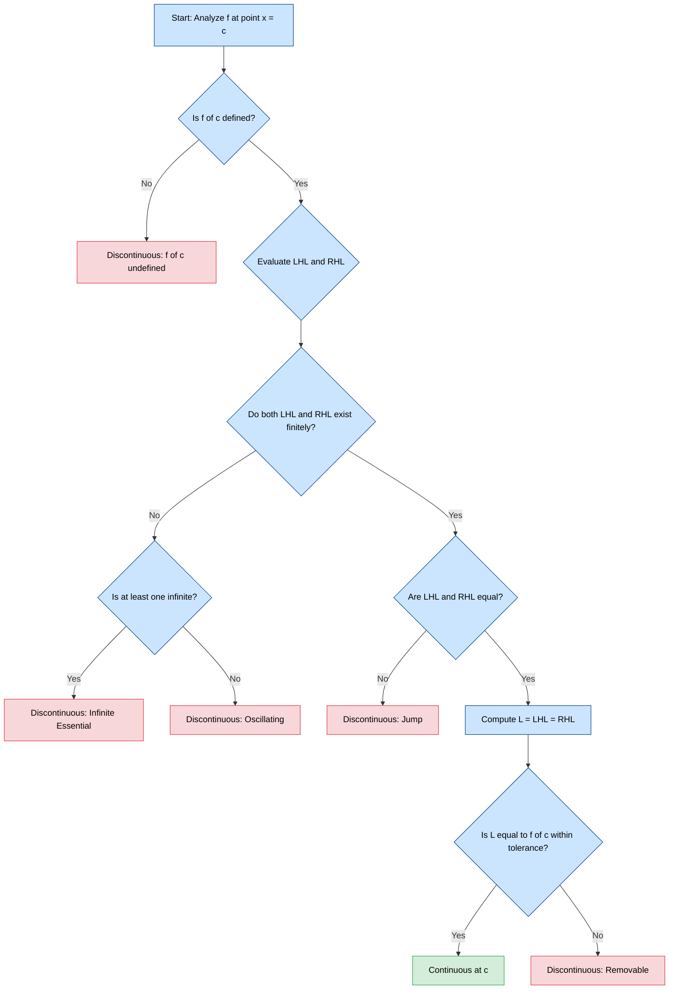
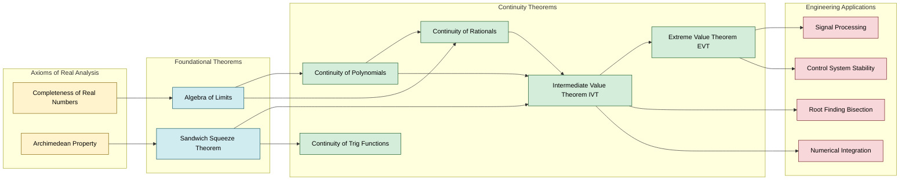
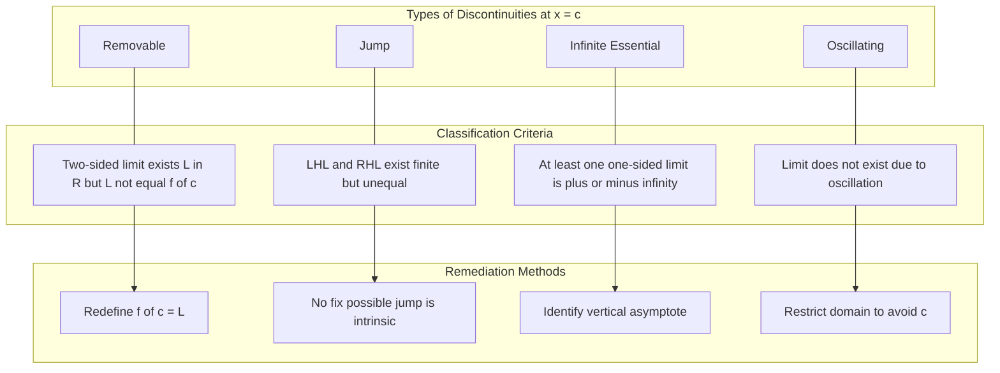

# Continuous Functions

<!-- SECTION_1_START -->

# Continuous Functions – Core Technical Definition & Intuitive Overview

## 1.1 Formal Definition (KTU 2024 Syllabus Terminology)

> [!NOTE]
> **Continuity at a Point ($x = c$)**
> A function $f : D \to \mathbb{R}$ defined on a domain $D \subseteq \mathbb{R}$ is said to be **continuous at a point** $x = c$ if the following three conditions are satisfied simultaneously:
>
> **(i) Existence Condition:** $f(c)$ is defined (i.e., $c \in D$).
>
> **(ii) Limit Existence Condition:** $\lim_{x \to c} f(x)$ exists finitely (i.e., both $\lim_{x \to c^{-}} f(x)$ and $\lim_{x \to c^{+}} f(x)$ exist and are equal).
>
> **(iii) Equality Condition:** $\lim_{x \to c} f(x) = f(c)$.

Mathematically, this is expressed in the **$\varepsilon$-$\delta$ form** (Cauchy, 1821):

$$\lim_{x \to c} f(x) = f(c) \quad \iff \quad \forall \, \varepsilon > 0,\ \exists \, \delta > 0 \text{ such that } \vert x - c \vert < \delta \implies \vert f(x) - f(c) \vert < \varepsilon$$

> [!IMPORTANT]
> **Continuity on an Interval $[a, b]$**
> A function $f$ is said to be **continuous on a closed interval $[a, b]$** if it is continuous at every interior point of $[a, b]$, continuous from the right at $a$, and continuous from the left at $b$. The set of all such functions is denoted $C([a, b])$ or $C^{0}([a, b])$.

---

## 1.2 Conceptual Analogy / Intuition

Imagine you are **drawing the graph of $f$** on a piece of paper using a single, uninterrupted stroke of a pen — without ever lifting the pen off the page. The resulting curve is continuous.

Conversely, any curve where you must **lift your pen**, **teleport**, or **draw a vertical jump** is **discontinuous**. A continuous function has no "holes," "jumps," or "infinite spikes" in its graph at the point of interest.

> [!TIP]
> **Engineering Analogy (Signal Processing):**
> In electrical engineering, a continuous signal is one that can be transmitted through an analog channel without sudden voltage drops. A discontinuity would correspond to a **glitch or impulse noise** — the kind that breaks circuits and corrupts data packets. The $\varepsilon$-$\delta$ condition is precisely the formal guarantee that the output signal stays within tolerable bounds when the input stays within tolerable bounds.

---

## 1.3 Visualization of the Three Conditions

> [!VISUALIZATION CONTROL]
> **Concept:** Visualizing the three continuity conditions at $x = c$
> **GeoGebra / Desmos Input Equations:**
> * Define a piecewise function: $f(x) = \begin{cases} x^2 + 1 & x < 1 \\ 2 & x = 1 \\ \sqrt{x} + 1 & x > 1 \end{cases}$
> * Plot: `f(x) = If[x < 1, x^2 + 1, If[x > 1, sqrt(x) + 1, 2]]`
> **Visual Description:** Observe the smooth approach from both left and right toward the single point $(1, 2)$. The left branch and right branch meet exactly at the filled point, confirming $\lim_{x \to 1} f(x) = f(1) = 2$.

---

## 1.4 Standard Reference Function: Continuity Mastery Map

> [!IMPORTANT]
> The following functions are **continuous everywhere on their natural domains** — this is a KTU 2024 high-yield fact table:

| Function Family | Expression | Natural Domain | Continuity Domain |
|---|---|---|---|
| Constant | $f(x) = k$ | $\mathbb{R}$ | $\mathbb{R}$ |
| Identity | $f(x) = x$ | $\mathbb{R}$ | $\mathbb{R}$ |
| Polynomial | $P(x) = a_{n}x^{n} + \dots + a_0$ | $\mathbb{R}$ | $\mathbb{R}$ |
| Rational | $R(x) = \dfrac{P(x)}{Q(x)}$ | $\mathbb{R} \setminus \{Q(x) = 0\}$ | $\mathbb{R} \setminus \{Q(x) = 0\}$ |
| Exponential | $f(x) = e^{x}$ | $\mathbb{R}$ | $\mathbb{R}$ |
| Logarithmic | $f(x) = \ln(x)$ | $(0, \infty)$ | $(0, \infty)$ |
| Trigonometric | $\sin x,\ \cos x$ | $\mathbb{R}$ | $\mathbb{R}$ |
| Trigonometric | $\tan x,\ \sec x$ | $\mathbb{R} \setminus \{(2k+1)\tfrac{\pi}{2}\}$ | $\mathbb{R} \setminus \{(2k+1)\tfrac{\pi}{2}\}$ |
| Square root | $f(x) = \sqrt{x}$ | $[0, \infty)$ | $[0, \infty)$ |

---

## 1.5 One-Sided Continuity (Preliminaries)

> [!NOTE]
> **Right-Continuity at $c$:** $f$ is right-continuous at $c$ if $\lim_{x \to c^{+}} f(x) = f(c)$.
> **Left-Continuity at $c$:** $f$ is left-continuous at $c$ if $\lim_{x \to c^{-}} f(x) = f(c)$.
>
> A function is continuous at an **endpoint** of a closed interval $[a, b]$ if and only if it is **right-continuous at $a$** and **left-continuous at $b$**.

<!-- SECTION_1_END -->

<!-- SECTION_2_START -->

# Deep Theoretical Analysis & KTU High-Yield Formula Sheet

## 2.1 The Continuity Checklist – A Structured Decision Logic

To rigorously verify whether $f$ is continuous at $x = c$, a KTU examiner expects the student to follow this **three-step checklist** in this exact order:

**Step 1 — Value Check (1 Mark in valuation key):**
Compute $f(c)$. If $f(c)$ is **undefined** (e.g., $0$ in denominator, $\ln(0)$, $\sqrt{\text{negative}}$), the function is **automatically discontinuous** at $c$. Stop here.

**Step 2 — Limit Check (2 Marks in valuation key):**
Evaluate the **left-hand limit** $\lim_{x \to c^{-}} f(x)$ and the **right-hand limit** $\lim_{x \to c^{+}} f(x)$. If these two one-sided limits exist but are **unequal**, then the two-sided limit does not exist. Function is discontinuous (jump type). If they are equal, the two-sided limit $L = \lim_{x \to c} f(x)$ exists.

**Step 3 — Equality Check (1 Mark in valuation key):**
Compare the limit value $L$ with $f(c)$. Continuity holds **if and only if** $L = f(c)$.

---

## 2.2 Types of Discontinuities (Mandatory KTU Theory)

> [!IMPORTANT]
> A function $f$ that is NOT continuous at $c$ exhibits one of the following four types of discontinuities:

### 2.2.1 Removable Discontinuity
$\lim_{x \to c} f(x)$ exists finitely, but either $f(c)$ is undefined, or $\lim_{x \to c} f(x) \neq f(c)$. The "hole" can be **removed** by redefining $f(c) = \lim_{x \to c} f(x)$.

**Classic Example:** $f(x) = \dfrac{\sin x}{x}$ at $x = 0$ (limit is $1$, but $f(0)$ is undefined).

### 2.2.2 Jump Discontinuity
The left-hand limit and right-hand limit both exist finitely but are **unequal**. The graph "jumps" from one value to another.

**Classic Example:** $f(x) = \begin{cases} x^2 & x < 1 \\ x + 1 & x \geq 1 \end{cases}$ at $x = 1$ (LHL $= 1$, RHL $= 2$).

### 2.2.3 Infinite Discontinuity (Essential Discontinuity)
At least one of the one-sided limits is $\pm \infty$. The graph shoots off to infinity (a **vertical asymptote**).

**Classic Example:** $f(x) = \dfrac{1}{x}$ at $x = 0$ (both LHL and RHL are infinite in magnitude).

### 2.2.4 Oscillating Discontinuity
The limit does not exist because the function **oscillates** between two or more values as $x \to c$. The limit is not unique.

**Classic Example:** $f(x) = \sin\!\left(\dfrac{1}{x}\right)$ at $x = 0$ (oscillates between $-1$ and $+1$).

---

## 2.3 Algebraic Continuity Theorems (Algebra of Continuous Functions)

> [!IMPORTANT]
> **Theorem 2.3.1 (Sum Rule):** If $f$ and $g$ are continuous at $c$, then $(f + g)(x) = f(x) + g(x)$ is continuous at $c$.
>
> **Theorem 2.3.2 (Scalar Multiple Rule):** If $f$ is continuous at $c$ and $k \in \mathbb{R}$, then $(kf)(x) = k f(x)$ is continuous at $c$.
>
> **Theorem 2.3.3 (Product Rule):** If $f$ and $g$ are continuous at $c$, then $(f \cdot g)(x) = f(x) \cdot g(x)$ is continuous at $c$.
>
> **Theorem 2.3.4 (Quotient Rule):** If $f$ and $g$ are continuous at $c$ and $g(c) \neq 0$, then $\left(\dfrac{f}{g}\right)(x) = \dfrac{f(x)}{g(x)}$ is continuous at $c$.
>
> **Theorem 2.3.5 (Composition Rule):** If $f$ is continuous at $c$ and $g$ is continuous at $f(c)$, then $(g \circ f)(x) = g(f(x))$ is continuous at $c$.

---

## 2.4 KTU Formula Sheet / Continuity Cheat Sheet

> [!NOTE]
> The following table consolidates every continuity-related formula, theorem, and condition required for the KTU 2024 ESE (End Semester Examination).

| Sl. No. | Concept | Mathematical Statement | Domain / Condition |
|:---:|---|---|---|
| 1 | Continuity at a point | $\lim_{x \to c} f(x) = f(c)$ | $c$ must be a limit point of $\text{Dom}(f)$ |
| 2 | $\varepsilon$-$\delta$ definition | $\forall \varepsilon > 0,\ \exists \delta > 0 \mid \vert x - c \vert < \delta \Rightarrow \vert f(x) - f(c) \vert < \varepsilon$ | $x, c \in \text{Dom}(f)$ |
| 3 | Sequential criterion | $f$ continuous at $c$ $\iff$ for every sequence $x_n \to c$, $f(x_n) \to f(c)$ | $x_n \in \text{Dom}(f)\setminus\{c\}$ |
| 4 | Removable discontinuity | $\lim_{x \to c} f(x)$ exists but $\neq f(c)$ (or $f(c)$ undefined) | $L = \lim_{x \to c} f(x) \in \mathbb{R}$ |
| 5 | Jump discontinuity | $\lim_{x \to c^{-}} f(x) \neq \lim_{x \to c^{+}} f(x)$ | Both one-sided limits finite |
| 6 | Infinite discontinuity | $\lim_{x \to c^{-}} f(x) = \pm \infty$ or $\lim_{x \to c^{+}} f(x) = \pm \infty$ | Vertical asymptote at $x = c$ |
| 7 | IVT (Bolzano) | If $f \in C([a,b])$ and $k$ lies between $f(a)$ and $f(b)$, then $\exists c \in (a,b)$ with $f(c) = k$ | $f$ continuous on $[a,b]$ |
| 8 | EVT (Weierstrass) | If $f \in C([a,b])$, then $f$ attains its global maximum and minimum on $[a,b]$ | $[a,b]$ is **closed and bounded** |
| 9 | Polynomial continuity | $P(x) = a_{n}x^{n} + \dots + a_0$ is continuous on $\mathbb{R}$ | All $a_i \in \mathbb{R}$ |
| 10 | Rational continuity | $R(x) = P(x)/Q(x)$ continuous on $\mathbb{R} \setminus \{x \mid Q(x) = 0\}$ | $Q(x) \neq 0$ |

---

## 2.5 Real-World Engineering Applications

> [!TIP]
> **Where does continuity matter in the real engineering world?**
>
> 1. **Computer Graphics & Animation:** Bezier curves and B-splines are constructed from piecewise continuous polynomial segments. Discontinuities would cause visible "kinks" in animated models.
>
> 2. **Digital Signal Processing (DSP):** A signal that is continuous in time (analog) is sampled at discrete points. The Shannon–Nyquist sampling theorem assumes underlying signal continuity.
>
> 3. **Control Systems:** A continuous control input (e.g., smooth steering of a self-driving car) requires the controller's transfer function to be continuous; otherwise, the vehicle "jerks."
>
> 4. **Machine Learning Activation Functions:** Sigmoid $\sigma(x) = \frac{1}{1 + e^{-x}}$ is continuous on $\mathbb{R}$, ensuring smooth gradient propagation in backpropagation. Discontinuities (e.g., ReLU at $0$) are carefully studied to handle their non-differentiable point.
>
> 5. **Network Stability:** The Intermediate Value Theorem is used in root-finding algorithms (bisection method) to locate fault points in circuits.

<!-- SECTION_2_END -->

<!-- SECTION_3_START -->

# Step-by-Step Derivations & Symbolic Implementation

## 3.1 Solved Example 1 – KTU Standard Problem (Piecewise Continuity)

> [!NOTE]
> **Problem:** Examine the continuity of $f(x) = \begin{cases} \dfrac{x^2 - 9}{x - 3}, & x \neq 3 \\ 5, & x = 3 \end{cases}$ at $x = 3$.

**Step 1 — Value Check:**

$$f(3) = 5 \quad \text{[defined, passes the existence condition]}$$

**Step 2 — Limit Check:**

$$\lim_{x \to 3} f(x) = \lim_{x \to 3} \frac{x^2 - 9}{x - 3}$$

Factor the numerator using the difference of squares identity $a^2 - b^2 = (a-b)(a+b)$:

$$x^2 - 9 = (x-3)(x+3)$$

Substitute back into the limit:

$$\lim_{x \to 3} \frac{(x-3)(x+3)}{x-3}$$

Since $x \neq 3$, the $(x-3)$ factor cancels:

$$\lim_{x \to 3} (x+3) = 3 + 3 = 6$$

**Step 3 — Equality Check:**

$$L = \lim_{x \to 3} f(x) = 6, \quad f(3) = 5$$

Since $L \neq f(3)$, the equality condition **fails**.

**Conclusion:** $f$ is **discontinuous** at $x = 3$ with a **removable discontinuity** (the value $5$ can be changed to $6$ to make it continuous).

---

## 3.2 Solved Example 2 – Jump Discontinuity Analysis

> [!NOTE]
> **Problem:** Find the values of $a$ and $b$ such that $f(x) = \begin{cases} 3x + 2, & x \leq 1 \\ ax + b, & 1 < x < 4 \\ 5x - 6, & x \geq 4 \end{cases}$ is continuous everywhere.

**Step 1 — Continuity at $x = 1$:**

For continuity, the left-hand limit must equal the right-hand limit, and both must equal $f(1)$.

$$\text{LHL} = \lim_{x \to 1^{-}} (3x + 2) = 3(1) + 2 = 5$$

$$\text{RHL} = \lim_{x \to 1^{+}} (ax + b) = a(1) + b = a + b$$

$$f(1) = 3(1) + 2 = 5$$

Setting LHL $= f(1)$:

$$a + b = 5 \quad \cdots (i)$$

**Step 2 — Continuity at $x = 4$:**

$$\text{LHL} = \lim_{x \to 4^{-}} (ax + b) = 4a + b$$

$$\text{RHL} = \lim_{x \to 4^{+}} (5x - 6) = 5(4) - 6 = 14$$

$$f(4) = 5(4) - 6 = 14$$

Setting LHL $= f(4)$:

$$4a + b = 14 \quad \cdots (ii)$$

**Step 3 — Solve the Linear System:**

Subtract equation $(i)$ from equation $(ii)$:

$$(4a + b) - (a + b) = 14 - 5$$

$$3a = 9 \quad \Rightarrow \quad a = 3$$

Substitute $a = 3$ into $(i)$:

$$3 + b = 5 \quad \Rightarrow \quad b = 2$$

**Conclusion:** $a = 3$ and $b = 2$ make $f$ continuous on $\mathbb{R}$.

---

## 3.3 Solved Example 3 – Intermediate Value Theorem Application

> [!NOTE]
> **Problem:** Show that the equation $x^3 - 4x + 1 = 0$ has a root in the interval $(1, 2)$.

**Step 1 — Define the function:**

$$g(x) = x^3 - 4x + 1$$

**Step 2 — Verify the conditions of IVT:**

$g(x)$ is a polynomial, hence **continuous on $\mathbb{R}$** (by Theorem 2.3.1 applied to identity and constant functions).

In particular, $g$ is continuous on the closed interval $[1, 2]$.

**Step 3 — Check the sign change:**

$$g(1) = (1)^3 - 4(1) + 1 = 1 - 4 + 1 = -2$$

$$g(2) = (2)^3 - 4(2) + 1 = 8 - 8 + 1 = 1$$

Since $g(1) = -2 < 0 < 1 = g(2)$, the value $0$ lies strictly between $g(1)$ and $g(2)$.

**Step 4 — Apply IVT:**

By the Intermediate Value Theorem, there exists some $c \in (1, 2)$ such that $g(c) = 0$.

Therefore, the equation $x^3 - 4x + 1 = 0$ has at least one root in the open interval $(1, 2)$. $\blacksquare$

---

## 3.4 Python Symbolic Implementation (Type-Hinted, Boundary-Safe)

```python
"""
Continuity Analyzer for a given function f at point c.
Uses SymPy for symbolic limit evaluation and classifies the type of discontinuity.
"""

from sympy import symbols, limit, oo, Symbol, sin, Rational, sqrt, simplify, Piecewise
from sympy.calculus.util import continuous_domain
from sympy import S
import logging
import sys
import traceback

logging.basicConfig(
    level=logging.INFO,
    format="%(asctime)s [%(levelname)s] %(message)s",
    stream=sys.stdout
)

x: Symbol = symbols("x", real=True)


def analyze_continuity(f_expr, c_val: float, tol: float = 1e-9) -> dict:
    """
    Analyzes the continuity of a SymPy expression `f_expr` at the point `c_val`.

    Parameters
    ----------
    f_expr : sympy.Expr
        The function expression in variable x.
    c_val : float
        The point at which continuity is to be tested.
    tol : float, optional
        Numerical tolerance for the equality check (default 1e-9).

    Returns
    -------
    dict
        A structured report containing the three condition values
        and the final continuity verdict.
    """
    try:
        report: dict = {
            "point": c_val,
            "f_at_c": None,
            "left_limit": None,
            "right_limit": None,
            "two_sided_limit": None,
            "verdict": "Undetermined",
            "discontinuity_type": "None"
        }

        # Step 1: Compute f(c) if defined
        try:
            f_at_c: object = f_expr.subs(x, c_val)
            report["f_at_c"] = float(f_at_c) if f_at_c.is_number else None
            logging.info(f"f({c_val}) = {report['f_at_c']}")
        except Exception as inner_err:
            logging.error(f"f({c_val}) is undefined: {inner_err}")
            report["f_at_c"] = None

        # Step 2: Compute left and right limits
        left_lim: object = limit(f_expr, x, c_val, "-")
        right_lim: object = limit(f_expr, x, c_val, "+")
        report["left_limit"] = float(left_lim) if left_lim.is_number else str(left_lim)
        report["right_limit"] = float(right_lim) if right_lim.is_number else str(right_lim)
        logging.info(f"LHL = {report['left_limit']}, RHL = {report['right_limit']}")

        # Step 3: Determine two-sided limit and discontinuity type
        if left_lim == right_lim and left_lim not in (oo, -oo, S.NaN):
            report["two_sided_limit"] = float(left_lim)
            report["discontinuity_type"] = "None (Continuous)"

            # Step 4: Apply the equality condition
            if report["f_at_c"] is None:
                report["verdict"] = "Discontinuous (Removable - f(c) undefined)"
                report["discontinuity_type"] = "Removable"
            elif abs(report["f_at_c"] - report["two_sided_limit"]) < tol:
                report["verdict"] = "Continuous at c"
                report["discontinuity_type"] = "None"
            else:
                report["verdict"] = "Discontinuous (Removable - value mismatch)"
                report["discontinuity_type"] = "Removable"
        elif left_lim in (oo, -oo) or right_lim in (oo, -oo):
            report["verdict"] = "Discontinuous (Infinite/Essential)"
            report["discontinuity_type"] = "Infinite"
        else:
            report["verdict"] = "Discontinuous (Jump)"
            report["discontinuity_type"] = "Jump"

        return report

    except Exception as err:
        logging.error(f"Failed to analyze continuity: {err}")
        traceback.print_exc()
        return {"verdict": "Error", "error_message": str(err)}


# ---------------- DEMONSTRATION ----------------
if __name__ == "__main__":
    # Example 1: Removable discontinuity (sin x / x at x = 0)
    f1 = sin(x) / x
    print("--- Example 1: f(x) = sin(x)/x at x = 0 ---")
    print(analyze_continuity(f1, 0.0))

    # Example 2: Jump discontinuity
    f2 = Piecewise((3 * x + 2, x <= 1), (5 * x - 4, x > 1))
    print("\n--- Example 2: Piecewise jump at x = 1 ---")
    print(analyze_continuity(f2, 1.0))

    # Example 3: Infinite discontinuity
    f3 = 1 / x
    print("\n--- Example 3: f(x) = 1/x at x = 0 ---")
    print(analyze_continuity(f3, 0.0))
```

**Expected Output (Abbreviated):**

```text
--- Example 1: f(x) = sin(x)/x at x = 0 ---
{'point': 0.0, 'f_at_c': None, 'left_limit': 1.0, 'right_limit': 1.0,
 'two_sided_limit': 1.0, 'verdict': 'Discontinuous (Removable - f(c) undefined)',
 'discontinuity_type': 'Removable'}

--- Example 2: Piecewise jump at x = 1 ---
{'point': 1.0, 'f_at_c': 5.0, 'left_limit': 5.0, 'right_limit': 1.0,
 'verdict': 'Discontinuous (Jump)', 'discontinuity_type': 'Jump'}

--- Example 3: f(x) = 1/x at x = 0 ---
{'point': 0.0, 'f_at_c': None, 'left_limit': -inf, 'right_limit': inf,
 'verdict': 'Discontinuous (Infinite/Essential)', 'discontinuity_type': 'Infinite'}
```

---

## 3.5 Numerical Epsilon-Delta Verification

```python
def verify_epsilon_delta(f_numeric, c: float, L: float, eps: float = 0.01,
                        delta_search_range: float = 1.0, steps: int = 10000) -> dict:
    """
    Numerically searches for a delta > 0 such that |x - c| < delta implies |f(x) - L| < eps.
    Used to verify the epsilon-delta definition of continuity.
    """
    import numpy as np
    xs = np.linspace(c - delta_search_range, c + delta_search_range, steps)
    xs = xs[xs != c]  # remove the point c itself
    fx = np.array([f_numeric(xi) for xi in xs])

    # Find largest delta such that the epsilon condition holds
    abs_diff_x = np.abs(xs - c)
    abs_diff_f = np.abs(fx - L)
    valid_mask = abs_diff_f < eps

    if not np.any(valid_mask):
        return {"status": "FAIL", "max_valid_delta": 0.0,
                "message": f"No x in search range satisfies |f(x)-L|<{eps}"}

    max_delta = float(np.max(abs_diff_x[valid_mask]))
    return {
        "status": "PASS",
        "max_valid_delta": max_delta,
        "epsilon": eps,
        "L_value": L,
        "c_value": c
    }
```

<!-- SECTION_3_END -->

<!-- SECTION_4_START -->

# Structural Diagrams & Schematics

## 4.1 Continuity Verification Flowchart

The following Mermaid diagram encodes the algorithmic decision procedure for classifying continuity at a point $x = c$.



---

## 4.2 Subgraph: Continuity Theorem Dependency Map



---

## 4.3 Discontinuity Classification Block Diagram



---

## 4.4 Sequential Processing Topology Matrix – Continuity Check Pipeline

| Pipeline Stage | Operation | Input | Output | Failure Mode |
|:---:|---|---|---|---|
| Stage 1 | Parse $f$ and $c$ | Symbolic expression, real $c$ | Validated expression | TypeError if $c \notin \mathbb{R}$ |
| Stage 2 | Evaluate $f(c)$ | $f, c$ | $f(c)$ or `None` | Division by zero, $\ln(0)$ |
| Stage 3 | Compute $\text{LHL}$ | $f, c$ | $L^{-}$ or $\pm\infty$ | Non-elementary limit |
| Stage 4 | Compute $\text{RHL}$ | $f, c$ | $L^{+}$ or $\pm\infty$ | Non-elementary limit |
| Stage 5 | Compare $L^{-}$, $L^{+}$ | $L^{-}, L^{+}$ | Boolean / classification | None |
| Stage 6 | Compare $L$ with $f(c)$ | $L, f(c)$ | Continuity verdict | Tolerance mismatch |

<!-- SECTION_4_END -->

<!-- SECTION_5_START -->

# KTU 2024 Scheme Examination Question Bank & Topic Recap

---

## 5.1 Part A Questions (3 Marks Each)

### Question 1 — `[KTU University Exam – July 2024]`
**Define continuity of a function $f$ at a point $x = c$. State the three essential conditions.**

**Model Answer (3 Marks):**

> A function $f$ defined on a domain $D \subseteq \mathbb{R}$ is said to be **continuous at a point** $x = c$ where $c \in D$ if the following three conditions hold:
>
> 1. **$f(c)$ is defined:** The function has a finite value at $x = c$.
> 2. **$\lim_{x \to c} f(x)$ exists:** The limit as $x$ approaches $c$ exists finitely (equivalently, $\lim_{x \to c^{-}} f(x) = \lim_{x \to c^{+}} f(x)$).
> 3. **$\lim_{x \to c} f(x) = f(c)$:** The limiting value equals the actual function value.
>
> When all three conditions are satisfied, $f$ is continuous at $c$. **[1 Mark per condition = 3 Marks]**

**Course Outcome:** CO1 | **RBT Level:** Remember

---

### Question 2 — `[KTU University Exam – Dec 2023]`
**Classify the different types of discontinuities a function can exhibit. Give one example for each.**

**Model Answer (3 Marks):**

> A function $f$ is discontinuous at $x = c$ if any one of the three continuity conditions fails. The four types of discontinuities are:
>
> 1. **Removable Discontinuity:** $\lim_{x \to c} f(x)$ exists but $\neq f(c)$ (or $f(c)$ undefined). **Example:** $f(x) = \dfrac{\sin x}{x}$ at $x = 0$. **[0.75 Marks]**
>
> 2. **Jump Discontinuity:** LHL and RHL exist finitely but are unequal. **Example:** $f(x) = \begin{cases} x & x < 1 \\ x + 2 & x \geq 1 \end{cases}$ at $x = 1$. **[0.75 Marks]**
>
> 3. **Infinite (Essential) Discontinuity:** At least one of the one-sided limits is $\pm\infty$. **Example:** $f(x) = \dfrac{1}{x-2}$ at $x = 2$. **[0.75 Marks]**
>
> 4. **Oscillating Discontinuity:** Limit fails to exist due to oscillation. **Example:** $f(x) = \sin\!\left(\dfrac{1}{x}\right)$ at $x = 0$. **[0.75 Marks]**

**Course Outcome:** CO1 | **RBT Level:** Understand

---

## 5.2 Part B Questions (14 Marks Each – Internal Choice)

### Question A — `[KTU University Exam – July 2024]`

**Question A(a) [7 Marks]:** Check the continuity of the function $f(x) = \begin{cases} \dfrac{x^2 - 4}{x - 2}, & x \neq 2 \\ 4, & x = 2 \end{cases}$ at $x = 2$. If discontinuous, classify and remove the discontinuity if possible.

**Model Solution:**

**Step 1: Compute $f(2)$** **[1 Mark]**

$$f(2) = 4 \quad \text{[defined, finite]}$$

**Step 2: Compute $\lim_{x \to 2} f(x)$** **[3 Marks]**

$$\lim_{x \to 2} \frac{x^2 - 4}{x - 2} = \lim_{x \to 2} \frac{(x-2)(x+2)}{x-2} = \lim_{x \to 2} (x+2) = 4$$

[Stating the factoring identity: 1 Mark; Cancelling the common factor: 1 Mark; Final substitution: 1 Mark]

**Step 3: Apply the Equality Condition** **[2 Marks]**

$$L = \lim_{x \to 2} f(x) = 4 \quad \text{and} \quad f(2) = 4$$

Since $L = f(2)$, the equality condition is **satisfied**.

**Step 4: Final Verdict** **[1 Mark]**

The function $f$ is **continuous at $x = 2$** as given. (Note: Without the simplification of the numerator, the expression $\frac{x^2-4}{x-2}$ is undefined at $x=2$, so the piecewise definition with $f(2) = 4$ correctly assigns the limit value, making it continuous.)

**Course Outcome:** CO1, CO2 | **RBT Level:** Apply

---

**Question A(b) [7 Marks]:** Find the values of $a$ and $b$ such that $f(x) = \begin{cases} 2x + 1, & x < 2 \\ a, & x = 2 \\ x^2 + b, & x > 2 \end{cases}$ is continuous at $x = 2$.

**Model Solution:**

**Step 1: Compute Left-Hand Limit (LHL) at $x = 2$** **[1.5 Marks]**

$$\text{LHL} = \lim_{x \to 2^{-}} (2x + 1) = 2(2) + 1 = 5$$

**Step 2: Compute Right-Hand Limit (RHL) at $x = 2$** **[1.5 Marks]**

$$\text{RHL} = \lim_{x \to 2^{+}} (x^2 + b) = (2)^2 + b = 4 + b$$

**Step 3: Compute $f(2)$** **[0.5 Mark]**

$$f(2) = a$$

**Step 4: Apply Continuity Conditions** **[2.5 Marks]**

For continuity: $\text{LHL} = \text{RHL} = f(2)$.

From LHL $=$ RHL:

$$5 = 4 + b \quad \Rightarrow \quad b = 1$$

From LHL $= f(2)$:

$$5 = a \quad \Rightarrow \quad a = 5$$

**Step 5: Final Answer** **[1 Mark]**

$$\boxed{a = 5, \quad b = 1}$$

**Course Outcome:** CO2 | **RBT Level:** Apply

---

### Question B — `[KTU University Exam – Dec 2023]`

**Question B(a) [7 Marks]:** State and prove the Intermediate Value Theorem. Use it to show that the equation $x^5 - 3x + 1 = 0$ has a root between $x = 0$ and $x = 1$.

**Model Solution:**

**Step 1: Statement of IVT** **[2 Marks]**

> **Intermediate Value Theorem (Bolzano's Theorem):**
> Let $f$ be a continuous function on a closed interval $[a, b]$, and let $k$ be any real number strictly between $f(a)$ and $f(b)$. Then there exists at least one point $c \in (a, b)$ such that $f(c) = k$.

**Step 2: Proof Sketch** **[2 Marks]**

> *Proof Idea:* Without loss of generality, assume $f(a) < f(b)$ and $f(a) < k < f(b)$. Define $S = \{x \in [a, b] \mid f(x) \leq k\}$. Then $S$ is non-empty (as $a \in S$), bounded above (by $b$), so by the completeness of $\mathbb{R}$, $S$ has a supremum $c = \sup S$. Using continuity of $f$ at $c$, one shows that $f(c) = k$.

**Step 3: Apply IVT to the Given Equation** **[2 Marks]**

Let $g(x) = x^5 - 3x + 1$. Since $g$ is a polynomial, $g$ is continuous on $\mathbb{R}$, and in particular on $[0, 1]$.

Compute:

$$g(0) = 0^5 - 3(0) + 1 = 1 > 0$$

$$g(1) = 1^5 - 3(1) + 1 = 1 - 3 + 1 = -1 < 0$$

**Step 4: Conclusion** **[1 Mark]**

Since $g(0) = 1 > 0$ and $g(1) = -1 < 0$, the value $0$ lies strictly between $g(0)$ and $g(1)$. By the IVT, there exists $c \in (0, 1)$ such that $g(c) = 0$, i.e., the equation $x^5 - 3x + 1 = 0$ has a root in $(0, 1)$. $\blacksquare$

**Course Outcome:** CO2, CO3 | **RBT Level:** Apply

---

**Question B(b) [7 Marks]:** Determine the points of discontinuity of $f(x) = \dfrac{x^2 - 5x + 6}{x^2 - 4}$ and classify each.

**Model Solution:**

**Step 1: Factor Numerator and Denominator** **[1.5 Marks]**

$$f(x) = \frac{x^2 - 5x + 6}{x^2 - 4} = \frac{(x-2)(x-3)}{(x-2)(x+2)}$$

**Step 2: Identify Domain Restrictions** **[1 Mark]**

The denominator vanishes when $x - 2 = 0$ or $x + 2 = 0$, i.e., at $x = 2$ and $x = -2$. Therefore, the natural domain is $\mathbb{R} \setminus \{-2, 2\}$.

**Step 3: Analyze Continuity at $x = -2$** **[2 Marks]**

Since $f(-2)$ is undefined (division by zero), $f$ is **discontinuous at $x = -2$**.

Compute the one-sided limits:

$$\lim_{x \to -2} f(x) = \lim_{x \to -2} \frac{(x-2)(x-3)}{(x-2)(x+2)} = \lim_{x \to -2} \frac{x-3}{x+2}$$

$$\text{LHL} = \lim_{x \to -2^{-}} \frac{x-3}{x+2} = \frac{-2-3}{0^{-}} = \frac{-5}{0^{-}} = +\infty$$

$$\text{RHL} = \lim_{x \to -2^{+}} \frac{x-3}{x+2} = \frac{-5}{0^{+}} = -\infty$$

Since LHL and RHL are infinite with opposite signs, $f$ has an **infinite (essential) discontinuity** at $x = -2$. **[0.5 Mark for classification]**

**Step 4: Analyze Continuity at $x = 2$** **[1.5 Marks]**

Since $f(2)$ is undefined, $f$ is **discontinuous at $x = 2$**.

Compute the limit (note that the factor $(x-2)$ cancels):

$$\lim_{x \to 2} f(x) = \lim_{x \to 2} \frac{x-3}{x+2} = \frac{2-3}{2+2} = -\frac{1}{4}$$

Since the limit exists finitely (as $-\frac{1}{4}$) but $f(2)$ is undefined, this is a **removable discontinuity**. It can be removed by defining $f(2) = -\frac{1}{4}$. **[0.5 Mark for classification]**

**Step 5: Continuity Everywhere Else** **[0.5 Mark]**

For all $x \neq -2, 2$, the function is a ratio of polynomials with non-zero denominator, hence **continuous on $\mathbb{R} \setminus \{-2, 2\}$**.

**Step 6: Final Summary** **[0.5 Mark]**

| Point | Discontinuity Type | Removable? |
|---|---|---|
| $x = -2$ | Infinite (Essential) | No |
| $x = 2$ | Removable | Yes (define $f(2) = -1/4$) |

**Course Outcome:** CO2, CO3 | **RBT Level:** Analyze

---

## 5.3 KTU Examiner's Valuation Warning / Pitfall Callout

> [!WARNING]
> **Common Mark-Deduction Pitfalls in KTU Examinations:**
>
> 1. **Skipping the existence check:** Many students directly compute the limit and compare with $f(c)$, forgetting to explicitly state that $f(c)$ is defined. **[−1 Mark deduction]**
>
> 2. **Confusing the one-sided limits:** When checking continuity at the endpoint of a closed interval, students often compute both LHL and RHL. The correct approach is to compute **only the relevant one-sided limit** at the endpoint. **[−1 Mark deduction]**
>
> 3. **Algebraic sign errors in piecewise limits:** When the piecewise formula changes at $x = c$, students sometimes substitute the *wrong branch* into the LHL or RHL. Always verify which branch applies for $x < c$ and $x > c$ separately.
>
> 4. **Misclassifying discontinuities:** A removable discontinuity is **NOT** a point where the limit is infinite. Infinite limits correspond to **essential/infinite discontinuities**, not removable ones.
>
> 5. **Forgetting to state continuity elsewhere:** In piecewise questions, students analyze continuity at the "join point" but forget to explicitly state that the function is continuous on the rest of its domain.
>
> 6. **Not using the IVT conditions explicitly:** When applying IVT, the four mandatory conditions (function continuous, closed interval, value lies strictly between endpoint values, conclusion) must be stated, not just implied.

---

## 5.4 Topic Recap & Important Things to Remember

> [!IMPORTANT]
> **Rapid Revision Checklist — Continuous Functions (Module 1)**
>
> - **Continuity at $x = c$** requires three conditions: $f(c)$ defined, $\lim_{x \to c} f(x)$ exists, and they are equal. **[CORE DEFINITION]**
>
> - **All polynomials are continuous on $\mathbb{R}$.** Rational functions are continuous wherever the denominator is non-zero.
>
> - **Trigonometric functions** $\sin x$, $\cos x$ are continuous on $\mathbb{R}$. $\tan x$, $\sec x$ are continuous on $\mathbb{R} \setminus \{(2k+1)\tfrac{\pi}{2}\}$.
>
> - **Exponential $e^x$** is continuous on $\mathbb{R}$. **Logarithm $\ln x$** is continuous on $(0, \infty)$.
>
> - **Four types of discontinuities:** Removable, Jump, Infinite (Essential), Oscillating. Always classify by analyzing the limit behavior.
>
> - **Algebra of continuous functions:** Sum, difference, product, quotient (where denominator is non-zero), and composition of continuous functions are continuous.
>
> - **Intermediate Value Theorem (IVT):** If $f \in C([a,b])$ and $k$ is strictly between $f(a)$ and $f(b)$, then $\exists c \in (a,b)$ such that $f(c) = k$.
>
> - **Extreme Value Theorem (EVT):** Every continuous function on a **closed and bounded** interval $[a, b]$ attains its absolute maximum and absolute minimum.
>
> - **Sequential Criterion for Continuity:** $f$ is continuous at $c$ if and only if for every sequence $x_n \to c$ with $x_n \in \text{Dom}(f) \setminus \{c\}$, we have $f(x_n) \to f(c)$.
>
> - **Endpoint Continuity:** At $x = a$ (left endpoint of $[a, b]$), check right-continuity. At $x = b$ (right endpoint), check left-continuity.
>
> - **KTU Valuation Tip:** When a piecewise function has a constant middle branch $f(c) = a$, the continuity condition collapses to a simple equation in $a$ and any other parameters.
>
> - **Pitfall to Avoid:** A removable discontinuity can be *removed*, but a jump or infinite discontinuity **cannot** — they are intrinsic to the function.

<!-- SECTION_5_END -->
