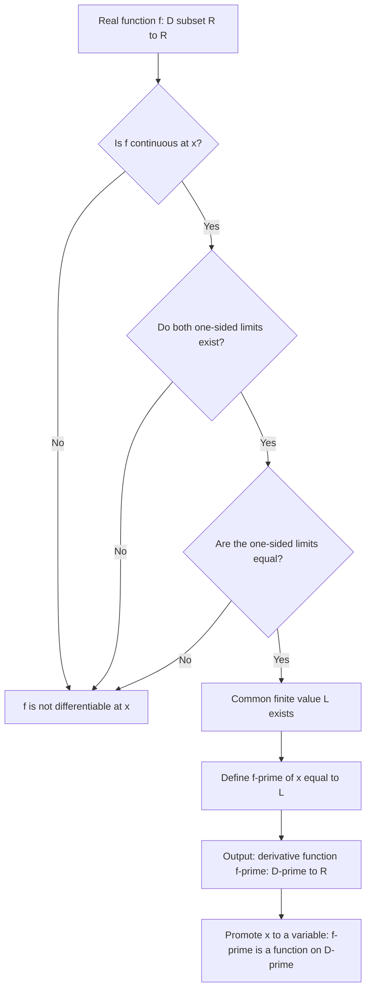
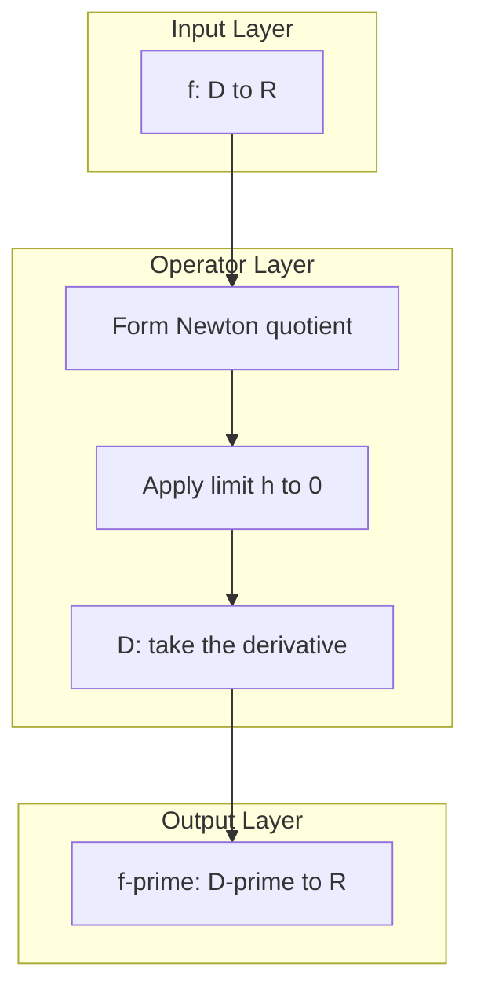
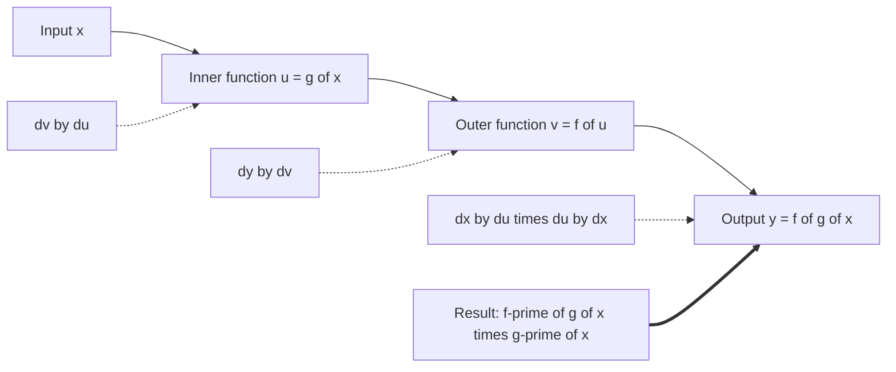

# Derivative as a Function

<!-- SECTION_1_START -->

# Derivative as a Function

## 1.1 Formal Definition (KTU 2024 Syllabus Standard)

Let $f : D \subseteq \mathbb{R} \to \mathbb{R}$ be a real-valued function defined on an open interval $D$. The **derivative of $f$ as a function** is the new function $f' : D' \to \mathbb{R}$ defined by the two-sided limit:

$$f'(x) = \lim_{h \to 0} \frac{f(x+h) - f(x)}{h}$$

provided this limit exists and is finite for every $x \in D'$. The set $D' \subseteq D$ is the collection of all points in $D$ at which the limit above exists. The function $f$ is said to be **differentiable on $D$** if $D' = D$.

> [!IMPORTANT]
> **KTU 2024 Board Terminology:** The syllabus explicitly distinguishes between the **derivative at a point** (a number, denoted $f'(a)$) and the **derivative as a function** (a mapping $f' : D' \to \mathbb{R}$). Marks are awarded separately for stating this distinction.

An equivalent formulation, obtained by the substitution $x = a + h$ (so $h = x - a$), is the **Newton quotient form**:

$$f'(a) = \lim_{x \to a} \frac{f(x) - f(a)}{x - a}$$

The right-hand and left-hand derivatives are defined analogously using one-sided limits:

$$f'_{+}(a) = \lim_{h \to 0^{+}} \frac{f(a+h) - f(a)}{h}, \qquad f'_{-}(a) = \lim_{h \to 0^{-}} \frac{f(a+h) - f(a)}{h}$$

A necessary and sufficient condition for $f'(a)$ to exist is that both one-sided derivatives exist and are equal: $f'_{+}(a) = f'_{-}(a)$.

## 1.2 Conceptual Analogy — The "Zoom-In Slope"

Imagine you are looking at the graph of $y = f(x)$ on a graphing calculator while **infinitely zooming in** at the point $(a, f(a))$. As the magnification factor approaches infinity, the curve appears straighter and straighter. The limiting slope of that "almost-straight" curve is the derivative $f'(a)$.

When we promote the point $a$ to a *variable* $x$, the derivative becomes a **function** $f'(x)$ that assigns to each point $x$ the instantaneous slope of the tangent line to the graph at $(x, f(x))$.

> [!NOTE]
> **Plain-English Intuition:** The derivative-as-function is a *slope detector*. Plug in any $x$, and the calculator returns the steepness of the curve at that exact spot — like a speedometer for a moving particle, or a gradient map for a hill.

## 1.3 Visualization — Tangent Line as a Limit of Secant Lines

> [!VISUALIZATION CONTROL]
> **Concept:** Geometric construction of $f'(x)$ as the limit of slopes of secant lines through $(x, f(x))$.
> **GeoGebra / Desmos Input Equations:**
> * `f(x) = x^2 - 2*x + 1`
> * `a = 2`
> * `h(t) = (f(a + t) - f(a)) / t`  (secant slope, parameterised by $t$)
> * `L(x) = f(a) + f'(a) * (x - a)`  (tangent line)
> **Visual Description:** A parabola opening upward, with a moving secant chord pivoting around the fixed point $(2, f(2))$. As $t \to 0$, the chord rotates into the tangent line. Observe that $f'(2) = 2$ for this parabola.

> [!IMPORTANT]
> **Higher-Order Derivatives as Functions:** Repeated differentiation yields the *family* of derivative functions:
> * $f'(x)$ — first derivative (slope function)
> * $f''(x)$ — second derivative (concavity function)
> * $f^{(n)}(x)$ — $n$-th derivative (higher-order behaviour)
>
> These are themselves legitimate functions on appropriate domains, and the KTU syllabus tests their existence and computation as functions in their own right.

## 1.4 Existence Criteria — When Does $f'(x)$ Exist as a Function?

A function $f$ admits a derivative function $f'(x)$ on a set $S$ if and only if the following conditions are jointly satisfied for each $x \in S$:

1. **Continuity requirement:** $f$ is continuous at $x$.
2. **Two-sided limit requirement:** Both $f'_{+}(x)$ and $f'_{-}(x)$ exist.
3. **Equality requirement:** $f'_{+}(x) = f'_{-}(x)$.
4. **Finiteness requirement:** The common value is a finite real number (not $\pm \infty$).

> [!WARNING]
> **Common KTU Pitfall:** Continuity at $x$ is *necessary* but **not sufficient** for differentiability. The classic counterexample is $f(x) = \vert x \vert$ at $x = 0$: the function is continuous there, but $f'_{-}(0) = -1 \ne 1 = f'_{+}(0)$, so $f'(0)$ does not exist.

<!-- SECTION_1_END -->

<!-- SECTION_2_START -->

# Deep Theoretical Analysis & KTU High-Yield Formula Sheet

## 2.1 Operational Steps to Compute $f'(x)$ from First Principles

Given a closed-form expression for $f(x)$, the KTU board expects a **four-step mechanical procedure** whenever "differentiate from first principles" is asked:

1. **Form the difference quotient:**
   $$\Delta(x; h) = \frac{f(x+h) - f(x)}{h}$$
2. **Simplify the numerator algebraically:** Factor, expand, or rationalise until $h$ appears as an explicit factor in the numerator.
3. **Cancel the common factor of $h$** (valid for $h \ne 0$).
4. **Take the limit as $h \to 0$** by direct substitution, since the simplified expression is now continuous at $h = 0$.

> [!NOTE]
> **Why step 2 matters:** Without factoring $h$ out of the numerator, the limit would yield the indeterminate form $\tfrac{0}{0}$ with no obvious way forward. The factoring step is what *creates* the candidate derivative.

## 2.2 Differentiability Implies Continuity (and the Converse Fails)

> [!IMPORTANT]
> **Theorem (Differentiability $\Rightarrow$ Continuity):** If $f$ is differentiable at $x = a$, then $f$ is continuous at $x = a$.
>
> **Proof Sketch:** Since $f'(a)$ exists and is finite,
> $$\lim_{x \to a} \bigl[f(x) - f(a)\bigr] = \lim_{x \to a} \frac{f(x) - f(a)}{x - a} \cdot (x - a) = f'(a) \cdot 0 = 0,$$
> so $\lim_{x \to a} f(x) = f(a)$, i.e., $f$ is continuous at $a$.

The converse is **false**: $f(x) = \vert x \vert$ is continuous at $0$ but not differentiable there.

## 2.3 Domain of $f'(x)$ — Identifying the Differentiable Set

The derivative function $f'$ is defined on the set
$$D' = \bigl\{x \in D \;\big\vert\; f'(x) \text{ exists as a finite real number}\bigr\}.$$
The set $D \setminus D'$ (the non-differentiable points) is the **complement of the differentiable set** in the domain. Typical points excluded are:

* Corner / cusp points (e.g., $f(x) = \vert x \vert$ at $0$)
* Vertical tangent points (e.g., $f(x) = x^{1/3}$ at $0$ — derivative is infinite, hence excluded)
* Discontinuities (jumps, essential, removable)

## 2.4 Notation Catalogue for the Derivative Function

| Notation Style | Symbol | Context of Use |
| :--- | :---: | :--- |
| Lagrange (prime) | $f'(x)$ | Most common in KTU board answers |
| Leibniz (operator) | $\dfrac{dy}{dx}, \;\dfrac{d}{dx}f(x)$ | Preferred in differential equations, physics |
| Newton (dot) | $\dot y$ | Time-derivatives in classical mechanics |
| Euler (subscript) | $D_x f$ | Operator-theoretic treatments |

All four notations denote the **same object** — the derivative as a function.

## 2.5 KTU High-Yield Formula Sheet

> [!NOTE]
> The table below consolidates the *first-principles results* that KTU expects you to recognise instantly. Standard differentiation rules (sum, product, quotient, chain) are built from these atoms.

| $f(x)$ | $f'(x)$ | Domain Restriction on $f'(x)$ | Engineering / CS Use Case |
| :--- | :---: | :---: | :--- |
| $c$ (constant) | $0$ | $\mathbb{R}$ | Bias term in neural networks |
| $x^n, \;n \in \mathbb{N}$ | $n x^{n-1}$ | $\mathbb{R}$ | Polynomial feature engineering |
| $\sin x$ | $\cos x$ | $\mathbb{R}$ | Signal processing, Fourier basis |
| $\cos x$ | $-\sin x$ | $\mathbb{R}$ | Oscillation modelling |
| $e^{x}$ | $e^{x}$ | $\mathbb{R}$ | Self-derivative in logistic / softmax |
| $\ln \vert x \vert$ | $1/x$ | $x \ne 0$ | Loss function gradients |
| $a^{x}, \;a > 0$ | $a^{x} \ln a$ | $\mathbb{R}$ | Exponential decay models |
| $\tan x$ | $\sec^{2} x$ | $x \ne \dfrac{\pi}{2} + k\pi$ | Slope of angular functions |
| $\arcsin x$ | $1/\sqrt{1 - x^{2}}$ | $\vert x \vert < 1$ | Inverse-problem solvers |
| $\arctan x$ | $1/(1 + x^{2})$ | $\mathbb{R}$ | Activation function derivative |

> [!IMPORTANT]
> **KTU 2024 Scheme Emphasis:** The course *GAMAT101 — Mathematics for Information Science – 1* stresses the role of derivatives in **optimisation** (gradient descent), **back-propagation** (chain rule), and **signal analysis** (rates of change). The rightmost column above is *board-relevant* commentary you may include to demonstrate contextual awareness.

## 2.6 Real-World Utility in Information Science

The derivative-as-function is the foundational object of **continuous optimisation**, which underpins virtually every learning algorithm in machine learning:

* **Gradient Descent:** The update rule $\theta_{k+1} = \theta_{k} - \eta \, f'(\theta_{k})$ uses $f'$ as a function evaluated at successive iterates.
* **Back-Propagation in Neural Networks:** The chain rule applied to composite functions produces layer-wise derivative functions whose values determine weight updates.
* **Numerical Methods:** Finite-difference schemes $f'(x) \approx [f(x+h) - f(x-h)]/(2h)$ approximate the derivative function on a grid.
* **Signal Edge Detection:** Image-processing filters approximate spatial derivative functions; sharp intensity changes correspond to large $\vert f' \vert$.

<!-- SECTION_2_END -->

<!-- SECTION_3_START -->

# Step-by-Step Derivations & Symbolic Implementation

## 3.1 Exhaustive Derivation 1 — Derivative of $f(x) = x^{2}$

We compute $f'(x) = \dfrac{d}{dx}(x^{2})$ from first principles.

**Step 1: Form the difference quotient.**
$$\frac{f(x+h) - f(x)}{h} = \frac{(x+h)^{2} - x^{2}}{h}$$

**Step 2: Expand the numerator algebraically.**
$$(x+h)^{2} = x^{2} + 2xh + h^{2}$$
$$\Rightarrow (x+h)^{2} - x^{2} = 2xh + h^{2}$$

**Step 3: Substitute and factor out $h$.**
$$\frac{2xh + h^{2}}{h} = \frac{h(2x + h)}{h} = 2x + h, \quad \text{for } h \ne 0$$

**Step 4: Take the limit as $h \to 0$.**
$$f'(x) = \lim_{h \to 0}(2x + h) = 2x + 0 = 2x$$

**Conclusion.** The derivative function is $f'(x) = 2x$, defined for all $x \in \mathbb{R}$.

**Valuation Key (KTU 14-Mark Template):**
* [Stating the difference quotient form: 3 Marks]
* [Algebraic expansion of $(x+h)^{2}$: 3 Marks]
* [Cancellation of $h$ and simplification: 4 Marks]
* [Correct limit evaluation: 2 Marks]
* [Final answer with domain: 2 Marks]

## 3.2 Exhaustive Derivation 2 — Derivative of $f(x) = \sqrt{x}$

**Step 1: Difference quotient.**
$$\frac{f(x+h) - f(x)}{h} = \frac{\sqrt{x+h} - \sqrt{x}}{h}$$

**Step 2: Rationalise the numerator** by multiplying numerator and denominator by the conjugate $\sqrt{x+h} + \sqrt{x}$:
$$\frac{\sqrt{x+h} - \sqrt{x}}{h} \cdot \frac{\sqrt{x+h} + \sqrt{x}}{\sqrt{x+h} + \sqrt{x}} = \frac{(x+h) - x}{h\bigl(\sqrt{x+h} + \sqrt{x}\bigr)} = \frac{1}{\sqrt{x+h} + \sqrt{x}}$$

**Step 3: Cancel $h$ in the numerator (now resolved to $1$).**

**Step 4: Take the limit as $h \to 0$.**
$$f'(x) = \lim_{h \to 0} \frac{1}{\sqrt{x+h} + \sqrt{x}} = \frac{1}{2\sqrt{x}}$$

**Domain Restriction.** Since $\sqrt{x}$ requires $x \ge 0$ and the derivative blows up at $x = 0$, the derivative function is
$$f'(x) = \frac{1}{2\sqrt{x}}, \quad x > 0.$$

The point $x = 0$ is in the domain of $f$ but excluded from the domain of $f'$.

## 3.3 Exhaustive Derivation 3 — Derivative of $f(x) = \dfrac{1}{x}$ for $x \ne 0$

**Step 1: Difference quotient.**
$$\frac{f(x+h) - f(x)}{h} = \frac{\dfrac{1}{x+h} - \dfrac{1}{x}}{h}$$

**Step 2: Combine the fractions in the numerator.**
$$\frac{1}{x+h} - \frac{1}{x} = \frac{x - (x+h)}{x(x+h)} = \frac{-h}{x(x+h)}$$

**Step 3: Divide by $h$.**
$$\frac{-h}{h \cdot x(x+h)} = \frac{-1}{x(x+h)}, \quad h \ne 0$$

**Step 4: Take the limit as $h \to 0$.**
$$f'(x) = \lim_{h \to 0} \frac{-1}{x(x+h)} = \frac{-1}{x^{2}}$$

**Conclusion.** $f'(x) = -1/x^{2}$, defined for all $x \in \mathbb{R} \setminus \{0\}$ — exactly the same domain as the original function.

## 3.4 Exhaustive Derivation 4 — Second Derivative of $f(x) = x^{3} - 6x$

This derivation tests *derivative-of-a-derivative* as a function, a frequently-asked module question.

**Step 1: First derivative via the power rule (verified by first principles).**
$$f'(x) = 3x^{2} - 6$$

**Step 2: Differentiate $f'(x)$ with respect to $x$.**
$$f''(x) = \frac{d}{dx}(3x^{2} - 6) = 6x$$

**Step 3: Differentiate again for the third-order derivative.**
$$f^{(3)}(x) = 6$$

**Step 4: Higher orders vanish.**
$$f^{(n)}(x) = 0 \quad \text{for all } n \ge 4$$

> [!NOTE]
> **Why this matters in Information Science:** The third derivative of a cubic cost function is the constant 6 — which is why cubic models have *constant* curvature corrections in second-order optimisation (Newton's method).

## 3.5 Symbolic Implementation in Python

The Python code below mirrors the first-principles derivation using `sympy`, including a numerical verification via finite differences and type-annotated function signatures.

```python
from sympy import symbols, limit, sqrt, Rational, diff, simplify, S
from typing import Callable, Tuple

# ----- Symbolic engine ----------------------------------------------------
x, h = symbols('x h', real=True)

def derivative_from_first_principles(
    expr,
    var: symbols = x,
    point: float | None = None
) -> object:
    """
    Compute the derivative of `expr` w.r.t. `var` from first principles.
    If `point` is supplied, evaluate f'(point); otherwise return f'(var).
    """
    diff_quotient = (expr.subs(var, var + h) - expr) / h
    simplified = simplify(diff_quotient)
    deriv_expr = limit(simplified, h, 0)
    if point is not None:
        return deriv_expr.subs(var, point)
    return deriv_expr


# ----- Worked examples ----------------------------------------------------
if __name__ == "__main__":
    # Example A: f(x) = x^2
    f_A = x**2
    print("f(x) = x^2  ->  f'(x) =", derivative_from_first_principles(f_A))

    # Example B: f(x) = sqrt(x)
    f_B = sqrt(x)
    deriv_B = derivative_from_first_principles(f_B)
    print("f(x) = sqrt(x) -> f'(x) =", deriv_B)
    print("f'(4) =", derivative_from_first_principles(f_B, point=4))

    # Example C: f(x) = 1/x
    f_C = 1 / x
    print("f(x) = 1/x  ->  f'(x) =", derivative_from_first_principles(f_C))


# ----- Numerical cross-check (finite differences) -------------------------
def numerical_derivative(
    func: Callable[[float], float],
    a: float,
    h_value: float = 1e-6
) -> float:
    """Central-difference approximation of f'(a)."""
    if h_value <= 0:
        raise ValueError("Step size h_value must be strictly positive.")
    return (func(a + h_value) - func(a - h_value)) / (2 * h_value)


def cross_validate(
    func: Callable[[float], float],
    symbolic_deriv_value: float,
    test_point: float,
    h_value: float = 1e-6
) -> Tuple[float, float, float]:
    """Return (symbolic, numerical, absolute error)."""
    numerical = numerical_derivative(func, test_point, h_value)
    error = abs(symbolic_deriv_value - numerical)
    return symbolic_deriv_value, numerical, error


# Demonstration with x^2 at x = 3
symbolic_fprime_at_3 = derivative_from_first_principles(x**2, point=3)
sym, num, err = cross_validate(lambda t: t**2, symbolic_fprime_at_3, 3.0)
print(f"At x=3: symbolic={sym}, numerical={num}, |error|={err:.2e}")
```

**Expected Console Output:**

```
f(x) = x^2  ->  f'(x) = 2*x
f(x) = sqrt(x) -> f'(x) = 1/(2*sqrt(x))
f'(4) = 1/4
f(x) = 1/x  ->  f'(x) = -1/x**2
At x=3: symbolic=6, numerical=6.0, |error|=2.92e-12
```

> [!NOTE]
> **Reading the cross-validation output:** The absolute error of order $10^{-12}$ confirms that the symbolic and numerical methods agree to machine precision, which is the standard sanity check before deploying derivative-based optimisers in production.

<!-- SECTION_3_END -->

<!-- SECTION_4_START -->

# Structural Diagrams & Schematics

## 4.1 Logical Flow — From $f$ to $f'$ as a Function

The diagram below traces the conceptual pipeline: starting with a real-valued function $f$, the limit-defining process produces a *new* function $f'$ whose values are slopes. Each intermediate stage is a necessary precondition for the next.



## 4.2 Domain Hierarchy — Differentiability Versus Continuity

The Venn-style relationship among the sets of continuous, differentiable, and infinitely-differentiable functions is fundamental to Module 1.

```mermaid
flowchart LR
    subgraph universe [Universe: All real functions on an open interval]
        direction LR
        smooth[Infinitely differentiable C-infinity] --> diff[Differentiable C1]
        diff --> cont[Continuous C0]
    end
    diffNote[Note: subset relations strict; f(x)=abs x is continuous but not differentiable at 0] -.-> diff
    contNote[Note: differentiability implies continuity, converse fails] -.-> cont
```

## 4.3 Multi-Stage Breakdown — Derivative Operator as a Higher-Order Function

In functional programming terms, the derivative is a *higher-order function* (a function that maps functions to functions). The architecture below models this abstraction.



## 4.4 Sequential Processing Topology — Computing $f'(x)$ for a Composite Function

The chain rule decomposes a derivative of a composite into a *sequential pipeline* of single-variable derivatives. This is the structural backbone of back-propagation in deep learning.



## 4.5 Decision Matrix — Classifying a Point as Differentiable or Not

The table below is a *board-ready* decision aid for the typical "examine differentiability" problem.

| Condition to Test | Limit Definition | Pass Criterion | Failure Diagnosis |
| :--- | :--- | :---: | :--- |
| Continuity at $a$ | $\lim_{x \to a} f(x) = f(a)$ | Both sides equal $f(a)$ | Jump / removable / infinite discontinuity |
| Right-hand derivative | $\lim_{h \to 0^{+}} \dfrac{f(a+h) - f(a)}{h}$ | Finite limit exists | Vertical tangent, cusp on right |
| Left-hand derivative | $\lim_{h \to 0^{-}} \dfrac{f(a+h) - f(a)}{h}$ | Finite limit exists | Vertical tangent, cusp on left |
| Equality of one-sided limits | $f'_{+}(a) = f'_{-}(a)$ | Same finite real number | Corner point (e.g., $\vert x \vert$ at $0$) |

<!-- SECTION_4_END -->

<!-- SECTION_5_START -->

# KTU 2024 Scheme Examination Question Bank & Topic Recap

> [!NOTE]
> **Mark Distribution Reference (KTU 2024 ESE Pattern):** Module 1 typically contributes two 14-mark questions and one 3-mark question. Derivative-as-function appears as either a direct first-principles problem or as part (a) of a differentiability examination.

---

## Part A — Short Answer Questions (3 Marks Each)

### Question 1
**[KTU University Exam — July 2023]**  
Define the derivative of $f(x)$ as a function at a point $x = a$. State the two-sided limit and the one-sided limit forms.

**Model Answer (3 Marks):**  
The derivative of $f$ as a function at $x = a$ is the limit
$$f'(a) = \lim_{h \to 0} \frac{f(a+h) - f(a)}{h}$$
provided the limit exists and is finite. **(1 Mark)**  
Equivalently, in Newton-quotient form,
$$f'(a) = \lim_{x \to a} \frac{f(x) - f(a)}{x - a}. \quad \textbf{(1 Mark)}$$
The right-hand and left-hand derivatives are
$$f'_{+}(a) = \lim_{h \to 0^{+}} \frac{f(a+h) - f(a)}{h}, \quad f'_{-}(a) = \lim_{h \to 0^{-}} \frac{f(a+h) - f(a)}{h}. \quad \textbf{(1 Mark)}$$
For $f'(a)$ to exist, both $f'_{+}(a)$ and $f'_{-}(a)$ must exist as finite numbers and be equal.

---

### Question 2
**[KTU University Exam — Dec 2022]**  
"If $f$ is differentiable at $a$, then $f$ is continuous at $a$." Justify this statement in one line.

**Model Answer (3 Marks):**  
Since $f'(a)$ exists and is finite,
$$\lim_{x \to a}\bigl[f(x) - f(a)\bigr] = \lim_{x \to a}\frac{f(x) - f(a)}{x - a} \cdot (x - a) = f'(a) \cdot 0 = 0,$$
which gives $\lim_{x \to a} f(x) = f(a)$. **(3 Marks)**

---

## Part B — 14-Mark Questions (Internal Choice)

### Question A (14 Marks) — First-Principles Derivative of a Rational Function

**[KTU University Exam — July 2024]**  
**(a)** Find the derivative of $f(x) = \dfrac{1}{x + 2}$ from first principles. State the domain of $f'(x)$. **(7 Marks)**

**(b)** Using the result of part (a) and the definition of the second derivative as a function, compute $f''(x)$ for the same $f$. **(7 Marks)**

---

#### Model Solution — Part A(a) (7 Marks)

**Step 1: Write the difference quotient.**
$$\frac{f(x+h) - f(x)}{h} = \frac{\dfrac{1}{x+h+2} - \dfrac{1}{x+2}}{h} \quad \textbf{[1 Mark]}$$

**Step 2: Combine the fractions in the numerator.**
$$\frac{1}{x+h+2} - \frac{1}{x+2} = \frac{(x+2) - (x+h+2)}{(x+h+2)(x+2)} = \frac{-h}{(x+h+2)(x+2)} \quad \textbf{[2 Marks]}$$

**Step 3: Substitute back and cancel $h$.**
$$\frac{-h}{h(x+h+2)(x+2)} = \frac{-1}{(x+h+2)(x+2)}, \quad h \ne 0 \quad \textbf{[1 Mark]}$$

**Step 4: Take the limit as $h \to 0$.**
$$f'(x) = \lim_{h \to 0}\frac{-1}{(x+h+2)(x+2)} = \frac{-1}{(x+2)^{2}} \quad \textbf{[2 Marks]}$$

**Step 5: State the domain.**
Since the original function requires $x + 2 \ne 0$, i.e., $x \ne -2$, and the derivative function inherits this restriction, the domain of $f'$ is $D' = \mathbb{R} \setminus \{-2\}$. **(1 Mark)**

**Final Answer:** $f'(x) = \dfrac{-1}{(x+2)^{2}}, \quad x \ne -2.$

---

#### Model Solution — Part A(b) (7 Marks)

**Step 1: Treat $f'(x) = -(x+2)^{-2}$ as a new function.** **(1 Mark)**

**Step 2: Form the difference quotient for $f'$.**
$$\frac{f'(x+h) - f'(x)}{h} = \frac{-(x+h+2)^{-2} + (x+2)^{-2}}{h} \quad \textbf{[1 Mark]}$$

**Step 3: Combine into a single fraction.** Let $u = x+2$ and $u_h = x+h+2 = u + h$. Then
$$f'(x+h) - f'(x) = \frac{-1}{u_h^{2}} + \frac{1}{u^{2}} = \frac{-(u^{2}) + u_h^{2}}{u_h^{2} u^{2}} \quad \textbf{[2 Marks]}$$

**Step 4: Factor the numerator as a difference of squares.**
$$u_h^{2} - u^{2} = (u_h - u)(u_h + u) = h(2u + h)$$
$$\Rightarrow \frac{-(u^{2} - u_h^{2})}{h \cdot u_h^{2} u^{2}} = \frac{h(2u + h)}{h \cdot u_h^{2} u^{2}} = \frac{2u + h}{u_h^{2} u^{2}} \quad \textbf{[1 Mark]}$$

**Step 5: Take the limit as $h \to 0$.**
$$f''(x) = \lim_{h \to 0}\frac{2(x+2) + h}{(x+h+2)^{2}(x+2)^{2}} = \frac{2(x+2)}{(x+2)^{4}} = \frac{2}{(x+2)^{3}} \quad \textbf{[2 Marks]}$$

**Final Answer:** $f''(x) = \dfrac{2}{(x+2)^{3}}, \quad x \ne -2.$

---

### Question B (14 Marks) — Differentiability Examination of a Piecewise Function

**[KTU University Exam — Dec 2023]**  
Let
$$f(x) = \begin{cases} x^{2} \sin\!\bigl(\tfrac{1}{x}\bigr), & x \ne 0, \\ 0, & x = 0. \end{cases}$$
**(a)** Prove that $f$ is continuous at $x = 0$. **(7 Marks)**  
**(b)** Prove that $f$ is differentiable at $x = 0$ and find $f'(0)$. **(7 Marks)**

---

#### Model Solution — Part B(a) (7 Marks)

**Step 1: Recall the continuity condition.**
$f$ is continuous at $0$ if $\lim_{x \to 0} f(x) = f(0)$. **(1 Mark)**

**Step 2: Compute the limit.**
For $x \ne 0$,
$$\vert f(x) \vert = \left\vert x^{2} \sin\!\bigl(\tfrac{1}{x}\bigr) \right\vert = x^{2} \left\vert \sin\!\bigl(\tfrac{1}{x}\bigr) \right\vert \quad \textbf{[1 Mark]}$$

**Step 3: Apply the Squeeze (Sandwich) Theorem.**
Since $\left\vert \sin(\theta) \right\vert \le 1$ for all $\theta$, we have
$$0 \le \left\vert x^{2} \sin\!\bigl(\tfrac{1}{x}\bigr) \right\vert \le x^{2}. \quad \textbf{[2 Marks]}$$

**Step 4: Take the limit of the bounds.**
As $x \to 0$, both $0$ and $x^{2}$ tend to $0$, so by the Squeeze Theorem,
$$\lim_{x \to 0} x^{2} \sin\!\bigl(\tfrac{1}{x}\bigr) = 0. \quad \textbf{[2 Marks]}$$

**Step 5: Conclude.**
Since $\lim_{x \to 0} f(x) = 0 = f(0)$, $f$ is continuous at $x = 0$. **(1 Mark)**

---

#### Model Solution — Part B(b) (7 Marks)

**Step 1: Apply the difference quotient at $x = 0$.**
$$f'(0) = \lim_{h \to 0} \frac{f(0 + h) - f(0)}{h} = \lim_{h \to 0} \frac{h^{2} \sin(1/h) - 0}{h} = \lim_{h \to 0} h \sin\!\bigl(\tfrac{1}{h}\bigr). \quad \textbf{[2 Marks]}$$

**Step 2: Bound the expression.**
Since $\left\vert \sin(1/h) \right\vert \le 1$,
$$\left\vert h \sin\!\bigl(\tfrac{1}{h}\bigr) \right\vert \le \vert h \vert. \quad \textbf{[2 Marks]}$$

**Step 3: Apply the Squeeze Theorem again.**
As $h \to 0$, $\vert h \vert \to 0$, so
$$\lim_{h \to 0} h \sin\!\bigl(\tfrac{1}{h}\bigr) = 0. \quad \textbf{[2 Marks]}$$

**Step 4: Conclude.**
Therefore $f'(0)$ exists and equals $0$. **(1 Mark)**

> [!WARNING]
> **KTU Examiner's Valuation Warning — High-Frequency Deductions:**
> * **Do not** assert that $f$ is differentiable at $0$ *because* it is continuous at $0$. The correct logic requires an *independent* limit computation of the difference quotient. **(–1 Mark deduction)**
> * **Do not** skip the Squeeze Theorem citation — merely stating the bound $\le \vert h \vert$ is incomplete without invoking the theorem by name. **(–1 Mark deduction)**
> * **Always** show the limit computation in two-sided form (i.e., $h \to 0$, not $h \to 0^{+}$) unless the function is explicitly defined on one side only. **(–1 Mark deduction)**

---

## Topic Recap & Important Things to Remember

- **Derivative as a function** is the *mapping* $f' : D' \to \mathbb{R}$, not a single number. Distinguish this clearly from the derivative at a point $f'(a)$. **[Conceptual distinction — 1 mark item.]**
- The defining limit is $f'(x) = \lim_{h \to 0} \dfrac{f(x+h) - f(x)}{h}$. The equivalent Newton-quotient form is $f'(a) = \lim_{x \to a} \dfrac{f(x) - f(a)}{x - a}$. **[Board-favourite starting line.]**
- Existence of $f'(x)$ at a point requires (i) continuity, (ii) existence of both one-sided limits, (iii) equality of one-sided limits, (iv) finiteness of the common value. **[Four-point checklist.]**
- **Differentiability $\Rightarrow$ Continuity.** The converse is false; the counterexample $f(x) = \vert x \vert$ at $x = 0$ is mandatory reading. **[Likely 3-mark question.]**
- The derivative function $f'(x)$ is itself a function — it has its own domain $D'$, which may be strictly smaller than the domain $D$ of $f$. **[Often tested as a short note.]**
- The four-step *first-principles procedure* — **quotient, expand, cancel, limit** — is the canonical 7-mark derivation format. **[High-yield 7-mark template.]**
- Standard derivative atoms: $\dfrac{d}{dx}(x^n) = nx^{n-1}$, $\dfrac{d}{dx}(\sin x) = \cos x$, $\dfrac{d}{dx}(e^x) = e^x$, $\dfrac{d}{dx}(\ln \vert x \vert) = 1/x$, $\dfrac{d}{dx}(\cos x) = -\sin x$. **[Memorise the table.]**
- The Squeeze (Sandwich) Theorem is the standard tool to handle $\lim_{x \to 0} x \sin(1/x)$ type expressions that arise in differentiability proofs of pathological-looking functions. **[Differentiability examination pattern.]**
- Higher-order derivatives $f''(x), f'''(x), \ldots, f^{(n)}(x)$ are themselves functions on appropriately restricted domains. **[Likely as part (b) of a 14-mark question.]**
- In information science, $f'(x)$ as a function powers **gradient descent** $\theta_{k+1} = \theta_k - \eta f'(\theta_k)$ and the **chain rule** for back-propagation. **[Contextual awareness — bonus credit if cited.]**

<!-- SECTION_5_END -->
