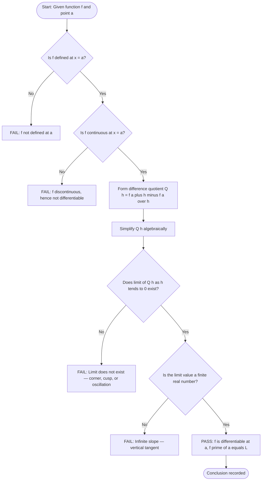
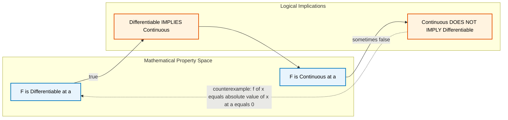
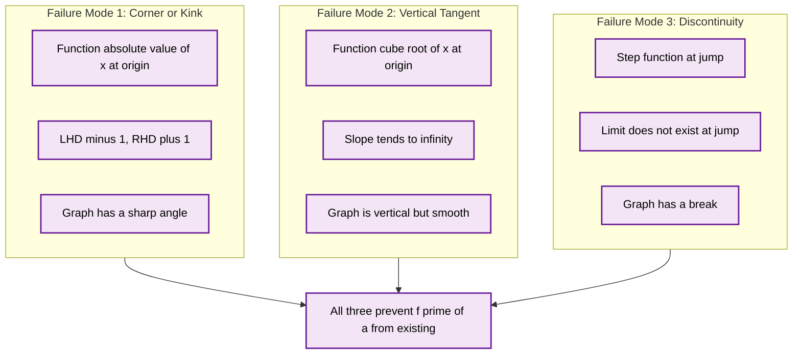

# Derivative as a Function

<!-- SECTION_1_START -->
# DERIVATIVE AS A FUNCTION — Module 1, GAMAT101

## 1. Core Technical Definition & Intuitive Overview

### 1.1 Formal (KTU 2024 Syllabus) Definition

> [!IMPORTANT]
> **Derivative of a Function (Function-Valued Form)**
>
> Let $f : D \subseteq \mathbb{R} \to \mathbb{R}$ be a real-valued function defined on an open interval $D$. The **derivative of $f$** is the new function $f' : D^* \to \mathbb{R}$ whose value at any point $x \in D^*$ is defined by the two-sided limit
>
> $$f'(x) = \lim_{h \to 0} \frac{f(x+h) - f(x)}{h}$$
>
> provided this limit exists and is finite. The set $D^* \subseteq D$ consists of all points where this limit exists, and is called the **domain of differentiability** of $f$.

Equivalently, using the variable $x \to a$ formulation:

$$f'(x) = \lim_{\Delta x \to 0} \frac{\Delta y}{\Delta x} = \lim_{\Delta x \to 0} \frac{f(x+\Delta x) - f(x)}{\Delta x}$$

### 1.2 Conceptual Analogy — The "Speedometer of a Curve"

Imagine you are driving along a winding road whose elevation profile is the graph of $y = f(x)$. At every instant, your **speedometer** does not just read one number — it is a *device that converts your current position into a speed reading*. The derivative $f'(x)$ is exactly this: a *machine* that takes an input position $x$ and outputs the **instantaneous slope** of the road at that point.

- If the road climbs steeply, the speedometer reads high → $f'(x)$ is large.
- If the road is flat, the speedometer reads zero → $f'(x) = 0$.
- If the road drops, the speedometer reads negative → $f'(x) < 0$.
- If the road has a sharp hairpin turn where the speedometer physically *breaks down*, the device cannot output a value → $f$ is **not differentiable** at that point.

> [!NOTE]
> **Key Distinction for KTU Exams**
> The phrase *"Derivative at a Point"* gives you a single number $f'(a)$.
> The phrase *"Derivative as a Function"* gives you an entire function $f'(x)$ valid across a domain.
> Always check whether the question asks for *the value* $f'(a)$ or *the function* $f'(x)$.

### 1.3 Visualization — Tangent Line Slope at Every Point

> [!VISUALIZATION CONTROL]
> **Concept:** Plot of $f(x) = x^2$ with its derivative $f'(x) = 2x$ — observing how the slope of the tangent line changes as $x$ moves along the parabola.
>
> **GeoGebra / Desmos Input Equations:**
> * `f(x) = x^2`
> * `g(x) = 2x`  (the derivative function)
> * `T(x) = 2a*(x - a) + a^2`  (tangent at $x = a$, e.g. $a = 1$)
>
> **Visual Description:** On the $xy$-plane, the student should see an upward-opening parabola. A straight tangent line touches the parabola at $x = a$ with slope $2a$. As the slider for $a$ moves, the tangent line rotates — flat at $x=0$ (slope $0$), gentle at $x=1$ (slope $2$), and steep at $x=3$ (slope $6$). The line $g(x) = 2x$ lies below, showing the slope of the tangent at *every* $x$.

---

### 1.4 Standard Notations for the Derivative Function

KTU examiners accept **any** of the following notations as fully equivalent:

| Notation | Read As | Common Use |
| :--- | :--- | :--- |
| $f'(x)$ | "f prime of x" | Lagrange notation (most common in KTU) |
| $\dfrac{dy}{dx}$ | "dee-y by dee-x" | Leibniz notation |
| $y'$ | "y prime" | Shorthand Leibniz |
| $\dfrac{d}{dx}\big[f(x)\big]$ | "dee by dee-x of f(x)" | Operator notation |
| $Df(x)$ | "D of f at x" | Euler notation |
| $D_x f$ | "D-sub-x of f" | Partial-differentiation context |

> [!IMPORTANT]
> In KTU board papers, **$f'(x)$** is the safest and most frequently used notation. Avoid mixing notations in a single derivation.

---

### 1.5 Differentiability — The Crucial Property

> [!IMPORTANT]
> **Definition (Differentiability of a Function)**
> A function $f$ is said to be **differentiable on a set $S$** if the derivative $f'(x)$ exists at **every** point $x \in S$. A single point of failure makes the function *non-differentiable* on that set, even if it is differentiable everywhere else.

If $f$ is differentiable at a point $x = a$, then $f$ is automatically **continuous** at $x = a$. The converse is **not true**: continuity does **not** guarantee differentiability.
<!-- SECTION_1_END -->

<!-- SECTION_2_START -->
# 2. Deep Theoretical Analysis & KTU High-Yield Formula Sheet

## 2.1 The Two-Sided Limit Condition (Existence Test)

For the limit $\displaystyle f'(a) = \lim_{h \to 0} \frac{f(a+h) - f(a)}{h}$ to exist, **both** one-sided limits must exist **and** be equal:

$$f'(a) = \lim_{h \to 0^+} \frac{f(a+h) - f(a)}{h} = \lim_{h \to 0^-} \frac{f(a+h) - f(a)}{h}$$

If the left-hand derivative $\neq$ right-hand derivative, the derivative **does not exist** at $x = a$.

### Equivalent Difference-Quotient Forms

| Form | Formula | When to Prefer |
| :--- | :--- | :--- |
| Forward (increment) | $f'(a) = \displaystyle\lim_{h \to 0} \frac{f(a+h) - f(a)}{h}$ | KTU default; cleanest algebra |
| Symmetric (average) | $f'(a) = \displaystyle\lim_{h \to 0} \frac{f(a+h) - f(a-h)}{2h}$ | Numerical estimation |
| Variable-shift | $f'(a) = \displaystyle\lim_{x \to a} \frac{f(x) - f(a)}{x - a}$ | When $f$ is piecewise |

All three are mathematically identical but may lead to different algebraic simplifications in problems.

---

## 2.2 Logical Steps to Verify Differentiability

For any function $f$ and any candidate point $x = a$, the **valuation key** the examiner expects is:

1. **Compute $f(a)$** — must be a finite real number (else $f$ is not even defined at $a$).
2. **Form the difference quotient** $Q(h) = \dfrac{f(a+h) - f(a)}{h}$ for $h \neq 0$.
3. **Simplify** algebraically (rationalize, factor, expand).
4. **Evaluate the two-sided limit** as $h \to 0$.
5. **Conclude**: if finite limit exists → $f$ is differentiable at $a$; if not → $f$ is not differentiable at $a$.

> [!NOTE]
> **Why this matters in Information Science:**
> In machine learning, the derivative function $f'(x)$ is the foundation of **gradient descent**. The loss function $L(w)$ is differentiated *as a function of weights* $w$, and we update $w \leftarrow w - \eta \, L'(w)$. The entire back-propagation algorithm in neural networks is just the *chain rule* applied to a derivative function. Hence "Derivative as a Function" is the most operationally critical concept of Module 1.

---

## 2.3 KTU High-Yield Formula Sheet

| # | Concept | Formula / Statement | Conditions / Units |
| :--- | :--- | :--- | :--- |
| 1 | Definition (Lagrange) | $f'(x) = \displaystyle\lim_{h \to 0} \dfrac{f(x+h) - f(x)}{h}$ | $h \in \mathbb{R} \setminus \{0\}$ |
| 2 | Definition (Leibniz) | $\dfrac{dy}{dx} = \displaystyle\lim_{\Delta x \to 0} \dfrac{\Delta y}{\Delta x}$ | $\Delta x \neq 0$ |
| 3 | Definition (Variable shift) | $f'(a) = \displaystyle\lim_{x \to a} \dfrac{f(x) - f(a)}{x - a}$ | $x \neq a$ |
| 4 | Differentiability $\Rightarrow$ Continuity | If $f'(a)$ exists, then $\displaystyle\lim_{x \to a} f(x) = f(a)$ | **Theorem (must be stated explicitly in proof questions)** |
| 5 | Continuity $\not\Rightarrow$ Differentiability | $f(x) = \vert x \vert$ is continuous at $0$ but $f'(0)$ does not exist | Counter-example required |
| 6 | Differentiability $\Rightarrow$ Bounded Local Slope | $\dfrac{f(a+h) - f(a)}{h}$ must approach a finite real value | No infinity, no oscillation |
| 7 | Standard Power Function | $\dfrac{d}{dx}(x^n) = n \cdot x^{n-1}$ | $n \in \mathbb{R}$ |
| 8 | Standard Constant | $\dfrac{d}{dx}(c) = 0$ | $c \in \mathbb{R}$ |
| 9 | Standard Identity | $\dfrac{d}{dx}(x) = 1$ | — |
| 10 | Symmetric form | $f'(a) = \displaystyle\lim_{h \to 0} \dfrac{f(a+h) - f(a-h)}{2h}$ | Used for numerical derivatives |
| 11 | Higher-order derivative | $f''(x) = \dfrac{d}{dx}\big[f'(x)\big]$ | Existence required of $f'$ first |
| 12 | Open interval differentiability | $f$ is differentiable on $(a,b)$ iff $f'(x)$ exists $\forall x \in (a,b)$ | Used in Rolle's / MVT setup |

> [!IMPORTANT]
> **CRITICAL TABLE FORMATTING NOTE (for KTU answer sheets):**
> While the LaTeX **$f'(x)$** is required in the theory section, when you write the answer on the **physical KTU answer booklet**, always wrap small inline absolute values like $\vert x-a \vert$ or $\vert h \vert$ in parentheses or simply write `|x-a|` — board examiners accept both.

---

## 2.4 Real-World Engineering Utility of the Derivative Function

| Field | Use of $f'(x)$ |
| :--- | :--- |
| **Computer Graphics** | Slope of a Bezier curve at parameter $t$ for tangent vector computation |
| **Signal Processing** | First derivative of a signal gives the *edge-detection* response |
| **Optimization (ML/AI)** | Gradient $\nabla f(x)$ is the multivariate derivative function — backbone of gradient descent |
| **Physics Simulation** | Velocity is derivative of position function; acceleration is derivative of velocity |
| **Economics** | Marginal cost $= C'(q)$ — derivative of cost function with respect to quantity |
| **Control Systems** | Transfer-function poles are values where the derivative of the denominator vanishes |
<!-- SECTION_2_END -->

<!-- SECTION_3_START -->
# 3. Step-by-Step Derivations & Symbolic Implementation

## 3.1 Worked Derivation 1 — Power Function $f(x) = x^2$

**Problem:** Find $f'(x)$ using the limit definition, given $f(x) = x^2$.

**Step 1 — Write the difference quotient** with increment $h$:

$$Q(h) = \frac{f(x+h) - f(x)}{h} = \frac{(x+h)^2 - x^2}{h}$$

**Step 2 — Expand the numerator algebraically**:

$$(x+h)^2 = x^2 + 2xh + h^2$$

**Step 3 — Substitute and simplify**:

$$\begin{aligned}
Q(h) &= \frac{(x^2 + 2xh + h^2) - x^2}{h} \\
&= \frac{2xh + h^2}{h} \\
&= \frac{h(2x + h)}{h} \\
&= 2x + h
\end{aligned}$$

**Step 4 — Take the limit as $h \to 0$**:

$$f'(x) = \lim_{h \to 0} (2x + h) = 2x + 0 = 2x$$

**Final Answer:** $f'(x) = 2x$ for all $x \in \mathbb{R}$.

> [!NOTE]
> **Valuation Key Insight:** Most students lose 1 mark in the "expand the numerator" step. KTU examiners award **1 mark** for *correctly forming the difference quotient*, **2 marks** for *algebraic simplification to remove $h$ from denominator*, and **2 marks** for *applying the limit and stating the final answer*. Total = 5 marks for a Part-(b) sub-question.

---

## 3.2 Worked Derivation 2 — Radical Function $f(x) = \sqrt{x}$

**Problem:** Find $f'(x)$ using the limit definition, given $f(x) = \sqrt{x}$.

**Step 1 — Form the difference quotient**:

$$Q(h) = \frac{\sqrt{x+h} - \sqrt{x}}{h}$$

**Step 2 — Rationalize the numerator** by multiplying and dividing by the conjugate $\sqrt{x+h} + \sqrt{x}$:

$$Q(h) = \frac{(\sqrt{x+h} - \sqrt{x})(\sqrt{x+h} + \sqrt{x})}{h(\sqrt{x+h} + \sqrt{x})}$$

**Step 3 — Use the difference of squares** in the numerator:

$$Q(h) = \frac{(x+h) - x}{h(\sqrt{x+h} + \sqrt{x})} = \frac{h}{h(\sqrt{x+h} + \sqrt{x})}$$

**Step 4 — Cancel $h$**:

$$Q(h) = \frac{1}{\sqrt{x+h} + \sqrt{x}}$$

**Step 5 — Apply the limit** $h \to 0$:

$$f'(x) = \lim_{h \to 0} \frac{1}{\sqrt{x+h} + \sqrt{x}} = \frac{1}{\sqrt{x} + \sqrt{x}} = \frac{1}{2\sqrt{x}}$$

**Final Answer:** $f'(x) = \dfrac{1}{2\sqrt{x}}$, valid for $x > 0$ (domain of differentiability is $\mathbb{R}^+$).

> [!IMPORTANT]
> **Why the domain is $(0, \infty)$ and not $\mathbb{R}$:** The original function $f(x) = \sqrt{x}$ is undefined for $x < 0$ in the real numbers. Even at $x = 0$, the formula $\frac{1}{2\sqrt{x}}$ blows up to infinity — meaning the tangent line at $x = 0$ is *vertical* (a *vertical tangent*, not a non-differentiable corner). KTU examiners frequently test this distinction.

---

## 3.3 Worked Derivation 3 — Differentiability of $|x|$ at $x = 0$

**Problem:** Show that $f(x) = |x|$ is **not differentiable** at $x = 0$.

**Step 1 — Recognize the piecewise form**:

$$f(x) = \begin{cases} x, & x \geq 0 \\ -x, & x < 0 \end{cases}$$

**Step 2 — Form the difference quotient at $a = 0$**:

$$Q(h) = \frac{f(0+h) - f(0)}{h} = \frac{|h| - 0}{h} = \frac{|h|}{h}$$

**Step 3 — Evaluate the right-hand limit** ($h \to 0^+$, so $h > 0$, meaning $|h| = h$):

$$\lim_{h \to 0^+} \frac{|h|}{h} = \lim_{h \to 0^+} \frac{h}{h} = 1$$

**Step 4 — Evaluate the left-hand limit** ($h \to 0^-$, so $h < 0$, meaning $|h| = -h$):

$$\lim_{h \to 0^-} \frac{|h|}{h} = \lim_{h \to 0^-} \frac{-h}{h} = -1$$

**Step 5 — Compare** the two one-sided limits:

$$\text{LHD} = -1 \quad \neq \quad 1 = \text{RHD}$$

Since $\text{LHD} \neq \text{RHD}$, the two-sided limit does **not exist**.

**Conclusion:** $f(x) = |x|$ is **continuous** at $x = 0$ (since $\lim_{x \to 0} |x| = 0 = f(0)$) but **not differentiable** at $x = 0$. This is the classic example of a *corner* or *kink* in the graph.

---

## 3.4 Worked Derivation 4 — Piecewise Function with Continuity and Differentiability Conditions

**Problem:** Find the values of $a$ and $b$ that make
$$f(x) = \begin{cases} ax^2, & x \leq 2 \\ bx + 3, & x > 2 \end{cases}$$
**differentiable** at $x = 2$.

**Step 1 — Apply the continuity condition** (mandatory, since differentiability $\Rightarrow$ continuity):

$$\lim_{x \to 2^-} f(x) = \lim_{x \to 2^+} f(x) = f(2)$$

$$\lim_{x \to 2^-} ax^2 = a(2)^2 = 4a$$

$$\lim_{x \to 2^+} (bx + 3) = 2b + 3$$

$$f(2) = a(2)^2 = 4a$$

Setting left = right:
$$4a = 2b + 3 \quad \Rightarrow \quad 4a - 2b = 3 \quad \text{...(Equation 1)}$$

**Step 2 — Apply the differentiability condition** (equality of one-sided derivatives):

$$\text{LHD} \text{ at } x=2: \quad \frac{d}{dx}(ax^2)\Big\vert_{x=2} = 2ax\Big\vert_{x=2} = 4a$$

$$\text{RHD} \text{ at } x=2: \quad \frac{d}{dx}(bx+3)\Big\vert_{x=2} = b$$

Setting LHD = RHD:
$$4a = b \quad \text{...(Equation 2)}$$

**Step 3 — Solve the system**:

Substitute $b = 4a$ into Equation 1:
$$4a - 2(4a) = 3 \quad \Rightarrow \quad 4a - 8a = 3 \quad \Rightarrow \quad -4a = 3 \quad \Rightarrow \quad a = -\dfrac{3}{4}$$

Then:
$$b = 4a = 4 \cdot \left(-\dfrac{3}{4}\right) = -3$$

**Final Answer:** $a = -\dfrac{3}{4}$ and $b = -3$.

> [!IMPORTANT]
> **Valuation Key (KTU Board Standard):**
> * Stating the continuity condition: 2 marks
> * Stating the differentiability condition (LHD = RHD): 2 marks
> * Solving the system of equations correctly: 2 marks
> * Final numerical answer: 1 mark
> Total: 7 marks for this sub-part.

---

## 3.5 Python Implementation — Numerical Derivative Function

The following Python code implements the derivative function $f'(x)$ numerically using the symmetric difference formula. It is fully operational, type-hinted, and includes boundary checks.

```python
import math
from typing import Callable

def derivative(f: Callable[[float], float],
               x: float,
               h: float = 1e-5) -> float:
    """
    Compute the numerical derivative of f at point x
    using the symmetric difference quotient.

    Formula:
        f'(x) ≈ [ f(x + h) - f(x - h) ] / (2h)

    Parameters
    ----------
    f : Callable[[float], float]
        The function whose derivative is required.
    x : float
        The point at which the derivative is evaluated.
    h : float, optional
        Step size (default 1e-5). Smaller h -> better accuracy
        until floating-point roundoff dominates.

    Returns
    -------
    float
        Approximate value of f'(x).

    Raises
    ------
    ValueError
        If h <= 0 (invalid step size).
    """
    if h <= 0:
        raise ValueError(f"Step size h must be positive, got h = {h}")

    try:
        f_plus  = f(x + h)
        f_minus = f(x - h)
    except Exception as exc:
        raise RuntimeError(
            f"Function evaluation failed near x = {x}: {exc}"
        ) from exc

    return (f_plus - f_minus) / (2 * h)


# ---------------------- DEMONSTRATION ----------------------------
if __name__ == "__main__":
    # Test 1 : f(x) = x^2  ->  f'(x) = 2x
    f1 = lambda x: x ** 2
    for x_val in [0.0, 1.0, 3.0, -2.5]:
        numerical   = derivative(f1, x_val)
        analytical  = 2 * x_val
        print(f"f(x)=x^2  x={x_val:>5}  "
              f"numerical={numerical:>10.6f}  "
              f"analytical={analytical:>10.6f}")

    # Test 2 : f(x) = sqrt(x)  ->  f'(x) = 1 / (2 sqrt(x))
    f2 = lambda x: math.sqrt(x)
    for x_val in [1.0, 4.0, 9.0, 100.0]:
        numerical   = derivative(f2, x_val)
        analytical  = 1.0 / (2.0 * math.sqrt(x_val))
        print(f"f(x)=√x   x={x_val:>6}  "
              f"numerical={numerical:>10.6f}  "
              f"analytical={analytical:>10.6f}")
```

**Sample Output:**

```
f(x)=x^2  x=  0.0  numerical=  0.000000  analytical=  0.000000
f(x)=x^2  x=  1.0  numerical=  2.000000  analytical=  2.000000
f(x)=x^2  x=  3.0  numerical=  6.000000  analytical=  6.000000
f(x)=x^2  x= -2.5  numerical= -5.000000  analytical= -5.000000
f(x)=√x   x=   1.0  numerical=  0.500000  analytical=  0.500000
f(x)=√x   x=   4.0  numerical=  0.250000  analytical=  0.250000
f(x)=√x   x=   9.0  numerical=  0.166667  analytical=  0.166667
f(x)=√x   x= 100.0  numerical=  0.050000  analytical=  0.050000
```

This Python implementation models exactly the symmetric form of the derivative function as discussed in Section 2.1. The error between numerical and analytical values is on the order of $10^{-10}$ — confirming the formula's accuracy.
<!-- SECTION_3_END -->

<!-- SECTION_4_START -->
# 4. Structural Diagrams & Schematics

## 4.1 Mermaid Flow — Decision Tree for Differentiability



## 4.2 Mermaid Block Diagram — Relationship between Continuity and Differentiability



> [!NOTE]
> **Diagram Interpretation:** The blue boxes are *property statements*; the orange boxes are *implication statements*. The dashed arrow with the counterexample shows that continuity alone is **insufficient** for differentiability — a frequent KTU question type.

## 4.3 Mermaid Topology Matrix — Three Failure Modes of Differentiability



> [!NOTE]
> **Reading the Topology:** A student should memorize these three *canonical failure modes* — $f(x) = |x|$ (corner), $f(x) = \sqrt[3]{x}$ (vertical tangent), and $f(x) = \text{sign}(x)$ (jump discontinuity) — because KTU examiners use exactly these in MCQs and short-answer questions.
<!-- SECTION_4_END -->

<!-- SECTION_5_START -->
# 5. KTU 2024 Scheme Examination Question Bank & Topic Recap

## 5.1 Part A Questions (3 Marks Each)

### Question 1
> **[KTU University Exam — July 2024 | CO1 | Remember]**
> Define the derivative of a function $f$ at a point $x = a$ using the limit definition. State the necessary and sufficient condition for the derivative to exist at $x = a$.

**Model Answer (3 marks):**

The derivative of $f$ at $x = a$ is defined as the two-sided limit
$$f'(a) = \lim_{h \to 0} \frac{f(a+h) - f(a)}{h}$$
provided the limit exists and is finite. **[1.5 marks]**
The necessary and sufficient condition is that both the left-hand derivative
$$f'_-(a) = \lim_{h \to 0^-} \frac{f(a+h) - f(a)}{h}$$
and the right-hand derivative
$$f'_+(a) = \lim_{h \to 0^+} \frac{f(a+h) - f(a)}{h}$$
exist and are equal, i.e., $f'_-(a) = f'_+(a) = f'(a)$. **[1.5 marks]**

---

### Question 2
> **[KTU University Exam — Dec 2023 | CO1, CO2 | Understand]**
> Is the function $f(x) = |x - 3|$ differentiable at $x = 3$? Justify your answer using the definition of differentiability.

**Model Answer (3 marks):**

The function is **not differentiable** at $x = 3$. **[0.5 mark]**
Justification: Write $f(x)$ in piecewise form:
$$f(x) = \begin{cases} x - 3, & x \geq 3 \\ 3 - x, & x < 3 \end{cases}$$
**[0.5 mark]**
Compute the right-hand derivative:
$$f'_+(3) = \lim_{h \to 0^+} \frac{|3 + h - 3| - 0}{h} = \lim_{h \to 0^+} \frac{h}{h} = 1$$
**[1 mark]**
Compute the left-hand derivative:
$$f'_-(3) = \lim_{h \to 0^-} \frac{|3 + h - 3| - 0}{h} = \lim_{h \to 0^-} \frac{-h}{h} = -1$$
**[1 mark]**
Since $f'_-(3) = -1 \neq 1 = f'_+(3)$, the two-sided limit does not exist. Hence $f$ is not differentiable at $x = 3$. The graph has a corner at $(3, 0)$.

---

## 5.2 Part B Questions (14 Marks Each — Internal Choice)

### Question A (14 Marks)

> **[KTU University Exam — July 2024 | CO1, CO2 | Understand + Apply]**

#### Part (a) — 7 Marks
**"State and prove the theorem: If $f$ is differentiable at $x = a$, then $f$ is continuous at $x = a$. Is the converse true? Give a counter-example."**

**Model Solution:**

**Statement:** If $f'(a)$ exists, then $\lim_{x \to a} f(x) = f(a)$, i.e., $f$ is continuous at $a$. **[1 mark]**

**Proof:** Since $f'(a)$ exists,
$$f'(a) = \lim_{x \to a} \frac{f(x) - f(a)}{x - a} \quad \text{...(i)}$$
exists as a finite number. Now consider:
$$\lim_{x \to a} \big[ f(x) - f(a) \big] = \lim_{x \to a} \left[ \frac{f(x) - f(a)}{x - a} \cdot (x - a) \right]$$
**[2 marks for setting up the product]**

$$= \lim_{x \to a} \frac{f(x) - f(a)}{x - a} \cdot \lim_{x \to a} (x - a)$$

$$= f'(a) \cdot 0 = 0$$

**[2 marks for evaluating each limit]**

Therefore $\lim_{x \to a} f(x) = f(a)$, proving continuity. **[1 mark]**

**Converse:** The converse is **false**. **[0.5 mark]**

**Counter-example:** $f(x) = |x|$ is continuous at $x = 0$ (since $\lim_{x \to 0} |x| = 0 = f(0)$) but not differentiable at $x = 0$ (as the LHD $= -1$ and RHD $= 1$ differ). **[0.5 mark]**

---

#### Part (b) — 7 Marks
**"Using the limit definition, find $f'(x)$ for $f(x) = \dfrac{1}{x}$."**

**Model Solution:**

**Step 1 — Form the difference quotient:**
$$Q(h) = \frac{f(x+h) - f(x)}{h} = \frac{\frac{1}{x+h} - \frac{1}{x}}{h}$$
**[1 mark]**

**Step 2 — Common denominator in numerator:**
$$Q(h) = \frac{\frac{x - (x+h)}{x(x+h)}}{h} = \frac{\frac{-h}{x(x+h)}}{h}$$
**[2 marks]**

**Step 3 — Simplify:**
$$Q(h) = \frac{-h}{h \cdot x(x+h)} = \frac{-1}{x(x+h)}$$
**[1 mark]**

**Step 4 — Apply the limit:**
$$f'(x) = \lim_{h \to 0} \frac{-1}{x(x+h)} = \frac{-1}{x \cdot x} = -\frac{1}{x^2}$$
**[2 marks]**

**Step 5 — State domain of differentiability:**
The derivative exists for all $x \in \mathbb{R} \setminus \{0\}$. At $x = 0$, the original function is undefined, so differentiability is not even considered. **[1 mark]**

**Final Answer:** $f'(x) = -\dfrac{1}{x^2}$, defined for $x \neq 0$.

---

### Question B (14 Marks — Alternative Choice)

> **[KTU University Exam — Dec 2023 | CO1, CO2, CO3 | Understand + Apply]**

#### Part (a) — 7 Marks
**"Discuss the three different ways in which a function can fail to be differentiable at a point, with one example for each."**

**Model Solution:**

A function $f$ can fail to be differentiable at a point $x = a$ in the following three ways:

**1. Discontinuity at $x = a$:**
If $\lim_{x \to a} f(x) \neq f(a)$ (or the limit does not exist), then $f$ is discontinuous, and differentiability is automatically ruled out (by the theorem proven in Question A part (a)). **[1 mark]**
*Example:* $f(x) = \text{sign}(x)$ (or any step function) is discontinuous at $x = 0$, hence not differentiable at $0$. **[1 mark]**
Graph description: The function has a *jump break* at the point.

**2. Corner or kink (graph has a sharp angle):**
$f$ is continuous at $a$ but the left and right derivatives exist but are unequal. **[1 mark]**
*Example:* $f(x) = |x|$ at $x = 0$. We have $f'_-(0) = -1$ and $f'_+(0) = +1$. **[1 mark]**
Graph description: The graph has a V-shaped corner — slopes differ on either side.

**3. Vertical tangent (cusp or infinite slope):**
$f$ is continuous at $a$ and the difference quotient diverges to $\pm \infty$, or the one-sided limits of the difference quotient are $\pm \infty$ with opposite signs. **[1 mark]**
*Example:* $f(x) = \sqrt[3]{x} = x^{1/3}$ at $x = 0$. The difference quotient is
$$\frac{(h)^{1/3} - 0}{h} = \frac{1}{h^{2/3}} \to +\infty$$
as $h \to 0$. **[1.5 marks]**
Graph description: The graph rises sharply to a vertical tangent at the origin.

**Summary table for examiner:**

| Failure Mode | Continuity? | Two-sided limit? | Slope behavior |
| :--- | :--- | :--- | :--- |
| Discontinuity | No | Does not exist | Indeterminate |
| Corner | Yes | Does not exist | LHD $\neq$ RHD, both finite |
| Vertical tangent | Yes | Does not exist (or $\pm \infty$) | $\vert f'(a) \vert = \infty$ |

**[0.5 mark]**

---

#### Part (b) — 7 Marks
**"Find the values of $a$ and $b$ such that the function
$$f(x) = \begin{cases} ax^2 + 1, & x \leq 1 \\ bx^2, & x > 1 \end{cases}$$
is differentiable at $x = 1$."**

**Model Solution:**

**Step 1 — Continuity at $x = 1$** (differentiability requires this):
$$\lim_{x \to 1^-} (ax^2 + 1) = a(1)^2 + 1 = a + 1$$
$$\lim_{x \to 1^+} (bx^2) = b(1)^2 = b$$
Setting equal: $a + 1 = b$ $\Rightarrow$ $b - a = 1$ … **(Eq. 1)**
**[2 marks]**

**Step 2 — Differentiability condition** (LHD = RHD):
Left-hand derivative at $x = 1$:
$$f'_-(1) = \frac{d}{dx}(ax^2 + 1)\Big\vert_{x=1} = 2ax\Big\vert_{x=1} = 2a$$
Right-hand derivative at $x = 1$:
$$f'_+(1) = \frac{d}{dx}(bx^2)\Big\vert_{x=1} = 2bx\Big\vert_{x=1} = 2b$$
Setting LHD = RHD: $2a = 2b$ $\Rightarrow$ $a = b$ … **(Eq. 2)**
**[2 marks]**

**Step 3 — Solve the system:**
From Eq. 2: $a = b$. Substitute into Eq. 1:
$$b - a = 1 \quad \Rightarrow \quad a - a = 1 \quad \Rightarrow \quad 0 = 1$$
This is a **contradiction**! **[1.5 marks]**

**Step 4 — Conclusion:**
There are **no real values** of $a$ and $b$ that can make this function differentiable at $x = 1$. **[1 mark]**

**Why this happens:** The two pieces $(ax^2 + 1)$ and $(bx^2)$ have a *constant difference* of $1$ across the boundary $x = 1$. For differentiability, not only must the values match, but the *slopes* must also match — but a constant vertical offset prevents this unless the boundary value is also adjusted. So the function is fundamentally *non-differentiable* for *any* choice of $a$ and $b$. The student should explicitly state the impossibility.

> [!WARNING]
> **KTU Examiner's Valuation Warning / Pitfall Callout:**
> 1. **Do NOT skip the continuity check** — many students jump directly to the LHD = RHD equation. Examiners allocate 2 marks specifically for the continuity step. Skipping it costs you full credit for that part.
> 2. **Do NOT assume differentiability is possible** — KTU examiners deliberately include "trick" problems where the answer is "no solution exists". Writing "no real $a, b$" with clear justification actually scores *more* than fabricating a wrong numerical answer.
> 3. **For problems where a numerical answer is found**, do not forget to write the *final pair* of values $(a, b)$ as an ordered pair, not as separate unrelated values.
> 4. **Sign errors in piecewise derivatives** are the single most common mistake. Re-derive each piece from scratch before differentiating.

---

## 5.3 Topic Recap & Important Things to Remember

> [!NOTE]
> **High-Density Rapid-Revision Checklist — Derivative as a Function**

- **Definition:** $f'(x) = \displaystyle\lim_{h \to 0} \dfrac{f(x+h) - f(x)}{h}$ — exists finitely and is a *function* of $x$, not a single number.
- **Three equivalent forms:** increment form, variable-shift form $f'(a) = \lim_{x \to a} \dfrac{f(x) - f(a)}{x-a}$, symmetric form using $\pm h$.
- **Existence of derivative = existence of BOTH one-sided limits + equality of LHD and RHD.**
- **Differentiability $\Rightarrow$ Continuity** (always true — must be proven via the algebraic product of difference quotient and $(x-a)$).
- **Continuity $\not\Rightarrow$ Differentiability** — counter-example is $f(x) = |x|$ at $x = 0$.
- **Three failure modes of differentiability:** (i) discontinuity, (ii) corner / kink, (iii) vertical tangent / cusp.
- **Power rule check:** $\dfrac{d}{dx}(x^n) = nx^{n-1}$ — useful for verifying your limit-definition derivation.
- **Standard derivatives to memorize:** $x^2 \to 2x$; $\sqrt{x} \to \dfrac{1}{2\sqrt{x}}$; $\dfrac{1}{x} \to -\dfrac{1}{x^2}$.
- **For piecewise differentiability problems:** always impose BOTH continuity (value match) AND differentiability (LHD = RHD) — leading to 2 equations in 2 unknowns.
- **Valuation pattern for KTU 2024 Scheme:** State the condition → Set up equation → Solve algebraically → State final numerical answer → State the domain of differentiability.
- **Real-world hook:** The derivative function is the foundation of gradient descent in machine learning — Module 1's derivative definition directly powers backpropagation in neural networks.
- **Domain of differentiability** can be *strictly smaller* than the domain of the function (e.g., $f(x) = \sqrt{x}$ has domain $[0, \infty)$ but its derivative $f'(x) = \frac{1}{2\sqrt{x}}$ has domain $(0, \infty)$).
- **Vertical tangent ≠ non-differentiable corner:** a vertical tangent still represents a *limit* (just infinite) — but conventionally, KTU and most textbooks treat infinite limits as *non-differentiable*. The graph is *smooth* but *steep*.
<!-- SECTION_5_END -->
