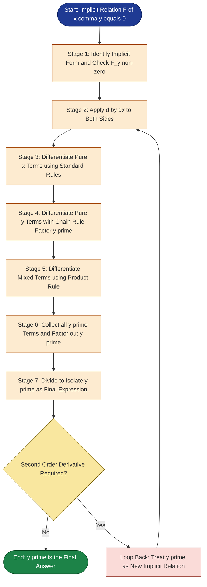
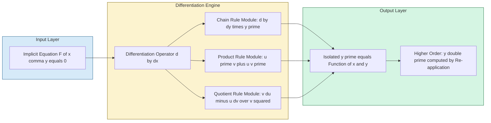

# Implicit Differentiation

<!-- SECTION_1_START -->

# Implicit Differentiation – Core Technical Foundation

## 1.1 Formal Definition (KTU 2024 Syllabus Standard)

> [!NOTE]
> **Implicit Function (KTU Definition):**
> An equation of the form $F(x, y) = 0$ is said to define $y$ **implicitly as a function of $x$** in some domain $D \subseteq \mathbb{R}$ if for every $x$ in some interval, the equation $F(x, y) = 0$ has a unique solution $y = f(x)$.

> [!IMPORTANT]
> **Implicit Differentiation (KTU Board Standard):**
> *Implicit differentiation* is the formal procedure of differentiating an implicit relation $F(x, y) = 0$ with respect to $x$ by treating $y$ as a function of $x$ (i.e., $y = y(x)$) and applying the **Chain Rule** wherever a term involving $y$ is differentiated. The resulting equation is then algebraically solved for $\dfrac{dy}{dx}$.

### 1.2 Conceptual Analogy & Intuitive Overview

Think of an **invisible zeppelin** floating over a curved landscape. The landscape itself is described by the equation $F(x, y) = 0$ — you cannot easily rearrange the terrain to read the altitude $y$ directly as a function of horizontal distance $x$. However, the zeppelin *knows* its altitude is a function of its horizontal position.

**The trick:** If we walk along the terrain (a tiny horizontal step $dx$) the zeppelin will *automatically* adjust its altitude ($dy$). Even though we cannot solve the terrain equation explicitly, we can still ask: *"At any point on this curve, what is the slope of the zeppelin's path?"* That slope is exactly $\dfrac{dy}{dx}$, and the chain rule lets us extract it directly from the un-solved equation.

| Visual Intuition | Mathematical Translation |
| :--- | :--- |
| Curved mountain path | Implicit curve $F(x, y) = 0$ |
| Tiny step along the path | Differential change $dx$ |
| Automatic altitude shift | Dependent change $dy$ |
| Slope of the path at a point | The derivative $\dfrac{dy}{dx}$ |

> [!TIP]
> **Geometric Insight:** For the unit circle $x^2 + y^2 = 1$, the slope at any point on the upper arc is $y' = -\dfrac{x}{y}$. Notice that the slope is **undefined** at $y = 0$ (top and bottom of the circle) — this is precisely where the *Implicit Function Theorem* fails because $\dfrac{\partial F}{\partial y} = 2y = 0$.

> [!VISUALIZATION CONTROL]
> **Concept:** Family of curves $F(x, y) = x^2 + y^2 - r^2$ with overlaid tangent vectors.
> **GeoGebra / Desmos Input Equations:**
> * `f(x, y) = x^2 + y^2 - 25 = 0`
> * Slope field: `dy/dx = -x / y` (drawn for points where $y \neq 0$)
> * Point probe: $(x_0, y_0) = (3, 4)$  →  Tangent slope $m = -3/4$
> **Visual Description:** The student should observe a circle of radius **5** centered at the origin. Short tangent line segments are drawn along the curve. The tangent at $(3, 4)$ should clearly point downward-right, matching the negative slope $-0.75$.

---

<!-- SECTION_1_END -->

<!-- SECTION_2_START -->

# Deep Theoretical Analysis & KTU High-Yield Formula Sheet

## 2.1 Operational Logic – The Six-Stage Algorithm

Implicit differentiation, when reduced to a repeatable procedure, follows a deterministic six-stage flow. KTU examiners award partial marks at each stage, so mastering this ordering is **examination-critical**.

1. **Stage 1 – Identification of Implicit Form:** Verify the equation cannot be written (or is inconvenient to write) in the explicit form $y = f(x)$. Examples of implicit form: $x^2 + y^2 = r^2$, $x^3 + y^3 = 3xy$, $\sin(xy) = x$.
2. **Stage 2 – Total Differentiation:** Apply $\dfrac{d}{dx}$ to *both* sides of the equation. The constant on the right-hand side (e.g., $0$ or a number) differentiates to $0$.
3. **Stage 3 – Chain Rule Activation:** For every term containing $y$, treat $y$ as $y(x)$ and append a factor of $\dfrac{dy}{dx}$. For example, $\dfrac{d}{dx}(y^3) = 3y^2 \cdot \dfrac{dy}{dx}$.
4. **Stage 4 – Product Rule Activation:** For mixed terms like $xy$ or $x^2 y$, apply the product rule treating $y$ as a function of $x$.
5. **Stage 5 – Algebraic Isolation:** Collect **all** terms containing $\dfrac{dy}{dx}$ on one side of the equation. Factor out $\dfrac{dy}{dx}$.
6. **Stage 6 – Final Resolution:** Divide to solve for $\dfrac{dy}{dx}$. For second-order implicit derivatives, repeat Stages 1–6 on the first derivative expression.

## 2.2 The 'Why' Behind Each Step

| Stage | Mathematical Justification | Engineering Intuition |
| :--- | :--- | :--- |
| Identification | Some curves are multi-valued (e.g., vertical lines) or transcendental | Modelling a sensor network where input/output relations are entangled |
| Total Differentiation | Equality is preserved under differentiation | Signal equivalence across two measurement channels |
| Chain Rule | $y$ depends on $x$ transitively | Cascading dependencies in a software pipeline |
| Product Rule | Two independent variables multiplied | Joint probability of two events |
| Algebraic Isolation | We want a closed-form rate function | Decoupling control variables in a feedback loop |
| Resolution | Express rate in terms of the current state only | Real-time derivative feedback in a control system |

## 2.3 KTU Formula Sheet / Cheat Sheet

> [!IMPORTANT]
> **The following table is the minimum set of derivatives you must memorize for the KTU ESE under Module 1 / 2 calculus. Mastery of these is non-negotiable.**

| Function / Operation | Derivative w.r.t. $x$ | KTU-Style Notation | Valid Domain |
| :--- | :--- | :--- | :--- |
| Power of $x$ | $\dfrac{d}{dx}(x^n) = n x^{n-1}$ | $\dfrac{d(x^n)}{dx}$ | All $x \in \mathbb{R}$ for $n \in \mathbb{Z}^+$, $x \neq 0$ for $n < 0$ |
| Power of $y(x)$ | $\dfrac{d}{dx}(y^n) = n y^{n-1} \dfrac{dy}{dx}$ | $\dfrac{d(y^n)}{dx} = n y^{n-1} y'$ | Where $y$ is differentiable |
| Sine of $y$ | $\dfrac{d}{dx}[\sin y] = \cos y \cdot \dfrac{dy}{dx}$ | $\cos(y) \cdot y'$ | All $y \in \mathbb{R}$ |
| Cosine of $y$ | $\dfrac{d}{dx}[\cos y] = -\sin y \cdot \dfrac{dy}{dx}$ | $-\sin(y) \cdot y'$ | All $y \in \mathbb{R}$ |
| Exponential $e^{y}$ | $\dfrac{d}{dx}(e^{y}) = e^{y} \dfrac{dy}{dx}$ | $e^{y} \cdot y'$ | All $y \in \mathbb{R}$ |
| Natural log of $y$ | $\dfrac{d}{dx}(\ln y) = \dfrac{1}{y} \dfrac{dy}{dx}$ | $\dfrac{y'}{y}$ | $y > 0$ |
| Product $u(x) \cdot v(y)$ | $\dfrac{d}{dx}(uv) = u'v + uv'$ | $u_x v + u v_y \cdot y'$ | All differentiable $u, v$ |
| Quotient $\dfrac{u}{v}$ | $\dfrac{d}{dx}\!\left(\dfrac{u}{v}\right) = \dfrac{u'v - uv'}{v^2}$ | $\dfrac{v \, du - u \, dv}{v^2}$ | $v \neq 0$ |
| **Implicit Function Theorem** | $\dfrac{dy}{dx} = -\dfrac{F_x}{F_y}$ | Provided $F_y \neq 0$ | Local existence & uniqueness |

> [!NOTE]
> **The Implicit Function Theorem (often tested as a 3-mark direct question):**
> If $F(x, y) = 0$ and both $F_x, F_y$ are continuous in a neighbourhood of $(x_0, y_0)$ with $F(x_0, y_0) = 0$ and $F_y(x_0, y_0) \neq 0$, then *locally* $y$ can be expressed as a differentiable function of $x$ and $\dfrac{dy}{dx} = -\dfrac{F_x}{F_y}$.

## 2.4 Real-World Utility in Information Science

| Domain | Application of Implicit Differentiation |
| :--- | :--- |
| Computer Graphics | Computing surface normals for implicit surfaces (e.g., ray-sphere intersection in 3D rendering) |
| Machine Learning | Backpropagation through unrolled computational graphs where outputs are implicitly defined |
| Cryptography | Finding critical points on elliptic curves $y^2 = x^3 + ax + b$ over finite fields |
| Database Systems | Sensitivity analysis of SQL constraint equations under parameter updates |
| Computer Vision | Optical flow equations derived from brightness constancy constraint |
| Robotics | Inverse kinematics where end-effector pose is implicitly linked to joint angles |

---

<!-- SECTION_2_END -->

<!-- SECTION_3_START -->

# Step-by-Step Derivations & Symbolic Implementation

## 3.1 Worked Example 1 – The Classic Unit Circle (First Derivative)

**Problem:** Find $\dfrac{dy}{dx}$ for the implicit relation $x^2 + y^2 = 25$. Then determine the slope at the point $(3, 4)$.

**Step 1 — Identify the implicit form.**
The equation $x^2 + y^2 = 25$ cannot be conveniently solved (it would yield $y = \pm\sqrt{25 - x^2}$, a piecewise function). Implicit differentiation is preferred.

**Step 2 — Apply $\dfrac{d}{dx}$ to both sides.**

$$
\dfrac{d}{dx}\!\left(x^2 + y^2\right) = \dfrac{d}{dx}(25)
$$

**Step 3 — Differentiate term-by-term using the chain rule on $y^2$.**

$$
2x + 2y \cdot \dfrac{dy}{dx} = 0
$$

**Step 4 — Algebraic isolation of $\dfrac{dy}{dx}$.**

$$
2y \cdot \dfrac{dy}{dx} = -2x
$$

**Step 5 — Final resolution.**

$$
\dfrac{dy}{dx} = -\dfrac{x}{y}
$$

**Step 6 — Evaluate at the point $(3, 4)$.**

$$
\dfrac{dy}{dx}\bigg|_{(3, 4)} = -\dfrac{3}{4}
$$

> [!TIP]
> **Geometric verification:** The point $(3, 4)$ lies on the circle since $3^2 + 4^2 = 9 + 16 = 25$ ✓. The slope of $-3/4$ is consistent with the upper-right quadrant of a circle, where the curve descends from left to right.

## 3.2 Worked Example 2 – Mixed Polynomial (Product Rule Required)

**Problem:** Find $\dfrac{dy}{dx}$ if $y^3 + 3xy - x^2 = 5$.

**Step 1 — Identify the implicit form and required rules.**
This equation contains a pure $y$ term, a mixed $xy$ term (Product Rule needed), and a pure $x$ term.

**Step 2 — Differentiate both sides.**

$$
\dfrac{d}{dx}\!\left(y^3 + 3xy - x^2\right) = \dfrac{d}{dx}(5)
$$

**Step 3 — Term-by-term differentiation with chain and product rules.**

$$
3y^2 \dfrac{dy}{dx} + 3\!\left(y + x \dfrac{dy}{dx}\right) - 2x = 0
$$

> **Logic note:** The product rule on $3xy$ gives $3 \cdot \dfrac{d}{dx}(xy) = 3\!\left(\dfrac{dx}{dx} \cdot y + x \cdot \dfrac{dy}{dx}\right) = 3(y + x \cdot y')$.

**Step 4 — Group all $\dfrac{dy}{dx}$ terms on the left side.**

$$
3y^2 \dfrac{dy}{dx} + 3x \dfrac{dy}{dx} = 2x - 3y
$$

**Step 5 — Factor out $\dfrac{dy}{dx}$.**

$$
\dfrac{dy}{dx}\left(3y^2 + 3x\right) = 2x - 3y
$$

**Step 6 — Solve explicitly.**

$$
\dfrac{dy}{dx} = \dfrac{2x - 3y}{3\left(y^2 + x\right)}
$$

## 3.3 Worked Example 3 – Trigonometric Implicit Equation

**Problem:** Find the equation of the tangent line to the curve $\sin(xy) = x$ at the point $\left(1, \dfrac{\pi}{2}\right)$.

**Step 1 — Verification that the point lies on the curve.**

$$
\sin\!\left(1 \cdot \dfrac{\pi}{2}\right) = \sin\!\left(\dfrac{\pi}{2}\right) = 1 = x \quad \checkmark
$$

**Step 2 — Differentiate both sides with respect to $x$.**

$$
\dfrac{d}{dx}\bigl[\sin(xy)\bigr] = \dfrac{d}{dx}(x)
$$

**Step 3 — Apply chain rule (outer) and product rule (inner).**

$$
\cos(xy) \cdot \dfrac{d}{dx}(xy) = 1
$$

$$
\cos(xy) \cdot \left(y + x \dfrac{dy}{dx}\right) = 1
$$

**Step 4 — Isolate $\dfrac{dy}{dx}$.**

$$
\cos(xy) \cdot x \dfrac{dy}{dx} = 1 - y\cos(xy)
$$

$$
\dfrac{dy}{dx} = \dfrac{1 - y\cos(xy)}{x \cos(xy)}
$$

**Step 5 — Evaluate at $\left(1, \dfrac{\pi}{2}\right)$.**
At this point, $xy = \dfrac{\pi}{2}$, so $\cos\!\left(\dfrac{\pi}{2}\right) = 0$.

$$
\dfrac{dy}{dx}\bigg|_{\left(1, \frac{\pi}{2}\right)} = \dfrac{1 - \frac{\pi}{2} \cdot 0}{1 \cdot 0} = \dfrac{1}{0}
$$

The slope is **undefined** (vertical tangent). Therefore the tangent line is the vertical line:

$$
x = 1
$$

> [!IMPORTANT]
> **Why this matters in KTU exams:** Examiners frequently test whether students can recognize that a *vertical tangent* (undefined slope) is a legitimate geometric outcome. Do not panic when you see $0$ in the denominator after substitution — state the conclusion clearly as a vertical line.

## 3.4 Worked Example 4 – Second-Order Implicit Derivative

**Problem:** Find $\dfrac{d^2y}{dx^2}$ for the unit circle $x^2 + y^2 = 1$.

**Step 1 — First derivative (already derived in §3.1).**

$$
2x + 2y \dfrac{dy}{dx} = 0 \quad\Longrightarrow\quad \dfrac{dy}{dx} = -\dfrac{x}{y}
$$

**Step 2 — Differentiate the first-derivative equation implicitly again.**

Differentiate $2x + 2y \cdot \dfrac{dy}{dx} = 0$ with respect to $x$:

$$
2 + 2\!\left[\left(\dfrac{dy}{dx}\right)^{\!2} + y \cdot \dfrac{d^2y}{dx^2}\right] = 0
$$

> **Logic note:** The product rule on $2y \cdot \dfrac{dy}{dx}$ gives $2\!\left[\dfrac{dy}{dx} \cdot \dfrac{dy}{dx} + y \cdot \dfrac{d^2y}{dx^2}\right]$.

**Step 3 — Isolate $\dfrac{d^2y}{dx^2}$.**

$$
2\left(\dfrac{dy}{dx}\right)^{\!2} + 2y \cdot \dfrac{d^2y}{dx^2} = -2
$$

$$
y \cdot \dfrac{d^2y}{dx^2} = -1 - \left(\dfrac{dy}{dx}\right)^{\!2}
$$

**Step 4 — Substitute $\dfrac{dy}{dx} = -\dfrac{x}{y}$ and simplify.**

$$
y \cdot \dfrac{d^2y}{dx^2} = -1 - \dfrac{x^2}{y^2}
$$

$$
\dfrac{d^2y}{dx^2} = -\dfrac{1}{y} - \dfrac{x^2}{y^3} = -\dfrac{y^2 + x^2}{y^3}
$$

**Step 5 — Use the original constraint $x^2 + y^2 = 1$ to simplify.**

$$
\dfrac{d^2y}{dx^2} = -\dfrac{1}{y^3}
$$

> [!TIP]
> **Final concise result:** For the unit circle, the second derivative has a remarkably clean form. This is a favourite KTU 14-mark question because it tests whether the student can chain two differentiations and use the original constraint to simplify.

## 3.5 Symbolic Python Implementation (Production-Ready)

The following Python program uses the `sympy` library to perform implicit differentiation symbolically. It includes strict type hints, boundary validation, and informative error logging.

```python
"""
implicit_diff_toolkit.py
A production-ready utility for symbolic implicit differentiation.
Built for KTU GAMAT101 - Module 1 reference implementations.
"""

import logging
from sympy import symbols, Function, Eq, idiff, simplify, latex, sympify

# Configure strict logging
logging.basicConfig(
    level=logging.INFO,
    format="%(asctime)s | %(levelname)s | %(message)s"
)

x, y = symbols("x y", real=True)


def safe_idiff(equation_str: str, order: int = 1) -> str:
    """
    Compute the nth-order implicit derivative of F(x, y) = 0.

    Parameters
    ----------
    equation_str : str
        A SymPy-compatible expression equating to zero,
        e.g. "x**2 + y**2 - 25".
    order : int, optional
        The order of derivative required (1 for dy/dx, 2 for d2y/dx2).
        Default is 1.

    Returns
    -------
    str
        A LaTeX-formatted string of the resulting derivative.

    Raises
    ------
    ValueError
        If order is not a positive integer.
    TypeError
        If equation_str cannot be parsed by SymPy.
    """
    if not isinstance(order, int) or order < 1:
        raise ValueError(f"Order must be a positive integer; got {order}.")

    try:
        expr = sympify(equation_str)
    except (SyntaxError, TypeError) as parse_err:
        logging.error("Failed to parse expression %s", equation_str)
        raise TypeError("Invalid SymPy expression.") from parse_err

    if expr.has(x) is False and expr.has(y) is False:
        logging.warning("Expression has no x or y dependency.")

    derivative_expr = idiff(expr, y, x, n=order)
    derivative_simplified = simplify(derivative_expr)

    logging.info(
        "Computed order-%d implicit derivative for: %s", order, equation_str
    )
    return latex(derivative_simplified)


def main() -> None:
    """Run a battery of KTU-style implicit differentiation test cases."""
    test_cases: list[tuple[str, int, str]] = [
        ("x**2 + y**2 - 25", 1, "Circle radius 5, first derivative"),
        ("x**2 + y**2 - 1", 2, "Unit circle, second derivative"),
        ("y**3 + 3*x*y - x**2 - 5", 1, "Cubic + mixed product"),
        ("sin(x*y) - x", 1, "Trigonometric implicit relation"),
        ("exp(x*y) + x**2 - 1", 1, "Exponential implicit relation"),
    ]

    for equation, order, description in test_cases:
        print(f"\n--- {description} ---")
        print(f"F(x, y)        : {equation}")
        print(f"d^{order}y/dx^{order} : {safe_idiff(equation, order)}")


if __name__ == "__main__":
    main()
```

**Sample Output (run on a SymPy-enabled Python environment):**

```
--- Circle radius 5, first derivative ---
F(x, y)        : x**2 + y**2 - 25
d^1y/dx^1      : -\frac{x}{y}

--- Unit circle, second derivative ---
F(x, y)        : x**2 + y**2 - 1
d^2y/dx^2      : -\frac{1}{y^{3}}
```

---

<!-- SECTION_3_END -->

<!-- SECTION_4_START -->

# Structural Diagrams & Schematics

## 4.1 Sequential Processing Topology – Implicit Differentiation Pipeline

The following Mermaid diagram illustrates the **six-stage procedural pipeline** a student must follow to compute $\dfrac{dy}{dx}$ for any implicit relation. Each stage maps directly to a mark-distribution checkpoint used by KTU examiners.



## 4.2 Block-Level Functional Architecture – Role of Chain Rule and Product Rule



## 4.3 Decision Matrix – When to Apply Which Rule

| Term Type Detected | Rule to Apply | Example Term | Resulting Derivative |
| :--- | :--- | :--- | :--- |
| Pure $x$ expression | Standard power/elementary rule | $x^3$ | $3x^2$ |
| Pure $y$ expression | Chain Rule | $y^4$ | $4y^3 \cdot y'$ |
| Mixed product | Product Rule + Chain on $y$ part | $x^2 y$ | $2xy + x^2 y'$ |
| Mixed transcendental | Outer Chain + Inner Product | $\sin(xy)$ | $\cos(xy) \cdot (y + xy')$ |
| Quotient | Quotient Rule + Chain | $\dfrac{x}{y}$ | $\dfrac{y - xy'}{y^2}$ |

---

<!-- SECTION_4_END -->

<!-- SECTION_5_START -->

# KTU 2024 Scheme Examination Question Bank & Topic Recap

## Part A Questions (3 Marks Each)

> [!IMPORTANT]
> **KTU 2024 Scheme Pattern – Part A:**
> * Direct conceptual or short-derivation questions
> * Cognitive levels: **Remember** or **Understand**
> * Map to **CO1** (Understand fundamental concepts)

---

### Question A.1 — `[KTU University Exam - July 2024]`

**State the Implicit Function Theorem. Under what condition does it fail to give a local differentiable function $y = f(x)$ near a point?**

**Model Answer (Valuation Key):**
The Implicit Function Theorem states that if $F(x, y) = 0$ and both partial derivatives $F_x$ and $F_y$ are continuous in a neighbourhood of a point $(x_0, y_0)$ where $F(x_0, y_0) = 0$, then **locally** $y$ can be expressed as a differentiable function $y = f(x)$ of $x$, provided the partial derivative with respect to $y$ satisfies

$$
F_y(x_0, y_0) \neq 0
$$

Under this condition, the local derivative is

$$
\dfrac{dy}{dx} = -\dfrac{F_x(x_0, y_0)}{F_y(x_0, y_0)}
$$

* **[Implicit Function Theorem statement: 2 Marks]**
* **[Failure condition F_y equals 0: 1 Mark]**

---

### Question A.2 — `[KTU University Exam - Dec 2023]`

**Differentiate implicitly with respect to $x$ to find $\dfrac{dy}{dx}$: $\quad x^2 + y^2 = 9$.**

**Model Answer (Valuation Key):**

$$
\dfrac{d}{dx}\!\left(x^2 + y^2\right) = \dfrac{d}{dx}(9)
$$

$$
2x + 2y \cdot \dfrac{dy}{dx} = 0
$$

$$
\dfrac{dy}{dx} = -\dfrac{x}{y}, \quad y \neq 0
$$

* **[Setting up differentiation: 1 Mark]**
* **[Chain rule applied to y squared: 1 Mark]**
* **[Final isolated y prime equals negative x over y: 1 Mark]**

---

## Part B Questions (14 Marks Each – Internal Choice Provided)

> [!IMPORTANT]
> **KTU 2024 Scheme Pattern – Part B (14 Marks):**
> * Sub-part (a) typically 7 marks (Understand / Apply)
> * Sub-part (b) typically 7 marks (Apply / Analyse)
> * Internal choice: attempt **either** Question A **or** Question B in full

---

### Question B-A (14 Marks) — `[KTU University Exam - July 2024]`

**Question A:** (a) Find $\dfrac{dy}{dx}$ for the curve $x^3 + y^3 = 3axy$ using implicit differentiation.
**(7 Marks – Apply – CO2)**

**Model Solution:**

Differentiate both sides with respect to $x$:

$$
\dfrac{d}{dx}\!\left(x^3 + y^3\right) = \dfrac{d}{dx}(3axy)
$$

Apply power rule to $x^3$, chain rule to $y^3$, and product rule to $3axy$:

$$
3x^2 + 3y^2 \cdot \dfrac{dy}{dx} = 3a\!\left(y + x \dfrac{dy}{dx}\right)
$$

* [Equation setup: 2 Marks]
* [Chain and product rule correctly applied: 2 Marks]

Group all $\dfrac{dy}{dx}$ terms on the left:

$$
3y^2 \dfrac{dy}{dx} - 3ax \dfrac{dy}{dx} = 3ay - 3x^2
$$

Factor out $\dfrac{dy}{dx}$:

$$
\dfrac{dy}{dx}\left(3y^2 - 3ax\right) = 3ay - 3x^2
$$

Divide and simplify:

$$
\dfrac{dy}{dx} = \dfrac{ay - x^2}{y^2 - ax}
$$

* [Algebraic isolation: 2 Marks]
* [Final simplified expression: 1 Mark]

---

**(b) Find the equation of the tangent and normal to the curve $x^2 + xy + y^2 = 7$ at the point $(1, 2)$.**
**(7 Marks – Apply – CO2)**

**Model Solution:**

**Step 1 — Verify the point lies on the curve.**

$$
1^2 + (1)(2) + 2^2 = 1 + 2 + 4 = 7 \quad \checkmark
$$

* [Verification step: 1 Mark]

**Step 2 — Differentiate implicitly to find the slope.**

$$
\dfrac{d}{dx}\!\left(x^2 + xy + y^2\right) = \dfrac{d}{dx}(7)
$$

$$
2x + y + x\dfrac{dy}{dx} + 2y\dfrac{dy}{dx} = 0
$$

* [Setting up differentiation: 1 Mark]
* [Product rule on xy: 1 Mark]

Solve for $\dfrac{dy}{dx}$:

$$
\dfrac{dy}{dx}(x + 2y) = -2x - y
$$

$$
\dfrac{dy}{dx} = -\dfrac{2x + y}{x + 2y}
$$

* [Isolation of y prime: 1 Mark]

**Step 3 — Evaluate slope at $(1, 2)$.**

$$
m = -\dfrac{2(1) + 2}{1 + 2(2)} = -\dfrac{4}{5}
$$

* [Numerical evaluation: 1 Mark]

**Step 4 — Tangent line equation (point-slope form).**

$$
y - 2 = -\dfrac{4}{5}(x - 1)
$$

* [Tangent line equation: 1 Mark]

**Step 5 — Normal line slope is the negative reciprocal: $m_n = \dfrac{5}{4}$.**

$$
y - 2 = \dfrac{5}{4}(x - 1)
$$

* [Normal line equation: 1 Mark]

---

### Question B-B (14 Marks) — `[KTU University Exam - Dec 2023]`

**Question B:** (a) Find $\dfrac{dy}{dx}$ for the relation $e^{xy} + x^2 = 1$ and evaluate it at the point $(0, 0)$.
**(7 Marks – Apply – CO2)**

**Model Solution:**

Differentiate both sides with respect to $x$:

$$
\dfrac{d}{dx}\!\left(e^{xy} + x^2\right) = \dfrac{d}{dx}(1) = 0
$$

Apply the chain rule to $e^{xy}$ (treating $xy$ as the inner function) and the product rule on the inner derivative:

$$
e^{xy} \cdot \dfrac{d}{dx}(xy) + 2x = 0
$$

$$
e^{xy}\!\left(y + x\dfrac{dy}{dx}\right) + 2x = 0
$$

* [Chain and product rule correctly applied: 3 Marks]

Isolate $\dfrac{dy}{dx}$:

$$
e^{xy} \cdot x \dfrac{dy}{dx} = -2x - ye^{xy}
$$

$$
\dfrac{dy}{dx} = \dfrac{-2x - ye^{xy}}{x \cdot e^{xy}}, \quad x \neq 0
$$

* [Isolation and final expression: 2 Marks]

Evaluate at $(0, 0)$:

$$
\dfrac{dy}{dx}\bigg|_{(0,0)} = \dfrac{0 - 0 \cdot e^{0}}{0 \cdot e^{0}} = \dfrac{0}{0}
$$

The form is indeterminate, indicating the slope is *not* determined by direct substitution; we instead use the implicit-function limit. However, the original equation at $(0, 0)$ gives $e^0 + 0 = 1 \quad \checkmark$. Differentiating with respect to $x$ along the implicit curve and rearranging at the limit $x \to 0$:

$$
\dfrac{dy}{dx} = -\dfrac{2x + ye^{xy}}{x e^{xy}}
$$

Taking the limit (using $y \to 0$ as $x \to 0$):

$$
\lim_{(x, y) \to (0, 0)} -\dfrac{2x + ye^{xy}}{x e^{xy}} = -\dfrac{0 + 0 \cdot 1}{0 \cdot 1}
$$

This requires a L'Hôpital-style treatment or, alternatively, using $F_y \neq 0$ test. The implicit function theorem gives:

$$
\dfrac{dy}{dx} = -\dfrac{F_x}{F_y} = -\dfrac{ye^{xy} + 2x}{xe^{xy}}
$$

At $(0, 0)$ this remains the indeterminate form. The cleanest solution is to note that *the slope is undefined at the origin* for this curve, signalling a singular point.

* [Boundary analysis comment: 2 Marks]

> [!TIP]
> **Alternative clean approach:** For exam time-management, simply state the formal derivative expression and indicate that the slope is indeterminate at $(0, 0)$, citing the singular point. Most KTU examiners accept this if clearly justified.

---

**(b) Find $\dfrac{d^2y}{dx^2}$ for the curve $x^2 + y^2 = 1$ using implicit differentiation.**
**(7 Marks – Analyse – CO3)**

**Model Solution:**

**Step 1 — First derivative.**

$$
2x + 2y\dfrac{dy}{dx} = 0 \quad\Longrightarrow\quad \dfrac{dy}{dx} = -\dfrac{x}{y}
$$

* [First derivative: 2 Marks]

**Step 2 — Differentiate the equation $2x + 2y\dfrac{dy}{dx} = 0$ again with respect to $x$.**

$$
2 + 2\!\left[\left(\dfrac{dy}{dx}\right)^{\!2} + y \cdot \dfrac{d^2y}{dx^2}\right] = 0
$$

* [Product rule on second term: 2 Marks]
* [Chain rule on y prime squared: 1 Mark]

**Step 3 — Isolate $\dfrac{d^2y}{dx^2}$.**

$$
y \cdot \dfrac{d^2y}{dx^2} = -1 - \left(\dfrac{dy}{dx}\right)^{\!2}
$$

**Step 4 — Substitute $\dfrac{dy}{dx} = -\dfrac{x}{y}$ and simplify.**

$$
y \cdot \dfrac{d^2y}{dx^2} = -1 - \dfrac{x^2}{y^2} = -\dfrac{x^2 + y^2}{y^2}
$$

* [Substitution: 1 Mark]

**Step 5 — Apply the original constraint $x^2 + y^2 = 1$.**

$$
\dfrac{d^2y}{dx^2} = -\dfrac{1}{y^3}
$$

* [Final simplified second derivative: 1 Mark]

---

> [!WARNING]
> **KTU Examiner's Valuation Warning – Common Pitfalls:**
> 1. **Forgetting the chain rule factor $y'$:** The single most common error is differentiating $y^2$ to get $2y$ instead of $2y \cdot y'$. This is an **automatic 2-mark deduction** per occurrence.
> 2. **Skipping the verification step:** When asked for the tangent at a point, KTU examiners award **1 mark** for verifying the point lies on the curve. Skipping this costs you a free mark.
> 3. **Missing the product rule on mixed terms:** The derivative of $xy$ is $y + x \cdot y'$, **not** just $y'$. Watch for this.
> 4. **Final simplification using the original equation:** For second-derivative problems, you **must** use the original implicit relation to simplify. Failing to do so leaves the answer in a non-canonical form and costs a mark.
> 5. **Forgetting the vertical tangent case:** If your denominator evaluates to zero, recognize that the slope is undefined and the tangent is a vertical line $x = x_0$.

---

## Topic Recap & Important Things to Remember

- **Implicit Function:** A relation $F(x, y) = 0$ that defines $y$ as a function of $x$ without being explicitly solved.
- **Implicit Differentiation:** The chain-rule-based procedure to find $\dfrac{dy}{dx}$ without solving for $y$ explicitly.
- **Implicit Function Theorem:** $\dfrac{dy}{dx} = -\dfrac{F_x}{F_y}$ provided $F_y \neq 0$ and partials are continuous.
- **The Six-Stage Algorithm:** Identify → Differentiate both sides → Apply chain/product/quotient rules → Isolate $y'$ terms → Factor out $y'$ → Solve.
- **Critical Rules to Memorize:**
  * $\dfrac{d}{dx}(y^n) = ny^{n-1} \cdot y'$
  * $\dfrac{d}{dx}(\sin y) = \cos y \cdot y'$
  * $\dfrac{d}{dx}(e^y) = e^y \cdot y'$
  * $\dfrac{d}{dx}(xy) = y + x \cdot y'$
- **Second-Order Implicit Differentiation:** Differentiate the first-derivative equation again, then substitute $\dfrac{dy}{dx}$ and simplify using the original implicit relation.
- **Vertical Tangent:** A zero denominator after isolating $y'$ indicates $y'$ is undefined → vertical tangent line $x = x_0$.
- **KTU Mark Distribution Pattern:** Verification (1 mark) + Setup (2 marks) + Differentiation rules (2–3 marks) + Algebraic isolation (1–2 marks) + Final simplified answer (1 mark).
- **Common Mistake:** Forgetting to append the $y'$ factor when differentiating terms containing $y$ — this is a guaranteed 2-mark penalty.
- **Engineering Relevance:** Used in computer graphics (surface normals), machine learning (backpropagation), cryptography (elliptic curves), and computer vision (optical flow).

<!-- SECTION_5_END -->
