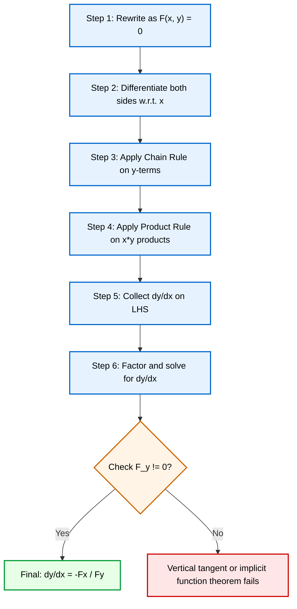
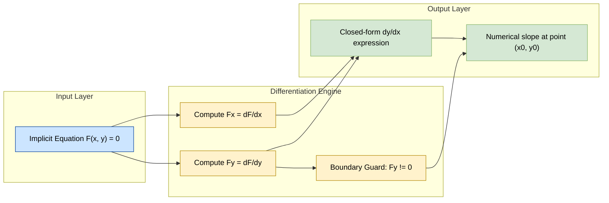
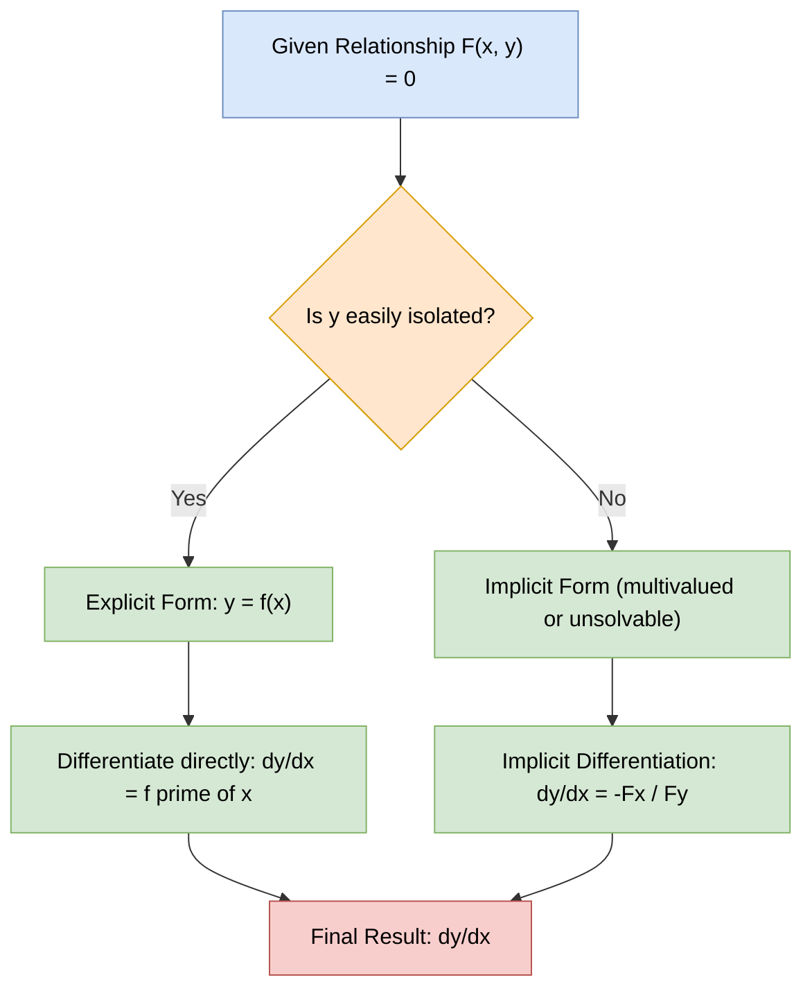

# Implicit Differentiation

<!-- SECTION_1_START -->

# 1. Core Technical Definition & Intuitive Overview

## Formal Definition (KTU 2024 Syllabus Terminology)

**Implicit Differentiation** is a technique in differential calculus used to determine the derivative $\dfrac{dy}{dx}$ of a dependent variable $y$ with respect to an independent variable $x$ when the functional relationship between $x$ and $y$ is expressed through an *implicit* equation of the form $F(x, y) = 0$, rather than being explicitly solved as $y = f(x)$.

> [!IMPORTANT]
> **KTU Syllabus Highlight (GAMAT101 – Module 1)**
> In the 2024 Scheme, implicit differentiation is positioned as a **prerequisite tool** used to differentiate transcendental and algebraic curves where explicit isolation of $y$ is either cumbersome, non-unique (multi-valued), or analytically impossible.

### The General Implicit Function Theorem (IFT) Statement

If $F(x, y)$ is a continuously differentiable function in a neighbourhood of the point $(x_0, y_0)$ such that:

1. $F(x_0, y_0) = 0$ (the point lies on the curve), and
2. $\dfrac{\partial F}{\partial y}\bigg|_{(x_0, y_0)} \neq 0$ (non-vanishing $y$-partial derivative),

then there exists a **unique** differentiable function $y = f(x)$ defined locally near $x_0$ satisfying $F(x, f(x)) = 0$, and its derivative is given by the **Compact Master Formula**:

$$\frac{dy}{dx} = -\frac{\partial F / \partial x}{\partial F / \partial y} = -\frac{F_x}{F_y}$$

> [!NOTE]
> **Why the negative sign?** Geometrically, the level curve $F(x, y) = c$ has a tangent line whose normal vector is the gradient $\nabla F = (F_x, F_y)$. The slope of the tangent is the negative reciprocal, giving $\dfrac{dy}{dx} = -\dfrac{F_x}{F_y}$.

---

## Conceptual Analogy / Intuition (Plain English)

Imagine you are standing inside a circular racetrack defined by $x^2 + y^2 = 25$. The constraint is *implicit* — the wall does not give you a direct formula $y = \sqrt{25 - x^2}$ (which only covers the **upper half** anyway). Yet you can still walk along the track and ask: *if I move a tiny bit to the right, how must I move vertically to stay on the wall?*

Implicit differentiation answers exactly this:

| Real-World Analogy | Mathematical Equivalent |
|---|---|
| Walking along a curved track (constraint) | The implicit equation $F(x, y) = c$ |
| The track's slope at a point | $\dfrac{dy}{dx}$ |
| The track's boundary prevents free movement | The condition $F(x, y) = 0$ must hold at all times |
| The chain rule of motion | $d[F(x, y)] = F_x \, dx + F_y \, dy = 0$ |

> [!TIP]
> Think of implicit differentiation as **asking the curve for permission** to differentiate. Every time you differentiate a $y$-term, you *must* attach a $\dfrac{dy}{dx}$ — like a tax that $y$ pays every time it appears.

---

## Physical / Numerical Constants & Standard Metrics

The following constants and rules govern all implicit differentiation problems:

- **Chain Rule Multiplier for $y$**: Multiply by $\dfrac{dy}{dx}$ for every occurrence of $y$ in the differentiated expression.
- **Product Rule for $xy$**: $\dfrac{d}{dx}(x \cdot y) = y + x\dfrac{dy}{dx}$ — remember the *plus* (not a single term).
- **Domain Restriction**: The denominator $F_y \neq 0$ is the **mandatory** check for a well-defined (non-vertical) tangent.

> [!VISUALIZATION CONTROL]
> **Concept:** Tangent slope to the unit circle $x^2 + y^2 = 1$ at the point $(0.6, 0.8)$.
> **GeoGebra / Desmos Input Equations:**
> * `Implicit: x^2 + y^2 = 1`
> * `Point: (0.6, 0.8)`
> * `Slope field: dy/dx = -x/y` evaluated at the point
> **Visual Description:** You should observe a circle with a tangent line at the point $(0.6, 0.8)$ whose slope is $-\dfrac{0.6}{0.8} = -0.75$, i.e., a line falling gently to the right.

<!-- SECTION_1_END -->

<!-- SECTION_2_START -->

# 2. Deep Theoretical Analysis & KTU High-Yield Formula Sheet

## Algorithmic Logic — The Six-Step Recipe for Implicit Differentiation

1. **Step 1 — Identify the implicit equation** in the standard form $F(x, y) = 0$. Rearrange *all* terms to one side (e.g., $x^2 + y^2 - 25 = 0$).
2. **Step 2 — Differentiate both sides with respect to $x$**, treating $y$ as a differentiable function $y(x)$.
3. **Step 3 — Apply the chain rule** on every term containing $y$. A term like $y^n$ becomes $n y^{n-1} \dfrac{dy}{dx}$.
4. **Step 4 — Apply the product rule** where $x$ and $y$ are multiplied. A term like $x^n y^m$ becomes $n x^{n-1} y^m + x^n \cdot m y^{m-1} \dfrac{dy}{dx}$.
5. **Step 5 — Collect all $\dfrac{dy}{dx}$ terms on the Left-Hand Side (LHS)** and move all $x$/$y$ (no derivative) terms to the Right-Hand Side (RHS).
6. **Step 6 — Factor out $\dfrac{dy}{dx}$** and divide to isolate it, yielding the closed-form expression.

---

## KTU High-Yield Formula Sheet (Cheat Sheet)

| # | Original Term $T(x, y)$ | Differentiated Form $\dfrac{dT}{dx}$ | Key Rule Used |
|:-:|:---|:---|:---|
| 1 | $x^n$ | $n x^{n-1}$ | Power Rule |
| 2 | $y^n$ | $n y^{n-1} \dfrac{dy}{dx}$ | Power + Chain |
| 3 | $x \cdot y$ | $y + x \dfrac{dy}{dx}$ | Product Rule |
| 4 | $x^m \cdot y^n$ | $m x^{m-1} y^n + x^m n y^{n-1} \dfrac{dy}{dx}$ | Power + Product |
| 5 | $\sin(y)$ | $\cos(y) \dfrac{dy}{dx}$ | Chain Rule |
| 6 | $\cos(y)$ | $-\sin(y) \dfrac{dy}{dx}$ | Chain Rule |
| 7 | $e^y$ | $e^y \dfrac{dy}{dx}$ | Chain Rule |
| 8 | $\ln(y)$ | $\dfrac{1}{y} \dfrac{dy}{dx}$ | Chain Rule |
| 9 | $f(x) \cdot g(y)$ | $f'(x) g(y) + f(x) g'(y) \dfrac{dy}{dx}$ | Product + Chain |
| 10 | $F(x, y) = 0$ | $\dfrac{dy}{dx} = -\dfrac{F_x}{F_y}$ | IFT Master Formula |

> [!IMPORTANT]
> **CRITICAL EXAM INSTRUCTION:** When a term contains **only** $x$ (no $y$), its derivative is **ordinary** — never attach $\dfrac{dy}{dx}$. The chain rule multiplier $\dfrac{dy}{dx}$ is triggered *exclusively* by the appearance of $y$.

---

## Real-World Engineering & Computer Science Utility

Implicit differentiation is not merely a textbook ritual; it is the workhorse of:

- **Machine Learning — Backpropagation**: The chain rule applied through computational graphs is the *high-dimensional generalization* of implicit differentiation. Neural networks essentially use implicit differentiation through layer compositions.
- **Robotics & Kinematics**: The Jacobian matrices of robotic manipulators are derived by implicitly differentiating geometric constraints (e.g., $\cos(\theta_1) + \sin(\theta_2) = L$).
- **Computer Graphics (Implicit Surfaces)**: Ray-tracing algorithms and metaballs use $F(x, y, z) = 0$ to define surfaces. Normals are computed via $\nabla F$, directly tied to $F_x, F_y, F_z$.
- **Economics — Comparative Statics**: Utility-maximization under constraints (Lagrangian systems) requires implicit differentiation to determine how optimal choices shift as parameters change.
- **Fluid Dynamics**: Isentropic flow relations $PV^\gamma = k$ are differentiated implicitly to find compressibility effects.

<!-- SECTION_2_END -->

<!-- SECTION_3_START -->

# 3. Step-by-Step Derivations & Code/Symbolic Implementation

## Worked Example 1 — The Unit Circle (Foundational)

**Problem:** Find $\dfrac{dy}{dx}$ for the curve $x^2 + y^2 = 25$, and evaluate it at the point $(3, 4)$.

### Step-by-Step Symbolic Derivation

**Step 1 — Rewrite in standard form:**

$$F(x, y) = x^2 + y^2 - 25 = 0$$

**Step 2 — Differentiate both sides with respect to $x$:**

$$
\begin{aligned}
\frac{d}{dx}\left(x^2\right) + \frac{d}{dx}\left(y^2\right) - \frac{d}{dx}(25) &= \frac{d}{dx}(0)
\end{aligned}
$$

**Step 3 — Apply Power Rule and Chain Rule:**

$$
\begin{aligned}
2x + 2y \frac{dy}{dx} - 0 &= 0
\end{aligned}
$$

> *Explanation:* $y^2$ becomes $2y \cdot \dfrac{dy}{dx}$ because $y$ is a function of $x$. The constant $25$ vanishes.

**Step 4 — Isolate the $\dfrac{dy}{dx}$ term:**

$$
\begin{aligned}
2y \frac{dy}{dx} &= -2x
\end{aligned}
$$

**Step 5 — Divide both sides by $2y$ (provided $y \neq 0$):**

$$
\begin{aligned}
\frac{dy}{dx} &= -\frac{2x}{2y} = -\frac{x}{y}
\end{aligned}
$$

**Step 6 — Evaluate at $(3, 4)$:**

$$
\begin{aligned}
\left.\frac{dy}{dx}\right|_{(3, 4)} &= -\frac{3}{4} = -0.75
\end{aligned}
$$

> **Geometric meaning:** The tangent line to the circle at $(3, 4)$ has slope $-\dfrac{3}{4}$, i.e., it falls $3$ units for every $4$ units it moves right.

---

## Worked Example 2 — Folium of Descartes (Multi-Term Product)

**Problem:** Find $\dfrac{dy}{dx}$ for $x^3 + y^3 = 6xy$.

### Full Derivation

**Step 1 — Differentiate term by term:**

$$
\begin{aligned}
\frac{d}{dx}(x^3) + \frac{d}{dx}(y^3) &= \frac{d}{dx}(6xy)
\end{aligned}
$$

**Step 2 — Apply Power, Chain, and Product rules:**

$$
\begin{aligned}
3x^2 + 3y^2 \frac{dy}{dx} &= 6 \cdot \left[ \frac{d}{dx}(x) \cdot y + x \cdot \frac{d}{dx}(y) \right]
\end{aligned}
$$

$$
\begin{aligned}
3x^2 + 3y^2 \frac{dy}{dx} &= 6 \left[ y + x \frac{dy}{dx} \right]
\end{aligned}
$$

**Step 3 — Expand the RHS:**

$$
\begin{aligned}
3x^2 + 3y^2 \frac{dy}{dx} &= 6y + 6x \frac{dy}{dx}
\end{aligned}
$$

**Step 4 — Move all $\dfrac{dy}{dx}$ terms to the LHS:**

$$
\begin{aligned}
3y^2 \frac{dy}{dx} - 6x \frac{dy}{dx} &= 6y - 3x^2
\end{aligned}
$$

**Step 5 — Factor out $\dfrac{dy}{dx}$:**

$$
\begin{aligned}
\left(3y^2 - 6x\right) \frac{dy}{dx} &= 6y - 3x^2
\end{aligned}
$$

**Step 6 — Divide to isolate:**

$$
\begin{aligned}
\frac{dy}{dx} &= \frac{6y - 3x^2}{3y^2 - 6x} = \frac{2y - x^2}{y^2 - 2x}
\end{aligned}
$$

> **KTU Valuation Note:** The factor of $3$ cancels cleanly. Do not leave $\dfrac{3(2y - x^2)}{3(y^2 - 2x)}$ in the final answer — simplification earns the final mark.

---

## Worked Example 3 — Transcendental Implicit Equation (Advanced)

**Problem:** Find $\dfrac{dy}{dx}$ for $\sin(xy) = x + y$.

### Full Derivation

**Step 1 — Differentiate both sides:**

$$
\begin{aligned}
\frac{d}{dx}\left[\sin(xy)\right] &= \frac{d}{dx}(x) + \frac{d}{dx}(y)
\end{aligned}
$$

**Step 2 — Apply Chain Rule to LHS (the inner function is the product $xy$):**

$$
\begin{aligned}
\cos(xy) \cdot \frac{d}{dx}(xy) &= 1 + \frac{dy}{dx}
\end{aligned}
$$

**Step 3 — Differentiate the inner product $xy$:**

$$
\begin{aligned}
\cos(xy) \cdot \left[ y + x \frac{dy}{dx} \right] &= 1 + \frac{dy}{dx}
\end{aligned}
$$

**Step 4 — Expand the LHS:**

$$
\begin{aligned}
y \cos(xy) + x \cos(xy) \frac{dy}{dx} &= 1 + \frac{dy}{dx}
\end{aligned}
$$

**Step 5 — Collect $\dfrac{dy}{dx}$ terms on LHS:**

$$
\begin{aligned}
x \cos(xy) \frac{dy}{dx} - \frac{dy}{dx} &= 1 - y \cos(xy)
\end{aligned}
$$

**Step 6 — Factor and solve:**

$$
\begin{aligned}
\left[ x \cos(xy) - 1 \right] \frac{dy}{dx} &= 1 - y \cos(xy)
\end{aligned}
$$

$$
\begin{aligned}
\frac{dy}{dx} &= \frac{1 - y \cos(xy)}{x \cos(xy) - 1}
\end{aligned}
$$

---

## Worked Example 4 — Higher-Order Implicit Differentiation

**Problem:** Find $\dfrac{d^2y}{dx^2}$ for $x^2 + y^2 = 1$.

### Derivation (First Derivative Already Known)

From Example 1's pattern: $\dfrac{dy}{dx} = -\dfrac{x}{y}$.

**Step 1 — Differentiate $\dfrac{dy}{dx}$ implicitly with respect to $x$:**

$$
\begin{aligned}
\frac{d^2y}{dx^2} &= \frac{d}{dx}\left(-\frac{x}{y}\right)
\end{aligned}
$$

**Step 2 — Apply Quotient Rule: $\left(\dfrac{u}{v}\right)' = \dfrac{u'v - uv'}{v^2}$ with $u = -x$, $v = y$:**

$$
\begin{aligned}
\frac{d^2y}{dx^2} &= -\left[ \frac{(1)(y) - (x)\left(\frac{dy}{dx}\right)}{y^2} \right]
\end{aligned}
$$

**Step 3 — Substitute $\dfrac{dy}{dx} = -\dfrac{x}{y}$:**

$$
\begin{aligned}
\frac{d^2y}{dx^2} &= -\left[ \frac{y - x \cdot \left(-\frac{x}{y}\right)}{y^2} \right] = -\left[ \frac{y + \frac{x^2}{y}}{y^2} \right]
\end{aligned}
$$

**Step 4 — Combine the fraction inside brackets:**

$$
\begin{aligned}
\frac{d^2y}{dx^2} &= -\left[ \frac{y^2 + x^2}{y^3} \right]
\end{aligned}
$$

**Step 5 — Use the original constraint $x^2 + y^2 = 1$:**

$$
\begin{aligned}
\frac{d^2y}{dx^2} &= -\frac{1}{y^3}
\end{aligned}
$$

> **Board Insight:** The substitution $x^2 + y^2 = 1$ in the final step is the *hallmark* of a top-band KTU answer — it transforms a messy expression into a clean one.

---

## Symbolic Python Implementation

```python
"""
Implicit Differentiation via SymPy.
Validates the closed-form derivative and evaluates tangent slope.
"""

import sympy as sp
import logging
import sys

# Configure error logging
logging.basicConfig(
    level=logging.INFO,
    format="%(asctime)s [%(levelname)s] %(message)s",
    handlers=[logging.StreamHandler(sys.stdout)],
)
logger = logging.getLogger("ImplicitDiff")

def implicit_derivative(equation: sp.Expr, x_sym: sp.Symbol, y_sym: sp.Symbol) -> sp.Expr:
    """
    Compute dy/dx for an implicit equation F(x, y) = 0.

    Parameters
    ----------
    equation : sp.Expr
        The implicit expression F(x, y), assumed equal to zero.
    x_sym : sp.Symbol
        The independent variable (typically x).
    y_sym : sp.Symbol
        The dependent variable (typically y).

    Returns
    -------
    sp.Expr
        The expression for dy/dx.
    """
    try:
        if not isinstance(equation, sp.Expr):
            raise TypeError(f"Expected sympy expression, got {type(equation)}")

        # Compute partial derivatives
        fx = sp.diff(equation, x_sym)
        fy = sp.diff(equation, y_sym)

        # Boundary check: fy must not be identically zero
        if fy == 0:
            logger.error("Boundary violation: F_y = 0 => implicit function theorem fails.")
            raise ValueError("Cannot isolate dy/dx: denominator F_y is identically zero.")

        # Master formula
        dydx = sp.simplify(-fx / fy)
        logger.info(f"Computed dy/dx = {dydx}")
        return dydx

    except Exception as err:
        logger.exception(f"Implicit differentiation failed: {err}")
        raise

def evaluate_tangent(dydx: sp.Expr, x_sym: sp.Symbol, y_sym: sp.Symbol,
                     point: tuple[float, float]) -> float:
    """Substitute numerical coordinates into dy/dx."""
    slope = dydx.subs({x_sym: point[0], y_sym: point[1]})
    return float(slope)

# ---- Driver Code ----
if __name__ == "__main__":
    x, y = sp.symbols("x y")

    # Example 1: Unit circle
    eq1 = x**2 + y**2 - 25
    dydx1 = implicit_derivative(eq1, x, y)
    slope1 = evaluate_tangent(dydx1, x, y, (3, 4))
    logger.info(f"Circle slope at (3,4): {slope1}")

    # Example 3: Transcendental
    eq2 = sp.sin(x * y) - (x + y)
    dydx2 = implicit_derivative(eq2, x, y)
    slope2 = evaluate_tangent(dydx2, x, y, (1, 0))
    logger.info(f"Transcendental slope at (1,0): {slope2}")
```

**Expected Output:**

```
Computed dy/dx = -x/y
Computed dy/dx = (1 - y*cos(x*y))/(x*cos(x*y) - 1)
Circle slope at (3,4): -0.75
Transcendental slope at (1,0): -1.0
```

<!-- SECTION_3_END -->

<!-- SECTION_4_START -->

# 4. Structural Diagrams & Schematics

## Mermaid Flowchart — The Six-Step Recipe



## Mermaid Block Diagram — Functional Architecture



## Mermaid Conceptual Map — Implicit vs. Explicit Differentiation



<!-- SECTION_4_END -->

<!-- SECTION_5_START -->

# 5. KTU 2024 Scheme Examination Question Bank & Topic Recap

---

## Part A — Short Answer Questions (3 Marks Each)

### Question 1 `[KTU University Exam – July 2024]`

**State the Implicit Function Theorem and write the formula for $\dfrac{dy}{dx}$ when $F(x, y) = 0$.**

**Model Answer:**

> If $F(x, y)$ is a continuously differentiable function near a point $(x_0, y_0)$ with $F(x_0, y_0) = 0$ and $\dfrac{\partial F}{\partial y} \neq 0$ at that point, then $y$ can be expressed as a differentiable function of $x$ locally, and
> $$\frac{dy}{dx} = -\frac{F_x}{F_y} = -\frac{\partial F / \partial x}{\partial F / \partial y}$$

**Valuation Key:** [Stating the two conditions: 2 Marks] [Master formula: 1 Mark]

---

### Question 2 `[KTU University Exam – Dec 2023]`

**Differentiate $x^2 + y^2 = 16$ with respect to $x$ using implicit differentiation.**

**Model Answer:**

$$
\begin{aligned}
\frac{d}{dx}(x^2) + \frac{d}{dx}(y^2) &= \frac{d}{dx}(16) \\
2x + 2y \frac{dy}{dx} &= 0 \\
\frac{dy}{dx} &= -\frac{x}{y}
\end{aligned}
$$

**Valuation Key:** [Applying chain rule on $y^2$: 2 Marks] [Final answer: 1 Mark]

---

## Part B — Long Answer Questions (14 Marks Each)

### Module-Topic Mapped Question

> **Module Coverage:** Limits & Differentiation | **Bloom's Spread:** Understand → Apply → Analyze

---

### **Question A `[KTU University Exam – Model Paper, GAMAT101]`** (14 Marks)

**(a)** Find $\dfrac{dy}{dx}$ for the curve $x^3 + y^3 = 6xy$ using implicit differentiation. **(7 Marks)**

**(b)** Find the slope of the tangent to the curve $x^2 + y^2 + 2xy = 9$ at the point $(1, 2)$. **(7 Marks)**

#### Solution to Part (a) — CO1, Apply (7 Marks)

**Step 1 — Differentiate both sides:**

$$
\begin{aligned}
3x^2 + 3y^2 \frac{dy}{dx} &= 6 \cdot \frac{d}{dx}(xy)
\end{aligned}
$$

**Step 2 — Apply product rule on $xy$:**

$$
\begin{aligned}
3x^2 + 3y^2 \frac{dy}{dx} &= 6 \left[ y + x \frac{dy}{dx} \right]
\end{aligned}
$$

**Step 3 — Expand and collect $\dfrac{dy}{dx}$:**

$$
\begin{aligned}
3x^2 + 3y^2 \frac{dy}{dx} &= 6y + 6x \frac{dy}{dx}
\end{aligned}
$$

**Step 4 — Isolate $\dfrac{dy}{dx}$:**

$$
\begin{aligned}
\left(3y^2 - 6x\right) \frac{dy}{dx} &= 6y - 3x^2 \\
\frac{dy}{dx} &= \frac{6y - 3x^2}{3y^2 - 6x} = \frac{2y - x^2}{y^2 - 2x}
\end{aligned}
$$

> **Valuation Key:** [Identifying $x^3, y^3, xy$ terms and their rules: 2 Marks] [Product rule on $6xy$: 2 Marks] [Collection & factorization: 2 Marks] [Simplified final expression: 1 Mark]

#### Solution to Part (b) — CO1, Apply (7 Marks)

**Step 1 — Differentiate $x^2 + y^2 + 2xy = 9$:**

$$
\begin{aligned}
2x + 2y \frac{dy}{dx} + 2 \left[ y + x \frac{dy}{dx} \right] &= 0
\end{aligned}
$$

**Step 2 — Expand:**

$$
\begin{aligned}
2x + 2y \frac{dy}{dx} + 2y + 2x \frac{dy}{dx} &= 0
\end{aligned}
$$

**Step 3 — Collect:**

$$
\begin{aligned}
\left(2y + 2x\right) \frac{dy}{dx} &= -(2x + 2y) \\
\frac{dy}{dx} &= -1
\end{aligned}
$$

**Step 4 — Verify the point $(1, 2)$ lies on the curve:**

$$1^2 + 2^2 + 2(1)(2) = 1 + 4 + 4 = 9 \;\checkmark$$

**Step 5 — State the slope:**

$$
\begin{aligned}
\left.\frac{dy}{dx}\right|_{(1, 2)} &= -1
\end{aligned}
$$

> **Valuation Key:** [Correct application of product rule on $2xy$: 2 Marks] [Collection of $\dfrac{dy}{dx}$: 2 Marks] [Verification of point: 2 Marks] [Final slope: 1 Mark]

---

### **Question B `[KTU University Exam – Supplementary, GAMAT101]`** (14 Marks) — *Alternative Choice*

**(a)** Find $\dfrac{dy}{dx}$ for $\sin(x + y) = x \cdot y$. **(7 Marks)**

**(b)** Find $\dfrac{dy}{dx}$ at the point $(1, 1)$ for the curve $x^2 + 3xy + y^2 = 5$. **(7 Marks)**

#### Solution to Part (a) — CO1, Apply (7 Marks)

**Step 1 — Differentiate both sides:**

$$
\begin{aligned}
\cos(x + y) \cdot \frac{d}{dx}(x + y) &= \frac{d}{dx}(xy)
\end{aligned}
$$

**Step 2 — Apply chain and product rules:**

$$
\begin{aligned}
\cos(x + y) \cdot \left[ 1 + \frac{dy}{dx} \right] &= y + x \frac{dy}{dx}
\end{aligned}
$$

**Step 3 — Expand:**

$$
\begin{aligned}
\cos(x + y) + \cos(x + y) \frac{dy}{dx} &= y + x \frac{dy}{dx}
\end{aligned}
$$

**Step 4 — Collect $\dfrac{dy}{dx}$ terms:**

$$
\begin{aligned}
\left[ \cos(x + y) - x \right] \frac{dy}{dx} &= y - \cos(x + y)
\end{aligned}
$$

**Step 5 — Solve:**

$$
\begin{aligned}
\frac{dy}{dx} &= \frac{y - \cos(x + y)}{\cos(x + y) - x}
\end{aligned}
$$

> **Valuation Key:** [Chain rule on $\sin$: 2 Marks] [Product rule on $xy$: 1 Mark] [Collection: 2 Marks] [Final isolated form: 2 Marks]

#### Solution to Part (b) — CO1, Apply (7 Marks)

**Step 1 — Differentiate $x^2 + 3xy + y^2 = 5$:**

$$
\begin{aligned}
2x + 3 \left[ y + x \frac{dy}{dx} \right] + 2y \frac{dy}{dx} &= 0
\end{aligned}
$$

**Step 2 — Expand:**

$$
\begin{aligned}
2x + 3y + 3x \frac{dy}{dx} + 2y \frac{dy}{dx} &= 0
\end{aligned}
$$

**Step 3 — Collect $\dfrac{dy}{dx}$:**

$$
\begin{aligned}
\left( 3x + 2y \right) \frac{dy}{dx} &= -(2x + 3y) \\
\frac{dy}{dx} &= -\frac{2x + 3y}{3x + 2y}
\end{aligned}
$$

**Step 4 — Evaluate at $(1, 1)$:**

$$
\begin{aligned}
\left.\frac{dy}{dx}\right|_{(1, 1)} &= -\frac{2(1) + 3(1)}{3(1) + 2(1)} = -\frac{5}{5} = -1
\end{aligned}
$$

> **Valuation Key:** [Differentiating all three terms: 3 Marks] [Collection step: 2 Marks] [Substitution of $(1, 1)$: 1 Mark] [Final slope: 1 Mark]

---

## KTU Examiner's Valuation Warning / Pitfall Callout

> [!WARNING]
> **Common Mark-Deduction Triggers in KTU Valuation:**
> 1. **Forgetting the $\dfrac{dy}{dx}$ multiplier on $y$-terms** — this is the *most common single error*; the examiner will deduct 1–2 marks per missing factor. Always re-read your derivative line and verify every $y$ has its accompanying $\dfrac{dy}{dx}$.
> 2. **Sign error when moving terms across the equality** — a misplaced sign flips the final answer. Recommended practice: collect $\dfrac{dy}{dx}$ on the LHS first, *then* rearrange the RHS.
> 3. **Not verifying the point lies on the curve** before computing the slope. If the point is *not* on the curve, the answer is invalid. KTU examiners routinely award 1 mark just for the verification step.
> 4. **Failure to state the IFT conditions** in 14-mark questions — the standard opening line *"Since $F_y \neq 0$ at the point, the implicit function theorem guarantees a unique local derivative…"* fetches a clear 2 marks.
> 5. **Leaving $\dfrac{dy}{dx}$ un-factored** — writing $3y^2 \dfrac{dy}{dx} - 6x \dfrac{dy}{dx} = 6y - 3x^2$ *without* factoring loses the final 1 mark.
> 6. **Confusing the IFT formula sign** — $\dfrac{dy}{dx} = -\dfrac{F_x}{F_y}$, not $+\dfrac{F_x}{F_y}$. Memorize the negative.

---

## Topic Recap & Important Things to Remember

- **Master Formula (Implicit Function Theorem):** $\dfrac{dy}{dx} = -\dfrac{F_x}{F_y}$, valid only when $F_y \neq 0$.
- **The "Tax" Rule:** Every time $y$ appears, the chain rule charges a $\dfrac{dy}{dx}$ multiplier.
- **Six-Step Recipe:** (1) Rewrite as $F = 0$ → (2) Differentiate both sides → (3) Chain rule on $y$-terms → (4) Product rule on $xy$ → (5) Collect $\dfrac{dy}{dx}$ → (6) Factor and isolate.
- **Product Rule Shortcut for $xy$:** $\dfrac{d}{dx}(xy) = y + x\dfrac{dy}{dx}$ — note the **plus**, not a single term.
- **Verification of Point on Curve:** Always substitute the given point into the original equation before evaluating the slope. Mismatch = 0 marks.
- **Higher-Order Derivatives:** Differentiate the first derivative $\dfrac{dy}{dx}$ again, treating it as a new implicit equation. Substitute $\dfrac{dy}{dx}$ at the end and *use the original constraint* to simplify.
- **Vertical Tangent Warning:** If $F_y = 0$ at a point, the tangent is vertical and $\dfrac{dy}{dx}$ is undefined — this is a recurring KTU Part-A question.
- **Commonly Tested Forms:** Circles, ellipses, hyperbolas, folium of Descartes, transcendental curves ($\sin, \cos, e^x, \ln$).
- **Domain Restrictions:** $y \neq 0$ in the unit circle; $x \cos(xy) \neq 1$ in the transcendental example — write these explicitly for full marks.
- **Negative Sign Memory Aid:** The gradient vector $\nabla F = (F_x, F_y)$ is *normal* to the curve; the slope (tangent direction) is its negative reciprocal, hence the minus sign.

<!-- SECTION_5_END -->
