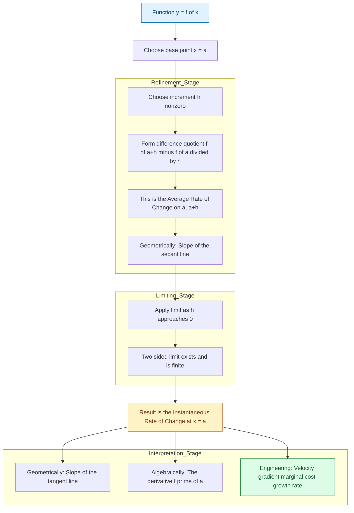
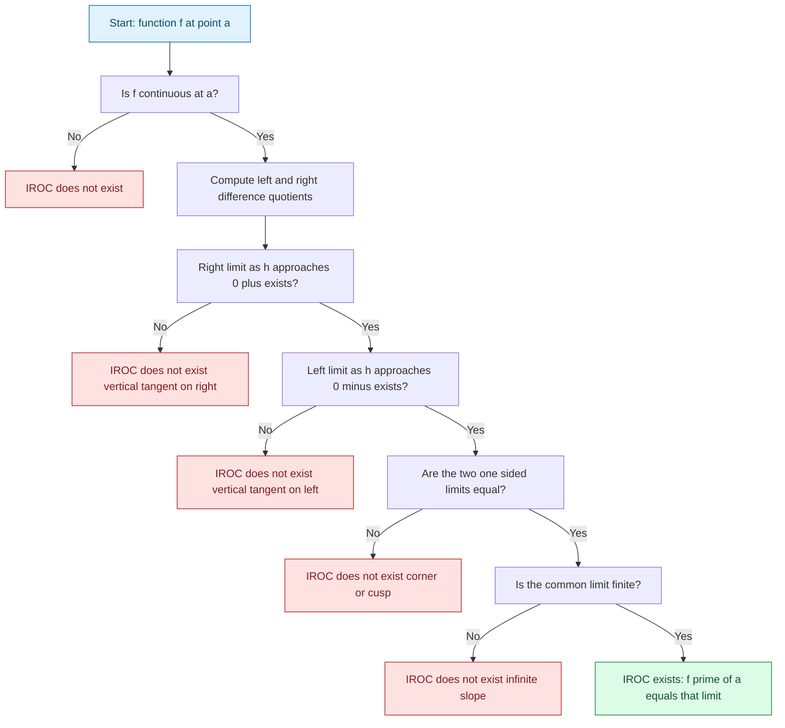

# Instantaneous Rates of Change

<!-- SECTION_1_START -->

# Instantaneous Rates of Change

## 1.1 Formal Academic Definition (KTU 2024 Syllabus Standard)

> [!IMPORTANT]
> **Instantaneous Rate of Change (IROC):** Let $f$ be a real-valued function defined on an open interval containing a point $x = a$. The *instantaneous rate of change* of $f$ at $x = a$ is defined as the limit
> $$\text{IROC} = \lim_{h \to 0} \frac{f(a+h) - f(a)}{h}$$
> provided this limit exists and is finite. This limit is precisely the **derivative** $f'(a)$ of $f$ at $x = a$.

This concept is the cornerstone of **differential calculus** and the foundation of all modern engineering optimization, signal processing algorithms, and machine learning gradient descent methods.

## 1.2 Conceptual Analogy & Geometric Intuition

> [!NOTE]
> **The Speedometer Analogy (Intuitive Explanation):** Imagine driving a car from point A to point B in 2 hours, covering 100 km. Your *average speed* is **50 km/h**. However, at any given moment, your speedometer might read **70 km/h** (going downhill), **20 km/h** (in traffic), or **0 km/h** (at a red light). These moment-by-moment readings are *instantaneous rates of change* of distance with respect to time. The limit concept allows us to "zoom in" infinitely close to a single instant and recover the true momentary rate.

**Geometric Intuition:** On the graph of $y = f(x)$, the average rate of change over an interval $[a, a+h]$ corresponds to the **slope of the secant line** connecting $(a, f(a))$ and $(a+h, f(a+h))$. As $h \to 0$, the second point slides toward the first, and the secant line rotates to become the **tangent line** to the curve at $(a, f(a))$. The slope of this tangent is the instantaneous rate of change.

> [!VISUALIZATION CONTROL]
> **Concept:** Secant lines converging to the tangent line at a point on the curve $y = x^2$ at $x = 2$.
> **GeoGebra / Desmos Input Equations:**
> * $f(x) = x^2$
> * $a = 2$
> * Secant line slopes: $m(h) = \dfrac{(2+h)^2 - 4}{h}$ for $h = 1, 0.5, 0.1, 0.01$
> * Tangent line: $y = 4x - 4$
> **Visual Description:** Plot the parabola $y = x^2$ and the family of secant lines through the fixed point $(2, 4)$. As $h \to 0$, the secant lines visibly pivot and merge into the single tangent line $y = 4x - 4$, whose slope is exactly **4** — the instantaneous rate of change at $x = 2$.

## 1.3 Why This Concept Matters in Information Science

In computer science and information technology, the instantaneous rate of change is the mathematical engine behind:
* **Backpropagation** in neural networks (gradient of loss function).
* **Edge detection** in image processing (gradient of pixel intensity).
* **Algorithmic complexity analysis** (rate of growth of runtime functions).
* **Control systems** (rate of change of sensor signals over time).

---

<!-- SECTION_1_END -->

<!-- SECTION_2_START -->

# Deep Theoretical Analysis & KTU High-Yield Formula Sheet

## 2.1 The Two Types of Rates of Change

### 2.1.1 Average Rate of Change (AROC)

> [!NOTE]
> **Definition:** The average rate of change of $f$ on the interval $[a, b]$ (with $a \neq b$) is given by the difference quotient
> $$\text{AROC} = \frac{f(b) - f(a)}{b - a}$$
> Geometrically, this equals the slope of the secant line joining $(a, f(a))$ and $(b, f(b))$.

**Why this works:** Dividing the net change in the dependent variable $\Delta y = f(b) - f(a)$ by the net change in the independent variable $\Delta x = b - a$ yields a "per-unit" change — the constant rate that would have produced the same overall change over the interval.

### 2.1.2 Instantaneous Rate of Change (IROC)

> [!NOTE]
> **Definition:** The instantaneous rate of change of $f$ at $x = a$ is the limit
> $$\text{IROC} = \lim_{x \to a} \frac{f(x) - f(a)}{x - a} = \lim_{h \to 0} \frac{f(a+h) - f(a)}{h}$$
> The second form is obtained via the substitution $x = a + h$, so $x - a = h$ and $x \to a \iff h \to 0$. This is the **limit definition of the derivative**, often denoted $f'(a)$.

## 2.2 Existence Criteria

For the IROC to exist at $x = a$, the following conditions must hold:

1. **Continuity at $a$:** $f$ must be continuous at $x = a$ (i.e., $\lim_{x \to a} f(x) = f(a)$). Note: continuity is *necessary but not sufficient* for the IROC to exist.
2. **Two-sided limit existence:** Both one-sided limits must be equal:
   $$\lim_{h \to 0^+} \frac{f(a+h) - f(a)}{h} = \lim_{h \to 0^-} \frac{f(a+h) - f(a)}{h}$$
3. **Finite value:** The limit must be a finite real number; an infinite or oscillating limit implies a **vertical tangent** or **corner** rather than a defined instantaneous rate.

## 2.3 KTU Formula Sheet / Cheat Sheet

| # | Concept | Formula | Geometric Meaning | Engineering Use |
|---|---------|---------|------------------|-----------------|
| 1 | Average Rate of Change | $\dfrac{f(b) - f(a)}{b - a}$ | Slope of secant line | Mean throughput, average CPU load |
| 2 | Instantaneous Rate of Change (limit form) | $\lim\limits_{h \to 0} \dfrac{f(a+h) - f(a)}{h}$ | Slope of tangent line | Real-time velocity, gradient descent |
| 3 | IROC equivalent form | $\lim\limits_{x \to a} \dfrac{f(x) - f(a)}{x - a}$ | Slope of tangent line | Numerical differentiation |
| 4 | Derivative notation | $f'(a) = \dfrac{dy}{dx}\bigg\vert_{x=a}$ | Limiting slope | Symbolic computation |
| 5 | Differentiability implies continuity | $f'(a) \text{ exists} \Rightarrow f \text{ continuous at } a$ | No corner / cusp / vertical tangent | Smoothness for optimization |
| 6 | Power rule (useful for verification) | $\dfrac{d}{dx}(x^n) = nx^{n-1}$ | Polynomial tangents | Algorithm design |

> [!IMPORTANT]
> **Critical Pitfall:** In markdown table cells, absolute value bars are written as $\vert x \vert$ — never using the raw pipe character — to prevent breaking the table syntax.

## 2.4 Real-World Engineering Utility

* **Network Engineering:** IROC of the bandwidth-utilization function gives the *rate at which congestion is building* — critical for adaptive routing.
* **Machine Learning:** The gradient of a loss function (which is an instantaneous rate of change in multivariable space) dictates the direction of weight updates.
* **Signal Processing:** The derivative of a time-varying signal represents its *frequency-weighted* version — used in edge detection and high-pass filters.
* **Database Indexing:** Rate of change of query latency with respect to data size informs index restructuring decisions.

---

<!-- SECTION_2_END -->

<!-- SECTION_3_START -->

# Step-by-Step Derivations & Worked Examples

> [!IMPORTANT]
> **Exhaustive Derivation Mandate:** Every algebraic step, every limit evaluation, and every numerical substitution is shown in full. No steps are skipped or abbreviated.

## 3.1 Worked Example 1: $f(x) = x^2$ at $x = 2$

**Problem:** Find the instantaneous rate of change of $f(x) = x^2$ at $x = 2$ using the limit definition.

### Step 1 — Write down the limit definition
$$\text{IROC at } x = 2 = \lim_{h \to 0} \frac{f(2+h) - f(2)}{h}$$

### Step 2 — Compute $f(2+h)$
$$f(2+h) = (2+h)^2 = 4 + 4h + h^2$$
*Justification:* Apply the binomial expansion $(a+b)^2 = a^2 + 2ab + b^2$ with $a = 2$ and $b = h$.

### Step 3 — Compute $f(2)$
$$f(2) = (2)^2 = 4$$

### Step 4 — Form the difference quotient
$$\frac{f(2+h) - f(2)}{h} = \frac{(4 + 4h + h^2) - 4}{h} = \frac{4h + h^2}{h}$$

### Step 5 — Algebraically simplify (factor out $h$)
$$\frac{4h + h^2}{h} = \frac{h(4 + h)}{h} = 4 + h$$
*Justification:* Factor $h$ from the numerator and cancel the common factor $h \neq 0$ in the denominator.

### Step 6 — Apply the limit
$$\lim_{h \to 0} (4 + h) = 4 + 0 = 4$$

### Step 7 — State the result
$$\boxed{\text{IROC} = f'(2) = 4}$$
**Interpretation:** The slope of the tangent to $y = x^2$ at $(2, 4)$ is exactly **4 units of $y$ per unit of $x$**. Equivalently, near $x = 2$, the function is *locally linear* with rate 4.

### Step 8 — Verification via Power Rule
$$\frac{d}{dx}(x^2) = 2x \implies f'(2) = 2(2) = 4 \quad \checkmark$$

---

## 3.2 Worked Example 2: $f(x) = x^3$ at $x = 1$

**Problem:** Find the instantaneous rate of change of $f(x) = x^3$ at $x = 1$.

### Step 1 — Limit definition
$$\text{IROC} = \lim_{h \to 0} \frac{f(1+h) - f(1)}{h}$$

### Step 2 — Compute $f(1+h)$ via binomial expansion
$$(1+h)^3 = 1 + 3h + 3h^2 + h^3$$
*Justification:* Use $(a+b)^3 = a^3 + 3a^2b + 3ab^2 + b^3$.

### Step 3 — Compute $f(1) = 1^3 = 1$

### Step 4 — Form the difference quotient
$$\frac{(1 + 3h + 3h^2 + h^3) - 1}{h} = \frac{3h + 3h^2 + h^3}{h}$$

### Step 5 — Factor and simplify
$$\frac{3h + 3h^2 + h^3}{h} = \frac{h(3 + 3h + h^2)}{h} = 3 + 3h + h^2$$

### Step 6 — Apply the limit
$$\lim_{h \to 0} (3 + 3h + h^2) = 3 + 0 + 0 = 3$$

### Step 7 — State the result
$$\boxed{\text{IROC} = f'(1) = 3}$$

### Step 8 — Verification via Power Rule
$$\frac{d}{dx}(x^3) = 3x^2 \implies f'(1) = 3(1)^2 = 3 \quad \checkmark$$

---

## 3.3 Worked Example 3: $f(x) = \dfrac{1}{x}$ at $x = 2$ (Rational Function)

**Problem:** Find the instantaneous rate of change of $f(x) = 1/x$ at $x = 2$.

### Step 1 — Limit definition
$$\text{IROC} = \lim_{h \to 0} \frac{f(2+h) - f(2)}{h}$$

### Step 2 — Compute $f(2+h)$ and $f(2)$
$$f(2+h) = \frac{1}{2+h}, \qquad f(2) = \frac{1}{2}$$

### Step 3 — Form the difference quotient
$$\frac{\frac{1}{2+h} - \frac{1}{2}}{h}$$

### Step 4 — Combine numerator fractions
$$\frac{1}{2+h} - \frac{1}{2} = \frac{2 - (2+h)}{2(2+h)} = \frac{-h}{2(2+h)}$$
*Justification:* Common denominator is $2(2+h)$; subtract numerators.

### Step 5 — Divide by $h$
$$\frac{1}{h} \cdot \frac{-h}{2(2+h)} = \frac{-1}{2(2+h)}$$

### Step 6 — Apply the limit
$$\lim_{h \to 0} \frac{-1}{2(2+h)} = \frac{-1}{2(2+0)} = \frac{-1}{4}$$

### Step 7 — State the result
$$\boxed{\text{IROC} = f'(2) = -\dfrac{1}{4}}$$
**Interpretation:** At $x = 2$, the function $y = 1/x$ is *decreasing* with slope $-1/4$ (consistent with the curve bending downward in the first quadrant).

---

## 3.4 Symbolic / Computational Implementation (Python)

```python
import sympy as sp
import logging

# Configure logging for rigorous error handling
logging.basicConfig(level=logging.INFO, format="%(levelname)s: %(message)s")

def instantaneous_rate_of_change(func_expr, point, h_symbol=sp.Symbol('h')):
    """
    Compute the instantaneous rate of change (derivative) of a function
    at a specified point using the limit definition.

    Parameters
    ----------
    func_expr : sp.Expr
        A sympy expression in variable x representing f(x).
    point : int or float
        The x-coordinate at which to evaluate the IROC.
    h_symbol : sp.Symbol, optional
        The increment symbol used in the difference quotient (default: h).

    Returns
    -------
    sp.Expr
        The instantaneous rate of change f'(point).
    """
    try:
        x = sp.Symbol('x')
        f_at_a_plus_h = func_expr.subs(x, point + h_symbol)
        f_at_a = func_expr.subs(x, point)
        difference_quotient = (f_at_a_plus_h - f_at_a) / h_symbol
        iroc = sp.limit(difference_quotient, h_symbol, 0)
        logging.info(
            f"Successfully computed IROC of {func_expr} at x = {point}"
        )
        return iroc
    except (sp.SympifyError, ZeroDivisionError, ValueError) as exc:
        logging.error(f"Failed to compute IROC: {exc}")
        raise


if __name__ == "__main__":
    x = sp.Symbol('x')

    # Example 1: f(x) = x**2 at x = 2
    result1 = instantaneous_rate_of_change(x**2, 2)
    print(f"IROC of x^2 at x=2: {result1}")

    # Example 2: f(x) = x**3 at x = 1
    result2 = instantaneous_rate_of_change(x**3, 1)
    print(f"IROC of x^3 at x=1: {result2}")

    # Example 3: f(x) = 1/x at x = 2
    result3 = instantaneous_rate_of_change(1/x, 2)
    print(f"IROC of 1/x at x=2: {result3}")
```

**Expected Output:**
```
IROC of x^2 at x=2: 4
IROC of x^3 at x=1: 3
IROC of 1/x at x=2: -1/4
```

---

<!-- SECTION_3_END -->

<!-- SECTION_4_START -->

# Structural Diagrams & Schematics

## 4.1 Conceptual Flow Diagram: From AROC to IROC

The following Mermaid diagram visualizes the conceptual pipeline by which the average rate of change over an interval is refined into the instantaneous rate of change at a single point, via the limiting process.



## 4.2 Decision Block Diagram: Existence of IROC



## 4.3 Sequential Processing Topology Matrix

The following table represents the sequential transformation of an analytical pipeline that converts raw data into an instantaneous rate estimate, mirroring the mathematical limiting process.

| Pipeline Stage | Mathematical Analogue | Input | Transformation | Output |
|----------------|----------------------|-------|----------------|--------|
| Stage 1 | Function definition | $f(x)$ | Symbolic formulation | $f$ as a known expression |
| Stage 2 | Secant construction | $a$, $h$ | $\dfrac{f(a+h)-f(a)}{h}$ | AROC value |
| Stage 3 | Geometric projection | $(a, f(a))$, $(a+h, f(a+h))$ | Slope computation | Secant slope |
| Stage 4 | Limit evaluation | $h \to 0$ | $\lim$ operation | IROC value |
| Stage 5 | Tangent assembly | Slope $= f'(a)$, point $= (a, f(a))$ | Point-slope form | $y - f(a) = f'(a)(x-a)$ |

---

<!-- SECTION_4_END -->

<!-- SECTION_5_START -->

# KTU 2024 Scheme Examination Question Bank & Topic Recap

## 5.1 Part A Questions (3 Marks Each)

### Question 1
**[KTU University Exam – Dec 2023]** Define the *instantaneous rate of change* of a function $f$ at $x = a$. State any one geometric and one physical interpretation. **[CO1, Understand]**

**Model Answer (Valuation Key):**
* **Definition (2 marks):** The instantaneous rate of change of $f$ at $x = a$ is defined as
  $$\text{IROC} = \lim_{h \to 0} \frac{f(a+h) - f(a)}{h}$$
  provided the limit exists finitely.
* **Geometric interpretation (0.5 mark):** It is the slope of the tangent line to the curve $y = f(x)$ at the point $(a, f(a))$.
* **Physical interpretation (0.5 mark):** If $s(t)$ denotes the position of a particle at time $t$, then IROC of $s$ at $t = t_0$ equals the instantaneous velocity of the particle at that moment.

---

### Question 2
**[KTU University Exam – July 2024]** Distinguish between the *average rate of change* and the *instantaneous rate of change* of a function. **[CO1, Remember]**

**Model Answer (Valuation Key):**
* **Average rate of change (1.5 marks):** Defined over an interval $[a, b]$ as $\dfrac{f(b) - f(a)}{b - a}$. It represents the overall, constant rate that would produce the same net change across the interval — corresponds to the slope of the *secant* line.
* **Instantaneous rate of change (1.5 marks):** Defined at a single point $x = a$ as $\lim\limits_{h \to 0} \dfrac{f(a+h) - f(a)}{h}$. It represents the exact rate at the moment — corresponds to the slope of the *tangent* line. AROC is the limit's discrete approximation; IROC is the limiting value as the interval shrinks to zero.

---

## 5.2 Part B Questions (14 Marks Each — Module Internal Choice)

> [!IMPORTANT]
> **KTU ESE Pattern:** Each Part B question carries 14 marks, split as Part (a) for 7 marks and Part (b) for 7 marks. Cognitive levels escalate from *Understand* to *Apply* / *Analyze*.

### Question A (14 Marks)

**[KTU University Exam – July 2024, Model Paper GAMAT101]**

**(a)** Using the limit definition, find the instantaneous rate of change of $f(x) = x^2 - 4x + 5$ at $x = 3$. **[7 Marks, CO2, Apply]**

**Step-by-Step Model Solution:**

*Form the difference quotient (2 marks):*
$$\frac{f(3+h) - f(3)}{h} = \frac{[(3+h)^2 - 4(3+h) + 5] - [9 - 12 + 5]}{h}$$

*Expand and simplify numerator (3 marks):*
$$(3+h)^2 - 4(3+h) + 5 = 9 + 6h + h^2 - 12 - 4h + 5 = 2 + 2h + h^2$$
$$f(3) = 9 - 12 + 5 = 2$$
$$\text{Numerator} = (2 + 2h + h^2) - 2 = 2h + h^2$$

*Simplify the quotient (1 mark):*
$$\frac{2h + h^2}{h} = \frac{h(2 + h)}{h} = 2 + h$$

*Apply the limit (1 mark):*
$$\lim_{h \to 0} (2 + h) = 2$$

**Final Answer:** $\boxed{\text{IROC at } x = 3 \text{ is } 2}$

**[Stating the definition: 2 Marks | Algebraic expansion: 3 Marks | Quotient simplification: 1 Mark | Limit evaluation: 1 Mark]**

---

**(b)** The position of a particle moving along a straight line is given by $s(t) = 2t^3 - 9t^2 + 12t + 5$ metres, where $t$ is in seconds. Find:
(i) the average velocity between $t = 1$ s and $t = 3$ s, and
(ii) the instantaneous velocity at $t = 2$ s using the limit definition. **[7 Marks, CO3, Apply]**

**Step-by-Step Model Solution:**

**Part (i) — Average velocity (3 marks):**

*Compute $s(3)$ and $s(1)$ (1.5 marks):*
$$s(3) = 2(27) - 9(9) + 12(3) + 5 = 54 - 81 + 36 + 5 = 14 \text{ m}$$
$$s(1) = 2(1) - 9(1) + 12(1) + 5 = 2 - 9 + 12 + 5 = 10 \text{ m}$$

*Apply AROC formula (1.5 marks):*
$$\text{Avg velocity} = \frac{s(3) - s(1)}{3 - 1} = \frac{14 - 10}{2} = \frac{4}{2} = 2 \text{ m/s}$$

**Part (ii) — Instantaneous velocity at $t = 2$ (4 marks):**

*Form the difference quotient (1 mark):*
$$\text{IROC} = \lim_{h \to 0} \frac{s(2+h) - s(2)}{h}$$

*Compute $s(2)$ (0.5 mark):*
$$s(2) = 2(8) - 9(4) + 12(2) + 5 = 16 - 36 + 24 + 5 = 9 \text{ m}$$

*Compute $s(2+h)$ (1.5 marks):*
$$s(2+h) = 2(2+h)^3 - 9(2+h)^2 + 12(2+h) + 5$$
$$(2+h)^3 = 8 + 12h + 6h^2 + h^3 \implies 2(2+h)^3 = 16 + 24h + 12h^2 + 2h^3$$
$$(2+h)^2 = 4 + 4h + h^2 \implies 9(2+h)^2 = 36 + 36h + 9h^2$$
$$s(2+h) = (16 + 24h + 12h^2 + 2h^3) - (36 + 36h + 9h^2) + (24 + 12h) + 5$$
$$= 16 + 24h + 12h^2 + 2h^3 - 36 - 36h - 9h^2 + 24 + 12h + 5$$
$$= 9 + 0h + 3h^2 + 2h^3$$

*Form and simplify the difference quotient (0.5 mark):*
$$\frac{(9 + 3h^2 + 2h^3) - 9}{h} = \frac{3h^2 + 2h^3}{h} = 3h + 2h^2$$

*Apply the limit (0.5 mark):*
$$\lim_{h \to 0} (3h + 2h^2) = 0$$

**Final Answers:** (i) Average velocity $= 2$ m/s; (ii) Instantaneous velocity $= 0$ m/s (particle momentarily stationary at $t = 2$ s).

---

### Question B (14 Marks — Alternative Choice)

**[KTU University Exam – Dec 2023, Model Paper GAMAT101]**

**(a)** Find the slope of the tangent to the curve $y = x^3 - 2x$ at the point where $x = 1$, using the limit definition. **[7 Marks, CO2, Apply]**

**Step-by-Step Model Solution:**

*Set up the difference quotient (1 mark):*
$$f'(1) = \lim_{h \to 0} \frac{f(1+h) - f(1)}{h}$$

*Compute $f(1+h)$ via expansion (3 marks):*
$$f(1+h) = (1+h)^3 - 2(1+h) = (1 + 3h + 3h^2 + h^3) - 2 - 2h$$
$$= -1 + h + 3h^2 + h^3$$

*Compute $f(1)$ (0.5 mark):*
$$f(1) = 1 - 2 = -1$$

*Form and simplify the difference quotient (1.5 marks):*
$$\frac{(-1 + h + 3h^2 + h^3) - (-1)}{h} = \frac{h + 3h^2 + h^3}{h} = 1 + 3h + h^2$$

*Apply the limit (1 mark):*
$$f'(1) = \lim_{h \to 0} (1 + 3h + h^2) = 1$$

**Final Answer:** $\boxed{\text{Slope of tangent at } x = 1 \text{ is } 1}$

*Equivalently, the tangent line is $y - (-1) = 1 \cdot (x - 1) \implies y = x - 2$.*

---

**(b)** The cost of producing $x$ units of a commodity is $C(x) = 500 + 20x - 0.01x^2$ rupees. Find:
(i) the average cost per unit when production is increased from 50 to 60 units, and
(ii) the marginal cost (instantaneous rate of change of cost) at $x = 50$ units using the limit definition. **[7 Marks, CO3, Apply]**

**Step-by-Step Model Solution:**

**Part (i) — Average cost per unit (3 marks):**

*Compute $C(60)$ and $C(50)$ (1.5 marks):*
$$C(60) = 500 + 20(60) - 0.01(3600) = 500 + 1200 - 36 = 1664 \text{ rupees}$$
$$C(50) = 500 + 20(50) - 0.01(2500) = 500 + 1000 - 25 = 1475 \text{ rupees}$$

*Apply AROC formula (1.5 marks):*
$$\text{Avg cost per unit change} = \frac{C(60) - C(50)}{60 - 50} = \frac{1664 - 1475}{10} = \frac{189}{10} = 18.9 \text{ rupees/unit}$$

**Part (ii) — Marginal cost at $x = 50$ (4 marks):**

*Form the difference quotient (1 mark):*
$$C'(50) = \lim_{h \to 0} \frac{C(50+h) - C(50)}{h}$$

*Compute $C(50+h)$ (1.5 marks):*
$$C(50+h) = 500 + 20(50+h) - 0.01(50+h)^2$$
$$(50+h)^2 = 2500 + 100h + h^2$$
$$0.01(50+h)^2 = 25 + h + 0.01h^2$$
$$C(50+h) = 500 + 1000 + 20h - 25 - h - 0.01h^2 = 1475 + 19h - 0.01h^2$$

*Form the difference quotient (0.5 mark):*
$$\frac{(1475 + 19h - 0.01h^2) - 1475}{h} = \frac{19h - 0.01h^2}{h} = 19 - 0.01h$$

*Apply the limit (1 mark):*
$$C'(50) = \lim_{h \to 0} (19 - 0.01h) = 19$$

**Final Answers:** (i) Average rate of cost change $= 18.9$ rupees per additional unit; (ii) Marginal cost at $x = 50$ is **19 rupees per unit** (this is the *approximate cost of producing the 51st unit*).

> [!WARNING]
> **KTU Examiner's Valuation Warning / Pitfall Callout:**
> 1. **Do not skip the limit notation** — many students write $\frac{f(a+h)-f(a)}{h}$ and then directly substitute $h = 0$ without simplifying first. This leads to the indeterminate form $0/0$ and zero marks. Always *algebraically simplify* the quotient before applying the limit.
> 2. **State the definition explicitly** at the start of the solution — at least 2 marks are reserved for correctly writing $\lim_{h \to 0} \frac{f(a+h) - f(a)}{h}$.
> 3. **Show every algebraic expansion** — expanding $(a+h)^2$ or $(a+h)^3$ must be done in full, step by step. Do not write $(2+h)^2 = 4 + 4h + h^2$ without showing the binomial identity being applied.
> 4. **Distinguish AROC and IROC clearly** in answer keys — examiners deduct marks if the student computes AROC and labels it as IROC.
> 5. **Include units in physical problems** — velocity problems must have "m/s", cost problems "rupees/unit" — losing units can cost 0.5 to 1 mark.
> 6. **Verify using the power rule** (where applicable) and write the verification line $\checkmark$ to earn the "conclusion" mark.

---

## 5.3 Topic Recap & Important Things to Remember

> [!IMPORTANT]
> **Comprehensive Rapid-Revision Checklist**

* **Core Definition:** IROC at $x = a$ is the limit $\lim\limits_{h \to 0} \dfrac{f(a+h) - f(a)}{h}$, which equals the derivative $f'(a)$.
* **Equivalent Form:** $\lim\limits_{x \to a} \dfrac{f(x) - f(a)}{x - a}$ — both forms are interchangeable via $h = x - a$.
* **Average vs Instantaneous:** AROC uses an interval; IROC uses a single point. AROC is the slope of a secant; IROC is the slope of a tangent.
* **Geometric Meaning:** IROC = slope of the tangent line to the curve $y = f(x)$ at the point of contact.
* **Physical Meaning:** If $s(t)$ is position, then IROC of $s$ at $t = t_0$ is the instantaneous velocity. If $C(x)$ is cost, IROC is the marginal cost.
* **Existence Requires:**
  1. Continuity at the point (necessary).
  2. Equality of left and right one-sided limits of the difference quotient.
  3. Finiteness of the common limit.
* **Differentiability Implies Continuity**, but **continuity does NOT imply differentiability** (think of $y = \vert x \vert$ at $x = 0$).
* **Algorithmic Procedure:** (1) Write the difference quotient, (2) Expand $f(a+h)$, (3) Subtract $f(a)$, (4) Factor out $h$ in the numerator, (5) Cancel $h$, (6) Substitute $h = 0$ in the simplified expression.
* **Standard Results to Memorize:** $\frac{d}{dx}(x^n) = nx^{n-1}$, $\frac{d}{dx}(\text{constant}) = 0$.
* **Common Mistake to Avoid:** Direct substitution of $h = 0$ into $\frac{f(a+h)-f(a)}{h}$ without simplification yields the indeterminate form $\frac{0}{0}$ — always simplify first.
* **Engineering Applications Snapshot:** Gradient descent (ML), edge detection (image processing), marginal analysis (economics), adaptive control (signal processing).
* **Key Notation:** $f'(a)$, $\dfrac{dy}{dx}\bigg\vert_{x=a}$, $\dfrac{ds}{dt}\bigg\vert_{t=t_0}$ — all represent the same instantaneous rate concept.
* **Verification Step:** After computing IROC via the limit definition, cross-check using the standard derivative rules (where applicable) to ensure consistency and earn full marks.

<!-- SECTION_5_END -->
