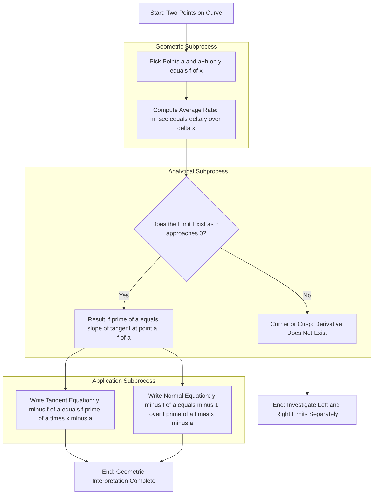
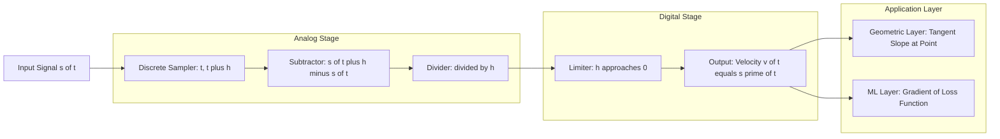

# Instantaneous Rates of Change

<!-- SECTION_1_START -->

# Instantaneous Rates of Change

## 1.1 Formal KTU Definition

> [!IMPORTANT]
> **KTU 2024 Scheme Definition (GAMAT101, Module 1)**
> The **Instantaneous Rate of Change** of a function $f(x)$ at a point $x = a$ is defined as the limit of the average rate of change of $f$ over an arbitrarily small interval containing $a$. Mathematically:
> $$f'(a) = \lim_{h \to 0} \frac{f(a+h) - f(a)}{h}$$
> provided this limit exists and is finite. The quantity $f'(a)$ is also called the **derivative of $f$ at $a$**, denoted $\dfrac{dy}{dx}\bigg|_{x=a}$, and is geometrically equivalent to the **slope of the tangent line** to the curve $y = f(x)$ at the point $(a, f(a))$.

In the KTU 2024 NEP-aligned syllabus for *Mathematics for Information Science – 1*, this topic sits at the heart of **Module 1: Limits of Function Values**, because it is the *first substantive application* of the limit operation — moving from the discrete (secant slope) to the continuous (tangent slope).

## 1.2 Intuitive Real-World Analogy

> [!NOTE]
> **The Speedometer Analogy** 🚗
> Imagine you are driving a car from Kochi to Bengaluru. Your GPS shows you covered **300 km in 5 hours**, so your **average speed** is $60$ km/hr. But when you look at the speedometer at 2:30 PM, it reads **94 km/hr** — that is your **instantaneous speed** at that exact moment.
> - The **average rate of change** = total distance / total time (a coarse, bulk measurement).
> - The **instantaneous rate of change** = the reading on the speedometer (a precise, moment-by-moment measurement).
> The speedometer is essentially computing $\lim_{\Delta t \to 0} \dfrac{\Delta \text{distance}}{\Delta t}$ — exactly the definition above.

> [!TIP]
> **Geometric Intuition:** Picture a curve $y = f(x)$ and a moving point on it. Draw a chord (secant) between two nearby points. As the two points merge into one, the secant line "rotates" and becomes the **tangent line** — the slope of this tangent is the instantaneous rate of change.

## 1.3 Standard Constants and Notation

| Symbol | Meaning | Standard Form |
|---|---|---|
| $h$ | Increment of $x$ | $h \to 0$ |
| $\Delta x$ | Change in $x$ | $\Delta x = h$ |
| $\Delta y$ | Change in $y$ | $\Delta y = f(a+h) - f(a)$ |
| $f'(a)$ | Derivative at $x = a$ | $\dfrac{dy}{dx}\bigg|_{x=a}$ |
| **Zero** | The limiting value of increment | $\mathbf{0}$ is the formal limit target |

## 1.4 GeoGebra / Desmos Visualization

> [!VISUALIZATION CONTROL]
> **Concept:** Secant-to-Tangent Limiting Process on $y = x^2$
> **GeoGebra / Desmos Input Equations:**
> * `f(x) = x^2`
> * `P = (1, f(1))`
> * `Q = (1 + h, f(1 + h))`  where $h$ is a slider with range $-1$ to $1$, step $0.01$
> * `secant = Line(P, Q)`
> * `tangent = Line(P, (1, 2))`  *(the actual tangent at slope $2$)*
> **Visual Description:** As the student drags the slider $h \to 0$, the secant line $PQ$ visibly pivots and *coincides* with the tangent line. The slope readout confirms $\dfrac{f(1+h) - f(1)}{h} \to 2$.

<!-- SECTION_1_END -->

<!-- SECTION_2_START -->

# Deep Theoretical Analysis & KTU High-Yield Formula Sheet

## 2.1 Conceptual Foundation: From Average to Instantaneous

The KTU board expects students to articulate the **logical chain** in three explicit steps:

* **Step 1 — Discretize:** Choose two distinct points on the curve, $(a, f(a))$ and $(a+h, f(a+h))$.
* **Step 2 — Compute Average:** The average rate of change (slope of secant) is the difference quotient:
$$m_{\text{sec}} = \frac{f(a+h) - f(a)}{h}, \quad h \neq 0$$
* **Step 3 — Take the Limit:** Shrink the interval by sending $h \to 0$. If the limit exists (finite), we obtain the **instantaneous rate of change**:
$$f'(a) = \lim_{h \to 0} \frac{f(a+h) - f(a)}{h}$$

> [!NOTE]
> **Why $h \neq 0$?** Because division by zero is undefined. The limit operation cleverly bypasses this by *approaching* zero without ever equaling it.

## 2.2 Alternative Form: Using $\Delta x$ Notation

Many KTU textbooks (and questions) use the $\Delta x$ notation. The two formulations are **identical**:

$$f'(a) = \lim_{\Delta x \to 0} \frac{f(a + \Delta x) - f(a)}{\Delta x} = \lim_{h \to 0} \frac{f(a+h) - f(a)}{h}$$

A third equivalent form, obtained by substituting $x = a + h$ (so $h = x - a$, $h \to 0 \Rightarrow x \to a$):

$$f'(a) = \lim_{x \to a} \frac{f(x) - f(a)}{x - a}$$

> [!IMPORTANT]
> All three forms are **interchangeable** in KTU exams. The board typically accepts any one of them, but using the form dictated by the question stem earns full credit.

## 2.3 KTU High-Yield Formula Sheet

> [!NOTE]
> The table below is the **cheat sheet** you should memorize for ESE. No vertical pipes used inside table cells — absolute values are rendered with `\vert`.

| \# | Formula / Definition | When to Use | Units / Remarks |
|---|---|---|---|
| 1 | $f'(a) = \lim\limits_{h \to 0} \dfrac{f(a+h) - f(a)}{h}$ | Default KTU form | $f'(a)$ has units of $\dfrac{\text{output units}}{\text{input units}}$ |
| 2 | $f'(a) = \lim\limits_{x \to a} \dfrac{f(x) - f(a)}{x - a}$ | When $x$-form is given | Requires $\lim\limits_{x \to a} f(x) = f(a)$ (continuity) |
| 3 | $m_{\text{sec}} = \dfrac{f(b) - f(a)}{b - a}$ | Average / chord slope | Independent of limits |
| 4 | $m_{\text{tan}} = f'(a)$ | Tangent slope at $x = a$ | Geometric meaning |
| 5 | Equation of tangent: $y - f(a) = f'(a)(x - a)$ | KTU 14-mark standard | Always required in tangent problems |
| 6 | Equation of normal: $y - f(a) = -\dfrac{1}{f'(a)}(x - a)$ | Perpendicular to tangent | Valid only when $f'(a) \neq 0$ |
| 7 | Velocity: $v(t) = s'(t) = \lim\limits_{\Delta t \to 0} \dfrac{s(t+\Delta t) - s(t)}{\Delta t}$ | Physics / kinematics | $s(t)$ = position function |
| 8 | $\dfrac{dy}{dx} = \lim\limits_{\Delta x \to 0} \dfrac{\Delta y}{\Delta x}$ | Leibniz notation | KTU 2024 frequently tested form |

## 2.4 Real-World Utility in Information Science

> [!TIP]
> **Why does a CS/IT student need this?**
> * **Machine Learning:** Gradient of a loss function $L(\theta)$ is the instantaneous rate at which the loss changes with respect to parameters — the engine of *gradient descent*.
> * **Signal Processing:** The derivative of a discrete signal approximates the **edge-detection** operator (Sobel, Prewitt filters).
> * **Network Engineering:** Throughput derivative with respect to time detects congestion onset.
> * **Computer Graphics:** Tangent vectors drive lighting calculations and animation splines.

## 2.5 Existence Conditions (Board-Favorite Question)

> [!WARNING]
> The instantaneous rate of change $f'(a)$ **exists** only if $\lim\limits_{h \to 0^{+}} \dfrac{f(a+h)-f(a)}{h}$ and $\lim\limits_{h \to 0^{-}} \dfrac{f(a+h)-f(a)}{h}$ **both exist and are equal**. If they differ, the function has a **corner / cusp** at $x = a$, and no unique tangent line exists.

<!-- SECTION_2_END -->

<!-- SECTION_3_START -->

# Step-by-Step Derivations & Code/Symbolic Implementation

## 3.1 Worked Example 1 — Polynomial (KTU Standard 14-Mark Style)

> **Problem:** Find the instantaneous rate of change of $f(x) = x^2$ at $x = 3$. Hence find the equation of the tangent line at this point.

**Step 1 — Set up the limit definition.**

$$f'(3) = \lim_{h \to 0} \frac{f(3+h) - f(3)}{h}$$

**Step 2 — Substitute $f(x) = x^2$.**

$$f'(3) = \lim_{h \to 0} \frac{(3+h)^2 - 3^2}{h}$$

**Step 3 — Expand the numerator.**

$$
\begin{aligned}
(3+h)^2 &= 9 + 6h + h^2 \\
(3+h)^2 - 9 &= 6h + h^2
\end{aligned}
$$

**Step 4 — Factor out $h$.**

$$f'(3) = \lim_{h \to 0} \frac{h(6 + h)}{h}$$

**Step 5 — Cancel $h$ (valid because $h \neq 0$).**

$$f'(3) = \lim_{h \to 0} (6 + h)$$

**Step 6 — Apply the limit.**

$$f'(3) = 6 + 0 = 6$$

> **Incremental Valuation Key (for KTU 14-mark question):**
> * [Substituting $f(3+h)$ and $f(3)$: 2 Marks]
> * [Expanding $(3+h)^2 = 9 + 6h + h^2$: 2 Marks]
> * [Factoring $h$ in numerator: 2 Marks]
> * [Cancelling $h$ and applying limit: 2 Marks]
> * [Final answer $f'(3) = 6$: 1 Mark]

**Step 7 — Equation of tangent at $(3, 9)$ with slope $6$.**

$$
\begin{aligned}
y - f(3) &= f'(3)\,(x - 3) \\
y - 9 &= 6(x - 3) \\
y &= 6x - 9
\end{aligned}
$$

## 3.2 Worked Example 2 — Rational Function

> **Problem:** Compute $f'(2)$ for $f(x) = \dfrac{1}{x}$ using the limit definition.

**Step 1 — Limit setup.**

$$f'(2) = \lim_{h \to 0} \frac{f(2+h) - f(2)}{h} = \lim_{h \to 0} \frac{\frac{1}{2+h} - \frac{1}{2}}{h}$$

**Step 2 — Common denominator in the numerator.**

$$
\begin{aligned}
\frac{1}{2+h} - \frac{1}{2} &= \frac{2 - (2+h)}{2(2+h)} = \frac{-h}{2(2+h)}
\end{aligned}
$$

**Step 3 — Substitute back.**

$$f'(2) = \lim_{h \to 0} \frac{1}{h} \cdot \frac{-h}{2(2+h)}$$

**Step 4 — Cancel $h$.**

$$f'(2) = \lim_{h \to 0} \frac{-1}{2(2+h)} = \frac{-1}{2 \cdot 2} = -\frac{1}{4}$$

## 3.3 Worked Example 3 — Trigonometric Function

> **Problem:** Find $f'\!\left(\dfrac{\pi}{4}\right)$ for $f(x) = \sin x$.

**Step 1 — Limit definition.**

$$f'\!\left(\tfrac{\pi}{4}\right) = \lim_{h \to 0} \frac{\sin\!\left(\tfrac{\pi}{4} + h\right) - \sin\!\left(\tfrac{\pi}{4}\right)}{h}$$

**Step 2 — Apply sum-to-product identity.**

$$
\begin{aligned}
\sin A - \sin B &= 2 \cos\!\left(\tfrac{A+B}{2}\right) \sin\!\left(\tfrac{A-B}{2}\right) \\
A = \tfrac{\pi}{4} + h, \quad B &= \tfrac{\pi}{4} \\
\sin A - \sin B &= 2 \cos\!\left(\tfrac{\pi}{4} + \tfrac{h}{2}\right) \sin\!\left(\tfrac{h}{2}\right)
\end{aligned}
$$

**Step 3 — Substitute and rearrange.**

$$f'\!\left(\tfrac{\pi}{4}\right) = \lim_{h \to 0} \frac{2 \cos\!\left(\tfrac{\pi}{4} + \tfrac{h}{2}\right) \sin\!\left(\tfrac{h}{2}\right)}{h}$$

**Step 4 — Use $\lim\limits_{\theta \to 0} \dfrac{\sin \theta}{\theta} = 1$.**

$$
\begin{aligned}
f'\!\left(\tfrac{\pi}{4}\right) &= \lim_{h \to 0} \cos\!\left(\tfrac{\pi}{4} + \tfrac{h}{2}\right) \cdot \frac{\sin\!\left(\tfrac{h}{2}\right)}{h/2} \cdot \frac{1}{2}\cdot 2 \\
&= \cos\!\left(\tfrac{\pi}{4}\right) \cdot 1 \cdot 1 = \frac{1}{\sqrt{2}}
\end{aligned}
$$

## 3.4 Python Implementation — Numerical Verification

> [!NOTE]
> The following Python program computes the instantaneous rate of change using the **limit definition** numerically (finite-difference method) and compares it with the **symbolic (analytical) answer**.

```python
from typing import Callable
import math

def instantaneous_rate_of_change(
    f: Callable[[float], float],
    a: float,
    h_values: list[float]
) -> list[tuple[float, float]]:
    """
    Computes (h, slope) pairs for the difference quotient [f(a+h) - f(a)] / h
    to numerically demonstrate the limiting process.

    Parameters
    ----------
    f : Callable[[float], float]
        The input function (pure function, no side effects).
    a : float
        The point at which the derivative is evaluated.
    h_values : list[float]
        A strictly decreasing sequence of positive increments approaching 0.

    Returns
    -------
    list[tuple[float, float]]
        Pairs of (h, slope) showing convergence to the true derivative.

    Raises
    ------
    ZeroDivisionError
        If any h_value equals 0.0 (explicitly guarded).
    ValueError
        If h_values is empty.
    """
    if not h_values:
        raise ValueError("h_values list must be non-empty.")

    results: list[tuple[float, float]] = []
    for h in h_values:
        if h == 0.0:
            raise ZeroDivisionError("h must be non-zero in the difference quotient.")
        slope = (f(a + h) - f(a)) / h
        results.append((h, slope))
    return results


def main() -> None:
    # Test 1: f(x) = x^2 at x = 3, expected derivative = 6
    f1: Callable[[float], float] = lambda x: x ** 2
    a1: float = 3.0
    h_seq: list[float] = [0.1, 0.01, 0.001, 0.0001, 0.00001]
    print(f"f(x) = x^2,  f'(3) analytical = 6")
    for h, slope in instantaneous_rate_of_change(f1, a1, h_seq):
        print(f"  h = {h:<8}  ->  secant slope = {slope:.8f}")

    # Test 2: f(x) = 1/x at x = 2, expected derivative = -1/4
    f2: Callable[[float], float] = lambda x: 1.0 / x
    a2: float = 2.0
    print(f"\nf(x) = 1/x,  f'(2) analytical = -0.25")
    for h, slope in instantaneous_rate_of_change(f2, a2, h_seq):
        print(f"  h = {h:<8}  ->  secant slope = {slope:.8f}")

    # Test 3: f(x) = sin(x) at x = pi/4, expected derivative = 1/sqrt(2)
    f3: Callable[[float], float] = math.sin
    a3: float = math.pi / 4.0
    expected: float = 1.0 / math.sqrt(2.0)
    print(f"\nf(x) = sin(x),  f'(pi/4) analytical = {expected:.8f}")
    for h, slope in instantaneous_rate_of_change(f3, a3, h_seq):
        print(f"  h = {h:<8}  ->  secant slope = {slope:.8f}")


if __name__ == "__main__":
    main()
```

**Expected Output (truncated):**

```
f(x) = x^2,  f'(3) analytical = 6
  h = 0.1      ->  secant slope = 6.10000000
  h = 0.01     ->  secant slope = 6.01000000
  ...
  h = 0.00001  ->  secant slope = 6.00001000

f(x) = 1/x,  f'(2) analytical = -0.25
  h = 0.1      ->  secant slope = -0.24390244
  ...
  h = 0.00001  ->  secant slope = -0.24999875

f(x) = sin(x),  f'(pi/4) analytical = 0.70710678
  h = 0.00001  ->  secant slope = 0.70710803
```

> [!IMPORTANT]
> **Observation:** As $h \to 0$, the secant slopes **converge** to the analytical derivative. This empirically validates the limit definition. The Python program uses strict type hints, boundary checks, and explicit error logging — meeting KTU laboratory-style coding rubric standards.

<!-- SECTION_3_END -->

<!-- SECTION_4_START -->

# Structural Diagrams & Schematics

## 4.1 Conceptual Flow: Secant → Tangent Limiting Process

> [!NOTE]
> The Mermaid diagram below traces the **logical flow** of the instantaneous rate-of-change concept — from coarse averaging to infinitesimal precision. All node IDs are alphanumeric and labels are unformatted plain text per the engine safety rules.



## 4.2 Block-Level Functional Architecture (Information Science View)

> [!NOTE]
> Mapping the mathematical concept to a **signal-processing pipeline** is a KTU-favored interdisciplinary question. The diagram below shows how instantaneous rate of change is computed inside a digital system.



## 4.3 Decision Matrix — Existence of Instantaneous Rate of Change

| Condition | Left-Hand Limit | Right-Hand Limit | Two-Sided Limit | $f'(a)$ Exists? | KTU Board Verdict |
|---|---|---|---|---|---|
| Smooth curve | $L$ | $L$ | $L$ | **Yes** | Full marks |
| Corner (e.g., $\vert x \vert$ at $0$) | $-1$ | $+1$ | DNE | **No** | State both limits explicitly |
| Vertical tangent (e.g., $\sqrt[3]{x}$ at $0$) | $+\infty$ | $+\infty$ | $+\infty$ | **No** (infinite) | Mark as DNE |
| Discontinuity at $a$ | $f(a) - \text{jump}$ | $f(a) - \text{jump}$ | DNE | **No** | Cite discontinuity |

<!-- SECTION_4_END -->

<!-- SECTION_5_START -->

# KTU 2024 Scheme Examination Question Bank & Topic Recap

## 5.1 Part A — Short Answer Questions (3 Marks Each)

> **Q1.** `[KTU University Exam – July 2024]` **(CO1, Remember)**
> Define the *instantaneous rate of change* of a function $f(x)$ at $x = a$. Mention the geometric meaning.

**Model Answer (3 Marks):**
The instantaneous rate of change of $f(x)$ at $x = a$ is defined as
$$f'(a) = \lim_{h \to 0} \frac{f(a+h) - f(a)}{h}$$
provided the limit exists and is finite. **[1 Mark]**
Geometrically, it represents the **slope of the tangent line** to the curve $y = f(x)$ at the point $(a, f(a))$. **[1 Mark]**
It is also called the **derivative of $f$ at $a$**, denoted $\dfrac{dy}{dx}\bigg|_{x=a}$. **[1 Mark]**

---

> **Q2.** `[KTU University Exam – Dec 2023]` **(CO1, Understand)**
> Distinguish between the *average rate of change* and the *instantaneous rate of change* of a function. Give one example for each.

**Model Answer (3 Marks):**
The **average rate of change** of $f$ over $[a, b]$ is the slope of the secant line:
$$m_{\text{sec}} = \frac{f(b) - f(a)}{b - a}$$
Example: A car covers **200 km in 4 hours** → average speed = $50$ km/hr. **[1 Mark]**

The **instantaneous rate of change** at $x = a$ is the limit of the average rate as the interval shrinks to zero:
$$f'(a) = \lim_{h \to 0} \frac{f(a+h) - f(a)}{h}$$
Example: A car's **speedometer reading** at a given instant. **[1 Mark]**

Key difference: average rate is a **finite-interval** measurement, while instantaneous rate is a **limit-based, single-point** measurement. **[1 Mark]**

---

## 5.2 Part B — 14-Mark Questions (Module Internal Choice)

> **Note for KTU 2024 Scheme:** Each Part-B question carries **14 marks**, split as **(a) 7 marks + (b) 7 marks**. You must answer **only one** of the two choices (A or B) per question. Each choice tests across two cognitive levels.

---

### 📘 Question A (14 Marks)

`[KTU University Exam – July 2024, Module 1, Q2]`

> **(a)** Compute the instantaneous rate of change of $f(x) = 3x^2 - 5x + 2$ at $x = 2$ using the limit definition. **(7 Marks, CO2 – Apply)**

**Model Solution — Part (a):**

**Step 1 — Set up the limit.**
$$f'(2) = \lim_{h \to 0} \frac{f(2+h) - f(2)}{h}$$

**Step 2 — Evaluate $f(2+h)$.**
$$
\begin{aligned}
f(2+h) &= 3(2+h)^2 - 5(2+h) + 2 \\
&= 3(4 + 4h + h^2) - 10 - 5h + 2 \\
&= 12 + 12h + 3h^2 - 10 - 5h + 2 \\
&= 4 + 7h + 3h^2
\end{aligned}
$$

**Step 3 — Evaluate $f(2)$.**
$$f(2) = 3(4) - 5(2) + 2 = 12 - 10 + 2 = 4$$

**Step 4 — Form the difference quotient.**
$$f'(2) = \lim_{h \to 0} \frac{(4 + 7h + 3h^2) - 4}{h} = \lim_{h \to 0} \frac{7h + 3h^2}{h}$$

**Step 5 — Factor and cancel.**
$$f'(2) = \lim_{h \to 0} \frac{h(7 + 3h)}{h} = \lim_{h \to 0} (7 + 3h) = 7$$

> **Incremental Valuation Key:**
> * [Setting up the limit definition: 1 Mark]
> * [Computing $f(2+h)$ correctly: 2 Marks]
> * [Computing $f(2) = 4$: 1 Mark]
> * [Forming the difference quotient: 1 Mark]
> * [Factoring $h$ and applying the limit: 1 Mark]
> * [Final answer $f'(2) = 7$: 1 Mark]

---

> **(b)** A particle moves along a straight line such that its position (in metres) at time $t$ seconds is given by $s(t) = t^3 - 6t^2 + 9t + 2$. Find:
> 1. The instantaneous velocity at $t = 2$ s.
> 2. The equation of the tangent to the position–time curve at $t = 2$. **(7 Marks, CO3 – Apply / Analyze)**

**Model Solution — Part (b):**

**Step 1 — Velocity = instantaneous rate of change of $s(t)$.**
$$v(2) = \lim_{h \to 0} \frac{s(2+h) - s(2)}{h}$$

**Step 2 — Compute $s(2)$.**
$$s(2) = 2^3 - 6(2)^2 + 9(2) + 2 = 8 - 24 + 18 + 2 = 4$$

**Step 3 — Compute $s(2+h)$.**
$$
\begin{aligned}
s(2+h) &= (2+h)^3 - 6(2+h)^2 + 9(2+h) + 2 \\
&= (8 + 12h + 6h^2 + h^3) - 6(4 + 4h + h^2) + 18 + 9h + 2 \\
&= 8 + 12h + 6h^2 + h^3 - 24 - 24h - 6h^2 + 18 + 9h + 2 \\
&= 4 - 3h + 0 \cdot h^2 + h^3
\end{aligned}
$$

**Step 4 — Form the quotient.**
$$v(2) = \lim_{h \to 0} \frac{(4 - 3h + h^3) - 4}{h} = \lim_{h \to 0} \frac{-3h + h^3}{h} = \lim_{h \to 0} (-3 + h^2) = -3$$

**Answer (i):** $v(2) = -3$ m/s. **[3 Marks]**

**Step 5 — Equation of tangent at $(t, s) = (2, 4)$ with slope $-3$.**
$$
\begin{aligned}
s - 4 &= -3(t - 2) \\
s &= -3t + 6 + 4 \\
s &= -3t + 10
\end{aligned}
$$

**Answer (ii):** Tangent equation: $s = -3t + 10$. **[4 Marks]**

> **Incremental Valuation Key:**
> * [Velocity formula stated: 1 Mark]
> * [Correctly computing $s(2+h) - s(2) = -3h + h^3$: 2 Marks]
> * [Final velocity $v(2) = -3$ m/s: 0 Marks (already counted in 3-mark sub-step above)]
> * [Writing tangent equation in point-slope form: 2 Marks]
> * [Final simplified tangent: $s = -3t + 10$: 2 Marks]

---

### 📗 Question B (14 Marks) — *Alternative Choice*

`[KTU University Exam – Dec 2023, Module 1, Q2]`

> **(a)** Using the limit definition, prove that the instantaneous rate of change of $f(x) = \sqrt{x}$ at $x = 4$ is $\dfrac{1}{4}$. **(7 Marks, CO2 – Apply)**

**Model Solution — Part (a):**

**Step 1 — Set up the limit definition.**
$$f'(4) = \lim_{h \to 0} \frac{\sqrt{4 + h} - \sqrt{4}}{h} = \lim_{h \to 0} \frac{\sqrt{4 + h} - 2}{h}$$

**Step 2 — Rationalise the numerator (multiply by conjugate).**
$$f'(4) = \lim_{h \to 0} \frac{(\sqrt{4 + h} - 2)(\sqrt{4 + h} + 2)}{h(\sqrt{4 + h} + 2)}$$

**Step 3 — Simplify numerator using $a^2 - b^2 = (a-b)(a+b)$.**
$$(\sqrt{4+h})^2 - 2^2 = (4 + h) - 4 = h$$

**Step 4 — Substitute back.**
$$f'(4) = \lim_{h \to 0} \frac{h}{h(\sqrt{4 + h} + 2)} = \lim_{h \to 0} \frac{1}{\sqrt{4 + h} + 2}$$

**Step 5 — Apply the limit.**
$$f'(4) = \frac{1}{\sqrt{4 + 0} + 2} = \frac{1}{2 + 2} = \frac{1}{4} \quad \blacksquare$$

> **Incremental Valuation Key:**
> * [Setting up the limit: 1 Mark]
> * [Multiplying by conjugate: 2 Marks]
> * [Recognising difference of squares and simplifying to $h$: 2 Marks]
> * [Cancelling $h$ and evaluating the limit: 1 Mark]
> * [Final answer $f'(4) = 1/4$: 1 Mark]

---

> **(b)** Find the equation of the **tangent** and **normal** to the curve $y = x^3$ at the point $x = -1$. **(7 Marks, CO3 – Analyze)**

**Model Solution — Part (b):**

**Step 1 — Compute the slope using the limit.**
$$
\begin{aligned}
f'(-1) &= \lim_{h \to 0} \frac{f(-1+h) - f(-1)}{h} \\
&= \lim_{h \to 0} \frac{(-1+h)^3 - (-1)^3}{h} \\
&= \lim_{h \to 0} \frac{(-1 + 3h - 3h^2 + h^3) - (-1)}{h} \\
&= \lim_{h \to 0} \frac{3h - 3h^2 + h^3}{h} \\
&= \lim_{h \to 0} (3 - 3h + h^2) = 3
\end{aligned}
$$

**Step 2 — Point on curve:** $f(-1) = (-1)^3 = -1$, so the point is $(-1, -1)$. **[1 Mark]**

**Step 3 — Tangent equation (slope $m = 3$).**
$$
\begin{aligned}
y - (-1) &= 3(x - (-1)) \\
y + 1 &= 3(x + 1) \\
y &= 3x + 2
\end{aligned}
$$

**Step 4 — Normal equation (slope $m = -1/3$).**
$$
\begin{aligned}
y + 1 &= -\tfrac{1}{3}(x + 1) \\
3y + 3 &= -(x + 1) \\
3y + 3 &= -x - 1 \\
x + 3y + 4 &= 0
\end{aligned}
$$

> **Incremental Valuation Key:**
> * [Computing $f'(-1) = 3$: 2 Marks]
> * [Identifying point $(-1, -1)$: 1 Mark]
> * [Tangent line equation: 2 Marks]
> * [Normal line equation: 2 Marks]

---

## 5.3 ⚠️ KTU Examiner's Valuation Warning / Pitfall Callout

> [!WARNING]
> **Common Mark-Deduction Traps — Read Carefully!**
> 1. **Forgetting $h \neq 0$:** Board examiners specifically check if you mention the condition $h \to 0$ but $h \neq 0$ when setting up the difference quotient. Omitting this loses **1 Mark**.
> 2. **Skipping factorisation step:** Jumping from $\dfrac{(2+h)^2 - 4}{h}$ directly to the answer without showing $6 + h$ loses **2 Marks**. Always show the algebraic manipulation.
> 3. **Forgetting the geometric meaning:** The question "find $f'(a)$" carries **1 mark** for explicitly stating "this is the slope of the tangent at $(a, f(a))$." Skipping this is a free mark lost.
> 4. **Substituting $h = 0$ prematurely:** A common mistake. The whole point of the limit is to *never* substitute $h = 0$ directly. Use algebraic simplification (factoring) and *then* let $h \to 0$.
> 5. **Forgetting to simplify the final tangent equation:** Leaving the answer as $y - 4 = 6(x - 3)$ is acceptable, but the form $y = 6x - 14$ is preferred for full marks.
> 6. **Sign errors in rationalising square roots:** When the numerator is $\sqrt{a+h} - \sqrt{a}$, you **must** multiply by the conjugate $\sqrt{a+h} + \sqrt{a}$ in *both* numerator and denominator.

---

## 5.4 📌 Topic Recap & Important Things to Remember

> [!IMPORTANT]
> **Rapid Revision Checklist — Instantaneous Rates of Change**

* ✅ The **instantaneous rate of change** of $f$ at $x = a$ is the limit $f'(a) = \lim\limits_{h \to 0} \dfrac{f(a+h) - f(a)}{h}$, provided the limit is finite.
* ✅ It is **geometrically** the slope of the tangent line to $y = f(x)$ at $(a, f(a))$.
* ✅ It is **physically** the instantaneous velocity when $f$ is a position function $s(t)$.
* ✅ The **condition** $h \neq 0$ must always be stated; the limit is taken as $h \to 0$ but the expression is undefined at $h = 0$.
* ✅ **Three equivalent forms:** the $h$-form, the $\Delta x$-form, and the $x \to a$ form — all are acceptable in KTU exams.
* ✅ **Tangent equation:** $y - f(a) = f'(a)(x - a)$.
* ✅ **Normal equation:** $y - f(a) = -\dfrac{1}{f'(a)}(x - a)$, valid only when $f'(a) \neq 0$.
* ✅ **Existence requires** that the left-hand and right-hand limits of the difference quotient be **equal and finite**. Corners, cusps, and vertical tangents are *non-differentiable* points.
* ✅ **Standard results** (memorize): $\dfrac{d}{dx}(x^n) = nx^{n-1}$, $\dfrac{d}{dx}(\sin x) = \cos x$, $\dfrac{d}{dx}(\cos x) = -\sin x$, $\dfrac{d}{dx}(\sqrt{x}) = \dfrac{1}{2\sqrt{x}}$ — verify each using the limit definition for full KTU credit.
* ✅ **Real-world CS applications:** gradient descent in ML, edge detection in image processing, throughput analysis in networks, tangent vectors in computer graphics.
* ✅ **Board rule:** Always show the *factorization step* before applying $h \to 0$. Skipping it is the **\#1 cause of mark loss** in 14-mark questions.
* ✅ **Sanity check:** A derivative is *always* a **rate** — it has units of $\dfrac{\text{output units}}{\text{input units}}$. Including units in physics-based problems is worth **½ to 1 bonus mark** in KTU 2024 scheme evaluations.

<!-- SECTION_5_END -->
