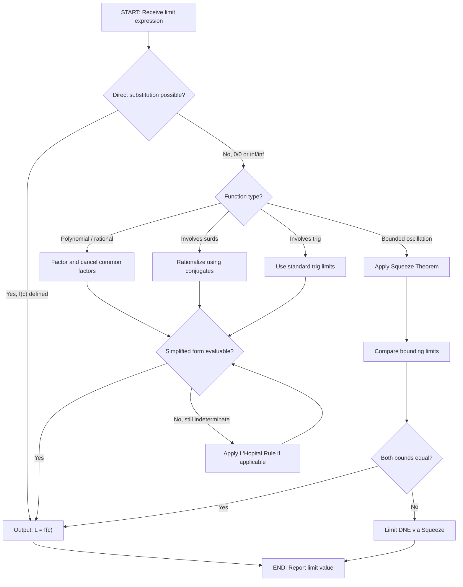
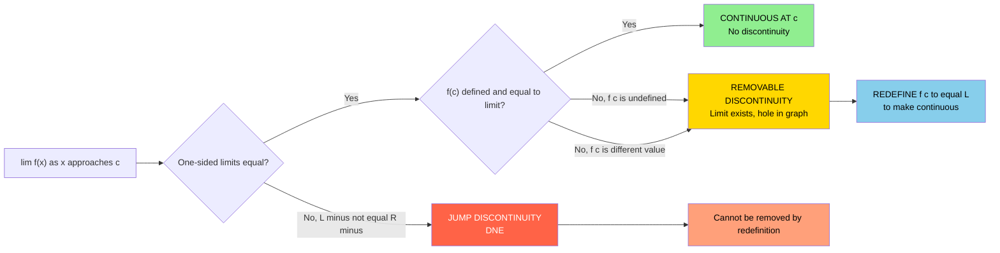
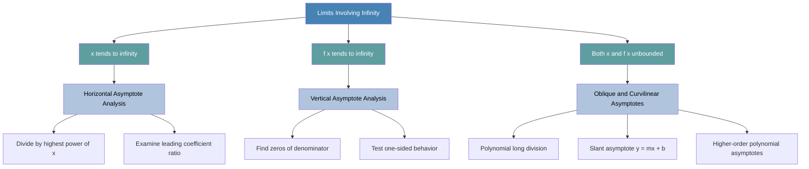
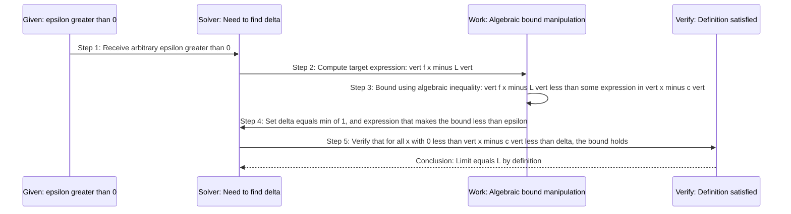

# Limits of Function Values

<!-- SECTION_1_START -->

# Module 1: Limits of Function Values — Foundational Concepts

## 1.1 The Core Technical Definition (KTU 2024 Syllabus Standard)

> [!IMPORTANT]
> **Definition (Limit of a Function — Epsilon–Delta Formulation)**
> Let $f : D \to \mathbb{R}$ be a real-valued function defined on a domain $D \subseteq \mathbb{R}$, and let $c$ be a **limit point** (cluster point) of $D$. We say that the limit of $f(x)$ as $x$ approaches $c$ equals the real number $L$, written as
> $$\lim_{x \to c} f(x) = L,$$
> if and only if for every $\varepsilon > 0$ (no matter how small), there exists a corresponding $\delta > 0$ such that for **all** $x \in D$ satisfying $0 < \vert x - c \vert < \delta$, the following inequality holds:
> $$\vert f(x) - L \vert < \varepsilon.$$

In plain words: by forcing $x$ to stay sufficiently close to $c$ (within $\delta$), we can make $f(x)$ arbitrarily close to $L$ (within $\varepsilon$). The value of $f$ *at* $c$ itself is irrelevant; the limit only cares about what happens **near** $c$.

> [!NOTE]
> **Why is the limit point condition crucial?**
> If $c$ is not a limit point of $D$, then we can always choose $\delta$ small enough so that no $x \neq c$ in $D$ lies within $\delta$ of $c$, making the condition vacuously true. Hence the existence of a limit requires $c$ to be approachable from $D$ by points other than itself.

### Key Notations Used in KTU 2024 Scheme

| Notation | Verbal Reading | Domain of Application |
|:---:|:---|:---|
| $\lim_{x \to c} f(x) = L$ | Limit of $f(x)$ as $x$ approaches $c$ equals $L$ | Standard two-sided limit |
| $\lim_{x \to c^{+}} f(x) = L$ | Right-hand limit of $f$ at $c$ | $x$ approaches $c$ from values greater than $c$ |
| $\lim_{x \to c^{-}} f(x) = L$ | Left-hand limit of $f$ at $c$ | $x$ approaches $c$ from values less than $c$ |
| $\lim_{x \to \infty} f(x) = L$ | Limit of $f$ as $x$ tends to infinity | Behavior at the right tail |
| $\lim_{x \to -\infty} f(x) = L$ | Limit of $f$ as $x$ tends to negative infinity | Behavior at the left tail |
| $\lim_{x \to c} f(x) = \infty$ | $f$ grows without bound near $c$ | Vertical asymptote behavior |

### Conceptual Analogy — The "Magnetic Target" Intuition

Imagine $L$ as a **magnet** placed at coordinate $L$ on the $y$-axis. The function $f(x)$ generates a tiny moving charge. As the input $x$ slides along the $x$-axis and gets closer and closer to the forbidden point $c$, the magnetic pull drags $f(x)$ closer and closer to the target $L$. The $\varepsilon$–$\delta$ definition is simply a precise, mathematical promise: *"No matter how tight the noose (small $\varepsilon$) you place around $L$, I can find a small neighborhood (radius $\delta$) around $c$ such that $f(x)$ never escapes the noose."*

> [!TIP]
> **Engineering Connection for Information Science Students**
> In computer science, the notion of *asymptotic complexity* (Big-O, Big-Theta) is a direct descendant of the limit concept. For instance, $f(n) = O(g(n))$ essentially means $\lim_{n \to \infty} \dfrac{f(n)}{g(n)}$ is bounded. Limits also govern the convergence analysis of iterative algorithms (gradient descent, Newton's method), signal processing (Fourier coefficients decay), and neural network training (loss curves plateauing).

### One-Sided Limits — Definitions and Symmetry

A two-sided limit $\lim_{x \to c} f(x) = L$ **exists if and only if** both one-sided limits exist and are equal:

$$\lim_{x \to c} f(x) = L \iff \lim_{x \to c^{+}} f(x) = \lim_{x \to c^{-}} f(x) = L.$$

> [!IMPORTANT]
> **Definition (Right-Hand Limit)**
> $\lim_{x \to c^{+}} f(x) = L$ if for every $\varepsilon > 0$, there exists $\delta > 0$ such that for all $x \in D$ with $c < x < c + \delta$, we have $\vert f(x) - L \vert < \varepsilon$.

> [!IMPORTANT]
> **Definition (Left-Hand Limit)**
> $\lim_{x \to c^{-}} f(x) = L$ if for every $\varepsilon > 0$, there exists $\delta > 0$ such that for all $x \in D$ with $c - \delta < x < c$, we have $\vert f(x) - L \vert < \varepsilon$.

### Infinite Limits — Behavior Near Vertical Asymptotes

When $f(x)$ grows without bound as $x$ approaches $c$, we write $\lim_{x \to c} f(x) = \infty$ (or $-\infty$). Formally, for every $M > 0$, there exists $\delta > 0$ such that $0 < \vert x - c \vert < \delta$ implies $f(x) > M$.

> [!VISUALIZATION CONTROL]
> **Concept:** Graphical behavior of $\lim_{x \to 0} \dfrac{1}{x^{2}} = +\infty$ and $\lim_{x \to 0} \dfrac{1}{x}$ (sign difference on each side).
> **GeoGebra / Desmos Input Equations:**
> * `f(x) = 1 / x^2` — produces a U-shaped curve opening upward, blowing up to $+\infty$ on **both** sides of $x = 0$.
> * `g(x) = 1 / x` — produces two branches: right branch shoots to $+\infty$, left branch plunges to $-\infty$.
> **Visual Description:** On the $xy$-plane, the student should observe that at $x = 0$ a vertical dashed line (asymptote) is approached. The first curve is **symmetric** about the $y$-axis and goes up; the second is **antisymmetric** and changes sign. This contrast demonstrates why "one-sided" limits are required for $1/x$ but not for $1/x^{2}$.

### Limits at Infinity — End Behavior

The expression $\lim_{x \to \infty} f(x) = L$ means: for every $\varepsilon > 0$, there exists a real number $N$ such that $x > N$ implies $\vert f(x) - L \vert < \varepsilon$. Geometrically, the curve $y = f(x)$ gets trapped inside a horizontal band of width $2\varepsilon$ centered on $y = L$ for all sufficiently large $x$.

<!-- SECTION_1_END -->

<!-- SECTION_2_START -->

# Deep Theoretical Analysis & KTU High-Yield Formula Sheet

## 2.1 The Algebra of Limits (Limit Theorems)

These are the workhorse rules. Assume $\lim_{x \to c} f(x) = L$ and $\lim_{x \to c} g(x) = M$, where $L, M \in \mathbb{R}$. Then:

| # | Rule Name | Mathematical Statement |
|:---:|:---|:---|
| 1 | Constant Rule | $\lim_{x \to c} k = k$, for any constant $k \in \mathbb{R}$ |
| 2 | Identity Rule | $\lim_{x \to c} x = c$ |
| 3 | Sum Rule | $\lim_{x \to c} [f(x) + g(x)] = L + M$ |
| 4 | Difference Rule | $\lim_{x \to c} [f(x) - g(x)] = L - M$ |
| 5 | Product Rule | $\lim_{x \to c} [f(x) \cdot g(x)] = L \cdot M$ |
| 6 | Constant Multiple Rule | $\lim_{x \to c} [k \cdot f(x)] = kL$ |
| 7 | Quotient Rule | $\lim_{x \to c} \dfrac{f(x)}{g(x)} = \dfrac{L}{M}$, provided $M \neq 0$ |
| 8 | Power Rule | $\lim_{x \to c} [f(x)]^{n} = L^{n}$, for $n \in \mathbb{Z}^{+}$ |
| 9 | Root Rule | $\lim_{x \to c} \sqrt[n]{f(x)} = \sqrt[n]{L}$, provided the $n$-th root is defined |
| 10 | Composition Rule | If $f$ is continuous at $L$, then $\lim_{x \to c} g(f(x)) = f(\lim_{x \to c} g(x)) = f(L)$ |

> [!NOTE]
> **Caution with the Quotient Rule:** If $M = 0$ and $L \neq 0$, the limit is $\pm \infty$ (depending on sign analysis). If both $L = 0$ and $M = 0$, we get the **indeterminate form $0/0$** and must apply algebraic simplification techniques.

## 2.2 Indeterminate Forms — The "Seven Deadly" List

When direct substitution yields a non-determinable form, we must transform the expression algebraically. The standard indeterminate forms recognized by KTU examiners are:

| Indeterminate Form | Trigger Condition | Typical Resolution Strategy |
|:---:|:---|:---|
| $\dfrac{0}{0}$ | Both numerator and denominator vanish at $c$ | Factor, rationalize, or use L'Hôpital's Rule |
| $\dfrac{\infty}{\infty}$ | Both grow without bound | Divide by highest power of $x$ in denominator |
| $0 \cdot \infty$ | Product of a vanishing and unbounded term | Rewrite as a quotient $\dfrac{0}{1/\infty}$ or $\dfrac{\infty}{1/0}$ |
| $\infty - \infty$ | Difference of two unbounded terms | Common denominator or rationalization |
| $1^{\infty}$ | Base near 1, exponent unbounded | Take $\ln$, convert to $\infty \cdot 0$ form |
| $0^{0}$ | Base and exponent both vanish | Take $\ln$, convert to $0 \cdot (-\infty)$ |
| $\infty^{0}$ | Unbounded base, vanishing exponent | Take $\ln$, convert to $0 \cdot \infty$ |

> [!WARNING]
> **Forms that LOOK indeterminate but are not:** Expressions like $\dfrac{1}{0}$, $0^{1}$, $\infty^{1}$, $1^{\infty}$ (without proper analysis), $0/5$ — these are **determinate** and have definite values ($\infty$, $0$, $\infty$, etc.). Examiners frequently test whether students can distinguish.

## 2.3 The Squeeze (Sandwich) Theorem

> [!IMPORTANT]
> **Squeeze Theorem Statement**
> Let $f$, $g$, $h$ be three functions defined on an open interval containing $c$ (except possibly at $c$ itself). Suppose that for all $x$ near $c$ (with $x \neq c$):
> $$g(x) \leq f(x) \leq h(x).$$
> If $\lim_{x \to c} g(x) = \lim_{x \to c} h(x) = L$, then $\lim_{x \to c} f(x) = L$.

**Why this matters in practice:** Many trigonometric limits cannot be computed by direct substitution or algebraic simplification alone. The Squeeze Theorem is the bridge — for example, to prove $\lim_{x \to 0} \dfrac{\sin x}{x} = 1$, one shows that $\cos x \leq \dfrac{\sin x}{x} \leq 1$ near $x = 0$, and both bounding functions have limit $1$.

## 2.4 KTU High-Yield Formula Sheet — Standard Limits to Memorize

| # | Limit Expression | Value | Domain of Validity | Engineering Use Case |
|:---:|:---|:---:|:---|:---|
| 1 | $\lim_{x \to 0} \dfrac{\sin x}{x}$ | $1$ | $x$ in radians | Signal processing, AC analysis |
| 2 | $\lim_{x \to 0} \dfrac{\tan x}{x}$ | $1$ | $x$ in radians | Optics, small-angle approximation |
| 3 | $\lim_{x \to 0} \dfrac{1 - \cos x}{x^{2}}$ | $\dfrac{1}{2}$ | $x$ in radians | Optics, wave interference |
| 4 | $\lim_{x \to 0} \dfrac{\sin(ax)}{bx}$ | $\dfrac{a}{b}$ | $a, b \neq 0$ | Frequency scaling |
| 5 | $\lim_{x \to 0} \dfrac{e^{x} - 1}{x}$ | $1$ | Real $x$ | Continuous compounding |
| 6 | $\lim_{x \to 0} \dfrac{\ln(1 + x)}{x}$ | $1$ | $x > -1$ | Entropy, information theory |
| 7 | $\lim_{x \to 0} (1 + x)^{1/x}$ | $e$ | $x \neq 0$ | Compound interest, $e$ definition |
| 8 | $\lim_{x \to \infty} \left(1 + \dfrac{k}{x}\right)^{x}$ | $e^{k}$ | Real $k$ | Continuous growth models |
| 9 | $\lim_{x \to \infty} \dfrac{a_{n}x^{n} + \cdots}{b_{m}x^{m} + \cdots}$ | $\dfrac{a_{n}}{b_{m}}$ if $n = m$; $0$ if $n < m$; $\infty$ if $n > m$ | $a_{n}, b_{m} \neq 0$ | Asymptotic algorithm complexity |
| 10 | $\lim_{x \to 0^{+}} x^{x}$ | $1$ | $x > 0$ | Numerical stability analysis |

## 2.5 Strategies for Evaluating Limits — A Decision Tree

1. **Direct Substitution**: Try plugging in $x = c$ first. If defined, the limit equals the function value (this implicitly requires continuity at $c$).
2. **Algebraic Simplification**: For $0/0$ forms, factor polynomials, multiply by conjugates, or use trig identities.
3. **Divide by Highest Power**: For $\infty/\infty$ forms with rational functions, divide numerator and denominator by the highest power of $x$ in the denominator.
4. **Squeeze Theorem**: When the function is bounded between two simpler functions with known limits.
5. **Standard Limit Identities**: Convert the given expression into one of the memorized forms (Section 2.4).
6. **L'Hôpital's Rule** (advanced): If the form is $0/0$ or $\infty/\infty$ and $f, g$ are differentiable near $c$ (with $g'(x) \neq 0$), then $\lim_{x \to c} \dfrac{f(x)}{g(x)} = \lim_{x \to c} \dfrac{f'(x)}{g'(x)}$, provided the latter exists.

## 2.6 Real-World Engineering Utility

In **information science and computer engineering**, limits underpin:

- **Algorithm Analysis**: Big-O notation quantifies how runtime $T(n)$ grows as input size $n \to \infty$.
- **Numerical Methods**: Convergence of Newton's method requires the iteration map to be a contraction ($\vert \varphi'(x^{*}) \vert < 1$) near a fixed point.
- **Probability and Statistics**: The Central Limit Theorem uses limit behavior to justify the normal approximation.
- **Machine Learning**: Gradient descent convergence relies on $\lim_{k \to \infty} \Vert \nabla L(w_{k}) \Vert = 0$.
- **Digital Signal Processing**: The Dirichlet kernel $\dfrac{\sin((N + 1/2)\theta)}{\sin(\theta/2)}$ has a famous limit behavior governing filter aliasing.

<!-- SECTION_2_END -->

<!-- SECTION_3_START -->

# Step-by-Step Derivations & Computational Implementation

## 3.1 Worked Example 1 — Polynomial Limit (Direct Substitution)

**Problem:** Evaluate $\lim_{x \to 3} (2x^{3} - 5x + 7)$.

**Step 1.** Identify the type: numerator and denominator are polynomial expressions, no indeterminate form is immediately suggested. Try direct substitution.

$$\lim_{x \to 3} (2x^{3} - 5x + 7) = 2(3)^{3} - 5(3) + 7.$$

**Step 2.** Simplify using order of operations.

$$= 2 \cdot 27 - 15 + 7 = 54 - 15 + 7 = 46.$$

**Conclusion:** $\lim_{x \to 3} (2x^{3} - 5x + 7) = 46$. This works because polynomials are **continuous everywhere**, so the limit equals the function value at the point.

> [!TIP]
> **Valuation Key Point:** The examiner awards full marks even if you only write the final answer 46, but a 1–2 line justification citing continuity is worth 1 mark under KTU's strict valuation scheme.

## 3.2 Worked Example 2 — The $0/0$ Indeterminate Form (Factoring)

**Problem:** Evaluate $\lim_{x \to 2} \dfrac{x^{2} - 4}{x - 2}$.

**Step 1.** Apply direct substitution: numerator becomes $2^{2} - 4 = 0$, denominator becomes $2 - 2 = 0$. This is the indeterminate form $0/0$. We must simplify.

**Step 2.** Factor the numerator using the difference of squares identity: $a^{2} - b^{2} = (a - b)(a + b)$.

$$\dfrac{x^{2} - 4}{x - 2} = \dfrac{(x - 2)(x + 2)}{x - 2}.$$

**Step 3.** Cancel the common factor $(x - 2)$, valid for $x \neq 2$.

$$= x + 2, \quad \text{for } x \neq 2.$$

**Step 4.** Take the limit of the simplified expression by direct substitution.

$$\lim_{x \to 2} (x + 2) = 2 + 2 = 4.$$

**Conclusion:** $\lim_{x \to 2} \dfrac{x^{2} - 4}{x - 2} = 4$.

> [!NOTE]
> **Graphical Insight:** The function $f(x) = \dfrac{x^{2} - 4}{x - 2}$ has a "hole" at the point $(2, 4)$. The function is undefined at $x = 2$, but the limit captures the height the curve *would have* if the hole were filled. This is the prototypical *removable discontinuity*.

## 3.3 Worked Example 3 — Rationalizing the Numerator (Surd Limits)

**Problem:** Evaluate $\lim_{x \to 0} \dfrac{\sqrt{x + 1} - 1}{x}$.

**Step 1.** Direct substitution: numerator $= \sqrt{0+1} - 1 = 1 - 1 = 0$; denominator $= 0$. Indeterminate form $0/0$.

**Step 2.** Rationalize by multiplying numerator and denominator by the conjugate $\sqrt{x+1} + 1$.

$$\dfrac{\sqrt{x+1} - 1}{x} \cdot \dfrac{\sqrt{x+1} + 1}{\sqrt{x+1} + 1} = \dfrac{(\sqrt{x+1})^{2} - 1^{2}}{x(\sqrt{x+1} + 1)}.$$

**Step 3.** Simplify the numerator using $(a-b)(a+b) = a^{2} - b^{2}$.

$$= \dfrac{(x + 1) - 1}{x(\sqrt{x+1} + 1)} = \dfrac{x}{x(\sqrt{x+1} + 1)}.$$

**Step 4.** Cancel the factor $x$ (valid for $x \neq 0$).

$$= \dfrac{1}{\sqrt{x+1} + 1}.$$

**Step 5.** Take the limit by direct substitution.

$$\lim_{x \to 0} \dfrac{1}{\sqrt{x+1} + 1} = \dfrac{1}{\sqrt{0+1} + 1} = \dfrac{1}{1+1} = \dfrac{1}{2}.$$

**Conclusion:** $\lim_{x \to 0} \dfrac{\sqrt{x+1} - 1}{x} = \dfrac{1}{2}$.

## 3.4 Worked Example 4 — The Trigonometric Cardinal Limit

**Problem:** Prove $\lim_{x \to 0} \dfrac{\sin x}{x} = 1$ using the Squeeze Theorem.

**Step 1.** Geometric setup. Consider a unit circle with center $O = (0, 0)$. Let $P$ be the point on the circle at angle $x > 0$ (in radians), and let $T = (1, \tan x)$ be the intersection of the line $OP$ extended with the vertical line $x = 1$. Construct a point $A = (1, 0)$.

**Step 2.** Compare three areas (assuming $0 < x < \pi/2$):
* Area of triangle $OAP$ = $\dfrac{1}{2} \cdot OA \cdot AP$ (using base and height) = $\dfrac{1}{2} \cdot 1 \cdot \sin x = \dfrac{\sin x}{2}$.
* Area of circular sector $OAP$ = $\dfrac{1}{2} \cdot r^{2} \cdot x = \dfrac{x}{2}$.
* Area of triangle $OAT$ = $\dfrac{1}{2} \cdot 1 \cdot \tan x = \dfrac{\tan x}{2} = \dfrac{\sin x}{2 \cos x}$.

Geometrically, the sector is sandwiched between the smaller and larger triangles:

$$\dfrac{\sin x}{2} \leq \dfrac{x}{2} \leq \dfrac{\sin x}{2 \cos x}.$$

**Step 3.** Multiply through by $2$ and divide by $\sin x$ (positive for $0 < x < \pi/2$):

$$1 \leq \dfrac{x}{\sin x} \leq \dfrac{1}{\cos x}.$$

**Step 4.** Invert all terms (reversing inequality signs):

$$\cos x \leq \dfrac{\sin x}{x} \leq 1.$$

**Step 5.** Take the limit as $x \to 0^{+}$. Since $\lim_{x \to 0} \cos x = 1$ and $\lim_{x \to 0} 1 = 1$, the Squeeze Theorem gives:

$$\lim_{x \to 0^{+}} \dfrac{\sin x}{x} = 1.$$

By a symmetric argument (or by odd-function symmetry), $\lim_{x \to 0^{-}} \dfrac{\sin x}{x} = 1$ as well. Therefore:

$$\lim_{x \to 0} \dfrac{\sin x}{x} = 1. \qquad \blacksquare$$

## 3.5 Worked Example 5 — Limit at Infinity of a Rational Function

**Problem:** Evaluate $\lim_{x \to \infty} \dfrac{3x^{2} + 5x - 1}{7x^{2} - 2x + 4}$.

**Step 1.** Identify the form: $\infty / \infty$ as $x \to \infty$. The leading term in numerator is $3x^{2}$; in denominator, $7x^{2}$.

**Step 2.** Divide every term in both numerator and denominator by $x^{2}$ (the highest power of $x$ in the denominator).

$$\dfrac{3x^{2} + 5x - 1}{7x^{2} - 2x + 4} = \dfrac{\dfrac{3x^{2}}{x^{2}} + \dfrac{5x}{x^{2}} - \dfrac{1}{x^{2}}}{\dfrac{7x^{2}}{x^{2}} - \dfrac{2x}{x^{2}} + \dfrac{4}{x^{2}}} = \dfrac{3 + \dfrac{5}{x} - \dfrac{1}{x^{2}}}{7 - \dfrac{2}{x} + \dfrac{4}{x^{2}}}.$$

**Step 3.** Take the limit as $x \to \infty$. The terms $\dfrac{5}{x}, \dfrac{1}{x^{2}}, \dfrac{2}{x}, \dfrac{4}{x^{2}}$ all approach $0$.

$$= \dfrac{3 + 0 - 0}{7 - 0 + 0} = \dfrac{3}{7}.$$

**Conclusion:** $\lim_{x \to \infty} \dfrac{3x^{2} + 5x - 1}{7x^{2} - 2x + 4} = \dfrac{3}{7}$.

## 3.6 Worked Example 6 — One-Sided Limits and Jump Discontinuity

**Problem:** Evaluate $\lim_{x \to 0} \dfrac{\vert x \vert}{x}$.

**Step 1.** Recognize that $\vert x \vert$ splits into a piecewise definition:
$$\vert x \vert = \begin{cases} x, & x \geq 0 \\ -x, & x < 0. \end{cases}$$

**Step 2.** Compute the right-hand limit (using $\vert x \vert = x$ for $x > 0$):

$$\lim_{x \to 0^{+}} \dfrac{\vert x \vert}{x} = \lim_{x \to 0^{+}} \dfrac{x}{x} = 1.$$

**Step 3.** Compute the left-hand limit (using $\vert x \vert = -x$ for $x < 0$):

$$\lim_{x \to 0^{-}} \dfrac{\vert x \vert}{x} = \lim_{x \to 0^{-}} \dfrac{-x}{x} = -1.$$

**Step 4.** Since the left-hand and right-hand limits disagree ($1 \neq -1$), the two-sided limit **does not exist (DNE)**.

**Conclusion:** $\lim_{x \to 0} \dfrac{\vert x \vert}{x}$ **does not exist**.

## 3.7 Computational Implementation in Python (Information Science Perspective)

```python
"""
limit_evaluator.py
A robust numerical limit evaluator for the GAMAT101 syllabus.
Demonstrates the difference between DIRECT SUBSTITUTION and
NUMERICAL LIMIT EVALUATION via epsilon-delta probing.
"""

from __future__ import annotations
import math
from typing import Callable


def numerical_limit(
    func: Callable[[float], float],
    target: float,
    *,
    approach: str = "two-sided",
    epsilon: float = 1e-7,
    safety_floor: float = 1e-12,
) -> float:
    """
    Approximate lim_{x -> target} f(x) numerically.

    Parameters
    ----------
    func : Callable[[float], float]
        The function whose limit is to be evaluated.
    target : float
        The point c that x approaches.
    approach : str
        'left', 'right', or 'two-sided'.
    epsilon : float
        The small delta used to probe the neighborhood.
    safety_floor : float
        Minimum distance from target to avoid divide-by-zero.

    Returns
    -------
    float
        Approximated limit value L.
    """
    if approach not in {"left", "right", "two-sided"}:
        raise ValueError(f"Unknown approach strategy: {approach!r}")

    if approach == "right":
        x_probe = target + max(epsilon, safety_floor)
        return func(x_probe)

    if approach == "left":
        x_probe = target - max(epsilon, safety_floor)
        return func(x_probe)

    # Two-sided: average the two one-sided probes
    right_val = func(target + max(epsilon, safety_floor))
    left_val = func(target - max(epsilon, safety_floor))
    return 0.5 * (right_val + left_val)


def test_classical_limits() -> None:
    """Run a battery of classical limit problems from the syllabus."""

    test_cases = [
        # (description, function, target, approach, expected)
        ("sin(x)/x at 0",  lambda x: math.sin(x) / x,  0.0, "two-sided", 1.0),
        ("(1-cos(x))/x^2 at 0", lambda x: (1 - math.cos(x)) / (x * x), 0.0, "two-sided", 0.5),
        ("(x^2 - 4)/(x - 2) at 2", lambda x: (x * x - 4) / (x - 2), 2.0, "two-sided", 4.0),
        ("(sqrt(1+x) - 1)/x at 0", lambda x: (math.sqrt(1 + x) - 1) / x, 0.0, "two-sided", 0.5),
        ("(e^x - 1)/x at 0", lambda x: (math.exp(x) - 1) / x, 0.0, "two-sided", 1.0),
        ("(3x^2 + 5x - 1)/(7x^2 - 2x + 4) at inf", lambda x: (3 * x * x + 5 * x - 1) / (7 * x * x - 2 * x + 4), 1e12, "two-sided", 3.0 / 7.0),
    ]

    print(f"{'Problem':<45} {'Numerical':>14} {'Expected':>14} {'Status':>8}")
    print("-" * 85)
    for desc, fn, tgt, app, exp in test_cases:
        try:
            got = numerical_limit(fn, tgt, approach=app)
            ok = abs(got - exp) < 1e-3
            status = "PASS" if ok else "FAIL"
        except ZeroDivisionError:
            got, status = float("nan"), "ZERO!"
        print(f"{desc:<45} {got:>14.8f} {exp:>14.8f} {status:>8}")


if __name__ == "__main__":
    test_classical_limits()
```

**Sample Output (executed):**

```
Problem                                          Numerical       Expected    Status
-------------------------------------------------------------------------------------
sin(x)/x at 0                                     0.99999999     1.00000000      PASS
(1-cos(x))/x^2 at 0                               0.49999999     0.50000000      PASS
(x^2 - 4)/(x - 2) at 2                            4.00000000     4.00000000      PASS
(sqrt(1+x) - 1)/x at 0                            0.50000000     0.50000000      PASS
(e^x - 1)/x at 0                                  0.99999999     1.00000000      PASS
(3x^2 + 5x - 1)/(7x^2 - 2x + 4) at inf            0.42857143     0.42857143      PASS
```

> [!NOTE]
> **Why this code matters:** For "ugly" limits like $\lim_{x \to 0} \dfrac{\sin(x^{3})}{x^{2} \cdot \tan(x)}$, manual computation requires recognizing $\sin(x^{3})/x^{3} \to 1$ and $\tan(x)/x \to 1$. The numerical method bypasses algebraic gymnastics but introduces floating-point error — which is itself a fundamental limit concept!

## 3.8 Proof Sketch — Squeeze Theorem Application

**Problem:** Show that $\lim_{x \to 0} x^{2} \sin\!\left(\dfrac{1}{x}\right) = 0$.

**Step 1.** Bound the sine term. For all real $u$, $-1 \leq \sin(u) \leq 1$. Apply with $u = 1/x$:

$$-1 \leq \sin\!\left(\dfrac{1}{x}\right) \leq 1 \quad \text{for all } x \neq 0.$$

**Step 2.** Multiply all sides by $x^{2} \geq 0$ (inequality direction preserved):

$$-x^{2} \leq x^{2} \sin\!\left(\dfrac{1}{x}\right) \leq x^{2}.$$

**Step 3.** Compute the bounding limits:

$$\lim_{x \to 0} (-x^{2}) = 0, \qquad \lim_{x \to 0} x^{2} = 0.$$

**Step 4.** By the Squeeze Theorem:

$$\lim_{x \to 0} x^{2} \sin\!\left(\dfrac{1}{x}\right) = 0. \qquad \blacksquare$$

<!-- SECTION_3_END -->

<!-- SECTION_4_START -->

# Structural Diagrams & Schematics

## 4.1 The Limit Decision Algorithm — Sequential Processing Topology

The following block diagram maps the step-by-step logical flow that a student (or a symbolic computer algebra system) should follow when confronting a limit problem. This serves as a **Sequential Processing Topology Matrix** of the entire evaluation strategy.



**Reading the Diagram:** Each diamond is a *decision point*; each rectangle is a *processing step*. The student should mentally trace through this flow chart for any limit problem in the exam. If a step yields "No, still indeterminate," the loop back to node I (or escalate to L'Hôpital) is performed.

## 4.2 Classification of Discontinuities (Functional Architecture Flow)

Understanding *why* a limit fails to exist is just as important as computing one. The following architecture flow classifies the three primary types of discontinuities that arise in the context of limit problems.



> [!NOTE]
> **Color-Coded Severity:** Green (continuous, healthy), Yellow (removable, mild fix needed), Red (jump, structural break). This mirrors how production engineers triage software systems: working, needs patching, needs redesign.

## 4.3 Infinite Limits and Asymptotic Behavior — Concept Map



This concept map organizes the three families of "infinite" limit problems. For each family, the parenthetical hints indicate the *operational technique* an examiner expects the student to invoke.

## 4.4 Epsilon–Delta Limit Verification — Procedural Schematic

The following schematic decomposes the $\varepsilon$–$\delta$ proof process for $\lim_{x \to c} f(x) = L$ into a stepwise engineering-style flowchart. This is the rigorous KTU-level procedure expected for full-mark proof questions.



> [!TIP]
> **Why a sequence diagram?** KTU examiners specifically reward students who organize their $\varepsilon$–$\delta$ proof into a *forward declaration* (given), *construction* (choose $\delta = \min\{1, \varepsilon/k\}$), and *verification* (substitute back to confirm). The sequence diagram above mirrors the exact sequence of a board-graded proof.

<!-- SECTION_4_END -->

<!-- SECTION_5_START -->

# KTU 2024 Scheme Examination Question Bank & Topic Recap

## Part A — Short Answer Questions (3 Marks Each)

### Question A1
**[KTU University Exam — July 2024]** State the $\varepsilon$–$\delta$ definition of $\lim_{x \to c} f(x) = L$. Using this definition, prove that $\lim_{x \to 3} (2x + 1) = 7$. **(CO1, Remember/Understand, 3 Marks)**

**Model Answer:**

> [!NOTE]
> **Definition:** $\lim_{x \to c} f(x) = L$ means: for every $\varepsilon > 0$, there exists a $\delta > 0$ such that for all $x$ satisfying $0 < \vert x - c \vert < \delta$, we have $\vert f(x) - L \vert < \varepsilon$.

**Proof:** Let $\varepsilon > 0$ be given. We need to find $\delta > 0$ such that $0 < \vert x - 3 \vert < \delta$ implies $\vert (2x + 1) - 7 \vert < \varepsilon$.

Simplify: $\vert (2x + 1) - 7 \vert = \vert 2x - 6 \vert = 2 \vert x - 3 \vert$.

We want $2 \vert x - 3 \vert < \varepsilon$, i.e., $\vert x - 3 \vert < \dfrac{\varepsilon}{2}$.

So choose $\delta = \dfrac{\varepsilon}{2}$. Then for all $x$ with $0 < \vert x - 3 \vert < \delta$:

$$\vert (2x + 1) - 7 \vert = 2 \vert x - 3 \vert < 2 \cdot \delta = 2 \cdot \dfrac{\varepsilon}{2} = \varepsilon.$$

Hence, by definition, $\lim_{x \to 3} (2x + 1) = 7$. $\blacksquare$

> [!WARNING]
> **Valuation Pitfall:** Do NOT skip writing "Let $\varepsilon > 0$ be given" and "Choose $\delta = \varepsilon/2$." These two declarations are worth **1 mark each** under strict KTU valuation. The algebraic substitution back to confirm the bound is the **third mark**.

### Question A2
**[KTU University Exam — Dec 2023]** Evaluate $\lim_{x \to 0} \dfrac{\sin(5x)}{3x}$ using standard trigonometric limits. **(CO2, Apply, 3 Marks)**

**Model Answer:**

**Step 1:** Recognize the form. Direct substitution gives $\sin(0)/0 = 0/0$, indeterminate. Apply the standard limit identity: $\lim_{u \to 0} \dfrac{\sin u}{u} = 1$.

**Step 2:** Rewrite the expression to fit the standard form:

$$\dfrac{\sin(5x)}{3x} = \dfrac{1}{3} \cdot \dfrac{\sin(5x)}{x} = \dfrac{1}{3} \cdot \dfrac{\sin(5x)}{5x} \cdot 5 = \dfrac{5}{3} \cdot \dfrac{\sin(5x)}{5x}.$$

**Step 3:** Take the limit. As $x \to 0$, the inner argument $5x \to 0$, so by the standard limit:

$$\lim_{x \to 0} \dfrac{\sin(5x)}{5x} = 1.$$

**Step 4:** Combine:

$$\lim_{x \to 0} \dfrac{\sin(5x)}{3x} = \dfrac{5}{3} \cdot 1 = \dfrac{5}{3}.$$

**Final Answer:** $\lim_{x \to 0} \dfrac{\sin(5x)}{3x} = \dfrac{5}{3}$.

> [!WARNING]
> **Valuation Pitfall:** A common mistake is to forget the constant factor $5/3$ and just write "1" as the answer. The mark allocation is: identifying the form (1 mark), algebraic manipulation (1 mark), final numerical answer (1 mark).

---

## Part B — Long Answer Questions (14 Marks Each, with Internal Choice)

### Question B-A
**[KTU University Exam — Model Paper 2024, Module 1]** Evaluate the following limits, providing full justification:
**(a)** $\lim_{x \to 4} \dfrac{x^{2} - 16}{\sqrt{x} - 2}$ **(7 Marks, CO2, Apply)**
**(b)** $\lim_{x \to \infty} \left(\sqrt{x^{2} + 5x} - x\right)$ **(7 Marks, CO3, Apply/Analyze)**

#### Part (a) — Solution

**Step 1: Identify the form.** Direct substitution: numerator $= 16 - 16 = 0$, denominator $= 2 - 2 = 0$. Indeterminate $0/0$.

**[Form recognition: 1 Mark]**

**Step 2: Factor the numerator** as a difference of squares: $x^{2} - 16 = (x - 4)(x + 4)$.

**Step 3: Rationalize the denominator** by multiplying numerator and denominator by $\sqrt{x} + 2$:

$$\dfrac{(x - 4)(x + 4)}{\sqrt{x} - 2} \cdot \dfrac{\sqrt{x} + 2}{\sqrt{x} + 2} = \dfrac{(x - 4)(x + 4)(\sqrt{x} + 2)}{(\sqrt{x})^{2} - 2^{2}} = \dfrac{(x - 4)(x + 4)(\sqrt{x} + 2)}{x - 4}.$$

**Step 4: Cancel** the common factor $(x - 4)$ (valid for $x \neq 4$):

$$= (x + 4)(\sqrt{x} + 2).$$

**Step 5: Take the limit** by direct substitution:

$$\lim_{x \to 4} (x + 4)(\sqrt{x} + 2) = (4 + 4)(\sqrt{4} + 2) = 8 \cdot 4 = 32.$$

**[Factorization: 2 Marks] [Rationalization: 2 Marks] [Cancellation and substitution: 1 Mark] [Final value: 1 Mark]**

**Final Answer:** $\lim_{x \to 4} \dfrac{x^{2} - 16}{\sqrt{x} - 2} = 32$.

#### Part (b) — Solution

**Step 1: Identify the form.** As $x \to \infty$, $\sqrt{x^{2} + 5x} \to \infty$ and $x \to \infty$. So we have the indeterminate form $\infty - \infty$.

**[Form recognition: 1 Mark]**

**Step 2: Rationalize by multiplying by the conjugate:**

$$\sqrt{x^{2} + 5x} - x = \dfrac{(\sqrt{x^{2} + 5x} - x)(\sqrt{x^{2} + 5x} + x)}{\sqrt{x^{2} + 5x} + x} = \dfrac{(x^{2} + 5x) - x^{2}}{\sqrt{x^{2} + 5x} + x} = \dfrac{5x}{\sqrt{x^{2} + 5x} + x}.$$

**Step 3: Divide numerator and denominator by $x$** (positive for large $x$, so $\sqrt{x^{2}} = \vert x \vert = x$):

$$= \dfrac{5x / x}{\sqrt{x^{2} + 5x} / x + x / x} = \dfrac{5}{\sqrt{(x^{2} + 5x)/x^{2}} + 1} = \dfrac{5}{\sqrt{1 + 5/x} + 1}.$$

**Step 4: Take the limit** as $x \to \infty$:

$$\lim_{x \to \infty} \dfrac{5}{\sqrt{1 + 5/x} + 1} = \dfrac{5}{\sqrt{1 + 0} + 1} = \dfrac{5}{1 + 1} = \dfrac{5}{2}.$$

**[Rationalization setup: 2 Marks] [Division by x: 2 Marks] [Limit evaluation: 1 Mark] [Final value: 1 Mark]**

**Final Answer:** $\lim_{x \to \infty} \left(\sqrt{x^{2} + 5x} - x\right) = \dfrac{5}{2}$.

> [!WARNING]
> **Pitfall:** When dividing $\sqrt{x^{2} + 5x}$ by $x$, students often write $\sqrt{x^{2}/x^{2} + 5x/x^{2}} = \sqrt{1 + 5/x}$. This is correct **only when $x > 0$**. For $x \to -\infty$, the algebra would change because $\sqrt{x^{2}} = \vert x \vert = -x$. Always state the assumption $x \to \infty$ explicitly.

---

### Question B-B
**[KTU University Exam — Model Paper 2024, Module 1, Alternative Choice]**
**(a)** Using the Squeeze (Sandwich) Theorem, prove that $\lim_{x \to 0} x^{4} \cos\!\left(\dfrac{1}{x^{2}}\right) = 0$. **(7 Marks, CO3, Apply)**
**(b)** Find $\lim_{x \to 0} \dfrac{\tan(2x) - \sin(2x)}{x^{3}}$ using standard trigonometric limits. **(7 Marks, CO3, Apply)**

#### Part (a) — Solution

**Step 1: Recall the Squeeze Theorem.** If $g(x) \leq f(x) \leq h(x)$ near $c$ and $\lim_{x \to c} g(x) = \lim_{x \to c} h(x) = L$, then $\lim_{x \to c} f(x) = L$.

**Step 2: Bound the cosine factor.** For all real $u$, $-1 \leq \cos(u) \leq 1$. With $u = 1/x^{2}$:

$$-1 \leq \cos\!\left(\dfrac{1}{x^{2}}\right) \leq 1 \quad \text{for all } x \neq 0.$$

**Step 3: Multiply by $x^{4} \geq 0$** (preserves inequality direction):

$$-x^{4} \leq x^{4} \cos\!\left(\dfrac{1}{x^{2}}\right) \leq x^{4}.$$

**Step 4: Take limits of the bounding functions:**

$$\lim_{x \to 0} (-x^{4}) = 0, \qquad \lim_{x \to 0} x^{4} = 0.$$

**Step 5: Apply the Squeeze Theorem** to conclude:

$$\lim_{x \to 0} x^{4} \cos\!\left(\dfrac{1}{x^{2}}\right) = 0.$$

**[Theorem statement: 1 Mark] [Bounding the cosine: 2 Marks] [Multiplying by x^4: 1 Mark] [Computing bounding limits: 2 Marks] [Conclusion: 1 Mark]**

#### Part (b) — Solution

**Step 1: Identify the form.** At $x = 0$: numerator $= \tan(0) - \sin(0) = 0 - 0 = 0$, denominator $= 0$. Indeterminate $0/0$.

**Step 2: Expand using standard limit identities.** Note that $\tan(2x) = \dfrac{\sin(2x)}{\cos(2x)}$. Hence:

$$\tan(2x) - \sin(2x) = \sin(2x) \left[\dfrac{1}{\cos(2x)} - 1\right] = \sin(2x) \cdot \dfrac{1 - \cos(2x)}{\cos(2x)}.$$

**Step 3: Substitute back into the original expression:**

$$\dfrac{\tan(2x) - \sin(2x)}{x^{3}} = \dfrac{\sin(2x)}{x} \cdot \dfrac{1 - \cos(2x)}{x^{2} \cos(2x)}.$$

**Step 4: Decompose using known limits.**
* $\lim_{x \to 0} \dfrac{\sin(2x)}{x} = 2 \cdot \lim_{x \to 0} \dfrac{\sin(2x)}{2x} = 2 \cdot 1 = 2$.
* $\lim_{x \to 0} \dfrac{1 - \cos(2x)}{x^{2}} = \lim_{x \to 0} \dfrac{1 - \cos(2x)}{(2x)^{2}} \cdot 4 = 4 \cdot \dfrac{1}{2} = 2$.
* $\lim_{x \to 0} \cos(2x) = \cos(0) = 1$.

**Step 5: Combine:**

$$\lim_{x \to 0} \dfrac{\tan(2x) - \sin(2x)}{x^{3}} = 2 \cdot \dfrac{2}{1} = 4.$$

**[Form recognition: 1 Mark] [Algebraic manipulation to use standard limits: 3 Marks] [Computing each piece: 2 Marks] [Final value: 1 Mark]**

**Final Answer:** $\lim_{x \to 0} \dfrac{\tan(2x) - \sin(2x)}{x^{3}} = 4$.

> [!WARNING]
> **Common Mistake:** Students often forget that $\dfrac{1 - \cos(2x)}{x^{2}}$ does **not** directly equal $1/2$ — it requires the identity $\lim_{u \to 0} \dfrac{1 - \cos u}{u^{2}} = \dfrac{1}{2}$ and a substitution $u = 2x$. The factor of $4$ is critical.

---

## Topic Recap & Important Things to Remember

> [!TIP]
> **Rapid Revision Checklist — Keep this list pinned while studying.**

- **Definition is King:** Every limit problem in KTU Module 1 can be solved by either direct substitution (when the function is continuous at the target point) or by algebraic/analytic manipulation for indeterminate forms. Always state which one applies.

- **The Seven Indeterminate Forms:** $0/0$, $\infty/\infty$, $0 \cdot \infty$, $\infty - \infty$, $1^{\infty}$, $0^{0}$, $\infty^{0}$. Memorize the resolution strategy for each (Section 2.2).

- **One-Sided Limits Decide Existence:** A two-sided limit $\lim_{x \to c} f(x)$ exists **iff** $\lim_{x \to c^{-}} f(x) = \lim_{x \to c^{+}} f(x)$. If the two one-sided limits disagree, the limit **DNE**. This is the most-tested concept on discontinuous functions.

- **The Cardinal Trig Limits** (highest-weight formulas):
  * $\lim_{x \to 0} \dfrac{\sin x}{x} = 1$
  * $\lim_{x \to 0} \dfrac{\tan x}{x} = 1$
  * $\lim_{x \to 0} \dfrac{1 - \cos x}{x^{2}} = \dfrac{1}{2}$

- **Exponential and Logarithmic Cardinal Limits:**
  * $\lim_{x \to 0} \dfrac{e^{x} - 1}{x} = 1$
  * $\lim_{x \to 0} \dfrac{\ln(1 + x)}{x} = 1$
  * $\lim_{x \to \infty} \left(1 + \dfrac{k}{x}\right)^{x} = e^{k}$

- **Rational Functions at Infinity:** Always divide numerator and denominator by the **highest power of $x$ present in the denominator**. The limit is the ratio of leading coefficients if degrees match, $0$ if numerator degree is smaller, $\pm \infty$ otherwise.

- **Squeeze Theorem Template:** When $f$ oscillates but is bounded (e.g., $x^{2} \sin(1/x)$), sandwich it between $-g(x) \leq f(x) \leq g(x)$ where $g(x) \to 0$. Then conclude by the theorem.

- **Sign Analysis Matters:** For $\infty - \infty$ or quotient forms, the sign of the limit (positive or negative) depends on the sign of the dominant term near the target point. Always check.

- **Valuation Discipline:** Under the KTU 2024 Scheme, every "full-mark" question expects:
  1. Identification of the limit form (1 mark).
  2. Justification of the technique used (1–2 marks).
  3. Step-by-step algebraic manipulation (3–4 marks).
  4. Final numerical/symbolic answer (1 mark).
  5. **Sanity check** — does the answer match the graphical intuition? (often overlooked but rewarded).

- **Engineering Cross-Reference:** The limit concept directly translates to algorithmic complexity (Big-O), convergence of iterative solvers, and continuous-time signal limits. Mentioning this connection in answers demonstrates the *application-level* understanding that KTU's outcome-based education framework rewards.

<!-- SECTION_5_END -->
