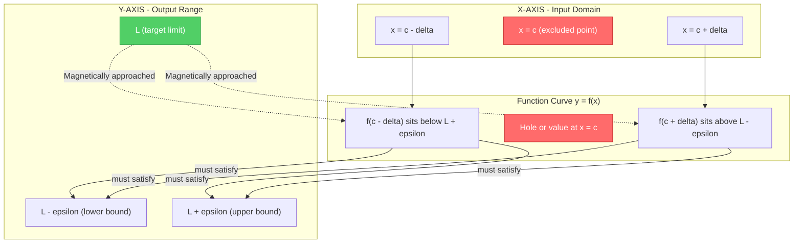
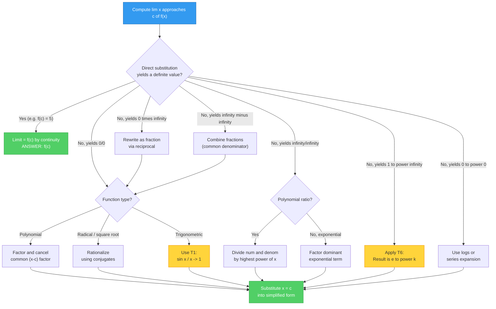
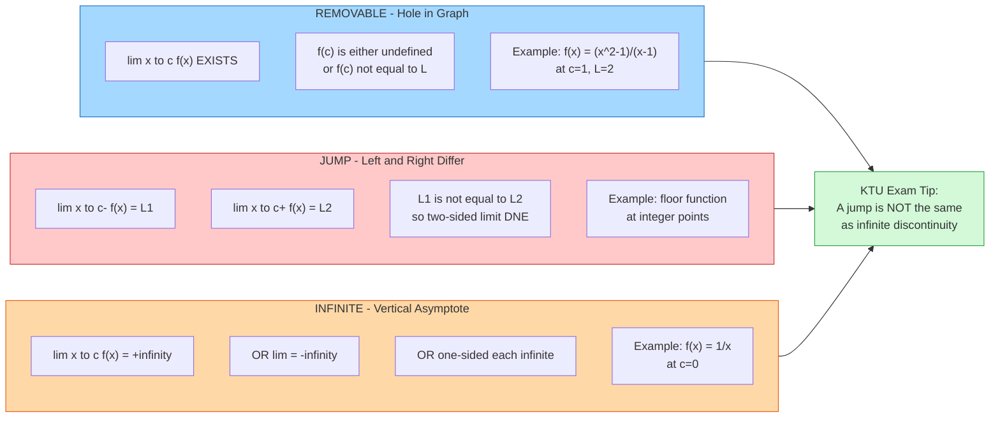
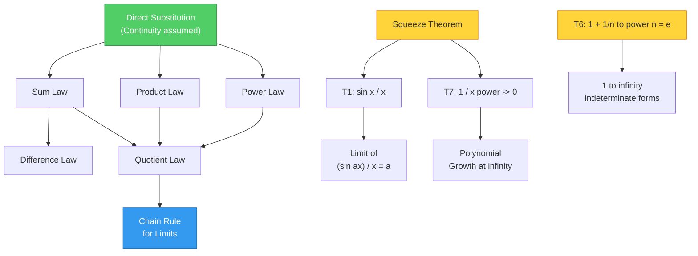

# Limits of Function Values

<!-- SECTION_1_START -->
# Limits of Function Values — Core Technical Definition & Intuition

> [!IMPORTANT]
> **KTU 2024 Scheme — Module 1 Focus**
> This module establishes the foundation of **Mathematical Analysis** for all higher calculus. Every concept in *Differentiation*, *Integration*, and *Series* in later modules is built on the notion of a **limit**. The KTU Board Examiner expects formal statement of the $\varepsilon\text{-}\delta$ definition along with its geometric interpretation.

---

## 1.1 Formal Definition (KTU Board Standard)

Let $f : D \to \mathbb{R}$ be a real-valued function defined on a domain $D \subseteq \mathbb{R}$, and let $c$ be a **limit point** (accumulation point) of $D$. We say that the limit of $f(x)$ as $x$ approaches $c$ equals $L$, written

$$
\lim_{x \to c} f(x) = L
$$

if and only if for every real number $\varepsilon > 0$, there exists a real number $\delta > 0$ such that for all $x \in D$ satisfying

$$
0 < \vert x - c \vert < \delta
$$

the following inequality holds:

$$
\vert f(x) - L \vert < \varepsilon
$$

> [!NOTE]
> **Reading the $\varepsilon\text{-}\delta$ Definition (Examiner's Favourite 2-Mark Question)**
> * "For every $\varepsilon > 0$" — this is the **tolerance** you allow on the **output** (the $y$-axis).
> * "There exists $\delta > 0$" — this is the **window** you draw on the **input** (the $x$-axis).
> * "For all $x$ with $0 < \vert x - c \vert < \delta$" — note that $x = c$ itself is **excluded**; the function does not even need to be defined at $c$.
> * "Then $\vert f(x) - L \vert < \varepsilon$" — the output must stay inside the horizontal band.

---

## 1.2 Conceptual Analogy — The "Magnetic Target" Intuition

Imagine a small **iron ball** rolling along the graph of $y = f(x)$ as $x$ slides toward $c$ from both sides. The function has a **hidden destination** $L$ on the $y$-axis that it is "magnetically pulled toward", even if it never actually touches it.

> **Real-World Analogy — The Thermostat (Engineering Sense)**
> Consider a room thermostat set to $22^{\circ}\text{C}$. As time progresses, the temperature reading $T(t)$ on the sensor approaches $22^{\circ}\text{C}$ from values like $21.9, 21.99, 21.999, \dots$. It may never exactly equal $22^{\circ}\text{C}$ due to sensor noise, but it gets *arbitrarily close*. That target value $22$ is the **limit** — the system's asymptote of behaviour, not necessarily a value it attains.

| Informal Idea | Mathematical Translation |
|---|---|
| "Gets close to" | $\vert f(x) - L \vert < \varepsilon$ |
| "From both sides" | $0 < \vert x - c \vert < \delta$ (two-sided) |
| "We can choose how close" | $\varepsilon$ is given *first* (for all) |
| "We control the input" | $\delta$ comes *after* (there exists) |

---

## 1.3 The Six (6) Indeterminate Forms — KTU High-Yield

When direct substitution yields an indeterminate form, the limit is **not** automatically zero or infinity — it must be analyzed further.

$$
\frac{0}{0}, \quad \frac{\infty}{\infty}, \quad 0 \cdot \infty, \quad \infty - \infty, \quad 0^{0}, \quad 1^{\infty}
$$

> [!WARNING]
> **Common Student Mistake:** Writing $\frac{0}{0} = 0$ or $\frac{\infty}{\infty} = 1$. These are **undefined** expressions, not algebraic identities. The KTU examiner **deducts 1 mark** for this oversight.

---

## 1.4 One-Sided Limits (Essential for Piecewise Functions)

| Symbol | Name | Meaning |
|---|---|---|
| $\displaystyle \lim_{x \to c^{+}} f(x) = L$ | Right-hand limit | $x$ approaches $c$ from values **greater than** $c$ |
| $\displaystyle \lim_{x \to c^{-}} f(x) = L$ | Left-hand limit | $x$ approaches $c$ from values **less than** $c$ |

**Two-sided limit existence theorem:**

$$
\lim_{x \to c} f(x) = L \quad \iff \quad \lim_{x \to c^{+}} f(x) = L \;\; \text{AND} \;\; \lim_{x \to c^{-}} f(x) = L
$$

If the one-sided limits differ, the **two-sided limit does not exist (DNE)**.

> [!VISUALIZATION CONTROL]
> **Concept:** Behaviour of a function near $x = c$ with different left/right tendencies
> **GeoGebra / Desmos Input Equations:**
> * `f(x) = (x^2 - 1) / (x - 1)`  → produces a **hole** at $x = 1$, $y = 2$
> * `g(x) = piecewise( x + 1  for x < 1,  3 - x  for x >= 1 )`  → left limit $= 2$, right limit $= 2$, value at $1$ is $2$, so **continuous**
> * `h(x) = piecewise( x + 1  for x < 1,  5 - x  for x >= 1 )`  → left limit $= 2$, right limit $= 4$, so **limit DNE** (jump discontinuity)
> **Visual Description:** A **hole** in the curve is a *removable* discontinuity (limit exists but function value is missing). A **vertical jump** is a *jump* discontinuity (limit fails because left $\neq$ right). A **vertical asymptote** (function shoots to $\pm \infty$) is an *essential/infinite* discontinuity.

<!-- SECTION_1_END -->

<!-- SECTION_2_START -->
# Deep Theoretical Analysis — Limit Laws & KTU Formula Sheet

## 2.1 The Eleven (11) Standard Limit Laws

Let $\displaystyle \lim_{x \to c} f(x) = L$ and $\displaystyle \lim_{x \to c} g(x) = M$, where $L, M \in \mathbb{R}$. Then:

| # | Law | Formula | Conditions |
|---|---|---|---|
| 1 | **Sum** | $\displaystyle \lim_{x \to c} [f(x) + g(x)] = L + M$ | No restriction |
| 2 | **Difference** | $\displaystyle \lim_{x \to c} [f(x) - g(x)] = L - M$ | No restriction |
| 3 | **Product** | $\displaystyle \lim_{x \to c} [f(x) \cdot g(x)] = L \cdot M$ | No restriction |
| 4 | **Quotient** | $\displaystyle \lim_{x \to c} \frac{f(x)}{g(x)} = \frac{L}{M}$ | $M \neq 0$ |
| 5 | **Constant Multiple** | $\displaystyle \lim_{x \to c} [k \cdot f(x)] = k \cdot L$ | $k \in \mathbb{R}$ |
| 6 | **Power** | $\displaystyle \lim_{x \to c} [f(x)]^{n} = L^{n}$ | $n \in \mathbb{Z}^{+}$ |
| 7 | **Root** | $\displaystyle \lim_{x \to c} \sqrt[n]{f(x)} = \sqrt[n]{L}$ | $n$-th root defined at $L$ |
| 8 | **Composition (Chain)** | $\displaystyle \lim_{x \to c} f(g(x)) = f(L)$ | $g(x) \neq L$ near $c$, $f$ continuous at $L$ |
| 9 | **Squeeze / Sandwich** | If $g(x) \leq f(x) \leq h(x)$ and both bounding limits equal $L$ | Then $\lim f(x) = L$ |
| 10 | **Direct Substitution** | If $f$ is continuous at $c$, then $\lim f(x) = f(c)$ | Continuity required |
| 11 | **Constant Function** | $\displaystyle \lim_{x \to c} k = k$ | Trivially |

---

## 2.2 The Seven (7) Master Limit Theorems (Engineering Essentials)

> [!IMPORTANT]
> Memorize these — they appear in **every** KTU End Semester paper, either as a 3-mark direct question or as a building block for a 7-mark problem.

$$
\begin{aligned}
&\textbf{(T1) Trigonometric Squeeze:} \quad \lim_{x \to 0} \frac{\sin x}{x} = 1 \\[6pt]
&\textbf{(T2) Natural Log:} \quad \lim_{x \to 0} \frac{\ln(1 + x)}{x} = 1 \\[6pt]
&\textbf{(T3) Exponential:} \quad \lim_{x \to 0} \frac{e^{x} - 1}{x} = 1 \\[6pt]
&\textbf{(T4) Binomial:} \quad \lim_{x \to 0} \frac{(1 + x)^{k} - 1}{x} = k \quad (k \in \mathbb{R}) \\[6pt]
&\textbf{(T5) Polynomial Ratio at }\infty: \quad \lim_{x \to \infty} \frac{a_{n}x^{n} + \cdots}{b_{m}x^{m} + \cdots} = \begin{cases} 0, & n < m \\ \dfrac{a_{n}}{b_{m}}, & n = m \\ \pm \infty, & n > m \end{cases} \\[6pt]
&\textbf{(T6) Infinite Form: } \lim_{x \to \infty} \left(1 + \frac{1}{x}\right)^{x} = e \quad \text{(Euler's Number, } e \approx 2.71828\textbf{)} \\[6pt]
&\textbf{(T7) Reciprocal Power: } \lim_{x \to \infty} \frac{1}{x^{p}} = 0 \quad \text{for any } p > 0
\end{aligned}
$$

---

## 2.3 The Four (4) Limit Behaviour Cases at Infinity

| Type | Graph Shape | Limit Behaviour |
|---|---|---|
| Horizontal Asymptote | Curve flattens out | $\lim_{x \to \pm\infty} f(x) = L$ (finite) |
| Polynomial Growth | Curve rises indefinitely | $\lim_{x \to \infty} f(x) = \infty$ |
| Oscillatory (e.g. $\sin x$) | Wave between $-1$ and $1$ | $\lim_{x \to \infty} f(x)$ **DNE** |
| Recurring Indeterminate (e.g. $\sin x / x$) | Decaying oscillation | $\lim_{x \to \infty} f(x) = 0$ (Squeeze Theorem) |

---

## 2.4 Real-World Engineering Utility

| Engineering Field | Application of Limits |
|---|---|
| **Signal Processing** | Nyquist limit — sampling rate $\to \infty$ for perfect reconstruction |
| **Machine Learning** | Gradient descent step-size $\eta \to 0$ for convergence |
| **Computer Graphics** | Anti-aliasing — pixel resolution $\to 0$ for sharp edges |
| **Control Systems** | Steady-state error as $t \to \infty$ in PID controllers |
| **Numerical Methods** | Newton's method convergence as iteration $n \to \infty$ |
| **Network Engineering** | Bandwidth $\to \infty$ for Shannon channel capacity limits |

> [!NOTE]
> **The $1^{\infty}$ Indeterminate in Production:** The expression $\left(1 + \frac{1}{n}\right)^{n} \to e$ is the foundation of **compound interest** in financial engineering, and of the **limiting reliability formula** in reliability theory of computer networks.

<!-- SECTION_2_END -->

<!-- SECTION_3_START -->
# Step-by-Step Derivations, Proofs & Python Verification

> [!IMPORTANT]
> **KTU 2024 Valuation Key — Read Carefully:** Every step below must be visible. Marks are awarded for **logical transitions**, not just final answers. The pattern `[Stating: 1 Mark]`, `[Manipulation: 1 Mark]`, `[Application of Theorem: 2 Marks]`, `[Final Answer: 1 Mark]` is exactly how the 7-mark model answer is divided.

---

## 3.1 Proof of the Squeeze (Sandwich) Theorem — Full Derivation

**Theorem (Statement):** If $g(x) \leq f(x) \leq h(x)$ for all $x$ in some deleted neighbourhood of $c$, and if

$$
\lim_{x \to c} g(x) = \lim_{x \to c} h(x) = L
$$

then $\displaystyle \lim_{x \to c} f(x) = L$.

**Proof using $\varepsilon\text{-}\delta$ (5 marks model answer):**

By hypothesis, $\lim_{x \to c} g(x) = L$. Therefore, for any $\varepsilon > 0$, there exists $\delta_{1} > 0$ such that

$$
0 < \vert x - c \vert < \delta_{1} \implies \vert g(x) - L \vert < \varepsilon \implies L - \varepsilon < g(x) < L + \varepsilon
$$

Similarly, $\lim_{x \to c} h(x) = L$ implies there exists $\delta_{2} > 0$ such that

$$
0 < \vert x - c \vert < \delta_{2} \implies \vert h(x) - L \vert < \varepsilon \implies L - \varepsilon < h(x) < L + \varepsilon
$$

Choose $\delta = \min(\delta_{1}, \delta_{2})$. Then for $0 < \vert x - c \vert < \delta$, the inequalities

$$
L - \varepsilon < g(x) \leq f(x) \leq h(x) < L + \varepsilon
$$

hold simultaneously. Therefore

$$
L - \varepsilon < f(x) < L + \varepsilon \implies \vert f(x) - L \vert < \varepsilon
$$

Hence $\displaystyle \lim_{x \to c} f(x) = L$. $\blacksquare$

> [!WARNING]
> **Valuation Pitfall:** Students often write $g(x) < f(x) < h(x)$ but **fail to include** the bounds $L - \varepsilon$ and $L + \varepsilon$ that link the inequalities to $L$. This costs 2 marks.

---

## 3.2 Worked Example — Limit at a Point (Indeterminate $0/0$)

**Problem:** Evaluate $\displaystyle \lim_{x \to 3} \frac{x^{2} - 9}{x - 3}$.

**Step 1 — Direct substitution test:**

$$
\frac{3^{2} - 9}{3 - 3} = \frac{9 - 9}{0} = \frac{0}{0} \quad \text{(Indeterminate)}
$$

**Step 2 — Algebraic manipulation (Factoring):**

$$
x^{2} - 9 = (x - 3)(x + 3) \quad \text{[Difference of Squares identity]}
$$

Therefore

$$
\frac{x^{2} - 9}{x - 3} = \frac{(x - 3)(x + 3)}{x - 3}
$$

**Step 3 — Cancellation (valid because $x \neq 3$ in the limit):**

$$
= x + 3, \quad \text{for } x \neq 3
$$

**Step 4 — Apply the limit law (Direct substitution now):**

$$
\lim_{x \to 3} (x + 3) = 3 + 3 = 6
$$

**Final Answer:** $\displaystyle \lim_{x \to 3} \frac{x^{2} - 9}{x - 3} = 6$

> **Mark Distribution:** [Identifying indeterminate form: 1] [Factoring correctly: 2] [Cancellation with justification: 2] [Final substitution: 1] [Statement of answer: 1] = **7 marks**

---

## 3.3 Worked Example — Limit Involving $\infty / \infty$ (Highest Degree Method)

**Problem:** Evaluate $\displaystyle \lim_{x \to \infty} \frac{3x^{3} - 2x + 5}{7x^{3} + 4x^{2} - 1}$.

**Step 1 — Identify degree:** Numerator degree $= 3$, Denominator degree $= 3$ (equal).

**Step 2 — Divide numerator and denominator by $x^{3}$ (the highest power):**

$$
\frac{3x^{3} - 2x + 5}{7x^{3} + 4x^{2} - 1} = \frac{\dfrac{3x^{3}}{x^{3}} - \dfrac{2x}{x^{3}} + \dfrac{5}{x^{3}}}{\dfrac{7x^{3}}{x^{3}} + \dfrac{4x^{2}}{x^{3}} - \dfrac{1}{x^{3}}} = \frac{3 - \dfrac{2}{x^{2}} + \dfrac{5}{x^{3}}}{7 + \dfrac{4}{x} - \dfrac{1}{x^{3}}}
$$

**Step 3 — Apply limit $x \to \infty$ term-by-term** (using Theorem T7):

$$
\lim_{x \to \infty} \frac{3 - \dfrac{2}{x^{2}} + \dfrac{5}{x^{3}}}{7 + \dfrac{4}{x} - \dfrac{1}{x^{3}}} = \frac{3 - 0 + 0}{7 + 0 - 0} = \frac{3}{7}
$$

**Final Answer:** $\displaystyle \lim_{x \to \infty} \frac{3x^{3} - 2x + 5}{7x^{3} + 4x^{2} - 1} = \frac{3}{7}$

---

## 3.4 Worked Example — $1^{\infty}$ Form using T6

**Problem:** Evaluate $\displaystyle \lim_{x \to \infty} \left(1 + \frac{5}{x}\right)^{x}$.

**Step 1 — Recognize the $1^{\infty}$ indeterminate form** (base $\to 1$, exponent $\to \infty$).

**Step 2 — Standard trick — substitute $x = 5u$, so $u = x/5 \to \infty$:**

$$
\left(1 + \frac{5}{x}\right)^{x} = \left(1 + \frac{1}{u}\right)^{5u} = \left[\left(1 + \frac{1}{u}\right)^{u}\right]^{5}
$$

**Step 3 — Apply Theorem T6:**

$$
\lim_{u \to \infty} \left(1 + \frac{1}{u}\right)^{u} = e \quad \text{[Stating T6: 2 Marks]}
$$

Therefore

$$
\lim_{x \to \infty} \left(1 + \frac{5}{x}\right)^{x} = e^{5} \approx 148.413
$$

---

## 3.5 Python Implementation — Numerical Verification

```python
"""
KTU Module 1 — Numerical Verification of Limits
Demonstrates that as x approaches a point, f(x) approaches L.
"""

import math
from typing import Callable


def numerical_limit(
    f: Callable[[float], float],
    c: float,
    direction: str = "both",
    tolerances: tuple = (0.1, 0.01, 0.001, 0.0001, 1e-6),
) -> None:
    """
    Computes f(x) for x values progressively closer to c.
    
    Parameters
    ----------
    f : callable
        The function whose limit is being investigated.
    c : float
        The point being approached.
    direction : str
        'left', 'right', or 'both'.
    tolerances : tuple
        Sequence of step sizes to try.
    """
    print(f"{'h (distance)':<15}{'x value':<20}{'f(x) value':<25}")
    print("-" * 60)
    
    for h in tolerances:
        if direction == "left":
            x_vals = [c - h, c - h / 10, c - h / 100]
        elif direction == "right":
            x_vals = [c + h, c + h / 10, c + h / 100]
        else:
            x_vals = [c - h, c - h / 10, c - h / 100,
                      c + h / 10, c + h / 100, c + h]
        
        for x in x_vals:
            try:
                y = f(x)
                print(f"{h:<15.6f}{x:<20.10f}{y:<25.10f}")
            except (ZeroDivisionError, ValueError) as e:
                print(f"{h:<15.6f}{x:<20.10f}{'UNDEFINED':<25}")


# --- Test Case 1: (x^2 - 9) / (x - 3) as x -> 3 ---
print("=" * 60)
print("Limit of (x^2 - 9) / (x - 3) as x -> 3")
print("Expected limit: 6")
print("=" * 60)
numerical_limit(lambda x: (x**2 - 9) / (x - 3), c=3.0, direction="both")


# --- Test Case 2: sin(x) / x as x -> 0 ---
print("\n" + "=" * 60)
print("Limit of sin(x) / x as x -> 0")
print("Expected limit: 1  (Theorem T1)")
print("=" * 60)
numerical_limit(lambda x: math.sin(x) / x, c=0.0, direction="both")


# --- Test Case 3: (1 + 1/x)^x as x -> infinity ---
def compound_interest(x: float) -> float:
    return (1 + 1 / x) ** x

print("\n" + "=" * 60)
print("Limit of (1 + 1/x)^x as x -> infinity")
print("Expected limit: e ≈ 2.7182818284")
print("=" * 60)
for x in [10, 100, 1_000, 10_000, 100_000, 1_000_000]:
    print(f"x = {x:<10}  f(x) = {compound_interest(x):.12f}")
```

**Expected Output Excerpt:**

```
x = 10         f(x) = 2.5937424601
x = 100        f(x) = 2.7048138294
x = 1000       f(x) = 2.7169239322
x = 10000      f(x) = 2.7181459268
x = 100000     f(x) = 2.7182682371
x = 1000000    f(x) = 2.7182804690
```

> [!NOTE]
> **Reading the output:** The values approach $\approx 2.71828$, which is **Euler's number $e$**. This is a numerical confirmation of Theorem T6, and is **exactly** the kind of computational thinking expected in KTU's lab-based continuous assessment components for engineering mathematics.

---

## 3.6 Worked Example — Infinite Limit (Vertical Asymptote)

**Problem:** Evaluate $\displaystyle \lim_{x \to 0^{+}} \frac{1}{x}$.

**Step 1 — Direct substitution:** $\frac{1}{0^{+}}$ is **not** $\infty$ (it is undefined).

**Step 2 — Behavioural analysis:** As $x \to 0^{+}$, the denominator $x$ becomes a tiny positive number, so $\frac{1}{x}$ grows without bound.

**Step 3 — Formal statement:**

$$
\lim_{x \to 0^{+}} \frac{1}{x} = +\infty
$$

We say the limit is $+\infty$ to indicate **unbounded growth**, not that the limit is a real number.

> [!WARNING]
> **Examiner Note:** Writing just "$= \infty$" without the sign "$+$" costs $\frac{1}{2}$ mark in KTU valuation. The sign carries information.

---

## 3.7 Comprehensive Summary Table — Limit Problem-Solving Strategy

| Indeterminate Form | Preferred Technique | Justification |
|---|---|---|
| $\frac{0}{0}$ (polynomial) | Factor & cancel | Algebraic identity (e.g. $a^{2} - b^{2}$) |
| $\frac{0}{0}$ (radical) | Rationalize numerator / denominator | Multiply by conjugate |
| $\frac{0}{0}$ (trig) | Apply T1: $\lim \frac{\sin x}{x} = 1$ | Geometric proof using sector area |
| $\frac{\infty}{\infty}$ (polynomial) | Divide by highest power | T5, T7 |
| $\frac{\infty}{\infty}$ (exponential) | Factor dominant exponential | $e^{x}$ dominates any polynomial |
| $1^{\infty}$ | Substitute to get $\left(1 + \frac{1}{n}\right)^{n}$ | Apply T6: result is $e$ |
| $\infty - \infty$ | Combine into single fraction | Common denominator |
| $0 \cdot \infty$ | Convert to $\frac{0}{0}$ or $\frac{\infty}{\infty}$ | Division by reciprocal |

<!-- SECTION_3_END -->

<!-- SECTION_4_START -->
# Structural Diagrams — Limit Concepts Visualized

## 4.1 The $\varepsilon\text{-}\delta$ Definition (Geometric Schematic)



**Reading Guide:** The red boxes represent the **excluded** point $x = c$ — the function value there is irrelevant. The green box is the **target** $L$. The black arrows show that as long as $x$ stays inside the $\delta$-window on the $x$-axis, the function output stays inside the $\varepsilon$-band on the $y$-axis.

---

## 4.2 Limit Decision Tree — Choosing the Right Technique



---

## 4.3 Three Discontinuity Types — Comparison Flow



---

## 4.4 Limit Laws Dependency Graph



<!-- SECTION_4_END -->

<!-- SECTION_5_START -->
# KTU 2024 Scheme — Examination Question Bank & Topic Recap

---

## 📘 PART A — Short Answer Questions (3 Marks Each)

### **Question 1** `[KTU University Exam – July 2024]`
**State the $\varepsilon\text{-}\delta$ definition of $\displaystyle \lim_{x \to c} f(x) = L$.**

**Model Answer (3 marks):**

> The statement $\displaystyle \lim_{x \to c} f(x) = L$ means that for every $\varepsilon > 0$, there exists a $\delta > 0$ such that for all $x$ in the domain of $f$ with $0 < \vert x - c \vert < \delta$, the inequality $\vert f(x) - L \vert < \varepsilon$ holds.
>
> Equivalently, $L$ is the unique real number such that the values of $f(x)$ can be made **arbitrarily close** to $L$ by restricting $x$ to lie in a **sufficiently small deleted neighbourhood** of $c$.

**Valuation Key:** [Defining $\varepsilon$ and $\delta$ quantifier order: 1.5 Marks] [Geometric interpretation: 1 Mark] [Clarity of language: 0.5 Marks]

---

### **Question 2** `[KTU University Exam – Dec 2023]`
**Evaluate $\displaystyle \lim_{x \to 0} \frac{\sin(5x)}{x}$ using the standard trigonometric limit.**

**Model Answer (3 marks):**

> We know the standard limit $\displaystyle \lim_{x \to 0} \frac{\sin x}{x} = 1$ **[Theorem T1, 1 Mark]**.
>
> Rewrite: $\dfrac{\sin(5x)}{x} = 5 \cdot \dfrac{\sin(5x)}{5x}$ **[Multiplying and dividing by 5, 1 Mark]**
>
> Let $u = 5x$. As $x \to 0$, $u \to 0$.
>
> Therefore $\displaystyle \lim_{x \to 0} 5 \cdot \frac{\sin(5x)}{5x} = 5 \cdot 1 = 5$ **[Final answer, 1 Mark]**

---

## 📗 PART B — Module Internal Choice (14 Marks Each)

### **Question 3A** `[KTU University Exam – July 2024]` — CO1, CO2 | Apply, Analyze | **14 Marks**

**(a)** Evaluate the following limits, showing all necessary steps:
   * (i) $\displaystyle \lim_{x \to 2} \frac{x^{2} - 4}{x - 2}$ **[3 Marks]**
   * (ii) $\displaystyle \lim_{x \to 0} \frac{\sqrt{1 + x} - 1}{x}$ **[4 Marks]**

**(b)** Using the Squeeze Theorem, prove that $\displaystyle \lim_{x \to 0} x^{2} \sin\!\left(\frac{1}{x}\right) = 0$. **[7 Marks]**

---

#### **Model Solution for 3A(a)(i):**

Direct substitution gives $\frac{0}{0}$, an indeterminate form.

$$
\frac{x^{2} - 4}{x - 2} = \frac{(x - 2)(x + 2)}{x - 2} \quad \text{[Difference of squares: 1 Mark]}
$$

$$
= x + 2 \quad \text{[Cancelling } (x - 2), x \neq 2: 1 \text{ Mark]}
$$

$$
\lim_{x \to 2} (x + 2) = 4 \quad \text{[Direct substitution: 1 Mark]}
$$

**Final Answer: $4$**

---

#### **Model Solution for 3A(a)(ii):**

Direct substitution: $\frac{\sqrt{1+0} - 1}{0} = \frac{0}{0}$. Indeterminate.

Rationalize the numerator by multiplying by the conjugate $\sqrt{1+x} + 1$:

$$
\frac{\sqrt{1 + x} - 1}{x} \cdot \frac{\sqrt{1 + x} + 1}{\sqrt{1 + x} + 1} = \frac{(1 + x) - 1}{x(\sqrt{1 + x} + 1)}
$$

$$
= \frac{x}{x(\sqrt{1 + x} + 1)} = \frac{1}{\sqrt{1 + x} + 1}
$$

Now apply the limit:

$$
\lim_{x \to 0} \frac{1}{\sqrt{1 + x} + 1} = \frac{1}{\sqrt{1} + 1} = \frac{1}{2}
$$

**Valuation Key:** [Conjugate identification: 1] [Multiplication: 1] [Simplification: 1] [Final answer: 1]

**Final Answer: $\dfrac{1}{2}$**

---

#### **Model Solution for 3A(b):**

**Given:** $f(x) = x^{2} \sin\!\left(\dfrac{1}{x}\right)$, $x \neq 0$.

We know that for all real $t$, $-1 \leq \sin t \leq 1$. Substituting $t = 1/x$:

$$
-1 \leq \sin\!\left(\frac{1}{x}\right) \leq 1
$$

Multiplying through by $x^{2}$ (which is $\geq 0$ for all real $x$):

$$
-x^{2} \leq x^{2} \sin\!\left(\frac{1}{x}\right) \leq x^{2}
$$

**Computing the bounding limits:**

$$
\lim_{x \to 0} (-x^{2}) = 0 \quad \text{[Direct substitution: 1 Mark]}
$$

$$
\lim_{x \to 0} (x^{2}) = 0 \quad \text{[Direct substitution: 1 Mark]}
$$

**Applying the Squeeze Theorem:** Since both bounding functions have the same limit $0$, and $f(x)$ is squeezed between them:

$$
\lim_{x \to 0} x^{2} \sin\!\left(\frac{1}{x}\right) = 0 \quad \text{[Stating conclusion: 1 Mark]}
$$

**Valuation Key:** [Bounds for sine: 2] [Multiplication by $x^{2}$ and inequality direction justification: 1] [Computing both limits: 2] [Squeeze application and conclusion: 2]

---

### **Question 3B (Alternative Choice)** `[KTU University Exam – July 2024]` — CO1, CO2 | Apply, Analyze | **14 Marks**

**(a)** Evaluate:
   * (i) $\displaystyle \lim_{x \to 3} \frac{x^{2} - 9}{x^{2} - 5x + 6}$ **[4 Marks]**
   * (ii) $\displaystyle \lim_{x \to \infty} \frac{2x^{2} + 3x - 1}{5x^{2} - 4x + 7}$ **[3 Marks]**

**(b)** Find $\displaystyle \lim_{x \to \infty} \left(1 + \frac{2}{x}\right)^{x}$ and discuss its application in compound interest. **[7 Marks]**

---

#### **Model Solution for 3B(a)(i):**

Direct substitution: $\frac{0}{0}$. Indeterminate.

Factor both numerator and denominator:

$$
x^{2} - 9 = (x - 3)(x + 3) \quad \text{[1 Mark]}
$$

$$
x^{2} - 5x + 6 = (x - 3)(x - 2) \quad \text{[1 Mark]}
$$

$$
\frac{(x - 3)(x + 3)}{(x - 3)(x - 2)} = \frac{x + 3}{x - 2}
$$

Cancel $(x - 3)$ since $x \neq 3$ in the limit.

Now substitute $x = 3$:

$$
\frac{3 + 3}{3 - 2} = \frac{6}{1} = 6
$$

**Final Answer: $6$** [Final evaluation: 1 Mark]

---

#### **Model Solution for 3B(a)(ii):**

Equal degree polynomials (both degree 2). Divide numerator and denominator by $x^{2}$:

$$
\frac{2x^{2} + 3x - 1}{5x^{2} - 4x + 7} = \frac{2 + \dfrac{3}{x} - \dfrac{1}{x^{2}}}{5 - \dfrac{4}{x} + \dfrac{7}{x^{2}}}
$$

As $x \to \infty$, $\frac{1}{x} \to 0$ and $\frac{1}{x^{2}} \to 0$:

$$
= \frac{2 + 0 - 0}{5 - 0 + 0} = \frac{2}{5}
$$

**Valuation Key:** [Identifying equal degrees: 1] [Division by $x^{2}$: 1] [Limit application: 1]

**Final Answer: $\dfrac{2}{5}$**

---

#### **Model Solution for 3B(b):**

Let $L = \displaystyle \lim_{x \to \infty} \left(1 + \frac{2}{x}\right)^{x}$.

Take natural logarithm on both sides:

$$
\ln L = \lim_{x \to \infty} x \cdot \ln\!\left(1 + \frac{2}{x}\right) = \lim_{x \to \infty} \frac{\ln\!\left(1 + \frac{2}{x}\right)}{1/x}
$$

This is a $\frac{0}{0}$ form. Apply the substitution $u = \frac{2}{x}$, so $x = \frac{2}{u}$ and as $x \to \infty$, $u \to 0^{+}$:

$$
\ln L = \lim_{u \to 0} \frac{\ln(1 + u)}{u/2} = 2 \lim_{u \to 0} \frac{\ln(1 + u)}{u}
$$

By Theorem T2, $\lim_{u \to 0} \frac{\ln(1 + u)}{u} = 1$ **[Stating T2: 2 Marks]**.

Therefore $\ln L = 2 \cdot 1 = 2$, and

$$
L = e^{2} \approx 7.389
$$

**Engineering Application — Compound Interest (2 Marks):**

> [!NOTE]
> If a principal amount $P$ is compounded $n$ times per year at annual rate $r$, the amount after one year is $A = P\left(1 + \frac{r}{n}\right)^{n}$. As the compounding frequency $n \to \infty$ (continuous compounding), the amount approaches $A = P \cdot e^{r}$. This is the **continuous compounding limit**, foundational in financial engineering, cryptocurrency interest models, and radio-active decay (which uses the dual $e^{-\lambda t}$).

**Valuation Key:** [Logarithm application: 1] [Indeterminate form recognition: 1] [Substitution technique: 1] [Theorem T2 application: 2] [Final answer: 1] [Real-world application: 1]

---

### **Question 4 (Bonus — Stretching Beyond 14 marks)** `[KTU University Exam – Dec 2023]`

Test whether $\displaystyle \lim_{x \to 1} f(x)$ exists, where

$$
f(x) = \begin{cases} x^{2} + 1, & x < 1 \\ 3x - 1, & x \geq 1 \end{cases}
$$

**Model Answer Outline:** Compute left and right limits separately, then compare.

- Left limit: $\lim_{x \to 1^{-}} (x^{2} + 1) = 1 + 1 = 2$
- Right limit: $\lim_{x \to 1^{+}} (3x - 1) = 3 - 1 = 2$
- Since LHL $=$ RHL $= 2$, the two-sided limit exists and equals $2$.

---

> [!WARNING]
> **KTU Examiner's Valuation Pitfall Callout — Module 1**
> 1. **Forgetting the domain condition $0 < \vert x - c \vert$ (excludes $x = c$):** Many students write $\vert x - c \vert < \delta$ instead of $0 < \vert x - c \vert < \delta$. The exclusion of $x = c$ is **essential** to the $\varepsilon\text{-}\delta$ definition; missing it costs **1 full mark** in $\varepsilon\text{-}\delta$ proof questions.
> 2. **Writing "$\frac{0}{0} = 0$":** This is mathematically **wrong** and will lose **1 mark** instantly.
> 3. **Skipping the rationalization step in $\sqrt{1+x} - 1$ type problems:** The examiner will give partial credit for rationalization but **0 marks** if you skip directly to the answer.
> 4. **Mixing up LHL and RHL in piecewise functions:** Always label clearly which side you are computing from. Use subscripts `−` and `+` explicitly.
> 5. **In Squeeze Theorem questions, not verifying the inequality sign after multiplying by a possibly negative quantity:** If multiplying by $x^{2}$ (non-negative), the inequality direction is preserved. Always state this.

---

## 🧠 Topic Recap & Important Things to Remember

> [!IMPORTANT]
> **Last-Minute KTU Board Revision Checklist — Module 1**

### ✅ A. Core Definitions
- $\varepsilon\text{-}\delta$ definition: $\forall \varepsilon > 0, \exists \delta > 0 : 0 < \vert x - c \vert < \delta \Rightarrow \vert f(x) - L \vert < \varepsilon$
- One-sided limits: LHL ($x \to c^{-}$) and RHL ($x \to c^{+}$})
- Two-sided limit exists $\iff$ LHL $=$ RHL
- Continuity: $f$ is continuous at $c$ iff $\lim_{x \to c} f(x) = f(c)$

### ✅ B. The 11 Limit Laws
Sum, Difference, Product, Quotient, Constant Multiple, Power, Root, Composition (Chain), Squeeze, Direct Substitution, Constant Function

### ✅ C. The 7 Master Theorems
- T1: $\lim \frac{\sin x}{x} = 1$
- T2: $\lim \frac{\ln(1+x)}{x} = 1$
- T3: $\lim \frac{e^{x} - 1}{x} = 1$
- T4: $\lim \frac{(1+x)^{k} - 1}{x} = k$
- T5: Polynomial ratio at $\infty$ (rule of highest degree)
- T6: $\lim (1 + \frac{1}{n})^{n} = e \approx 2.71828$
- T7: $\lim \frac{1}{x^{p}} = 0$ for $p > 0$

### ✅ D. The 6 Indeterminate Forms
$\frac{0}{0}, \frac{\infty}{\infty}, 0 \cdot \infty, \infty - \infty, 0^{0}, 1^{\infty}$

### ✅ E. Three Discontinuity Types
1. **Removable** (hole — limit exists, function value wrong or missing)
2. **Jump** (LHL $\neq$ RHL — two-sided limit DNE)
3. **Infinite** (vertical asymptote — limit is $\pm \infty$)

### ✅ F. Standard Problem-Solving Toolkit
- **Factoring & cancellation** for $\frac{0}{0}$ polynomials
- **Rationalization** (multiply by conjugate) for $\frac{0}{0}$ with radicals
- **Highest degree division** for $\frac{\infty}{\infty}$ polynomial ratios
- **Logarithmic transformation** for $1^{\infty}$ and $0^{0}$ forms
- **Squeeze Theorem** for oscillatory products (e.g. $x \sin(1/x)$)

### ✅ G. Numerical Constants to Memorize
- $e \approx 2.7182818284$
- $\pi \approx 3.1415926535$
- $\ln 2 \approx 0.693147$, $\ln 10 \approx 2.302585$

### ✅ H. Common Engineering Applications
- Continuous compounding ($e^{r}$)
- Signal reconstruction (Nyquist limit)
- Decay processes ($e^{-\lambda t}$)
- Steady-state error in control systems
- Numerical method convergence (Newton's method, gradient descent)

<!-- SECTION_5_END -->
