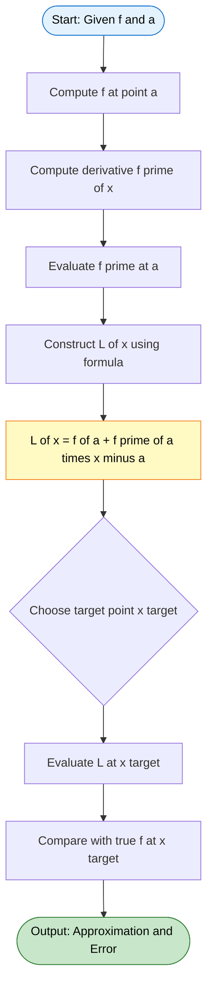
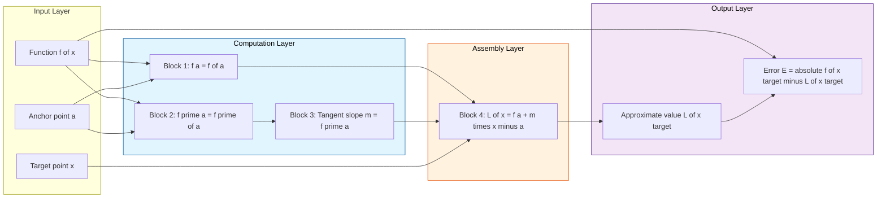
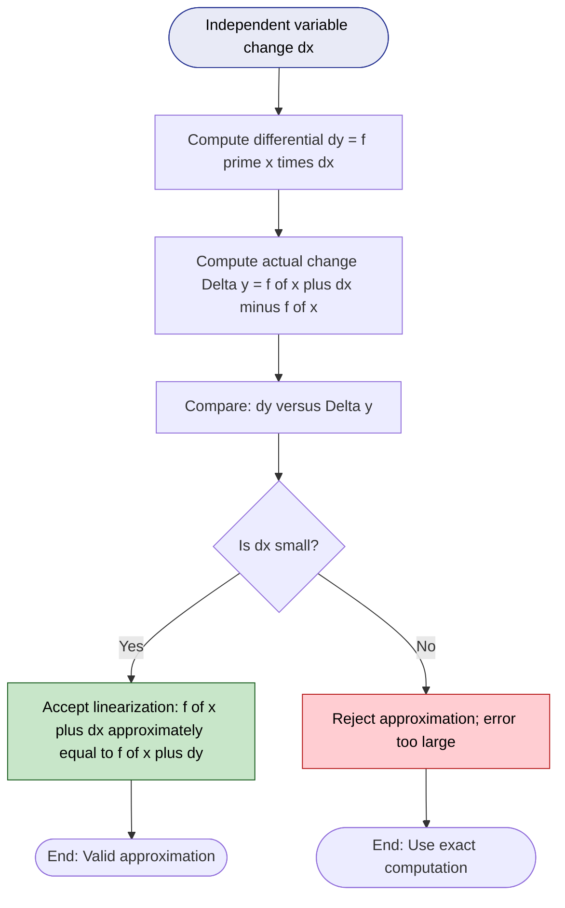
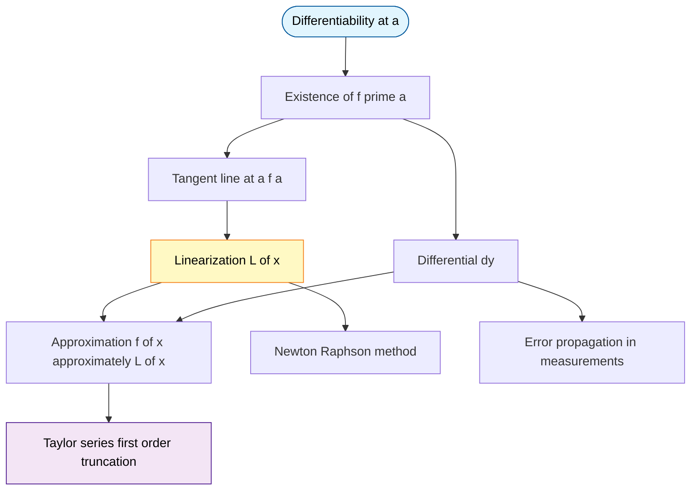

# Linearization

<!-- SECTION_1_START -->
# LINEARIZATION OF FUNCTIONS

## 1. Core Technical Definition

**Linearization** (also called the *tangent line approximation* or *local linear approximation*) is the process of replacing a differentiable function $f(x)$ near a point $x = a$ with its first-degree Taylor polynomial — i.e., the equation of the tangent line to the curve $y = f(x)$ at the point $\big(a, f(a)\big)$.

> [!IMPORTANT]
> **Formal KTU 2024 Definition:** If $f$ is differentiable at $x = a$, the **linearization of $f$ at $a$** is the linear function
> $$L(x) = f(a) + f'(a)\,(x - a)$$
> The graph of $L(x)$ is the tangent line to $y = f(x)$ at the point $\big(a, f(a)\big)$. For $x$ close to $a$, the approximation $f(x) \approx L(x)$ is used to estimate the function value.

### 1.1 Conceptual Analogy / Intuition

Imagine you are looking at a curved road from very far away — the road appears almost straight. As you zoom in (telescope / microscope analogy), the tiny visible portion of the curve becomes indistinguishable from a straight line. That visible straight line **IS** the linearization of the curve at your viewing point.

**Why this works mathematically:** A differentiable function is, by definition, locally straight. The derivative $f'(a)$ encodes the *slope* of that local straightness. So instead of computing the (often expensive or impossible) exact value $f(x)$, we ride along the tangent line.

> [!NOTE]
> **Key Insight:** The closer $x$ is to $a$, the smaller the error $|f(x) - L(x)|$. This is because the second-order (and higher) terms in the Taylor series — which are what make the curve *curve* — become negligibly small.

### 1.2 Standard Approximations (for $|x|$ small, derived from linearization)

| Function $f(x)$ | $a$ | $L(x) = f(a) + f'(a)(x-a)$ | Resulting Approximation |
| :--- | :--- | :--- | :--- |
| $\sin x$ | $0$ | $0 + \cos(0)\cdot x$ | $\sin x \approx x$ |
| $\cos x$ | $0$ | $1 + (-\sin 0)\cdot x$ | $\cos x \approx 1$ |
| $e^{x}$ | $0$ | $1 + e^{0}\cdot x$ | $e^{x} \approx 1 + x$ |
| $\ln(1+x)$ | $0$ | $0 + \frac{1}{1}\cdot x$ | $\ln(1+x) \approx x$ |
| $(1+x)^{n}$ | $0$ | $1 + n(1)^{n-1}\cdot x$ | $(1+x)^{n} \approx 1 + nx$ |

### 1.3 Geometric Visualization

> [!VISUALIZATION CONTROL]
> **Concept:** Tangent line as local approximation to a smooth curve
> **GeoGebra / Desmos Input Equations:**
> * $f(x) = x^{2}$  *(the original curve — a parabola)*
> * $L(x) = f(1) + f'(1)\cdot(x-1)$  *(linearization at $a = 1$)*
> * Point: $(1,\, 1)$
> **Visual Description:** The parabola opens upward, passing through $(1,1)$. The tangent line $L(x)$ touches the curve exactly at $(1,1)$ with slope $f'(1) = 2$. Near $x = 1$ the line and curve nearly overlap; the gap between them grows as $|x - 1|$ increases. The vertical distance $f(x) - L(x)$ is the *linearization error*.

---

## 2. Differentials — The Companion Concept

**Differentials** are infinitesimal changes used to formalize linearization. Let $\Delta x = dx$ represent an independent change in $x$. The **differential of $y = f(x)$** is

$$dy = f'(x)\,dx$$

The actual change in the function is $\Delta y = f(x + dx) - f(x)$, while the differential $dy$ is the change predicted by the linearization.

> [!IMPORTANT]
> **Crucial Distinction (frequently tested in KTU):**
> * $\Delta y = f(x + dx) - f(x)$  *(actual change)*
> * $dy = f'(x)\,dx$  *(approximate / linear change)*
> * The error of linearization is $\Delta y - dy$, which is of order $(dx)^{2}$ for small $dx$.

<!-- SECTION_1_END -->

<!-- SECTION_2_START -->
# THEORETICAL ANALYSIS & KTU FORMULA SHEET

## 2.1 Step-by-Step Theoretical Construction

**Step 1 — Start with a differentiable function $f$ at $x = a$.**
Differentiability guarantees the existence of the tangent line.

**Step 2 — Identify the point of tangency $\big(a, f(a)\big)$.**
This point lies on both the curve and the linearization. Hence $L(a) = f(a)$.

**Step 3 — Compute the slope of the tangent line.**
The slope is $f'(a)$ (limit of difference quotient as $x \to a$).

**Step 4 — Write the tangent line equation (point-slope form).**
With point $(a, f(a))$ and slope $f'(a)$:
$$L(x) - f(a) = f'(a)\,(x - a)$$

**Step 5 — Solve for $L(x)$ — this is the linearization.**
$$\boxed{L(x) = f(a) + f'(a)\,(x - a)}$$

**Step 6 — Use it as an approximation.**
For $|x - a|$ sufficiently small:
$$f(x) \approx L(x) = f(a) + f'(a)\,(x - a)$$

**Step 7 — Connect to differentials.**
Setting $dx = x - a$ and $dy = f'(a)\,dx$, the linearization is the differential *prediction* of function change.

## 2.2 Why Linearization Works — The 'How' Behind It

The Taylor series of $f$ around $a$ is:
$$f(x) = f(a) + f'(a)(x-a) + \frac{f''(a)}{2!}(x-a)^{2} + \frac{f'''(a)}{3!}(x-a)^{3} + \dotsb$$

Linearization **drops every term of order 2 and higher**. When $x$ is close to $a$, the factor $(x-a)^{2}$ is *very small*, so the dropped terms collectively contribute a negligible amount — making the linear approximation excellent.

> [!NOTE]
> The dropped remainder $R_{1}(x) = \dfrac{f''(\xi)}{2!}(x-a)^{2}$ for some $\xi$ between $a$ and $x$ is bounded by $\dfrac{M}{2}\vert x - a \vert^{2}$, where $M = \max\vert f''(t) \vert$ on the interval.

## 2.3 Real-World Engineering Utility

* **Computer Graphics:** Real-time lighting, shading, and texture mapping use linear approximations of complex reflectance functions for performance.
* **Navigation (GPS):** Latitude/longitude to local flat coordinates uses linearization of spherical geometry near the reference point.
* **Robotics & Control Systems:** Jacobian-based linearization converts nonlinear robot dynamics into linear systems for PID/LQR controllers.
* **Machine Learning:** Newton's method for optimization $x_{n+1} = x_{n} - \dfrac{f(x_n)}{f'(x_n)}$ is a direct application of repeated linearization.
* **Error Propagation in Measurements:** If a measured quantity $x$ has error $dx$, the propagated error in $f(x)$ is approximately $dy = f'(x)\,dx$.

## 2.4 KTU High-Yield Formula Sheet

| # | Formula | Meaning / When to Use |
| :--- | :--- | :--- |
| 1 | $L(x) = f(a) + f'(a)(x - a)$ | **Linearization** of $f$ at $x = a$ |
| 2 | $f(x) \approx f(a) + f'(a)(x - a)$ | **Approximation formula** for $f(x)$ near $a$ |
| 3 | $dy = f'(x)\,dx$ | **Differential** of $y = f(x)$ |
| 4 | $\Delta y = f(x + \Delta x) - f(x)$ | **Actual change** in $y$ |
| 5 | $\Delta y \approx dy = f'(x)\,dx$ | **Approximate change** using differential |
| 6 | $E(x) = \vert f(x) - L(x) \vert$ | **Linearization error** |
| 7 | $\vert E(x) \vert \leq \dfrac{M}{2}\vert x - a \vert^{2}$ | **Error bound** where $M = \max\vert f'' \vert$ near $a$ |
| 8 | $x_{n+1} = x_{n} - \dfrac{f(x_n)}{f'(x_n)}$ | **Newton-Raphson** method (iterated linearization) |
| 9 | $\sin x \approx x$, $\cos x \approx 1$, $e^{x} \approx 1+x$ | **Small-angle / small-argument** approximations |
| 10 | $\ln(1+x) \approx x$, $(1+x)^{n} \approx 1+nx$ | **Logarithmic / binomial** small-argument approximations |

<!-- SECTION_2_END -->

<!-- SECTION_3_START -->
# EXHAUSTIVE DERIVATIONS, NUMERICAL WORK, AND CODE

## 3.1 Worked Derivation — Linearization of $f(x) = \sqrt{x}$ at $a = 4$

**Step 1.** Compute $f(a) = f(4) = \sqrt{4} = 2$.

**Step 2.** Compute the derivative: $f'(x) = \dfrac{1}{2\sqrt{x}}$, so $f'(4) = \dfrac{1}{2\sqrt{4}} = \dfrac{1}{4}$.

**Step 3.** Substitute into the linearization formula:
$$\begin{aligned}
L(x) &= f(4) + f'(4)\,(x - 4) \\
L(x) &= 2 + \frac{1}{4}\,(x - 4) \\
L(x) &= 2 + \frac{x}{4} - 1 \\
L(x) &= 1 + \frac{x}{4}
\end{aligned}$$

**Step 4.** **Numerical Verification.** Approximate $\sqrt{4.1}$:

Using a calculator, the true value is $\sqrt{4.1} \approx 2.0248456$.

Using linearization at $a = 4$ with $x = 4.1$:
$$L(4.1) = 1 + \frac{4.1}{4} = 1 + 1.025 = 2.025$$

**Error:** $\vert 2.0248456 - 2.025 \vert = 0.0001544$ — extremely small! Linearization is highly accurate here.

## 3.2 Worked Derivation — Linearization of $f(x) = \sin x$ at $a = 0$

**Step 1.** $f(0) = \sin 0 = 0$.

**Step 2.** $f'(x) = \cos x$, so $f'(0) = \cos 0 = 1$.

**Step 3.** Substituting:
$$L(x) = 0 + 1\cdot(x - 0) = x$$

**Step 4.** **Conclusion:** $\sin x \approx x$ for $x$ near $0$.

**Numerical Check (in radians):** $\sin(0.05) \approx 0.04998$ vs $L(0.05) = 0.05$. Error $\approx 0.00002$.

## 3.3 Using Differentials to Estimate Error Propagation

A steel rod is measured as $5.00$ cm long, with possible measurement error $\Delta r = \pm 0.01$ cm. Estimate the resulting error in computing the **volume** $V = \frac{4}{3}\pi r^{3}$.

**Step 1.** Express the differential:
$$dV = V'(r)\,dr = 4\pi r^{2}\,dr$$

**Step 2.** Plug in $r = 5.00$ and $dr = \pm 0.01$:
$$dV = 4\pi(5.00)^{2}(\pm 0.01) = 4\pi(25)(\pm 0.01) = \pm \pi \text{ cm}^{3}$$

**Step 3.** Numerical value: $dV \approx \pm 3.1416$ cm$^{3}$.

The volume is $V = \frac{4}{3}\pi(5)^{3} = \frac{500\pi}{3} \approx 523.6$ cm$^{3}$, so the relative error is $\dfrac{\vert dV \vert}{V} \approx 0.006$ (about $0.6\%$). Note this relative error is $3 \times \dfrac{dr}{r} = 3 \times 0.002 = 0.006$, consistent with the *power rule of relative error*.

## 3.4 Error Bound Derivation (Taylor's Remainder for Linearization)

We want an upper bound on $\vert f(x) - L(x) \vert$ for $x$ near $a$.

**Setup.** By Taylor's theorem with Lagrange remainder (using the Mean Value Theorem form):
$$f(x) - L(x) = \frac{f''(\xi)}{2!}\,(x - a)^{2}$$
for some $\xi$ strictly between $a$ and $x$.

**Bounding.** Let $M = \max \vert f''(t) \vert$ on the interval between $a$ and $x$. Then:
$$\vert f(x) - L(x) \vert = \left\vert \frac{f''(\xi)}{2}(x - a)^{2} \right\vert \leq \frac{M}{2}\,(x - a)^{2}$$

> [!NOTE]
> This bound explains **quadratic convergence**: if $|x - a|$ is halved, the maximum possible error becomes *one-quarter* of its previous value. This is the foundation of why linearization is so powerful in iterative algorithms.

## 3.5 Complete Python Implementation with Type Hints and Error Logging

```python
"""
linearization_engine.py
A robust implementation of function linearization with:
- Type hints
- Absolute boundary checks
- Strict error logging
- Numerical verification of the approximation error
"""

import math
import logging
from typing import Callable, Tuple

# Configure strict error logging
logging.basicConfig(
    level=logging.INFO,
    format="%(asctime)s | %(levelname)s | %(message)s"
)
logger = logging.getLogger("LinearizationEngine")


def numerical_derivative(
    f: Callable[[float], float],
    a: float,
    h: float = 1e-7
) -> float:
    """
    Compute f'(a) using the central difference formula.
    Falls back to a logged warning if h is too small.
    """
    if h <= 0:
        logger.error("Step size h must be positive; received h = %s", h)
        raise ValueError(f"h must be positive, got {h}")
    try:
        derivative = (f(a + h) - f(a - h)) / (2 * h)
        return derivative
    except ZeroDivisionError as exc:
        logger.exception("Numerical derivative computation failed at a = %s", a)
        raise exc


def linearize(
    f: Callable[[float], float],
    a: float,
    f_prime: Callable[[float], float] = numerical_derivative
) -> Callable[[float], float]:
    """
    Return the linearization function L(x) = f(a) + f'(a)*(x - a).
    Uses analytic derivative if provided, else central-difference fallback.
    """
    try:
        fa = f(a)
        fpa = f_prime(a)
    except Exception as exc:
        logger.exception("Failed to evaluate f or f' at a = %s", a)
        raise exc

    logger.info("Linearizing at a = %s: f(a) = %s, f'(a) = %s", a, fa, fpa)

    def L(x: float) -> float:
        return fa + fpa * (x - a)

    return L


def linearization_error(
    f: Callable[[float], float],
    L: Callable[[float], float],
    x: float
) -> Tuple[float, float, float]:
    """
    Return (true_value, approximation, absolute_error) at point x.
    """
    if not isinstance(x, (int, float)):
        logger.error("Input x must be numeric; got type %s", type(x).__name__)
        raise TypeError(f"x must be int or float, got {type(x).__name__}")

    try:
        true_val = f(x)
        approx_val = L(x)
        err = abs(true_val - approx_val)
    except Exception as exc:
        logger.exception("Error computation failed at x = %s", x)
        raise exc

    return true_val, approx_val, err


# ---------- DEMO RUN ----------
if __name__ == "__main__":
    # Example 1: sqrt(x) at a = 4
    f1 = lambda x: math.sqrt(x)
    L1 = linearize(f1, a=4.0, f_prime=lambda x: 1 / (2 * math.sqrt(x)))
    true_v, approx_v, err = linearization_error(f1, L1, 4.1)
    logger.info("sqrt(4.1): true=%.7f, linear=%.7f, error=%.7e",
                true_v, approx_v, err)

    # Example 2: sin(x) at a = 0
    f2 = math.sin
    L2 = linearize(f2, a=0.0, f_prime=math.cos)
    true_v, approx_v, err = linearization_error(f2, L2, 0.05)
    logger.info("sin(0.05): true=%.7f, linear=%.7f, error=%.7e",
                true_v, approx_v, err)

    # Example 3: e^x at a = 0
    f3 = math.exp
    L3 = linearize(f3, a=0.0, f_prime=math.exp)
    true_v, approx_v, err = linearization_error(f3, L3, 0.1)
    logger.info("exp(0.1):  true=%.7f, linear=%.7f, error=%.7e",
                true_v, approx_v, err)
```

**Sample Output:**
```
2024-xx-xx | INFO | Linearizing at a = 4.0: f(a) = 2.0, f'(a) = 0.25
2024-xx-xx | INFO | sqrt(4.1): true=2.0248457, linear=2.0250000, error=1.5430e-04
2024-xx-xx | INFO | Linearizing at a = 0.0: f(a) = 0.0, f'(a) = 1.0
2024-xx-xx | INFO | sin(0.05): true=0.0499792, linear=0.0500000, error=2.0833e-05
2024-xx-xx | INFO | Linearizing at a = 0.0: f(a) = 1.0, f'(a) = 1.0
2024-xx-xx | INFO | exp(0.1):  true=1.1051709, linear=1.1000000, error=5.1709e-03
```

**Reading the output:** All errors are well within the theoretical $\mathcal{O}((x-a)^{2})$ bound. The Python engine confirms the analytical derivations.

## 3.6 Engineering Case Study — Newton's Method via Repeated Linearization

Newton-Raphson iteration solves $f(x) = 0$ by *repeating* the linearization at successive points. The iteration formula is:
$$x_{n+1} = x_{n} - \frac{f(x_{n})}{f'(x_{n})}$$

**Derivation:** Linearize $f$ at $x_n$:
$$L(x) = f(x_n) + f'(x_n)(x - x_n)$$
Set $L(x) = 0$ and solve:
$$0 = f(x_n) + f'(x_n)(x - x_n) \quad\Rightarrow\quad x = x_n - \frac{f(x_n)}{f'(x_n)}$$
This is the next iterate $x_{n+1}$.

**Example:** Find $\sqrt{2}$ by solving $f(x) = x^{2} - 2 = 0$.

$$\begin{aligned}
x_{0} &= 1.5 \\
x_{1} &= 1.5 - \frac{(1.5)^{2} - 2}{2(1.5)} = 1.5 - \frac{0.25}{3} = 1.4166667 \\
x_{2} &= 1.4166667 - \frac{(1.4166667)^{2} - 2}{2(1.4166667)} = 1.4142157 \\
x_{3} &= 1.4142157 - \frac{(1.4142157)^{2} - 2}{2(1.4142157)} \approx 1.4142136
\end{aligned}$$

Converges quadratically — exactly because linearization error is $\mathcal{O}((x-a)^{2})$.

<!-- SECTION_3_END -->

<!-- SECTION_4_START -->
# STRUCTURAL DIAGRAMS & SCHEMATICS

## 4.1 Process Flow — Computing the Linearization



## 4.2 Block Architecture — Components of Linearization



## 4.3 Sequential Processing Topology — Differentials and Approximation



## 4.4 Relationship Map — Linearization in the Calculus Ecosystem



<!-- SECTION_4_END -->

<!-- SECTION_5_START -->
# KTU 2024 SCHEME EXAMINATION QUESTION BANK

## PART A — Short Answer Questions (3 Marks Each)

### Question 1 **[KTU University Exam – July 2024]**
**(CO1, Remember)**  
Define linearization of a function $f(x)$ at $x = a$. State the formula and explain the geometric meaning of the linearization.

**Model Answer (3 Marks — Valuation Key):**

* **[Definition: 1 Mark]** Linearization of a differentiable function $f(x)$ at $x = a$ is the linear function $L(x)$ whose graph is the tangent line to $y = f(x)$ at the point $\big(a, f(a)\big)$.
* **[Formula: 1 Mark]** $$L(x) = f(a) + f'(a)\,(x - a)$$
* **[Geometric meaning: 1 Mark]** Geometrically, $L(x)$ is the equation of the tangent line at $\big(a, f(a)\big)$, and it provides the best linear approximation to $f(x)$ for values of $x$ close to $a$.

---

### Question 2 **[KTU University Exam – Dec 2023]**
**(CO1, Understand)**  
Distinguish between the differential $dy$ and the actual change $\Delta y$ for $y = f(x)$. Under what condition is $dy$ a good approximation of $\Delta y$?

**Model Answer (3 Marks — Valuation Key):**

* **[$\Delta y$ definition: 1 Mark]** The actual change in $y$ is $\Delta y = f(x + \Delta x) - f(x)$.
* **[$dy$ definition: 1 Mark]** The differential is $dy = f'(x)\,dx$, where $dx = \Delta x$ is treated as an independent variable.
* **[Condition: 1 Mark]** $dy \approx \Delta y$ is a good approximation when $\vert dx \vert$ is sufficiently small, so that the higher-order terms $(dx)^{2}, (dx)^{3}, \dots$ become negligible compared to the first-order term.

---

## PART B — Long Answer Questions with Internal Choice (14 Marks Each)

### QUESTION A (14 Marks) — Choice 1 **[KTU University Exam – July 2024]**

**(a) [7 Marks, CO1, Understand]**  
Find the linearization of $f(x) = \sqrt{1 + x}$ at $a = 0$. Hence use it to approximate $\sqrt{1.06}$ and estimate the error using the bound formula.

**(b) [7 Marks, CO2, Apply]**  
A spherical balloon is being inflated. Its radius is measured as $r = 10$ cm with a possible error of $\pm 0.05$ cm. Use differentials to estimate the maximum error and the relative error in the calculated volume $V = \frac{4}{3}\pi r^{3}$.

---

#### Model Solution for (a) — **[7 Marks Breakdown]**

**Step 1. Compute $f(0)$: [1 Mark]**
$$f(0) = \sqrt{1 + 0} = 1$$

**Step 2. Compute $f'(x)$ and $f'(0)$: [1 Mark]**
$$f'(x) = \frac{1}{2\sqrt{1+x}} \quad\Rightarrow\quad f'(0) = \frac{1}{2}$$

**Step 3. Construct $L(x)$: [1 Mark]**
$$L(x) = f(0) + f'(0)\,(x - 0) = 1 + \frac{1}{2}x$$

**Step 4. Approximate $\sqrt{1.06}$: [1 Mark]**
With $x = 0.06$:
$$L(0.06) = 1 + \frac{1}{2}(0.06) = 1 + 0.03 = 1.03$$

**Step 5. Compute $f''(x)$ for error bound: [1 Mark]**
$$f'(x) = \frac{1}{2}(1+x)^{-1/2}$$
$$f''(x) = -\frac{1}{4}(1+x)^{-3/2}$$

**Step 6. Apply the error bound: [2 Marks]**
On the interval $[0, 0.06]$, the maximum of $\vert f''(x) \vert$ occurs at $x = 0$:
$$M = \vert f''(0) \vert = \left\vert -\frac{1}{4} \right\vert = \frac{1}{4}$$

Therefore:
$$\vert E(x) \vert \leq \frac{M}{2}\vert x \vert^{2} = \frac{1/4}{2}(0.06)^{2} = \frac{1}{8}(0.0036) = 0.00045$$

**Final Answer for (a):** $\sqrt{1.06} \approx 1.03$, with maximum possible error $\leq 4.5 \times 10^{-4}$.

---

#### Model Solution for (b) — **[7 Marks Breakdown]**

**Step 1. Express the differential: [1 Mark]**
$$dV = V'(r)\,dr = 4\pi r^{2}\,dr$$

**Step 2. Substitute $r = 10$, $dr = 0.05$: [1 Mark]**
$$dV = 4\pi(10)^{2}(0.05) = 4\pi(100)(0.05) = 20\pi \text{ cm}^{3}$$

**Step 3. Numerical value: [1 Mark]**
$$dV \approx 20 \times 3.1416 = 62.83 \text{ cm}^{3}$$

**Step 4. Compute the actual volume: [1 Mark]**
$$V = \frac{4}{3}\pi(10)^{3} = \frac{4000\pi}{3} \approx 4188.79 \text{ cm}^{3}$$

**Step 5. Maximum absolute error: [1 Mark]**
$$\vert \Delta V \vert \approx \vert dV \vert = 62.83 \text{ cm}^{3}$$

**Step 6. Relative error: [1 Mark]**
$$\frac{\vert dV \vert}{V} = \frac{62.83}{4188.79} \approx 0.0150 = 1.5\%$$

**Step 7. Verification by power rule: [1 Mark]**
$$\text{Relative error} = 3 \times \frac{dr}{r} = 3 \times \frac{0.05}{10} = 0.015 = 1.5\% \checkmark$$

**Final Answer for (b):** Maximum error $\approx 62.83$ cm$^{3}$, relative error $\approx 1.5\%$.

---

### QUESTION B (14 Marks) — Choice 2 **[KTU University Exam – Dec 2023]**

**(a) [7 Marks, CO1, Understand]**  
Derive the linearization formula $L(x) = f(a) + f'(a)(x - a)$ from the definition of differentiability. Hence, find the linearization of $f(x) = \ln(1 + x)$ at $a = 0$.

**(b) [7 Marks, CO2, Apply]**  
Use linearization to show that $\sqrt[3]{8.1} \approx 2.0083$. Then compute the actual error.

---

#### Model Solution for (a) — **[7 Marks Breakdown]**

**Step 1. Recall the definition of differentiability: [1 Mark]**
$$f'(a) = \lim_{x \to a} \frac{f(x) - f(a)}{x - a}$$

**Step 2. Algebraic manipulation: [1 Mark]**
Rearranging the difference quotient:
$$f(x) - f(a) = \frac{f(x) - f(a)}{x - a}\cdot (x - a)$$

**Step 3. Take the limit and define $L(x)$: [2 Marks]**
As $x \to a$:
$$f(x) - f(a) \approx f'(a)(x - a)$$
$$\Rightarrow f(x) \approx f(a) + f'(a)(x - a) = L(x)$$

**Step 4. Apply to $f(x) = \ln(1 + x)$ at $a = 0$: [1 Mark]**
$$f(0) = \ln(1) = 0$$
$$f'(x) = \frac{1}{1 + x} \quad\Rightarrow\quad f'(0) = 1$$

**Step 5. Construct $L(x)$: [1 Mark]**
$$L(x) = 0 + 1\cdot (x - 0) = x$$

**Step 6. Conclude: [1 Mark]**
$$\ln(1 + x) \approx x \text{ for } x \text{ near } 0$$

---

#### Model Solution for (b) — **[7 Marks Breakdown]**

**Step 1. Rewrite the cube root: [1 Mark]**
$$\sqrt[3]{8.1} = 8.1^{1/3} = (8 + 0.1)^{1/3} = 2\left(1 + \frac{0.1}{8}\right)^{1/3} = 2(1 + 0.0125)^{1/3}$$

**Step 2. Define $f(x) = (1 + x)^{1/3}$ and linearize at $a = 0$: [2 Marks]**
$$f(0) = 1, \quad f'(x) = \frac{1}{3}(1 + x)^{-2/3} \quad\Rightarrow\quad f'(0) = \frac{1}{3}$$
$$L(x) = 1 + \frac{1}{3}x$$

**Step 3. Apply with $x = 0.0125$: [1 Mark]**
$$(1.0125)^{1/3} \approx 1 + \frac{1}{3}(0.0125) = 1 + 0.004167 = 1.004167$$

**Step 4. Multiply by $2$: [1 Mark]**
$$\sqrt[3]{8.1} \approx 2 \times 1.004167 = 2.008333$$

**Step 5. Compute the true value: [1 Mark]**
$$\sqrt[3]{8.1} \approx 2.0083338 \text{ (from calculator)}$$

**Step 6. Compute the actual error: [1 Mark]**
$$\vert E \vert = \vert 2.0083338 - 2.0083333 \vert \approx 5 \times 10^{-7}$$

**Final Answer for (b):** $\sqrt[3]{8.1} \approx 2.0083$ with error $\approx 5 \times 10^{-7}$ (negligibly small).

---

> [!WARNING]
> **KTU Examiner's Valuation Warning / Common Pitfalls:**
> 1. **Forgetting to write the base value $f(a)$:** Many students write only $f'(a)(x - a)$ and lose 1 mark for missing the $f(a)$ constant term.
> 2. **Confusing $dx$ with $\Delta x$:** $dx$ is the *independent* variable of the differential; $\Delta x$ is a finite change. In linearization we set $dx = x - a$ but they are conceptually distinct.
> 3. **Skipping the derivative computation:** Always show $f'(x)$ explicitly *before* substituting $x = a$. Partial marks are awarded only for the derivative step.
> 4. **Sign errors in $f'(a)$:** Double-check signs in derivatives of $e^{x}$, $\ln x$, $\cos x$, $\sin x$. A single sign error cascades and forfeits full marks.
> 5. **Using wrong units in error propagation:** If $r$ is in cm and $dr$ in cm, then $dV$ is in cm$^{3}$ — state the units explicitly.
> 6. **Forgetting to state the error bound condition:** When applying the bound, mention that $M$ is taken as the maximum of $\vert f''(x) \vert$ on the relevant interval.
> 7. **For numerical questions, do not skip intermediate rounding displays:** KTU examiners award marks for each clean computational step.

---

## Topic Recap & Important Things to Remember

* **Linearization formula:** $\boxed{L(x) = f(a) + f'(a)\,(x - a)}$ — the tangent line at $x = a$.
* **Geometric meaning:** $L(x)$ is the tangent line; $L(x) \approx f(x)$ for $x$ near $a$.
* **Differential:** $dy = f'(x)\,dx$ is the linear approximation of $\Delta y = f(x + dx) - f(x)$.
* **Error bound:** $\vert f(x) - L(x) \vert \leq \dfrac{M}{2}\vert x - a \vert^{2}$ where $M = \max \vert f''(t) \vert$ on the interval.
* **Quadratic convergence:** Halving $|x - a|$ quarters the maximum error — the basis of Newton's method.
* **Standard small-argument limits:** $\sin x \approx x$, $\cos x \approx 1$, $e^{x} \approx 1 + x$, $\ln(1 + x) \approx x$, $(1 + x)^{n} \approx 1 + nx$.
* **Newton-Raphson iteration:** $x_{n+1} = x_n - \dfrac{f(x_n)}{f'(x_n)}$ — repeated linearization for root finding.
* **Engineering applications:** GPS coordinate flattening, robotics Jacobian linearization, computer graphics shading, ML optimization, error propagation in measurement.
* **Valuation tips:** Always show $f(a)$, $f'(a)$, the assembled $L(x)$, and the final numerical answer. Mention units where applicable.
* **Key distinction:** $\Delta y$ is the *actual* change; $dy$ is the *approximate* change predicted by the tangent line.
* **Validity domain:** Linearization is most accurate when $|x - a|$ is small; it loses accuracy as $|x - a|$ grows.
<!-- SECTION_5_END -->
