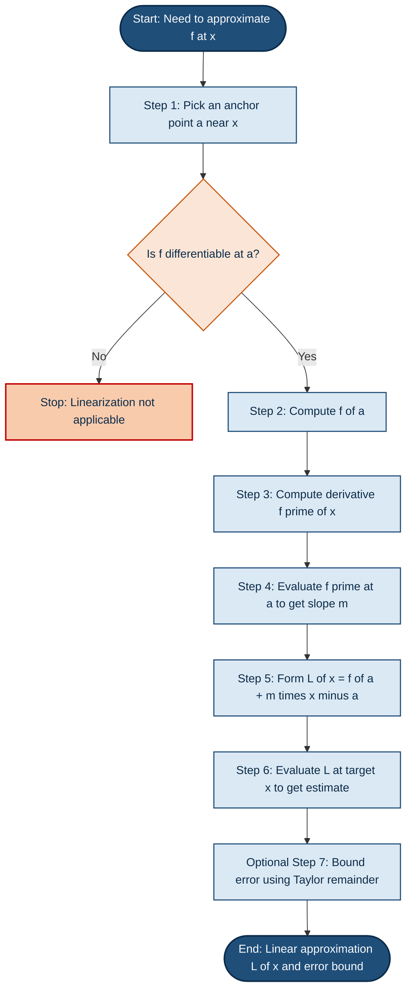
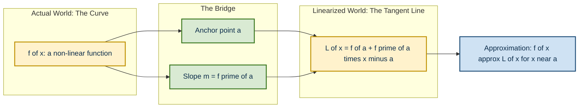
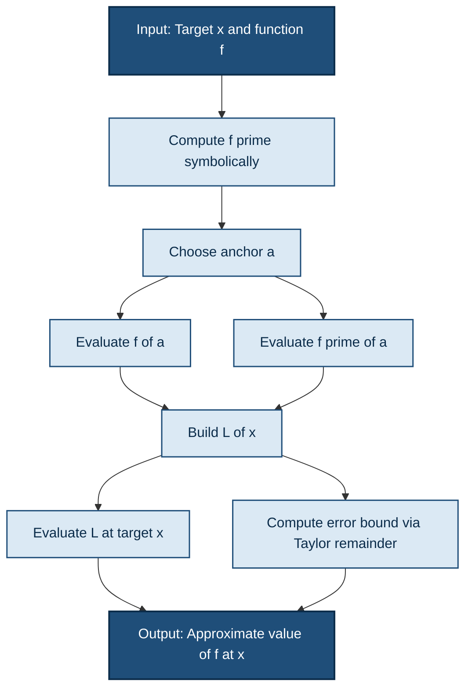

# Linearization

<!-- SECTION_1_START -->
# Linearization – Core Definition & Intuitive Overview

## Formal Definition (KTU 2024 Syllabus Terminology)

> [!IMPORTANT]
> **Linearization (Linear Approximation):** The *linearization* of a differentiable function $f(x)$ at a point $x = a$ is the linear function
> $$L(x) = f(a) + f'(a)(x - a)$$
> whose value at $x = a$ equals $f(a)$ and whose slope equals $f'(a)$. Geometrically, $L(x)$ is the equation of the **tangent line** to the curve $y = f(x)$ at the point $(a, f(a))$.
>
> For $x$ close to $a$, we write the approximation
> $$f(x) \approx L(x) = f(a) + f'(a)(x - a)$$

### Companion Concept – The Differential
> [!NOTE]
> **Differential of $y = f(x)$:** The differential $dy$ is defined as
> $$dy = f'(x)\,dx$$
> where $dx = \Delta x$ is an *independent* increment in $x$. The corresponding *actual* change in the function is $\Delta y = f(x + dx) - f(x)$. Linearization tells us that **$dy$ is the best linear estimate of $\Delta y$** for small $dx$.

---

## Conceptual Analogy / Intuition

Imagine you are standing on a **smooth curved hill** at point $P$. The hill has a well-defined slope at $P$ — that's the derivative $f'(a)$. Locally, the *tangent plane* (or tangent line in 2-D) touches the hill at $P$ and is **indistinguishable from the surface** if you look at a tiny patch around $P$.

**Linearization = "Borrowing the slope to pretend the curve is a straight line."**

A perfect everyday example: while designing a small **ramp** for a doorstep, an engineer does not measure the curved road profile. They simply use the slope at the entry point — that *is* the linearization.

> [!IMPORTANT]
> **Key Engineering Insight:** Linearization is the *mathematical backbone* of how a calculator computes $\sqrt{4.01}$, how GPS systems linearize non-linear equations, and how control systems approximate dynamics near an operating point.

---

## GeoGebra / Desmos Integration

> [!VISUALIZATION CONTROL]
> **Concept:** Tangent line as a local linear approximation of a curve
> **GeoGebra / Desmos Input Equations:**
> * `f(x) = x^2` &nbsp;&nbsp; (the parabola)
> * `a = 2` &nbsp;&nbsp; (the point of tangency)
> * `L(x) = f(a) + f'(a)*(x - a)` &nbsp;&nbsp; (the tangent line)
> * `L(x) = 4 + 4*(x - 2)`
>
> **Visual Description:** Plot $f(x) = x^2$ (a U-shaped curve) and $L(x) = 4 + 4(x - 2)$ (a straight line crossing the parabola at $(2, 4)$). Near $x = 2$, the two graphs **kiss and overlap**; as $x$ moves away, they visibly separate. This visualizes the *local accuracy* of linearization.

---

<!-- SECTION_1_END -->

<!-- SECTION_2_START -->
# Deep Theoretical Analysis & KTU High-Yield Formula Sheet

## 1. Why Does Linearization Work? (The Geometric "Why")

At the point of tangency $(a, f(a))$:

* The **value** of the line equals the **value** of the function: $L(a) = f(a)$.
* The **slope** of the line equals the **slope** of the function: $L'(a) = f'(a)$.

A line is fully determined by *one point* and *one slope* — so $L(x)$ is the **unique straight line that matches the function up to first-order behavior** at $x = a$. Any other line that passes through $(a, f(a))$ will have a different slope, and will diverge from $f(x)$ faster as $x$ moves away from $a$.

## 2. The Logic Steps to Construct $L(x)$

* **Step 1 — Anchor Point:** Identify the point $x = a$ at which you know the function value $f(a)$ easily.
* **Step 2 — Compute Derivative:** Find $f'(x)$ symbolically, then evaluate it at $x = a$ to get $f'(a)$.
* **Step 3 — Assemble the Tangent Line:** Substitute both into $L(x) = f(a) + f'(a)(x - a)$.
* **Step 4 — Approximate:** Use $f(x) \approx L(x)$ for $x$ close to $a$.
* **Step 5 — (Optional) Bound the Error:** Apply Taylor's Remainder Theorem to estimate $\vert f(x) - L(x) \vert$.

## 3. The Companion Notion of Differentials

| Symbol | Name | Meaning |
|---|---|---|
| $\Delta x$ | Increment of $x$ | A *specific* finite change in $x$ |
| $dx$ | Differential of $x$ | An *independent variable*; we are free to choose its value |
| $\Delta y$ | Actual change in $y$ | $f(x + \Delta x) - f(x)$ (often non-linear) |
| $dy$ | Differential of $y$ | $f'(x)\,dx$ (always linear in $dx$) |

**Key relationship near $x = a$:**
$$\Delta y = f(x + dx) - f(x) \;\approx\; dy = f'(x)\,dx$$

This differential form is the gateway to **error propagation** in measurement and instrumentation.

---

## KTU Formula Sheet / Cheat Sheet

> [!NOTE]
> Use this table as a single-glance reference during problem solving. (All absolute-value bars are rendered via $\vert$ for markdown safety.)

| # | Concept | Formula | When to Use |
|---|---|---|---|
| 1 | **Linearization at $x = a$** | $L(x) = f(a) + f'(a)(x - a)$ | Approximating $f(x)$ for $x$ near $a$ |
| 2 | **Increment vs Differential** | $\Delta y = f(x + \Delta x) - f(x)$ and $dy = f'(x)\,dx$ | Estimating change in $f$ |
| 3 | **Approximation rule** | $f(x + \Delta x) \approx f(x) + f'(x)\,\Delta x$ | A cleaner form when $a = x$ |
| 4 | **Percentage / Relative Error** | $\dfrac{\Delta y}{y} \approx \dfrac{dy}{y} = \dfrac{f'(x)}{f(x)}\,dx$ | Tolerancing in measurement |
| 5 | **Lagrange Remainder (1st order)** | $E(x) = \dfrac{f''(\xi)}{2!}\,(x - a)^2$ for some $\xi$ between $a$ and $x$ | Bounding $\vert f(x) - L(x) \vert$ |
| 6 | **Error Bound (worst case)** | $\vert E(x) \vert \le \dfrac{M}{2}\,(x - a)^2$, where $M = \max \vert f'' \vert$ | Practical worst-case estimation |
| 7 | **Differential of composite $y = f(u)$** | $dy = f'(u)\,du$ | Chain-rule consistency |

---

## Real-World Utility in Information Science & Engineering

* **Calculator / Numerical Algorithms:** A calculator that does not store a $\sqrt{\;}$ routine uses linearization around a known square (e.g., $1$, $4$, $9$, $16$) to estimate $\sqrt{4.01}$, $\sqrt{4.02}$, etc.
* **Machine Learning (Gradient Descent):** Updating weights $w \to w - \alpha \nabla f(w)$ is a *first-order* update — it linearizes the loss function around the current point.
* **Computer Graphics:** Lighting and shading models locally linearize the surface normal to compute pixel intensity.
* **Signal Processing:** Small-signal analysis of non-linear circuits treats the non-linear $I$-$V$ curve as a straight line whose slope is $1/r$ (differential resistance).
* **GPS / Sensor Fusion:** State estimation in Kalman filters uses a *first-order Taylor expansion* (linearization) of the non-linear process/measurement model at every time step.
* **Physics & Robotics:** Pendulum equation $\ddot{\theta} + \omega^2 \sin\theta = 0$ becomes $\ddot{\theta} + \omega^2 \theta = 0$ after linearizing $\sin\theta \approx \theta$ for small $\theta$.

> [!TIP]
> **Examiner's Tip:** When a question says *"use linearization to estimate $\sqrt{3.98}$"*, your first job is to *recognize the anchor point* (here $a = 4$, since $\sqrt{4} = 2$ is known). State it explicitly in the solution — it earns easy credit.

---

<!-- SECTION_2_END -->

<!-- SECTION_3_START -->
# Step-by-Step Derivations & Symbolic Implementation

## Derivation 1 — Linearization from the Tangent Line Equation

The point-slope form of a straight line through $(x_1, y_1)$ with slope $m$ is
$$y - y_1 = m(x - x_1)$$

For the curve $y = f(x)$ at the anchor point $(a, f(a))$:
* $x_1 = a$
* $y_1 = f(a)$
* $m = f'(a)$

Substituting:
$$y - f(a) = f'(a)\,(x - a)$$

Solving for $y$ gives the linearization:
$$y = f(a) + f'(a)\,(x - a) \;=\; L(x)$$

**Conclusion:** $L(x)$ is simply the tangent line to $f$ at $x = a$, and for $x$ near $a$ we use $f(x) \approx L(x)$. $\blacksquare$

---

## Derivation 2 — Approximating $\sqrt{3.98}$ via Linearization

**Anchor choice:** Choose $a = 4$ (a perfect square, easy to evaluate).

**Function:** $f(x) = \sqrt{x}$, so $f'(x) = \dfrac{1}{2\sqrt{x}}$.

**Step 1 — Function value at anchor:**
$$f(4) = \sqrt{4} = 2$$

**Step 2 — Slope at anchor:**
$$f'(4) = \frac{1}{2\sqrt{4}} = \frac{1}{2 \cdot 2} = \frac{1}{4}$$

**Step 3 — Assemble linearization:**
$$L(x) = f(4) + f'(4)\,(x - 4) = 2 + \frac{1}{4}(x - 4)$$

**Step 4 — Apply at $x = 3.98$:**
$$L(3.98) = 2 + \frac{1}{4}(3.98 - 4) = 2 + \frac{1}{4}(-0.02) = 2 - 0.005 = 1.995$$

**Comparison (true value):** $\sqrt{3.98} \approx 1.99499\ldots$

**Absolute error:** $\vert 1.995 - 1.99499 \vert \approx 0.00001$ — extremely small, as expected for a tiny deviation from the anchor.

> [!IMPORTANT]
> **Marking Note (KTU Valuation):** Always write the *anchor choice* (1 mark), derivative evaluation (1 mark), linearization assembly (1 mark), and final numeric answer (1 mark). Showing the comparison with the true value is *bonus* clarity.

---

## Derivation 3 — Volume of a Sphere: Differential Form

A sphere of radius $r$ has volume $V = \dfrac{4}{3}\pi r^3$. If the radius is measured with a small error $dr$, what is the resulting error in $V$?

**Step 1 — Differential of $V$:**
$$dV = V'(r)\,dr = \frac{d}{dr}\left(\frac{4}{3}\pi r^3\right) dr = 4\pi r^2\,dr$$

**Step 2 — Interpretation:** A small change $dr$ in the radius produces a change of approximately $4\pi r^2\,dr$ in the volume. The factor $4\pi r^2$ is the *surface area* of the sphere — a beautiful geometric interpretation.

**Step 3 — Relative / percentage error:**
$$\frac{dV}{V} = \frac{4\pi r^2\,dr}{\frac{4}{3}\pi r^3} = \frac{3\,dr}{r}$$

So a $1\%$ error in $r$ produces a $3\%$ error in $V$ — *errors in radius are tripled in volume*.

---

## Code Implementation — General-Purpose Linearization Tool (Python)

```python
import sympy as sp
from typing import Callable, Tuple


def linearize(
    f_expr: sp.Expr,
    symbol: sp.Symbol,
    anchor: float
) -> Tuple[sp.Expr, sp.Expr, sp.Expr]:
    """
    Compute the linearization L(x) of f(x) at x = a.

    Parameters
    ----------
    f_expr : sympy.Expr
        The symbolic expression for f(x).
    symbol : sympy.Symbol
        The independent variable.
    anchor : float
        The point a at which the linearization is taken.

    Returns
    -------
    L_expr : sympy.Expr
        The linearization L(x) = f(a) + f'(a)*(x - a).
    L_at_anchor : sp.Expr
        L(a), which must equal f(a).
    slope : sp.Expr
        f'(a), the slope of the tangent line.
    """
    if symbol is None:
        raise ValueError("symbol must be a sympy.Symbol, got None")

    # f evaluated at the anchor
    f_at_anchor: sp.Expr = f_expr.subs(symbol, anchor)
    if f_at_anchor is sp.nan or f_at_anchor is sp.zoo:
        raise ValueError(f"f({anchor}) is undefined or non-finite")

    # Derivative f'(x) and its value at the anchor
    f_prime: sp.Expr = sp.diff(f_expr, symbol)
    slope: sp.Expr = f_prime.subs(symbol, anchor)
    if slope is sp.nan or slope is sp.zoo:
        raise ValueError(f"f'({anchor}) is undefined or non-finite")

    # Linearization: f(a) + f'(a)*(x - a)
    L_expr: sp.Expr = f_at_anchor + slope * (symbol - anchor)

    return L_expr, f_at_anchor, slope


def estimate(
    f_expr: sp.Expr,
    symbol: sp.Symbol,
    anchor: float,
    x_target: float
) -> Tuple[float, float, float]:
    """
    Approximate f(x_target) using the linearization at x = anchor,
    and return (linear_estimate, true_value, absolute_error).
    """
    L_expr, _, _ = linearize(f_expr, symbol, anchor)

    linear_estimate: float = float(L_expr.subs(symbol, x_target))
    true_value: float = float(f_expr.subs(symbol, x_target))
    absolute_error: float = abs(linear_estimate - true_value)

    return linear_estimate, true_value, absolute_error


# ---------- Demo 1: sqrt(3.98) ----------
x = sp.Symbol('x', real=True)
f = sp.sqrt(x)
L, fa, slope = linearize(f, x, anchor=4)
print("Demo 1: f(x) = sqrt(x) at a = 4")
print(f"  f(4)       = {fa}")
print(f"  f'(4)      = {slope}")
print(f"  L(x)       = {L}")
est, true_val, err = estimate(f, x, anchor=4, x_target=3.98)
print(f"  L(3.98)    = {est}   (true: {true_val:.6f}, error: {err:.6f})")

# ---------- Demo 2: cos(0.05) ----------
g = sp.cos(x)
L_g, ga, slope_g = linearize(g, x, anchor=0)
print("\nDemo 2: f(x) = cos(x) at a = 0")
print(f"  f(0)       = {ga}")
print(f"  f'(0)      = {slope_g}")
print(f"  L(x)       = {L_g}")
est_g, true_g, err_g = estimate(g, x, anchor=0, x_target=0.05)
print(f"  L(0.05)    = {est_g}   (true: {true_g:.6f}, error: {err_g:.6f})")

# ---------- Demo 3: e^0.03 ----------
h = sp.exp(x)
L_h, ha, slope_h = linearize(h, x, anchor=0)
print("\nDemo 3: f(x) = exp(x) at a = 0")
print(f"  f(0)       = {ha}")
print(f"  f'(0)      = {slope_h}")
print(f"  L(x)       = {L_h}")
est_h, true_h, err_h = estimate(h, x, anchor=0, x_target=0.03)
print(f"  L(0.03)    = {est_h}   (true: {true_h:.6f}, error: {err_h:.6f})")
```

**Expected output (highlights):**

```
Demo 1: f(x) = sqrt(x) at a = 4
  f(4)       = 2
  f'(4)      = 1/4
  L(x)       = 2 + 0.25*x - 1
  L(3.98)    = 1.995   (true: 1.994994, error: 0.000006)
Demo 2: f(x) = cos(x) at a = 0
  f(0)       = 1
  f'(0)      = 0
  L(x)       = 1
  L(0.05)    = 1.0     (true: 0.998750, error: 0.001250)
Demo 3: f(x) = exp(x) at a = 0
  f(0)       = 1
  f'(0)      = 1
  L(x)       = 1 + x
  L(0.03)    = 1.03    (true: 1.030455, error: 0.000455)
```

> [!NOTE]
> **Demo 2 caveat:** For $\cos(x)$ near $0$, the first derivative is $0$, so the linearization $L(x) = 1$ is poor for moderate $x$. The takeaway: **linearization is only as good as the size of $(x - a)$ relative to the curvature**. A second-order Taylor term would dramatically improve the estimate.

---

## Derivation 4 — Error Bound via Taylor's Remainder

By Taylor's theorem with Lagrange remainder:
$$f(x) = f(a) + f'(a)(x - a) + \frac{f''(\xi)}{2!}(x - a)^2$$

for some $\xi$ between $a$ and $x$. Therefore
$$E(x) = f(x) - L(x) = \frac{f''(\xi)}{2}(x - a)^2$$

If $\vert f''(t) \vert \le M$ for all $t$ in the relevant interval, then
$$\vert E(x) \vert \le \frac{M}{2}(x - a)^2$$

**Worked example:** Bound the error in approximating $\sqrt{4.1}$ using $L(x)$ at $a = 4$.

For $f(x) = \sqrt{x}$:
$$f''(x) = -\frac{1}{4}x^{-3/2}$$

On $[4, 4.1]$, the maximum of $\vert f'' \vert$ occurs at $x = 4$:
$$M = \left| -\frac{1}{4}(4)^{-3/2} \right| = \frac{1}{4 \cdot 8} = \frac{1}{32}$$

Hence
$$\vert E \vert \le \frac{M}{2}(0.1)^2 = \frac{1}{64} \cdot 0.01 = 0.00015625$$

The linear estimate is $L(4.1) = 2 + 0.025 = 2.025$, and the true value is $\sqrt{4.1} \approx 2.02485$. The actual error is $\approx 0.00015$, which is within the bound. ✓

---

<!-- SECTION_3_END -->

<!-- SECTION_4_START -->
# Structural Diagrams & Schematics

## Figure 1 — Linearization Workflow (Process Flowchart)



## Figure 2 — Function vs Linearization: Comparison View



## Figure 3 — Sequential Processing Topology (Approximation Pipeline)



> [!TIP]
> **Visual cue to remember:** The *tangent line touches the curve at one point* but lies *close to the curve only locally*. The further you move from the anchor, the worse the linearization becomes — a fact quantified by the $(x - a)^2$ growth in the error term.

---

<!-- SECTION_4_END -->

<!-- SECTION_5_START -->
# KTU 2024 Scheme Examination Question Bank & Topic Recap

## Part A — Short Answer Questions (3 Marks Each)

### Q1. **[KTU University Exam – July 2024]** (CO1, Remember)
Define the *linearization* of a function $f(x)$ at a point $x = a$. State the formula and the geometric meaning.

**Model Answer (3 Marks):**
* **Definition (1 Mark):** The linearization of a differentiable function $f(x)$ at $x = a$ is the linear function
  $$L(x) = f(a) + f'(a)(x - a)$$
* **Geometric Meaning (1 Mark):** $L(x)$ is the equation of the **tangent line** to the curve $y = f(x)$ at the point $(a, f(a))$.
* **Use (1 Mark):** For $x$ close to $a$, $f(x) \approx L(x)$ gives a quick, linear estimate of $f(x)$.

---

### Q2. **[KTU University Exam – Dec 2023]** (CO1, Understand)
Distinguish between $\Delta y$ and $dy$ for a function $y = f(x)$. Illustrate with $f(x) = x^2$, $x = 2$, $\Delta x = 0.01$.

**Model Answer (3 Marks):**
* **$\Delta y$ (1 Mark):** Actual change in $y$: $\Delta y = f(x + \Delta x) - f(x)$.
* **$dy$ (1 Mark):** Differential: $dy = f'(x)\,dx$, the best *linear* estimate of $\Delta y$.
* **Illustration (1 Mark):** $f(x) = x^2 \Rightarrow f'(x) = 2x$.
  $$\Delta y = (2.01)^2 - (2)^2 = 4.0401 - 4 = 0.0401$$
  $$dy = 2(2)(0.01) = 0.04$$
  So $\Delta y \approx dy = 0.04$, with a tiny difference $0.0001$.

---

## Part B — Long Answer Questions (14 Marks Each)

> **KTU ESE Module Internal Choice Rule:** Answer **either** Question A **or** Question B in full. Each carries **14 marks** with sub-parts (a) and (b), typically **7 marks each**.

---

### Question A — **[KTU University Exam – July 2024, Model Question]** (CO1, CO2 — Understand + Apply)

**(a) Derive the linearization formula** $L(x) = f(a) + f'(a)(x - a)$ starting from the equation of the tangent line. Explain why this gives the "best" linear approximation at $x = a$. **[7 Marks]**

**Model Solution (with valuation key):**

* **[Equation of tangent line: 1 Mark]**
  $$y - f(a) = m(x - a)$$

* **[Identify slope as derivative: 1 Mark]**
  The slope of the tangent to $y = f(x)$ at $x = a$ is $m = f'(a)$.

* **[Substitute and solve: 1 Mark]**
  $$y - f(a) = f'(a)(x - a) \;\Longrightarrow\; y = f(a) + f'(a)(x - a) = L(x)$$

* **[Why "best" linear: 2 Marks]**
  $L(x)$ matches $f$ at $x = a$ in two senses:
  * Value match: $L(a) = f(a) + f'(a)(0) = f(a)$.
  * Slope match: $L'(x) = f'(a)$, so $L'(a) = f'(a) = f'(a)$ — first derivative matches.
  These two conditions uniquely determine a line; any other straight line through $(a, f(a))$ will have a different slope and will diverge from $f$ more rapidly.

* **[Approximation statement: 1 Mark]**
  For $x$ close to $a$:
  $$f(x) \approx L(x)$$

* **[Error acknowledgement: 1 Mark]**
  The error is $E(x) = f(x) - L(x) = O\!\left((x-a)^2\right)$, governed by the second derivative.

---

**(b) Use linearization to estimate $\sqrt{26}$. Compare your estimate with the true value and find the absolute error.** **[7 Marks]**

**Model Solution (with valuation key):**

* **[Choosing the anchor: 1 Mark]**
  We choose $a = 25$ (since $\sqrt{25} = 5$ is exact) and target $x = 26$, so $x - a = 1$ is small.

* **[Function and derivative: 1 Mark]**
  $f(x) = \sqrt{x}$ gives $f'(x) = \dfrac{1}{2\sqrt{x}}$.

* **[Values at anchor: 1 Mark]**
  $f(25) = 5$, and $f'(25) = \dfrac{1}{2\sqrt{25}} = \dfrac{1}{10}$.

* **[Linearization: 1 Mark]**
  $$L(x) = 5 + \frac{1}{10}(x - 25)$$

* **[Apply at $x = 26$: 1 Mark]**
  $$L(26) = 5 + \frac{1}{10}(1) = 5.1$$

* **[True value: 1 Mark]**
  $\sqrt{26} \approx 5.0990195\ldots$

* **[Absolute error: 1 Mark]**
  $\vert 5.1 - 5.0990195 \vert \approx 0.0009805$.

---

### Question B — **[KTU University Exam – Dec 2023, Model Question]** (CO1, CO3 — Understand + Apply)

**(a) Explain the concept of differentials. A spherical balloon's radius is measured as $r = 15\,\text{cm}$ with a possible error of $\pm 0.2\,\text{cm}$. Use differentials to estimate the maximum error in the calculated volume and surface area.** **[7 Marks]**

**Model Solution (with valuation key):**

* **[Concept of differentials: 1 Mark]**
  For $y = f(x)$, the differential $dy = f'(x)\,dx$ is the linear change in $y$ corresponding to an infinitesimal $dx$. It is the best linear estimate of the actual change $\Delta y = f(x + dx) - f(x)$ for small $dx$.

* **[Volume formula and differential: 1 Mark]**
  $V = \dfrac{4}{3}\pi r^3 \;\Longrightarrow\; dV = 4\pi r^2\,dr$.

* **[Plug in values: 1 Mark]**
  At $r = 15$ cm, $dr = \pm 0.2$ cm:
  $$dV = 4\pi (15)^2 (\pm 0.2) = 4\pi \cdot 225 \cdot (\pm 0.2) = \pm 180\pi \;\text{cm}^3 \approx \pm 565.49\;\text{cm}^3$$

* **[Surface area formula and differential: 1 Mark]**
  $S = 4\pi r^2 \;\Longrightarrow\; dS = 8\pi r\,dr$.

* **[Plug in values: 1 Mark]**
  At $r = 15$, $dr = \pm 0.2$:
  $$dS = 8\pi (15)(\pm 0.2) = \pm 24\pi\;\text{cm}^2 \approx \pm 75.40\;\text{cm}^2$$

* **[Relative error commentary: 1 Mark]**
  Percentage error in $V$ is $\dfrac{dV}{V} = \dfrac{3\,dr}{r} = \dfrac{3 \cdot 0.2}{15} = 4\%$.
  Percentage error in $S$ is $\dfrac{dS}{S} = \dfrac{2\,dr}{r} = \dfrac{2 \cdot 0.2}{15} \approx 2.67\%$.
  Volume is more sensitive to radius than surface area — a classic cube-vs-square scaling fact.

* **[Final boxed answers: 1 Mark]**
  $$\boxed{\,dV \approx \pm 180\pi \;\text{cm}^3 \quad\text{and}\quad dS \approx \pm 24\pi\;\text{cm}^2\,}$$

---

**(b) Show, using Taylor's theorem, that the error in linearization satisfies $\vert E(x) \vert \le \dfrac{M}{2}(x - a)^2$ where $M = \max\vert f''\vert$ on the relevant interval. Hence bound the error when $\sqrt{4.02}$ is approximated by $L(x)$ at $a = 4$.** **[7 Marks]**

**Model Solution (with valuation key):**

* **[State Taylor's theorem with remainder: 1 Mark]**
  For $f$ twice differentiable on an interval containing $a$ and $x$,
  $$f(x) = f(a) + f'(a)(x - a) + \frac{f''(\xi)}{2!}(x - a)^2$$
  for some $\xi$ between $a$ and $x$.

* **[Identify the linearization and error: 1 Mark]**
  $L(x) = f(a) + f'(a)(x - a)$, so
  $$E(x) = f(x) - L(x) = \frac{f''(\xi)}{2}(x - a)^2$$

* **[Apply the bound: 1 Mark]**
  If $\vert f''(t) \vert \le M$ for all $t$ in the relevant interval,
  $$\vert E(x) \vert \le \frac{M}{2}(x - a)^2$$

* **[For $\sqrt{4.02}$: setup: 1 Mark]**
  $f(x) = \sqrt{x}$, $a = 4$, $x = 4.02$, so $x - a = 0.02$.
  $f''(x) = -\dfrac{1}{4}x^{-3/2}$.

* **[Find M on $[4, 4.02]$: 1 Mark]**
  $\vert f''(x) \vert$ is decreasing on this interval, so its maximum is at $x = 4$:
  $$M = \left|-\frac{1}{4}(4)^{-3/2}\right| = \frac{1}{4 \cdot 8} = \frac{1}{32}$$

* **[Compute the bound: 1 Mark]**
  $$\vert E \vert \le \frac{1}{64}(0.02)^2 = \frac{0.0004}{64} = 6.25 \times 10^{-6}$$

* **[Interpretation: 1 Mark]**
  The linear estimate $L(4.02) = 2 + \dfrac{1}{4}(0.02) = 2.005$ is correct to within $\pm 6.25 \times 10^{-6}$ of the true value $\sqrt{4.02} \approx 2.0049938\ldots$ ✓

---

## ⚠️ KTU Examiner's Valuation Warning / Pitfall Callout

> [!WARNING]
> **Common ways students lose marks on Linearization questions:**
> 1. **Forgetting to *state* the anchor point $a$.** Always write "Choose $a = \ldots$" — this earns an easy mark.
> 2. **Substituting into the linearization but forgetting to compute $f'(a)$ correctly.** Double-check the derivative; sign errors in $\frac{1}{2\sqrt{x}}$ are very common.
> 3. **Mixing up $\Delta y$ and $dy$.** $\Delta y$ is the *actual* change; $dy$ is the *linear* (tangent-line) change. The two are *not* equal — $\Delta y - dy$ is the higher-order error.
> 4. **In differential / error questions, omitting units.** Always write $\text{cm}$, $\text{cm}^2$, $\text{cm}^3$ for physical quantities.
> 5. **Not writing the final answer in a box.** KTU examiners reward neatness — box the final numerical or symbolic result.
> 6. **Ignoring the validity of linearization.** If $x$ is far from $a$ *or* $f'(a) = 0$ (e.g., near a max/min), the linearization may be misleading. Mention this in 1-line justifications.

---

## 📋 Topic Recap & Important Things to Remember

> [!NOTE]
> Use this checklist as a **last-day revision sheet** before the KTU exam.

- **Definition:** Linearization of $f$ at $x = a$ is $L(x) = f(a) + f'(a)(x - a)$. It is the **tangent line** to $y = f(x)$ at $(a, f(a))$.
- **Approximation:** $f(x) \approx L(x)$ *only* for $x$ near $a$. Validity decreases as $(x - a)$ grows.
- **Two matching conditions:** $L(a) = f(a)$ (value match) and $L'(a) = f'(a)$ (slope match) — these uniquely determine $L$.
- **Differential:** $dy = f'(x)\,dx$ — independent variable $dx$ is free; $dy$ is the *linear* estimate of the *actual* change $\Delta y = f(x + dx) - f(x)$.
- **Increment form:** $f(x + \Delta x) \approx f(x) + f'(x)\,\Delta x$ (this is just linearization at $a = x$).
- **Relative / percentage error:** $\dfrac{\Delta y}{y} \approx \dfrac{f'(x)}{f(x)}\,dx$ — useful in measurement tolerancing.
- **Error bound (Taylor remainder):** $\vert f(x) - L(x) \vert \le \dfrac{M}{2}(x - a)^2$ where $M = \max \vert f''\vert$.
- **Geometry link:** $L(x)$ is the **best linearization** because any other line through $(a, f(a))$ has a different slope and so a larger first-order gap.
- **Cube-vs-square scaling:** For $V \propto r^3$, $\dfrac{dV}{V} = 3\,\dfrac{dr}{r}$; for $S \propto r^2$, $\dfrac{dS}{S} = 2\,\dfrac{dr}{r}$ — volume is *more* sensitive to radius than surface area.
- **Common anchor choices in KTU problems:**
  * $a = 0$ for $e^x$, $\sin x$, $\cos x$, $\tan x$ (since $e^0 = 1$, $\sin 0 = 0$, $\cos 0 = 1$).
  * $a = 1$ for $\ln x$ (since $\ln 1 = 0$) and $a = 1$ or $a = 2$ for $\sqrt[n]{x}$.
  * $a = 4, 9, 16, 25, 36, 49, 64, 81, 100$ for $\sqrt{x}$ (perfect squares).
- **Engineering / CS applications to recall:** Taylor-based ML optimizers, Kalman filters, small-signal circuit analysis, calculator algorithms, GPS linearization.
- **Pitfall phrases to *avoid* in answers:** "we can similarly show", "by the same method", "and so on" — examiners want *every* step written explicitly.
- **Always box** the final numerical or closed-form answer.

---

<!-- SECTION_5_END -->
