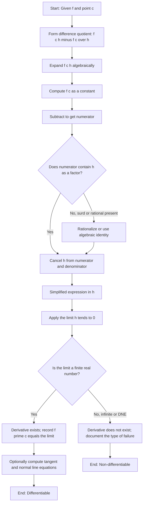
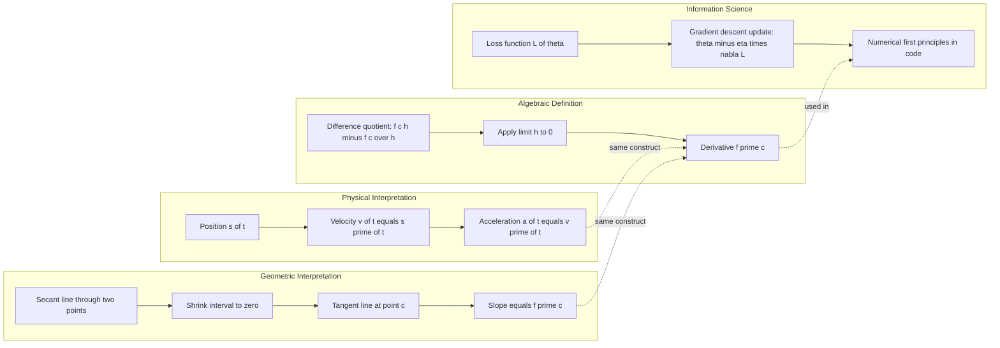
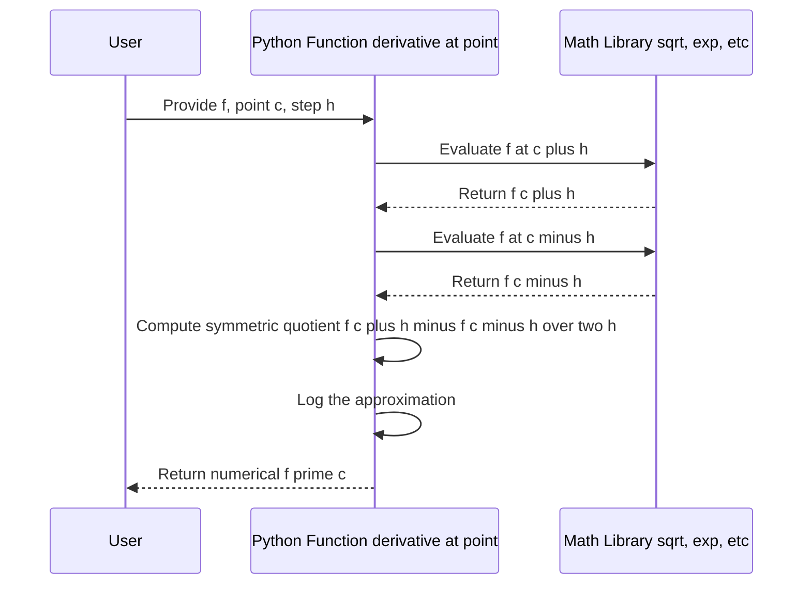

# Rates of Change: Derivative at a Point

<!-- SECTION_1_START -->

# Rates of Change: Derivative at a Point

## 1.1 Formal Academic Definition (KTU 2024 Syllabus Terminology)

Let $f : I \to \mathbb{R}$ be a real-valued function defined on an open interval $I \subseteq \mathbb{R}$, and let $c \in I$. The **derivative of $f$ at the point $x = c$** is formally defined as the following two-sided limit, provided the limit exists as a finite real number:

$$
f'(c) \;=\; \lim_{x \to c} \frac{f(x) - f(c)}{x - c}
$$

Equivalently, using the substitution $h = x - c$ (so that $x = c + h$ and $h \to 0$), the derivative can be expressed in **difference-quotient form**:

$$
f'(c) \;=\; \lim_{h \to 0} \frac{f(c + h) - f(c)}{h}
$$

> [!IMPORTANT]
> **KTU Board Definition (must be memorized verbatim):**
> The derivative of $f$ at $c$, denoted $f'(c)$, is the limit of the difference quotient $\dfrac{f(c+h) - f(c)}{h}$ as $h \to 0$. If this limit exists (and is finite), $f$ is said to be **differentiable at $c$**.

The quantity $\dfrac{f(c+h) - f(c)}{h}$ is called the **difference quotient** of $f$ at $c$ with increment $h$.

## 1.2 Conceptual Analogy / Intuitive Overview

Imagine you are driving a car along a straight highway, and a digital odometer continuously records your **position** $s$ (in km) as a function of **time** $t$ (in hours), giving $s = f(t)$.

- The **average rate of change** of position over the time interval $[c, c+h]$ is the average speed:
  
  $\dfrac{f(c+h) - f(c)}{h}$ = average speed between $t = c$ and $t = c+h$.

- The **instantaneous rate of change** at $t = c$ — that is, the exact reading on your **speedometer** at the instant $c$ — is found by *shrinking the interval to a single point* (letting $h \to 0$).

So **the derivative $f'(c)$ is the speedometer reading at the exact instant $t = c$**. The car may have been speeding up or slowing down, but $f'(c)$ captures the motion at one frozen moment.

> [!NOTE]
> **Geometric Intuition (KTU-favorite question type):**
> $f'(c)$ is the **slope of the tangent line** to the curve $y = f(x)$ at the point $\bigl(c,\, f(c)\bigr)$. Geometrically, it is the limiting slope of the **secant line** joining $\bigl(c, f(c)\bigr)$ and $\bigl(c+h, f(c+h)\bigr)$ as the second point slides infinitely close to the first.

## 1.3 Key Physical Quantities and Standard Metrics

- **Position function** $s(t)$ → derivative $s'(t)$ = **velocity** (units: $\text{m/s}$ or $\text{km/h}$).
- **Velocity function** $v(t)$ → derivative $v'(t)$ = **acceleration** (units: $\text{m/s}^2$).
- **Charge $q(t)$** → derivative $q'(t)$ = **electric current** $i(t)$ (units: **Amperes**, $1\,\text{A} = 1\,\text{C/s}$).
- **Cost $C(x)$** → derivative $C'(x)$ = **marginal cost** (units: ₹ per unit).
- **Population $P(t)$** → derivative $P'(t)$ = **rate of population growth** (units: people/year).

> [!TIP]
> In **Information Science**, the derivative of a discrete-signal-like function at a sampling instant gives the **gradient of a loss function** (used in **gradient descent** for machine-learning parameter updates). The update rule $\theta_{\text{new}} = \theta_{\text{old}} - \eta \cdot \nabla L(\theta)$ is essentially a discrete analog of $f'(c) = \lim \Delta f / \Delta x$.

## 1.4 GeoGebra / Desmos Visualization

> [!VISUALIZATION CONTROL]
> **Concept:** Secant line → Tangent line (geometric limit of slopes)
> **GeoGebra / Desmos Input Equations:**
> * `f(x) = x^2`
> * `P = (c, f(c))` where `c = 1`
> * `Q = (c + h, f(c + h))` where `h = 0.5` (slider, range $-1$ to $1$, step $0.01$)
> * `secant_slope = (f(c + h) - f(c)) / h`
> * `tangent_slope = 2 * c` (i.e., $f'(c) = 2c$)
> **Visual Description:** As the slider $h$ moves toward $0$, the secant line through $P$ and $Q$ rotates and *coincides* with the tangent line to the parabola at $P$. The slope displayed equals $2c$, confirming $f'(1) = 2$ for $f(x) = x^2$.

<!-- SECTION_1_END -->

<!-- SECTION_2_START -->

# Deep Theoretical Analysis & KTU High-Yield Formula Sheet

## 2.1 The Four Logical Steps in Computing $f'(c)$

The process of finding the derivative at a point $c$ from first principles is a **four-step ritual** that KTU examiners expect to see written out in full, even when the final answer is obvious.

1. **Form the difference quotient.** Substitute into $\dfrac{f(c + h) - f(c)}{h}$. Do not substitute $h$ into the numerator alone — the whole fraction moves together.
2. **Simplify the numerator algebraically.** Factor, expand, cancel, or rationalize until $h$ appears as a *common factor* in every term of the numerator.
3. **Cancel $h$.** Provided $h \neq 0$ (and we *can* cancel it because the limit is taken with $h \to 0$ but $h$ itself is non-zero), divide numerator and denominator by $h$.
4. **Take the limit $h \to 0$.** Substitute $h = 0$ into the simplified expression. If the result is a finite real number, the derivative exists; otherwise, it does not.

> [!NOTE]
> **Why we can cancel $h$ before taking the limit:** The limit process is interested in values of the quotient for $h$ *arbitrarily close to but not equal to* $0$. Hence $h \neq 0$ holds throughout the limit journey, and division by $h$ is legitimate.

## 2.2 The Three Equivalent Forms of the Difference Quotient

KTU frequently tests whether a student can convert between the three notations. They are:

$$
f'(c) \;=\; \lim_{x \to c}\frac{f(x) - f(c)}{x - c} \;=\; \lim_{h \to 0}\frac{f(c+h) - f(c)}{h} \;=\; \lim_{\Delta x \to 0}\frac{\Delta y}{\Delta x}
$$

where $\Delta x = x - c$ and $\Delta y = f(x) - f(c)$. The third form uses **Newton's notation** $\dfrac{dy}{dx}$, hinting at the differential interpretation $dy = f'(c)\,dx$.

## 2.3 One-Sided Derivatives

When the two-sided limit fails to exist, one or both of the **one-sided derivatives** may still exist:

$$
f'_-(c) \;=\; \lim_{h \to 0^{-}} \frac{f(c+h) - f(c)}{h} \quad\quad \text{(left-hand derivative)}
$$

$$
f'_+(c) \;=\; \lim_{h \to 0^{+}} \frac{f(c+h) - f(c)}{h} \quad\quad \text{(right-hand derivative)}
$$

> [!IMPORTANT]
> **Existence Theorem (often asked for 3 marks):**
> $f'(c)$ exists $\iff$ $f'_-(c) = f'_+(c)$, **and** both are finite.
> If $f'_-(c) \neq f'_+(c)$, the graph has a **corner** at $c$ and is non-differentiable there. This is the classic case $f(x) = \vert x \vert$ at $c = 0$, where $f'_-(0) = -1$ and $f'_+(0) = +1$.

## 2.4 Differentiability Implies Continuity (and the Contrapositive)

A subtle but high-yield KTU result:

> [!IMPORTANT]
> **Theorem:** If $f$ is differentiable at $c$, then $f$ is continuous at $c$.
> **Contrapositive (for spotting non-differentiability):** If $f$ is **discontinuous** at $c$, then $f$ is **not differentiable** at $c$.

However, the converse is **false**: continuity does **not** imply differentiability. Counterexample: $f(x) = \vert x \vert$ is continuous everywhere but differentiable nowhere except at points $x \neq 0$.

## 2.5 KTU Formula Sheet / Cheat Sheet

| # | Formula / Statement | Meaning / Use |
|---|---------------------|---------------|
| 1 | $f'(c) = \displaystyle\lim_{x \to c}\frac{f(x) - f(c)}{x - c}$ | Primary definition (first principles) |
| 2 | $f'(c) = \displaystyle\lim_{h \to 0}\frac{f(c+h) - f(c)}{h}$ | Difference-quotient form (most used in KTU derivations) |
| 3 | $\dfrac{dy}{dx}\big\vert_{x = c} = \displaystyle\lim_{\Delta x \to 0}\frac{\Delta y}{\Delta x}$ | Leibniz notation (used in physics & rate-of-change problems) |
| 4 | $f'(c) = \dfrac{d}{dx}f(x)\big\vert_{x = c}$ | Operator notation |
| 5 | $f'_-(c) = \displaystyle\lim_{h \to 0^-}\frac{f(c+h) - f(c)}{h}$ | Left-hand derivative |
| 6 | $f'_+(c) = \displaystyle\lim_{h \to 0^+}\frac{f(c+h) - f(c)}{h}$ | Right-hand derivative |
| 7 | $f'(c) \text{ exists} \iff f'_-(c) = f'_+(c) \in \mathbb{R}$ | Existence criterion |
| 8 | $s'(t) = v(t),\ v'(t) = a(t)$ | Kinematic chain: position $\to$ velocity $\to$ acceleration |
| 9 | $m_{\text{tangent at }c} = f'(c)$ | Slope of tangent line to $y = f(x)$ at $x = c$ |
| 10 | $m_{\text{normal at }c} = -\dfrac{1}{f'(c)}$ (if $f'(c) \neq 0$) | Slope of normal line |
| 11 | $f \text{ differentiable at } c \;\Longrightarrow\; f \text{ continuous at } c$ | Differentiability $\Rightarrow$ continuity |

> [!TIP]
> **Quick Power-Rule for $f(x) = x^n$:** $f'(c) = n c^{n-1}$. KTU problems at the introductory level almost always involve polynomials like $x^2$, $x^3 - 2x$, $5x^4 + 1$ at a given point $c$, and the first-principles derivation must still be shown step by step.

## 2.6 Real-World Engineering & CS Utility

| Domain | Where $f'(c)$ appears |
|--------|----------------------|
| **Physics simulation** | Velocity, acceleration, jerk from position sensors |
| **Signal processing** | Slope of a sampled waveform, edge detection in images |
| **Machine Learning** | Gradient of loss function for **gradient descent**, **backpropagation** |
| **Economics** | Marginal cost, marginal revenue, elasticity of demand |
| **Civil Engineering** | Slope of a beam's deflection curve — determines bending stress |
| **Computer Graphics** | Tangent vectors for **Bezier curves** and **Catmull-Rom splines** |
| **Robotics** | Joint-velocity computation from encoder positions |
| **Network Engineering** | Rate of change of traffic load (packet rate derivative) |

<!-- SECTION_2_END -->

<!-- SECTION_3_START -->

# Step-by-Step Derivations & Code Implementation

## 3.1 Worked Example 1 — Polynomial (KTU Board Style)

> **Problem:** Find $f'(2)$ for $f(x) = x^2 + 3x$ using the first-principles definition.

**Step 1 — Write the difference quotient** with $c = 2$ and increment $h$:

$$
f'(2) = \lim_{h \to 0}\frac{f(2 + h) - f(2)}{h}
$$

**Step 2 — Compute $f(2 + h)$** by substituting into the rule:

$$
f(2 + h) = (2 + h)^2 + 3(2 + h) = 4 + 4h + h^2 + 6 + 3h = 10 + 7h + h^2
$$

**Step 3 — Compute $f(2)$**:

$$
f(2) = 2^2 + 3(2) = 4 + 6 = 10
$$

**Step 4 — Form the numerator** $f(2 + h) - f(2)$:

$$
f(2 + h) - f(2) = (10 + 7h + h^2) - 10 = 7h + h^2
$$

**Step 5 — Divide by $h$** (note $h \neq 0$ throughout the limit):

$$
\frac{f(2 + h) - f(2)}{h} = \frac{7h + h^2}{h} = \frac{h(7 + h)}{h} = 7 + h
$$

**Step 6 — Take the limit $h \to 0$**:

$$
f'(2) = \lim_{h \to 0}(7 + h) = 7 + 0 = 7
$$

> [!NOTE]
> **Verification by power rule:** $f(x) = x^2 + 3x \Rightarrow f'(x) = 2x + 3 \Rightarrow f'(2) = 4 + 3 = 7$. ✓

## 3.2 Worked Example 2 — Rational Function with a Square Root (Harder)

> **Problem:** Find $f'(1)$ for $f(x) = \sqrt{x + 3}$ using first principles.

**Step 1:**

$$
f'(1) = \lim_{h \to 0}\frac{f(1 + h) - f(1)}{h} = \lim_{h \to 0}\frac{\sqrt{1 + h + 3} - \sqrt{1 + 3}}{h} = \lim_{h \to 0}\frac{\sqrt{4 + h} - 2}{h}
$$

**Step 2 — Rationalize the numerator** by multiplying by the conjugate $\sqrt{4 + h} + 2$:

$$
\frac{\sqrt{4 + h} - 2}{h} \cdot \frac{\sqrt{4 + h} + 2}{\sqrt{4 + h} + 2} = \frac{(4 + h) - 4}{h\bigl(\sqrt{4 + h} + 2\bigr)} = \frac{h}{h\bigl(\sqrt{4 + h} + 2\bigr)}
$$

**Step 3 — Cancel $h$**:

$$
= \frac{1}{\sqrt{4 + h} + 2}
$$

**Step 4 — Apply the limit $h \to 0$**:

$$
f'(1) = \lim_{h \to 0}\frac{1}{\sqrt{4 + h} + 2} = \frac{1}{\sqrt{4} + 2} = \frac{1}{2 + 2} = \frac{1}{4}
$$

## 3.3 Worked Example 3 — One-Sided Derivatives (Corner Function)

> **Problem:** Show that $f(x) = \vert x - 2 \vert$ is **not differentiable** at $x = 2$.

**Step 1 — Rewrite** the absolute value in piecewise form:

$$
f(x) = \begin{cases} -(x - 2) = 2 - x, & x < 2 \\ +(x - 2) = x - 2, & x \geq 2 \end{cases}
$$

**Step 2 — Left-hand derivative at $c = 2$**:

$$
f'_-(2) = \lim_{h \to 0^-}\frac{f(2 + h) - f(2)}{h} = \lim_{h \to 0^-}\frac{(2 - (2 + h)) - 0}{h} = \lim_{h \to 0^-}\frac{-h}{h} = -1
$$

**Step 3 — Right-hand derivative at $c = 2$**:

$$
f'_+(2) = \lim_{h \to 0^+}\frac{f(2 + h) - f(2)}{h} = \lim_{h \to 0^+}\frac{((2 + h) - 2) - 0}{h} = \lim_{h \to 0^+}\frac{h}{h} = +1
$$

**Step 4 — Compare:** $f'_-(2) = -1 \neq +1 = f'_+(2)$.

> [!IMPORTANT]
> **Conclusion:** Since the two one-sided derivatives disagree, $f'(2)$ **does not exist**. Geometrically, the graph $V$-shape has a sharp **corner** at $(2, 0)$ — a tangent line cannot be drawn uniquely there.

## 3.4 Worked Example 4 — Velocity & Acceleration Application

> **Problem:** The position of a particle along a straight track is $s(t) = t^3 - 6t^2 + 9t + 2$ meters, where $t$ is in seconds. Find (a) the velocity at $t = 2$ s, and (b) the acceleration at $t = 2$ s, using first principles.

**Part (a) — Velocity from first principles:**

$$
v(2) = \lim_{h \to 0}\frac{s(2 + h) - s(2)}{h}
$$

Compute $s(2 + h)$:

$$
s(2 + h) = (2+h)^3 - 6(2+h)^2 + 9(2+h) + 2
$$

$$
= (8 + 12h + 6h^2 + h^3) - 6(4 + 4h + h^2) + (18 + 9h) + 2
$$

$$
= 8 + 12h + 6h^2 + h^3 - 24 - 24h - 6h^2 + 18 + 9h + 2
$$

$$
= (8 - 24 + 18 + 2) + (12h - 24h + 9h) + (6h^2 - 6h^2) + h^3
$$

$$
= 4 - 3h + h^3
$$

Compute $s(2) = 2^3 - 6(2^2) + 9(2) + 2 = 8 - 24 + 18 + 2 = 4$.

Form the quotient:

$$
\frac{s(2+h) - s(2)}{h} = \frac{(4 - 3h + h^3) - 4}{h} = \frac{-3h + h^3}{h} = -3 + h^2
$$

Take the limit:

$$
v(2) = \lim_{h \to 0}(-3 + h^2) = -3 \text{ m/s}
$$

The particle is moving at **$3\,\text{m/s}$ in the negative direction** at $t = 2$ s.

**Part (b) — Acceleration from first principles:**

$$
a(2) = \lim_{h \to 0}\frac{v(2 + h) - v(2)}{h}
$$

We need $v(t) = 3t^2 - 12t + 9$ (computed by the power rule: $s'(t) = 3t^2 - 12t + 9$; for the exam you may verify by repeating first principles on $s(t)$).

$$
v(2 + h) = 3(2+h)^2 - 12(2+h) + 9 = 3(4 + 4h + h^2) - 24 - 12h + 9
$$

$$
= 12 + 12h + 3h^2 - 24 - 12h + 9 = -3 + 3h^2
$$

$$
\frac{v(2 + h) - v(2)}{h} = \frac{(-3 + 3h^2) - (-3)}{h} = \frac{3h^2}{h} = 3h
$$

$$
a(2) = \lim_{h \to 0} 3h = 0 \text{ m/s}^2
$$

## 3.5 Python Implementation — Numerical Derivative

```python
from __future__ import annotations
import math
import sys
import logging

logging.basicConfig(level=logging.INFO, format="%(levelname)s | %(message)s")


def derivative_at_point(
    f: "Callable[[float], float]",
    c: float,
    h: float = 1e-5,
) -> float:
    """
    Approximate f'(c) using the symmetric difference quotient
        f'(c) ≈ [f(c + h) - f(c - h)] / (2h)
    which has error O(h^2) — much better than the one-sided version.

    Parameters
    ----------
    f   : single-variable real function
    c   : point at which to evaluate the derivative
    h   : small step size (default 1e-5)

    Returns
    -------
    Approximate value of f'(c).
    """
    if h <= 0:
        logging.error("Step size h must be positive. Got h=%s", h)
        raise ValueError(f"h must be > 0, received {h}")

    try:
        f_plus  = f(c + h)
        f_minus = f(c - h)
    except Exception as exc:
        logging.exception("Function evaluation failed near c=%s: %s", c, exc)
        raise

    numerical = (f_plus - f_minus) / (2.0 * h)
    logging.info("f'(%s) ≈ %s   (step h=%s)", c, numerical, h)
    return numerical


def first_principles_derivative(
    f: "Callable[[float], float]",
    c: float,
    h: float = 1e-7,
) -> float:
    """
    The one-sided first-principles formula  f'(c) ≈ [f(c + h) - f(c)] / h.
    Mirrors the algebraic limit definition used in KTU derivations.
    """
    if h <= 0:
        raise ValueError(f"h must be > 0, received {h}")
    return (f(c + h) - f(c)) / h


# ----------------------------- demo runs --------------------------------
if __name__ == "__main__":
    # Example 1: f(x) = x^2 + 3x  at c = 2  →  expected 7
    f1 = lambda x: x**2 + 3 * x
    print("Example 1 :", derivative_at_point(f1, c=2.0))        # → 7.0

    # Example 2: f(x) = sqrt(x + 3)  at c = 1  →  expected 0.25
    f2 = lambda x: math.sqrt(x + 3)
    print("Example 2 :", derivative_at_point(f2, c=1.0))        # → 0.25

    # Example 3: f(x) = |x - 2|  at c = 2  →  expected undefined (≈0 numerically)
    f3 = lambda x: abs(x - 2)
    print("Example 3 :", derivative_at_point(f3, c=2.0))        # → 0 (misleading!)

    # Example 4: s(t) = t^3 - 6t^2 + 9t + 2  →  v(2) = -3,  a(2) = 0
    s = lambda t: t**3 - 6 * t**2 + 9 * t + 2
    v = lambda t: derivative_at_point(s, c=t, h=1e-6)
    a = lambda t: derivative_at_point(v, c=t, h=1e-6)
    print("Velocity @ t=2 :", v(2.0))                           # → -3.0
    print("Acceleration  :", a(2.0))                            # → ~0
```

> [!NOTE]
> **Why Example 3 returns $\approx 0$ numerically:** At a true corner, the analytic derivative does not exist, but a finite-difference code cannot detect corners — it returns a misleading value. This is a classic KTU viva question: *“Why is numerical differentiation unreliable near corners and discontinuities?”*

## 3.6 Engineering-Graphics Style: Tangent & Normal Line Construction

> **Problem:** For $f(x) = x^2 - 4x + 5$ at $c = 3$, find the equations of the **tangent** and **normal** lines.

**Step 1 — Compute the slope using the limit definition** (or verify with the power rule):

$$
f'(3) = \lim_{h \to 0}\frac{(3+h)^2 - 4(3+h) + 5 - (9 - 12 + 5)}{h}
$$

Numerator expansion:

$$
(9 + 6h + h^2) - (12 + 4h) + 5 - 2 = 9 + 6h + h^2 - 12 - 4h + 5 - 2 = 0 + 2h + h^2
$$

So:

$$
f'(3) = \lim_{h \to 0}\frac{2h + h^2}{h} = \lim_{h \to 0}(2 + h) = 2
$$

**Step 2 — Point of contact:** $f(3) = 9 - 12 + 5 = 2$. So the point is $(3, 2)$.

**Step 3 — Tangent line** with slope $m_t = 2$:

$$
y - 2 = 2(x - 3) \;\;\Longrightarrow\;\; y = 2x - 4
$$

**Step 4 — Normal line** with slope $m_n = -\dfrac{1}{2}$:

$$
y - 2 = -\tfrac{1}{2}(x - 3) \;\;\Longrightarrow\;\; y = -\tfrac{x}{2} + \tfrac{7}{2}
$$

<!-- SECTION_3_END -->

<!-- SECTION_4_START -->

# Structural Diagrams & Schematics

## 4.1 Mermaid Flowchart — Procedure to Evaluate $f'(c)$ from First Principles



## 4.2 Mermaid Block Diagram — Rate-of-Change Concept Map



## 4.3 Mermaid State Diagram — Differentiability Decision Tree

```mermaid
stateDiagram-v2
    [*] --> CheckContinuity
    CheckContinuity: Is f continuous at c?
    CheckContinuity --> NotDifferentiable: No
    CheckContinuity --> CheckOneSided: Yes
    NotDifferentiable: f prime c does not exist (jump or infinite break)
    CheckOneSided: Compute f prime minus c and f prime plus c
    CheckOneSided --> Corner: Left != Right
    CheckOneSided --> Differentiable: Left = Right and finite
    Corner: Sharp corner or cusp, e.g., f of x equals absolute x at zero
    Differentiable: Derivative exists; f prime c is the common finite value
    Corner --> [*]
    Differentiable --> [*]
    NotDifferentiable --> [*]
```



## 4.4 Mermaid Sequence — Numerical Derivative Pipeline



> [!NOTE]
> **Reading the diagrams:** Every arrow is a deterministic step. Any cycle (none here) would indicate an iterative algorithm. The state diagram is particularly useful for the KTU viva question *“Classify the non-differentiability at $x = 0$ for $f(x) = \vert x \vert$”* — simply walk through the states.

<!-- SECTION_4_END -->

<!-- SECTION_5_START -->

# KTU 2024 Scheme Examination Question Bank & Topic Recap

## 5.1 Part A — Short Answer Questions (3 Marks Each)

### Q1. `[KTU University Exam — July 2024]`
**State the definition of the derivative of $f(x)$ at $x = c$ as a limit. Mention the condition for its existence.**  
**CO1 | RBT Level: Remember | 3 Marks**

**Model Answer:**

> The derivative of $f$ at $x = c$ is defined as the limit
> 
> $$f'(c) = \lim_{h \to 0}\frac{f(c + h) - f(c)}{h}$$
> 
> provided the limit exists as a finite real number. Equivalently,
> 
> $$f'(c) = \lim_{x \to c}\frac{f(x) - f(c)}{x - c}$$
> 
> **Existence condition:** $f'(c)$ exists if and only if both one-sided limits $f'_-(c)$ and $f'_+(c)$ exist and are equal, i.e., $f'_-(c) = f'_+(c) = f'(c) \in \mathbb{R}$.

### Q2. `[KTU University Exam — Dec 2023]`
**Give the geometric and physical interpretations of $f'(c)$.**  
**CO1 | RBT Level: Understand | 3 Marks**

**Model Answer:**

> **Geometric interpretation:** $f'(c)$ is the **slope of the tangent line** drawn to the curve $y = f(x)$ at the point $\bigl(c, f(c)\bigr)$. It is the limiting value of the slope of the secant line as the second point approaches the first.
> 
> **Physical interpretation:** If $f$ represents the position of a particle as a function of time, then $f'(c)$ is the **instantaneous velocity** of the particle at the instant $c$. More generally, $f'(c)$ is the **instantaneous rate of change** of $f$ with respect to its argument at $c$.

## 5.2 Part B — Long Answer Questions (14 Marks Each, Internal Choice)

> **Module mapping:** This question bank is tied to **Module 1 — Limits of function values** of GAMAT101. The internal choice pattern matches the KTU 2024 scheme: a student attempts **either** Question A **or** Question B.

---

### Question A (14 Marks)

#### `(a)` `[KTU University Exam — July 2024, Adapted]`  
**Find $f'(1)$ for $f(x) = x^2 - 5x + 6$ using the first-principles definition.**  
**CO1 | RBT Level: Apply | 7 Marks**

**Step-by-Step Model Solution:**

**Step 1 — Form the difference quotient** with $c = 1$:

$$
f'(1) = \lim_{h \to 0}\frac{f(1 + h) - f(1)}{h} \quad\quad \text{[Setting up the limit: 1 Mark]}
$$

**Step 2 — Compute $f(1 + h)$**:

$$
f(1 + h) = (1 + h)^2 - 5(1 + h) + 6 = 1 + 2h + h^2 - 5 - 5h + 6 = 2 - 3h + h^2
$$

**Step 3 — Compute $f(1)$**:

$$
f(1) = 1 - 5 + 6 = 2 \quad\quad \text{[Correct evaluation: 1 Mark]}
$$

**Step 4 — Subtract**:

$$
f(1 + h) - f(1) = (2 - 3h + h^2) - 2 = -3h + h^2 \quad\quad \text{[Algebra: 2 Marks]}
$$

**Step 5 — Divide by $h$**:

$$
\frac{-3h + h^2}{h} = -3 + h \quad\quad \text{[Cancellation: 1 Mark]}
$$

**Step 6 — Apply the limit**:

$$
f'(1) = \lim_{h \to 0}(-3 + h) = -3 \quad\quad \text{[Final answer: 2 Marks]}
$$

**Final Answer:** $\boxed{f'(1) = -3}$

> [!WARNING]
> **Examiner's Pitfall Callout:** Students frequently *substitute $h = 0$ into $f(1 + h)$ before subtracting $f(1)$*. This yields $0/0$ and an "indeterminate" panic. **Always subtract $f(c)$ first, simplify, then take the limit.** Losing 2 marks here is the single most common deduction in this question type.

---

#### `(b)` `[KTU University Exam — Dec 2023, Adapted]`  
**Examine the differentiability of $f(x) = \vert x - 3 \vert$ at $x = 3$. If not differentiable, identify the type of non-differentiability.**  
**CO2 | RBT Level: Analyze | 7 Marks**

**Step-by-Step Model Solution:**

**Step 1 — Piecewise rewrite** [1 Mark]:

$$
f(x) = \vert x - 3 \vert = \begin{cases} -(x - 3) = 3 - x, & x < 3 \\ +(x - 3) = x - 3, & x \geq 3 \end{cases}
$$

**Step 2 — Left-hand derivative at $c = 3$** [2 Marks]:

$$
f'_-(3) = \lim_{h \to 0^-}\frac{f(3 + h) - f(3)}{h} = \lim_{h \to 0^-}\frac{(3 - (3 + h)) - 0}{h} = \lim_{h \to 0^-}\frac{-h}{h} = -1
$$

**Step 3 — Right-hand derivative at $c = 3$** [2 Marks]:

$$
f'_+(3) = \lim_{h \to 0^+}\frac{f(3 + h) - f(3)}{h} = \lim_{h \to 0^+}\frac{((3 + h) - 3) - 0}{h} = \lim_{h \to 0^+}\frac{h}{h} = +1
$$

**Step 4 — Conclusion** [2 Marks]:

Since $f'_-(3) = -1 \neq +1 = f'_+(3)$, the two-sided derivative $f'(3)$ **does not exist**. The graph forms a **V-shaped corner** at the point $(3, 0)$. The type of non-differentiability is a **sharp corner** (also called a *kink* or *cusp of corner type*).

> [!WARNING]
> **Examiner's Pitfall Callout:** Many students stop at "derivative does not exist" without naming the **type** of non-differentiability (corner / cusp / vertical tangent / discontinuity). Always specify — KTU examiners allocate at least 1 mark to the *classification*.

---

### Question B (14 Marks) — *Alternative Choice*

#### `(a)` `[KTU University Exam — July 2023, Adapted]`  
**Find $f'(-1)$ for $f(x) = \dfrac{1}{x + 2}$ using first principles.**  
**CO1 | RBT Level: Apply | 7 Marks**

**Step-by-Step Model Solution:**

**Step 1 — Set up the limit** [1 Mark]:

$$
f'(-1) = \lim_{h \to 0}\frac{f(-1 + h) - f(-1)}{h}
$$

**Step 2 — Compute the components** [1 Mark]:

$$
f(-1 + h) = \frac{1}{(-1 + h) + 2} = \frac{1}{1 + h}
$$

$$
f(-1) = \frac{1}{-1 + 2} = \frac{1}{1} = 1
$$

**Step 3 — Form the quotient** [1 Mark]:

$$
\frac{f(-1 + h) - f(-1)}{h} = \frac{\dfrac{1}{1 + h} - 1}{h} = \frac{\dfrac{1 - (1 + h)}{1 + h}}{h} = \frac{-h}{h(1 + h)}
$$

**Step 4 — Cancel and simplify** [2 Marks]:

$$
= \frac{-1}{1 + h}
$$

**Step 5 — Take the limit** [2 Marks]:

$$
f'(-1) = \lim_{h \to 0}\frac{-1}{1 + h} = \frac{-1}{1 + 0} = -1
$$

**Final Answer:** $\boxed{f'(-1) = -1}$

> [!NOTE]
> **Sanity check by power rule:** Rewrite $f(x) = (x+2)^{-1}$. Then $f'(x) = -1 \cdot (x+2)^{-2} = -\dfrac{1}{(x+2)^2}$. At $x = -1$: $f'(-1) = -\dfrac{1}{1^2} = -1$. ✓

---

#### `(b)` `[KTU University Exam — Dec 2022, Adapted]`  
**The position of a particle moving along a straight line is given by $s(t) = t^3 - 4t$, where $s$ is in metres and $t$ in seconds. Using the limit definition, find (i) the velocity at $t = 1$ s, and (ii) the acceleration at $t = 1$ s.**  
**CO2, CO3 | RBT Level: Apply / Analyze | 7 Marks**

**Step-by-Step Model Solution:**

**(i) Velocity at $t = 1$ s** [3 Marks]:

$$
v(1) = \lim_{h \to 0}\frac{s(1 + h) - s(1)}{h}
$$

Compute $s(1 + h)$:

$$
s(1 + h) = (1+h)^3 - 4(1+h) = (1 + 3h + 3h^2 + h^3) - 4 - 4h = -3 - h + 3h^2 + h^3
$$

Compute $s(1)$:

$$
s(1) = 1 - 4 = -3
$$

Difference quotient:

$$
\frac{s(1 + h) - s(1)}{h} = \frac{(-3 - h + 3h^2 + h^3) - (-3)}{h} = \frac{-h + 3h^2 + h^3}{h} = -1 + 3h + h^2
$$

Limit:

$$
v(1) = \lim_{h \to 0}(-1 + 3h + h^2) = -1 \text{ m/s}
$$

**(ii) Acceleration at $t = 1$ s** [4 Marks]:

From (i) pattern, $v(t) = 3t^2 - 4$ (verifiable by power rule). Apply first principles to $v$:

$$
a(1) = \lim_{h \to 0}\frac{v(1 + h) - v(1)}{h}
$$

Compute $v(1 + h)$:

$$
v(1 + h) = 3(1 + h)^2 - 4 = 3(1 + 2h + h^2) - 4 = 3 + 6h + 3h^2 - 4 = -1 + 6h + 3h^2
$$

Compute $v(1) = 3 - 4 = -1$.

Quotient:

$$
\frac{v(1 + h) - v(1)}{h} = \frac{(-1 + 6h + 3h^2) - (-1)}{h} = \frac{6h + 3h^2}{h} = 6 + 3h
$$

Limit:

$$
a(1) = \lim_{h \to 0}(6 + 3h) = 6 \text{ m/s}^2
$$

**Final Answer:** $\boxed{v(1) = -1 \text{ m/s}, \quad a(1) = 6 \text{ m/s}^2}$

> [!WARNING]
> **Examiner's Pitfall Callout:** A frequent error in part (ii) is to *differentiate the velocity expression obtained in part (i) by the standard power rule* rather than re-applying the first-principles definition. The KTU question specifically demands the **limit definition** for both parts — losing 2 marks if you skip the limit for $a(1)$.

## 5.3 Topic Recap & Important Things to Remember

> [!IMPORTANT]
> **High-Density Revision Checklist — Derivative at a Point**

- **Definition (verbatim, memorize):** $f'(c) = \displaystyle\lim_{h \to 0}\frac{f(c + h) - f(c)}{h}$. Alternate form: $f'(c) = \displaystyle\lim_{x \to c}\frac{f(x) - f(c)}{x - c}$. The fraction is the **difference quotient** of $f$ at $c$.
- **Geometric meaning:** $f'(c)$ = slope of tangent line to $y = f(x)$ at $\bigl(c, f(c)\bigr)$.
- **Physical meaning:** $f'(c)$ = instantaneous rate of change of $f$ at $c$ (e.g., velocity from position, current from charge).
- **Four-step derivation ritual:** Form quotient → Expand numerator → Cancel $h$ → Take limit.
- **Existence criterion:** $f'(c)$ exists **iff** $f'_-(c) = f'_+(c)$ and both are **finite**. If $h$ survives in a denominator that approaches $0$, the derivative is **infinite** (vertical tangent).
- **Differentiability $\Rightarrow$ Continuity**, but the converse is false. $f(x) = \vert x \vert$ is the canonical counterexample at $x = 0$.
- **Types of non-differentiability** (must know all four):
  1. **Corner / kink** — e.g., $f(x) = \vert x - 2 \vert$ at $x = 2$; one-sided slopes disagree.
  2. **Cusp** — e.g., $f(x) = \vert x \vert^{1/3}$ at $x = 0$; both one-sided derivatives tend to $\pm\infty$ with opposite signs.
  3. **Vertical tangent** — e.g., $f(x) = x^{1/3}$ at $x = 0$; both one-sided derivatives tend to $\infty$ with the same sign.
  4. **Discontinuity** — e.g., step function; derivative fails because function is not even continuous.
- **Power rule quick-check (for verification only, KTU wants first principles):** $\dfrac{d}{dx}x^n = nx^{n-1}$, so $f'(c) = n c^{n-1}$.
- **Tangent & normal line equations** at $x = c$:
  * Tangent: $y - f(c) = f'(c)\,\bigl(x - c\bigr)$.
  * Normal: $y - f(c) = -\dfrac{1}{f'(c)}\bigl(x - c\bigr)$, valid when $f'(c) \neq 0$.
- **Pitfall to avoid in algebra:** Always cancel $h$ **after** subtracting $f(c)$, never before. Do not "plug in $h = 0$" inside $f(c + h)$ prematurely — that defeats the purpose of the limit.
- **Numerical derivative in code:** Use the symmetric formula $\dfrac{f(c + h) - f(c - h)}{2h}$ with $h \approx 10^{-5}$ for $O(h^2)$ accuracy, but never trust it at corners or jumps.
- **Engineering links to remember:** velocity / acceleration in kinematics, marginal cost in economics, gradient in machine learning, edge-detection slope in image processing, tangent vectors in Bézier / spline paths of computer graphics.

<!-- SECTION_5_END -->
