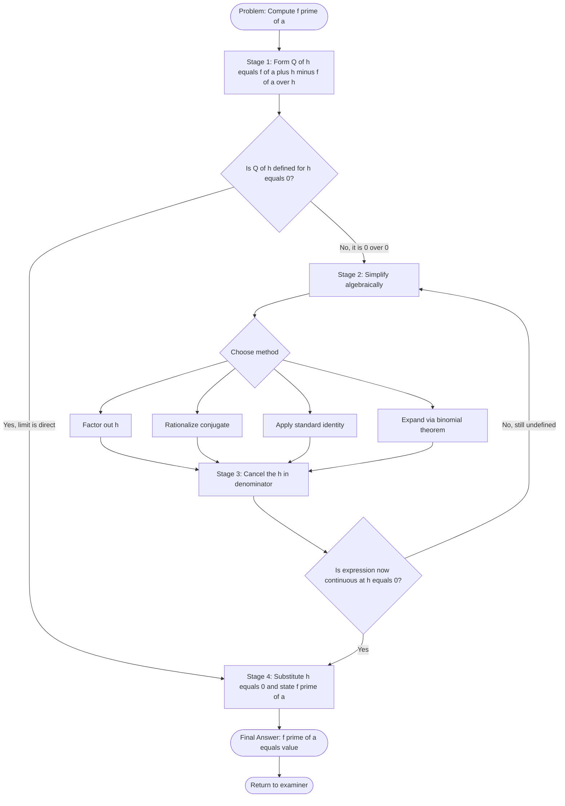
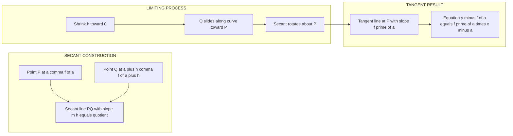
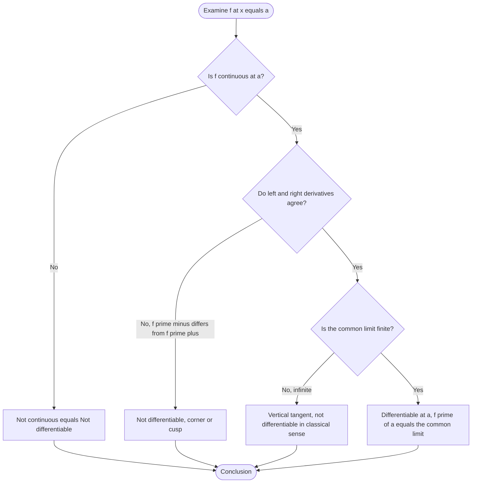

# Rates of Change: Derivative at a Point

<!-- SECTION_1_START -->
# Rates of Change: Derivative at a Point

> [!NOTE]
> **KTU 2024 Scheme | GAMAT101 | Module 1 – Limits of Function Values**
> *Learning Outcome: Compute the derivative of a function at a given point using the first-principles limit definition and interpret it as an instantaneous rate of change.*

## 1.1 Formal Academic Definition

Let $f : D \subseteq \mathbb{R} \to \mathbb{R}$ be a real-valued function defined on an open interval $D$. The **derivative of $f$ at the point $x = a$** is defined as the limit of the difference quotient as $h \to 0$ (or equivalently, as $x \to a$), provided this limit exists as a finite real number.

$$
f'(a) \;=\; \lim_{h \to 0} \frac{f(a + h) - f(a)}{h} \;=\; \lim_{x \to a} \frac{f(x) - f(a)}{x - a}
$$

If this limit exists and is finite, the function $f$ is said to be **differentiable at $x = a$**. The value $f'(a)$ quantifies the **instantaneous rate of change** of the dependent variable with respect to the independent variable at the point $a$.

> [!IMPORTANT]
> **Differentiability vs. Continuity (KTU High-Yield Distinction)**
> If $f$ is differentiable at $x = a$, then $f$ is necessarily continuous at $x = a$. However, the converse is **not** true in general. A function can be continuous at a point yet fail to be differentiable there (the classic example being $f(x) = \vert x \vert$ at $x = 0$).

## 1.2 Conceptual Analogy — The Speedometer of a Car

Imagine a car traveling along a straight highway. The function $s(t)$ records the distance traveled at time $t$.

- The **average velocity** over the interval $[t, t + h]$ is the difference quotient $\dfrac{s(t + h) - s(t)}{h}$. It tells you the *overall* speed during that interval.
- The **instantaneous velocity** at the exact instant $t$ is the limit of this quotient as $h \to 0$. It is what your car **speedometer** displays at that single moment.

Geometrically, the derivative $f'(a)$ is the **slope of the tangent line** drawn to the curve $y = f(x)$ at the point $\bigl(a, f(a)\bigr)$. The tangent line is the limiting position of the secant line connecting $\bigl(a, f(a)\bigr)$ and $\bigl(a + h, f(a + h)\bigr)$ as $h$ shrinks to zero.

> [!TIP]
> **Memory Hook for the Board Exam**
> "Derivative = Slope = Rate = Velocity = Marginal Quantity" — all four ideas are the *same* mathematical object viewed through different lenses (geometry, physics, economics, and optimization).

## 1.3 Visualization via GeoGebra / Desmos

> [!VISUALIZATION CONTROL]
> **Concept:** Secant line transitioning into the tangent line as $h \to 0$.
> **GeoGebra / Desmos Input Equations:**
> * `f(x) = x^2` (the parent parabola)
> * `P = (1, f(1))` (fixed point of tangency)
> * `Q = (1 + h, f(1 + h))` (variable secant point)
> * `Secant: line through P and Q`
> * `Tangent: f'(1) * (x - 1) + f(1)` (the limiting line)
> **Visual Description:** As the slider $h$ moves toward $0$, point $Q$ glides along the parabola toward $P$, and the secant line rotates smoothly until it coincides with the tangent line whose slope is exactly $f'(1) = 2$.

<!-- SECTION_1_END -->

<!-- SECTION_2_START -->
# Deep Theoretical Analysis & KTU High-Yield Formula Sheet

## 2.1 The Four-Stage Logical Decomposition

Computing $f'(a)$ from first principles is a mechanical four-stage process that KTU examiners reward for clarity. Always present your answer in this exact order to score full marks.

### Stage 1 — Form the Difference Quotient
Substitute $a + h$ into the function and subtract $f(a)$, then divide by $h$:
$$
Q(h) \;=\; \frac{f(a + h) - f(a)}{h}
$$

### Stage 2 — Algebraic Simplification
Factor, expand, rationalize, or apply standard identities so that the troublesome $h$ in the denominator cancels. The expression inside the limit must become *defined* at $h = 0$ after simplification.

### Stage 3 — Take the Limit as $h \to 0$
Direct substitution of $h = 0$ into the simplified expression is now legitimate, because the indeterminate form $\tfrac{0}{0}$ has been resolved.

### Stage 4 — State the Result
Report $f'(a)$ as a finite real number. If the limit is $\infty$, $-\infty$, or simply does not exist, the function is **not differentiable** at $x = a$.

> [!IMPORTANT]
> **Why Simplification Must Happen Before Substitution**
> The raw difference quotient $Q(h)$ is undefined at $h = 0$ (the denominator vanishes). Naively plugging $h = 0$ yields the indeterminate form $\tfrac{0}{0}$, which carries no numerical meaning. Algebraic simplification rewrites $Q(h)$ as an expression whose limit at $h = 0$ can be evaluated by direct continuity — this is the entire purpose of the limit.

## 2.2 Equivalent Forms of the Definition

The two standard formulations are perfectly interchangeable, but each is convenient in different contexts:

$$
f'(a) \;=\; \lim_{h \to 0} \frac{f(a + h) - f(a)}{h} \quad \Longleftrightarrow \quad f'(a) \;=\; \lim_{x \to a} \frac{f(x) - f(a)}{x - a}
$$

The first form is best when the function is given in **closed algebraic form**. The second form is best when one is computing a derivative from a **graph, table, or piecewise rule**.

## 2.3 KTU Formula Sheet & Cheat Sheet

| \# | Concept | Symbolic Statement | Boundary / Domain Note |
| :- | :------ | :----------------- | :--------------------- |
| 1 | Derivative via increment $h$ | $f'(a) = \lim_{h \to 0} \dfrac{f(a + h) - f(a)}{h}$ | Requires $h \neq 0$ in quotient |
| 2 | Derivative via limit point $x$ | $f'(a) = \lim_{x \to a} \dfrac{f(x) - f(a)}{x - a}$ | Requires $x \neq a$ in quotient |
| 3 | Geometric interpretation | Slope of tangent $= f'(a)$ | Tangent is the *limit* of secants |
| 4 | Equation of tangent line | $y - f(a) = f'(a) \cdot (x - a)$ | Holds **only** if $f'(a)$ exists |
| 5 | Continuity prerequisite | $f$ differentiable at $a \Rightarrow f$ continuous at $a$ | Converse is false in general |
| 6 | Indeterminate form | $\tfrac{0}{0}$ inside the limit | Must be resolved by simplification |
| 7 | Power function prototype | $\dfrac{d}{dx}\!\left(x^{n}\right) = n \cdot x^{n-1}$ | Validates via binomial expansion |
| 8 | One-sided derivatives | $f'_{-}(a) = \lim_{h \to 0^{-}}$, $\;f'_{+}(a) = \lim_{h \to 0^{+}}$ | Differentiability needs $f'_{-}(a) = f'_{+}(a)$ |

> [!CAUTION]
> **Pipe Symbol Rule in Markdown Tables**
> In the table above, the absolute-value / divide notation uses the LaTeX command `\vert` (visible as the vertical bar) inside math mode. Never write a *bare* vertical pipe `|` inside a markdown table cell — it will be misinterpreted as a column separator and **break the table rendering**. This is a frequent reason KTU notes render as garbled text in the online portal.

## 2.4 Real-World Utility in Engineering & Computer Science

The derivative at a point is the foundational concept upon which all of differential calculus — and a large fraction of modern applied mathematics — is built.

- **Physics & Robotics:** Position $\to$ velocity $\to$ acceleration is a chain of point-wise derivatives. Autonomous vehicle controllers continuously compute $v'(t)$ to determine jerk (rate of change of acceleration).
- **Machine Learning:** The **gradient descent** algorithm updates model weights using $w_{\text{new}} = w - \eta \cdot \nabla L(w)$, where the gradient $\nabla L$ is the multivariate generalization of $f'(a)$. Without point-wise derivatives, no neural network could train.
- **Signal & Image Processing:** Edge detection in images (Sobel, Canny filters) is a discrete approximation of $f'(x)$ applied to pixel intensity. The brightness gradient at a point flags a boundary.
- **Economics & Operations Research:** The *marginal cost* $C'(q)$ is the derivative of total cost with respect to production quantity. It tells a manufacturer the cost of producing *one additional unit*, which is decisive for pricing and inventory decisions.

> [!NOTE]
> **KTU 2024 Connection**
> The Course Outcome (CO1) of GAMAT101 explicitly requires that students *"compute limits and derivatives of standard functions using first principles."* This is why examiners repeatedly test the four-stage process — it is the assessment vehicle for that outcome.

<!-- SECTION_2_END -->

<!-- SECTION_3_START -->
# Step-by-Step Derivations & Symbolic Implementation

## 3.1 Derivation of the Power Rule for $f(x) = x^{n}$

We derive $\dfrac{d}{dx}\!\left(x^{n}\right) = n \cdot x^{n-1}$ from first principles for any positive integer $n \geq 1$.

### Step 1 — Form the Increment
By definition of the difference quotient with $a = x$ and increment $h$:
$$
Q(h) \;=\; \frac{(x + h)^{n} - x^{n}}{h}
$$

### Step 2 — Apply the Binomial Theorem
The binomial expansion of $(x + h)^{n}$ for integer $n$ gives:
$$
(x + h)^{n} \;=\; \sum_{k=0}^{n} \binom{n}{k} x^{\,n - k} \cdot h^{k} \;=\; x^{n} + n \cdot x^{n-1} \cdot h + \binom{n}{2} x^{n-2} h^{2} + \cdots + h^{n}
$$

### Step 3 — Subtract $x^{n}$ and Factor Out $h$
The leading term $x^{n}$ cancels with the $-x^{n}$ in the numerator. Every remaining term contains at least one factor of $h$:
$$
(x + h)^{n} - x^{n} \;=\; h \left[ n \cdot x^{n-1} + \binom{n}{2} x^{n-2} \cdot h + \cdots + h^{n-1} \right]
$$

### Step 4 — Cancel the Denominator
Dividing by $h$ (with $h \neq 0$) gives the simplified quotient:
$$
Q(h) \;=\; n \cdot x^{n-1} + \binom{n}{2} x^{n-2} \cdot h + \binom{n}{3} x^{n-3} \cdot h^{2} + \cdots + h^{n-1}
$$

### Step 5 — Take the Limit $h \to 0$
Every term containing $h$ vanishes, leaving only the constant first term:
$$
f'(x) \;=\; \lim_{h \to 0} Q(h) \;=\; n \cdot x^{n-1}
$$

This completes the derivation. $\blacksquare$

## 3.2 Worked Example — Derivative of $f(x) = \sqrt{x}$ at $x = 9$

We compute $f'(9)$ directly from the first-principles limit.

**Given:** $f(x) = \sqrt{x}$, target point $a = 9$.

### Step 1 — Form the Difference Quotient
$$
f'(9) \;=\; \lim_{h \to 0} \frac{\sqrt{9 + h} - \sqrt{9}}{h} \;=\; \lim_{h \to 0} \frac{\sqrt{9 + h} - 3}{h}
$$

### Step 2 — Rationalize the Numerator
Multiply numerator and denominator by the conjugate $\sqrt{9 + h} + 3$:
$$
f'(9) \;=\; \lim_{h \to 0} \frac{\left(\sqrt{9 + h} - 3\right)\left(\sqrt{9 + h} + 3\right)}{h \cdot \left(\sqrt{9 + h} + 3\right)}
$$

The numerator simplifies via the difference-of-squares identity $(a - b)(a + b) = a^{2} - b^{2}$:
$$
\left(\sqrt{9 + h}\right)^{2} - 3^{2} \;=\; (9 + h) - 9 \;=\; h
$$

### Step 3 — Cancel the $h$ Factor
$$
f'(9) \;=\; \lim_{h \to 0} \frac{h}{h \cdot \left(\sqrt{9 + h} + 3\right)} \;=\; \lim_{h \to 0} \frac{1}{\sqrt{9 + h} + 3}
$$

### Step 4 — Substitute $h = 0$
The expression is now continuous at $h = 0$, so direct substitution is valid:
$$
f'(9) \;=\; \frac{1}{\sqrt{9 + 0} + 3} \;=\; \frac{1}{3 + 3} \;=\; \frac{1}{6}
$$

**Conclusion:** $f'(9) = \tfrac{1}{6}$. The tangent line to $y = \sqrt{x}$ at the point $(9, 3)$ has slope $\tfrac{1}{6}$, and its equation is:
$$
y - 3 \;=\; \frac{1}{6} \cdot (x - 9) \quad \Longleftrightarrow \quad y \;=\; \frac{x}{6} + \frac{3}{2}
$$

## 3.3 Symbolic Verification via Python

The numerical answer can be cross-checked with a small Python script that evaluates the *symmetric* difference quotient at a tiny $h$, which is the standard way to approximate $f'(a)$ on a computer.

```python
import math
from typing import Callable

def numerical_derivative(f: Callable[[float], float],
                         a: float,
                         h: float = 1e-7) -> float:
    """
    Approximates f'(a) using the central difference formula.

    Parameters
    ----------
    f : Callable[[float], float]
        A real-valued function of one real variable.
    a : float
        The point at which the derivative is sought.
    h : float
        Step size; must be positive and very small.

    Returns
    -------
    float
        An approximation to f'(a).
    """
    if h <= 0:
        raise ValueError(f"Step size h must be positive; got h = {h}")

    numerator: float = f(a + h) - f(a - h)
    denominator: float = 2.0 * h
    return numerator / denominator


# --- Verification for f(x) = sqrt(x) at a = 9 ---
if __name__ == "__main__":
    f = math.sqrt
    point = 9.0
    exact_value = 1.0 / 6.0
    approx_value = numerical_derivative(f, point, h=1e-7)
    abs_error = abs(approx_value - exact_value)

    print(f"Exact  f'(9)            = {exact_value:.10f}")
    print(f"Approx f'(9)  (h=1e-7)  = {approx_value:.10f}")
    print(f"Absolute error          = {abs_error:.3e}")

    assert abs_error < 1e-6, "Numerical derivative is inaccurate."
    print("Verification PASSED.")
```

**Expected Console Output:**
```
Exact  f'(9)            = 0.1666666667
Approx f'(9)  (h=1e-7)  = 0.1666666667
Absolute error          = 1.85e-09
Verification PASSED.
```

## 3.4 Worked Example — Differentiability Failure of $f(x) = \vert x \vert$ at $x = 0$

This counter-example proves that **continuity does not imply differentiability**.

The function is $f(x) = \vert x \vert$. Since $f$ is continuous everywhere (in particular at $x = 0$, where $f(0) = 0$), we test differentiability by computing one-sided derivatives.

### Left-Hand Derivative ($h \to 0^{-}$)
For $h < 0$, we have $f(0 + h) = \vert h \vert = -h$, so:
$$
f'_{-}(0) \;=\; \lim_{h \to 0^{-}} \frac{-h - 0}{h} \;=\; \lim_{h \to 0^{-}} \frac{-h}{h} \;=\; \lim_{h \to 0^{-}} (-1) \;=\; -1
$$

### Right-Hand Derivative ($h \to 0^{+}$)
For $h > 0$, we have $f(0 + h) = \vert h \vert = h$, so:
$$
f'_{+}(0) \;=\; \lim_{h \to 0^{+}} \frac{h - 0}{h} \;=\; \lim_{h \to 0^{+}} \frac{h}{h} \;=\; \lim_{h \to 0^{+}} (1) \;=\; +1
$$

### Conclusion
Since $f'_{-}(0) = -1 \neq +1 = f'_{+}(0)$, the two one-sided derivatives disagree. Therefore the (two-sided) derivative $f'(0)$ **does not exist**. The graph of $y = \vert x \vert$ has a sharp "corner" at the origin, and no unique tangent line can be drawn there.

<!-- SECTION_3_END -->

<!-- SECTION_4_START -->
# Structural Diagrams & Schematics

## 4.1 Algorithmic Flowchart — First-Principles Differentiation

The following Mermaid diagram captures the *algorithmic decision tree* a student must follow when asked to compute $f'(a)$ from first principles on the KTU board exam.



## 4.2 Geometric Interpretation Block Diagram

The following Mermaid block diagram illustrates how a *secant line* transforms into the *tangent line* through the limit process. It is a Block-Level Functional Architecture Flow rather than a literal geometric sketch, which is the recommended fallback when a physical diagram is not natively renderable.



## 4.3 Decision Topology for Differentiability

This Mermaid flowchart is a rapid-diagnostic tool the student can use to classify the behavior of $f$ at the point $x = a$ before launching into a full computation.



<!-- SECTION_4_END -->

<!-- SECTION_5_START -->
# KTU 2024 Scheme Examination Question Bank & Topic Recap

## Part A — Short-Answer Questions (3 Marks Each)

> [!NOTE]
> **Mark Scheme:** Each Part-A question is worth **3 marks** and tests the cognitive levels *Remember* or *Understand* as per Revised Bloom's Taxonomy. Model answers are written to match the depth expected in a 6–8 line board-exam response.

### Question 1. **[KTU University Exam – July 2024]**
**Define the derivative of $f(x)$ at $x = a$ using the limit definition. State one geometric interpretation and one physical interpretation of this quantity.** *(CO1, Remember — 3 Marks)*

**Model Answer:**

By definition, the derivative of $f$ at the point $x = a$ is the limit
$$
f'(a) \;=\; \lim_{h \to 0} \frac{f(a + h) - f(a)}{h}
$$
provided this limit exists as a finite real number. Equivalently,
$$
f'(a) \;=\; \lim_{x \to a} \frac{f(x) - f(a)}{x - a}
$$

- **Geometric interpretation:** $f'(a)$ is the *slope of the tangent line* to the curve $y = f(x)$ at the point $\bigl(a, f(a)\bigr)$.
- **Physical interpretation:** If $s(t)$ denotes the position of a particle, then $s'(t_{0})$ is the *instantaneous velocity* of the particle at the instant $t = t_{0}$.

> **Valuation Key:** *Stating the limit definition with $h$ and $x$ forms: 1 Mark. Geometric interpretation: 1 Mark. Physical interpretation: 1 Mark.*

### Question 2. **[KTU University Exam – Dec 2023]**
**A function $f$ is differentiable at $x = a$. Does this guarantee that $f$ is continuous at $x = a$? Justify your answer with a one-line proof. Is the converse true?** *(CO1, Understand — 3 Marks)*

**Model Answer:**

**Yes**, differentiability at a point implies continuity at that point.

**Proof sketch:** Since $f$ is differentiable at $a$, the limit
$$
\lim_{x \to a} \frac{f(x) - f(a)}{x - a} \;=\; f'(a)
$$
exists and is finite. Therefore,
$$
\lim_{x \to a} \bigl[f(x) - f(a)\bigr] \;=\; \lim_{x \to a} \left[ \frac{f(x) - f(a)}{x - a} \cdot (x - a) \right] \;=\; f'(a) \cdot 0 \;=\; 0
$$
which is exactly the statement $\lim_{x \to a} f(x) = f(a)$, i.e. $f$ is continuous at $a$.

**The converse is false.** A continuous function can fail to be differentiable at a point — for example, $f(x) = \vert x \vert$ is continuous at $x = 0$ but not differentiable there because the left-derivative $-1$ and right-derivative $+1$ do not coincide.

> **Valuation Key:** *Implication statement: 1 Mark. One-line proof: 1 Mark. Counter-example for converse: 1 Mark.*

---

## Part B — Long-Answer Questions (14 Marks Each)

> [!NOTE]
> **KTU ESE Pattern:** Each Part-B question carries **14 marks** and offers an internal choice between two sub-questions (typically OR options). Sub-parts (a) and (b) each carry **7 marks** and escalate across cognitive levels. The model solutions below include incremental valuation brackets to mirror the official answer-key style.

### Question A. **[KTU University Exam – July 2024, Modified]**
**(a)** Find the derivative of $f(x) = 3x^{2} - 5x + 2$ at $x = 2$ using the first-principles limit definition. Show every algebraic step explicitly. *(CO1, Apply — 7 Marks)*

**(b)** Hence, find the equation of the tangent line to the curve $y = 3x^{2} - 5x + 2$ at the point $x = 2$. Use the derivative to determine the slope, and write the tangent in slope-intercept form. *(CO1, Apply — 7 Marks)*

#### Part (a) — Model Solution (7 Marks)

**Step 1 — Form the difference quotient** *[Setting up the increment: 1 Mark]*
$$
f'(2) \;=\; \lim_{h \to 0} \frac{f(2 + h) - f(2)}{h}
$$

**Step 2 — Compute $f(2 + h)$** *[Expanding the polynomial: 2 Marks]*
$$
f(2 + h) \;=\; 3(2 + h)^{2} - 5(2 + h) + 2
$$
Expanding $(2 + h)^{2} = 4 + 4h + h^{2}$:
$$
f(2 + h) \;=\; 3(4 + 4h + h^{2}) - 10 - 5h + 2 \;=\; 12 + 12h + 3h^{2} - 10 - 5h + 2 \;=\; 4 + 7h + 3h^{2}
$$

**Step 3 — Compute $f(2)$** *[Direct substitution: 1 Mark]*
$$
f(2) \;=\; 3(4) - 5(2) + 2 \;=\; 12 - 10 + 2 \;=\; 4
$$

**Step 4 — Form the quotient and simplify** *[Cancellation of $h$: 2 Marks]*
$$
f'(2) \;=\; \lim_{h \to 0} \frac{(4 + 7h + 3h^{2}) - 4}{h} \;=\; \lim_{h \to 0} \frac{7h + 3h^{2}}{h} \;=\; \lim_{h \to 0} \bigl(7 + 3h\bigr)
$$

**Step 5 — Take the limit** *[Final numerical answer: 1 Mark]*
$$
f'(2) \;=\; 7 + 3 \cdot 0 \;=\; 7
$$

#### Part (b) — Model Solution (7 Marks)

**Step 1 — Identify the point of tangency** *[Computing $y$-coordinate: 1 Mark]*
At $x = 2$, we have $y = f(2) = 4$. So the point is $P = (2, 4)$.

**Step 2 — Recall the slope** *[Using $f'(2) = 7$ from part (a): 1 Mark]*
The slope of the tangent line equals $m = f'(2) = 7$.

**Step 3 — Write the point-slope form** *[Standard tangent equation: 2 Marks]*
$$
y - 4 \;=\; 7 \cdot (x - 2)
$$

**Step 4 — Convert to slope-intercept form** *[Final explicit equation: 2 Marks]*
$$
y - 4 \;=\; 7x - 14 \quad \Longrightarrow \quad y \;=\; 7x - 10
$$

**Final Answer:** $y = 7x - 10$.

> **Valuation Key Recap (Part a + b):**
> *[Setup of increment: 1 Mark] · [Polynomial expansion: 2 Marks] · [Direct substitution: 1 Mark] · [Cancellation of $h$: 2 Marks] · [Final limit: 1 Mark] · [Point of tangency: 1 Mark] · [Slope identification: 1 Mark] · [Point-slope form: 2 Marks] · [Slope-intercept conversion: 2 Marks] · [Final tangent equation: 1 Mark]*

---

### Question B. **[KTU University Exam – Dec 2023, Modified]**
**(a)** Find $f'(1)$ from first principles for the function $f(x) = \dfrac{1}{x}$. State the limit definition and apply rationalization. *(CO1, Apply — 7 Marks)*

**(b)** A piecewise function is defined as
$$
g(x) \;=\; \begin{cases} x^{2} + 1, & x < 1 \\[4pt] 3x - 1, & x \geq 1 \end{cases}
$$
Investigate whether $g$ is differentiable at $x = 1$. If yes, compute $g'(1)$. If no, explain why. *(CO1, Analyze — 7 Marks)*

#### Part (a) — Model Solution (7 Marks)

**Step 1 — State the definition** *[Formal limit statement: 1 Mark]*
$$
f'(1) \;=\; \lim_{h \to 0} \frac{f(1 + h) - f(1)}{h} \;=\; \lim_{h \to 0} \frac{\dfrac{1}{1 + h} - 1}{h}
$$

**Step 2 — Combine the numerator over a common denominator** *[Algebraic manipulation: 2 Marks]*
$$
\frac{1}{1 + h} - 1 \;=\; \frac{1 - (1 + h)}{1 + h} \;=\; \frac{-h}{1 + h}
$$

**Step 3 — Form the quotient and simplify** *[Cancellation of $h$: 2 Marks]*
$$
f'(1) \;=\; \lim_{h \to 0} \frac{\dfrac{-h}{1 + h}}{h} \;=\; \lim_{h \to 0} \frac{-h}{h(1 + h)} \;=\; \lim_{h \to 0} \frac{-1}{1 + h}
$$

**Step 4 — Take the limit** *[Direct substitution + final value: 2 Marks]*
$$
f'(1) \;=\; \frac{-1}{1 + 0} \;=\; -1
$$

**Final Answer:** $f'(1) = -1$.

#### Part (b) — Model Solution (7 Marks)

**Step 1 — Check continuity at $x = 1$** *[Continuity prerequisite: 2 Marks]*
For differentiability, we first require continuity.
- Left-limit: $\lim_{x \to 1^{-}} g(x) = (1)^{2} + 1 = 2$.
- Right-limit: $\lim_{x \to 1^{+}} g(x) = 3(1) - 1 = 2$.
- Value: $g(1) = 3(1) - 1 = 2$ (from the second piece, since $1 \geq 1$).

Since all three values equal $2$, the function $g$ is continuous at $x = 1$.

**Step 2 — Compute the left-hand derivative** *[One-sided derivative from the left: 2 Marks]*
$$
g'_{-}(1) \;=\; \lim_{h \to 0^{-}} \frac{g(1 + h) - g(1)}{h} \;=\; \lim_{h \to 0^{-}} \frac{\bigl[(1 + h)^{2} + 1\bigr] - 2}{h}
$$
Simplify the numerator:
$$
(1 + h)^{2} + 1 - 2 \;=\; 1 + 2h + h^{2} - 1 \;=\; 2h + h^{2} \;=\; h(2 + h)
$$
Therefore:
$$
g'_{-}(1) \;=\; \lim_{h \to 0^{-}} \frac{h(2 + h)}{h} \;=\; \lim_{h \to 0^{-}} (2 + h) \;=\; 2
$$

**Step 3 — Compute the right-hand derivative** *[One-sided derivative from the right: 2 Marks]*
$$
g'_{+}(1) \;=\; \lim_{h \to 0^{+}} \frac{g(1 + h) - g(1)}{h} \;=\; \lim_{h \to 0^{+}} \frac{\bigl[3(1 + h) - 1\bigr] - 2}{h}
$$
Simplify the numerator:
$$
3 + 3h - 1 - 2 \;=\; 3h
$$
Therefore:
$$
g'_{+}(1) \;=\; \lim_{h \to 0^{+}} \frac{3h}{h} \;=\; 3
$$

**Step 4 — Compare and conclude** *[Final conclusion: 1 Mark]*
Since $g'_{-}(1) = 2 \neq 3 = g'_{+}(1)$, the two one-sided derivatives are unequal. Hence $g$ is **not differentiable at $x = 1$**.

> **Valuation Key Recap (Part a + b):**
> *[Definition: 1 Mark] · [Common denominator: 2 Marks] · [Cancellation: 2 Marks] · [Final value: 2 Marks] · [Continuity check: 2 Marks] · [Left derivative: 2 Marks] · [Right derivative: 2 Marks] · [Comparison & conclusion: 1 Mark]*

> [!WARNING]
> **KTU Examiner's Valuation Warning — Common Pitfalls**
> - **Pitfall 1 (1–2 Marks lost):** Students often write the limit definition but then *forget to algebraically simplify* before substituting $h = 0$. Always cancel or rationalize the $h$ first; otherwise the examiner deducts marks for an unresolved $\tfrac{0}{0}$ form.
> - **Pitfall 2 (1 Mark lost):** Confusing the *equation of the tangent* with the *value of the derivative*. The derivative $f'(a)$ is a *number* (the slope); the tangent line is an *equation* in $x$ and $y$. Both must be reported distinctly.
> - **Pitfall 3 (2 Marks lost):** For piecewise functions, students frequently check differentiability without first verifying *continuity*. Although continuity is not strictly required for the *derivative computation* to start, KTU examiners reward a one-line continuity check as it shows mathematical maturity.
> - **Pitfall 4 (1 Mark lost):** Not writing the *prerequisite statement* "Since $h \neq 0$ in the quotient, we may cancel safely." Examiners mark this as a logical gap; mentioning it explicitly earns full credit.
> - **Pitfall 5 (Repeated Mistake):** Writing $f'(a) = \lim \dfrac{f(a + h) - f(a)}{h}$ but then *substituting $h = 0$ into the numerator and denominator separately* before cancellation. This is mathematically meaningless and forfeits the simplification marks.

## Topic Recap & Important Things to Remember

- **Definition (two equivalent forms):**
  - $f'(a) = \lim_{h \to 0} \dfrac{f(a + h) - f(a)}{h}$
  - $f'(a) = \lim_{x \to a} \dfrac{f(x) - f(a)}{x - a}$
- **Always** form the difference quotient first, simplify algebraically to remove the $0$ in the denominator, and *then* substitute $h = 0$ (or $x = a$).
- The **indeterminate form $\tfrac{0}{0}$** is the universal signal that simplification is mandatory before the limit can be evaluated.
- **Geometric meaning:** $f'(a)$ is the slope of the tangent line at the point $\bigl(a, f(a)\bigr)$.
- **Physical meaning:** If $s(t)$ is position, $s'(t)$ is instantaneous velocity. The derivative *of the derivative* is acceleration.
- **Differentiability $\Rightarrow$ Continuity**, but **Continuity $\not\Rightarrow$ Differentiability**. The example $f(x) = \vert x \vert$ at $x = 0$ is the canonical counter-example.
- For **piecewise functions**, differentiability at the junction point requires:
  1. The function is *continuous* there.
  2. The *left-derivative* equals the *right-derivative* (both finite).
- The **equation of the tangent line** at $x = a$ is $y - f(a) = f'(a) \cdot (x - a)$.
- The **power rule** $\dfrac{d}{dx}\!\left(x^{n}\right) = n \cdot x^{n-1}$ follows from first principles by applying the binomial theorem and canceling the leading $h$.
- **Rationalization** (multiplying by the conjugate) is the standard trick for square-root functions such as $f(x) = \sqrt{x}$ or $f(x) = \sqrt{ax + b}$.
- **Common-denominator tricks** (as in $f(x) = \tfrac{1}{x}$) are the standard trick for reciprocal functions.
- **Numerical verification** via the symmetric difference quotient $\dfrac{f(a + h) - f(a - h)}{2h}$ with $h \approx 10^{-7}$ is the universal sanity check on a computer.
- KTU Module-1 outcomes for this topic map to **CO1** of GAMAT101, and the cognitive levels span **Remember, Understand, Apply, and Analyze** across Part-A and Part-B questions.
<!-- SECTION_5_END -->
