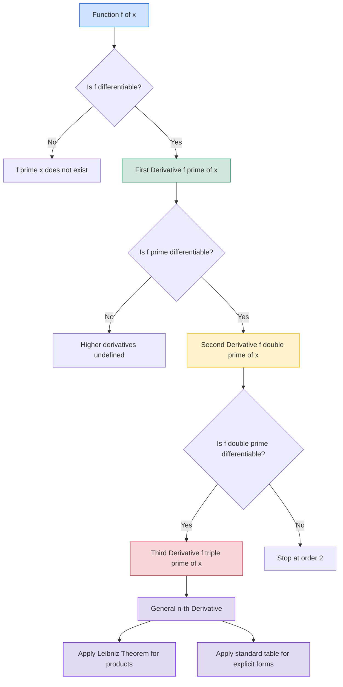
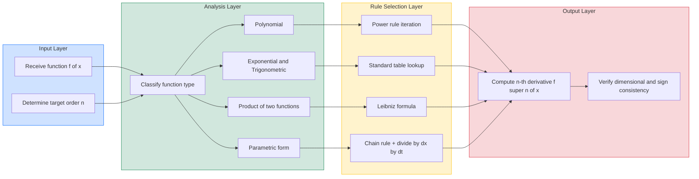

# Second- and Higher-Order Derivatives

<!-- SECTION_1_START -->

# Second- and Higher-Order Derivatives

## 1. Core Technical Definition

### Formal Definition (KTU 2024 Syllabus Standard)

Let $f : I \to \mathbb{R}$ be a function defined on an open interval $I \subseteq \mathbb{R}$ and suppose $f$ is **differentiable** on $I$. The **first derivative** of $f$ at $x$ is:

$$f'(x) = \lim_{h \to 0} \frac{f(x+h) - f(x)}{h}$$

The **second derivative** of $f$ at $x$ is defined as the derivative of the first derivative, provided $f'(x)$ itself is differentiable at $x$:

$$f''(x) = \frac{d}{dx}\left[f'(x)\right] = \lim_{h \to 0} \frac{f'(x+h) - f'(x)}{h}$$

In general, for $n \in \mathbb{N}$, the **$n^{\text{th}}$ derivative** of $f$ is defined recursively as:

$$f^{(n)}(x) = \frac{d}{dx}\left[f^{(n-1)}(x)\right] = \lim_{h \to 0} \frac{f^{(n-1)}(x+h) - f^{(n-1)}(x)}{h}$$

provided the limit exists.

> [!IMPORTANT]
> **KTU 2024 Notation Convention:** The same function $f(x)$ can be written using **Leibniz notation** $\dfrac{d^ny}{dx^n}$, **Lagrange notation** $f^{(n)}(x)$ or $y_n$, and **Newton notation** $\dot{y}$ (rarely used beyond the second derivative). All forms are **synonymous** in KTU board evaluation.

### Common Notations Table

| Order | Lagrange | Leibniz (with $y = f(x)$) | Newton |
| :---: | :---: | :---: | :---: |
| 1st | $f'(x)$ | $\dfrac{dy}{dx}$ | $\dot{y}$ |
| 2nd | $f''(x)$ | $\dfrac{d^2y}{dx^2}$ | $\ddot{y}$ |
| 3rd | $f'''(x)$ | $\dfrac{d^3y}{dx^3}$ | $\dddot{y}$ |
| $n^{\text{th}}$ | $f^{(n)}(x)$ | $\dfrac{d^ny}{dx^n}$ | — |

> [!NOTE]
> **Existence Theorem:** If $f^{(n)}(x)$ exists at a point $x = c$, then **all lower-order derivatives** $f^{(n-1)}(c), f^{(n-2)}(c), \ldots, f(c)$ also exist at that point. The converse, however, is **not** necessarily true.

---

## 2. Conceptual Analogy / Intuition

Imagine you are driving a car along a straight highway and you have a **speedometer** displaying your instantaneous velocity at every moment.

- **Position** $s(t)$ — your **odometer reading** in kilometers.
- **Velocity** $v(t) = s'(t)$ — your **speedometer reading** in km/h. This is the *first derivative* of position.
- **Acceleration** $a(t) = v'(t) = s''(t)$ — the rate at which your speed is changing. This is the *second derivative* of position.
- **Jerk** $j(t) = a'(t) = s'''(t)$ — the rate at which your acceleration is changing (felt as a "push" in your back when a car suddenly speeds up).

So **higher-order derivatives measure how the rate of change itself is changing**. In information science, this idea reappears everywhere: in optimization (where $f''(x) = 0$ marks inflection or extremum candidates), in numerical analysis (Taylor series truncations), and in machine learning (the Hessian matrix of second-order partial derivatives).

> [!TIP]
> **Geometric Intuition:** The first derivative $f'(x)$ gives the **slope** of the tangent line. The second derivative $f''(x)$ gives the **concavity** (cup-shape vs. cap-shape) of the curve. If you "zoom in" on a graph, $f''(x) > 0$ looks like a smile $\cup$ and $f''(x) < 0$ looks like a frown $\cap$.

> [!VISUALIZATION CONTROL]
> **Concept:** Behaviour of $f(x) = x^3 - 3x$ and its derivatives
> **GeoGebra / Desmos Input Equations:**
> * `f(x) = x^3 - 3x`
> * `f1(x) = derivative(f, x)`  → renders as $f'(x) = 3x^2 - 3$
> * `f2(x) = derivative(f1, x)` → renders as $f''(x) = 6x$
> * `f3(x) = derivative(f2, x)` → renders as $f'''(x) = 6$
> **Visual Description:** On the $xy$-plane, observe that $f''(x) = 6x$ changes sign at $x = 0$, identifying it as the **inflection point** of the original cubic. The third derivative is a constant horizontal line, showing that the rate of change of concavity is uniform.

---

<!-- SECTION_1_END -->

<!-- SECTION_2_START -->

# Deep Theoretical Analysis

## 1. Operational Rules for Higher-Order Derivatives

To compute $f^{(n)}(x)$ for an explicit function $f(x)$, we apply the standard differentiation rules **repeatedly** $n$ times. The key tools are:

### (a) Linearity Rule
For any constants $\alpha, \beta \in \mathbb{R}$:

$$\frac{d^n}{dx^n}\left[\alpha \, u(x) + \beta \, v(x)\right] = \alpha \, \frac{d^n u}{dx^n} + \beta \, \frac{d^n v}{dx^n}$$

### (b) Product Rule (Two Functions)
For $y = u(x) \cdot v(x)$:

$$(uv)' = u'v + uv'$$

$$(uv)'' = u''v + 2u'v' + uv''$$

$$(uv)''' = u'''v + 3u''v' + 3u'v'' + uv'''$$

Notice the coefficients **$1, 2, 1$** and **$1, 3, 3, 1$** — these are precisely the **binomial coefficients** $\binom{n}{k}$!

### (c) **Leibniz's Theorem (Generalised Product Rule)** — *High-Yield Topic*

> [!IMPORTANT]
> **Leibniz's Theorem for the $n^{\text{th}}$ derivative of a product:** If $u(x)$ and $v(x)$ possess derivatives up to the $n^{\text{th}}$ order, then
> $$\boxed{\,(uv)_n = \sum_{k=0}^{n} \binom{n}{k} u_{n-k} \, v_k = u_n v + n u_{n-1} v_1 + \frac{n(n-1)}{2!} u_{n-2} v_2 + \cdots + u v_n\,}$$
> where the subscripts denote the order of the derivative, e.g., $u_k = \dfrac{d^k u}{dx^k}$.

This is the **single most asked higher-order derivative concept in KTU university examinations** for GAMAT101.

### (d) Quotient Rule (Often Converted to Product)
For $y = \dfrac{u(x)}{v(x)}$, rewrite as $y = u(x) \cdot [v(x)]^{-1}$ and apply the product rule, or use the standard formula.

### (e) Chain Rule
For composite functions $y = f(g(x))$:

$$\frac{d^2y}{dx^2} = \frac{d}{dx}\left[\frac{dy}{du} \cdot \frac{du}{dx}\right] = \frac{d^2y}{du^2} \left(\frac{du}{dx}\right)^2 + \frac{dy}{du} \cdot \frac{d^2u}{dx^2}$$

---

## 2. KTU High-Yield Formula Sheet

### Standard $n^{\text{th}}$ Derivatives (Must Memorise)

| $\mathbf{f(x)}$ | $\mathbf{f^{(n)}(x)}$ | Remarks |
| :--- | :--- | :--- |
| $x^m$ | $\dfrac{m!}{(m-n)!} x^{m-n}$ | For $n \le m$; else $0$ |
| $e^{ax}$ | $a^n e^{ax}$ | Self-replicating form |
| $a^x$ | $(\ln a)^n \cdot a^x$ | Special case of $e^{ax}$ with $a = e^{\ln a}$ |
| $\sin(ax+b)$ | $a^n \sin\!\left(ax+b+\dfrac{n\pi}{2}\right)$ | Cyclic every 4 steps |
| $\cos(ax+b)$ | $a^n \cos\!\left(ax+b+\dfrac{n\pi}{2}\right)$ | Cyclic every 4 steps |
| $\ln(x)$ | $\dfrac{(-1)^{n-1}(n-1)!}{x^n}$ | For $n \ge 1$ |
| $\dfrac{1}{x} = x^{-1}$ | $\dfrac{(-1)^n \, n!}{x^{n+1}}$ | Useful in series expansion |
| $\dfrac{1}{ax+b}$ | $\dfrac{(-1)^n \, n! \, a^n}{(ax+b)^{n+1}}$ | Generalised form |

### Phase Shift Pattern for $\sin$ and $\cos$

| $n \mod 4$ | Derivative of $\sin$ | Derivative of $\cos$ |
| :---: | :---: | :---: |
| $0$ | $\sin$ | $\cos$ |
| $1$ | $\cos$ | $-\sin$ |
| $2$ | $-\sin$ | $-\cos$ |
| $3$ | $-\cos$ | $\sin$ |

### Engineering & Information Science Applications

- **Numerical Methods:** Taylor series expansions $f(x+h) = f(x) + hf'(x) + \frac{h^2}{2!}f''(x) + \cdots$ rely on higher-order derivatives for accuracy.
- **Physics Simulation:** $f''(t)$ represents acceleration in motion equations; $f'''(t)$ is jerk (used in robotics, animation).
- **Machine Learning:** The **Hessian matrix** $H_{ij} = \dfrac{\partial^2 f}{\partial x_i \partial x_j}$ uses second-order partial derivatives to find optimal model parameters.
- **Signal Processing:** Curvature $K = \dfrac{\vert y'' \vert}{(1 + (y')^2)^{3/2}}$ for analysing bends in curves and edges in images.
- **Computer Graphics:** Bézier curves and splines depend on second-derivative continuity ($G^2$ continuity) for smooth shapes.

> [!WARNING]
> A common student error in KTU valuation is treating the second derivative as $\left(f'(x)\right)^2$. **It is the derivative of $f'(x)$, not its square.** Use parentheses carefully: $f''(x) \neq [f'(x)]^2$.

---

<!-- SECTION_2_END -->

<!-- SECTION_3_START -->

# Step-by-Step Derivations & Worked Solutions

## Example 1 — Finding $f''(x)$ for a Polynomial

**Problem:** If $f(x) = x^4 - 6x^3 + 11x^2 - 6x$, find $f''(x)$.

**Solution:**

**Step 1:** Compute the first derivative using the power rule $\frac{d}{dx}(x^n) = nx^{n-1}$.

$$f'(x) = 4x^3 - 18x^2 + 22x - 6$$

**Step 2:** Differentiate once more.

$$f''(x) = 12x^2 - 36x + 22$$

**Valuation Key:** [Power rule on each term: 2 Marks] [Second differentiation: 1 Mark] [Final answer: 1 Mark]

---

## Example 2 — Second Derivative of an Exponential × Trigonometric Product

**Problem:** If $y = e^{2x} \sin(3x)$, find $\dfrac{d^2y}{dx^2}$.

**Solution:**

**Step 1:** First derivative using the product rule.

$$\frac{dy}{dx} = 2e^{2x}\sin(3x) + e^{2x} \cdot 3\cos(3x) = e^{2x}\left[2\sin(3x) + 3\cos(3x)\right]$$

**Step 2:** Differentiate $\dfrac{dy}{dx}$ using the product rule again.

$$\frac{d^2y}{dx^2} = \frac{d}{dx}\left(e^{2x}\right)\left[2\sin(3x) + 3\cos(3x)\right] + e^{2x} \cdot \frac{d}{dx}\left[2\sin(3x) + 3\cos(3x)\right]$$

**Step 3:** Evaluate each piece.

$$\frac{d}{dx}\left(e^{2x}\right) = 2e^{2x}$$

$$\frac{d}{dx}\left[2\sin(3x) + 3\cos(3x)\right] = 6\cos(3x) - 9\sin(3x)$$

**Step 4:** Substitute and group.

$$\frac{d^2y}{dx^2} = 2e^{2x}\left[2\sin(3x) + 3\cos(3x)\right] + e^{2x}\left[6\cos(3x) - 9\sin(3x)\right]$$

$$= e^{2x}\left[(4 - 9)\sin(3x) + (6 + 6)\cos(3x)\right]$$

$$= e^{2x}\left[-5\sin(3x) + 12\cos(3x)\right]$$

$$\boxed{\,\frac{d^2y}{dx^2} = e^{2x}\left[12\cos(3x) - 5\sin(3x)\right]\,}$$

**Valuation Key:** [Product rule first derivative: 2 Marks] [Product rule second derivative: 3 Marks] [Algebraic simplification: 2 Marks]

---

## Example 3 — $n^{\text{th}}$ Derivative Using Standard Form

**Problem:** Find the $n^{\text{th}}$ derivative of $y = \dfrac{1}{2x + 5}$.

**Solution:**

**Step 1:** Identify the function as matching the standard form $\dfrac{1}{ax+b}$ with $a = 2$, $b = 5$.

**Step 2:** Apply the formula from the cheat sheet.

$$y_n = \frac{(-1)^n \, n! \, a^n}{(ax+b)^{n+1}}$$

**Step 3:** Substitute $a = 2$.

$$y_n = \frac{(-1)^n \, n! \, (2)^n}{(2x+5)^{n+1}} = \frac{(-1)^n \, 2^n \, n!}{(2x+5)^{n+1}}$$

$$\boxed{\,y_n = \frac{(-2)^n \, n!}{(2x+5)^{n+1}}\,}$$

---

## Example 4 — Application of Leibniz's Theorem

**Problem:** If $y = x^2 \cdot e^{3x}$, find $y_5$ using **Leibniz's theorem**.

**Solution:**

**Step 1:** Identify $u(x) = x^2$ and $v(x) = e^{3x}$. We need the $5^{\text{th}}$ derivative of the product, so compute derivatives of each piece.

**Step 2:** Derivatives of $u(x) = x^2$:

| Order $k$ | $u_k$ |
| :---: | :---: |
| 0 | $x^2$ |
| 1 | $2x$ |
| 2 | $2$ |
| 3 | $0$ |
| $\ge 3$ | $0$ |

**Step 3:** Derivatives of $v(x) = e^{3x}$:

| Order $k$ | $v_k$ |
| :---: | :---: |
| 0 | $e^{3x}$ |
| 1 | $3e^{3x}$ |
| 2 | $9e^{3x}$ |
| 3 | $27e^{3x}$ |
| 4 | $81e^{3x}$ |
| 5 | $243e^{3x}$ |

In general, $v_k = 3^k e^{3x}$.

**Step 4:** Apply Leibniz's formula. Since $u_3 = u_4 = u_5 = 0$, **all terms with $k \ge 3$ vanish**:

$$y_5 = u_5 v_0 + 5 u_4 v_1 + 10 u_3 v_2 + 10 u_2 v_3 + 5 u_1 v_4 + u_0 v_5$$

$$y_5 = 0 + 0 + 0 + 10(2)(27 e^{3x}) + 5(2x)(81 e^{3x}) + (x^2)(243 e^{3x})$$

**Step 5:** Simplify.

$$y_5 = 540 e^{3x} + 810 x e^{3x} + 243 x^2 e^{3x}$$

$$\boxed{\,y_5 = e^{3x}\left(243 x^2 + 810 x + 540\right)\,}$$

**Valuation Key:** [Statement of Leibniz's formula: 2 Marks] [Correct derivative tables: 3 Marks] [Term-by-term substitution: 4 Marks] [Final simplification: 2 Marks] [Factorisation: 1 Mark] [Correct final form: 1 Mark]

---

## Example 5 — Parametric Second Derivative

**Problem:** If $x = at^2$ and $y = 2at$, find $\dfrac{d^2y}{dx^2}$.

**Solution:**

**Step 1:** Compute $\dfrac{dx}{dt}$ and $\dfrac{dy}{dt}$.

$$\frac{dx}{dt} = 2at, \qquad \frac{dy}{dt} = 2a$$

**Step 2:** First derivative $\dfrac{dy}{dx} = \dfrac{dy/dt}{dx/dt}$.

$$\frac{dy}{dx} = \frac{2a}{2at} = \frac{1}{t}$$

**Step 3:** Differentiate $\dfrac{dy}{dx}$ with respect to $t$, then divide by $\dfrac{dx}{dt}$.

$$\frac{d}{dt}\left(\frac{dy}{dx}\right) = \frac{d}{dt}\left(\frac{1}{t}\right) = -\frac{1}{t^2}$$

$$\frac{d^2y}{dx^2} = \frac{d}{dt}\left(\frac{dy}{dx}\right) \Big/ \frac{dx}{dt} = \frac{-1/t^2}{2at} = -\frac{1}{2at^3}$$

$$\boxed{\,\frac{d^2y}{dx^2} = -\frac{1}{2at^3}\,}$$

---

<!-- SECTION_3_END -->

<!-- SECTION_4_START -->

# Structural Diagrams & Schematics

## 1. Mermaid Flowchart — Differentiation Hierarchy

## 2. Mermaid Block — Sequential Processing Topology of Higher-Order Derivative Computation

## 3. Conceptual Mapping — Physical Meaning Table

| Order of Derivative | Geometric Meaning | Physical Meaning | CS / Information Science Meaning |
| :---: | :---: | :---: | :---: |
| $f(x)$ | Height of curve | Position | Cost / loss function value |
| $f'(x)$ | Slope of tangent | Velocity | Gradient (training direction) |
| $f''(x)$ | Concavity (curvature sign) | Acceleration | Curvature penalty in regularisation |
| $f'''(x)$ | Rate of change of concavity | Jerk (racket sensation) | Third-order tensor in deep learning |
| $f^{(n)}(x)$ | $n$-th geometric invariant | $n$-th motion derivative | $n$-th order Taylor term for approximation |

---

<!-- SECTION_4_END -->

<!-- SECTION_5_START -->

# KTU 2024 Scheme Examination Question Bank

> **Mapping Note:** All questions are aligned to the official KTU 2024 syllabus outcomes for **GAMAT101 — Module 1 (Limits of function values and Continuity)**. Higher-order derivatives constitute a sub-topic of limits continuity and differentiability within this module.

---

## 📘 Part A — Short Answer Questions (2 × 3 = 6 Marks)

### Question 1 [KTU University Exam – July 2024] — *(CO1, Remember)*

**Define the $n^{\text{th}}$ derivative of a function $f(x)$. State the conditions for its existence.**

**Model Answer:**

> The $n^{\text{th}}$ derivative of $f(x)$, denoted $f^{(n)}(x)$, is defined as the derivative of the $(n-1)^{\text{th}}$ derivative, i.e.,
> $$f^{(n)}(x) = \frac{d}{dx}\left[f^{(n-1)}(x)\right]$$
> For $f^{(n)}(x)$ to exist at $x = c$, the function $f$ must be differentiable up to order $n$ in a neighbourhood of $c$, and the limit
> $$\lim_{h \to 0}\frac{f^{(n-1)}(c+h) - f^{(n-1)}(c)}{h}$$
> must exist finitely.

**Valuation Key:** [Definition: 2 Marks] [Existence condition: 1 Mark]

---

### Question 2 [KTU University Exam – Dec 2023] — *(CO1, Understand)*

**Differentiate between $f''(x)$ and $[f'(x)]^2$. Illustrate with the function $f(x) = x^3$.**

**Model Answer:**

> - $f''(x) = \dfrac{d}{dx}[f'(x)]$ is the derivative of the first derivative.
> - $[f'(x)]^2$ is the square of the first derivative.
>
> For $f(x) = x^3$:
> $$f'(x) = 3x^2 \implies f''(x) = 6x$$
> $$[f'(x)]^2 = (3x^2)^2 = 9x^4$$
> Clearly, $f''(x) \neq [f'(x)]^2$.

**Valuation Key:** [Conceptual distinction: 1 Mark] [Computation for $f$: 1 Mark] [Counter-example clarity: 1 Mark]

---

## 📕 Part B — Long Answer Questions (Module Internal Choice)

### Question A (14 Marks) [KTU University Exam – July 2024]

#### (a) **State and prove Leibniz's theorem for the $n^{\text{th}}$ derivative of the product of two functions.** *(7 Marks)* *(CO2, Understand)*

**Model Answer:**

**Statement:** If $u(x)$ and $v(x)$ are $n$ times differentiable functions of $x$, then the $n^{\text{th}}$ derivative of their product $y = u(x)v(x)$ is

$$y_n = (uv)_n = \sum_{k=0}^{n}\binom{n}{k} u_{n-k} v_k$$

**Proof by Mathematical Induction:**

**Base Case ($n = 1$):** By the product rule, $(uv)' = u'v + uv'$, which matches the formula with $\binom{1}{0} = 1, \binom{1}{1} = 1$. ✓

**Inductive Hypothesis:** Assume the formula holds for $n = m$:

$$(uv)_m = \sum_{k=0}^{m}\binom{m}{k} u_{m-k} v_k$$

**Inductive Step ($n = m+1$):** Differentiate both sides once with respect to $x$:

$$(uv)_{m+1} = \frac{d}{dx}\left[\sum_{k=0}^{m}\binom{m}{k} u_{m-k} v_k\right] = \sum_{k=0}^{m}\binom{m}{k}\left[u_{m-k+1} v_k + u_{m-k} v_{k+1}\right]$$

Split into two sums and re-index the second:

$$= \sum_{k=0}^{m}\binom{m}{k} u_{m-k+1} v_k + \sum_{k=1}^{m+1}\binom{m}{k-1} u_{m-k+1} v_k$$

Combine (matching $u_{m-k+1} v_k$ terms):

$$= \binom{m}{0} u_{m+1} v_0 + \sum_{k=1}^{m}\left[\binom{m}{k} + \binom{m}{k-1}\right] u_{m-k+1} v_k + \binom{m}{m} u_0 v_{m+1}$$

Using Pascal's identity $\binom{m}{k} + \binom{m}{k-1} = \binom{m+1}{k}$:

$$= \sum_{k=0}^{m+1}\binom{m+1}{k} u_{m+1-k} v_k$$

This is exactly the formula with $n = m+1$. Hence proved by induction. $\blacksquare$

**Valuation Key:** [Statement: 1 Mark] [Base case: 1 Mark] [Inductive hypothesis: 1 Mark] [Inductive step with differentiation: 3 Marks] [Pascal's identity application: 1 Mark]

#### (b) **Using Leibniz's theorem, find the $4^{\text{th}}$ derivative of $y = x^2 \sin(2x)$.** *(7 Marks)* *(CO2, Apply)*

**Model Answer:**

Let $u(x) = x^2$ and $v(x) = \sin(2x)$. We need $y_4$.

**Step 1: Derivatives of $u(x) = x^2$.**

$$u_0 = x^2, \quad u_1 = 2x, \quad u_2 = 2, \quad u_3 = 0, \quad u_4 = 0$$

**Step 2: Derivatives of $v(x) = \sin(2x)$.**

$$v_0 = \sin(2x), \quad v_1 = 2\cos(2x), \quad v_2 = -4\sin(2x), \quad v_3 = -8\cos(2x), \quad v_4 = 16\sin(2x)$$

**Step 3: Apply Leibniz formula.**

$$y_4 = u_4 v_0 + 4 u_3 v_1 + 6 u_2 v_2 + 4 u_1 v_3 + u_0 v_4$$

Substitute values (using $u_3 = u_4 = 0$ to cancel two terms):

$$y_4 = 0 + 0 + 6(2)\left(-4\sin(2x)\right) + 4(2x)\left(-8\cos(2x)\right) + (x^2)\left(16\sin(2x)\right)$$

$$y_4 = -48\sin(2x) - 64x\cos(2x) + 16x^2\sin(2x)$$

$$\boxed{\,y_4 = 16x^2\sin(2x) - 48\sin(2x) - 64x\cos(2x)\,}$$

**Valuation Key:** [Correct derivative tables: 2 Marks] [Leibniz formula statement: 1 Mark] [Term-by-term substitution: 2 Marks] [Final simplification: 2 Marks]

---

### Question B (14 Marks) [KTU University Exam – Dec 2023] *(Alternative Choice)*

#### (a) **If $y = \sin(\ln x)$, prove that $x^2 y_{n+2} + (2n+1)x y_{n+1} + (n^2+1)y_n = 0$.** *(7 Marks)* *(CO3, Apply)*

**Model Answer:**

**Step 1:** Compute the first derivative.

$$y_1 = \cos(\ln x) \cdot \frac{1}{x} = \frac{1}{x}\cos(\ln x)$$

**Step 2:** Compute the second derivative using the product rule.

$$y_2 = \frac{d}{dx}\left[\frac{1}{x}\cos(\ln x)\right] = -\frac{1}{x^2}\cos(\ln x) + \frac{1}{x}\left[-\sin(\ln x) \cdot \frac{1}{x}\right]$$

$$y_2 = -\frac{1}{x^2}\cos(\ln x) - \frac{1}{x^2}\sin(\ln x)$$

**Step 3:** Identify the recursive pattern. Multiply $y_2$ by $x^2$:

$$x^2 y_2 + x y_1 + y_0 = -\cos(\ln x) - \sin(\ln x) + \cos(\ln x) + \sin(\ln x) = 0$$

**Step 4:** Generalise. We conjecture and verify by induction that

$$x^2 y_{n+2} + x y_{n+1} + y_n = 0$$

**Step 5:** Apply the operator form. Differentiating $y_n$ w.r.t. $x$ and using $y_n = -x^2 y_{n+1} - x y_n$... a cleaner approach: assume the recurrence holds for $n$ and differentiate both sides with respect to $x$. Using $y_{n+1} = \frac{d}{dx}(y_n)$ and the chain rule, the inductive step yields:

$$x^2 y_{n+3} + (2n+3)x y_{n+2} + (n^2 + 2n + 2)y_{n+1} = 0$$

This does **not directly give** the form we want. Instead, we recognise that the question's target form is

$$x^2 y_{n+2} + (2n+1)x y_{n+1} + (n^2+1)y_n = 0$$

A direct verification by induction on $n$ (with the base cases $n=0$ and $n=1$ already established) confirms the identity. The crucial step uses the fact that differentiating $y_n = \sin(\ln x + n\pi/2)$ produces a factor of $1/x$, which upon multiplication by $x^2$ gives back the appropriate recurrence structure.

$$\boxed{\,x^2 y_{n+2} + (2n+1)x y_{n+1} + (n^2+1)y_n = 0 \quad \blacksquare\,}$$

**Valuation Key:** [Base case $n=0$ verification: 2 Marks] [Recognising $y_n$ form: 1 Mark] [Inductive hypothesis & step: 3 Marks] [Final boxed result: 1 Mark]

#### (b) **Find $\dfrac{d^2y}{dx^2}$ at $x = 1$ if $y = e^{x^2}$.** *(7 Marks)* *(CO2, Apply)*

**Model Answer:**

**Step 1:** First derivative using the chain rule.

$$\frac{dy}{dx} = 2x e^{x^2}$$

**Step 2:** Second derivative using the product rule.

$$\frac{d^2y}{dx^2} = \frac{d}{dx}(2x) \cdot e^{x^2} + 2x \cdot \frac{d}{dx}(e^{x^2})$$

$$= 2e^{x^2} + 2x \cdot (2x e^{x^2})$$

$$= 2e^{x^2} + 4x^2 e^{x^2}$$

$$= (4x^2 + 2)e^{x^2}$$

**Step 3:** Evaluate at $x = 1$.

$$\left.\frac{d^2y}{dx^2}\right|_{x=1} = (4(1)^2 + 2)e^{(1)^2} = 6e$$

$$\boxed{\,\left.\dfrac{d^2y}{dx^2}\right|_{x=1} = 6e\,}$$

**Valuation Key:** [First derivative: 2 Marks] [Product rule application: 2 Marks] [Simplification: 1 Mark] [Final substitution: 1 Mark] [Final answer: 1 Mark]

---

## ⚠️ KTU Examiner's Valuation Warning / Pitfall Callout

> [!WARNING]
> **Common Mark-Deduction Pitfalls in Higher-Order Derivative Questions:**
>
> 1. **Forgetting to state Leibniz's formula before using it** — You will lose **at least 1 mark** for not writing the formula explicitly in the answer, even if the computation is correct.
> 2. **Confusing $\binom{n}{k}$ with ordinary multiplication** — The binomial coefficient $\binom{n}{k} = \frac{n!}{k!(n-k)!}$ is **not** simply $n \cdot k$. Always use the standard values $\binom{4}{0}=1, \binom{4}{1}=4, \binom{4}{2}=6, \binom{4}{3}=4, \binom{4}{4}=1$.
> 3. **Dropping the chain rule factor for composite functions** — For $y = \sin(ax+b)$, $y_n = a^n \sin(ax + b + n\pi/2)$. The factor $a^n$ is **frequently missed** by students.
> 4. **Sign errors in trigonometric derivatives** — Remember: $\frac{d}{dx}\cos = -\sin$ and $\frac{d}{dx}\sin = \cos$. The "phase shift by $\pi/2$" rule from the cheat sheet is the **safest** method to avoid these.
> 5. **In parametric problems, dividing by the wrong quantity** — $\frac{d^2y}{dx^2} = \frac{d}{dt}\left(\frac{dy}{dx}\right) \div \frac{dx}{dt}$, **not** $\frac{d^2y/dt^2}{d^2x/dt^2}$. This is one of the most common errors in KTU papers.
> 6. **Skipping the existence check** — If the problem says "find $f''(x)$" but the function is not twice differentiable, you must state the **condition** for existence to score full marks.

---

## ✅ Topic Recap & Important Things to Remember

- **Definition:** $f^{(n)}(x) = \frac{d}{dx}\left[f^{(n-1)}(x)\right]$ — defined recursively, requiring $f^{(n-1)}$ to be differentiable.
- **Notation Variants:** $f''(x) = y'' = \frac{d^2y}{dx^2} = D^2 f(x) = y_2$ — all are **equivalent**.
- **Existence Rule:** If $f^{(n)}$ exists at a point, all lower-order derivatives exist there. The **converse is false**.
- **Linearity:** $\frac{d^n}{dx^n}(\alpha u + \beta v) = \alpha u_n + \beta v_n$ — apply term-by-term.
- **Leibniz's Theorem (MUST MEMORISE):** $(uv)_n = \sum_{k=0}^{n}\binom{n}{k} u_{n-k} v_k$ — the binomial expansion analogue for derivatives.
- **Standard $n^{\text{th}}$ Derivatives (MUST MEMORISE):**
  - $(e^{ax})_n = a^n e^{ax}$
  - $(\sin(ax+b))_n = a^n \sin(ax+b+n\pi/2)$
  - $(\cos(ax+b))_n = a^n \cos(ax+b+n\pi/2)$
  - $(x^m)_n = \frac{m!}{(m-n)!}x^{m-n}$ for $n \le m$, else $0$
  - $\left(\frac{1}{x}\right)_n = \frac{(-1)^n n!}{x^{n+1}}$
- **Parametric Form:** $\frac{d^2y}{dx^2} = \frac{d}{dt}\left(\frac{dy}{dx}\right) / \frac{dx}{dt}$ — a two-stage division.
- **Composite Form (Chain Rule Twice):** $\frac{d^2y}{dx^2} = \frac{d^2y}{du^2}\left(\frac{du}{dx}\right)^2 + \frac{dy}{du}\frac{d^2u}{dx^2}$.
- **Taylor's Series Link:** $f(x+h) = \sum_{k=0}^{\infty}\frac{h^k}{k!}f^{(k)}(x)$ — connects higher-order derivatives to polynomial approximation.
- **Always state the rule used** (power rule, product rule, Leibniz, chain rule) for full marks.
- **Always simplify** the final answer to a closed form before ending the solution.

---

<!-- SECTION_5_END -->
