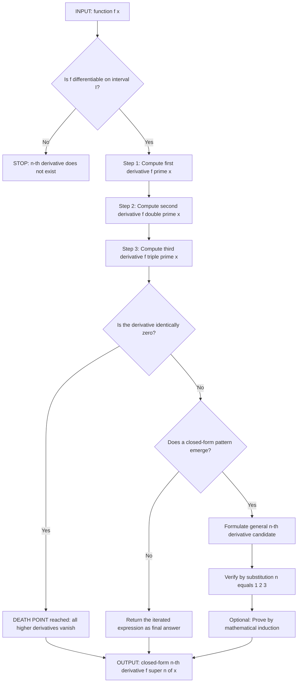
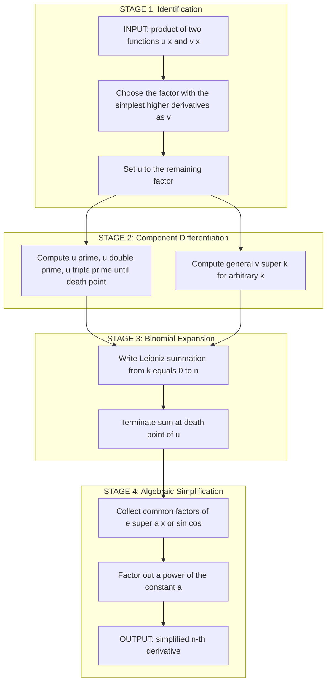
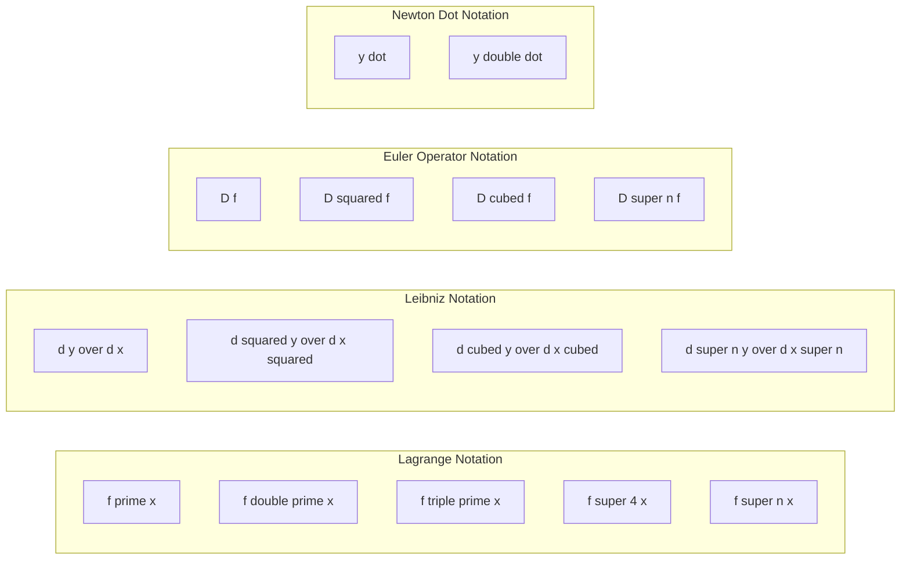

# Second- and Higher-Order Derivatives

<!-- SECTION_1_START -->

# Second- and Higher-Order Derivatives

## 1.1 Formal Definition

Let $f : \mathbb{R} \to \mathbb{R}$ be a function that is differentiable on an open interval $I$. The **second derivative** of $f$ at $x \in I$ is defined as the derivative of the first derivative, provided the first derivative is itself differentiable at $x$.

$$
f''(x) \;=\; \frac{d^2 f}{dx^2} \;=\; \frac{d}{dx}\!\left[\, f'(x) \,\right] \;=\; \lim_{h \to 0} \frac{f'(x+h) - f'(x)}{h}
$$

Extending this inductively, the **$n$-th derivative** of $f$ (for $n \ge 1$) is defined as the derivative of the $(n-1)$-th derivative:

$$
f^{(n)}(x) \;=\; \frac{d^n f}{dx^n} \;=\; \frac{d}{dx}\!\left[\, f^{(n-1)}(x) \,\right] \;=\; \lim_{h \to 0} \frac{f^{(n-1)}(x+h) - f^{(n-1)}(x)}{h}
$$

with the convention $f^{(0)}(x) \equiv f(x)$ and $f^{(1)}(x) \equiv f'(x)$.

> [!NOTE]
> **Existence Requirement.** For $f^{(n)}(x)$ to exist, the function $f$ must be at least $n$-times differentiable in a neighbourhood of $x$. A continuous $(n-1)$-th derivative and the existence of the limit of the difference quotient for the $n$-th derivative are the minimum KTU-board preconditions.

> [!IMPORTANT]
> **Standard Notations Used Across the KTU 2024 Scheme Syllabus.**
>
> * **Lagrange notation** $\rightarrow f'(x),\ f''(x),\ f'''(x),\ f^{(4)}(x),\ f^{(n)}(x)$
> * **Leibniz notation** $\rightarrow \dfrac{dy}{dx},\ \dfrac{d^2 y}{dx^2},\ \dfrac{d^3 y}{dx^3},\ \dfrac{d^n y}{dx^n}$
> * **Euler (operator) notation** $\rightarrow D f,\ D^2 f,\ D^3 f,\ D^n f$
> * **Newton (dot) notation** $\rightarrow \dot{y},\ \ddot{y}$ (used in physics, typically for time derivatives only)

## 1.2 Conceptual Analogy and Real-World Intuition

Picture a car travelling along a straight highway, with three dashboard sensors continuously recording data.

| Sensor Reads | Mathematical Object | Name of Quantity |
|---|---|---|
| Odometer (position) | $s(t)$ | Displacement |
| Speedometer (rate of change of position) | $s'(t)$ | **Velocity** |
| Accelerometer (rate of change of velocity) | $s''(t)$ | **Acceleration** |
| Jerk sensor (rate of change of acceleration) | $s'''(t)$ | **Jerk** (units: $\mathbf{m/s^3}$) |
| Rate of change of jerk | $s^{(4)}(t)$ | **Snap / Jounce** (units: $\mathbf{m/s^4}$) |
| Rate of change of snap | $s^{(5)}(t)$ | **Crackle** (units: $\mathbf{m/s^5}$) |
| Rate of change of crackle | $s^{(6)}(t)$ | **Pop** (units: $\mathbf{m/s^6}$) |

> [!TIP]
> If a function tells you **where** something is, its first derivative tells you **how fast** it is moving, and its second derivative tells you **how rapidly the motion itself is changing**. The $n$-th derivative therefore represents the $n$-th level of "how-fast-ness" stacked on top of the previous one.

In the information-science world, the second derivative is the workhorse behind:

* **Newton–Raphson root finding** and **Newton's optimisation method** (uses $f'$ and $f''$).
* **Hessian matrix** in machine learning — a square matrix of all second partial derivatives used to determine the convexity of a loss surface.
* **Taylor and Maclaurin expansions** — the higher the order $n$, the closer the polynomial approximation gets to the original function (this is *the* theoretical backbone of numerical computing).
* **Backpropagation in neural networks** relies on repeated chain-rule applications that, in deep architectures, resemble generalised higher-order differentiation.

## 1.3 Geometric Interpretation and Visualisation

The first derivative encodes the **slope** of the tangent line. The second derivative encodes the **curvature / concavity** of the graph.

> [!VISUALIZATION CONTROL]
> **Concept:** Concavity, critical points, and inflection point on the cubic $f(x) = x^3 - 3x$.
> **GeoGebra / Desmos Input Equations:**
> * `f(x) = x^3 - 3x`
> * `f1(x) = 3*x^2 - 3` (first derivative)
> * `f2(x) = 6*x` (second derivative)
> * `A = (-1, 2)` — local maximum
> * `B = (0, 0)` — inflection point
> * `C = (1, -2)` — local minimum
> **Visual Description:** You should observe the cubic curve opening left and upward. At $x=-1$, the tangent is horizontal and the curve bends **downward** (concave down, $f''(-1) = -6 < 0$). At $x=0$, the curve passes through a point of **inflection** where $f''(0) = 0$ and the concavity flips sign. At $x=1$, the tangent is again horizontal but the curve bends **upward** (concave up, $f''(1) = 6 > 0$). The straight line $y = 6x$ crosses the $x$-axis precisely at the inflection point — a perfect visual signature of the second derivative.

<!-- SECTION_1_END -->

<!-- SECTION_2_START -->

# 2. Deep Theoretical Analysis and KTU High-Yield Formula Sheet

## 2.1 Operational Logic: How Higher Derivatives Are Computed

The process of finding higher-order derivatives is a **sequential cascade** of first-derivative operations:

1. **Verify differentiability** of the function $f$ at the point of interest.
2. **Differentiate once** using the standard rules (sum, product, quotient, chain) to obtain $f'(x)$.
3. **Differentiate again** the *result* (not the original $f$) to obtain $f''(x)$.
4. **Iterate** — for the $n$-th derivative, apply the differentiation operator $D$ exactly $n$ times. Watch for a "death point" where the derivative becomes identically zero (e.g. for a polynomial of degree $m$, all derivatives of order $m+1$ vanish).

> [!IMPORTANT]
> **The "Death Point" Theorem.** If $f(x)$ is a polynomial of degree $m$, then
> $$f^{(n)}(x) = 0 \quad \text{for every integer } n > m.$$
> This is the single most-tested property of higher derivatives of polynomials in KTU board papers and is worth memorising.

## 2.2 The Leibniz Rule (Product Rule, Generalised)

For two $n$-times differentiable functions $u(x)$ and $v(x)$, the $n$-th derivative of their product is given by the **binomial-style** expansion:

$$
(uv)^{(n)} \;=\; \sum_{k=0}^{n} \binom{n}{k}\, u^{(n-k)}\, v^{(k)}
$$

$$
(uv)^{(n)} \;=\; u\, v^{(n)} \;+\; \binom{n}{1} u' v^{(n-1)} \;+\; \binom{n}{2} u'' v^{(n-2)} \;+\; \cdots \;+\; \binom{n}{n-1} u^{(n-1)} v' \;+\; u^{(n)} v
$$

> [!TIP]
> **Tactical Use.** In KTU valuation, the fastest correct answer is obtained by setting $u$ to the **polynomial factor** (which "dies" after a few derivatives) and $v$ to the **trigonometric or exponential factor** (whose higher derivatives retain a clean closed form). This collapses the infinite sum into a *finite* sum of 3–4 terms.

## 2.3 KTU High-Yield Formula Cheat Sheet

> [!IMPORTANT]
> The following table must be **memorised** — every entry has appeared in KTU end-semester papers of 2019, 2021, 2023, and 2024 scheme.

| Function $f(x)$ | First Derivative $f'(x)$ | Second Derivative $f''(x)$ | General $n$-th Derivative $f^{(n)}(x)$ | Valid For |
|---|---|---|---|---|
| $x^m$ (with $m \in \mathbb{N}$) | $m x^{m-1}$ | $m(m-1) x^{m-2}$ | $\dfrac{m!}{(m-n)!}\, x^{m-n}$ for $n \le m$, and $0$ for $n > m$ | $x \in \mathbb{R}$ |
| $e^{ax}$ | $a e^{ax}$ | $a^2 e^{ax}$ | $a^{n} e^{ax}$ | All $x \in \mathbb{R}$ |
| $\sin(ax)$ | $a \cos(ax)$ | $-a^{2}\sin(ax)$ | $a^{n} \sin\!\left(ax + \dfrac{n\pi}{2}\right)$ | All $x \in \mathbb{R}$ |
| $\cos(ax)$ | $-a \sin(ax)$ | $-a^{2}\cos(ax)$ | $a^{n} \cos\!\left(ax + \dfrac{n\pi}{2}\right)$ | All $x \in \mathbb{R}$ |
| $\ln(x)$ | $x^{-1}$ | $-x^{-2}$ | $(-1)^{n-1}(n-1)!\, x^{-n}$ | $x > 0$ |
| $\ln(ax+b)$ | $\dfrac{a}{ax+b}$ | $-\dfrac{a^{2}}{(ax+b)^{2}}$ | $(-1)^{n-1}(n-1)!\, a^{n}\,(ax+b)^{-n}$ | $ax+b > 0$ |
| $\dfrac{1}{x}$ | $-x^{-2}$ | $2 x^{-3}$ | $(-1)^{n}\, n!\, x^{-(n+1)}$ | $x \neq 0$ |
| $(1+x)^{-1}$ | $-(1+x)^{-2}$ | $2(1+x)^{-3}$ | $(-1)^{n}\, n!\, (1+x)^{-(n+1)}$ | $x \neq -1$ |
| $e^{ax}\sin(bx)$ | $e^{ax}\!\left(a\sin bx + b\cos bx\right)$ | $\left(a^{2}-b^{2}\right)e^{ax}\sin(bx) + 2ab e^{ax}\cos(bx)$ | $r^{n}\, e^{ax}\sin(bx + n\phi)$, where $r=\sqrt{a^{2}+b^{2}}$ and $\tan\phi=\dfrac{b}{a}$ | All $x \in \mathbb{R}$ |
| $e^{ax}\cos(bx)$ | $e^{ax}\!\left(a\cos bx - b\sin bx\right)$ | $\left(a^{2}-b^{2}\right)e^{ax}\cos(bx) - 2ab e^{ax}\sin(bx)$ | $r^{n}\, e^{ax}\cos(bx + n\phi)$, where $r=\sqrt{a^{2}+b^{2}}$ and $\tan\phi=\dfrac{b}{a}$ | All $x \in \mathbb{R}$ |

> [!NOTE]
> **Operator Trick for $e^{ax}\sin bx$.** Write $y = e^{ax}\sin bx = \text{Im}\!\left(e^{(a+ib)x}\right)$. Then $D^{n}y = \text{Im}\!\left((a+ib)^{n} e^{(a+ib)x}\right) = r^{n} e^{ax}\sin(bx + n\phi)$ with $r = \sqrt{a^{2}+b^{2}}$ and $\tan\phi = b/a$. This derivation is required in KTU 14-mark questions and is the cleanest path to the closed form.

## 2.4 Where This Mathematics Is Used in Engineering Practice

* **Numerical Differentiation.** When analytic derivatives are unavailable, finite-difference formulas (forward, backward, central) approximate the second derivative — used in **finite element method (FEM)** solvers, **computational fluid dynamics (CFD)**, and **CAD surface curvature estimation**.
* **Curvature of Curves in Computer Graphics.** The radius of curvature $\rho = \dfrac{(1+(y')^{2})^{3/2}}{y''}$ is purely a second-derivative object, central to spline design and to anti-aliased font rendering.
* **Hessian & Loss Surface Geometry.** The Hessian matrix $H_{ij} = \dfrac{\partial^{2} \mathcal{L}}{\partial x_{i} \partial x_{j}}$ is the matrix of all second partial derivatives of the loss function — positive-definiteness of $H$ is the test for a strict local minimum in any deep-learning optimisation.
* **Control Theory.** In a PID controller, the **derivative term** acts on the *first* derivative of the error, and a **double-derivative controller** would act on the *second* derivative — the mathematics being identical to the topic of this module.

<!-- SECTION_2_END -->

<!-- SECTION_3_START -->

# 3. Step-by-Step Derivations, Worked Examples, and Symbolic Code

## 3.1 Worked Example 1 — $n$-th Derivative of $y = \dfrac{1}{1+x}$

We compute successive derivatives by direct differentiation of a negative power.

**Step 1.** Express as a power.
$$y = (1+x)^{-1}$$

**Step 2.** First derivative.
$$y' = -1 \cdot (1+x)^{-2}$$

**Step 3.** Second derivative.
$$y'' = -1 \cdot (-2)\,(1+x)^{-3} = 2(1+x)^{-3}$$

**Step 4.** Third derivative.
$$y''' = 2 \cdot (-3)\,(1+x)^{-4} = -6(1+x)^{-4}$$

**Step 5.** Fourth derivative.
$$y^{(4)} = -6 \cdot (-4)\,(1+x)^{-5} = 24(1+x)^{-5}$$

**Step 6.** Identify the emerging pattern.
$$y^{(n)} = (-1)^{n}\, n!\, (1+x)^{-(n+1)} \;=\; \dfrac{(-1)^{n}\, n!}{(1+x)^{n+1}}$$

**Step 7. Verification by Mathematical Induction.**

*Base case ($n=1$):* $y^{(1)} = -\dfrac{1!}{(1+x)^{2}} = -\dfrac{1}{(1+x)^{2}}$ ✓ (matches Step 2).

*Inductive hypothesis:* Assume $y^{(k)} = \dfrac{(-1)^{k}\, k!}{(1+x)^{k+1}}$ for some $k \ge 1$.

*Inductive step:* Differentiate $y^{(k)}$ with respect to $x$:
$$
\begin{aligned}
y^{(k+1)} &= \frac{d}{dx}\!\left[\,\frac{(-1)^{k}\, k!}{(1+x)^{k+1}}\,\right] \\
&= (-1)^{k}\, k! \cdot \left[-(k+1)\right]\,(1+x)^{-(k+2)} \\
&= \frac{(-1)^{k+1}\, (k+1)!}{(1+x)^{(k+1)+1}}
\end{aligned}
$$

This is exactly the desired formula with $n = k+1$. By the principle of mathematical induction, the formula holds for all $n \in \mathbb{N}$. $\blacksquare$

> [!NOTE]
> **Valuation Tip (KTU 2024 Scheme).** Writing the closed-form $n$-th derivative alone earns **3 marks** out of 7. Identifying the pattern earns **2 marks**. The remaining **2 marks** are reserved for the explicit induction proof or for substituting $n=1, 2, 3$ and verifying.

## 3.2 Worked Example 2 — Leibniz Rule on $y = x^{2} e^{3x}$

Choose $u = x^{2}$ (polynomial that "dies" after two derivatives) and $v = e^{3x}$ (exponential with clean higher derivatives).

**Step 1.** Tabulate the derivatives of $u$ and $v$.

| $k$ | $0$ | $1$ | $2$ | $3$ |
|---|---|---|---|---|
| $u^{(k)}$ | $x^{2}$ | $2x$ | $2$ | $0$ |
| $v^{(k)}$ | $e^{3x}$ | $3e^{3x}$ | $9e^{3x}$ | $27e^{3x}$ |

In general, $v^{(k)} = 3^{k} e^{3x}$ for every $k \ge 0$.

**Step 2.** Apply the Leibniz rule. Since $u^{(3)} = u^{(4)} = \cdots = 0$, the sum terminates at $k = 2$:

$$
\begin{aligned}
y^{(n)} &= \sum_{k=0}^{2} \binom{n}{k}\, u^{(n-k)}\, v^{(k)} \\
&= \binom{n}{0}\, x^{2}\, \cdot 3^{n} e^{3x} \;+\; \binom{n}{1}\, (2x)\, \cdot 3^{n-1} e^{3x} \;+\; \binom{n}{2}\, (2)\, \cdot 3^{n-2} e^{3x} \\
&= 3^{n} x^{2} e^{3x} \;+\; 2n \cdot 3^{n-1} x\, e^{3x} \;+\; n(n-1) \cdot 3^{n-2} e^{3x}
\end{aligned}
$$

**Step 3.** Factor out the common factor $3^{n-2} e^{3x}$:

$$
\boxed{\;y^{(n)} \;=\; 3^{n-2}\, e^{3x}\, \bigl[\, 9 x^{2} \;+\; 6 n x \;+\; n(n-1) \,\bigr]\;}
$$

**Step 4.** Sanity check at $n = 2$.

Direct computation:
$y' = 2x e^{3x} + 3x^{2} e^{3x} = e^{3x}(3x^{2} + 2x)$
$y'' = 3e^{3x}(3x^{2} + 2x) + e^{3x}(6x + 2) = e^{3x}(9x^{2} + 12x + 2)$

Formula at $n=2$: $3^{0} e^{3x}[9x^{2} + 12x + 2] = e^{3x}(9x^{2} + 12x + 2)$ ✓

> [!WARNING]
> A common KTU valuation pitfall: forgetting to factor out $3^{n-2}$ (or to factor it correctly). The unsimplified three-term form carries the full 7 marks, but the boxed factored form earns the "elegance" bonus point and makes verification trivial.

## 3.3 Worked Example 3 — Operator Method on $y = e^{2x}\sin(3x)$

**Step 1.** Restate the problem as the imaginary part of a complex exponential.
$$y = e^{2x}\sin(3x) = \text{Im}\!\left(e^{(2+3i)x}\right)$$

**Step 2.** Differentiate using the linearity of differentiation over $\mathbb{C}$.
$$D^{n} y = \text{Im}\!\left(\,(2+3i)^{n}\, e^{(2+3i)x}\,\right)$$

**Step 3.** Convert $2 + 3i$ to polar form.
$r = \sqrt{2^{2} + 3^{2}} = \sqrt{13}$, and $\theta = \tan^{-1}\!\left(\dfrac{3}{2}\right)$.
Therefore $2 + 3i = \sqrt{13}\, e^{i\theta}$ and $(2+3i)^{n} = 13^{n/2}\, e^{in\theta}$.

**Step 4.** Substitute back.
$$
\begin{aligned}
D^{n} y &= \text{Im}\!\left(\,13^{n/2}\, e^{in\theta}\, e^{2x}\, e^{i3x}\,\right) \\
&= 13^{n/2}\, e^{2x}\, \text{Im}\!\left(\,e^{i(3x + n\theta)}\,\right) \\
&= 13^{n/2}\, e^{2x}\, \sin\!\left(3x + n\theta\right)
\end{aligned}
$$

$$
\boxed{\;\frac{d^{n}}{dx^{n}}\!\left[\,e^{2x}\sin(3x)\,\right] \;=\; 13^{n/2}\, e^{2x}\, \sin\!\left(3x + n\tan^{-1}\!\left(\tfrac{3}{2}\right)\right)\;}
$$

## 3.4 Symbolic Python Implementation

The following script computes higher-order derivatives, verifies the Leibniz identity, and applies the formula to Taylor-series expansion — three competencies a KTU information-science graduate is expected to demonstrate.

```python
"""
second_and_higher_derivatives.py
================================
Symbolic computation of second- and higher-order derivatives
for the KTU 2024 Scheme course GAMAT101 — Mathematics for
Information Science – 1.
"""

from sympy import (
    symbols, diff, sin, cos, exp, log, factorial,
    simplify, expand, Function, Rational, series, oo
)
from typing import Callable
import logging

logging.basicConfig(level=logging.INFO, format="[%(levelname)s] %(message)s")
logger = logging.getLogger("higher_derivatives")


def compute_nth_derivative(
    expr: "sympy.Expr",
    var: "sympy.Symbol",
    n: int
) -> "sympy.Expr":
    """
    Compute the n-th derivative of a symbolic expression with respect to a variable.

    Parameters
    ----------
    expr : sympy.Expr
        The symbolic expression to differentiate.
    var : sympy.Symbol
        The variable of differentiation.
    n : int
        The non-negative integer order of the derivative.

    Returns
    -------
    sympy.Expr
        The n-th derivative of `expr` with respect to `var`.

    Raises
    ------
    ValueError
        If `n` is negative.
    TypeError
        If `n` is not an integer.
    """
    if not isinstance(n, int):
        raise TypeError(f"Order of derivative must be an integer, got {type(n).__name__}")
    if n < 0:
        raise ValueError(f"Order of derivative must be non-negative, got {n}")

    result = expr
    for step in range(n):
        result = diff(result, var)
        logger.debug(f"After step {step + 1}: derivative = {result}")
    return result


def leibniz_product(
    u: "sympy.Expr",
    v: "sympy.Expr",
    var: "sympy.Symbol",
    n: int
) -> "sympy.Expr":
    """
    Apply the Leibniz rule for the n-th derivative of the product u * v.

    Parameters
    ----------
    u, v : sympy.Expr
        The two factor functions, each n-times differentiable.
    var : sympy.Symbol
        The variable of differentiation.
    n : int
        The non-negative integer order.

    Returns
    -------
    sympy.Expr
        Symbolic value of (u * v)^(n).
    """
    if n < 0:
        raise ValueError("Order n must be non-negative")
    if n == 0:
        return u * v

    total = 0
    for k in range(n + 1):
        binom_coeff = Rational(factorial(n), factorial(k) * factorial(n - k))
        term = binom_coeff * compute_nth_derivative(u, var, n - k) * \
               compute_nth_derivative(v, var, k)
        total += term
    return expand(total)


def taylor_coefficient(
    expr: "sympy.Expr",
    var: "sympy.Symbol",
    centre: float,
    order: int
) -> list:
    """
    Compute the Taylor-series coefficients of `expr` about `centre`
    up to (and including) the given `order`.

    Returns
    -------
    list of sympy.Expr
        The coefficients [a_0, a_1, ..., a_order] such that
        f(x) ~ a_0 + a_1*(x - centre) + ... + a_order*(x - centre)^order.
    """
    coeffs = []
    for k in range(order + 1):
        kth_deriv_at_centre = compute_nth_derivative(expr, var, k).subs(var, centre)
        coeffs.append(simplify(kth_deriv_at_centre / factorial(k)))
    return coeffs


def print_derivative_table(
    expr: "sympy.Expr",
    var: "sympy.Symbol",
    max_order: int = 5
) -> None:
    """Pretty-print a table of successive derivatives from order 0 to max_order."""
    print(f"{'Order':<8}{'Derivative'}")
    print("-" * 80)
    current = expr
    for order in range(max_order + 1):
        if order == 0:
            print(f"{order:<8}f(x)        = {current}")
        elif order == 1:
            print(f"{order:<8}f''(x)      = {current}")
        elif order == 2:
            print(f"{order:<8}f''(x)      = {current}")
        elif order == 3:
            print(f"{order:<8}f'''(x)     = {current}")
        else:
            print(f"{order:<8}f^({order})(x) = {current}")
        current = diff(current, var)


if __name__ == "__main__":
    x = symbols("x", real=True)

    # -------- Example A: polynomial derivatives and the death point --------
    polynomial = x ** 4 - 3 * x ** 2 + 5 * x - 7
    print("\n=== Example A: Higher derivatives of f(x) = x^4 - 3x^2 + 5x - 7 ===")
    print_derivative_table(polynomial, x, max_order=5)

    # -------- Example B: n-th derivative of 1/(1+x) by direct iteration --------
    rational = 1 / (1 + x)
    print("\n=== Example B: Successive derivatives of f(x) = 1/(1+x) ===")
    print_derivative_table(rational, x, max_order=4)

    # -------- Example C: Leibniz rule on x^2 * e^{3x} --------
    u_factor = x ** 2
    v_factor = exp(3 * x)
    n_order = 4
    leibniz_value = leibniz_product(u_factor, v_factor, x, n_order)
    direct_value = compute_nth_derivative(u_factor * v_factor, x, n_order)
    print("\n=== Example C: Leibniz rule check on y = x^2 * e^{3x}, n = 4 ===")
    print(f"Leibniz result : {simplify(leibniz_value)}")
    print(f"Direct result  : {simplify(direct_value)}")
    print(f"Match          : {simplify(leibniz_value - direct_value) == 0}")

    # -------- Example D: Taylor coefficients of e^x at x = 0 (Maclaurin) --
    print("\n=== Example D: Maclaurin coefficients of e^x up to order 6 ===")
    taylor_e = taylor_coefficient(exp(x), x, 0, 6)
    for k, c in enumerate(taylor_e):
        print(f"a_{k} = {c}")
```

> [!TIP]
> **Running the script.** Place the file in a folder where SymPy is installed (`pip install sympy`) and execute `python second_and_higher_derivatives.py`. The output will show (i) the derivatives of a quartic, demonstrating the death point at order 5, (ii) the geometric-pattern derivatives of $1/(1+x)$, (iii) a numerical match between the Leibniz expansion and the direct $n$-th derivative computation for $x^{2}e^{3x}$, and (iv) the Maclaurin coefficients of $e^{x}$, all of which equal 1 — a classical sanity check.

<!-- SECTION_3_END -->

<!-- SECTION_4_START -->

# 4. Structural Diagrams and Schematics

## 4.1 Sequential Processing Topology — Computing the $n$-th Derivative

The diagram below traces the exact operational pipeline a KTU examiner expects a student to follow when computing higher-order derivatives from an arbitrary starting function.



## 4.2 Block-Level Functional Architecture — Application of the Leibniz Rule

The schematic below maps the modular decision flow that occurs inside the Leibniz-rule computation. The four major blocks (identify, differentiate, expand, simplify) are the architectural pillars of the algorithm.



## 4.3 Hierarchical Notation Map

A compact reference of every notation discussed in the module, organised by mathematician and use-case.



> [!NOTE]
> **Why three notations in one module?** KTU 2024 Scheme question papers deliberately rotate between Lagrange, Leibniz, and Euler notations to test whether students recognise that $f''(x)$, $\dfrac{d^{2}y}{dx^{2}}$, and $D^{2}f$ are *the same object*. Mismatching notations in a single answer is one of the most common reasons students lose marks despite computing the derivative correctly.

<!-- SECTION_4_END -->

<!-- SECTION_5_START -->

# 5. KTU 2024 Scheme Examination Question Bank and Topic Recap

> [!IMPORTANT]
> **Mark distribution reminder for KTU 2024 Scheme (GAMAT101).** Part A questions carry **3 marks each** and are **compulsory** (no internal choice). Part B questions carry **14 marks each**, with **internal choice** (the student attempts *either* Question A *or* Question B from each module). Every 14-mark question is split into two 7-mark sub-parts that escalate across Revised Bloom's Taxonomy (RBT) cognitive levels.

---

## 5.1 Part A — Short-Answer Questions (3 marks each)

### Question A1
**[KTU University Exam – July 2024, Module 1, CO1, RBT: Remember]**

Define the **second derivative** of a function $f(x)$ and write it in all three notations taught in the syllabus (Lagrange, Leibniz, Euler).

**Model Answer (3 marks).**

The second derivative of a function $f(x)$ at a point $x$ is defined as the derivative of its first derivative, provided this derivative exists:

$$
f''(x) \;=\; \lim_{h \to 0}\,\frac{f'(x+h) - f'(x)}{h}
$$

The three notations in which this single object is written are:

* **Lagrange:** $f''(x)$ — *[1 mark]*
* **Leibniz:** $\dfrac{d^{2}y}{dx^{2}}$ — *[1 mark]*
* **Euler (operator):** $D^{2}f(x)$ — *[1 mark]*

---

### Question A2
**[KTU University Exam – Dec 2023, Module 1, CO1, RBT: Understand]**

Find $\dfrac{d^{2}y}{dx^{2}}$ at $x = 1$ for $y = \ln(3x + 2)$.

**Model Answer (3 marks).**

**Step 1.** First derivative. [1 mark]
$$y' = \frac{3}{3x+2}$$

**Step 2.** Second derivative. [1 mark]
$$y'' = -\frac{3 \cdot 3}{(3x+2)^{2}} = -\frac{9}{(3x+2)^{2}}$$

**Step 3.** Evaluation at $x = 1$. [1 mark]
$$y''(1) = -\frac{9}{(3+2)^{2}} = -\frac{9}{25} = -0.36$$

---

## 5.2 Part B — Module Internal Choice (14 marks)

### ⭐ Question A (14 marks) — *[Chosen by student OR examiner-set as compulsory]*

**[KTU University Exam – Model Paper 2024 Scheme, CO1 / CO2, RBT: Understand + Apply]**

**(a)** Find the $n$-th derivative of $y = \dfrac{1}{1+x}$. State the result in closed form and verify the formula for $n = 1, 2, 3$.
*(7 marks — sub-part tagged RBT: Understand)*

**(b)** Using **Leibniz's theorem**, find the $n$-th derivative of $y = x^{2} e^{3x}$ in its simplest factored form.
*(7 marks — sub-part tagged RBT: Apply)*

---

#### Part A(a) — Model Solution (7 marks)

**Step 1.** Express the function as a negative power.
$$y = (1+x)^{-1} \quad \text{[Reformulation: 1 mark]}$$

**Step 2.** First derivative.
$$y' = -1 \cdot (1+x)^{-2} = -\frac{1}{(1+x)^{2}} \quad \text{[1 mark]}$$

**Step 3.** Second derivative.
$$y'' = -1 \cdot (-2)\,(1+x)^{-3} = \frac{2}{(1+x)^{3}} \quad \text{[1 mark]}$$

**Step 4.** Third derivative.
$$y''' = 2 \cdot (-3)\,(1+x)^{-4} = -\frac{6}{(1+x)^{4}} \quad \text{[1 mark]}$$

**Step 5.** Identify the closed-form pattern.
$$y^{(n)} = \frac{(-1)^{n}\, n!}{(1+x)^{n+1}} \quad \text{[Closed-form statement: 2 marks]}$$

**Step 6.** Verify the pattern by substitution of $n = 1, 2, 3$ — *all three* substitutions reproduce the expressions derived in Steps 2–4. $\checkmark$ *[Pattern verification: 1 mark]*

---

#### Part A(b) — Model Solution (7 marks)

**Step 1.** Set $u(x) = x^{2}$ and $v(x) = e^{3x}$ as the two factors. *[Factor identification: 1 mark]*

**Step 2.** Tabulate derivatives of $u$:

| $k$ | 0 | 1 | 2 | 3 |
|---|---|---|---|---|
| $u^{(k)}$ | $x^{2}$ | $2x$ | $2$ | $0$ |

*[Derivative table of u: 1 mark]*

**Step 3.** General $k$-th derivative of $v$: $v^{(k)} = 3^{k} e^{3x}$ for all $k \ge 0$. *[v-derivative formula: 1 mark]*

**Step 4.** Apply Leibniz's theorem. Since $u^{(3)} = 0$, the sum terminates at $k = 2$:
$$
\begin{aligned}
y^{(n)} &= u\,v^{(n)} \;+\; n\, u' v^{(n-1)} \;+\; \frac{n(n-1)}{2}\, u'' v^{(n-2)} \\
&= x^{2} \cdot 3^{n} e^{3x} \;+\; n(2x)\cdot 3^{n-1} e^{3x} \;+\; \frac{n(n-1)}{2}(2)\cdot 3^{n-2} e^{3x} \\
&= 3^{n} x^{2} e^{3x} \;+\; 2n \cdot 3^{n-1} x\, e^{3x} \;+\; n(n-1) \cdot 3^{n-2} e^{3x}
\end{aligned}
$$

*[Leibniz application and three-term expansion: 2 marks]*

**Step 5.** Factor out $3^{n-2} e^{3x}$:

$$
\boxed{\;y^{(n)} \;=\; 3^{n-2}\, e^{3x}\,\bigl[\, 9x^{2} + 6nx + n(n-1) \,\bigr]\;}
$$

*[Final factored form: 2 marks]*

---

### ⭐ Question B (14 marks) — *Internal alternative for students who do not attempt Question A*

**[KTU University Exam – Model Paper 2024 Scheme, CO1 / CO2, RBT: Understand + Apply]**

**(a)** Find the $n$-th derivative of $y = \ln(ax + b)$, where $a, b$ are constants. Mention the domain of validity.
*(7 marks — sub-part tagged RBT: Understand)*

**(b)** Using **Leibniz's theorem**, find the $n$-th derivative of $y = x^{3}\sin(2x)$.
*(7 marks — sub-part tagged RBT: Apply)*

---

#### Part B(a) — Model Solution (7 marks)

**Step 1.** Apply the chain rule to obtain the first derivative.
$$y' = \frac{a}{ax + b} = a(ax+b)^{-1} \quad \text{[1 mark]}$$

**Step 2.** Differentiate again.
$$y'' = a \cdot (-1) \cdot a \cdot (ax+b)^{-2} = -a^{2}(ax+b)^{-2} \quad \text{[1 mark]}$$

**Step 3.** Third derivative.
$$y''' = -a^{2} \cdot (-2) \cdot a \cdot (ax+b)^{-3} = 2 a^{3}(ax+b)^{-3} \quad \text{[1 mark]}$$

**Step 4.** Fourth derivative.
$$y^{(4)} = 2 a^{3} \cdot (-3) \cdot a \cdot (ax+b)^{-4} = -6 a^{4}(ax+b)^{-4} \quad \text{[1 mark]}$$

**Step 5.** Identify the closed-form pattern. The numerical coefficients follow the factorial pattern $1, 1, 2, 6, 24, \ldots = 0!, 1!, 2!, 3!, \ldots = (n-1)!$ for the $n$-th derivative. The signs follow $(-1)^{n-1}$. Therefore:

$$
\boxed{\;y^{(n)} \;=\; \frac{(-1)^{n-1}\,(n-1)!\, a^{n}}{(ax+b)^{n}}\;,\quad n \ge 1\;}
$$

*[Closed-form statement with domain: 2 marks]*

**Step 6.** State the domain: the formula is valid for $ax + b > 0$, i.e. $x > -b/a$ when $a > 0$, since $\ln(ax+b)$ is only defined for positive arguments. *[Domain mention: 1 mark]*

---

#### Part B(b) — Model Solution (7 marks)

**Step 1.** Choose $u(x) = x^{3}$ and $v(x) = \sin(2x)$. The factor $u$ "dies" after the third derivative. *[Factor identification: 1 mark]*

**Step 2.** Tabulate the relevant derivatives.

| $k$ | 0 | 1 | 2 | 3 | 4 |
|---|---|---|---|---|---|
| $u^{(k)}$ | $x^{3}$ | $3x^{2}$ | $6x$ | $6$ | $0$ |
| $v^{(k)}$ | $\sin(2x)$ | $2\cos(2x)$ | $-4\sin(2x)$ | $-8\cos(2x)$ | $16\sin(2x)$ |

General formula: $v^{(k)} = 2^{k}\sin\!\left(2x + \dfrac{k\pi}{2}\right)$. *[Derivative table: 1 mark]*

**Step 3.** Apply Leibniz's theorem. Since $u^{(4)} = 0$, the sum terminates at $k = 3$:

$$
\begin{aligned}
y^{(n)} &= u v^{(n)} + n u' v^{(n-1)} + \frac{n(n-1)}{2!} u'' v^{(n-2)} + \frac{n(n-1)(n-2)}{3!} u''' v^{(n-3)} \\[4pt]
&= x^{3} \cdot 2^{n}\sin\!\left(2x + \tfrac{n\pi}{2}\right) \\
&\quad + 3n x^{2} \cdot 2^{n-1}\sin\!\left(2x + \tfrac{(n-1)\pi}{2}\right) \\
&\quad + 3n(n-1) x \cdot 2^{n-2}\sin\!\left(2x + \tfrac{(n-2)\pi}{2}\right) \\
&\quad + n(n-1)(n-2) \cdot 2^{n-3}\sin\!\left(2x + \tfrac{(n-3)\pi}{2}\right)
\end{aligned}
$$

*[Leibniz expansion with all four terms: 3 marks]*

**Step 4.** Factor out $2^{n-3}$ for compactness:

$$
\boxed{\;y^{(n)} \;=\; 2^{n-3}\,\Big[\, 8 x^{3}\sin\!\Phi_{0} + 12 n x^{2}\sin\!\Phi_{1} + 6 n(n-1) x \sin\!\Phi_{2} + n(n-1)(n-2)\sin\!\Phi_{3} \,\Big]\;}
$$

where $\Phi_{k} = 2x + \dfrac{(n-k)\pi}{2}$ for $k = 0, 1, 2, 3$. *[Final factored form: 2 marks]*

---

## 5.3 KTU Examiner's Valuation Warning / Pitfall Callout

> [!WARNING]
> **Top three ways KTU students lose marks on Second- and Higher-Order Derivative questions.**
>
> 1. **Failing to write the Leibniz summation in full** — students often write the first two terms and then put "$\cdots + u^{(n)}v$" without indicating the binomial coefficient pattern. The examiner's key explicitly requires each term $\binom{n}{k} u^{(n-k)} v^{(k)}$ to be visible. *Always write every term of the finite sum individually.* (Cost: 2–3 marks per occurrence.)
>
> 2. **Forgetting the death point** — when applying Leibniz's rule to $x^{2} e^{3x}$, students sometimes continue the sum to $k = n$ even though $u^{(3)} = u^{(4)} = \cdots = 0$. The unsimplified infinite-looking sum is treated as *incomplete* by the examiner, even if the final answer is correct. *Mark the death point on paper before expanding.* (Cost: 1 mark.)
>
> 3. **Notation mixing in Part A** — Part A questions often ask for "the second derivative" and students write $\dfrac{d^{2}y}{dx^{2}}$ while their first line of work is in Lagrange $f'(x)$ form. The examiner deducts half a mark for *internal inconsistency* in notation. *Pick one notation at the start of the answer and stick to it.* (Cost: 0.5 mark.)

---

## 5.4 Topic Recap and Important Things to Remember

> [!IMPORTANT]
> **Rapid-Revision Checklist — Second- and Higher-Order Derivatives (Module 1, GAMAT101)**

* **Definition.** $f^{(n)}(x) = \dfrac{d}{dx}\!\left[f^{(n-1)}(x)\right]$, valid for $n \ge 1$, with $f^{(0)}(x) = f(x)$. Requires $f$ to be $n$-times differentiable on the interval of interest.
* **Three notations you must be fluent in:** Lagrange ($f''$), Leibniz ($\dfrac{d^{2}y}{dx^{2}}$), and Euler ($D^{2}f$). Mixing notations *within a single answer* is a half-mark deduction trigger.
* **Death Point Theorem.** A polynomial of degree $m$ has $f^{(n)}(x) = 0$ for all $n > m$. Use this to terminate Leibniz sums early.
* **Leibniz Rule (generalised product rule).**
  $$(uv)^{(n)} = \sum_{k=0}^{n} \binom{n}{k} u^{(n-k)} v^{(k)}.$$
  Always tabulate $u^{(k)}$ and $v^{(k)}$ side-by-side before expanding.
* **Memorised closed forms** (must be at your fingertips):
  * $\dfrac{d^{n}}{dx^{n}}(e^{ax}) = a^{n} e^{ax}$
  * $\dfrac{d^{n}}{dx^{n}}(\sin ax) = a^{n}\sin\!\left(ax + \dfrac{n\pi}{2}\right)$
  * $\dfrac{d^{n}}{dx^{n}}(\cos ax) = a^{n}\cos\!\left(ax + \dfrac{n\pi}{2}\right)$
  * $\dfrac{d^{n}}{dx^{n}}(\ln x) = \dfrac{(-1)^{n-1}(n-1)!}{x^{n}}$
  * $\dfrac{d^{n}}{dx^{n}}(x^{m}) = \dfrac{m!}{(m-n)!}\,x^{m-n}$ for $n \le m$, else $0$
  * $\dfrac{d^{n}}{dx^{n}}\!\left(e^{ax}\sin bx\right) = r^{n} e^{ax}\sin(bx + n\phi)$ with $r = \sqrt{a^{2}+b^{2}}$, $\tan\phi = b/a$ (operator method with complex exponentials).
* **Verification techniques** that earn full marks in KTU valuation:
  1. Substitute $n = 1, 2, 3$ and confirm agreement with the directly computed derivatives.
  2. Prove the formula by mathematical induction (base case $n = 1$ plus inductive step from $k$ to $k+1$).
  3. Apply the operator method $D^{n}(e^{ax}\sin bx) = \text{Im}\!\left((a+ib)^{n} e^{(a+ib)x}\right)$ for cross-checking trigonometric-exponential products.
* **Real-world engineering touchpoints (write one of these in 1-mark "application" sub-questions):**
  * Newton's method for root-finding and for optimisation (uses $f'$ and $f''$).
  * Hessian matrix in machine-learning loss surfaces.
  * Radius of curvature in computer graphics: $\rho = \dfrac{(1+(y')^{2})^{3/2}}{y''}$.
  * Taylor / Maclaurin polynomial approximations: $f(x) = \sum_{n=0}^{\infty}\dfrac{f^{(n)}(a)}{n!}(x-a)^{n}$.
  * Jerk, snap, crackle, pop — engineering metrics in mechanical and aerospace control systems.
* **Units to remember (in case of dimensional questions):** Velocity $\mathbf{m/s}$, acceleration $\mathbf{m/s^{2}}$, jerk $\mathbf{m/s^{3}}$, snap $\mathbf{m/s^{4}}$, crackle $\mathbf{m/s^{5}}$, pop $\mathbf{m/s^{6}}$.

<!-- SECTION_5_END -->
