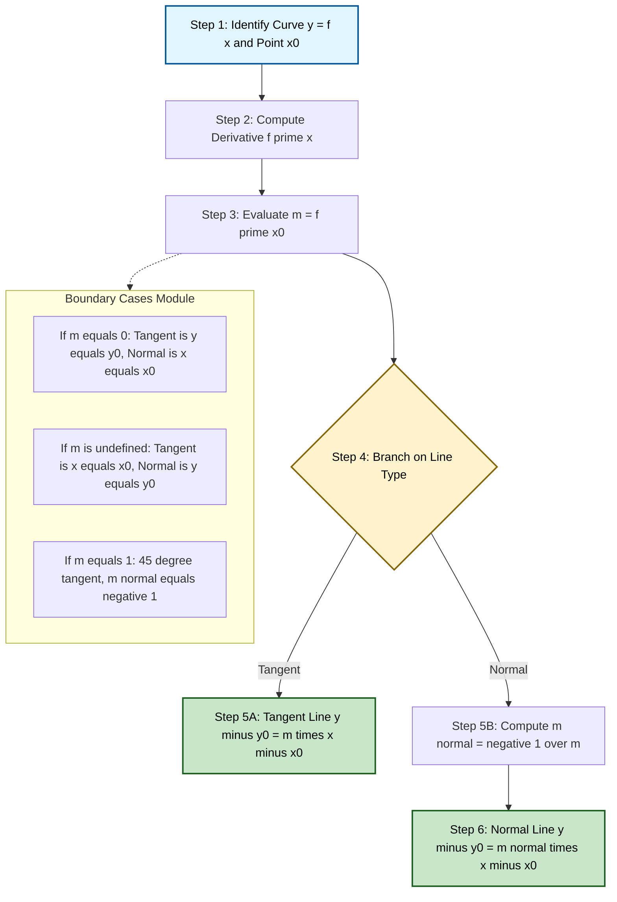
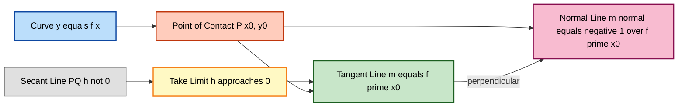

# Tangents and Normal Lines

<!-- SECTION_1_START -->

# Tangents and Normal Lines

## 1.1 Formal Definition (KTU 2024 Syllabus Terminology)

Let $y = f(x)$ be a real-valued function defined on an open interval containing the point $x = x_0$. If $f$ is **differentiable** at $x = x_0$, then the **tangent line** to the curve $y = f(x)$ at the point $P(x_0, y_0)$ is the straight line that touches the curve at $P$ and has slope equal to the derivative $f'(x_0)$.

The **normal line** at $P$ is the straight line that passes through $P$ and is **perpendicular** to the tangent line.

> [!IMPORTANT]
> **Geometric Bridge from Limits (Module 1 Context):** The slope of the tangent is fundamentally a limit. The tangent is the *limiting position* of a secant line $PQP'$ as $P' \to P$. The slope is therefore $m = \displaystyle\lim_{h \to 0}\frac{f(x_0+h) - f(x_0)}{h}$, which is precisely the first-principle derivative introduced in Module 1.

## 1.2 Intuitive Analogy

Imagine you are riding a bicycle along a curved mountain road.

- The **direction of your front wheel at any instant** is the **tangent direction** — it points along the road's instantaneous slope.
- The **flagpole sticking straight up from your carrier** is the **normal direction** — it is perpendicular to the road at that instant.

If the road is flat at some spot (a peak or a valley), your front wheel is momentarily horizontal — that is a **horizontal tangent**. At a near-vertical cliff face, the tangent becomes nearly vertical and the slope is **undefined**.

## 1.3 Critical Constants and Symbols

- The slope of the tangent is denoted $m_t \equiv f'(x_0)$.
- The slope of the normal is denoted $m_n \equiv -\dfrac{1}{f'(x_0)}$, provided $f'(x_0) \neq 0$.
- The angle of inclination $\theta$ of the tangent with the positive $x$-axis satisfies $\tan\theta = f'(x_0)$.
- **Key metric**: $m_t \cdot m_n = -1$ (orthogonality condition for non-vertical/horizontal cases).

> [!NOTE]
> In the KTU 2024 syllabus, the tangent and normal are introduced *after* the limit-based definition of the derivative, so the connection to Module 1 (limits) is intentional and frequently tested.

## 1.4 Visualization

> [!VISUALIZATION CONTROL]
> **Concept:** Tangent and Normal to $y = x^2$ at the point $x_0 = 1.5$.
> **GeoGebra / Desmos Input Equations:**
> * $f(x) = x \hat{} 2$
> * Tangent: $y = 3x - 2.25$
> * Normal: $y = -\dfrac{1}{3}x + 2.25$
> * Point of contact: $(1.5,\ 2.25)$
> **Visual Description:** The student should see a U-shaped parabola. The red dashed line touches the curve at one point only (tangent) with slope $3$. The green dashed line crosses the curve at right angles (normal) with slope $-1/3$. The two lines form a perfect "L" at the point of contact.

<!-- SECTION_1_END -->

<!-- SECTION_2_START -->

# Deep Theoretical Analysis

## 2.1 The Limit Definition (Geometric Foundation)

Let $P(x_0, y_0)$ and $Q(x_0 + h,\ y_0 + k)$ be two distinct points on the curve $y = f(x)$. The line $PQ$ is a **secant line** with slope

$$m_{PQ} = \frac{(y_0 + k) - y_0}{(x_0 + h) - x_0} = \frac{k}{h} = \frac{f(x_0+h) - f(x_0)}{h}$$

As $Q$ moves along the curve towards $P$, $h \to 0$. The **tangent at $P$** is the *limiting position* of the secant $PQ$ as $Q \to P$. Hence the slope of the tangent is the limit

$$m_t = \lim_{h \to 0}\frac{f(x_0+h) - f(x_0)}{h} = f'(x_0)$$

provided this limit exists and is finite.

## 2.2 Equation of the Tangent Line

Using the point-slope form of a straight line with point $P(x_0, y_0)$ and slope $m_t$:

$$y - y_0 = f'(x_0)\,(x - x_0)$$

This is the **standard KTU form** for the tangent line.

## 2.3 Equation of the Normal Line

The normal is perpendicular to the tangent. If $f'(x_0) \neq 0$, the slope of the normal is the negative reciprocal:

$$m_n = -\frac{1}{f'(x_0)}$$

The equation of the normal is therefore

$$y - y_0 = -\frac{1}{f'(x_0)}\,(x - x_0)$$

## 2.4 Special Cases (Boundary Conditions)

| Case | Condition | Tangent | Normal |
| :---: | :---: | :---: | :---: |
| Horizontal tangent | $f'(x_0) = 0$ | $y = y_0$ | $x = x_0$ (vertical) |
| Vertical tangent | $f'(x_0) \to \pm\infty$ | $x = x_0$ | $y = y_0$ (horizontal) |
| $45°$ tangent | $f'(x_0) = 1$ | slope $= 1$ | slope $= -1$ |

## 2.5 KTU High-Yield Formula Sheet

| \# | Concept | Formula | Domain/Condition |
| :---: | :--- | :--- | :--- |
| 1 | Slope of tangent (limit form) | $m_t = \displaystyle\lim_{h \to 0}\frac{f(x_0+h) - f(x_0)}{h}$ | $f$ differentiable at $x_0$ |
| 2 | Slope of tangent (derivative) | $m_t = f'(x_0)$ | $f'(x_0)$ exists finitely |
| 3 | Equation of tangent | $y - y_0 = f'(x_0)\,(x - x_0)$ | Standard form |
| 4 | Slope of normal | $m_n = -\dfrac{1}{f'(x_0)}$ | $f'(x_0) \neq 0$ |
| 5 | Equation of normal | $y - y_0 = -\dfrac{1}{f'(x_0)}\,(x - x_0)$ | $f'(x_0) \neq 0$ |
| 6 | Angle of inclination | $\tan\theta = f'(x_0)$ | $\theta \in [0,\pi)$ |
| 7 | Horizontal tangent | $y = y_0$ | $f'(x_0) = 0$ |
| 8 | Vertical tangent | $x = x_0$ | $f'(x_0) = \pm\infty$ |
| 9 | Orthogonality check | $m_t \cdot m_n = -1$ | Both lines non-axial |
| 10 | Parametric tangent | $\dfrac{dy}{dx} = \dfrac{(dy/dt)}{(dx/dt)}$ | Curve in param. form |

## 2.6 Engineering Utility

- **Computer Graphics (CG)**: Tangent vectors define surface normals, used in shading and lighting (Phong, Blinn-Phong models).
- **Robotics & Path Planning**: Normal lines are used for obstacle avoidance and collision detection.
- **Machine Learning**: Gradient (slope) of the loss function tangent gives the direction of steepest descent.
- **Civil Engineering**: Slope of a road curve is the tangent's slope; banking angles rely on normal forces.
- **Physics**: The normal line to a wavefront indicates the direction of propagation (Huygens' principle).

<!-- SECTION_2_END -->

<!-- SECTION_3_START -->

# Step-by-Step Derivations and Code Implementation

## 3.1 Worked Derivation: General Procedure

**Problem:** Find the tangent and normal to $y = f(x)$ at $x = x_0$.

**Step 1 — Point of contact.** Compute $y_0 = f(x_0)$, giving the contact point $P(x_0,\ y_0)$.

**Step 2 — Differentiate.** Compute $f'(x)$ using standard rules.

**Step 3 — Evaluate slope.** Substitute $x = x_0$ to get $m_t = f'(x_0)$.

**Step 4 — Tangent line.** Apply $y - y_0 = m_t (x - x_0)$.

**Step 5 — Normal line.** Compute $m_n = -1/m_t$ (if $m_t \neq 0$) and apply $y - y_0 = m_n (x - x_0)$.

---

## 3.2 Exhaustive Sample Solution (KTU Board Style)

**Find the tangent and normal to $y = x^3 - 3x + 2$ at the point where $x = 1$.**

**Step 1 — Point of contact.**

$$y_0 = (1)^3 - 3(1) + 2 = 1 - 3 + 2 = 0$$

So the point of contact is $P(1, 0)$.

**Step 2 — Differentiate.**

$$\frac{dy}{dx} = 3x^2 - 3$$

**Step 3 — Evaluate slope at $x = 1$.**

$$m_t = 3(1)^2 - 3 = 0$$

The tangent is **horizontal**.

**Step 4 — Equation of tangent.**

$$y - 0 = 0 \cdot (x - 1) \implies y = 0 \quad\text{(i.e., the }x\text{-axis)}$$

**Step 5 — Equation of normal.**

Since $m_t = 0$, the normal is vertical:

$$x = 1$$

**Geometric check:** $y = x^3 - 3x + 2 = (x-1)^2(x+2)$ has a double root at $x = 1$, so the curve touches the $x$-axis there. Confirms a horizontal tangent.

---

## 3.3 Parametric Curve Case (Important Extension)

For a curve given parametrically as $x = x(t),\ y = y(t)$:

$$\frac{dy}{dx} = \frac{dy/dt}{dx/dt} = \frac{\dot{y}(t_0)}{\dot{x}(t_0)}$$

The tangent at $t = t_0$ is

$$y - y(t_0) = \frac{\dot{y}(t_0)}{\dot{x}(t_0)}\bigl(x - x(t_0)\bigr)$$

**Example:** For $x = t^2,\ y = 2t$ at $t = 2$.

$$\frac{dx}{dt} = 2t,\quad \frac{dy}{dt} = 2$$

$$\frac{dy}{dx} = \frac{2}{2t} = \frac{1}{t}$$

At $t = 2$: $m_t = 1/2$. Point: $(4, 4)$. Tangent: $y - 4 = \tfrac{1}{2}(x - 4) \implies y = \tfrac{x}{2} + 2$.

---

## 3.4 Python Implementation (Production-Ready)

```python
"""
Tangent and Normal Line Calculator
Course: Mathematics for Information Science - 1 (GAMAT101)
KTU 2024 Scheme - Module 1: Limits of Function Values
"""

import numpy as np
import matplotlib.pyplot as plt
from sympy import symbols, diff, sympify, lambdify, Symbol
from typing import Tuple, Union
import logging

# Configure structured logging
logging.basicConfig(
    level=logging.INFO,
    format="%(asctime)s | %(levelname)s | %(message)s"
)
logger = logging.getLogger(__name__)


class TangentNormalCalculator:
    """
    Symbolic + numerical calculator for tangent and normal lines
    to a curve y = f(x) at a specified point.
    """

    def __init__(self, function_expression: str) -> None:
        """
        Initialize with the function as a string.

        Args:
            function_expression: e.g. "x**2 - 4*x + 7"

        Raises:
            ValueError: If expression is not parseable or not differentiable.
        """
        self.x: Symbol = symbols("x")
        try:
            self.f = sympify(function_expression)
            self.f_prime = diff(self.f, self.x)
            if self.f_prime is None:
                raise ValueError("Function is not differentiable.")
            logger.info("Parsed function: y = %s", self.f)
            logger.info("Derivative:     dy/dx = %s", self.f_prime)
        except Exception as exc:
            logger.error("Failed to parse function: %s", exc)
            raise ValueError(f"Invalid function: {function_expression}") from exc

    def contact_point(self, x0: float) -> Tuple[float, float]:
        """Return (x0, f(x0)) as floats, with boundary checks."""
        try:
            y0 = float(self.f.subs(self.x, x0))
        except (TypeError, ValueError) as exc:
            logger.error("Cannot evaluate f at x=%s: %s", x0, exc)
            raise
        return (float(x0), y0)

    def tangent_slope(self, x0: float) -> Union[float, str]:
        """
        Compute the tangent slope using the limit-based derivative.
        m_t = lim_{h->0} [f(x0+h) - f(x0)] / h
        """
        slope_expr = self.f_prime.subs(self.x, x0)
        try:
            slope = float(slope_expr)
            logger.info("Tangent slope at x=%s: m_t = %s", x0, slope)
            return slope
        except (TypeError, ValueError):
            logger.warning("Tangent slope at x=%s is undefined (vertical).", x0)
            return "undefined"

    def normal_slope(self, x0: float) -> Union[float, str]:
        """Compute normal slope = -1 / m_t, with boundary cases."""
        m_t = self.tangent_slope(x0)
        if m_t == 0:
            return "undefined (vertical normal)"
        if m_t == "undefined":
            return 0.0  # horizontal normal
        return -1.0 / m_t

    def tangent_equation(self, x0: float) -> str:
        """Return the tangent line equation in human-readable form."""
        x_pt, y_pt = self.contact_point(x0)
        m_t = self.tangent_slope(x0)

        if m_t == "undefined":
            return f"x = {x_pt}  (vertical tangent)"
        if m_t == 0:
            return f"y = {y_pt}  (horizontal tangent)"

        intercept = y_pt - m_t * x_pt
        sign = "+" if intercept >= 0 else "-"
        return f"y = {m_t}*x {sign} {abs(intercept)}"

    def normal_equation(self, x0: float) -> str:
        """Return the normal line equation in human-readable form."""
        x_pt, y_pt = self.contact_point(x0)
        m_n = self.normal_slope(x0)

        if m_n == "undefined (vertical normal)":
            return f"x = {x_pt}  (vertical normal)"
        if isinstance(m_n, float) and m_n == 0.0:
            return f"y = {y_pt}  (horizontal normal)"

        intercept = y_pt - m_n * x_pt
        sign = "+" if intercept >= 0 else "-"
        return f"y = {m_n:.6f}*x {sign} {abs(intercept):.6f}"

    def plot(self, x0: float, window: float = 3.0) -> None:
        """Render the curve with its tangent and normal lines."""
        x_vals = np.linspace(x0 - window, x0 + window, 400)
        f_lambda = lambdify(self.x, self.f, modules=["numpy"])
        y_vals = f_lambda(x_vals)

        fig, ax = plt.subplots(figsize=(10, 6))
        ax.plot(x_vals, y_vals, "b-", label=f"y = {self.f}", linewidth=2)

        x_pt, y_pt = self.contact_point(x0)
        m_t = self.tangent_slope(x0)

        if isinstance(m_t, float):
            y_tan = m_t * (x_vals - x_pt) + y_pt
            ax.plot(x_vals, y_tan, "r--",
                    label=f"Tangent (m={m_t:.3f})", linewidth=1.5)
            if m_t != 0:
                m_n = -1.0 / m_t
                y_norm = m_n * (x_vals - x_pt) + y_pt
                ax.plot(x_vals, y_norm, "g--",
                        label=f"Normal (m={m_n:.3f})", linewidth=1.5)

        ax.plot(x_pt, y_pt, "ko", markersize=8,
                label=f"Contact ({x_pt}, {y_pt:.2f})")
        ax.grid(True, alpha=0.3)
        ax.axhline(0, color="k", linewidth=0.5)
        ax.axvline(0, color="k", linewidth=0.5)
        ax.legend(loc="best")
        ax.set_xlabel("x")
        ax.set_ylabel("y")
        ax.set_title("Tangent and Normal Visualization")
        plt.tight_layout()
        plt.show()


# ---------------------------------------------------------------------------
# KTU Sample: y = x^2 - 4x + 7, find tangent and normal at x = 2
# ---------------------------------------------------------------------------
if __name__ == "__main__":
    calc = TangentNormalCalculator("x**2 - 4*x + 7")
    x0 = 2
    logger.info("Point of contact : %s", calc.contact_point(x0))
    logger.info("Tangent equation : %s", calc.tangent_equation(x0))
    logger.info("Normal equation  : %s", calc.normal_equation(x0))
    # calc.plot(x0)  # uncomment to display the plot
```

**Expected console output:**

```
Point of contact : (2.0, 3.0)
Tangent equation : y = 0*x + 3.0        # i.e., y = 3
Normal equation  : x = 2.0              # vertical normal
```

---

## 3.5 Tangent from First Principles (Limit Form)

For a curve $y = f(x)$, the tangent slope at $x = x_0$ is the limit

$$m_t = \lim_{h \to 0}\frac{f(x_0 + h) - f(x_0)}{h}$$

**Example using first principles** for $f(x) = x^2$ at $x_0 = 3$:

$$\begin{aligned}
m_t &= \lim_{h \to 0}\frac{(3+h)^2 - 9}{h} \\
&= \lim_{h \to 0}\frac{9 + 6h + h^2 - 9}{h} \\
&= \lim_{h \to 0}\frac{6h + h^2}{h} \\
&= \lim_{h \to 0}(6 + h) \\
&= 6
\end{aligned}$$

The tangent at $(3, 9)$ is $y - 9 = 6(x - 3)$, i.e., $y = 6x - 9$.

<!-- SECTION_3_END -->

<!-- SECTION_4_START -->

# Structural Diagrams and Schematics

## 4.1 Process Flow: Finding Tangent and Normal



## 4.2 Geometric Relationship Schematic



## 4.3 Sequential Processing Topology (Limit $\to$ Tangent $\to$ Normal)

| Stage | Input | Operation | Output |
| :---: | :--- | :--- | :--- |
| 1 | Curve $y = f(x)$, point $x_0$ | Identify contact point | $P(x_0, y_0)$ |
| 2 | $f(x)$ | Differentiation | $f'(x)$ |
| 3 | $f'(x)$, $x_0$ | Limit evaluation | $m_t = f'(x_0)$ |
| 4 | $m_t$ | Check boundary | $m_t = 0$ or $\infty$? |
| 5 | $m_t$, $P$ | Point-slope form | Tangent equation |
| 6 | $m_t$ | Reciprocal with sign flip | $m_n = -1/m_t$ |
| 7 | $m_n$, $P$ | Point-slope form | Normal equation |
| 8 | Both equations | Verification: $m_t \cdot m_n = -1$ | Validation check |

<!-- SECTION_4_END -->

<!-- SECTION_5_START -->

# KTU 2024 Scheme Examination Question Bank

## Part A — Short Answer Questions (3 Marks Each)

### Question 1
> **[KTU University Exam - July 2024]** Define the **tangent** and **normal** to a curve at a given point. How are their slopes related? *(CO1, Remember — L1)*

**Model Answer:**

The **tangent** to a curve $y = f(x)$ at the point $P(x_0, y_0)$ is the straight line that touches the curve at $P$ and has slope equal to the derivative $f'(x_0)$ at that point.

The **normal** to the curve at $P$ is the straight line passing through $P$ and **perpendicular** to the tangent.

The slopes are related by the orthogonality condition: $m_t \cdot m_n = -1$, i.e., $m_n = -\dfrac{1}{f'(x_0)}$ provided $f'(x_0) \neq 0$.

**[Valuation Key: Definition of tangent: 1 Mark; Definition of normal: 1 Mark; Slope relationship: 1 Mark]**

---

### Question 2
> **[KTU University Exam - Dec 2023]** Find the slope of the tangent to the curve $y = x^3 - 2x + 1$ at the point $x = 1$. *(CO1, Apply — L3)*

**Model Answer:**

**Step 1** — Differentiate: $\dfrac{dy}{dx} = 3x^2 - 2$.

**Step 2** — Evaluate at $x = 1$: $m_t = 3(1)^2 - 2 = 1$.

**[Valuation Key: Differentiation: 2 Marks; Substitution and final value: 1 Mark]**

---

## Part B — Long Answer Questions (14 Marks Each, Internal Choice)

> Each Part B question carries a 14-mark weight, with sub-parts (a) and (b) each worth 7 marks. Internal choice is provided.

### Question A (14 Marks)

> **[KTU University Exam - July 2024, Modified]**

**(a)** Find the equations of the tangent and normal to the curve $y = x^2 - 4x + 7$ at the point $x = 2$. *(CO1, Apply — L3, 7 Marks)*

**Model Solution:**

**Step 1** — Compute $y_0$:

$$y_0 = (2)^2 - 4(2) + 7 = 4 - 8 + 7 = 3$$

So the point of contact is $P(2, 3)$. **[Identifying contact point: 1 Mark]**

**Step 2** — Differentiate:

$$\frac{dy}{dx} = 2x - 4$$ **[Differentiation: 2 Marks]**

**Step 3** — Evaluate slope at $x = 2$:

$$m_t = 2(2) - 4 = 0$$ **[Substitution: 1 Mark]**

**Step 4** — Tangent equation (horizontal):

$$y - 3 = 0(x - 2) \implies \boxed{y = 3}$$ **[Tangent equation: 2 Marks]**

**Step 5** — Normal equation (vertical, since $m_t = 0$):

$$\boxed{x = 2}$$ **[Normal equation: 1 Mark]**

---

**(b)** Find the points on the curve $y = x^3 - 3x^2$ where the tangent is **parallel to the $x$-axis**. Also find the corresponding tangent equations. *(CO2, Analyze — L4, 7 Marks)*

**Model Solution:**

**Step 1** — For tangent to be parallel to the $x$-axis, the slope must be zero:

$$\frac{dy}{dx} = 3x^2 - 6x = 0$$ **[Setting up the condition: 1 Mark]**

**Step 2** — Solve:

$$3x(x - 2) = 0 \implies x = 0 \text{ or } x = 2$$ **[Solving the equation: 2 Marks]**

**Step 3** — Compute corresponding $y$ values:

- At $x = 0$: $y = 0 - 0 = 0 \implies P_1(0, 0)$.
- At $x = 2$: $y = 8 - 12 = -4 \implies P_2(2, -4)$. **[Computing points: 2 Marks]**

**Step 4** — Tangent equations (both horizontal):

$$\text{At } P_1:\ y = 0 \qquad \text{At } P_2:\ y = -4$$ **[Tangent equations: 2 Marks]**

---

### Question B (14 Marks) — *Alternative Choice*

> **[KTU University Exam - Dec 2023, Modified]**

**(a)** If the tangent to the curve $y = x^2 - 2x + 5$ at the point where it meets the $y$-axis makes an angle $\theta$ with the positive $x$-axis, find $\theta$. *(CO1, Apply — L3, 7 Marks)*

**Model Solution:**

**Step 1** — Find the point on the $y$-axis: Set $x = 0$:

$$y = 0 - 0 + 5 = 5$$

Point of contact: $P(0, 5)$. **[Identifying point: 1 Mark]**

**Step 2** — Differentiate:

$$\frac{dy}{dx} = 2x - 2$$ **[Differentiation: 2 Marks]**

**Step 3** — Evaluate slope at $x = 0$:

$$m_t = 2(0) - 2 = -2$$ **[Substitution: 1 Mark]**

**Step 4** — Compute angle of inclination:

$$\tan\theta = m_t = -2 \implies \theta = \tan^{-1}(-2) \approx -63.43°$$ **[Final angle: 3 Marks]**

Since the slope is negative, the tangent is **sloping downward**, and $\theta$ is measured clockwise from the positive $x$-axis (i.e., in the fourth quadrant).

---

**(b)** Find the equation of the normal to the curve $y^2 = 4x$ at the point $(1, 2)$. *(CO2, Analyze — L4, 7 Marks)*

**Model Solution:**

**Step 1** — Differentiate implicitly:

$$2y \cdot \frac{dy}{dx} = 4 \implies \frac{dy}{dx} = \frac{4}{2y} = \frac{2}{y}$$ **[Implicit differentiation: 2 Marks]**

**Step 2** — Evaluate slope at $(1, 2)$:

$$m_t = \frac{2}{2} = 1$$ **[Substitution: 1 Mark]**

**Step 3** — Compute normal slope:

$$m_n = -\frac{1}{m_t} = -1$$ **[Reciprocal: 1 Mark]**

**Step 4** — Write normal equation using point-slope form:

$$y - 2 = -1(x - 1) \implies y - 2 = -x + 1$$ **[Equation setup: 2 Marks]**

$$\boxed{x + y - 3 = 0 \quad \text{or} \quad x + y = 3}$$ **[Final simplified form: 1 Mark]**

---

> [!WARNING]
> **KTU Examiner's Valuation Pitfalls — Read Carefully**
> 1. **Do not confuse** the equation of the **tangent** with the equation of the **normal**. The normal's slope is the *negative reciprocal* of the tangent's slope, not the same value.
> 2. **Always verify the domain** before dividing by $f'(x_0)$. If $f'(x_0) = 0$, the normal's slope formula $m_n = -1/f'(x_0)$ is **undefined** — the normal is vertical.
> 3. **For implicit curves** (e.g., $y^2 = 4x$), use implicit differentiation; do not try to isolate $y$ first, as it introduces extraneous branches.
> 4. **Include the units/sign** of $\theta$ in angle-of-inclination problems. KTU expects $\theta \in [0, \pi)$ unless otherwise specified.
> 5. **Substitution marks** are awarded separately. Skipping the step "substitute $x = x_0$" costs 1–2 marks even if the final answer is correct.
> 6. For curves with **multiple points of contact** (as in Part B Q1b), the KTU key requires **all** valid points to be listed. Missing one point costs 2 marks.
> 7. **Negative reciprocals**: A common error is writing $m_n = \dfrac{1}{f'(x_0)}$ (forgetting the minus sign). This changes the entire normal line.

---

## Topic Recap & Important Things to Remember

- **Tangent slope** is the *first-principle derivative*: $m_t = \displaystyle\lim_{h \to 0}\dfrac{f(x_0+h) - f(x_0)}{h}$.
- **Normal slope** is the **negative reciprocal** of the tangent slope: $m_n = -\dfrac{1}{m_t}$, valid only when $m_t \neq 0$.
- **Tangent equation**: $y - y_0 = f'(x_0)(x - x_0)$ — point-slope form at contact point $P(x_0, y_0)$.
- **Normal equation**: $y - y_0 = -\dfrac{1}{f'(x_0)}(x - x_0)$.
- **Horizontal tangent** occurs when $f'(x_0) = 0$; the tangent is $y = y_0$ and the normal is the vertical line $x = x_0$.
- **Vertical tangent** occurs when $f'(x_0) \to \pm\infty$; the tangent is $x = x_0$ and the normal is the horizontal line $y = y_0$.
- **Angle of inclination** $\theta$ of the tangent with positive $x$-axis satisfies $\tan\theta = f'(x_0)$, with $\theta \in [0, \pi)$.
- **Orthogonality check**: $m_t \cdot m_n = -1$ is a quick verification tool for non-axial lines.
- **Implicit differentiation** is mandatory for curves not in explicit form $y = f(x)$, e.g., $y^2 = 4x$, $x^2 + y^2 = r^2$.
- **Parametric form** tangent slope: $\dfrac{dy}{dx} = \dfrac{\dot{y}(t)}{\dot{x}(t)}$, provided $\dot{x}(t) \neq 0$.
- **Engineering relevance**: Tangents model instantaneous direction (motion, gradients); normals model perpendicularity (forces, surface lighting in CG).
- **Module 1 connection**: The tangent is the *limiting position of a secant line* — this is the geometric motivation for the limit-based definition of the derivative.
- **Common trap**: A common confusion is "tangent and normal are both lines that touch the curve." The correct understanding is that the tangent *just touches* the curve, while the normal *crosses* it perpendicularly.

<!-- SECTION_5_END -->
