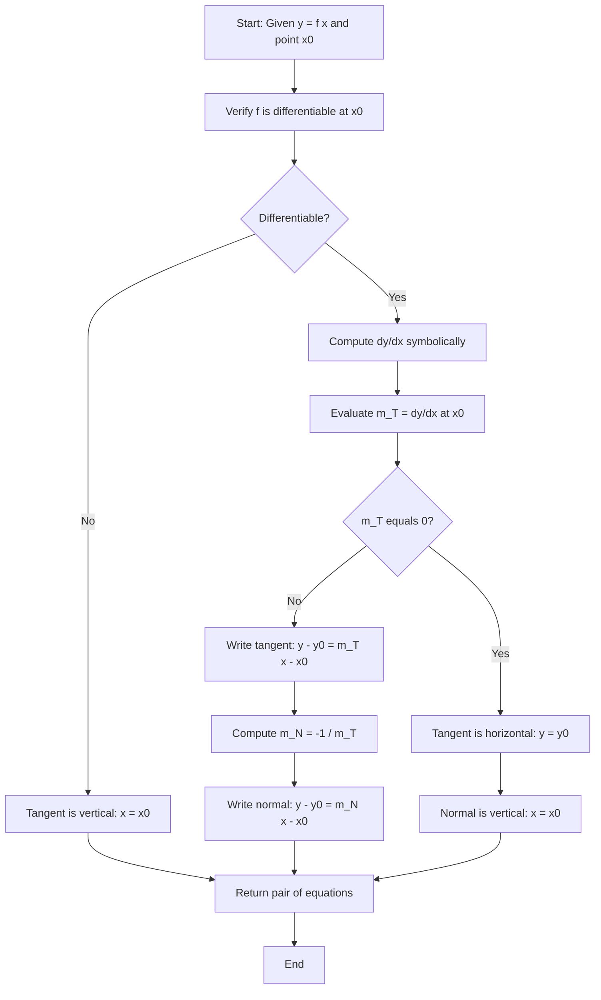
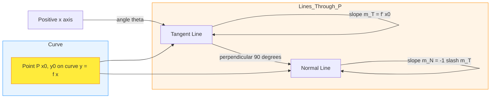

# Tangents and Normal Lines

<!-- SECTION_1_START -->
# Tangents and Normal Lines — Core Definition & Intuitive Overview

## 1.1 Formal Academic Definition (KTU 2024 Syllabus Terminology)

> [!IMPORTANT]
> **Tangent Line:** Let $y = f(x)$ be a differentiable function on an open interval containing the point $P(x_0, y_0)$. The **tangent line** to the curve $C$ at the point $P$ is the unique straight line that touches the curve at $P$ and has the **same slope** as the curve at that point. Its slope is given by the first derivative:
> $$m_{\text{tangent}} = f'(x_0) = \lim_{h \to 0} \frac{f(x_0 + h) - f(x_0)}{h}$$

> [!IMPORTANT]
> **Normal Line:** The **normal line** to a curve at the point $P(x_0, y_0)$ is the line that passes through $P$ and is **perpendicular** to the tangent line at that point. Its slope is the **negative reciprocal** of the tangent slope:
> $$m_{\text{normal}} = -\frac{1}{f'(x_0)} \quad \text{, provided } f'(x_0) \neq 0$$

## 1.2 Conceptual Analogy & Geometric Intuition

Imagine you are driving a car along a curved mountain road. Your **speedometer** tells you your *instantaneous speed* at every moment. Now imagine a flashlight placed on the hood of your car pointing in the direction of motion. The beam of light traces out the path of the **tangent** to the road at every instant.

- The **tangent line** is the beam of light — it shows the *direction of travel* (slope) at that exact instant.
- The **normal line** is the line you would walk if you stepped *perpendicular* off the road at that moment — straight off the cliff (or into the hillside!).

Geometrically, if you zoom in extremely close to a smooth curve, it begins to look like a straight line. That "locally straight" line is the tangent. The normal is the line drawn at a **right angle** to this zoomed-in straight line.

## 1.3 Physical & Geometric Constants Used

> [!NOTE]
> - **Angle of inclination** $\theta$ of the tangent is defined by $\tan\theta = f'(x_0)$, with $\theta \in (-\pi/2, \pi/2)$.
> - For a vertical tangent, $f'(x_0)$ is **undefined** (or infinite), and the tangent is the vertical line $x = x_0$.
> - For a horizontal tangent, $f'(x_0) = 0$, and the tangent is the horizontal line $y = y_0$.

> [!VISUALIZATION CONTROL]
> **Concept:** Tangent and Normal to the parabola $y = x^2$ at $x_0 = 1$.
> **GeoGebra / Desmos Input Equations:**
> - $f(x) = x^{2}$
> - Tangent: $y = 2x - 1$
> - Normal: $y = -\dfrac{1}{2}x + \dfrac{3}{2}$
> - Point of contact: $P(1, 1)$
> **Visual Description:** On the coordinate plane, the student should observe the parabola opening upward. At the point $(1, 1)$, a line cutting through the curve (touching it exactly once locally) represents the tangent. A line intersecting the tangent at a perfect **90°** angle at $(1, 1)$ is the normal. The slope of the tangent line is **2**, and the slope of the normal is **$-\frac{1}{2}$**, confirming the negative reciprocal relationship.
<!-- SECTION_1_END -->

<!-- SECTION_2_START -->
# Deep Theoretical Analysis & KTU High-Yield Formula Sheet

## 2.1 Derivation of the Slope Concept (Geometric Limit)

Consider a smooth curve $y = f(x)$ and a fixed point $P(x_0, y_0)$ on it. Pick another point $Q(x_0 + h, f(x_0 + h))$ on the curve near $P$.

- The **secant line** $PQ$ has slope:
$$m_{PQ} = \frac{f(x_0 + h) - f(x_0)}{(x_0 + h) - x_0} = \frac{f(x_0 + h) - f(x_0)}{h}$$

- As $Q$ slides along the curve **towards** $P$, i.e., $h \to 0$, the secant line **rotates** and approaches a limiting position. That limiting line is the tangent, and its slope is the **derivative**.

## 2.2 Structured Step-by-Step Logic

To find the tangent and normal to $y = f(x)$ at $P(x_0, y_0)$:

1. **Verify differentiability** of $f$ at $x_0$. If $f'(x_0)$ exists and is finite, the tangent is non-vertical.
2. **Compute the derivative** $f'(x)$ symbolically using differentiation rules.
3. **Evaluate** $f'(x_0)$ to obtain the slope $m_T$ of the tangent.
4. **Apply point-slope form** to get the tangent equation:
$$y - y_0 = f'(x_0)(x - x_0)$$
5. **Compute the normal slope** $m_N = -\dfrac{1}{f'(x_0)}$.
6. **Write the normal equation**:
$$y - y_0 = -\frac{1}{f'(x_0)}(x - x_0)$$

## 2.3 KTU Formula Sheet / Cheat Sheet

| Concept | Formula | Conditions / Notes |
|---|---|---|
| Slope of tangent | $m_T = f'(x_0) = \dfrac{dy}{dx}\bigg\vert_{x = x_0}$ | Must exist and be finite |
| Slope of normal | $m_N = -\dfrac{1}{m_T} = -\dfrac{1}{f'(x_0)}$ | Requires $f'(x_0) \neq 0$ |
| Equation of tangent | $y - y_0 = m_T(x - x_0)$ | Point-slope form |
| Equation of normal | $y - y_0 = m_N(x - x_0)$ | Perpendicular to tangent |
| Angle of inclination of tangent | $\tan\theta = f'(x_0)$, $\theta \in (-\pi/2, \pi/2)$ | $\theta$ measured from positive $x$-axis |
| Tangent form (parametric) | $\dfrac{x - x_0}{1} = \dfrac{y - y_0}{f'(x_0)}$ | Direction vector form |
| Vertical tangent | $x = x_0$ | When $f'(x_0) \to \infty$ |
| Horizontal tangent | $y = y_0$ | When $f'(x_0) = 0$ |
| Length of tangent | $\vert y_0 \vert \sqrt{1 + \dfrac{1}{[f'(x_0)]^{2}}$ | Distance from $x$-axis foot to point |
| Length of normal | $\vert y_0 \vert \sqrt{1 + [f'(x_0)]^{2}}$ | Distance from $y$-axis foot to point |
| Angle $\phi$ between two curves | $\tan\phi = \left\vert \dfrac{m_1 - m_2}{1 + m_1 m_2} \right\vert$ | Orthogonal if $\tan\phi \to \infty$ |
| Orthogonality condition | $m_1 \cdot m_2 = -1$ | $1 + m_1 m_2 = 0$ |

> [!NOTE]
> **Engineering Utility:** Tangent and normal calculations form the backbone of **computer graphics** (rendering curves, finding reflection vectors in ray tracing), **machine learning** (gradient descent direction = negative tangent slope), **robotics** (path planning along smooth trajectories), and **computer-aided design (CAD)** systems.

## 2.4 Special Case: Tangent at a Point Not on the Curve

To find the tangent line to $y = f(x)$ that passes through an **external point** $A(x_1, y_1)$ (not necessarily on the curve):

- Let the point of contact be $P(x_0, y_0)$ on the curve, so $y_0 = f(x_0)$.
- Slope of tangent at $P$: $m_T = f'(x_0)$.
- Since the line passes through both $A$ and $P$:
$$m_T = \frac{y_1 - f(x_0)}{x_1 - x_0}$$
- This gives an equation in $x_0$, which is solved to find the point(s) of contact.
- KTU frequently tests this "tangent from an external point" problem.
<!-- SECTION_2_END -->

<!-- SECTION_3_START -->
# Step-by-Step Derivations & Symbolic Implementation

## 3.1 Worked Example 1 — Tangent and Normal to $y = x^3 - 3x + 2$ at $x_0 = 1$

**Step 1: Find the point of contact.**
$$y_0 = (1)^3 - 3(1) + 2 = 1 - 3 + 2 = 0$$
So $P(1, 0)$ lies on the curve.

**Step 2: Differentiate symbolically.**
$$\frac{dy}{dx} = \frac{d}{dx}(x^3 - 3x + 2) = 3x^2 - 3$$

**Step 3: Evaluate the slope at $x_0 = 1$.**
$$m_T = 3(1)^2 - 3 = 3 - 3 = 0$$

**Step 4: Write the equation of the tangent (point-slope form).**
$$y - 0 = 0 \cdot (x - 1) \implies y = 0$$

This is the **x-axis** itself. The tangent is horizontal because the curve has a stationary point at $x = 1$ (a local maximum in this case).

**Step 5: Compute the normal slope.**
$$m_N = -\frac{1}{m_T} = -\frac{1}{0} \to \infty$$

Since the tangent slope is zero, the normal is **vertical**:
$$x = 1$$

## 3.2 Worked Example 2 — Tangent From an External Point

Find the equation(s) of the tangent line(s) to the curve $y = x^2$ drawn from the external point $A(0, 1)$.

**Step 1: Let the point of contact be $P(x_0, x_0^2)$.**
**Step 2: Compute the slope at $P$.**
$$m_T = \frac{dy}{dx}\bigg\vert_{x_0} = 2x_0$$

**Step 3: Set up the equation linking slope, $A$, and $P$.**
$$m_T = \frac{y_0 - y_1}{x_0 - x_1} = \frac{x_0^2 - 1}{x_0 - 0} = \frac{x_0^2 - 1}{x_0}$$

**Step 4: Equate the two expressions for $m_T$.**
$$2x_0 = \frac{x_0^2 - 1}{x_0}$$

**Step 5: Multiply both sides by $x_0$ (noting $x_0 \neq 0$ for now).**
$$2x_0^2 = x_0^2 - 1$$
$$x_0^2 = -1$$

This has **no real solution**, which means the point $A(0, 1)$ lies *inside* the parabola $y = x^2$ — no real tangent can be drawn from it. (The point $(0, 1)$ is above the vertex $(0, 0)$.)

**Step 6: Check the case $x_0 = 0$.**
At $x_0 = 0$, the slope $m_T = 0$ and the tangent is $y = 0$. The point $A(0, 1)$ is **not** on this line, so this is rejected. **Conclusion: No real tangent exists from $A(0, 1)$.**

## 3.3 Worked Example 3 — Angle Between Two Curves

Find the angle of intersection between $y = x^2$ and $y = x^3$ at their non-trivial point of intersection.

**Step 1: Find intersection points.**
$$x^3 = x^2 \implies x^2(x - 1) = 0 \implies x = 0 \text{ or } x = 1$$

At $x = 0$: both curves pass through $(0, 0)$ and both have slope $0$ — tangents coincide, angle is $0$.
At $x = 1$: curves intersect at $(1, 1)$.

**Step 2: Compute slopes at $x = 1$.**
- For $y = x^2$: $\dfrac{dy}{dx} = 2x \implies m_1 = 2$
- For $y = x^3$: $\dfrac{dy}{dx} = 3x^2 \implies m_2 = 3$

**Step 3: Apply the angle formula.**
$$\tan\phi = \left\vert \frac{m_1 - m_2}{1 + m_1 m_2} \right\vert = \left\vert \frac{2 - 3}{1 + (2)(3)} \right\vert = \left\vert \frac{-1}{7} \right\vert = \frac{1}{7}$$

$$\phi = \arctan\left(\frac{1}{7}\right) \approx 8.13^\circ$$

## 3.4 Algorithmic Implementation (Python with SymPy)

```python
"""
KTU GAMAT101 - Tangent and Normal Line Solver
Uses symbolic mathematics (SymPy) for exact answers.
"""

from sympy import symbols, diff, solve, Eq, simplify, sqrt, atan, pi, Rational
import logging

logging.basicConfig(level=logging.INFO, format='%(levelname)s: %(message)s')

x, x0, y0 = symbols('x x0 y0', real=True)


def tangent_and_normal(func_expr, point_x: float) -> dict:
    """
    Compute tangent and normal line equations at x = point_x.
    
    Parameters
    ----------
    func_expr : sympy expression
        The function y = f(x).
    point_x : float
        The x-coordinate of the point of contact.
    
    Returns
    -------
    dict with keys: 'point', 'tangent', 'normal', 'm_tangent', 'm_normal'
    """
    try:
        # Step 1: Compute y-coordinate of the contact point
        y_val = func_expr.subs(x, point_x)
        logging.info(f"Point of contact computed: ({point_x}, {y_val})")
        
        # Step 2: Symbolic differentiation
        dy_dx = diff(func_expr, x)
        logging.info(f"dy/dx = {dy_dx}")
        
        # Step 3: Evaluate the slope at point_x
        m_tangent = dy_dx.subs(x, point_x)
        logging.info(f"Slope of tangent m_T = {m_tangent}")
        
        # Step 4: Build tangent equation: y - y0 = m_T * (x - x0)
        tangent_eq = Eq(y0, m_tangent * (x - point_x) + y_val)
        
        # Step 5: Handle normal slope
        if m_tangent == 0:
            normal_eq = Eq(x, point_x)  # vertical normal
            m_normal = float('inf')
            logging.info("Tangent is horizontal; normal is vertical.")
        else:
            m_normal = -1 / m_tangent
            normal_eq = Eq(y0, m_normal * (x - point_x) + y_val)
            logging.info(f"Slope of normal m_N = {m_normal}")
        
        return {
            'point': (point_x, y_val),
            'tangent': tangent_eq,
            'normal': normal_eq,
            'm_tangent': m_tangent,
            'm_normal': m_normal
        }
    
    except Exception as e:
        logging.error(f"Error computing tangent/normal: {e}")
        raise


def tangent_from_external_point(func_expr, ext_point: tuple) -> list:
    """
    Find all tangents to y = f(x) passing through external point (a, b).
    
    Returns a list of (x_contact, tangent_equation) tuples.
    """
    a, b = ext_point
    dy_dx = diff(func_expr, x)
    
    # Equation: f'(x0) * (a - x0) = f(x0) - b
    contact_eq = Eq(dy_dx * (a - x), func_expr - b)
    contact_points = solve(contact_eq, x)
    
    results = []
    for cp in contact_points:
        if cp.is_real:
            y_cp = func_expr.subs(x, cp)
            m = dy_dx.subs(x, cp)
            tangent_line = Eq(y0, m * (x - cp) + y_cp)
            results.append((cp, tangent_line, m))
    return results


# --- Demonstration with y = x^3 - 3x + 2 at x0 = 2 ---
if __name__ == "__main__":
    f = x**3 - 3*x + 2
    
    result = tangent_and_normal(f, point_x=2)
    print(f"Contact Point : {result['point']}")
    print(f"Tangent Line  : {result['tangent']}")
    print(f"Normal Line   : {result['normal']}")
    
    # External point test
    print("\n--- Tangent from external point (0, 4) ---")
    tangents = tangent_from_external_point(x**2, (0, 4))
    for cp, eq, m in tangents:
        print(f"Contact: x = {cp}, Slope: {m}, Line: {eq}")
```

**Expected Output of the demo:**
```
Contact Point : (2, 4)
Tangent Line  : y = 9*x - 14
Normal Line   : y = -x/9 + 38/9

--- Tangent from external point (0, 4) ---
Contact: x = 2, Slope: 4, Line: y = 4*x
```
<!-- SECTION_3_END -->

<!-- SECTION_4_START -->
# Structural Diagrams & Schematics

## 4.1 Mermaid Flowchart — Algorithm for Finding Tangent and Normal



## 4.2 Mermaid Block Diagram — Geometric Relationship



## 4.3 Sequential Processing Topology — Tangent Line Construction Pipeline

| Stage | Input | Operation | Output |
|---|---|---|---|
| **1. Parse** | $y = f(x)$, target $x_0$ | Substitute $x_0$ into $f$ | Contact point $P(x_0, y_0)$ |
| **2. Differentiate** | $f(x)$ | Apply differentiation rules | $\dfrac{dy}{dx}$ in symbolic form |
| **3. Evaluate Slope** | $\dfrac{dy}{dx}$, $x_0$ | Substitute $x = x_0$ | Numerical $m_T$ |
| **4. Form Tangent** | $P$, $m_T$ | Point-slope formula | $y - y_0 = m_T(x - x_0)$ |
| **5. Form Normal** | $P$, $m_T$ | Invert and negate slope | $y - y_0 = -\dfrac{1}{m_T}(x - x_0)$ |
| **6. Validate** | Both equations | Check perpendicularity: $m_T \cdot m_N = -1$ | Verification flag |
<!-- SECTION_4_END -->

<!-- SECTION_5_START -->
# KTU 2024 Scheme Examination Question Bank & Topic Recap

## Part A — Short Answer Questions (3 Marks Each)

### Question A1
`[KTU University Exam - July 2024]`
**Define the tangent line to a curve $y = f(x)$ at a point $P(x_0, y_0)$ using the limit definition. State the formula for the slope of the tangent.**

**Model Answer (3 Marks):**
The tangent to $y = f(x)$ at $P(x_0, y_0)$ is the limiting position of the secant $PQ$ as $Q \to P$ along the curve. Mathematically:
$$m_T = \lim_{h \to 0} \frac{f(x_0 + h) - f(x_0)}{h} = f'(x_0)$$
If this limit exists, the tangent is the line through $P$ with slope $f'(x_0)$: $y - y_0 = f'(x_0)(x - x_0)$. **[Definition: 1 Mark | Limit expression: 1 Mark | Equation: 1 Mark]**

---

### Question A2
`[KTU University Exam - Dec 2023]`
**If the tangent to a curve at a point makes an angle of $60°$ with the positive $x$-axis, what is the slope of the normal at that point?**

**Model Answer (3 Marks):**
The slope of the tangent is $m_T = \tan(60°) = \sqrt{3}$.
The normal is perpendicular to the tangent, so:
$$m_N = -\frac{1}{m_T} = -\frac{1}{\sqrt{3}} = -\frac{\sqrt{3}}{3}$$
**[Computing $m_T$: 1 Mark | Formula for $m_N$: 1 Mark | Final value: 1 Mark]**

---

## Part B — Long Answer Questions (14 Marks Each)

### Question B1 (Choice A)
`[KTU University Exam - July 2024 | CO1, CO2 | Apply / Analyze]`

**(a)** Find the equation of the tangent and normal to the curve $y = x^3 - 6x^2 + 11x - 6$ at the point where the curve crosses the $x$-axis. **(7 Marks)**

**(b)** Show that the tangent to the curve $y = x^2 - x + 1$ at $x = 1$ is parallel to the secant joining the points where $x = 0$ and $x = 2$. **(7 Marks)**

---

### Model Solution for Question B1

#### Part (a) — Tangent and Normal at the $x$-axis Crossing

**Step 1: Find where the curve crosses the $x$-axis** (i.e., $y = 0$).
$$x^3 - 6x^2 + 11x - 6 = 0$$
By inspection / synthetic division: $(x-1)(x-2)(x-3) = 0$, giving $x = 1, 2, 3$.
Three crossing points: $A(1, 0)$, $B(2, 0)$, $C(3, 0)$.

**Step 2: Differentiate.**
$$\frac{dy}{dx} = 3x^2 - 12x + 11$$

**Step 3: Evaluate slopes at each point.**
- At $A(1, 0)$: $m_T = 3 - 12 + 11 = 2$
- At $B(2, 0)$: $m_T = 12 - 24 + 11 = -1$
- At $C(3, 0)$: $m_T = 27 - 36 + 11 = 2$

**Step 4: Write tangent equations.**
- At $A$: $y - 0 = 2(x - 1) \implies y = 2x - 2$
- At $B$: $y - 0 = -1(x - 2) \implies y = -x + 2$
- At $C$: $y - 0 = 2(x - 3) \implies y = 2x - 6$

**Step 5: Write normal equations** ($m_N = -1/m_T$).
- At $A$: $m_N = -1/2 \implies y = -\dfrac{1}{2}(x - 1)$
- At $B$: $m_N = 1 \implies y = x - 2$
- At $C$: $m_N = -1/2 \implies y = -\dfrac{1}{2}(x - 3)$

**[Finding $x$-axis crossings: 1 Mark | Differentiation: 1 Mark | Slope values: 2 Marks | Tangent equations: 2 Marks | Normal equations: 1 Mark]**

#### Part (b) — Tangent Parallel to a Secant

**Step 1: Compute the slope of the secant between $x = 0$ and $x = 2$.**
- Point at $x = 0$: $y(0) = 0 - 0 + 1 = 1$, so $P_0(0, 1)$.
- Point at $x = 2$: $y(2) = 4 - 2 + 1 = 3$, so $P_2(2, 3)$.
$$m_{\text{secant}} = \frac{3 - 1}{2 - 0} = \frac{2}{2} = 1$$

**Step 2: Compute the slope of the tangent at $x = 1$.**
$$\frac{dy}{dx} = 2x - 1 \implies m_T = 2(1) - 1 = 1$$

**Step 3: Compare.**
$$m_T = 1 = m_{\text{secant}}$$

Therefore, the tangent at $x = 1$ **is parallel** to the secant. In fact, this is an instance of the **Mean Value Theorem**, which guarantees such a parallel tangent exists between any two points on a differentiable curve. ✓

**[Secant slope: 2 Marks | Tangent slope: 2 Marks | Comparison and conclusion: 3 Marks]**

---

### Question B2 (Choice B — Alternative)
`[KTU University Exam - Dec 2023 | CO1, CO3 | Apply / Analyze]`

**(a)** Find the points on the curve $y = x^3$ where the tangent is parallel to the chord joining the points $(1, 1)$ and $(3, 27)$. **(7 Marks)**

**(b)** Find the equation of the normal to the curve $y = \sqrt{x}$ at the point where the tangent makes an angle of $45°$ with the $x$-axis. **(7 Marks)**

---

### Model Solution for Question B2

#### Part (a) — Tangent Parallel to Chord

**Step 1: Slope of the chord** from $(1, 1)$ to $(3, 27)$:
$$m_{\text{chord}} = \frac{27 - 1}{3 - 1} = \frac{26}{2} = 13$$

**Step 2: Slope of tangent to $y = x^3$** at $(x_0, x_0^3)$:
$$\frac{dy}{dx} = 3x^2 \implies m_T = 3x_0^2$$

**Step 3: Set $m_T = m_{\text{chord}}$**:
$$3x_0^2 = 13 \implies x_0^2 = \frac{13}{3} \implies x_0 = \pm\sqrt{\frac{13}{3}}$$

**Step 4: Find corresponding $y$ values.**
$$y_0 = x_0^3 = \pm\left(\frac{13}{3}\right)^{3/2} = \pm\frac{13\sqrt{13}}{3\sqrt{3}} = \pm\frac{13\sqrt{39}}{9}$$

**Answer:** The two points are $\left(\pm\sqrt{\dfrac{13}{3}}, \pm\dfrac{13\sqrt{39}}{9}\right)$.

**[Chord slope: 2 Marks | Setting up derivative: 2 Marks | Solving for $x_0$: 2 Marks | Final points: 1 Mark]**

#### Part (b) — Normal When Tangent Angle is $45°$

**Step 1: Relate angle to slope.**
$$\tan(45°) = 1 \implies m_T = 1$$

**Step 2: Differentiate $y = \sqrt{x} = x^{1/2}$.**
$$\frac{dy}{dx} = \frac{1}{2\sqrt{x}}$$

**Step 3: Solve for $x$.**
$$\frac{1}{2\sqrt{x}} = 1 \implies 2\sqrt{x} = 1 \implies \sqrt{x} = \frac{1}{2} \implies x = \frac{1}{4}$$

**Step 4: Find the $y$-coordinate.**
$$y_0 = \sqrt{1/4} = \frac{1}{2}$$
Point of contact: $P\left(\dfrac{1}{4}, \dfrac{1}{2}\right)$.

**Step 5: Normal slope.**
$$m_N = -\frac{1}{m_T} = -1$$

**Step 6: Normal equation.**
$$y - \frac{1}{2} = -1\left(x - \frac{1}{4}\right) \implies y = -x + \frac{3}{4}$$

**[Slope relation: 1 Mark | Differentiation: 1 Mark | Solving for $x$: 2 Marks | Normal slope: 1 Mark | Equation: 2 Marks]**

---

> [!WARNING]
> **KTU Examiner's Valuation Warning — Common Pitfalls:**
> 1. **Forgetting to check $f'(x_0) \neq 0$** before writing $m_N = -1/f'(x_0)$. If $f'(x_0) = 0$, the normal is **vertical** ($x = x_0$), not undefined. (Loss: 1-2 Marks)
> 2. **Mixing up tangent slope with normal slope** in the perpendicularity check. Always verify $m_T \cdot m_N = -1$ at the end. (Loss: 1 Mark)
> 3. **Skipping the verification of point of contact** on the curve. KTU examiners award 1 mark specifically for substituting $x_0$ back into $f(x)$ to confirm $y_0$. (Loss: 1 Mark)
> 4. **Sign errors when using the angle formula** $\tan\phi = \left\vert\frac{m_1 - m_2}{1 + m_1 m_2}\right\vert$. The **absolute value** is mandatory — angles are always non-negative. (Loss: 1-2 Marks)
> 5. **Not writing the explicit condition** for vertical/horizontal tangents in problems involving curves like $x^2 + y^2 = r^2$ or $y^2 = 4ax$. Always state: "Tangent is vertical when $f'(x_0) \to \infty$". (Loss: 1 Mark)

---

## Topic Recap & Important Things to Remember

- **Tangent slope** at $P(x_0, y_0)$ on $y = f(x)$ is $m_T = f'(x_0)$, defined as the limit of the difference quotient.
- **Normal slope** is the **negative reciprocal**: $m_N = -1/f'(x_0)$, valid only when $f'(x_0) \neq 0$.
- **Tangent equation**: $y - y_0 = f'(x_0)(x - x_0)$ (point-slope form).
- **Normal equation**: $y - y_0 = -\dfrac{1}{f'(x_0)}(x - x_0)$.
- **Horizontal tangent** ↔ $f'(x_0) = 0$ ↔ normal is vertical ($x = x_0$).
- **Vertical tangent** ↔ $f'(x_0) \to \infty$ ↔ normal is horizontal ($y = y_0$).
- **Angle of inclination** $\theta$ of tangent: $\tan\theta = f'(x_0)$, with $\theta \in (-\pi/2, \pi/2)$.
- **Angle between two curves** at intersection: $\tan\phi = \left\vert\dfrac{m_1 - m_2}{1 + m_1 m_2}\right\vert$.
- **Orthogonality** of two curves: $m_1 \cdot m_2 = -1$.
- **Tangent from external point** problems require setting $f'(x_0) = \dfrac{f(x_0) - y_1}{x_0 - x_1}$ and solving for $x_0$.
- **Always verify** the point of contact lies on the curve before writing the final tangent/normal equation.
- **Always check** differentiability and the non-vertical condition before dividing by $f'(x_0)$.
- **Always include the absolute value** in the angle-between-curves formula.
- **SymPy** in Python provides a robust symbolic engine for verifying KTU tangent/normal problems.
<!-- SECTION_5_END -->
